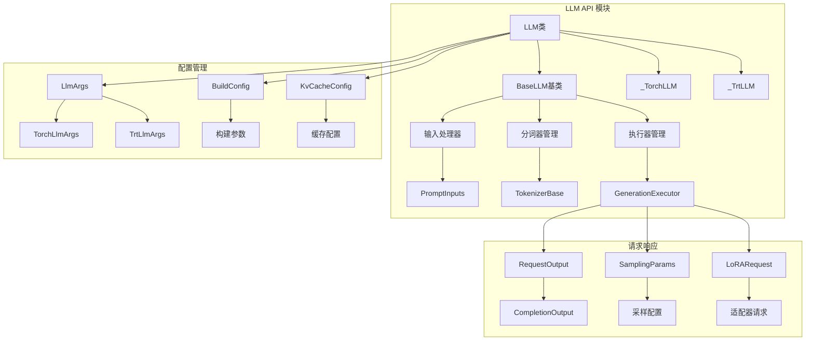
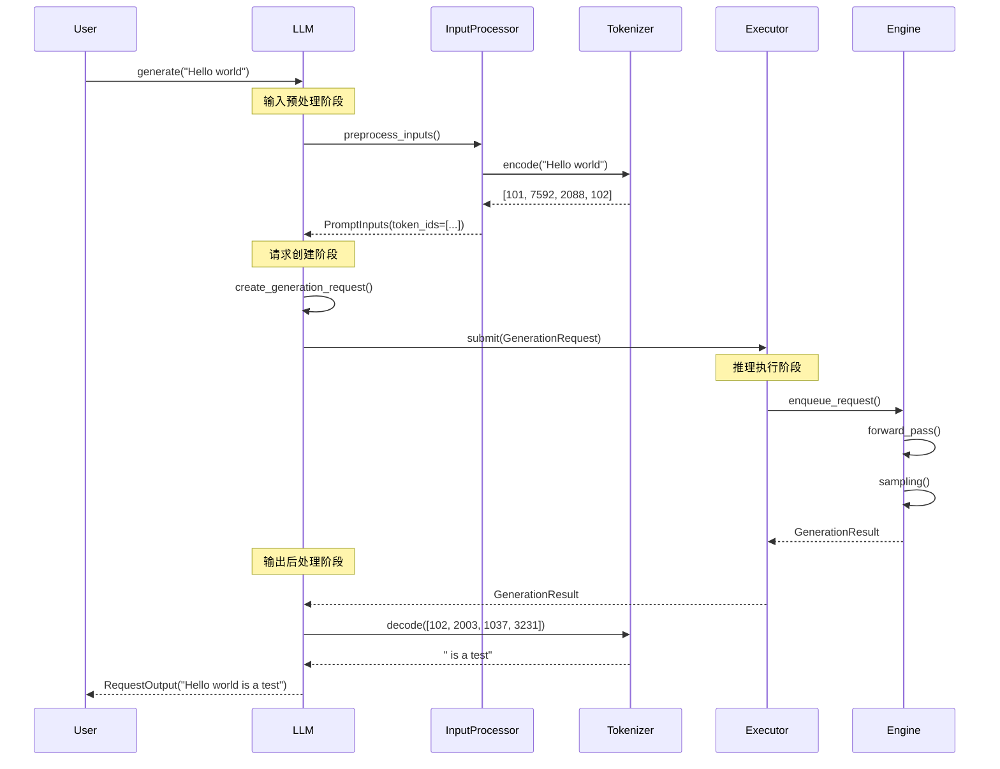
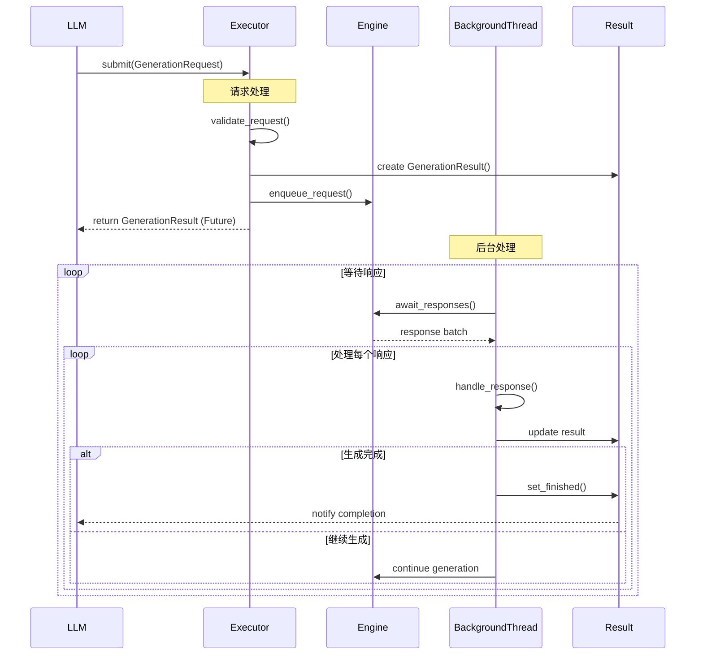
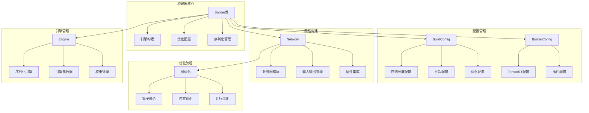
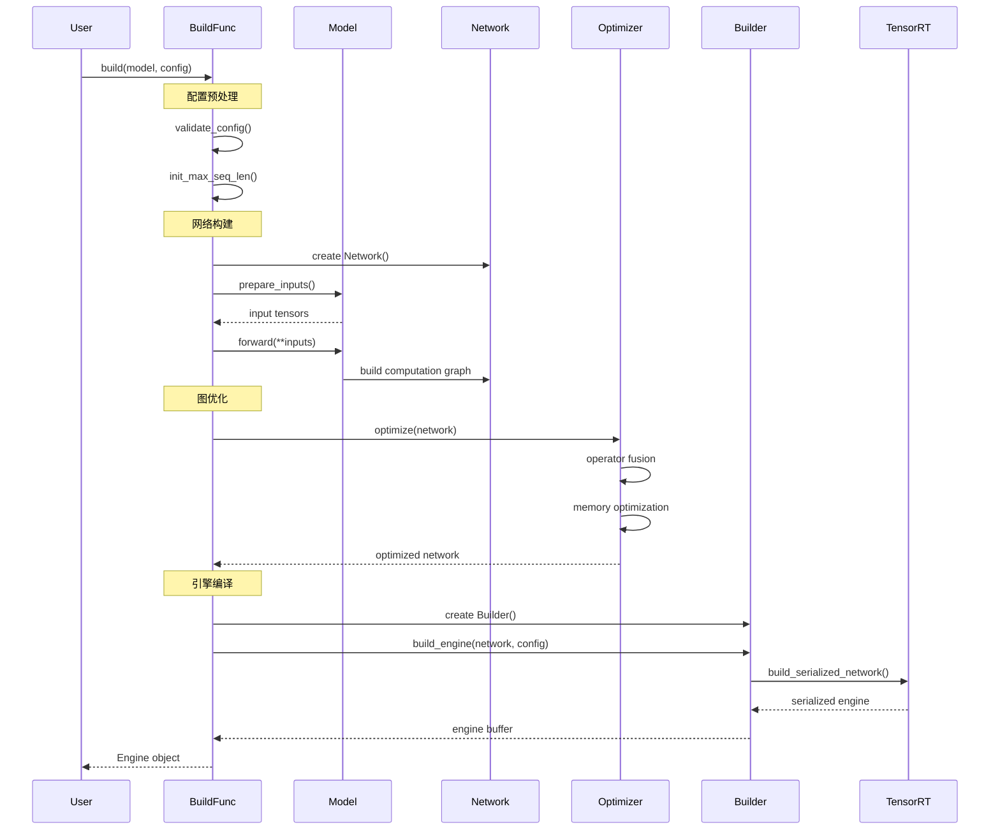
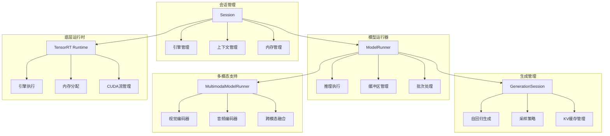
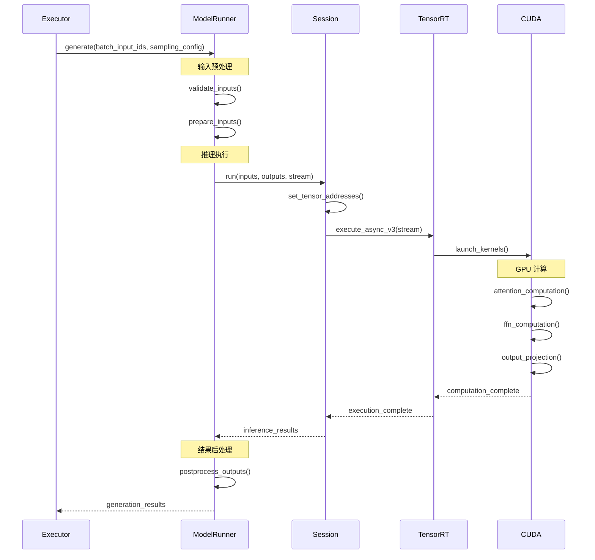
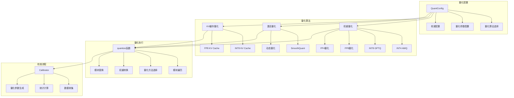
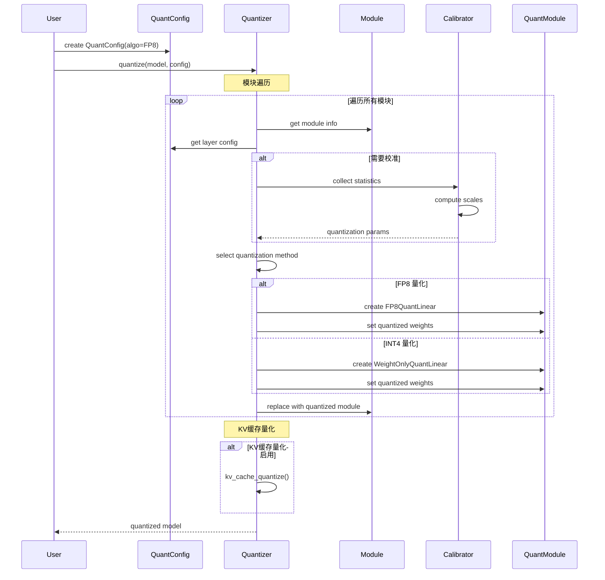

# TensorRT-LLM 模块深度分析

## 1. LLM API 模块

### 1.1 模块架构图



### 1.2 核心类实现分析

#### BaseLLM 基类

**位置**: `tensorrt_llm/llmapi/llm.py:108-766`

```python
class BaseLLM:
    """所有 LLM 类的基类，提供核心功能和接口"""

    def __init__(self, **kwargs):
        """
        初始化基类

        核心功能:
        1. 参数解析和验证
        2. 执行器类型选择
        3. MPI 会话管理
        4. 分词器初始化
        """
        # 执行器类选择
        self._executor_cls = kwargs.pop("executor_cls", GenerationExecutor)
        self._llm_id = None

        # 日志级别管理
        log_level = logger.level
        logger.set_level("info")

        # 参数解析
        self.args = self._parse_llm_args(**kwargs)

        # 分词器初始化
        if not self.args.skip_tokenizer_init:
            self._tokenizer = self._load_tokenizer()

        # 执行器初始化
        self._init_executor()

        # 注册清理函数
        import weakref
        weakref.finalize(self, self._shutdown_wrapper, weakref.ref(self))

    def _parse_llm_args(self, **kwargs) -> BaseLlmArgs:
        """解析和验证 LLM 参数"""
        # 参数类型推导
        if 'backend' in kwargs:
            backend = kwargs['backend']
        else:
            # 根据模型路径推导后端类型
            backend = self._infer_backend(kwargs.get('model'))

        # 创建对应的参数对象
        if backend == 'pytorch':
            return TorchLlmArgs(**kwargs)
        elif backend == 'tensorrt':
            return TrtLlmArgs(**kwargs)
        else:
            raise ValueError(f"Unsupported backend: {backend}")

    def _init_executor(self):
        """初始化执行器"""
        # 多 GPU 场景下创建 MPI 会话
        if self.args.tensor_parallel_size > 1:
            self.mpi_session = MpiCommSession(
                n_workers=self.args.tensor_parallel_size,
                gpus_per_node=self.args.gpus_per_node
            )

        # 创建执行器
        self._executor = GenerationExecutor.create(
            engine=self._prepare_engine(),
            executor_config=self._create_executor_config(),
            model_world_size=self.args.tensor_parallel_size,
            mpi_session=getattr(self, 'mpi_session', None),
            tokenizer=self._tokenizer,
            llm_args=self.args
        )
```

#### generate() 方法深度分析

```python
def generate(self, inputs, sampling_params=None, **kwargs):
    """
    生成文本的核心方法

    执行流程:
    1. 输入预处理和验证
    2. 采样参数处理
    3. 请求创建和提交
    4. 结果收集和后处理
    5. 输出格式化
    """

    # 1. 输入预处理
    processed_inputs = self._preprocess_inputs(inputs)

    # 2. 采样参数处理
    if sampling_params is None:
        sampling_params = SamplingParams()
    processed_sampling_params = self._process_sampling_params(sampling_params)

    # 3. 创建生成请求
    requests = []
    for i, input_data in enumerate(processed_inputs):
        request = GenerationRequest(
            prompt_token_ids=input_data.token_ids,
            sampling_params=processed_sampling_params[i] if isinstance(processed_sampling_params, list) else processed_sampling_params,
            lora_request=kwargs.get('lora_request'),
            prompt_adapter_request=kwargs.get('prompt_adapter_request')
        )
        requests.append(request)

    # 4. 提交请求并收集结果
    if self._is_streaming_request(kwargs):
        return self._generate_streaming(requests, **kwargs)
    else:
        return self._generate_non_streaming(requests, **kwargs)

def _generate_non_streaming(self, requests, use_tqdm=True):
    """非流式生成实现"""

    # 提交所有请求
    futures = []
    for request in requests:
        future = self._executor.submit(request)
        futures.append(future)

    # 等待所有结果
    results = []
    for future in tqdm(futures, desc="Generating", disable=not use_tqdm):
        try:
            result = future.result()  # 阻塞等待
            results.append(result)
        except Exception as e:
            logger.error(f"Generation failed: {e}")
            raise

    # 转换为输出格式
    outputs = []
    for result in results:
        output = RequestOutput(
            request_id=result.request_id,
            prompt=result.prompt,
            outputs=[CompletionOutput(
                index=0,
                text=result.text,
                token_ids=result.token_ids,
                cumulative_logprob=result.cumulative_logprob,
                logprobs=result.logprobs,
                finish_reason=result.finish_reason
            )],
            finished=result.finished
        )
        outputs.append(output)

    return outputs[0] if len(outputs) == 1 else outputs
```

### 1.3 时序图分析



## 2. 执行器模块 (Executor)

### 2.1 模块架构图

```mermaid
graph TB
    subgraph "执行器抽象层"
        A[GenerationExecutor] --> B[抽象接口定义]
        A --> C[公共功能实现]
    end

    subgraph "代理执行器"
        D[GenerationExecutorProxy] --> E[多进程管理]
        D --> F[进程间通信]
        D --> G[负载均衡]
    end

    subgraph "工作执行器"
        H[GenerationExecutorWorker] --> I[推理引擎管理]
        H --> J[请求处理]
        H --> K[结果返回]
    end

    subgraph "基础工作器"
        L[BaseWorker] --> M[引擎设置]
        L --> N[后处理管理]
        L --> O[错误处理]
    end

    subgraph "支撑组件"
        P[IPC队列] --> Q[进程间消息传递]
        R[ManagedThread] --> S[后台任务管理]
        T[PostprocWorker] --> U[后处理并行化]
    end

    A <|-- D
    A <|-- H
    H --|> L
    D --> P
    H --> R
    H --> T
```

### 2.2 GenerationExecutor 抽象基类

**位置**: `tensorrt_llm/executor/executor.py:78-407`

```python
class GenerationExecutor(ABC):
    """生成执行器抽象基类"""

    def __init__(self,
                 num_postprocess_workers: int = 0,
                 postprocess_tokenizer_dir: Optional[str] = None,
                 is_llm_executor: Optional[bool] = None):
        """
        初始化执行器基类

        功能组件:
        1. 后处理工作器配置
        2. 结果队列管理
        3. 错误处理机制
        4. 客户端ID管理
        """

        # 后处理配置
        self.postproc_config = PostprocWorkerConfig(
            num_postprocess_workers=num_postprocess_workers,
            postprocess_tokenizer_dir=postprocess_tokenizer_dir
        )

        # 结果队列
        self.kv_events_queues = IterationResultQueue()
        self.stats_queues = IterationResultQueue()

        # 错误处理
        self._error_queue = Queue()
        self.doing_shutdown = False

        # 客户端管理
        self._last_client_id: int = 1

        # 注册清理函数
        atexit.register(self.shutdown)

    @abstractmethod
    def submit(self, request: GenerationRequest) -> GenerationResult:
        """提交生成请求 - 抽象方法"""
        pass

    @abstractmethod
    def abort_request(self, request_id: int) -> None:
        """中止请求 - 抽象方法"""
        pass

    def generate_async(self, **kwargs) -> GenerationResult:
        """异步生成方法"""
        # 创建生成请求
        request = GenerationRequest(
            client_id=self._get_next_client_id(),
            prompt_token_ids=kwargs['prompt_token_ids'],
            sampling_params=kwargs['sampling_params'],
            lora_request=kwargs.get('lora_request'),
            streaming=kwargs.get('streaming', False),
            arrival_time=kwargs.get('arrival_time', time.time())
        )

        # 提交请求
        return self.submit(request)

    def _get_next_client_id(self) -> int:
        """获取下一个客户端ID"""
        client_id = self._last_client_id
        self._last_client_id += 1
        return client_id

    @staticmethod
    def create(**kwargs) -> Union["GenerationExecutorProxy", "GenerationExecutorWorker"]:
        """工厂方法创建执行器实例"""
        from .proxy import GenerationExecutorProxy
        from .worker import GenerationExecutorWorker

        world_size = kwargs.get('world_size', 0)
        model_world_size = kwargs.get('model_world_size', 1)

        # 根据世界大小选择执行器类型
        if world_size > 1 and world_size >= model_world_size:
            # 多进程模式
            return GenerationExecutorProxy.create(**kwargs)
        else:
            # 单进程模式
            return GenerationExecutorWorker(**kwargs)
```

### 2.3 GenerationExecutorWorker 详细实现

**位置**: `tensorrt_llm/executor/worker.py:41-91`

```python
class GenerationExecutorWorker(BaseWorker):
    """
    执行器工作进程实现，负责实际的模型推理

    继承关系:
    GenerationExecutor (抽象基类)
        ↓
    BaseWorker (基础工作器)
        ↓
    GenerationExecutorWorker (具体实现)

    核心功能:
    1. 推理引擎管理和初始化
    2. 多线程后台任务处理
    3. 请求提交和结果收集
    4. 错误处理和资源清理
    """

    class WorkerExit(GeneratorExit):
        """工作进程退出异常"""
        pass

    def __init__(
        self,
        engine: Union[Path, Engine],
        executor_config: Optional[tllm.ExecutorConfig] = None,
        batched_logits_processor: Optional[BatchedLogitsProcessor] = None,
        postproc_worker_config: Optional[PostprocWorkerConfig] = None,
        is_llm_executor: Optional[bool] = None,
        lora_config: Optional[LoraConfig] = None,
        kv_connector_config: Optional[KvCacheConnectorConfig] = None,
        hf_model_dir: Optional[Path] = None,
        tokenizer: Optional[TokenizerBase] = None,
        llm_args: Optional[BaseLlmArgs] = None,
    ) -> None:
        """
        初始化工作执行器

        参数说明:
        - engine: TensorRT引擎路径或Engine对象
        - executor_config: 执行器配置，包含批次大小、序列长度等
        - batched_logits_processor: 批量logits后处理器
        - postproc_worker_config: 后处理工作器配置
        - is_llm_executor: 标识是否为LLM执行器实例
        - lora_config: LoRA适配器配置
        - kv_connector_config: KV缓存连接器配置
        - hf_model_dir: HuggingFace模型目录
        - tokenizer: 分词器实例
        - llm_args: LLM参数配置
        """

        # 调用父类初始化
        super().__init__(
            engine=engine,
            executor_config=executor_config,
            batched_logits_processor=batched_logits_processor,
            postproc_worker_config=postproc_worker_config,
            is_llm_executor=is_llm_executor,
            lora_config=lora_config,
            kv_connector_config=kv_connector_config,
            hf_model_dir=hf_model_dir,
            tokenizer=tokenizer,
            llm_args=llm_args,
        )

        # 设置推理引擎
        self.setup_engine()

        # 初始化后台线程管理器
        self._init_background_threads()

    def _init_background_threads(self):
        """
        初始化后台线程

        线程说明:
        1. await_response_thread: 监听推理引擎响应
        2. dispatch_stats_thread: 分发统计信息
        3. dispatch_kv_cache_events_thread: 分发KV缓存事件
        """

        # 响应等待线程 - 核心线程，处理推理结果
        self.await_response_thread = ManagedThread(
            self.await_response_task,
            error_queue=self._error_queue,
            name="await_response_thread"
        )

        # 统计分发线程 - 处理性能统计信息
        self.dispatch_stats_thread = ManagedThread(
            self.dispatch_stats_task,
            error_queue=self._error_queue,
            name="dispatch_stats_thread"
        )

        # KV缓存事件分发线程 - 处理缓存事件
        self.dispatch_kv_cache_events_thread = ManagedThread(
            self.dispatch_kv_cache_events_task,
            error_queue=self._error_queue,
            name="dispatch_kv_cache_events_thread"
        )

    def await_response_task(self) -> bool:
        """
        等待推理响应的后台任务

        功能说明:
        1. 持续监听引擎响应
        2. 调用通用响应处理助手
        3. 处理异常和错误情况
        4. 支持优雅关闭

        Returns:
            bool: 任务是否成功完成
        """
        return self._await_response_helper()

    def dispatch_stats_task(self) -> bool:
        """
        分发统计信息任务

        功能说明:
        1. 合并迭代统计和请求统计
        2. 调用通用迭代结果处理
        3. 提供性能监控数据

        Returns:
            bool: 任务是否成功
        """

        # 定义统计合并函数
        def join_iteration_and_request_stats(iteration_stats):
            """合并迭代统计和请求统计"""
            if not iteration_stats:
                return iteration_stats

            # 获取请求统计
            request_stats_result = self.engine.get_latest_request_stats()
            request_stats = (request_stats_result
                           if request_stats_result is not None
                           else [])

            # 合并统计数据
            return iteration_stats + request_stats

        # 调用通用处理方法
        return self._iteration_result_task(
            self.stats_queues,
            self.engine.get_latest_iteration_stats,
            self._iter_stats_result,
            join_iteration_and_request_stats
        )

    def dispatch_kv_cache_events_task(self) -> bool:
        """
        分发KV缓存事件任务

        功能说明:
        1. 获取KV缓存事件
        2. 分发到事件队列
        3. 支持缓存管理和监控

        Returns:
            bool: 任务是否成功
        """
        return self._iteration_result_task(
            self.kv_events_queues,
            self.engine.get_latest_kv_cache_events,
            self._iter_kv_events_result,
            lambda x: x  # 直接返回，不需要额外处理
        )
```

### 2.4 执行器时序图



## 3. 构建器模块 (Builder)

### 3.1 模块架构图



### 3.2 Builder 类实现

**位置**: `tensorrt_llm/builder.py:108-478`

```python
class Builder:
    """TensorRT 引擎构建器"""

    _ALLOWED_PRECISIONS = [
        'float32', 'float16', 'bfloat16', 'int8', 'fp8'
    ]

    def __init__(self):
        """初始化构建器"""
        # 创建 TensorRT 构建器
        self._trt_builder = trt.Builder(logger.trt_logger)

        # 时序缓存
        self._timing_cache = None

        # 构建统计
        self._build_stats = {}

    def build_engine(self,
                     network: Network,
                     builder_config: BuilderConfig,
                     managed_weights: dict = None) -> trt.IHostMemory:
        """
        构建 TensorRT 引擎

        Args:
            network: TensorRT-LLM 网络对象
            builder_config: 构建配置
            managed_weights: 托管权重字典

        Returns:
            序列化的 TensorRT 引擎

        构建流程:
        1. 配置验证和设置
        2. 优化配置文件添加
        3. 权重处理
        4. 引擎构建
        5. 序列化返回
        """

        logger.info("Starting TensorRT engine build...")
        build_start_time = time.time()

        # 1. 配置设置
        builder_config.plugin_config = network.plugin_config
        builder_config.auto_parallel_config = network.auto_parallel_config

        # 2. 添加优化配置文件
        if builder_config.trt_builder_config.num_optimization_profiles == 0:
            self._add_optimization_profile(network, builder_config)

        logger.info(f"Total optimization profiles: {builder_config.trt_builder_config.num_optimization_profiles}")

        # 3. 权重重命名（如果需要）
        if network.named_parameters is not None:
            logger.info("Renaming weights for TensorRT compatibility...")
            self._rename_weights(network, managed_weights)

        # 4. 设置时序缓存
        if builder_config.input_timing_cache:
            self._load_timing_cache(builder_config.input_timing_cache)

        # 5. 构建引擎
        logger.info("Building TensorRT engine...")
        engine_build_start = time.time()

        serialized_engine = self._trt_builder.build_serialized_network(
            network.trt_network,
            builder_config.trt_builder_config
        )

        if serialized_engine is None:
            raise RuntimeError("Failed to build TensorRT engine")

        engine_build_time = time.time() - engine_build_start
        total_build_time = time.time() - build_start_time

        logger.info(f"Engine build time: {engine_build_time:.2f}s")
        logger.info(f"Total build time: {total_build_time:.2f}s")

        # 6. 保存时序缓存
        if builder_config.output_timing_cache:
            self._save_timing_cache(builder_config.output_timing_cache)

        return serialized_engine

    def _add_optimization_profile(self, network: Network, builder_config: BuilderConfig):
        """添加优化配置文件"""

        # 创建优化配置文件
        profile = self._trt_builder.create_optimization_profile()

        # 为每个输入张量设置形状范围
        for input_name in network.get_input_names():
            input_shape = network.get_input_shape(input_name)

            # 计算形状范围
            min_shape = self._compute_min_shape(input_name, input_shape, builder_config)
            opt_shape = self._compute_opt_shape(input_name, input_shape, builder_config)
            max_shape = self._compute_max_shape(input_name, input_shape, builder_config)

            logger.debug(f"Input {input_name}: min={min_shape}, opt={opt_shape}, max={max_shape}")

            # 设置形状范围
            profile.set_shape(input_name, min_shape, opt_shape, max_shape)

        # 验证配置文件
        if not profile.is_valid():
            raise RuntimeError("Invalid optimization profile")

        # 添加到构建配置
        builder_config.trt_builder_config.add_optimization_profile(profile)

    def _compute_min_shape(self, input_name: str, input_shape: List[int], config: BuilderConfig) -> List[int]:
        """计算最小输入形状"""
        min_shape = list(input_shape)

        if 'input_ids' in input_name:
            min_shape[0] = 1  # min batch size
            min_shape[1] = 1  # min sequence length
        elif 'attention_mask' in input_name:
            min_shape[0] = 1
            min_shape[1] = 1
        elif 'position_ids' in input_name:
            min_shape[0] = 1
            min_shape[1] = 1

        return min_shape

    def _compute_opt_shape(self, input_name: str, input_shape: List[int], config: BuilderConfig) -> List[int]:
        """计算最优输入形状"""
        opt_shape = list(input_shape)

        if 'input_ids' in input_name:
            opt_shape[0] = config.opt_batch_size
            opt_shape[1] = config.max_input_len // 2
        elif 'attention_mask' in input_name:
            opt_shape[0] = config.opt_batch_size
            opt_shape[1] = config.max_input_len // 2

        return opt_shape

    def _compute_max_shape(self, input_name: str, input_shape: List[int], config: BuilderConfig) -> List[int]:
        """计算最大输入形状"""
        max_shape = list(input_shape)

        if 'input_ids' in input_name:
            max_shape[0] = config.max_batch_size
            max_shape[1] = config.max_input_len
        elif 'attention_mask' in input_name:
            max_shape[0] = config.max_batch_size
            max_shape[1] = config.max_seq_len

        return max_shape
```

### 3.3 build() 函数深度分析

**位置**: `tensorrt_llm/builder.py:1106-1402`

```python
def build(model: PretrainedModel, build_config: BuildConfig) -> Engine:
    """
    从模型和配置构建引擎

    Args:
        model: 预训练模型对象
        build_config: 构建配置

    Returns:
        构建好的引擎对象

    构建流程:
    1. 配置预处理
    2. 网络构建
    3. 图优化
    4. 自动并行
    5. 引擎编译
    """

    logger.info(f"Building {model.config.architecture} engine...")
    total_start_time = time.time()

    # 1. 配置预处理
    build_config = copy.deepcopy(build_config)
    build_config.plugin_config.dtype = model.config.dtype
    build_config.update_kv_cache_type(model.config.architecture)

    # 初始化最大序列长度
    _init_max_seq_len(model.config, build_config)

    # 验证配置兼容性
    _validate_build_config(model.config, build_config)

    # 2. 网络构建阶段
    logger.info("Building network...")
    network_start_time = time.time()

    # 创建网络对象
    network = Network()
    network.plugin_config = build_config.plugin_config

    # 设置网络上下文
    with net_guard(network):
        # 准备输入参数
        prepare_input_args = {
            'max_batch_size': build_config.max_batch_size,
            'max_input_len': build_config.max_input_len,
            'max_seq_len': build_config.max_seq_len,
            'max_beam_width': build_config.max_beam_width,
            'max_num_tokens': build_config.max_num_tokens,
            'opt_batch_size': build_config.opt_batch_size,
            'opt_num_tokens': build_config.opt_num_tokens,
        }

        # 特殊配置处理
        if build_config.speculative_decoding_mode != SpeculativeDecodingMode.NONE:
            prepare_input_args['max_draft_len'] = build_config.max_draft_len
            prepare_input_args['spec_decoding_is_generation_length_variable'] = True

        # 准备模型输入
        inputs = model.prepare_inputs(**prepare_input_args)

        # 前向传播构建计算图
        model(**inputs)

        # 标记调试输出（如果启用）
        if build_config.enable_debug_output:
            for name, tensor in model.named_network_outputs():
                network._mark_output(tensor, name, str_dtype_to_trt(model.config.dtype))

    network_build_time = time.time() - network_start_time
    logger.info(f"Network build time: {network_build_time:.2f}s")

    # 3. 图优化阶段
    if model.config.architecture != "DecoderModel":
        logger.info("Optimizing network...")
        optimize_start_time = time.time()

        optimize(network)

        optimize_time = time.time() - optimize_start_time
        logger.info(f"Network optimization time: {optimize_time:.2f}s")

    # 4. 自动并行处理
    use_auto_parallel = build_config.auto_parallel_config.enabled
    if use_auto_parallel:
        logger.info("Applying auto parallel...")
        auto_parallel_start_time = time.time()

        config = build_config.auto_parallel_config
        config.builder_flags = builder_config.trt_builder_config.flags

        sharded_networks = auto_parallel(network, config)
        network = sharded_networks[model.config.mapping.rank]

        if not config.debug_mode:
            mapping = network.auto_parallel_config["mapping"]
            model.config.mapping = mapping

        auto_parallel_time = time.time() - auto_parallel_start_time
        logger.info(f"Auto parallel time: {auto_parallel_time:.2f}s")

    # 5. 网络可视化（如果启用）
    if build_config.visualize_network:
        logger.info(f"Saving network visualization to {build_config.visualize_network}")
        network.save_visualization(build_config.visualize_network)

    # 6. 创建构建器配置
    builder_config = BuilderConfig.from_build_config(build_config)

    # 7. 引擎编译
    logger.info("Compiling TensorRT engine...")
    compile_start_time = time.time()

    builder = Builder()
    engine_buffer = builder.build_engine(network, builder_config)

    compile_time = time.time() - compile_start_time
    logger.info(f"Engine compilation time: {compile_time:.2f}s")

    # 8. 创建引擎对象
    engine = Engine(
        config=model.config,
        engine_buffer=engine_buffer
    )

    total_time = time.time() - total_start_time
    logger.info(f"Total build time: {total_time:.2f}s")

    return engine
```

### 3.4 构建器时序图



## 4. 运行时模块 (Runtime)

### 4.1 模块架构图



### 4.2 Session 类实现

**位置**: `tensorrt_llm/runtime/session.py:83-303`

```python
class Session:
    """TensorRT 运行时会话管理器"""

    def __init__(self, **kwargs):
        """使用静态方法创建会话"""
        pass

    def _init(self, engine_buffer=None):
        """
        初始化会话

        功能:
        1. 创建 TensorRT 运行时
        2. 反序列化引擎
        3. 创建执行上下文
        4. 设置优化配置文件
        """

        # 1. 创建 TensorRT 运行时
        self._runtime = trt.Runtime(logger.trt_logger)

        # 2. 反序列化引擎
        if engine_buffer is not None:
            self._engine = self.runtime.deserialize_cuda_engine(engine_buffer)
            if self._engine is None:
                raise RuntimeError("Failed to deserialize TensorRT engine")

        # 3. 创建执行上下文
        self._context = None
        if not self.engine.streamable_weights_size:
            self.__prepare_execution_contexts()

        return self

    def __prepare_execution_contexts(self):
        """准备执行上下文"""

        # 创建执行上下文
        self._context = self.engine.create_execution_context()
        if self._context is None:
            raise RuntimeError("Failed to create execution context")

        # 设置优化配置文件
        with _scoped_stream() as stream:
            success = self._context.set_optimization_profile_async(0, stream)
            if not success:
                raise RuntimeError("Failed to set optimization profile")

            # 同步等待设置完成
            stream.synchronize()

    @staticmethod
    def from_serialized_engine(engine_buffer) -> 'Session':
        """从序列化引擎创建会话"""
        session = Session()
        return session._init(engine_buffer)

    @staticmethod
    def from_engine(engine: trt.ICudaEngine) -> 'Session':
        """从现有引擎创建会话"""
        session = Session()
        session.engine = engine
        return session._init()

    @property
    def engine(self) -> trt.ICudaEngine:
        """获取 TensorRT 引擎"""
        return self._engine

    @engine.setter
    def engine(self, engine: trt.ICudaEngine):
        """设置 TensorRT 引擎"""
        self._engine = engine

    @property
    def context(self) -> trt.IExecutionContext:
        """获取执行上下文"""
        if self._context is None:
            raise RuntimeError("Execution context not initialized")
        return self._context

    def run(self,
            inputs: Dict[str, Any],
            outputs: Dict[str, Any],
            stream,
            context=None) -> bool:
        """
        运行推理

        Args:
            inputs: 输入张量字典 {name: tensor}
            outputs: 输出张量字典 {name: tensor}
            stream: CUDA 流
            context: 执行上下文（可选）

        Returns:
            是否成功入队执行

        执行流程:
        1. 设置输入张量地址
        2. 设置输出张量地址
        3. 异步执行推理
        """

        # 使用默认上下文（如果未指定）
        if context is None:
            context = self.context

        # 设置输入张量地址
        for tensor_name, tensor in inputs.items():
            if isinstance(tensor, torch.Tensor):
                ptr = tensor.data_ptr()
            else:
                ptr = tensor

            context.set_tensor_address(tensor_name, ptr)

        # 设置输出张量地址
        for tensor_name, tensor in outputs.items():
            if isinstance(tensor, torch.Tensor):
                ptr = tensor.data_ptr()
            else:
                ptr = tensor

            context.set_tensor_address(tensor_name, ptr)

        # 异步执行推理
        success = context.execute_async_v3(stream)

        return success

    def set_weight_streaming(self, gpu_weights_percent: float):
        """设置权重流式传输"""
        if not self.engine.streamable_weights_size:
            logger.warning("Engine does not support weight streaming")
            return

        try:
            # 计算 GPU 权重预算
            total_weights_size = self.engine.streamable_weights_size
            gpu_weights_budget = int(total_weights_size * gpu_weights_percent)

            # 设置权重流式预算
            self.engine.weight_streaming_budget_v2 = gpu_weights_budget

            # 重新创建执行上下文
            self.__prepare_execution_contexts()

            logger.info(f"Weight streaming enabled: {gpu_weights_percent*100:.1f}% on GPU")

        except Exception as e:
            logger.error(f"Failed to set weight streaming: {e}")
            raise
```

### 4.3 ModelRunner 类实现

**位置**: `tensorrt_llm/runtime/model_runner.py:515+`

```python
class ModelRunner(ModelRunnerMixin):
    """模型运行器，封装推理执行逻辑"""

    def __init__(self,
                 session: Session,
                 max_batch_size: int,
                 max_input_len: int,
                 max_seq_len: int,
                 max_beam_width: int = 1,
                 lora_config: Optional[LoraConfig] = None,
                 **kwargs):
        """
        初始化模型运行器

        Args:
            session: TensorRT 会话
            max_batch_size: 最大批次大小
            max_input_len: 最大输入长度
            max_seq_len: 最大序列长度
            max_beam_width: 最大束搜索宽度
        """

        self.session = session
        self.max_batch_size = max_batch_size
        self.max_input_len = max_input_len
        self.max_seq_len = max_seq_len
        self.max_beam_width = max_beam_width

        # 创建 CUDA 流
        self.stream = torch.cuda.Stream()

        # 初始化缓冲区
        self._init_buffers()

        # 初始化 KV 缓存
        self._init_kv_cache()

        # LoRA 配置
        self.lora_config = lora_config
        if lora_config:
            self._init_lora_weights()

    def _init_buffers(self):
        """初始化推理缓冲区"""

        # 输入缓冲区
        self.input_ids = torch.zeros(
            (self.max_batch_size, self.max_input_len),
            dtype=torch.int32,
            device='cuda'
        )

        self.input_lengths = torch.zeros(
            (self.max_batch_size,),
            dtype=torch.int32,
            device='cuda'
        )

        self.position_ids = torch.zeros(
            (self.max_batch_size, self.max_input_len),
            dtype=torch.int32,
            device='cuda'
        )

        # 输出缓冲区
        self.output_ids = torch.zeros(
            (self.max_batch_size, self.max_beam_width, self.max_seq_len),
            dtype=torch.int32,
            device='cuda'
        )

        self.sequence_lengths = torch.zeros(
            (self.max_batch_size, self.max_beam_width),
            dtype=torch.int32,
            device='cuda'
        )

        # Logits 缓冲区（如果需要）
        if self.gather_all_token_logits:
            vocab_size = self.session.engine.get_tensor_shape('logits')[-1]
            self.logits = torch.zeros(
                (self.max_batch_size, self.max_seq_len, vocab_size),
                dtype=torch.float32,
                device='cuda'
            )

    def _init_kv_cache(self):
        """初始化 KV 缓存"""

        # 获取 KV 缓存配置
        kv_cache_config = self._get_kv_cache_config()

        if kv_cache_config.cache_type == KVCacheType.PAGED:
            # 分页 KV 缓存
            self._init_paged_kv_cache(kv_cache_config)
        else:
            # 连续 KV 缓存
            self._init_continuous_kv_cache(kv_cache_config)

    def generate(self,
                 batch_input_ids: torch.Tensor,
                 sampling_config: SamplingConfig,
                 prompt_table: Optional[torch.Tensor] = None,
                 tasks: Optional[torch.Tensor] = None,
                 lora_uids: Optional[torch.Tensor] = None,
                 **kwargs) -> Dict[str, torch.Tensor]:
        """
        生成文本

        Args:
            batch_input_ids: 批次输入 token IDs [batch_size, input_len]
            sampling_config: 采样配置
            prompt_table: 提示表（可选）
            tasks: 任务 ID（可选）
            lora_uids: LoRA UID（可选）

        Returns:
            生成结果字典

        执行流程:
        1. 输入预处理
        2. 准备推理输入
        3. 执行推理
        4. 结果后处理
        """

        # 1. 输入预处理
        batch_size = batch_input_ids.shape[0]
        input_lengths = self._get_input_lengths(batch_input_ids)

        # 验证输入尺寸
        if batch_size > self.max_batch_size:
            raise ValueError(f"Batch size {batch_size} exceeds maximum {self.max_batch_size}")

        # 2. 准备推理输入
        inputs = self._prepare_inputs(
            batch_input_ids=batch_input_ids,
            input_lengths=input_lengths,
            sampling_config=sampling_config,
            prompt_table=prompt_table,
            tasks=tasks,
            lora_uids=lora_uids
        )

        # 3. 执行推理
        outputs = self._run_inference(inputs, batch_size)

        # 4. 结果后处理
        results = self._postprocess_outputs(outputs, batch_size, input_lengths)

        return results

    def _run_inference(self, inputs: Dict[str, torch.Tensor], batch_size: int) -> Dict[str, torch.Tensor]:
        """执行推理"""

        # 分配输出缓冲区
        outputs = self._allocate_output_buffers(batch_size)

        # 在 CUDA 流上执行
        with torch.cuda.stream(self.stream):
            # 运行 TensorRT 会话
            success = self.session.run(inputs, outputs, self.stream.cuda_stream)

            if not success:
                raise RuntimeError("TensorRT inference execution failed")

        # 同步等待完成
        self.stream.synchronize()

        return outputs

    def _prepare_inputs(self, **kwargs) -> Dict[str, torch.Tensor]:
        """准备推理输入张量"""

        batch_input_ids = kwargs['batch_input_ids']
        input_lengths = kwargs['input_lengths']
        sampling_config = kwargs['sampling_config']

        batch_size, input_len = batch_input_ids.shape

        # 输入 token IDs
        self.input_ids[:batch_size, :input_len] = batch_input_ids

        # 输入长度
        self.input_lengths[:batch_size] = input_lengths

        # 位置 IDs
        for i in range(batch_size):
            self.position_ids[i, :input_lengths[i]] = torch.arange(input_lengths[i])

        # 构建输入字典
        inputs = {
            'input_ids': self.input_ids[:batch_size],
            'input_lengths': self.input_lengths[:batch_size],
            'position_ids': self.position_ids[:batch_size],
        }

        # 添加采样参数
        inputs.update(self._prepare_sampling_inputs(sampling_config, batch_size))

        # 添加 KV 缓存输入
        inputs.update(self._prepare_kv_cache_inputs(batch_size))

        # 添加可选输入
        if 'prompt_table' in kwargs and kwargs['prompt_table'] is not None:
            inputs['prompt_embedding_table'] = kwargs['prompt_table']

        if 'lora_uids' in kwargs and kwargs['lora_uids'] is not None:
            inputs['lora_ranks'] = kwargs['lora_uids']

        return inputs
```

### 4.4 运行时时序图



## 5. 量化模块 (Quantization)

### 5.1 模块架构图



### 5.2 QuantConfig 配置类

**位置**: `tensorrt_llm/quantization/quantize.py`

```python
@dataclass
class QuantConfig:
    """量化配置类"""

    # 量化算法
    quant_algo: QuantAlgo = QuantAlgo.NO_QUANT
    kv_cache_quant_algo: QuantAlgo = QuantAlgo.NO_QUANT

    # 权重量化参数
    group_size: int = 128
    has_zero_point: bool = True
    pre_quant_scale: bool = False
    exclude_modules: Optional[List[str]] = None

    # 激活量化参数
    activation_scaling_factor: float = 1.0
    weight_scaling_factor: float = 1.0
    smoothquant_val: float = 0.5

    # 校准参数
    calib_size: int = 512
    calib_max_seq_length: int = 512
    calib_dataset: str = "cnn_dailymail"

    def __post_init__(self):
        """后初始化验证"""
        # 验证量化算法兼容性
        if self.quant_algo == QuantAlgo.W4A16_AWQ and self.group_size not in [64, 128]:
            raise ValueError("AWQ quantization requires group_size of 64 or 128")

        # 验证 KV 缓存量化
        if self.kv_cache_quant_algo != QuantAlgo.NO_QUANT:
            if self.kv_cache_quant_algo not in KV_CACHE_QUANT_ALGO_LIST:
                raise ValueError(f"Unsupported KV cache quantization: {self.kv_cache_quant_algo}")

    @property
    def quant_mode(self) -> QuantMode:
        """获取量化模式"""
        mode = QuantMode(0)

        # 权重量化模式
        if self.quant_algo in [QuantAlgo.W4A16, QuantAlgo.W4A16_AWQ, QuantAlgo.W4A16_GPTQ]:
            mode |= QuantMode.INT4_WEIGHTS
            if self.group_size > 0:
                mode |= QuantMode.PER_GROUP
        elif self.quant_algo in [QuantAlgo.W8A16, QuantAlgo.W8A16_GPTQ]:
            mode |= QuantMode.INT8_WEIGHTS
            mode |= QuantMode.PER_CHANNEL
        elif self.quant_algo == QuantAlgo.FP8:
            mode |= QuantMode.FP8_QDQ
        elif self.quant_algo == QuantAlgo.NVFP4:
            mode |= QuantMode.NVFP4

        # 激活量化模式
        if 'A8' in self.quant_algo.value:
            mode |= QuantMode.ACTIVATIONS
            mode |= QuantMode.PER_TOKEN

        # KV 缓存量化模式
        if self.kv_cache_quant_algo == QuantAlgo.INT8:
            mode |= QuantMode.INT8_KV_CACHE
        elif self.kv_cache_quant_algo == QuantAlgo.FP8:
            mode |= QuantMode.FP8_KV_CACHE
        elif self.kv_cache_quant_algo == QuantAlgo.NVFP4:
            mode |= QuantMode.NVFP4_KV_CACHE

        return mode

    def to_dict(self) -> Dict[str, Any]:
        """转换为字典格式"""
        return {
            'quant_algo': self.quant_algo.value,
            'kv_cache_quant_algo': self.kv_cache_quant_algo.value,
            'group_size': self.group_size,
            'has_zero_point': self.has_zero_point,
            'activation_scaling_factor': self.activation_scaling_factor,
            'weight_scaling_factor': self.weight_scaling_factor
        }

    @classmethod
    def from_dict(cls, config_dict: Dict[str, Any]) -> 'QuantConfig':
        """从字典创建配置"""
        return cls(
            quant_algo=QuantAlgo(config_dict['quant_algo']),
            kv_cache_quant_algo=QuantAlgo(config_dict.get('kv_cache_quant_algo', 'NO_QUANT')),
            group_size=config_dict.get('group_size', 128),
            has_zero_point=config_dict.get('has_zero_point', True),
            activation_scaling_factor=config_dict.get('activation_scaling_factor', 1.0),
            weight_scaling_factor=config_dict.get('weight_scaling_factor', 1.0)
        )
```

### 5.3 quantize() 函数实现

**位置**: `tensorrt_llm/quantization/quantize.py:561-603`

```python
def quantize(model, quant_config: Union[QuantConfig, LayerQuantConfig]):
    """
    模型量化的核心函数

    Args:
        model: 要量化的模型
        quant_config: 量化配置

    Returns:
        量化后的模型

    量化流程:
    1. 模块遍历和分析
    2. 量化方法选择
    3. 权重量化转换
    4. 模块替换
    5. KV缓存量化
    """

    logger.info(f"Starting model quantization with {quant_config.quant_algo}")

    # 统计信息
    quantized_modules = 0
    total_modules = 0

    # 遍历模型的所有模块
    for name, module, parent in model.named_modules_with_parent():
        total_modules += 1

        # 1. 确定层级量化模式
        if isinstance(quant_config, LayerQuantConfig):
            # 混合精度量化
            layer_quant_mode = quant_config.layer_quant_mode(name)
        else:
            # 统一量化
            layer_quant_mode = quant_config.quant_mode

        # 跳过不量化的模块
        if layer_quant_mode == QuantMode(0):
            continue

        # 检查排除列表
        if quant_config.exclude_modules:
            if any(excluded in name for excluded in quant_config.exclude_modules):
                logger.debug(f"Skipping excluded module: {name}")
                continue

        # 2. 获取层级量化配置
        layer_quant_cfg = quant_config._get_quant_cfg(name) if hasattr(quant_config, '_get_quant_cfg') else quant_config

        # 3. 根据量化模式选择量化方法
        original_module = module

        if layer_quant_mode.has_fp8_qdq():
            logger.debug(f"Applying FP8 quantization to {name}")
            module = fp8_quantize(module, layer_quant_cfg)

        elif layer_quant_mode.has_fp8_rowwise():
            logger.debug(f"Applying FP8 rowwise quantization to {name}")
            module = fp8_rowwise_quantize(module, layer_quant_cfg)

        elif layer_quant_mode.is_qserve_w4a8():
            logger.debug(f"Applying QServe W4A8 quantization to {name}")
            module = qserve_quantize(module, quant_config)

        elif layer_quant_mode.has_nvfp4():
            logger.debug(f"Applying NVFP4 quantization to {name}")
            module = fp4_quantize(module, layer_quant_cfg)

        elif layer_quant_mode.has_act_and_weight_quant():
            logger.debug(f"Applying SmoothQuant to {name}")
            module = smooth_quantize(module, layer_quant_cfg)

        elif layer_quant_mode.is_weight_only():
            if layer_quant_mode.has_per_group_scaling():
                logger.debug(f"Applying weight-only groupwise quantization to {name}")
                module = weight_only_groupwise_quantize(module, layer_quant_cfg, model.config)
            else:
                logger.debug(f"Applying weight-only quantization to {name}")
                module = weight_only_quantize(module, layer_quant_cfg, model.config)

        # 4. 替换模块
        if module is not original_module:
            quantized_modules += 1

            if parent is not None:
                # 替换子模块
                module_name = name.rsplit('.', 1)[-1]
                setattr(parent, module_name, module)
                logger.debug(f"Replaced module {name}")
            else:
                # 替换整个模型
                model = module
                break

    # 5. KV 缓存量化
    if quant_config.quant_mode.has_kv_cache_quant():
        logger.info("Applying KV cache quantization")
        model = kv_cache_quantize(model)

    # 6. 设置量化模式属性
    setattr(model, 'quant_mode', quant_config.quant_mode)

    logger.info(f"Quantization complete: {quantized_modules}/{total_modules} modules quantized")

    return model

def weight_only_quantize(module, quant_config, model_config):
    """权重量化实现"""

    if not hasattr(module, 'weight'):
        return module

    # 获取权重
    weight = module.weight.data

    # 量化权重
    if quant_config.quant_algo == QuantAlgo.W4A16_AWQ:
        # AWQ 量化
        quantized_weight, scales, zeros = awq_quantize_weights(
            weight,
            group_size=quant_config.group_size,
            has_zero_point=quant_config.has_zero_point
        )
    elif quant_config.quant_algo == QuantAlgo.W8A16_GPTQ:
        # GPTQ 量化
        quantized_weight, scales = gptq_quantize_weights(weight)
    else:
        raise ValueError(f"Unsupported weight quantization: {quant_config.quant_algo}")

    # 创建量化模块
    from .layers import WeightOnlyQuantLinear

    quantized_module = WeightOnlyQuantLinear(
        in_features=module.in_features,
        out_features=module.out_features,
        bias=module.bias is not None,
        quant_mode=quant_config.quant_mode,
        group_size=quant_config.group_size
    )

    # 设置量化权重
    quantized_module.weight.data = quantized_weight
    quantized_module.scales.data = scales

    if quant_config.has_zero_point and 'zeros' in locals():
        quantized_module.zeros.data = zeros

    if module.bias is not None:
        quantized_module.bias.data = module.bias.data

    return quantized_module

def fp8_quantize(module, quant_config):
    """FP8 量化实现"""

    if not hasattr(module, 'weight'):
        return module

    # FP8 量化参数
    fp8_max = 448.0  # FP8 E4M3 最大值

    # 计算缩放因子
    weight = module.weight.data
    weight_scale = weight.abs().max() / fp8_max

    # 量化权重
    quantized_weight = (weight / weight_scale).to(torch.float8_e4m3fn)

    # 创建 FP8 量化模块
    from .layers import FP8QuantLinear

    quantized_module = FP8QuantLinear(
        in_features=module.in_features,
        out_features=module.out_features,
        bias=module.bias is not None
    )

    # 设置量化权重和缩放因子
    quantized_module.weight.data = quantized_weight
    quantized_module.weight_scale.data = weight_scale

    if module.bias is not None:
        quantized_module.bias.data = module.bias.data

    return quantized_module
```

### 5.4 量化时序图



这个模块深度分析文档详细剖析了 TensorRT-LLM 的五个核心模块：LLM API、执行器、构建器、运行时和量化模块。每个模块都包含了架构图、核心类实现、关键方法分析和时序图，为深入理解各模块的设计原理和实现细节提供了全面的技术参考。
