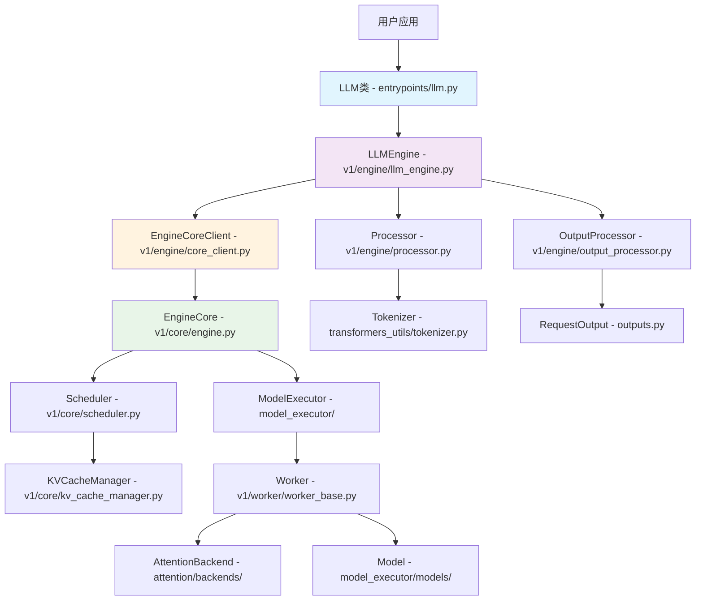
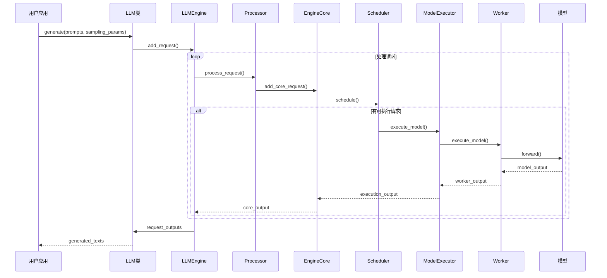

## 1. 项目概述

**VLLM** 是一个高性能、易用的大语言模型推理和服务框架，最初由UC Berkeley的Sky Computing Lab开发，现在已成为社区驱动的项目。

### 1.1 核心特性

#### 性能优势
- **PagedAttention技术**：高效管理注意力键值内存
- **连续批处理**：对传入请求进行智能批处理
- **CUDA/HIP图优化**：快速模型执行
- **多种量化支持**：GPTQ、AWQ、AutoRound、INT4、INT8、FP8
- **投机解码**：提升推理速度
- **分块预填充**：优化长序列处理

#### 易用性特性
- **HuggingFace模型集成**：无缝支持流行模型
- **多种解码算法**：并行采样、束搜索等
- **多种并行支持**：张量并行、管道并行、数据并行、专家并行
- **流式输出**：实时响应
- **OpenAI兼容API**：标准接口
- **多硬件支持**：NVIDIA GPU、AMD CPU/GPU、Intel CPU/GPU、TPU等
- **前缀缓存**：提高重复内容处理效率
- **多LoRA支持**：动态适配器切换

### 1.2 支持的模型类型
- **Transformer-like LLMs**：如Llama系列
- **混合专家模型**：如Mixtral、Deepseek-V2/V3  
- **嵌入模型**：如E5-Mistral
- **多模态模型**：如LLaVA

## 2. 项目结构分析

### 2.1 目录结构概览

```
vllm/
├── __init__.py              # 主要API导出
├── engine/                  # 引擎核心
│   ├── llm_engine.py       # LLM引擎(V1版本引用)
│   ├── async_llm_engine.py # 异步LLM引擎
│   └── arg_utils.py        # 引擎参数工具
├── entrypoints/            # 入口点
│   ├── llm.py             # 主要LLM类
│   ├── openai/            # OpenAI兼容API
│   └── api_server.py      # API服务器
├── v1/                     # V1版本核心实现
│   ├── engine/            # V1引擎
│   ├── worker/            # V1工作节点
│   └── executor/          # V1执行器
├── model_executor/         # 模型执行器
│   ├── models/            # 支持的模型实现
│   ├── layers/            # 神经网络层
│   └── model_loader/      # 模型加载器
├── attention/              # 注意力机制
│   ├── backends/          # 注意力后端
│   └── layers/            # 注意力层
├── distributed/            # 分布式支持
├── multimodal/            # 多模态处理
├── config/                # 配置管理
├── transformers_utils/    # Transformers工具
└── csrc/                  # C++/CUDA源码
```

### 2.2 核心模块关系图



## 3. 核心API接口分析

### 3.1 主要用户接口

VLLM通过`vllm.LLM`类对外提供主要接口，该类位于`vllm/entrypoints/llm.py`：

#### 3.1.1 文本生成接口

```python
def generate(
    self,
    prompts: Union[PromptType, Sequence[PromptType]],
    sampling_params: Optional[Union[SamplingParams, Sequence[SamplingParams]]] = None,
    *,
    use_tqdm: Union[bool, Callable[..., tqdm]] = True,
    lora_request: Optional[Union[list[LoRARequest], LoRARequest]] = None,
    priority: Optional[list[int]] = None,
) -> list[RequestOutput]
```

**功能说明**：

- 为输入提示生成补全文本
- 自动批处理提示以优化性能
- 支持单个或批量提示输入
- 支持LoRA动态适配器
- 返回包含生成文本的`RequestOutput`列表

**关键参数**：

- `prompts`: 输入提示，支持字符串或Token ID列表
- `sampling_params`: 采样参数，控制生成策略
- `lora_request`: LoRA请求，用于模型适配
- `priority`: 请求优先级（优先级调度时使用）

#### 3.1.2 对话接口

```python
def chat(
    self,
    messages: Union[list[ChatCompletionMessageParam], list[list[ChatCompletionMessageParam]]],
    sampling_params: Optional[Union[SamplingParams, list[SamplingParams]]] = None,
    chat_template: Optional[str] = None,
    add_generation_prompt: bool = True,
    tools: Optional[list[dict[str, Any]]] = None,
    **kwargs
) -> list[RequestOutput]
```

**功能说明**：

- 处理对话格式输入
- 自动应用聊天模板
- 支持工具调用
- 支持多模态输入（图像、音频等）

#### 3.1.3 嵌入/编码接口

```python
def encode(
    self,
    prompts: Union[PromptType, Sequence[PromptType], DataPrompt],
    pooling_params: Optional[Union[PoolingParams, Sequence[PoolingParams]]] = None,
    pooling_task: PoolingTask = "encode",
    **kwargs
) -> list[PoolingRequestOutput]
```

**功能说明**：

- 对输入文本进行编码，生成向量表示
- 支持多种池化策略
- 用于嵌入、分类、奖励建模等任务

#### 3.1.4 相似度评分接口

```python
def score(
    self,
    data_1: Union[SingletonPrompt, Sequence[SingletonPrompt], ScoreMultiModalParam],
    data_2: Union[SingletonPrompt, Sequence[SingletonPrompt], ScoreMultiModalParam],
    pooling_params: Optional[PoolingParams] = None,
    **kwargs
) -> list[ScoringRequestOutput]
```

**功能说明**：

- 计算文本对之间的相似度分数
- 支持1对1、1对N、N对N配对
- 支持交叉编码和双编码两种模式

### 3.2 框架使用示例

#### 基础文本生成示例

```python
from vllm import LLM, SamplingParams

# 创建LLM实例
llm = LLM(
    model="facebook/opt-125m",      # 模型路径
    tensor_parallel_size=1,         # 张量并行大小
    gpu_memory_utilization=0.9,     # GPU内存使用率
    max_model_len=2048,             # 最大模型长度
    enforce_eager=False,            # 是否强制Eager模式
    trust_remote_code=True          # 是否信任远程代码
)

# 设置采样参数
sampling_params = SamplingParams(
    temperature=0.8,                # 温度参数
    top_p=0.95,                    # Top-p采样
    max_tokens=100,                # 最大生成token数
    stop=["<|endoftext|>"]         # 停止标记
)

# 输入提示
prompts = [
    "Hello, my name is",
    "The president of the United States is",
    "The capital of France is",
    "The future of AI is",
]

# 生成文本
outputs = llm.generate(prompts, sampling_params)

# 处理输出
for output in outputs:
    prompt = output.prompt
    generated_text = output.outputs[0].text
    print(f"Prompt: {prompt!r}")
    print(f"Generated: {generated_text!r}")
```

#### 对话模式示例

```python
from vllm import LLM

llm = LLM(model="meta-llama/Llama-2-7b-chat-hf")

# 单轮对话
messages = [
    {"role": "system", "content": "You are a helpful assistant."},
    {"role": "user", "content": "What is the capital of France?"}
]

outputs = llm.chat(messages)
print(outputs[0].outputs[0].text)

# 多轮对话
conversation = [
    {"role": "system", "content": "You are a helpful assistant."},
    {"role": "user", "content": "Tell me about Paris."},
    {"role": "assistant", "content": "Paris is the capital of France..."},
    {"role": "user", "content": "What's the weather like there?"}
]

outputs = llm.chat(conversation)
print(outputs[0].outputs[0].text)
```

#### 嵌入模型示例

```python
from vllm import LLM

# 使用嵌入模型
llm = LLM(model="BAAI/bge-base-en-v1.5", runner="pooling")

texts = [
    "What is the capital of France?",
    "Paris is the capital of France.",
    "The weather in Paris is nice."
]

# 生成嵌入向量
embeddings = llm.embed(texts)
for i, embedding in enumerate(embeddings):
    print(f"Text: {texts[i]}")
    print(f"Embedding shape: {embedding.outputs.data.shape}")
    print(f"Embedding (first 5 dims): {embedding.outputs.data[:5]}")
```

#### 多模态示例

```python
from vllm import LLM
from vllm.utils import FlexibleArgumentParser

llm = LLM(model="llava-hf/llava-1.5-7b-hf")

# 文本+图像输入
prompt = {
    "prompt": "Describe this image:",
    "multi_modal_data": {
        "image": "path/to/image.jpg"
    }
}

outputs = llm.generate([prompt])
print(outputs[0].outputs[0].text)
```

## 4. 整体架构设计

### 4.1 架构分层

VLLM采用分层架构设计，从上到下包括：

1. **用户接口层**（User Interface Layer）
   - LLM类：主要用户接口
   - OpenAI兼容API：标准化接口
   - 各种入口点：CLI、服务器等

2. **引擎层**（Engine Layer）  
   - LLMEngine：核心引擎
   - Processor：输入处理
   - OutputProcessor：输出处理
   - 请求调度与批处理

3. **执行层**（Execution Layer）
   - ModelExecutor：模型执行
   - Worker：工作节点
   - AttentionBackend：注意力实现
   - KVCache管理

4. **模型层**（Model Layer）
   - 各种模型实现
   - 量化支持
   - LoRA适配器
   - 多模态处理

5. **系统层**（System Layer）
   - 分布式通信
   - 内存管理
   - CUDA内核
   - 硬件抽象

### 4.2 数据流架构图



### 4.3 核心组件职责

#### LLMEngine（核心引擎）
- **职责**：统筹整个推理流程，管理请求生命周期
- **关键功能**：
  - 请求接收与验证
  - 批处理策略制定
  - 资源分配与调度
  - 输出收集与返回

#### Processor（输入处理器）
- **职责**：将用户输入转换为引擎可处理的格式
- **关键功能**：
  - 提示词预处理
  - Token化
  - 多模态数据处理
  - 参数验证与标准化

#### Scheduler（调度器）
- **职责**：决定哪些请求可以批量执行
- **关键功能**：
  - 内存预算管理
  - 批次组装
  - 优先级处理
  - 抢占式调度

#### ModelExecutor（模型执行器）
- **职责**：协调模型推理执行
- **关键功能**：
  - 分布式执行协调
  - 内存管理
  - 模型前向传播
  - 输出收集

## 5. 关键技术特性

### 5.1 PagedAttention技术

PagedAttention是VLLM的核心创新，将操作系统的虚拟内存概念引入到Transformer的注意力计算中：

**传统注意力内存问题**：

- KV缓存需要连续内存分配
- 序列长度未知导致预分配浪费
- 内存碎片化严重

**PagedAttention解决方案**：

- 将KV缓存分割成固定大小的页面
- 动态分配页面，按需增长
- 页面可以不连续，通过页表管理
- 支持页面共享（前缀缓存）

### 5.2 连续批处理

**传统静态批处理问题**：

- 等待批次内所有请求完成
- 短请求等待长请求
- GPU利用率低

**连续批处理优势**：

- 完成的请求立即返回
- 新请求可立即加入批次
- 最大化GPU利用率
- 降低平均延迟

### 5.3 内存优化策略

- **分块KV缓存**：按页管理，动态分配
- **前缀缓存共享**：相同前缀共享内存页面
- **GPU内存池化**：统一内存管理，减少碎片
- **CPU卸载**：将不活跃数据迁移到CPU

## 6. 性能优化设计

### 6.1 计算优化
- **CUDA Graph**：减少CPU-GPU同步开销
- **FlashAttention集成**：高效注意力计算
- **Custom Kernel**：针对特定硬件优化
- **量化支持**：降低计算精度，提升速度

### 6.2 内存优化
- **Zero-Copy**：减少数据拷贝
- **Memory Pool**：预分配内存池
- **Gradient Checkpointing**：牺牲计算换内存
- **Model Sharding**：模型分片存储

### 6.3 通信优化
- **All-Reduce优化**：自定义通信原语
- **Pipeline并行**：隐藏通信延迟
- **梯度压缩**：减少通信量
- **异步通信**：与计算重叠

## 7. 扩展性设计

### 7.1 插件系统
- **模型插件**：支持新模型架构
- **硬件插件**：支持新硬件后端
- **量化插件**：自定义量化方法
- **调度插件**：自定义调度策略

### 7.2 配置管理
- **分层配置**：模型、缓存、并行等配置独立
- **动态配置**：运行时调整参数
- **配置验证**：参数兼容性检查
- **默认策略**：智能参数推导

这个总体架构分析为后续的详细模块分析奠定了基础，展现了VLLM作为高性能LLM推理框架的设计哲学和技术特色。
