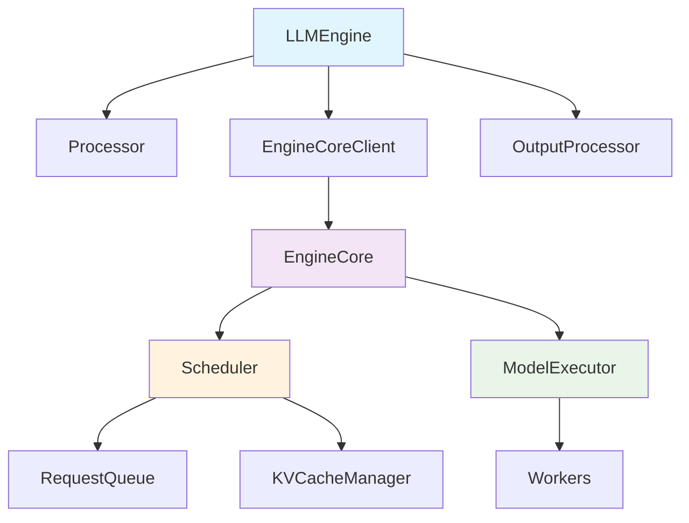
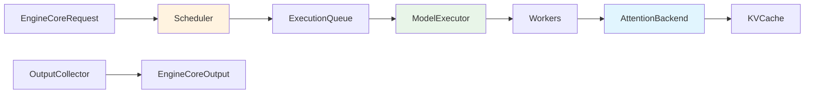
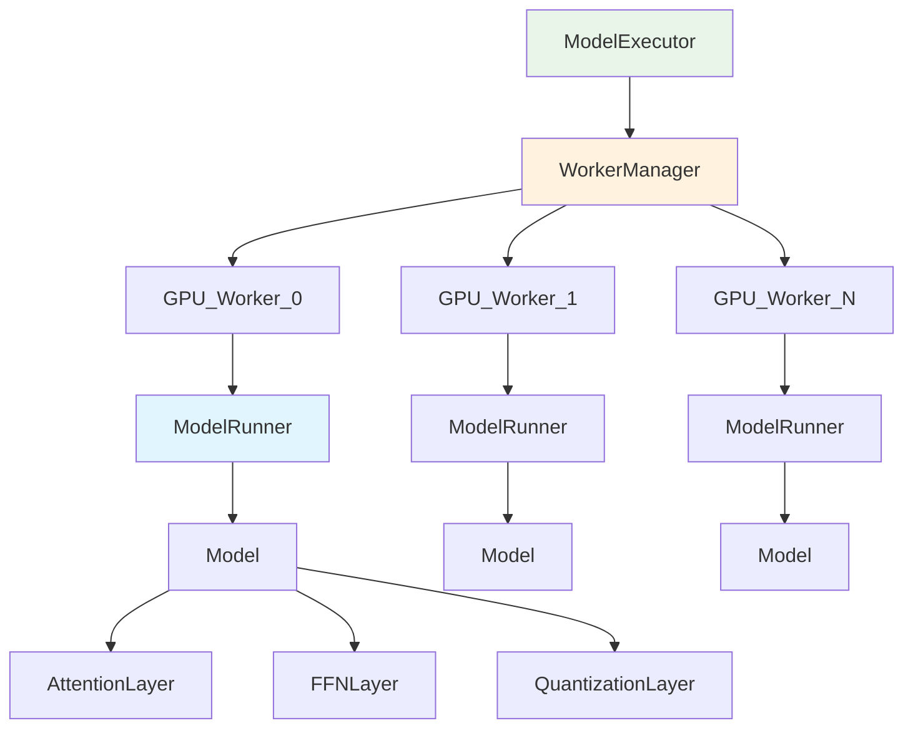
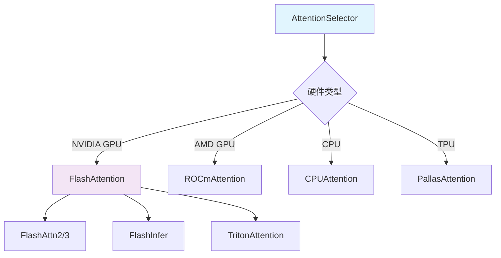
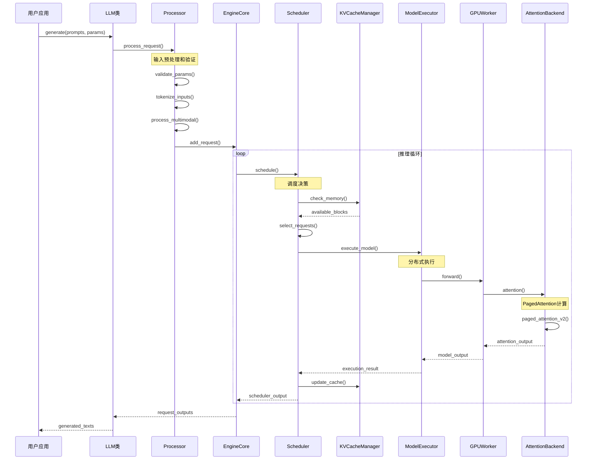

## 1. 引擎模块 (Engine Module)

### 1.1 LLMEngine 架构

VLLM V1采用分层的引擎架构，主要组件包括：



#### 1.1.1 LLMEngine 类详细分析

**文件位置**: `vllm/v1/engine/llm_engine.py`

**核心职责**：
- 统筹整个推理流程
- 管理请求生命周期
- 协调各个子模块

**关键方法**：

```python
class LLMEngine:
    """Legacy LLMEngine for backwards compatibility."""
    
    def __init__(
        self,
        vllm_config: VllmConfig,
        executor_class: type[Executor],
        log_stats: bool,
        usage_context: UsageContext = UsageContext.ENGINE_CONTEXT,
        stat_loggers: Optional[list[StatLoggerFactory]] = None,
        mm_registry: MultiModalRegistry = MULTIMODAL_REGISTRY,
        use_cached_outputs: bool = False,
        multiprocess_mode: bool = False,
    ) -> None:
        """
        初始化LLM引擎
        
        Args:
            vllm_config: VLLM配置对象，包含模型、缓存、并行等配置
            executor_class: 执行器类，负责模型推理执行
            log_stats: 是否记录统计信息
            usage_context: 使用上下文，用于遥测和监控
            stat_loggers: 自定义统计记录器列表
            mm_registry: 多模态注册表，管理多模态处理器
            use_cached_outputs: 是否使用缓存输出
            multiprocess_mode: 是否使用多进程模式
        """
        
        # 配置存储
        self.vllm_config = vllm_config
        self.model_config = vllm_config.model_config
        self.cache_config = vllm_config.cache_config
        
        # 分布式处理组初始化
        if not multiprocess_mode and parallel_config.data_parallel_size > 1:
            self.dp_group = parallel_config.stateless_init_dp_group()
            
        # 初始化tokenizer
        if not self.model_config.skip_tokenizer_init:
            self.tokenizer = init_tokenizer_from_configs(
                model_config=vllm_config.model_config)
                
        # 初始化处理器组件
        self.processor = Processor(
            vllm_config=vllm_config,
            tokenizer=self.tokenizer, 
            mm_registry=mm_registry)
            
        # 初始化输出处理器
        self.output_processor = OutputProcessor(
            self.tokenizer, log_stats=self.log_stats)
            
        # 初始化引擎核心客户端
        self.engine_core = EngineCoreClient.make_client(
            multiprocess_mode=multiprocess_mode,
            asyncio_mode=False,
            vllm_config=vllm_config,
            executor_class=executor_class,
            log_stats=self.log_stats)
```

**关键功能实现**：

```python
    def add_request(
        self,
        request_id: str,
        prompt: PromptType,
        params: Union[SamplingParams, PoolingParams],
        *,
        lora_request: Optional[LoRARequest] = None,
        tokenization_kwargs: Optional[dict[str, Any]] = None,
        priority: int = 0,
    ) -> None:
        """
        添加新请求到引擎处理队列
        
        Args:
            request_id: 请求唯一标识符
            prompt: 输入提示，可以是字符串或字典格式
            params: 采样或池化参数
            lora_request: LoRA适配器请求（可选）
            tokenization_kwargs: tokenization参数字典
            priority: 请求优先级
        
        处理流程:
        1. 使用Processor预处理输入
        2. 验证参数合法性
        3. 创建EngineCoreRequest
        4. 提交到EngineCore处理队列
        """
        
        # 预处理输入
        processed_inputs = self.processor.process_request(
            request_id=request_id,
            prompt=prompt,
            params=params,
            lora_request=lora_request,
            tokenization_kwargs=tokenization_kwargs)
            
        # 创建核心请求
        engine_core_request = EngineCoreRequest(
            request_id=request_id,
            inputs=processed_inputs,
            priority=priority,
            arrival_time=time.time())
            
        # 提交到引擎核心
        self.engine_core.add_request(engine_core_request)

    def step(self) -> list[Union[RequestOutput, PoolingRequestOutput]]:
        """
        执行一个推理步骤
        
        Returns:
            完成的请求输出列表
            
        处理流程:
        1. 从EngineCore获取完成的输出
        2. 通过OutputProcessor后处理
        3. 返回RequestOutput对象列表
        """
        # 获取引擎核心输出
        engine_core_outputs = self.engine_core.step()
        
        # 后处理输出
        request_outputs = []
        for core_output in engine_core_outputs:
            request_output = self.output_processor.process_output(core_output)
            request_outputs.append(request_output)
            
        return request_outputs
```

### 1.2 Processor 模块

**文件位置**: `vllm/v1/engine/processor.py`

**核心职责**：
- 预处理用户输入
- Token化处理
- 多模态数据处理
- 参数验证和标准化

#### 1.2.1 Processor 类详细分析

```python
class Processor:
    """
    输入处理器，负责将用户输入转换为引擎可处理的格式
    """
    
    def __init__(
        self,
        vllm_config: VllmConfig,
        tokenizer: AnyTokenizer,
        mm_registry: MultiModalRegistry = MULTIMODAL_REGISTRY,
    ):
        """
        初始化处理器
        
        Args:
            vllm_config: VLLM配置对象
            tokenizer: 分词器实例
            mm_registry: 多模态注册表
        """
        self.vllm_config = vllm_config
        self.model_config = vllm_config.model_config
        self.tokenizer = tokenizer
        
        # 初始化多模态处理器缓存
        self.mm_processor_cache = processor_cache_from_config(
            vllm_config, mm_registry)
            
        # 初始化输入预处理器
        self.input_preprocessor = InputPreprocessor(
            self.model_config,
            self.tokenizer,
            mm_registry,
            mm_processor_cache=self.mm_processor_cache)
```

**关键方法实现**：

```python
    def process_request(
        self,
        request_id: str,
        prompt: PromptType,
        params: Union[SamplingParams, PoolingParams],
        *,
        lora_request: Optional[LoRARequest] = None,
        tokenization_kwargs: Optional[dict[str, Any]] = None,
    ) -> ProcessorInputs:
        """
        处理单个请求
        
        Args:
            request_id: 请求ID
            prompt: 用户输入提示
            params: 采样/池化参数
            lora_request: LoRA请求
            tokenization_kwargs: tokenization参数
            
        Returns:
            ProcessorInputs: 处理后的输入对象
            
        处理流程:
        1. 参数验证
        2. 输入预处理和token化
        3. 多模态数据处理
        4. 结构化输出验证
        5. 返回标准化的ProcessorInputs对象
        """
        
        # 验证参数
        self._validate_params(params)
        
        # 预处理输入
        preprocessed = self.input_preprocessor.preprocess(
            prompt, 
            request_id=request_id,
            lora_request=lora_request)
            
        # 处理多模态数据
        if preprocessed.multi_modal_data:
            mm_inputs = self._process_multimodal_data(
                preprocessed.multi_modal_data)
        else:
            mm_inputs = None
            
        # 创建返回对象
        return ProcessorInputs(
            request_id=request_id,
            prompt_token_ids=preprocessed.prompt_token_ids,
            prompt=preprocessed.prompt,
            multi_modal_inputs=mm_inputs,
            params=params,
            lora_request=lora_request)

    def _validate_sampling_params(self, params: SamplingParams) -> None:
        """
        验证采样参数合法性
        
        检查项目:
        - 结构化输出参数
        - logit_bias参数范围
        - 支持的参数特性
        """
        # 验证结构化输出
        self._validate_structured_output(params)
        
        # 验证logit_bias
        self._validate_logit_bias(params)
        
        # 检查不支持的参数
        if params.best_of is not None and params.best_of > 1:
            raise ValueError("vLLM V1 does not yet support best_of.")
            
        if params.logits_processors:
            raise ValueError("vLLM V1 does not support per request "
                           "user provided logits processors.")
```

### 1.3 EngineCore 模块

**文件位置**: `vllm/v1/engine/core.py`

**核心职责**：
- 请求调度与批处理
- 模型执行协调
- KV缓存管理
- 输出收集

#### 1.3.1 架构设计



## 2. 调度器模块 (Scheduler Module)

### 2.1 调度器架构

**文件位置**: `vllm/v1/core/sched/scheduler.py`

调度器是VLLM的核心组件，负责决定哪些请求可以批量执行：

#### 2.1.1 核心调度策略

```python
class Scheduler:
    """
    V1调度器，负责请求调度和批处理决策
    """
    
    def __init__(self, vllm_config: VllmConfig):
        """
        初始化调度器
        
        Args:
            vllm_config: 包含调度、缓存、模型配置的完整配置对象
        """
        self.model_config = vllm_config.model_config
        self.cache_config = vllm_config.cache_config
        self.scheduler_config = vllm_config.scheduler_config
        
        # 初始化请求队列
        self.request_queue = RequestQueue()
        
        # 初始化KV缓存管理器
        self.kv_cache_manager = KVCacheManager(vllm_config)
        
        # 调度策略参数
        self.max_batch_size = self.scheduler_config.max_num_seqs
        self.max_tokens = self.scheduler_config.max_num_batched_tokens
```

**调度算法实现**：

```python
    def schedule(self) -> SchedulerOutput:
        """
        执行一轮调度，决定哪些请求可以执行
        
        Returns:
            SchedulerOutput: 包含可执行请求批次的调度结果
            
        调度策略:
        1. 优先处理预填充请求（新请求）
        2. 继续处理解码请求（生成中的请求）
        3. 考虑内存预算约束
        4. 支持抢占式调度
        """
        
        # 获取内存预算
        available_memory = self.kv_cache_manager.get_available_memory()
        
        # 收集可执行的请求
        prefill_requests = []
        decode_requests = []
        
        # 处理预填充请求（新请求）
        for request in self.request_queue.get_waiting_requests():
            estimated_memory = self._estimate_memory_usage(request)
            if available_memory >= estimated_memory:
                prefill_requests.append(request)
                available_memory -= estimated_memory
                
        # 处理解码请求（继续生成）
        for request in self.request_queue.get_running_requests():
            estimated_memory = self._estimate_decode_memory(request)
            if available_memory >= estimated_memory:
                decode_requests.append(request)
                available_memory -= estimated_memory
                
        # 创建调度输出
        return SchedulerOutput(
            prefill_requests=prefill_requests,
            decode_requests=decode_requests,
            preempted_requests=self._handle_preemption(),
            scheduler_metrics=self._collect_metrics())

    def _estimate_memory_usage(self, request: EngineCoreRequest) -> int:
        """
        估算请求的KV缓存内存使用量
        
        Args:
            request: 引擎核心请求对象
            
        Returns:
            估计的内存使用量（以token为单位）
            
        估算策略:
        1. 基于prompt长度和最大生成长度
        2. 考虑注意力头数和隐藏维度
        3. 加入安全边际
        """
        prompt_length = len(request.inputs.prompt_token_ids)
        max_new_tokens = request.inputs.params.max_tokens or 256
        
        # 计算总序列长度
        total_length = prompt_length + max_new_tokens
        
        # KV缓存内存 = 序列长度 × 层数 × 头数 × 头维度 × 2(K+V) × 数据类型大小
        memory_per_token = (
            self.model_config.get_num_layers() *
            self.model_config.get_num_kv_heads() *
            self.model_config.get_head_size() * 
            2 *  # K and V
            self._get_dtype_size()
        )
        
        return total_length * memory_per_token
```

### 2.2 KV缓存管理器

**文件位置**: `vllm/v1/core/kv_cache_manager.py`

#### 2.2.1 PagedAttention实现

```python
class KVCacheManager:
    """
    KV缓存管理器，实现PagedAttention算法
    """
    
    def __init__(self, vllm_config: VllmConfig):
        """
        初始化KV缓存管理器
        
        Args:
            vllm_config: VLLM配置对象
        """
        self.cache_config = vllm_config.cache_config
        self.model_config = vllm_config.model_config
        
        # 页面配置
        self.page_size = self.cache_config.block_size
        self.num_gpu_blocks = self.cache_config.num_gpu_blocks
        self.num_cpu_blocks = self.cache_config.num_cpu_blocks
        
        # 初始化块池
        self.gpu_block_pool = BlockPool(
            num_blocks=self.num_gpu_blocks,
            block_size=self.page_size,
            device="cuda")
            
        self.cpu_block_pool = BlockPool(
            num_blocks=self.num_cpu_blocks, 
            block_size=self.page_size,
            device="cpu")
            
        # 序列到块映射
        self.seq_to_blocks: dict[str, list[int]] = {}
        
        # 前缀缓存
        self.prefix_cache: dict[str, list[int]] = {}

    def allocate_blocks(self, seq_id: str, num_tokens: int) -> list[int]:
        """
        为序列分配KV缓存块
        
        Args:
            seq_id: 序列标识符
            num_tokens: 需要缓存的token数量
            
        Returns:
            分配的块ID列表
            
        分配策略:
        1. 计算所需块数
        2. 检查前缀缓存可重用性
        3. 从块池分配新块
        4. 更新序列-块映射
        """
        # 计算所需块数
        num_blocks = (num_tokens + self.page_size - 1) // self.page_size
        
        # 检查前缀缓存
        reusable_blocks = self._find_reusable_prefix(seq_id, num_tokens)
        needed_blocks = num_blocks - len(reusable_blocks)
        
        # 分配新块
        new_blocks = []
        for _ in range(needed_blocks):
            if self.gpu_block_pool.has_available():
                block_id = self.gpu_block_pool.allocate()
                new_blocks.append(block_id)
            else:
                # GPU内存不足，尝试CPU卸载或抢占
                raise OutOfMemoryError("GPU KV cache exhausted")
                
        # 合并块列表
        all_blocks = reusable_blocks + new_blocks
        self.seq_to_blocks[seq_id] = all_blocks
        
        return all_blocks

    def _find_reusable_prefix(self, seq_id: str, num_tokens: int) -> list[int]:
        """
        查找可重用的前缀缓存块
        
        前缀缓存策略:
        1. 基于prompt hash查找匹配前缀
        2. 共享相同前缀的KV缓存块
        3. 支持部分前缀匹配
        """
        # 实现前缀匹配逻辑
        # 这里简化为返回空列表
        return []
```

## 3. 模型执行器模块 (Model Executor Module)

### 3.1 ModelExecutor 架构

**文件位置**: `vllm/model_executor/`

模型执行器负责协调分布式模型推理：

#### 3.1.1 执行器架构图



#### 3.1.2 核心实现

```python
class ModelExecutor:
    """
    模型执行器，协调分布式模型推理
    """
    
    def __init__(self, vllm_config: VllmConfig):
        """
        初始化模型执行器
        
        Args:
            vllm_config: VLLM配置对象
        """
        self.model_config = vllm_config.model_config
        self.parallel_config = vllm_config.parallel_config
        self.device_config = vllm_config.device_config
        
        # 初始化工作器管理器
        self.worker_manager = WorkerManager(vllm_config)
        
        # 分布式设置
        self.tensor_parallel_size = self.parallel_config.tensor_parallel_size
        self.pipeline_parallel_size = self.parallel_config.pipeline_parallel_size

    def execute_model(
        self,
        model_inputs: ModelInputs,
    ) -> ModelOutputs:
        """
        执行模型前向传播
        
        Args:
            model_inputs: 模型输入，包含token_ids、位置信息等
            
        Returns:
            ModelOutputs: 模型输出，包含logits、hidden_states等
            
        执行流程:
        1. 准备输入数据
        2. 分发到各个worker
        3. 并行执行模型前向传播
        4. 收集和聚合输出
        """
        
        # 准备分布式输入
        distributed_inputs = self._prepare_distributed_inputs(model_inputs)
        
        # 并行执行
        worker_outputs = self.worker_manager.execute_model(distributed_inputs)
        
        # 聚合输出
        aggregated_outputs = self._aggregate_outputs(worker_outputs)
        
        return aggregated_outputs

    def _prepare_distributed_inputs(
        self, 
        model_inputs: ModelInputs
    ) -> dict[int, ModelInputs]:
        """
        为分布式执行准备输入数据
        
        处理内容:
        1. 张量并行切分
        2. 管道并行分段
        3. 数据并行复制
        """
        distributed_inputs = {}
        
        if self.tensor_parallel_size > 1:
            # 张量并行：切分嵌入和注意力权重
            for worker_id in range(self.tensor_parallel_size):
                worker_inputs = self._shard_inputs_for_tp(
                    model_inputs, worker_id)
                distributed_inputs[worker_id] = worker_inputs
        else:
            distributed_inputs[0] = model_inputs
            
        return distributed_inputs
```

## 4. Worker 模块

### 4.1 Worker 基类

**文件位置**: `vllm/v1/worker/worker_base.py`

#### 4.1.1 Worker 架构

```python
class WorkerBase(WorkerBaseV0):
    """
    V1 Worker抽象基类，定义worker的通用接口
    """
    
    def __init__(
        self,
        vllm_config: VllmConfig,
        local_rank: int,
        rank: int,  
        distributed_init_method: str,
        is_driver_worker: bool = False,
    ):
        """
        初始化Worker基类
        
        Args:
            vllm_config: VLLM完整配置
            local_rank: 本地设备索引
            rank: 全局rank
            distributed_init_method: 分布式初始化方法
            is_driver_worker: 是否为驱动worker
        """
        super().__init__(vllm_config=vllm_config)
        
        # 基本属性设置
        self.local_rank = local_rank
        self.rank = rank
        self.distributed_init_method = distributed_init_method
        self.is_driver_worker = is_driver_worker
        
        # 设备和模型状态
        self.device: Optional[torch.device] = None
        self.model_runner: Optional[nn.Module] = None

    def get_kv_cache_spec(self) -> dict[str, KVCacheSpec]:
        """
        获取KV缓存规格说明
        
        Returns:
            KV缓存规格字典，包含：
            - 缓存块大小
            - 数据类型
            - 设备位置
            - 内存布局
        """
        raise NotImplementedError("Subclasses must implement get_kv_cache_spec")

    def compile_or_warm_up_model(self) -> None:
        """
        编译或预热模型
        
        功能:
        1. CUDA Graph编译
        2. 内核预热
        3. 内存预分配
        4. 性能优化设置
        """
        raise NotImplementedError("Subclasses must implement compile_or_warm_up_model")
```

### 4.2 GPU Worker

**文件位置**: `vllm/v1/worker/gpu_worker.py`

GPU Worker是最常用的worker实现：

```python
class GPUWorker(WorkerBase):
    """
    GPU Worker实现，负责在GPU上执行模型推理
    """
    
    def __init__(self, *args, **kwargs):
        super().__init__(*args, **kwargs)
        
        # GPU设备初始化
        self.device = torch.device(f"cuda:{self.local_rank}")
        torch.cuda.set_device(self.device)
        
        # 初始化模型运行器
        self.model_runner = GPUModelRunner(
            vllm_config=self.vllm_config,
            device=self.device,
            rank=self.rank)

    def execute_model(
        self,
        model_inputs: ModelInputs,
    ) -> ModelOutputs:
        """
        在GPU上执行模型推理
        
        Args:
            model_inputs: 模型输入数据
            
        Returns:
            模型输出结果
            
        执行步骤:
        1. 数据传输到GPU
        2. 执行前向传播
        3. 结果收集和同步
        """
        return self.model_runner.execute_model(model_inputs)

    def get_kv_cache_spec(self) -> dict[str, KVCacheSpec]:
        """
        获取GPU KV缓存规格
        """
        return {
            "default": KVCacheSpec(
                block_size=self.cache_config.block_size,
                dtype=self.model_config.dtype,
                device="cuda",
                layout="paged"
            )
        }
```

## 5. 注意力后端模块 (Attention Backend)

### 5.1 注意力后端架构

**文件位置**: `vllm/v1/attention/backends/`

VLLM支持多种注意力后端实现：

#### 5.1.1 后端选择策略



#### 5.1.2 FlashAttention后端实现

```python
class FlashAttentionBackend(AttentionBackend):
    """
    FlashAttention后端实现，提供高效的注意力计算
    """
    
    def __init__(self, model_config: ModelConfig):
        """
        初始化FlashAttention后端
        
        Args:
            model_config: 模型配置，包含注意力参数
        """
        self.model_config = model_config
        self.head_size = model_config.get_head_size()
        self.num_heads = model_config.get_num_attention_heads()
        self.num_kv_heads = model_config.get_num_kv_heads()
        
        # 检查FlashAttention可用性
        self._check_flash_attn_availability()

    def forward(
        self,
        query: torch.Tensor,
        key: torch.Tensor, 
        value: torch.Tensor,
        kv_cache: KVCache,
        attn_metadata: AttentionMetadata,
    ) -> torch.Tensor:
        """
        执行注意力计算
        
        Args:
            query: 查询张量 [batch_size, seq_len, num_heads, head_size]
            key: 键张量 [batch_size, seq_len, num_kv_heads, head_size]
            value: 值张量 [batch_size, seq_len, num_kv_heads, head_size]
            kv_cache: KV缓存对象
            attn_metadata: 注意力元数据
            
        Returns:
            注意力输出张量
            
        计算流程:
        1. PagedAttention前处理
        2. FlashAttention计算
        3. 结果后处理
        """
        # 处理PagedAttention
        if attn_metadata.is_paged:
            return self._paged_attention_forward(
                query, key, value, kv_cache, attn_metadata)
        else:
            return self._standard_attention_forward(
                query, key, value, attn_metadata)

    def _paged_attention_forward(
        self,
        query: torch.Tensor,
        key: torch.Tensor,
        value: torch.Tensor, 
        kv_cache: KVCache,
        attn_metadata: AttentionMetadata,
    ) -> torch.Tensor:
        """
        PagedAttention前向计算
        
        特点:
        1. 支持非连续KV缓存
        2. 动态序列长度
        3. 内存高效
        """
        # 获取页表信息
        block_tables = attn_metadata.block_tables
        block_size = attn_metadata.block_size
        
        # 调用PagedAttention内核
        output = paged_attention_v2(
            query=query,
            key_cache=kv_cache.key_cache,
            value_cache=kv_cache.value_cache,
            block_tables=block_tables,
            seq_lens=attn_metadata.seq_lens,
            block_size=block_size,
            max_seq_len=attn_metadata.max_seq_len)
            
        return output
```

## 6. 核心数据流分析

### 6.1 请求处理时序图



### 6.2 内存管理架构

```mermaid
graph TB
    A[GPU Memory Pool] --> B[KV Cache Manager]
    B --> C[Block Pool]
    C --> D[GPU Blocks]
    C --> E[CPU Blocks]
    
    F[Sequence Manager] --> G[Sequence-to-Block Mapping]
    G --> H[Sequence A: Blocks [1,3,7]]
    G --> I[Sequence B: Blocks [2,4,8]]
    
    J[Prefix Cache] --> K[Hash-to-Block Mapping]
    K --> L[Common Prefix: Blocks [1,2]]
    
    D --> M[Block 1: Page Data]
    D --> N[Block 2: Page Data] 
    D --> O[Block N: Page Data]
    
    style A fill:#e8f5e8
    style B fill:#fff3e0
    style F fill:#e1f5fe
    style J fill:#f3e5f5
```

这个核心模块分析展示了VLLM V1架构的内部工作原理，包括各个组件的职责分工、关键算法实现和数据流转过程。通过这些详细的分析，开发者可以深入理解VLLM的技术内核和设计哲学。
