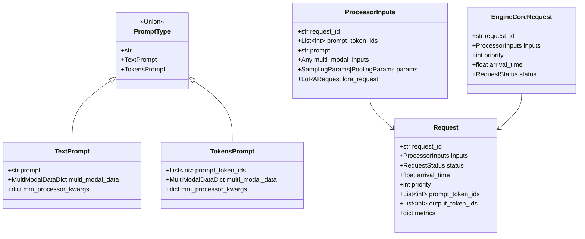
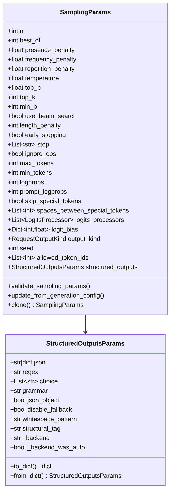
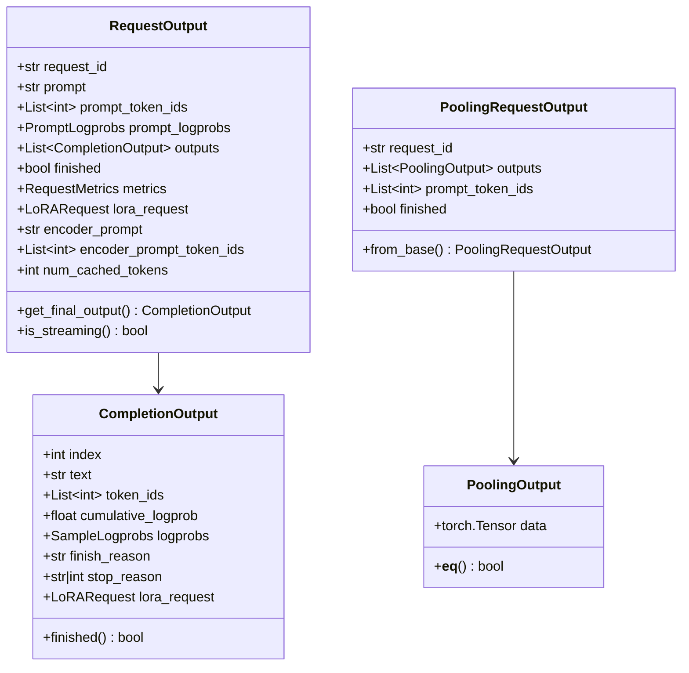
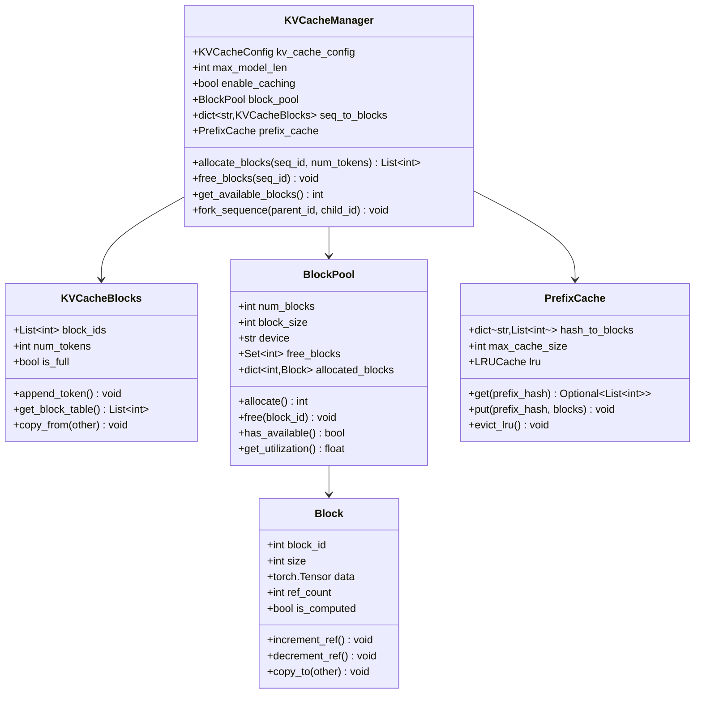
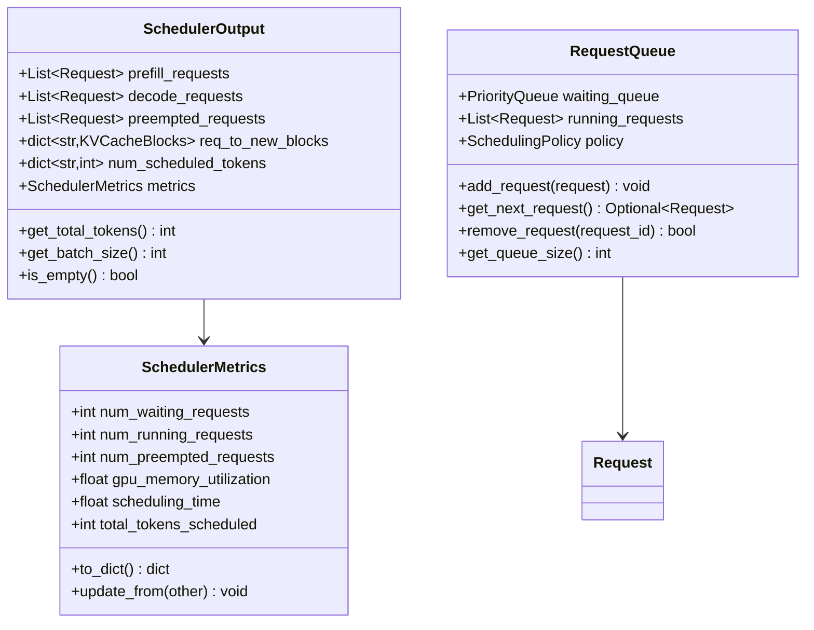
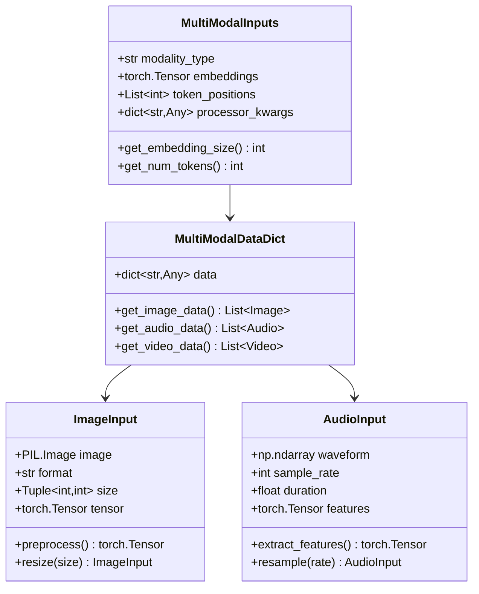
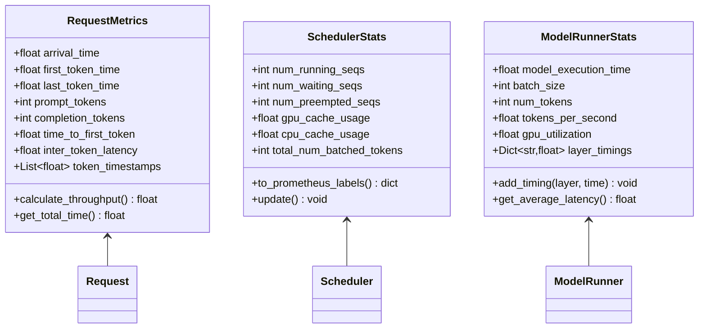
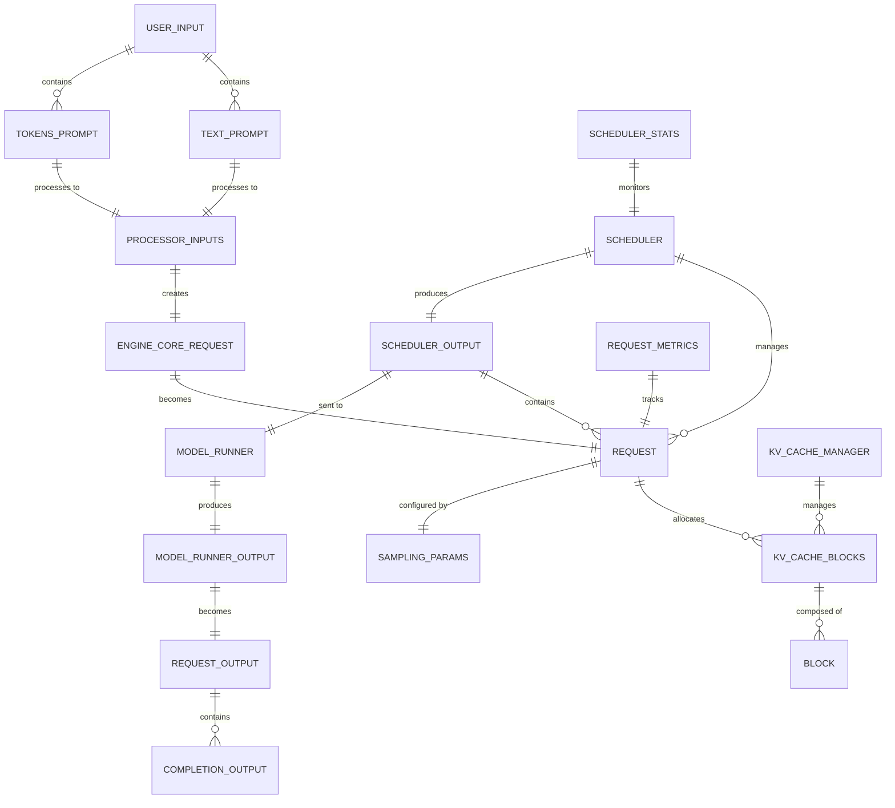

# VLLM关键数据结构与UML设计

## 1. 数据结构概览

VLLM的数据结构设计围绕推理请求的生命周期管理，从用户输入到最终输出的整个流程涉及多个关键数据结构。

### 1.1 核心数据结构层次



## 2. 请求处理数据结构

### 2.1 Request 类详细设计

**文件位置**: `vllm/v1/request.py`

```python
@dataclass
class Request:
    """
    代表一个推理请求的完整生命周期数据
    
    属性说明:
        request_id: 请求的唯一标识符
        inputs: 经过预处理的输入数据
        status: 当前请求状态
        arrival_time: 请求到达时间戳
        priority: 请求优先级（用于优先级调度）
        prompt_token_ids: 提示词的token ID列表
        output_token_ids: 已生成的输出token ID列表
        spec_token_ids: 投机解码的token ID列表（可选）
        metrics: 请求相关的性能指标
    """
    
    request_id: str
    inputs: ProcessorInputs
    status: RequestStatus = RequestStatus.WAITING
    arrival_time: float = field(default_factory=time.time)
    priority: int = 0
    
    # Token相关
    prompt_token_ids: List[int] = field(default_factory=list)
    output_token_ids: List[int] = field(default_factory=list) 
    spec_token_ids: List[int] = field(default_factory=list)
    
    # 缓存和性能
    encoder_outputs: Optional[Any] = None
    metrics: Dict[str, Any] = field(default_factory=dict)
    
    # 多模态支持
    mm_inputs: Optional[MultiModalInputs] = None
    mm_hashes: Optional[List[str]] = None
    
    def __post_init__(self):
        """请求初始化后处理"""
        if not self.prompt_token_ids and self.inputs:
            self.prompt_token_ids = self.inputs.prompt_token_ids
            
        # 初始化指标
        self.metrics.update({
            'created_time': self.arrival_time,
            'tokens_computed': 0,
            'total_tokens': len(self.prompt_token_ids)
        })
    
    @property
    def num_computed_tokens(self) -> int:
        """已计算的token数量"""
        return len(self.prompt_token_ids) + len(self.output_token_ids)
    
    @property  
    def num_total_tokens(self) -> int:
        """总token数量（包括投机token）"""
        return self.num_computed_tokens + len(self.spec_token_ids)
    
    def is_finished(self) -> bool:
        """检查请求是否已完成"""
        return self.status in [
            RequestStatus.FINISHED_STOPPED,
            RequestStatus.FINISHED_LENGTH_CAPPED,
            RequestStatus.FINISHED_ABORTED,
            RequestStatus.FINISHED_IGNORED
        ]
    
    def get_next_tokens_to_compute(self, max_tokens: int) -> int:
        """获取下一步要计算的token数量"""
        remaining = self.num_total_tokens - self.metrics['tokens_computed']
        return min(remaining, max_tokens)
```

**请求状态枚举**：

```python
class RequestStatus(str, enum.Enum):
    """请求状态枚举"""
    
    # 等待状态
    WAITING = "waiting"                    # 等待调度
    PREEMPTED = "preempted"               # 被抢占
    
    # 运行状态  
    RUNNING = "running"                    # 正在运行
    SWAPPED = "swapped"                   # 被交换到CPU
    
    # 完成状态
    FINISHED_STOPPED = "finished_stopped"        # 正常停止
    FINISHED_LENGTH_CAPPED = "finished_length"   # 达到长度限制
    FINISHED_ABORTED = "finished_aborted"        # 被中止
    FINISHED_IGNORED = "finished_ignored"        # 被忽略
```

### 2.2 采样参数数据结构

**文件位置**: `vllm/sampling_params.py`



**核心实现**：

```python
@dataclass
class SamplingParams:
    """
    文本生成的采样参数配置
    
    主要参数分类:
    1. 基础生成参数: n, max_tokens, min_tokens
    2. 采样控制参数: temperature, top_p, top_k
    3. 惩罚参数: presence_penalty, frequency_penalty
    4. 停止条件: stop, ignore_eos
    5. 结构化输出: structured_outputs
    6. 随机性控制: seed, logit_bias
    """
    
    # 基础参数
    n: int = 1                           # 生成序列数量
    max_tokens: Optional[int] = 16       # 最大生成token数
    min_tokens: int = 0                  # 最小生成token数
    
    # 采样参数
    temperature: float = 1.0             # 温度参数，控制随机性
    top_p: float = 1.0                  # 核采样参数
    top_k: int = -1                     # Top-K采样参数
    
    # 惩罚参数
    presence_penalty: float = 0.0        # 存在惩罚
    frequency_penalty: float = 0.0       # 频率惩罚
    repetition_penalty: float = 1.0      # 重复惩罚
    
    # 停止条件
    stop: Union[None, str, List[str]] = None    # 停止字符串
    ignore_eos: bool = False                    # 是否忽略EOS token
    
    # 日志概率
    logprobs: Optional[int] = None              # 返回的logprob数量
    prompt_logprobs: Optional[int] = None       # prompt的logprob数量
    
    # 高级参数
    logit_bias: Optional[Dict[int, float]] = None      # logit偏置
    allowed_token_ids: Optional[List[int]] = None      # 允许的token ID
    structured_outputs: Optional[StructuredOutputsParams] = None  # 结构化输出
    
    def validate_sampling_params(self) -> None:
        """验证采样参数的合法性"""
        if self.temperature < 0:
            raise ValueError("temperature must be non-negative")
            
        if not 0 <= self.top_p <= 1:
            raise ValueError("top_p must be in [0, 1]")
            
        if self.top_k < -1 or self.top_k == 0:
            raise ValueError("top_k must be -1 (disabled) or > 0")
            
        if self.max_tokens is not None and self.max_tokens <= 0:
            raise ValueError("max_tokens must be positive")
```

## 3. 输出数据结构

### 3.1 RequestOutput 设计

**文件位置**: `vllm/outputs.py`



**核心实现**：

```python
@dataclass
class RequestOutput:
    """
    LLM完成请求的输出数据
    
    属性说明:
        request_id: 请求唯一ID
        prompt: 原始提示字符串
        prompt_token_ids: 提示的token ID列表
        outputs: 生成的完成输出列表
        finished: 整个请求是否完成
        metrics: 请求相关指标
    """
    
    request_id: str
    prompt: Optional[str]
    prompt_token_ids: Optional[List[int]]
    prompt_logprobs: Optional[PromptLogprobs] 
    outputs: List[CompletionOutput]
    finished: bool
    metrics: Optional[RequestMetrics] = None
    lora_request: Optional[LoRARequest] = None
    
    # 编码器-解码器支持
    encoder_prompt: Optional[str] = None
    encoder_prompt_token_ids: Optional[List[int]] = None
    
    # 缓存相关
    num_cached_tokens: int = 0
    
    def get_final_output(self) -> CompletionOutput:
        """获取最终的完成输出（通常是最佳输出）"""
        if not self.outputs:
            raise ValueError("No outputs available")
        return self.outputs[0]
    
    def is_streaming(self) -> bool:
        """检查是否为流式输出"""
        return not self.finished

@dataclass  
class CompletionOutput:
    """
    单个完成输出的数据
    
    属性说明:
        index: 在请求中的索引位置
        text: 生成的文本内容
        token_ids: 生成的token ID序列
        cumulative_logprob: 累积对数概率
        logprobs: 详细的对数概率信息
        finish_reason: 完成原因（如停止、长度限制等）
    """
    
    index: int
    text: str
    token_ids: List[int]
    cumulative_logprob: Optional[float]
    logprobs: Optional[SampleLogprobs]
    finish_reason: Optional[str] = None
    stop_reason: Union[int, str, None] = None
    lora_request: Optional[LoRARequest] = None
    
    def finished(self) -> bool:
        """检查输出是否完成"""
        return self.finish_reason is not None
```

## 4. KV缓存数据结构

### 4.1 KV缓存管理器设计



**核心实现**：

```python
class KVCacheManager:
    """
    KV缓存管理器，实现PagedAttention的核心逻辑
    """
    
    def __init__(
        self,
        kv_cache_config: KVCacheConfig,
        max_model_len: int,
        enable_caching: bool = True,
        log_stats: bool = False,
    ):
        """
        初始化KV缓存管理器
        
        Args:
            kv_cache_config: KV缓存配置
            max_model_len: 模型最大长度
            enable_caching: 是否启用前缀缓存
            log_stats: 是否记录统计信息
        """
        self.kv_cache_config = kv_cache_config
        self.max_model_len = max_model_len
        self.enable_caching = enable_caching
        self.log_stats = log_stats
        
        # 块配置
        self.block_size = kv_cache_config.block_size
        self.num_gpu_blocks = kv_cache_config.num_gpu_blocks
        self.num_cpu_blocks = kv_cache_config.num_cpu_blocks
        
        # 初始化块池
        self.gpu_block_pool = BlockPool(
            num_blocks=self.num_gpu_blocks,
            block_size=self.block_size,
            device="cuda"
        )
        
        self.cpu_block_pool = BlockPool(
            num_blocks=self.num_cpu_blocks,
            block_size=self.block_size,
            device="cpu"
        )
        
        # 序列到块的映射
        self.seq_to_blocks: Dict[str, KVCacheBlocks] = {}
        
        # 前缀缓存
        self.prefix_cache = PrefixCache(
            max_cache_size=1000,
            enable=enable_caching
        ) if enable_caching else None
    
    def allocate_blocks(
        self,
        seq_id: str,
        num_tokens: int,
        parent_seq_id: Optional[str] = None
    ) -> List[int]:
        """
        为序列分配KV缓存块
        
        Args:
            seq_id: 序列标识符
            num_tokens: 需要缓存的token数量
            parent_seq_id: 父序列ID（fork时使用）
            
        Returns:
            分配的块ID列表
            
        处理流程:
        1. 计算需要的块数量
        2. 检查是否可以重用父序列的块
        3. 查找前缀缓存可重用的块
        4. 从块池分配新块
        5. 更新序列-块映射
        """
        # 计算所需块数
        num_blocks_needed = (num_tokens + self.block_size - 1) // self.block_size
        
        allocated_blocks = []
        
        # 处理序列fork情况
        if parent_seq_id and parent_seq_id in self.seq_to_blocks:
            parent_blocks = self.seq_to_blocks[parent_seq_id]
            # 复制父序列的块（copy-on-write）
            allocated_blocks.extend(parent_blocks.block_ids)
        
        # 检查前缀缓存
        if self.prefix_cache and not parent_seq_id:
            prefix_hash = self._compute_prefix_hash(seq_id, num_tokens)
            cached_blocks = self.prefix_cache.get(prefix_hash)
            if cached_blocks:
                allocated_blocks.extend(cached_blocks)
        
        # 分配额外所需的块
        blocks_to_allocate = max(0, num_blocks_needed - len(allocated_blocks))
        for _ in range(blocks_to_allocate):
            if self.gpu_block_pool.has_available():
                block_id = self.gpu_block_pool.allocate()
                allocated_blocks.append(block_id)
            else:
                # GPU内存不足，尝试抢占或使用CPU
                raise OutOfMemoryError("Insufficient GPU memory for KV cache")
        
        # 创建KVCacheBlocks对象
        kv_blocks = KVCacheBlocks(
            block_ids=allocated_blocks,
            num_tokens=num_tokens,
            block_size=self.block_size
        )
        
        self.seq_to_blocks[seq_id] = kv_blocks
        return allocated_blocks
    
    def free_blocks(self, seq_id: str) -> None:
        """
        释放序列的KV缓存块
        
        Args:
            seq_id: 要释放的序列ID
        """
        if seq_id not in self.seq_to_blocks:
            return
            
        kv_blocks = self.seq_to_blocks[seq_id]
        
        # 释放块到池中
        for block_id in kv_blocks.block_ids:
            if block_id < self.num_gpu_blocks:
                self.gpu_block_pool.free(block_id)
            else:
                self.cpu_block_pool.free(block_id)
        
        # 从映射中删除
        del self.seq_to_blocks[seq_id]
    
    def get_available_blocks(self) -> int:
        """获取可用的KV缓存块数量"""
        return (self.gpu_block_pool.get_free_blocks() + 
                self.cpu_block_pool.get_free_blocks())
```

## 5. 调度数据结构

### 5.1 调度器输出设计



## 6. 多模态数据结构

### 6.1 多模态输入设计



## 7. 性能监控数据结构

### 7.1 指标收集设计



## 8. 数据结构关系总览



## 9. 关键设计模式

### 9.1 工厂模式

VLLM在多个地方使用了工厂模式来创建合适的实现：

```python
class AttentionBackendFactory:
    """注意力后端工厂"""
    
    @staticmethod
    def create_backend(model_config: ModelConfig) -> AttentionBackend:
        """根据配置创建合适的注意力后端"""
        
        if model_config.use_flashattn:
            return FlashAttentionBackend(model_config)
        elif model_config.use_triton:
            return TritonAttentionBackend(model_config)
        else:
            return DefaultAttentionBackend(model_config)

class ExecutorFactory:
    """执行器工厂"""
    
    @staticmethod 
    def create_executor(parallel_config: ParallelConfig) -> Executor:
        """根据并行配置创建执行器"""
        
        if parallel_config.tensor_parallel_size > 1:
            return MultiGPUExecutor(parallel_config)
        else:
            return SingleGPUExecutor(parallel_config)
```

### 9.2 观察者模式

用于性能监控和指标收集：

```python
class MetricCollector:
    """指标收集器，实现观察者模式"""
    
    def __init__(self):
        self.observers: List[MetricObserver] = []
    
    def add_observer(self, observer: MetricObserver):
        self.observers.append(observer)
    
    def notify_observers(self, metric: Metric):
        for observer in self.observers:
            observer.update(metric)

class PrometheusObserver(MetricObserver):
    """Prometheus指标观察者"""
    
    def update(self, metric: Metric):
        # 更新Prometheus指标
        prometheus_client.Counter(metric.name).inc(metric.value)
```

### 9.3 状态机模式

请求状态管理：

```python
class RequestStateMachine:
    """请求状态机"""
    
    TRANSITIONS = {
        RequestStatus.WAITING: [RequestStatus.RUNNING, RequestStatus.PREEMPTED],
        RequestStatus.RUNNING: [RequestStatus.FINISHED_STOPPED, RequestStatus.SWAPPED],
        RequestStatus.PREEMPTED: [RequestStatus.RUNNING, RequestStatus.FINISHED_ABORTED],
        RequestStatus.SWAPPED: [RequestStatus.RUNNING, RequestStatus.FINISHED_ABORTED]
    }
    
    def transition(self, request: Request, new_status: RequestStatus) -> bool:
        """状态转换"""
        if new_status in self.TRANSITIONS.get(request.status, []):
            request.status = new_status
            return True
        return False
```

这个数据结构分析展示了VLLM如何通过精心设计的数据结构来支持高性能的LLM推理。每个数据结构都有明确的职责，并通过合理的关系设计实现了高效的数据流转和状态管理。
