# VLLM关键流程时序图分析

## 1. 总体请求处理时序图

### 1.1 完整推理流程

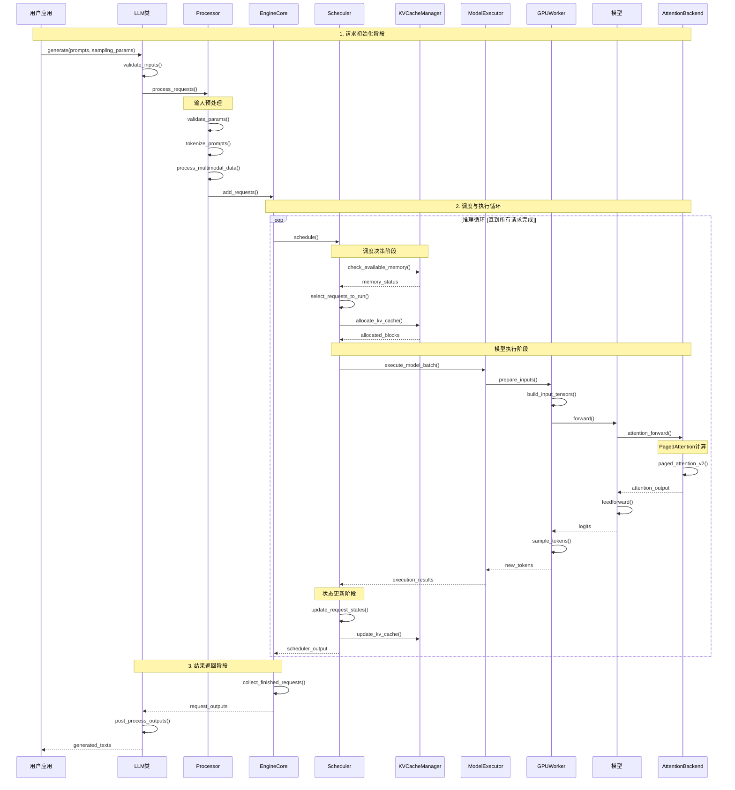

**关键阶段说明**：

1. **请求初始化阶段（1-3秒）**：
   - 输入验证和预处理
   - Token化和多模态数据处理
   - 请求对象创建

2. **调度与执行循环（主要耗时）**：
   - 每个循环处理一个或多个推理步骤
   - 包含调度决策、内存管理、模型执行
   - 动态调整批次大小和内存分配

3. **结果返回阶段（<1秒）**：
   - 收集完成的请求
   - 后处理和格式化输出

## 2. 详细子流程分析

### 2.1 输入处理时序图

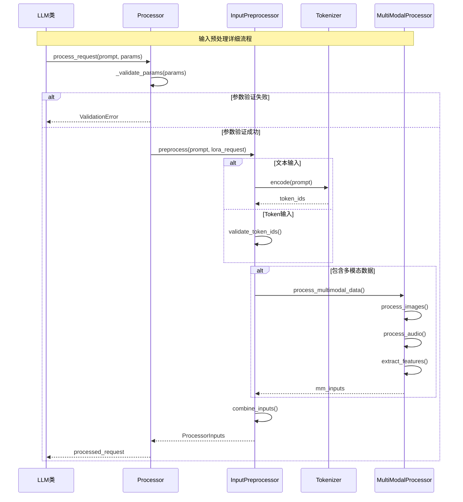

**处理步骤详解**：

1. **参数验证（~1ms）**：
   - 检查采样参数范围
   - 验证结构化输出配置
   - 确认token ID有效性

2. **文本预处理（1-10ms）**：
   - 分词处理
   - 特殊token添加
   - 序列长度检查

3. **多模态处理（10-100ms）**：
   - 图像特征提取
   - 音频预处理
   - 特征融合

### 2.2 调度器详细时序图

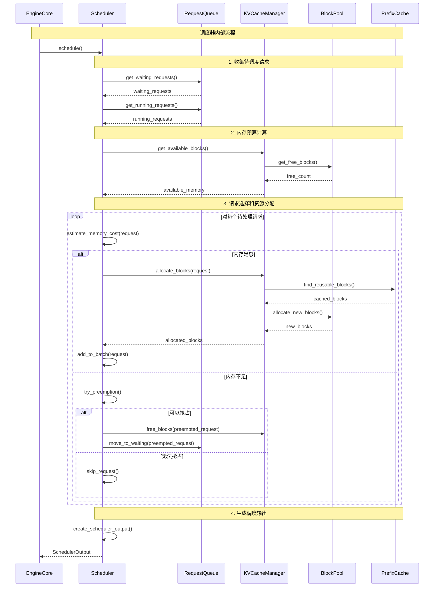

**调度策略说明**：

1. **内存预算管理**：
   - 基于可用GPU内存动态调整批次大小
   - 考虑KV缓存、激活值、梯度的内存需求
   - 预留安全边际防止OOM

2. **抢占式调度**：
   - 优先级高的请求可以抢占资源
   - 支持部分完成请求的暂停和恢复
   - 最小化重新计算开销

3. **前缀缓存优化**：
   - 识别相同前缀的请求
   - 共享KV缓存块
   - 减少重复计算

### 2.3 KV缓存管理时序图

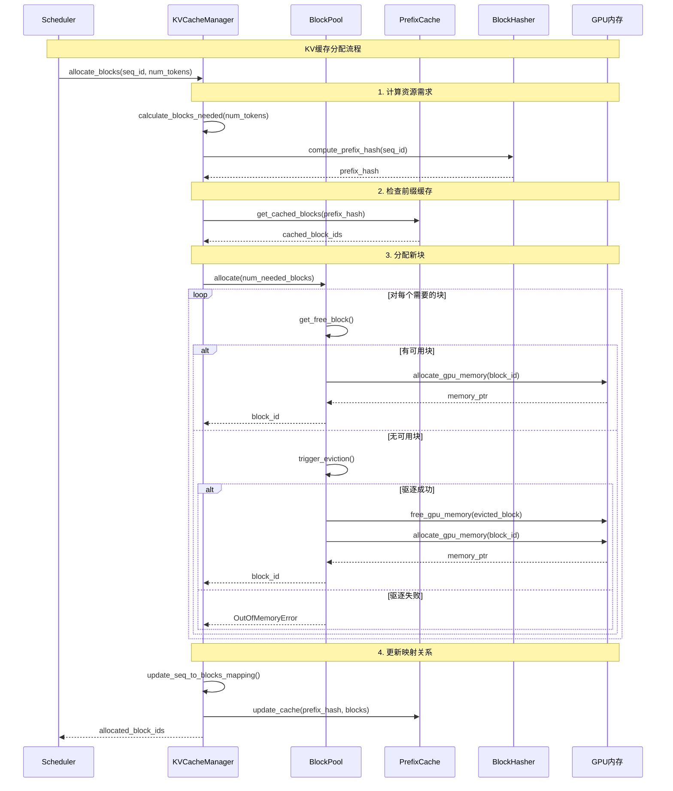

**缓存管理策略**：

1. **分页内存管理**：
   - 固定大小的内存页（通常16-64 tokens）
   - 动态分配和释放
   - 支持非连续内存布局

2. **前缀缓存共享**：
   - 基于内容哈希的缓存键
   - 引用计数管理
   - LRU驱逐策略

3. **内存驱逐机制**：
   - 优先驱逐未激活的缓存
   - 支持CPU-GPU内存交换
   - 最小化重新计算代价

### 2.4 模型执行时序图

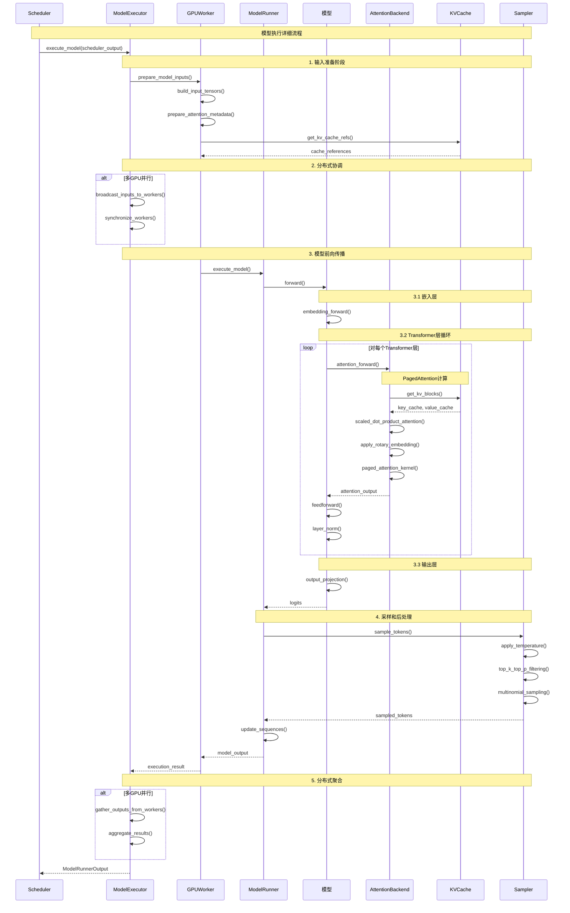

**模型执行关键点**：

1. **输入准备（1-5ms）**：
   - 构建输入张量批次
   - 准备注意力掩码
   - 获取KV缓存引用

2. **前向传播（10-1000ms）**：
   - 嵌入层计算
   - 多层Transformer处理  
   - PagedAttention高效计算

3. **采样后处理（1-10ms）**：
   - 温度缩放
   - Top-k/Top-p过滤
   - 多项式采样

### 2.5 PagedAttention详细时序图

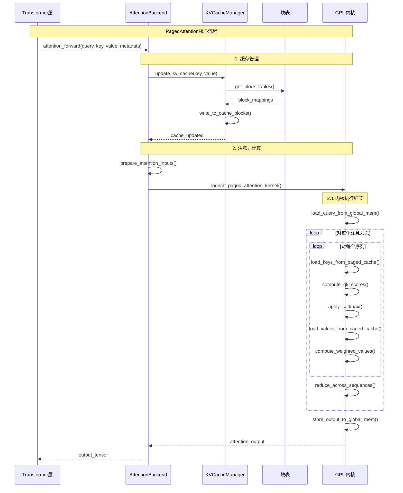

**PagedAttention优化点**：

1. **内存访问优化**：
   - 合并全局内存访问
   - 最大化共享内存利用
   - 减少内存带宽瓶颈

2. **并行策略**：
   - 头并行：不同注意力头并行计算
   - 序列并行：长序列分块并行
   - 批并行：多个序列同时处理

3. **缓存友好性**：
   - 页表索引优化
   - 块内数据布局优化
   - 预取策略

## 3. 异步处理时序图

### 3.1 异步LLM引擎

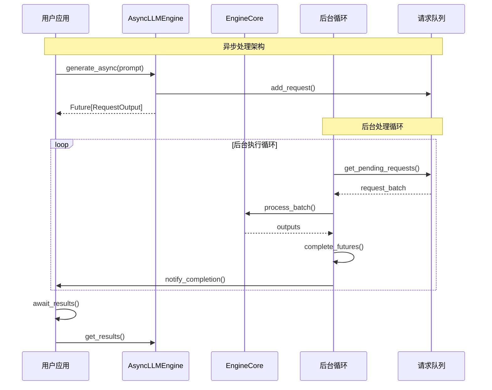

### 3.2 流式输出时序图

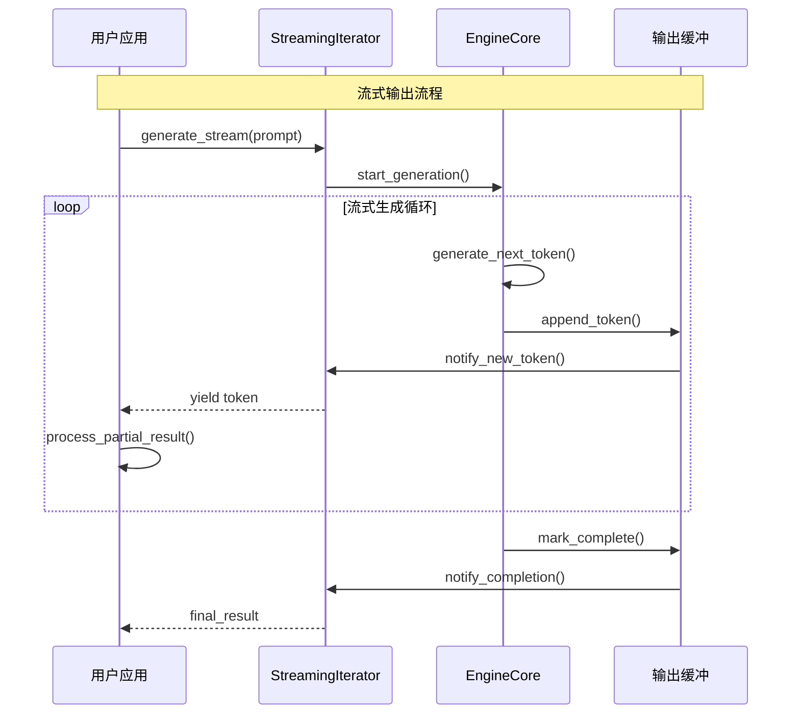

## 4. 错误处理和恢复时序图

### 4.1 OOM错误处理

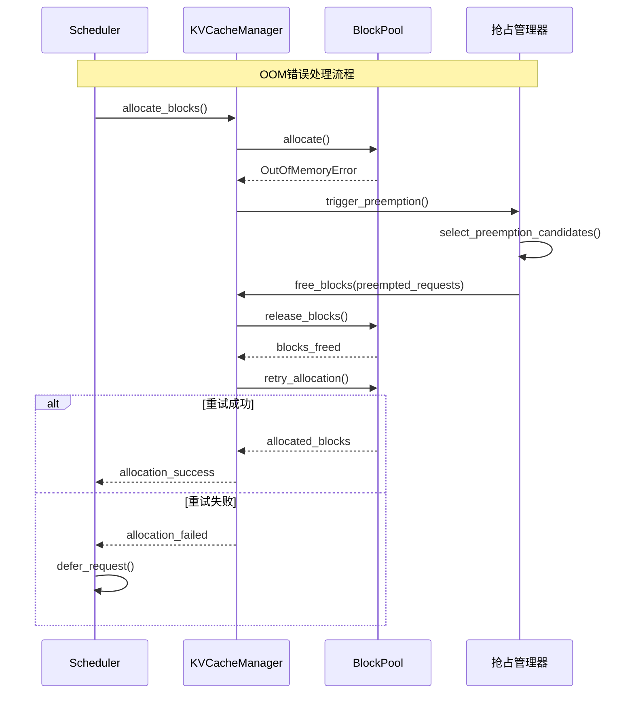

### 4.2 请求超时处理

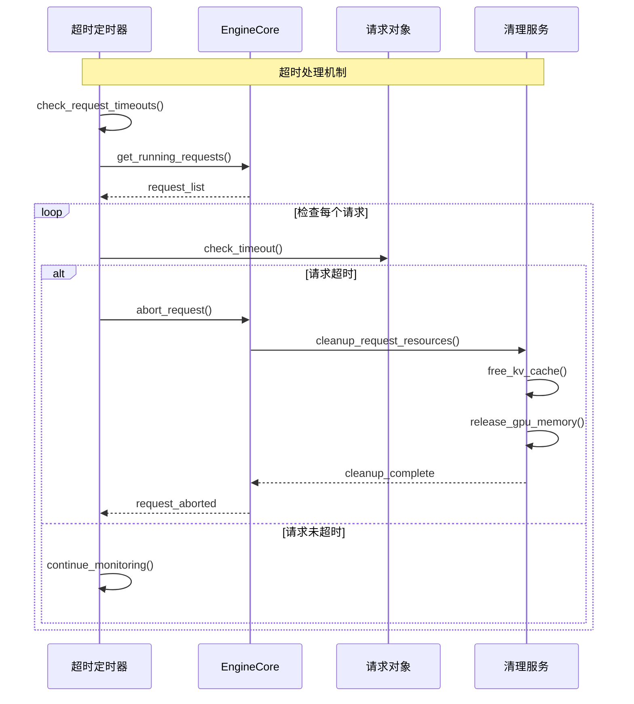

## 5. 性能监控时序图

### 5.1 指标收集流程

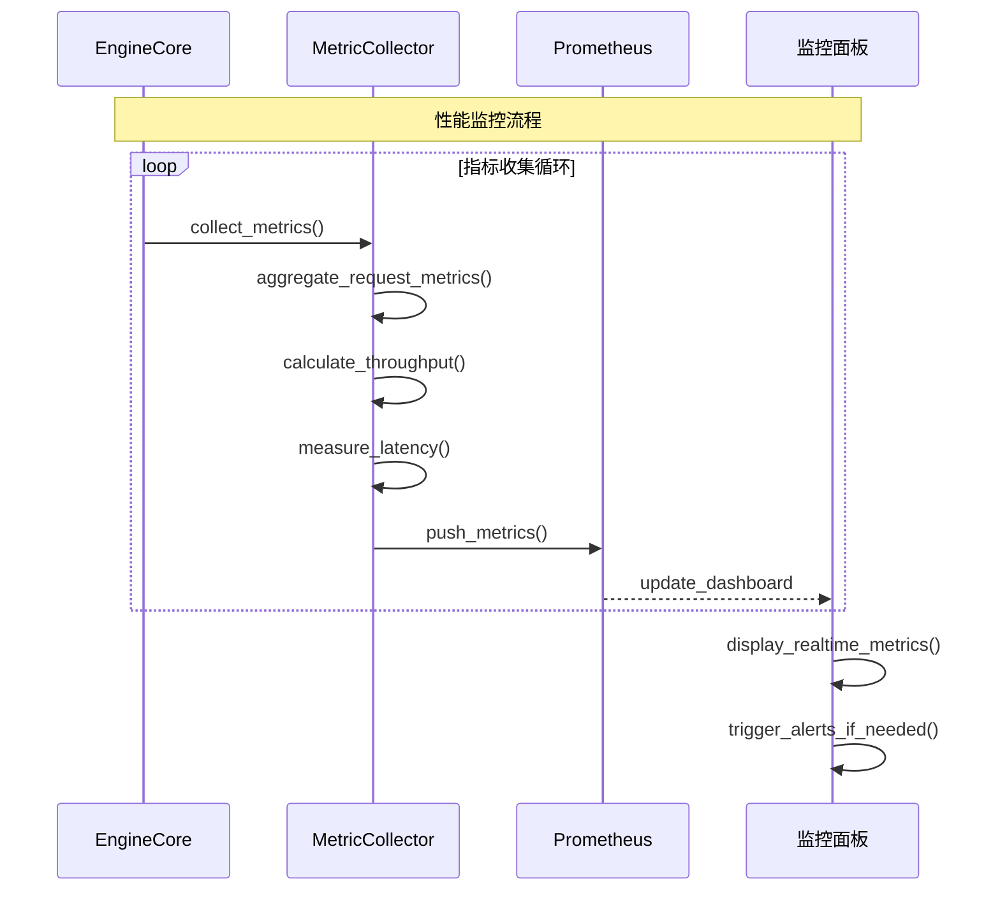

这些时序图展现了VLLM在不同场景下的执行流程，帮助开发者理解系统的动态行为和性能特征。通过这些图表，可以：

1. **识别性能瓶颈**：找出耗时最多的操作环节
2. **优化执行顺序**：调整组件间的交互时机
3. **设计容错机制**：理解错误传播路径
4. **监控系统健康**：建立有效的观测体系

每个时序图都标注了关键的时间节点和资源消耗，为系统调优提供了重要参考。
