# VoiceHelper-00-总览

## 0. 摘要

### 0.1 项目目标与问题域

VoiceHelper 是一个多平台 AI 语音助手平台，旨在解决以下核心问题：

- **实时语音交互**：提供低延迟（<500ms）的端到端语音对话能力，包括 ASR、LLM 推理和 TTS
- **智能知识检索**：基于 GraphRAG 的企业级知识图谱检索，支持多跳推理和实体关系查询
- **多模态理解**：支持语音、文本、图像、视频的统一处理和理解
- **Agent 协作**：Multi-Agent 系统实现复杂任务的分解、规划和执行
- **多平台适配**：统一后端服务支持 Web、移动端、小程序、桌面端、浏览器扩展等 7 个前端平台

### 0.2 核心能力边界

**支持的能力**：
- 实时语音对话（ASR + LLM + TTS）
- 文档智能摄取与检索（PDF、Word、Markdown、HTML）
- 知识图谱构建与推理（实体提取、关系抽取、社区检测）
- 多模型路由与降级（OpenAI、Claude、通义千问、GLM）
- 多模态分析（图像理解、OCR、视频分析）
- MCP 工具集成（文件系统、GitHub、HTTP）
- 会话管理与上下文维护
- 多租户隔离与权限控制
- 实时语音打断检测
- 语义缓存与性能优化

**非目标**：
- 通用搜索引擎（仅限知识库范围内检索）
- 实时翻译服务（虽支持多语言，但非主要场景）
- 内容创作平台（专注于对话和检索）
- 硬件设备控制（纯软件服务）

### 0.3 运行环境与依赖

**技术栈**：
- **后端网关**：Go 1.21+、Gin 框架、GORM、PostgreSQL、Redis
- **算法服务**：Python 3.11+、FastAPI、LangChain、LangGraph
- **数据存储**：PostgreSQL（主存储）、Redis（缓存）、Neo4j（知识图谱）、FAISS（向量检索）、MinIO（对象存储）
- **AI 服务**：OpenAI API、Anthropic Claude、通义千问、文心一言、GLM
- **语音服务**：Whisper（ASR）、Edge TTS（TTS）
- **前端**：Next.js 14+、React 18+、React Native、Electron、微信小程序

**部署形态**：
- **开发环境**：Docker Compose 本地编排
- **生产环境**：Kubernetes 微服务架构
- **服务拓扑**：API Gateway + 算法服务 + 4 个微服务（认证、文档、会话、通知）

---

## 1. 整体架构图

### 1.1 系统架构总览

```mermaid
flowchart TB
    subgraph Client["客户端层"]
        WEB[Web前端<br/>Next.js]
        MOBILE[移动端<br/>React Native]
        MINI[微信小程序]
        DESKTOP[桌面端<br/>Electron]
        EXT[浏览器扩展<br/>Chrome Extension]
        ADMIN[管理后台<br/>Flask]
        DEV[开发者门户<br/>Next.js]
    end

    subgraph Gateway["API网关层 - Go"]
        GW[API Gateway<br/>Gin + JWT]
        MW[中间件层<br/>认证/限流/CORS/追踪]
    end

    subgraph Services["服务层"]
        ALGO[算法服务<br/>FastAPI + Python]
        AUTH[认证服务<br/>Go]
        DOC[文档服务<br/>Go]
        SESSION[会话服务<br/>Go]
        NOTIFY[通知服务<br/>Go]
    end

    subgraph AlgoCore["算法核心模块"]
        RAG[GraphRAG<br/>Neo4j + FAISS]
        AGENT[Multi-Agent<br/>LangGraph]
        VOICE[实时语音<br/>Whisper + TTS]
        LLM[LLM路由<br/>多模型管理]
        MODAL[多模态<br/>图像/视频]
        MCP[MCP工具<br/>Filesystem/GitHub]
    end

    subgraph Data["数据层"]
        PG[(PostgreSQL<br/>主存储)]
        REDIS[(Redis<br/>缓存/会话)]
        NEO4J[(Neo4j<br/>知识图谱)]
        FAISS[(FAISS<br/>向量索引)]
        MINIO[(MinIO<br/>对象存储)]
    end

    subgraph External["外部服务"]
        OPENAI[OpenAI API]
        CLAUDE[Anthropic Claude]
        QWEN[通义千问]
        GLM[GLM]
    end

    Client -->|HTTP/WebSocket| GW
    GW --> MW
    MW --> ALGO
    MW --> AUTH
    MW --> DOC
    MW --> SESSION
    MW --> NOTIFY

    ALGO --> RAG
    ALGO --> AGENT
    ALGO --> VOICE
    ALGO --> LLM
    ALGO --> MODAL
    ALGO --> MCP

    RAG --> NEO4J
    RAG --> FAISS
    VOICE --> REDIS
    AGENT --> REDIS
    
    Services --> PG
    Services --> REDIS
    Services --> MINIO

    LLM --> OPENAI
    LLM --> CLAUDE
    LLM --> QWEN
    LLM --> GLM
```



### 1.2 架构图详细说明

#### 1.2.1 客户端层（7个平台）

**组件职责**：
- **Web 前端**：基于 Next.js 的响应式 Web 应用，支持 SSR/SSG
- **移动端**：React Native 跨平台应用（iOS + Android）
- **微信小程序**：原生小程序，服务微信生态用户
- **桌面端**：Electron 应用，支持 Windows/macOS/Linux
- **浏览器扩展**：Chrome Extension V3，侧边栏集成
- **管理后台**：Flask + SQLAlchemy，系统管理和监控
- **开发者门户**：API 文档、SDK 下载、示例代码

**数据流**：
- HTTP/HTTPS：REST API 调用（认证、查询、管理）
- WebSocket：实时语音流、语音打断、实时通知
- SSE：流式响应（LLM 生成、长文本输出）

#### 1.2.2 API 网关层（Go + Gin）

**核心职责**：
- **请求路由**：根据 URL 路径和版本号路由到对应服务
- **认证授权**：JWT 验证、RBAC 权限检查、多租户隔离
- **限流保护**：Redis 分布式限流，防止 API 滥用
- **跨域处理**：CORS 中间件，支持跨域请求
- **链路追踪**：生成 trace_id、request_id，传递到下游服务
- **监控上报**：Prometheus 指标收集、健康检查

**中间件链**：
```
请求 → Logger → Recovery → CORS → RequestID → 
Monitoring → RateLimit → Auth → RBAC → Tenant → Handler
```

**路由版本**：
- `/api/v01/*`：v0.1 基础版（认证、会话、聊天）
- `/api/v2/*`：v0.2 增强版（流式聊天、WebSocket 语音）
- `/api/v3/*`：v0.3 多模态版（图像、视频、MCP）

#### 1.2.3 服务层（5个服务）

**算法服务（FastAPI + Python）**：
- 端口：8000
- 职责：RAG 检索、语音处理、Agent 任务、LLM 调用、多模态分析
- 特点：异步 IO、协程并发、流式响应

**认证服务（Go）**：
- 端口：8001
- 职责：用户注册/登录、JWT 签发、SSO 集成、微信登录

**文档服务（Go）**：
- 端口：8002
- 职责：文档上传、元数据管理、权限控制

**会话服务（Go）**：
- 端口：8003
- 职责：会话创建/查询、历史记录管理、上下文维护

**通知服务（Go）**：
- 端口：8004
- 职责：WebSocket 通知推送、事件订阅、异步通知

#### 1.2.4 算法核心模块（Python）

**GraphRAG 模块**：
- 文档摄取：分块、向量化、实体提取、关系抽取
- 图构建：Neo4j 存储、Cypher 查询、社区检测
- 混合检索：向量检索（FAISS）+ 图推理（Neo4j）
- 语义缓存：Redis 缓存常见查询，减少 LLM 调用

**Multi-Agent 模块**：
- 规划 Agent：任务分解、依赖分析
- 执行 Agent：工具调用、并行执行
- 反思 Agent：结果验证、错误纠正
- 协作机制：LangGraph 状态图、消息传递

**实时语音模块**：
- ASR：Whisper 实时流式识别、VAD 语音活动检测
- TTS：Edge TTS 流式合成、低延迟优化
- 打断检测：实时 VAD、上下文中断
- WebSocket：全双工通信、心跳保活

**LLM 路由模块**：
- 模型池：OpenAI（GPT-4/3.5）、Claude（3.5/3）、通义千问、GLM
- 路由策略：成本优先、性能优先、负载均衡
- 降级策略：主模型失败自动切换备用模型
- 批处理：批量请求合并，降低 API 调用成本

**多模态模块**：
- 图像理解：GPT-4 Vision、Claude Vision
- OCR：PaddleOCR、EasyOCR
- 视频分析：关键帧提取、多模态融合

**MCP 工具模块**：
- 文件系统：读写文件、列目录
- GitHub：搜索仓库、获取文件内容
- HTTP：自定义 HTTP 请求

#### 1.2.5 数据层（5种存储）

**PostgreSQL（主存储）**：
- 用户信息、会话记录、文档元数据、系统配置
- 连接池：最大连接 100、空闲超时 10 分钟
- 事务隔离级别：Read Committed

**Redis（缓存 + 会话）**：
- 缓存：API 响应、查询结果、用户 Session
- 会话：会话上下文、对话历史（7 天过期）
- 限流：滑动窗口计数器
- 语义缓存：查询向量的 embedding 缓存

**Neo4j（知识图谱）**：
- 实体节点：人物、组织、地点、事件
- 关系边：实体间关系（属于、位于、发生于）
- 社区检测：Louvain 算法聚类
- Cypher 查询：多跳推理、路径查找

**FAISS（向量索引）**：
- 索引类型：IVF（倒排文件索引）
- Embedding 模型：BGE-M3、OpenAI text-embedding-3
- 相似度：余弦相似度
- 索引大小：支持千万级向量

**MinIO（对象存储）**：
- 文档原文件、音频文件、图像文件、视频文件
- 桶策略：按租户/用户隔离
- CDN 加速：静态资源分发

#### 1.2.6 外部服务（AI API）

**调用模式**：
- HTTP REST API（OpenAI、Claude、通义千问、GLM）
- 流式响应：Server-Sent Events（SSE）
- 重试策略：指数退避（3 次）
- 超时设置：30 秒（普通）、120 秒（长文本）

**成本优化**：
- 语义缓存：相似查询直接返回缓存结果
- 批量调用：合并多个请求
- 模型降级：优先使用低成本模型，必要时使用高性能模型

---

## 2. 全局时序图（核心业务闭环）

### 2.1 语音对话全流程时序图


### 2.2 时序图详细说明

#### 步骤 1-5：WebSocket 连接建立

**入口点**：客户端点击"开始对话"按钮

**鉴权流程**：
- 客户端携带 JWT Token 发起 WebSocket 连接
- API 网关验证 Token 有效性（签名、过期时间）
- 通过后建立 WebSocket 连接，生成 `session_id`

**边界条件**：
- Token 无效：返回 401 Unauthorized，关闭连接
- Token 过期：返回 403 Forbidden，提示刷新 Token
- 连接超时：10 秒无心跳自动断开

**性能要点**：
- WebSocket 复用：同一用户多次对话复用连接
- 连接池：服务端维护连接池，限制最大连接数（10000）
- 心跳机制：客户端每 30 秒发送 ping，服务端响应 pong

#### 步骤 6-10：实时音频流式识别

**音频格式**：
- 采样率：16kHz
- 位深：16bit PCM
- 通道：单声道
- Chunk 大小：320 字节（20ms 音频）

**ASR 流程**：
- VAD 预处理：检测语音活动，过滤静音
- 流式识别：Whisper 模型实时处理
- 中间结果：每 500ms 返回部分识别文本

**打断检测**：
- 客户端检测到新的语音输入
- 发送 `interrupt` 信号，终止当前 TTS 播放
- 服务端清空 TTS 队列，准备处理新输入

**异常处理**：
- 音频格式错误：返回 `audio_format_error`
- 识别超时（10 秒无结果）：返回 `asr_timeout`
- 网络中断：自动重连（3 次，指数退避）

#### 步骤 11-18：LLM 推理 + GraphRAG 检索

**缓存策略**：
- 语义缓存键：查询文本的 embedding 向量
- 相似度阈值：>0.95 认为缓存命中
- 缓存时效：24 小时（热点查询）、1 小时（普通查询）

**检索流程**（缓存未命中）：
1. **向量检索**：FAISS 搜索 Top-10 相似文档片段
2. **图推理**：Neo4j 查询相关实体和关系
3. **重排序**：根据相关性和时效性重新排序
4. **上下文构建**：拼接检索结果 + 对话历史（最近 5 轮）

**LLM 路由**：
- 查询复杂度评估：简单问题 → GPT-3.5，复杂问题 → GPT-4
- 成本控制：优先使用低成本模型，错误重试时升级模型
- 降级策略：主模型（OpenAI）失败 → 备用模型（Claude）

**超时与重试**：
- 检索超时：5 秒
- LLM 调用超时：30 秒
- 重试次数：3 次，指数退避（1s、2s、4s）

#### 步骤 19-25：流式 TTS 合成与播放

**TTS 流程**：
- 文本分段：按句号、问号分割，每段 20-50 字
- 流式合成：Edge TTS 实时合成音频（MP3）
- 流式推送：每生成 1KB 音频立即推送

**低延迟优化**：
- 首字延迟：< 500ms（从文本到首个音频 chunk）
- 流式播放：客户端边接收边播放（无需等待全部音频）
- 预加载：在 LLM 生成时并行启动 TTS 准备

**音频质量**：
- 采样率：24kHz（高质量）
- 比特率：128kbps
- 格式：MP3（兼容性好）或 PCM（低延迟）

**打断机制**：
- 用户开始说话 → 客户端发送 `interrupt` 信号
- 服务端立即停止 TTS 输出
- 客户端停止播放，清空音频缓冲区

#### 步骤 26-27：会话上下文保存

**上下文结构**：
```json
{
  "session_id": "session_123",
  "user_id": "user_456",
  "history": [
    {"role": "user", "content": "北京今天天气怎么样", "timestamp": 1234567890},
    {"role": "assistant", "content": "北京今天多云，温度15-25度", "timestamp": 1234567895}
  ],
  "context": {
    "location": "北京",
    "topic": "天气查询"
  }
}
```

**存储位置**：
- Redis：短期上下文（7 天 TTL）
- PostgreSQL：长期历史（永久存储）

**性能优化**：
- 异步保存：不阻塞主流程
- 批量写入：每 10 条消息批量写入数据库
- 上下文窗口：只保留最近 10 轮对话

---

## 3. 模块边界与交互图

### 3.1 模块清单与职责

| 序号 | 模块名称 | 代码路径 | 对外 API | 调用方 | 被调方 |
|---|---|---|---|---|---|
| 01 | Backend 网关 | `backend/` | HTTP REST、WebSocket | 前端 7 个平台 | 算法服务、4 个微服务 |
| 02 | 算法服务 | `algo/` | HTTP REST、WebSocket | Backend 网关 | LLM API、数据层 |
| 03 | GraphRAG 模块 | `algo/core/rag/` | Python 函数 | 算法服务 | Neo4j、FAISS |
| 04 | Multi-Agent 模块 | `algo/core/agent/` | Python 函数 | 算法服务 | LLM API、MCP 工具 |
| 05 | 实时语音模块 | `algo/core/voice/` | WebSocket | 算法服务 | Whisper、Edge TTS |
| 06 | LLM 路由模块 | `algo/core/llm/` | Python 函数 | RAG、Agent | OpenAI、Claude、通义千问 |
| 07 | 多模态模块 | `algo/core/multimodal/` | HTTP REST | 算法服务 | GPT-4V、OCR 引擎 |
| 08 | MCP 工具模块 | `algo/core/mcp/` | Python 函数 | Agent | 文件系统、GitHub API |
| 09 | 认证服务 | `services/auth-service/` | gRPC、HTTP | Backend 网关 | PostgreSQL、Redis |
| 10 | 文档服务 | `services/document-service/` | gRPC、HTTP | Backend 网关 | PostgreSQL、MinIO |
| 11 | 会话服务 | `services/session-service/` | gRPC、HTTP | Backend 网关 | PostgreSQL、Redis |
| 12 | 通知服务 | `services/notification-service/` | gRPC、WebSocket | Backend 网关 | Redis、WebSocket 连接池 |

### 3.2 模块交互矩阵


### 3.3 交互说明

#### 3.3.1 同步调用

| 调用方 | 被调方 | 接口 | 协议 | 超时 | 重试 |
|---|---|---|---|---|---|
| Backend 网关 | 认证服务 | `/auth/validate` | HTTP | 3s | 否 |
| Backend 网关 | 算法服务 | `/api/v3/chat` | HTTP | 30s | 是（3次） |
| 算法服务 | LLM 路由 | `route_request()` | 函数调用 | 30s | 是（3次） |
| LLM 路由 | OpenAI API | `/v1/chat/completions` | HTTP | 30s | 是（3次） |

#### 3.3.2 异步消息

| 发布方 | 订阅方 | 事件 | 传输 | 持久化 |
|---|---|---|---|---|
| 算法服务 | 通知服务 | `ingest_complete` | Redis Pub/Sub | 否 |
| 文档服务 | 算法服务 | `document_uploaded` | Redis Pub/Sub | 否 |

#### 3.3.3 共享存储

| 模块 | 存储 | 用途 | 一致性 |
|---|---|---|---|
| 认证服务 | Redis | JWT Token 黑名单 | 强一致 |
| 会话服务 | Redis | 会话上下文 | 最终一致 |
| GraphRAG | Neo4j | 知识图谱 | 最终一致 |
| GraphRAG | FAISS | 向量索引 | 最终一致 |

#### 3.3.4 WebSocket 订阅

| 订阅方 | 发布方 | 事件类型 | 频率 |
|---|---|---|---|
| Web 前端 | 实时语音模块 | 语音识别结果 | 500ms |
| Web 前端 | LLM 路由 | 流式生成文本 | 实时 |
| Web 前端 | 通知服务 | 系统通知 | 按需 |

---

## 4. 关键设计与权衡

### 4.1 数据一致性

**强一致性场景**：
- 用户认证：JWT Token 验证必须实时生效
- 权限变更：RBAC 权限更新立即生效
- 余额扣减：API 调用计费实时扣减

**最终一致性场景**：
- 会话上下文：Redis 与 PostgreSQL 异步同步（延迟 < 1s）
- 知识图谱：文档摄取后异步构建图（延迟 < 10s）
- 向量索引：向量化异步写入 FAISS（延迟 < 5s）

**冲突解决策略**：
- 乐观锁：使用 Etag 或版本号，冲突时返回 409 Conflict
- 分布式锁：Redis SETNX 实现，防止并发摄取同一文档
- CAS 操作：Redis WATCH + MULTI 事务

### 4.2 事务边界

**单服务事务**：
- 认证服务：用户注册（写 PostgreSQL + Redis）使用数据库事务
- 会话服务：会话创建（写 PostgreSQL + Redis）使用 WATCH 多键事务

**跨服务事务**：
- Saga 模式：文档摄取失败后回滚（删除元数据、清理 MinIO）
- 补偿机制：LLM 调用失败不回滚，记录失败日志供人工处理

### 4.3 锁与并发策略

**分布式锁**：
- 文档摄取：同一文档同时只能有一个摄取任务（Redis 锁，TTL 10 分钟）
- 向量索引：FAISS 写入时加锁，避免并发写入冲突（进程锁）

**无锁设计**：
- 会话读取：无锁读取，接受脏读（最终一致性）
- 语义缓存：允许缓存雪崩，使用随机 TTL 避免集中过期

**并发控制**：
- 连接池：PostgreSQL 最大 100 连接、Redis 最大 50 连接
- 协程池：算法服务使用 asyncio，最大 1000 并发协程
- Goroutine 池：Backend 网关无限制，依赖操作系统调度

### 4.4 性能关键路径

**P95 延迟目标**：
| 接口 | P95 延迟 | 瓶颈 | 优化手段 |
|---|---|---|---|
| 用户登录 | 200ms | 数据库查询 + JWT 签名 | Redis 缓存用户信息 |
| 文档检索 | 500ms | 向量检索 + 图推理 + LLM 调用 | 语义缓存、批处理、模型降级 |
| 语音对话（端到端） | 3s | ASR + LLM + TTS | 流式处理、预加载、低延迟 TTS |
| 图像分析 | 5s | GPT-4V 调用 | 批处理、缓存 |

**I/O 热点**：
- Redis 读写：会话上下文、语义缓存、限流计数（QPS > 10000）
- PostgreSQL 读：用户查询、会话查询（QPS > 5000）
- FAISS 检索：向量相似度搜索（QPS > 1000）
- LLM API 调用：OpenAI API（QPS > 500）

**优化策略**：
- 多级缓存：本地内存（用户信息）→ Redis（会话）→ PostgreSQL（持久化）
- 批处理：向量化批量处理（一次 100 个文档）、LLM 批量调用（一次 10 个请求）
- 异步化：文档摄取、向量索引构建、会话保存

### 4.5 可观测性指标

**业务指标**：
- 用户活跃度：DAU、MAU、会话数、消息数
- LLM 使用量：Token 消耗、API 调用次数、成本统计
- 检索性能：查询 QPS、命中率、平均延迟

**性能指标**：
- 接口延迟：P50、P95、P99
- 吞吐量：QPS、TPS
- 错误率：4xx、5xx 错误比例

**资源指标**：
- CPU 使用率：服务器、容器
- 内存使用率：JVM/Python/Go 进程
- 磁盘 I/O：PostgreSQL、MinIO
- 网络流量：入站、出站

**告警规则**：
| 指标 | 阈值 | 级别 | 动作 |
|---|---|---|---|
| API 错误率 | > 5% | P1 | 发送 Slack 告警、短信通知 |
| LLM 调用失败 | > 10% | P2 | 发送邮件告警 |
| Redis 连接数 | > 80% | P2 | 扩容 Redis |
| 向量检索延迟 | P95 > 2s | P3 | 优化索引 |

### 4.6 配置项与可变参数

**系统配置**（环境变量）：
- `DATABASE_HOST`：PostgreSQL 地址
- `REDIS_URL`：Redis 连接字符串
- `NEO4J_URL`：Neo4j 连接字符串
- `OPENAI_API_KEY`：OpenAI API 密钥
- `JWT_SECRET`：JWT 签名密钥

**业务配置**（数据库）：
- 向量检索 Top-K：默认 10（可调整 1-100）
- LLM 温度：默认 0.7（可调整 0-2）
- 会话上下文窗口：默认 10 轮（可调整 5-50）
- 语义缓存相似度阈值：默认 0.95（可调整 0.8-1.0）

---

## 5. 典型使用示例与最佳实践

### 5.1 示例 1：最小可运行入口

**场景**：开发者首次部署 VoiceHelper，完成一次端到端对话

**前置条件**：
- Docker 和 Docker Compose 已安装
- OpenAI API Key 已准备

**步骤**：

```bash
# 1. 克隆仓库
git clone https://github.com/yourcompany/voicehelper.git
cd voicehelper

# 2. 配置环境变量
cp .env.example .env
# 编辑 .env 文件，填写 OPENAI_API_KEY

# 3. 启动服务
make docker-up

# 4. 等待服务启动（约 30 秒）
# 检查服务健康状态
curl http://localhost:8080/health  # Backend 网关
curl http://localhost:8000/health  # 算法服务

# 5. 注册用户
curl -X POST http://localhost:8080/api/v01/auth/register \
  -H "Content-Type: application/json" \
  -d '{
    "username": "testuser",
    "password": "Test@123456",
    "email": "test@example.com"
  }'

# 6. 登录获取 Token
curl -X POST http://localhost:8080/api/v01/auth/login \
  -H "Content-Type: application/json" \
  -d '{
    "username": "testuser",
    "password": "Test@123456"
  }'
# 记录返回的 access_token

# 7. 创建会话
curl -X POST http://localhost:8080/api/v01/sessions \
  -H "Content-Type: application/json" \
  -H "Authorization: Bearer YOUR_ACCESS_TOKEN" \
  -d '{
    "title": "测试会话"
  }'
# 记录返回的 session_id

# 8. 发起流式聊天
curl -X POST http://localhost:8080/api/v01/chat/stream \
  -H "Content-Type: application/json" \
  -H "Authorization: Bearer YOUR_ACCESS_TOKEN" \
  -d '{
    "session_id": "YOUR_SESSION_ID",
    "query": "你好，请介绍一下自己"
  }'
# 观察流式返回的 SSE 响应
```

**预期结果**：
- 服务正常启动，健康检查通过
- 用户注册和登录成功
- 会话创建成功
- LLM 流式返回自我介绍内容

### 5.2 示例 2：扩展点 - 自定义 LLM 模型

**场景**：接入自己部署的开源 LLM 模型（如 LLaMA）

**步骤**：

```python
# 1. 在 algo/core/llm/custom_provider.py 中添加自定义提供商

from core.llm.base_provider import BaseLLMProvider

class CustomLLMProvider(BaseLLMProvider):
    """自定义 LLM 提供商"""
    
    def __init__(self, api_base: str, api_key: str):
        self.api_base = api_base
        self.api_key = api_key
    
    async def chat_completion(self, messages: list, **kwargs):
        """实现聊天补全接口"""
        # 调用自定义 API
        response = await self._call_api(
            url=f"{self.api_base}/v1/chat/completions",
            headers={"Authorization": f"Bearer {self.api_key}"},
            json={
                "messages": messages,
                "temperature": kwargs.get("temperature", 0.7),
                "max_tokens": kwargs.get("max_tokens", 2000),
            }
        )
        return response["choices"][0]["message"]["content"]

# 2. 在 algo/core/llm/model_router.py 中注册自定义提供商

from core.llm.custom_provider import CustomLLMProvider

class ModelRouter:
    def __init__(self):
        self.providers = {
            "openai": OpenAIProvider(...),
            "claude": ClaudeProvider(...),
            "custom": CustomLLMProvider(
                api_base=os.getenv("CUSTOM_LLM_API_BASE"),
                api_key=os.getenv("CUSTOM_LLM_API_KEY")
            )
        }
    
    def route(self, request):
        # 路由到自定义模型
        if request.model == "custom/llama":
            return self.providers["custom"]
        # ... 其他路由逻辑

# 3. 配置环境变量

# .env
CUSTOM_LLM_API_BASE=http://localhost:8001
CUSTOM_LLM_API_KEY=your_api_key

# 4. 调用自定义模型

curl -X POST http://localhost:8000/api/v3/chat \
  -H "Authorization: Bearer YOUR_TOKEN" \
  -d '{
    "model": "custom/llama",
    "messages": [{"role": "user", "content": "你好"}]
  }'
```

### 5.3 示例 3：规模化上线注意事项

**生产环境检查清单**：

- [ ] **数据库优化**
  - [ ] PostgreSQL 连接池配置（最大 100）
  - [ ] Redis 持久化配置（RDB + AOF）
  - [ ] Neo4j 内存配置（heap size >= 4GB）
  - [ ] FAISS 索引预加载（避免冷启动）

- [ ] **服务高可用**
  - [ ] Backend 网关部署 >= 2 实例
  - [ ] 算法服务部署 >= 2 实例
  - [ ] 微服务各 >= 2 实例
  - [ ] 负载均衡器配置（Nginx/ALB）
  - [ ] 健康检查配置（每 10s 检查一次）

- [ ] **监控与告警**
  - [ ] Prometheus 指标收集配置
  - [ ] Grafana Dashboard 部署
  - [ ] 告警规则配置（Alertmanager）
  - [ ] 日志聚合配置（ELK）
  - [ ] 链路追踪配置（Jaeger）

- [ ] **安全配置**
  - [ ] TLS/SSL 证书配置
  - [ ] JWT 密钥轮换机制
  - [ ] API 限流配置（100 req/min per user）
  - [ ] 敏感数据加密（AES-256）
  - [ ] 审计日志启用

- [ ] **成本优化**
  - [ ] 语义缓存启用（减少 LLM 调用）
  - [ ] 批处理配置（向量化批处理）
  - [ ] 模型降级策略（优先低成本模型）
  - [ ] CDN 配置（静态资源加速）

- [ ] **灾难恢复**
  - [ ] 数据库定期备份（每日全量 + 每小时增量）
  - [ ] Redis 主从复制
  - [ ] Neo4j 备份（每周）
  - [ ] 配置文件版本管理（Git）
  - [ ] 回滚演练（每月）

**性能压测**：

```bash
# 使用 Locust 进行压测
locust -f tests/performance/locustfile.py \
  --host http://your-production-domain.com \
  --users 1000 \
  --spawn-rate 50 \
  --run-time 10m

# 目标指标
# - QPS: >= 5000（网关）、>= 1000（算法服务）
# - P95 延迟: < 500ms（检索）、< 3s（语音对话）
# - 错误率: < 1%
```

---

## 6. 附录

### 6.1 术语表

| 术语 | 全称 | 说明 |
|---|---|---|
| RAG | Retrieval-Augmented Generation | 检索增强生成 |
| GraphRAG | Graph-based RAG | 基于知识图谱的 RAG |
| ASR | Automatic Speech Recognition | 自动语音识别 |
| TTS | Text-to-Speech | 文本转语音 |
| VAD | Voice Activity Detection | 语音活动检测 |
| LLM | Large Language Model | 大语言模型 |
| MCP | Model Context Protocol | 模型上下文协议 |
| SSE | Server-Sent Events | 服务器推送事件 |
| JWT | JSON Web Token | JSON Web 令牌 |
| RBAC | Role-Based Access Control | 基于角色的访问控制 |

### 6.2 参考文档

- [快速开始指南](../guides/QUICK_START_GUIDE.md)
- [核心代码结构](../guides/CORE_CODE_STRUCTURE.md)
- [API 文档](../api/API_OVERVIEW.md)
- [架构设计文档](../architecture/)
- [版本迭代计划](../../V07_V10_PLAN.md)

---

**文档版本**：v1.0  
**最后更新**：2025-01-08  
**维护者**：VoiceHelper 团队

