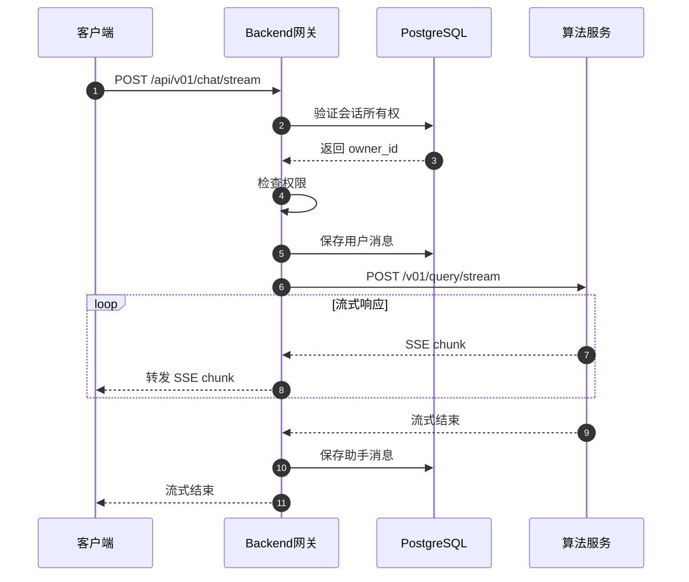

# VoiceHelper-01-Backend网关

## 模块概览

### 职责定位

Backend 网关是 VoiceHelper 系统的统一入口，基于 Go 语言和 Gin 框架构建，负责：

- **请求路由**：将客户端请求路由到算法服务或微服务
- **认证授权**：JWT Token 验证、RBAC 权限控制、多租户隔离
- **流量控制**：API 限流、熔断、降级
- **协议转换**：HTTP/WebSocket 适配、请求/响应格式转换
- **可观测性**：日志记录、指标收集、链路追踪
- **安全防护**：CORS、XSS 防护、SQL 注入防护

### 输入输出

**输入**：
- HTTP REST 请求（来自前端 7 个平台）
- WebSocket 连接（实时语音对话）
- gRPC 请求（微服务间调用）

**输出**：
- HTTP 响应（JSON 格式）
- WebSocket 消息（实时双向通信）
- SSE 流式响应（LLM 流式生成）

### 上下游依赖

**上游**：7 个前端平台（Web、Mobile、小程序、Desktop、Extension、Admin、Developer Portal）

**下游**：
- 算法服务（HTTP/WebSocket）：http://localhost:8000
- 认证服务（gRPC）：localhost:8001
- 文档服务（gRPC）：localhost:8002
- 会话服务（gRPC）：localhost:8003
- 通知服务（WebSocket）：localhost:8004
- PostgreSQL：主存储
- Redis：缓存、会话、限流

### 生命周期

1. **启动阶段**（约 3-5 秒）：
   - 加载配置（环境变量 + 配置文件）
   - 初始化数据库连接池（PostgreSQL + Redis）
   - 初始化监控系统（Prometheus + 健康检查）
   - 创建中间件和处理器
   - 注册路由
   - 启动 HTTP 服务器

2. **运行阶段**：
   - 接收并处理请求
   - 定期健康检查（每 30 秒）
   - 指标收集与上报（每 15 秒）
   - 连接池维护

3. **关闭阶段**（优雅关闭，最长 30 秒）：
   - 停止接收新请求
   - 等待现有请求处理完成
   - 关闭数据库连接
   - 关闭监控系统
   - 清理资源

---

## 模块架构图


### 架构说明

**路由器层**：
- Gin Engine 作为核心路由引擎
- 支持路由组（v01、v2、v3）
- 支持参数路由（:id）、通配符路由（*path）

**中间件链**：
- 按顺序执行，形成洋葱模型
- 每个中间件可以决定是否继续（c.Next() 或 c.Abort()）
- 错误恢复（Recovery）保证单个请求失败不影响整体服务

**处理器层**：
- 按版本划分（v01、v2、v3）
- 每个处理器负责一类业务功能
- 处理器之间互不依赖，独立演进

**扩展点**：
- 新增中间件：在 Router.Use() 中注册
- 新增处理器：创建新的 Handler 结构体
- 新增路由：在 SetupRoutes() 中添加

**状态持有**：
- 无状态设计：不在内存中保存会话状态
- 状态外置：JWT Token（用户状态）、Redis（会话状态）

**资源占用**：
- 内存：约 100-200MB（空闲）、500MB-1GB（高负载）
- CPU：单核 10-20%（空闲）、多核 50-80%（高负载）
- 连接数：PostgreSQL 100、Redis 50、下游服务 1000
- Goroutine：每个请求 1-2 个，高峰时可达 10000+

---

## 核心 API 列表

### v0.1 版本 API（基础架构版）

#### 1. 用户注册 - POST /api/v01/auth/register

**基本信息**：
- 协议：HTTP POST
- 路径：`/api/v01/auth/register`
- 幂等性：否（重复注册返回用户名已存在错误）
- 限流：5 次/分钟（按 IP）

**请求结构体**：

```go
type RegisterRequest struct {
    Username string `json:"username" binding:"required,min=3,max=50"`
    Email    string `json:"email" binding:"required,email"`
    Password string `json:"password" binding:"required,min=8"`
}
```

**字段表**：

| 字段 | 类型 | 必填 | 约束 | 说明 |
|---|---|---:|---|---|
| username | string | 是 | 3-50 字符，字母数字下划线 | 用户名，全局唯一 |
| email | string | 是 | 有效邮箱格式 | 用户邮箱，用于找回密码 |
| password | string | 是 | ≥8 字符，包含大小写字母和数字 | 明文密码，服务端 bcrypt 加密 |

**响应结构体**：

```go
type TokenResponse struct {
    AccessToken  string    `json:"access_token"`
    RefreshToken string    `json:"refresh_token"`
    ExpiresIn    int64     `json:"expires_in"`
    User         *UserInfo `json:"user"`
}

type UserInfo struct {
    ID       string `json:"id"`
    Username string `json:"username"`
    Email    string `json:"email"`
}
```

**字段表**：

| 字段 | 类型 | 说明 |
|---|---|---|
| access_token | string | JWT 访问令牌，有效期 24 小时 |
| refresh_token | string | 刷新令牌，有效期 7 天 |
| expires_in | int64 | 过期时间（秒），固定 86400 |
| user | object | 用户信息对象 |
| user.id | string | 用户 UUID |
| user.username | string | 用户名 |
| user.email | string | 用户邮箱 |

**入口函数**（核心代码）：

```go
func (h *V01AuthHandler) Register(c *gin.Context) {
    var req RegisterRequest
    // 1. 参数绑定与校验
    if err := c.ShouldBindJSON(&req); err != nil {
        c.JSON(http.StatusBadRequest, gin.H{"error": "Invalid request"})
        return
    }

    // 2. 输入清理，防止 XSS
    req.Username = sanitizeInput(req.Username)
    req.Email = sanitizeEmail(req.Email)

    // 3. 密码强度验证（大小写字母 + 数字）
    if err := validatePasswordStrength(req.Password); err != nil {
        c.JSON(http.StatusBadRequest, gin.H{"error": err.Error()})
        return
    }

    // 4. 检查用户名/邮箱是否已存在
    var exists bool
    err := h.db.QueryRowContext(ctx,
        "SELECT EXISTS(SELECT 1 FROM users WHERE username = $1 OR email = $2)",
        req.Username, req.Email).Scan(&exists)
    
    if exists {
        c.JSON(http.StatusConflict, gin.H{"error": "用户名或邮箱已存在"})
        return
    }

    // 5. 密码 bcrypt 加密（cost=10）
    hashedPassword, _ := bcrypt.GenerateFromPassword([]byte(req.Password), 10)

    // 6. 生成用户 ID
    userID := uuid.New().String()

    // 7. 插入用户记录（事务）
    _, err = h.db.ExecContext(ctx, `
        INSERT INTO users (id, username, email, password_hash, created_at, updated_at)
        VALUES ($1, $2, $3, $4, NOW(), NOW())
    `, userID, req.Username, req.Email, hashedPassword)

    // 8. 生成 JWT Token
    accessToken, refreshToken := h.generateTokens(userID, req.Username)

    // 9. 返回响应
    c.JSON(http.StatusCreated, TokenResponse{
        AccessToken:  accessToken,
        RefreshToken: refreshToken,
        ExpiresIn:    86400,
        User: &UserInfo{
            ID:       userID,
            Username: req.Username,
            Email:    req.Email,
        },
    })
}
```

**调用链**：

```
客户端 
  → Gin Router 
  → 中间件链（Logger → Recovery → CORS → RequestID → RateLimit）
  → V01AuthHandler.Register()
  → PostgreSQL (检查用户是否存在)
  → bcrypt.GenerateFromPassword() (密码加密)
  → PostgreSQL (插入用户记录)
  → JWT 签名 (生成 Token)
  → 返回响应
```

**时序图**：


**边界与异常**：

1. **重复注册**：
   - 同用户名/邮箱重复注册返回 409 Conflict
   - 错误信息：`"用户名或邮箱已存在"`

2. **密码强度不足**：
   - 少于 8 位、缺少大小写字母或数字
   - 返回 400 Bad Request，提示密码规则

3. **数据库失败**：
   - 插入用户失败（数据库连接断开、约束冲突）
   - 返回 500 Internal Server Error

4. **限流触发**：
   - 同一 IP 1 分钟内注册超过 5 次
   - 返回 429 Too Many Requests

**性能要点**：

- **密码加密**：bcrypt cost=10，单次耗时约 100ms
- **数据库查询**：用户名索引查询，P95 < 10ms
- **并发控制**：数据库连接池限制 100，高峰时可能排队
- **限流策略**：Redis 滑动窗口计数器，防止暴力注册

---

#### 2. 用户登录 - POST /api/v01/auth/login

**基本信息**：
- 协议：HTTP POST
- 路径：`/api/v01/auth/login`
- 幂等性：否（每次登录生成新 Token）
- 限流：5 次/分钟（按 IP + 用户名）

**请求结构体**：

```go
type LoginRequest struct {
    Username string `json:"username" binding:"required"`
    Password string `json:"password" binding:"required"`
}
```

**字段表**：

| 字段 | 类型 | 必填 | 说明 |
|---|---|---:|---|
| username | string | 是 | 用户名 |
| password | string | 是 | 明文密码 |

**响应结构体**：同注册接口（TokenResponse）

**入口函数**（核心代码）：

```go
func (h *V01AuthHandler) Login(c *gin.Context) {
    var req LoginRequest
    // 1. 参数绑定
    c.ShouldBindJSON(&req)

    // 2. 查询用户
    var userID, username, email, passwordHash string
    err := h.db.QueryRowContext(ctx,
        "SELECT id, username, email, password_hash FROM users WHERE username = $1 AND deleted_at IS NULL",
        req.Username).Scan(&userID, &username, &email, &passwordHash)

    if err == sql.ErrNoRows {
        c.JSON(http.StatusUnauthorized, gin.H{"error": "用户名或密码错误"})
        return
    }

    // 3. 验证密码
    if err := bcrypt.CompareHashAndPassword([]byte(passwordHash), []byte(req.Password)); err != nil {
        c.JSON(http.StatusUnauthorized, gin.H{"error": "用户名或密码错误"})
        return
    }

    // 4. 更新最后登录时间
    h.db.ExecContext(ctx, "UPDATE users SET last_login_at = NOW() WHERE id = $1", userID)

    // 5. 生成 Token
    accessToken, refreshToken := h.generateTokens(userID, username)

    // 6. 返回响应
    c.JSON(http.StatusOK, TokenResponse{...})
}
```

**时序图**：


**边界与异常**：

1. **用户不存在或密码错误**：统一返回 401，避免泄露用户是否存在
2. **账户被锁定**（未实现）：连续登录失败 5 次后锁定 15 分钟
3. **Token 生成失败**：返回 500，记录错误日志

**性能要点**：
- bcrypt 验证：约 100ms
- 数据库查询：有索引，P95 < 10ms
- 限流：防止暴力破解

---

#### 3. 创建会话 - POST /api/v01/sessions

**基本信息**：
- 协议：HTTP POST
- 路径：`/api/v01/sessions`
- 认证：需要 JWT Token
- 幂等性：否（每次创建新会话）

**请求结构体**：

```go
type CreateSessionRequest struct {
    Title string `json:"title"` // 可选，默认 "New Chat"
}
```

**响应结构体**：

```go
type SessionResponse struct {
    SessionID string `json:"session_id"`
    Title     string `json:"title"`
    CreatedAt string `json:"created_at"`
}
```

**入口函数**（核心代码）：

```go
func (h *V01ChatHandler) CreateSession(c *gin.Context) {
    // 1. 从上下文获取用户 ID（Auth 中间件设置）
    userID, _ := c.Get("user_id")

    // 2. 生成会话 ID
    sessionID := uuid.New().String()
    title := "New Chat"

    // 3. 插入会话记录
    _, err := h.db.ExecContext(ctx, `
        INSERT INTO sessions (id, user_id, title, created_at, updated_at)
        VALUES ($1, $2, $3, NOW(), NOW())
    `, sessionID, userID, title)

    // 4. 返回响应
    c.JSON(http.StatusCreated, SessionResponse{
        SessionID: sessionID,
        Title:     title,
        CreatedAt: time.Now().Format(time.RFC3339),
    })
}
```

**调用链上游**：

```go
// 路由注册
authenticated := v01.Group("")
authenticated.Use(authMiddleware.Handle()) // JWT 验证
authenticated.POST("/sessions", chatHandler.CreateSession)
```

**时序图**：


---

#### 4. 流式聊天 - POST /api/v01/chat/stream

**基本信息**：
- 协议：HTTP POST
- 路径：`/api/v01/chat/stream`
- 认证：需要 JWT Token
- 响应：SSE 流式响应

**请求结构体**：

```go
type StreamChatRequest struct {
    SessionID string `json:"session_id" binding:"required"`
    Query     string `json:"query" binding:"required,max=2000"`
}
```

**响应**：SSE 流式文本（Server-Sent Events）

```
data: {"type": "start", "session_id": "xxx"}

data: {"type": "token", "content": "你"}

data: {"type": "token", "content": "好"}

data: {"type": "end", "total_tokens": 50}
```

**入口函数**（核心代码）：

```go
func (h *V01ChatHandler) StreamChat(c *gin.Context) {
    var req StreamChatRequest
    c.ShouldBindJSON(&req)

    userID, _ := c.Get("user_id")

    // 1. 验证会话所有权
    var ownerID string
    h.db.QueryRowContext(ctx, "SELECT user_id FROM sessions WHERE id = $1", 
        req.SessionID).Scan(&ownerID)
    
    if ownerID != userID {
        c.JSON(http.StatusForbidden, gin.H{"error": "无权限访问该会话"})
        return
    }

    // 2. 保存用户消息到数据库
    h.db.ExecContext(ctx, `
        INSERT INTO messages (id, session_id, role, content, created_at)
        VALUES ($1, $2, 'user', $3, NOW())
    `, uuid.New().String(), req.SessionID, req.Query)

    // 3. 调用算法服务（流式）
    algoReq := map[string]interface{}{
        "query":      req.Query,
        "session_id": req.SessionID,
    }
    reqBody, _ := json.Marshal(algoReq)
    
    resp, err := http.Post(
        h.algoServiceURL+"/v01/query/stream",
        "application/json",
        bytes.NewBuffer(reqBody),
    )

    // 4. 流式转发响应（SSE 格式）
    c.Header("Content-Type", "text/event-stream")
    c.Header("Cache-Control", "no-cache")
    c.Header("Connection", "keep-alive")

    reader := bufio.NewReader(resp.Body)
    var fullResponse strings.Builder

    for {
        line, err := reader.ReadBytes('\n')
        if err == io.EOF {
            break
        }
        
        // 转发 SSE 数据
        c.Writer.Write(line)
        c.Writer.Flush()

        // 累积完整响应
        if strings.HasPrefix(string(line), "data: ") {
            data := strings.TrimPrefix(string(line), "data: ")
            var chunk map[string]interface{}
            json.Unmarshal([]byte(data), &chunk)
            if content, ok := chunk["content"].(string); ok {
                fullResponse.WriteString(content)
            }
        }
    }

    // 5. 保存助手消息到数据库
    h.db.ExecContext(ctx, `
        INSERT INTO messages (id, session_id, role, content, created_at)
        VALUES ($1, $2, 'assistant', $3, NOW())
    `, uuid.New().String(), req.SessionID, fullResponse.String())
}
```

**时序图**：



**性能要点**：
- 流式转发：零缓冲，实时转发
- 并发限制：单用户最多 3 个并发会话
- 超时设置：120 秒（长文本生成）

---

## 中间件详解

### 1. Auth 中间件 - JWT 验证

**功能**：验证 JWT Token，提取用户信息到上下文

**核心代码**：

```go
func (a *AuthMiddleware) Handle() gin.HandlerFunc {
    return func(c *gin.Context) {
        // 1. 检查是否需要跳过（如 /health、/auth/login）
        if a.shouldSkip(c.Request.URL.Path) {
            c.Next()
            return
        }

        // 2. 提取 Token（Header、Query、Cookie 三种方式）
        tokenString := a.extractToken(c)
        if tokenString == "" {
            c.JSON(401, gin.H{"error": "No token provided"})
            c.Abort()
            return
        }

        // 3. 检查黑名单（登出的 Token）
        if a.isBlacklisted(tokenString) {
            c.JSON(401, gin.H{"error": "Token has been revoked"})
            c.Abort()
            return
        }

        // 4. 验证 Token 签名和过期时间
        claims, err := a.validateToken(tokenString)
        if err != nil {
            c.JSON(401, gin.H{"error": "Invalid token"})
            c.Abort()
            return
        }

        // 5. 将用户信息存入上下文
        c.Set("user_id", claims.UserID)
        c.Set("tenant_id", claims.TenantID)
        c.Set("role", claims.Role)

        // 6. 自动续期（Token 快过期时返回新 Token）
        if a.shouldRenew(claims) {
            newToken, _ := a.renewToken(claims)
            c.Header("X-New-Token", newToken)
        }

        c.Next()
    }
}
```

**Token 提取优先级**：
1. Authorization Header（Bearer Token）
2. Query 参数（用于 WebSocket 连接）
3. Cookie（access_token 或 token）

**续期策略**：
- Token 剩余有效期 < 1 小时时自动续期
- 新 Token 通过 `X-New-Token` Header 返回
- 客户端收到后更新本地 Token

### 2. RateLimit 中间件 - 限流保护

**功能**：基于 Redis 的分布式限流

**核心代码**：

```go
func RateLimit(redisClient *cache.RedisClient) gin.HandlerFunc {
    return func(c *gin.Context) {
        // 1. 构造限流键（IP + 路径）
        clientIP := c.ClientIP()
        path := c.Request.URL.Path
        key := fmt.Sprintf("ratelimit:%s:%s", clientIP, path)

        // 2. 使用 Redis 滑动窗口计数
        count, err := redisClient.Incr(key)
        if count == 1 {
            redisClient.Expire(key, 60) // 设置 1 分钟过期
        }

        // 3. 检查是否超过限制（100 次/分钟）
        limit := 100
        if count > limit {
            c.JSON(429, gin.H{
                "error": "Too many requests",
                "retry_after": 60,
            })
            c.Abort()
            return
        }

        // 4. 添加限流 Header
        c.Header("X-RateLimit-Limit", fmt.Sprintf("%d", limit))
        c.Header("X-RateLimit-Remaining", fmt.Sprintf("%d", limit-count))

        c.Next()
    }
}
```

**限流策略**：
- 全局限流：100 次/分钟（所有接口）
- 认证接口：5 次/分钟（防暴力破解）
- 流式接口：10 次/分钟（防滥用）

### 3. RBAC 中间件 - 权限控制

**功能**：基于角色的访问控制

**核心代码**：

```go
func (m *RBACMiddleware) Handle() gin.HandlerFunc {
    return func(c *gin.Context) {
        // 1. 从上下文获取用户角色
        role, exists := c.Get("role")
        if !exists {
            role = "user" // 默认普通用户
        }

        // 2. 获取请求的资源和操作
        resource := m.getResource(c.Request.URL.Path)
        action := m.getAction(c.Request.Method)

        // 3. 检查权限
        if !m.checkPermission(role.(string), resource, action) {
            c.JSON(403, gin.H{"error": "Permission denied"})
            c.Abort()
            return
        }

        c.Next()
    }
}
```

**角色定义**：
- `admin`：管理员，全部权限
- `user`：普通用户，读写自己的数据
- `guest`：访客，只读公开数据

---

## 关键数据结构

### 1. JWT Claims 结构


**字段说明**：
- `UserID`：用户 UUID，全局唯一
- `TenantID`：租户 ID，多租户隔离
- `OpenID`：微信 OpenID，用于微信登录
- `Channel`：登录渠道（web、mobile、wechat）
- `Role`：用户角色（admin、user、guest）
- `Scopes`：权限范围（api:read、api:write）
- `ExpiresAt`：过期时间（24 小时）
- `IssuedAt`：签发时间
- `Issuer`：签发者（voicehelper-api）

### 2. Config 配置结构


---

## 部署与监控

### 健康检查端点

```go
// GET /health
{
    "status": "healthy",
    "version": "v0.6",
    "checks": {
        "database": "healthy",
        "redis": "healthy",
        "algo_service": "healthy"
    },
    "timestamp": "2025-01-08T12:00:00Z"
}
```

### Prometheus 指标

```
# HTTP 请求总数
http_requests_total{method="GET",path="/api/v01/sessions",status="200"} 12345

# HTTP 请求延迟（秒）
http_request_duration_seconds{method="POST",path="/api/v01/chat/stream",quantile="0.95"} 0.521

# 数据库连接数
db_connections{pool="postgres",state="active"} 15
db_connections{pool="postgres",state="idle"} 85

# Redis 连接数
redis_connections{state="active"} 8

# Goroutine 数量
go_goroutines 234
```

---

## 最佳实践

### 1. 错误处理

```go
// 统一错误响应格式
type ErrorResponse struct {
    Error     string `json:"error"`
    Code      string `json:"code"`
    RequestID string `json:"request_id"`
}

// 使用自定义错误类型
type AppError struct {
    Code    string
    Message string
    Cause   error
}

func (e *AppError) Error() string {
    return fmt.Sprintf("%s: %s", e.Code, e.Message)
}
```

### 2. 上下文传递

```go
// 在 Auth 中间件中设置
c.Set("user_id", claims.UserID)
c.Set("request_id", uuid.New().String())

// 在处理器中获取
userID, _ := c.Get("user_id")
requestID, _ := c.Get("request_id")

// 传递到下游服务
req.Header.Set("X-User-ID", userID.(string))
req.Header.Set("X-Request-ID", requestID.(string))
```

### 3. 优雅关闭

```go
// 主函数中
quit := make(chan os.Signal, 1)
signal.Notify(quit, syscall.SIGINT, syscall.SIGTERM)
<-quit

// 30 秒超时
ctx, cancel := context.WithTimeout(context.Background(), 30*time.Second)
defer cancel()

// 关闭 HTTP 服务器
server.Shutdown(ctx)

// 关闭数据库连接
db.Close()
```

---

**文档版本**：v1.0  
**最后更新**：2025-01-08  
**维护者**：VoiceHelper 团队

