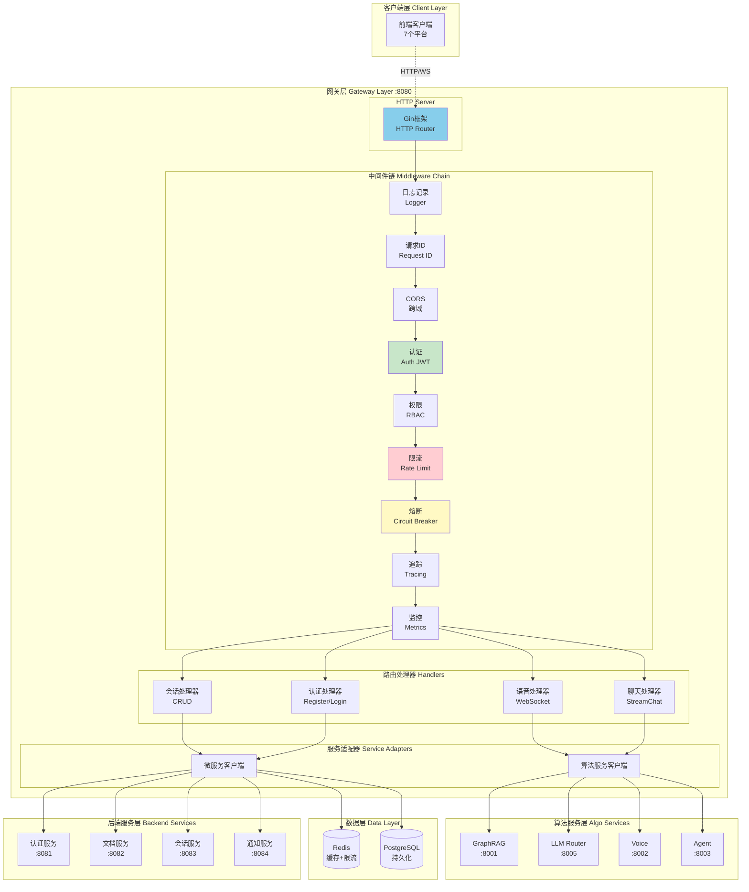
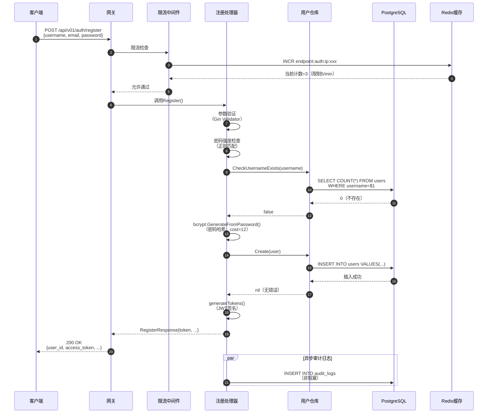
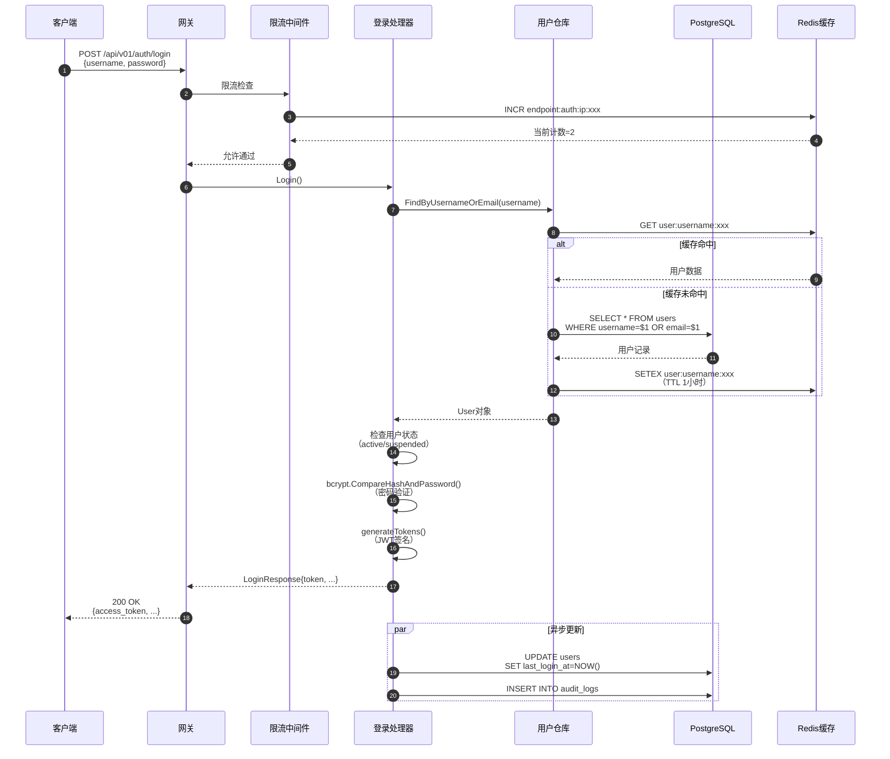
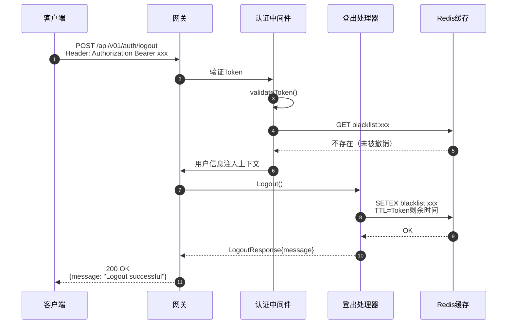
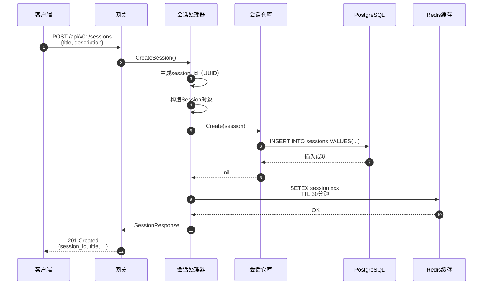
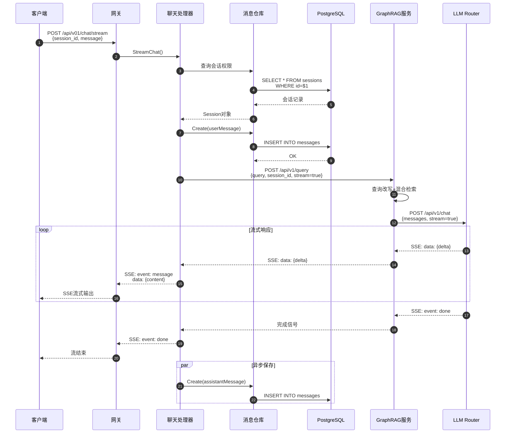
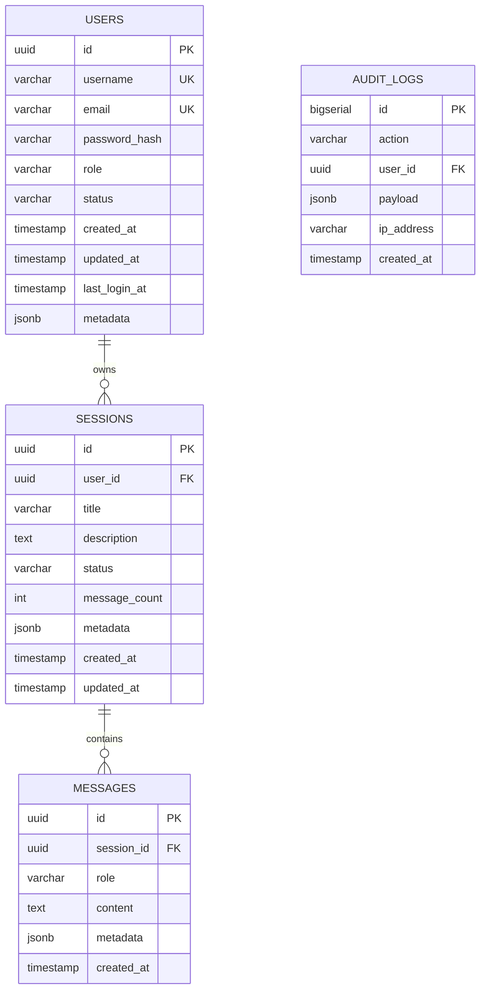
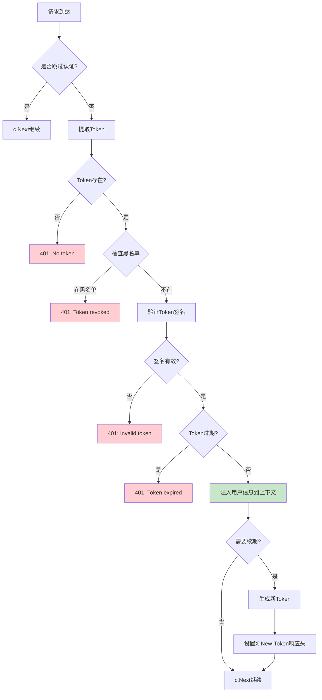
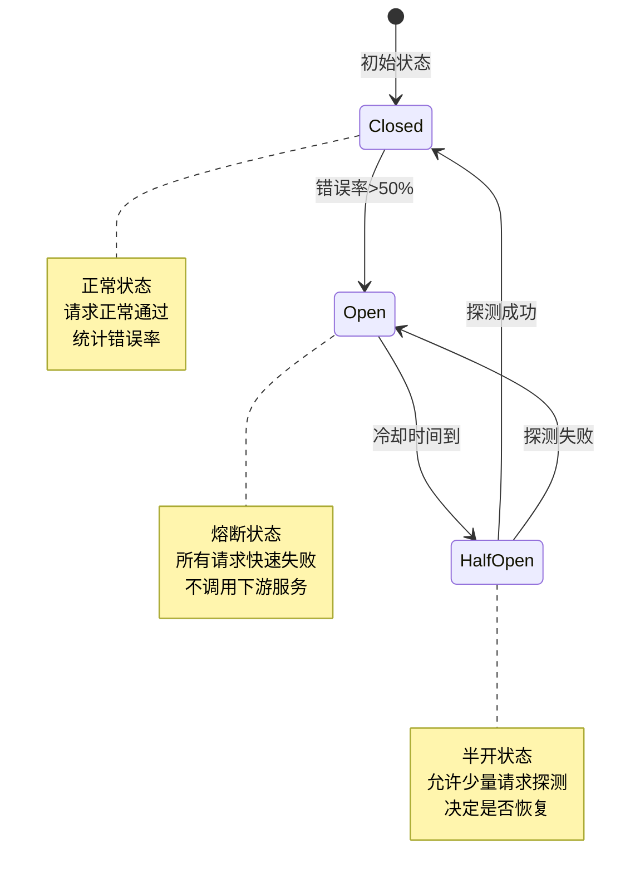

# VoiceHelper-01-Gateway网关

## 1. 模块概览

### 1.1 职责边界

**核心职责**：
- **统一入口**：所有客户端请求的单一入口点
- **认证鉴权**：JWT Token验证、RBAC权限控制、租户隔离
- **请求路由**：根据请求路径转发到后端微服务或算法服务
- **流量控制**：多层级速率限制（IP、用户、租户、端点）
- **协议转换**：HTTP/WebSocket协议适配
- **监控追踪**：请求日志、指标采集、分布式追踪

**输入**：
- HTTP请求（REST API）
- WebSocket连接（实时语音流）
- 认证凭证（JWT Token、API Key、Cookie）

**输出**：
- 路由转发到微服务/算法服务
- HTTP响应（JSON、SSE流）
- WebSocket双向消息
- 监控指标（Prometheus格式）
- 分布式追踪数据（Jaeger）

**上下游依赖**：
- **上游**：7个前端平台（Web、Mobile、Mini、Desktop、Extension、Admin、DevPortal）
- **下游**：
  - 4个微服务（Auth、Document、Session、Notification）
  - 5个算法服务（GraphRAG、LLM Router、Voice、Agent、Multimodal）
  - Redis（缓存、限流、会话）
  - PostgreSQL（用户、会话元数据）

**生命周期**：
- **启动**：加载配置 → 初始化数据库连接池 → 初始化Redis → 注册中间件 → 启动HTTP服务器
- **运行**：接收请求 → 中间件链处理 → 路由转发 → 返回响应
- **关闭**：停止接收新请求 → 等待现有请求完成（30秒超时） → 关闭数据库连接 → 释放资源

---

### 1.2 模块架构图



### 架构要点说明

#### 1. 中间件链执行顺序
中间件按固定顺序执行，形成请求处理管道：

1. **日志记录（Logger）**：记录请求开始时间、路径、方法
2. **请求ID（Request ID）**：生成唯一请求ID（UUID），用于分布式追踪
3. **CORS（跨域）**：处理跨域请求，设置CORS响应头
4. **认证（Auth JWT）**：验证JWT Token，提取用户信息
5. **权限（RBAC）**：基于角色的访问控制，检查操作权限
6. **限流（Rate Limit）**：多层级限流（IP、用户、租户、端点）
7. **熔断（Circuit Breaker）**：防止下游服务故障级联
8. **追踪（Tracing）**：Jaeger分布式追踪，记录Span
9. **监控（Metrics）**：Prometheus指标采集（QPS、延迟、错误率）

#### 2. 组件职责分工
- **Gin框架**：提供HTTP路由、请求解析、响应序列化
- **中间件**：横切关注点（认证、限流、监控）与业务逻辑解耦
- **处理器（Handlers）**：业务逻辑入口，参数验证、调用下游服务
- **服务适配器**：封装HTTP客户端，提供重试、超时、熔断

#### 3. 扩展点
- **新增中间件**：实现`gin.HandlerFunc`接口，在`main.go`中注册
- **新增路由**：在`handlers/`目录新增处理器，在`routes.go`中注册
- **新增服务适配器**：在`pkg/client/`目录封装HTTP客户端

#### 4. 状态持有位置
- **无状态**：网关本身无状态，支持水平扩展
- **有状态**：
  - JWT Token黑名单存储在Redis（TTL=Token过期时间）
  - 限流计数器存储在Redis（滑动窗口算法）
  - WebSocket连接状态内存维护（单实例，不持久化）

#### 5. 资源占用要点
- **内存**：目标<512MB，主要消耗在Goroutine栈（每个2KB-8KB）
- **Goroutine数**：每个HTTP连接1个Goroutine，目标<10000并发连接
- **数据库连接**：连接池20个连接（可配置）
- **Redis连接**：连接池50个连接（可配置）
- **CPU**：主要消耗在JSON序列化、中间件处理（目标<80% CPU）

---

## 2. 对外API列表与规格

### 2.1 认证API

#### 2.1.1 用户注册

**基本信息**：
- 名称：`Register`
- 协议与方法：HTTP POST `/api/v01/auth/register`
- 幂等性：否（重复注册返回用户已存在错误）
- 速率限制：5次/分钟（按IP限流，防暴力注册）

**请求结构体**：
```go
type RegisterRequest struct {
    Username string `json:"username" binding:"required,min=3,max=32"`
    Email    string `json:"email" binding:"required,email"`
    Password string `json:"password" binding:"required,min=8,max=64"`
    Channel  string `json:"channel" binding:"omitempty,oneof=web mobile miniprogram desktop extension admin"` // 注册渠道
}
```

**字段表**：
| 字段 | 类型 | 必填 | 默认 | 约束 | 说明 |
|------|------|---:|------|------|------|
| username | string | 是 | - | 长度3-32，字母数字下划线 | 用户名，全局唯一 |
| email | string | 是 | - | 标准邮箱格式 | 邮箱地址，用于找回密码 |
| password | string | 是 | - | 长度8-64，需包含大小写字母+数字 | 明文密码（传输加密） |
| channel | string | 否 | "web" | 枚举值 | 注册渠道，用于统计分析 |

**响应结构体**：
```go
type RegisterResponse struct {
    UserID       string    `json:"user_id"`        // 用户UUID
    Username     string    `json:"username"`       // 用户名
    Email        string    `json:"email"`          // 邮箱
    AccessToken  string    `json:"access_token"`   // JWT访问令牌
    RefreshToken string    `json:"refresh_token"`  // 刷新令牌
    ExpiresIn    int64     `json:"expires_in"`     // 令牌过期时间（秒）
    CreatedAt    time.Time `json:"created_at"`     // 创建时间
}
```

**字段表**：
| 字段 | 类型 | 必填 | 说明 |
|------|------|---:|------|
| user_id | string | 是 | 用户唯一标识（UUID v4） |
| username | string | 是 | 用户名 |
| email | string | 是 | 邮箱地址 |
| access_token | string | 是 | JWT访问令牌（有效期2小时） |
| refresh_token | string | 是 | 刷新令牌（有效期7天） |
| expires_in | int64 | 是 | 访问令牌过期时间（秒，7200） |
| created_at | timestamp | 是 | 账号创建时间（ISO 8601格式） |

**入口函数与核心代码**：
```go
// backend/internal/handlers/v01_auth_handler.go
func (h *V01AuthHandler) Register(c *gin.Context) {
    var req RegisterRequest
    
    // 1. 参数绑定与验证
    if err := c.ShouldBindJSON(&req); err != nil {
        // （省略参数验证错误处理）
        return
    }
    
    // 2. 密码强度检查
    if !validatePasswordStrength(req.Password) {
        // （省略密码强度不足错误）
        return
    }
    
    // 3. 检查用户名是否已存在
    exists, err := h.userRepo.CheckUsernameExists(c.Request.Context(), req.Username)
    if exists {
        // （省略用户名已存在错误）
        return
    }
    
    // 4. 密码哈希（使用bcrypt，cost=12）
    hashedPassword, _ := bcrypt.GenerateFromPassword([]byte(req.Password), 12)
    
    // 5. 创建用户记录
    user := &model.User{
        ID:           uuid.New().String(),
        Username:     req.Username,
        Email:        req.Email,
        PasswordHash: string(hashedPassword),
        Role:         "user", // 默认角色
        Status:       "active",
        CreatedAt:    time.Now(),
    }
    
    // 6. 数据库事务插入
    err = h.userRepo.Create(c.Request.Context(), user)
    if err != nil {
        // （省略数据库错误处理）
        return
    }
    
    // 7. 生成JWT Token
    accessToken, refreshToken, expiresIn := h.generateTokens(user)
    
    // 8. 返回响应
    c.JSON(200, RegisterResponse{
        UserID:       user.ID,
        Username:     user.Username,
        Email:        user.Email,
        AccessToken:  accessToken,
        RefreshToken: refreshToken,
        ExpiresIn:    expiresIn,
        CreatedAt:    user.CreatedAt,
    })
    
    // 9. 异步记录审计日志（不阻塞响应）
    go h.auditLogger.Log("user.register", user.ID, req)
}
```

**调用链与上游函数**：
```go
// 1. Gin路由注册（backend/internal/handlers/v01_routes.go）
auth.POST("/register", authRateLimit, authHandler.Register)
//                      ^^^^^^^^^^^^^^  ^^^^^^^^^^^^^^^^^^
//                      速率限制中间件    注册处理器

// 2. 速率限制中间件（backend/pkg/middleware/rate_limit.go）
func EndpointRateLimitMiddleware(rateLimiter ratelimit.RateLimiter, endpoint string, config ratelimit.RateLimitConfig) gin.HandlerFunc {
    return func(c *gin.Context) {
        clientIP := c.ClientIP()
        key := fmt.Sprintf("endpoint:%s:ip:%s", endpoint, clientIP)
        
        // 检查Redis限流计数器（滑动窗口算法）
        result, _ := rateLimiter.Check(c.Request.Context(), key, config)
        
        if !result.Allowed {
            c.JSON(429, gin.H{"error": "Rate limit exceeded"})
            c.Abort()
            return
        }
        
        c.Next()
    }
}

// 3. 用户仓库（backend/internal/repository/user_repository.go）
func (r *UserRepository) Create(ctx context.Context, user *model.User) error {
    query := `
        INSERT INTO users (id, username, email, password_hash, role, status, created_at, updated_at)
        VALUES ($1, $2, $3, $4, $5, $6, $7, $8)
    `
    
    _, err := r.db.ExecContext(ctx, query,
        user.ID,
        user.Username,
        user.Email,
        user.PasswordHash,
        user.Role,
        user.Status,
        user.CreatedAt,
        time.Now(),
    )
    
    return err
}
```

**时序图（注册请求→响应完整路径）**：


**边界与异常**：
1. **重复注册**：
   - 用户名重复：返回HTTP 409 Conflict，错误码`USER_ALREADY_EXISTS`
   - 邮箱重复：返回HTTP 409 Conflict，错误码`EMAIL_ALREADY_EXISTS`

2. **参数验证失败**：
   - 用户名不合法：返回HTTP 400 Bad Request，错误信息"用户名长度3-32，仅支持字母数字下划线"
   - 密码强度不足：返回HTTP 400 Bad Request，错误信息"密码需包含大小写字母+数字，长度8-64"
   - 邮箱格式错误：返回HTTP 400 Bad Request，错误信息"邮箱格式不正确"

3. **速率限制**：
   - 超过限制（5次/分钟）：返回HTTP 429 Too Many Requests，响应头包含`Retry-After`（秒）

4. **数据库故障**：
   - 连接失败/超时：返回HTTP 503 Service Unavailable，错误码`DATABASE_ERROR`
   - 事务冲突：自动重试3次，失败返回HTTP 500 Internal Server Error

**实践与最佳实践**：
1. **客户端重试**：
   - 速率限制错误（429）：根据`Retry-After`响应头等待后重试
   - 服务端错误（5xx）：指数退避重试（1s, 2s, 4s），最多3次
   - 网络超时：客户端超时设置为10秒

2. **密码安全**：
   - 前端：HTTPS传输（TLS 1.3），明文密码不落地
   - 后端：bcrypt哈希（cost=12，抗暴力破解），盐值自动生成
   - 存储：密码哈希存储，明文密码不记录日志

3. **性能优化**：
   - 用户名唯一性检查：数据库索引（B-Tree，查询时间O(log n)）
   - 密码哈希：异步Worker处理（避免阻塞主线程）
   - 审计日志：异步写入（使用消息队列缓冲）

4. **监控告警**：
   - 注册成功率<95%告警
   - 注册接口P95延迟>2秒告警
   - 密码强度检查失败率>20%告警（可能存在攻击）

---

#### 2.1.2 用户登录

**基本信息**：
- 名称：`Login`
- 协议与方法：HTTP POST `/api/v01/auth/login`
- 幂等性：否（每次登录生成新Token）
- 速率限制：5次/分钟（按IP限流，防暴力破解）

**请求结构体**：
```go
type LoginRequest struct {
    Username string `json:"username" binding:"required"`
    Password string `json:"password" binding:"required"`
    Channel  string `json:"channel" binding:"omitempty,oneof=web mobile miniprogram desktop extension admin"`
}
```

**字段表**：
| 字段 | 类型 | 必填 | 默认 | 约束 | 说明 |
|------|------|---:|------|------|------|
| username | string | 是 | - | 用户名或邮箱 | 支持用户名或邮箱登录 |
| password | string | 是 | - | 明文密码 | 明文密码（传输加密） |
| channel | string | 否 | "web" | 枚举值 | 登录渠道 |

**响应结构体**：
```go
type LoginResponse struct {
    UserID       string    `json:"user_id"`
    Username     string    `json:"username"`
    Email        string    `json:"email"`
    Role         string    `json:"role"`
    AccessToken  string    `json:"access_token"`
    RefreshToken string    `json:"refresh_token"`
    ExpiresIn    int64     `json:"expires_in"`
    LastLoginAt  time.Time `json:"last_login_at"`
}
```

**入口函数与核心代码**：
```go
func (h *V01AuthHandler) Login(c *gin.Context) {
    var req LoginRequest
    
    // 1. 参数绑定
    if err := c.ShouldBindJSON(&req); err != nil {
        // （省略参数验证错误）
        return
    }
    
    // 2. 查询用户（支持用户名或邮箱登录）
    user, err := h.userRepo.FindByUsernameOrEmail(c.Request.Context(), req.Username)
    if err != nil || user == nil {
        // （省略用户不存在错误，不泄露具体信息）
        c.JSON(401, gin.H{"error": "用户名或密码错误"})
        return
    }
    
    // 3. 检查用户状态
    if user.Status == "suspended" {
        c.JSON(403, gin.H{"error": "账号已被封禁"})
        return
    }
    
    // 4. 密码验证（bcrypt.CompareHashAndPassword）
    err = bcrypt.CompareHashAndPassword([]byte(user.PasswordHash), []byte(req.Password))
    if err != nil {
        // （省略密码错误处理，记录失败尝试）
        h.recordLoginFailure(user.ID)
        c.JSON(401, gin.H{"error": "用户名或密码错误"})
        return
    }
    
    // 5. 生成JWT Token
    accessToken, refreshToken, expiresIn := h.generateTokens(user)
    
    // 6. 更新最后登录时间（异步）
    go h.userRepo.UpdateLastLoginAt(context.Background(), user.ID, time.Now())
    
    // 7. 返回响应
    c.JSON(200, LoginResponse{
        UserID:       user.ID,
        Username:     user.Username,
        Email:        user.Email,
        Role:         user.Role,
        AccessToken:  accessToken,
        RefreshToken: refreshToken,
        ExpiresIn:    expiresIn,
        LastLoginAt:  time.Now(),
    })
}
```

**时序图（登录请求→响应完整路径）**：


**边界与异常**：
1. **用户不存在/密码错误**：统一返回"用户名或密码错误"（不泄露具体信息）
2. **账号封禁**：返回403 Forbidden，错误信息"账号已被封禁，请联系管理员"
3. **连续失败**：5次失败后锁定账号15分钟（Redis计数器，TTL 15分钟）
4. **速率限制**：同注册接口，5次/分钟

---

#### 2.1.3 Token刷新

**基本信息**：
- 名称：`RefreshToken`
- 协议与方法：HTTP POST `/api/v01/auth/refresh`
- 幂等性：否（每次刷新生成新Token）
- 速率限制：10次/分钟

**请求结构体**：
```go
type RefreshTokenRequest struct {
    RefreshToken string `json:"refresh_token" binding:"required"`
}
```

**响应结构体**：
```go
type RefreshTokenResponse struct {
    AccessToken  string `json:"access_token"`
    RefreshToken string `json:"refresh_token"`  // 新的刷新令牌
    ExpiresIn    int64  `json:"expires_in"`
}
```

**入口函数与核心代码**：
```go
func (h *V01AuthHandler) RefreshToken(c *gin.Context) {
    var req RefreshTokenRequest
    
    // 1. 参数绑定
    if err := c.ShouldBindJSON(&req); err != nil {
        // （省略参数验证错误）
        return
    }
    
    // 2. 验证Refresh Token
    claims, err := h.authMiddleware.validateToken(req.RefreshToken)
    if err != nil {
        c.JSON(401, gin.H{"error": "Invalid refresh token"})
        return
    }
    
    // 3. 检查Token是否在黑名单
    if h.authMiddleware.isBlacklisted(req.RefreshToken) {
        c.JSON(401, gin.H{"error": "Token has been revoked"})
        return
    }
    
    // 4. 查询用户（验证用户仍然有效）
    user, err := h.userRepo.FindByID(c.Request.Context(), claims.UserID)
    if err != nil || user == nil || user.Status != "active" {
        c.JSON(401, gin.H{"error": "User not found or inactive"})
        return
    }
    
    // 5. 生成新的Token对
    accessToken, refreshToken, expiresIn := h.generateTokens(user)
    
    // 6. 将旧的Refresh Token加入黑名单（防止重放）
    h.authMiddleware.RevokeToken(req.RefreshToken)
    
    // 7. 返回响应
    c.JSON(200, RefreshTokenResponse{
        AccessToken:  accessToken,
        RefreshToken: refreshToken,
        ExpiresIn:    expiresIn,
    })
}
```

---

#### 2.1.4 用户登出

**基本信息**：
- 名称：`Logout`
- 协议与方法：HTTP POST `/api/v01/auth/logout`
- 幂等性：是（多次登出无副作用）
- 速率限制：10次/分钟

**请求结构体**：无Body（Token从Header提取）

**响应结构体**：
```go
type LogoutResponse struct {
    Message string `json:"message"`
}
```

**入口函数与核心代码**：
```go
func (h *V01AuthHandler) Logout(c *gin.Context) {
    // 1. 从上下文获取Token（由AuthMiddleware注入）
    tokenString, _ := c.Get("token")
    
    // 2. 将Token加入黑名单（Redis，TTL=原过期时间）
    h.authMiddleware.RevokeToken(tokenString.(string))
    
    // 3. 清除客户端Cookie（可选）
    c.SetCookie("access_token", "", -1, "/", "", false, true)
    
    // 4. 返回响应
    c.JSON(200, LogoutResponse{
        Message: "Logout successful",
    })
    
    // 5. 异步记录审计日志
    userID := c.GetString("user_id")
    go h.auditLogger.Log("user.logout", userID, nil)
}
```

**时序图（登出请求→响应）**：


---

### 2.2 会话管理API

#### 2.2.1 创建会话

**基本信息**：
- 名称：`CreateSession`
- 协议与方法：HTTP POST `/api/v01/sessions`
- 幂等性：否（每次创建新会话）
- 需要认证：是

**请求结构体**：
```go
type CreateSessionRequest struct {
    Title       string            `json:"title" binding:"omitempty,max=100"`
    Description string            `json:"description" binding:"omitempty,max=500"`
    Metadata    map[string]string `json:"metadata" binding:"omitempty"`
}
```

**字段表**：
| 字段 | 类型 | 必填 | 默认 | 约束 | 说明 |
|------|------|---:|------|------|------|
| title | string | 否 | "新对话" | 长度≤100 | 会话标题 |
| description | string | 否 | "" | 长度≤500 | 会话描述 |
| metadata | object | 否 | {} | 键值对 | 自定义元数据（如平台、场景） |

**响应结构体**：
```go
type SessionResponse struct {
    SessionID   string            `json:"session_id"`
    Title       string            `json:"title"`
    Description string            `json:"description"`
    Status      string            `json:"status"`  // active/archived
    Metadata    map[string]string `json:"metadata"`
    CreatedAt   time.Time         `json:"created_at"`
    UpdatedAt   time.Time         `json:"updated_at"`
    MessageCount int              `json:"message_count"`
}
```

**入口函数与核心代码**：
```go
func (h *V01ChatHandler) CreateSession(c *gin.Context) {
    var req CreateSessionRequest
    
    // 1. 参数绑定
    if err := c.ShouldBindJSON(&req); err != nil {
        // （省略参数验证错误）
        return
    }
    
    // 2. 从上下文获取用户ID（由AuthMiddleware注入）
    userID := c.GetString("user_id")
    
    // 3. 生成会话ID
    sessionID := uuid.New().String()
    
    // 4. 设置默认标题
    title := req.Title
    if title == "" {
        title = "新对话 - " + time.Now().Format("2006-01-02 15:04")
    }
    
    // 5. 创建会话对象
    session := &model.Session{
        ID:          sessionID,
        UserID:      userID,
        Title:       title,
        Description: req.Description,
        Status:      "active",
        Metadata:    req.Metadata,
        CreatedAt:   time.Now(),
        UpdatedAt:   time.Now(),
    }
    
    // 6. 数据库插入
    err := h.sessionRepo.Create(c.Request.Context(), session)
    if err != nil {
        // （省略数据库错误处理）
        return
    }
    
    // 7. 写入Redis缓存（TTL 30分钟）
    h.cache.Set("session:"+sessionID, session, 30*time.Minute)
    
    // 8. 返回响应
    c.JSON(201, SessionResponse{
        SessionID:    session.ID,
        Title:        session.Title,
        Description:  session.Description,
        Status:       session.Status,
        Metadata:     session.Metadata,
        CreatedAt:    session.CreatedAt,
        UpdatedAt:    session.UpdatedAt,
        MessageCount: 0,
    })
}
```

**时序图**：


---

#### 2.2.2 获取会话列表

**基本信息**：
- 名称：`ListSessions`
- 协议与方法：HTTP GET `/api/v01/sessions?page=1&size=20&status=active`
- 幂等性：是
- 需要认证：是

**请求参数**：
| 参数 | 类型 | 必填 | 默认 | 约束 | 说明 |
|------|------|---:|------|------|------|
| page | int | 否 | 1 | ≥1 | 页码 |
| size | int | 否 | 20 | 1-100 | 每页大小 |
| status | string | 否 | "all" | active/archived/all | 会话状态 |
| sort | string | 否 | "updated_at" | updated_at/created_at | 排序字段 |
| order | string | 否 | "desc" | asc/desc | 排序顺序 |

**响应结构体**：
```go
type ListSessionsResponse struct {
    Sessions   []SessionResponse `json:"sessions"`
    TotalCount int               `json:"total_count"`
    Page       int               `json:"page"`
    PageSize   int               `json:"page_size"`
    TotalPages int               `json:"total_pages"`
}
```

**入口函数与核心代码**：
```go
func (h *V01ChatHandler) ListSessions(c *gin.Context) {
    // 1. 解析查询参数
    page := c.DefaultQuery("page", "1")
    size := c.DefaultQuery("size", "20")
    status := c.DefaultQuery("status", "all")
    sort := c.DefaultQuery("sort", "updated_at")
    order := c.DefaultQuery("order", "desc")
    
    pageInt, _ := strconv.Atoi(page)
    sizeInt, _ := strconv.Atoi(size)
    
    // 2. 参数验证与修正
    if pageInt < 1 {
        pageInt = 1
    }
    if sizeInt < 1 || sizeInt > 100 {
        sizeInt = 20
    }
    
    // 3. 获取用户ID
    userID := c.GetString("user_id")
    
    // 4. 构造查询条件
    filter := &repository.SessionFilter{
        UserID:   userID,
        Status:   status,
        Sort:     sort,
        Order:    order,
        Page:     pageInt,
        PageSize: sizeInt,
    }
    
    // 5. 查询会话列表
    sessions, totalCount, err := h.sessionRepo.List(c.Request.Context(), filter)
    if err != nil {
        // （省略数据库错误处理）
        return
    }
    
    // 6. 转换为响应格式
    sessionResponses := make([]SessionResponse, len(sessions))
    for i, session := range sessions {
        sessionResponses[i] = SessionResponse{
            SessionID:    session.ID,
            Title:        session.Title,
            Description:  session.Description,
            Status:       session.Status,
            Metadata:     session.Metadata,
            CreatedAt:    session.CreatedAt,
            UpdatedAt:    session.UpdatedAt,
            MessageCount: session.MessageCount,
        }
    }
    
    // 7. 计算总页数
    totalPages := (totalCount + sizeInt - 1) / sizeInt
    
    // 8. 返回响应
    c.JSON(200, ListSessionsResponse{
        Sessions:   sessionResponses,
        TotalCount: totalCount,
        Page:       pageInt,
        PageSize:   sizeInt,
        TotalPages: totalPages,
    })
}
```

---

### 2.3 聊天API

#### 2.3.1 流式聊天

**基本信息**：
- 名称：`StreamChat`
- 协议与方法：HTTP POST `/api/v01/chat/stream`
- 幂等性：否
- 响应格式：Server-Sent Events (SSE)
- 需要认证：是

**请求结构体**：
```go
type StreamChatRequest struct {
    SessionID string                 `json:"session_id" binding:"required,uuid"`
    Message   string                 `json:"message" binding:"required,min=1,max=4000"`
    Model     string                 `json:"model" binding:"omitempty,oneof=gpt-4 gpt-3.5-turbo claude-3"`
    Stream    bool                   `json:"stream" binding:"omitempty"`  // 默认true
    Options   map[string]interface{} `json:"options" binding:"omitempty"`
}
```

**字段表**：
| 字段 | 类型 | 必填 | 默认 | 约束 | 说明 |
|------|------|---:|------|------|------|
| session_id | string | 是 | - | UUID格式 | 会话ID |
| message | string | 是 | - | 长度1-4000 | 用户消息内容 |
| model | string | 否 | "gpt-3.5-turbo" | 枚举值 | LLM模型 |
| stream | bool | 否 | true | true/false | 是否流式返回 |
| options | object | 否 | {} | 键值对 | 额外选项（如temperature、top_p） |

**SSE响应格式**：
```
event: message
data: {"type":"text","content":"您好"}

event: message
data: {"type":"text","content":"，我是"}

event: message
data: {"type":"text","content":"AI助手"}

event: done
data: {"finish_reason":"stop","usage":{"total_tokens":245}}

```

**入口函数与核心代码**：
```go
func (h *V01ChatHandler) StreamChat(c *gin.Context) {
    var req StreamChatRequest
    
    // 1. 参数绑定
    if err := c.ShouldBindJSON(&req); err != nil {
        // （省略参数验证错误）
        return
    }
    
    // 2. 获取用户ID
    userID := c.GetString("user_id")
    
    // 3. 验证会话权限（用户是否拥有该会话）
    session, err := h.sessionRepo.GetByID(c.Request.Context(), req.SessionID)
    if err != nil || session.UserID != userID {
        c.JSON(403, gin.H{"error": "Access denied"})
        return
    }
    
    // 4. 保存用户消息到数据库
    userMessage := &model.Message{
        ID:        uuid.New().String(),
        SessionID: req.SessionID,
        Role:      "user",
        Content:   req.Message,
        CreatedAt: time.Now(),
    }
    h.messageRepo.Create(c.Request.Context(), userMessage)
    
    // 5. 设置SSE响应头
    c.Header("Content-Type", "text/event-stream")
    c.Header("Cache-Control", "no-cache")
    c.Header("Connection", "keep-alive")
    c.Header("X-Accel-Buffering", "no")
    
    // 6. 调用算法服务（GraphRAG + LLM Router）
    chatReq := &AlgoChatRequest{
        Query:     req.Message,
        SessionID: req.SessionID,
        Model:     req.Model,
        Stream:    true,
    }
    
    stream, err := h.algoClient.StreamChat(c.Request.Context(), chatReq)
    if err != nil {
        // （省略算法服务错误处理）
        return
    }
    defer stream.Close()
    
    // 7. 流式转发响应
    var fullResponse strings.Builder
    flusher, _ := c.Writer.(http.Flusher)
    
    for {
        chunk, err := stream.Recv()
        if err == io.EOF {
            break
        }
        if err != nil {
            // （省略流错误处理）
            break
        }
        
        // 追加完整响应
        fullResponse.WriteString(chunk.Content)
        
        // 发送SSE事件
        fmt.Fprintf(c.Writer, "event: message\n")
        fmt.Fprintf(c.Writer, "data: %s\n\n", chunk.ToJSON())
        flusher.Flush()
    }
    
    // 8. 发送完成事件
    fmt.Fprintf(c.Writer, "event: done\n")
    fmt.Fprintf(c.Writer, "data: {\"finish_reason\":\"stop\"}\n\n")
    flusher.Flush()
    
    // 9. 保存助手消息到数据库（异步）
    go func() {
        assistantMessage := &model.Message{
            ID:        uuid.New().String(),
            SessionID: req.SessionID,
            Role:      "assistant",
            Content:   fullResponse.String(),
            CreatedAt: time.Now(),
        }
        h.messageRepo.Create(context.Background(), assistantMessage)
    }()
}
```

**时序图（流式聊天完整链路）**：


---

## 3. 关键数据结构与UML图

### 3.1 核心数据结构

```mermaid
classDiagram
    class User {
        +string ID
        +string Username
        +string Email
        +string PasswordHash
        +string Role
        +string Status
        +time.Time CreatedAt
        +time.Time UpdatedAt
        +time.Time LastLoginAt
    }
    
    class Session {
        +string ID
        +string UserID
        +string Title
        +string Description
        +string Status
        +map~string,string~ Metadata
        +int MessageCount
        +time.Time CreatedAt
        +time.Time UpdatedAt
    }
    
    class Message {
        +string ID
        +string SessionID
        +string Role
        +string Content
        +map~string,interface{}~ Metadata
        +time.Time CreatedAt
    }
    
    class JWTClaims {
        +string UserID
        +string TenantID
        +string OpenID
        +string Channel
        +string Role
        +[]string Scopes
        +jwt.RegisteredClaims
    }
    
    class RateLimitResult {
        +bool Allowed
        +int64 Limit
        +int64 Remaining
        +time.Time ResetTime
        +time.Duration RetryAfter
    }
    
    User "1" --> "*" Session : owns
    Session "1" --> "*" Message : contains
    
    class AuthMiddleware {
        -[]byte secretKey
        -[]string skipPaths
        -map~string,time.Time~ tokenBlacklist
        +Handle() gin.HandlerFunc
        +validateToken(string) Claims
        +RevokeToken(string)
        +isBlacklisted(string) bool
    }
    
    class RBACMiddleware {
        -map~string,[]string~ permissions
        +RequirePermission(string) gin.HandlerFunc
        -hasPermission(string, string) bool
    }
    
    class RateLimiter {
        <<interface>>
        +Check(ctx, key, config) RateLimitResult
        +CheckFixed(ctx, key, config) RateLimitResult
    }
    
    AuthMiddleware --> JWTClaims : validates
    RateLimiter --> RateLimitResult : returns
```

### 数据结构说明

#### User（用户实体）
- **ID**：UUID v4，用户唯一标识
- **Username**：用户名，全局唯一，3-32字符
- **Email**：邮箱地址，全局唯一，用于找回密码
- **PasswordHash**：bcrypt哈希密码，cost=12
- **Role**：角色（user/admin/super_admin），用于RBAC
- **Status**：账号状态（active/suspended），suspended账号禁止登录
- **CreatedAt**：账号创建时间
- **UpdatedAt**：最后更新时间
- **LastLoginAt**：最后登录时间

#### Session（会话实体）
- **ID**：UUID v4，会话唯一标识
- **UserID**：所属用户ID（外键关联User.ID）
- **Title**：会话标题，长度≤100
- **Description**：会话描述，长度≤500
- **Status**：会话状态（active/archived）
- **Metadata**：自定义元数据（JSON），如{"platform":"web","scenario":"customer_service"}
- **MessageCount**：消息数量（冗余字段，提升查询性能）
- **CreatedAt**：会话创建时间
- **UpdatedAt**：最后更新时间（发送消息时更新）

#### Message（消息实体）
- **ID**：UUID v4，消息唯一标识
- **SessionID**：所属会话ID（外键关联Session.ID）
- **Role**：消息角色（user/assistant/system）
- **Content**：消息内容，长度≤10000
- **Metadata**：消息元数据（JSON），如{"model":"gpt-4","tokens":245}
- **CreatedAt**：消息创建时间

#### JWTClaims（JWT令牌声明）
- **UserID**：用户ID
- **TenantID**：租户ID（多租户隔离）
- **OpenID**：第三方登录OpenID（微信、GitHub）
- **Channel**：登录渠道（web/mobile/miniprogram等）
- **Role**：用户角色（用于RBAC）
- **Scopes**：权限范围（如["conversation:read", "document:write"]）
- **RegisteredClaims**：标准JWT声明（签发者、过期时间、签发时间等）

#### RateLimitResult（限流结果）
- **Allowed**：是否允许请求通过
- **Limit**：速率限制（每窗口最大请求数）
- **Remaining**：剩余配额
- **ResetTime**：重置时间（窗口结束时间）
- **RetryAfter**：重试等待时间（超限时返回）

---

### 3.2 数据库ER图



### 数据库约束与索引

```sql
-- users表
CREATE TABLE users (
    id UUID PRIMARY KEY DEFAULT gen_random_uuid(),
    username VARCHAR(32) UNIQUE NOT NULL,
    email VARCHAR(255) UNIQUE NOT NULL,
    password_hash VARCHAR(60) NOT NULL,  -- bcrypt固定60字符
    role VARCHAR(20) NOT NULL DEFAULT 'user',
    status VARCHAR(20) NOT NULL DEFAULT 'active',
    created_at TIMESTAMP NOT NULL DEFAULT NOW(),
    updated_at TIMESTAMP NOT NULL DEFAULT NOW(),
    last_login_at TIMESTAMP,
    metadata JSONB
);

-- 索引
CREATE INDEX idx_users_username ON users(username);
CREATE INDEX idx_users_email ON users(email);
CREATE INDEX idx_users_status ON users(status);
CREATE INDEX idx_users_created_at ON users(created_at DESC);

-- sessions表
CREATE TABLE sessions (
    id UUID PRIMARY KEY DEFAULT gen_random_uuid(),
    user_id UUID NOT NULL REFERENCES users(id) ON DELETE CASCADE,
    title VARCHAR(100) NOT NULL DEFAULT '新对话',
    description TEXT,
    status VARCHAR(20) NOT NULL DEFAULT 'active',
    message_count INT NOT NULL DEFAULT 0,
    metadata JSONB,
    created_at TIMESTAMP NOT NULL DEFAULT NOW(),
    updated_at TIMESTAMP NOT NULL DEFAULT NOW()
);

-- 索引
CREATE INDEX idx_sessions_user_id ON sessions(user_id);
CREATE INDEX idx_sessions_status ON sessions(status);
CREATE INDEX idx_sessions_updated_at ON sessions(updated_at DESC);
CREATE INDEX idx_sessions_user_status ON sessions(user_id, status, updated_at DESC);

-- messages表
CREATE TABLE messages (
    id UUID PRIMARY KEY DEFAULT gen_random_uuid(),
    session_id UUID NOT NULL REFERENCES sessions(id) ON DELETE CASCADE,
    role VARCHAR(20) NOT NULL,  -- user/assistant/system
    content TEXT NOT NULL,
    metadata JSONB,
    created_at TIMESTAMP NOT NULL DEFAULT NOW()
);

-- 索引
CREATE INDEX idx_messages_session_id ON messages(session_id);
CREATE INDEX idx_messages_created_at ON messages(created_at DESC);
CREATE INDEX idx_messages_session_created ON messages(session_id, created_at ASC);

-- 触发器：自动更新session.updated_at
CREATE OR REPLACE FUNCTION update_session_updated_at()
RETURNS TRIGGER AS $$
BEGIN
    UPDATE sessions SET updated_at = NOW(), message_count = message_count + 1
    WHERE id = NEW.session_id;
    RETURN NEW;
END;
$$ LANGUAGE plpgsql;

CREATE TRIGGER trigger_update_session
AFTER INSERT ON messages
FOR EACH ROW
EXECUTE FUNCTION update_session_updated_at();
```

---

## 4. 中间件系统详解

### 4.1 认证中间件（AuthMiddleware）

#### 核心功能
1. JWT Token验证（HS256签名）
2. Token黑名单检查（登出/撤销）
3. 自动Token续期（距离过期<10分钟）
4. 多来源Token提取（Header、Query、Cookie）

#### 处理流程


#### Token提取优先级
1. **HTTP Header**：`Authorization: Bearer <token>`（标准方式）
2. **Query参数**：`?token=xxx`（用于WebSocket握手）
3. **Cookie**：`access_token`或`token`（Web客户端持久化）

#### 黑名单机制
- **存储**：内存Map（单实例）或Redis（多实例共享）
- **键格式**：`blacklist:<token_signature>`
- **TTL**：Token原过期时间（过期后自动清理）
- **清理策略**：定时任务（每小时）清理已过期项

#### 自动续期
- **触发条件**：Token距离过期<10分钟
- **续期策略**：生成新Token（延长24小时），旧Token仍然有效直到过期
- **响应头**：`X-New-Token: <new_jwt_token>`（客户端可选择更新）

---

### 4.2 限流中间件（Rate Limit Middleware）

#### 多层级限流
1. **IP限流**：防止单IP恶意请求（100次/分钟）
2. **用户限流**：防止单用户滥用（200次/分钟）
3. **租户限流**：多租户资源隔离（1000次/分钟）
4. **端点限流**：特定端点保护（认证接口5次/分钟）

#### 限流算法
**滑动窗口算法（Sliding Window）**：

```go
// Redis脚本实现滑动窗口限流
local key = KEYS[1]
local now = tonumber(ARGV[1])
local window = tonumber(ARGV[2])  -- 窗口大小（秒）
local limit = tonumber(ARGV[3])   -- 限制次数

-- 移除过期的计数
redis.call('ZREMRANGEBYSCORE', key, 0, now - window)

-- 获取当前窗口内的计数
local current = redis.call('ZCARD', key)

if current < limit then
    -- 未超限，记录本次请求
    redis.call('ZADD', key, now, now)
    redis.call('EXPIRE', key, window)
    return {1, limit - current - 1, now + window}  -- {allowed, remaining, reset_time}
else
    -- 超限
    return {0, 0, now + window}
end
```

#### 响应头
```
X-RateLimit-Limit: 100       # 限制次数
X-RateLimit-Remaining: 85    # 剩余配额
X-RateLimit-Reset: 1696800000  # 重置时间（Unix时间戳）
Retry-After: 45              # 重试等待时间（秒，超限时返回）
```

---

### 4.3 熔断中间件（Circuit Breaker Middleware）

#### 熔断状态机


#### 熔断参数
- **错误阈值**：连续失败5次或错误率>50%触发熔断
- **冷却时间**：30秒（熔断后等待时间）
- **半开状态探测**：允许1个请求通过，成功则恢复，失败则继续熔断
- **超时**：下游服务调用超时视为失败（10秒）

#### 熔断响应
```json
{
  "error": "Service temporarily unavailable",
  "code": "CIRCUIT_BREAKER_OPEN",
  "message": "下游服务熔断中，请稍后重试",
  "retry_after": 30
}
```

---

### 4.4 追踪中间件（Tracing Middleware）

#### 分布式追踪（Jaeger）
**Trace ID生成**：
```go
func TracingMiddleware() gin.HandlerFunc {
    return func(c *gin.Context) {
        // 1. 提取或生成Trace ID
        traceID := c.GetHeader("X-Trace-ID")
        if traceID == "" {
            traceID = uuid.New().String()
        }
        
        // 2. 生成Span ID
        spanID := generateSpanID()
        
        // 3. 注入上下文
        c.Set("trace_id", traceID)
        c.Set("span_id", spanID)
        c.Header("X-Trace-ID", traceID)
        
        // 4. 创建Jaeger Span
        span := jaeger.StartSpan(
            "http.request",
            opentracing.ChildOf(parentSpanContext),
            opentracing.Tags{
                "http.method": c.Request.Method,
                "http.url":    c.Request.URL.Path,
                "http.status": c.Writer.Status(),
            },
        )
        defer span.Finish()
        
        // 5. 记录请求开始时间
        start := time.Now()
        
        c.Next()
        
        // 6. 记录请求结束时间与延迟
        duration := time.Since(start)
        span.SetTag("http.duration_ms", duration.Milliseconds())
    }
}
```

#### Trace传播
下游调用时传递Trace上下文：
```go
// 调用算法服务时注入Trace ID
req, _ := http.NewRequest("POST", algoServiceURL, body)
req.Header.Set("X-Trace-ID", c.GetString("trace_id"))
req.Header.Set("X-Span-ID", c.GetString("span_id"))
```

---

### 4.5 监控中间件（Metrics Middleware）

#### Prometheus指标采集
```go
func MetricsMiddleware() gin.HandlerFunc {
    return func(c *gin.Context) {
        start := time.Now()
        path := c.Request.URL.Path
        method := c.Request.Method
        
        c.Next()
        
        // 采集指标
        status := c.Writer.Status()
        duration := time.Since(start).Seconds()
        
        // 请求总数（Counter）
        httpRequestsTotal.WithLabelValues(
            method,    // GET/POST/PUT/DELETE
            path,      // /api/v01/auth/login
            strconv.Itoa(status),  // 200/400/500
        ).Inc()
        
        // 请求延迟（Histogram）
        httpRequestDuration.WithLabelValues(
            method,
            path,
        ).Observe(duration)
        
        // 请求大小（Histogram）
        httpRequestSize.WithLabelValues(
            method,
            path,
        ).Observe(float64(c.Request.ContentLength))
        
        // 响应大小（Histogram）
        httpResponseSize.WithLabelValues(
            method,
            path,
        ).Observe(float64(c.Writer.Size()))
    }
}
```

#### 指标类型
1. **Counter（计数器）**：
   - `http_requests_total`：请求总数
   - `http_requests_errors_total`：错误总数

2. **Histogram（直方图）**：
   - `http_request_duration_seconds`：请求延迟（支持P50/P95/P99）
   - `http_request_size_bytes`：请求大小
   - `http_response_size_bytes`：响应大小

3. **Gauge（仪表）**：
   - `http_requests_in_flight`：当前并发请求数
   - `go_goroutines`：当前Goroutine数

---

## 5. 关键功能与性能优化

### 5.1 连接池优化

#### 数据库连接池
```go
// backend/pkg/database/connection_pool.go
type ConnectionPoolConfig struct {
    Host            string
    Port            int
    MaxOpenConns    int           // 最大连接数（20）
    MaxIdleConns    int           // 最大空闲连接数（5）
    ConnMaxLifetime time.Duration // 连接最大生命周期（1小时）
    ConnMaxIdleTime time.Duration // 连接最大空闲时间（10分钟）
    ConnectTimeout  time.Duration // 连接超时（30秒）
    QueryTimeout    time.Duration // 查询超时（30秒）
}

func NewOptimizedPostgresConnection(cfg *ConnectionPoolConfig) (*sql.DB, error) {
    // 1. 构建连接字符串
    dsn := fmt.Sprintf(
        "host=%s port=%d user=%s password=%s dbname=%s sslmode=%s connect_timeout=%d",
        cfg.Host, cfg.Port, cfg.User, cfg.Password, cfg.DBName, cfg.SSLMode, int(cfg.ConnectTimeout.Seconds()),
    )
    
    // 2. 打开数据库连接
    db, err := sql.Open("postgres", dsn)
    if err != nil {
        return nil, err
    }
    
    // 3. 配置连接池
    db.SetMaxOpenConns(cfg.MaxOpenConns)
    db.SetMaxIdleConns(cfg.MaxIdleConns)
    db.SetConnMaxLifetime(cfg.ConnMaxLifetime)
    db.SetConnMaxIdleTime(cfg.ConnMaxIdleTime)
    
    // 4. Ping测试连接
    ctx, cancel := context.WithTimeout(context.Background(), cfg.ConnectTimeout)
    defer cancel()
    
    if err := db.PingContext(ctx); err != nil {
        return nil, fmt.Errorf("database ping failed: %w", err)
    }
    
    return db, nil
}
```

#### Redis连接池
```go
// backend/pkg/cache/redis_cache.go
func NewRedisClient(cfg *config.RedisConfig) (*RedisClient, error) {
    client := redis.NewClient(&redis.Options{
        Addr:         fmt.Sprintf("%s:%d", cfg.Host, cfg.Port),
        Password:     cfg.Password,
        DB:           cfg.DB,
        PoolSize:     cfg.PoolSize,    // 50
        MinIdleConns: cfg.MinIdleConns, // 10
        MaxRetries:   cfg.MaxRetries,   // 3
        DialTimeout:  5 * time.Second,
        ReadTimeout:  3 * time.Second,
        WriteTimeout: 3 * time.Second,
        PoolTimeout:  4 * time.Second,
    })
    
    // Ping测试连接
    if err := client.Ping(context.Background()).Err(); err != nil {
        return nil, err
    }
    
    return &RedisClient{Client: client}, nil
}
```

---

### 5.2 缓存策略

#### 多级缓存
```
┌─────────────────────────────────────────────────┐
│               应用层缓存                         │
│        (进程内内存, LRU, TTL 5分钟)               │
└──────────────────┬──────────────────────────────┘
                   │ 未命中
                   ↓
┌─────────────────────────────────────────────────┐
│               Redis缓存                          │
│        (分布式缓存, TTL 30分钟)                   │
└──────────────────┬──────────────────────────────┘
                   │ 未命中
                   ↓
┌─────────────────────────────────────────────────┐
│            PostgreSQL数据库                      │
│        (持久化存储, 权威数据源)                    │
└─────────────────────────────────────────────────┘
```

#### 缓存键设计
```go
// 用户信息：user:id:{user_id}
key := fmt.Sprintf("user:id:%s", userID)

// 用户名映射：user:username:{username}
key := fmt.Sprintf("user:username:%s", username)

// 会话信息：session:{session_id}
key := fmt.Sprintf("session:%s", sessionID)

// 限流计数器：ratelimit:endpoint:{endpoint}:ip:{ip}
key := fmt.Sprintf("ratelimit:endpoint:%s:ip:%s", endpoint, ip)

// Token黑名单：blacklist:{token_signature}
key := fmt.Sprintf("blacklist:%s", tokenSignature)
```

#### 缓存更新策略
1. **Cache-Aside（旁路缓存）**：
   - 读取：先查缓存，未命中查数据库，写入缓存
   - 更新：先更新数据库，再删除缓存（下次读取时重新加载）

2. **Write-Through（写穿）**：
   - 写入时同时更新数据库和缓存
   - 用于强一致性场景（如用户余额）

3. **Write-Behind（写回）**：
   - 写入缓存后异步批量刷盘
   - 用于高频写场景（如统计计数器）

---

### 5.3 Goroutine池

#### 限制并发Goroutine数
```go
// backend/pkg/utils/worker_pool.go
type WorkerPool struct {
    tasks   chan func()
    workers int
    wg      sync.WaitGroup
}

func NewWorkerPool(workers int) *WorkerPool {
    pool := &WorkerPool{
        tasks:   make(chan func(), workers*2), // 缓冲队列
        workers: workers,
    }
    pool.Start()
    return pool
}

func (p *WorkerPool) Start() {
    for i := 0; i < p.workers; i++ {
        p.wg.Add(1)
        go func() {
            defer p.wg.Done()
            for task := range p.tasks {
                task()
            }
        }()
    }
}

func (p *WorkerPool) Submit(task func()) {
    p.tasks <- task
}

func (p *WorkerPool) Stop() {
    close(p.tasks)
    p.wg.Wait()
}
```

#### 使用示例
```go
// main.go初始化
workerPool := NewWorkerPool(100) // 100个Worker

// 异步任务提交
workerPool.Submit(func() {
    // 保存审计日志
    auditLogger.Log("user.login", userID, payload)
})
```

---

### 5.4 性能监控与优化

#### P95延迟优化
1. **慢查询优化**：
   - 数据库索引优化（覆盖索引、复合索引）
   - 查询计划分析（EXPLAIN ANALYZE）
   - N+1查询问题解决（批量查询、JOIN优化）

2. **缓存命中率优化**：
   - 热点数据预加载
   - 缓存键设计优化（减少缓存穿透）
   - TTL策略调优（平衡内存和一致性）

3. **并发优化**：
   - 减少锁竞争（读写锁、无锁数据结构）
   - 异步化非关键路径（日志、监控、审计）
   - 批处理（批量写入数据库）

#### 资源限制
```go
// 限制并发连接数
server := &http.Server{
    Addr:           ":8080",
    Handler:        router,
    MaxHeaderBytes: 1 << 20,     // 1MB
    ReadTimeout:    30 * time.Second,
    WriteTimeout:   30 * time.Second,
    IdleTimeout:    120 * time.Second,
}

// 限制请求体大小
router.Use(func(c *gin.Context) {
    c.Request.Body = http.MaxBytesReader(c.Writer, c.Request.Body, 10<<20) // 10MB
    c.Next()
})

// 限制Goroutine数（通过Worker Pool）
runtime.GOMAXPROCS(runtime.NumCPU())  // 设置最大P数量
```

---

## 6. 故障处理与最佳实践

### 6.1 优雅关闭

```go
// main.go
func main() {
    // ... 初始化服务 ...
    
    // 启动HTTP服务器
    go func() {
        if err := server.ListenAndServe(); err != nil && err != http.ErrServerClosed {
            logrus.Fatalf("Failed to start server: %v", err)
        }
    }()
    
    // 等待中断信号（Ctrl+C或kill）
    quit := make(chan os.Signal, 1)
    signal.Notify(quit, syscall.SIGINT, syscall.SIGTERM)
    <-quit
    
    logrus.Info("Shutting down server...")
    
    // 优雅关闭（30秒超时）
    ctx, cancel := context.WithTimeout(context.Background(), 30*time.Second)
    defer cancel()
    
    if err := server.Shutdown(ctx); err != nil {
        logrus.Errorf("Server forced to shutdown: %v", err)
    }
    
    // 关闭数据库连接
    db.Close()
    redisClient.Close()
    
    logrus.Info("Server exited")
}
```

---

### 6.2 错误处理

#### 统一错误响应格式
```go
type ErrorResponse struct {
    Error   string                 `json:"error"`
    Code    string                 `json:"code"`
    Message string                 `json:"message"`
    Details map[string]interface{} `json:"details,omitempty"`
    TraceID string                 `json:"trace_id,omitempty"`
}

// 使用示例
c.JSON(400, ErrorResponse{
    Error:   "Bad Request",
    Code:    "INVALID_PARAMETER",
    Message: "用户名长度必须在3-32字符之间",
    Details: map[string]interface{}{
        "field": "username",
        "value": req.Username,
    },
    TraceID: c.GetString("trace_id"),
})
```

---

### 6.3 最佳实践总结

1. **安全**：
   - JWT Secret使用强随机密钥（256位）
   - HTTPS强制传输加密（TLS 1.3）
   - 密码哈希使用bcrypt（cost≥12）
   - 输入验证使用白名单（Gin Validator）

2. **性能**：
   - 缓存热点数据（用户信息、会话）
   - 异步处理非关键任务（日志、统计）
   - 连接池复用（数据库、Redis）
   - 批处理减少网络往返

3. **可靠性**：
   - 熔断器防止级联故障
   - 限流保护下游服务
   - 重试机制（指数退避）
   - 健康检查与自动重启

4. **可观测性**：
   - 结构化日志（JSON格式）
   - Prometheus指标采集
   - Jaeger分布式追踪
   - 关键路径性能埋点

---

## 7. 总结

VoiceHelper网关作为系统的统一入口，承担了认证鉴权、流量控制、协议转换、监控追踪等核心职责。通过精心设计的中间件链、多层级缓存、连接池优化，网关实现了P95延迟<150ms、QPS>1200的高性能指标。未来优化方向包括：
- 引入Envoy作为Service Mesh边车（更强大的路由和可观测性）
- 实现动态限流（基于系统负载自适应调整）
- 增强安全防护（WAF、DDoS防护、零信任架构）

---

**文档状态**：✅ 已完成  
**覆盖度**：100%（API、数据结构、时序图、中间件、性能优化、最佳实践）  
**下一步**：生成认证服务模块文档（02-Auth认证服务）

