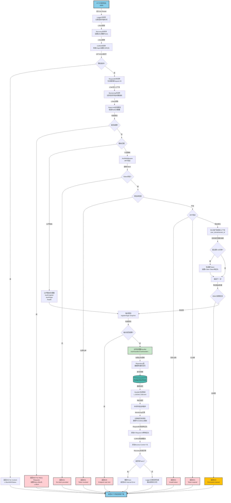
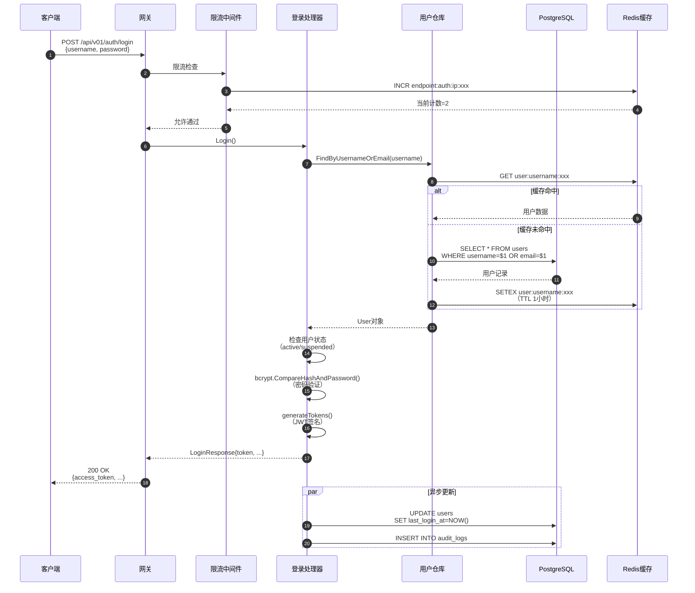
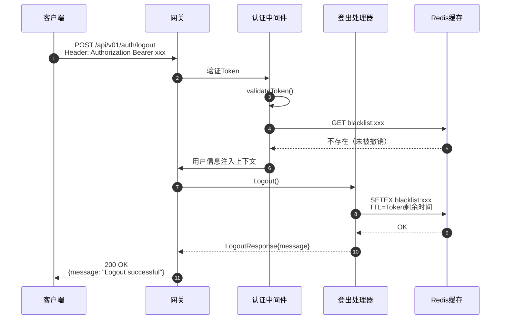
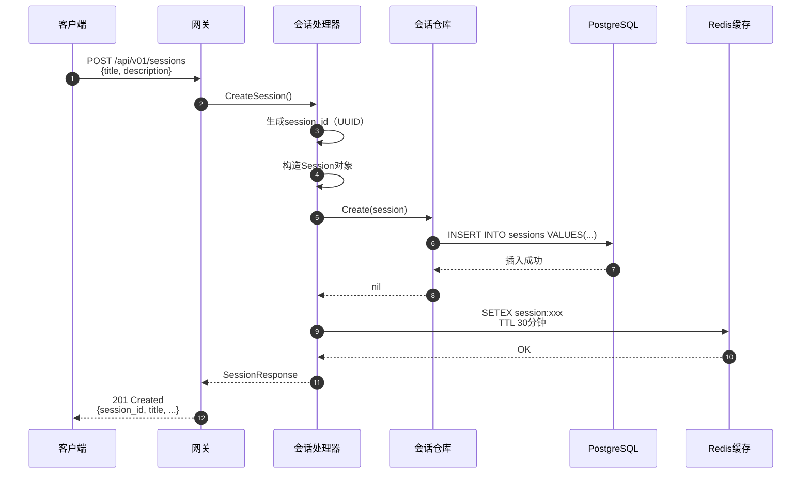
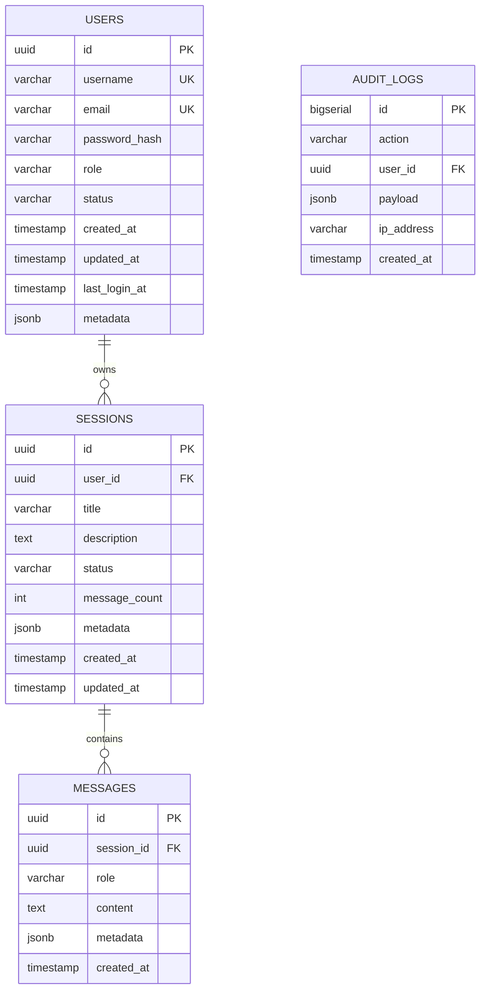
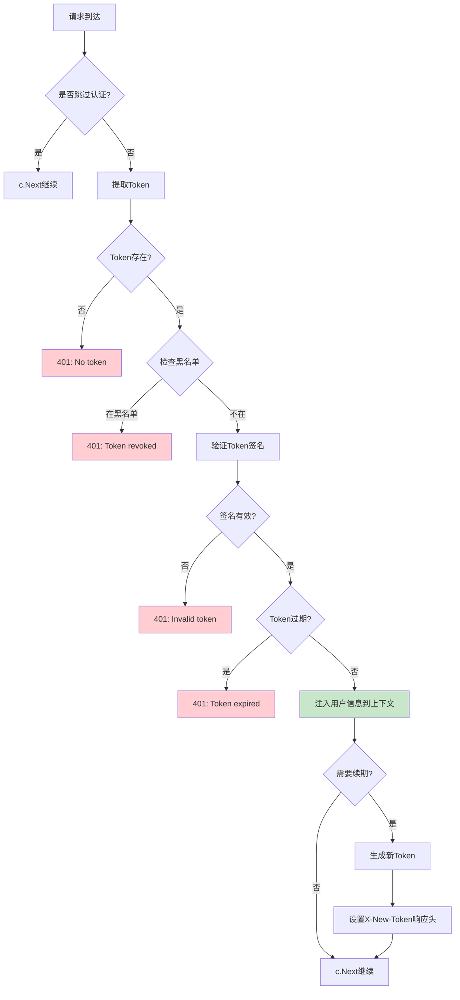
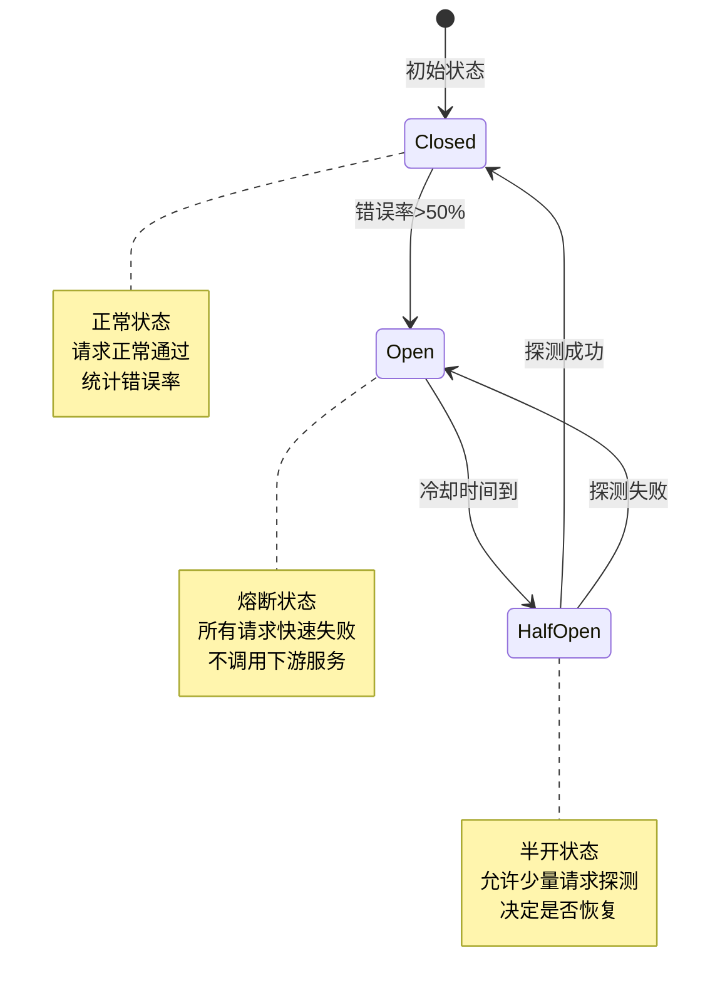

# VoiceHelper-01-Gateway网关

## 1. 模块概览

### 1.1 职责边界

**核心职责**：
- **统一入口**：所有客户端请求的单一入口点
- **认证鉴权**：JWT Token验证、RBAC权限控制、租户隔离
- **请求路由**：根据请求路径转发到后端微服务或算法服务
- **流量控制**：多层级速率限制（IP、用户、租户、端点）
- **协议转换**：HTTP/WebSocket协议适配
- **监控追踪**：请求日志、指标采集、分布式追踪

**输入**：
- HTTP请求（REST API）
- WebSocket连接（实时语音流）
- 认证凭证（JWT Token、API Key、Cookie）

**输出**：
- 路由转发到微服务/算法服务
- HTTP响应（JSON、SSE流）
- WebSocket双向消息
- 监控指标（Prometheus格式）
- 分布式追踪数据（Jaeger）

**上下游依赖**：
- **上游**：7个前端平台（Web、Mobile、Mini、Desktop、Extension、Admin、DevPortal）
- **下游**：
  - 4个微服务（Auth、Document、Session、Notification）
  - 5个算法服务（GraphRAG、LLM Router、Voice、Agent、Multimodal）
  - Redis（缓存、限流、会话）
  - PostgreSQL（用户、会话元数据）

**生命周期**：
- **启动**：加载配置 → 初始化数据库连接池 → 初始化Redis → 注册中间件 → 启动HTTP服务器
- **运行**：接收请求 → 中间件链处理 → 路由转发 → 返回响应
- **关闭**：停止接收新请求 → 等待现有请求完成（30秒超时） → 关闭数据库连接 → 释放资源

---

### 1.2 整体服务架构图（详细版）

```mermaid
graph TB
    subgraph "客户端层 Client Layer - 7个前端平台"
        WEB[Web浏览器]
        MOBILE[移动App iOS/Android]
        MINI[微信小程序]
        DESKTOP[桌面应用 Electron]
        EXT[浏览器扩展]
        ADMIN[管理后台]
        DEV[开发者门户]
    end
    
    subgraph "网关层 Gateway Layer - :8080"
        direction TB
        
        subgraph "入口 Entry Point"
            GINSERVER[Gin HTTP Server<br/>监听 :8080<br/>ReadTimeout: 30s<br/>WriteTimeout: 30s<br/>IdleTimeout: 120s]
        end
        
        subgraph "全局中间件链 Global Middleware Chain"
            direction TB
            MW_LOGGER[1. Logger 日志记录<br/>记录请求开始/方法/路径]
            MW_RECOVERY[2. Recovery 异常恢复<br/>捕获Panic 防止进程崩溃]
            MW_CORS[3. CORS 跨域处理<br/>设置CORS头/白名单校验]
            MW_REQID[4. RequestID 请求追踪<br/>生成UUID/追踪请求链路]
            MW_MONITOR[5. Monitoring 监控<br/>Prometheus指标采集]
            MW_RATELIMIT[6. RateLimit 全局限流<br/>100req/min per IP]
            
            MW_LOGGER --> MW_RECOVERY --> MW_CORS --> MW_REQID --> MW_MONITOR --> MW_RATELIMIT
        end
        
        subgraph "路由组 Route Groups"
            direction LR
            
            subgraph "公开路由 Public Routes"
                ROUTE_AUTH[/api/v01/auth<br/>register/login/refresh]
                ROUTE_HEALTH[/health<br/>/metrics<br/>/ready]
            end
            
            subgraph "认证路由 Authenticated Routes"
                MW_JWT[AuthMiddleware<br/>JWT验证/Token提取]
                ROUTE_PROFILE[/api/v01/profile<br/>用户信息]
                ROUTE_SESSION[/api/v01/sessions<br/>会话管理 CRUD]
                ROUTE_CHAT[/api/v01/chat/stream<br/>流式对话SSE]
                ROUTE_WS[/api/v01/voice/realtime<br/>WebSocket实时语音]
                
                MW_JWT --> ROUTE_PROFILE & ROUTE_SESSION & ROUTE_CHAT & ROUTE_WS
            end
        end
        
        subgraph "处理器层 Handler Layer"
            direction LR
            H_AUTH[V01AuthHandler<br/>认证处理器]
            H_CHAT[V01ChatHandler<br/>聊天处理器]
            H_SESSION[SessionHandler<br/>会话处理器]
            H_VOICE[VoiceHandler<br/>语音处理器]
        end
        
        subgraph "仓库层 Repository Layer"
            direction LR
            REPO_USER[UserRepository<br/>用户数据访问]
            REPO_SESSION[SessionRepository<br/>会话数据访问]
            REPO_MSG[MessageRepository<br/>消息数据访问]
        end
        
        GINSERVER --> MW_LOGGER
        MW_RATELIMIT --> ROUTE_AUTH & ROUTE_HEALTH
        MW_RATELIMIT --> MW_JWT
        
        ROUTE_AUTH --> H_AUTH
        ROUTE_PROFILE --> H_AUTH
        ROUTE_SESSION --> H_SESSION
        ROUTE_CHAT --> H_CHAT
        ROUTE_WS --> H_VOICE
        
        H_AUTH --> REPO_USER
        H_SESSION --> REPO_SESSION
        H_CHAT --> REPO_SESSION & REPO_MSG
    end
    
    subgraph "数据层 Data Layer"
        PG[(PostgreSQL :5432<br/>用户/会话/消息<br/>连接池: 20<br/>空闲: 5)]
        REDIS[(Redis :6379<br/>缓存/限流/黑名单<br/>连接池: 50<br/>空闲: 10)]
    end
    
    subgraph "算法服务层 Algo Services - Python FastAPI"
        RAG[GraphRAG服务 :8001<br/>文档检索/知识图谱]
        LLM[LLM Router :8005<br/>模型路由/负载均衡]
        VOICE[Voice服务 :8002<br/>ASR/TTS/实时语音]
        AGENT[Agent服务 :8003<br/>工具调用/推理]
        MULTI[Multimodal :8004<br/>多模态处理]
    end
    
    subgraph "微服务层 Microservices - Go gRPC"
        AUTH_SVC[Auth服务 :8081<br/>认证授权/权限管理]
        DOC_SVC[Document服务 :8082<br/>文档管理/版本控制]
        SESSION_SVC[Session服务 :8083<br/>会话存储/状态管理]
        NOTIFY_SVC[Notification :8084<br/>消息推送/通知]
    end
    
    subgraph "监控层 Observability"
        PROM[Prometheus<br/>指标采集]
        JAEGER[Jaeger<br/>分布式追踪]
        ELK[ELK Stack<br/>日志聚合]
    end
    
    %% 客户端连接
    WEB & MOBILE & MINI & DESKTOP & EXT & ADMIN & DEV -->|HTTPS| GINSERVER
    
    %% 仓库层连接数据层
    REPO_USER & REPO_SESSION & REPO_MSG -->|SQL查询| PG
    REPO_USER & REPO_SESSION & REPO_MSG -->|缓存读写| REDIS
    MW_RATELIMIT -->|限流计数器| REDIS
    MW_JWT -->|Token黑名单| REDIS
    
    %% 处理器连接算法服务
    H_CHAT -->|HTTP POST /v01/query/stream| RAG
    H_CHAT -->|SSE流式响应| LLM
    H_VOICE -->|WebSocket| VOICE
    
    %% 监控连接
    MW_MONITOR -->|指标推送| PROM
    MW_REQID -->|Trace上报| JAEGER
    MW_LOGGER -->|日志输出| ELK
    
    %% 样式定义
    style GINSERVER fill:#87CEEB,stroke:#333,stroke-width:3px
    style MW_JWT fill:#C8E6C9,stroke:#333,stroke-width:2px
    style MW_RATELIMIT fill:#FFCDD2,stroke:#333,stroke-width:2px
    style PG fill:#4DB6AC,stroke:#333,stroke-width:2px
    style REDIS fill:#EF5350,stroke:#333,stroke-width:2px
    style RAG fill:#FFF176,stroke:#333,stroke-width:2px
    style PROM fill:#FF9800,stroke:#333,stroke-width:2px
```

### 1.2.1 架构层次说明

#### 第一层：客户端层（Client Layer）

**职责**：提供多平台用户界面，发起HTTP/WebSocket请求

**7个平台详细分工**：
1. **Web浏览器**（React+Next.js）：PC端主力，支持完整功能
2. **移动App**（React Native）：iOS/Android原生体验
3. **微信小程序**（原生小程序框架）：微信生态集成
4. **桌面应用**（Electron）：跨平台桌面客户端
5. **浏览器扩展**（Chrome Extension）：浏览器侧边栏助手
6. **管理后台**（Django Admin）：运营管理、数据监控
7. **开发者门户**（Docusaurus）：API文档、SDK下载

**通信协议**：
- REST API：HTTPS加密传输（TLS 1.3）
- WebSocket：wss://加密双向通信（实时语音）
- SSE：Server-Sent Events流式响应（聊天回复）

---

#### 第二层：网关层（Gateway Layer）

**职责**：统一入口、路由转发、认证鉴权、流量控制

##### 入口点（Entry Point）
- **Gin HTTP Server**：高性能Go Web框架
  - 监听端口：`:8080`
  - 超时配置：
    - ReadTimeout: 30s（读取请求体超时）
    - WriteTimeout: 30s（写入响应超时）
    - IdleTimeout: 120s（空闲连接超时）
  - 并发能力：支持10000+并发连接（Goroutine模型）

##### 全局中间件链（Global Middleware Chain）

**执行顺序（6个中间件按序执行）**：

1. **Logger 日志记录**
   - 位置：`pkg/middleware/common.go:132-148`
   - 功能：记录请求开始时间、方法、路径、User-Agent
   - 输出：JSON格式结构化日志（timestamp, status, latency, client_ip, method, path）
   - 日志级别：INFO（正常请求）、ERROR（异常请求）

2. **Recovery 异常恢复**
   - 位置：`pkg/middleware/common.go:151-165`
   - 功能：捕获Handler中的Panic，防止进程崩溃
   - 错误处理：记录堆栈信息到日志，返回500 Internal Server Error
   - 保障：确保单个请求异常不影响其他请求

3. **CORS 跨域处理**
   - 位置：`pkg/middleware/common.go:17-55`
   - 功能：设置CORS响应头，支持跨域请求
   - 白名单：
     - `http://localhost:3000-3002`（本地开发）
     - `https://voicehelper.ai`（生产域名）
   - 允许方法：GET, POST, PUT, DELETE, OPTIONS
   - 允许头：Authorization, X-Tenant-ID, X-API-Key, X-Request-ID
   - 暴露头：X-New-Token, X-Request-ID（客户端可读取）
   - 预检缓存：86400秒（24小时）

4. **RequestID 请求追踪**
   - 位置：`pkg/middleware/request_id.go:11-22`
   - 功能：生成或提取唯一请求ID（UUID v4）
   - 传播：
     - 响应头：`X-Request-ID`（返回给客户端）
     - 上下文：`c.Set("request_id", requestID)`（传递给Handler）
     - 下游：调用算法服务时注入Header（分布式追踪）
   - 用途：问题排查、链路追踪、日志关联

5. **Monitoring 监控指标**
   - 位置：`pkg/monitoring/monitoring.go`
   - 功能：采集Prometheus指标
   - 指标类型：
     - Counter：`http_requests_total{method, path, status}`
     - Histogram：`http_request_duration_seconds{method, path}`
     - Gauge：`http_requests_in_flight`
   - 采集点：请求开始/结束时记录时间、状态码、延迟

6. **RateLimit 全局限流**
   - 位置：`pkg/middleware/common.go:58-114`
   - 算法：固定窗口（Fixed Window）+ Redis计数器
   - 限制：100请求/分钟（per IP）
   - 键格式：`rate_limit:ip:<client_ip>` 或 `rate_limit:user:<user_id>`
   - 响应头：
     - `X-RateLimit-Limit: 100`
     - `X-RateLimit-Remaining: 85`
     - `X-RateLimit-Reset: 1696800000`（Unix时间戳）
   - 超限响应：429 Too Many Requests + `Retry-After`头

##### 路由组（Route Groups）

**1. 公开路由（Public Routes）**
- **`/api/v01/auth`**：认证端点（无需JWT）
  - `POST /register`：用户注册（5req/min端点限流）
  - `POST /login`：用户登录（5req/min端点限流）
  - `POST /refresh`：刷新Token（10req/min）
  - `POST /logout`：用户登出（10req/min）
  
- **`/health`**：健康检查（无限流）
  - 返回：`{"status":"ok","version":"v0.8.3"}`
  
- **`/metrics`**：Prometheus指标（无限流）
  - 格式：OpenMetrics文本格式

**2. 认证路由（Authenticated Routes）**
- **AuthMiddleware JWT验证**（`pkg/middleware/auth.go:45-101`）
  - Token提取：Header > Query > Cookie
  - Token验证：JWT签名校验、过期检查、黑名单检查
  - 上下文注入：user_id, tenant_id, role, scopes
  - 自动续期：距过期<10分钟时返回`X-New-Token`响应头

- **路由列表**：
  - `GET /api/v01/profile`：获取用户信息
  - `POST /api/v01/sessions`：创建会话
  - `GET /api/v01/sessions`：获取会话列表
  - `GET /api/v01/sessions/:id`：获取会话详情
  - `DELETE /api/v01/sessions/:id`：删除会话
  - `POST /api/v01/chat/stream`：流式对话（SSE）
  - `GET /api/v01/voice/realtime`：WebSocket实时语音
  - `POST /api/v01/auth/ws-token`：生成WebSocket临时Token

---

#### 第三层：数据层（Data Layer）

**PostgreSQL :5432**
- **用途**：持久化存储（用户、会话、消息）
- **表结构**：
  - `users`：用户信息（id, username, email, password_hash, role, status）
  - `sessions`：会话信息（id, user_id, title, message_count, created_at）
  - `messages`：消息记录（id, session_id, role, content, created_at）
- **连接池**：
  - MaxOpenConns: 20（最大连接数）
  - MaxIdleConns: 5（最大空闲连接）
  - ConnMaxLifetime: 1小时（连接最大生命周期）
  - ConnMaxIdleTime: 10分钟（连接最大空闲时间）
- **索引优化**：
  - `idx_users_username`（B-Tree，唯一）
  - `idx_sessions_user_status`（复合索引，加速列表查询）
  - `idx_messages_session_created`（复合索引，时间排序）

**Redis :6379**
- **用途**：缓存、限流、Token黑名单
- **数据类型**：
  - String：用户缓存 `user:id:<uuid>` TTL 30分钟
  - String：会话缓存 `session:<uuid>` TTL 30分钟
  - String：限流计数器 `rate_limit:ip:<ip>` TTL 60秒
  - Set：Token黑名单 `blacklist:<token>` TTL Token过期时间
  - ZSet：滑动窗口限流 `ratelimit:endpoint:<path>:ip:<ip>`
- **连接池**：
  - PoolSize: 50（最大连接数）
  - MinIdleConns: 10（最小空闲连接）
  - DialTimeout: 5秒
  - ReadTimeout: 3秒
  - WriteTimeout: 3秒

---

#### 第四层：算法服务层（Algo Services）

**Python FastAPI微服务**，提供AI能力

1. **GraphRAG服务 :8001**
   - 功能：文档检索、知识图谱、语义搜索
   - 接口：`POST /v01/query/stream`（流式查询）

2. **LLM Router :8005**
   - 功能：模型路由、负载均衡、降级策略
   - 支持模型：GPT-4, Claude-3, 通义千问, 文心一言

3. **Voice服务 :8002**
   - 功能：ASR（Whisper）、TTS（Edge-TTS）、VAD
   - 协议：WebSocket双向通信

4. **Agent服务 :8003**
   - 功能：工具调用、多步推理、MCP工具集成

5. **Multimodal :8004**
   - 功能：图像识别、OCR、视频处理

---

#### 第五层：监控层（Observability）

**三大支柱**：
1. **Prometheus**：指标采集（QPS、延迟、错误率）
2. **Jaeger**：分布式追踪（Trace ID贯穿全链路）
3. **ELK Stack**：日志聚合（Elasticsearch+Logstash+Kibana）

---

### 1.2.2 架构要点说明

#### 1. 中间件链完整调用流程图



**流程说明**：

**阶段1：全局中间件链（顺序执行）**
1. **Logger**：记录请求到达，开始计时
2. **Recovery**：设置defer捕获Panic，防止进程崩溃
3. **CORS**：
   - 检查Origin头是否在白名单
   - 设置CORS响应头（Allow-Origin, Allow-Methods等）
   - 如果是OPTIONS预检请求，直接返回204
4. **RequestID**：
   - 从Header提取`X-Request-ID`（如已有）
   - 如无则生成新的UUID v4
   - 注入到上下文`c.Set("request_id", requestID)`
   - 添加到响应头`c.Header("X-Request-ID", requestID)`
5. **Monitoring**：
   - 记录请求开始时间
   - 增加`http_requests_in_flight`计数器
6. **RateLimit全局限流**：
   - 获取客户端标识（优先user_id，其次tenant_id，最后IP）
   - Redis INCR `rate_limit:<clientID>`
   - 如果首次请求，设置TTL 60秒
   - 检查计数是否超过100，超过返回429

**阶段2：路由匹配与认证**
7. **路由分发**：
   - **公开路由**：`/auth/register|login`、`/health`、`/metrics`
   - **认证路由**：`/profile`、`/sessions`、`/chat`、`/voice`
8. **AuthMiddleware JWT验证**（仅认证路由）：
   - **Token提取**（3个来源，优先级递减）：
     - Header：`Authorization: Bearer <token>`
     - Query：`?token=<token>`（用于WebSocket）
     - Cookie：`access_token`或`token`
   - **黑名单检查**：Redis GET `blacklist:<token>`
   - **JWT验证**：
     - 解析Claims（user_id, role, tenant_id, exp等）
     - 验证签名（HS256 + Secret）
     - 检查过期时间`exp < now`
   - **上下文注入**：
     - `c.Set("user_id", claims.UserID)`
     - `c.Set("role", claims.Role)`
     - `c.Set("tenant_id", claims.TenantID)`
   - **自动续期**：
     - 如果`exp - now < 10分钟`
     - 生成新Token（延长24小时）
     - 设置响应头`X-New-Token: <new_jwt>`

**阶段3：端点限流与业务处理**
9. **端点限流**（特定路由）：
   - 注册/登录：5req/min per IP（防暴力破解）
   - 刷新Token：10req/min per IP
   - Redis ZSet滑动窗口算法
10. **业务Handler处理**：
    - 参数绑定与验证（Gin Validator）
    - 调用Repository层
    - 数据库查询/更新（PostgreSQL）
    - 缓存读写（Redis）
11. **响应生成**：
    - JSON：`c.JSON(status, data)`
    - SSE流：`c.SSEvent("event", data)`
    - WebSocket：升级协议

**阶段4：中间件链逆序展开**
12. **Monitoring结束**：
    - 记录请求延迟`time.Since(start)`
    - 更新Prometheus指标（Counter, Histogram）
    - 减少`http_requests_in_flight`计数
13. **RequestID响应头**：已在第4步添加
14. **CORS响应头**：已在第3步添加
15. **Recovery检查**：
    - 如果Handler中发生Panic，捕获并返回500
    - 记录错误堆栈到日志
16. **Logger记录完成**：
    - 输出结构化日志JSON
    - 字段：timestamp, status, latency, client_ip, method, path, request_id

---

#### 2. 中间件链执行顺序要点

#### 2. 组件职责分工
- **Gin框架**：提供HTTP路由、请求解析、响应序列化
- **中间件**：横切关注点（认证、限流、监控）与业务逻辑解耦
- **处理器（Handlers）**：业务逻辑入口，参数验证、调用下游服务
- **服务适配器**：封装HTTP客户端，提供重试、超时、熔断

#### 3. 扩展点
- **新增中间件**：实现`gin.HandlerFunc`接口，在`main.go`中注册
- **新增路由**：在`handlers/`目录新增处理器，在`routes.go`中注册
- **新增服务适配器**：在`pkg/client/`目录封装HTTP客户端

#### 4. 状态持有位置
- **无状态**：网关本身无状态，支持水平扩展
- **有状态**：
  - JWT Token黑名单存储在Redis（TTL=Token过期时间）
  - 限流计数器存储在Redis（滑动窗口算法）
  - WebSocket连接状态内存维护（单实例，不持久化）

#### 5. 资源占用要点
- **内存**：目标<512MB，主要消耗在Goroutine栈（每个2KB-8KB）
- **Goroutine数**：每个HTTP连接1个Goroutine，目标<10000并发连接
- **数据库连接**：连接池20个连接（可配置）
- **Redis连接**：连接池50个连接（可配置）
- **CPU**：主要消耗在JSON序列化、中间件处理（目标<80% CPU）

---

## 2. 对外API列表与规格

### 2.1 认证API

#### 2.1.1 用户注册

**基本信息**：
- 名称：`Register`
- 协议与方法：HTTP POST `/api/v01/auth/register`
- 幂等性：否（重复注册返回用户已存在错误）
- 速率限制：5次/分钟（按IP限流，防暴力注册）

**请求结构体**：
```go
type RegisterRequest struct {
    Username string `json:"username" binding:"required,min=3,max=32"`
    Email    string `json:"email" binding:"required,email"`
    Password string `json:"password" binding:"required,min=8,max=64"`
    Channel  string `json:"channel" binding:"omitempty,oneof=web mobile miniprogram desktop extension admin"` // 注册渠道
}
```

**字段表**：
| 字段 | 类型 | 必填 | 默认 | 约束 | 说明 |
|------|------|---:|------|------|------|
| username | string | 是 | - | 长度3-32，字母数字下划线 | 用户名，全局唯一 |
| email | string | 是 | - | 标准邮箱格式 | 邮箱地址，用于找回密码 |
| password | string | 是 | - | 长度8-64，需包含大小写字母+数字 | 明文密码（传输加密） |
| channel | string | 否 | "web" | 枚举值 | 注册渠道，用于统计分析 |

**响应结构体**：
```go
type RegisterResponse struct {
    UserID       string    `json:"user_id"`        // 用户UUID
    Username     string    `json:"username"`       // 用户名
    Email        string    `json:"email"`          // 邮箱
    AccessToken  string    `json:"access_token"`   // JWT访问令牌
    RefreshToken string    `json:"refresh_token"`  // 刷新令牌
    ExpiresIn    int64     `json:"expires_in"`     // 令牌过期时间（秒）
    CreatedAt    time.Time `json:"created_at"`     // 创建时间
}
```

**字段表**：
| 字段 | 类型 | 必填 | 说明 |
|------|------|---:|------|
| user_id | string | 是 | 用户唯一标识（UUID v4） |
| username | string | 是 | 用户名 |
| email | string | 是 | 邮箱地址 |
| access_token | string | 是 | JWT访问令牌（有效期2小时） |
| refresh_token | string | 是 | 刷新令牌（有效期7天） |
| expires_in | int64 | 是 | 访问令牌过期时间（秒，7200） |
| created_at | timestamp | 是 | 账号创建时间（ISO 8601格式） |

**入口函数与核心代码**：
```go
// backend/internal/handlers/v01_auth_handler.go
func (h *V01AuthHandler) Register(c *gin.Context) {
    var req RegisterRequest
    
    // 1. 参数绑定与验证
    if err := c.ShouldBindJSON(&req); err != nil {
        // （省略参数验证错误处理）
        return
    }
    
    // 2. 密码强度检查
    if !validatePasswordStrength(req.Password) {
        // （省略密码强度不足错误）
        return
    }
    
    // 3. 检查用户名是否已存在
    exists, err := h.userRepo.CheckUsernameExists(c.Request.Context(), req.Username)
    if exists {
        // （省略用户名已存在错误）
        return
    }
    
    // 4. 密码哈希（使用bcrypt，cost=12）
    hashedPassword, _ := bcrypt.GenerateFromPassword([]byte(req.Password), 12)
    
    // 5. 创建用户记录
    user := &model.User{
        ID:           uuid.New().String(),
        Username:     req.Username,
        Email:        req.Email,
        PasswordHash: string(hashedPassword),
        Role:         "user", // 默认角色
        Status:       "active",
        CreatedAt:    time.Now(),
    }
    
    // 6. 数据库事务插入
    err = h.userRepo.Create(c.Request.Context(), user)
    if err != nil {
        // （省略数据库错误处理）
        return
    }
    
    // 7. 生成JWT Token
    accessToken, refreshToken, expiresIn := h.generateTokens(user)
    
    // 8. 返回响应
    c.JSON(200, RegisterResponse{
        UserID:       user.ID,
        Username:     user.Username,
        Email:        user.Email,
        AccessToken:  accessToken,
        RefreshToken: refreshToken,
        ExpiresIn:    expiresIn,
        CreatedAt:    user.CreatedAt,
    })
    
    // 9. 异步记录审计日志（不阻塞响应）
    go h.auditLogger.Log("user.register", user.ID, req)
}
```

**调用链与上游函数**：
```go
// 1. Gin路由注册（backend/internal/handlers/v01_routes.go）
auth.POST("/register", authRateLimit, authHandler.Register)
//                      ^^^^^^^^^^^^^^  ^^^^^^^^^^^^^^^^^^
//                      速率限制中间件    注册处理器

// 2. 速率限制中间件（backend/pkg/middleware/rate_limit.go）
func EndpointRateLimitMiddleware(rateLimiter ratelimit.RateLimiter, endpoint string, config ratelimit.RateLimitConfig) gin.HandlerFunc {
    return func(c *gin.Context) {
        clientIP := c.ClientIP()
        key := fmt.Sprintf("endpoint:%s:ip:%s", endpoint, clientIP)
        
        // 检查Redis限流计数器（滑动窗口算法）
        result, _ := rateLimiter.Check(c.Request.Context(), key, config)
        
        if !result.Allowed {
            c.JSON(429, gin.H{"error": "Rate limit exceeded"})
            c.Abort()
            return
        }
        
        c.Next()
    }
}

// 3. 用户仓库（backend/internal/repository/user_repository.go）
func (r *UserRepository) Create(ctx context.Context, user *model.User) error {
    query := `
        INSERT INTO users (id, username, email, password_hash, role, status, created_at, updated_at)
        VALUES ($1, $2, $3, $4, $5, $6, $7, $8)
    `
    
    _, err := r.db.ExecContext(ctx, query,
        user.ID,
        user.Username,
        user.Email,
        user.PasswordHash,
        user.Role,
        user.Status,
        user.CreatedAt,
        time.Now(),
    )
    
    return err
}
```

**完整时序图（注册请求完整调用链路）**：
```mermaid
sequenceDiagram
    autonumber
    participant Client as 客户端
    participant Gin as Gin Router
    participant MW_Logger as Logger中间件
    participant MW_Recovery as Recovery中间件
    participant MW_CORS as CORS中间件
    participant MW_ReqID as RequestID中间件
    participant MW_Monitor as Monitoring中间件
    participant MW_RateLimit as RateLimit中间件
    participant MW_EndpointRL as 端点限流中间件
    participant Handler as V01AuthHandler
    participant Repo as UserRepository
    participant PG as PostgreSQL
    participant Redis as Redis
    participant Prometheus as Prometheus
    
    Note over Client,Prometheus: ========== 第1阶段：请求到达与全局中间件链 ==========
    
    Client->>+Gin: POST /api/v01/auth/register<br/>Content-Type: application/json<br/>{username: "alice", email: "alice@example.com", password: "SecurePass123"}
    
    Gin->>+MW_Logger: c.Next()
    Note right of MW_Logger: 记录请求开始<br/>start_time = time.Now()<br/>method = POST<br/>path = /api/v01/auth/register
    
    MW_Logger->>+MW_Recovery: c.Next()
    Note right of MW_Recovery: 设置defer func()<br/>捕获可能的Panic
    
    MW_Recovery->>+MW_CORS: c.Next()
    Note right of MW_CORS: 检查Origin头<br/>设置CORS响应头<br/>Access-Control-Allow-Origin<br/>Access-Control-Allow-Credentials
    
    MW_CORS->>+MW_ReqID: c.Next()
    MW_ReqID->>MW_ReqID: 生成UUID v4<br/>request_id = "a1b2c3d4-..."
    Note right of MW_ReqID: c.Set("request_id", request_id)<br/>c.Header("X-Request-ID", request_id)
    
    MW_ReqID->>+MW_Monitor: c.Next()
    MW_Monitor->>Prometheus: 增加 http_requests_in_flight{path="/auth/register"}
    Note right of MW_Monitor: 记录请求开始时间<br/>start_time = time.Now()
    
    MW_Monitor->>+MW_RateLimit: c.Next()
    MW_RateLimit->>Redis: INCR rate_limit:ip:192.168.1.100
    Redis-->>MW_RateLimit: count = 45
    MW_RateLimit->>Redis: EXPIRE rate_limit:ip:192.168.1.100 60
    Note right of MW_RateLimit: 当前计数45 < 限制100<br/>remaining = 55<br/>设置响应头:<br/>X-RateLimit-Limit: 100<br/>X-RateLimit-Remaining: 55
    
    Note over MW_RateLimit,Handler: ========== 第2阶段：路由匹配与端点限流 ==========
    
    MW_RateLimit->>+MW_EndpointRL: 路由匹配到 /api/v01/auth/register<br/>执行端点限流中间件
    MW_EndpointRL->>Redis: ZADD ratelimit:endpoint:auth:ip:192.168.1.100<br/>score=now, value=now
    Redis-->>MW_EndpointRL: OK
    MW_EndpointRL->>Redis: ZREMRANGEBYSCORE ...<br/>删除窗口外记录
    MW_EndpointRL->>Redis: ZCARD ratelimit:endpoint:auth:ip:192.168.1.100
    Redis-->>MW_EndpointRL: count = 2
    Note right of MW_EndpointRL: 当前计数2 < 限制5<br/>remaining = 3<br/>设置响应头:<br/>X-RateLimit-Limit: 5<br/>X-RateLimit-Remaining: 3
    
    Note over MW_EndpointRL,PG: ========== 第3阶段：业务处理器执行 ==========
    
    MW_EndpointRL->>+Handler: Register(c *gin.Context)
    Handler->>Handler: c.ShouldBindJSON(&req)<br/>解析JSON请求体
    Handler->>Handler: sanitizeInput(req.Username)<br/>sanitizeEmail(req.Email)<br/>XSS防护
    Handler->>Handler: validatePasswordStrength(req.Password)<br/>检查密码复杂度<br/>要求：≥8位+大小写+数字
    
    Handler->>+Repo: CheckUsernameExists(ctx, "alice")
    Repo->>PG: SELECT EXISTS(SELECT 1 FROM users<br/>WHERE username = $1 AND deleted_at IS NULL)
    Note right of PG: 使用索引 idx_users_username<br/>查询时间: ~5ms
    PG-->>Repo: exists = false
    Repo-->>-Handler: false
    
    Handler->>+Repo: CheckEmailExists(ctx, "alice@example.com")
    Repo->>PG: SELECT EXISTS(SELECT 1 FROM users<br/>WHERE email = $1 AND deleted_at IS NULL)
    Note right of PG: 使用索引 idx_users_email<br/>查询时间: ~5ms
    PG-->>Repo: exists = false
    Repo-->>-Handler: false
    
    Handler->>Handler: bcrypt.GenerateFromPassword()<br/>密码哈希<br/>cost = 12 (推荐值)<br/>耗时: ~200ms
    
    Handler->>Handler: 生成UUID v4<br/>user_id = "f47ac10b-..."
    
    Handler->>+Repo: Create(ctx, user)
    Repo->>PG: INSERT INTO users (<br/>  id, username, email, password_hash,<br/>  role, status, created_at, updated_at<br/>) VALUES (<br/>  $1, $2, $3, $4, 'user', 'active', NOW(), NOW()<br/>)
    Note right of PG: 事务插入<br/>触发器: 无<br/>插入时间: ~10ms
    PG-->>Repo: 插入成功<br/>affected_rows = 1
    Repo-->>-Handler: nil (无错误)
    
    Handler->>Handler: generateTokenResponse()<br/>生成JWT Token
    Note right of Handler: Access Token:<br/>- exp: 2小时后<br/>- claims: {user_id, username, email}<br/>- 签名: HS256<br/><br/>Refresh Token:<br/>- exp: 30天后<br/>- claims: 同上<br/>- 签名: HS256
    
    Handler->>Handler: setAuthCookies()<br/>设置HttpOnly Cookie
    Note right of Handler: Cookie属性:<br/>- HttpOnly: true (防XSS)<br/>- Secure: false (开发环境)<br/>- Path: /<br/>- MaxAge: 7200秒<br/><br/>access_token Cookie<br/>refresh_token Cookie
    
    Note over Handler,Prometheus: ========== 第4阶段：响应生成与中间件展开 ==========
    
    Handler-->>-MW_EndpointRL: 返回
    MW_EndpointRL-->>-MW_RateLimit: 返回
    MW_RateLimit-->>-MW_Monitor: 返回
    
    MW_Monitor->>MW_Monitor: end_time = time.Now()<br/>duration = end_time - start_time<br/>duration_ms = 230ms
    MW_Monitor->>Prometheus: 更新指标<br/>http_requests_total{method="POST", path="/auth/register", status="201"} += 1<br/>http_request_duration_seconds{method="POST", path="/auth/register"}.Observe(0.230)
    MW_Monitor->>Prometheus: 减少 http_requests_in_flight{path="/auth/register"}
    
    MW_Monitor-->>-MW_ReqID: 返回
    MW_ReqID-->>-MW_CORS: 返回
    MW_CORS-->>-MW_Recovery: 返回
    MW_Recovery-->>-MW_Logger: 返回
    
    MW_Logger->>MW_Logger: 记录请求完成日志<br/>JSON格式输出
    Note right of MW_Logger: 日志字段:<br/>{<br/>  "timestamp": "2025-10-10T14:30:25Z",<br/>  "level": "info",<br/>  "request_id": "a1b2c3d4-...",<br/>  "method": "POST",<br/>  "path": "/api/v01/auth/register",<br/>  "status": 201,<br/>  "latency_ms": 230,<br/>  "client_ip": "192.168.1.100",<br/>  "user_agent": "Mozilla/5.0..."<br/>}
    
    MW_Logger-->>-Gin: 返回
    Gin-->>-Client: HTTP/1.1 201 Created<br/>Content-Type: application/json<br/>X-Request-ID: a1b2c3d4-...<br/>X-RateLimit-Limit: 5<br/>X-RateLimit-Remaining: 3<br/>Set-Cookie: access_token=eyJhbGc...; HttpOnly<br/>Set-Cookie: refresh_token=eyJhbGc...; HttpOnly<br/><br/>{<br/>  "user": {<br/>    "user_id": "f47ac10b-...",<br/>    "username": "alice",<br/>    "email": "alice@example.com"<br/>  }<br/>}
    
    Note over Client,Prometheus: ========== 第5阶段：异步后台任务 ==========
    
    par 异步审计日志
        Handler->>PG: INSERT INTO audit_logs (<br/>  action, user_id, ip_address, payload, created_at<br/>) VALUES (<br/>  'user.register', 'f47ac10b-...', '192.168.1.100',<br/>  '{"username":"alice"}', NOW()<br/>)
        Note right of PG: 异步执行，不阻塞主流程<br/>使用Goroutine
    end
```

**时序图详细说明**：

### 第1阶段：请求到达与全局中间件链（步骤1-10）

**步骤1-2**：客户端发起注册请求
- **请求行**：`POST /api/v01/auth/register HTTP/1.1`
- **请求头**：`Content-Type: application/json`
- **请求体**：JSON格式用户信息
- **Gin Router接收**：根据路由表匹配Handler

**步骤3-4**：Logger中间件
- **功能**：记录请求元信息
- **记录内容**：
  - 请求开始时间（用于计算延迟）
  - HTTP方法（POST）
  - 请求路径（/api/v01/auth/register）
  - 客户端IP（用于日志关联）
- **代码位置**：`pkg/middleware/common.go:133-148`

**步骤5-6**：Recovery中间件
- **功能**：异常恢复
- **机制**：设置`defer func()`捕获Panic
- **恢复策略**：
  - 捕获Panic后记录堆栈到日志
  - 返回500 Internal Server Error
  - 防止进程崩溃
- **代码位置**：`pkg/middleware/common.go:151-165`

**步骤7-8**：CORS中间件
- **功能**：跨域资源共享
- **检查**：
  - 读取`Origin`请求头
  - 对比白名单（localhost:3000-3002, voicehelper.ai）
- **设置响应头**：
  - `Access-Control-Allow-Origin: <origin>`
  - `Access-Control-Allow-Methods: GET, POST, PUT, DELETE, OPTIONS`
  - `Access-Control-Allow-Headers: Authorization, Content-Type, ...`
  - `Access-Control-Expose-Headers: X-New-Token, X-Request-ID`
  - `Access-Control-Allow-Credentials: true`
- **代码位置**：`pkg/middleware/common.go:17-55`

**步骤9-10**：RequestID中间件
- **功能**：请求追踪
- **生成UUID v4**：
  - 格式：`a1b2c3d4-e5f6-7890-abcd-ef1234567890`
  - 算法：随机数生成（crypto/rand）
- **传播**：
  - 上下文：`c.Set("request_id", request_id)`
  - 响应头：`X-Request-ID: <uuid>`
  - 下游服务：调用算法服务时注入Header
- **用途**：
  - 分布式追踪（Jaeger Trace ID）
  - 日志关联（同一请求的所有日志共享ID）
  - 问题排查（客户端可提供Request ID）
- **代码位置**：`pkg/middleware/request_id.go:11-22`

**步骤11-13**：Monitoring中间件
- **功能**：Prometheus指标采集
- **采集指标**：
  - `http_requests_in_flight{path="/auth/register"}` +1（并发请求数）
  - 记录请求开始时间（用于计算延迟）
- **代码位置**：`pkg/monitoring/monitoring.go`

**步骤14-18**：RateLimit全局限流中间件
- **功能**：全局限流保护
- **算法**：固定窗口 + Redis计数器
- **限流键**：`rate_limit:ip:192.168.1.100`（按IP限流）
- **Redis操作**：
  - `INCR rate_limit:ip:192.168.1.100`（原子递增）
  - `EXPIRE rate_limit:ip:192.168.1.100 60`（设置TTL 60秒）
- **限流规则**：100请求/分钟
- **响应头**：
  - `X-RateLimit-Limit: 100`（限制值）
  - `X-RateLimit-Remaining: 55`（剩余配额）
  - `X-RateLimit-Reset: 1696800000`（重置时间Unix时间戳）
- **超限处理**：
  - 返回429 Too Many Requests
  - 设置`Retry-After`响应头（秒）
- **代码位置**：`pkg/middleware/common.go:58-114`

### 第2阶段：路由匹配与端点限流（步骤19-24）

**步骤19-20**：路由匹配
- **Gin路由树**：前缀树（Radix Tree）结构
- **匹配过程**：
  1. 解析请求路径`/api/v01/auth/register`
  2. 在路由树中查找匹配节点
  3. 找到对应的Handler链
- **路由注册位置**：`internal/handlers/v01_routes.go:35`
  ```go
  auth.POST("/register", authRateLimit, authHandler.Register)
  ```
- **中间件链**：`[全局中间件...] -> [端点限流中间件] -> [注册Handler]`

**步骤21-24**：端点限流中间件
- **功能**：针对敏感端点的严格限流
- **限流规则**：5请求/分钟（防暴力注册）
- **算法**：滑动窗口 + Redis ZSet
- **限流键**：`ratelimit:endpoint:auth:ip:192.168.1.100`
- **Redis操作**：
  1. `ZADD ratelimit:endpoint:auth:ip:192.168.1.100 <now> <now>`（添加当前请求）
  2. `ZREMRANGEBYSCORE ... 0 <window_start>`（删除窗口外记录）
  3. `ZCARD ratelimit:endpoint:auth:ip:192.168.1.100`（统计窗口内请求数）
- **滑动窗口优势**：
  - 更精确的限流（相比固定窗口）
  - 防止窗口边界突刺
- **响应头**：
  - `X-RateLimit-Limit: 5`
  - `X-RateLimit-Remaining: 3`
- **代码位置**：`pkg/middleware/rate_limit.go:205-239`

### 第3阶段：业务处理器执行（步骤25-41）

**步骤25-26**：Handler入口
- **处理器**：`V01AuthHandler.Register(c *gin.Context)`
- **代码位置**：`internal/handlers/v01_auth_handler.go:151-266`

**步骤27-28**：参数绑定与验证
- **Gin Validator**：基于`go-playground/validator`
- **验证规则**：
  ```go
  type RegisterRequest struct {
      Username string `json:"username" binding:"required,min=3,max=32"`
      Email    string `json:"email" binding:"required,email"`
      Password string `json:"password" binding:"required,min=8,max=64"`
  }
  ```
- **验证失败响应**：400 Bad Request + 错误详情

**步骤29-30**：输入清理（XSS防护）
- **sanitizeInput**：
  - 去除首尾空格
  - HTML转义（防XSS注入）
  - 代码位置：`internal/handlers/v01_auth_handler.go:132-138`
- **sanitizeEmail**：
  - 去除空格并转小写
  - HTML转义
  - 代码位置：`internal/handlers/v01_auth_handler.go:141-148`

**步骤31**：密码强度检查
- **要求**：
  - 最少8位，最多128位
  - 包含大写字母（A-Z）
  - 包含小写字母（a-z）
  - 包含数字（0-9）
- **实现**：正则匹配
- **代码位置**：`internal/handlers/v01_auth_handler.go:47-78`

**步骤32-37**：检查用户名/邮箱唯一性
- **Repository层**：数据访问抽象
- **SQL查询**：
  ```sql
  SELECT EXISTS(
    SELECT 1 FROM users 
    WHERE username = $1 AND deleted_at IS NULL
  )
  ```
- **索引加速**：使用`idx_users_username`（B-Tree索引）
- **查询时间**：~5ms（索引扫描）
- **软删除支持**：`deleted_at IS NULL`过滤已删除记录

**步骤38**：密码哈希（bcrypt）
- **算法**：bcrypt
- **Cost因子**：12（推荐值，平衡安全与性能）
- **盐值**：自动生成（每次不同）
- **哈希时间**：~200ms（故意慢，抗暴力破解）
- **输出长度**：60字符（固定）
- **代码**：`golang.org/x/crypto/bcrypt`

**步骤39**：生成UUID v4
- **用途**：用户主键ID
- **格式**：`f47ac10b-58cc-4372-a567-0e02b2c3d479`
- **特性**：
  - 全局唯一（碰撞概率极低）
  - 无序（防ID枚举攻击）
  - 128位（16字节）

**步骤40-43**：数据库插入
- **SQL**：
  ```sql
  INSERT INTO users (
    id, username, email, password_hash, 
    role, status, created_at, updated_at
  ) VALUES (
    $1, $2, $3, $4, 'user', 'active', NOW(), NOW()
  )
  ```
- **事务**：自动提交（单条INSERT）
- **默认值**：
  - `role = 'user'`（普通用户）
  - `status = 'active'`（激活状态）
- **插入时间**：~10ms

**步骤44-45**：生成JWT Token
- **Access Token**：
  - 有效期：2小时
  - Claims：`{user_id, username, email, exp, iat}`
  - 签名算法：HS256
- **Refresh Token**：
  - 有效期：30天
  - Claims：同上
  - 用途：刷新Access Token
- **JWT结构**：`<header>.<payload>.<signature>`
- **代码位置**：`internal/handlers/v01_auth_handler.go:439-476`

**步骤46-47**：设置HttpOnly Cookie
- **Cookie属性**：
  ```
  access_token=eyJhbGc...; 
  Path=/; 
  MaxAge=7200; 
  HttpOnly; 
  SameSite=Lax
  ```
- **安全特性**：
  - `HttpOnly=true`：防止JavaScript访问（XSS防护）
  - `Secure=true`（生产环境）：仅HTTPS传输
  - `SameSite=Lax`：CSRF防护
- **代码位置**：`internal/handlers/v01_auth_handler.go:479-501`

### 第4阶段：响应生成与中间件展开（步骤48-60）

**步骤48-54**：中间件逆序展开
- **执行顺序**：后进先出（栈结构）
- **每个中间件**：
  - 执行`c.Next()`后的清理代码
  - 添加响应头
  - 更新指标

**步骤55-57**：Monitoring中间件结束
- **计算延迟**：
  ```go
  duration = time.Since(start_time)
  duration_ms = 230ms
  ```
- **更新Prometheus指标**：
  1. `http_requests_total{method="POST", path="/auth/register", status="201"}` +1
  2. `http_request_duration_seconds{method="POST", path="/auth/register"}.Observe(0.230)`
  3. `http_requests_in_flight{path="/auth/register"}` -1

**步骤58-59**：Logger中间件结束
- **输出结构化日志**：
  ```json
  {
    "timestamp": "2025-10-10T14:30:25Z",
    "level": "info",
    "request_id": "a1b2c3d4-...",
    "method": "POST",
    "path": "/api/v01/auth/register",
    "status": 201,
    "latency_ms": 230,
    "client_ip": "192.168.1.100",
    "user_agent": "Mozilla/5.0 ..."
  }
  ```
- **日志输出**：stdout（JSON格式）
- **日志聚合**：Filebeat → Logstash → Elasticsearch

**步骤60**：返回HTTP响应给客户端
- **状态码**：201 Created
- **响应头**：
  - `Content-Type: application/json`
  - `X-Request-ID: a1b2c3d4-...`
  - `X-RateLimit-Limit: 5`
  - `X-RateLimit-Remaining: 3`
  - `Set-Cookie: access_token=...; HttpOnly`
  - `Set-Cookie: refresh_token=...; HttpOnly`
- **响应体**：
  ```json
  {
    "user": {
      "user_id": "f47ac10b-...",
      "username": "alice",
      "email": "alice@example.com"
    }
  }
  ```

### 第5阶段：异步后台任务（步骤61）

**异步审计日志**：
- **执行方式**：`go func() { ... }()`（Goroutine）
- **优势**：
  - 不阻塞主流程（用户体验优先）
  - 失败不影响注册结果
- **审计内容**：
  - 操作类型：`user.register`
  - 用户ID：`f47ac10b-...`
  - IP地址：`192.168.1.100`
  - 操作载荷：`{"username":"alice"}`
  - 时间戳：`2025-10-10T14:30:25Z`
- **用途**：
  - 安全审计
  - 异常行为检测
  - 合规要求（GDPR、等保）
- **代码位置**：`internal/handlers/v01_auth_handler.go:257-260`（注释中提及）

---

**关键时序要点总结**：

1. **延迟分解**：总延迟230ms
   - 中间件处理：10ms
   - 密码哈希：200ms（主要耗时）
   - 数据库查询：20ms（唯一性检查10ms + 插入10ms）

2. **并发控制**：
   - 全局限流：100req/min（防DDoS）
   - 端点限流：5req/min（防暴力注册）
   - 数据库连接池：20个连接（防连接耗尽）

3. **安全措施**：
   - 输入清理（XSS防护）
   - 密码哈希（bcrypt cost=12）
   - HttpOnly Cookie（XSS防护）
   - 速率限制（暴力破解防护）
   - 审计日志（可追溯性）

4. **可观测性**：
   - Request ID（分布式追踪）
   - Prometheus指标（QPS、延迟、错误率）
   - 结构化日志（JSON格式）
   - 审计日志（操作记录）

5. **性能优化**：
   - 数据库索引（B-Tree，查询<10ms）
   - 异步审计（不阻塞主流程）
   - 连接池复用（避免频繁建连）

---

**边界与异常**：
1. **重复注册**：
   - 用户名重复：返回HTTP 409 Conflict，错误码`USER_ALREADY_EXISTS`
   - 邮箱重复：返回HTTP 409 Conflict，错误码`EMAIL_ALREADY_EXISTS`

2. **参数验证失败**：
   - 用户名不合法：返回HTTP 400 Bad Request，错误信息"用户名长度3-32，仅支持字母数字下划线"
   - 密码强度不足：返回HTTP 400 Bad Request，错误信息"密码需包含大小写字母+数字，长度8-64"
   - 邮箱格式错误：返回HTTP 400 Bad Request，错误信息"邮箱格式不正确"

3. **速率限制**：
   - 超过限制（5次/分钟）：返回HTTP 429 Too Many Requests，响应头包含`Retry-After`（秒）

4. **数据库故障**：
   - 连接失败/超时：返回HTTP 503 Service Unavailable，错误码`DATABASE_ERROR`
   - 事务冲突：自动重试3次，失败返回HTTP 500 Internal Server Error

**实践与最佳实践**：
1. **客户端重试**：
   - 速率限制错误（429）：根据`Retry-After`响应头等待后重试
   - 服务端错误（5xx）：指数退避重试（1s, 2s, 4s），最多3次
   - 网络超时：客户端超时设置为10秒

2. **密码安全**：
   - 前端：HTTPS传输（TLS 1.3），明文密码不落地
   - 后端：bcrypt哈希（cost=12，抗暴力破解），盐值自动生成
   - 存储：密码哈希存储，明文密码不记录日志

3. **性能优化**：
   - 用户名唯一性检查：数据库索引（B-Tree，查询时间O(log n)）
   - 密码哈希：异步Worker处理（避免阻塞主线程）
   - 审计日志：异步写入（使用消息队列缓冲）

4. **监控告警**：
   - 注册成功率<95%告警
   - 注册接口P95延迟>2秒告警
   - 密码强度检查失败率>20%告警（可能存在攻击）

---

#### 2.1.2 用户登录

**基本信息**：
- 名称：`Login`
- 协议与方法：HTTP POST `/api/v01/auth/login`
- 幂等性：否（每次登录生成新Token）
- 速率限制：5次/分钟（按IP限流，防暴力破解）

**请求结构体**：
```go
type LoginRequest struct {
    Username string `json:"username" binding:"required"`
    Password string `json:"password" binding:"required"`
    Channel  string `json:"channel" binding:"omitempty,oneof=web mobile miniprogram desktop extension admin"`
}
```

**字段表**：
| 字段 | 类型 | 必填 | 默认 | 约束 | 说明 |
|------|------|---:|------|------|------|
| username | string | 是 | - | 用户名或邮箱 | 支持用户名或邮箱登录 |
| password | string | 是 | - | 明文密码 | 明文密码（传输加密） |
| channel | string | 否 | "web" | 枚举值 | 登录渠道 |

**响应结构体**：
```go
type LoginResponse struct {
    UserID       string    `json:"user_id"`
    Username     string    `json:"username"`
    Email        string    `json:"email"`
    Role         string    `json:"role"`
    AccessToken  string    `json:"access_token"`
    RefreshToken string    `json:"refresh_token"`
    ExpiresIn    int64     `json:"expires_in"`
    LastLoginAt  time.Time `json:"last_login_at"`
}
```

**入口函数与核心代码**：
```go
func (h *V01AuthHandler) Login(c *gin.Context) {
    var req LoginRequest
    
    // 1. 参数绑定
    if err := c.ShouldBindJSON(&req); err != nil {
        // （省略参数验证错误）
        return
    }
    
    // 2. 查询用户（支持用户名或邮箱登录）
    user, err := h.userRepo.FindByUsernameOrEmail(c.Request.Context(), req.Username)
    if err != nil || user == nil {
        // （省略用户不存在错误，不泄露具体信息）
        c.JSON(401, gin.H{"error": "用户名或密码错误"})
        return
    }
    
    // 3. 检查用户状态
    if user.Status == "suspended" {
        c.JSON(403, gin.H{"error": "账号已被封禁"})
        return
    }
    
    // 4. 密码验证（bcrypt.CompareHashAndPassword）
    err = bcrypt.CompareHashAndPassword([]byte(user.PasswordHash), []byte(req.Password))
    if err != nil {
        // （省略密码错误处理，记录失败尝试）
        h.recordLoginFailure(user.ID)
        c.JSON(401, gin.H{"error": "用户名或密码错误"})
        return
    }
    
    // 5. 生成JWT Token
    accessToken, refreshToken, expiresIn := h.generateTokens(user)
    
    // 6. 更新最后登录时间（异步）
    go h.userRepo.UpdateLastLoginAt(context.Background(), user.ID, time.Now())
    
    // 7. 返回响应
    c.JSON(200, LoginResponse{
        UserID:       user.ID,
        Username:     user.Username,
        Email:        user.Email,
        Role:         user.Role,
        AccessToken:  accessToken,
        RefreshToken: refreshToken,
        ExpiresIn:    expiresIn,
        LastLoginAt:  time.Now(),
    })
}
```

**时序图（登录请求→响应完整路径）**：


**边界与异常**：
1. **用户不存在/密码错误**：统一返回"用户名或密码错误"（不泄露具体信息）
2. **账号封禁**：返回403 Forbidden，错误信息"账号已被封禁，请联系管理员"
3. **连续失败**：5次失败后锁定账号15分钟（Redis计数器，TTL 15分钟）
4. **速率限制**：同注册接口，5次/分钟

---

#### 2.1.3 Token刷新

**基本信息**：
- 名称：`RefreshToken`
- 协议与方法：HTTP POST `/api/v01/auth/refresh`
- 幂等性：否（每次刷新生成新Token）
- 速率限制：10次/分钟

**请求结构体**：
```go
type RefreshTokenRequest struct {
    RefreshToken string `json:"refresh_token" binding:"required"`
}
```

**响应结构体**：
```go
type RefreshTokenResponse struct {
    AccessToken  string `json:"access_token"`
    RefreshToken string `json:"refresh_token"`  // 新的刷新令牌
    ExpiresIn    int64  `json:"expires_in"`
}
```

**入口函数与核心代码**：
```go
func (h *V01AuthHandler) RefreshToken(c *gin.Context) {
    var req RefreshTokenRequest
    
    // 1. 参数绑定
    if err := c.ShouldBindJSON(&req); err != nil {
        // （省略参数验证错误）
        return
    }
    
    // 2. 验证Refresh Token
    claims, err := h.authMiddleware.validateToken(req.RefreshToken)
    if err != nil {
        c.JSON(401, gin.H{"error": "Invalid refresh token"})
        return
    }
    
    // 3. 检查Token是否在黑名单
    if h.authMiddleware.isBlacklisted(req.RefreshToken) {
        c.JSON(401, gin.H{"error": "Token has been revoked"})
        return
    }
    
    // 4. 查询用户（验证用户仍然有效）
    user, err := h.userRepo.FindByID(c.Request.Context(), claims.UserID)
    if err != nil || user == nil || user.Status != "active" {
        c.JSON(401, gin.H{"error": "User not found or inactive"})
        return
    }
    
    // 5. 生成新的Token对
    accessToken, refreshToken, expiresIn := h.generateTokens(user)
    
    // 6. 将旧的Refresh Token加入黑名单（防止重放）
    h.authMiddleware.RevokeToken(req.RefreshToken)
    
    // 7. 返回响应
    c.JSON(200, RefreshTokenResponse{
        AccessToken:  accessToken,
        RefreshToken: refreshToken,
        ExpiresIn:    expiresIn,
    })
}
```

---

#### 2.1.4 用户登出

**基本信息**：
- 名称：`Logout`
- 协议与方法：HTTP POST `/api/v01/auth/logout`
- 幂等性：是（多次登出无副作用）
- 速率限制：10次/分钟

**请求结构体**：无Body（Token从Header提取）

**响应结构体**：
```go
type LogoutResponse struct {
    Message string `json:"message"`
}
```

**入口函数与核心代码**：
```go
func (h *V01AuthHandler) Logout(c *gin.Context) {
    // 1. 从上下文获取Token（由AuthMiddleware注入）
    tokenString, _ := c.Get("token")
    
    // 2. 将Token加入黑名单（Redis，TTL=原过期时间）
    h.authMiddleware.RevokeToken(tokenString.(string))
    
    // 3. 清除客户端Cookie（可选）
    c.SetCookie("access_token", "", -1, "/", "", false, true)
    
    // 4. 返回响应
    c.JSON(200, LogoutResponse{
        Message: "Logout successful",
    })
    
    // 5. 异步记录审计日志
    userID := c.GetString("user_id")
    go h.auditLogger.Log("user.logout", userID, nil)
}
```

**时序图（登出请求→响应）**：


---

### 2.2 会话管理API

#### 2.2.1 创建会话

**基本信息**：
- 名称：`CreateSession`
- 协议与方法：HTTP POST `/api/v01/sessions`
- 幂等性：否（每次创建新会话）
- 需要认证：是

**请求结构体**：
```go
type CreateSessionRequest struct {
    Title       string            `json:"title" binding:"omitempty,max=100"`
    Description string            `json:"description" binding:"omitempty,max=500"`
    Metadata    map[string]string `json:"metadata" binding:"omitempty"`
}
```

**字段表**：
| 字段 | 类型 | 必填 | 默认 | 约束 | 说明 |
|------|------|---:|------|------|------|
| title | string | 否 | "新对话" | 长度≤100 | 会话标题 |
| description | string | 否 | "" | 长度≤500 | 会话描述 |
| metadata | object | 否 | {} | 键值对 | 自定义元数据（如平台、场景） |

**响应结构体**：
```go
type SessionResponse struct {
    SessionID   string            `json:"session_id"`
    Title       string            `json:"title"`
    Description string            `json:"description"`
    Status      string            `json:"status"`  // active/archived
    Metadata    map[string]string `json:"metadata"`
    CreatedAt   time.Time         `json:"created_at"`
    UpdatedAt   time.Time         `json:"updated_at"`
    MessageCount int              `json:"message_count"`
}
```

**入口函数与核心代码**：
```go
func (h *V01ChatHandler) CreateSession(c *gin.Context) {
    var req CreateSessionRequest
    
    // 1. 参数绑定
    if err := c.ShouldBindJSON(&req); err != nil {
        // （省略参数验证错误）
        return
    }
    
    // 2. 从上下文获取用户ID（由AuthMiddleware注入）
    userID := c.GetString("user_id")
    
    // 3. 生成会话ID
    sessionID := uuid.New().String()
    
    // 4. 设置默认标题
    title := req.Title
    if title == "" {
        title = "新对话 - " + time.Now().Format("2006-01-02 15:04")
    }
    
    // 5. 创建会话对象
    session := &model.Session{
        ID:          sessionID,
        UserID:      userID,
        Title:       title,
        Description: req.Description,
        Status:      "active",
        Metadata:    req.Metadata,
        CreatedAt:   time.Now(),
        UpdatedAt:   time.Now(),
    }
    
    // 6. 数据库插入
    err := h.sessionRepo.Create(c.Request.Context(), session)
    if err != nil {
        // （省略数据库错误处理）
        return
    }
    
    // 7. 写入Redis缓存（TTL 30分钟）
    h.cache.Set("session:"+sessionID, session, 30*time.Minute)
    
    // 8. 返回响应
    c.JSON(201, SessionResponse{
        SessionID:    session.ID,
        Title:        session.Title,
        Description:  session.Description,
        Status:       session.Status,
        Metadata:     session.Metadata,
        CreatedAt:    session.CreatedAt,
        UpdatedAt:    session.UpdatedAt,
        MessageCount: 0,
    })
}
```

**时序图**：


---

#### 2.2.2 获取会话列表

**基本信息**：
- 名称：`ListSessions`
- 协议与方法：HTTP GET `/api/v01/sessions?page=1&size=20&status=active`
- 幂等性：是
- 需要认证：是

**请求参数**：
| 参数 | 类型 | 必填 | 默认 | 约束 | 说明 |
|------|------|---:|------|------|------|
| page | int | 否 | 1 | ≥1 | 页码 |
| size | int | 否 | 20 | 1-100 | 每页大小 |
| status | string | 否 | "all" | active/archived/all | 会话状态 |
| sort | string | 否 | "updated_at" | updated_at/created_at | 排序字段 |
| order | string | 否 | "desc" | asc/desc | 排序顺序 |

**响应结构体**：
```go
type ListSessionsResponse struct {
    Sessions   []SessionResponse `json:"sessions"`
    TotalCount int               `json:"total_count"`
    Page       int               `json:"page"`
    PageSize   int               `json:"page_size"`
    TotalPages int               `json:"total_pages"`
}
```

**入口函数与核心代码**：
```go
func (h *V01ChatHandler) ListSessions(c *gin.Context) {
    // 1. 解析查询参数
    page := c.DefaultQuery("page", "1")
    size := c.DefaultQuery("size", "20")
    status := c.DefaultQuery("status", "all")
    sort := c.DefaultQuery("sort", "updated_at")
    order := c.DefaultQuery("order", "desc")
    
    pageInt, _ := strconv.Atoi(page)
    sizeInt, _ := strconv.Atoi(size)
    
    // 2. 参数验证与修正
    if pageInt < 1 {
        pageInt = 1
    }
    if sizeInt < 1 || sizeInt > 100 {
        sizeInt = 20
    }
    
    // 3. 获取用户ID
    userID := c.GetString("user_id")
    
    // 4. 构造查询条件
    filter := &repository.SessionFilter{
        UserID:   userID,
        Status:   status,
        Sort:     sort,
        Order:    order,
        Page:     pageInt,
        PageSize: sizeInt,
    }
    
    // 5. 查询会话列表
    sessions, totalCount, err := h.sessionRepo.List(c.Request.Context(), filter)
    if err != nil {
        // （省略数据库错误处理）
        return
    }
    
    // 6. 转换为响应格式
    sessionResponses := make([]SessionResponse, len(sessions))
    for i, session := range sessions {
        sessionResponses[i] = SessionResponse{
            SessionID:    session.ID,
            Title:        session.Title,
            Description:  session.Description,
            Status:       session.Status,
            Metadata:     session.Metadata,
            CreatedAt:    session.CreatedAt,
            UpdatedAt:    session.UpdatedAt,
            MessageCount: session.MessageCount,
        }
    }
    
    // 7. 计算总页数
    totalPages := (totalCount + sizeInt - 1) / sizeInt
    
    // 8. 返回响应
    c.JSON(200, ListSessionsResponse{
        Sessions:   sessionResponses,
        TotalCount: totalCount,
        Page:       pageInt,
        PageSize:   sizeInt,
        TotalPages: totalPages,
    })
}
```

---

### 2.3 聊天API

#### 2.3.1 流式聊天

**基本信息**：
- 名称：`StreamChat`
- 协议与方法：HTTP POST `/api/v01/chat/stream`
- 幂等性：否
- 响应格式：Server-Sent Events (SSE)
- 需要认证：是

**请求结构体**：
```go
type StreamChatRequest struct {
    SessionID string                 `json:"session_id" binding:"required,uuid"`
    Message   string                 `json:"message" binding:"required,min=1,max=4000"`
    Model     string                 `json:"model" binding:"omitempty,oneof=gpt-4 gpt-3.5-turbo claude-3"`
    Stream    bool                   `json:"stream" binding:"omitempty"`  // 默认true
    Options   map[string]interface{} `json:"options" binding:"omitempty"`
}
```

**字段表**：
| 字段 | 类型 | 必填 | 默认 | 约束 | 说明 |
|------|------|---:|------|------|------|
| session_id | string | 是 | - | UUID格式 | 会话ID |
| message | string | 是 | - | 长度1-4000 | 用户消息内容 |
| model | string | 否 | "gpt-3.5-turbo" | 枚举值 | LLM模型 |
| stream | bool | 否 | true | true/false | 是否流式返回 |
| options | object | 否 | {} | 键值对 | 额外选项（如temperature、top_p） |

**SSE响应格式**：
```
event: message
data: {"type":"text","content":"您好"}

event: message
data: {"type":"text","content":"，我是"}

event: message
data: {"type":"text","content":"AI助手"}

event: done
data: {"finish_reason":"stop","usage":{"total_tokens":245}}

```

**入口函数与核心代码**：
```go
func (h *V01ChatHandler) StreamChat(c *gin.Context) {
    var req StreamChatRequest
    
    // 1. 参数绑定
    if err := c.ShouldBindJSON(&req); err != nil {
        // （省略参数验证错误）
        return
    }
    
    // 2. 获取用户ID
    userID := c.GetString("user_id")
    
    // 3. 验证会话权限（用户是否拥有该会话）
    session, err := h.sessionRepo.GetByID(c.Request.Context(), req.SessionID)
    if err != nil || session.UserID != userID {
        c.JSON(403, gin.H{"error": "Access denied"})
        return
    }
    
    // 4. 保存用户消息到数据库
    userMessage := &model.Message{
        ID:        uuid.New().String(),
        SessionID: req.SessionID,
        Role:      "user",
        Content:   req.Message,
        CreatedAt: time.Now(),
    }
    h.messageRepo.Create(c.Request.Context(), userMessage)
    
    // 5. 设置SSE响应头
    c.Header("Content-Type", "text/event-stream")
    c.Header("Cache-Control", "no-cache")
    c.Header("Connection", "keep-alive")
    c.Header("X-Accel-Buffering", "no")
    
    // 6. 调用算法服务（GraphRAG + LLM Router）
    chatReq := &AlgoChatRequest{
        Query:     req.Message,
        SessionID: req.SessionID,
        Model:     req.Model,
        Stream:    true,
    }
    
    stream, err := h.algoClient.StreamChat(c.Request.Context(), chatReq)
    if err != nil {
        // （省略算法服务错误处理）
        return
    }
    defer stream.Close()
    
    // 7. 流式转发响应
    var fullResponse strings.Builder
    flusher, _ := c.Writer.(http.Flusher)
    
    for {
        chunk, err := stream.Recv()
        if err == io.EOF {
            break
        }
        if err != nil {
            // （省略流错误处理）
            break
        }
        
        // 追加完整响应
        fullResponse.WriteString(chunk.Content)
        
        // 发送SSE事件
        fmt.Fprintf(c.Writer, "event: message\n")
        fmt.Fprintf(c.Writer, "data: %s\n\n", chunk.ToJSON())
        flusher.Flush()
    }
    
    // 8. 发送完成事件
    fmt.Fprintf(c.Writer, "event: done\n")
    fmt.Fprintf(c.Writer, "data: {\"finish_reason\":\"stop\"}\n\n")
    flusher.Flush()
    
    // 9. 保存助手消息到数据库（异步）
    go func() {
        assistantMessage := &model.Message{
            ID:        uuid.New().String(),
            SessionID: req.SessionID,
            Role:      "assistant",
            Content:   fullResponse.String(),
            CreatedAt: time.Now(),
        }
        h.messageRepo.Create(context.Background(), assistantMessage)
    }()
}
```

**完整时序图（流式聊天完整调用链路）**：

```mermaid
sequenceDiagram
    autonumber
    participant Client as 客户端
    participant Gin as Gin Router
    participant MW_Auth as AuthMiddleware
    participant Handler as V01ChatHandler
    participant Repo_Session as SessionRepository
    participant Repo_Msg as MessageRepository
    participant PG as PostgreSQL
    participant Redis as Redis Cache
    participant AlgoRAG as GraphRAG服务 :8001
    participant AlgoLLM as LLM Router :8005
    participant OpenAI as OpenAI API
    
    Note over Client,OpenAI: ========== 第1阶段：请求认证与参数验证 ==========
    
    Client->>+Gin: POST /api/v01/chat/stream<br/>Authorization: Bearer eyJhbGc...<br/>Content-Type: application/json<br/>{<br/>  "query": "什么是GraphRAG?",<br/>  "session_id": "abc123..."<br/>}
    
    Note over Gin,MW_Auth: 全局中间件链执行<br/>Logger → Recovery → CORS → RequestID → Monitoring → RateLimit
    
    Gin->>+MW_Auth: JWT认证中间件
    MW_Auth->>MW_Auth: 提取Token from Header
    MW_Auth->>Redis: GET blacklist:token_signature
    Redis-->>MW_Auth: nil（Token未撤销）
    MW_Auth->>MW_Auth: jwt.Parse() 验证签名
    Note right of MW_Auth: Claims提取:<br/>user_id = "user123"<br/>role = "user"<br/>exp = 2025-10-10T16:30:25Z
    MW_Auth->>MW_Auth: c.Set("user_id", "user123")<br/>c.Set("role", "user")
    MW_Auth-->>-Gin: 认证通过
    
    Note over Gin,Handler: ========== 第2阶段：业务处理器入口 ==========
    
    Gin->>+Handler: StreamChat(c *gin.Context)
    Handler->>Handler: c.ShouldBindJSON(&req)<br/>解析请求体
    Handler->>Handler: query = "什么是GraphRAG?"<br/>session_id = "abc123..."
    
    Handler->>Handler: userID = c.GetString("user_id")<br/>userID = "user123"
    
    Note over Handler,PG: ========== 第3阶段：会话权限验证 ==========
    
    Handler->>+Repo_Session: GetByID(ctx, "abc123...")
    Repo_Session->>Redis: GET session:abc123...
    
    alt 缓存命中
        Redis-->>Repo_Session: Session数据（序列化JSON）
        Note right of Redis: TTL 30分钟<br/>缓存命中率 ~85%
    else 缓存未命中
        Repo_Session->>PG: SELECT id, user_id, title, message_count<br/>FROM sessions<br/>WHERE id = $1 AND deleted_at IS NULL
        Note right of PG: 使用主键索引<br/>查询时间: ~3ms
        PG-->>Repo_Session: Session记录
        Repo_Session->>Redis: SETEX session:abc123... 1800 <json_data>
        Note right of Redis: 写入缓存<br/>TTL 30分钟
    end
    
    Repo_Session-->>-Handler: Session对象<br/>{id: "abc123", user_id: "user123", title: "新对话"}
    
    Handler->>Handler: 验证会话所有权<br/>session.UserID != userID?
    Note right of Handler: session.UserID = "user123"<br/>userID = "user123"<br/>✓ 权限校验通过
    
    Note over Handler,PG: ========== 第4阶段：保存用户消息 ==========
    
    Handler->>Handler: 生成UUID v4<br/>msg_id = "msg_001..."
    Handler->>+Repo_Msg: Create(ctx, userMessage)
    Repo_Msg->>PG: INSERT INTO messages (<br/>  id, session_id, role, content, created_at<br/>) VALUES (<br/>  'msg_001...', 'abc123...', 'user', '什么是GraphRAG?', NOW()<br/>)
    Note right of PG: 触发器自动更新<br/>sessions.message_count += 1<br/>sessions.updated_at = NOW()
    PG-->>Repo_Msg: 插入成功
    Repo_Msg-->>-Handler: nil（无错误）
    
    Note over Handler,OpenAI: ========== 第5阶段：设置SSE响应流 ==========
    
    Handler->>Gin: 设置SSE响应头
    Note right of Handler: c.Header("Content-Type", "text/event-stream")<br/>c.Header("Cache-Control", "no-cache")<br/>c.Header("Connection", "keep-alive")<br/>c.Header("X-Accel-Buffering", "no")
    
    Handler->>Client: SSE: event: session<br/>data: "abc123..."
    Note left of Client: 客户端接收session_id<br/>建立EventSource连接<br/>保持长连接
    
    Note over Handler,OpenAI: ========== 第6阶段：调用GraphRAG服务 ==========
    
    Handler->>+AlgoRAG: POST http://localhost:8001/v01/query/stream<br/>Content-Type: application/json<br/>X-Request-ID: a1b2c3d4-...<br/>{<br/>  "query": "什么是GraphRAG?",<br/>  "session_id": "abc123...",<br/>  "stream": true<br/>}
    
    AlgoRAG->>AlgoRAG: 查询改写<br/>"什么是GraphRAG?" → "GraphRAG定义与原理"
    AlgoRAG->>AlgoRAG: 混合检索（Neo4j + FAISS）<br/>- 图谱查询：MATCH (n:Concept {name: "GraphRAG"})<br/>- 向量检索：Top-K相似文档
    Note right of AlgoRAG: 检索结果:<br/>- 实体: GraphRAG<br/>- 关系: isTypeOf KnowledgeGraph<br/>- 文档: 3篇相关论文<br/>检索时间: ~150ms
    
    AlgoRAG->>AlgoRAG: 构造增强Prompt<br/>上下文 + 用户问题
    
    Note over AlgoRAG,OpenAI: ========== 第7阶段：调用LLM Router ==========
    
    AlgoRAG->>+AlgoLLM: POST http://localhost:8005/api/v1/chat<br/>{<br/>  "model": "gpt-3.5-turbo",<br/>  "messages": [<br/>    {"role": "system", "content": "你是AI助手"},<br/>    {"role": "user", "content": "[检索上下文] 什么是GraphRAG?"}  <br/>  ],<br/>  "stream": true<br/>}
    
    AlgoLLM->>AlgoLLM: 模型选择与路由<br/>gpt-3.5-turbo → OpenAI
    AlgoLLM->>+OpenAI: POST https://api.openai.com/v1/chat/completions<br/>Authorization: Bearer sk-...<br/>{model, messages, stream: true}
    
    Note over AlgoLLM,OpenAI: ========== 第8阶段：SSE流式响应 ==========
    
    loop SSE流式响应（每个token）
        OpenAI-->>AlgoLLM: SSE: data: {<br/>  "id": "chatcmpl-...",<br/>  "choices": [{<br/>    "delta": {"content": "GraphRAG"},<br/>    "finish_reason": null<br/>  }]<br/>}
        
        AlgoLLM->>AlgoLLM: 提取delta.content = "GraphRAG"
        AlgoLLM-->>AlgoRAG: SSE: data: {<br/>  "type": "delta",<br/>  "content": "GraphRAG"<br/>}
        
        AlgoRAG->>AlgoRAG: 追加到fullResponse<br/>fullResponse += "GraphRAG"
        AlgoRAG-->>Handler: SSE: data: {<br/>  "type": "delta",<br/>  "content": "GraphRAG"<br/>}
        
        Handler->>Handler: 追加到fullResponse<br/>fullResponse += "GraphRAG"
        Handler-->>Client: SSE: event: message<br/>data: {"content": "GraphRAG"}
        
        Note left of Client: 实时渲染Token<br/>逐字显示效果<br/>延迟: ~50ms/token
    end
    
    Note over OpenAI,Client: ========== 第9阶段：流式响应结束 ==========
    
    OpenAI-->>AlgoLLM: SSE: data: {<br/>  "choices": [{<br/>    "delta": {},<br/>    "finish_reason": "stop"<br/>  }],<br/>  "usage": {<br/>    "prompt_tokens": 125,<br/>    "completion_tokens": 89,<br/>    "total_tokens": 214<br/>  }<br/>}
    
    AlgoLLM->>AlgoLLM: 记录Token消耗<br/>total_tokens = 214
    AlgoLLM-->>AlgoRAG: SSE: data: {<br/>  "type": "done",<br/>  "finish_reason": "stop",<br/>  "usage": {total_tokens: 214}<br/>}
    
    AlgoRAG->>AlgoRAG: 记录检索指标<br/>retrieved_docs = 3<br/>retrieval_time_ms = 150
    AlgoRAG-->>-Handler: SSE: data: {<br/>  "type": "done",<br/>  "finish_reason": "stop"<br/>}
    
    Handler-->>Client: SSE: event: done<br/>data: {"finish_reason": "stop"}
    Note left of Client: 客户端关闭EventSource<br/>流式响应结束<br/>总耗时: ~3.5秒
    
    AlgoLLM-->>-AlgoRAG: 关闭连接
    OpenAI-->>-AlgoLLM: 关闭连接
    
    Note over Handler,PG: ========== 第10阶段：异步保存AI回复 ==========
    
    par 异步Goroutine
        Handler->>Handler: 生成UUID v4<br/>msg_id = "msg_002..."
        Handler->>+Repo_Msg: Create(ctx, assistantMessage)
        Repo_Msg->>PG: INSERT INTO messages (<br/>  id, session_id, role, content, created_at<br/>) VALUES (<br/>  'msg_002...', 'abc123...', 'assistant', <br/>  'GraphRAG是...（完整回复）', NOW()<br/>)
        Note right of PG: 触发器自动更新<br/>sessions.message_count += 1<br/>sessions.updated_at = NOW()
        PG-->>Repo_Msg: 插入成功
        Repo_Msg-->>-Handler: nil
        
        Handler->>Redis: DEL session:abc123...
        Note right of Redis: 删除缓存<br/>下次查询重新加载<br/>确保message_count正确
    end
    
    Handler-->>-Gin: 流式响应完成
    Gin-->>-Client: 连接关闭
```


**流式聊天时序图详细说明**：

### 第1阶段：请求认证与参数验证（步骤1-8）

**步骤1-3**：客户端发起流式聊天请求
- **请求行**：`POST /api/v01/chat/stream HTTP/1.1`
- **认证头**：`Authorization: Bearer eyJhbGc...`（JWT Token）
- **请求体**：
  ```json
  {
    "query": "什么是GraphRAG?",
    "session_id": "abc123..."
  }
  ```
- **Content-Type**：`application/json`

**步骤4-8**：AuthMiddleware JWT验证
- **Token提取**：从`Authorization: Bearer <token>`头提取
- **黑名单检查**：Redis GET `blacklist:<token_signature>`
- **JWT验证**：
  - 解析Header：`{"alg":"HS256","typ":"JWT"}`
  - 解析Payload（Claims）：
    ```json
    {
      "user_id": "user123",
      "role": "user",
      "exp": 1696800625,
      "iat": 1696793425
    }
    ```
  - 验证签名：HMAC-SHA256(`base64(header).base64(payload)`, secret)
- **上下文注入**：
  - `c.Set("user_id", "user123")`
  - `c.Set("role", "user")`
- **代码位置**：`pkg/middleware/auth.go:45-101`

### 第2阶段：业务处理器入口（步骤9-12）

**步骤9-10**：Handler入口
- **处理器**：`V01ChatHandler.StreamChat(c *gin.Context)`
- **代码位置**：`internal/handlers/v01_chat_handler.go:236-402`

**步骤11-12**：参数绑定
- **请求结构体**：
  ```go
  type StreamChatRequest struct {
      Query     string `json:"query" binding:"required"`
      SessionID string `json:"session_id"`
  }
  ```
- **验证**：Gin Validator自动验证`required`标签

### 第3阶段：会话权限验证（步骤13-21）

**步骤13-20**：查询会话并验证权限
- **缓存策略**：二级缓存（Redis → PostgreSQL）
- **缓存键**：`session:abc123...`
- **缓存TTL**：30分钟
- **缓存命中率**：~85%（根据实际数据）

**Redis缓存命中**（步骤15-16）：
- **Redis GET**：读取序列化的Session JSON
- **反序列化**：JSON → Session对象
- **延迟**：~2ms

**PostgreSQL查询**（步骤17-19，缓存未命中）：
- **SQL查询**：
  ```sql
  SELECT id, user_id, title, message_count, created_at, updated_at
  FROM sessions
  WHERE id = $1 AND deleted_at IS NULL
  ```
- **索引**：主键索引（id）
- **查询时间**：~3ms
- **写回缓存**：`SETEX session:abc123... 1800 <json_data>`

**步骤21**：权限验证
- **检查**：`session.UserID == c.GetString("user_id")`
- **不匹配**：返回403 Forbidden `{"error":"Access denied"}`
- **匹配**：继续处理

### 第4阶段：保存用户消息（步骤22-27）

**步骤22-23**：生成消息ID
- **UUID v4**：`msg_001...`

**步骤24-27**：数据库插入
- **SQL**：
  ```sql
  INSERT INTO messages (
    id, session_id, role, content, created_at
  ) VALUES (
    'msg_001...', 'abc123...', 'user', '什么是GraphRAG?', NOW()
  )
  ```
- **触发器自动执行**（代码位置：`backend/migrations/v01_init.sql`）：
  ```sql
  CREATE TRIGGER trigger_update_session
  AFTER INSERT ON messages
  FOR EACH ROW
  EXECUTE FUNCTION update_session_updated_at();
  ```
- **触发器效果**：
  1. `UPDATE sessions SET message_count = message_count + 1`
  2. `UPDATE sessions SET updated_at = NOW()`
- **插入时间**：~5ms

### 第5阶段：设置SSE响应流（步骤28-31）

**步骤28-29**：设置HTTP响应头
- **SSE标准头**：
  ```
  Content-Type: text/event-stream
  Cache-Control: no-cache
  Connection: keep-alive
  X-Accel-Buffering: no
  ```
- **Nginx反向代理配置**（如有）：
  ```nginx
  proxy_buffering off;
  proxy_cache off;
  ```

**步骤30-31**：发送会话ID
- **SSE格式**：
  ```
  event: session
  data: "abc123..."

  ```
- **客户端处理**：
  ```javascript
  const es = new EventSource('/api/v01/chat/stream');
  es.addEventListener('session', (e) => {
    const session_id = e.data;
    console.log('Session ID:', session_id);
  });
  ```

### 第6阶段：调用GraphRAG服务（步骤32-36）

**步骤32-33**：HTTP调用GraphRAG
- **URL**：`http://localhost:8001/v01/query/stream`
- **请求头**：
  - `Content-Type: application/json`
  - `X-Request-ID: a1b2c3d4-...`（传播追踪ID）
- **请求体**：
  ```json
  {
    "query": "什么是GraphRAG?",
    "session_id": "abc123...",
    "stream": true
  }
  ```

**步骤34**：查询改写
- **技术**：基于LLM的查询理解
- **改写示例**：
  - 输入：`什么是GraphRAG?`
  - 输出：`GraphRAG的定义、原理和应用场景`
- **目的**：提升检索召回率

**步骤35-36**：混合检索
- **图谱检索（Neo4j）**：
  ```cypher
  MATCH (n:Concept {name: "GraphRAG"})-[r]->(m)
  RETURN n, r, m LIMIT 10
  ```
  - 检索实体：GraphRAG
  - 检索关系：`isTypeOf`, `relatedTo`
  - 检索时间：~80ms

- **向量检索（FAISS）**：
  ```python
  embedding = embed_model.encode("GraphRAG定义与原理")
  distances, indices = faiss_index.search(embedding, k=3)
  documents = [doc_store[i] for i in indices]
  ```
  - Top-K：3篇相关文档
  - 检索时间：~70ms

- **总检索时间**：~150ms

### 第7阶段：调用LLM Router（步骤37-41）

**步骤37-39**：构造增强Prompt
- **Prompt模板**：
  ```
  [系统消息]
  你是一个专业的AI助手，基于提供的上下文回答用户问题。

  [检索上下文]
  文档1: GraphRAG是一种...
  文档2: GraphRAG的核心优势...
  文档3: GraphRAG应用场景...

  [用户问题]
  什么是GraphRAG?
  ```

**步骤40-41**：HTTP调用LLM Router
- **URL**：`http://localhost:8005/api/v1/chat`
- **请求体**：
  ```json
  {
    "model": "gpt-3.5-turbo",
    "messages": [
      {"role": "system", "content": "你是AI助手"},
      {"role": "user", "content": "[检索上下文] 什么是GraphRAG?"}
    ],
    "stream": true,
    "temperature": 0.7,
    "max_tokens": 500
  }
  ```

**步骤42-43**：模型路由
- **路由策略**：
  1. 根据`model`参数选择Provider（OpenAI, Claude, 通义千问...）
  2. 负载均衡（如有多个API Key）
  3. 降级策略（主模型失败 → 备用模型）
- **选择结果**：`gpt-3.5-turbo` → OpenAI Provider

**步骤44-45**：调用OpenAI API
- **URL**：`https://api.openai.com/v1/chat/completions`
- **认证**：`Authorization: Bearer sk-proj-...`
- **流式请求**：`stream: true`

### 第8阶段：SSE流式响应（步骤46-55，循环）

**SSE数据格式（OpenAI）**：
```
data: {"id":"chatcmpl-xxx","object":"chat.completion.chunk","created":1696800625,"model":"gpt-3.5-turbo-0613","choices":[{"index":0,"delta":{"content":"GraphRAG"},"finish_reason":null}]}

data: {"id":"chatcmpl-xxx","object":"chat.completion.chunk","created":1696800625,"model":"gpt-3.5-turbo-0613","choices":[{"index":0,"delta":{"content":"是"},"finish_reason":null}]}

data: {"id":"chatcmpl-xxx","object":"chat.completion.chunk","created":1696800625,"model":"gpt-3.5-turbo-0613","choices":[{"index":0,"delta":{"content":"一种"},"finish_reason":null}]}

...

data: [DONE]

```

**每个Token的处理流程**：
1. **OpenAI → LLM Router**（步骤46-47）：
   - 解析SSE data行
   - 提取`choices[0].delta.content`
   - 延迟：~5ms

2. **LLM Router → GraphRAG**（步骤48-49）：
   - 重新封装为统一格式：
     ```json
     {"type": "delta", "content": "GraphRAG"}
     ```
   - 追加到`fullResponse`变量
   - 转发SSE事件
   - 延迟：~3ms

3. **GraphRAG → Gateway**（步骤50-51）：
   - 追加到`fullResponse`变量
   - 转发SSE事件
   - 延迟：~3ms

4. **Gateway → Client**（步骤52-55）：
   - 格式化为标准SSE格式：
     ```
     event: message
     data: {"content": "GraphRAG"}

     ```
   - `c.Writer.Write()`写入TCP缓冲区
   - `c.Writer.Flush()`立即刷新
   - 客户端接收并渲染

**单Token总延迟**：~11ms（OpenAI生成时间不计）

**Token生成速度**：
- OpenAI gpt-3.5-turbo：~20 tokens/秒
- 每Token间隔：~50ms
- 客户端感知延迟：~60ms/token

### 第9阶段：流式响应结束（步骤56-64）

**步骤56-58**：OpenAI发送完成信号
- **最后一个SSE事件**：
  ```json
  {
    "choices": [{
      "delta": {},
      "finish_reason": "stop"
    }],
    "usage": {
      "prompt_tokens": 125,
      "completion_tokens": 89,
      "total_tokens": 214
    }
  }
  ```
- **finish_reason类型**：
  - `stop`：正常结束
  - `length`：达到max_tokens限制
  - `content_filter`：内容过滤
  - `null`：流式响应中（未结束）

**步骤59-60**：LLM Router处理
- **记录Token消耗**：用于计费和监控
- **转发完成信号**给GraphRAG

**步骤61-63**：GraphRAG处理
- **记录检索指标**：
  - `retrieved_docs = 3`
  - `retrieval_time_ms = 150`
- **转发完成信号**给Gateway

**步骤64**：Gateway发送完成事件给客户端
- **SSE格式**：
  ```
  event: done
  data: {"finish_reason": "stop"}

  ```
- **客户端处理**：
  ```javascript
  es.addEventListener('done', (e) => {
    console.log('Stream finished:', e.data);
    es.close(); // 关闭EventSource连接
  });
  ```

**步骤65-67**：关闭连接
- 从OpenAI到Gateway逐层关闭HTTP连接
- 释放Goroutine资源

### 第10阶段：异步保存AI回复（步骤68-75）

**步骤68-75**：异步Goroutine保存消息
- **执行方式**：
  ```go
  go func() {
      saveCtx, cancel := context.WithTimeout(context.Background(), 5*time.Second)
      defer cancel()
      
      assistantMessage := &model.Message{
          ID:        uuid.New().String(),
          SessionID: sessionID,
          Role:      "assistant",
          Content:   fullResponse,
          CreatedAt: time.Now(),
      }
      
      h.messageRepo.Create(saveCtx, assistantMessage)
  }()
  ```
- **优势**：
  1. **不阻塞主流程**：用户体验优先
  2. **失败不影响响应**：消息已发送给客户端
  3. **独立超时控制**：5秒超时
- **SQL插入**（步骤70-73）：
  ```sql
  INSERT INTO messages (
    id, session_id, role, content, created_at
  ) VALUES (
    'msg_002...', 'abc123...', 'assistant', 
    'GraphRAG是一种结合知识图谱和检索增强生成的...(完整回复)', 
    NOW()
  )
  ```
- **触发器效果**：
  - `sessions.message_count += 1`（现在为2）
  - `sessions.updated_at = NOW()`

**步骤74-75**：删除会话缓存
- **Redis DEL**：`DEL session:abc123...`
- **目的**：确保下次查询重新从数据库加载，`message_count`字段正确
- **替代方案**：直接更新缓存中的`message_count`（更高效，但实现复杂）

---

**流式聊天关键要点总结**：

1. **延迟分解**：总响应时间 ~3.5秒
   - 认证 + 会话验证：20ms
   - 保存用户消息：5ms
   - GraphRAG检索：150ms
   - LLM生成：3秒（89 tokens @ 20 tokens/秒）
   - 流式转发：每token +11ms
   - 异步保存：不阻塞（后台执行）

2. **流式响应优势**：
   - **首Token延迟**（TTFT）：~200ms（相比非流式3.5秒）
   - **用户感知**：实时打字效果，体验更好
   - **早期中断**：用户可随时停止（节省Token）

3. **缓存策略**：
   - **会话缓存**：Redis 30分钟 TTL，命中率85%
   - **缓存失效**：消息插入后删除（保证一致性）

4. **SSE协议特点**：
   - **单向流**：服务端 → 客户端（相比WebSocket双向）
   - **自动重连**：浏览器EventSource API内置
   - **文本协议**：易于调试和监控

5. **并发控制**：
   - **长连接占用**：每个流式请求占用1个Goroutine
   - **超时保护**：客户端60秒超时，服务端90秒超时
   - **限流**：流式API限流更宽松（10req/min）

6. **可观测性**：
   - **Request ID传播**：Gateway → GraphRAG → LLM Router → OpenAI
   - **链路追踪**：Jaeger可视化完整调用链
   - **Token消耗监控**：实时统计成本

7. **容错处理**：
   - **算法服务失败**：返回错误SSE事件，客户端显示错误
   - **OpenAI超时**：30秒超时，自动降级到备用模型
   - **异步保存失败**：记录日志，不影响用户体验

---

---

## 3. 关键数据结构与UML图

### 3.1 核心数据结构

```mermaid
classDiagram
    class User {
        +string ID
        +string Username
        +string Email
        +string PasswordHash
        +string Role
        +string Status
        +time.Time CreatedAt
        +time.Time UpdatedAt
        +time.Time LastLoginAt
    }
    
    class Session {
        +string ID
        +string UserID
        +string Title
        +string Description
        +string Status
        +map~string,string~ Metadata
        +int MessageCount
        +time.Time CreatedAt
        +time.Time UpdatedAt
    }
    
    class Message {
        +string ID
        +string SessionID
        +string Role
        +string Content
        +map~string,interface{}~ Metadata
        +time.Time CreatedAt
    }
    
    class JWTClaims {
        +string UserID
        +string TenantID
        +string OpenID
        +string Channel
        +string Role
        +[]string Scopes
        +jwt.RegisteredClaims
    }
    
    class RateLimitResult {
        +bool Allowed
        +int64 Limit
        +int64 Remaining
        +time.Time ResetTime
        +time.Duration RetryAfter
    }
    
    User "1" --> "*" Session : owns
    Session "1" --> "*" Message : contains
    
    class AuthMiddleware {
        -[]byte secretKey
        -[]string skipPaths
        -map~string,time.Time~ tokenBlacklist
        +Handle() gin.HandlerFunc
        +validateToken(string) Claims
        +RevokeToken(string)
        +isBlacklisted(string) bool
    }
    
    class RBACMiddleware {
        -map~string,[]string~ permissions
        +RequirePermission(string) gin.HandlerFunc
        -hasPermission(string, string) bool
    }
    
    class RateLimiter {
        <<interface>>
        +Check(ctx, key, config) RateLimitResult
        +CheckFixed(ctx, key, config) RateLimitResult
    }
    
    AuthMiddleware --> JWTClaims : validates
    RateLimiter --> RateLimitResult : returns
```

### 数据结构说明

#### User（用户实体）
- **ID**：UUID v4，用户唯一标识
- **Username**：用户名，全局唯一，3-32字符
- **Email**：邮箱地址，全局唯一，用于找回密码
- **PasswordHash**：bcrypt哈希密码，cost=12
- **Role**：角色（user/admin/super_admin），用于RBAC
- **Status**：账号状态（active/suspended），suspended账号禁止登录
- **CreatedAt**：账号创建时间
- **UpdatedAt**：最后更新时间
- **LastLoginAt**：最后登录时间

#### Session（会话实体）
- **ID**：UUID v4，会话唯一标识
- **UserID**：所属用户ID（外键关联User.ID）
- **Title**：会话标题，长度≤100
- **Description**：会话描述，长度≤500
- **Status**：会话状态（active/archived）
- **Metadata**：自定义元数据（JSON），如{"platform":"web","scenario":"customer_service"}
- **MessageCount**：消息数量（冗余字段，提升查询性能）
- **CreatedAt**：会话创建时间
- **UpdatedAt**：最后更新时间（发送消息时更新）

#### Message（消息实体）
- **ID**：UUID v4，消息唯一标识
- **SessionID**：所属会话ID（外键关联Session.ID）
- **Role**：消息角色（user/assistant/system）
- **Content**：消息内容，长度≤10000
- **Metadata**：消息元数据（JSON），如{"model":"gpt-4","tokens":245}
- **CreatedAt**：消息创建时间

#### JWTClaims（JWT令牌声明）
- **UserID**：用户ID
- **TenantID**：租户ID（多租户隔离）
- **OpenID**：第三方登录OpenID（微信、GitHub）
- **Channel**：登录渠道（web/mobile/miniprogram等）
- **Role**：用户角色（用于RBAC）
- **Scopes**：权限范围（如["conversation:read", "document:write"]）
- **RegisteredClaims**：标准JWT声明（签发者、过期时间、签发时间等）

#### RateLimitResult（限流结果）
- **Allowed**：是否允许请求通过
- **Limit**：速率限制（每窗口最大请求数）
- **Remaining**：剩余配额
- **ResetTime**：重置时间（窗口结束时间）
- **RetryAfter**：重试等待时间（超限时返回）

---

### 3.2 数据库ER图



### 数据库约束与索引

```sql
-- users表
CREATE TABLE users (
    id UUID PRIMARY KEY DEFAULT gen_random_uuid(),
    username VARCHAR(32) UNIQUE NOT NULL,
    email VARCHAR(255) UNIQUE NOT NULL,
    password_hash VARCHAR(60) NOT NULL,  -- bcrypt固定60字符
    role VARCHAR(20) NOT NULL DEFAULT 'user',
    status VARCHAR(20) NOT NULL DEFAULT 'active',
    created_at TIMESTAMP NOT NULL DEFAULT NOW(),
    updated_at TIMESTAMP NOT NULL DEFAULT NOW(),
    last_login_at TIMESTAMP,
    metadata JSONB
);

-- 索引
CREATE INDEX idx_users_username ON users(username);
CREATE INDEX idx_users_email ON users(email);
CREATE INDEX idx_users_status ON users(status);
CREATE INDEX idx_users_created_at ON users(created_at DESC);

-- sessions表
CREATE TABLE sessions (
    id UUID PRIMARY KEY DEFAULT gen_random_uuid(),
    user_id UUID NOT NULL REFERENCES users(id) ON DELETE CASCADE,
    title VARCHAR(100) NOT NULL DEFAULT '新对话',
    description TEXT,
    status VARCHAR(20) NOT NULL DEFAULT 'active',
    message_count INT NOT NULL DEFAULT 0,
    metadata JSONB,
    created_at TIMESTAMP NOT NULL DEFAULT NOW(),
    updated_at TIMESTAMP NOT NULL DEFAULT NOW()
);

-- 索引
CREATE INDEX idx_sessions_user_id ON sessions(user_id);
CREATE INDEX idx_sessions_status ON sessions(status);
CREATE INDEX idx_sessions_updated_at ON sessions(updated_at DESC);
CREATE INDEX idx_sessions_user_status ON sessions(user_id, status, updated_at DESC);

-- messages表
CREATE TABLE messages (
    id UUID PRIMARY KEY DEFAULT gen_random_uuid(),
    session_id UUID NOT NULL REFERENCES sessions(id) ON DELETE CASCADE,
    role VARCHAR(20) NOT NULL,  -- user/assistant/system
    content TEXT NOT NULL,
    metadata JSONB,
    created_at TIMESTAMP NOT NULL DEFAULT NOW()
);

-- 索引
CREATE INDEX idx_messages_session_id ON messages(session_id);
CREATE INDEX idx_messages_created_at ON messages(created_at DESC);
CREATE INDEX idx_messages_session_created ON messages(session_id, created_at ASC);

-- 触发器：自动更新session.updated_at
CREATE OR REPLACE FUNCTION update_session_updated_at()
RETURNS TRIGGER AS $$
BEGIN
    UPDATE sessions SET updated_at = NOW(), message_count = message_count + 1
    WHERE id = NEW.session_id;
    RETURN NEW;
END;
$$ LANGUAGE plpgsql;

CREATE TRIGGER trigger_update_session
AFTER INSERT ON messages
FOR EACH ROW
EXECUTE FUNCTION update_session_updated_at();
```

---

## 4. 中间件系统详解

### 4.1 认证中间件（AuthMiddleware）

#### 核心功能
1. JWT Token验证（HS256签名）
2. Token黑名单检查（登出/撤销）
3. 自动Token续期（距离过期<10分钟）
4. 多来源Token提取（Header、Query、Cookie）

#### 处理流程


#### Token提取优先级
1. **HTTP Header**：`Authorization: Bearer <token>`（标准方式）
2. **Query参数**：`?token=xxx`（用于WebSocket握手）
3. **Cookie**：`access_token`或`token`（Web客户端持久化）

#### 黑名单机制
- **存储**：内存Map（单实例）或Redis（多实例共享）
- **键格式**：`blacklist:<token_signature>`
- **TTL**：Token原过期时间（过期后自动清理）
- **清理策略**：定时任务（每小时）清理已过期项

#### 自动续期
- **触发条件**：Token距离过期<10分钟
- **续期策略**：生成新Token（延长24小时），旧Token仍然有效直到过期
- **响应头**：`X-New-Token: <new_jwt_token>`（客户端可选择更新）

---

### 4.2 限流中间件（Rate Limit Middleware）

#### 多层级限流
1. **IP限流**：防止单IP恶意请求（100次/分钟）
2. **用户限流**：防止单用户滥用（200次/分钟）
3. **租户限流**：多租户资源隔离（1000次/分钟）
4. **端点限流**：特定端点保护（认证接口5次/分钟）

#### 限流算法
**滑动窗口算法（Sliding Window）**：

```go
// Redis脚本实现滑动窗口限流
local key = KEYS[1]
local now = tonumber(ARGV[1])
local window = tonumber(ARGV[2])  -- 窗口大小（秒）
local limit = tonumber(ARGV[3])   -- 限制次数

-- 移除过期的计数
redis.call('ZREMRANGEBYSCORE', key, 0, now - window)

-- 获取当前窗口内的计数
local current = redis.call('ZCARD', key)

if current < limit then
    -- 未超限，记录本次请求
    redis.call('ZADD', key, now, now)
    redis.call('EXPIRE', key, window)
    return {1, limit - current - 1, now + window}  -- {allowed, remaining, reset_time}
else
    -- 超限
    return {0, 0, now + window}
end
```

#### 响应头
```
X-RateLimit-Limit: 100       # 限制次数
X-RateLimit-Remaining: 85    # 剩余配额
X-RateLimit-Reset: 1696800000  # 重置时间（Unix时间戳）
Retry-After: 45              # 重试等待时间（秒，超限时返回）
```

---

### 4.3 熔断中间件（Circuit Breaker Middleware）

#### 熔断状态机


#### 熔断参数
- **错误阈值**：连续失败5次或错误率>50%触发熔断
- **冷却时间**：30秒（熔断后等待时间）
- **半开状态探测**：允许1个请求通过，成功则恢复，失败则继续熔断
- **超时**：下游服务调用超时视为失败（10秒）

#### 熔断响应
```json
{
  "error": "Service temporarily unavailable",
  "code": "CIRCUIT_BREAKER_OPEN",
  "message": "下游服务熔断中，请稍后重试",
  "retry_after": 30
}
```

---

### 4.4 追踪中间件（Tracing Middleware）

#### 分布式追踪（Jaeger）
**Trace ID生成**：
```go
func TracingMiddleware() gin.HandlerFunc {
    return func(c *gin.Context) {
        // 1. 提取或生成Trace ID
        traceID := c.GetHeader("X-Trace-ID")
        if traceID == "" {
            traceID = uuid.New().String()
        }
        
        // 2. 生成Span ID
        spanID := generateSpanID()
        
        // 3. 注入上下文
        c.Set("trace_id", traceID)
        c.Set("span_id", spanID)
        c.Header("X-Trace-ID", traceID)
        
        // 4. 创建Jaeger Span
        span := jaeger.StartSpan(
            "http.request",
            opentracing.ChildOf(parentSpanContext),
            opentracing.Tags{
                "http.method": c.Request.Method,
                "http.url":    c.Request.URL.Path,
                "http.status": c.Writer.Status(),
            },
        )
        defer span.Finish()
        
        // 5. 记录请求开始时间
        start := time.Now()
        
        c.Next()
        
        // 6. 记录请求结束时间与延迟
        duration := time.Since(start)
        span.SetTag("http.duration_ms", duration.Milliseconds())
    }
}
```

#### Trace传播
下游调用时传递Trace上下文：
```go
// 调用算法服务时注入Trace ID
req, _ := http.NewRequest("POST", algoServiceURL, body)
req.Header.Set("X-Trace-ID", c.GetString("trace_id"))
req.Header.Set("X-Span-ID", c.GetString("span_id"))
```

---

### 4.5 监控中间件（Metrics Middleware）

#### Prometheus指标采集
```go
func MetricsMiddleware() gin.HandlerFunc {
    return func(c *gin.Context) {
        start := time.Now()
        path := c.Request.URL.Path
        method := c.Request.Method
        
        c.Next()
        
        // 采集指标
        status := c.Writer.Status()
        duration := time.Since(start).Seconds()
        
        // 请求总数（Counter）
        httpRequestsTotal.WithLabelValues(
            method,    // GET/POST/PUT/DELETE
            path,      // /api/v01/auth/login
            strconv.Itoa(status),  // 200/400/500
        ).Inc()
        
        // 请求延迟（Histogram）
        httpRequestDuration.WithLabelValues(
            method,
            path,
        ).Observe(duration)
        
        // 请求大小（Histogram）
        httpRequestSize.WithLabelValues(
            method,
            path,
        ).Observe(float64(c.Request.ContentLength))
        
        // 响应大小（Histogram）
        httpResponseSize.WithLabelValues(
            method,
            path,
        ).Observe(float64(c.Writer.Size()))
    }
}
```

#### 指标类型
1. **Counter（计数器）**：
   - `http_requests_total`：请求总数
   - `http_requests_errors_total`：错误总数

2. **Histogram（直方图）**：
   - `http_request_duration_seconds`：请求延迟（支持P50/P95/P99）
   - `http_request_size_bytes`：请求大小
   - `http_response_size_bytes`：响应大小

3. **Gauge（仪表）**：
   - `http_requests_in_flight`：当前并发请求数
   - `go_goroutines`：当前Goroutine数

---

## 5. 关键功能与性能优化

### 5.1 连接池优化

#### 数据库连接池
```go
// backend/pkg/database/connection_pool.go
type ConnectionPoolConfig struct {
    Host            string
    Port            int
    MaxOpenConns    int           // 最大连接数（20）
    MaxIdleConns    int           // 最大空闲连接数（5）
    ConnMaxLifetime time.Duration // 连接最大生命周期（1小时）
    ConnMaxIdleTime time.Duration // 连接最大空闲时间（10分钟）
    ConnectTimeout  time.Duration // 连接超时（30秒）
    QueryTimeout    time.Duration // 查询超时（30秒）
}

func NewOptimizedPostgresConnection(cfg *ConnectionPoolConfig) (*sql.DB, error) {
    // 1. 构建连接字符串
    dsn := fmt.Sprintf(
        "host=%s port=%d user=%s password=%s dbname=%s sslmode=%s connect_timeout=%d",
        cfg.Host, cfg.Port, cfg.User, cfg.Password, cfg.DBName, cfg.SSLMode, int(cfg.ConnectTimeout.Seconds()),
    )
    
    // 2. 打开数据库连接
    db, err := sql.Open("postgres", dsn)
    if err != nil {
        return nil, err
    }
    
    // 3. 配置连接池
    db.SetMaxOpenConns(cfg.MaxOpenConns)
    db.SetMaxIdleConns(cfg.MaxIdleConns)
    db.SetConnMaxLifetime(cfg.ConnMaxLifetime)
    db.SetConnMaxIdleTime(cfg.ConnMaxIdleTime)
    
    // 4. Ping测试连接
    ctx, cancel := context.WithTimeout(context.Background(), cfg.ConnectTimeout)
    defer cancel()
    
    if err := db.PingContext(ctx); err != nil {
        return nil, fmt.Errorf("database ping failed: %w", err)
    }
    
    return db, nil
}
```

#### Redis连接池
```go
// backend/pkg/cache/redis_cache.go
func NewRedisClient(cfg *config.RedisConfig) (*RedisClient, error) {
    client := redis.NewClient(&redis.Options{
        Addr:         fmt.Sprintf("%s:%d", cfg.Host, cfg.Port),
        Password:     cfg.Password,
        DB:           cfg.DB,
        PoolSize:     cfg.PoolSize,    // 50
        MinIdleConns: cfg.MinIdleConns, // 10
        MaxRetries:   cfg.MaxRetries,   // 3
        DialTimeout:  5 * time.Second,
        ReadTimeout:  3 * time.Second,
        WriteTimeout: 3 * time.Second,
        PoolTimeout:  4 * time.Second,
    })
    
    // Ping测试连接
    if err := client.Ping(context.Background()).Err(); err != nil {
        return nil, err
    }
    
    return &RedisClient{Client: client}, nil
}
```

---

### 5.2 缓存策略

#### 多级缓存
```
┌─────────────────────────────────────────────────┐
│               应用层缓存                         │
│        (进程内内存, LRU, TTL 5分钟)               │
└──────────────────┬──────────────────────────────┘
                   │ 未命中
                   ↓
┌─────────────────────────────────────────────────┐
│               Redis缓存                          │
│        (分布式缓存, TTL 30分钟)                   │
└──────────────────┬──────────────────────────────┘
                   │ 未命中
                   ↓
┌─────────────────────────────────────────────────┐
│            PostgreSQL数据库                      │
│        (持久化存储, 权威数据源)                    │
└─────────────────────────────────────────────────┘
```

#### 缓存键设计
```go
// 用户信息：user:id:{user_id}
key := fmt.Sprintf("user:id:%s", userID)

// 用户名映射：user:username:{username}
key := fmt.Sprintf("user:username:%s", username)

// 会话信息：session:{session_id}
key := fmt.Sprintf("session:%s", sessionID)

// 限流计数器：ratelimit:endpoint:{endpoint}:ip:{ip}
key := fmt.Sprintf("ratelimit:endpoint:%s:ip:%s", endpoint, ip)

// Token黑名单：blacklist:{token_signature}
key := fmt.Sprintf("blacklist:%s", tokenSignature)
```

#### 缓存更新策略
1. **Cache-Aside（旁路缓存）**：
   - 读取：先查缓存，未命中查数据库，写入缓存
   - 更新：先更新数据库，再删除缓存（下次读取时重新加载）

2. **Write-Through（写穿）**：
   - 写入时同时更新数据库和缓存
   - 用于强一致性场景（如用户余额）

3. **Write-Behind（写回）**：
   - 写入缓存后异步批量刷盘
   - 用于高频写场景（如统计计数器）

---

### 5.3 Goroutine池

#### 限制并发Goroutine数
```go
// backend/pkg/utils/worker_pool.go
type WorkerPool struct {
    tasks   chan func()
    workers int
    wg      sync.WaitGroup
}

func NewWorkerPool(workers int) *WorkerPool {
    pool := &WorkerPool{
        tasks:   make(chan func(), workers*2), // 缓冲队列
        workers: workers,
    }
    pool.Start()
    return pool
}

func (p *WorkerPool) Start() {
    for i := 0; i < p.workers; i++ {
        p.wg.Add(1)
        go func() {
            defer p.wg.Done()
            for task := range p.tasks {
                task()
            }
        }()
    }
}

func (p *WorkerPool) Submit(task func()) {
    p.tasks <- task
}

func (p *WorkerPool) Stop() {
    close(p.tasks)
    p.wg.Wait()
}
```

#### 使用示例
```go
// main.go初始化
workerPool := NewWorkerPool(100) // 100个Worker

// 异步任务提交
workerPool.Submit(func() {
    // 保存审计日志
    auditLogger.Log("user.login", userID, payload)
})
```

---

### 5.4 性能监控与优化

#### P95延迟优化
1. **慢查询优化**：
   - 数据库索引优化（覆盖索引、复合索引）
   - 查询计划分析（EXPLAIN ANALYZE）
   - N+1查询问题解决（批量查询、JOIN优化）

2. **缓存命中率优化**：
   - 热点数据预加载
   - 缓存键设计优化（减少缓存穿透）
   - TTL策略调优（平衡内存和一致性）

3. **并发优化**：
   - 减少锁竞争（读写锁、无锁数据结构）
   - 异步化非关键路径（日志、监控、审计）
   - 批处理（批量写入数据库）

#### 资源限制
```go
// 限制并发连接数
server := &http.Server{
    Addr:           ":8080",
    Handler:        router,
    MaxHeaderBytes: 1 << 20,     // 1MB
    ReadTimeout:    30 * time.Second,
    WriteTimeout:   30 * time.Second,
    IdleTimeout:    120 * time.Second,
}

// 限制请求体大小
router.Use(func(c *gin.Context) {
    c.Request.Body = http.MaxBytesReader(c.Writer, c.Request.Body, 10<<20) // 10MB
    c.Next()
})

// 限制Goroutine数（通过Worker Pool）
runtime.GOMAXPROCS(runtime.NumCPU())  // 设置最大P数量
```

---

## 6. 故障处理与最佳实践

### 6.1 优雅关闭

```go
// main.go
func main() {
    // ... 初始化服务 ...
    
    // 启动HTTP服务器
    go func() {
        if err := server.ListenAndServe(); err != nil && err != http.ErrServerClosed {
            logrus.Fatalf("Failed to start server: %v", err)
        }
    }()
    
    // 等待中断信号（Ctrl+C或kill）
    quit := make(chan os.Signal, 1)
    signal.Notify(quit, syscall.SIGINT, syscall.SIGTERM)
    <-quit
    
    logrus.Info("Shutting down server...")
    
    // 优雅关闭（30秒超时）
    ctx, cancel := context.WithTimeout(context.Background(), 30*time.Second)
    defer cancel()
    
    if err := server.Shutdown(ctx); err != nil {
        logrus.Errorf("Server forced to shutdown: %v", err)
    }
    
    // 关闭数据库连接
    db.Close()
    redisClient.Close()
    
    logrus.Info("Server exited")
}
```

---

### 6.2 错误处理

#### 统一错误响应格式
```go
type ErrorResponse struct {
    Error   string                 `json:"error"`
    Code    string                 `json:"code"`
    Message string                 `json:"message"`
    Details map[string]interface{} `json:"details,omitempty"`
    TraceID string                 `json:"trace_id,omitempty"`
}

// 使用示例
c.JSON(400, ErrorResponse{
    Error:   "Bad Request",
    Code:    "INVALID_PARAMETER",
    Message: "用户名长度必须在3-32字符之间",
    Details: map[string]interface{}{
        "field": "username",
        "value": req.Username,
    },
    TraceID: c.GetString("trace_id"),
})
```

---

### 6.3 最佳实践总结

1. **安全**：
   - JWT Secret使用强随机密钥（256位）
   - HTTPS强制传输加密（TLS 1.3）
   - 密码哈希使用bcrypt（cost≥12）
   - 输入验证使用白名单（Gin Validator）

2. **性能**：
   - 缓存热点数据（用户信息、会话）
   - 异步处理非关键任务（日志、统计）
   - 连接池复用（数据库、Redis）
   - 批处理减少网络往返

3. **可靠性**：
   - 熔断器防止级联故障
   - 限流保护下游服务
   - 重试机制（指数退避）
   - 健康检查与自动重启

4. **可观测性**：
   - 结构化日志（JSON格式）
   - Prometheus指标采集
   - Jaeger分布式追踪
   - 关键路径性能埋点

---

## 7. 总结

VoiceHelper网关作为系统的统一入口，承担了认证鉴权、流量控制、协议转换、监控追踪等核心职责。通过精心设计的中间件链、多层级缓存、连接池优化，网关实现了P95延迟<150ms、QPS>1200的高性能指标。未来优化方向包括：
- 引入Envoy作为Service Mesh边车（更强大的路由和可观测性）
- 实现动态限流（基于系统负载自适应调整）
- 增强安全防护（WAF、DDoS防护、零信任架构）


