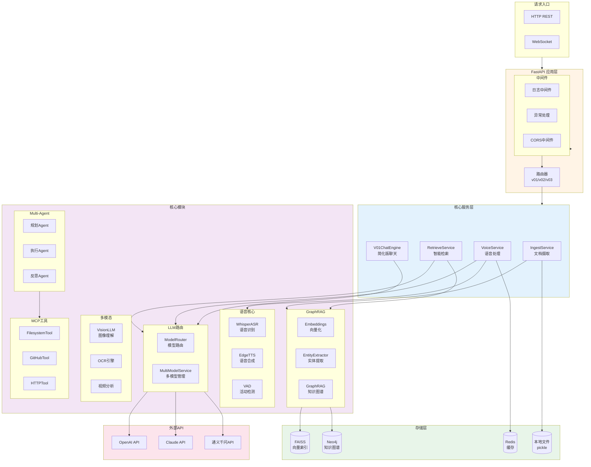
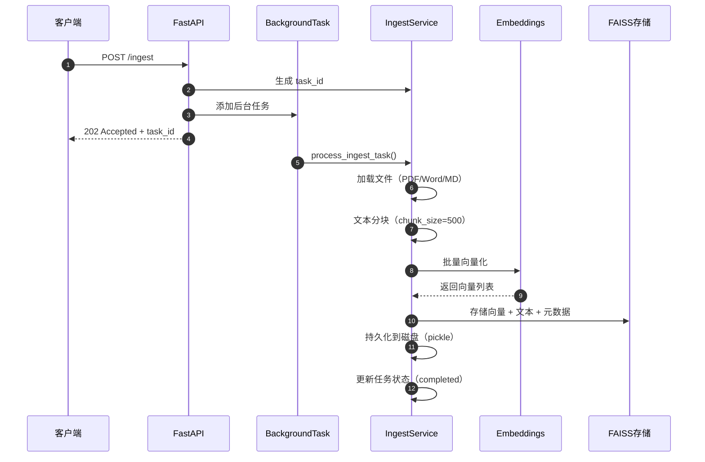
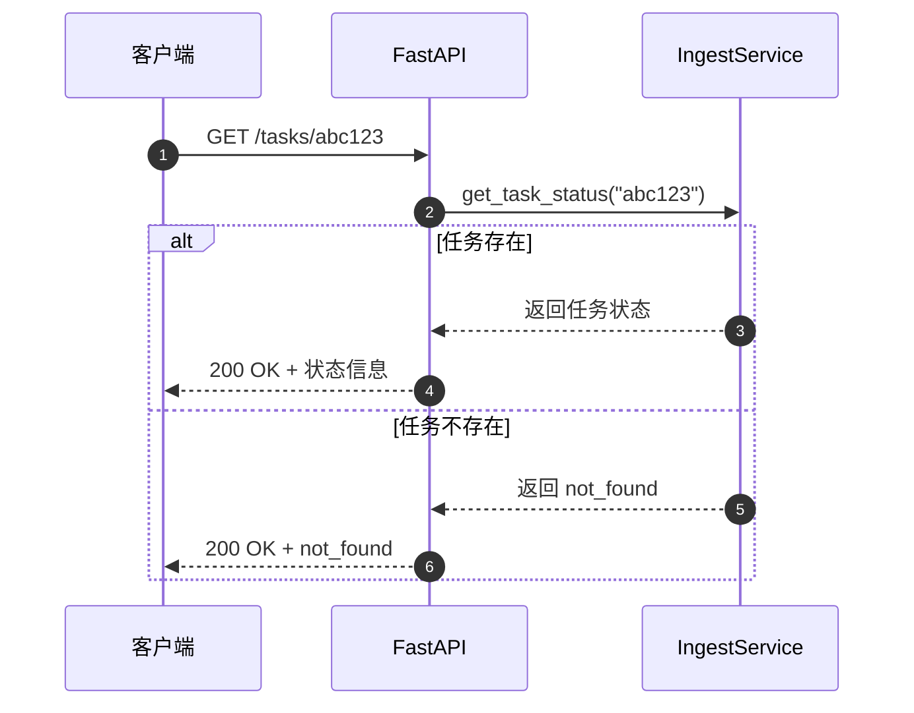
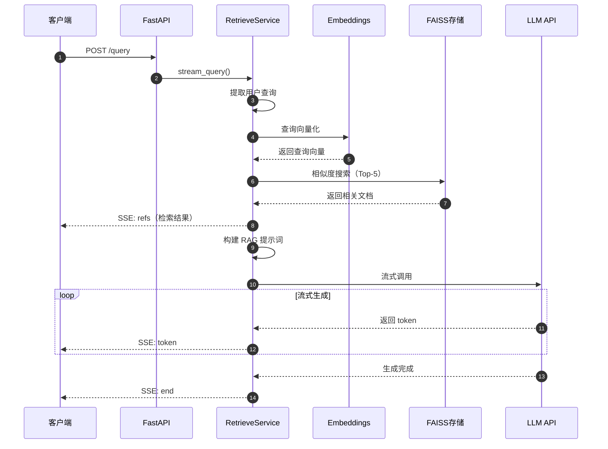
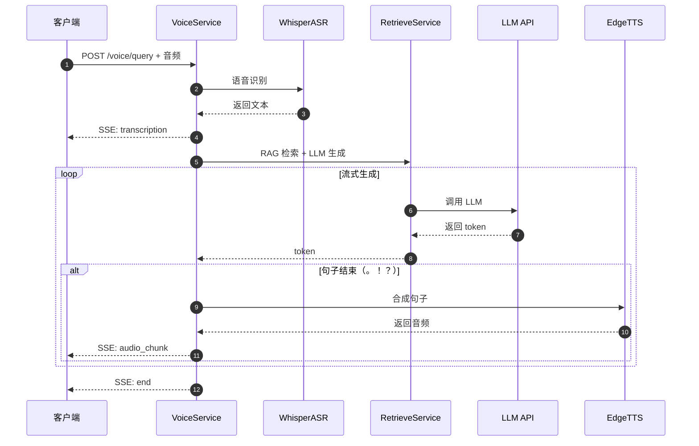
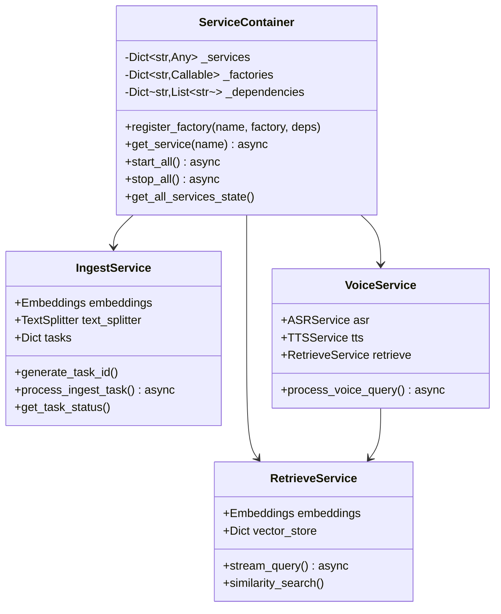
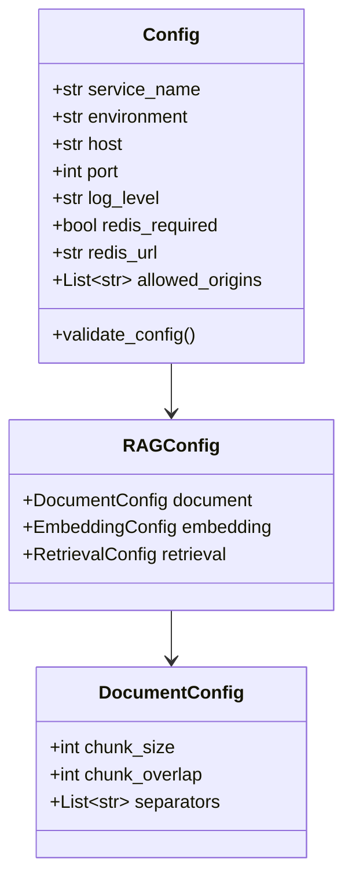

# VoiceHelper-02-Algo算法服务

## 模块概览

### 职责定位

算法服务是 VoiceHelper 的核心智能引擎，基于 Python 3.11+ 和 FastAPI 框架构建，负责：

- **文档摄取**：PDF/Word/Markdown/HTML 文档的解析、分块、向量化、索引
- **智能检索**：基于向量相似度的语义搜索、GraphRAG 知识图谱推理
- **语音处理**：实时 ASR 识别、TTS 合成、VAD 语音活动检测、打断处理
- **LLM 调用**：多模型路由、流式生成、成本优化、降级策略
- **Multi-Agent**：任务规划、工具调用、反思优化
- **多模态分析**：图像理解、OCR、视频分析
- **MCP 工具**：文件系统、GitHub、HTTP 工具集成

### 输入输出

**输入**：
- HTTP REST 请求（来自 Backend 网关）
- WebSocket 连接（实时语音流）
- 文档文件（PDF、Word、Markdown、HTML）
- 音频数据（PCM/WAV/MP3）
- 图像/视频文件

**输出**：
- HTTP 响应（JSON 格式）
- SSE 流式响应（LLM 生成）
- WebSocket 消息（实时语音）
- 向量索引（FAISS）
- 知识图谱（Neo4j）

### 上下游依赖

**上游**：Backend 网关（HTTP/WebSocket）

**下游**：
- **LLM API**：OpenAI、Claude、通义千问、GLM
- **向量存储**：FAISS（本地）、Milvus（可选）
- **图数据库**：Neo4j（GraphRAG）
- **缓存**：Redis（语义缓存、会话）
- **对象存储**：MinIO（文件存储）

### 生命周期

1. **启动阶段**（约 10-15 秒）：
   - 加载配置（环境变量 + config.py）
   - 初始化服务容器（ServiceContainer）
   - 创建核心服务（Ingest、Retrieve、Voice、LLM）
   - 加载本地向量存储（FAISS）
   - 注册健康检查组件
   - 启动 Uvicorn 服务器

2. **运行阶段**：
   - 接收并处理请求
   - 异步任务调度（文档摄取）
   - 定期指标收集（每 15 秒）
   - Redis 连接保活

3. **关闭阶段**（优雅关闭，最长 30 秒）：
   - 停止接收新请求
   - 等待异步任务完成
   - 保存向量存储到磁盘
   - 关闭 Redis 连接
   - 清理临时文件

---

## 模块架构图



### 架构说明

**FastAPI 应用层**：
- 使用 FastAPI 异步框架，支持高并发
- 路由按版本划分（v01、v02、v03）
- 中间件处理日志、异常、CORS

**核心服务层**：
- 每个服务独立实现，通过依赖注入管理
- 使用 ServiceContainer 统一生命周期管理
- 支持服务工厂模式，延迟初始化

**核心模块**：
- GraphRAG：文档摄取 → 向量化 → 实体提取 → 图构建 → 混合检索
- Multi-Agent：任务规划 → 工具调用 → 结果聚合 → 反思优化
- 语音核心：ASR → LLM → TTS 全链路
- LLM 路由：多模型管理、智能路由、降级
- 多模态：图像/视频理解
- MCP 工具：标准化工具集成

**扩展点**：
- 新增 Embedding 模型：在 `embeddings.py` 中注册
- 新增 LLM 提供商：继承 `BaseLLMProvider`
- 新增 MCP 工具：实现 `MCPTool` 接口
- 新增路由版本：创建新的 `vXX_routes.py`

**状态持有**：
- 向量存储：内存 + 磁盘持久化（pickle）
- 会话上下文：Redis 短期存储
- 任务状态：内存字典（重启清空）

**资源占用**：
- 内存：约 500MB-1GB（空闲）、2-4GB（高负载）
- CPU：单核 20-30%（空闲）、多核 80-100%（高负载）
- 磁盘：向量索引约 100MB/10000 文档
- 协程：每个请求 2-5 个，高峰时可达 1000+

---

## 核心 API 列表（v0.1 版本）

### 1. 文档摄取 - POST /ingest

**基本信息**：
- 协议：HTTP POST
- 路径：`/ingest`
- 幂等性：否（每次创建新任务）
- 异步处理：是（后台任务）

**请求结构体**：

```python
class IngestRequest(BaseModel):
    files: Optional[List[str]] = None  # 文件路径列表
    urls: Optional[List[str]] = None   # URL 列表
    collection_name: str = "default"   # 集合名称
    metadata: Optional[Dict[str, Any]] = None  # 元数据
```

**字段表**：

| 字段 | 类型 | 必填 | 约束 | 说明 |
|---|---|---:|---|---|
| files | List[str] | 否 | 至少提供 files 或 urls 之一 | 本地文件路径列表 |
| urls | List[str] | 否 | 有效 HTTP/HTTPS URL | 网页 URL 列表 |
| collection_name | str | 否 | 默认 "default" | 向量集合名称 |
| metadata | Dict | 否 | JSON 对象 | 自定义元数据 |

**响应结构体**：

```python
class IngestResponse(BaseModel):
    task_id: str  # 任务 ID
```

**入口函数**（核心代码）：

```python
@app.post("/ingest", response_model=IngestResponse)
async def ingest_documents(
    request: IngestRequest,
    background_tasks: BackgroundTasks,
    http_request: Request
):
    # 1. 参数验证
    if not request.files and not request.urls:
        raise VoiceHelperError(ErrorCode.RAG_INVALID_QUERY, "没有提供文档文件或URL")
    
    # 2. 获取 IngestService
    container = get_service_container()
    ingest_service = await container.get_service("ingest_service")
    
    # 3. 生成任务 ID
    task_id = ingest_service.generate_task_id()
    
    # 4. 添加后台任务（异步处理）
    background_tasks.add_task(
        ingest_service.process_ingest_task,
        task_id,
        request
    )
    
    # 5. 立即返回任务 ID
    return IngestResponse(task_id=task_id)
```

**核心处理流程**（`IngestService.process_ingest_task`）：

```python
async def process_ingest_task(self, task_id: str, request: IngestRequest):
    # 1. 初始化任务状态
    self.tasks[task_id] = TaskStatus(
        task_id=task_id,
        status="processing",
        progress=0
    )
    
    documents = []
    
    # 2. 加载文件（支持 PDF、Word、Markdown、HTML）
    if request.files:
        for file_path in request.files:
            docs = await self._load_file(file_path)
            documents.extend(docs)
            self.tasks[task_id].progress = 50  # 更新进度
    
    # 3. 加载 URL
    if request.urls:
        for url in request.urls:
            docs = await self._load_url(url)
            documents.extend(docs)
    
    # 4. 文本分块（RecursiveCharacterTextSplitter）
    chunks = self.text_splitter.split_documents(documents)
    self.tasks[task_id].progress = 60
    
    # 5. 向量化（批量处理）
    texts = [chunk.page_content for chunk in chunks]
    vectors = await asyncio.to_thread(
        self.embeddings.embed_documents,
        texts
    )
    self.tasks[task_id].progress = 80
    
    # 6. 存储到 FAISS（本地向量数据库）
    for i, (chunk, vector) in enumerate(zip(chunks, vectors)):
        chunk_id = f"{task_id}_{i}"
        self.vector_store[chunk_id] = {
            "vector": vector,
            "text": chunk.page_content,
            "metadata": chunk.metadata
        }
    
    # 7. 持久化到磁盘
    self._save_local_storage()
    
    # 8. 更新任务状态
    self.tasks[task_id].status = "completed"
    self.tasks[task_id].progress = 100
    self.tasks[task_id].message = f"Successfully indexed {len(chunks)} chunks"
```

**文件加载器映射**：

```python
async def _load_file(self, file_path: str):
    file_ext = Path(file_path).suffix.lower()
    
    # 根据文件扩展名选择加载器
    loaders = {
        ".pdf": PyPDFLoader,
        ".txt": TextLoader,
        ".md": UnstructuredMarkdownLoader,
        ".html": UnstructuredHTMLLoader,
        ".docx": lambda p: UnstructuredFileLoader(p),  # Word 文档
    }
    
    loader_cls = loaders.get(file_ext)
    if not loader_cls:
        raise ValueError(f"Unsupported file type: {file_ext}")
    
    loader = loader_cls(file_path)
    docs = await asyncio.to_thread(loader.load)
    return docs
```

**时序图**：



**边界与异常**：

1. **文件不存在或无法读取**：
   - 跳过该文件，记录错误日志
   - 继续处理其他文件
   - 任务状态标记为 "completed_with_errors"

2. **向量化失败**（API 调用失败）：
   - 重试 3 次（指数退避）
   - 失败后任务状态标记为 "failed"

3. **磁盘空间不足**：
   - 无法保存向量存储
   - 返回 500 错误

**性能要点**：

- **批量向量化**：一次处理 100 个文本块，减少 API 调用
- **异步处理**：文件加载和向量化使用 `asyncio.to_thread`
- **进度更新**：每 10% 更新一次任务进度
- **内存优化**：大文件分批处理，避免 OOM

---

### 2. 查询任务状态 - GET /tasks/{task_id}

**基本信息**：
- 协议：HTTP GET
- 路径：`/tasks/{task_id}`
- 幂等性：是（多次查询返回相同结果）

**响应结构体**：

```python
class TaskStatusResponse(BaseModel):
    task_id: str
    status: str  # processing, completed, failed
    progress: int  # 0-100
    message: str
    created_at: str
    updated_at: str
```

**字段表**：

| 字段 | 类型 | 说明 |
|---|---|---|
| task_id | str | 任务 ID |
| status | str | 任务状态：processing、completed、failed、not_found |
| progress | int | 进度百分比（0-100） |
| message | str | 状态消息 |
| created_at | str | 创建时间（ISO 8601） |
| updated_at | str | 更新时间（ISO 8601） |

**入口函数**（核心代码）：

```python
@app.get("/tasks/{task_id}")
async def get_task_status(task_id: str):
    # 1. 参数验证
    if not task_id or not task_id.strip():
        raise VoiceHelperError(ErrorCode.RAG_INVALID_QUERY, "任务ID不能为空")
    
    # 2. 获取服务
    container = get_service_container()
    ingest_service = await container.get_service("ingest_service")
    
    # 3. 查询任务状态
    status = ingest_service.get_task_status(task_id)
    
    # 4. 返回响应
    return status
```

**时序图**：



---

### 3. 智能检索 - POST /query

**基本信息**：
- 协议：HTTP POST
- 路径：`/query`
- 响应：SSE 流式响应
- 幂等性：否（每次可能返回不同结果）

**请求结构体**：

```python
class Message(BaseModel):
    role: str  # user, assistant, system
    content: str

class QueryRequest(BaseModel):
    messages: List[Message]  # 对话历史
    top_k: int = 5  # 检索文档数量
    filters: Optional[Dict[str, Any]] = None  # 过滤条件
    temperature: float = 0.7  # LLM 温度
    max_tokens: int = 2000  # 最大生成 token
```

**字段表**：

| 字段 | 类型 | 必填 | 约束 | 说明 |
|---|---|---:|---|---|
| messages | List[Message] | 是 | 至少 1 条消息 | 对话历史 |
| messages[].role | str | 是 | user/assistant/system | 消息角色 |
| messages[].content | str | 是 | 非空字符串 | 消息内容 |
| top_k | int | 否 | 1-100，默认 5 | 检索文档数量 |
| filters | Dict | 否 | JSON 对象 | 元数据过滤条件 |
| temperature | float | 否 | 0-2，默认 0.7 | LLM 生成温度 |
| max_tokens | int | 否 | 1-4000，默认 2000 | 最大生成 token |

**响应**：SSE 流式响应（NDJSON 格式）

```json
{"type": "refs", "data": [{"title": "文档1", "score": 0.95}]}
{"type": "token", "content": "根据"}
{"type": "token", "content": "检索"}
{"type": "token", "content": "结果"}
{"type": "end", "total_tokens": 50}
```

**入口函数**（核心代码）：

```python
@app.post("/query")
async def query_documents(request: QueryRequest):
    # 1. 参数验证
    if not request.messages:
        raise VoiceHelperError(ErrorCode.RAG_INVALID_QUERY, "消息不能为空")
    
    # 2. 获取服务
    container = get_service_container()
    retrieve_service = await container.get_service("retrieve_service")
    
    # 3. 流式响应
    return StreamingResponse(
        retrieve_service.stream_query(request),
        media_type="application/x-ndjson"
    )
```

**核心检索流程**（`RetrieveService.stream_query`）：

```python
async def stream_query(self, request: QueryRequest) -> AsyncGenerator[str, None]:
    # 1. 提取用户查询（最后一条 user 消息）
    user_query = self._extract_user_query(request.messages)
    
    # 2. 向量检索（FAISS 相似度搜索）
    references = await self._retrieve_documents(
        user_query,
        top_k=request.top_k,
        filters=request.filters
    )
    
    # 3. 发送检索结果（refs 类型）
    if references:
        yield self._format_response("refs", refs=references)
    
    # 4. 构建提示词（RAG 模板）
    prompt = self._build_prompt(request.messages, references)
    
    # 5. 调用 LLM 流式生成
    async for chunk in self._stream_llm_response(prompt, request):
        yield chunk
    
    # 6. 发送结束信号
    yield self._format_response("end")
```

**向量检索实现**：

```python
async def _retrieve_documents(
    self,
    query: str,
    top_k: int = 5,
    filters: Dict[str, Any] = None
) -> List[Reference]:
    # 1. 查询向量化
    query_vector = await asyncio.to_thread(
        self.embeddings.embed_query,
        query
    )
    
    # 2. 计算余弦相似度
    similarities = []
    for chunk_id, data in self.vector_store.items():
        # 应用过滤器
        if filters and not self._match_filters(data["metadata"], filters):
            continue
        
        # 计算相似度
        similarity = self._cosine_similarity(query_vector, data["vector"])
        similarities.append((chunk_id, similarity, data))
    
    # 3. 排序并返回 Top-K
    similarities.sort(key=lambda x: x[1], reverse=True)
    top_results = similarities[:top_k]
    
    # 4. 构建引用列表
    references = []
    for chunk_id, score, data in top_results:
        references.append(Reference(
            title=data["metadata"].get("source", "Unknown"),
            content=data["text"],
            score=float(score),
            metadata=data["metadata"]
        ))
    
    return references
```

**RAG 提示词模板**：

```python
def _build_prompt(self, messages: List[Message], references: List[Reference]) -> str:
    # 构建上下文
    context = "\n\n".join([
        f"[文档{i+1}] {ref.content}"
        for i, ref in enumerate(references)
    ])
    
    # 系统提示词
    system_prompt = f"""你是一个智能助手，基于以下检索到的文档片段回答用户问题。

检索到的相关文档：
{context}

请根据上述文档内容回答用户问题。如果文档中没有相关信息，请诚实告知。
"""
    
    # 构建对话历史
    conversation = [{"role": "system", "content": system_prompt}]
    for msg in messages:
        conversation.append({"role": msg.role, "content": msg.content})
    
    return conversation
```

**LLM 流式调用**：

```python
async def _stream_llm_response(
    self,
    prompt: List[Dict],
    request: QueryRequest
) -> AsyncGenerator[str, None]:
    # 1. 获取 LLM 路由服务
    llm_router = await self._get_llm_router()
    
    # 2. 路由到合适的模型（GPT-3.5 or GPT-4）
    model = llm_router.route(request)
    
    # 3. 流式生成
    async for chunk in model.stream_chat(
        messages=prompt,
        temperature=request.temperature,
        max_tokens=request.max_tokens
    ):
        # 格式化为 SSE 格式
        yield self._format_response("token", content=chunk)
```

**时序图**：



**性能要点**：

- **语义缓存**：相似查询（相似度 > 0.95）直接返回缓存结果
- **向量检索**：余弦相似度计算，O(n) 复杂度，10000 文档约 50ms
- **批量处理**：如果有多个查询，批量向量化
- **流式输出**：LLM 生成立即推送，无需等待完整响应

---

### 4. 语音查询 - POST /voice/query

**基本信息**：
- 协议：HTTP POST
- 路径：`/voice/query`
- 响应：SSE 流式响应（包含音频数据）

**请求结构体**：

```python
class VoiceQueryRequest(BaseModel):
    audio_data: str  # Base64 编码的音频数据
    session_id: str  # 会话 ID
    format: str = "wav"  # 音频格式
```

**字段表**：

| 字段 | 类型 | 必填 | 约束 | 说明 |
|---|---|---:|---|---|
| audio_data | str | 是 | Base64 编码 | 音频数据（PCM/WAV） |
| session_id | str | 是 | 非空字符串 | 会话 ID |
| format | str | 否 | wav/mp3，默认 wav | 音频格式 |

**响应**：SSE 流式响应

```json
{"type": "transcription", "text": "今天天气怎么样"}
{"type": "audio_chunk", "data": "base64_encoded_audio"}
{"type": "audio_chunk", "data": "base64_encoded_audio"}
{"type": "end"}
```

**入口函数**（核心代码）：

```python
@app.post("/voice/query")
async def voice_query(request: VoiceQueryRequest):
    # 1. 参数验证
    if not request.audio_data:
        raise VoiceHelperError(ErrorCode.VOICE_INVALID_FORMAT, "音频数据不能为空")
    
    # 2. 获取服务
    container = get_service_container()
    voice_service = await container.get_service("voice_service")
    
    # 3. 流式处理
    return StreamingResponse(
        voice_service.process_voice_query(request),
        media_type="application/x-ndjson"
    )
```

**核心语音处理流程**：

```python
async def process_voice_query(self, request: VoiceQueryRequest):
    # 1. Base64 解码音频
    audio_bytes = base64.b64decode(request.audio_data)
    
    # 2. ASR 识别
    transcription = await self.asr_service.transcribe_audio(
        audio_bytes,
        is_final=True,
        session_id=request.session_id
    )
    
    # 3. 发送识别结果
    yield self._format_response("transcription", text=transcription)
    
    # 4. 调用 RAG 检索（复用 RetrieveService）
    query_request = QueryRequest(
        messages=[Message(role="user", content=transcription)]
    )
    
    full_text = []
    async for chunk in self.retrieve_service.stream_query(query_request):
        data = json.loads(chunk)
        if data["type"] == "token":
            full_text.append(data["content"])
            
            # 累积到句子边界时合成语音
            if data["content"] in ["。", "！", "？", "\n"]:
                sentence = "".join(full_text)
                full_text.clear()
                
                # 5. TTS 合成
                audio_data = await self.tts_service.synthesize_sentence(sentence)
                
                # 6. 发送音频 chunk
                yield self._format_response(
                    "audio_chunk",
                    data=base64.b64encode(audio_data).decode()
                )
    
    # 7. 发送结束信号
    yield self._format_response("end")
```

**时序图**：



---

## 关键数据结构

### 1. 服务容器（ServiceContainer）



**ServiceContainer 生命周期**：

```python
# 注册服务工厂
container.register_factory("ingest_service", create_ingest_service, dependencies=[])
container.register_factory("retrieve_service", create_retrieve_service, dependencies=[])
container.register_factory("voice_service", create_voice_service, dependencies=["retrieve_service"])

# 启动所有服务（按依赖顺序）
await container.start_all()

# 获取服务（延迟初始化）
ingest_service = await container.get_service("ingest_service")

# 停止所有服务
await container.stop_all()
```

### 2. 配置结构（Config）



---

## 最佳实践

### 1. 异步编程

```python
# 好的做法：使用 asyncio.to_thread 处理同步 IO
vectors = await asyncio.to_thread(
    embeddings.embed_documents,
    texts
)

# 坏的做法：直接调用同步函数（阻塞事件循环）
vectors = embeddings.embed_documents(texts)  # ❌ 阻塞
```

### 2. 错误处理

```python
# 使用自定义异常
try:
    result = await service.process()
except ServiceError as e:
    logger.error(f"Service error: {e}")
    raise VoiceHelperError(ErrorCode.RAG_INTERNAL_ERROR, str(e))
except Exception as e:
    logger.exception("Unexpected error")
    raise VoiceHelperError(ErrorCode.SYSTEM_INTERNAL_ERROR, str(e))
```

### 3. 资源管理

```python
# 使用上下文管理器
async with get_service_container() as container:
    service = await container.get_service("ingest_service")
    await service.process()
    # 自动清理
```

### 4. 性能优化

```python
# 批量处理
async def batch_embed(texts: List[str], batch_size: int = 100):
    results = []
    for i in range(0, len(texts), batch_size):
        batch = texts[i:i + batch_size]
        vectors = await asyncio.to_thread(embeddings.embed_documents, batch)
        results.extend(vectors)
    return results

# 并发处理
tasks = [process_file(file) for file in files]
results = await asyncio.gather(*tasks, return_exceptions=True)
```

---

## 部署与监控

### 健康检查

```python
@app.get("/health")
async def health_check():
    health_checker = get_health_checker()
    result = await health_checker.check_all()
    
    return {
        "status": result.status,  # healthy/unhealthy
        "components": result.components,
        "timestamp": datetime.now().isoformat()
    }
```

### Prometheus 指标

```python
# 请求计数
http_requests_total{method="POST",path="/query",status="200"} 1234

# 请求延迟
http_request_duration_seconds{method="POST",path="/query",quantile="0.95"} 0.523

# 向量检索延迟
vector_search_duration_seconds{quantile="0.95"} 0.052

# ASR 延迟
asr_latency_seconds{session_id="abc",quantile="0.95"} 0.312
```

---

**文档版本**：v1.0  
**最后更新**：2025-01-08  
**维护者**：VoiceHelper 团队

