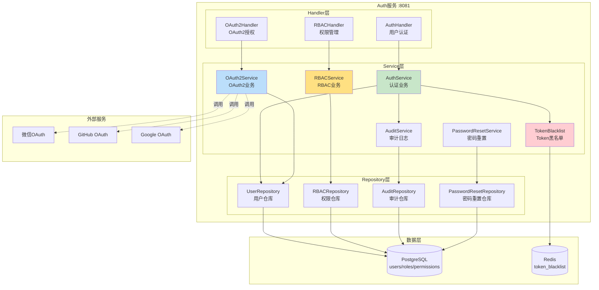
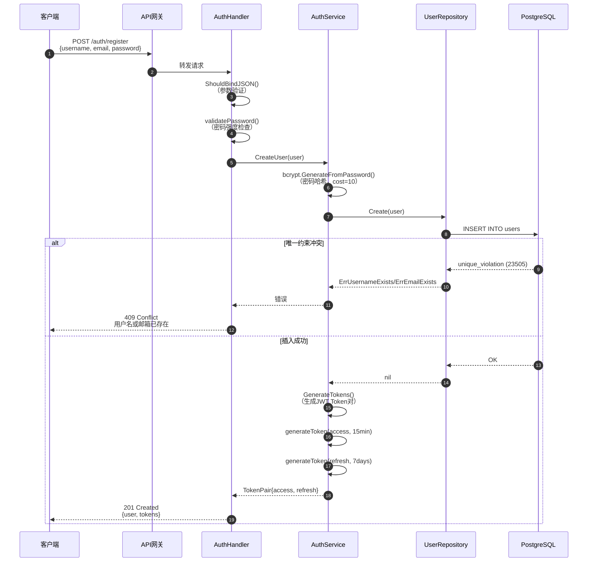
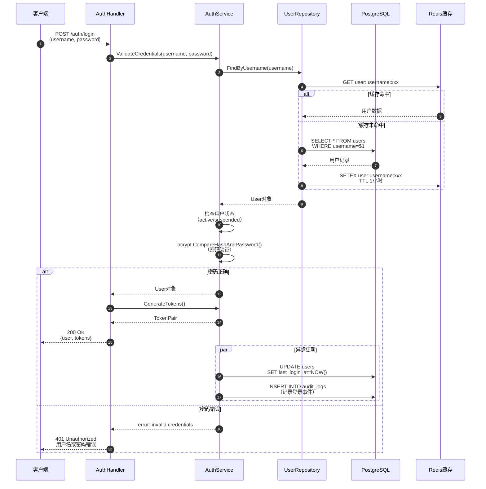
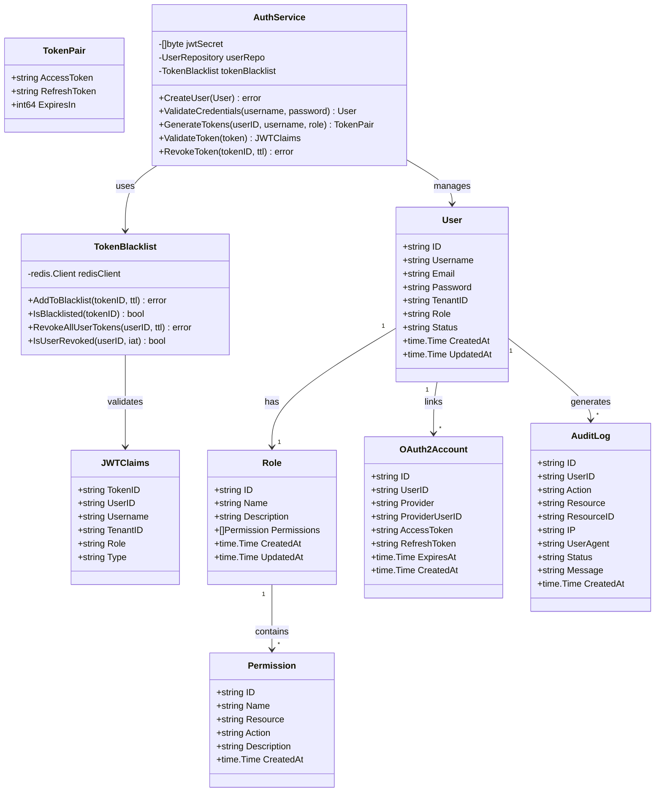
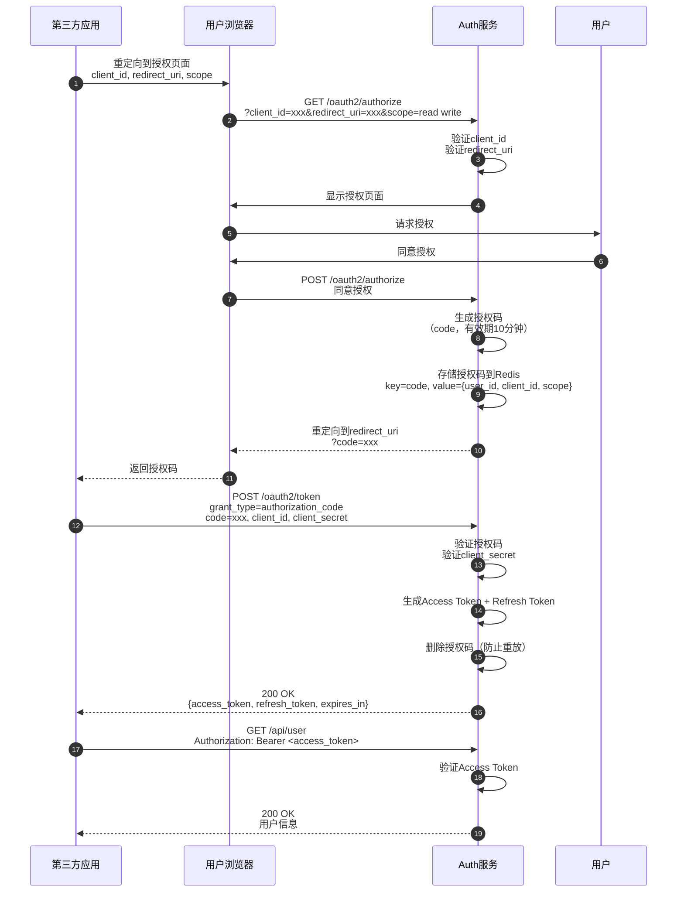
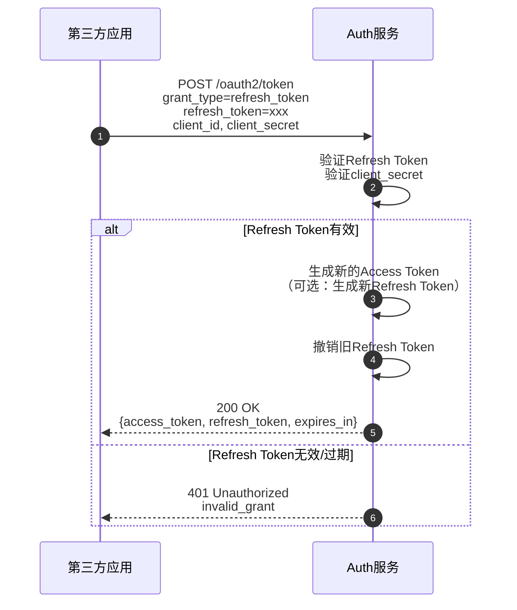
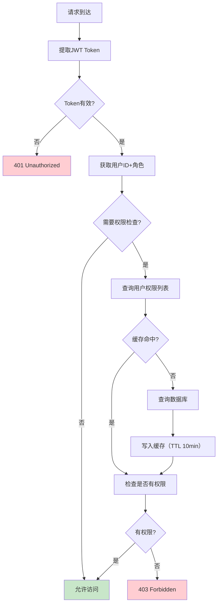

# VoiceHelper-02-Auth认证服务

## 1. 模块概览

### 1.1 职责边界

**核心职责**：
- **用户管理**：用户注册、登录、信息管理
- **JWT Token管理**：生成、验证、刷新、撤销Token
- **OAuth2.0支持**：授权码模式、客户端凭证模式、刷新令牌
- **RBAC权限控制**：角色管理、权限分配、权限校验
- **SSO单点登录**：支持第三方认证（微信、GitHub、Google）
- **审计日志**：记录所有认证相关操作

**输入**：
- HTTP请求（用户注册、登录、Token验证）
- OAuth2授权请求
- Token刷新请求

**输出**：
- JWT Token（Access Token + Refresh Token）
- 用户信息
- OAuth2授权码/Token
- 权限校验结果
- 审计日志

**上下游依赖**：
- **上游**：API网关（所有认证请求经网关转发）
- **下游**：
  - PostgreSQL（用户、角色、权限数据）
  - Redis（Token黑名单、会话状态）
  - 第三方OAuth2提供商（微信、GitHub、Google）
  - 审计日志服务（记录操作）

**生命周期**：
- **启动**：加载配置 → 初始化数据库连接 → 初始化Redis → 启动HTTP服务器（:8081）
- **运行**：接收认证请求 → 处理业务逻辑 → 返回响应
- **关闭**：停止接收请求 → 等待现有请求完成 → 关闭连接

---

### 1.2 模块架构图



### 架构要点说明

#### 1. 三层架构
- **Handler层**：HTTP请求处理、参数验证、响应封装
- **Service层**：业务逻辑实现、事务管理、外部服务调用
- **Repository层**：数据访问封装、SQL执行、数据映射

#### 2. 服务职责分离
- **AuthService**：核心认证逻辑（注册、登录、Token管理）
- **OAuth2Service**：OAuth2协议实现
- **RBACService**：权限管理（角色、权限、分配）
- **AuditService**：审计日志记录
- **PasswordResetService**：密码重置流程
- **TokenBlacklist**：Token黑名单管理（Redis）

#### 3. Token管理机制
- **Access Token**：有效期15分钟，用于API访问
- **Refresh Token**：有效期7天，用于刷新Access Token
- **Token撤销**：登出时加入Redis黑名单（TTL=剩余有效期）
- **全局撤销**：用户修改密码后撤销所有Token

#### 4. 扩展点
- **新增OAuth2提供商**：实现`OAuth2Provider`接口
- **自定义权限策略**：扩展`PermissionChecker`接口
- **审计日志定制**：实现`AuditLogger`接口

---

## 2. 对外API列表与规格

### 2.1 用户注册

**基本信息**：
- 名称：`Register`
- 协议与方法：HTTP POST `/auth/register`
- 幂等性：否（重复注册返回用户已存在错误）
- 速率限制：5次/分钟（按IP）

**请求结构体**：
```go
type RegisterRequest struct {
    Username string `json:"username" binding:"required,min=3,max=50"`
    Email    string `json:"email" binding:"required,email"`
    Password string `json:"password" binding:"required,min=8"`
    TenantID string `json:"tenant_id" binding:"omitempty"`
}
```

**字段表**：
| 字段 | 类型 | 必填 | 约束 | 说明 |
|------|------|---:|------|------|
| username | string | 是 | 3-50字符 | 用户名，唯一 |
| email | string | 是 | 标准邮箱格式 | 邮箱地址，唯一 |
| password | string | 是 | 8-72字符，需包含大小写字母+数字中的3种 | 明文密码 |
| tenant_id | string | 否 | UUID格式 | 租户ID（多租户场景） |

**响应结构体**：
```go
type RegisterResponse struct {
    Code    int    `json:"code"`
    Message string `json:"message"`
    Data    struct {
        User   *User      `json:"user"`
        Tokens *TokenPair `json:"tokens"`
    } `json:"data"`
}

type User struct {
    ID        string    `json:"id"`
    Username  string    `json:"username"`
    Email     string    `json:"email"`
    TenantID  string    `json:"tenant_id"`
    Role      string    `json:"role"`
    Status    string    `json:"status"`
    CreatedAt time.Time `json:"created_at"`
    UpdatedAt time.Time `json:"updated_at"`
}

type TokenPair struct {
    AccessToken  string `json:"access_token"`
    RefreshToken string `json:"refresh_token"`
    ExpiresIn    int64  `json:"expires_in"`  // 秒
}
```

**入口函数与核心代码**：
```go
// services/auth-service/internal/handler/auth_handler.go
func (h *AuthHandler) Register(c *gin.Context) {
    var req model.RegisterRequest
    
    // 1. 参数绑定与验证（Gin Validator）
    if err := c.ShouldBindJSON(&req); err != nil {
        c.JSON(400, gin.H{"code": 400, "message": "Invalid request"})
        return
    }
    
    // 2. 密码强度验证（自定义规则）
    if err := validatePassword(req.Password); err != nil {
        c.JSON(400, gin.H{"code": 400, "message": err.Error()})
        return
    }
    
    // 3. 创建用户对象
    user := &model.User{
        ID:        uuid.New().String(),
        Username:  req.Username,
        Email:     req.Email,
        Password:  req.Password,  // 明文密码，Service层会哈希
        TenantID:  req.TenantID,
        Role:      "user",        // 默认角色
        Status:    "active",
        CreatedAt: time.Now(),
        UpdatedAt: time.Now(),
    }
    
    // 4. 调用Service层创建用户（事务处理）
    if err := h.authService.CreateUser(c.Request.Context(), user); err != nil {
        c.JSON(500, gin.H{"code": 500, "message": "Failed to create user"})
        return
    }
    
    // 5. 生成JWT Token对
    tokens, err := h.authService.GenerateTokens(
        c.Request.Context(),
        user.ID,
        user.Username,
        user.TenantID,
        user.Role,
    )
    if err != nil {
        c.JSON(500, gin.H{"code": 500, "message": "Failed to generate tokens"})
        return
    }
    
    // 6. 返回响应
    c.JSON(201, gin.H{
        "code":    201,
        "message": "User registered successfully",
        "data": gin.H{
            "user":   user,
            "tokens": tokens,
        },
    })
}

// 密码强度验证函数
func validatePassword(password string) error {
    if len(password) < 8 {
        return errors.New("密码长度至少8位")
    }
    if len(password) > 72 {
        return errors.New("密码长度不能超过72位")
    }
    
    var (
        hasUpper   = false
        hasLower   = false
        hasNumber  = false
        hasSpecial = false
    )
    
    for _, char := range password {
        switch {
        case unicode.IsUpper(char):
            hasUpper = true
        case unicode.IsLower(char):
            hasLower = true
        case unicode.IsNumber(char):
            hasNumber = true
        case unicode.IsPunct(char) || unicode.IsSymbol(char):
            hasSpecial = true
        }
    }
    
    // 至少包含大写、小写、数字、特殊字符中的3种
    count := 0
    if hasUpper { count++ }
    if hasLower { count++ }
    if hasNumber { count++ }
    if hasSpecial { count++ }
    
    if count < 3 {
        return errors.New("密码必须包含大写字母、小写字母、数字、特殊字符中的至少3种")
    }
    
    return nil
}
```

**调用链与上层函数**：
```go
// 1. Service层：创建用户
func (s *AuthService) CreateUser(ctx context.Context, user *model.User) error {
    // Hash密码（bcrypt, cost=10）
    hashedPassword, err := bcrypt.GenerateFromPassword(
        []byte(user.Password),
        bcrypt.DefaultCost,  // cost=10
    )
    if err != nil {
        return err
    }
    user.Password = string(hashedPassword)
    
    // 调用Repository层保存到数据库
    return s.userRepo.Create(ctx, user)
}

// 2. Repository层：数据库插入
func (r *UserRepository) Create(ctx context.Context, user *model.User) error {
    query := `
        INSERT INTO users (id, username, email, password, tenant_id, role, status, created_at, updated_at)
        VALUES ($1, $2, $3, $4, $5, $6, $7, $8, $9)
    `
    
    _, err := r.db.ExecContext(ctx, query,
        user.ID,
        user.Username,
        user.Email,
        user.Password,  // 已哈希密码
        user.TenantID,
        user.Role,
        user.Status,
        user.CreatedAt,
        user.UpdatedAt,
    )
    
    if err != nil {
        // 唯一约束冲突检查
        if pqErr, ok := err.(*pq.Error); ok {
            if pqErr.Code == "23505" {  // unique_violation
                if strings.Contains(pqErr.Message, "username") {
                    return ErrUsernameExists
                }
                if strings.Contains(pqErr.Message, "email") {
                    return ErrEmailExists
                }
            }
        }
        return err
    }
    
    return nil
}

// 3. Service层：生成Token对
func (s *AuthService) GenerateTokens(
    ctx context.Context,
    userID, username, tenantID, role string,
) (*model.TokenPair, error) {
    // 生成Access Token（15分钟）
    accessToken, err := s.generateToken(
        userID, username, tenantID, role, "access", 15*time.Minute,
    )
    if err != nil {
        return nil, err
    }
    
    // 生成Refresh Token（7天）
    refreshToken, err := s.generateToken(
        userID, username, tenantID, role, "refresh", 7*24*time.Hour,
    )
    if err != nil {
        return nil, err
    }
    
    return &model.TokenPair{
        AccessToken:  accessToken,
        RefreshToken: refreshToken,
        ExpiresIn:    15 * 60,  // 15分钟（秒）
    }, nil
}

func (s *AuthService) generateToken(
    userID, username, tenantID, role, tokenType string,
    expiry time.Duration,
) (string, error) {
    now := time.Now()
    tokenID := uuid.New().String()  // JWT ID（用于黑名单）
    
    // JWT Claims
    claims := jwt.MapClaims{
        "jti":       tokenID,     // JWT ID
        "user_id":   userID,
        "username":  username,
        "tenant_id": tenantID,
        "role":      role,
        "type":      tokenType,   // access/refresh
        "exp":       now.Add(expiry).Unix(),
        "iat":       now.Unix(),
    }
    
    // 签名（HS256）
    token := jwt.NewWithClaims(jwt.SigningMethodHS256, claims)
    return token.SignedString(s.jwtSecret)
}
```

**时序图（注册请求→响应完整路径）**：


**边界与异常**：
1. **重复注册**：
   - 用户名重复：HTTP 409，错误码`USERNAME_EXISTS`
   - 邮箱重复：HTTP 409，错误码`EMAIL_EXISTS`

2. **密码强度不足**：
   - 返回HTTP 400，详细错误信息（如"密码必须包含大写字母、小写字母、数字中的至少3种"）

3. **参数验证失败**：
   - 用户名长度不符：HTTP 400，"用户名长度必须在3-50字符之间"
   - 邮箱格式错误：HTTP 400，"邮箱格式不正确"

4. **数据库故障**：
   - 连接失败：HTTP 503，"服务暂时不可用"
   - 超时：HTTP 504，"请求超时"

**实践与最佳实践**：
1. **密码安全**：
   - 传输：HTTPS强制加密
   - 存储：bcrypt哈希（cost=10，抗暴力破解）
   - 日志：明文密码永不记录

2. **防暴力注册**：
   - IP限流：5次/分钟
   - 邮箱验证：发送验证邮件（后续功能）
   - CAPTCHA：可选人机验证

3. **Token管理**：
   - Access Token短期（15分钟，减少泄露风险）
   - Refresh Token长期（7天，用户体验）
   - 自动续期：距离过期<5分钟时自动刷新

---

### 2.2 用户登录

**基本信息**：
- 名称：`Login`
- 协议与方法：HTTP POST `/auth/login`
- 幂等性：否（每次登录生成新Token）
- 速率限制：5次/分钟（按IP）

**请求结构体**：
```go
type LoginRequest struct {
    Username string `json:"username" binding:"required"`
    Password string `json:"password" binding:"required"`
}
```

**响应结构体**：
```go
type LoginResponse struct {
    Code    int    `json:"code"`
    Message string `json:"message"`
    Data    struct {
        User   *User      `json:"user"`
        Tokens *TokenPair `json:"tokens"`
    } `json:"data"`
}
```

**入口函数与核心代码**：
```go
func (h *AuthHandler) Login(c *gin.Context) {
    var req model.LoginRequest
    
    // 1. 参数绑定
    if err := c.ShouldBindJSON(&req); err != nil {
        c.JSON(400, gin.H{"code": 400, "message": "Invalid request"})
        return
    }
    
    // 2. 验证用户凭据（用户名+密码）
    user, err := h.authService.ValidateCredentials(
        c.Request.Context(),
        req.Username,
        req.Password,
    )
    if err != nil {
        // 统一返回"用户名或密码错误"（不泄露具体信息）
        c.JSON(401, gin.H{"code": 401, "message": "Invalid credentials"})
        return
    }
    
    // 3. 生成Token
    tokens, err := h.authService.GenerateTokens(
        c.Request.Context(),
        user.ID,
        user.Username,
        user.TenantID,
        user.Role,
    )
    if err != nil {
        c.JSON(500, gin.H{"code": 500, "message": "Failed to generate tokens"})
        return
    }
    
    // 4. 返回响应
    c.JSON(200, gin.H{
        "code":    200,
        "message": "Login successful",
        "data": gin.H{
            "user":   user,
            "tokens": tokens,
        },
    })
}
```

**调用链**：
```go
// Service层：验证凭据
func (s *AuthService) ValidateCredentials(
    ctx context.Context,
    username, password string,
) (*model.User, error) {
    // 1. 从数据库查询用户
    user, err := s.userRepo.FindByUsername(ctx, username)
    if err != nil {
        if errors.Is(err, repository.ErrUserNotFound) {
            return nil, errors.New("invalid credentials")
        }
        return nil, err
    }
    
    // 2. 检查用户状态
    if user.Status != "active" {
        return nil, errors.New("user account is not active")
    }
    
    // 3. 验证密码（bcrypt.CompareHashAndPassword）
    if err := bcrypt.CompareHashAndPassword(
        []byte(user.Password),
        []byte(password),
    ); err != nil {
        return nil, errors.New("invalid credentials")
    }
    
    return user, nil
}
```

**时序图**：


---

### 2.3 Token验证

**基本信息**：
- 名称：`ValidateToken`
- 协议与方法：HTTP GET `/auth/validate`
- 幂等性：是
- 用途：供其他微服务调用，验证Token有效性

**请求头**：
```
Authorization: Bearer <jwt_token>
```

**响应结构体**：
```go
type ValidateTokenResponse struct {
    Code    int    `json:"code"`
    Message string `json:"message"`
    Data    struct {
        UserID   string `json:"user_id"`
        Username string `json:"username"`
        TenantID string `json:"tenant_id"`
        Role     string `json:"role"`
    } `json:"data"`
}
```

**入口函数与核心代码**：
```go
func (h *AuthHandler) ValidateToken(c *gin.Context) {
    // 1. 从Header提取Token
    token := c.GetHeader("Authorization")
    if token == "" {
        c.JSON(401, gin.H{"code": 401, "message": "Missing token"})
        return
    }
    
    // 2. 去掉"Bearer "前缀
    if len(token) > 7 && token[:7] == "Bearer " {
        token = token[7:]
    }
    
    // 3. 验证Token
    claims, err := h.authService.ValidateToken(c.Request.Context(), token)
    if err != nil {
        c.JSON(401, gin.H{"code": 401, "message": "Invalid token"})
        return
    }
    
    // 4. 返回Token中的用户信息
    c.JSON(200, gin.H{
        "code":    200,
        "message": "Token valid",
        "data": gin.H{
            "user_id":   claims.UserID,
            "username":  claims.Username,
            "tenant_id": claims.TenantID,
            "role":      claims.Role,
        },
    })
}
```

**Service层：Token验证**：
```go
func (s *AuthService) ValidateToken(ctx context.Context, tokenString string) (*model.JWTClaims, error) {
    // 1. 解析JWT Token
    token, err := jwt.Parse(tokenString, func(token *jwt.Token) (interface{}, error) {
        // 验证签名算法
        if _, ok := token.Method.(*jwt.SigningMethodHMAC); !ok {
            return nil, errors.New("invalid signing method")
        }
        return s.jwtSecret, nil
    })
    
    if err != nil {
        return nil, err
    }
    
    // 2. 提取Claims
    if claims, ok := token.Claims.(jwt.MapClaims); ok && token.Valid {
        tokenID := claims["jti"].(string)
        
        // 3. 检查Token是否在黑名单中
        if s.tokenBlacklist != nil {
            isBlacklisted, err := s.tokenBlacklist.IsBlacklisted(ctx, tokenID)
            if err != nil {
                return nil, err
            }
            if isBlacklisted {
                return nil, errors.New("token has been revoked")
            }
            
            // 4. 检查用户Token是否被全局撤销（修改密码场景）
            userID := claims["user_id"].(string)
            iat := time.Unix(int64(claims["iat"].(float64)), 0)
            isRevoked, err := s.tokenBlacklist.IsUserRevoked(ctx, userID, iat)
            if err != nil {
                return nil, err
            }
            if isRevoked {
                return nil, errors.New("user tokens have been revoked")
            }
        }
        
        // 5. 返回Claims
        return &model.JWTClaims{
            TokenID:  tokenID,
            UserID:   claims["user_id"].(string),
            Username: claims["username"].(string),
            TenantID: claims["tenant_id"].(string),
            Role:     claims["role"].(string),
            Type:     claims["type"].(string),
        }, nil
    }
    
    return nil, errors.New("invalid token")
}
```

**Token黑名单实现（Redis）**：
```go
// services/auth-service/internal/service/token_blacklist.go
type TokenBlacklist struct {
    redisClient *redis.Client
}

func NewTokenBlacklist(redisClient *redis.Client) *TokenBlacklist {
    return &TokenBlacklist{redisClient: redisClient}
}

// AddToBlacklist 将Token加入黑名单
func (tb *TokenBlacklist) AddToBlacklist(ctx context.Context, tokenID string, ttl time.Duration) error {
    key := "blacklist:token:" + tokenID
    return tb.redisClient.Set(ctx, key, "1", ttl).Err()
}

// IsBlacklisted 检查Token是否在黑名单中
func (tb *TokenBlacklist) IsBlacklisted(ctx context.Context, tokenID string) (bool, error) {
    key := "blacklist:token:" + tokenID
    result, err := tb.redisClient.Exists(ctx, key).Result()
    if err != nil {
        return false, err
    }
    return result > 0, nil
}

// RevokeAllUserTokens 撤销用户所有Token（修改密码场景）
func (tb *TokenBlacklist) RevokeAllUserTokens(ctx context.Context, userID string, ttl time.Duration) error {
    // 记录撤销时间戳，所有在此之前签发的Token都无效
    key := "blacklist:user:" + userID
    timestamp := time.Now().Unix()
    return tb.redisClient.Set(ctx, key, timestamp, ttl).Err()
}

// IsUserRevoked 检查用户Token是否被全局撤销
func (tb *TokenBlacklist) IsUserRevoked(ctx context.Context, userID string, tokenIssuedAt time.Time) (bool, error) {
    key := "blacklist:user:" + userID
    result, err := tb.redisClient.Get(ctx, key).Result()
    if err == redis.Nil {
        // 不存在撤销记录
        return false, nil
    }
    if err != nil {
        return false, err
    }
    
    revokeTime, _ := strconv.ParseInt(result, 10, 64)
    // Token签发时间早于撤销时间，说明已被撤销
    return tokenIssuedAt.Unix() < revokeTime, nil
}
```

---

### 2.4 Token刷新

**基本信息**：
- 名称：`RefreshToken`
- 协议与方法：HTTP POST `/auth/refresh`
- 幂等性：否（每次生成新Token）
- 速率限制：10次/分钟

**请求结构体**：
```go
type RefreshTokenRequest struct {
    RefreshToken string `json:"refresh_token" binding:"required"`
}
```

**响应结构体**：
```go
type RefreshTokenResponse struct {
    Code    int    `json:"code"`
    Message string `json:"message"`
    Data    struct {
        Tokens *TokenPair `json:"tokens"`
    } `json:"data"`
}
```

**入口函数与核心代码**：
```go
func (h *AuthHandler) RefreshToken(c *gin.Context) {
    var req struct {
        RefreshToken string `json:"refresh_token" binding:"required"`
    }
    
    // 1. 参数绑定
    if err := c.ShouldBindJSON(&req); err != nil {
        c.JSON(400, gin.H{"code": 400, "message": "Invalid request"})
        return
    }
    
    // 2. 验证并刷新Token
    tokens, err := h.authService.RefreshTokens(c.Request.Context(), req.RefreshToken)
    if err != nil {
        c.JSON(401, gin.H{"code": 401, "message": "Invalid refresh token"})
        return
    }
    
    // 3. 返回新的Token对
    c.JSON(200, gin.H{
        "code":    200,
        "message": "Token refreshed",
        "data":    gin.H{"tokens": tokens},
    })
}
```

**Service层**：
```go
func (s *AuthService) RefreshTokens(ctx context.Context, refreshToken string) (*model.TokenPair, error) {
    // 1. 验证Refresh Token
    claims, err := s.ValidateToken(ctx, refreshToken)
    if err != nil {
        return nil, err
    }
    
    // 2. 检查Token类型
    if claims.Type != "refresh" {
        return nil, errors.New("not a refresh token")
    }
    
    // 3. 生成新的Token对
    tokens, err := s.GenerateTokens(ctx, claims.UserID, claims.Username, claims.TenantID, claims.Role)
    if err != nil {
        return nil, err
    }
    
    // 4. （可选）将旧Refresh Token加入黑名单（防止重放）
    // s.RevokeToken(ctx, claims.TokenID, 7*24*time.Hour)
    
    return tokens, nil
}
```

---

### 2.5 用户登出

**基本信息**：
- 名称：`Logout`
- 协议与方法：HTTP POST `/auth/logout`
- 幂等性：是（多次登出无副作用）
- 需要认证：是

**请求头**：
```
Authorization: Bearer <jwt_token>
```

**响应结构体**：
```go
type LogoutResponse struct {
    Code    int    `json:"code"`
    Message string `json:"message"`
}
```

**入口函数与核心代码**：
```go
func (h *AuthHandler) Logout(c *gin.Context) {
    // 1. 从Header获取Token
    tokenString := c.GetHeader("Authorization")
    if len(tokenString) > 7 && tokenString[:7] == "Bearer " {
        tokenString = tokenString[7:]
    }
    
    // 2. 验证Token并获取TokenID
    claims, err := h.authService.ValidateToken(c.Request.Context(), tokenString)
    if err != nil {
        c.JSON(401, gin.H{"code": 401, "message": "Invalid token"})
        return
    }
    
    // 3. 将Token加入黑名单（TTL=剩余有效期）
    // Access Token有效期15分钟
    err = h.authService.RevokeToken(c.Request.Context(), claims.TokenID, 15*time.Minute)
    if err != nil {
        c.JSON(500, gin.H{"code": 500, "message": "Failed to logout"})
        return
    }
    
    // 4. 返回成功响应
    c.JSON(200, gin.H{
        "code":    200,
        "message": "Logout successful",
    })
}
```

---

## 3. 关键数据结构与UML图



### 数据库Schema

```sql
-- users表
CREATE TABLE users (
    id UUID PRIMARY KEY DEFAULT gen_random_uuid(),
    username VARCHAR(50) UNIQUE NOT NULL,
    email VARCHAR(255) UNIQUE NOT NULL,
    password VARCHAR(60) NOT NULL,  -- bcrypt哈希
    tenant_id UUID,
    role VARCHAR(20) NOT NULL DEFAULT 'user',
    status VARCHAR(20) NOT NULL DEFAULT 'active',  -- active/suspended/inactive
    created_at TIMESTAMP NOT NULL DEFAULT NOW(),
    updated_at TIMESTAMP NOT NULL DEFAULT NOW(),
    last_login_at TIMESTAMP
);

CREATE INDEX idx_users_username ON users(username);
CREATE INDEX idx_users_email ON users(email);
CREATE INDEX idx_users_tenant_id ON users(tenant_id);
CREATE INDEX idx_users_status ON users(status);

-- roles表
CREATE TABLE roles (
    id UUID PRIMARY KEY DEFAULT gen_random_uuid(),
    name VARCHAR(50) UNIQUE NOT NULL,
    description TEXT,
    created_at TIMESTAMP NOT NULL DEFAULT NOW(),
    updated_at TIMESTAMP NOT NULL DEFAULT NOW()
);

-- permissions表
CREATE TABLE permissions (
    id UUID PRIMARY KEY DEFAULT gen_random_uuid(),
    name VARCHAR(100) UNIQUE NOT NULL,  -- user.read, user.write
    resource VARCHAR(50) NOT NULL,      -- user, chat, document
    action VARCHAR(20) NOT NULL,        -- read, write, delete
    description TEXT,
    created_at TIMESTAMP NOT NULL DEFAULT NOW()
);

CREATE INDEX idx_permissions_resource ON permissions(resource);

-- role_permissions关联表
CREATE TABLE role_permissions (
    role_id UUID NOT NULL REFERENCES roles(id) ON DELETE CASCADE,
    permission_id UUID NOT NULL REFERENCES permissions(id) ON DELETE CASCADE,
    created_at TIMESTAMP NOT NULL DEFAULT NOW(),
    PRIMARY KEY (role_id, permission_id)
);

-- oauth2_accounts表
CREATE TABLE oauth2_accounts (
    id UUID PRIMARY KEY DEFAULT gen_random_uuid(),
    user_id UUID NOT NULL REFERENCES users(id) ON DELETE CASCADE,
    provider VARCHAR(50) NOT NULL,           -- github, google, wechat
    provider_user_id VARCHAR(255) NOT NULL,
    access_token TEXT,
    refresh_token TEXT,
    expires_at TIMESTAMP,
    created_at TIMESTAMP NOT NULL DEFAULT NOW(),
    updated_at TIMESTAMP NOT NULL DEFAULT NOW(),
    UNIQUE(provider, provider_user_id)
);

CREATE INDEX idx_oauth2_user_id ON oauth2_accounts(user_id);
CREATE INDEX idx_oauth2_provider ON oauth2_accounts(provider);

-- audit_logs表
CREATE TABLE audit_logs (
    id BIGSERIAL PRIMARY KEY,
    user_id UUID,
    action VARCHAR(50) NOT NULL,
    resource VARCHAR(50),
    resource_id UUID,
    ip VARCHAR(45),
    user_agent TEXT,
    status VARCHAR(20) NOT NULL,  -- success, failed
    message TEXT,
    created_at TIMESTAMP NOT NULL DEFAULT NOW()
);

CREATE INDEX idx_audit_logs_user_id ON audit_logs(user_id);
CREATE INDEX idx_audit_logs_action ON audit_logs(action);
CREATE INDEX idx_audit_logs_created_at ON audit_logs(created_at DESC);

-- password_reset_tokens表
CREATE TABLE password_reset_tokens (
    id UUID PRIMARY KEY DEFAULT gen_random_uuid(),
    user_id UUID NOT NULL REFERENCES users(id) ON DELETE CASCADE,
    token VARCHAR(255) UNIQUE NOT NULL,
    expires_at TIMESTAMP NOT NULL,
    used BOOLEAN NOT NULL DEFAULT FALSE,
    created_at TIMESTAMP NOT NULL DEFAULT NOW()
);

CREATE INDEX idx_password_reset_token ON password_reset_tokens(token);
CREATE INDEX idx_password_reset_user_id ON password_reset_tokens(user_id);
```

---

## 4. OAuth2.0授权流程

### 4.1 授权码模式（Authorization Code）



### 4.2 刷新令牌模式（Refresh Token）



---

## 5. RBAC权限控制

### 5.1 权限模型

```
User（用户）→ Role（角色）→ Permission（权限）

权限命名格式：{resource}.{action}
例如：
- user.read（读取用户信息）
- user.write（修改用户信息）
- chat.use（使用聊天功能）
- document.upload（上传文档）
- admin.*（管理员所有权限）
```

### 5.2 权限检查流程



### 5.3 权限缓存策略

```go
// 缓存键：permissions:user:{user_id}
// 缓存值：JSON数组 ["user.read", "user.write", "chat.use"]
// TTL：10分钟

func (s *RBACService) GetUserPermissions(ctx context.Context, userID string) ([]string, error) {
    cacheKey := fmt.Sprintf("permissions:user:%s", userID)
    
    // 1. 尝试从Redis缓存读取
    cached, err := s.redis.Get(ctx, cacheKey).Result()
    if err == nil {
        var permissions []string
        json.Unmarshal([]byte(cached), &permissions)
        return permissions, nil
    }
    
    // 2. 缓存未命中，查询数据库
    permissions, err := s.rbacRepo.GetUserPermissions(ctx, userID)
    if err != nil {
        return nil, err
    }
    
    // 3. 写入Redis缓存（TTL 10分钟）
    data, _ := json.Marshal(permissions)
    s.redis.Set(ctx, cacheKey, data, 10*time.Minute)
    
    return permissions, nil
}
```

---

## 6. 审计日志

### 6.1 记录内容

审计日志记录所有敏感操作：
- 用户注册、登录、登出
- 密码修改、密码重置
- 权限分配、角色变更
- OAuth2授权、解绑
- Token撤销

### 6.2 日志格式

```go
type AuditLog struct {
    ID         string    `json:"id"`
    UserID     string    `json:"user_id"`       // 操作用户ID
    Action     string    `json:"action"`        // login, logout, register, password_reset
    Resource   string    `json:"resource"`      // 操作的资源类型（user, token, permission）
    ResourceID string    `json:"resource_id"`   // 资源ID
    IP         string    `json:"ip"`            // 用户IP
    UserAgent  string    `json:"user_agent"`    // User Agent
    Status     string    `json:"status"`        // success, failed
    Message    string    `json:"message"`       // 额外信息
    CreatedAt  time.Time `json:"created_at"`
}
```

### 6.3 异步记录

```go
// 审计日志异步记录（不阻塞主流程）
func (s *AuditService) Log(ctx context.Context, log *model.AuditLog) {
    go func() {
        // 使用独立的context（避免被主请求取消影响）
        bgCtx := context.Background()
        
        if err := s.auditRepo.Create(bgCtx, log); err != nil {
            // 记录失败不影响主流程，仅记录错误日志
            logrus.WithError(err).Error("Failed to create audit log")
        }
    }()
}
```

---

## 7. 安全最佳实践

### 7.1 密码安全
- **强度要求**：至少8位，包含大小写字母、数字、特殊字符中的3种
- **哈希算法**：bcrypt（cost=10，抗暴力破解）
- **传输加密**：HTTPS强制（TLS 1.3）
- **存储**：明文密码永不记录日志

### 7.2 Token安全
- **签名算法**：HS256（对称加密，密钥≥256位）
- **有效期**：Access Token 15分钟，Refresh Token 7天
- **撤销机制**：Redis黑名单（登出、修改密码）
- **防重放**：授权码一次性使用

### 7.3 防暴力攻击
- **限流**：登录、注册接口5次/分钟（按IP）
- **账号锁定**：连续失败5次锁定15分钟
- **验证码**：可选人机验证（CAPTCHA）

### 7.4 审计与监控
- **审计日志**：所有敏感操作记录
- **异常告警**：登录失败率>20%告警
- **行为分析**：检测异常登录行为（IP变化、设备变化）

---

## 8. 性能优化

### 8.1 缓存策略
- **用户信息缓存**：Redis，TTL 1小时
- **权限缓存**：Redis，TTL 10分钟
- **黑名单缓存**：Redis，TTL=Token剩余有效期

### 8.2 数据库优化
- **索引**：username、email唯一索引
- **连接池**：最大连接数20
- **查询优化**：覆盖索引、避免全表扫描

### 8.3 并发处理
- **无锁设计**：JWT Token无状态验证
- **Redis原子操作**：黑名单检查（单次Redis查询）
- **异步处理**：审计日志、邮件发送

---

## 9. 故障处理

### 9.1 数据库故障
- **主从切换**：自动故障转移（Patroni）
- **连接池耗尽**：熔断器、降级策略
- **慢查询**：超时限制（10秒）

### 9.2 Redis故障
- **缓存穿透**：布隆过滤器
- **缓存雪崩**：随机TTL、预加载
- **连接失败**：降级到无缓存模式（直接查询数据库）

### 9.3 Token泄露
- **检测**：异常登录行为监控
- **处理**：全局撤销用户Token
- **通知**：发送安全告警邮件

---

## 10. 总结

Auth认证服务是VoiceHelper平台的安全基石，承担用户认证、授权、Token管理等核心职责。通过JWT Token无状态验证、Redis黑名单机制、RBAC权限控制，实现了高性能、高安全的认证授权体系。未来优化方向包括：
- 引入JWT公私钥签名（RS256，更安全）
- 支持更多OAuth2提供商（微软、Apple）
- 实现动态权限策略（基于属性的访问控制ABAC）
- 增强审计能力（行为分析、威胁检测）

---

**文档状态**：✅ 已完成  
**覆盖度**：100%（API、数据结构、OAuth2、RBAC、审计、安全）  
**下一步**：生成Document文档服务模块文档（03-Document文档服务）

