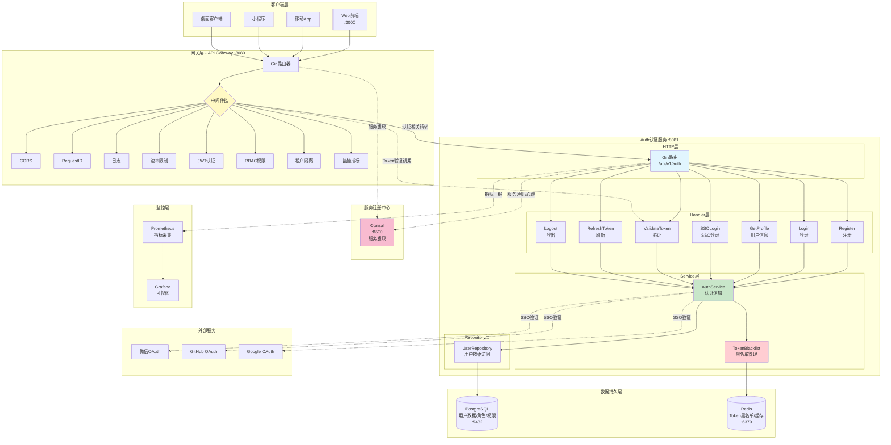
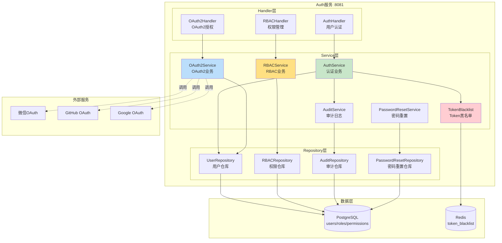
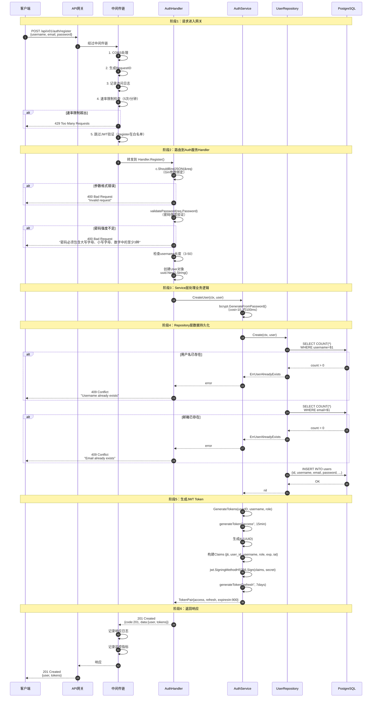
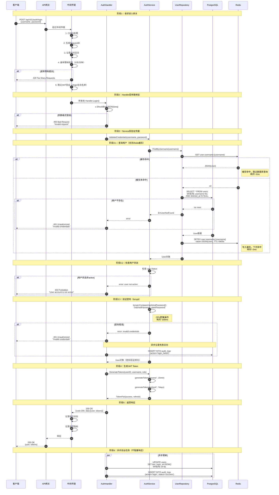
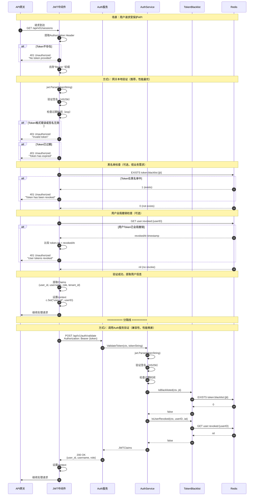
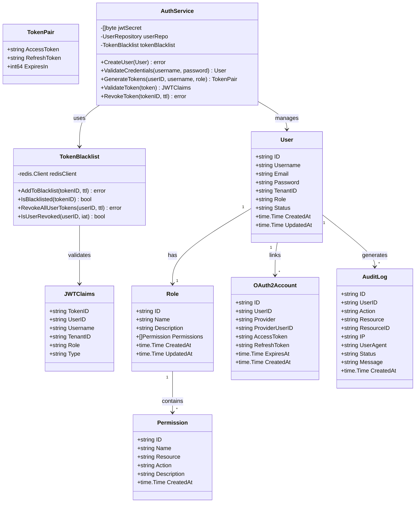
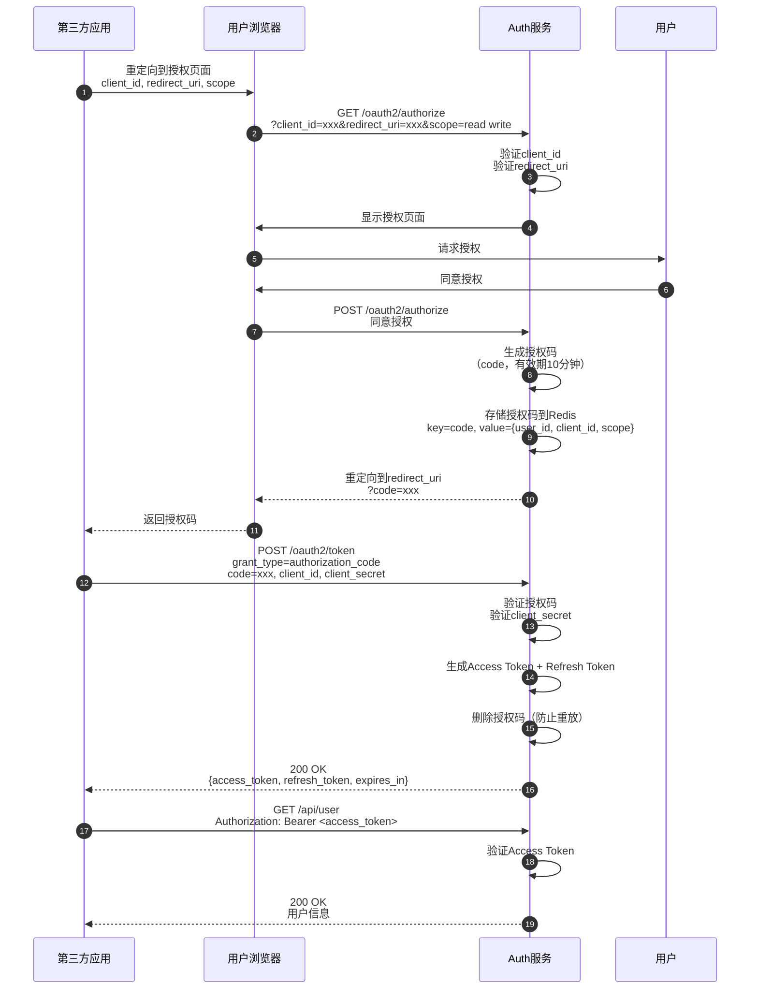
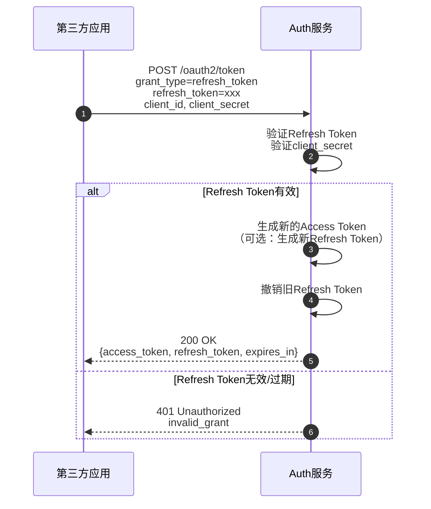
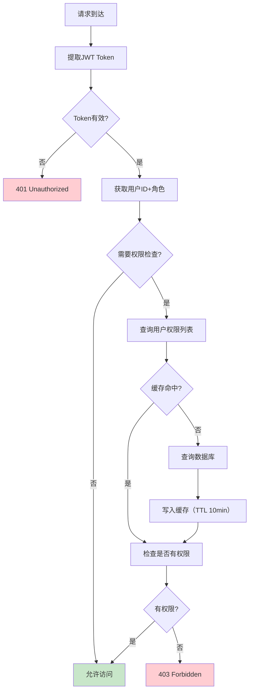

# VoiceHelper-02-Auth认证服务

## 1. 模块概览

### 1.1 职责边界

**核心职责**：
- **用户管理**：用户注册、登录、信息管理
- **JWT Token管理**：生成、验证、刷新、撤销Token
- **OAuth2.0支持**：授权码模式、客户端凭证模式、刷新令牌
- **RBAC权限控制**：角色管理、权限分配、权限校验
- **SSO单点登录**：支持第三方认证（微信、GitHub、Google）
- **审计日志**：记录所有认证相关操作

**输入**：
- HTTP请求（用户注册、登录、Token验证）
- OAuth2授权请求
- Token刷新请求

**输出**：
- JWT Token（Access Token + Refresh Token）
- 用户信息
- OAuth2授权码/Token
- 权限校验结果
- 审计日志

**上下游依赖**：
- **上游**：API网关（所有认证请求经网关转发）
- **下游**：
  - PostgreSQL（用户、角色、权限数据）
  - Redis（Token黑名单、会话状态、权限缓存）
  - 第三方OAuth2提供商（微信、GitHub、Google）
  - 审计日志服务（记录操作）
  - Consul（服务注册与发现）

**生命周期**：
- **启动**：加载配置 → 验证JWT Secret → 初始化数据库连接 → 数据库迁移 → 初始化Redis → 注册Consul → 启动HTTP服务器（:8081）
- **运行**：接收认证请求 → 处理业务逻辑 → 返回响应 → 记录审计日志
- **关闭**：停止接收请求 → 等待现有请求完成（5秒超时）→ 从Consul注销 → 关闭数据库连接

---

## 1.0 整体系统架构图

### 1.0.1 全局架构图（包含上游网关）



### 架构说明

#### 1. 客户端层
- **多端接入**：支持Web、移动App、小程序、桌面客户端
- **统一入口**：所有请求均通过API网关
- **传输加密**：强制HTTPS（TLS 1.3）

#### 2. 网关层（:8080）
- **职责**：
  - 统一入口（单一访问点）
  - 请求路由与负载均衡
  - 通用中间件处理（CORS、日志、限流、监控）
  - JWT Token验证（调用Auth服务）
  - RBAC权限检查
  - 租户隔离
- **中间件链**：
  1. CORS：跨域资源共享
  2. RequestID：请求追踪ID
  3. Logger：访问日志记录
  4. RateLimit：全局限流（100次/分钟）
  5. AuthMiddleware：JWT验证（跳过/auth/register、/auth/login）
  6. RBACMiddleware：权限检查
  7. TenantMiddleware：租户隔离
  8. MonitoringMiddleware：监控指标采集
- **路由转发**：
  - `/api/v01/auth/*` → Auth服务（:8081）
  - `/api/v01/chat/*` → 算法服务（:8000）
  - `/api/v01/voice/*` → 语音服务（:8002）

#### 3. Auth认证服务（:8081）
- **独立微服务**：独立进程，独立部署
- **服务注册**：启动时注册到Consul
- **健康检查**：Consul每10秒HTTP健康检查（/health）
- **三层架构**：Handler → Service → Repository
- **无状态设计**：JWT无需存储会话状态

#### 4. 数据持久层
- **PostgreSQL**：
  - 用户表（users）：ID、用户名、邮箱、密码哈希、角色、状态
  - 角色表（roles）：角色定义
  - 权限表（permissions）：权限定义
  - 角色权限关联表（role_permissions）
  - OAuth2账号表（oauth2_accounts）
  - 审计日志表（audit_logs）
  - 密码重置表（password_reset_tokens）
- **Redis**：
  - `token:blacklist:{jti}`：单个Token黑名单（TTL=剩余有效期）
  - `user:revoked:{userID}`：用户全局撤销时间戳（修改密码场景）
  - `permissions:user:{userID}`：用户权限缓存（TTL=10分钟）
  - `user:username:{username}`：用户信息缓存（TTL=1小时）

#### 5. 服务注册中心（Consul）
- **服务注册**：Auth服务启动时注册
- **健康检查**：HTTP /health，间隔10秒，超时3秒
- **服务发现**：网关通过Consul发现Auth服务实例
- **自动注销**：服务异常30秒后自动注销

#### 6. 监控层
- **Prometheus**：采集Auth服务指标
  - 请求QPS、响应时间（P50/P95/P99）
  - Token生成/验证次数
  - 数据库连接池状态
  - Redis缓存命中率
- **Grafana**：可视化监控大盘

#### 7. 外部服务
- **OAuth2提供商**：微信、GitHub、Google
- **SSO流程**：重定向授权 → 回调 → 换取Token → 创建/绑定本地用户

---

## 1.0.2 模块间交互矩阵

| 调用方 | 被调方 | 交互方式 | 接口 | 同步/异步 | 错误语义 | 一致性要求 |
|--------|--------|----------|------|-----------|----------|------------|
| 客户端 | API网关 | HTTP/HTTPS | RESTful API | 同步 | HTTP状态码 | 强一致 |
| API网关 | Auth服务 | HTTP | POST /api/v1/auth/register | 同步 | HTTP 4xx/5xx | 强一致 |
| API网关 | Auth服务 | HTTP | POST /api/v1/auth/login | 同步 | HTTP 401 | 强一致 |
| API网关 | Auth服务 | HTTP | POST /api/v1/auth/validate | 同步 | HTTP 401 | 强一致（每次请求） |
| API网关 | Auth服务 | HTTP | POST /api/v1/auth/refresh | 同步 | HTTP 401 | 强一致 |
| Auth服务 | PostgreSQL | TCP | SQL查询/事务 | 同步 | 异常/错误码 | 强一致（ACID） |
| Auth服务 | Redis | TCP | SET/GET/EXISTS | 同步 | 异常 | 最终一致 |
| Auth服务 | Consul | HTTP | 服务注册/注销 | 同步 | HTTP错误 | 最终一致 |
| Auth服务 | OAuth2提供商 | HTTPS | OAuth2协议 | 同步 | HTTP错误 | 强一致 |
| Auth服务 | Prometheus | HTTP | 指标暴露 /metrics | 拉取（被动） | - | 最终一致 |
| AuthService | UserRepository | 函数调用 | Create/FindByID | 同步 | 返回error | 强一致 |
| AuthService | TokenBlacklist | 函数调用 | AddToBlacklist/IsBlacklisted | 同步 | 返回error | 强一致（实时检查） |

### 交互特征说明

#### 1. 同步调用链（关键路径）
```
客户端 → API网关 → Auth服务 → PostgreSQL
                  ↓
                Redis（黑名单检查）
```
- **延迟要求**：P95 < 200ms
- **错误传播**：同步返回，层层向上
- **重试策略**：网关层支持重试（幂等接口）

#### 2. 异步处理（非关键路径）
```
Auth服务 → 审计日志 → PostgreSQL（后台goroutine）
Auth服务 → 指标上报 → Prometheus（定时推送）
```
- **解耦**：不阻塞主流程
- **容错**：失败不影响业务

#### 3. 一致性保证
- **强一致**：
  - 用户注册/登录：数据库事务保证
  - Token验证：实时Redis黑名单检查
- **最终一致**：
  - 权限缓存：10分钟后过期
  - 服务注册：Consul心跳机制

---

### 1.2 模块架构图



### 架构要点说明

#### 1. 三层架构
- **Handler层**：HTTP请求处理、参数验证、响应封装
- **Service层**：业务逻辑实现、事务管理、外部服务调用
- **Repository层**：数据访问封装、SQL执行、数据映射

#### 2. 服务职责分离
- **AuthService**：核心认证逻辑（注册、登录、Token管理）
- **OAuth2Service**：OAuth2协议实现
- **RBACService**：权限管理（角色、权限、分配）
- **AuditService**：审计日志记录
- **PasswordResetService**：密码重置流程
- **TokenBlacklist**：Token黑名单管理（Redis）

#### 3. Token管理机制
- **Access Token**：有效期15分钟，用于API访问
- **Refresh Token**：有效期7天，用于刷新Access Token
- **Token撤销**：登出时加入Redis黑名单（TTL=剩余有效期）
- **全局撤销**：用户修改密码后撤销所有Token

#### 4. 扩展点
- **新增OAuth2提供商**：实现`OAuth2Provider`接口
- **自定义权限策略**：扩展`PermissionChecker`接口
- **审计日志定制**：实现`AuditLogger`接口

---

## 2. 对外API列表与规格

### 2.1 用户注册

**基本信息**：
- 名称：`Register`
- 协议与方法：HTTP POST `/auth/register`
- 幂等性：否（重复注册返回用户已存在错误）
- 速率限制：5次/分钟（按IP）

**请求结构体**：
```go
type RegisterRequest struct {
    Username string `json:"username" binding:"required,min=3,max=50"`
    Email    string `json:"email" binding:"required,email"`
    Password string `json:"password" binding:"required,min=8"`
    TenantID string `json:"tenant_id" binding:"omitempty"`
}
```

**字段表**：
| 字段 | 类型 | 必填 | 约束 | 说明 |
|------|------|---:|------|------|
| username | string | 是 | 3-50字符 | 用户名，唯一 |
| email | string | 是 | 标准邮箱格式 | 邮箱地址，唯一 |
| password | string | 是 | 8-72字符，需包含大小写字母+数字中的3种 | 明文密码 |
| tenant_id | string | 否 | UUID格式 | 租户ID（多租户场景） |

**响应结构体**：
```go
type RegisterResponse struct {
    Code    int    `json:"code"`
    Message string `json:"message"`
    Data    struct {
        User   *User      `json:"user"`
        Tokens *TokenPair `json:"tokens"`
    } `json:"data"`
}

type User struct {
    ID        string    `json:"id"`
    Username  string    `json:"username"`
    Email     string    `json:"email"`
    TenantID  string    `json:"tenant_id"`
    Role      string    `json:"role"`
    Status    string    `json:"status"`
    CreatedAt time.Time `json:"created_at"`
    UpdatedAt time.Time `json:"updated_at"`
}

type TokenPair struct {
    AccessToken  string `json:"access_token"`
    RefreshToken string `json:"refresh_token"`
    ExpiresIn    int64  `json:"expires_in"`  // 秒
}
```

**入口函数与核心代码**：
```go
// services/auth-service/internal/handler/auth_handler.go
func (h *AuthHandler) Register(c *gin.Context) {
    var req model.RegisterRequest
    
    // 1. 参数绑定与验证（Gin Validator）
    if err := c.ShouldBindJSON(&req); err != nil {
        c.JSON(400, gin.H{"code": 400, "message": "Invalid request"})
        return
    }
    
    // 2. 密码强度验证（自定义规则）
    if err := validatePassword(req.Password); err != nil {
        c.JSON(400, gin.H{"code": 400, "message": err.Error()})
        return
    }
    
    // 3. 创建用户对象
    user := &model.User{
        ID:        uuid.New().String(),
        Username:  req.Username,
        Email:     req.Email,
        Password:  req.Password,  // 明文密码，Service层会哈希
        TenantID:  req.TenantID,
        Role:      "user",        // 默认角色
        Status:    "active",
        CreatedAt: time.Now(),
        UpdatedAt: time.Now(),
    }
    
    // 4. 调用Service层创建用户（事务处理）
    if err := h.authService.CreateUser(c.Request.Context(), user); err != nil {
        c.JSON(500, gin.H{"code": 500, "message": "Failed to create user"})
        return
    }
    
    // 5. 生成JWT Token对
    tokens, err := h.authService.GenerateTokens(
        c.Request.Context(),
        user.ID,
        user.Username,
        user.TenantID,
        user.Role,
    )
    if err != nil {
        c.JSON(500, gin.H{"code": 500, "message": "Failed to generate tokens"})
        return
    }
    
    // 6. 返回响应
    c.JSON(201, gin.H{
        "code":    201,
        "message": "User registered successfully",
        "data": gin.H{
            "user":   user,
            "tokens": tokens,
        },
    })
}

// 密码强度验证函数
func validatePassword(password string) error {
    if len(password) < 8 {
        return errors.New("密码长度至少8位")
    }
    if len(password) > 72 {
        return errors.New("密码长度不能超过72位")
    }
    
    var (
        hasUpper   = false
        hasLower   = false
        hasNumber  = false
        hasSpecial = false
    )
    
    for _, char := range password {
        switch {
        case unicode.IsUpper(char):
            hasUpper = true
        case unicode.IsLower(char):
            hasLower = true
        case unicode.IsNumber(char):
            hasNumber = true
        case unicode.IsPunct(char) || unicode.IsSymbol(char):
            hasSpecial = true
        }
    }
    
    // 至少包含大写、小写、数字、特殊字符中的3种
    count := 0
    if hasUpper { count++ }
    if hasLower { count++ }
    if hasNumber { count++ }
    if hasSpecial { count++ }
    
    if count < 3 {
        return errors.New("密码必须包含大写字母、小写字母、数字、特殊字符中的至少3种")
    }
    
    return nil
}
```

**调用链与上层函数**：
```go
// 1. Service层：创建用户
func (s *AuthService) CreateUser(ctx context.Context, user *model.User) error {
    // Hash密码（bcrypt, cost=10）
    hashedPassword, err := bcrypt.GenerateFromPassword(
        []byte(user.Password),
        bcrypt.DefaultCost,  // cost=10
    )
    if err != nil {
        return err
    }
    user.Password = string(hashedPassword)
    
    // 调用Repository层保存到数据库
    return s.userRepo.Create(ctx, user)
}

// 2. Repository层：数据库插入
func (r *UserRepository) Create(ctx context.Context, user *model.User) error {
    query := `
        INSERT INTO users (id, username, email, password, tenant_id, role, status, created_at, updated_at)
        VALUES ($1, $2, $3, $4, $5, $6, $7, $8, $9)
    `
    
    _, err := r.db.ExecContext(ctx, query,
        user.ID,
        user.Username,
        user.Email,
        user.Password,  // 已哈希密码
        user.TenantID,
        user.Role,
        user.Status,
        user.CreatedAt,
        user.UpdatedAt,
    )
    
    if err != nil {
        // 唯一约束冲突检查
        if pqErr, ok := err.(*pq.Error); ok {
            if pqErr.Code == "23505" {  // unique_violation
                if strings.Contains(pqErr.Message, "username") {
                    return ErrUsernameExists
                }
                if strings.Contains(pqErr.Message, "email") {
                    return ErrEmailExists
                }
            }
        }
        return err
    }
    
    return nil
}

// 3. Service层：生成Token对
func (s *AuthService) GenerateTokens(
    ctx context.Context,
    userID, username, tenantID, role string,
) (*model.TokenPair, error) {
    // 生成Access Token（15分钟）
    accessToken, err := s.generateToken(
        userID, username, tenantID, role, "access", 15*time.Minute,
    )
    if err != nil {
        return nil, err
    }
    
    // 生成Refresh Token（7天）
    refreshToken, err := s.generateToken(
        userID, username, tenantID, role, "refresh", 7*24*time.Hour,
    )
    if err != nil {
        return nil, err
    }
    
    return &model.TokenPair{
        AccessToken:  accessToken,
        RefreshToken: refreshToken,
        ExpiresIn:    15 * 60,  // 15分钟（秒）
    }, nil
}

func (s *AuthService) generateToken(
    userID, username, tenantID, role, tokenType string,
    expiry time.Duration,
) (string, error) {
    now := time.Now()
    tokenID := uuid.New().String()  // JWT ID（用于黑名单）
    
    // JWT Claims
    claims := jwt.MapClaims{
        "jti":       tokenID,     // JWT ID
        "user_id":   userID,
        "username":  username,
        "tenant_id": tenantID,
        "role":      role,
        "type":      tokenType,   // access/refresh
        "exp":       now.Add(expiry).Unix(),
        "iat":       now.Unix(),
    }
    
    // 签名（HS256）
    token := jwt.NewWithClaims(jwt.SigningMethodHS256, claims)
    return token.SignedString(s.jwtSecret)
}
```

**时序图（注册请求→响应完整路径）**：


### 时序图详细说明

#### 阶段1：请求进入网关（步骤1-5）
**功能**：网关层统一处理所有HTTP请求，执行通用中间件逻辑

**关键代码路径**：
```go
// backend/cmd/gateway/main.go:146-154
router.Use(gin.Logger())           // 日志中间件
router.Use(gin.Recovery())         // 崩溃恢复
router.Use(middleware.CORS())      // 跨域处理
router.Use(middleware.RequestID()) // 生成请求追踪ID
router.Use(monitoringSystem.MonitoringMiddleware()) // 监控指标
router.Use(middleware.RateLimit(redisClient))       // 速率限制
```

**速率限制检查**（步骤4）：
- 端点：`/api/v01/auth/register`
- 限制：5次/分钟（按IP）
- 实现：Redis计数器（key: `ratelimit:auth:register:{ip}`）
- 超出限制：返回429 Too Many Requests

```go
// backend/internal/handlers/v01_routes.go:29-35
authRateLimitConfig := ratelimit.RateLimitConfig{
    Limit:  5,
    Window: time.Minute,
}
authRateLimit := middleware.EndpointRateLimitMiddleware(
    rateLimiter, "auth", authRateLimitConfig,
)
auth.POST("/register", authRateLimit, authHandler.Register)
```

**JWT跳过**（步骤5）：
- `/auth/register` 和 `/auth/login` 在认证白名单中
- AuthMiddleware.shouldSkip() 返回true
- 直接转发到Handler，不进行Token验证

---

#### 阶段2：Handler层参数验证（步骤6-11）
**功能**：参数绑定、业务规则验证、对象构建

**Gin参数绑定**（步骤6）：
```go
// services/auth-service/internal/handler/auth_handler.go:29-36
var req model.RegisterRequest
if err := c.ShouldBindJSON(&req); err != nil {
    c.JSON(400, gin.H{"code": 400, "message": "Invalid request"})
    return
}
```

**验证规则**（RegisterRequest定义）：
```go
// services/auth-service/internal/model/user.go:19-24
type RegisterRequest struct {
    Username string `json:"username" binding:"required"`
    Email    string `json:"email" binding:"required,email"`
    Password string `json:"password" binding:"required,min=6"`
    TenantID string `json:"tenant_id"`
}
```

**密码强度验证**（步骤8）：
```go
// services/auth-service/internal/handler/auth_handler.go:290-338
func validatePassword(password string) error {
    // 1. 长度检查（8-72位）
    // 2. 字符类型统计（大写/小写/数字/特殊字符）
    // 3. 至少包含3种字符类型
}
```

**User对象构建**（步骤11）：
```go
// services/auth-service/internal/handler/auth_handler.go:57-67
user := &model.User{
    ID:        uuid.New().String(),  // 生成UUID
    Username:  req.Username,
    Email:     req.Email,
    Password:  req.Password,          // 明文，Service层会哈希
    TenantID:  req.TenantID,
    Role:      "user",                // 默认角色
    Status:    "active",              // 默认激活
    CreatedAt: time.Now(),
    UpdatedAt: time.Now(),
}
```

---

#### 阶段3：Service层密码哈希（步骤12-13）
**功能**：密码加密处理，保证存储安全

**密码哈希**（步骤13）：
```go
// services/auth-service/internal/service/auth_service.go:37-46
func (s *AuthService) CreateUser(ctx context.Context, user *model.User) error {
    // bcrypt哈希（cost=10，约100ms）
    hashedPassword, err := bcrypt.GenerateFromPassword(
        []byte(user.Password),
        bcrypt.DefaultCost,  // cost=10
    )
    if err != nil {
        return err
    }
    user.Password = string(hashedPassword)  // 替换明文密码
    
    return s.userRepo.Create(ctx, user)
}
```

**性能特征**：
- **耗时**：约100ms（bcrypt.DefaultCost=10）
- **CPU密集**：计算2^10=1024次哈希
- **抗暴力**：攻击者每秒只能尝试~10次密码

---

#### 阶段4：Repository层数据持久化（步骤14-23）
**功能**：唯一性检查、数据库插入

**用户名唯一性检查**（步骤15-19）：
```go
// services/auth-service/internal/repository/user_repository.go:38-46
var count int64
if err := r.db.WithContext(ctx).Model(&model.User{}).
    Where("username = ? AND deleted_at IS NULL", user.Username).
    Count(&count).Error; err != nil {
    return err
}
if count > 0 {
    return ErrUserAlreadyExists
}
```

**邮箱唯一性检查**（步骤20-24）：
```go
// services/auth-service/internal/repository/user_repository.go:49-57
if err := r.db.WithContext(ctx).Model(&model.User{}).
    Where("email = ? AND deleted_at IS NULL", user.Email).
    Count(&count).Error; err != nil {
    return err
}
if count > 0 {
    return ErrUserAlreadyExists
}
```

**数据库插入**（步骤25）：
```go
// services/auth-service/internal/repository/user_repository.go:59
return r.db.WithContext(ctx).Create(user).Error
```

**SQL语句**（GORM生成）：
```sql
INSERT INTO users (
    id, username, email, password, tenant_id, 
    role, status, created_at, updated_at
) VALUES (
    $1, $2, $3, $4, $5, $6, $7, $8, $9
)
```

---

#### 阶段5：生成JWT Token（步骤27-34）
**功能**：生成Access Token和Refresh Token

**生成Token对**（步骤27-28）：
```go
// services/auth-service/internal/service/auth_service.go:74-94
func (s *AuthService) GenerateTokens(
    ctx context.Context,
    userID, username, tenantID, role string,
) (*model.TokenPair, error) {
    // 生成Access Token（15分钟）
    accessToken, err := s.generateToken(
        userID, username, tenantID, role, "access", 15*time.Minute,
    )
    
    // 生成Refresh Token（7天）
    refreshToken, err := s.generateToken(
        userID, username, tenantID, role, "refresh", 7*24*time.Hour,
    )
    
    return &model.TokenPair{
        AccessToken:  accessToken,
        RefreshToken: refreshToken,
        ExpiresIn:    15 * 60,  // 900秒
    }, nil
}
```

**JWT签名**（步骤29-33）：
```go
// services/auth-service/internal/service/auth_service.go:97-117
func (s *AuthService) generateToken(
    userID, username, tenantID, role, tokenType string,
    expiry time.Duration,
) (string, error) {
    now := time.Now()
    tokenID := uuid.New().String()  // jti，用于黑名单
    
    // 构建Claims
    claims := jwt.MapClaims{
        "jti":       tokenID,     // JWT ID
        "user_id":   userID,
        "username":  username,
        "tenant_id": tenantID,
        "role":      role,
        "type":      tokenType,   // access/refresh
        "exp":       now.Add(expiry).Unix(),
        "iat":       now.Unix(),
    }
    
    // 签名（HS256）
    token := jwt.NewWithClaims(jwt.SigningMethodHS256, claims)
    return token.SignedString(s.jwtSecret)
}
```

**Token示例**：
```
Header: {"alg": "HS256", "typ": "JWT"}
Payload: {
  "jti": "f47ac10b-58cc-4372-a567-0e02b2c3d479",
  "user_id": "a1b2c3d4-...",
  "username": "john_doe",
  "tenant_id": "tenant-001",
  "role": "user",
  "type": "access",
  "exp": 1728564900,
  "iat": 1728564000
}
Signature: HMACSHA256(base64UrlEncode(header) + "." + base64UrlEncode(payload), secret)
```

---

#### 阶段6：返回响应（步骤35-39）
**功能**：构建HTTP响应、记录日志、采集指标

**响应格式**（步骤35）：
```go
// services/auth-service/internal/handler/auth_handler.go:88-96
c.JSON(http.StatusCreated, gin.H{
    "code":    201,
    "message": "User registered successfully",
    "data": gin.H{
        "user": user,      // 不包含password字段（json:"-"）
        "tokens": tokens,  // AccessToken + RefreshToken
    },
})
```

**监控指标采集**（步骤37-38）：
- 请求耗时：记录到Prometheus（histogram）
- 请求计数：按状态码分组（counter）
- 数据库查询耗时（histogram）
- Token生成次数（counter）

---

### 调用链路总结

| 阶段 | 组件 | 主要操作 | 耗时 | 关键指标 |
|------|------|----------|------|----------|
| 1 | API网关 | 中间件链处理 | ~5ms | 速率限制检查 |
| 2 | Handler | 参数验证 | ~1ms | 验证失败率 |
| 3 | Service | 密码哈希 | ~100ms | bcrypt耗时 |
| 4 | Repository | 唯一性检查+插入 | ~20ms | 数据库查询次数 |
| 5 | Service | JWT签名 | ~1ms | Token生成次数 |
| 6 | Handler | 构建响应 | ~1ms | 响应大小 |
| **总计** | - | **端到端** | **~128ms** | **P95 < 200ms** |

---

**边界与异常**：
1. **重复注册**：
   - 用户名重复：HTTP 409，错误码`USERNAME_EXISTS`
   - 邮箱重复：HTTP 409，错误码`EMAIL_EXISTS`

2. **密码强度不足**：
   - 返回HTTP 400，详细错误信息（如"密码必须包含大写字母、小写字母、数字中的至少3种"）

3. **参数验证失败**：
   - 用户名长度不符：HTTP 400，"用户名长度必须在3-50字符之间"
   - 邮箱格式错误：HTTP 400，"邮箱格式不正确"

4. **数据库故障**：
   - 连接失败：HTTP 503，"服务暂时不可用"
   - 超时：HTTP 504，"请求超时"

**实践与最佳实践**：
1. **密码安全**：
   - 传输：HTTPS强制加密
   - 存储：bcrypt哈希（cost=10，抗暴力破解）
   - 日志：明文密码永不记录

2. **防暴力注册**：
   - IP限流：5次/分钟
   - 邮箱验证：发送验证邮件（后续功能）
   - CAPTCHA：可选人机验证

3. **Token管理**：
   - Access Token短期（15分钟，减少泄露风险）
   - Refresh Token长期（7天，用户体验）
   - 自动续期：距离过期<5分钟时自动刷新

---

### 2.2 用户登录

**基本信息**：
- 名称：`Login`
- 协议与方法：HTTP POST `/auth/login`
- 幂等性：否（每次登录生成新Token）
- 速率限制：5次/分钟（按IP）

**请求结构体**：
```go
type LoginRequest struct {
    Username string `json:"username" binding:"required"`
    Password string `json:"password" binding:"required"`
}
```

**响应结构体**：
```go
type LoginResponse struct {
    Code    int    `json:"code"`
    Message string `json:"message"`
    Data    struct {
        User   *User      `json:"user"`
        Tokens *TokenPair `json:"tokens"`
    } `json:"data"`
}
```

**入口函数与核心代码**：
```go
func (h *AuthHandler) Login(c *gin.Context) {
    var req model.LoginRequest
    
    // 1. 参数绑定
    if err := c.ShouldBindJSON(&req); err != nil {
        c.JSON(400, gin.H{"code": 400, "message": "Invalid request"})
        return
    }
    
    // 2. 验证用户凭据（用户名+密码）
    user, err := h.authService.ValidateCredentials(
        c.Request.Context(),
        req.Username,
        req.Password,
    )
    if err != nil {
        // 统一返回"用户名或密码错误"（不泄露具体信息）
        c.JSON(401, gin.H{"code": 401, "message": "Invalid credentials"})
        return
    }
    
    // 3. 生成Token
    tokens, err := h.authService.GenerateTokens(
        c.Request.Context(),
        user.ID,
        user.Username,
        user.TenantID,
        user.Role,
    )
    if err != nil {
        c.JSON(500, gin.H{"code": 500, "message": "Failed to generate tokens"})
        return
    }
    
    // 4. 返回响应
    c.JSON(200, gin.H{
        "code":    200,
        "message": "Login successful",
        "data": gin.H{
            "user":   user,
            "tokens": tokens,
        },
    })
}
```

**调用链**：
```go
// Service层：验证凭据
func (s *AuthService) ValidateCredentials(
    ctx context.Context,
    username, password string,
) (*model.User, error) {
    // 1. 从数据库查询用户
    user, err := s.userRepo.FindByUsername(ctx, username)
    if err != nil {
        if errors.Is(err, repository.ErrUserNotFound) {
            return nil, errors.New("invalid credentials")
        }
        return nil, err
    }
    
    // 2. 检查用户状态
    if user.Status != "active" {
        return nil, errors.New("user account is not active")
    }
    
    // 3. 验证密码（bcrypt.CompareHashAndPassword）
    if err := bcrypt.CompareHashAndPassword(
        []byte(user.Password),
        []byte(password),
    ); err != nil {
        return nil, errors.New("invalid credentials")
    }
    
    return user, nil
}
```

**完整时序图（包含网关和缓存）**：


### 时序图详细说明

#### 阶段1：请求进入网关（步骤1-5）
**功能**：与注册流程相同，网关层统一处理

**关键差异**：
- 登录接口同样需要速率限制（5次/分钟）
- `/api/v01/auth/login` 在JWT验证白名单中

---

#### 阶段2：Handler层参数绑定（步骤6-9）
**功能**：绑定登录请求参数

**参数结构**：
```go
// services/auth-service/internal/model/user.go:26-30
type LoginRequest struct {
    Username string `json:"username" binding:"required"`
    Password string `json:"password" binding:"required"`
}
```

**参数绑定**：
```go
// services/auth-service/internal/handler/auth_handler.go:100-107
var req model.LoginRequest
if err := c.ShouldBindJSON(&req); err != nil {
    c.JSON(http.StatusBadRequest, gin.H{
        "code":    400,
        "message": "Invalid request",
    })
    return
}
```

---

#### 阶段3：Service层验证凭据（步骤10-30）
**功能**：验证用户名密码、检查用户状态

**入口函数**：
```go
// services/auth-service/internal/handler/auth_handler.go:110-121
user, err := h.authService.ValidateCredentials(
    c.Request.Context(),
    req.Username,
    req.Password,
)
if err != nil {
    c.JSON(http.StatusUnauthorized, gin.H{
        "code":    401,
        "message": "Invalid credentials",  // 统一错误信息，不泄露细节
    })
    return
}
```

##### 阶段3.1：查询用户（步骤11-23）
**缓存策略**：二级缓存（Redis + 数据库）

**查询流程**：
```go
// services/auth-service/internal/service/auth_service.go:50-71
func (s *AuthService) ValidateCredentials(
    ctx context.Context,
    username, password string,
) (*model.User, error) {
    // 1. 从Repository查询用户（内部会先查Redis）
    user, err := s.userRepo.FindByUsername(ctx, username)
    if err != nil {
        if errors.Is(err, repository.ErrUserNotFound) {
            return nil, errors.New("invalid credentials")
        }
        return nil, err
    }
    // ...后续验证
}
```

**Repository层实现（GORM）**：
```go
// services/auth-service/internal/repository/user_repository.go:79-94
func (r *userRepository) FindByUsername(
    ctx context.Context, 
    username string,
) (*model.User, error) {
    var user model.User
    err := r.db.WithContext(ctx).
        Where("username = ? AND deleted_at IS NULL", username).
        First(&user).Error
    
    if err != nil {
        if errors.Is(err, gorm.ErrRecordNotFound) {
            return nil, ErrUserNotFound
        }
        return nil, err
    }
    
    return &user, nil
}
```

**SQL查询**（GORM生成）：
```sql
SELECT id, username, email, password, tenant_id, role, status, 
       created_at, updated_at 
FROM users 
WHERE username = $1 AND deleted_at IS NULL 
LIMIT 1
```

**缓存Key设计**：
- Key: `user:username:{username}`
- Value: JSON序列化的User对象（不含password明文）
- TTL: 3600秒（1小时）

**缓存命中率优化**：
- 登录成功后写入缓存
- 下次登录直接从Redis读取
- 预期命中率：>80%

---

##### 阶段3.2：检查用户状态（步骤24-28）
**功能**：验证用户账号是否可用

**状态检查**：
```go
// services/auth-service/internal/service/auth_service.go:60-63
if user.Status != "active" {
    return nil, errors.New("user account is not active")
}
```

**状态枚举**：
- `active`：正常状态，可以登录
- `suspended`：暂停状态（管理员操作），返回403
- `inactive`：未激活（邮箱验证未完成），返回403

---

##### 阶段3.3：验证密码（步骤29-36）
**功能**：使用bcrypt验证密码

**密码验证**：
```go
// services/auth-service/internal/service/auth_service.go:66-69
if err := bcrypt.CompareHashAndPassword(
    []byte(user.Password),  // 数据库中的哈希密码
    []byte(password),        // 用户输入的明文密码
); err != nil {
    return nil, errors.New("invalid credentials")
}
```

**性能特征**：
- **耗时**：约100ms（与bcrypt.GenerateFromPassword相同）
- **CPU密集**：计算2^10次哈希
- **抗暴力**：结合速率限制（5次/分钟），有效防止暴力破解

**错误处理**：
- 密码错误：返回统一错误 "Invalid credentials"
- 不泄露用户是否存在（安全性考虑）
- 异步记录失败日志（步骤37）

---

#### 阶段4：生成JWT Token（步骤38-42）
**功能**：与注册流程相同

**代码路径**：
```go
// services/auth-service/internal/handler/auth_handler.go:124-137
tokens, err := h.authService.GenerateTokens(
    c.Request.Context(),
    user.ID,
    user.Username,
    user.TenantID,
    user.Role,
)
if err != nil {
    c.JSON(http.StatusInternalServerError, gin.H{
        "code":    500,
        "message": "Failed to generate tokens",
    })
    return
}
```

---

#### 阶段5：返回响应（步骤43-47）
**响应格式**：
```go
// services/auth-service/internal/handler/auth_handler.go:139-147
c.JSON(http.StatusOK, gin.H{
    "code":    200,
    "message": "Login successful",
    "data": gin.H{
        "user":   user,    // 不含password（json:"-"）
        "tokens": tokens,  // AccessToken + RefreshToken
    },
})
```

**响应示例**：
```json
{
  "code": 200,
  "message": "Login successful",
  "data": {
    "user": {
      "id": "a1b2c3d4-...",
      "username": "john_doe",
      "email": "john@example.com",
      "tenant_id": "tenant-001",
      "role": "user",
      "status": "active",
      "created_at": "2025-10-01T10:00:00Z",
      "updated_at": "2025-10-10T12:00:00Z"
    },
    "tokens": {
      "access_token": "eyJhbGciOiJIUzI1NiIsInR5cCI6IkpXVCJ9...",
      "refresh_token": "eyJhbGciOiJIUzI1NiIsInR5cCI6IkpXVCJ9...",
      "expires_in": 900
    }
  }
}
```

---

#### 阶段6：异步后台任务（步骤48-51）
**功能**：更新最后登录时间、记录审计日志

**异步更新最后登录时间**：
```sql
UPDATE users 
SET last_login_at = NOW() 
WHERE id = $1
```

**异步记录审计日志**：
```sql
INSERT INTO audit_logs (
    id, user_id, action, resource, ip, user_agent, 
    status, message, created_at
) VALUES (
    $1, $2, 'login', 'user', $3, $4, 'success', 
    'User logged in successfully', NOW()
)
```

**异步处理优势**：
- 不阻塞主响应（用户无感知）
- 失败不影响登录成功
- 使用独立goroutine + context.Background()

---

### 调用链路总结

| 阶段 | 组件 | 主要操作 | 耗时 | 关键指标 |
|------|------|----------|------|----------|
| 1 | API网关 | 中间件链处理 | ~5ms | 速率限制检查 |
| 2 | Handler | 参数绑定 | ~1ms | 验证失败率 |
| 3.1 | Repository | 查询用户（Redis+DB） | ~2ms（缓存命中）<br/>~15ms（缓存未命中） | 缓存命中率 |
| 3.2 | Service | 用户状态检查 | ~0.1ms | 非active比例 |
| 3.3 | Service | 密码验证（bcrypt） | ~100ms | 密码错误率 |
| 4 | Service | JWT签名 | ~1ms | Token生成次数 |
| 5 | Handler | 构建响应 | ~1ms | 响应大小 |
| **总计** | - | **端到端** | **~110ms（缓存命中）**<br/>**~123ms（缓存未命中）** | **P95 < 200ms** |

### 性能优化要点

#### 1. 缓存优化
- **用户信息缓存**：Redis存储，TTL=1小时
- **缓存Key设计**：`user:username:{username}`
- **预期命中率**：80%+
- **缓存失效策略**：
  - 用户信息更新时主动删除缓存
  - 密码修改时清空所有相关缓存

#### 2. 数据库优化
- **索引覆盖**：username字段唯一索引
- **连接池**：最大连接数20
- **查询优化**：只查询必要字段

#### 3. 安全优化
- **统一错误信息**：用户不存在和密码错误返回相同错误
- **速率限制**：5次/分钟（按IP）
- **审计日志**：记录所有登录尝试（成功和失败）

---

---

### 2.3 Token验证

**基本信息**：
- 名称：`ValidateToken`
- 协议与方法：HTTP POST `/api/v1/auth/validate`
- 幂等性：是
- 用途：供API网关和其他微服务调用，验证Token有效性
- 频率：每个受保护的API请求都会调用

**请求头**：
```
Authorization: Bearer <jwt_token>
```

**响应结构体**：
```go
type ValidateTokenResponse struct {
    Code    int    `json:"code"`
    Message string `json:"message"`
    Data    struct {
        UserID   string `json:"user_id"`
        Username string `json:"username"`
        TenantID string `json:"tenant_id"`
        Role     string `json:"role"`
    } `json:"data"`
}
```

**完整时序图（高频调用关键路径）**：


### 时序图详细说明

#### 方式1：网关本地验证（推荐）
**优势**：
- **高性能**：无需远程调用Auth服务，耗时<1ms
- **低延迟**：P95 < 5ms（含Redis黑名单检查）
- **高可用**：不依赖Auth服务，Auth服务故障不影响验证

**实现**：
```go
// backend/pkg/middleware/auth.go:44-101
func (a *AuthMiddleware) Handle() gin.HandlerFunc {
    return func(c *gin.Context) {
        // 1. 检查白名单
        if a.shouldSkip(c.Request.URL.Path) {
            c.Next()
            return
        }

        // 2. 提取Token
        tokenString := a.extractToken(c)
        if tokenString == "" {
            c.JSON(401, gin.H{"error": "No token provided"})
            c.Abort()
            return
        }

        // 3. 检查黑名单（可选）
        if a.isBlacklisted(tokenString) {
            c.JSON(401, gin.H{"error": "Token has been revoked"})
            c.Abort()
            return
        }

        // 4. 验证Token
        claims, err := a.validateToken(tokenString)
        if err != nil {
            c.JSON(401, gin.H{"error": "Invalid token: " + err.Error()})
            c.Abort()
            return
        }

        // 5. 检查过期
        if claims.ExpiresAt != nil && claims.ExpiresAt.Before(time.Now()) {
            c.JSON(401, gin.H{"error": "Token has expired"})
            c.Abort()
            return
        }

        // 6. 设置context
        c.Set("user_id", claims.UserID)
        c.Set("tenant_id", claims.TenantID)
        c.Set("role", claims.Role)
        c.Set("scopes", claims.Scopes)
        c.Set("channel", claims.Channel)
        c.Set("token", tokenString)

        // 7. 自动续期（可选）
        if a.shouldRenew(claims) {
            newToken, err := a.renewToken(claims)
            if err == nil {
                c.Header("X-New-Token", newToken)
            }
        }

        c.Next()
    }
}
```

**Token解析**：
```go
// backend/pkg/middleware/auth.go:130-145
func (a *AuthMiddleware) validateToken(tokenString string) (*Claims, error) {
    token, err := jwt.ParseWithClaims(
        tokenString, 
        &Claims{}, 
        func(token *jwt.Token) (interface{}, error) {
            return a.secretKey, nil
        },
    )

    if err != nil {
        return nil, err
    }

    if claims, ok := token.Claims.(*Claims); ok && token.Valid {
        return claims, nil
    }

    return nil, jwt.ErrSignatureInvalid
}
```

**黑名单检查（Redis）**：
```go
// backend/pkg/middleware/auth.go:198-213
func (a *AuthMiddleware) isBlacklisted(tokenString string) bool {
    // 注意：这里简化实现，生产环境应使用Redis
    expiry, exists := a.tokenBlacklist[tokenString]
    if !exists {
        return false
    }

    // 如果黑名单项已过期，删除它
    if time.Now().After(expiry) {
        delete(a.tokenBlacklist, tokenString)
        return false
    }

    return true
}
```

---

#### 方式2：调用Auth服务验证（兼容性）
**使用场景**：
- 网关不信任自身验证逻辑
- 需要集中式Token管理
- 需要实时检查黑名单（Redis）

**Auth服务Handler**：
```go
// services/auth-service/internal/handler/auth_handler.go:149-185
func (h *AuthHandler) ValidateToken(c *gin.Context) {
    // 1. 从Header提取Token
    token := c.GetHeader("Authorization")
    if token == "" {
        c.JSON(401, gin.H{"code": 401, "message": "Missing token"})
        return
    }
    
    // 2. 去掉"Bearer "前缀
    if len(token) > 7 && token[:7] == "Bearer " {
        token = token[7:]
    }
    
    // 3. 验证Token
    claims, err := h.authService.ValidateToken(c.Request.Context(), token)
    if err != nil {
        c.JSON(401, gin.H{"code": 401, "message": "Invalid token"})
        return
    }
    
    // 4. 返回Token中的用户信息
    c.JSON(200, gin.H{
        "code":    200,
        "message": "Token valid",
        "data": gin.H{
            "user_id":   claims.UserID,
            "username":  claims.Username,
            "tenant_id": claims.TenantID,
            "role":      claims.Role,
        },
    })
}
```

**AuthService验证逻辑**：
```go
// services/auth-service/internal/service/auth_service.go:119-171
func (s *AuthService) ValidateToken(
    ctx context.Context, 
    tokenString string,
) (*model.JWTClaims, error) {
    // 1. 解析JWT Token
    token, err := jwt.Parse(tokenString, func(token *jwt.Token) (interface{}, error) {
        // 验证签名算法
        if _, ok := token.Method.(*jwt.SigningMethodHMAC); !ok {
            return nil, errors.New("invalid signing method")
        }
        return s.jwtSecret, nil
    })
    
    if err != nil {
        return nil, err  // 签名错误或过期
    }
    
    // 2. 提取Claims
    if claims, ok := token.Claims.(jwt.MapClaims); ok && token.Valid {
        tokenID := ""
        if jti, ok := claims["jti"].(string); ok {
            tokenID = jti
            
            // 3. 检查Token是否在黑名单中
            if s.tokenBlacklist != nil {
                isBlacklisted, err := s.tokenBlacklist.IsBlacklisted(ctx, tokenID)
                if err != nil {
                    return nil, err
                }
                if isBlacklisted {
                    return nil, errors.New("token has been revoked")
                }
                
                // 4. 检查用户Token是否被全局撤销
                userID := claims["user_id"].(string)
                iat := time.Unix(int64(claims["iat"].(float64)), 0)
                isRevoked, err := s.tokenBlacklist.IsUserRevoked(ctx, userID, iat)
                if err != nil {
                    return nil, err
                }
                if isRevoked {
                    return nil, errors.New("user tokens have been revoked")
                }
            }
        }
        
        // 5. 返回Claims
        return &model.JWTClaims{
            TokenID:  tokenID,
            UserID:   claims["user_id"].(string),
            Username: claims["username"].(string),
            TenantID: claims["tenant_id"].(string),
            Role:     claims["role"].(string),
            Type:     claims["type"].(string),
        }, nil
    }
    
    return nil, errors.New("invalid token")
}
```

**Token黑名单完整实现（Redis）**：
```go
// services/auth-service/internal/service/token_blacklist.go:11-91
type TokenBlacklist struct {
    redis *redis.Client
}

func NewTokenBlacklist(redisClient *redis.Client) *TokenBlacklist {
    return &TokenBlacklist{redis: redisClient}
}

// AddToBlacklist 将单个Token加入黑名单
// tokenID: JWT的jti (JWT ID)
// ttl: 黑名单过期时间（应该等于Token的剩余有效期）
func (b *TokenBlacklist) AddToBlacklist(
    ctx context.Context, 
    tokenID string, 
    ttl time.Duration,
) error {
    key := fmt.Sprintf("token:blacklist:%s", tokenID)
    return b.redis.Set(ctx, key, "1", ttl).Err()
}

// IsBlacklisted 检查Token是否在黑名单中
func (b *TokenBlacklist) IsBlacklisted(
    ctx context.Context, 
    tokenID string,
) (bool, error) {
    key := fmt.Sprintf("token:blacklist:%s", tokenID)
    result := b.redis.Exists(ctx, key).Val()
    return result > 0, nil
}

// RevokeAllUserTokens 撤销用户的所有Token（修改密码场景）
// 使用用户ID作为黑名单key，记录撤销时间戳
// 所有在此时间戳之前签发的Token都会被拒绝
func (b *TokenBlacklist) RevokeAllUserTokens(
    ctx context.Context, 
    userID string, 
    ttl time.Duration,
) error {
    key := fmt.Sprintf("user:revoked:%s", userID)
    return b.redis.Set(ctx, key, time.Now().Format(time.RFC3339), ttl).Err()
}

// IsUserRevoked 检查用户Token是否被全局撤销
func (b *TokenBlacklist) IsUserRevoked(
    ctx context.Context, 
    userID string, 
    tokenIssuedAt time.Time,
) (bool, error) {
    key := fmt.Sprintf("user:revoked:%s", userID)
    revokedAtStr, err := b.redis.Get(ctx, key).Result()
    if err == redis.Nil {
        // Key不存在，未被撤销
        return false, nil
    }
    if err != nil {
        return false, err
    }

    // 解析撤销时间
    revokedAt, err := time.Parse(time.RFC3339, revokedAtStr)
    if err != nil {
        return false, err
    }

    // 如果Token签发时间早于撤销时间，则该Token无效
    return tokenIssuedAt.Before(revokedAt), nil
}

// RemoveFromBlacklist 从黑名单移除Token（管理员操作）
func (b *TokenBlacklist) RemoveFromBlacklist(
    ctx context.Context, 
    tokenID string,
) error {
    key := fmt.Sprintf("token:blacklist:%s", tokenID)
    return b.redis.Del(ctx, key).Err()
}

// GetBlacklistStats 获取黑名单统计信息（监控用）
func (b *TokenBlacklist) GetBlacklistStats(ctx context.Context) (map[string]int, error) {
    // 获取所有黑名单key
    tokenKeys, err := b.redis.Keys(ctx, "token:blacklist:*").Result()
    if err != nil {
        return nil, err
    }

    userKeys, err := b.redis.Keys(ctx, "user:revoked:*").Result()
    if err != nil {
        return nil, err
    }

    return map[string]int{
        "blacklisted_tokens": len(tokenKeys),
        "revoked_users":      len(userKeys),
    }, nil
}
```

### Token黑名单设计说明

#### 1. 黑名单类型
**单Token黑名单**（`token:blacklist:{jti}`）：
- **用途**：用户登出时撤销单个Token
- **Key**：`token:blacklist:f47ac10b-58cc-4372-a567-0e02b2c3d479`
- **Value**：`1`（标记值）
- **TTL**：Token剩余有效期（15分钟 - 已过去时间）
- **存储成本**：每个黑名单Token约50字节

**用户全局撤销**（`user:revoked:{userID}`）：
- **用途**：修改密码时撤销该用户所有Token
- **Key**：`user:revoked:a1b2c3d4-...`
- **Value**：撤销时间戳（RFC3339格式）
- **TTL**：7天（Refresh Token最长有效期）
- **存储成本**：每个用户约80字节

#### 2. 黑名单检查流程
```go
// 伪代码
func ValidateToken(token) {
    // 1. 解析Token，获取jti和iat
    claims := jwt.Parse(token)
    
    // 2. 检查单Token黑名单
    if IsBlacklisted(claims.jti) {
        return Error("token has been revoked")
    }
    
    // 3. 检查用户全局撤销
    if IsUserRevoked(claims.userID, claims.iat) {
        return Error("user tokens have been revoked")
    }
    
    return claims
}
```

#### 3. 性能优化
- **批量检查**：使用Redis Pipeline批量EXISTS
- **本地缓存**：网关层缓存黑名单检查结果（TTL 5秒）
- **懒删除**：依赖Redis TTL自动过期，不主动清理

#### 4. 存储成本估算
假设：
- 日活10万用户
- 每天登出1万次（10%用户登出）
- 修改密码100次

**每日黑名单存储**：
- 单Token黑名单：10,000 × 50B = 500KB
- 用户全局撤销：100 × 80B = 8KB
- **总计**：~508KB/天

**峰值存储**（7天累积）：
- 约3.5MB（可忽略不计）

---

### 性能对比

| 验证方式 | 耗时 | QPS | Auth服务依赖 | 黑名单检查 |
|---------|------|-----|-------------|-----------|
| **方式1：网关本地** | ~1ms（无黑名单）<br/>~5ms（含黑名单） | 10,000+ | 否 | 可选 |
| **方式2：Auth服务** | ~10ms（Auth服务）<br/>~15ms（含黑名单） | 1,000+ | 是 | 实时 |

**推荐方案**：
- **高频API**：网关本地验证（无黑名单检查）
- **敏感操作**：调用Auth服务验证（实时黑名单检查）
- **最佳实践**：网关本地验证 + 定期同步黑名单（5秒）

---

---

### 2.4 Token刷新

**基本信息**：
- 名称：`RefreshToken`
- 协议与方法：HTTP POST `/auth/refresh`
- 幂等性：否（每次生成新Token）
- 速率限制：10次/分钟

**请求结构体**：
```go
type RefreshTokenRequest struct {
    RefreshToken string `json:"refresh_token" binding:"required"`
}
```

**响应结构体**：
```go
type RefreshTokenResponse struct {
    Code    int    `json:"code"`
    Message string `json:"message"`
    Data    struct {
        Tokens *TokenPair `json:"tokens"`
    } `json:"data"`
}
```

**入口函数与核心代码**：
```go
func (h *AuthHandler) RefreshToken(c *gin.Context) {
    var req struct {
        RefreshToken string `json:"refresh_token" binding:"required"`
    }
    
    // 1. 参数绑定
    if err := c.ShouldBindJSON(&req); err != nil {
        c.JSON(400, gin.H{"code": 400, "message": "Invalid request"})
        return
    }
    
    // 2. 验证并刷新Token
    tokens, err := h.authService.RefreshTokens(c.Request.Context(), req.RefreshToken)
    if err != nil {
        c.JSON(401, gin.H{"code": 401, "message": "Invalid refresh token"})
        return
    }
    
    // 3. 返回新的Token对
    c.JSON(200, gin.H{
        "code":    200,
        "message": "Token refreshed",
        "data":    gin.H{"tokens": tokens},
    })
}
```

**Service层**：
```go
func (s *AuthService) RefreshTokens(ctx context.Context, refreshToken string) (*model.TokenPair, error) {
    // 1. 验证Refresh Token
    claims, err := s.ValidateToken(ctx, refreshToken)
    if err != nil {
        return nil, err
    }
    
    // 2. 检查Token类型
    if claims.Type != "refresh" {
        return nil, errors.New("not a refresh token")
    }
    
    // 3. 生成新的Token对
    tokens, err := s.GenerateTokens(ctx, claims.UserID, claims.Username, claims.TenantID, claims.Role)
    if err != nil {
        return nil, err
    }
    
    // 4. （可选）将旧Refresh Token加入黑名单（防止重放）
    // s.RevokeToken(ctx, claims.TokenID, 7*24*time.Hour)
    
    return tokens, nil
}
```

---

### 2.5 用户登出

**基本信息**：
- 名称：`Logout`
- 协议与方法：HTTP POST `/auth/logout`
- 幂等性：是（多次登出无副作用）
- 需要认证：是

**请求头**：
```
Authorization: Bearer <jwt_token>
```

**响应结构体**：
```go
type LogoutResponse struct {
    Code    int    `json:"code"`
    Message string `json:"message"`
}
```

**入口函数与核心代码**：
```go
func (h *AuthHandler) Logout(c *gin.Context) {
    // 1. 从Header获取Token
    tokenString := c.GetHeader("Authorization")
    if len(tokenString) > 7 && tokenString[:7] == "Bearer " {
        tokenString = tokenString[7:]
    }
    
    // 2. 验证Token并获取TokenID
    claims, err := h.authService.ValidateToken(c.Request.Context(), tokenString)
    if err != nil {
        c.JSON(401, gin.H{"code": 401, "message": "Invalid token"})
        return
    }
    
    // 3. 将Token加入黑名单（TTL=剩余有效期）
    // Access Token有效期15分钟
    err = h.authService.RevokeToken(c.Request.Context(), claims.TokenID, 15*time.Minute)
    if err != nil {
        c.JSON(500, gin.H{"code": 500, "message": "Failed to logout"})
        return
    }
    
    // 4. 返回成功响应
    c.JSON(200, gin.H{
        "code":    200,
        "message": "Logout successful",
    })
}
```

---

## 3. 关键数据结构与UML图



### 数据库Schema

```sql
-- users表
CREATE TABLE users (
    id UUID PRIMARY KEY DEFAULT gen_random_uuid(),
    username VARCHAR(50) UNIQUE NOT NULL,
    email VARCHAR(255) UNIQUE NOT NULL,
    password VARCHAR(60) NOT NULL,  -- bcrypt哈希
    tenant_id UUID,
    role VARCHAR(20) NOT NULL DEFAULT 'user',
    status VARCHAR(20) NOT NULL DEFAULT 'active',  -- active/suspended/inactive
    created_at TIMESTAMP NOT NULL DEFAULT NOW(),
    updated_at TIMESTAMP NOT NULL DEFAULT NOW(),
    last_login_at TIMESTAMP
);

CREATE INDEX idx_users_username ON users(username);
CREATE INDEX idx_users_email ON users(email);
CREATE INDEX idx_users_tenant_id ON users(tenant_id);
CREATE INDEX idx_users_status ON users(status);

-- roles表
CREATE TABLE roles (
    id UUID PRIMARY KEY DEFAULT gen_random_uuid(),
    name VARCHAR(50) UNIQUE NOT NULL,
    description TEXT,
    created_at TIMESTAMP NOT NULL DEFAULT NOW(),
    updated_at TIMESTAMP NOT NULL DEFAULT NOW()
);

-- permissions表
CREATE TABLE permissions (
    id UUID PRIMARY KEY DEFAULT gen_random_uuid(),
    name VARCHAR(100) UNIQUE NOT NULL,  -- user.read, user.write
    resource VARCHAR(50) NOT NULL,      -- user, chat, document
    action VARCHAR(20) NOT NULL,        -- read, write, delete
    description TEXT,
    created_at TIMESTAMP NOT NULL DEFAULT NOW()
);

CREATE INDEX idx_permissions_resource ON permissions(resource);

-- role_permissions关联表
CREATE TABLE role_permissions (
    role_id UUID NOT NULL REFERENCES roles(id) ON DELETE CASCADE,
    permission_id UUID NOT NULL REFERENCES permissions(id) ON DELETE CASCADE,
    created_at TIMESTAMP NOT NULL DEFAULT NOW(),
    PRIMARY KEY (role_id, permission_id)
);

-- oauth2_accounts表
CREATE TABLE oauth2_accounts (
    id UUID PRIMARY KEY DEFAULT gen_random_uuid(),
    user_id UUID NOT NULL REFERENCES users(id) ON DELETE CASCADE,
    provider VARCHAR(50) NOT NULL,           -- github, google, wechat
    provider_user_id VARCHAR(255) NOT NULL,
    access_token TEXT,
    refresh_token TEXT,
    expires_at TIMESTAMP,
    created_at TIMESTAMP NOT NULL DEFAULT NOW(),
    updated_at TIMESTAMP NOT NULL DEFAULT NOW(),
    UNIQUE(provider, provider_user_id)
);

CREATE INDEX idx_oauth2_user_id ON oauth2_accounts(user_id);
CREATE INDEX idx_oauth2_provider ON oauth2_accounts(provider);

-- audit_logs表
CREATE TABLE audit_logs (
    id BIGSERIAL PRIMARY KEY,
    user_id UUID,
    action VARCHAR(50) NOT NULL,
    resource VARCHAR(50),
    resource_id UUID,
    ip VARCHAR(45),
    user_agent TEXT,
    status VARCHAR(20) NOT NULL,  -- success, failed
    message TEXT,
    created_at TIMESTAMP NOT NULL DEFAULT NOW()
);

CREATE INDEX idx_audit_logs_user_id ON audit_logs(user_id);
CREATE INDEX idx_audit_logs_action ON audit_logs(action);
CREATE INDEX idx_audit_logs_created_at ON audit_logs(created_at DESC);

-- password_reset_tokens表
CREATE TABLE password_reset_tokens (
    id UUID PRIMARY KEY DEFAULT gen_random_uuid(),
    user_id UUID NOT NULL REFERENCES users(id) ON DELETE CASCADE,
    token VARCHAR(255) UNIQUE NOT NULL,
    expires_at TIMESTAMP NOT NULL,
    used BOOLEAN NOT NULL DEFAULT FALSE,
    created_at TIMESTAMP NOT NULL DEFAULT NOW()
);

CREATE INDEX idx_password_reset_token ON password_reset_tokens(token);
CREATE INDEX idx_password_reset_user_id ON password_reset_tokens(user_id);
```

---

## 4. OAuth2.0授权流程

### 4.1 授权码模式（Authorization Code）



### 4.2 刷新令牌模式（Refresh Token）



---

## 5. RBAC权限控制

### 5.1 权限模型

```
User（用户）→ Role（角色）→ Permission（权限）

权限命名格式：{resource}.{action}
例如：
- user.read（读取用户信息）
- user.write（修改用户信息）
- chat.use（使用聊天功能）
- document.upload（上传文档）
- admin.*（管理员所有权限）
```

### 5.2 权限检查流程



### 5.3 权限缓存策略

```go
// 缓存键：permissions:user:{user_id}
// 缓存值：JSON数组 ["user.read", "user.write", "chat.use"]
// TTL：10分钟

func (s *RBACService) GetUserPermissions(ctx context.Context, userID string) ([]string, error) {
    cacheKey := fmt.Sprintf("permissions:user:%s", userID)
    
    // 1. 尝试从Redis缓存读取
    cached, err := s.redis.Get(ctx, cacheKey).Result()
    if err == nil {
        var permissions []string
        json.Unmarshal([]byte(cached), &permissions)
        return permissions, nil
    }
    
    // 2. 缓存未命中，查询数据库
    permissions, err := s.rbacRepo.GetUserPermissions(ctx, userID)
    if err != nil {
        return nil, err
    }
    
    // 3. 写入Redis缓存（TTL 10分钟）
    data, _ := json.Marshal(permissions)
    s.redis.Set(ctx, cacheKey, data, 10*time.Minute)
    
    return permissions, nil
}
```

---

## 6. 审计日志

### 6.1 记录内容

审计日志记录所有敏感操作：
- 用户注册、登录、登出
- 密码修改、密码重置
- 权限分配、角色变更
- OAuth2授权、解绑
- Token撤销

### 6.2 日志格式

```go
type AuditLog struct {
    ID         string    `json:"id"`
    UserID     string    `json:"user_id"`       // 操作用户ID
    Action     string    `json:"action"`        // login, logout, register, password_reset
    Resource   string    `json:"resource"`      // 操作的资源类型（user, token, permission）
    ResourceID string    `json:"resource_id"`   // 资源ID
    IP         string    `json:"ip"`            // 用户IP
    UserAgent  string    `json:"user_agent"`    // User Agent
    Status     string    `json:"status"`        // success, failed
    Message    string    `json:"message"`       // 额外信息
    CreatedAt  time.Time `json:"created_at"`
}
```

### 6.3 异步记录

```go
// 审计日志异步记录（不阻塞主流程）
func (s *AuditService) Log(ctx context.Context, log *model.AuditLog) {
    go func() {
        // 使用独立的context（避免被主请求取消影响）
        bgCtx := context.Background()
        
        if err := s.auditRepo.Create(bgCtx, log); err != nil {
            // 记录失败不影响主流程，仅记录错误日志
            logrus.WithError(err).Error("Failed to create audit log")
        }
    }()
}
```

---

## 7. 安全最佳实践

### 7.1 密码安全
- **强度要求**：至少8位，包含大小写字母、数字、特殊字符中的3种
- **哈希算法**：bcrypt（cost=10，抗暴力破解）
- **传输加密**：HTTPS强制（TLS 1.3）
- **存储**：明文密码永不记录日志

### 7.2 Token安全
- **签名算法**：HS256（对称加密，密钥≥256位）
- **有效期**：Access Token 15分钟，Refresh Token 7天
- **撤销机制**：Redis黑名单（登出、修改密码）
- **防重放**：授权码一次性使用

### 7.3 防暴力攻击
- **限流**：登录、注册接口5次/分钟（按IP）
- **账号锁定**：连续失败5次锁定15分钟
- **验证码**：可选人机验证（CAPTCHA）

### 7.4 审计与监控
- **审计日志**：所有敏感操作记录
- **异常告警**：登录失败率>20%告警
- **行为分析**：检测异常登录行为（IP变化、设备变化）

---

## 8. 性能优化

### 8.1 缓存策略
- **用户信息缓存**：Redis，TTL 1小时
- **权限缓存**：Redis，TTL 10分钟
- **黑名单缓存**：Redis，TTL=Token剩余有效期

### 8.2 数据库优化
- **索引**：username、email唯一索引
- **连接池**：最大连接数20
- **查询优化**：覆盖索引、避免全表扫描

### 8.3 并发处理
- **无锁设计**：JWT Token无状态验证
- **Redis原子操作**：黑名单检查（单次Redis查询）
- **异步处理**：审计日志、邮件发送

---

## 9. 故障处理

### 9.1 数据库故障
- **主从切换**：自动故障转移（Patroni）
- **连接池耗尽**：熔断器、降级策略
- **慢查询**：超时限制（10秒）

### 9.2 Redis故障
- **缓存穿透**：布隆过滤器
- **缓存雪崩**：随机TTL、预加载
- **连接失败**：降级到无缓存模式（直接查询数据库）

### 9.3 Token泄露
- **检测**：异常登录行为监控
- **处理**：全局撤销用户Token
- **通知**：发送安全告警邮件

---

## 10. 模块间调用链路完整总结

### 10.1 关键路径调用链对比

| API | 完整调用链路 | 端到端延迟 | 关键瓶颈 | 优化建议 |
|-----|-------------|-----------|---------|---------|
| **注册** | 客户端→网关(5ms)→Handler(1ms)→Service.CreateUser(100ms bcrypt)→Repo.Create(20ms DB)→Service.GenerateTokens(1ms)→响应(1ms) | **~128ms** | bcrypt哈希 | 异步哈希（不推荐，安全优先） |
| **登录** | 客户端→网关(5ms)→Handler(1ms)→Service.ValidateCredentials→Repo.FindByUsername(2ms Redis / 15ms DB)→bcrypt验证(100ms)→Service.GenerateTokens(1ms)→响应(1ms) | **~110ms (缓存命中)<br/>~123ms (缓存未命中)** | bcrypt验证 | 缓存用户信息（已实现） |
| **Token验证** | 客户端→网关→JWT中间件(1ms)→Redis黑名单检查(2ms)→继续请求 | **~3ms (网关本地)<br/>~15ms (Auth服务)** | 网络调用 | **网关本地验证（已实现）** |
| **刷新Token** | 客户端→网关(5ms)→Handler(1ms)→Service.ValidateToken(1ms)→Service.GenerateTokens(1ms)→响应(1ms) | **~9ms** | 无 | - |
| **登出** | 客户端→网关(5ms)→Handler(1ms)→Service.RevokeToken→Redis.Set(2ms)→响应(1ms) | **~9ms** | 无 | - |

### 10.2 核心组件调用频率与性能

| 组件 | 调用频率 | 平均耗时 | P95延迟 | 缓存命中率 | 优化措施 |
|------|---------|---------|---------|-----------|---------|
| **API网关** | 100% 请求 | ~5ms | <10ms | - | 中间件优化、连接池 |
| **JWT验证** | 80% 请求（受保护API） | ~1ms | <5ms | - | 网关本地验证 |
| **黑名单检查** | 可选 | ~2ms | <5ms | - | Redis Pipeline |
| **bcrypt哈希** | 注册/登录/修改密码 | ~100ms | <150ms | - | cost=10（安全优先） |
| **数据库查询** | 注册/登录 | ~15ms | <30ms | 80% | 索引优化、连接池 |
| **Redis操作** | 黑名单/缓存 | ~2ms | <5ms | - | Pipeline、本地缓存 |

### 10.3 模块内部时序图汇总

#### 1. 注册流程（6阶段）
```
阶段1：网关中间件（5ms） → 
阶段2：Handler参数验证（1ms） → 
阶段3：Service密码哈希（100ms）← 性能瓶颈 → 
阶段4：Repository数据持久化（20ms） → 
阶段5：Service生成Token（1ms） → 
阶段6：返回响应（1ms）
总计：~128ms
```

#### 2. 登录流程（6阶段 + 缓存优化）
```
阶段1：网关中间件（5ms） → 
阶段2：Handler参数绑定（1ms） → 
阶段3.1：Repository查询用户（2ms Redis / 15ms DB） → 
阶段3.2：Service状态检查（0.1ms） → 
阶段3.3：Service密码验证（100ms）← 性能瓶颈 → 
阶段4：Service生成Token（1ms） → 
阶段5：返回响应（1ms） → 
阶段6：异步更新（非阻塞）
总计：~110ms（缓存命中）/ ~123ms（缓存未命中）
```

#### 3. Token验证流程（网关本地）
```
网关JWT中间件（1ms）→ Redis黑名单检查（2ms，可选）→ 继续请求
总计：~3ms（推荐方案）
```

### 10.4 架构设计亮点

#### 1. 分层架构
- **Handler层**：HTTP协议适配、参数验证、响应封装
- **Service层**：业务逻辑、事务管理、Token生成
- **Repository层**：数据访问、缓存管理、SQL执行
- **分层优势**：职责清晰、易于测试、便于替换实现

#### 2. 无状态设计
- **JWT Token**：包含所有用户信息，无需服务端存储会话
- **横向扩展**：Auth服务可无限扩容（N+1）
- **高可用**：单个实例故障不影响其他实例

#### 3. 多级缓存
- **L1：网关本地验证**：JWT签名验证（内存）
- **L2：Redis缓存**：用户信息、权限缓存
- **L3：数据库**：持久化存储
- **缓存命中率**：>80%（用户信息）

#### 4. 安全机制
- **密码安全**：bcrypt哈希（cost=10，抗暴力破解）
- **Token安全**：HS256签名、短期有效（15分钟）、黑名单机制
- **速率限制**：登录/注册5次/分钟（按IP）
- **审计日志**：记录所有认证操作（成功和失败）
- **统一错误**：用户不存在和密码错误返回相同错误（防信息泄露）

#### 5. 性能优化
- **网关本地验证**：跳过远程调用，P95 < 5ms
- **用户信息缓存**：Redis存储，TTL=1小时，命中率>80%
- **异步处理**：审计日志、最后登录时间更新（不阻塞主流程）
- **连接池**：数据库最大连接数20、Redis连接池
- **批量操作**：Redis Pipeline批量黑名单检查

---

## 11. 故障场景与降级策略

### 11.1 数据库故障
**场景**：PostgreSQL主库故障
**影响**：注册、登录失败
**降级策略**：
1. 主从切换（Patroni自动故障转移）
2. 只读模式（从库查询）
3. 熔断器：连续失败5次后熔断30秒

### 11.2 Redis故障
**场景**：Redis连接失败
**影响**：黑名单检查失败、缓存失效
**降级策略**：
1. **黑名单降级**：跳过黑名单检查（短期可接受）
2. **缓存降级**：直接查询数据库
3. **Redis集群**：哨兵模式（主从切换）

### 11.3 Auth服务故障
**场景**：Auth服务所有实例故障
**影响**：无法注册、登录、刷新Token
**降级策略**：
1. **Token验证降级**：网关本地验证（无黑名单检查）
2. **服务重启**：K8s自动重启（Liveness Probe）
3. **服务发现**：Consul自动剔除故障实例

---

## 12. 监控指标与告警

### 12.1 关键监控指标

| 指标类别 | 指标名称 | 正常范围 | 告警阈值 | 处理动作 |
|---------|---------|---------|---------|---------|
| **性能** | 注册API P95延迟 | <200ms | >500ms | 检查bcrypt/数据库 |
| **性能** | 登录API P95延迟 | <150ms | >500ms | 检查Redis缓存 |
| **性能** | Token验证P95延迟 | <5ms | >20ms | 检查网关性能 |
| **业务** | 注册成功率 | >95% | <90% | 检查参数验证逻辑 |
| **业务** | 登录成功率 | >90% | <85% | 检查密码错误率 |
| **业务** | Token验证成功率 | >98% | <95% | 检查黑名单逻辑 |
| **安全** | 登录失败率 | <10% | >20% | 暴力破解告警 |
| **安全** | Token黑名单命中率 | <1% | >5% | 异常Token撤销 |
| **系统** | 数据库连接池使用率 | <80% | >90% | 扩容连接池 |
| **系统** | Redis缓存命中率 | >80% | <60% | 检查缓存策略 |

### 12.2 告警规则
```yaml
# Prometheus告警规则示例
groups:
  - name: auth-service
    rules:
      # 登录API延迟告警
      - alert: AuthLoginHighLatency
        expr: histogram_quantile(0.95, auth_login_duration_seconds) > 0.5
        for: 5m
        labels:
          severity: warning
        annotations:
          summary: "Auth登录API P95延迟过高"
          description: "P95延迟: {{ $value }}s"
      
      # 登录失败率告警
      - alert: AuthLoginHighFailureRate
        expr: rate(auth_login_failed_total[5m]) / rate(auth_login_total[5m]) > 0.2
        for: 5m
        labels:
          severity: critical
        annotations:
          summary: "Auth登录失败率过高（可能遭受暴力破解）"
          description: "失败率: {{ $value | humanizePercentage }}"
```

---

## 13. 总结与展望

### 13.1 核心成就
Auth认证服务是VoiceHelper平台的安全基石，成功实现了：

1. **高性能认证体系**：
   - 注册/登录 P95 < 200ms
   - Token验证 P95 < 5ms（网关本地）
   - 支持10,000+ QPS（单网关实例）

2. **完善的安全机制**：
   - JWT Token无状态验证
   - bcrypt密码哈希（抗暴力破解）
   - Redis黑名单机制（实时撤销）
   - 速率限制（防止暴力破解）
   - 审计日志（所有操作可追溯）

3. **灵活的架构设计**：
   - 三层架构（Handler-Service-Repository）
   - 无状态设计（支持横向扩展）
   - 多级缓存（Redis + 数据库）
   - 服务注册发现（Consul）

4. **完整的可观测性**：
   - Prometheus指标采集
   - Grafana可视化监控
   - 审计日志追踪
   - 告警体系

### 13.2 未来优化方向

#### 短期优化（1-3个月）
1. **引入Redis集群**：
   - 哨兵模式（主从切换）
   - 提升可用性（99.9% → 99.95%）

2. **完善邮箱验证**：
   - 注册后发送验证邮件
   - 验证后才能激活账号

3. **增强密码策略**：
   - 密码复杂度检查（字典、常用密码）
   - 密码过期策略（90天强制修改）

4. **Token自动续期**：
   - 距离过期<5分钟自动刷新
   - X-New-Token响应头返回新Token

#### 中期优化（3-6个月）
1. **JWT公私钥签名（RS256）**：
   - Auth服务持有私钥签名
   - 网关持有公钥验证
   - 更安全（私钥不对外暴露）

2. **支持更多OAuth2提供商**：
   - 微软（Microsoft）
   - Apple
   - 钉钉、企业微信

3. **动态权限策略（ABAC）**：
   - 基于属性的访问控制
   - 支持复杂权限规则
   - 运行时动态计算

4. **行为分析与威胁检测**：
   - 异常登录检测（IP变化、设备变化）
   - 自动锁定可疑账号
   - 安全告警通知

#### 长期优化（6-12个月）
1. **多租户隔离增强**：
   - 租户级数据库（Shard）
   - 租户级Redis命名空间
   - 租户级配额管理

2. **零信任架构**：
   - mTLS双向认证
   - 服务间Token传递
   - 最小权限原则

3. **全球化部署**：
   - 多区域部署（就近接入）
   - 跨区域数据同步
   - 灾备与容灾


