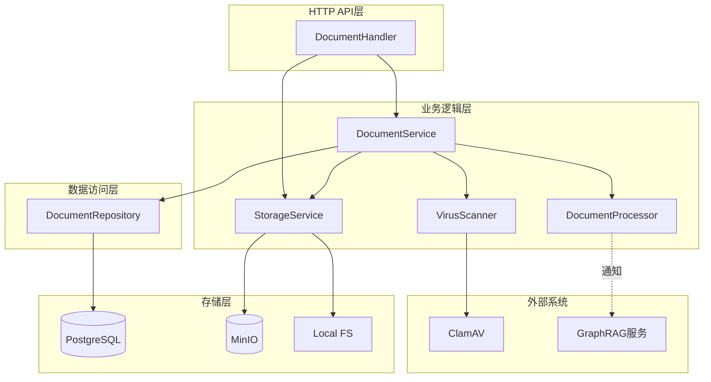
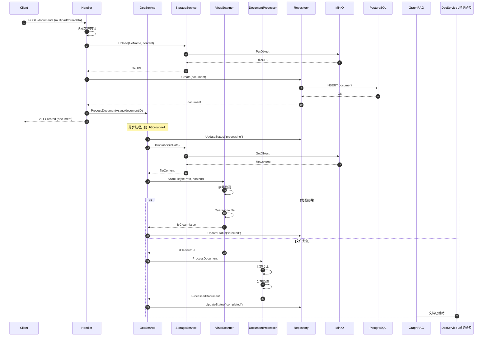
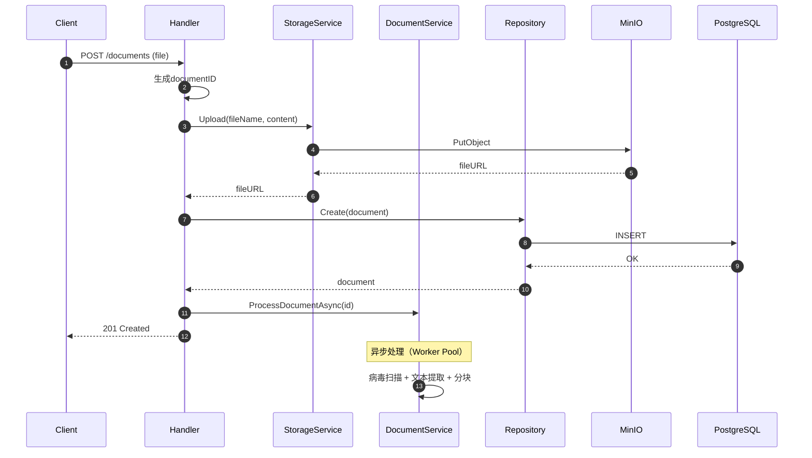
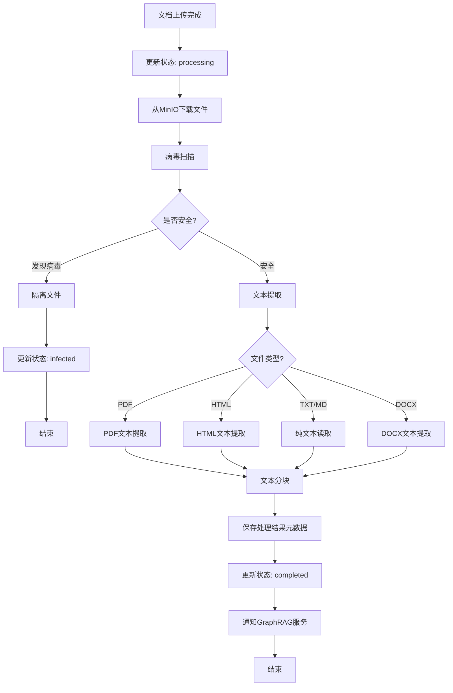
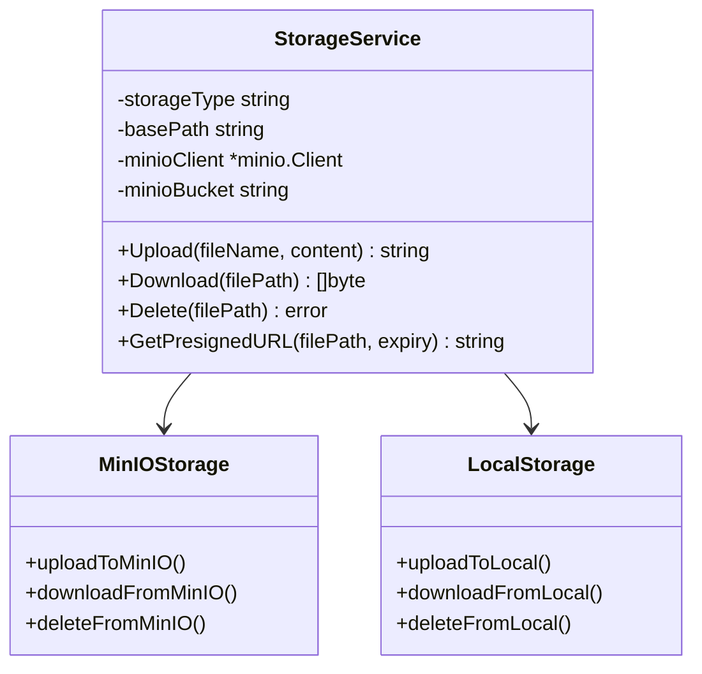

# VoiceHelper-03-Document文档服务

## 文档信息
- **模块名称**：Document文档服务
- **版本**：v0.8.2
- **生成时间**：2025-10-10
- **服务端口**：8082
- **技术栈**：Go 1.21+、Gin、GORM、PostgreSQL、MinIO

---

## 一、模块概览

### 1.1 职责边界

Document文档服务是VoiceHelper项目中负责文档生命周期管理的核心微服务，提供从文档上传到处理的完整链路支持。

**核心职责**：
- **文档存储管理**：文档上传、下载、删除操作
- **格式支持**：PDF、Word、Markdown、HTML、纯文本
- **对象存储集成**：支持本地存储和MinIO对象存储
- **文档处理管道**：文本提取、分块处理、向量化准备
- **病毒扫描**：集成ClamAV进行安全检查
- **异步处理**：Worker Pool并发控制
- **元数据管理**：文档状态追踪、用户权限控制

**非职责**：
- ❌ 向量化处理（由GraphRAG服务负责）
- ❌ 语义检索（由GraphRAG服务负责）
- ❌ 用户认证（由Auth服务负责）
- ❌ 实体提取与知识图谱构建（由GraphRAG服务负责）

### 1.2 模块架构



**架构说明**：
1. **三层架构**：Handler层处理HTTP请求、Service层实现业务逻辑、Repository层管理数据持久化
2. **存储抽象**：StorageService统一封装本地存储和MinIO，支持运行时切换
3. **管道处理**：DocumentProcessor实现文档格式转换和文本分块
4. **安全扫描**：VirusScanner集成ClamAV，支持Mock模式
5. **异步处理**：Worker Pool限制并发，防止资源耗尽

### 1.3 数据流



**数据流说明**：
1. **同步阶段**（步骤1-8）：文件上传到MinIO，元数据保存到PostgreSQL，立即返回客户端
2. **异步阶段**（步骤9-18）：Worker Pool中异步执行病毒扫描、文本提取、分块处理
3. **状态追踪**：uploaded → processing → completed/failed/infected
4. **错误容忍**：任何步骤失败都会更新状态为failed，保证状态一致性

---

## 二、对外API规格

### 2.1 API列表

| API | 方法 | 路径 | 说明 | 认证 |
|---|---|---|---|---|
| 上传文档 | POST | /api/v1/documents | 上传文档文件 | 可选 |
| 获取文档 | GET | /api/v1/documents/:id | 获取文档详情 | 可选 |
| 列表文档 | GET | /api/v1/documents | 分页列表文档 | 可选 |
| 更新文档 | PUT | /api/v1/documents/:id | 更新文档元数据 | 可选 |
| 删除文档 | DELETE | /api/v1/documents/:id | 删除文档 | 可选 |
| 下载文档 | GET | /api/v1/documents/:id/download | 下载文档文件 | 可选 |

---

### 2.2 API详解

#### API 1: 上传文档

**基本信息**：
- **端点**：`POST /api/v1/documents`
- **Content-Type**：`multipart/form-data`
- **幂等性**：否（每次上传创建新文档）
- **限流**：5 req/min（建议Gateway配置）

**请求参数**（Form Data）：

| 字段 | 类型 | 必填 | 约束 | 说明 |
|---|---|---|---|---|
| file | File | 是 | ≤100MB | 文档文件 |
| title | string | 否 | 1-256 | 文档标题（默认使用文件名） |

**请求示例**：
```http
POST /api/v1/documents HTTP/1.1
Host: localhost:8082
Content-Type: multipart/form-data; boundary=----WebKitFormBoundary
Authorization: Bearer <access_token>

------WebKitFormBoundary
Content-Disposition: form-data; name="file"; filename="company_handbook.pdf"
Content-Type: application/pdf

<binary file content>
------WebKitFormBoundary--
```

**响应结构体**：

```go
type UploadResponse struct {
    Code    int         `json:"code"`    // 201
    Message string      `json:"message"` // "Document uploaded successfully"
    Data    DocumentData `json:"data"`
}

type DocumentData struct {
    Document Document `json:"document"`
}

type Document struct {
    ID          string     `json:"id"`           // 文档ID (UUID)
    UserID      string     `json:"user_id"`      // 用户ID
    TenantID    string     `json:"tenant_id"`    // 租户ID
    Title       string     `json:"title"`        // 标题
    FileName    string     `json:"file_name"`    // 原始文件名
    FileType    string     `json:"file_type"`    // 文件类型(pdf/docx/txt/md)
    FileSize    int64      `json:"file_size"`    // 文件大小(字节)
    FilePath    string     `json:"file_path"`    // 存储路径(MinIO URL)
    Status      string     `json:"status"`       // 状态(uploaded/processing/completed/failed/infected)
    ProcessedAt *time.Time `json:"processed_at,omitempty"` // 处理完成时间
    Metadata    string     `json:"metadata,omitempty"`     // 扩展元数据(JSON)
    CreatedAt   time.Time  `json:"created_at"`   // 创建时间
    UpdatedAt   time.Time  `json:"updated_at"`   // 更新时间
}
```

**字段说明**：

| 字段 | 类型 | 说明 | 约束 |
|---|---|---|---|
| id | string | 文档唯一标识 | UUID格式 |
| user_id | string | 所属用户 | 来自JWT或"anonymous" |
| tenant_id | string | 所属租户 | 来自JWT或"default" |
| title | string | 文档标题 | 1-256字符 |
| file_name | string | 原始文件名 | 保留扩展名 |
| file_type | string | 文件类型 | pdf/docx/txt/md/html |
| file_size | int64 | 文件大小 | 单位字节，≤100MB |
| file_path | string | 存储路径 | 本地路径或MinIO URL |
| status | string | 处理状态 | uploaded/processing/completed/failed/infected |
| processed_at | time | 处理完成时间 | 状态为completed时有值 |
| metadata | string | 扩展元数据 | JSON格式，可存储分块数量等信息 |
| created_at | time | 创建时间 | ISO 8601格式 |
| updated_at | time | 更新时间 | ISO 8601格式 |

**核心代码**（Handler层）：

```go
// Upload 上传文档
func (h *DocumentHandler) Upload(c *gin.Context) {
    userID := c.GetString("user_id")
    tenantID := c.GetString("tenant_id")
    
    // 1. 读取上传文件
    file, header, err := c.Request.FormFile("file")
    if err != nil {
        c.JSON(http.StatusBadRequest, gin.H{
            "code": 400,
            "message": "Failed to read file",
        })
        return
    }
    defer file.Close()
    
    // 2. 生成文档ID和文件名
    documentID := uuid.New().String()
    fileExt := filepath.Ext(header.Filename)
    fileName := documentID + fileExt
    
    // 3. 读取文件内容到内存
    fileContent, err := io.ReadAll(file)
    // ... 错误处理 ...
    
    // 4. 上传到对象存储（MinIO或本地）
    fileURL, err := h.storageService.Upload(
        c.Request.Context(),
        fileName,
        fileContent,
    )
    // ... 错误处理 ...
    
    // 5. 创建数据库记录
    document := &model.Document{
        ID:        documentID,
        UserID:    userID,
        TenantID:  tenantID,
        Title:     header.Filename,
        FileName:  header.Filename,
        FileType:  fileExt[1:], // 去掉点号
        FileSize:  header.Size,
        FilePath:  fileURL,
        Status:    "uploaded",
        CreatedAt: time.Now(),
        UpdatedAt: time.Now(),
    }
    
    if err := h.documentService.CreateDocument(c.Request.Context(), document); err != nil {
        // ... 错误处理 ...
    }
    
    // 6. 异步处理文档（病毒扫描、文本提取、分块）
    go h.documentService.ProcessDocument(c.Request.Context(), documentID)
    
    // 7. 返回成功响应
    c.JSON(http.StatusCreated, gin.H{
        "code":    201,
        "message": "Document uploaded successfully",
        "data":    gin.H{"document": document},
    })
}
```

**调用链**：
```
Client → DocumentHandler.Upload() → DocumentService.CreateDocument() → DocumentRepository.Create() → PostgreSQL
                                  ↓
                                  StorageService.Upload() → MinIO
                                  ↓
                                  DocumentService.ProcessDocumentAsync() → Goroutine Worker Pool
```

**时序图**：



**错误响应**：

| HTTP状态码 | code | message | 原因 |
|---|---|---|---|
| 400 | 400 | Failed to read file | 文件读取失败 |
| 413 | 413 | File too large | 文件超过100MB |
| 500 | 500 | Failed to upload file | MinIO上传失败 |
| 500 | 500 | Failed to create document record | 数据库写入失败 |

**最佳实践**：
1. **文件大小限制**：客户端应在上传前检查文件大小（≤100MB）
2. **超时设置**：大文件上传建议超时时间≥60秒
3. **进度追踪**：上传后轮询GET /documents/:id查看status变化
4. **错误重试**：500错误可重试（幂等性：每次创建新ID）
5. **并发控制**：Worker Pool限制为10个并发处理，避免资源耗尽

---

#### API 2: 获取文档详情

**基本信息**：
- **端点**：`GET /api/v1/documents/:id`
- **幂等性**：是
- **权限**：仅文档所有者可访问

**请求示例**：
```http
GET /api/v1/documents/550e8400-e29b-41d4-a716-446655440000 HTTP/1.1
Host: localhost:8082
Authorization: Bearer <access_token>
```

**响应结构体**：

```go
type GetDocumentResponse struct {
    Code    int         `json:"code"`    // 200
    Message string      `json:"message"` // "Success"
    Data    DocumentData `json:"data"`
}
```

**核心代码**：

```go
func (h *DocumentHandler) GetDocument(c *gin.Context) {
    documentID := c.Param("id")
    userID := c.GetString("user_id")
    
    // 1. 从Service层获取文档
    document, err := h.documentService.GetDocument(
        c.Request.Context(),
        documentID,
        userID,
    )
    if err != nil {
        c.JSON(http.StatusNotFound, gin.H{
            "code":    404,
            "message": "Document not found",
        })
        return
    }
    
    // 2. 返回文档信息
    c.JSON(http.StatusOK, gin.H{
        "code":    200,
        "message": "Success",
        "data":    gin.H{"document": document},
    })
}
```

**Service层权限检查**：

```go
func (s *DocumentService) GetDocument(ctx context.Context, documentID, userID string) (*model.Document, error) {
    // 1. 从数据库查询
    document, err := s.documentRepo.FindByID(ctx, documentID)
    if err != nil {
        return nil, err
    }
    
    // 2. 验证权限（文档属于该用户）
    if document.UserID != userID {
        return nil, fmt.Errorf("document not found or no permission")
    }
    
    return document, nil
}
```

---

#### API 3: 列表文档

**基本信息**：
- **端点**：`GET /api/v1/documents`
- **幂等性**：是
- **分页**：支持

**查询参数**：

| 参数 | 类型 | 必填 | 默认值 | 说明 |
|---|---|---|---|---|
| page | int | 否 | 1 | 页码（从1开始） |
| page_size | int | 否 | 20 | 每页数量（1-100） |
| status | string | 否 | 全部 | 状态过滤(uploaded/processing/completed/failed/infected) |

**请求示例**：
```http
GET /api/v1/documents?page=1&page_size=20&status=completed HTTP/1.1
Host: localhost:8082
Authorization: Bearer <access_token>
```

**响应结构体**：

```go
type ListDocumentsResponse struct {
    Code    int         `json:"code"`    // 200
    Message string      `json:"message"` // "Success"
    Data    ListData    `json:"data"`
}

type ListData struct {
    Documents  []Document `json:"documents"`   // 文档列表
    Total      int64      `json:"total"`       // 总数
    Page       int        `json:"page"`        // 当前页
    PageSize   int        `json:"page_size"`   // 每页数量
    TotalPages int        `json:"total_pages"` // 总页数
}
```

**核心代码**：

```go
func (h *DocumentHandler) ListDocuments(c *gin.Context) {
    userID := c.GetString("user_id")
    
    // 1. 绑定查询参数
    var req model.DocumentListRequest
    if err := c.ShouldBindQuery(&req); err != nil {
        // ... 错误处理 ...
    }
    
    // 2. 设置默认值
    if req.Page <= 0 {
        req.Page = 1
    }
    if req.PageSize <= 0 {
        req.PageSize = 20
    }
    
    // 3. 查询文档列表
    documents, total, err := h.documentService.ListDocuments(
        c.Request.Context(),
        userID,
        req.Page,
        req.PageSize,
        req.Status,
    )
    // ... 错误处理 ...
    
    // 4. 计算总页数
    totalPages := int(total) / req.PageSize
    if int(total) % req.PageSize > 0 {
        totalPages++
    }
    
    // 5. 构造响应
    response := model.DocumentListResponse{
        Documents:  documents,
        Total:      total,
        Page:       req.Page,
        PageSize:   req.PageSize,
        TotalPages: totalPages,
    }
    
    c.JSON(http.StatusOK, gin.H{
        "code":    200,
        "message": "Success",
        "data":    response,
    })
}
```

**Repository层查询**：

```go
func (r *documentRepository) List(ctx context.Context, userID string, page, pageSize int, status string) ([]*model.Document, int64, error) {
    var documents []*model.Document
    var total int64
    
    // 1. 构建查询条件
    query := r.db.WithContext(ctx).Model(&model.Document{}).
        Where("deleted_at IS NULL")
    
    if userID != "" {
        query = query.Where("user_id = ?", userID)
    }
    
    if status != "" {
        query = query.Where("status = ?", status)
    }
    
    // 2. 获取总数
    if err := query.Count(&total).Error; err != nil {
        return nil, 0, err
    }
    
    // 3. 分页查询
    offset := (page - 1) * pageSize
    if err := query.Offset(offset).Limit(pageSize).
        Order("created_at DESC").
        Find(&documents).Error; err != nil {
        return nil, 0, err
    }
    
    return documents, total, nil
}
```

---

#### API 4: 更新文档

**基本信息**：
- **端点**：`PUT /api/v1/documents/:id`
- **幂等性**：是
- **权限**：仅文档所有者可更新

**请求结构体**：

```go
type UpdateDocumentRequest struct {
    Title    string `json:"title,omitempty"`    // 新标题
    Status   string `json:"status,omitempty"`   // 新状态
    Metadata string `json:"metadata,omitempty"` // 元数据(JSON字符串)
}
```

**请求示例**：
```json
{
  "title": "Updated Company Handbook",
  "metadata": "{\"tags\": [\"internal\", \"hr\"], \"department\": \"HR\"}"
}
```

**核心代码**：

```go
func (s *DocumentService) UpdateDocument(
    ctx context.Context,
    documentID, userID string,
    req *model.UpdateDocumentRequest,
) error {
    // 1. 查询文档
    document, err := s.documentRepo.FindByID(ctx, documentID)
    if err != nil {
        return err
    }
    
    // 2. 权限检查
    if document.UserID != userID {
        return fmt.Errorf("document not found or no permission")
    }
    
    // 3. 更新字段
    if req.Title != "" {
        document.Title = req.Title
    }
    if req.Status != "" {
        document.Status = req.Status
    }
    if req.Metadata != "" {
        document.Metadata = req.Metadata
    }
    
    document.UpdatedAt = time.Now()
    
    // 4. 保存到数据库
    return s.documentRepo.Update(ctx, document)
}
```

---

#### API 5: 删除文档

**基本信息**：
- **端点**：`DELETE /api/v1/documents/:id`
- **幂等性**：是
- **删除方式**：软删除（更新deleted_at字段）
- **权限**：仅文档所有者可删除

**请求示例**：
```http
DELETE /api/v1/documents/550e8400-e29b-41d4-a716-446655440000 HTTP/1.1
Host: localhost:8082
Authorization: Bearer <access_token>
```

**响应**：
```json
{
  "code": 200,
  "message": "Document deleted successfully"
}
```

**核心代码**：

```go
func (s *DocumentService) DeleteDocument(ctx context.Context, documentID, userID string) error {
    // 1. 查询文档
    document, err := s.documentRepo.FindByID(ctx, documentID)
    if err != nil {
        return err
    }
    
    // 2. 权限检查
    if document.UserID != userID {
        return fmt.Errorf("document not found or no permission")
    }
    
    // 3. 软删除
    return s.documentRepo.Delete(ctx, documentID)
}
```

**Repository实现**：

```go
func (r *documentRepository) Delete(ctx context.Context, id string) error {
    // 软删除：更新deleted_at字段
    return r.db.WithContext(ctx).
        Model(&model.Document{}).
        Where("id = ?", id).
        Update("deleted_at", gorm.Expr("CURRENT_TIMESTAMP")).Error
}
```

**注意事项**：
- 软删除后，文档仍保留在数据库中，但查询时会被过滤
- MinIO中的文件不会立即删除（需要后台清理任务）
- 后续可实现"回收站"功能，允许恢复已删除文档

---

#### API 6: 下载文档

**基本信息**：
- **端点**：`GET /api/v1/documents/:id/download`
- **幂等性**：是
- **响应类型**：`application/octet-stream`
- **权限**：仅文档所有者可下载

**请求示例**：
```http
GET /api/v1/documents/550e8400-e29b-41d4-a716-446655440000/download HTTP/1.1
Host: localhost:8082
Authorization: Bearer <access_token>
```

**响应头**：
```
Content-Description: File Transfer
Content-Transfer-Encoding: binary
Content-Disposition: attachment; filename="company_handbook.pdf"
Content-Type: application/octet-stream
Content-Length: 1024000
```

**核心代码**：

```go
func (h *DocumentHandler) DownloadDocument(c *gin.Context) {
    documentID := c.Param("id")
    userID := c.GetString("user_id")
    
    // 1. 获取文档信息
    document, err := h.documentService.GetDocument(
        c.Request.Context(),
        documentID,
        userID,
    )
    if err != nil {
        c.JSON(http.StatusNotFound, gin.H{
            "code":    404,
            "message": "Document not found",
        })
        return
    }
    
    // 2. 从存储服务获取文件内容
    fileContent, err := h.storageService.Download(
        c.Request.Context(),
        document.FilePath,
    )
    if err != nil {
        c.JSON(http.StatusInternalServerError, gin.H{
            "code":    500,
            "message": "Failed to download file",
        })
        return
    }
    
    // 3. 设置响应头
    c.Header("Content-Description", "File Transfer")
    c.Header("Content-Transfer-Encoding", "binary")
    c.Header("Content-Disposition", "attachment; filename="+document.FileName)
    c.Header("Content-Type", "application/octet-stream")
    
    // 4. 返回文件内容
    c.Data(http.StatusOK, "application/octet-stream", fileContent)
}
```

**StorageService实现**：

```go
func (s *StorageService) Download(ctx context.Context, filePath string) ([]byte, error) {
    // 根据存储类型选择不同实现
    if s.storageType == "minio" {
        return s.downloadFromMinIO(ctx, filePath)
    }
    return s.downloadFromLocal(filePath)
}

func (s *StorageService) downloadFromMinIO(ctx context.Context, filePath string) ([]byte, error) {
    // 从MinIO URL提取文件名
    fileName := extractFileNameFromURL(filePath)
    
    // 获取对象
    object, err := s.minioClient.GetObject(ctx, s.minioBucket, fileName, minio.GetObjectOptions{})
    if err != nil {
        return nil, fmt.Errorf("failed to get object from minio: %w", err)
    }
    defer object.Close()
    
    // 读取对象内容
    buf := new(bytes.Buffer)
    if _, err := buf.ReadFrom(object); err != nil {
        return nil, fmt.Errorf("failed to read object content: %w", err)
    }
    
    return buf.Bytes(), nil
}
```

---

## 三、文档处理管道

### 3.1 处理流程



### 3.2 病毒扫描

**核心代码**：

```go
func (s *VirusScanner) ScanFile(ctx context.Context, filePath string, fileContent []byte) (*ScanResult, error) {
    start := time.Now()
    
    // 1. 检查是否启用
    if !s.enabled {
        return &ScanResult{
            IsClean:  true,
            Scanner:  "disabled",
            Timestamp: time.Now(),
        }, nil
    }
    
    // 2. 检查文件大小
    if int64(len(fileContent)) > s.maxFileSize {
        return nil, fmt.Errorf("file too large for scanning: %d bytes", len(fileContent))
    }
    
    // 3. 根据scanner类型执行扫描
    var result *ScanResult
    var err error
    
    switch s.scannerType {
    case "clamav":
        result, err = s.scanWithClamAV(ctx, filePath, fileContent)
    case "mock":
        result, err = s.scanWithMock(ctx, filePath, fileContent)
    default:
        result, err = s.scanWithMock(ctx, filePath, fileContent)
    }
    
    if err != nil {
        return nil, err
    }
    
    result.ScanDuration = time.Since(start)
    
    // 4. 发现病毒则隔离
    if !result.IsClean {
        if err := s.quarantineFile(filePath, fileContent, result.VirusFound); err != nil {
            log.Printf("Failed to quarantine file: %v", err)
        }
    }
    
    return result, nil
}
```

**ClamAV集成**：

```go
func (s *VirusScanner) scanWithClamAV(ctx context.Context, filePath string, fileContent []byte) (*ScanResult, error) {
    // 1. 创建临时文件
    tmpFile, err := os.CreateTemp("", "virus-scan-*")
    if err != nil {
        return nil, err
    }
    defer os.Remove(tmpFile.Name())
    defer tmpFile.Close()
    
    // 2. 写入文件内容
    if _, err := tmpFile.Write(fileContent); err != nil {
        return nil, err
    }
    tmpFile.Close()
    
    // 3. 调用clamdscan命令
    ctx, cancel := context.WithTimeout(ctx, s.scanTimeout)
    defer cancel()
    
    cmd := exec.CommandContext(ctx, "clamdscan", "--no-summary", tmpFile.Name())
    output, err := cmd.CombinedOutput()
    
    result := &ScanResult{Scanner: "clamav"}
    
    // 4. 解析结果（返回码：0=clean, 1=virus found, 2=error）
    if err != nil {
        if exitErr, ok := err.(*exec.ExitError); ok {
            if exitErr.ExitCode() == 1 {
                result.IsClean = false
                result.VirusFound = extractVirusName(string(output))
                return result, nil
            }
        }
        return nil, err
    }
    
    result.IsClean = true
    return result, nil
}
```

**文件隔离**：

```go
func (s *VirusScanner) quarantineFile(filePath string, fileContent []byte, virusName string) error {
    // 生成隔离文件名：timestamp-virusname.quarantine
    timestamp := time.Now().Format("20060102-150405")
    quarantineFile := fmt.Sprintf("%s/%s-%s.quarantine", 
        s.quarantinePath, timestamp, virusName)
    
    // 写入隔离目录（权限0600，仅所有者可读写）
    if err := os.WriteFile(quarantineFile, fileContent, 0600); err != nil {
        return err
    }
    
    log.Printf("File quarantined: %s -> %s", filePath, quarantineFile)
    return nil
}
```

### 3.3 文本提取

**PDF提取**：

```go
func (p *DocumentProcessor) extractTextFromPDF(content []byte) (string, error) {
    // 1. 创建PDF Reader
    bytesReader := bytes.NewReader(content)
    reader, err := pdf.NewReader(bytesReader, int64(len(content)))
    if err != nil {
        return "", err
    }
    
    // 2. 逐页提取文本
    var text strings.Builder
    numPages := reader.NumPage()
    
    for pageNum := 1; pageNum <= numPages; pageNum++ {
        page := reader.Page(pageNum)
        if page.V.IsNull() {
            continue
        }
        
        pageText, err := page.GetPlainText(nil)
        if err != nil {
            log.Printf("Failed to extract text from page %d: %v", pageNum, err)
            continue
        }
        
        text.WriteString(pageText)
        text.WriteString("\n\n")
    }
    
    return text.String(), nil
}
```

**HTML提取**：

```go
func (p *DocumentProcessor) extractTextFromHTML(content []byte) (string, error) {
    text := string(content)
    
    // 1. 移除script和style标签及内容
    text = removeTagsWithContent(text, "script")
    text = removeTagsWithContent(text, "style")
    
    // 2. 移除所有HTML标签
    text = removeHTMLTags(text)
    
    // 3. 清理多余空白
    text = cleanWhitespace(text)
    
    return text, nil
}

func removeHTMLTags(html string) string {
    var result strings.Builder
    inTag := false
    
    for _, char := range html {
        if char == '<' {
            inTag = true
            continue
        }
        if char == '>' {
            inTag = false
            continue
        }
        if !inTag {
            result.WriteRune(char)
        }
    }
    
    return result.String()
}
```

### 3.4 文本分块

**分块策略**：
- **分块大小**：1000字符/chunk
- **重叠大小**：200字符（保持上下文连贯性）
- **分割方式**：按段落分割（双换行符）
- **边界处理**：保留完整句子，避免截断

**核心代码**：

```go
func (p *DocumentProcessor) splitTextIntoChunks(text string) []TextChunk {
    if len(text) == 0 {
        return []TextChunk{}
    }
    
    var chunks []TextChunk
    chunkIndex := 0
    
    // 1. 按段落分割
    paragraphs := strings.Split(text, "\n\n")
    
    var currentChunk strings.Builder
    var currentStart int
    
    // 2. 逐段落累积到chunk
    for _, para := range paragraphs {
        para = strings.TrimSpace(para)
        if para == "" {
            continue
        }
        
        // 3. 如果超过最大长度，创建新chunk
        if currentChunk.Len() + len(para) > p.maxChunkSize {
            if currentChunk.Len() > 0 {
                // 保存当前chunk
                chunks = append(chunks, TextChunk{
                    Index:   chunkIndex,
                    Content: currentChunk.String(),
                    Start:   currentStart,
                    End:     currentStart + currentChunk.Len(),
                })
                chunkIndex++
                
                // 4. 保留overlap部分
                overlapText := getLastNChars(currentChunk.String(), p.chunkOverlap)
                currentChunk.Reset()
                currentChunk.WriteString(overlapText)
                currentStart = currentStart + currentChunk.Len() - p.chunkOverlap
            }
        }
        
        // 5. 添加段落到当前chunk
        if currentChunk.Len() > 0 {
            currentChunk.WriteString("\n\n")
        }
        currentChunk.WriteString(para)
    }
    
    // 6. 添加最后一个chunk
    if currentChunk.Len() > 0 {
        chunks = append(chunks, TextChunk{
            Index:   chunkIndex,
            Content: currentChunk.String(),
            Start:   currentStart,
            End:     currentStart + currentChunk.Len(),
        })
    }
    
    return chunks
}
```

**处理结果**：

```go
type ProcessedDocument struct {
    FullText   string      // 完整文本
    Chunks     []TextChunk // 分块结果
    ChunkCount int         // 分块数量
    CharCount  int         // 总字符数
}

type TextChunk struct {
    Index   int    // 分块序号
    Content string // 分块内容
    Start   int    // 起始位置
    End     int    // 结束位置
}
```

---

## 四、存储服务

### 4.1 存储抽象

StorageService提供统一的存储接口，支持本地文件系统和MinIO对象存储，运行时可通过环境变量切换。



### 4.2 MinIO集成

**初始化**：

```go
func (s *StorageService) initMinIO() error {
    // 1. 读取配置
    endpoint := os.Getenv("MINIO_ENDPOINT")      // localhost:9000
    accessKey := os.Getenv("MINIO_ACCESS_KEY")   // minioadmin
    secretKey := os.Getenv("MINIO_SECRET_KEY")   // minioadmin
    bucket := os.Getenv("MINIO_BUCKET")          // documents
    useSSL := os.Getenv("MINIO_USE_SSL") == "true"
    
    s.minioBucket = bucket
    
    // 2. 创建MinIO客户端
    minioClient, err := minio.New(endpoint, &minio.Options{
        Creds:  credentials.NewStaticV4(accessKey, secretKey, ""),
        Secure: useSSL,
    })
    if err != nil {
        return err
    }
    
    s.minioClient = minioClient
    
    // 3. 检查bucket是否存在，不存在则创建
    ctx := context.Background()
    exists, err := minioClient.BucketExists(ctx, bucket)
    if err != nil {
        return err
    }
    
    if !exists {
        if err := minioClient.MakeBucket(ctx, bucket, minio.MakeBucketOptions{}); err != nil {
            return err
        }
        log.Printf("Created MinIO bucket: %s", bucket)
    }
    
    return nil
}
```

**上传**：

```go
func (s *StorageService) uploadToMinIO(ctx context.Context, fileName string, content []byte) (string, error) {
    // 1. 创建Reader
    reader := bytes.NewReader(content)
    contentType := "application/octet-stream"
    
    // 2. 上传对象
    _, err := s.minioClient.PutObject(
        ctx,
        s.minioBucket,
        fileName,
        reader,
        int64(len(content)),
        minio.PutObjectOptions{
            ContentType: contentType,
        },
    )
    if err != nil {
        return "", err
    }
    
    // 3. 返回MinIO URL
    fileURL := fmt.Sprintf("minio://%s/%s", s.minioBucket, fileName)
    log.Printf("File uploaded to MinIO: %s", fileURL)
    
    return fileURL, nil
}
```

**下载**：

```go
func (s *StorageService) downloadFromMinIO(ctx context.Context, filePath string) ([]byte, error) {
    // 1. 从URL提取文件名
    fileName := extractFileNameFromURL(filePath)
    
    // 2. 获取对象
    object, err := s.minioClient.GetObject(ctx, s.minioBucket, fileName, minio.GetObjectOptions{})
    if err != nil {
        return nil, err
    }
    defer object.Close()
    
    // 3. 读取内容
    buf := new(bytes.Buffer)
    if _, err := buf.ReadFrom(object); err != nil {
        return nil, err
    }
    
    return buf.Bytes(), nil
}
```

**预签名URL**（用于临时访问）：

```go
func (s *StorageService) GetPresignedURL(ctx context.Context, filePath string, expiry time.Duration) (string, error) {
    fileName := extractFileNameFromURL(filePath)
    
    // 生成预签名URL（有效期expiry，通常15分钟到1小时）
    presignedURL, err := s.minioClient.PresignedGetObject(
        ctx,
        s.minioBucket,
        fileName,
        expiry,
        nil,
    )
    if err != nil {
        return "", err
    }
    
    return presignedURL.String(), nil
}
```

---

## 五、数据库设计

### 5.1 documents表Schema

```sql
CREATE TABLE documents (
    id          VARCHAR(36) PRIMARY KEY,        -- UUID
    user_id     VARCHAR(36) NOT NULL,           -- 用户ID
    tenant_id   VARCHAR(36) NOT NULL,           -- 租户ID
    title       VARCHAR(256) NOT NULL,          -- 标题
    file_name   VARCHAR(256) NOT NULL,          -- 原始文件名
    file_type   VARCHAR(20) NOT NULL,           -- 文件类型
    file_size   BIGINT NOT NULL,                -- 文件大小(字节)
    file_path   TEXT NOT NULL,                  -- 存储路径
    status      VARCHAR(20) NOT NULL DEFAULT 'uploaded', -- 状态
    processed_at TIMESTAMP,                     -- 处理完成时间
    metadata    TEXT,                           -- 元数据(JSON)
    created_at  TIMESTAMP NOT NULL DEFAULT CURRENT_TIMESTAMP,
    updated_at  TIMESTAMP NOT NULL DEFAULT CURRENT_TIMESTAMP,
    deleted_at  TIMESTAMP,                      -- 软删除时间
    
    INDEX idx_user_id (user_id),
    INDEX idx_tenant_id (tenant_id),
    INDEX idx_status (status),
    INDEX idx_created_at (created_at),
    INDEX idx_deleted_at (deleted_at)
);
```

**字段约束**：
- `id`：UUID格式，全局唯一
- `status`：枚举值（uploaded, processing, completed, failed, infected）
- `file_size`：最大100MB（104857600字节）
- `metadata`：JSON格式字符串，可存储任意扩展信息

### 5.2 GORM模型

```go
type Document struct {
    ID          string     `json:"id" gorm:"primaryKey;type:varchar(36)"`
    UserID      string     `json:"user_id" gorm:"type:varchar(36);not null;index"`
    TenantID    string     `json:"tenant_id" gorm:"type:varchar(36);not null;index"`
    Title       string     `json:"title" gorm:"type:varchar(256);not null"`
    FileName    string     `json:"file_name" gorm:"type:varchar(256);not null"`
    FileType    string     `json:"file_type" gorm:"type:varchar(20);not null"`
    FileSize    int64      `json:"file_size" gorm:"not null"`
    FilePath    string     `json:"file_path" gorm:"type:text;not null"`
    Status      string     `json:"status" gorm:"type:varchar(20);not null;default:'uploaded';index"`
    ProcessedAt *time.Time `json:"processed_at,omitempty" gorm:"type:timestamp"`
    Metadata    string     `json:"metadata,omitempty" gorm:"type:text"`
    CreatedAt   time.Time  `json:"created_at" gorm:"not null;default:CURRENT_TIMESTAMP;index"`
    UpdatedAt   time.Time  `json:"updated_at" gorm:"not null;default:CURRENT_TIMESTAMP"`
    DeletedAt   *time.Time `json:"deleted_at,omitempty" gorm:"type:timestamp;index"`
}
```

---

## 六、配置与部署

### 6.1 环境变量

| 变量名 | 必填 | 默认值 | 说明 |
|---|---|---|---|
| SERVICE_HOST | 否 | localhost | 服务主机 |
| SERVICE_PORT | 否 | 8082 | 服务端口 |
| DB_HOST | 否 | localhost | PostgreSQL主机 |
| DB_PORT | 否 | 5432 | PostgreSQL端口 |
| DB_USER | 否 | voicehelper | 数据库用户 |
| DB_PASSWORD | 是 | - | 数据库密码 |
| DB_NAME | 否 | voicehelper_document | 数据库名 |
| DB_SSLMODE | 否 | disable | SSL模式 |
| STORAGE_TYPE | 否 | local | 存储类型(local/minio) |
| STORAGE_BASE_PATH | 否 | ./data/documents | 本地存储路径 |
| MINIO_ENDPOINT | 否 | localhost:9000 | MinIO地址 |
| MINIO_ACCESS_KEY | 否 | minioadmin | MinIO Access Key |
| MINIO_SECRET_KEY | 否 | minioadmin | MinIO Secret Key |
| MINIO_BUCKET | 否 | documents | MinIO Bucket名称 |
| MINIO_USE_SSL | 否 | false | 是否使用SSL |
| VIRUS_SCAN_ENABLED | 否 | false | 是否启用病毒扫描 |
| VIRUS_SCANNER_TYPE | 否 | mock | 扫描器类型(clamav/mock) |
| CLAMAV_SOCKET | 否 | /var/run/clamav/clamd.ctl | ClamAV Socket路径 |
| VIRUS_QUARANTINE_PATH | 否 | ./data/quarantine | 病毒隔离路径 |
| CONSUL_ADDR | 否 | localhost:8500 | Consul地址 |

### 6.2 Docker部署

**Dockerfile**：

```dockerfile
FROM golang:1.21-alpine AS builder

WORKDIR /app
COPY go.mod go.sum ./
RUN go mod download

COPY . .
RUN go build -o document-service ./cmd/main.go

FROM alpine:latest
RUN apk add --no-cache ca-certificates

WORKDIR /root/
COPY --from=builder /app/document-service .

EXPOSE 8082
CMD ["./document-service"]
```

**docker-compose.yml**：

```yaml
version: '3.8'

services:
  document-service:
    build: .
    ports:
      - "8082:8082"
    environment:
      - DB_HOST=postgres
      - DB_PASSWORD=voicehelper123
      - STORAGE_TYPE=minio
      - MINIO_ENDPOINT=minio:9000
      - MINIO_ACCESS_KEY=minioadmin
      - MINIO_SECRET_KEY=minioadmin123
      - VIRUS_SCAN_ENABLED=false
    depends_on:
      - postgres
      - minio
    networks:
      - voicehelper
```

### 6.3 启动命令

```bash
# 开发环境（本地存储）
export STORAGE_TYPE=local
go run cmd/main.go

# 生产环境（MinIO存储）
export STORAGE_TYPE=minio
export MINIO_ENDPOINT=minio:9000
export DB_PASSWORD=your_password
./document-service
```

---

## 七、最佳实践

### 7.1 性能优化

**1. Worker Pool并发控制**
```go
// 限制并发处理数量为10
maxWorkers := 10
documentService := service.NewDocumentService(
    documentRepo,
    storageService,
    documentProcessor,
    virusScanner,
    maxWorkers,
)
```

**2. 数据库连接池**
```go
sqlDB, _ := db.DB()
sqlDB.SetMaxIdleConns(10)   // 空闲连接数
sqlDB.SetMaxOpenConns(100)  // 最大连接数
sqlDB.SetConnMaxLifetime(time.Hour) // 连接生命周期
```

**3. 文件大小限制**
```go
// Handler层检查文件大小
const MaxFileSize = 100 * 1024 * 1024 // 100MB

if header.Size > MaxFileSize {
    c.JSON(http.StatusRequestEntityTooLarge, gin.H{
        "code": 413,
        "message": "File too large",
    })
    return
}
```

**4. 异步处理**
- 上传接口立即返回，异步处理文档
- 使用Goroutine + Worker Pool控制并发
- 处理失败更新status为failed

### 7.2 安全防护

**1. 病毒扫描**
```bash
# 启用ClamAV扫描
export VIRUS_SCAN_ENABLED=true
export VIRUS_SCANNER_TYPE=clamav

# 安装ClamAV
apt-get install clamav clamav-daemon
systemctl start clamav-daemon
```

**2. 文件类型验证**
```go
// 验证文件扩展名
allowedTypes := map[string]bool{
    ".pdf": true,
    ".txt": true,
    ".md": true,
    ".html": true,
    ".docx": true,
}

fileExt := filepath.Ext(header.Filename)
if !allowedTypes[fileExt] {
    return errors.New("unsupported file type")
}
```

**3. 权限控制**
```go
// Service层检查文档所有权
if document.UserID != userID {
    return fmt.Errorf("document not found or no permission")
}
```

### 7.3 错误处理

**1. 优雅降级**
```go
// MinIO不可用时降级到本地存储
if storageType == "minio" {
    if err := s.initMinIO(); err != nil {
        log.Printf("MinIO init failed, fallback to local storage: %v", err)
        s.storageType = "local"
    }
}
```

**2. 状态一致性**
```go
// 处理失败时更新状态
defer func() {
    if err != nil {
        s.documentRepo.UpdateStatus(ctx, documentID, "failed")
    }
}()
```

### 7.4 监控指标

**关键指标**：
- `document_upload_total`：上传文档总数
- `document_upload_duration_seconds`：上传耗时
- `document_processing_duration_seconds`：处理耗时
- `document_processing_failures_total`：处理失败数
- `virus_scan_total`：病毒扫描总数
- `virus_found_total`：发现病毒数
- `storage_operations_total`：存储操作数
- `worker_pool_active`：活跃Worker数量

---

## 八、故障排查

### 8.1 常见问题

**Q1: 文档上传成功但status一直是uploaded**
```bash
# 检查Worker Pool是否正常工作
tail -f logs/document-service.log | grep "Processing document"

# 可能原因：
# 1. Worker Pool已满（增加maxWorkers）
# 2. MinIO连接失败（检查MINIO_ENDPOINT）
# 3. 病毒扫描超时（增加SCAN_TIMEOUT）
```

**Q2: MinIO连接失败**
```bash
# 检查MinIO是否运行
docker ps | grep minio

# 测试MinIO连接
curl http://localhost:9000/minio/health/live

# 检查配置
echo $MINIO_ENDPOINT
echo $MINIO_ACCESS_KEY
```

**Q3: 病毒扫描失败**
```bash
# 检查ClamAV是否运行
systemctl status clamav-daemon

# 测试ClamAV
clamdscan --version

# 临时禁用病毒扫描
export VIRUS_SCAN_ENABLED=false
```

### 8.2 日志分析

```bash
# 查看最近上传
grep "Document uploaded successfully" logs/document-service.log | tail -10

# 查看处理失败
grep "文档处理失败" logs/document-service.log

# 查看病毒发现
grep "Virus found" logs/document-service.log

# 查看MinIO错误
grep "MinIO" logs/document-service.log | grep "ERROR"
```

---

## 九、扩展功能

### 9.1 预签名URL（临时访问）

```go
// 生成15分钟有效的下载链接
presignedURL, err := storageService.GetPresignedURL(
    ctx,
    document.FilePath,
    15 * time.Minute,
)

// 返回给客户端，客户端可直接访问此URL下载文件
c.JSON(http.StatusOK, gin.H{
    "download_url": presignedURL,
    "expires_in": 900, // 秒
})
```

### 9.2 文档版本管理

```sql
CREATE TABLE document_versions (
    id VARCHAR(36) PRIMARY KEY,
    document_id VARCHAR(36) NOT NULL,
    version INT NOT NULL,
    file_path TEXT NOT NULL,
    file_size BIGINT NOT NULL,
    created_at TIMESTAMP NOT NULL,
    created_by VARCHAR(36) NOT NULL,
    
    FOREIGN KEY (document_id) REFERENCES documents(id),
    INDEX idx_document_id (document_id)
);
```

### 9.3 批量上传

```go
// POST /documents/batch
func (h *DocumentHandler) BatchUpload(c *gin.Context) {
    form, err := c.MultipartForm()
    if err != nil {
        // ...
    }
    
    files := form.File["files"]
    var results []UploadResult
    
    for _, file := range files {
        // 逐个上传
        result := h.uploadSingleFile(c, file)
        results = append(results, result)
    }
    
    c.JSON(http.StatusOK, gin.H{
        "code": 200,
        "message": "Batch upload completed",
        "data": results,
    })
}
```

---

## 十、总结

Document文档服务是VoiceHelper项目中的核心数据管理服务，提供完整的文档生命周期管理功能。

**核心特性**：
1. ✅ **存储灵活性**：支持本地存储和MinIO，运行时可切换
2. ✅ **安全保障**：ClamAV病毒扫描 + 文件隔离
3. ✅ **格式支持**：PDF、Word、HTML、Markdown、纯文本
4. ✅ **异步处理**：Worker Pool并发控制，避免资源耗尽
5. ✅ **权限控制**：用户级隔离，仅所有者可访问
6. ✅ **状态追踪**：完整的文档处理状态机
7. ✅ **可扩展性**：易于集成GraphRAG服务进行向量化

**后续优化方向**：
- 支持更多文档格式（DOCX、PPTX、Excel）
- 实现文档版本管理
- 添加文档预览功能
- 优化大文件上传（分片上传）
- 实现文档共享与协作
- 添加文档标签与分类
- 集成全文搜索（Elasticsearch）

---

**文档版本**：v1.0  
**最后更新**：2025-10-10  
**维护者**：VoiceHelper Team

