# VoiceHelper-03-Document文档服务

## 文档信息
- **模块名称**：Document文档服务
- **版本**：v0.8.2
- **生成时间**：2025-10-10
- **服务端口**：8082
- **技术栈**：Go 1.21+、Gin、GORM、PostgreSQL、MinIO

---

## 一、模块概览

### 1.1 职责边界

Document文档服务是VoiceHelper项目中负责文档生命周期管理的核心微服务，提供从文档上传到处理的完整链路支持。

**核心职责**：
- **文档存储管理**：文档上传、下载、删除操作
- **格式支持**：PDF、Word、Markdown、HTML、纯文本
- **对象存储集成**：支持本地存储和MinIO对象存储
- **文档处理管道**：文本提取、分块处理、向量化准备
- **病毒扫描**：集成ClamAV进行安全检查
- **异步处理**：Worker Pool并发控制
- **元数据管理**：文档状态追踪、用户权限控制

**非职责**：
- 向量化处理（由GraphRAG服务负责）
- 语义检索（由GraphRAG服务负责）
- 用户认证（由Auth服务负责）
- 实体提取与知识图谱构建（由GraphRAG服务负责）

### 1.2 整体服务架构

```mermaid
flowchart TB
    subgraph Client["客户端层"]
        WebApp[Web应用]
        Mobile[移动端]
        Gateway[API Gateway]
    end
    
    subgraph APILayer["API层 - DocumentHandler"]
        Upload[Upload上传接口]
        Get[GetDocument获取接口]
        List[ListDocuments列表接口]
        Update[UpdateDocument更新接口]
        Delete[DeleteDocument删除接口]
        Download[DownloadDocument下载接口]
    end
    
    subgraph ServiceLayer["业务逻辑层"]
        DocService[DocumentService<br/>文档服务核心]
        StorageService[StorageService<br/>存储服务抽象]
        Processor[DocumentProcessor<br/>文档处理器]
        Scanner[VirusScanner<br/>病毒扫描器]
    end
    
    subgraph DataLayer["数据访问层"]
        DocRepo[DocumentRepository<br/>文档仓储接口]
    end
    
    subgraph StorageBackend["存储后端"]
        direction LR
        PG[(PostgreSQL<br/>元数据存储)]
        MinIO[(MinIO<br/>对象存储)]
        LocalFS[本地文件系统]
    end
    
    subgraph ExternalServices["外部服务"]
        ClamAV[ClamAV<br/>病毒扫描引擎]
        Consul[Consul<br/>服务注册发现]
        GraphRAG[GraphRAG服务<br/>向量化处理]
    end
    
    subgraph WorkerPool["异步处理"]
        Worker1[Worker 1]
        Worker2[Worker 2]
        WorkerN[Worker N]
    end
    
    %% 客户端到API层
    WebApp --> Gateway
    Mobile --> Gateway
    Gateway --> Upload
    Gateway --> Get
    Gateway --> List
    Gateway --> Update
    Gateway --> Delete
    Gateway --> Download
    
    %% API层到Service层
    Upload --> DocService
    Upload --> StorageService
    Get --> DocService
    List --> DocService
    Update --> DocService
    Delete --> DocService
    Download --> DocService
    Download --> StorageService
    
    %% Service层内部依赖
    DocService --> DocRepo
    DocService --> StorageService
    DocService --> Processor
    DocService --> Scanner
    DocService --> Worker1
    DocService --> Worker2
    DocService --> WorkerN
    
    Processor --> StorageService
    
    %% 数据访问层到存储
    DocRepo --> PG
    
    %% 存储服务到存储后端
    StorageService --> MinIO
    StorageService --> LocalFS
    
    %% 外部服务依赖
    Scanner --> ClamAV
    DocService -.异步通知.-> GraphRAG
    DocService --> Consul
    
    %% 样式定义
    classDef clientStyle fill:#e1f5ff,stroke:#01579b,stroke-width:2px
    classDef apiStyle fill:#fff3e0,stroke:#e65100,stroke-width:2px
    classDef serviceStyle fill:#f3e5f5,stroke:#4a148c,stroke-width:2px
    classDef dataStyle fill:#e8f5e9,stroke:#1b5e20,stroke-width:2px
    classDef storageStyle fill:#fce4ec,stroke:#880e4f,stroke-width:2px
    classDef externalStyle fill:#fff9c4,stroke:#f57f17,stroke-width:2px
    
    class WebApp,Mobile,Gateway clientStyle
    class Upload,Get,List,Update,Delete,Download apiStyle
    class DocService,StorageService,Processor,Scanner serviceStyle
    class DocRepo dataStyle
    class PG,MinIO,LocalFS storageStyle
    class ClamAV,Consul,GraphRAG externalStyle
```

**架构层次说明**：

#### 1. 客户端层
- **Web应用/移动端**：前端应用通过Gateway访问文档服务
- **API Gateway**：统一入口，提供路由、认证、限流等功能

#### 2. API层（DocumentHandler）
提供6个核心RESTful接口：
- **Upload**：文档上传接口，支持multipart/form-data
- **GetDocument**：根据ID获取单个文档详情
- **ListDocuments**：分页列表查询，支持状态过滤
- **UpdateDocument**：更新文档元数据（标题、状态等）
- **DeleteDocument**：软删除文档
- **DownloadDocument**：下载原始文档文件

#### 3. 业务逻辑层（Service Layer）
- **DocumentService**：文档服务核心，协调所有业务逻辑
  - 文档生命周期管理（创建、查询、更新、删除）
  - 异步处理调度（Worker Pool管理）
  - 状态机转换控制
  
- **StorageService**：存储服务抽象层
  - 统一封装MinIO和本地文件系统
  - 支持运行时动态切换存储类型
  - 提供Upload/Download/Delete/GetPresignedURL接口
  
- **DocumentProcessor**：文档处理器
  - 文本提取（PDF、HTML、TXT、MD）
  - 文本分块（Chunking）
  - 支持1000字符/chunk，200字符overlap
  
- **VirusScanner**：病毒扫描器
  - 集成ClamAV病毒引擎
  - 支持Mock模式（开发/测试）
  - 文件隔离与报告

#### 4. 数据访问层（Repository）
- **DocumentRepository**：文档仓储接口
  - CRUD操作抽象
  - 复杂查询（分页、过滤、排序）
  - 软删除支持

#### 5. 存储后端
- **PostgreSQL**：元数据存储（文档记录、状态、权限）
- **MinIO**：对象存储（文档文件）
- **本地文件系统**：备用存储方案

#### 6. 外部服务
- **ClamAV**：病毒扫描引擎
- **Consul**：服务注册与发现
- **GraphRAG**：向量化处理服务（异步通知）

#### 7. 异步处理（Worker Pool）
- 使用Goroutine实现并发处理
- Channel控制最大并发数（默认10）
- 防止资源耗尽和雪崩效应

**架构特点**：
1. **分层清晰**：Handler → Service → Repository → Storage，职责分离
2. **存储抽象**：StorageService统一封装多种存储后端
3. **异步处理**：上传接口立即返回，后台异步处理文档
4. **并发控制**：Worker Pool限制并发数，保护系统稳定性
5. **可扩展性**：易于添加新的文档格式和存储后端

### 1.3 完整数据流与时序图

```mermaid
sequenceDiagram
    autonumber
    participant C as 客户端
    participant G as API Gateway
    participant H as DocumentHandler
    participant DS as DocumentService
    participant SS as StorageService
    participant DR as DocumentRepository
    participant M as MinIO
    participant PG as PostgreSQL
    
    rect rgb(200, 230, 255)
    Note over C,PG: 同步阶段：文件上传与元数据创建
    C->>G: POST /api/v1/documents<br/>(multipart/form-data)
    G->>G: 认证与鉴权
    G->>H: 转发请求
    
    H->>H: 1. 从FormData读取文件
    H->>H: 2. 生成documentID (UUID)
    H->>H: 3. 读取文件内容到内存
    
    H->>SS: Upload(fileName, content)
    SS->>SS: 判断存储类型<br/>(minio/local)
    
    alt MinIO存储
        SS->>M: PutObject(bucket, fileName, content)
        M-->>SS: success
        SS-->>H: fileURL (minio://bucket/filename)
    else 本地存储
        SS->>SS: WriteFile(basePath/fileName)
        SS-->>H: filePath (./data/documents/filename)
    end
    
    H->>H: 4. 构造Document对象<br/>(status=uploaded)
    H->>DS: CreateDocument(ctx, document)
    DS->>DR: Create(ctx, document)
    DR->>PG: INSERT INTO documents
    PG-->>DR: OK
    DR-->>DS: document
    DS-->>H: nil (success)
    
    H->>DS: ProcessDocumentAsync(ctx, documentID)
    Note over DS: 启动Goroutine<br/>加入Worker Pool
    
    H-->>G: 201 Created<br/>{code: 201, data: document}
    G-->>C: 201 Created
    end
    
    rect rgb(255, 240, 240)
    Note over DS,PG: 异步阶段：文档处理管道
    
    DS->>DS: Worker Pool获取令牌<br/>(限制并发数)
    
    DS->>DR: UpdateStatus(documentID, "processing")
    DR->>PG: UPDATE status='processing'
    PG-->>DR: OK
    
    DS->>SS: Download(ctx, filePath)
    
    alt MinIO存储
        SS->>M: GetObject(bucket, fileName)
        M-->>SS: fileContent
    else 本地存储
        SS->>SS: ReadFile(filePath)
    end
    
    SS-->>DS: fileContent ([]byte)
    
    participant VS as VirusScanner
    DS->>VS: ScanFile(ctx, filePath, fileContent)
    
    alt 启用ClamAV
        VS->>VS: 创建临时文件
        VS->>VS: 写入文件内容
        VS->>VS: 调用clamdscan命令
        
        alt 发现病毒
            VS->>VS: 隔离文件到quarantine目录
            VS-->>DS: ScanResult{IsClean: false, VirusFound: "xxx"}
            DS->>DR: UpdateStatus(documentID, "infected")
            DR->>PG: UPDATE status='infected'
            DS->>DS: 释放Worker Pool令牌
            DS->>DS: 结束处理
        end
    else Mock扫描器
        VS->>VS: 检查文件名是否包含"virus"
        VS-->>DS: ScanResult{IsClean: true}
    end
    
    VS-->>DS: ScanResult{IsClean: true}
    
    participant DP as DocumentProcessor
    DS->>DP: ProcessDocument(ctx, filePath, fileType)
    
    DP->>SS: Download(ctx, filePath)
    SS-->>DP: fileContent
    
    DP->>DP: extractText(fileContent, fileType)
    
    alt PDF文件
        DP->>DP: extractTextFromPDF()<br/>使用pdf.NewReader
    else HTML文件
        DP->>DP: extractTextFromHTML()<br/>移除标签
    else TXT/MD文件
        DP->>DP: string(fileContent)
    end
    
    DP->>DP: splitTextIntoChunks(text)<br/>按段落分割<br/>1000字符/chunk<br/>200字符overlap
    
    DP-->>DS: ProcessedDocument{<br/>FullText, Chunks, ChunkCount}
    
    DS->>DS: 保存处理结果<br/>(可扩展：保存到向量数据库)
    
    DS->>DR: UpdateStatus(documentID, "completed")
    DR->>PG: UPDATE status='completed'<br/>UPDATE processed_at
    PG-->>DR: OK
    
    DS-.异步通知.->GraphRAG: 文档处理完成<br/>documentID, chunks
    
    DS->>DS: 释放Worker Pool令牌
    end
```

**数据流详细说明**：

#### 阶段一：同步上传阶段（步骤1-16）
**目标**：快速响应客户端，将文件保存到存储系统

1. **步骤1-3**：客户端请求到达
   - 客户端发送multipart/form-data请求
   - Gateway进行认证鉴权（JWT验证）
   - 转发到DocumentHandler

2. **步骤4-6**：Handler层预处理
   - 从FormData读取上传的文件
   - 生成全局唯一的documentID（UUID v4）
   - 将文件内容读取到内存（io.ReadAll）

3. **步骤7-12**：文件持久化
   - 调用StorageService.Upload()
   - 根据配置选择MinIO或本地存储
   - MinIO模式：上传到对象存储bucket
   - 本地模式：写入文件系统指定目录
   - 返回文件URL或路径

4. **步骤13-15**：元数据持久化
   - 构造Document对象（status=uploaded）
   - DocumentService调用Repository.Create()
   - Repository执行PostgreSQL INSERT操作
   - 保存文档元数据（ID、用户、文件信息、状态等）

5. **步骤16-18**：启动异步处理
   - 调用ProcessDocumentAsync()启动Goroutine
   - Goroutine尝试获取Worker Pool令牌（限制并发）
   - 立即返回201 Created给客户端
   - **关键点**：此时客户端已收到响应，后续处理在后台进行

#### 阶段二：异步处理阶段（步骤19-48）
**目标**：病毒扫描、文本提取、分块处理

6. **步骤19-22**：Worker Pool控制
   - Goroutine尝试获取Worker Pool令牌
   - 如果已有10个Worker在处理，则阻塞等待
   - 获取令牌后更新状态为"processing"

7. **步骤23-28**：文件下载
   - 从存储系统下载文件内容
   - MinIO模式：调用GetObject API
   - 本地模式：直接读取文件
   - 获取文件的字节数组

8. **步骤29-38**：病毒扫描
   - 调用VirusScanner.ScanFile()
   - **ClamAV模式**：
     - 创建临时文件
     - 写入文件内容
     - 调用clamdscan命令行工具
     - 解析扫描结果（返回码：0=clean, 1=virus, 2=error）
     - 如果发现病毒：隔离文件、更新状态为"infected"、结束处理
   - **Mock模式**：
     - 检查文件名是否包含"virus"或"malware"
     - 用于开发和测试环境

9. **步骤39-43**：文本提取
   - DocumentProcessor根据fileType选择提取方法
   - **PDF**：使用ledongthuc/pdf库逐页提取文本
   - **HTML**：移除script/style标签，提取纯文本
   - **TXT/MD**：直接读取文件内容
   - **DOCX**：（TODO：待实现）

10. **步骤44**：文本分块
    - 按段落分割文本（双换行符\n\n）
    - 每个chunk最多1000字符
    - chunk之间重叠200字符（保持上下文连贯性）
    - 生成TextChunk数组（包含Index、Content、Start、End）

11. **步骤45-50**：保存结果与通知
    - ProcessedDocument包含FullText和Chunks
    - 更新数据库状态为"completed"
    - 更新processed_at时间戳
    - 异步通知GraphRAG服务（文档已就绪，可进行向量化）
    - 释放Worker Pool令牌

**状态机转换**：
```
uploaded → processing → completed (正常流程)
uploaded → processing → infected (发现病毒)
uploaded → processing → failed   (处理失败)
```

**错误处理机制**：
- 任何步骤失败都会捕获错误
- 更新文档状态为"failed"
- 确保Worker Pool令牌被释放（defer机制）
- 记录详细错误日志便于排查

**性能优化点**：
1. **异步处理**：上传接口快速响应（<200ms），处理在后台进行
2. **并发控制**：Worker Pool限制并发数，防止系统过载
3. **分块处理**：大文档分块处理，支持流式向量化
4. **存储抽象**：灵活切换存储后端，支持降级

---

## 二、模块交互与调用链路分析

本章节从上游接口开始，自上而下详细分析每个API路径所涉及的模块调用链路、关键代码实现和内部时序图。

### 2.1 服务初始化流程

#### 2.1.1 初始化时序图

```mermaid
sequenceDiagram
    autonumber
    participant Main as main()
    participant DB as Database
    participant Repo as Repository
    participant SS as StorageService
    participant DP as DocumentProcessor
    participant VS as VirusScanner
    participant DS as DocumentService
    participant H as Handler
    participant Router as Gin Router
    participant Consul as Consul Registry
    
    Main->>Main: 加载.env环境变量
    
    Main->>DB: initDatabase()
    DB->>DB: 构造PostgreSQL DSN
    DB->>DB: gorm.Open(postgres)
    DB->>DB: 配置连接池<br/>(MaxIdle=10, MaxOpen=100)
    DB-->>Main: *gorm.DB
    
    Main->>DB: AutoMigrate(&model.Document{})
    DB->>DB: CREATE TABLE IF NOT EXISTS
    DB-->>Main: OK
    
    Main->>Repo: NewDocumentRepository(db)
    Repo-->>Main: DocumentRepository
    
    Main->>SS: NewStorageService(storageType)
    SS->>SS: 读取STORAGE_TYPE配置
    
    alt storageType == "minio"
        SS->>SS: initMinIO()
        SS->>SS: 创建MinIO客户端
        SS->>SS: 检查/创建bucket
        SS-->>Main: StorageService (MinIO模式)
    else storageType == "local"
        SS->>SS: 创建本地目录
        SS-->>Main: StorageService (本地模式)
    end
    
    Main->>DP: NewDocumentProcessor(storageService)
    DP->>DP: 设置maxChunkSize=1000
    DP->>DP: 设置chunkOverlap=200
    DP-->>Main: DocumentProcessor
    
    Main->>VS: NewVirusScanner()
    VS->>VS: 读取VIRUS_SCAN_ENABLED配置
    VS->>VS: 读取VIRUS_SCANNER_TYPE配置
    VS->>VS: 创建隔离目录
    VS-->>Main: VirusScanner
    
    Main->>DS: NewDocumentService(repo, storage, processor, scanner, 10)
    DS->>DS: 创建Worker Pool Channel<br/>(容量=10)
    DS-->>Main: DocumentService
    
    Main->>H: NewDocumentHandler(service, storage)
    H-->>Main: DocumentHandler
    
    Main->>Router: gin.Default()
    Router-->>Main: *gin.Engine
    
    Main->>Router: 注册路由<br/>POST /api/v1/documents<br/>GET /api/v1/documents<br/>GET /api/v1/documents/:id<br/>等
    
    Main->>Consul: NewConsulRegistry(config)
    Consul->>Consul: 创建Consul客户端
    Consul-->>Main: ConsulRegistry
    
    Main->>Consul: Register()
    Consul->>Consul: 注册服务<br/>(ServiceName, Host, Port, HealthCheck)
    Consul-->>Main: OK
    
    Main->>Main: 启动HTTP Server (port 8082)
    Main->>Main: 等待终止信号
```

**初始化流程说明**：

1. **环境变量加载**（步骤1）
   - 使用godotenv加载.env文件
   - 读取数据库、存储、扫描等配置

2. **数据库初始化**（步骤2-6）
   - 构造PostgreSQL连接字符串
   - 使用GORM连接数据库
   - 配置连接池参数（MaxIdle=10, MaxOpen=100, ConnMaxLifetime=1h）
   - 自动迁移documents表结构

3. **依赖注入初始化**（步骤7-19）
   - **Repository层**：创建DocumentRepository，封装数据库操作
   - **StorageService**：根据配置初始化MinIO或本地存储
     - MinIO模式：创建客户端、检查bucket、自动创建bucket
     - 本地模式：创建数据目录
   - **DocumentProcessor**：设置分块参数
   - **VirusScanner**：根据配置启用ClamAV或Mock扫描器

4. **Service层组装**（步骤20-22）
   - 创建DocumentService，注入所有依赖
   - 创建Worker Pool Channel（容量10，限制并发处理数）

5. **Handler层创建**（步骤23-24）
   - 创建DocumentHandler，注入DocumentService和StorageService

6. **路由注册**（步骤25-27）
   - 创建Gin Router
   - 注册健康检查接口：GET /health
   - 注册文档管理接口：POST/GET/PUT/DELETE /api/v1/documents

7. **服务注册**（步骤28-32）
   - 创建Consul客户端
   - 注册服务到Consul（包含HealthCheck配置）
   - 定期健康检查（10秒间隔）

8. **启动HTTP服务器**（步骤33-34）
   - 监听8082端口
   - 优雅关闭机制（捕获SIGINT/SIGTERM信号）

#### 2.1.2 初始化关键代码

**main.go核心代码**：
```go
func main() {
    godotenv.Load()
    
    // 初始化数据库
    db, err := initDatabase()
    if err != nil {
        log.Fatalf("数据库初始化失败: %v", err)
    }
    
    // 自动迁移
    db.AutoMigrate(&model.Document{})
    
    // 初始化依赖
    documentRepo := repository.NewDocumentRepository(db)
    storageType := getEnv("STORAGE_TYPE", "local")
    storageService := service.NewStorageService(storageType)
    documentProcessor := service.NewDocumentProcessor(storageService)
    virusScanner := service.NewVirusScanner()
    
    // 创建服务（Worker Pool容量=10）
    maxWorkers := 10
    documentService := service.NewDocumentService(
        documentRepo,
        storageService,
        documentProcessor,
        virusScanner,
        maxWorkers,
    )
    
    documentHandler := handler.NewDocumentHandler(documentService, storageService)
    
    // 创建路由
    router := gin.Default()
    router.GET("/health", healthHandler)
    
    v1 := router.Group("/api/v1")
    {
        docs := v1.Group("/documents")
        {
            docs.POST("", documentHandler.Upload)
            docs.GET("", documentHandler.ListDocuments)
            docs.GET("/:id", documentHandler.GetDocument)
            docs.PUT("/:id", documentHandler.UpdateDocument)
            docs.DELETE("/:id", documentHandler.DeleteDocument)
            docs.GET("/:id/download", documentHandler.DownloadDocument)
        }
    }
    
    // 注册到Consul
    consulRegistry, _ := NewConsulRegistry(consulAddr, &RegistryConfig{
        ServiceName: "document-service",
        ServiceID:   fmt.Sprintf("document-service-%d", os.Getpid()),
        Host:        host,
        Port:        8082,
        HealthCheck: &api.AgentServiceCheck{
            HTTP:     fmt.Sprintf("http://%s:8082/health", host),
            Interval: "10s",
            Timeout:  "3s",
        },
    })
    consulRegistry.Register()
    
    // 启动HTTP服务器
    srv := &http.Server{
        Addr:    ":8082",
        Handler: router,
    }
    
    go srv.ListenAndServe()
    
    // 优雅关闭
    quit := make(chan os.Signal, 1)
    signal.Notify(quit, syscall.SIGINT, syscall.SIGTERM)
    <-quit
    
    consulRegistry.Deregister()
    ctx, cancel := context.WithTimeout(context.Background(), 5*time.Second)
    defer cancel()
    srv.Shutdown(ctx)
}
```

---

### 2.2 API 1：文档上传 - 完整调用链路

#### 2.2.1 上传接口时序图（含内部调用）

```mermaid
sequenceDiagram
    autonumber
    participant C as 客户端
    participant H as Handler.Upload()
    participant SS as StorageService
    participant M as MinIO
    participant DS as DocumentService
    participant DR as Repository
    participant PG as PostgreSQL
    participant WP as Worker Pool
    
    rect rgb(230, 240, 255)
    Note over C,PG: Handler层：文件接收与存储
    C->>H: POST /api/v1/documents<br/>multipart/form-data
    
    H->>H: c.GetString("user_id")<br/>c.GetString("tenant_id")
    Note right of H: 从Gin Context获取<br/>JWT认证信息
    
    H->>H: c.Request.FormFile("file")
    Note right of H: 读取表单文件<br/>返回file, header, err
    
    H->>H: uuid.New().String()
    Note right of H: 生成documentID<br/>例：550e8400-e29b-41d4-a716-446655440000
    
    H->>H: filepath.Ext(header.Filename)
    Note right of H: 提取文件扩展名<br/>例：.pdf
    
    H->>H: io.ReadAll(file)
    Note right of H: 读取文件内容到内存<br/>[]byte
    
    H->>SS: Upload(ctx, fileName, fileContent)
    
    alt MinIO存储
        SS->>SS: bytes.NewReader(content)
        SS->>M: PutObject(bucket, fileName, reader, size, options)
        M-->>SS: UploadInfo
        SS->>SS: 生成MinIO URL<br/>minio://bucket/filename
        SS-->>H: fileURL
    else 本地存储
        SS->>SS: os.WriteFile(basePath/fileName, content, 0644)
        SS->>SS: 生成本地路径<br/>./data/documents/filename
        SS-->>H: filePath
    end
    
    H->>H: 构造Document对象
    Note right of H: Document{<br/>  ID: documentID,<br/>  UserID: userID,<br/>  TenantID: tenantID,<br/>  Title: header.Filename,<br/>  FileName: header.Filename,<br/>  FileType: fileExt[1:],<br/>  FileSize: header.Size,<br/>  FilePath: fileURL,<br/>  Status: "uploaded",<br/>  CreatedAt: time.Now(),<br/>  UpdatedAt: time.Now()<br/>}
    
    H->>DS: CreateDocument(ctx, document)
    end
    
    rect rgb(240, 255, 240)
    Note over DS,PG: Service层：元数据持久化
    DS->>DS: log.Printf("创建文档记录: %s", document.ID)
    DS->>DR: Create(ctx, document)
    DR->>PG: db.WithContext(ctx).Create(document)
    PG->>PG: INSERT INTO documents VALUES (...)
    PG-->>DR: OK
    DR-->>DS: nil
    DS-->>H: nil
    end
    
    rect rgb(255, 240, 230)
    Note over H,WP: 异步处理启动
    H->>DS: ProcessDocumentAsync(ctx, documentID)
    DS->>WP: workerPool <- struct{}{}
    Note right of WP: 尝试获取令牌<br/>如果已满则阻塞
    
    DS->>DS: go func() { ... }()
    Note right of DS: 启动Goroutine<br/>后台处理文档
    
    DS-->>H: 立即返回（不等待处理完成）
    
    H->>H: c.JSON(http.StatusCreated, response)
    H-->>C: 201 Created<br/>{<br/>  "code": 201,<br/>  "message": "Document uploaded successfully",<br/>  "data": { "document": {...} }<br/>}
    end
    
    Note over WP: 异步处理继续（见下图）
```

#### 2.2.2 Handler.Upload() 关键代码

**文件路径**：`services/document-service/internal/handler/document_handler.go`

```go
// Upload 上传文档
func (h *DocumentHandler) Upload(c *gin.Context) {
    // 1. 从Context获取用户信息（由中间件注入）
    userID := c.GetString("user_id")
    tenantID := c.GetString("tenant_id")
    
    // 如果未认证，使用默认值
    if userID == "" {
        userID = "anonymous"
    }
    if tenantID == "" {
        tenantID = "default"
    }
    
    // 2. 读取上传的文件
    file, header, err := c.Request.FormFile("file")
    if err != nil {
        c.JSON(http.StatusBadRequest, gin.H{
            "code":    400,
            "message": "Failed to read file",
            "error":   err.Error(),
        })
        return
    }
    defer file.Close()
    
    // 3. 生成唯一的文档ID
    documentID := uuid.New().String()
    fileExt := filepath.Ext(header.Filename)
    fileName := documentID + fileExt
    
    // 4. 读取文件内容到内存
    fileContent, err := io.ReadAll(file)
    if err != nil {
        c.JSON(http.StatusInternalServerError, gin.H{
            "code":    500,
            "message": "Failed to read file content",
        })
        return
    }
    
    // 5. 上传到存储系统（MinIO或本地）
    fileURL, err := h.storageService.Upload(
        c.Request.Context(),
        fileName,
        fileContent,
    )
    if err != nil {
        c.JSON(http.StatusInternalServerError, gin.H{
            "code":    500,
            "message": "Failed to upload file",
            "error":   err.Error(),
        })
        return
    }
    
    // 6. 创建文档元数据记录
    document := &model.Document{
        ID:        documentID,
        UserID:    userID,
        TenantID:  tenantID,
        Title:     header.Filename,
        FileName:  header.Filename,
        FileType:  fileExt[1:], // 去掉点号，例如 "pdf"
        FileSize:  header.Size,
        FilePath:  fileURL,
        Status:    "uploaded",
        CreatedAt: time.Now(),
        UpdatedAt: time.Now(),
    }
    
    // 7. 保存到数据库
    if err := h.documentService.CreateDocument(c.Request.Context(), document); err != nil {
        c.JSON(http.StatusInternalServerError, gin.H{
            "code":    500,
            "message": "Failed to create document record",
            "error":   err.Error(),
        })
        return
    }
    
    // 8. 启动异步处理（病毒扫描、文本提取、分块）
    go h.documentService.ProcessDocument(c.Request.Context(), documentID)
    
    // 9. 立即返回成功响应
    c.JSON(http.StatusCreated, gin.H{
        "code":    201,
        "message": "Document uploaded successfully",
        "data":    gin.H{"document": document},
    })
}
```

**代码说明**：

1. **步骤1-2**（行1-22）：用户身份与文件读取
   - 从Gin Context获取user_id和tenant_id（由认证中间件注入）
   - 使用`c.Request.FormFile("file")`读取multipart表单文件
   - 返回file（io.Reader）、header（文件元数据）、error

2. **步骤3-4**（行24-36）：文件预处理
   - 使用`uuid.New().String()`生成全局唯一ID
   - 提取文件扩展名（例如：.pdf）
   - 将文件内容读取到内存（`io.ReadAll`）
   - **注意**：大文件（>100MB）会消耗大量内存，应在Gateway层限制

3. **步骤5**（行38-48）：文件存储
   - 调用`StorageService.Upload()`上传文件
   - MinIO模式：上传到对象存储bucket，返回`minio://bucket/filename`
   - 本地模式：写入本地目录，返回`./data/documents/filename`
   - 错误处理：存储失败返回500错误

4. **步骤6**（行50-62）：元数据构造
   - 创建Document结构体
   - 初始status为"uploaded"
   - 记录创建时间和更新时间

5. **步骤7**（行64-71）：数据库持久化
   - 调用`DocumentService.CreateDocument()`
   - Service层调用Repository.Create()
   - Repository执行PostgreSQL INSERT操作

6. **步骤8**（行73-74）：异步处理启动
   - 使用`go`关键字启动Goroutine
   - 调用`ProcessDocument()`进行后台处理
   - **关键**：不等待处理完成，立即进入下一步

7. **步骤9**（行76-81）：响应客户端
   - 返回201 Created状态码
   - 响应体包含完整的document对象
   - 客户端可以通过status字段追踪处理进度

---

### 2.3 异步处理管道 - Worker Pool机制

#### 2.3.1 异步处理时序图

```mermaid
sequenceDiagram
    autonumber
    participant H as Handler
    participant DS as DocumentService
    participant WP as Worker Pool Channel
    participant G as Goroutine
    participant DR as Repository
    participant SS as StorageService
    participant VS as VirusScanner
    participant DP as DocumentProcessor
    participant PG as PostgreSQL
    
    H->>DS: ProcessDocumentAsync(ctx, documentID)
    
    DS->>WP: workerPool <- struct{}{}
    Note right of WP: 尝试发送令牌到Channel<br/>如果Channel已满(10个令牌)<br/>则阻塞等待
    
    DS->>G: go func() { ... }()
    DS-->>H: 立即返回（不阻塞）
    
    rect rgb(255, 245, 230)
    Note over G,PG: Goroutine内部处理流程
    
    G->>G: defer func() { <-workerPool }()
    Note right of G: 确保令牌被释放<br/>（无论成功或失败）
    
    G->>DR: UpdateStatus(documentID, "processing")
    DR->>PG: UPDATE documents SET status='processing'
    PG-->>DR: OK
    
    G->>SS: Download(ctx, document.FilePath)
    SS-->>G: fileContent ([]byte)
    
    G->>VS: ScanFile(ctx, filePath, fileContent)
    
    alt 发现病毒
        VS->>VS: quarantineFile()
        VS-->>G: ScanResult{IsClean: false, VirusFound: "xxx"}
        G->>DR: UpdateStatus(documentID, "infected")
        DR->>PG: UPDATE status='infected'
        G->>G: return error
        G->>WP: <-workerPool (释放令牌)
    else 文件安全
        VS-->>G: ScanResult{IsClean: true}
        
        G->>DP: ProcessDocument(ctx, filePath, fileType)
        
        DP->>SS: Download(ctx, filePath)
        SS-->>DP: fileContent
        
        DP->>DP: extractText(fileContent, fileType)
        DP->>DP: splitTextIntoChunks(text)
        DP-->>G: ProcessedDocument{FullText, Chunks, ChunkCount}
        
        G->>DR: UpdateStatus(documentID, "completed")
        DR->>PG: UPDATE status='completed'<br/>UPDATE processed_at=NOW()
        PG-->>DR: OK
        
        G-.异步通知.->GraphRAG: 文档处理完成
        
        G->>WP: <-workerPool (释放令牌)
    end
    end
```

#### 2.3.2 DocumentService.ProcessDocumentAsync() 关键代码

**文件路径**：`services/document-service/internal/service/document_service.go`

```go
// ProcessDocumentAsync 异步处理文档（使用Worker Pool）
func (s *DocumentService) ProcessDocumentAsync(ctx context.Context, documentID string) {
    // 1. 尝试获取Worker Pool令牌
    // 如果已有10个Goroutine在处理，这里会阻塞等待
    s.workerPool <- struct{}{}
    
    // 2. 启动Goroutine进行后台处理
    go func() {
        // 3. defer确保令牌被释放（无论成功或失败）
        defer func() { 
            <-s.workerPool // 从Channel取出令牌，释放Worker槽位
        }()
        
        // 4. 调用实际的处理逻辑
        if err := s.ProcessDocument(ctx, documentID); err != nil {
            log.Printf("文档处理失败: %v, document_id: %s", err, documentID)
            // 5. 处理失败时更新状态
            s.documentRepo.UpdateStatus(ctx, documentID, "failed")
        }
    }()
}

// ProcessDocument 实际的文档处理逻辑
func (s *DocumentService) ProcessDocument(ctx context.Context, documentID string) error {
    log.Printf("📄 开始处理文档: %s", documentID)
    
    // 1. 获取文档信息
    document, err := s.documentRepo.FindByID(ctx, documentID)
    if err != nil {
        return fmt.Errorf("failed to find document: %w", err)
    }
    
    // 2. 更新状态为processing
    if err := s.documentRepo.UpdateStatus(ctx, documentID, "processing"); err != nil {
        return err
    }
    
    // 3. 下载文件内容
    fileContent, err := s.storageService.Download(ctx, document.FilePath)
    if err != nil {
        s.documentRepo.UpdateStatus(ctx, documentID, "failed")
        return fmt.Errorf("failed to download file: %w", err)
    }
    
    // 4. 病毒扫描
    log.Printf("🔍 Scanning for viruses: %s", documentID)
    scanResult, err := s.virusScanner.ScanFile(ctx, document.FilePath, fileContent)
    if err != nil {
        s.documentRepo.UpdateStatus(ctx, documentID, "failed")
        return fmt.Errorf("virus scan failed: %w", err)
    }
    
    if !scanResult.IsClean {
        // 发现病毒
        s.documentRepo.UpdateStatus(ctx, documentID, "infected")
        log.Printf("⚠️  Virus found in document %s: %s", documentID, scanResult.VirusFound)
        return fmt.Errorf("virus found: %s", scanResult.VirusFound)
    }
    
    log.Printf("Virus scan passed: %s", documentID)
    
    // 5. 文档处理：提取文本和分块
    log.Printf("📝 Extracting text and chunking: %s", documentID)
    processed, err := s.documentProcessor.ProcessDocument(ctx, document.FilePath, document.FileType)
    if err != nil {
        s.documentRepo.UpdateStatus(ctx, documentID, "failed")
        return fmt.Errorf("failed to process document: %w", err)
    }
    
    // 6. 保存处理结果
    log.Printf("💾 Processed document: %d chars, %d chunks", processed.CharCount, processed.ChunkCount)
    
    // TODO: 扩展点 - 将chunks保存到向量数据库
    // for _, chunk := range processed.Chunks {
    //     embedding := generateEmbedding(chunk.Content)
    //     saveToVectorDB(documentID, chunk.Index, chunk.Content, embedding)
    // }
    
    // 7. 更新状态为completed
    if err := s.documentRepo.UpdateStatus(ctx, documentID, "completed"); err != nil {
        return err
    }
    
    log.Printf("文档处理完成: %s (%d chunks)", documentID, processed.ChunkCount)
    
    // 8. 通知GraphRAG服务（可选）
    // notifyGraphRAG(documentID, processed.Chunks)
    
    return nil
}
```

**Worker Pool机制说明**：

1. **Channel作为令牌池**：
   ```go
   workerPool: make(chan struct{}, maxWorkers)
   ```
   - 创建容量为10的Channel
   - Channel中的每个元素代表一个Worker槽位
   - 当10个槽位都被占用时，新的请求会阻塞

2. **获取令牌**（阻塞操作）：
   ```go
   s.workerPool <- struct{}{}  // 发送一个空结构体到Channel
   ```
   - 如果Channel未满，立即成功，占用一个槽位
   - 如果Channel已满（10个Worker都在处理），阻塞等待
   - **效果**：限制最多10个文档同时处理

3. **释放令牌**（defer确保执行）：
   ```go
   defer func() { <-s.workerPool }()  // 从Channel取出一个元素
   ```
   - 使用defer确保无论成功或失败都会释放
   - 释放后，等待的请求可以继续执行

4. **错误处理**：
   - 处理过程中任何错误都会被捕获
   - 更新文档状态为"failed"
   - 确保Worker Pool令牌被释放

---

### 2.4 API 2：获取文档详情 - 调用链路

#### 2.4.1 获取文档时序图

```mermaid
sequenceDiagram
    autonumber
    participant C as 客户端
    participant H as Handler.GetDocument()
    participant DS as DocumentService
    participant DR as Repository
    participant PG as PostgreSQL
    
    C->>H: GET /api/v1/documents/:id
    
    H->>H: documentID := c.Param("id")
    H->>H: userID := c.GetString("user_id")
    
    H->>DS: GetDocument(ctx, documentID, userID)
    
    DS->>DR: FindByID(ctx, documentID)
    DR->>PG: SELECT * FROM documents<br/>WHERE id=? AND deleted_at IS NULL
    
    alt 文档不存在
        PG-->>DR: gorm.ErrRecordNotFound
        DR-->>DS: ErrDocumentNotFound
        DS-->>H: error
        H-->>C: 404 Not Found<br/>{"code": 404, "message": "Document not found"}
    else 文档存在
        PG-->>DR: Document记录
        DR-->>DS: *Document
        
        DS->>DS: 权限检查:<br/>if document.UserID != userID
        
        alt 权限不足
            DS-->>H: error("no permission")
            H-->>C: 404 Not Found
        else 权限通过
            DS-->>H: *Document
            H-->>C: 200 OK<br/>{<br/>  "code": 200,<br/>  "data": {"document": {...}}<br/>}
        end
    end
```

#### 2.4.2 Handler.GetDocument() 关键代码

```go
// GetDocument 获取文档详情
func (h *DocumentHandler) GetDocument(c *gin.Context) {
    // 1. 从URL路径参数获取documentID
    documentID := c.Param("id")
    // 2. 从Context获取当前用户ID
    userID := c.GetString("user_id")
    
    // 3. 参数校验
    if documentID == "" {
        c.JSON(http.StatusBadRequest, gin.H{
            "code":    400,
            "message": "Document ID is required",
        })
        return
    }
    
    // 4. 调用Service层获取文档
    document, err := h.documentService.GetDocument(
        c.Request.Context(),
        documentID,
        userID,
    )
    if err != nil {
        // Service层返回错误（文档不存在或无权限）
        c.JSON(http.StatusNotFound, gin.H{
            "code":    404,
            "message": "Document not found",
            "error":   err.Error(),
        })
        return
    }
    
    // 5. 返回文档信息
    c.JSON(http.StatusOK, gin.H{
        "code":    200,
        "message": "Success",
        "data":    gin.H{"document": document},
    })
}
```

#### 2.4.3 DocumentService.GetDocument() 关键代码

```go
// GetDocument 获取文档（带权限检查）
func (s *DocumentService) GetDocument(ctx context.Context, documentID, userID string) (*model.Document, error) {
    // 1. 从数据库查询文档
    document, err := s.documentRepo.FindByID(ctx, documentID)
    if err != nil {
        // Repository返回ErrDocumentNotFound或其他数据库错误
        return nil, err
    }
    
    // 2. 权限检查：验证文档是否属于该用户
    if document.UserID != userID {
        // 即使文档存在，也返回"not found"，避免泄露信息
        return nil, fmt.Errorf("document not found or no permission")
    }
    
    // 3. 返回文档
    return document, nil
}
```

**权限控制说明**：

1. **用户身份获取**：
   - Handler层从Gin Context获取`user_id`
   - `user_id`由认证中间件注入（JWT解析）

2. **数据库查询**：
   - Repository执行SQL查询
   - 使用软删除过滤条件：`deleted_at IS NULL`

3. **权限校验**：
   - Service层比较`document.UserID`与请求者`userID`
   - 不匹配时返回错误（统一返回404，不区分"不存在"和"无权限"）

4. **安全性**：
   - 防止用户枚举他人文档ID
   - 即使文档存在，无权限也返回404

---

### 2.5 API 3：下载文档 - 调用链路

#### 2.5.1 下载文档时序图

```mermaid
sequenceDiagram
    autonumber
    participant C as 客户端
    participant H as Handler.DownloadDocument()
    participant DS as DocumentService
    participant DR as Repository
    participant SS as StorageService
    participant M as MinIO/LocalFS
    participant PG as PostgreSQL
    
    C->>H: GET /api/v1/documents/:id/download
    
    H->>H: documentID := c.Param("id")
    H->>H: userID := c.GetString("user_id")
    
    H->>DS: GetDocument(ctx, documentID, userID)
    DS->>DR: FindByID(ctx, documentID)
    DR->>PG: SELECT * FROM documents WHERE id=?
    
    alt 文档不存在或无权限
        PG-->>DR: 记录或错误
        DR-->>DS: Document/error
        DS-->>H: error
        H-->>C: 404 Not Found
    else 文档存在且有权限
        PG-->>DR: Document记录
        DR-->>DS: *Document
        DS->>DS: 权限检查通过
        DS-->>H: *Document
        
        H->>SS: Download(ctx, document.FilePath)
        
        alt MinIO存储
            SS->>SS: extractFileNameFromURL(filePath)
            SS->>M: GetObject(bucket, fileName)
            M-->>SS: Object数据流
            SS->>SS: buf.ReadFrom(object)
            SS-->>H: fileContent ([]byte)
        else 本地存储
            SS->>SS: os.ReadFile(filePath)
            SS-->>H: fileContent ([]byte)
        end
        
        H->>H: 设置响应头<br/>Content-Disposition: attachment<br/>Content-Type: application/octet-stream
        H-->>C: 200 OK<br/>文件二进制数据流
    end
```

#### 2.5.2 Handler.DownloadDocument() 关键代码

```go
// DownloadDocument 下载文档
func (h *DocumentHandler) DownloadDocument(c *gin.Context) {
    documentID := c.Param("id")
    userID := c.GetString("user_id")
    
    // 1. 获取文档信息（包含权限检查）
    document, err := h.documentService.GetDocument(
        c.Request.Context(),
        documentID,
        userID,
    )
    if err != nil {
        c.JSON(http.StatusNotFound, gin.H{
            "code":    404,
            "message": "Document not found",
        })
        return
    }
    
    // 2. 从存储系统下载文件
    fileContent, err := h.storageService.Download(
        c.Request.Context(),
        document.FilePath,
    )
    if err != nil {
        c.JSON(http.StatusInternalServerError, gin.H{
            "code":    500,
            "message": "Failed to download file",
        })
        return
    }
    
    // 3. 设置响应头（触发浏览器下载）
    c.Header("Content-Description", "File Transfer")
    c.Header("Content-Transfer-Encoding", "binary")
    c.Header("Content-Disposition", "attachment; filename="+document.FileName)
    c.Header("Content-Type", "application/octet-stream")
    
    // 4. 返回文件内容
    c.Data(http.StatusOK, "application/octet-stream", fileContent)
}
```

**下载流程说明**：

1. **权限检查**（步骤1-7）
   - 调用GetDocument()验证用户权限
   - 未通过返回404（不区分不存在和无权限）

2. **文件下载**（步骤8-15）
   - 从StorageService获取文件内容
   - MinIO：调用GetObject API，读取对象流
   - 本地：直接读取文件系统

3. **响应设置**（步骤16-17）
   - `Content-Disposition: attachment`：触发浏览器下载（而非预览）
   - `Content-Type: application/octet-stream`：二进制流
   - 文件名保留原始文件名

---

### 2.6 API 4：列表文档 - 调用链路

#### 2.6.1 列表文档时序图

```mermaid
sequenceDiagram
    autonumber
    participant C as 客户端
    participant H as Handler.ListDocuments()
    participant DS as DocumentService
    participant DR as Repository
    participant PG as PostgreSQL
    
    C->>H: GET /api/v1/documents?<br/>page=1&page_size=20&status=completed
    
    H->>H: userID := c.GetString("user_id")
    H->>H: c.ShouldBindQuery(&req)
    Note right of H: 绑定查询参数<br/>DocumentListRequest{<br/>  Page, PageSize, Status<br/>}
    
    H->>H: 设置默认值<br/>if Page<=0 then Page=1<br/>if PageSize<=0 then PageSize=20
    
    H->>DS: ListDocuments(ctx, userID, page, pageSize, status)
    
    DS->>DR: List(ctx, userID, page, pageSize, status)
    
    DR->>DR: 构建查询<br/>WHERE deleted_at IS NULL<br/>AND user_id=?<br/>AND status=? (可选)
    
    DR->>PG: SELECT COUNT(*) FROM documents<br/>WHERE ...
    PG-->>DR: total (int64)
    
    DR->>PG: SELECT * FROM documents<br/>WHERE ...<br/>ORDER BY created_at DESC<br/>LIMIT ? OFFSET ?
    PG-->>DR: []Document
    
    DR-->>DS: ([]*Document, total, nil)
    
    DS->>DS: 转换指针数组为值数组<br/>[]Document
    
    DS-->>H: ([]Document, total, nil)
    
    H->>H: 计算总页数<br/>totalPages = ceil(total / pageSize)
    
    H->>H: 构造响应<br/>DocumentListResponse{<br/>  Documents, Total, Page,<br/>  PageSize, TotalPages<br/>}
    
    H-->>C: 200 OK<br/>{<br/>  "code": 200,<br/>  "data": {<br/>    "documents": [...],<br/>    "total": 100,<br/>    "page": 1,<br/>    "page_size": 20,<br/>    "total_pages": 5<br/>  }<br/>}
```

#### 2.6.2 Repository.List() 关键代码

**文件路径**：`services/document-service/internal/repository/document_repository.go`

```go
// List 列出文档（分页，支持状态过滤）
func (r *documentRepository) List(
    ctx context.Context,
    userID string,
    page, pageSize int,
    status string,
) ([]*model.Document, int64, error) {
    var documents []*model.Document
    var total int64
    
    // 1. 构建基础查询
    query := r.db.WithContext(ctx).Model(&model.Document{}).
        Where("deleted_at IS NULL")
    
    // 2. 添加用户过滤
    if userID != "" {
        query = query.Where("user_id = ?", userID)
    }
    
    // 3. 添加状态过滤（可选）
    if status != "" {
        query = query.Where("status = ?", status)
    }
    
    // 4. 获取总数（用于计算总页数）
    if err := query.Count(&total).Error; err != nil {
        return nil, 0, err
    }
    
    // 5. 分页查询
    offset := (page - 1) * pageSize
    if err := query.
        Offset(offset).
        Limit(pageSize).
        Order("created_at DESC").  // 按创建时间倒序
        Find(&documents).Error; err != nil {
        return nil, 0, err
    }
    
    return documents, total, nil
}
```

**分页查询说明**：

1. **查询条件构建**（步骤1-3）
   - 基础条件：软删除过滤 `deleted_at IS NULL`
   - 用户隔离：`user_id = ?`（必选）
   - 状态过滤：`status = ?`（可选，前端可过滤）

2. **两次查询**（步骤4-5）
   - 第一次：`COUNT(*)`获取总记录数
   - 第二次：`SELECT *`获取当前页数据
   - **性能考虑**：大数据量时COUNT可能较慢，可考虑缓存

3. **分页计算**（步骤5）
   - `OFFSET = (page - 1) * pageSize`
   - `LIMIT = pageSize`
   - 排序：`ORDER BY created_at DESC`（最新的在前）

4. **响应构造**（Handler层）
   - `totalPages = ceil(total / pageSize)`
   - 返回完整分页信息便于前端渲染

---

### 2.7 模块内部详细时序图

#### 2.7.1 StorageService模块时序图

```mermaid
sequenceDiagram
    autonumber
    participant Caller as 调用者
    participant SS as StorageService
    participant MC as MinIO Client
    participant FS as 文件系统
    
    Note over SS: 初始化阶段
    Caller->>SS: NewStorageService(storageType)
    
    alt storageType == "minio"
        SS->>SS: 读取MinIO配置<br/>(endpoint, accessKey, secretKey, bucket)
        SS->>MC: minio.New(endpoint, options)
        MC-->>SS: *minio.Client
        
        SS->>MC: BucketExists(ctx, bucket)
        MC-->>SS: exists (bool)
        
        alt bucket不存在
            SS->>MC: MakeBucket(ctx, bucket, options)
            MC-->>SS: OK
        end
        
        SS->>SS: minioEnabled = true
    else storageType == "local"
        SS->>FS: os.MkdirAll(basePath, 0755)
        FS-->>SS: OK
        SS->>SS: minioEnabled = false
    end
    
    SS-->>Caller: *StorageService
    
    Note over SS: 上传操作
    Caller->>SS: Upload(ctx, fileName, content)
    
    alt MinIO模式
        SS->>SS: bytes.NewReader(content)
        SS->>MC: PutObject(bucket, fileName, reader, size, options)
        MC-->>SS: UploadInfo
        SS->>SS: fileURL = "minio://bucket/filename"
        SS-->>Caller: fileURL
    else 本地模式
        SS->>FS: os.WriteFile(fullPath, content, 0644)
        FS-->>SS: OK
        SS->>SS: filePath = "./data/documents/filename"
        SS-->>Caller: filePath
    end
    
    Note over SS: 下载操作
    Caller->>SS: Download(ctx, filePath)
    
    alt MinIO模式
        SS->>SS: extractFileNameFromURL(filePath)
        SS->>MC: GetObject(bucket, fileName, options)
        MC-->>SS: *Object (数据流)
        SS->>SS: buf.ReadFrom(object)
        SS-->>Caller: fileContent ([]byte)
    else 本地模式
        SS->>FS: os.ReadFile(filePath)
        FS-->>SS: content ([]byte)
        SS-->>Caller: content
    end
    
    Note over SS: 删除操作
    Caller->>SS: Delete(ctx, filePath)
    
    alt MinIO模式
        SS->>SS: extractFileNameFromURL(filePath)
        SS->>MC: RemoveObject(bucket, fileName, options)
        MC-->>SS: OK
        SS-->>Caller: nil
    else 本地模式
        SS->>FS: os.Remove(filePath)
        FS-->>SS: OK
        SS-->>Caller: nil
    end
```

**StorageService模块功能说明**：

1. **存储抽象层**
   - 统一封装MinIO和本地文件系统
   - 提供Upload/Download/Delete/GetPresignedURL接口
   - 运行时动态选择存储后端

2. **MinIO模式特点**
   - 分布式对象存储，支持水平扩展
   - S3兼容API，易于迁移到AWS S3
   - Bucket概念：类似文件夹，存储对象集合
   - URL格式：`minio://bucket/filename`

3. **本地模式特点**
   - 直接写入文件系统
   - 开发环境首选（无需额外依赖）
   - 路径格式：`./data/documents/filename`

4. **降级策略**
   - MinIO初始化失败时自动降级到本地存储
   - 确保服务可用性

---

#### 2.7.2 DocumentProcessor模块时序图


**DocumentProcessor模块功能说明**：

1. **文本提取**
   - **PDF**：使用ledongthuc/pdf库逐页提取
     - 支持纯文本PDF
     - 图片型PDF需OCR（未实现）
   - **HTML**：正则移除标签
     - 移除script/style标签及内容
     - 移除所有HTML标签
     - 清理多余空白
   - **TXT/MD**：直接读取
   - **DOCX**：待实现（可使用docx库）

2. **文本分块算法**
   - **分块大小**：1000字符/chunk（可配置）
   - **重叠大小**：200字符（保持上下文）
   - **分割策略**：
     - 按段落分割（双换行符`\n\n`）
     - 累积段落直到超过maxChunkSize
     - 创建新chunk时保留overlap部分
   - **边界处理**：
     - 保留完整段落
     - 避免截断句子

3. **输出结构**
   ```go
   type ProcessedDocument struct {
       FullText   string      // 完整提取的文本
       Chunks     []TextChunk // 分块结果
       ChunkCount int         // 分块数量
       CharCount  int         // 总字符数
   }
   
   type TextChunk struct {
       Index   int    // 分块序号
       Content string // 分块内容
       Start   int    // 在原文中的起始位置
       End     int    // 在原文中的结束位置
   }
   ```

4. **扩展点**
   - 可将chunks保存到向量数据库
   - 可调用Embedding API生成向量
   - 可通知GraphRAG服务进行知识图谱构建

---

#### 2.7.3 VirusScanner模块时序图

```mermaid
sequenceDiagram
    autonumber
    participant Caller as DocumentService
    participant VS as VirusScanner
    participant TMP as 临时文件
    participant ClamAV as ClamAV守护进程
    participant QT as 隔离目录
    
    Caller->>VS: ScanFile(ctx, filePath, fileContent)
    
    alt 扫描未启用
        VS-->>Caller: ScanResult{IsClean: true, Scanner: "disabled"}
    end
    
    VS->>VS: 检查文件大小<br/>if size > maxFileSize return error
    
    alt scannerType == "clamav"
        VS->>TMP: os.CreateTemp("", "virus-scan-*")
        TMP-->>VS: *File, tmpPath
        
        VS->>TMP: tmpFile.Write(fileContent)
        VS->>TMP: tmpFile.Close()
        
        VS->>VS: context.WithTimeout(ctx, 30s)
        VS->>ClamAV: exec.CommandContext("clamdscan", tmpPath)
        ClamAV->>ClamAV: 扫描文件
        
        alt 发现病毒 (exit code 1)
            ClamAV-->>VS: output (包含病毒名称)
            VS->>VS: extractVirusName(output)
            VS->>VS: result.IsClean = false<br/>result.VirusFound = virusName
            
            VS->>QT: os.WriteFile(quarantinePath/timestamp-virusName.quarantine, content, 0600)
            QT-->>VS: OK
            
            VS-->>Caller: ScanResult{<br/>  IsClean: false,<br/>  VirusFound: "xxx",<br/>  Scanner: "clamav"<br/>}
            
        else 文件安全 (exit code 0)
            ClamAV-->>VS: "OK"
            VS->>VS: result.IsClean = true
            VS-->>Caller: ScanResult{IsClean: true}
            
        else 扫描错误 (exit code 2)
            ClamAV-->>VS: error output
            VS-->>Caller: error
        end
        
        VS->>TMP: os.Remove(tmpPath)
        
    else scannerType == "mock"
        VS->>VS: fileName = strings.ToLower(filePath)
        
        alt strings.Contains(fileName, "virus") || "malware"
            VS->>VS: result.IsClean = false<br/>result.VirusFound = "Mock.Virus.Test"
            VS-->>Caller: ScanResult{IsClean: false}
        else
            VS->>VS: result.IsClean = true
            VS-->>Caller: ScanResult{IsClean: true}
        end
    end
```

**VirusScanner模块功能说明**：

1. **扫描模式**
   - **ClamAV模式**（生产环境）
     - 开源病毒扫描引擎
     - 支持实时病毒库更新
     - 通过守护进程clamdscan扫描
   - **Mock模式**（开发/测试）
     - 检查文件名包含"virus"或"malware"
     - 快速响应，无需安装ClamAV

2. **ClamAV扫描流程**
   - 创建临时文件（避免权限问题）
   - 写入文件内容
   - 调用clamdscan命令行工具
   - 解析返回码：
     - 0 = 文件安全
     - 1 = 发现病毒
     - 2 = 扫描错误
   - 清理临时文件

3. **病毒隔离**
   - 发现病毒时自动隔离
   - 隔离文件命名：`timestamp-virusname.quarantine`
   - 文件权限：0600（仅所有者可读写）
   - 隔离目录：`./data/quarantine`（可配置）

4. **性能考虑**
   - 最大文件大小：100MB（超过则跳过扫描）
   - 扫描超时：30秒
   - 异步处理：在Worker Pool中执行

5. **配置项**
   ```bash
   VIRUS_SCAN_ENABLED=true          # 是否启用扫描
   VIRUS_SCANNER_TYPE=clamav        # 扫描器类型 (clamav/mock)
   CLAMAV_SOCKET=/var/run/clamav/clamd.ctl
   VIRUS_QUARANTINE_PATH=./data/quarantine
   ```

---

## 三、对外API规格

### 3.1 API列表

| API | 方法 | 路径 | 说明 | 认证 |
|---|---|---|---|---|
| 上传文档 | POST | /api/v1/documents | 上传文档文件 | 可选 |
| 获取文档 | GET | /api/v1/documents/:id | 获取文档详情 | 可选 |
| 列表文档 | GET | /api/v1/documents | 分页列表文档 | 可选 |
| 更新文档 | PUT | /api/v1/documents/:id | 更新文档元数据 | 可选 |
| 删除文档 | DELETE | /api/v1/documents/:id | 删除文档 | 可选 |
| 下载文档 | GET | /api/v1/documents/:id/download | 下载文档文件 | 可选 |

---

### 2.2 API详解

#### API 1: 上传文档

**基本信息**：
- **端点**：`POST /api/v1/documents`
- **Content-Type**：`multipart/form-data`
- **幂等性**：否（每次上传创建新文档）
- **限流**：5 req/min（建议Gateway配置）

**请求参数**（Form Data）：

| 字段 | 类型 | 必填 | 约束 | 说明 |
|---|---|---|---|---|
| file | File | 是 | ≤100MB | 文档文件 |
| title | string | 否 | 1-256 | 文档标题（默认使用文件名） |

**请求示例**：
```http
POST /api/v1/documents HTTP/1.1
Host: localhost:8082
Content-Type: multipart/form-data; boundary=----WebKitFormBoundary
Authorization: Bearer <access_token>

------WebKitFormBoundary
Content-Disposition: form-data; name="file"; filename="company_handbook.pdf"
Content-Type: application/pdf

<binary file content>
------WebKitFormBoundary--
```

**响应结构体**：

```go
type UploadResponse struct {
    Code    int         `json:"code"`    // 201
    Message string      `json:"message"` // "Document uploaded successfully"
    Data    DocumentData `json:"data"`
}

type DocumentData struct {
    Document Document `json:"document"`
}

type Document struct {
    ID          string     `json:"id"`           // 文档ID (UUID)
    UserID      string     `json:"user_id"`      // 用户ID
    TenantID    string     `json:"tenant_id"`    // 租户ID
    Title       string     `json:"title"`        // 标题
    FileName    string     `json:"file_name"`    // 原始文件名
    FileType    string     `json:"file_type"`    // 文件类型(pdf/docx/txt/md)
    FileSize    int64      `json:"file_size"`    // 文件大小(字节)
    FilePath    string     `json:"file_path"`    // 存储路径(MinIO URL)
    Status      string     `json:"status"`       // 状态(uploaded/processing/completed/failed/infected)
    ProcessedAt *time.Time `json:"processed_at,omitempty"` // 处理完成时间
    Metadata    string     `json:"metadata,omitempty"`     // 扩展元数据(JSON)
    CreatedAt   time.Time  `json:"created_at"`   // 创建时间
    UpdatedAt   time.Time  `json:"updated_at"`   // 更新时间
}
```

**字段说明**：

| 字段 | 类型 | 说明 | 约束 |
|---|---|---|---|
| id | string | 文档唯一标识 | UUID格式 |
| user_id | string | 所属用户 | 来自JWT或"anonymous" |
| tenant_id | string | 所属租户 | 来自JWT或"default" |
| title | string | 文档标题 | 1-256字符 |
| file_name | string | 原始文件名 | 保留扩展名 |
| file_type | string | 文件类型 | pdf/docx/txt/md/html |
| file_size | int64 | 文件大小 | 单位字节，≤100MB |
| file_path | string | 存储路径 | 本地路径或MinIO URL |
| status | string | 处理状态 | uploaded/processing/completed/failed/infected |
| processed_at | time | 处理完成时间 | 状态为completed时有值 |
| metadata | string | 扩展元数据 | JSON格式，可存储分块数量等信息 |
| created_at | time | 创建时间 | ISO 8601格式 |
| updated_at | time | 更新时间 | ISO 8601格式 |

**核心代码**（Handler层）：

```go
// Upload 上传文档
func (h *DocumentHandler) Upload(c *gin.Context) {
    userID := c.GetString("user_id")
    tenantID := c.GetString("tenant_id")
    
    // 1. 读取上传文件
    file, header, err := c.Request.FormFile("file")
    if err != nil {
        c.JSON(http.StatusBadRequest, gin.H{
            "code": 400,
            "message": "Failed to read file",
        })
        return
    }
    defer file.Close()
    
    // 2. 生成文档ID和文件名
    documentID := uuid.New().String()
    fileExt := filepath.Ext(header.Filename)
    fileName := documentID + fileExt
    
    // 3. 读取文件内容到内存
    fileContent, err := io.ReadAll(file)
    // ... 错误处理 ...
    
    // 4. 上传到对象存储（MinIO或本地）
    fileURL, err := h.storageService.Upload(
        c.Request.Context(),
        fileName,
        fileContent,
    )
    // ... 错误处理 ...
    
    // 5. 创建数据库记录
    document := &model.Document{
        ID:        documentID,
        UserID:    userID,
        TenantID:  tenantID,
        Title:     header.Filename,
        FileName:  header.Filename,
        FileType:  fileExt[1:], // 去掉点号
        FileSize:  header.Size,
        FilePath:  fileURL,
        Status:    "uploaded",
        CreatedAt: time.Now(),
        UpdatedAt: time.Now(),
    }
    
    if err := h.documentService.CreateDocument(c.Request.Context(), document); err != nil {
        // ... 错误处理 ...
    }
    
    // 6. 异步处理文档（病毒扫描、文本提取、分块）
    go h.documentService.ProcessDocument(c.Request.Context(), documentID)
    
    // 7. 返回成功响应
    c.JSON(http.StatusCreated, gin.H{
        "code":    201,
        "message": "Document uploaded successfully",
        "data":    gin.H{"document": document},
    })
}
```

**调用链**：
```
Client → DocumentHandler.Upload() → DocumentService.CreateDocument() → DocumentRepository.Create() → PostgreSQL
                                  ↓
                                  StorageService.Upload() → MinIO
                                  ↓
                                  DocumentService.ProcessDocumentAsync() → Goroutine Worker Pool
```

**时序图**：


**错误响应**：

| HTTP状态码 | code | message | 原因 |
|---|---|---|---|
| 400 | 400 | Failed to read file | 文件读取失败 |
| 413 | 413 | File too large | 文件超过100MB |
| 500 | 500 | Failed to upload file | MinIO上传失败 |
| 500 | 500 | Failed to create document record | 数据库写入失败 |

**最佳实践**：
1. **文件大小限制**：客户端应在上传前检查文件大小（≤100MB）
2. **超时设置**：大文件上传建议超时时间≥60秒
3. **进度追踪**：上传后轮询GET /documents/:id查看status变化
4. **错误重试**：500错误可重试（幂等性：每次创建新ID）
5. **并发控制**：Worker Pool限制为10个并发处理，避免资源耗尽

---

#### API 2: 获取文档详情

**基本信息**：
- **端点**：`GET /api/v1/documents/:id`
- **幂等性**：是
- **权限**：仅文档所有者可访问

**请求示例**：
```http
GET /api/v1/documents/550e8400-e29b-41d4-a716-446655440000 HTTP/1.1
Host: localhost:8082
Authorization: Bearer <access_token>
```

**响应结构体**：

```go
type GetDocumentResponse struct {
    Code    int         `json:"code"`    // 200
    Message string      `json:"message"` // "Success"
    Data    DocumentData `json:"data"`
}
```

**核心代码**：

```go
func (h *DocumentHandler) GetDocument(c *gin.Context) {
    documentID := c.Param("id")
    userID := c.GetString("user_id")
    
    // 1. 从Service层获取文档
    document, err := h.documentService.GetDocument(
        c.Request.Context(),
        documentID,
        userID,
    )
    if err != nil {
        c.JSON(http.StatusNotFound, gin.H{
            "code":    404,
            "message": "Document not found",
        })
        return
    }
    
    // 2. 返回文档信息
    c.JSON(http.StatusOK, gin.H{
        "code":    200,
        "message": "Success",
        "data":    gin.H{"document": document},
    })
}
```

**Service层权限检查**：

```go
func (s *DocumentService) GetDocument(ctx context.Context, documentID, userID string) (*model.Document, error) {
    // 1. 从数据库查询
    document, err := s.documentRepo.FindByID(ctx, documentID)
    if err != nil {
        return nil, err
    }
    
    // 2. 验证权限（文档属于该用户）
    if document.UserID != userID {
        return nil, fmt.Errorf("document not found or no permission")
    }
    
    return document, nil
}
```

---

#### API 3: 列表文档

**基本信息**：
- **端点**：`GET /api/v1/documents`
- **幂等性**：是
- **分页**：支持

**查询参数**：

| 参数 | 类型 | 必填 | 默认值 | 说明 |
|---|---|---|---|---|
| page | int | 否 | 1 | 页码（从1开始） |
| page_size | int | 否 | 20 | 每页数量（1-100） |
| status | string | 否 | 全部 | 状态过滤(uploaded/processing/completed/failed/infected) |

**请求示例**：
```http
GET /api/v1/documents?page=1&page_size=20&status=completed HTTP/1.1
Host: localhost:8082
Authorization: Bearer <access_token>
```

**响应结构体**：

```go
type ListDocumentsResponse struct {
    Code    int         `json:"code"`    // 200
    Message string      `json:"message"` // "Success"
    Data    ListData    `json:"data"`
}

type ListData struct {
    Documents  []Document `json:"documents"`   // 文档列表
    Total      int64      `json:"total"`       // 总数
    Page       int        `json:"page"`        // 当前页
    PageSize   int        `json:"page_size"`   // 每页数量
    TotalPages int        `json:"total_pages"` // 总页数
}
```

**核心代码**：

```go
func (h *DocumentHandler) ListDocuments(c *gin.Context) {
    userID := c.GetString("user_id")
    
    // 1. 绑定查询参数
    var req model.DocumentListRequest
    if err := c.ShouldBindQuery(&req); err != nil {
        // ... 错误处理 ...
    }
    
    // 2. 设置默认值
    if req.Page <= 0 {
        req.Page = 1
    }
    if req.PageSize <= 0 {
        req.PageSize = 20
    }
    
    // 3. 查询文档列表
    documents, total, err := h.documentService.ListDocuments(
        c.Request.Context(),
        userID,
        req.Page,
        req.PageSize,
        req.Status,
    )
    // ... 错误处理 ...
    
    // 4. 计算总页数
    totalPages := int(total) / req.PageSize
    if int(total) % req.PageSize > 0 {
        totalPages++
    }
    
    // 5. 构造响应
    response := model.DocumentListResponse{
        Documents:  documents,
        Total:      total,
        Page:       req.Page,
        PageSize:   req.PageSize,
        TotalPages: totalPages,
    }
    
    c.JSON(http.StatusOK, gin.H{
        "code":    200,
        "message": "Success",
        "data":    response,
    })
}
```

**Repository层查询**：

```go
func (r *documentRepository) List(ctx context.Context, userID string, page, pageSize int, status string) ([]*model.Document, int64, error) {
    var documents []*model.Document
    var total int64
    
    // 1. 构建查询条件
    query := r.db.WithContext(ctx).Model(&model.Document{}).
        Where("deleted_at IS NULL")
    
    if userID != "" {
        query = query.Where("user_id = ?", userID)
    }
    
    if status != "" {
        query = query.Where("status = ?", status)
    }
    
    // 2. 获取总数
    if err := query.Count(&total).Error; err != nil {
        return nil, 0, err
    }
    
    // 3. 分页查询
    offset := (page - 1) * pageSize
    if err := query.Offset(offset).Limit(pageSize).
        Order("created_at DESC").
        Find(&documents).Error; err != nil {
        return nil, 0, err
    }
    
    return documents, total, nil
}
```

---

#### API 4: 更新文档

**基本信息**：
- **端点**：`PUT /api/v1/documents/:id`
- **幂等性**：是
- **权限**：仅文档所有者可更新

**请求结构体**：

```go
type UpdateDocumentRequest struct {
    Title    string `json:"title,omitempty"`    // 新标题
    Status   string `json:"status,omitempty"`   // 新状态
    Metadata string `json:"metadata,omitempty"` // 元数据(JSON字符串)
}
```

**请求示例**：
```json
{
  "title": "Updated Company Handbook",
  "metadata": "{\"tags\": [\"internal\", \"hr\"], \"department\": \"HR\"}"
}
```

**核心代码**：

```go
func (s *DocumentService) UpdateDocument(
    ctx context.Context,
    documentID, userID string,
    req *model.UpdateDocumentRequest,
) error {
    // 1. 查询文档
    document, err := s.documentRepo.FindByID(ctx, documentID)
    if err != nil {
        return err
    }
    
    // 2. 权限检查
    if document.UserID != userID {
        return fmt.Errorf("document not found or no permission")
    }
    
    // 3. 更新字段
    if req.Title != "" {
        document.Title = req.Title
    }
    if req.Status != "" {
        document.Status = req.Status
    }
    if req.Metadata != "" {
        document.Metadata = req.Metadata
    }
    
    document.UpdatedAt = time.Now()
    
    // 4. 保存到数据库
    return s.documentRepo.Update(ctx, document)
}
```

---

#### API 5: 删除文档

**基本信息**：
- **端点**：`DELETE /api/v1/documents/:id`
- **幂等性**：是
- **删除方式**：软删除（更新deleted_at字段）
- **权限**：仅文档所有者可删除

**请求示例**：
```http
DELETE /api/v1/documents/550e8400-e29b-41d4-a716-446655440000 HTTP/1.1
Host: localhost:8082
Authorization: Bearer <access_token>
```

**响应**：
```json
{
  "code": 200,
  "message": "Document deleted successfully"
}
```

**核心代码**：

```go
func (s *DocumentService) DeleteDocument(ctx context.Context, documentID, userID string) error {
    // 1. 查询文档
    document, err := s.documentRepo.FindByID(ctx, documentID)
    if err != nil {
        return err
    }
    
    // 2. 权限检查
    if document.UserID != userID {
        return fmt.Errorf("document not found or no permission")
    }
    
    // 3. 软删除
    return s.documentRepo.Delete(ctx, documentID)
}
```

**Repository实现**：

```go
func (r *documentRepository) Delete(ctx context.Context, id string) error {
    // 软删除：更新deleted_at字段
    return r.db.WithContext(ctx).
        Model(&model.Document{}).
        Where("id = ?", id).
        Update("deleted_at", gorm.Expr("CURRENT_TIMESTAMP")).Error
}
```

**注意事项**：
- 软删除后，文档仍保留在数据库中，但查询时会被过滤
- MinIO中的文件不会立即删除（需要后台清理任务）
- 后续可实现"回收站"功能，允许恢复已删除文档

---

#### API 6: 下载文档

**基本信息**：
- **端点**：`GET /api/v1/documents/:id/download`
- **幂等性**：是
- **响应类型**：`application/octet-stream`
- **权限**：仅文档所有者可下载

**请求示例**：
```http
GET /api/v1/documents/550e8400-e29b-41d4-a716-446655440000/download HTTP/1.1
Host: localhost:8082
Authorization: Bearer <access_token>
```

**响应头**：
```
Content-Description: File Transfer
Content-Transfer-Encoding: binary
Content-Disposition: attachment; filename="company_handbook.pdf"
Content-Type: application/octet-stream
Content-Length: 1024000
```

**核心代码**：

```go
func (h *DocumentHandler) DownloadDocument(c *gin.Context) {
    documentID := c.Param("id")
    userID := c.GetString("user_id")
    
    // 1. 获取文档信息
    document, err := h.documentService.GetDocument(
        c.Request.Context(),
        documentID,
        userID,
    )
    if err != nil {
        c.JSON(http.StatusNotFound, gin.H{
            "code":    404,
            "message": "Document not found",
        })
        return
    }
    
    // 2. 从存储服务获取文件内容
    fileContent, err := h.storageService.Download(
        c.Request.Context(),
        document.FilePath,
    )
    if err != nil {
        c.JSON(http.StatusInternalServerError, gin.H{
            "code":    500,
            "message": "Failed to download file",
        })
        return
    }
    
    // 3. 设置响应头
    c.Header("Content-Description", "File Transfer")
    c.Header("Content-Transfer-Encoding", "binary")
    c.Header("Content-Disposition", "attachment; filename="+document.FileName)
    c.Header("Content-Type", "application/octet-stream")
    
    // 4. 返回文件内容
    c.Data(http.StatusOK, "application/octet-stream", fileContent)
}
```

**StorageService实现**：

```go
func (s *StorageService) Download(ctx context.Context, filePath string) ([]byte, error) {
    // 根据存储类型选择不同实现
    if s.storageType == "minio" {
        return s.downloadFromMinIO(ctx, filePath)
    }
    return s.downloadFromLocal(filePath)
}

func (s *StorageService) downloadFromMinIO(ctx context.Context, filePath string) ([]byte, error) {
    // 从MinIO URL提取文件名
    fileName := extractFileNameFromURL(filePath)
    
    // 获取对象
    object, err := s.minioClient.GetObject(ctx, s.minioBucket, fileName, minio.GetObjectOptions{})
    if err != nil {
        return nil, fmt.Errorf("failed to get object from minio: %w", err)
    }
    defer object.Close()
    
    // 读取对象内容
    buf := new(bytes.Buffer)
    if _, err := buf.ReadFrom(object); err != nil {
        return nil, fmt.Errorf("failed to read object content: %w", err)
    }
    
    return buf.Bytes(), nil
}
```

---

## 三、文档处理管道

### 3.1 处理流程

```mermaid
flowchart TD
    Start[文档上传完成] --> UpdateStatus1[更新状态: processing]
    UpdateStatus1 --> Download[从MinIO下载文件]
    Download --> VirusScan[病毒扫描]
    
    VirusScan --> VirusCheck{是否安全?}
    VirusCheck -->|发现病毒| Quarantine[隔离文件]
    Quarantine --> UpdateStatus2[更新状态: infected]
    UpdateStatus2 --> End1[结束]
    
    VirusCheck -->|安全| ExtractText[文本提取]
    ExtractText --> TypeCheck{文件类型?}
    
    TypeCheck -->|PDF| ExtractPDF[PDF文本提取]
    TypeCheck -->|HTML| ExtractHTML[HTML文本提取]
    TypeCheck -->|TXT/MD| ExtractPlain[纯文本读取]
    TypeCheck -->|DOCX| ExtractDocx[DOCX文本提取]
    
    ExtractPDF --> Chunking[文本分块]
    ExtractHTML --> Chunking
    ExtractPlain --> Chunking
    ExtractDocx --> Chunking
    
    Chunking --> SaveMetadata[保存处理结果元数据]
    SaveMetadata --> UpdateStatus3[更新状态: completed]
    UpdateStatus3 --> NotifyGraphRAG[通知GraphRAG服务]
    NotifyGraphRAG --> End2[结束]
```

### 3.2 病毒扫描

**核心代码**：

```go
func (s *VirusScanner) ScanFile(ctx context.Context, filePath string, fileContent []byte) (*ScanResult, error) {
    start := time.Now()
    
    // 1. 检查是否启用
    if !s.enabled {
        return &ScanResult{
            IsClean:  true,
            Scanner:  "disabled",
            Timestamp: time.Now(),
        }, nil
    }
    
    // 2. 检查文件大小
    if int64(len(fileContent)) > s.maxFileSize {
        return nil, fmt.Errorf("file too large for scanning: %d bytes", len(fileContent))
    }
    
    // 3. 根据scanner类型执行扫描
    var result *ScanResult
    var err error
    
    switch s.scannerType {
    case "clamav":
        result, err = s.scanWithClamAV(ctx, filePath, fileContent)
    case "mock":
        result, err = s.scanWithMock(ctx, filePath, fileContent)
    default:
        result, err = s.scanWithMock(ctx, filePath, fileContent)
    }
    
    if err != nil {
        return nil, err
    }
    
    result.ScanDuration = time.Since(start)
    
    // 4. 发现病毒则隔离
    if !result.IsClean {
        if err := s.quarantineFile(filePath, fileContent, result.VirusFound); err != nil {
            log.Printf("Failed to quarantine file: %v", err)
        }
    }
    
    return result, nil
}
```

**ClamAV集成**：

```go
func (s *VirusScanner) scanWithClamAV(ctx context.Context, filePath string, fileContent []byte) (*ScanResult, error) {
    // 1. 创建临时文件
    tmpFile, err := os.CreateTemp("", "virus-scan-*")
    if err != nil {
        return nil, err
    }
    defer os.Remove(tmpFile.Name())
    defer tmpFile.Close()
    
    // 2. 写入文件内容
    if _, err := tmpFile.Write(fileContent); err != nil {
        return nil, err
    }
    tmpFile.Close()
    
    // 3. 调用clamdscan命令
    ctx, cancel := context.WithTimeout(ctx, s.scanTimeout)
    defer cancel()
    
    cmd := exec.CommandContext(ctx, "clamdscan", "--no-summary", tmpFile.Name())
    output, err := cmd.CombinedOutput()
    
    result := &ScanResult{Scanner: "clamav"}
    
    // 4. 解析结果（返回码：0=clean, 1=virus found, 2=error）
    if err != nil {
        if exitErr, ok := err.(*exec.ExitError); ok {
            if exitErr.ExitCode() == 1 {
                result.IsClean = false
                result.VirusFound = extractVirusName(string(output))
                return result, nil
            }
        }
        return nil, err
    }
    
    result.IsClean = true
    return result, nil
}
```

**文件隔离**：

```go
func (s *VirusScanner) quarantineFile(filePath string, fileContent []byte, virusName string) error {
    // 生成隔离文件名：timestamp-virusname.quarantine
    timestamp := time.Now().Format("20060102-150405")
    quarantineFile := fmt.Sprintf("%s/%s-%s.quarantine", 
        s.quarantinePath, timestamp, virusName)
    
    // 写入隔离目录（权限0600，仅所有者可读写）
    if err := os.WriteFile(quarantineFile, fileContent, 0600); err != nil {
        return err
    }
    
    log.Printf("File quarantined: %s -> %s", filePath, quarantineFile)
    return nil
}
```

### 3.3 文本提取

**PDF提取**：

```go
func (p *DocumentProcessor) extractTextFromPDF(content []byte) (string, error) {
    // 1. 创建PDF Reader
    bytesReader := bytes.NewReader(content)
    reader, err := pdf.NewReader(bytesReader, int64(len(content)))
    if err != nil {
        return "", err
    }
    
    // 2. 逐页提取文本
    var text strings.Builder
    numPages := reader.NumPage()
    
    for pageNum := 1; pageNum <= numPages; pageNum++ {
        page := reader.Page(pageNum)
        if page.V.IsNull() {
            continue
        }
        
        pageText, err := page.GetPlainText(nil)
        if err != nil {
            log.Printf("Failed to extract text from page %d: %v", pageNum, err)
            continue
        }
        
        text.WriteString(pageText)
        text.WriteString("\n\n")
    }
    
    return text.String(), nil
}
```

**HTML提取**：

```go
func (p *DocumentProcessor) extractTextFromHTML(content []byte) (string, error) {
    text := string(content)
    
    // 1. 移除script和style标签及内容
    text = removeTagsWithContent(text, "script")
    text = removeTagsWithContent(text, "style")
    
    // 2. 移除所有HTML标签
    text = removeHTMLTags(text)
    
    // 3. 清理多余空白
    text = cleanWhitespace(text)
    
    return text, nil
}

func removeHTMLTags(html string) string {
    var result strings.Builder
    inTag := false
    
    for _, char := range html {
        if char == '<' {
            inTag = true
            continue
        }
        if char == '>' {
            inTag = false
            continue
        }
        if !inTag {
            result.WriteRune(char)
        }
    }
    
    return result.String()
}
```

### 3.4 文本分块

**分块策略**：
- **分块大小**：1000字符/chunk
- **重叠大小**：200字符（保持上下文连贯性）
- **分割方式**：按段落分割（双换行符）
- **边界处理**：保留完整句子，避免截断

**核心代码**：

```go
func (p *DocumentProcessor) splitTextIntoChunks(text string) []TextChunk {
    if len(text) == 0 {
        return []TextChunk{}
    }
    
    var chunks []TextChunk
    chunkIndex := 0
    
    // 1. 按段落分割
    paragraphs := strings.Split(text, "\n\n")
    
    var currentChunk strings.Builder
    var currentStart int
    
    // 2. 逐段落累积到chunk
    for _, para := range paragraphs {
        para = strings.TrimSpace(para)
        if para == "" {
            continue
        }
        
        // 3. 如果超过最大长度，创建新chunk
        if currentChunk.Len() + len(para) > p.maxChunkSize {
            if currentChunk.Len() > 0 {
                // 保存当前chunk
                chunks = append(chunks, TextChunk{
                    Index:   chunkIndex,
                    Content: currentChunk.String(),
                    Start:   currentStart,
                    End:     currentStart + currentChunk.Len(),
                })
                chunkIndex++
                
                // 4. 保留overlap部分
                overlapText := getLastNChars(currentChunk.String(), p.chunkOverlap)
                currentChunk.Reset()
                currentChunk.WriteString(overlapText)
                currentStart = currentStart + currentChunk.Len() - p.chunkOverlap
            }
        }
        
        // 5. 添加段落到当前chunk
        if currentChunk.Len() > 0 {
            currentChunk.WriteString("\n\n")
        }
        currentChunk.WriteString(para)
    }
    
    // 6. 添加最后一个chunk
    if currentChunk.Len() > 0 {
        chunks = append(chunks, TextChunk{
            Index:   chunkIndex,
            Content: currentChunk.String(),
            Start:   currentStart,
            End:     currentStart + currentChunk.Len(),
        })
    }
    
    return chunks
}
```

**处理结果**：

```go
type ProcessedDocument struct {
    FullText   string      // 完整文本
    Chunks     []TextChunk // 分块结果
    ChunkCount int         // 分块数量
    CharCount  int         // 总字符数
}

type TextChunk struct {
    Index   int    // 分块序号
    Content string // 分块内容
    Start   int    // 起始位置
    End     int    // 结束位置
}
```

---

## 四、存储服务

### 4.1 存储抽象

StorageService提供统一的存储接口，支持本地文件系统和MinIO对象存储，运行时可通过环境变量切换。


### 4.2 MinIO集成

**初始化**：

```go
func (s *StorageService) initMinIO() error {
    // 1. 读取配置
    endpoint := os.Getenv("MINIO_ENDPOINT")      // localhost:9000
    accessKey := os.Getenv("MINIO_ACCESS_KEY")   // minioadmin
    secretKey := os.Getenv("MINIO_SECRET_KEY")   // minioadmin
    bucket := os.Getenv("MINIO_BUCKET")          // documents
    useSSL := os.Getenv("MINIO_USE_SSL") == "true"
    
    s.minioBucket = bucket
    
    // 2. 创建MinIO客户端
    minioClient, err := minio.New(endpoint, &minio.Options{
        Creds:  credentials.NewStaticV4(accessKey, secretKey, ""),
        Secure: useSSL,
    })
    if err != nil {
        return err
    }
    
    s.minioClient = minioClient
    
    // 3. 检查bucket是否存在，不存在则创建
    ctx := context.Background()
    exists, err := minioClient.BucketExists(ctx, bucket)
    if err != nil {
        return err
    }
    
    if !exists {
        if err := minioClient.MakeBucket(ctx, bucket, minio.MakeBucketOptions{}); err != nil {
            return err
        }
        log.Printf("Created MinIO bucket: %s", bucket)
    }
    
    return nil
}
```

**上传**：

```go
func (s *StorageService) uploadToMinIO(ctx context.Context, fileName string, content []byte) (string, error) {
    // 1. 创建Reader
    reader := bytes.NewReader(content)
    contentType := "application/octet-stream"
    
    // 2. 上传对象
    _, err := s.minioClient.PutObject(
        ctx,
        s.minioBucket,
        fileName,
        reader,
        int64(len(content)),
        minio.PutObjectOptions{
            ContentType: contentType,
        },
    )
    if err != nil {
        return "", err
    }
    
    // 3. 返回MinIO URL
    fileURL := fmt.Sprintf("minio://%s/%s", s.minioBucket, fileName)
    log.Printf("File uploaded to MinIO: %s", fileURL)
    
    return fileURL, nil
}
```

**下载**：

```go
func (s *StorageService) downloadFromMinIO(ctx context.Context, filePath string) ([]byte, error) {
    // 1. 从URL提取文件名
    fileName := extractFileNameFromURL(filePath)
    
    // 2. 获取对象
    object, err := s.minioClient.GetObject(ctx, s.minioBucket, fileName, minio.GetObjectOptions{})
    if err != nil {
        return nil, err
    }
    defer object.Close()
    
    // 3. 读取内容
    buf := new(bytes.Buffer)
    if _, err := buf.ReadFrom(object); err != nil {
        return nil, err
    }
    
    return buf.Bytes(), nil
}
```

**预签名URL**（用于临时访问）：

```go
func (s *StorageService) GetPresignedURL(ctx context.Context, filePath string, expiry time.Duration) (string, error) {
    fileName := extractFileNameFromURL(filePath)
    
    // 生成预签名URL（有效期expiry，通常15分钟到1小时）
    presignedURL, err := s.minioClient.PresignedGetObject(
        ctx,
        s.minioBucket,
        fileName,
        expiry,
        nil,
    )
    if err != nil {
        return "", err
    }
    
    return presignedURL.String(), nil
}
```

---

## 五、数据库设计

### 5.1 documents表Schema

```sql
CREATE TABLE documents (
    id          VARCHAR(36) PRIMARY KEY,        -- UUID
    user_id     VARCHAR(36) NOT NULL,           -- 用户ID
    tenant_id   VARCHAR(36) NOT NULL,           -- 租户ID
    title       VARCHAR(256) NOT NULL,          -- 标题
    file_name   VARCHAR(256) NOT NULL,          -- 原始文件名
    file_type   VARCHAR(20) NOT NULL,           -- 文件类型
    file_size   BIGINT NOT NULL,                -- 文件大小(字节)
    file_path   TEXT NOT NULL,                  -- 存储路径
    status      VARCHAR(20) NOT NULL DEFAULT 'uploaded', -- 状态
    processed_at TIMESTAMP,                     -- 处理完成时间
    metadata    TEXT,                           -- 元数据(JSON)
    created_at  TIMESTAMP NOT NULL DEFAULT CURRENT_TIMESTAMP,
    updated_at  TIMESTAMP NOT NULL DEFAULT CURRENT_TIMESTAMP,
    deleted_at  TIMESTAMP,                      -- 软删除时间
    
    INDEX idx_user_id (user_id),
    INDEX idx_tenant_id (tenant_id),
    INDEX idx_status (status),
    INDEX idx_created_at (created_at),
    INDEX idx_deleted_at (deleted_at)
);
```

**字段约束**：
- `id`：UUID格式，全局唯一
- `status`：枚举值（uploaded, processing, completed, failed, infected）
- `file_size`：最大100MB（104857600字节）
- `metadata`：JSON格式字符串，可存储任意扩展信息

### 5.2 GORM模型

```go
type Document struct {
    ID          string     `json:"id" gorm:"primaryKey;type:varchar(36)"`
    UserID      string     `json:"user_id" gorm:"type:varchar(36);not null;index"`
    TenantID    string     `json:"tenant_id" gorm:"type:varchar(36);not null;index"`
    Title       string     `json:"title" gorm:"type:varchar(256);not null"`
    FileName    string     `json:"file_name" gorm:"type:varchar(256);not null"`
    FileType    string     `json:"file_type" gorm:"type:varchar(20);not null"`
    FileSize    int64      `json:"file_size" gorm:"not null"`
    FilePath    string     `json:"file_path" gorm:"type:text;not null"`
    Status      string     `json:"status" gorm:"type:varchar(20);not null;default:'uploaded';index"`
    ProcessedAt *time.Time `json:"processed_at,omitempty" gorm:"type:timestamp"`
    Metadata    string     `json:"metadata,omitempty" gorm:"type:text"`
    CreatedAt   time.Time  `json:"created_at" gorm:"not null;default:CURRENT_TIMESTAMP;index"`
    UpdatedAt   time.Time  `json:"updated_at" gorm:"not null;default:CURRENT_TIMESTAMP"`
    DeletedAt   *time.Time `json:"deleted_at,omitempty" gorm:"type:timestamp;index"`
}
```

---

## 六、配置与部署

### 6.1 环境变量

| 变量名 | 必填 | 默认值 | 说明 |
|---|---|---|---|
| SERVICE_HOST | 否 | localhost | 服务主机 |
| SERVICE_PORT | 否 | 8082 | 服务端口 |
| DB_HOST | 否 | localhost | PostgreSQL主机 |
| DB_PORT | 否 | 5432 | PostgreSQL端口 |
| DB_USER | 否 | voicehelper | 数据库用户 |
| DB_PASSWORD | 是 | - | 数据库密码 |
| DB_NAME | 否 | voicehelper_document | 数据库名 |
| DB_SSLMODE | 否 | disable | SSL模式 |
| STORAGE_TYPE | 否 | local | 存储类型(local/minio) |
| STORAGE_BASE_PATH | 否 | ./data/documents | 本地存储路径 |
| MINIO_ENDPOINT | 否 | localhost:9000 | MinIO地址 |
| MINIO_ACCESS_KEY | 否 | minioadmin | MinIO Access Key |
| MINIO_SECRET_KEY | 否 | minioadmin | MinIO Secret Key |
| MINIO_BUCKET | 否 | documents | MinIO Bucket名称 |
| MINIO_USE_SSL | 否 | false | 是否使用SSL |
| VIRUS_SCAN_ENABLED | 否 | false | 是否启用病毒扫描 |
| VIRUS_SCANNER_TYPE | 否 | mock | 扫描器类型(clamav/mock) |
| CLAMAV_SOCKET | 否 | /var/run/clamav/clamd.ctl | ClamAV Socket路径 |
| VIRUS_QUARANTINE_PATH | 否 | ./data/quarantine | 病毒隔离路径 |
| CONSUL_ADDR | 否 | localhost:8500 | Consul地址 |

### 6.2 Docker部署

**Dockerfile**：

```dockerfile
FROM golang:1.21-alpine AS builder

WORKDIR /app
COPY go.mod go.sum ./
RUN go mod download

COPY . .
RUN go build -o document-service ./cmd/main.go

FROM alpine:latest
RUN apk add --no-cache ca-certificates

WORKDIR /root/
COPY --from=builder /app/document-service .

EXPOSE 8082
CMD ["./document-service"]
```

**docker-compose.yml**：

```yaml
version: '3.8'

services:
  document-service:
    build: .
    ports:
      - "8082:8082"
    environment:
      - DB_HOST=postgres
      - DB_PASSWORD=voicehelper123
      - STORAGE_TYPE=minio
      - MINIO_ENDPOINT=minio:9000
      - MINIO_ACCESS_KEY=minioadmin
      - MINIO_SECRET_KEY=minioadmin123
      - VIRUS_SCAN_ENABLED=false
    depends_on:
      - postgres
      - minio
    networks:
      - voicehelper
```

### 6.3 启动命令

```bash
# 开发环境（本地存储）
export STORAGE_TYPE=local
go run cmd/main.go

# 生产环境（MinIO存储）
export STORAGE_TYPE=minio
export MINIO_ENDPOINT=minio:9000
export DB_PASSWORD=your_password
./document-service
```

---

## 七、最佳实践

### 7.1 性能优化

**1. Worker Pool并发控制**
```go
// 限制并发处理数量为10
maxWorkers := 10
documentService := service.NewDocumentService(
    documentRepo,
    storageService,
    documentProcessor,
    virusScanner,
    maxWorkers,
)
```

**2. 数据库连接池**
```go
sqlDB, _ := db.DB()
sqlDB.SetMaxIdleConns(10)   // 空闲连接数
sqlDB.SetMaxOpenConns(100)  // 最大连接数
sqlDB.SetConnMaxLifetime(time.Hour) // 连接生命周期
```

**3. 文件大小限制**
```go
// Handler层检查文件大小
const MaxFileSize = 100 * 1024 * 1024 // 100MB

if header.Size > MaxFileSize {
    c.JSON(http.StatusRequestEntityTooLarge, gin.H{
        "code": 413,
        "message": "File too large",
    })
    return
}
```

**4. 异步处理**
- 上传接口立即返回，异步处理文档
- 使用Goroutine + Worker Pool控制并发
- 处理失败更新status为failed

### 7.2 安全防护

**1. 病毒扫描**
```bash
# 启用ClamAV扫描
export VIRUS_SCAN_ENABLED=true
export VIRUS_SCANNER_TYPE=clamav

# 安装ClamAV
apt-get install clamav clamav-daemon
systemctl start clamav-daemon
```

**2. 文件类型验证**
```go
// 验证文件扩展名
allowedTypes := map[string]bool{
    ".pdf": true,
    ".txt": true,
    ".md": true,
    ".html": true,
    ".docx": true,
}

fileExt := filepath.Ext(header.Filename)
if !allowedTypes[fileExt] {
    return errors.New("unsupported file type")
}
```

**3. 权限控制**
```go
// Service层检查文档所有权
if document.UserID != userID {
    return fmt.Errorf("document not found or no permission")
}
```

### 7.3 错误处理

**1. 优雅降级**
```go
// MinIO不可用时降级到本地存储
if storageType == "minio" {
    if err := s.initMinIO(); err != nil {
        log.Printf("MinIO init failed, fallback to local storage: %v", err)
        s.storageType = "local"
    }
}
```

**2. 状态一致性**
```go
// 处理失败时更新状态
defer func() {
    if err != nil {
        s.documentRepo.UpdateStatus(ctx, documentID, "failed")
    }
}()
```

### 7.4 监控指标

**关键指标**：
- `document_upload_total`：上传文档总数
- `document_upload_duration_seconds`：上传耗时
- `document_processing_duration_seconds`：处理耗时
- `document_processing_failures_total`：处理失败数
- `virus_scan_total`：病毒扫描总数
- `virus_found_total`：发现病毒数
- `storage_operations_total`：存储操作数
- `worker_pool_active`：活跃Worker数量

---

## 八、故障排查

### 8.1 常见问题

**Q1: 文档上传成功但status一直是uploaded**
```bash
# 检查Worker Pool是否正常工作
tail -f logs/document-service.log | grep "Processing document"

# 可能原因：
# 1. Worker Pool已满（增加maxWorkers）
# 2. MinIO连接失败（检查MINIO_ENDPOINT）
# 3. 病毒扫描超时（增加SCAN_TIMEOUT）
```

**Q2: MinIO连接失败**
```bash
# 检查MinIO是否运行
docker ps | grep minio

# 测试MinIO连接
curl http://localhost:9000/minio/health/live

# 检查配置
echo $MINIO_ENDPOINT
echo $MINIO_ACCESS_KEY
```

**Q3: 病毒扫描失败**
```bash
# 检查ClamAV是否运行
systemctl status clamav-daemon

# 测试ClamAV
clamdscan --version

# 临时禁用病毒扫描
export VIRUS_SCAN_ENABLED=false
```

### 8.2 日志分析

```bash
# 查看最近上传
grep "Document uploaded successfully" logs/document-service.log | tail -10

# 查看处理失败
grep "文档处理失败" logs/document-service.log

# 查看病毒发现
grep "Virus found" logs/document-service.log

# 查看MinIO错误
grep "MinIO" logs/document-service.log | grep "ERROR"
```

---

## 九、扩展功能

### 9.1 预签名URL（临时访问）

```go
// 生成15分钟有效的下载链接
presignedURL, err := storageService.GetPresignedURL(
    ctx,
    document.FilePath,
    15 * time.Minute,
)

// 返回给客户端，客户端可直接访问此URL下载文件
c.JSON(http.StatusOK, gin.H{
    "download_url": presignedURL,
    "expires_in": 900, // 秒
})
```

### 9.2 文档版本管理

```sql
CREATE TABLE document_versions (
    id VARCHAR(36) PRIMARY KEY,
    document_id VARCHAR(36) NOT NULL,
    version INT NOT NULL,
    file_path TEXT NOT NULL,
    file_size BIGINT NOT NULL,
    created_at TIMESTAMP NOT NULL,
    created_by VARCHAR(36) NOT NULL,
    
    FOREIGN KEY (document_id) REFERENCES documents(id),
    INDEX idx_document_id (document_id)
);
```

### 9.3 批量上传

```go
// POST /documents/batch
func (h *DocumentHandler) BatchUpload(c *gin.Context) {
    form, err := c.MultipartForm()
    if err != nil {
        // ...
    }
    
    files := form.File["files"]
    var results []UploadResult
    
    for _, file := range files {
        // 逐个上传
        result := h.uploadSingleFile(c, file)
        results = append(results, result)
    }
    
    c.JSON(http.StatusOK, gin.H{
        "code": 200,
        "message": "Batch upload completed",
        "data": results,
    })
}
```

---

## 十、总结

Document文档服务是VoiceHelper项目中的核心数据管理服务，提供完整的文档生命周期管理功能。

**核心特性**：
1. **存储灵活性**：支持本地存储和MinIO，运行时可切换
2. **安全保障**：ClamAV病毒扫描 + 文件隔离
3. **格式支持**：PDF、Word、HTML、Markdown、纯文本
4. **异步处理**：Worker Pool并发控制，避免资源耗尽
5. **权限控制**：用户级隔离，仅所有者可访问
6. **状态追踪**：完整的文档处理状态机
7. **可扩展性**：易于集成GraphRAG服务进行向量化

**后续优化方向**：
- 支持更多文档格式（DOCX、PPTX、Excel）
- 实现文档版本管理
- 添加文档预览功能
- 优化大文件上传（分片上传）
- 实现文档共享与协作
- 添加文档标签与分类
- 集成全文搜索（Elasticsearch）

---

**文档版本**：v1.0  
**最后更新**：2025-10-10

