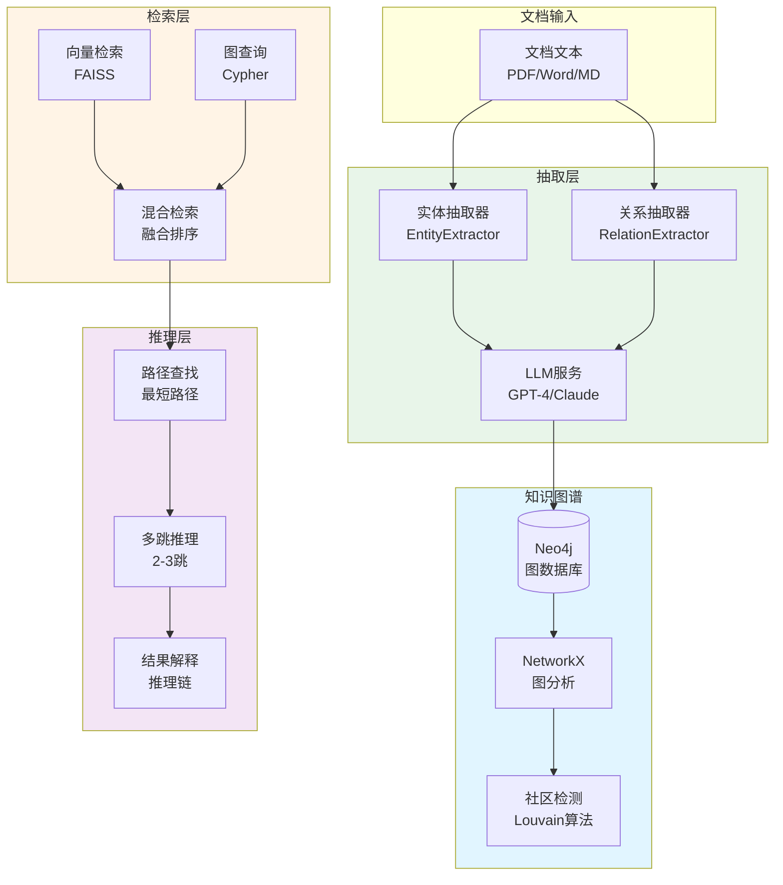
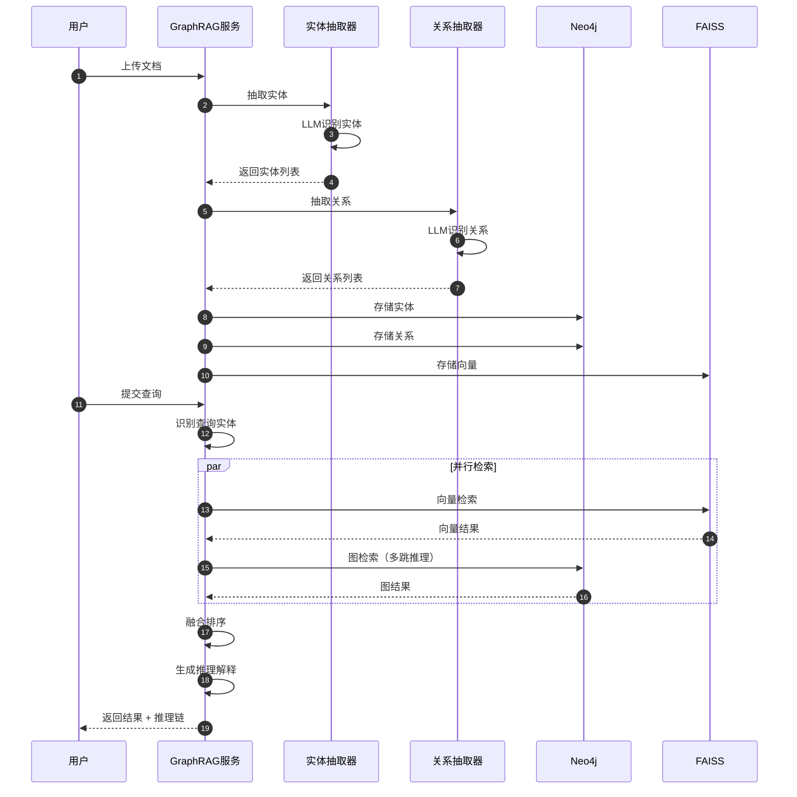

# VoiceHelper-03-GraphRAG模块

## 模块概览

### 职责定位

GraphRAG（Graph-based Retrieval-Augmented Generation）是 VoiceHelper 的知识图谱检索引擎，提供比传统 RAG 更强的语义理解和推理能力：

- **实体提取**：从文档中抽取人物、组织、地点、概念等实体
- **关系抽取**：识别实体间的关系（属于、包含、依赖等）
- **知识图谱构建**：基于 Neo4j 构建实体关系图
- **图推理**：多跳推理、路径查找、社区检测
- **混合检索**：向量检索（FAISS）+ 图检索（Neo4j）

### 核心优势

| 特性 | 传统 RAG | GraphRAG |
|---|---|---|
| 检索方式 | 向量相似度 | 向量 + 图结构 |
| 推理能力 | 弱 | 强（多跳推理） |
| 关系理解 | 无 | 有（实体关系） |
| 复杂查询 | 难 | 易（图查询） |
| 社区检测 | 无 | 有（Louvain算法） |

---

## 模块架构图



---

## 核心数据结构

### 1. 实体结构

```python
@dataclass
class Entity:
    """实体"""
    id: str  # 实体唯一ID
    name: str  # 实体名称
    type: str  # 实体类型（人物、组织、地点、概念等）
    attributes: Dict[str, Any]  # 属性字典
    embedding: Optional[np.ndarray]  # 向量表示
```

**实体类型**：
- 人物（Person）
- 组织（Organization）
- 地点（Location）
- 时间（Time）
- 概念（Concept）
- 产品（Product）
- 事件（Event）
- 技术（Technology）

### 2. 关系结构

```python
@dataclass
class Relation:
    """关系"""
    source_id: str  # 源实体ID
    target_id: str  # 目标实体ID
    relation_type: str  # 关系类型
    confidence: float  # 置信度（0-1）
    attributes: Dict[str, Any]  # 关系属性（如证据文本）
```

**关系类型**：
- 属于（BelongsTo）
- 包含（Contains）
- 位于（LocatedIn）
- 创建（Created）
- 使用（Uses）
- 依赖（DependsOn）
- 相关（RelatedTo）

### 3. 图路径结构

```python
@dataclass
class GraphPath:
    """图路径（多跳推理结果）"""
    nodes: List[str]  # 路径节点列表
    edges: List[Tuple[str, str, str]]  # 路径边列表
    score: float  # 路径得分
    explanation: Optional[str]  # 推理解释
```

---

## 核心功能详解

### 1. 实体抽取

**功能**：从文档中识别并提取实体

**核心代码**：

```python
class EntityExtractor:
    """实体抽取器"""
    
    async def extract_entities(self, text: str) -> List[Entity]:
        """从文本中抽取实体"""
        # 1. 构建提示词
        prompt = f"""从以下文本中抽取所有重要实体：

文本：{text}

实体类型：人物、组织、地点、时间、概念、产品、事件、技术

以JSON格式输出：
[
    {{
        "name": "实体名称",
        "type": "实体类型",
        "context": "上下文",
        "attributes": {{}}
    }}
]
"""
        
        # 2. 调用 LLM 抽取
        response = await self.llm.generate(prompt)
        
        # 3. 解析 JSON 结果
        entities_data = json.loads(response)
        
        # 4. 创建实体对象
        entities = []
        for data in entities_data:
            entity = Entity(
                id=self._generate_entity_id(data["name"], data["type"]),
                name=data["name"],
                type=data["type"],
                attributes=data.get("attributes", {})
            )
            entities.append(entity)
        
        return entities
```

### 2. 关系抽取

**功能**：识别实体间的关系

**核心代码**：

```python
class RelationExtractor:
    """关系抽取器"""
    
    async def extract_relations(
        self,
        entities: List[Entity],
        text: str
    ) -> List[Relation]:
        """抽取实体间关系"""
        entity_names = [e.name for e in entities]
        
        # 1. 构建提示词
        prompt = f"""分析实体间的关系：

实体：{', '.join(entity_names)}
原文：{text}

关系类型：属于、包含、位于、创建、使用、依赖、相关

以JSON格式输出：
[
    {{
        "source": "源实体",
        "target": "目标实体",
        "relation": "关系类型",
        "confidence": 0.9,
        "evidence": "文本证据"
    }}
]
"""
        
        # 2. 调用 LLM
        response = await self.llm.generate(prompt)
        
        # 3. 解析并创建关系对象
        relations_data = json.loads(response)
        relations = []
        
        for data in relations_data:
            relation = Relation(
                source_id=entity_map[data["source"]].id,
                target_id=entity_map[data["target"]].id,
                relation_type=data["relation"],
                confidence=data.get("confidence", 0.8),
                attributes={"evidence": data.get("evidence", "")}
            )
            relations.append(relation)
        
        return relations
```

### 3. 知识图谱构建

**功能**：将实体和关系存入 Neo4j

**核心代码**：

```python
class KnowledgeGraph:
    """知识图谱"""
    
    async def add_entities(self, entities: List[Entity]):
        """添加实体到图谱"""
        async with self.neo4j_driver.session() as session:
            for entity in entities:
                # Cypher 查询
                query = """
                MERGE (e:Entity {id: $id})
                SET e.name = $name,
                    e.type = $type,
                    e.attributes = $attributes
                RETURN e
                """
                
                await session.run(query, {
                    "id": entity.id,
                    "name": entity.name,
                    "type": entity.type,
                    "attributes": json.dumps(entity.attributes)
                })
    
    async def add_relations(self, relations: List[Relation]):
        """添加关系到图谱"""
        async with self.neo4j_driver.session() as session:
            for relation in relations:
                # 创建关系
                query = """
                MATCH (source:Entity {id: $source_id})
                MATCH (target:Entity {id: $target_id})
                MERGE (source)-[r:RELATION {type: $relation_type}]->(target)
                SET r.confidence = $confidence,
                    r.attributes = $attributes
                RETURN r
                """
                
                await session.run(query, {
                    "source_id": relation.source_id,
                    "target_id": relation.target_id,
                    "relation_type": relation.relation_type,
                    "confidence": relation.confidence,
                    "attributes": json.dumps(relation.attributes)
                })
```

### 4. 图推理查询

**功能**：多跳推理，查找实体间的路径

**核心代码**：

```python
async def find_paths(
    self,
    source_entity: str,
    target_entity: str,
    max_hops: int = 3
) -> List[GraphPath]:
    """查找实体间的路径（多跳推理）"""
    query = """
    MATCH path = (source:Entity {name: $source_name})
                 -[*1..{max_hops}]-
                 (target:Entity {name: $target_name})
    RETURN path,
           length(path) as hop_count,
           [r in relationships(path) | type(r)] as relations
    ORDER BY hop_count ASC
    LIMIT 10
    """.format(max_hops=max_hops)
    
    async with self.neo4j_driver.session() as session:
        result = await session.run(query, {
            "source_name": source_entity,
            "target_name": target_entity
        })
        
        paths = []
        async for record in result:
            path = record["path"]
            relations = record["relations"]
            
            # 构建路径对象
            graph_path = GraphPath(
                nodes=[node["name"] for node in path.nodes],
                edges=[(
                    path.nodes[i]["name"],
                    path.nodes[i+1]["name"],
                    relations[i]
                ) for i in range(len(relations))],
                score=self._calculate_path_score(path),
                explanation=self._generate_explanation(path, relations)
            )
            paths.append(graph_path)
        
        return paths

def _generate_explanation(self, path, relations) -> str:
    """生成推理解释"""
    explanation_parts = []
    
    for i in range(len(relations)):
        source = path.nodes[i]["name"]
        target = path.nodes[i+1]["name"]
        relation = relations[i]
        
        explanation_parts.append(
            f"{source} {relation} {target}"
        )
    
    return " → ".join(explanation_parts)
```

### 5. 混合检索

**功能**：结合向量检索和图检索

**核心代码**：

```python
async def hybrid_retrieve(
    self,
    query: str,
    top_k: int = 10
) -> List[Dict]:
    """混合检索"""
    # 1. 向量检索
    query_embedding = await self.embedding_service.embed(query)
    vector_results = await self.faiss_index.search(query_embedding, k=top_k)
    
    # 2. 图检索（查找相关实体）
    query_entities = await self.extract_entities(query)
    graph_results = await self._graph_search(query_entities, depth=2)
    
    # 3. 融合排序
    combined_results = self._merge_results(vector_results, graph_results)
    
    # 4. 重排序
    reranked_results = self._rerank(combined_results, query)
    
    return reranked_results[:top_k]

def _merge_results(
    self,
    vector_results: List,
    graph_results: List
) -> List:
    """融合向量检索和图检索结果"""
    result_map = {}
    
    # 向量检索结果（权重 0.6）
    for i, result in enumerate(vector_results):
        doc_id = result["id"]
        score = result["score"]
        result_map[doc_id] = {
            "doc_id": doc_id,
            "content": result["content"],
            "vector_score": score * 0.6,
            "graph_score": 0
        }
    
    # 图检索结果（权重 0.4）
    for result in graph_results:
        doc_id = result["id"]
        score = result["score"]
        
        if doc_id in result_map:
            result_map[doc_id]["graph_score"] = score * 0.4
        else:
            result_map[doc_id] = {
                "doc_id": doc_id,
                "content": result["content"],
                "vector_score": 0,
                "graph_score": score * 0.4
            }
    
    # 计算总分
    for doc_id in result_map:
        result_map[doc_id]["total_score"] = (
            result_map[doc_id]["vector_score"] +
            result_map[doc_id]["graph_score"]
        )
    
    # 排序
    sorted_results = sorted(
        result_map.values(),
        key=lambda x: x["total_score"],
        reverse=True
    )
    
    return sorted_results
```

---

## 完整流程时序图



---

## 使用示例

### 示例：文档索引与查询

```python
from core.graph_rag import GraphRAGService

# 初始化 GraphRAG 服务
graph_rag = GraphRAGService(
    neo4j_uri="bolt://localhost:7687",
    neo4j_user="neo4j",
    neo4j_password="password"
)

# 1. 索引文档
document = """
VoiceHelper 是由张三创建的 AI 语音助手平台。
该平台使用 OpenAI 的 Whisper 模型进行语音识别。
张三是 TechCorp 公司的 CTO。
"""

await graph_rag.index_document(document)

# 2. 查询
query = "谁创建了 VoiceHelper？"
results = await graph_rag.query(query, include_reasoning=True)

# 输出结果
for result in results:
    print(f"答案: {result['answer']}")
    print(f"推理链: {result['reasoning_path']}")
    # 推理链: VoiceHelper ← 创建 ← 张三

# 3. 多跳推理
query = "VoiceHelper 的创建者在哪家公司工作？"
results = await graph_rag.query(query)

# 推理链: VoiceHelper ← 创建 ← 张三 → 工作于 → TechCorp
```

---

## 性能优化

1. **批量处理**：批量插入实体和关系
2. **索引优化**：Neo4j 实体 ID 和名称建立索引
3. **缓存策略**：缓存常见查询的图路径
4. **并行检索**：向量检索和图检索并行执行

---

**文档版本**：v1.0  
**最后更新**：2025-01-08  
**维护者**：VoiceHelper 团队

