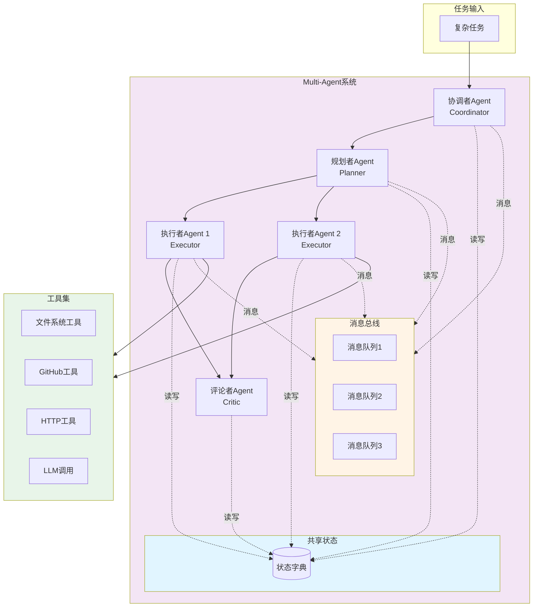
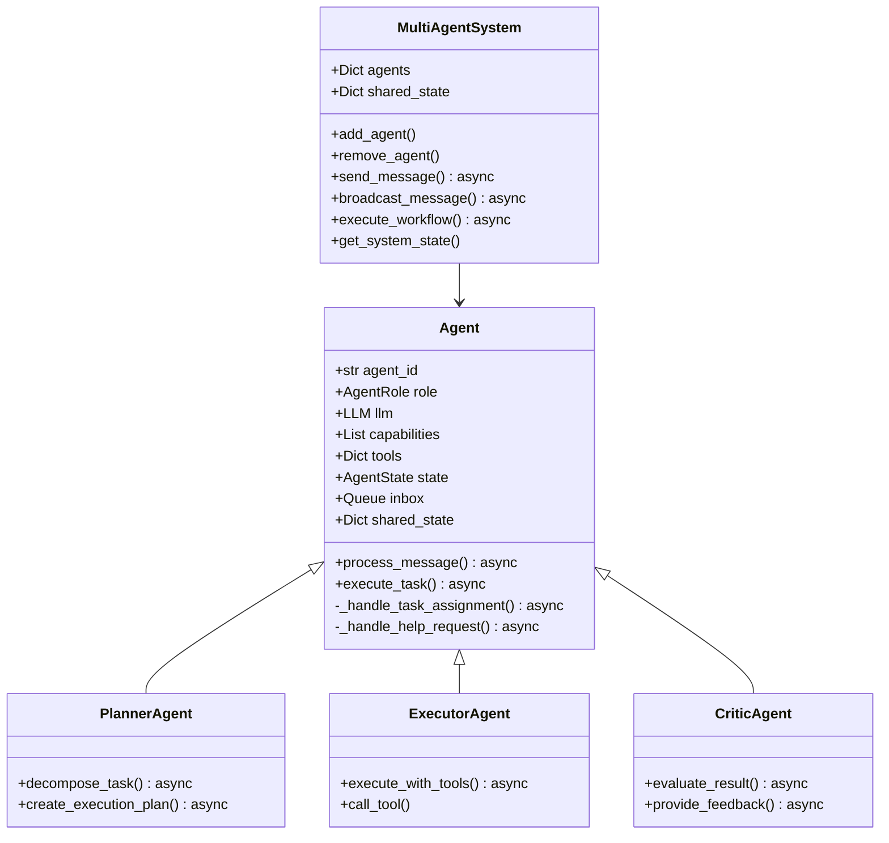
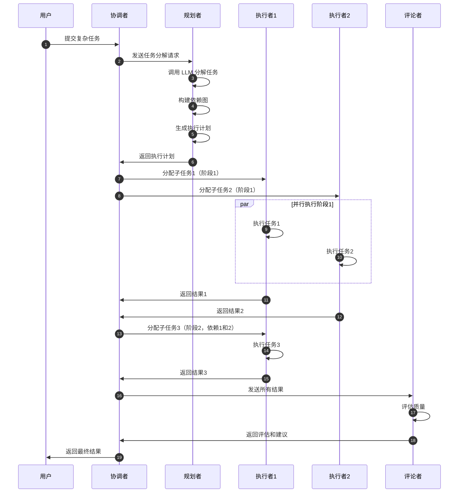

# VoiceHelper-04-MultiAgent模块

## 模块概览

### 职责定位

Multi-Agent 模块是 VoiceHelper 的智能协作引擎，负责：

- **任务规划**：将复杂任务分解为可执行的子任务
- **任务分配**：根据 Agent 能力分配任务
- **并行执行**：多个 Agent 并行处理任务
- **消息传递**：Agent 之间通过消息进行协作
- **状态共享**：共享状态实现协作决策
- **反思优化**：Critic Agent 对结果进行评估和优化

### 输入输出

**输入**：
- 用户复杂任务（多步骤、需要多种能力）
- Agent 配置（角色、能力、工具）
- 共享状态

**输出**：
- 任务执行结果
- 执行过程日志
- Agent 协作记录

### 上下游依赖

**上游**：算法服务、V01ChatEngine

**下游**：
- LLM API（OpenAI、Claude）
- MCP 工具（文件系统、GitHub、HTTP）
- Redis（共享状态）

---

## 模块架构图



### 架构说明

**Agent 角色**：
- **Coordinator（协调者）**：接收任务，协调其他 Agent
- **Planner（规划者）**：任务分解、依赖分析、执行计划
- **Executor（执行者）**：执行具体任务、调用工具
- **Critic（评论者）**：结果评估、错误纠正、反思优化
- **Specialist（专家）**：领域专家，提供专业建议

**消息传递**：
- 每个 Agent 有独立的消息队列（asyncio.Queue）
- 消息类型：任务分配、状态更新、请求帮助、提供信息、决策、反馈
- 支持点对点消息和广播消息

**共享状态**：
- 所有 Agent 共享一个字典对象（引用传递）
- 用于存储中间结果、上下文信息
- 无锁设计，依赖 Python GIL

**工具集成**：
- Agent 可以调用外部工具（文件系统、API、数据库）
- 工具以函数形式注册
- 支持同步和异步工具

---

## 核心数据结构

### 1. Agent 消息结构

```python
@dataclass
class AgentMessage:
    """Agent消息"""
    id: str  # 消息 ID
    sender_id: str  # 发送者 Agent ID
    receiver_id: str  # 接收者 Agent ID（"broadcast" 表示广播）
    type: MessageType  # 消息类型
    content: Any  # 消息内容
    metadata: Dict[str, Any]  # 元数据
    timestamp: float  # 时间戳
```

**消息类型**：

```python
class MessageType(Enum):
    TASK_ASSIGNMENT = "task_assignment"  # 任务分配
    STATUS_UPDATE = "status_update"      # 状态更新
    REQUEST_HELP = "request_help"        # 请求帮助
    PROVIDE_INFO = "provide_info"        # 提供信息
    DECISION = "decision"                # 决策
    FEEDBACK = "feedback"                # 反馈
```

### 2. Agent 状态结构

```python
@dataclass
class AgentState:
    """Agent状态"""
    agent_id: str  # Agent ID
    role: AgentRole  # 角色
    status: str  # 状态：idle、working、waiting、blocked
    current_task: Optional[str]  # 当前任务
    capabilities: List[str]  # 能力列表
    metadata: Dict[str, Any]  # 元数据
```

**角色定义**：

```python
class AgentRole(Enum):
    COORDINATOR = "coordinator"  # 协调者
    PLANNER = "planner"          # 规划者
    EXECUTOR = "executor"        # 执行者
    CRITIC = "critic"            # 评论者/反思者
    SPECIALIST = "specialist"    # 专家
```

### 3. Agent 类结构



---

## 核心功能详解

### 1. 任务规划（Planner Agent）

**功能**：将复杂任务分解为可执行的子任务

**核心代码**：

```python
class PlannerAgent(Agent):
    """规划者Agent"""
    
    async def decompose_task(self, task: str) -> List[Dict[str, Any]]:
        """
        任务分解
        
        Args:
            task: 原始任务描述
            
        Returns:
            List[Dict]: 子任务列表
        """
        # 1. 构建规划提示词
        prompt = f"""作为任务规划者，请将以下复杂任务分解为可执行的子任务：

任务: {task}

要求：
1. 每个子任务应该是独立的、可执行的
2. 明确子任务之间的依赖关系
3. 为每个子任务指定合适的执行者类型
4. 估算每个子任务的难度和时间

请以JSON格式返回：
{{
  "subtasks": [
    {{
      "id": "task_1",
      "description": "子任务描述",
      "executor_type": "executor",
      "dependencies": [],
      "difficulty": "medium",
      "estimated_time": "5min"
    }}
  ]
}}
"""
        
        # 2. 调用 LLM 生成计划
        response = await self.llm.chat_completion(
            messages=[{"role": "user", "content": prompt}],
            temperature=0.3  # 较低温度，保证一致性
        )
        
        # 3. 解析 JSON 响应
        plan = json.loads(response)
        subtasks = plan["subtasks"]
        
        # 4. 保存到共享状态
        if self.shared_state:
            self.shared_state["task_plan"] = subtasks
        
        return subtasks
    
    async def create_execution_plan(
        self,
        subtasks: List[Dict[str, Any]]
    ) -> List[List[str]]:
        """
        创建执行计划（考虑依赖关系）
        
        Args:
            subtasks: 子任务列表
            
        Returns:
            List[List[str]]: 执行阶段列表（每阶段可并行执行的任务）
        """
        # 构建依赖图
        task_graph = {task["id"]: task["dependencies"] for task in subtasks}
        
        # 拓扑排序
        execution_stages = []
        completed = set()
        
        while len(completed) < len(subtasks):
            # 找出所有依赖已满足的任务
            ready_tasks = [
                task["id"] for task in subtasks
                if task["id"] not in completed and
                all(dep in completed for dep in task_graph[task["id"]])
            ]
            
            if not ready_tasks:
                raise ValueError("检测到循环依赖")
            
            execution_stages.append(ready_tasks)
            completed.update(ready_tasks)
        
        return execution_stages
```

**时序图**：



### 2. 任务执行（Executor Agent）

**功能**：执行具体任务，可调用工具

**核心代码**：

```python
class ExecutorAgent(Agent):
    """执行者Agent"""
    
    async def execute_with_tools(self, task: str) -> Any:
        """
        使用工具执行任务
        
        Args:
            task: 任务描述
            
        Returns:
            Any: 执行结果
        """
        # 1. 分析任务是否需要工具
        tool_analysis_prompt = f"""分析以下任务是否需要使用工具：

任务: {task}

可用工具: {list(self.tools.keys())}

请判断：
1. 是否需要使用工具？
2. 如果需要，使用哪个工具？
3. 工具的参数是什么？

以JSON格式返回：
{{
  "needs_tool": true/false,
  "tool_name": "tool_name",
  "tool_params": {{...}}
}}
"""
        
        analysis = await self.llm.chat_completion(
            messages=[{"role": "user", "content": tool_analysis_prompt}]
        )
        
        result_json = json.loads(analysis)
        
        # 2. 执行任务
        if result_json["needs_tool"]:
            # 使用工具执行
            tool_name = result_json["tool_name"]
            tool_params = result_json["tool_params"]
            
            if tool_name not in self.tools:
                raise ValueError(f"工具不存在: {tool_name}")
            
            tool_func = self.tools[tool_name]
            tool_result = await self._call_tool(tool_func, tool_params)
            
            # 3. 基于工具结果生成最终回答
            final_prompt = f"""基于工具执行结果回答任务：

任务: {task}
工具: {tool_name}
工具结果: {tool_result}

请给出最终回答：
"""
            
            final_result = await self.llm.chat_completion(
                messages=[{"role": "user", "content": final_prompt}]
            )
            
            return {
                "type": "with_tool",
                "tool_used": tool_name,
                "tool_result": tool_result,
                "final_answer": final_result
            }
        else:
            # 直接使用 LLM 执行
            result = await self.llm.chat_completion(
                messages=[{"role": "user", "content": task}]
            )
            
            return {
                "type": "llm_only",
                "answer": result
            }
    
    async def _call_tool(self, tool_func: Callable, params: Dict) -> Any:
        """调用工具函数"""
        # 支持同步和异步工具
        if asyncio.iscoroutinefunction(tool_func):
            return await tool_func(**params)
        else:
            return await asyncio.to_thread(tool_func, **params)
```

### 3. 结果评估（Critic Agent）

**功能**：评估执行结果，提供改进建议

**核心代码**：

```python
class CriticAgent(Agent):
    """评论者/反思Agent"""
    
    async def evaluate_result(
        self,
        task: str,
        result: Any
    ) -> Dict[str, Any]:
        """
        评估结果
        
        Args:
            task: 原始任务
            result: 执行结果
            
        Returns:
            Dict: 评估结果
        """
        prompt = f"""作为质量评估者，请评估以下任务的执行结果：

原始任务: {task}

执行结果: {result}

请从以下维度评估：
1. 完整性：是否完整回答了任务要求？
2. 准确性：答案是否准确？
3. 相关性：答案是否相关？
4. 清晰度：表达是否清晰？

请以JSON格式返回：
{{
  "overall_score": 0-10,
  "completeness": 0-10,
  "accuracy": 0-10,
  "relevance": 0-10,
  "clarity": 0-10,
  "issues": ["问题1", "问题2"],
  "suggestions": ["建议1", "建议2"],
  "needs_revision": true/false
}}
"""
        
        evaluation = await self.llm.chat_completion(
            messages=[{"role": "user", "content": prompt}],
            temperature=0.2
        )
        
        eval_json = json.loads(evaluation)
        
        # 如果需要修订，生成改进建议
        if eval_json["needs_revision"]:
            eval_json["revision_plan"] = await self._create_revision_plan(
                task, result, eval_json["issues"]
            )
        
        return eval_json
    
    async def _create_revision_plan(
        self,
        task: str,
        result: Any,
        issues: List[str]
    ) -> Dict[str, Any]:
        """创建修订计划"""
        prompt = f"""基于以下问题，创建修订计划：

原始任务: {task}
当前结果: {result}
发现的问题: {issues}

请提供：
1. 需要重新执行哪些步骤？
2. 需要补充哪些信息？
3. 如何改进结果？

以JSON格式返回修订计划。
"""
        
        plan = await self.llm.chat_completion(
            messages=[{"role": "user", "content": prompt}]
        )
        
        return json.loads(plan)
```

---

## Multi-Agent 系统协调

### 系统类实现

```python
class MultiAgentSystem:
    """Multi-Agent协作系统"""
    
    def __init__(self):
        self.agents: Dict[str, Agent] = {}
        self.shared_state: Dict[str, Any] = {}
        self.message_history: List[AgentMessage] = []
    
    def add_agent(self, agent: Agent):
        """添加Agent"""
        self.agents[agent.agent_id] = agent
        agent.shared_state = self.shared_state
    
    async def send_message(self, message: AgentMessage):
        """发送消息"""
        if message.receiver_id == "broadcast":
            # 广播消息
            for agent in self.agents.values():
                if agent.agent_id != message.sender_id:
                    await agent.inbox.put(message)
        else:
            # 点对点消息
            receiver = self.agents.get(message.receiver_id)
            if receiver:
                await receiver.inbox.put(message)
        
        self.message_history.append(message)
    
    async def execute_workflow(self, task: str) -> Dict[str, Any]:
        """
        执行完整工作流
        
        Args:
            task: 用户任务
            
        Returns:
            Dict: 执行结果
        """
        # 1. 规划阶段
        planner = self._get_agent_by_role(AgentRole.PLANNER)
        subtasks = await planner.decompose_task(task)
        execution_plan = await planner.create_execution_plan(subtasks)
        
        # 2. 执行阶段（按阶段并行执行）
        all_results = {}
        
        for stage_idx, stage_tasks in enumerate(execution_plan):
            # 并行执行当前阶段的所有任务
            stage_coroutines = []
            
            for task_id in stage_tasks:
                subtask = next(t for t in subtasks if t["id"] == task_id)
                executor = self._get_available_executor()
                
                coro = self._execute_subtask(executor, subtask)
                stage_coroutines.append(coro)
            
            # 等待当前阶段完成
            stage_results = await asyncio.gather(*stage_coroutines)
            
            for task_id, result in zip(stage_tasks, stage_results):
                all_results[task_id] = result
        
        # 3. 评估阶段
        critic = self._get_agent_by_role(AgentRole.CRITIC)
        evaluation = await critic.evaluate_result(task, all_results)
        
        # 4. 返回结果
        return {
            "task": task,
            "execution_plan": execution_plan,
            "results": all_results,
            "evaluation": evaluation,
            "message_count": len(self.message_history)
        }
```

---

## 使用示例

### 示例 1：代码分析与重构

```python
# 创建 Multi-Agent 系统
system = MultiAgentSystem()

# 添加 Agent
planner = PlannerAgent("planner_1", AgentRole.PLANNER, llm_client)
executor1 = ExecutorAgent("executor_1", AgentRole.EXECUTOR, llm_client, tools={
    "read_file": read_file_tool,
    "write_file": write_file_tool,
})
executor2 = ExecutorAgent("executor_2", AgentRole.EXECUTOR, llm_client)
critic = CriticAgent("critic_1", AgentRole.CRITIC, llm_client)

system.add_agent(planner)
system.add_agent(executor1)
system.add_agent(executor2)
system.add_agent(critic)

# 执行任务
task = """分析 app.py 文件，找出性能问题并提供优化建议：
1. 识别性能瓶颈
2. 提供具体的代码优化方案
3. 生成优化后的代码
"""

result = await system.execute_workflow(task)

print(f"执行计划: {result['execution_plan']}")
print(f"执行结果: {result['results']}")
print(f"质量评分: {result['evaluation']['overall_score']}")
```

---

## 最佳实践

1. **Agent 能力明确**：每个 Agent 应有清晰的职责和能力边界
2. **消息设计简洁**：消息内容应简洁明确，避免传递大量数据
3. **异常处理完善**：每个 Agent 都应有完善的异常处理
4. **并发控制**：限制并行 Agent 数量，避免资源耗尽
5. **状态可观测**：记录详细的执行日志和消息历史

---

**文档版本**：v1.0  
**最后更新**：2025-01-08  
**维护者**：VoiceHelper 团队

