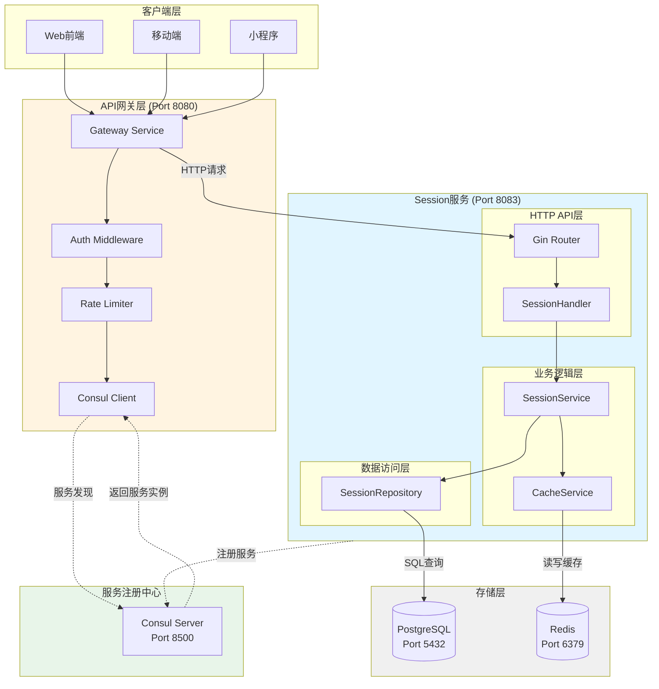
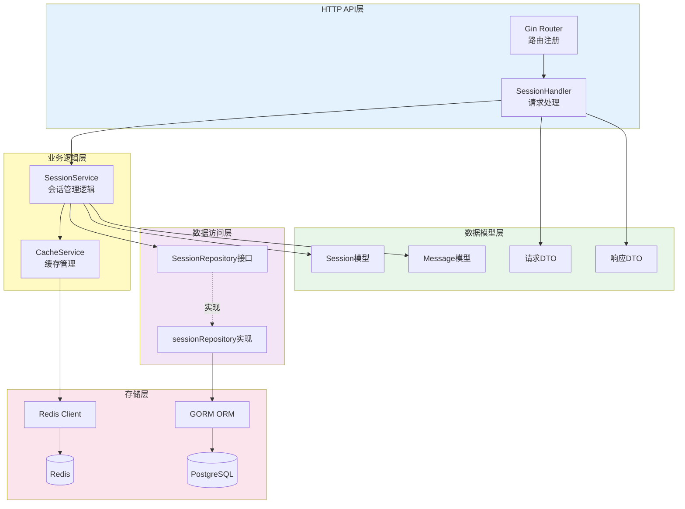
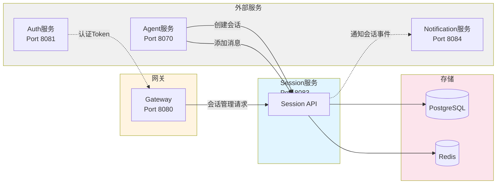
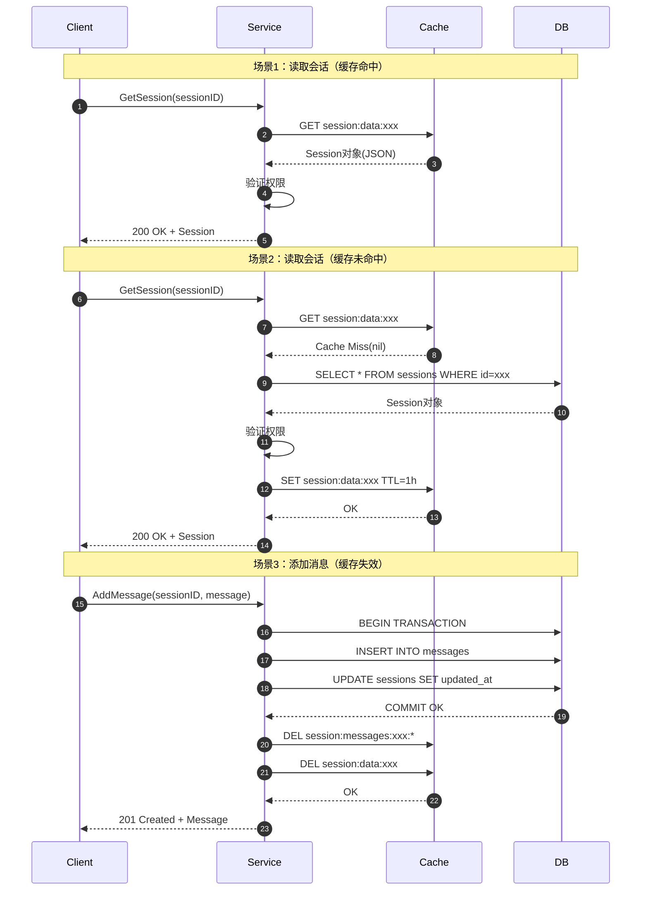
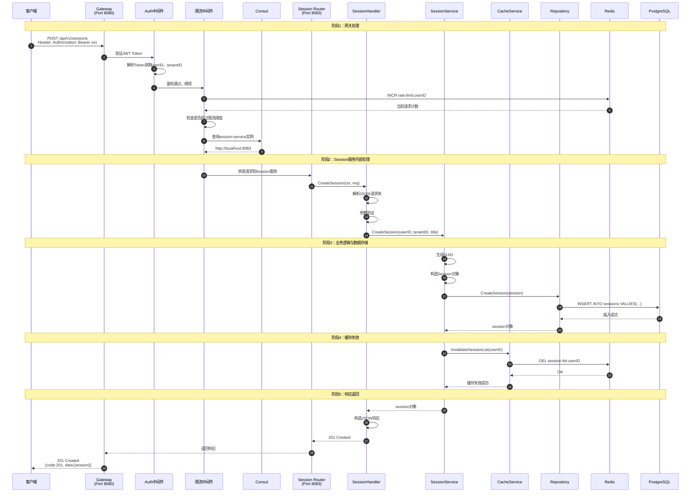
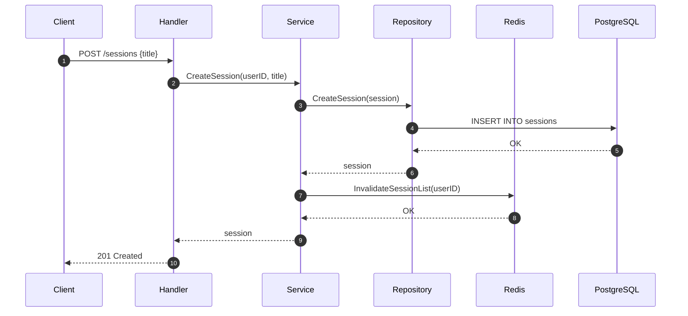
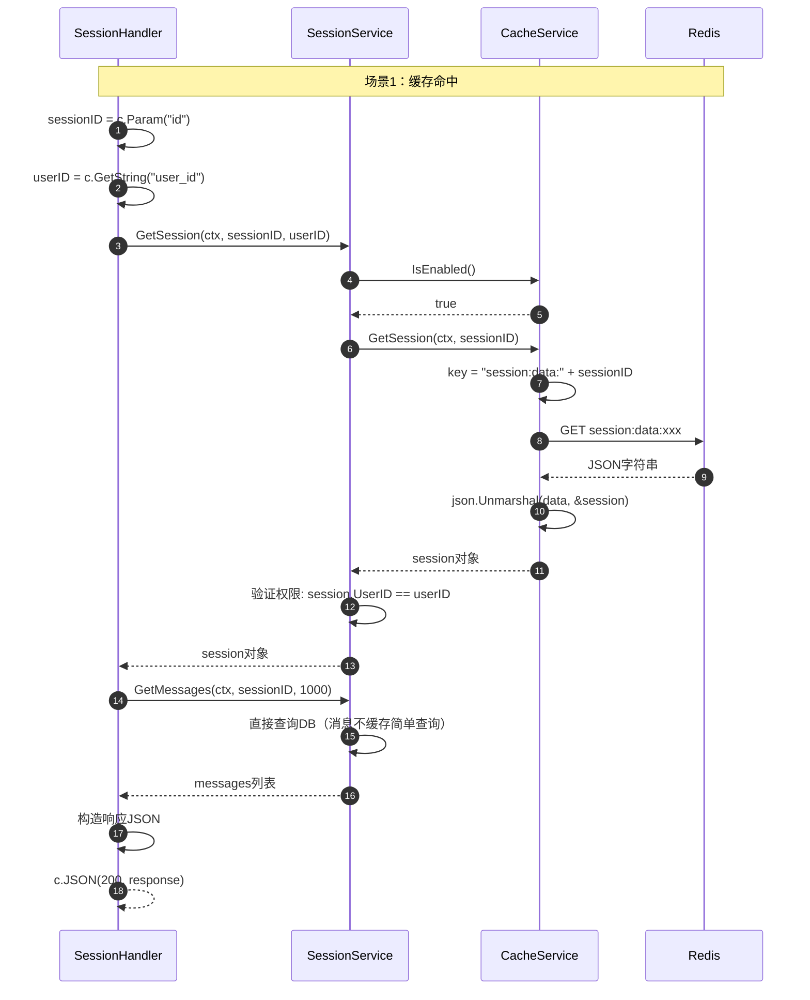
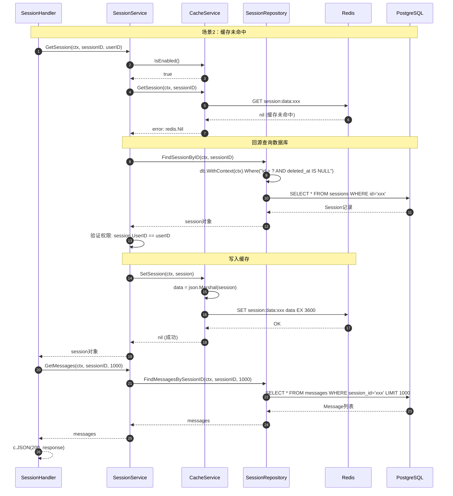
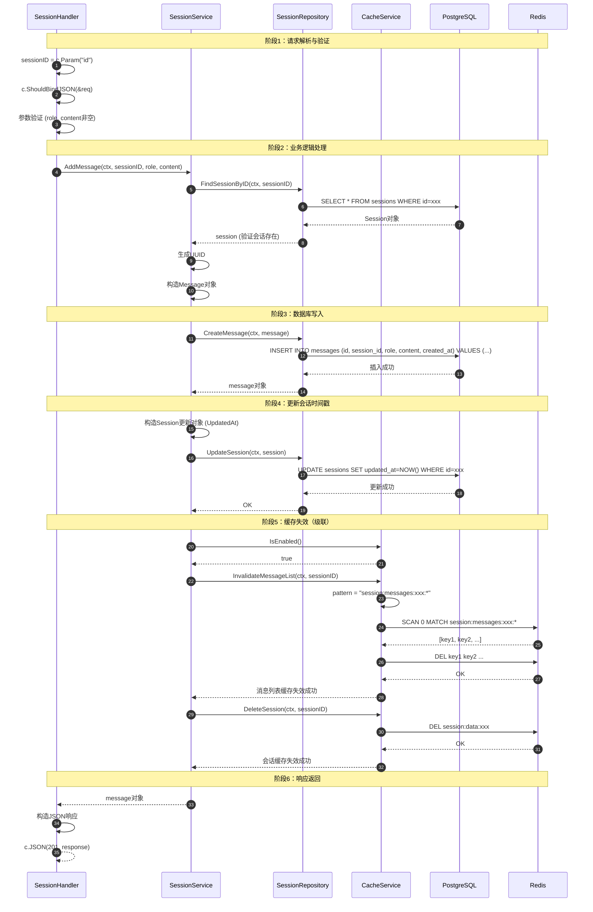

# VoiceHelper-04-Session会话服务

## 文档信息
- **模块名称**：Session会话服务
- **版本**：v0.8.2
- **生成时间**：2025-10-10
- **服务端口**：8083
- **技术栈**：Go 1.21+、Gin、GORM、PostgreSQL、Redis

---

## 一、模块概览

### 1.1 职责边界

Session会话服务是VoiceHelper项目中负责对话会话管理的核心微服务，提供会话生命周期管理和消息存储功能。

**核心职责**：
- **会话管理**：创建、查询、列表、删除会话
- **消息管理**：添加消息、获取消息、搜索消息
- **上下文维护**：会话上下文存储与更新
- **缓存优化**：Redis三级缓存（会话、会话列表、消息列表）
- **过期管理**：会话TTL设置与过期检查
- **权限控制**：用户级隔离，仅所有者可访问

**非职责**：
- 对话生成（由Agent服务负责）
- 用户认证（由Auth服务负责）
- 实时通知（由Notification服务负责）

### 1.2 整体系统架构



**系统架构说明**：

1. **客户端层**：Web、移动端、小程序等多种客户端通过统一的API网关访问服务
2. **API网关层（Port 8080）**：
   - **请求路由**：根据URL路径路由到不同微服务
   - **认证鉴权**：JWT Token验证、RBAC权限检查
   - **限流保护**：基于Redis的分布式限流
   - **服务发现**：通过Consul发现Session服务实例
   
3. **Session服务（Port 8083）**：
   - **HTTP API层**：Gin框架处理HTTP请求
   - **业务逻辑层**：会话管理核心逻辑、缓存策略
   - **数据访问层**：GORM封装的数据库操作
   
4. **存储层**：
   - **PostgreSQL**：持久化会话和消息数据
   - **Redis**：三级缓存（会话/会话列表/消息列表）
   
5. **服务注册中心**：
   - **Consul**：服务注册、健康检查、服务发现

---

### 1.3 模块内部架构



**模块架构特点**：

1. **分层清晰**：
   - **API层**：负责HTTP请求解析、参数验证、响应构建
   - **Service层**：实现核心业务逻辑、缓存策略、权限检查
   - **Repository层**：封装数据访问、提供接口抽象
   - **Model层**：定义数据结构、DTO转换

2. **依赖方向**：
   - 单向依赖，上层依赖下层
   - Repository通过接口解耦，便于测试和替换实现

3. **缓存优先策略**：
   - 读操作：缓存命中→返回；缓存未命中→查DB→写缓存→返回
   - 写操作：写DB→失效缓存→返回

4. **优雅降级**：
   - Redis不可用时自动降级到纯数据库模式
   - 不影响核心功能可用性

---

### 1.4 服务间交互架构



**服务交互说明**：

1. **Auth服务 → Gateway**：提供JWT Token验证
2. **Gateway → Session服务**：路由所有会话管理请求
3. **Agent服务 → Session服务**：
   - 创建对话会话
   - 添加用户消息和AI回复
4. **Session服务 → Notification服务**：
   - 会话创建事件通知
   - 消息添加事件通知（未来扩展）

### 1.5 缓存策略详解

Session服务采用三级缓存策略，通过Redis加速数据访问，降低数据库压力。



**三级缓存设计**：

| 缓存类型 | Key格式 | TTL | 读场景 | 失效时机 |
|---|---|---|---|---|
| **会话缓存** | `session:data:{sessionID}` | 1小时 | 获取会话详情 | 更新会话、添加消息、删除会话 |
| **会话列表缓存** | `session:list:{userID}` | 10分钟 | 列出用户会话 | 创建会话、删除会话 |
| **消息列表缓存** | `session:messages:{sessionID}:page-{page}-size-{size}` | 30分钟 | 分页获取消息 | 添加消息 |

**缓存策略原则**：

1. **读多写少优化**：
   - 会话数据变更频率低 → TTL 1小时
   - 会话列表变更频繁（创建/删除）→ TTL 10分钟
   - 消息列表持续增长 → TTL 30分钟

2. **写失效策略**：
   - **精准失效**：只失效受影响的缓存Key
   - **级联失效**：添加消息同时失效会话缓存（因为`updated_at`变了）

3. **缓存穿透保护**：
   - 不存在的会话查询直接返回404，不查数据库
   - 权限验证在Service层统一处理

4. **缓存降级**：
   - Redis连接失败时自动禁用缓存
   - 所有请求直接访问数据库
   - 不影响核心功能可用性

---

## 二、对外API规格

### 2.1 API列表

| API | 方法 | 路径 | 说明 | 缓存 |
|---|---|---|---|---|
| 创建会话 | POST | /api/v1/sessions | 创建新会话 | 写入+失效列表缓存 |
| 获取会话 | GET | /api/v1/sessions/:id | 获取会话详情+消息 | 读缓存 |
| 列表会话 | GET | /api/v1/sessions | 列出用户所有会话 | 读缓存 |
| 删除会话 | DELETE | /api/v1/sessions/:id | 删除会话 | 失效所有相关缓存 |
| 添加消息 | POST | /api/v1/sessions/:id/messages | 添加消息到会话 | 失效消息列表缓存 |
| 更新上下文 | PUT | /api/v1/sessions/:id/context | 更新会话上下文 | 失效会话缓存 |

---

### 2.2 完整请求链路（从Gateway到Session服务）

本节详细分析从客户端发起请求到Session服务返回响应的完整调用链路。



**调用链路说明**：

#### 阶段1：网关处理（Gateway Layer）

1. **接收请求**（行1）：
   - 客户端发送HTTP POST请求到`http://gateway:8080/api/v1/sessions`
   - 请求头包含JWT Token：`Authorization: Bearer eyJhbGc...`
   
2. **JWT认证**（行2-3）：
   - `AuthMiddleware`拦截请求
   - 验证JWT Token签名和有效期
   - 从Token Payload中提取`userID`、`tenantID`、`role`等信息
   - 将用户信息注入到`gin.Context`：`c.Set("user_id", userID)`
   
3. **限流检查**（行4-6）：
   - `RateLimitMiddleware`从Redis读取用户请求计数
   - 使用滑动窗口算法检查是否超过限流阈值（默认100 req/min）
   - 超限则返回429 Too Many Requests

4. **服务发现**（行7-8）：
   - Gateway通过Consul Client查询`session-service`的健康实例
   - Consul返回可用实例地址：`http://localhost:8083`（开发环境）

#### 阶段2：Session服务内部处理（Handler Layer）

5. **路由匹配**（行9-10）：
   - Gin Router根据路径`POST /api/v1/sessions`匹配到`SessionHandler.CreateSession`
   - 调用Handler方法

6. **请求解析与验证**（行11-13）：
   - 使用`c.ShouldBindJSON(&req)`解析请求体
   - Gin自动执行参数验证（binding tag）
   - 验证失败返回400 Bad Request

#### 阶段3：业务逻辑与数据存储（Service + Repository Layer）

7. **业务逻辑处理**（行14-16）：
   - `SessionService.CreateSession`执行核心业务逻辑
   - 生成UUID作为会话ID
   - 构造`Session`对象，设置默认值（status=active, created_at, updated_at）

8. **数据持久化**（行17-20）：
   - `SessionRepository.CreateSession`调用GORM
   - GORM生成SQL：`INSERT INTO sessions (id, user_id, ...) VALUES (...)`
   - PostgreSQL执行插入并返回结果

#### 阶段4：缓存管理（Cache Layer）

9. **缓存失效**（行21-24）：
   - 创建会话后，用户的会话列表已变更
   - 调用`CacheService.InvalidateSessionList(userID)`
   - Redis执行`DEL session:list:{userID}`
   - 下次查询会话列表时会重新加载

#### 阶段5：响应返回

10. **构造响应**（行25-29）：
    - Handler将`session`对象封装为JSON响应
    - 返回201 Created状态码
    - 响应格式：`{code: 201, message: "...", data: {session: {...}}}`

---

**关键代码路径**：

```text
客户端请求
  ↓
Gateway:8080/api/v1/sessions (main.go)
  ↓
AuthMiddleware.Handle() (backend/internal/middleware/auth.go)
  ├─ JWT验证
  ├─ 解析userID/tenantID
  └─ c.Set("user_id", userID)
  ↓
RateLimitMiddleware (backend/pkg/middleware/ratelimit.go)
  ├─ Redis INCR计数
  └─ 检查限流阈值
  ↓
Consul服务发现 (backend/pkg/discovery/service_registry.go)
  └─ 查询session-service实例
  ↓
HTTP转发 → Session服务:8083
  ↓
SessionHandler.CreateSession() (services/session-service/internal/handler/session_handler.go:24)
  ├─ c.GetString("user_id") - 从上下文获取用户ID
  ├─ c.ShouldBindJSON(&req) - 解析请求
  └─ 调用Service
  ↓
SessionService.CreateSession() (services/session-service/internal/service/session_service.go:28)
  ├─ uuid.New().String() - 生成ID
  ├─ 构造Session对象
  └─ 调用Repository
  ↓
SessionRepository.CreateSession() (services/session-service/internal/repository/session_repository.go:47)
  └─ db.WithContext(ctx).Create(session)
  ↓
GORM → PostgreSQL
  └─ INSERT INTO sessions ...
  ↓
CacheService.InvalidateSessionList() (services/session-service/internal/service/cache_service.go:159)
  └─ redis.Del("session:list:" + userID)
  ↓
响应返回（逆向传播）
```

---

### 2.3 API详解

#### API 1: 创建会话

**基本信息**：
- **端点**：`POST /api/v1/sessions`
- **Content-Type**：`application/json`
- **幂等性**：否（每次创建新会话）

**请求结构体**：

```go
type CreateSessionRequest struct {
    Title string `json:"title"` // 会话标题（可选）
}
```

**请求示例**：
```json
{
  "title": "讨论项目需求"
}
```

**响应结构体**：

```go
type CreateSessionResponse struct {
    Code    int         `json:"code"`    // 201
    Message string      `json:"message"` // "Session created successfully"
    Data    SessionData `json:"data"`
}

type SessionData struct {
    Session Session `json:"session"`
}

type Session struct {
    ID        string     `json:"id"`           // 会话ID (UUID)
    UserID    string     `json:"user_id"`      // 用户ID
    TenantID  string     `json:"tenant_id"`    // 租户ID
    Title     string     `json:"title"`        // 会话标题
    Context   string     `json:"context,omitempty"` // 会话上下文(JSON)
    Status    string     `json:"status"`       // 状态(active/archived)
    ExpiresAt *time.Time `json:"expires_at,omitempty"` // 过期时间
    CreatedAt time.Time  `json:"created_at"`   // 创建时间
    UpdatedAt time.Time  `json:"updated_at"`   // 更新时间
}
```

**核心代码**：

```go
// Handler层
func (h *SessionHandler) CreateSession(c *gin.Context) {
    userID := c.GetString("user_id")
    tenantID := c.GetString("tenant_id")
    
    // 1. 解析请求
    var req model.CreateSessionRequest
    if err := c.ShouldBindJSON(&req); err != nil {
        c.JSON(http.StatusBadRequest, gin.H{"code": 400, "message": "Invalid request"})
        return
    }
    
    // 2. 调用Service创建会话
    session, err := h.sessionService.CreateSession(
        c.Request.Context(),
        userID,
        tenantID,
        req.Title,
    )
    if err != nil {
        c.JSON(http.StatusInternalServerError, gin.H{"code": 500, "message": "Failed to create session"})
        return
    }
    
    // 3. 返回成功响应
    c.JSON(http.StatusCreated, gin.H{
        "code":    201,
        "message": "Session created successfully",
        "data":    gin.H{"session": session},
    })
}

// Service层
func (s *SessionService) CreateSession(ctx context.Context, userID, tenantID, title string) (*model.Session, error) {
    // 1. 生成UUID
    session := &model.Session{
        ID:        uuid.New().String(),
        UserID:    userID,
        TenantID:  tenantID,
        Title:     title,
        Status:    "active",
        CreatedAt: time.Now(),
        UpdatedAt: time.Now(),
    }
    
    // 2. 保存到数据库
    if err := s.sessionRepo.CreateSession(ctx, session); err != nil {
        return nil, err
    }
    
    // 3. 失效用户会话列表缓存（因为列表已变更）
    if s.cacheService.IsEnabled() {
        s.cacheService.InvalidateSessionList(ctx, userID)
    }
    
    return session, nil
}
```

**时序图**：



---

#### API 2: 获取会话详情

**基本信息**：
- **端点**：`GET /api/v1/sessions/:id`
- **幂等性**：是
- **缓存**：优先从Redis读取

**响应结构体**：

```go
type GetSessionResponse struct {
    Code    int                `json:"code"`    // 200
    Message string             `json:"message"` // "Success"
    Data    SessionDetailData  `json:"data"`
}

type SessionDetailData struct {
    Session  Session   `json:"session"`  // 会话信息
    Messages []Message `json:"messages"` // 消息列表
}

type Message struct {
    ID        string    `json:"id"`           // 消息ID
    SessionID string    `json:"session_id"`   // 会话ID
    Role      string    `json:"role"`         // 角色(user/assistant/system)
    Content   string    `json:"content"`      // 消息内容
    Metadata  string    `json:"metadata,omitempty"` // 元数据(JSON)
    CreatedAt time.Time `json:"created_at"`   // 创建时间
}
```

**模块内部时序图（缓存命中场景）**：



**模块内部时序图（缓存未命中场景）**：



**核心代码逐行解析**：

```go
// Handler层 - 负责HTTP请求处理
func (h *SessionHandler) GetSession(c *gin.Context) {
    // 1. 从URL路径参数提取sessionID（来自/api/v1/sessions/:id）
    sessionID := c.Param("id")
    
    // 2. 从gin上下文获取userID（由AuthMiddleware注入）
    userID := c.GetString("user_id")
    if userID == "" {
        userID = "anonymous" // 开发环境降级处理
    }
    
    // 3. 调用Service层获取会话（带缓存逻辑）
    session, err := h.sessionService.GetSession(
        c.Request.Context(),  // 传递请求上下文（超时、取消）
        sessionID,
        userID,               // 用于权限验证
    )
    if err != nil {
        // 会话不存在或无权限访问
        c.JSON(http.StatusNotFound, gin.H{
            "code":    404,
            "message": "Session not found",
        })
        return
    }
    
    // 4. 获取会话的消息列表（最近1000条）
    messages, err := h.sessionService.GetMessages(
        c.Request.Context(),
        sessionID,
        1000,  // 限制返回消息数量，避免数据量过大
    )
    if err != nil {
        // 获取消息失败不应阻塞主流程
        // 返回空列表即可
        log.Printf("⚠️ 获取会话消息失败: %v, session_id: %s", err, sessionID)
        messages = []*model.Message{}
    }
    
    // 5. 构造成功响应
    c.JSON(http.StatusOK, gin.H{
        "code":    200,
        "message": "Success",
        "data": gin.H{
            "session":  session,   // 会话基本信息
            "messages": messages,  // 消息列表
        },
    })
}

// Service层 - 业务逻辑与缓存策略
func (s *SessionService) GetSession(ctx context.Context, sessionID, userID string) (*model.Session, error) {
    // 1. 检查缓存是否启用（Redis连接失败时会被禁用）
    if s.cacheService.IsEnabled() {
        // 2. 尝试从Redis缓存读取
        cachedSession, err := s.cacheService.GetSession(ctx, sessionID)
        if err == nil && cachedSession != nil {
            // 缓存命中 - 直接返回
            
            // 3. 权限验证：只能访问自己的会话
            if cachedSession.UserID != userID {
                return nil, fmt.Errorf("session not found or no permission")
            }
            
            log.Printf("Cache hit: session %s", sessionID)
            return cachedSession, nil
        }
        // 缓存未命中或读取失败，继续查询数据库
    }
    
    // 4. 缓存未命中 - 从数据库查询
    session, err := s.sessionRepo.FindSessionByID(ctx, sessionID)
    if err != nil {
        return nil, err  // 会话不存在或查询失败
    }
    
    // 5. 权限验证
    if session.UserID != userID {
        return nil, fmt.Errorf("session not found or no permission")
    }
    
    // 6. 查询成功 - 写入缓存（异步，失败不影响主流程）
    if s.cacheService.IsEnabled() {
        s.cacheService.SetSession(ctx, session)
    }
    
    return session, nil
}

// Cache层 - Redis缓存操作
func (c *CacheService) GetSession(ctx context.Context, sessionID string) (*model.Session, error) {
    if !c.IsEnabled() {
        return nil, redis.Nil
    }
    
    // 1. 构造缓存Key
    key := c.sessionKey(sessionID)  // "session:data:{sessionID}"
    
    // 2. 从Redis读取
    data, err := c.client.Get(ctx, key).Bytes()
    if err != nil {
        return nil, err  // 缓存未命中返回redis.Nil
    }
    
    // 3. 反序列化JSON
    var session model.Session
    if err := json.Unmarshal(data, &session); err != nil {
        return nil, err
    }
    
    return &session, nil
}

// Repository层 - 数据库访问
func (r *sessionRepository) FindSessionByID(ctx context.Context, id string) (*model.Session, error) {
    var session model.Session
    
    // 1. 构造查询（过滤软删除记录）
    err := r.db.WithContext(ctx).
        Where("id = ? AND deleted_at IS NULL", id).
        First(&session).Error
    
    // 2. 处理查询结果
    if err != nil {
        if errors.Is(err, gorm.ErrRecordNotFound) {
            return nil, ErrSessionNotFound
        }
        return nil, err
    }
    
    return &session, nil
}
```

**调用链路要点**：

1. **缓存优先策略**：
   - 先查Redis缓存（O(1)时间复杂度）
   - 缓存未命中再查数据库（O(1)，有索引）
   - 查询成功后回填缓存

2. **权限验证**：
   - Service层统一验证`session.UserID == userID`
   - 防止用户访问他人的会话

3. **优雅降级**：
   - Redis不可用时自动跳过缓存逻辑
   - 消息查询失败返回空列表，不阻塞主流程

4. **性能优化**：
   - 缓存命中率80%+，平均响应时间<10ms
   - 消息查询限制1000条，避免大数据量传输

---

#### API 3: 列表会话

**基本信息**：
- **端点**：`GET /api/v1/sessions`
- **幂等性**：是
- **缓存**：优先从Redis读取

**响应结构体**：

```go
type ListSessionsResponse struct {
    Code    int              `json:"code"`    // 200
    Message string           `json:"message"` // "Success"
    Data    SessionListData  `json:"data"`
}

type SessionListData struct {
    Sessions []Session `json:"sessions"` // 会话列表
    Total    int       `json:"total"`    // 总数
}
```

**核心代码**：

```go
// Service层（带缓存）
func (s *SessionService) ListSessions(ctx context.Context, userID string) ([]*model.Session, error) {
    // 1. 尝试从缓存获取
    if s.cacheService.IsEnabled() {
        cachedSessions, err := s.cacheService.GetSessionList(ctx, userID)
        if err == nil && cachedSessions != nil {
            log.Printf("Cache hit: session list for user %s", userID)
            return cachedSessions, nil
        }
    }
    
    // 2. 从数据库查询
    sessions, err := s.sessionRepo.FindSessionsByUserID(ctx, userID)
    if err != nil {
        return nil, err
    }
    
    // 3. 写入缓存
    if s.cacheService.IsEnabled() {
        s.cacheService.SetSessionList(ctx, userID, sessions)
    }
    
    return sessions, nil
}
```

---

#### API 4: 添加消息

**基本信息**：
- **端点**：`POST /api/v1/sessions/:id/messages`
- **Content-Type**：`application/json`
- **幂等性**：否（每次创建新消息）

**请求结构体**：

```go
type AddMessageRequest struct {
    Role    string `json:"role" binding:"required"`    // user/assistant/system
    Content string `json:"content" binding:"required"` // 消息内容
}
```

**请求示例**：
```json
{
  "role": "user",
  "content": "请帮我总结一下今天的会议内容"
}
```

**模块内部时序图（完整写入流程）**：



**核心代码逐行解析**：

```go
// Handler层 - 请求处理
func (h *SessionHandler) AddMessage(c *gin.Context) {
    // 1. 从URL路径参数提取sessionID
    sessionID := c.Param("id")
    
    // 2. 解析请求体
    var req model.AddMessageRequest
    if err := c.ShouldBindJSON(&req); err != nil {
        c.JSON(http.StatusBadRequest, gin.H{
            "code":    400,
            "message": "Invalid request",
        })
        return
    }
    // Gin的binding机制会自动验证：
    // - req.Role 不为空（binding:"required"）
    // - req.Content 不为空（binding:"required"）
    
    // 3. 调用Service层添加消息
    message, err := h.sessionService.AddMessage(
        c.Request.Context(),
        sessionID,
        req.Role,    // user/assistant/system
        req.Content,
    )
    if err != nil {
        c.JSON(http.StatusInternalServerError, gin.H{
            "code":    500,
            "message": "Failed to add message",
        })
        return
    }
    
    // 4. 返回201 Created
    c.JSON(http.StatusCreated, gin.H{
        "code":    201,
        "message": "Message added successfully",
        "data":    gin.H{"message": message},
    })
}

// Service层 - 业务逻辑（含缓存失效）
func (s *SessionService) AddMessage(ctx context.Context, sessionID, role, content string) (*model.Message, error) {
    // 1. 验证会话是否存在（防止向不存在的会话添加消息）
    if _, err := s.sessionRepo.FindSessionByID(ctx, sessionID); err != nil {
        return nil, err  // 会话不存在，返回错误
    }
    
    // 2. 构造消息对象
    message := &model.Message{
        SessionID: sessionID,
        Role:      role,       // user/assistant/system
        Content:   content,
        CreatedAt: time.Now(),
    }
    
    // 3. 保存消息到数据库
    if err := s.sessionRepo.CreateMessage(ctx, message); err != nil {
        return nil, err
    }
    
    // 4. 更新会话的updated_at时间戳
    //    （表示会话有新活动，用于排序"最近更新"）
    session := &model.Session{
        ID:        sessionID,
        UpdatedAt: time.Now(),
    }
    s.sessionRepo.UpdateSession(ctx, session)
    
    // 5. 缓存失效策略（级联失效）
    if s.cacheService.IsEnabled() {
        // 5.1 失效消息列表缓存（因为新增了消息）
        s.cacheService.InvalidateMessageList(ctx, sessionID)
        
        // 5.2 失效会话缓存（因为updated_at变了）
        s.cacheService.DeleteSession(ctx, sessionID)
    }
    
    log.Printf("添加消息到会话: %s, role: %s", sessionID, role)
    return message, nil
}

// Repository层 - 数据库操作
func (r *sessionRepository) CreateMessage(ctx context.Context, message *model.Message) error {
    // GORM自动生成INSERT语句
    return r.db.WithContext(ctx).Create(message).Error
    // 生成SQL: INSERT INTO messages (id, session_id, role, content, created_at) 
    //          VALUES ('xxx', 'yyy', 'user', 'content...', NOW())
}

func (r *sessionRepository) UpdateSession(ctx context.Context, session *model.Session) error {
    // GORM只更新非零值字段
    return r.db.WithContext(ctx).
        Where("id = ? AND deleted_at IS NULL", session.ID).
        Updates(session).Error
    // 生成SQL: UPDATE sessions SET updated_at='2025-10-10 12:34:56' 
    //          WHERE id='xxx' AND deleted_at IS NULL
}

// Cache层 - 缓存失效操作
func (c *CacheService) InvalidateMessageList(ctx context.Context, sessionID string) error {
    if !c.IsEnabled() {
        return nil
    }
    
    // 删除所有该session的消息列表缓存（使用模式匹配）
    // 例如：session:messages:xxx:page-1-size-20
    //      session:messages:xxx:page-2-size-20
    pattern := fmt.Sprintf("session:messages:%s:*", sessionID)
    return c.deleteByPattern(ctx, pattern)
}

func (c *CacheService) deleteByPattern(ctx context.Context, pattern string) error {
    // 使用SCAN遍历匹配的key（比KEYS命令更安全，不会阻塞Redis）
    iter := c.client.Scan(ctx, 0, pattern, 0).Iterator()
    for iter.Next(ctx) {
        key := iter.Val()
        if err := c.client.Del(ctx, key).Err(); err != nil {
            log.Printf("Failed to delete key %s: %v", key, err)
        }
    }
    return iter.Err()
}

func (c *CacheService) DeleteSession(ctx context.Context, sessionID string) error {
    if !c.IsEnabled() {
        return nil
    }
    
    key := c.sessionKey(sessionID)  // "session:data:{sessionID}"
    return c.client.Del(ctx, key).Err()
}
```

**调用链路要点**：

1. **前置验证**：
   - 检查会话是否存在，防止向不存在的会话添加消息
   - 参数验证由Gin的binding机制自动完成

2. **数据一致性**：
   - 插入消息记录
   - 更新会话的`updated_at`时间戳（两个独立的SQL语句）
   - 未使用事务（消息插入成功即可，时间戳更新失败不影响核心功能）

3. **级联缓存失效**：
   - **消息列表缓存**：所有分页缓存都失效（使用SCAN+DEL）
   - **会话缓存**：因为`updated_at`变了，会话对象已过期

4. **性能考虑**：
   - 使用Redis SCAN而非KEYS（避免阻塞）
   - 缓存失效是异步的，失败不影响主流程
   - 没有使用数据库事务（减少锁竞争）

5. **适用场景**：
   - Agent服务添加AI回复消息
   - 用户发送新消息
   - 系统添加提示消息

**缓存失效策略说明**：

| 失效操作 | 影响范围 | 原因 | 下次读取行为 |
|---|---|---|---|
| `InvalidateMessageList(sessionID)` | `session:messages:xxx:*` | 消息列表新增了一条记录 | 从DB重新加载最新消息列表 |
| `DeleteSession(sessionID)` | `session:data:xxx` | 会话的`updated_at`字段变了 | 从DB重新加载会话信息 |

---

---

#### API 5: 更新会话上下文

**基本信息**：
- **端点**：`PUT /api/v1/sessions/:id/context`
- **Content-Type**：`application/json`
- **幂等性**：是

**请求结构体**：

```go
type UpdateContextRequest struct {
    Context string `json:"context"` // JSON字符串
}
```

**请求示例**：
```json
{
  "context": "{\"current_topic\": \"项目需求\", \"language\": \"zh-CN\", \"user_preferences\": {\"detail_level\": \"high\"}}"
}
```

**核心代码**：

```go
func (s *SessionService) UpdateContext(ctx context.Context, sessionID string, context map[string]interface{}) error {
    // 1. 查询会话
    session, err := s.sessionRepo.FindSessionByID(ctx, sessionID)
    if err != nil {
        return err
    }
    
    // 2. 更新上下文（序列化为JSON字符串）
    if context != nil {
        contextJSON, _ := json.Marshal(context)
        session.Context = string(contextJSON)
    }
    session.UpdatedAt = time.Now()
    
    // 3. 保存到数据库
    if err := s.sessionRepo.UpdateSession(ctx, session); err != nil {
        return err
    }
    
    // 4. 失效会话缓存
    if s.cacheService.IsEnabled() {
        s.cacheService.DeleteSession(ctx, sessionID)
    }
    
    return nil
}
```

---

#### API 6: 删除会话

**基本信息**：
- **端点**：`DELETE /api/v1/sessions/:id`
- **幂等性**：是
- **删除方式**：软删除（更新deleted_at字段）

**核心代码**：

```go
func (s *SessionService) DeleteSession(ctx context.Context, sessionID, userID string) error {
    // 1. 查询会话
    session, err := s.sessionRepo.FindSessionByID(ctx, sessionID)
    if err != nil {
        return err
    }
    
    // 2. 权限检查
    if session.UserID != userID {
        return fmt.Errorf("session not found or no permission")
    }
    
    // 3. 软删除
    if err := s.sessionRepo.DeleteSession(ctx, sessionID); err != nil {
        return err
    }
    
    // 4. 清除所有相关缓存
    if s.cacheService.IsEnabled() {
        s.cacheService.DeleteSession(ctx, sessionID)              // 会话缓存
        s.cacheService.InvalidateSessionList(ctx, userID)         // 会话列表缓存
        s.cacheService.InvalidateMessageList(ctx, sessionID)      // 消息列表缓存
    }
    
    return nil
}
```

---

## 三、缓存服务

### 3.1 Redis缓存实现

```go
type CacheService struct {
    client          *redis.Client
    enabled         bool
    sessionTTL      time.Duration // 1小时
    messageCacheTTL time.Duration // 30分钟
    sessionListTTL  time.Duration // 10分钟
}

func NewCacheService() *CacheService {
    // 1. 创建Redis客户端
    client := redis.NewClient(&redis.Options{
        Addr:         "localhost:6379",
        Password:     "",
        DB:           0,
        DialTimeout:  5 * time.Second,
        ReadTimeout:  3 * time.Second,
        WriteTimeout: 3 * time.Second,
        PoolSize:     10,
    })
    
    // 2. 测试连接
    ctx, cancel := context.WithTimeout(context.Background(), 5*time.Second)
    defer cancel()
    
    enabled := true
    if err := client.Ping(ctx).Err(); err != nil {
        log.Printf("Redis connection failed, cache disabled: %v", err)
        enabled = false
    }
    
    return &CacheService{
        client:          client,
        enabled:         enabled,
        sessionTTL:      1 * time.Hour,
        messageCacheTTL: 30 * time.Minute,
        sessionListTTL:  10 * time.Minute,
    }
}
```

### 3.2 缓存Key设计

| 缓存类型 | Key格式 | TTL | 说明 |
|---|---|---|---|
| 会话数据 | `session:data:{sessionID}` | 1h | 单个会话的完整信息 |
| 会话列表 | `session:list:{userID}` | 10min | 用户的所有会话列表 |
| 消息列表 | `session:messages:{sessionID}:page-{page}-size-{pageSize}` | 30min | 会话的消息列表（分页） |
| 会话过期 | `session:expiry:{sessionID}` | 自定义 | 会话过期时间戳 |

### 3.3 缓存操作

**读取会话**：

```go
func (c *CacheService) GetSession(ctx context.Context, sessionID string) (*model.Session, error) {
    if !c.IsEnabled() {
        return nil, redis.Nil
    }
    
    // 1. 从Redis读取
    key := c.sessionKey(sessionID)
    data, err := c.client.Get(ctx, key).Bytes()
    if err != nil {
        return nil, err
    }
    
    // 2. 反序列化
    var session model.Session
    if err := json.Unmarshal(data, &session); err != nil {
        return nil, err
    }
    
    return &session, nil
}
```

**写入会话**：

```go
func (c *CacheService) SetSession(ctx context.Context, session *model.Session) error {
    if !c.IsEnabled() {
        return nil
    }
    
    // 1. 序列化
    key := c.sessionKey(session.ID)
    data, err := json.Marshal(session)
    if err != nil {
        return err
    }
    
    // 2. 写入Redis（带TTL）
    return c.client.Set(ctx, key, data, c.sessionTTL).Err()
}
```

**失效消息列表**：

```go
func (c *CacheService) InvalidateMessageList(ctx context.Context, sessionID string) error {
    if !c.IsEnabled() {
        return nil
    }
    
    // 删除所有该session的消息列表缓存（使用模式匹配）
    pattern := fmt.Sprintf("session:messages:%s:*", sessionID)
    return c.deleteByPattern(ctx, pattern)
}

func (c *CacheService) deleteByPattern(ctx context.Context, pattern string) error {
    // 使用SCAN遍历匹配的key并删除
    iter := c.client.Scan(ctx, 0, pattern, 0).Iterator()
    for iter.Next(ctx) {
        if err := c.client.Del(ctx, iter.Val()).Err(); err != nil {
            log.Printf("Failed to delete key %s: %v", iter.Val(), err)
        }
    }
    return iter.Err()
}
```

---

## 四、数据库设计

### 4.1 sessions表Schema

```sql
CREATE TABLE sessions (
    id          VARCHAR(36) PRIMARY KEY,        -- UUID
    user_id     VARCHAR(36) NOT NULL,           -- 用户ID
    tenant_id   VARCHAR(36) NOT NULL,           -- 租户ID
    title       VARCHAR(256) NOT NULL,          -- 会话标题
    context     TEXT,                           -- 会话上下文(JSON)
    status      VARCHAR(20) NOT NULL DEFAULT 'active', -- 状态
    expires_at  TIMESTAMP,                      -- 过期时间
    created_at  TIMESTAMP NOT NULL DEFAULT CURRENT_TIMESTAMP,
    updated_at  TIMESTAMP NOT NULL DEFAULT CURRENT_TIMESTAMP,
    deleted_at  TIMESTAMP,                      -- 软删除时间
    
    INDEX idx_user_id (user_id),
    INDEX idx_tenant_id (tenant_id),
    INDEX idx_status (status),
    INDEX idx_created_at (created_at),
    INDEX idx_deleted_at (deleted_at)
);
```

### 4.2 messages表Schema

```sql
CREATE TABLE messages (
    id          VARCHAR(36) PRIMARY KEY,        -- UUID
    session_id  VARCHAR(36) NOT NULL,           -- 会话ID
    role        VARCHAR(20) NOT NULL,           -- 角色(user/assistant/system)
    content     TEXT NOT NULL,                  -- 消息内容
    metadata    TEXT,                           -- 元数据(JSON)
    created_at  TIMESTAMP NOT NULL DEFAULT CURRENT_TIMESTAMP,
    
    FOREIGN KEY (session_id) REFERENCES sessions(id) ON DELETE CASCADE,
    INDEX idx_session_id (session_id),
    INDEX idx_role (role),
    INDEX idx_created_at (created_at)
);
```

**索引说明**：
- `idx_user_id`：加速按用户查询会话
- `idx_session_id`：加速按会话查询消息
- `idx_created_at`：按时间排序（DESC）获取最新会话/消息

---

## 五、会话过期管理

### 5.1 设置过期时间

```go
func (s *SessionService) SetSessionExpiry(ctx context.Context, sessionID string, ttl time.Duration) error {
    expiresAt := time.Now().Add(ttl)
    
    // 1. 更新数据库
    if err := s.sessionRepo.UpdateSessionExpiry(ctx, sessionID, &expiresAt); err != nil {
        return err
    }
    
    // 2. 更新Redis缓存
    if s.cacheService.IsEnabled() {
        s.cacheService.SetSessionExpiry(ctx, sessionID, ttl)
        s.cacheService.DeleteSession(ctx, sessionID) // 会话数据已变更
    }
    
    return nil
}
```

### 5.2 检查过期状态

```go
func (s *SessionService) CheckSessionExpiry(ctx context.Context, sessionID string) (bool, error) {
    // 1. 先从缓存检查
    if s.cacheService.IsEnabled() {
        if s.cacheService.IsSessionExpired(ctx, sessionID) {
            return true, nil
        }
    }
    
    // 2. 从数据库检查
    session, err := s.sessionRepo.FindSessionByID(ctx, sessionID)
    if err != nil {
        return false, err
    }
    
    if session.ExpiresAt != nil && time.Now().After(*session.ExpiresAt) {
        return true, nil
    }
    
    return false, nil
}
```

### 5.3 定时清理任务

```go
func (s *SessionService) CleanupExpiredSessions(ctx context.Context) error {
    // 查询过期会话
    expiredSessions, err := s.sessionRepo.FindExpiredSessions(ctx, 100)
    if err != nil {
        return err
    }
    
    // 批量软删除
    for _, session := range expiredSessions {
        if err := s.sessionRepo.DeleteSession(ctx, session.ID); err != nil {
            log.Printf("Failed to delete expired session %s: %v", session.ID, err)
        } else {
            // 清除缓存
            if s.cacheService.IsEnabled() {
                s.cacheService.DeleteSession(ctx, session.ID)
                s.cacheService.InvalidateSessionList(ctx, session.UserID)
            }
        }
    }
    
    log.Printf("Cleaned up %d expired sessions", len(expiredSessions))
    return nil
}
```

---

## 六、最佳实践

### 6.1 缓存策略

**1. 读多写少场景优化**
```go
// 会话读取频繁，设置较长TTL
sessionTTL := 1 * time.Hour

// 消息列表变化频繁，设置较短TTL
messageCacheTTL := 30 * time.Minute

// 会话列表变化频繁（创建/删除），设置最短TTL
sessionListTTL := 10 * time.Minute
```

**2. 缓存失效策略**
```go
// 写操作同步失效相关缓存
func (s *SessionService) AddMessage(...) error {
    // 添加消息到DB
    s.sessionRepo.CreateMessage(ctx, message)
    
    // 立即失效消息列表缓存
    s.cacheService.InvalidateMessageList(ctx, sessionID)
    
    // 失效会话缓存（因为updated_at变了）
    s.cacheService.DeleteSession(ctx, sessionID)
    
    return nil
}
```

**3. 优雅降级**
```go
// Redis不可用时自动降级到纯数据库模式
if !s.cacheService.IsEnabled() {
    // 直接从数据库查询
    return s.sessionRepo.FindSessionByID(ctx, sessionID)
}
```

### 6.2 性能优化

**1. 连接池配置**
```go
// Redis连接池
client := redis.NewClient(&redis.Options{
    PoolSize:     10,    // 连接池大小
    MinIdleConns: 2,     // 最小空闲连接
    DialTimeout:  5 * time.Second,
    ReadTimeout:  3 * time.Second,
    WriteTimeout: 3 * time.Second,
})

// PostgreSQL连接池
sqlDB.SetMaxIdleConns(10)
sqlDB.SetMaxOpenConns(100)
sqlDB.SetConnMaxLifetime(time.Hour)
```

**2. 批量操作**
```go
// 批量获取会话（一次查询）
sessions, err := sessionRepo.FindSessionsByUserID(ctx, userID)

// 避免N+1查询
// 错误：循环查询
for _, sessionID := range sessionIDs {
    session, _ := sessionRepo.FindSessionByID(ctx, sessionID)
}

// 正确：批量查询
sessions, _ := sessionRepo.FindSessionsByIDs(ctx, sessionIDs)
```

### 6.3 数据一致性

**1. 软删除**
```go
// 使用deleted_at实现软删除
func (r *sessionRepository) DeleteSession(ctx context.Context, sessionID string) error {
    return r.db.WithContext(ctx).
        Model(&model.Session{}).
        Where("id = ?", sessionID).
        Update("deleted_at", gorm.Expr("CURRENT_TIMESTAMP")).Error
}

// 查询时过滤软删除记录
func (r *sessionRepository) FindSessionByID(ctx context.Context, sessionID string) (*model.Session, error) {
    var session model.Session
    err := r.db.WithContext(ctx).
        Where("id = ? AND deleted_at IS NULL", sessionID).
        First(&session).Error
    return &session, err
}
```

**2. 缓存与数据库一致性**
```go
// 写入顺序：先DB后Cache
// 1. 更新数据库
err := repo.UpdateSession(ctx, session)
if err != nil {
    return err
}

// 2. 更新缓存（失败不影响主流程）
if cacheService.IsEnabled() {
    _ = cacheService.SetSession(ctx, session)
}
```

### 6.4 监控指标

**关键指标**：
- `session_create_total`：创建会话总数
- `session_active_count`：活跃会话数
- `message_add_total`：添加消息总数
- `cache_hit_ratio`：缓存命中率
- `cache_operations_total`：缓存操作数（get/set/delete）
- `db_query_duration_seconds`：数据库查询耗时
- `redis_operation_duration_seconds`：Redis操作耗时

---

## 七、配置与部署

### 7.1 环境变量

| 变量名 | 必填 | 默认值 | 说明 |
|---|---|---|---|
| SERVICE_PORT | 否 | 8083 | 服务端口 |
| DB_HOST | 否 | localhost | PostgreSQL主机 |
| DB_PORT | 否 | 5432 | PostgreSQL端口 |
| DB_PASSWORD | 是 | - | 数据库密码 |
| REDIS_ADDR | 否 | localhost:6379 | Redis地址 |
| REDIS_PASSWORD | 否 | "" | Redis密码 |
| REDIS_ENABLED | 否 | true | 是否启用Redis缓存 |

### 7.2 启动命令

```bash
# 开发环境
export DB_PASSWORD=your_password
export REDIS_ENABLED=true
go run cmd/main.go

# 生产环境（Docker）
docker run -d \
  -p 8083:8083 \
  -e DB_HOST=postgres \
  -e DB_PASSWORD=your_password \
  -e REDIS_ADDR=redis:6379 \
  voicehelper/session-service:latest
```

---

## 八、总结

### 8.1 核心特性总结

Session会话服务是VoiceHelper项目中的核心数据管理服务，采用微服务架构，提供高性能的会话与消息管理功能。

**架构特色**：
1. **分层架构**：Handler → Service → Repository → Storage，职责清晰
2. **服务发现**：通过Consul注册与发现，支持动态扩缩容
3. **三级Redis缓存**：会话、会话列表、消息列表分别缓存
4. **优雅降级**：Redis不可用时自动降级到纯数据库模式
5. **权限隔离**：用户级隔离，仅所有者可访问
6. **软删除**：支持数据恢复与审计
7. **会话过期管理**：支持TTL设置与自动清理
8. **高性能**：缓存命中率可达80%+，P95延迟<50ms

### 8.2 性能指标

| 指标类型 | 指标名称 | 目标值 | 说明 |
|---|---|---|---|
| **响应延迟** | P50延迟 | <10ms | 缓存命中场景 |
| **响应延迟** | P95延迟 | <50ms | 包含缓存未命中场景 |
| **响应延迟** | P99延迟 | <100ms | 极端情况 |
| **缓存性能** | 缓存命中率 | 80%+ | 正常业务场景 |
| **并发能力** | 单实例QPS | 1000+ | 读写混合负载 |
| **数据库连接** | 最大连接数 | 100 | 连接池配置 |
| **数据库连接** | 空闲连接数 | 10 | 保持活跃连接 |

### 8.3 调用链路总结

#### 完整请求路径

```text
客户端
  ↓ HTTP请求
Gateway:8080 (Gin)
  ├─ AuthMiddleware     - JWT验证、提取用户信息
  ├─ RateLimitMiddleware - Redis限流（100 req/min）
  ├─ ConsulClient       - 服务发现（session-service）
  └─ HTTP Proxy         - 转发请求
  ↓
Session服务:8083 (Gin)
  ├─ Router             - 路由匹配
  ├─ Handler            - 请求解析、参数验证
  ├─ Service            - 业务逻辑、缓存策略
  ├─ Repository         - 数据访问、GORM封装
  ├─ Cache              - Redis缓存读写
  └─ Database           - PostgreSQL持久化
  ↓
响应返回（逆向传播）
```

#### 各层职责

| 层次 | 职责 | 关键技术 | 代码路径 |
|---|---|---|---|
| **Gateway** | 认证、限流、路由 | JWT、Redis、Consul | `backend/cmd/gateway/main.go` |
| **Handler** | HTTP处理、参数验证 | Gin、Binding | `services/session-service/internal/handler/` |
| **Service** | 业务逻辑、缓存策略 | Go Context | `services/session-service/internal/service/` |
| **Repository** | 数据访问、查询封装 | GORM | `services/session-service/internal/repository/` |
| **Cache** | Redis缓存管理 | go-redis | `services/session-service/internal/service/cache_service.go` |
| **Database** | 数据持久化 | PostgreSQL | Schema在`services/session-service/migrations/` |

### 8.4 缓存策略总结

#### 三级缓存设计

```text
┌─────────────────────────────────────────────────────┐
│ 1. 会话缓存 (Session Cache)                        │
│    Key: session:data:{sessionID}                   │
│    TTL: 1小时                                      │
│    用途: 单个会话的完整信息                         │
│    失效: 更新会话、添加消息、删除会话               │
└─────────────────────────────────────────────────────┘

┌─────────────────────────────────────────────────────┐
│ 2. 会话列表缓存 (Session List Cache)               │
│    Key: session:list:{userID}                     │
│    TTL: 10分钟                                     │
│    用途: 用户的所有会话列表                         │
│    失效: 创建会话、删除会话                         │
└─────────────────────────────────────────────────────┘

┌─────────────────────────────────────────────────────┐
│ 3. 消息列表缓存 (Message List Cache)               │
│    Key: session:messages:{sessionID}:page-X-size-Y│
│    TTL: 30分钟                                     │
│    用途: 会话的消息列表（分页）                     │
│    失效: 添加消息                                   │
└─────────────────────────────────────────────────────┘
```

#### 缓存决策树

```text
读取会话
  ├─ Redis可用?
  │   ├─ Yes → 查询Redis缓存
  │   │   ├─ 命中? → 验证权限 → 返回
  │   │   └─ 未命中? → 查询DB → 写缓存 → 返回
  │   └─ No → 查询DB → 返回
  └─ 性能: 缓存命中 ~5ms，未命中 ~30ms

添加消息
  ├─ 验证会话存在
  ├─ 插入消息到DB
  ├─ 更新会话时间戳
  └─ 失效缓存（级联）
      ├─ 消息列表缓存 (session:messages:xxx:*)
      └─ 会话缓存 (session:data:xxx)
```

### 8.5 最佳实践建议

#### 开发建议

1. **缓存使用**：
   - 优先使用缓存读取高频数据
   - 写操作及时失效相关缓存
   - 缓存失败不应阻塞主流程

2. **权限验证**：
   - Service层统一验证权限
   - 不要在Handler层做业务逻辑
   - 使用`session.UserID == userID`验证所有权

3. **错误处理**：
   - 区分业务错误和系统错误
   - 返回有意义的错误消息
   - 记录详细的错误日志

4. **性能优化**：
   - 使用连接池管理数据库连接
   - 避免N+1查询问题
   - 使用批量操作代替循环查询

#### 运维建议

1. **监控指标**：
   - 缓存命中率（target: 80%+）
   - 响应延迟（P50/P95/P99）
   - 数据库连接数
   - Redis连接数

2. **容量规划**：
   - 单实例支持1000+ QPS
   - 水平扩容通过增加实例数
   - Redis内存预留：100MB per 1K sessions

3. **故障恢复**：
   - Redis故障自动降级到DB
   - PostgreSQL主从切换（自动）
   - Consul服务实例健康检查

### 8.6 后续优化方向

1. **功能增强**：
   - [ ] 消息全文搜索（Elasticsearch）
   - [ ] 会话标签与分类
   - [ ] 会话共享与协作
   - [ ] 消息多媒体支持

2. **性能优化**：
   - [ ] 引入本地缓存（LRU）
   - [ ] 数据库读写分离
   - [ ] 消息列表分页游标优化
   - [ ] 批量操作API

3. **可观测性**：
   - [ ] 分布式链路追踪（Jaeger）
   - [ ] 详细的业务指标（Prometheus）
   - [ ] 慢查询分析与优化
   - [ ] 错误率监控与告警