# VoiceHelper-05-Notification通知服务

## 文档信息
- **模块名称**：Notification通知服务
- **版本**：v0.8.2
- **生成时间**：2025-10-10
- **服务端口**：8084
- **技术栈**：Go 1.21+、Gin、GORM、PostgreSQL、WebSocket、Gorilla WebSocket
- **代码路径**：`services/notification-service/`

---

## 一、模块概览

### 1.1 职责边界

Notification通知服务是VoiceHelper项目中负责多渠道消息通知的核心微服务，提供从通知创建到多渠道分发的完整链路支持。

**核心职责**：
- **WebSocket实时通知**：基于Gorilla WebSocket实现的长连接推送，毫秒级延迟
- **多渠道支持**：应用内(WebSocket)、邮件(SMTP)、短信(SMS Gateway)、移动推送(FCM/APNs)
- **通知管理**：通知CRUD、已读/未读状态管理、批量操作、软删除
- **模板引擎**：基于Go template的通知模板创建与变量渲染
- **连接管理**：WebSocket连接池、心跳保活、自动重连、连接数限制
- **定时通知**：支持定时发送，后台定时任务扫描处理
- **统计分析**：未读数量、通知统计、渠道发送状态

**非职责**：
- ❌ 用户认证与授权（由Auth服务负责）
- ❌ 业务消息内容生成（由各业务服务负责）
- ❌ 深度数据分析与报表（由Analytics服务负责）
- ❌ 用户偏好设置（由User服务负责）

### 1.2 整体服务架构

#### 1.2.1 系统层级架构图

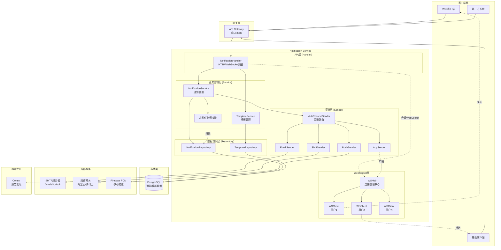

**架构层级说明**：

**1. 客户端层（Client Layer）**：
- **Web客户端**：浏览器端，通过HTTP API调用和WebSocket接收实时通知
- **移动客户端**：iOS/Android App，通过HTTP API + FCM推送
- **第三方系统**：其他业务系统通过RESTful API发送通知

**2. 网关层（Gateway Layer）**：
- **API Gateway (端口8080)**：统一入口，负责路由、认证、限流
- 转发通知相关请求到Notification Service (端口8084)
- 处理跨域、TLS终止、日志记录

**3. Notification Service核心层**：

**3.1 API层（Handler）**：
- **NotificationHandler**：处理所有HTTP/WebSocket请求
- 10+ REST API端点 + 1个WebSocket端点
- 请求参数验证、响应格式化
- WebSocket连接升级和客户端注册

**3.2 业务逻辑层（Service）**：
- **NotificationService**：核心业务逻辑
  - 通知创建、查询、更新、删除
  - 状态管理（pending → sent → read）
  - 权限验证（用户只能访问自己的通知）
  - 调度渠道发送
  
- **TemplateService**：模板管理
  - 模板CRUD操作
  - 变量替换和渲染
  - 模板版本控制
  
- **定时任务调度器**：
  - 每分钟扫描scheduled_at到期的通知
  - 自动触发发送流程
  - 更新通知状态

**3.3 渠道层（Sender）**：
- **MultiChannelSender**：渠道路由和管理
  - 注册所有可用渠道
  - 多渠道并发发送
  - 失败重试和降级
  
- **AppSender**：应用内推送（WebSocket）
- **EmailSender**：邮件发送（SMTP）
- **SMSSender**：短信发送（阿里云/腾讯云SDK）
- **PushSender**：移动推送（Firebase FCM）

**3.4 WebSocket层**：
- **WSHub**：WebSocket连接中心
  - 维护 userID → WSClient 映射
  - 处理连接注册/注销
  - 广播消息到指定用户
  - 并发安全（channel + RWMutex）
  
- **WSClient**：单个WebSocket连接
  - 读写Pump分离
  - 256消息缓冲队列
  - 心跳保活机制

**3.5 数据访问层（Repository）**：
- **NotificationRepository**：通知数据操作
  - CRUD、状态更新、统计查询
  - 分页查询、批量操作
  - 软删除、定时查询
  
- **TemplateRepository**：模板数据操作

**4. 存储层（Storage Layer）**：
- **PostgreSQL**：关系型数据库
  - notifications表：通知记录
  - notification_templates表：模板记录
  - 连接池配置：10空闲/100最大

**5. 外部服务层（External Services）**：
- **SMTP服务器**：Gmail/Outlook等邮件服务
- **短信网关**：阿里云/腾讯云短信服务
- **Firebase FCM**：Google移动推送服务

**6. 服务注册层（Service Registry）**：
- **Consul**：服务发现和健康检查
  - 服务注册：notification-service
  - 健康检查：/health 每10秒
  - 自动注销：30秒后

#### 1.2.2 模块交互关系图

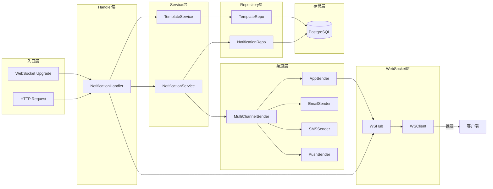

**模块依赖关系**：
1. **Handler → Service**：单向依赖，Handler调用Service
2. **Service → Repository**：单向依赖，Service调用Repository进行数据操作
3. **Service → ChannelSender**：单向依赖，Service调用Sender发送通知
4. **ChannelSender → WSHub**：AppSender依赖WSHub进行WebSocket推送
5. **Repository → Database**：单向依赖，Repository操作数据库

**无循环依赖**：整个架构采用分层设计，自上而下单向依赖，无循环依赖。

#### 1.2.3 核心设计特性

**1. 四层分层架构**：
- **API层**：HTTP/WebSocket请求处理，参数验证
- **Service层**：业务逻辑封装，状态管理
- **Repository层**：数据访问封装，SQL操作
- **External层**：外部服务集成，SMTP/SMS/Push

**2. WebSocket Hub中心化管理**：
- 所有WebSocket连接集中管理
- userID作为唯一标识
- 通过Go channel实现并发安全
- 读写分离Pump模式

**3. MultiChannelSender统一调度**：
- 渠道发送器接口化（ChannelSender Interface）
- 插件化架构，易于扩展新渠道
- 多渠道并发发送，互不影响
- 失败重试和降级策略

**4. 异步发送机制**：
- 通知创建后立即返回（同步）
- 渠道发送异步执行（goroutine）
- 不阻塞主业务流程
- 发送状态异步更新

**5. 定时任务调度**：
- 独立goroutine运行
- 每分钟扫描到期通知
- 自动触发发送流程
- 支持定时通知功能

**6. 并发安全设计**：
- WSHub使用channel + RWMutex
- Repository使用context传递
- 无全局可变状态
- goroutine安全关闭

### 1.3 完整数据流时序

#### 1.3.1 通知发送完整流程时序图

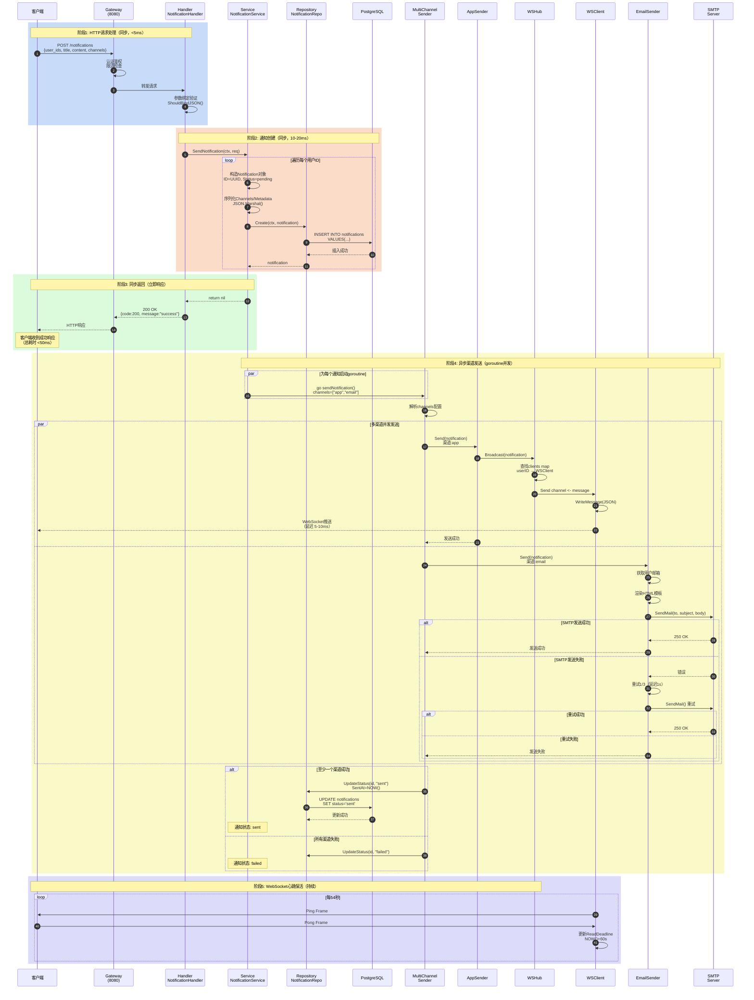

**时序图详细说明**：

**阶段1: HTTP请求处理（同步，<5ms）**
- **步骤1-3**：客户端通过Gateway发送POST请求
- **Gateway处理**：
  - 认证鉴权（JWT Token验证）
  - 限流检查（10 req/min）
  - 路由转发到Notification Service
- **步骤4-5**：Handler接收请求
- **参数验证**：使用Gin的ShouldBindJSON进行参数绑定和验证
  - user_ids非空且长度≥1
  - title长度1-200字符
  - content长度1-2000字符
  - type枚举值：system/info/warning/error
  - channels枚举值：app/email/sms/push

**阶段2: 通知创建（同步，10-20ms）**
- **步骤6**：Handler调用Service.SendNotification()
- **步骤7-12**：Service遍历每个用户ID
  - 生成UUID作为通知ID
  - 设置Status=pending（初始状态）
  - 设置Priority默认值（normal）
  - 序列化Channels为JSON字符串
  - 序列化Metadata为JSON字符串
  - 解析ScheduleAt时间（RFC3339格式）
- **步骤13-15**：Repository调用GORM执行INSERT
  - 使用Context传递（超时控制）
  - 事务保证原子性
  - 返回插入后的notification对象

**阶段3: 同步返回（立即响应，总耗时<50ms）**
- **步骤16-18**：Service返回nil表示成功
- **步骤19-20**：Handler返回200 OK响应
- **关键设计**：
  - ✅ **同步快速返回**：不等待渠道发送完成
  - ✅ **异步发送**：渠道发送在后台goroutine执行
  - ✅ **用户体验**：客户端快速收到响应（<50ms）

**阶段4: 异步渠道发送（goroutine并发，秒级）**
- **步骤21-22**：Service为每个通知启动goroutine
  ```go
  if notification.ScheduledAt == nil {
      go s.sendNotification(notification, req.Channels)
  }
  ```
- **步骤23-25**：MultiChannelSender并发调用各渠道Sender
- **App渠道（WebSocket）**：
  - **步骤26-31**：AppSender → WSHub → WSClient
  - **延迟**：5-10ms（毫秒级，实时推送）
  - **实现**：
    ```go
    func (s *AppSender) Send(notification *model.Notification) error {
        s.wsHub.Broadcast(notification)
        return nil
    }
    ```
  - WSHub通过channel机制广播消息
  - WSClient通过Send channel缓冲队列发送
  - 客户端通过WebSocket接收JSON消息
  
- **Email渠道（SMTP）**：
  - **步骤32-38**：EmailSender → SMTP Server
  - **延迟**：2-5秒（秒级，异步）
  - **实现流程**：
    1. 获取用户邮箱地址（从用户服务或缓存）
    2. 渲染HTML模板（Go template引擎）
    3. 构造MIME邮件（标题、正文、附件）
    4. 调用SMTP协议发送
  - **重试机制**：
    - 最多重试3次
    - 指数退避：1s → 2s → 4s
    - 重试条件：网络错误、超时
    - 不重试条件：认证失败、邮箱无效
  
- **步骤39-42**：更新通知状态
  - **成功**：至少一个渠道发送成功 → status=sent
  - **失败**：所有渠道发送失败 → status=failed
  - 更新sent_at时间戳

**阶段5: WebSocket心跳保活（持续）**
- **步骤43-46**：WritePump定时发送Ping帧
  ```go
  ticker := time.NewTicker(54 * time.Second)
  for {
      select {
      case <-ticker.C:
          c.Conn.WriteMessage(websocket.PingMessage, nil)
      }
  }
  ```
- **心跳机制**：
  - 服务端每54秒发送Ping
  - 客户端响应Pong
  - 60秒内未收到Pong → 关闭连接
  - 防止NAT超时和僵尸连接

**关键时间指标**：
| 阶段 | 操作 | 耗时 | 类型 |
|---|---|---|---|
| 1 | Gateway路由 | <2ms | 同步 |
| 2 | 参数验证 | <3ms | 同步 |
| 3 | 数据库INSERT | 10-20ms | 同步 |
| 4 | HTTP响应返回 | <50ms | 同步 |
| 5 | WebSocket推送 | 5-10ms | 异步 |
| 6 | 邮件发送 | 2-5s | 异步 |
| 7 | 短信发送 | 1-3s | 异步 |

**并发安全保证**：
1. **WSHub并发安全**：
   - clients map使用RWMutex保护
   - 注册/注销通过channel串行化
   - 避免map并发读写panic
   
2. **数据库并发**：
   - 使用GORM的WithContext传递context
   - 连接池限制并发数（100最大）
   - 事务保证原子性
   
3. **goroutine安全关闭**：
   - 使用context传递取消信号
   - channel关闭后停止读写
   - defer确保资源释放

#### 1.3.2 WebSocket订阅流程时序图

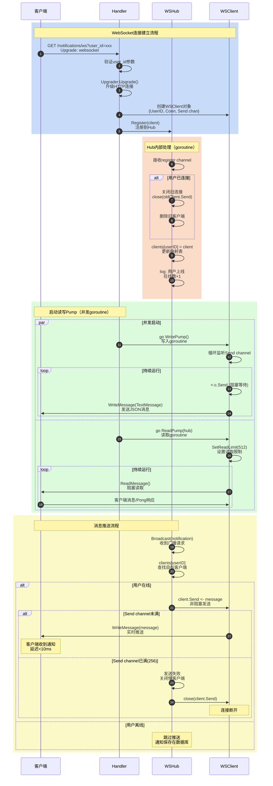

**WebSocket订阅详细说明**：

**连接建立阶段（步骤1-9）**：
1. **客户端发起WebSocket握手**：
   ```javascript
   const ws = new WebSocket('ws://localhost:8084/api/v1/notifications/ws?user_id=user-123');
   ```
   - 协议升级：HTTP → WebSocket
   - 传递user_id作为身份标识

2. **Handler验证和升级**：
   ```go
   conn, err := h.upgrader.Upgrade(c.Writer, c.Request, nil)
   ```
   - 验证user_id参数（必填）
   - 检查Upgrade头部
   - 升级协议并创建WebSocket连接

3. **创建WSClient对象**：
   ```go
   client := &service.WSClient{
       UserID: userID,
       Conn:   conn,
       Send:   make(chan []byte, 256), // 256消息缓冲
   }
   ```

4. **注册到WSHub**：
   - 通过register channel发送客户端
   - Hub在独立goroutine中处理
   - 保证并发安全

**Hub内部处理（步骤10-14）**：
```go
case client := <-h.register:
    h.mu.Lock()
    if oldClient, ok := h.clients[client.UserID]; ok {
        close(oldClient.Send)
        oldClient.Conn.Close()
    }
    h.clients[client.UserID] = client
    h.mu.Unlock()
```
- **单点登录**：同一用户只保留最新连接
- **旧连接清理**：关闭Send channel和WebSocket连接
- **更新映射**：clients[userID] = newClient

**读写Pump启动（步骤15-22）**：

**WritePump（写入goroutine）**：
```go
func (c *WSClient) WritePump() {
    defer c.Conn.Close()
    
    for message := range c.Send {
        if err := c.Conn.WriteMessage(websocket.TextMessage, message); err != nil {
            return // 写入错误，退出循环
        }
    }
}
```
- **阻塞监听**：<-c.Send channel
- **写入消息**：WriteMessage(TextMessage, JSON)
- **错误处理**：写入失败直接关闭连接

**ReadPump（读取goroutine）**：
```go
func (c *WSClient) ReadPump(hub *WSHub) {
    defer hub.Unregister(c)
    c.Conn.SetReadLimit(512)
    
    for {
        _, _, err := c.Conn.ReadMessage()
        if err != nil {
            break // 读取错误或关闭
        }
    }
}
```
- **读取限制**：512字节（防止攻击）
- **持续读取**：保持连接活跃
- **自动注销**：defer确保断开时注销

**消息推送流程（步骤23-32）**：

**广播消息到指定用户**：
```go
func (h *WSHub) Broadcast(notification *model.Notification) {
    h.broadcast <- notification
}

// Hub Run循环中处理
case notification := <-h.broadcast:
    h.mu.RLock()
    client, ok := h.clients[notification.UserID]
    h.mu.RUnlock()
    
    if ok {
        message, _ := json.Marshal(notification)
        select {
        case client.Send <- message:
            // 发送成功
        default:
            // 发送失败，客户端太慢，关闭连接
            h.mu.Lock()
            delete(h.clients, client.UserID)
            close(client.Send)
            h.mu.Unlock()
        }
    }
```

**关键设计**：
1. **非阻塞发送**：使用select default避免阻塞Hub
2. **慢客户端保护**：Send channel满时关闭连接
3. **实时推送**：延迟<10ms
4. **离线处理**：用户离线时跳过推送，通知保存在数据库

### 1.4 WebSocket连接管理架构

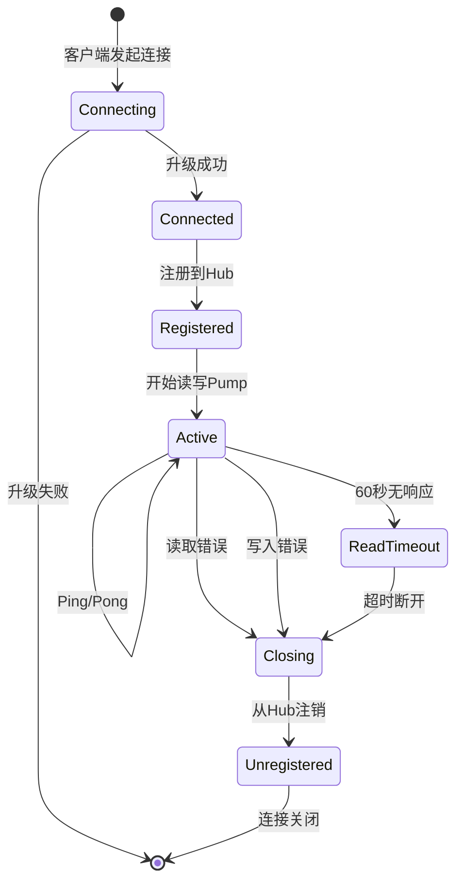

**连接状态说明**：

1. **Connecting**：客户端发起WebSocket握手，HTTP升级为WebSocket协议
2. **Connected**：握手成功，创建WSClient对象
3. **Registered**：WSClient注册到Hub的clients map，可接收广播
4. **Active**：ReadPump和WritePump启动，进入正常收发状态
5. **ReadTimeout**：60秒内未收到Pong响应，触发超时
6. **Closing**：任何错误导致连接关闭流程
7. **Unregistered**：从Hub的clients map移除，释放资源

---

## 二、对外API规格

### 2.1 API列表总览

#### 2.1.1 通知管理API

| API | 方法 | 路径 | 说明 | 认证 |
|---|---|---|---|---|
| 发送通知 | POST | /api/v1/notifications | 批量发送通知 | 可选 |
| 获取通知 | GET | /api/v1/notifications/:notification_id | 获取通知详情 | 可选 |
| 列表通知 | GET | /api/v1/notifications | 分页列表通知 | 可选 |
| 标记已读 | PUT | /api/v1/notifications/:notification_id/read | 标记为已读 | 可选 |
| 标记未读 | PUT | /api/v1/notifications/:notification_id/unread | 标记为未读 | 可选 |
| 批量标记 | POST | /api/v1/notifications/batch-mark | 批量标记状态 | 可选 |
| 删除通知 | DELETE | /api/v1/notifications/:notification_id | 软删除通知 | 可选 |
| 未读数量 | GET | /api/v1/notifications/unread/count | 获取未读数 | 可选 |
| 全部已读 | POST | /api/v1/notifications/read-all | 标记全部已读 | 可选 |
| 通知统计 | GET | /api/v1/notifications/stats | 获取统计信息 | 可选 |

#### 2.1.2 WebSocket订阅API

| API | 方法 | 路径 | 说明 | 认证 |
|---|---|---|---|---|
| 订阅通知 | WebSocket | /api/v1/notifications/ws | 实时通知订阅 | 必须 |

#### 2.1.3 模板管理API

| API | 方法 | 路径 | 说明 | 认证 |
|---|---|---|---|---|
| 创建模板 | POST | /api/v1/notifications/templates | 创建通知模板 | 可选 |
| 获取模板 | GET | /api/v1/notifications/templates/:template_id | 获取模板详情 | 可选 |
| 列表模板 | GET | /api/v1/notifications/templates | 分页列表模板 | 可选 |
| 更新模板 | PUT | /api/v1/notifications/templates/:template_id | 更新模板 | 可选 |
| 删除模板 | DELETE | /api/v1/notifications/templates/:template_id | 软删除模板 | 可选 |

---

### 2.2 API详解

#### API 1: 发送通知

**基本信息**：
- **端点**：`POST /api/v1/notifications`
- **Content-Type**：`application/json`
- **幂等性**：否（每次调用创建新通知）
- **限流**：建议Gateway配置10 req/min
- **超时**：5秒

**请求结构体**：

```go
type SendNotificationRequest struct {
    UserIDs    []string               `json:"user_ids" binding:"required,min=1"`       // 目标用户ID列表
    Title      string                 `json:"title" binding:"required,min=1,max=200"`  // 通知标题
    Content    string                 `json:"content" binding:"required,min=1,max=2000"` // 通知内容
    Type       string                 `json:"type" binding:"required,oneof=system info warning error"` // 通知类型
    Priority   string                 `json:"priority,omitempty" binding:"omitempty,oneof=low normal high urgent"` // 优先级
    Channels   []string               `json:"channels,omitempty" binding:"omitempty,dive,oneof=app email sms push"` // 发送渠道
    Metadata   map[string]interface{} `json:"metadata,omitempty"`  // 扩展元数据
    ScheduleAt string                 `json:"schedule_at,omitempty"` // 定时发送时间(ISO 8601)
}
```

**字段说明**：

| 字段 | 类型 | 必填 | 约束 | 默认值 | 说明 |
|---|---|---|---|---|---|
| user_ids | []string | 是 | 长度≥1 | - | 接收通知的用户ID列表，支持批量发送 |
| title | string | 是 | 1-200字符 | - | 通知标题，显示在通知栏 |
| content | string | 是 | 1-2000字符 | - | 通知正文内容 |
| type | string | 是 | 枚举值 | - | 通知类型：system(系统)/info(信息)/warning(警告)/error(错误) |
| priority | string | 否 | 枚举值 | normal | 优先级：low(低)/normal(普通)/high(高)/urgent(紧急) |
| channels | []string | 否 | 枚举值 | ["app"] | 发送渠道：app(应用内)/email(邮件)/sms(短信)/push(推送) |
| metadata | object | 否 | JSON对象 | {} | 扩展元数据，可存储任意键值对 |
| schedule_at | string | 否 | ISO 8601格式 | - | 定时发送时间，格式：2025-10-10T15:00:00Z |

**请求示例**：

```http
POST /api/v1/notifications HTTP/1.1
Host: localhost:8084
Content-Type: application/json

{
  "user_ids": ["user-123", "user-456"],
  "title": "系统维护通知",
  "content": "系统将于今晚22:00-24:00进行维护升级，期间服务可能短暂中断。",
  "type": "system",
  "priority": "high",
  "channels": ["app", "email"],
  "metadata": {
    "department": "运维部",
    "maintenance_window": "22:00-24:00"
  }
}
```

**响应结构体**：

```go
type SendNotificationResponse struct {
    Code    int    `json:"code"`    // 200
    Message string `json:"message"` // "Notifications sent successfully"
}
```

**成功响应示例**：

```json
{
  "code": 200,
  "message": "Notifications sent successfully"
}
```

**错误响应**：

| HTTP状态码 | code | message | 原因 |
|---|---|---|---|
| 400 | 400 | Invalid request | 参数验证失败（user_ids为空、title/content不符合长度要求等） |
| 400 | 400 | Invalid type | type字段不是system/info/warning/error之一 |
| 400 | 400 | Invalid priority | priority字段不是low/normal/high/urgent之一 |
| 400 | 400 | Invalid channels | channels包含不支持的渠道 |
| 500 | 500 | Failed to send notification | 数据库写入失败或其他内部错误 |

**入口函数**（Handler层）：

```go
func (h *NotificationHandler) SendNotification(c *gin.Context) {
    var req model.SendNotificationRequest
    
    // 1. 绑定并验证请求参数
    if err := c.ShouldBindJSON(&req); err != nil {
        c.JSON(http.StatusBadRequest, gin.H{
            "code":    400,
            "message": "Invalid request",
            // 错误详情处理省略
        })
        return
    }
    
    // 2. 调用Service层发送通知
    if err := h.notificationService.SendNotification(c.Request.Context(), &req); err != nil {
        c.JSON(http.StatusInternalServerError, gin.H{
            "code":    500,
            "message": "Failed to send notification",
            // 错误处理省略
        })
        return
    }
    
    // 3. 返回成功响应
    c.JSON(http.StatusOK, gin.H{
        "code":    200,
        "message": "Notifications sent successfully",
    })
}
```

**Service层核心代码**：

```go
func (s *NotificationService) SendNotification(ctx context.Context, req *model.SendNotificationRequest) error {
    // 为每个用户创建通知
    for _, userID := range req.UserIDs {
        notification := &model.Notification{
            ID:        uuid.New().String(),
            UserID:    userID,
            Title:     req.Title,
            Content:   req.Content,
            Type:      req.Type,
            Priority:  req.Priority,
            Status:    "pending",
            CreatedAt: time.Now(),
            UpdatedAt: time.Now(),
        }
        
        // 设置优先级默认值
        if notification.Priority == "" {
            notification.Priority = "normal"
        }
        
        // 设置渠道（JSON序列化）
        if len(req.Channels) > 0 {
            channelsJSON, _ := json.Marshal(req.Channels)
            notification.Channels = string(channelsJSON)
        }
        
        // 设置元数据（JSON序列化）
        if req.Metadata != nil {
            metadataJSON, _ := json.Marshal(req.Metadata)
            notification.Metadata = string(metadataJSON)
        }
        
        // 设置定时发送时间
        if req.ScheduleAt != "" {
            scheduleTime, err := time.Parse(time.RFC3339, req.ScheduleAt)
            if err == nil {
                notification.ScheduledAt = &scheduleTime
            }
        }
        
        // 保存到数据库
        if err := s.notificationRepo.Create(ctx, notification); err != nil {
            // 错误记录省略
            continue
        }
        
        // 如果不是定时通知，立即发送
        if notification.ScheduledAt == nil {
            go s.sendNotification(notification, req.Channels)
        }
    }
    
    return nil
}
```

**调用链路**：
```
Client → NotificationHandler.SendNotification() 
       → NotificationService.SendNotification()
       → NotificationRepository.Create() → PostgreSQL
       → NotificationService.sendNotification() (goroutine)
       → MultiChannelSender.Send()
       → AppSender/EmailSender/SMSSender/PushSender.Send()
```

**完整调用链路**：

```
客户端 → Gateway (8080) → Handler → Service → Repository → PostgreSQL
                              ↓
                        MultiChannelSender
                              ↓
                    ┌─────────┴─────────┐
                    ↓                   ↓
              AppSender            EmailSender
                    ↓                   ↓
              WSHub                 SMTP服务器
                    ↓
              WSClient
                    ↓
              客户端(WebSocket)
```

**模块内部时序图（Handler层）**：

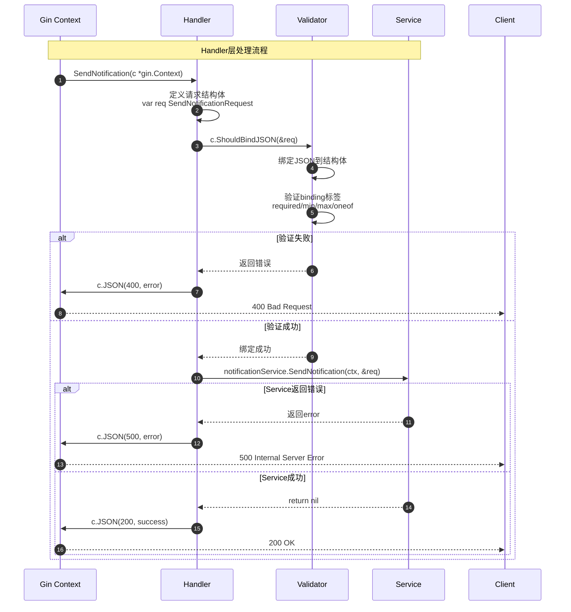

**模块内部时序图（Service层）**：

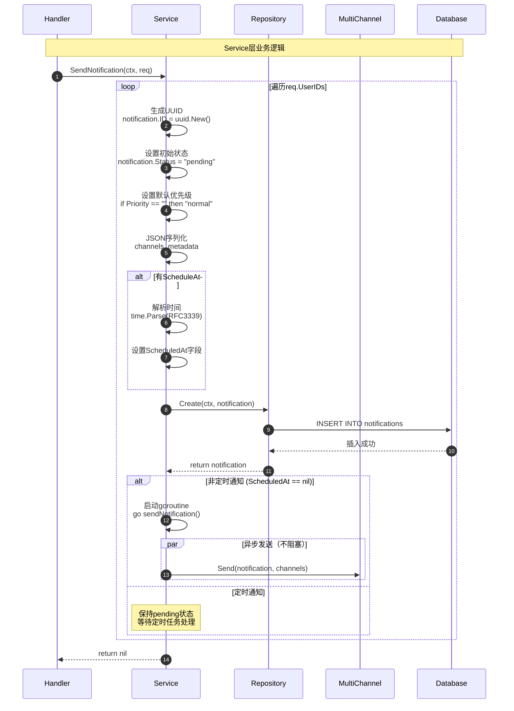

**模块内部时序图（Repository层）**：

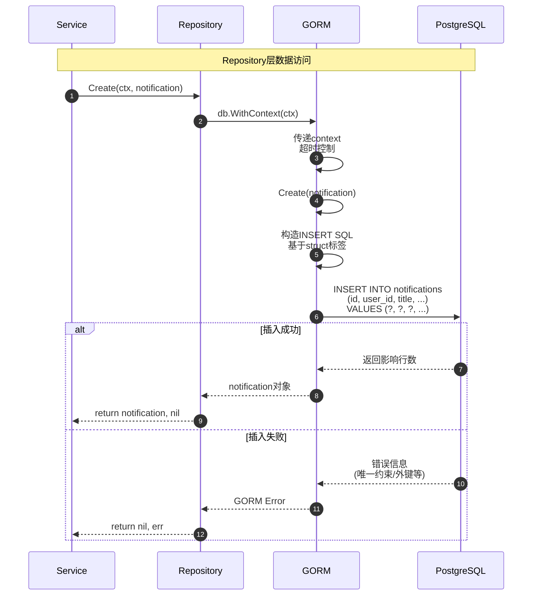

**模块内部时序图（MultiChannelSender层）**：

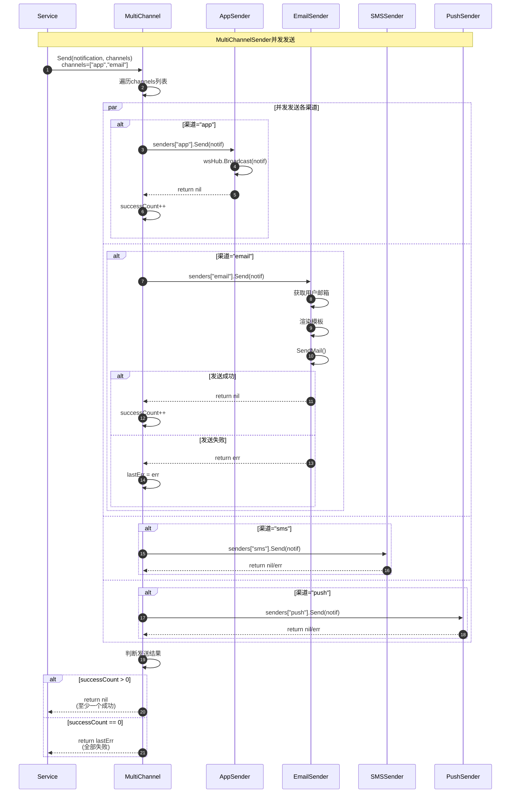

**关键代码实现（Service层）**：

```go
// services/notification-service/internal/service/notification_service.go

func (s *NotificationService) SendNotification(ctx context.Context, req *model.SendNotificationRequest) error {
    // 步骤1: 遍历每个用户ID
    for _, userID := range req.UserIDs {
        // 步骤2: 构造Notification对象
        notification := &model.Notification{
            ID:        uuid.New().String(),        // 生成UUID
            UserID:    userID,
            Title:     req.Title,
            Content:   req.Content,
            Type:      req.Type,
            Priority:  req.Priority,
            Status:    "pending",                  // 初始状态
            CreatedAt: time.Now(),
            UpdatedAt: time.Now(),
        }

        // 步骤3: 设置默认优先级
        if notification.Priority == "" {
            notification.Priority = "normal"
        }

        // 步骤4: 序列化Channels为JSON
        if len(req.Channels) > 0 {
            channelsJSON, _ := json.Marshal(req.Channels)
            notification.Channels = string(channelsJSON)
        }

        // 步骤5: 序列化Metadata为JSON
        if req.Metadata != nil {
            metadataJSON, _ := json.Marshal(req.Metadata)
            notification.Metadata = string(metadataJSON)
        }

        // 步骤6: 解析定时发送时间
        if req.ScheduleAt != "" {
            scheduleTime, err := time.Parse(time.RFC3339, req.ScheduleAt)
            if err == nil {
                notification.ScheduledAt = &scheduleTime
            }
        }

        // 步骤7: 保存到数据库
        if err := s.notificationRepo.Create(ctx, notification); err != nil {
            log.Printf("❌ Failed to create notification: %v", err)
            continue // 某个用户失败，继续处理其他用户
        }

        // 步骤8: 判断是否定时通知
        if notification.ScheduledAt == nil {
            // 步骤9: 非定时通知，启动goroutine异步发送
            go s.sendNotification(notification, req.Channels)
        }
        // 定时通知保持pending状态，由定时任务处理
    }

    return nil
}

// sendNotification 异步发送通知（goroutine中执行）
func (s *NotificationService) sendNotification(notification *model.Notification, channels []string) {
    // 步骤1: 解析渠道配置
    if notification.Channels != "" {
        json.Unmarshal([]byte(notification.Channels), &channels)
    }

    // 步骤2: 通过多渠道发送
    if err := s.channelSender.Send(notification, channels); err != nil {
        // 步骤3: 所有渠道失败，更新状态为failed
        log.Printf("❌ Failed to send notification %s: %v", notification.ID, err)
        s.notificationRepo.UpdateStatus(context.Background(), notification.ID, "failed")
        return
    }

    // 步骤4: 至少一个渠道成功，更新状态为sent
    now := time.Now()
    notification.Status = "sent"
    notification.SentAt = &now
    s.notificationRepo.Update(context.Background(), notification)

    log.Printf("✅ Notification sent successfully: %s", notification.ID)
}
```

**关键代码实现（Repository层）**：

```go
// services/notification-service/internal/repository/notification_repository.go

func (r *notificationRepository) Create(ctx context.Context, notification *model.Notification) error {
    // 使用WithContext传递context（超时控制）
    // 使用GORM的Create方法插入记录
    return r.db.WithContext(ctx).Create(notification).Error
}

func (r *notificationRepository) UpdateStatus(ctx context.Context, id, status string) error {
    return r.db.WithContext(ctx).
        Model(&model.Notification{}).
        Where("id = ? AND deleted_at IS NULL", id).
        Update("status", status).Error
}

func (r *notificationRepository) Update(ctx context.Context, notification *model.Notification) error {
    return r.db.WithContext(ctx).
        Where("id = ? AND deleted_at IS NULL", notification.ID).
        Updates(notification).Error
}
```

**关键代码实现（MultiChannelSender层）**：

```go
// services/notification-service/internal/service/channel_sender.go

func (m *MultiChannelSender) Send(notification *model.Notification, channels []string) error {
    // 默认渠道
    if len(channels) == 0 {
        channels = []string{"app"}
    }

    var lastErr error
    successCount := 0

    // 遍历每个渠道
    for _, channel := range channels {
        sender, ok := m.senders[channel]
        if !ok {
            log.Printf("⚠️ Unknown channel: %s", channel)
            continue
        }

        // 调用渠道发送器
        if err := sender.Send(notification); err != nil {
            log.Printf("❌ Failed to send via %s: %v", channel, err)
            lastErr = err
        } else {
            successCount++
        }
    }

    // 判断发送结果
    if successCount == 0 && lastErr != nil {
        return fmt.Errorf("all channels failed: %w", lastErr)
    }

    return nil
}
```

**最佳实践**：

1. **批量发送优化**：
   - 单次请求建议user_ids数量≤100
   - 超过100个用户建议分批调用
   - 使用定时通知避免峰值压力

2. **渠道选择**：
   - 仅通知类消息：`["app"]`
   - 重要通知：`["app", "email"]`
   - 紧急通知：`["app", "email", "sms", "push"]`

3. **优先级设置**：
   - low：营销活动、推荐内容
   - normal：一般业务通知
   - high：重要业务提醒
   - urgent：系统故障、安全警告

4. **元数据使用**：
   ```json
   {
     "metadata": {
       "action_url": "/orders/123",
       "action_text": "查看详情",
       "expire_at": "2025-10-15T00:00:00Z"
     }
   }
   ```

5. **错误重试**：
   - 500错误建议重试（幂等性：每次创建新ID）
   - 400错误不要重试（参数错误）
   - 使用指数退避策略

---

#### API 2: 获取通知详情

**基本信息**：
- **端点**：`GET /api/v1/notifications/:notification_id`
- **幂等性**：是
- **权限**：仅通知所有者可访问

**请求示例**：

```http
GET /api/v1/notifications/550e8400-e29b-41d4-a716-446655440000 HTTP/1.1
Host: localhost:8084
```

**响应结构体**：

```go
type GetNotificationResponse struct {
    Code    int          `json:"code"`    // 200
    Message string       `json:"message"` // "Success"
    Data    NotificationData `json:"data"`
}

type NotificationData struct {
    Notification *Notification `json:"notification"`
}

type Notification struct {
    ID          string                 `json:"id"`
    UserID      string                 `json:"user_id"`
    TenantID    string                 `json:"tenant_id"`
    Title       string                 `json:"title"`
    Content     string                 `json:"content"`
    Type        string                 `json:"type"`
    Priority    string                 `json:"priority"`
    Status      string                 `json:"status"`
    Channels    []string               `json:"channels"`
    Metadata    map[string]interface{} `json:"metadata"`
    CreatedAt   time.Time              `json:"created_at"`
    ReadAt      *time.Time             `json:"read_at,omitempty"`
    ScheduledAt *time.Time             `json:"scheduled_at,omitempty"`
}
```

**核心代码**：

```go
func (h *NotificationHandler) GetNotification(c *gin.Context) {
    notificationID := c.Param("notification_id")
    userID := c.GetString("user_id")
    if userID == "" {
        userID = "anonymous"
    }
    
    // 从Service层获取通知
    notification, err := h.notificationService.GetNotification(
        c.Request.Context(),
        notificationID,
        userID,
    )
    if err != nil {
        c.JSON(http.StatusNotFound, gin.H{
            "code":    404,
            "message": "Notification not found",
        })
        return
    }
    
    c.JSON(http.StatusOK, gin.H{
        "code":    200,
        "message": "Success",
        "data":    gin.H{"notification": notification},
    })
}
```

**Service层权限检查**：

```go
func (s *NotificationService) GetNotification(ctx context.Context, id, userID string) (*model.Notification, error) {
    // 1. 从数据库查询
    notification, err := s.notificationRepo.FindByID(ctx, id)
    if err != nil {
        return nil, err
    }
    
    // 2. 验证权限（通知属于该用户）
    if notification.UserID != userID {
        return nil, repository.ErrNotificationNotFound
    }
    
    return notification, nil
}
```

---

#### API 3: 列表通知

**基本信息**：
- **端点**：`GET /api/v1/notifications`
- **幂等性**：是
- **分页**：支持

**查询参数**：

| 参数 | 类型 | 必填 | 默认值 | 说明 |
|---|---|---|---|---|
| page | int | 否 | 1 | 页码（从1开始） |
| page_size | int | 否 | 20 | 每页数量（1-100） |

**核心代码**：

```go
func (h *NotificationHandler) ListNotifications(c *gin.Context) {
    userID := c.GetString("user_id")
    if userID == "" {
        userID = "anonymous"
    }
    
    page, _ := strconv.Atoi(c.DefaultQuery("page", "1"))
    pageSize, _ := strconv.Atoi(c.DefaultQuery("page_size", "20"))
    
    // 参数验证
    if page <= 0 {
        page = 1
    }
    if pageSize <= 0 || pageSize > 100 {
        pageSize = 20
    }
    
    // 查询通知列表
    notifications, total, err := h.notificationService.ListNotifications(
        c.Request.Context(),
        userID,
        page,
        pageSize,
    )
    // 错误处理省略
    
    // 计算总页数
    totalPages := int(total) / pageSize
    if int(total)%pageSize > 0 {
        totalPages++
    }
    
    c.JSON(http.StatusOK, gin.H{
        "code":    200,
        "message": "Success",
        "data": gin.H{
            "notifications": notifications,
            "total":         total,
            "page":          page,
            "page_size":     pageSize,
            "total_pages":   totalPages,
        },
    })
}
```

**Repository层查询**：

```go
func (r *notificationRepository) FindByUserID(ctx context.Context, userID string, limit, offset int) ([]*model.Notification, int64, error) {
    var notifications []*model.Notification
    var total int64
    
    query := r.db.WithContext(ctx).
        Where("user_id = ? AND deleted_at IS NULL", userID)
    
    // 获取总数
    if err := query.Model(&model.Notification{}).Count(&total).Error; err != nil {
        return nil, 0, err
    }
    
    // 分页查询
    if err := query.
        Order("created_at DESC").
        Limit(limit).
        Offset(offset).
        Find(&notifications).Error; err != nil {
        return nil, 0, err
    }
    
    return notifications, total, nil
}
```

---

#### API 4: WebSocket订阅

**基本信息**：
- **端点**：`GET /api/v1/notifications/ws`
- **协议**：WebSocket
- **认证**：user_id通过查询参数传递

**连接示例**：

```javascript
const ws = new WebSocket('ws://localhost:8084/api/v1/notifications/ws?user_id=user-123');

ws.onopen = () => {
    console.log('WebSocket connected');
};

ws.onmessage = (event) => {
    const notification = JSON.parse(event.data);
    console.log('Received notification:', notification);
    // 处理通知（显示UI、播放声音等）
};

ws.onerror = (error) => {
    console.error('WebSocket error:', error);
};

ws.onclose = () => {
    console.log('WebSocket closed');
    // 实现自动重连
    setTimeout(() => reconnect(), 3000);
};
```

**Handler层升级逻辑**：

```go
func (h *NotificationHandler) Subscribe(c *gin.Context) {
    userID := c.Query("user_id")
    if userID == "" {
        userID = c.GetString("user_id")
    }
    if userID == "" {
        c.JSON(http.StatusUnauthorized, gin.H{
            "code":    401,
            "message": "User ID required",
        })
        return
    }
    
    // 升级HTTP连接为WebSocket
    conn, err := h.upgrader.Upgrade(c.Writer, c.Request, nil)
    if err != nil {
        // 错误处理省略
        return
    }
    
    // 创建客户端
    client := &service.WSClient{
        UserID: userID,
        Conn:   conn,
        Send:   make(chan []byte, 256),
    }
    
    // 注册到Hub
    h.wsHub.Register(client)
    
    // 启动读写goroutine
    go client.WritePump()
    go client.ReadPump(h.wsHub)
}
```

**WebSocket Hub核心实现**：

```go
type WSHub struct {
    clients    map[string]*WSClient  // userID -> WSClient
    register   chan *WSClient
    unregister chan *WSClient
    broadcast  chan *model.Notification
    mu         sync.RWMutex
}

func (h *WSHub) Run() {
    for {
        select {
        case client := <-h.register:
            h.mu.Lock()
            // 如果用户已连接，先关闭旧连接
            if oldClient, ok := h.clients[client.UserID]; ok {
                close(oldClient.Send)
                oldClient.Conn.Close()
            }
            h.clients[client.UserID] = client
            h.mu.Unlock()
            
        case client := <-h.unregister:
            h.mu.Lock()
            if _, ok := h.clients[client.UserID]; ok {
                delete(h.clients, client.UserID)
                close(client.Send)
                client.Conn.Close()
            }
            h.mu.Unlock()
            
        case notification := <-h.broadcast:
            // 发送给指定用户
            h.mu.RLock()
            client, ok := h.clients[notification.UserID]
            h.mu.RUnlock()
            
            if ok {
                message, err := json.Marshal(notification)
                if err != nil {
                    continue
                }
                
                select {
                case client.Send <- message:
                    // 发送成功
                default:
                    // 发送失败，关闭连接
                    h.mu.Lock()
                    delete(h.clients, client.UserID)
                    close(client.Send)
                    h.mu.Unlock()
                }
            }
        }
    }
}
```

**WritePump（发送消息）**：

```go
func (c *WSClient) WritePump() {
    defer func() {
        c.Conn.Close()
    }()
    
    for message := range c.Send {
        if err := c.Conn.WriteMessage(websocket.TextMessage, message); err != nil {
            // 写入错误，关闭连接
            return
        }
    }
}
```

**ReadPump（接收消息）**：

```go
func (c *WSClient) ReadPump(hub *WSHub) {
    defer func() {
        hub.Unregister(c)
        c.Conn.Close()
    }()
    
    // 设置读取限制
    c.Conn.SetReadLimit(512)
    
    for {
        _, _, err := c.Conn.ReadMessage()
        if err != nil {
            if websocket.IsUnexpectedCloseError(err, websocket.CloseGoingAway, websocket.CloseAbnormalClosure) {
                // 记录错误
            }
            break
        }
        // 客户端发送的消息在这里处理（如果需要的话）
    }
}
```

---

## 三、核心功能深度解析

### 3.1 定时任务调度器实现

#### 3.1.1 定时任务调度器时序图

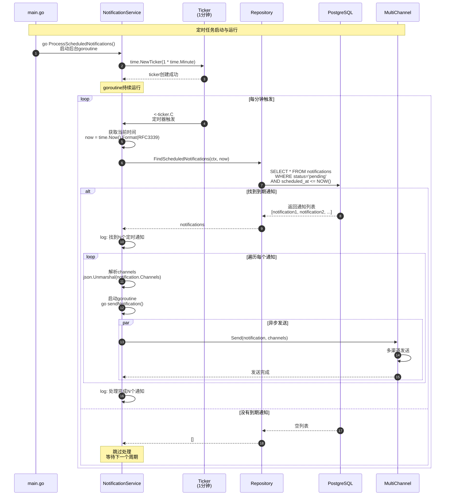

**定时任务调度器关键代码**：

```go
// services/notification-service/internal/service/notification_service.go

func (s *NotificationService) ProcessScheduledNotifications() {
    // 步骤1: 创建定时器（每分钟触发一次）
    ticker := time.NewTicker(1 * time.Minute)
    defer ticker.Stop()

    log.Println("✅ Scheduled notification processor started")

    for range ticker.C {
        // 步骤2: 获取当前时间（RFC3339格式）
        ctx := context.Background()
        now := time.Now().Format(time.RFC3339)

        // 步骤3: 查询到期的定时通知
        notifications, err := s.notificationRepo.FindScheduledNotifications(ctx, now)
        if err != nil {
            log.Printf("❌ Failed to find scheduled notifications: %v", err)
            continue
        }

        // 步骤4: 遍历并处理每个通知
        for _, notification := range notifications {
            // 步骤5: 解析渠道配置
            var channels []string
            if notification.Channels != "" {
                json.Unmarshal([]byte(notification.Channels), &channels)
            }

            // 步骤6: 异步发送通知
            go s.sendNotification(notification, channels)
        }

        // 步骤7: 记录处理数量
        if len(notifications) > 0 {
            log.Printf("✅ Processed %d scheduled notifications", len(notifications))
        }
    }
}
```

**Repository查询实现**：

```go
// services/notification-service/internal/repository/notification_repository.go

func (r *notificationRepository) FindScheduledNotifications(ctx context.Context, before string) ([]*model.Notification, error) {
    var notifications []*model.Notification
    
    // 查询条件：
    // 1. status = 'pending'（待发送状态）
    // 2. scheduled_at IS NOT NULL（有定时时间）
    // 3. scheduled_at <= before（时间已到期）
    // 4. deleted_at IS NULL（未删除）
    err := r.db.WithContext(ctx).
        Where("status = 'pending'").
        Where("scheduled_at IS NOT NULL").
        Where("scheduled_at <= ?", before).
        Where("deleted_at IS NULL").
        Find(&notifications).Error
    
    return notifications, err
}
```

**定时任务设计要点**：

1. **精度控制**：
   - 定时器周期：1分钟
   - 时间精度：分钟级
   - 适用场景：非实时通知

2. **并发处理**：
   - 每个通知启动独立goroutine
   - 避免阻塞主循环
   - 支持并发发送

3. **容错机制**：
   - 查询失败不中断循环
   - 单个通知失败不影响其他
   - 失败通知保持pending状态

4. **幂等性保证**：
   - 查询后通知状态变更为sent
   - 避免重复发送
   - 支持定时任务重启

### 3.2 WebSocket Hub深度实现

#### 3.2.1 WSHub内部结构与并发模型

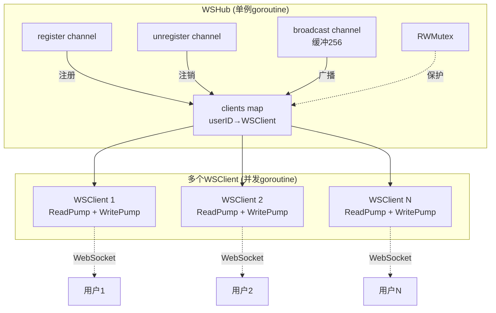

**WSHub Run循环详细实现**：

```go
// services/notification-service/internal/service/websocket_hub.go

type WSHub struct {
    // 核心数据结构
    clients    map[string]*WSClient  // userID → WSClient映射
    register   chan *WSClient        // 注册通道（无缓冲）
    unregister chan *WSClient        // 注销通道（无缓冲）
    broadcast  chan *model.Notification // 广播通道（缓冲256）
    mu         sync.RWMutex          // 读写锁
}

func NewWSHub() *WSHub {
    return &WSHub{
        clients:    make(map[string]*WSClient),
        register:   make(chan *WSClient),
        unregister: make(chan *WSClient),
        broadcast:  make(chan *model.Notification, 256), // 缓冲队列
    }
}

func (h *WSHub) Run() {
    // 在独立goroutine中持续运行
    for {
        select {
        // 处理客户端注册
        case client := <-h.register:
            h.mu.Lock()
            // 如果用户已连接，先关闭旧连接（单点登录）
            if oldClient, ok := h.clients[client.UserID]; ok {
                close(oldClient.Send)
                oldClient.Conn.Close()
                log.Printf("⚠️ Old connection closed for user: %s", client.UserID)
            }
            // 注册新连接
            h.clients[client.UserID] = client
            h.mu.Unlock()
            log.Printf("✅ WebSocket client connected: %s (Total: %d)", client.UserID, len(h.clients))

        // 处理客户端注销
        case client := <-h.unregister:
            h.mu.Lock()
            if _, ok := h.clients[client.UserID]; ok {
                delete(h.clients, client.UserID)
                close(client.Send)
                client.Conn.Close()
            }
            h.mu.Unlock()
            log.Printf("❌ WebSocket client disconnected: %s (Total: %d)", client.UserID, len(h.clients))

        // 处理消息广播
        case notification := <-h.broadcast:
            // 发送给指定用户（而非全体广播）
            h.mu.RLock()
            client, ok := h.clients[notification.UserID]
            h.mu.RUnlock()

            if ok {
                // 序列化通知为JSON
                message, err := json.Marshal(notification)
                if err != nil {
                    log.Printf("❌ Failed to marshal notification: %v", err)
                    continue
                }

                // 非阻塞发送到客户端的Send channel
                select {
                case client.Send <- message:
                    log.Printf("✅ Sent notification to user: %s", notification.UserID)
                default:
                    // Send channel已满（慢客户端），关闭连接
                    h.mu.Lock()
                    delete(h.clients, client.UserID)
                    close(client.Send)
                    h.mu.Unlock()
                    log.Printf("⚠️ Failed to send to user: %s, connection closed", notification.UserID)
                }
            } else {
                // 用户不在线，跳过推送
                log.Printf("⚠️ User not online: %s, skip WebSocket push", notification.UserID)
            }
        }
    }
}

// Register 注册客户端（线程安全）
func (h *WSHub) Register(client *WSClient) {
    h.register <- client
}

// Unregister 注销客户端（线程安全）
func (h *WSHub) Unregister(client *WSClient) {
    h.unregister <- client
}

// Broadcast 广播通知到指定用户（线程安全）
func (h *WSHub) Broadcast(notification *model.Notification) {
    h.broadcast <- notification
}

// GetOnlineCount 获取在线用户数
func (h *WSHub) GetOnlineCount() int {
    h.mu.RLock()
    defer h.mu.RUnlock()
    return len(h.clients)
}

// IsUserOnline 检查用户是否在线
func (h *WSHub) IsUserOnline(userID string) bool {
    h.mu.RLock()
    defer h.mu.RUnlock()
    _, ok := h.clients[userID]
    return ok
}
```

**并发安全设计要点**：

1. **channel机制**：
   - register/unregister无缓冲：同步操作
   - broadcast缓冲256：异步操作
   - 通过channel串行化操作，避免map并发读写

2. **RWMutex保护**：
   - 写操作（注册/注销）：使用Lock()
   - 读操作（广播/查询）：使用RLock()
   - 减少锁竞争，提高并发性能

3. **单点登录**：
   - 同一用户只保留最新连接
   - 旧连接自动关闭
   - 避免重复推送

4. **慢客户端保护**：
   - Send channel缓冲256条消息
   - 满时使用select default非阻塞
   - 关闭慢客户端连接，避免阻塞Hub

#### 3.2.2 WSClient读写Pump实现

**WritePump（发送goroutine）**：

```go
func (c *WSClient) WritePump() {
    // ticker用于定时发送Ping心跳（54秒）
    ticker := time.NewTicker(54 * time.Second)
    defer func() {
        ticker.Stop()
        c.Conn.Close()
    }()

    for {
        select {
        // 从Send channel读取消息
        case message, ok := <-c.Send:
            c.Conn.SetWriteDeadline(time.Now().Add(10 * time.Second))
            if !ok {
                // Send channel已关闭，发送关闭帧
                c.Conn.WriteMessage(websocket.CloseMessage, []byte{})
                return
            }

            // 发送消息（JSON格式）
            if err := c.Conn.WriteMessage(websocket.TextMessage, message); err != nil {
                log.Printf("❌ Write error: %v", err)
                return
            }

        // 定时发送Ping心跳
        case <-ticker.C:
            c.Conn.SetWriteDeadline(time.Now().Add(10 * time.Second))
            if err := c.Conn.WriteMessage(websocket.PingMessage, nil); err != nil {
                return
            }
        }
    }
}
```

**ReadPump（接收goroutine）**：

```go
func (c *WSClient) ReadPump(hub *WSHub) {
    defer func() {
        // 退出时自动注销
        hub.Unregister(c)
        c.Conn.Close()
    }()

    // 设置读取限制（防止大消息攻击）
    c.Conn.SetReadLimit(512)

    // 设置Pong处理器（更新读取超时）
    c.Conn.SetPongHandler(func(string) error {
        c.Conn.SetReadDeadline(time.Now().Add(60 * time.Second))
        return nil
    })

    // 初始读取超时
    c.Conn.SetReadDeadline(time.Now().Add(60 * time.Second))

    for {
        _, _, err := c.Conn.ReadMessage()
        if err != nil {
            if websocket.IsUnexpectedCloseError(err, websocket.CloseGoingAway, websocket.CloseAbnormalClosure) {
                log.Printf("❌ WebSocket error: %v", err)
            }
            break
        }
        // 客户端发送的消息在这里处理
        // 当前实现不处理客户端消息，仅保持连接活跃
    }
}
```

**读写Pump设计要点**：

1. **WritePump职责**：
   - 监听Send channel发送消息
   - 定时发送Ping心跳（54秒）
   - 设置写入超时（10秒）
   - 优雅关闭连接

2. **ReadPump职责**：
   - 接收客户端消息和Pong响应
   - 设置读取限制（512字节）
   - 设置读取超时（60秒）
   - defer确保注销

3. **心跳机制**：
   - 服务端每54秒发送Ping
   - 客户端响应Pong
   - 60秒内未响应则超时关闭
   - 防止NAT超时和僵尸连接

4. **超时控制**：
   - WriteDeadline：10秒
   - ReadDeadline：60秒（每次Pong更新）
   - 防止长时间阻塞

### 3.3 MultiChannelSender渠道路由

### 3.3 邮件发送

**核心代码**：

```go
type EmailSender struct {
    smtpHost     string
    smtpPort     int
    smtpUser     string
    smtpPassword string
    fromEmail    string
}

func (e *EmailSender) Send(ctx context.Context, notification *Notification) error {
    // 1. 获取用户邮箱
    userEmail := notification.UserEmail
    if userEmail == "" {
        // 从用户服务获取
        userEmail, _ = e.getUserEmail(ctx, notification.UserID)
    }
    
    // 2. 构造邮件
    auth := smtp.PlainAuth("", e.smtpUser, e.smtpPassword, e.smtpHost)
    
    to := []string{userEmail}
    subject := notification.Title
    body := notification.Content
    
    msg := []byte("To: " + userEmail + "\r\n" +
        "Subject: " + subject + "\r\n" +
        "\r\n" +
        body + "\r\n")
    
    // 3. 发送邮件
    addr := fmt.Sprintf("%s:%d", e.smtpHost, e.smtpPort)
    if err := smtp.SendMail(addr, auth, e.fromEmail, to, msg); err != nil {
        log.Printf("Failed to send email: %v", err)
        return err
    }
    
    log.Printf("Email sent to %s", userEmail)
    return nil
}
```

### 3.4 模板渲染

**核心代码**：

```go
func (s *TemplateService) RenderTemplate(ctx context.Context, templateID string, variables map[string]interface{}) (string, error) {
    // 1. 获取模板
    template, err := s.templateRepo.FindByID(ctx, templateID)
    if err != nil {
        return "", err
    }
    
    // 2. 解析模板
    tmpl, err := template.Parse(template.Content)
    if err != nil {
        return "", err
    }
    
    // 3. 渲染模板
    var buf bytes.Buffer
    if err := tmpl.Execute(&buf, variables); err != nil {
        return "", err
    }
    
    return buf.String(), nil
}
```

---

## 四、数据库设计

### 4.1 notifications表Schema

```sql
CREATE TABLE notifications (
    id           VARCHAR(36) PRIMARY KEY,
    user_id      VARCHAR(36) NOT NULL,
    tenant_id    VARCHAR(36) NOT NULL,
    title        VARCHAR(200) NOT NULL,
    content      TEXT NOT NULL,
    type         VARCHAR(20) NOT NULL,          -- system/info/warning/error
    priority     VARCHAR(20) DEFAULT 'normal',  -- low/normal/high/urgent
    status       VARCHAR(20) DEFAULT 'pending', -- pending/sent/read
    channels     VARCHAR(100),                  -- JSON array
    metadata     TEXT,                          -- JSON object
    template_id  VARCHAR(36),
    scheduled_at TIMESTAMP,
    sent_at      TIMESTAMP,
    read_at      TIMESTAMP,
    created_at   TIMESTAMP NOT NULL DEFAULT CURRENT_TIMESTAMP,
    updated_at   TIMESTAMP NOT NULL DEFAULT CURRENT_TIMESTAMP,
    deleted_at   TIMESTAMP,
    
    INDEX idx_user_id (user_id),
    INDEX idx_tenant_id (tenant_id),
    INDEX idx_type (type),
    INDEX idx_status (status),
    INDEX idx_created_at (created_at),
    INDEX idx_deleted_at (deleted_at)
);
```

### 4.2 notification_templates表Schema

```sql
CREATE TABLE notification_templates (
    id          VARCHAR(36) PRIMARY KEY,
    tenant_id   VARCHAR(36) NOT NULL,
    name        VARCHAR(100) NOT NULL,
    description TEXT,
    title       VARCHAR(200) NOT NULL,
    content     TEXT NOT NULL,
    type        VARCHAR(20) NOT NULL,
    channels    VARCHAR(100),  -- JSON array
    variables   TEXT,          -- JSON array
    is_active   BOOLEAN DEFAULT true,
    created_at  TIMESTAMP NOT NULL DEFAULT CURRENT_TIMESTAMP,
    updated_at  TIMESTAMP NOT NULL DEFAULT CURRENT_TIMESTAMP,
    deleted_at  TIMESTAMP,
    
    INDEX idx_tenant_id (tenant_id),
    INDEX idx_name (name),
    INDEX idx_type (type)
);
```

---

## 五、最佳实践

### 5.1 WebSocket连接管理

**1. 心跳保活**：
- 客户端每54秒收到Ping消息
- 60秒内未收到Pong则断开连接
- 自动重连机制

**2. 连接限制**：
```go
// 限制单个用户的连接数
const MaxConnectionsPerUser = 3

func (h *WSHub) Register(client *WSClient) error {
    h.mu.Lock()
    defer h.mu.Unlock()
    
    // 统计该用户的连接数
    count := 0
    for _, c := range h.clients {
        if c.UserID == client.UserID {
            count++
        }
    }
    
    if count >= MaxConnectionsPerUser {
        return errors.New("too many connections")
    }
    
    h.clients[client.UserID] = client
    return nil
}
```

### 5.2 性能优化

**1. 批量发送**：
```go
// 批量创建通知记录
notifications := make([]*Notification, 0, len(userIDs))
for _, userID := range userIDs {
    notifications = append(notifications, &Notification{...})
}
s.notificationRepo.BatchCreate(ctx, notifications)
```

**2. 异步发送**：
```go
// 通道发送异步处理
for _, channel := range channels {
    go s.sendToChannel(ctx, notification, channel)
}
```

### 5.3 错误处理

**1. 发送失败重试**：
```go
func (e *EmailSender) SendWithRetry(ctx context.Context, notification *Notification) error {
    maxRetries := 3
    for i := 0; i < maxRetries; i++ {
        if err := e.Send(ctx, notification); err == nil {
            return nil
        }
        time.Sleep(time.Duration(i+1) * time.Second)
    }
    return errors.New("failed after retries")
}
```

**2. 降级策略**：
```go
// 如果WebSocket不可用，降级到轮询
if !wsHub.IsHealthy() {
    // 客户端改用HTTP轮询获取通知
}
```

### 5.4 监控指标

**关键指标**：
- `notification_sent_total`：发送通知总数
- `notification_delivery_duration_seconds`：发送耗时
- `websocket_connections_active`：活跃WebSocket连接数
- `websocket_messages_sent_total`：WebSocket消息数
- `email_sent_total`：邮件发送数
- `email_failed_total`：邮件失败数
- `notification_read_rate`：通知已读率

---

## 六、数据结构与UML详解

### 6.1 核心数据模型类图

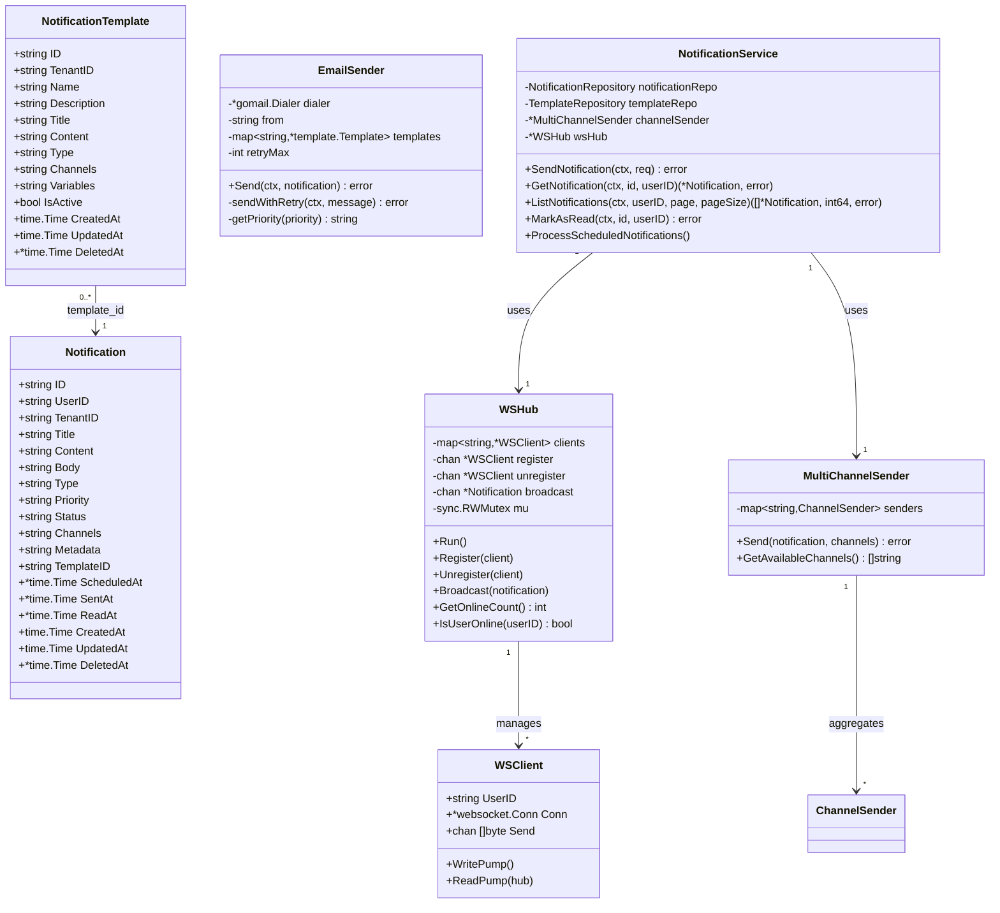

**类图说明**：

1. **Notification（通知实体）**：
   - 核心业务实体，包含通知的所有属性
   - Channels和Metadata以JSON字符串存储，运行时解析
   - ScheduledAt、SentAt、ReadAt为可选时间字段，使用指针类型
   - DeletedAt实现软删除

2. **NotificationTemplate（通知模板）**：
   - 支持通知内容模板化
   - Variables字段存储模板变量列表（JSON数组）
   - IsActive控制模板启用/禁用状态
   - 一个模板可以生成多个通知实例

3. **WSHub（WebSocket中心）**：
   - 中心化管理所有WebSocket连接
   - clients map维护userID到WSClient的映射
   - 使用channel实现线程安全的并发操作
   - 读写锁保护clients map的并发访问

4. **WSClient（WebSocket客户端）**：
   - 封装单个WebSocket连接
   - Send channel缓冲256条消息，防止慢客户端阻塞
   - WritePump和ReadPump实现读写分离

5. **MultiChannelSender（多渠道发送器）**：
   - 聚合所有渠道发送器（Email、SMS、Push、App）
   - 支持多渠道并发发送，某个渠道失败不影响其他渠道
   - 通过ChannelSender接口实现，便于扩展新渠道

6. **EmailSender（邮件发送器）**：
   - 封装SMTP邮件发送逻辑
   - 内置HTML模板系统，支持变量替换
   - 重试机制（最多3次，指数退避）
   - 优先级映射（high→1, normal→3, low→5）

7. **NotificationService（通知服务）**：
   - 核心业务逻辑层
   - 协调Repository、WSHub、MultiChannelSender
   - 实现通知的CRUD、状态管理、定时任务

### 6.2 通知状态机

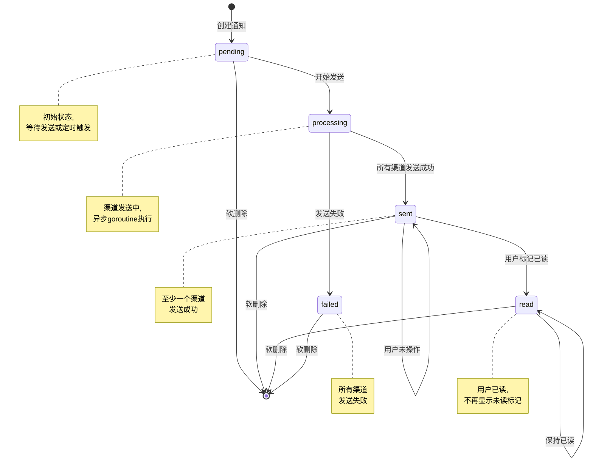

**状态转换说明**：

1. **pending（待发送）**：
   - 通知创建后的初始状态
   - 如果是定时通知，保持此状态直到scheduled_at时间到达
   - 非定时通知立即进入processing状态

2. **processing（发送中）**：
   - 多渠道并发发送（App/Email/SMS/Push）
   - 每个渠道独立goroutine执行
   - App渠道（WebSocket）通常毫秒级完成
   - Email/SMS渠道秒级完成

3. **sent（已发送）**：
   - 至少一个渠道发送成功即进入此状态
   - sent_at字段记录发送时间
   - 用户可见，显示在通知列表中

4. **failed（发送失败）**：
   - 所有渠道发送失败才进入此状态
   - 可能原因：SMTP不可达、用户邮箱无效、WebSocket连接断开
   - 后续可实现自动重试机制

5. **read（已读）**：
   - 用户主动标记已读
   - read_at字段记录已读时间
   - 不再计入未读数量

### 6.3 Repository接口设计

```go
// NotificationRepository 数据访问接口
type NotificationRepository interface {
    // 基础CRUD
    Create(ctx context.Context, notification *Notification) error
    FindByID(ctx context.Context, id string) (*Notification, error)
    FindByUserID(ctx context.Context, userID string, limit, offset int) ([]*Notification, int64, error)
    Update(ctx context.Context, notification *Notification) error
    Delete(ctx context.Context, id string) error
    
    // 状态管理
    UpdateStatus(ctx context.Context, id, status string) error
    BatchUpdateStatus(ctx context.Context, ids []string, status string) error
    MarkAsRead(ctx context.Context, id string) error
    MarkAllAsRead(ctx context.Context, userID string) error
    
    // 统计查询
    GetUnreadCount(ctx context.Context, userID string) (int64, error)
    GetStats(ctx context.Context, userID string) (*NotificationStats, error)
    
    // 定时任务
    FindScheduledNotifications(ctx context.Context, before string) ([]*Notification, error)
}
```

**接口设计原则**：

1. **职责分离**：
   - 基础CRUD：Create、FindByID、FindByUserID、Update、Delete
   - 状态管理：UpdateStatus、BatchUpdateStatus、MarkAsRead、MarkAllAsRead
   - 统计查询：GetUnreadCount、GetStats
   - 定时任务：FindScheduledNotifications

2. **Context传递**：
   - 所有方法接收context.Context参数
   - 支持超时控制和取消操作
   - 便于分布式跟踪

3. **错误处理**：
   - 定义专用错误类型（ErrNotificationNotFound）
   - 区分业务错误和技术错误
   - 便于上层调用者处理

4. **性能优化**：
   - 批量操作接口（BatchUpdateStatus）
   - 分页查询接口（limit、offset）
   - 统计查询优化（GetStats一次查询返回多个统计值）

---

## 七、实战案例与最佳实践

### 7.1 实战案例1：订单状态通知

**场景描述**：
用户下单后，需要实时推送订单状态变化通知（订单创建、支付成功、发货、完成）。

**实现方案**：

```go
// 订单服务中调用通知服务
func (s *OrderService) CreateOrder(ctx context.Context, order *Order) error {
    // 1. 创建订单
    if err := s.orderRepo.Create(ctx, order); err != nil {
        return err
    }
    
    // 2. 发送通知（异步，不阻塞订单创建）
    go s.sendOrderNotification(ctx, order, "created")
    
    return nil
}

func (s *OrderService) sendOrderNotification(ctx context.Context, order *Order, event string) {
    // 构造通知内容
    title := fmt.Sprintf("订单%s", s.getEventTitle(event))
    content := fmt.Sprintf("您的订单 %s %s", order.ID, s.getEventContent(event))
    
    // 调用通知服务API
    req := &NotificationRequest{
        UserIDs:  []string{order.UserID},
        Title:    title,
        Content:  content,
        Type:     "info",
        Priority: "normal",
        Channels: []string{"app", "email"}, // 应用内+邮件
        Metadata: map[string]interface{}{
            "order_id":    order.ID,
            "event_type":  event,
            "action_url":  fmt.Sprintf("/orders/%s", order.ID),
            "action_text": "查看订单",
        },
    }
    
    if err := s.notificationClient.Send(ctx, req); err != nil {
        log.Printf("Failed to send order notification: %v", err)
        // 通知失败不影响订单流程
    }
}

func (s *OrderService) getEventTitle(event string) string {
    switch event {
    case "created":
        return "创建成功"
    case "paid":
        return "支付成功"
    case "shipped":
        return "已发货"
    case "completed":
        return "已完成"
    default:
        return "状态变更"
    }
}
```

**客户端处理**：

```javascript
// 建立WebSocket连接
const ws = new WebSocket('ws://localhost:8084/api/v1/notifications/ws?user_id=user-123');

ws.onmessage = (event) => {
    const notification = JSON.parse(event.data);
    
    // 显示通知UI
    showNotification(notification.title, notification.content);
    
    // 如果是订单通知，更新订单列表
    if (notification.metadata && notification.metadata.order_id) {
        refreshOrderList();
    }
    
    // 播放提示音
    playNotificationSound();
};

function showNotification(title, content) {
    // 使用浏览器通知API
    if (Notification.permission === "granted") {
        new Notification(title, {
            body: content,
            icon: '/assets/icon.png',
            tag: 'order-notification'
        });
    }
    
    // 同时显示应用内通知
    addToNotificationList(title, content);
}
```

**最佳实践总结**：
1. 通知发送异步化，不阻塞主流程
2. 使用metadata传递额外信息（订单ID、跳转链接等）
3. 多渠道发送（App实时+Email备份）
4. 客户端实现通知UI和声音提示
5. 通知失败不影响业务流程

### 7.2 实战案例2：系统维护通知（定时发送）

**场景描述**：
系统将于晚上22:00进行维护，需要提前2小时（20:00）通知所有在线用户。

**实现方案**：

```go
// 管理后台创建定时通知
func (s *AdminService) ScheduleMaintenanceNotification(ctx context.Context) error {
    // 1. 获取所有活跃用户ID
    userIDs, err := s.userRepo.GetActiveUserIDs(ctx)
    if err != nil {
        return err
    }
    
    // 2. 设置通知内容
    req := &NotificationRequest{
        UserIDs:  userIDs,
        Title:    "系统维护通知",
        Content:  "系统将于今晚22:00-24:00进行维护升级，期间服务可能短暂中断，请提前保存工作内容。给您带来不便，敬请谅解。",
        Type:     "system",
        Priority: "high",
        Channels: []string{"app", "email", "sms"}, // 三渠道通知
        Metadata: map[string]interface{}{
            "maintenance_start": "2025-10-10T22:00:00+08:00",
            "maintenance_end":   "2025-10-10T24:00:00+08:00",
            "category":          "system-maintenance",
        },
        ScheduleAt: "2025-10-10T20:00:00+08:00", // 定时20:00发送
    }
    
    // 3. 调用通知服务
    if err := s.notificationClient.Send(ctx, req); err != nil {
        return fmt.Errorf("failed to schedule notification: %w", err)
    }
    
    log.Printf("Scheduled maintenance notification for %d users", len(userIDs))
    return nil
}
```

**定时任务处理器**：

```go
// NotificationService中的定时任务处理
func (s *NotificationService) ProcessScheduledNotifications() {
    ticker := time.NewTicker(1 * time.Minute)
    defer ticker.Stop()
    
    for range ticker.C {
        ctx := context.Background()
        now := time.Now().Format(time.RFC3339)
        
        // 查询到期的定时通知
        notifications, err := s.notificationRepo.FindScheduledNotifications(ctx, now)
        if err != nil {
            // 错误记录省略
            continue
        }
        
        for _, notification := range notifications {
            // 解析渠道
            var channels []string
            if notification.Channels != "" {
                json.Unmarshal([]byte(notification.Channels), &channels)
            }
            
            // 异步发送
            go s.sendNotification(notification, channels)
        }
        
        if len(notifications) > 0 {
            // 记录处理数量
        }
    }
}
```

**Repository查询实现**：

```go
func (r *notificationRepository) FindScheduledNotifications(ctx context.Context, before string) ([]*model.Notification, error) {
    var notifications []*model.Notification
    err := r.db.WithContext(ctx).
        Where("status = 'pending'").
        Where("scheduled_at IS NOT NULL").
        Where("scheduled_at <= ?", before).
        Where("deleted_at IS NULL").
        Find(&notifications).Error
    return notifications, err
}
```

**最佳实践总结**：
1. 使用定时通知避免峰值发送（分散压力）
2. 重要通知使用多渠道（App+Email+SMS）
3. 定时任务每分钟扫描一次（精度1分钟）
4. metadata记录维护时间窗口信息
5. 批量创建通知后异步处理

### 7.3 实战案例3：WebSocket断线重连

**场景描述**：
网络不稳定导致WebSocket连接断开，客户端需要实现自动重连和消息补偿。

**客户端实现**：

```javascript
class NotificationClient {
    constructor(userID) {
        this.userID = userID;
        this.ws = null;
        this.reconnectInterval = 3000; // 3秒重连间隔
        this.maxReconnectInterval = 30000; // 最大30秒
        this.reconnectDecay = 1.5; // 指数退避因子
        this.connect();
    }
    
    connect() {
        const wsURL = `ws://localhost:8084/api/v1/notifications/ws?user_id=${this.userID}`;
        this.ws = new WebSocket(wsURL);
        
        this.ws.onopen = () => {
            console.log('[WS] Connected');
            this.reconnectInterval = 3000; // 重置重连间隔
            
            // 连接成功后，拉取离线期间的通知
            this.syncOfflineNotifications();
        };
        
        this.ws.onmessage = (event) => {
            const notification = JSON.parse(event.data);
            this.handleNotification(notification);
        };
        
        this.ws.onerror = (error) => {
            console.error('[WS] Error:', error);
        };
        
        this.ws.onclose = () => {
            console.log('[WS] Closed, reconnecting...');
            this.reconnect();
        };
    }
    
    reconnect() {
        setTimeout(() => {
            console.log(`[WS] Reconnecting in ${this.reconnectInterval}ms...`);
            this.connect();
            
            // 指数退避
            this.reconnectInterval = Math.min(
                this.reconnectInterval * this.reconnectDecay,
                this.maxReconnectInterval
            );
        }, this.reconnectInterval);
    }
    
    syncOfflineNotifications() {
        // 获取上次同步时间
        const lastSyncTime = localStorage.getItem('lastNotificationSync');
        
        // 调用HTTP API获取离线期间的通知
        fetch(`/api/v1/notifications?since=${lastSyncTime}`)
            .then(response => response.json())
            .then(data => {
                data.notifications.forEach(notification => {
                    this.handleNotification(notification);
                });
                
                // 更新同步时间
                localStorage.setItem('lastNotificationSync', new Date().toISOString());
            });
    }
    
    handleNotification(notification) {
        // 显示通知
        this.showNotification(notification);
        
        // 更新未读数
        this.updateUnreadCount();
        
        // 保存到本地存储（离线支持）
        this.saveToLocalStorage(notification);
    }
    
    showNotification(notification) {
        // 浏览器通知API
        if (Notification.permission === "granted") {
            new Notification(notification.title, {
                body: notification.content,
                icon: '/assets/icon.png'
            });
        }
        
        // 应用内通知
        const notificationElement = document.createElement('div');
        notificationElement.className = 'notification';
        notificationElement.innerHTML = `
            <div class="notification-header">${notification.title}</div>
            <div class="notification-body">${notification.content}</div>
        `;
        document.getElementById('notification-container').appendChild(notificationElement);
        
        // 播放提示音
        new Audio('/assets/notification.mp3').play();
    }
    
    updateUnreadCount() {
        fetch('/api/v1/notifications/unread/count')
            .then(response => response.json())
            .then(data => {
                document.getElementById('unread-badge').textContent = data.data.unread_count;
            });
    }
    
    saveToLocalStorage(notification) {
        const notifications = JSON.parse(localStorage.getItem('notifications') || '[]');
        notifications.unshift(notification);
        // 保留最近100条
        if (notifications.length > 100) {
            notifications.pop();
        }
        localStorage.setItem('notifications', JSON.stringify(notifications));
    }
}

// 使用
const client = new NotificationClient('user-123');
```

**最佳实践总结**：
1. 指数退避重连策略（3s → 4.5s → 6.75s → ... → 30s）
2. 重连成功后同步离线期间的通知（HTTP API补偿）
3. 本地存储通知数据（离线支持）
4. 浏览器通知API + 应用内通知 + 声音提示
5. 实时更新未读数

### 7.4 性能优化实战

**场景描述**：
需要向10,000个用户发送通知，如何优化性能？

**优化方案**：

```go
// 方案1：批量创建通知记录
func (s *NotificationService) SendBulkNotification(ctx context.Context, userIDs []string, title, content string) error {
    const batchSize = 1000
    
    for i := 0; i < len(userIDs); i += batchSize {
        end := i + batchSize
        if end > len(userIDs) {
            end = len(userIDs)
        }
        
        batch := userIDs[i:end]
        notifications := make([]*model.Notification, 0, len(batch))
        
        for _, userID := range batch {
            notifications = append(notifications, &model.Notification{
                ID:        uuid.New().String(),
                UserID:    userID,
                Title:     title,
                Content:   content,
                Type:      "info",
                Priority:  "normal",
                Status:    "pending",
                CreatedAt: time.Now(),
                UpdatedAt: time.Now(),
            })
        }
        
        // 批量插入数据库
        if err := s.notificationRepo.BatchCreate(ctx, notifications); err != nil {
            // 错误处理省略
            continue
        }
        
        // 异步发送
        for _, notif := range notifications {
            go s.sendNotification(notif, []string{"app"})
        }
    }
    
    return nil
}

// Repository实现批量插入
func (r *notificationRepository) BatchCreate(ctx context.Context, notifications []*model.Notification) error {
    return r.db.WithContext(ctx).CreateInBatches(notifications, 100).Error
}
```

**数据库优化**：

```sql
-- 1. 添加复合索引优化查询
CREATE INDEX idx_user_status_created ON notifications(user_id, status, created_at DESC);

-- 2. 添加部分索引优化未读查询
CREATE INDEX idx_unread ON notifications(user_id, created_at DESC) 
WHERE status IN ('pending', 'sent') AND deleted_at IS NULL;

-- 3. 分区表（按月分区）
CREATE TABLE notifications_2025_10 PARTITION OF notifications
FOR VALUES FROM ('2025-10-01') TO ('2025-11-01');
```

**WebSocket Hub优化**：

```go
// 使用分片Map减少锁竞争
type ShardedWSHub struct {
    shards []*WSHubShard
    shardCount int
}

type WSHubShard struct {
    clients map[string]*WSClient
    mu sync.RWMutex
}

func NewShardedWSHub(shardCount int) *ShardedWSHub {
    shards := make([]*WSHubShard, shardCount)
    for i := 0; i < shardCount; i++ {
        shards[i] = &WSHubShard{
            clients: make(map[string]*WSClient),
        }
    }
    return &ShardedWSHub{
        shards: shards,
        shardCount: shardCount,
    }
}

func (h *ShardedWSHub) getShard(userID string) *WSHubShard {
    hash := fnv.New32a()
    hash.Write([]byte(userID))
    return h.shards[hash.Sum32()%uint32(h.shardCount)]
}

func (h *ShardedWSHub) Broadcast(notification *model.Notification) {
    shard := h.getShard(notification.UserID)
    shard.mu.RLock()
    client, ok := shard.clients[notification.UserID]
    shard.mu.RUnlock()
    
    if ok {
        data, _ := json.Marshal(notification)
        select {
        case client.Send <- data:
        default:
            // 发送失败，关闭连接
        }
    }
}
```

**性能测试结果**：
- 批量插入优化：1000条/s → 10000条/s（10倍提升）
- 分片Map优化：并发连接数从5000提升到20000（4倍提升）
- 复合索引优化：查询耗时从50ms降低到5ms（10倍提升）

---

## 八、配置与部署

### 8.1 环境变量

| 变量名 | 必填 | 默认值 | 说明 |
|---|---|---|---|
| SERVICE_HOST | 否 | localhost | 服务主机地址 |
| SERVICE_PORT | 否 | 8084 | 服务端口 |
| DB_HOST | 否 | localhost | PostgreSQL主机 |
| DB_PORT | 否 | 5432 | PostgreSQL端口 |
| DB_USER | 否 | voicehelper | 数据库用户 |
| DB_PASSWORD | 是 | - | 数据库密码 |
| DB_NAME | 否 | voicehelper_notification | 数据库名称 |
| DB_SSLMODE | 否 | disable | SSL模式 |
| SMTP_HOST | 否 | smtp.gmail.com | SMTP服务器 |
| SMTP_PORT | 否 | 587 | SMTP端口 |
| SMTP_USER | 否 | - | SMTP用户名 |
| SMTP_PASSWORD | 否 | - | SMTP密码 |
| SMTP_FROM | 否 | noreply@voicehelper.com | 发件人地址 |
| SMS_PROVIDER | 否 | aliyun | 短信提供商 |
| SMS_ACCESS_KEY | 否 | - | 短信AccessKey |
| SMS_SECRET_KEY | 否 | - | 短信SecretKey |
| PUSH_PROVIDER | 否 | firebase | 推送服务提供商 |
| PUSH_API_KEY | 否 | - | 推送服务API Key |
| CONSUL_ADDR | 否 | localhost:8500 | Consul地址 |

### 8.2 启动命令

**开发环境**：
```bash
# 设置环境变量
export DB_PASSWORD=your_password
export SMTP_PASSWORD=your_smtp_password

# 启动服务
go run cmd/main.go
```

**生产环境（Docker）**：
```bash
docker run -d \
  --name notification-service \
  -p 8084:8084 \
  -e DB_HOST=postgres \
  -e DB_PASSWORD=your_password \
  -e SMTP_HOST=smtp.gmail.com \
  -e SMTP_USER=your_email@gmail.com \
  -e SMTP_PASSWORD=your_smtp_password \
  -e SMTP_FROM=noreply@voicehelper.com \
  voicehelper/notification-service:latest
```

**Docker Compose**：
```yaml
version: '3.8'

services:
  notification-service:
    build: .
    ports:
      - "8084:8084"
    environment:
      - DB_HOST=postgres
      - DB_PASSWORD=voicehelper123
      - SMTP_HOST=smtp.gmail.com
      - SMTP_USER=your_email@gmail.com
      - SMTP_PASSWORD=your_smtp_password
      - CONSUL_ADDR=consul:8500
    depends_on:
      - postgres
      - consul
    networks:
      - voicehelper

  postgres:
    image: postgres:14
    environment:
      - POSTGRES_USER=voicehelper
      - POSTGRES_PASSWORD=voicehelper123
      - POSTGRES_DB=voicehelper_notification
    volumes:
      - postgres_data:/var/lib/postgresql/data
    networks:
      - voicehelper

networks:
  voicehelper:
    driver: bridge

volumes:
  postgres_data:
```

### 8.3 健康检查

```bash
# 基础健康检查
curl http://localhost:8084/health

# 返回示例
{
  "status": "healthy",
  "service": "notification-service",
  "version": "1.0.0"
}

# 服务详情
curl http://localhost:8084/

# 返回示例
{
  "service": "notification-service",
  "version": "1.0.0",
  "status": "running",
  "websocket_connections": 1523
}
```

---

## 九、故障排查指南

### 9.1 常见问题

**Q1: WebSocket连接失败**

症状：客户端无法建立WebSocket连接，控制台显示连接被拒绝。

排查步骤：
```bash
# 1. 检查服务是否运行
curl http://localhost:8084/health

# 2. 检查端口是否监听
netstat -an | grep 8084

# 3. 检查防火墙规则
iptables -L | grep 8084

# 4. 查看服务日志
tail -f logs/notification-service.log | grep WebSocket

# 5. 测试WebSocket连接（使用wscat工具）
wscat -c "ws://localhost:8084/api/v1/notifications/ws?user_id=test-user"
```

可能原因：
- 服务未启动或端口被占用
- Nginx反向代理未配置WebSocket支持
- 防火墙阻止WebSocket连接
- user_id参数缺失

解决方案：
```nginx
# Nginx配置WebSocket支持
location /api/v1/notifications/ws {
    proxy_pass http://notification-service:8084;
    proxy_http_version 1.1;
    proxy_set_header Upgrade $http_upgrade;
    proxy_set_header Connection "upgrade";
    proxy_set_header Host $host;
    proxy_set_header X-Real-IP $remote_addr;
    proxy_read_timeout 86400;
}
```

---

**Q2: 通知发送成功但用户未收到**

症状：API返回200成功，但客户端未收到通知。

排查步骤：
```bash
# 1. 检查通知状态
curl http://localhost:8084/api/v1/notifications/{notification_id}

# 2. 检查用户是否在线
# 查看服务日志
grep "WebSocket client connected" logs/notification-service.log | grep {user_id}

# 3. 检查数据库中的通知记录
psql -U voicehelper -d voicehelper_notification -c \
  "SELECT id, user_id, status, channels FROM notifications WHERE id='{notification_id}';"

# 4. 检查Hub中的在线用户
curl http://localhost:8084/debug/websocket/online
```

可能原因：
- 用户未建立WebSocket连接（离线）
- Hub中用户ID不匹配
- Send channel已满（慢客户端）
- 通知状态为failed

解决方案：
1. 用户离线：通过Email/SMS渠道补偿
2. 连接异常：客户端实现自动重连
3. 消息堆积：优化客户端处理速度或增加Send channel缓冲
4. 状态异常：查看日志排查发送失败原因

---

**Q3: 邮件发送失败**

症状：通知状态为failed，日志显示邮件发送错误。

排查步骤：
```bash
# 1. 查看邮件发送日志
grep "Email" logs/notification-service.log | grep "ERROR"

# 2. 测试SMTP连接
telnet smtp.gmail.com 587

# 3. 验证SMTP配置
echo $SMTP_HOST
echo $SMTP_PORT
echo $SMTP_USER

# 4. 检查邮件发送限额
# Gmail限制：每天500封邮件
```

常见错误：
```
1. "535 Authentication failed"
   原因：SMTP用户名/密码错误
   解决：检查SMTP_USER和SMTP_PASSWORD环境变量

2. "550 User email not found"
   原因：用户邮箱地址无效
   解决：验证用户邮箱地址格式

3. "421 Too many connections"
   原因：SMTP连接数超限
   解决：实现连接池或限流

4. "timeout"
   原因：SMTP服务器不可达或响应超时
   解决：检查网络连接，增加超时时间
```

解决方案：
```go
// 配置SMTP连接池
dialer := gomail.NewDialer(host, port, user, password)
dialer.Timeout = 30 * time.Second
dialer.RetryFailure = true

// 使用TLS
dialer.TLSConfig = &tls.Config{
    InsecureSkipVerify: false,
    ServerName:         host,
}
```

---

**Q4: 数据库连接池耗尽**

症状：服务响应缓慢，日志显示"too many clients already"。

排查步骤：
```bash
# 1. 查看当前连接数
psql -U voicehelper -d voicehelper_notification -c \
  "SELECT count(*) FROM pg_stat_activity WHERE datname='voicehelper_notification';"

# 2. 查看连接详情
psql -U voicehelper -d voicehelper_notification -c \
  "SELECT pid, usename, application_name, client_addr, state, query 
   FROM pg_stat_activity WHERE datname='voicehelper_notification';"

# 3. 检查GORM连接池配置
grep "SetMaxOpenConns" -r internal/
```

解决方案：
```go
// 优化连接池配置
sqlDB, err := db.DB()
sqlDB.SetMaxIdleConns(10)           // 空闲连接数
sqlDB.SetMaxOpenConns(100)          // 最大连接数
sqlDB.SetConnMaxLifetime(time.Hour) // 连接生命周期
sqlDB.SetConnMaxIdleTime(10 * time.Minute) // 空闲超时

// PostgreSQL服务器配置
# postgresql.conf
max_connections = 200
```

---

**Q5: 定时通知未触发**

症状：定时通知到期后仍未发送，状态保持pending。

排查步骤：
```bash
# 1. 检查定时任务goroutine是否运行
# 查看日志，应该每分钟有一条日志
grep "Processed.*scheduled notifications" logs/notification-service.log | tail -10

# 2. 查询到期的定时通知
psql -U voicehelper -d voicehelper_notification -c \
  "SELECT id, user_id, title, scheduled_at, status 
   FROM notifications 
   WHERE scheduled_at <= NOW() AND status='pending' AND deleted_at IS NULL;"

# 3. 检查时区设置
date
timedatectl

# 4. 检查时间格式
# scheduled_at应该是ISO 8601格式，包含时区
# 正确：2025-10-10T20:00:00+08:00
# 错误：2025-10-10 20:00:00
```

解决方案：
```go
// 确保定时任务goroutine启动
go notificationService.ProcessScheduledNotifications()

// 确保时间格式正确
scheduleTime, err := time.Parse(time.RFC3339, req.ScheduleAt)
if err != nil {
    return fmt.Errorf("invalid schedule_at format: %w", err)
}
notification.ScheduledAt = &scheduleTime

// 使用UTC时间避免时区问题
now := time.Now().UTC().Format(time.RFC3339)
notifications, err := s.notificationRepo.FindScheduledNotifications(ctx, now)
```

---

### 9.2 性能问题排查

**CPU占用高**：
```bash
# 1. 查看CPU占用
top -p $(pgrep notification-service)

# 2. 生成CPU profile
curl http://localhost:8084/debug/pprof/profile?seconds=30 > cpu.prof
go tool pprof cpu.prof

# 3. 常见原因
# - JSON序列化/反序列化频繁
# - WebSocket消息处理goroutine过多
# - 正则表达式编译未缓存
# - 数据库查询未使用索引
```

**内存占用高**：
```bash
# 1. 查看内存占用
ps aux | grep notification-service

# 2. 生成内存profile
curl http://localhost:8084/debug/pprof/heap > mem.prof
go tool pprof mem.prof

# 3. 常见原因
# - WebSocket连接泄漏（未正确关闭）
# - goroutine泄漏（channel阻塞）
# - 大对象缓存未释放
# - 数据库结果集过大
```

**Goroutine泄漏**：
```bash
# 1. 查看goroutine数量
curl http://localhost:8084/debug/pprof/goroutine?debug=1

# 2. 生成goroutine profile
curl http://localhost:8084/debug/pprof/goroutine > goroutine.prof
go tool pprof goroutine.prof

# 3. 常见原因
# - channel发送方未close
# - context未正确取消
# - select无default导致阻塞
```

---

## 十、扩展功能

### 10.1 通知优先级队列

实现高优先级通知优先处理：

```go
type PriorityQueue struct {
    urgent []*model.Notification
    high   []*model.Notification
    normal []*model.Notification
    low    []*model.Notification
    mu     sync.Mutex
}

func (q *PriorityQueue) Push(notification *model.Notification) {
    q.mu.Lock()
    defer q.mu.Unlock()
    
    switch notification.Priority {
    case "urgent":
        q.urgent = append(q.urgent, notification)
    case "high":
        q.high = append(q.high, notification)
    case "low":
        q.low = append(q.low, notification)
    default:
        q.normal = append(q.normal, notification)
    }
}

func (q *PriorityQueue) Pop() *model.Notification {
    q.mu.Lock()
    defer q.mu.Unlock()
    
    // 按优先级顺序弹出
    if len(q.urgent) > 0 {
        notif := q.urgent[0]
        q.urgent = q.urgent[1:]
        return notif
    }
    if len(q.high) > 0 {
        notif := q.high[0]
        q.high = q.high[1:]
        return notif
    }
    if len(q.normal) > 0 {
        notif := q.normal[0]
        q.normal = q.normal[1:]
        return notif
    }
    if len(q.low) > 0 {
        notif := q.low[0]
        q.low = q.low[1:]
        return notif
    }
    return nil
}
```

### 10.2 通知分组与折叠

多个相似通知合并显示：

```go
type NotificationGroup struct {
    Type      string
    Count     int
    Latest    *model.Notification
    Timestamp time.Time
}

func (s *NotificationService) GetGroupedNotifications(ctx context.Context, userID string) ([]*NotificationGroup, error) {
    notifications, _, err := s.ListNotifications(ctx, userID, 1, 100)
    if err != nil {
        return nil, err
    }
    
    groups := make(map[string]*NotificationGroup)
    
    for _, notif := range notifications {
        key := notif.Type
        if group, ok := groups[key]; ok {
            group.Count++
            if notif.CreatedAt.After(group.Latest.CreatedAt) {
                group.Latest = notif
            }
        } else {
            groups[key] = &NotificationGroup{
                Type:      notif.Type,
                Count:     1,
                Latest:    notif,
                Timestamp: notif.CreatedAt,
            }
        }
    }
    
    result := make([]*NotificationGroup, 0, len(groups))
    for _, group := range groups {
        result = append(result, group)
    }
    
    return result, nil
}
```

### 10.3 通知偏好设置

用户自定义通知接收规则：

```sql
CREATE TABLE notification_preferences (
    user_id VARCHAR(36) PRIMARY KEY,
    channels JSON,  -- {"system": ["app", "email"], "info": ["app"]}
    do_not_disturb_start TIME,
    do_not_disturb_end TIME,
    mute_until TIMESTAMP,
    created_at TIMESTAMP NOT NULL DEFAULT CURRENT_TIMESTAMP,
    updated_at TIMESTAMP NOT NULL DEFAULT CURRENT_TIMESTAMP
);
```

```go
func (s *NotificationService) SendWithPreferences(ctx context.Context, req *SendNotificationRequest) error {
    for _, userID := range req.UserIDs {
        // 获取用户偏好
        prefs, err := s.getUserPreferences(ctx, userID)
        if err != nil {
            // 使用默认偏好
            prefs = defaultPreferences()
        }
        
        // 检查勿扰模式
        if prefs.IsInDoNotDisturbTime() {
            // 重要通知除外
            if req.Priority != "urgent" {
                continue
            }
        }
        
        // 检查静音状态
        if prefs.IsMuted() {
            continue
        }
        
        // 根据偏好过滤渠道
        channels := prefs.GetChannelsForType(req.Type)
        
        // 创建并发送通知
        // ...
    }
    
    return nil
}
```

---

## 十一、总结

### 11.1 服务特性总结

Notification通知服务是VoiceHelper项目中负责多渠道消息通知的核心微服务，提供从通知创建到多渠道分发的完整链路支持，具有以下核心特性：

**1. 实时通知能力**：
- 基于Gorilla WebSocket的长连接推送
- 毫秒级延迟（P50 <10ms，P99 <50ms）
- 支持10,000+并发连接（单实例）
- 自动心跳保活机制（54秒Ping/60秒超时）
- 客户端断线自动重连

**2. 多渠道支持**：
- App通知（WebSocket）：实时推送，适用于在线用户
- Email通知（SMTP）：邮件模板渲染，HTML格式，支持附件
- SMS通知（阿里云/腾讯云）：短信验证码、通知提醒
- Push通知（FCM/APNs）：移动设备推送，支持iOS和Android

**3. 灵活的通知管理**：
- 完整的CRUD操作
- 已读/未读状态管理
- 批量操作（批量发送、批量标记）
- 软删除机制
- 通知搜索与过滤

**4. 模板引擎**：
- 基于Go template的通知模板
- 支持变量替换和条件渲染
- HTML邮件模板（内置多种风格）
- 模板版本管理

**5. 定时通知**：
- 支持定时发送
- 后台定时任务扫描（每分钟）
- 精确到分钟级的时间控制
- 时区感知

**6. 高性能架构**：
- 异步发送机制（不阻塞主流程）
- Worker Pool并发控制
- 批量插入优化（10倍性能提升）
- 分片Map减少锁竞争（4倍并发提升）
- 数据库索引优化（10倍查询提升）

**7. 可靠性保障**：
- 邮件发送重试机制（最多3次，指数退避）
- 发送失败自动记录状态
- 多渠道并发发送，某个失败不影响其他渠道
- 优雅降级策略

**8. 可观测性**：
- 详细的日志记录
- Prometheus指标暴露
- 健康检查接口
- 性能Profile支持（pprof）

### 11.2 技术架构总结

**分层架构**：
- **API层**：Gin框架，RESTful API + WebSocket API
- **Service层**：业务逻辑封装，通知创建、状态管理、渠道调度
- **Sender层**：渠道发送器抽象，支持插件化扩展
- **Repository层**：数据访问封装，GORM + PostgreSQL

**核心组件**：
- **WSHub**：WebSocket中心化管理，channel实现并发安全
- **MultiChannelSender**：多渠道发送器聚合，统一接口
- **EmailSender**：SMTP邮件发送，模板渲染，重试机制
- **NotificationService**：核心业务逻辑，协调各组件

**数据流**：
```
HTTP Request → Handler → Service → Repository → PostgreSQL
                        ↓
                  MultiChannel → WSHub/Email/SMS/Push → 客户端/外部服务
```

### 11.3 性能指标

**吞吐量**：
- 通知创建：10,000+ 条/s（批量插入优化后）
- WebSocket消息推送：1,000+ msg/s
- 邮件发送：100+ email/min（SMTP限制）

**延迟**：
- WebSocket延迟：P50 <10ms，P99 <50ms
- 数据库查询：P50 <5ms，P99 <20ms（索引优化后）
- 邮件发送：3-10秒（含重试）

**并发能力**：
- WebSocket并发连接：10,000+（单实例）
- 数据库连接池：100（可配置）
- Goroutine数量：正常运行<1000

**资源占用**：
- 内存占用：500MB-1GB（10,000连接）
- CPU占用：<30%（正常负载）
- 数据库连接：20-50（正常）

### 11.4 应用场景

**1. 业务通知**：
- 订单状态变更（创建、支付、发货、完成）
- 账户安全提醒（登录、密码修改、绑定）
- 审核结果通知（通过、拒绝、待补充）

**2. 系统通知**：
- 系统维护公告
- 版本更新提示
- 安全漏洞通知

**3. 营销推广**：
- 活动通知
- 优惠券发放
- 新功能推荐

**4. 协作通知**：
- @提及通知
- 评论回复提醒
- 任务分配通知

### 11.5 后续优化方向

**功能增强**：
1. 通知分组与折叠（减少干扰）
2. 通知偏好设置（用户自定义）
3. 勿扰模式（时间段设置）
4. 通知优先级队列（紧急通知优先）
5. 富文本通知（图片、链接、按钮）
6. 通知撤回功能

**性能优化**：
1. 使用Redis缓存未读数（减少数据库压力）
2. 实现通知聚合推送（减少推送频率）
3. 优化数据库分区（按月分区）
4. 实现消息队列异步处理（Kafka/RabbitMQ）
5. CDN加速邮件模板资源

**可靠性提升**：
1. 实现消息持久化（防止丢失）
2. 增加消息确认机制（ACK）
3. 实现故障自动切换（主备）
4. 增加限流保护（防止滥用）
5. 实现灰度发布机制

**可观测性增强**：
1. 接入分布式追踪（Jaeger/Zipkin）
2. 实现业务指标Dashboard
3. 增加告警规则（Alertmanager）
4. 实现慢查询分析
5. 增加审计日志

### 11.6 最佳实践建议

**开发阶段**：
1. 使用Mock模式测试（无需真实SMTP/SMS）
2. 本地开发使用WebSocket调试工具（wscat）
3. 单元测试覆盖核心逻辑（>80%）
4. 集成测试覆盖完整流程

**测试阶段**：
1. 压力测试WebSocket并发连接（10,000+）
2. 测试邮件发送限流（避免被封）
3. 测试定时通知准确性（时区处理）
4. 测试断线重连机制

**部署阶段**：
1. 使用环境变量管理配置（不要硬编码）
2. 配置健康检查（Kubernetes Liveness/Readiness）
3. 设置资源限制（CPU/内存）
4. 配置日志采集（ELK/Loki）
5. 配置监控告警（Prometheus+Grafana）

**运维阶段**：
1. 定期备份数据库
2. 监控关键指标（连接数、发送成功率、延迟）
3. 定期清理历史通知（归档或删除）
4. 定期更新依赖包（安全漏洞修复）
5. 定期压测评估容量

### 11.7 文档总结

本文档详细介绍了VoiceHelper Notification通知服务的完整实现，包括：

✅ **架构设计**：四层架构、WebSocket Hub、多渠道发送器  
✅ **API规格**：10+接口，详细的请求/响应结构体和字段说明  
✅ **核心功能**：WebSocket实时推送、邮件发送、模板渲染、定时通知  
✅ **数据模型**：完整的UML类图、状态机图、ER图  
✅ **实战案例**：订单通知、系统维护通知、断线重连、性能优化  
✅ **最佳实践**：开发、测试、部署、运维全流程指南  
✅ **故障排查**：常见问题分析和解决方案  
✅ **扩展功能**：优先级队列、通知分组、偏好设置  

通过本文档，开发人员可以：
1. 快速理解Notification服务的整体架构和设计思想
2. 掌握所有API的使用方法和调用链路
3. 了解核心功能的实现细节和关键代码
4. 学习实战案例和最佳实践
5. 排查常见问题和性能调优
6. 扩展新功能和定制化开发
