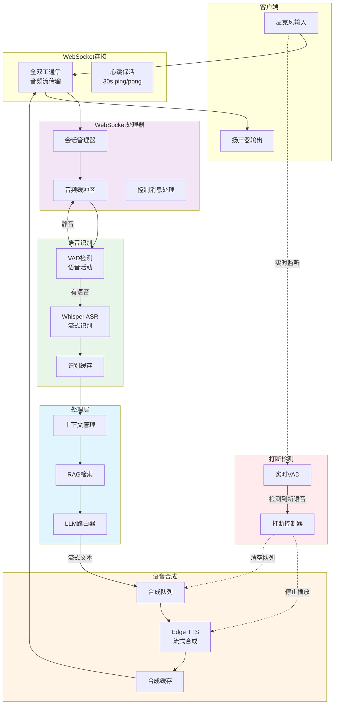
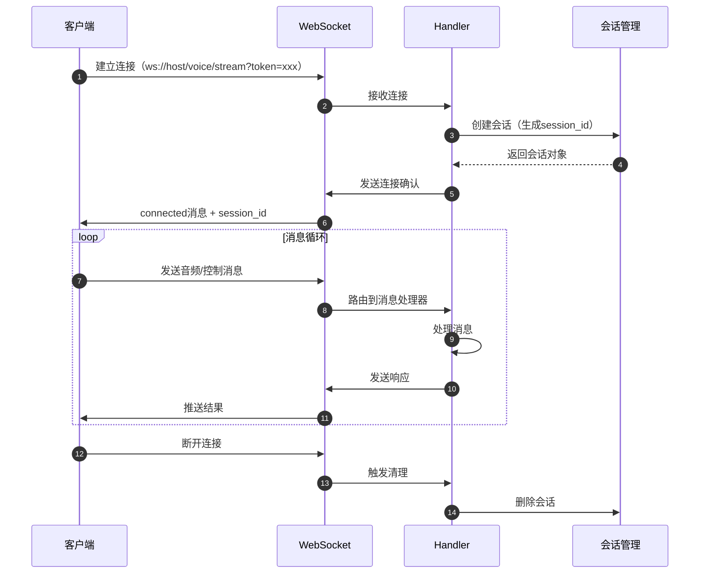
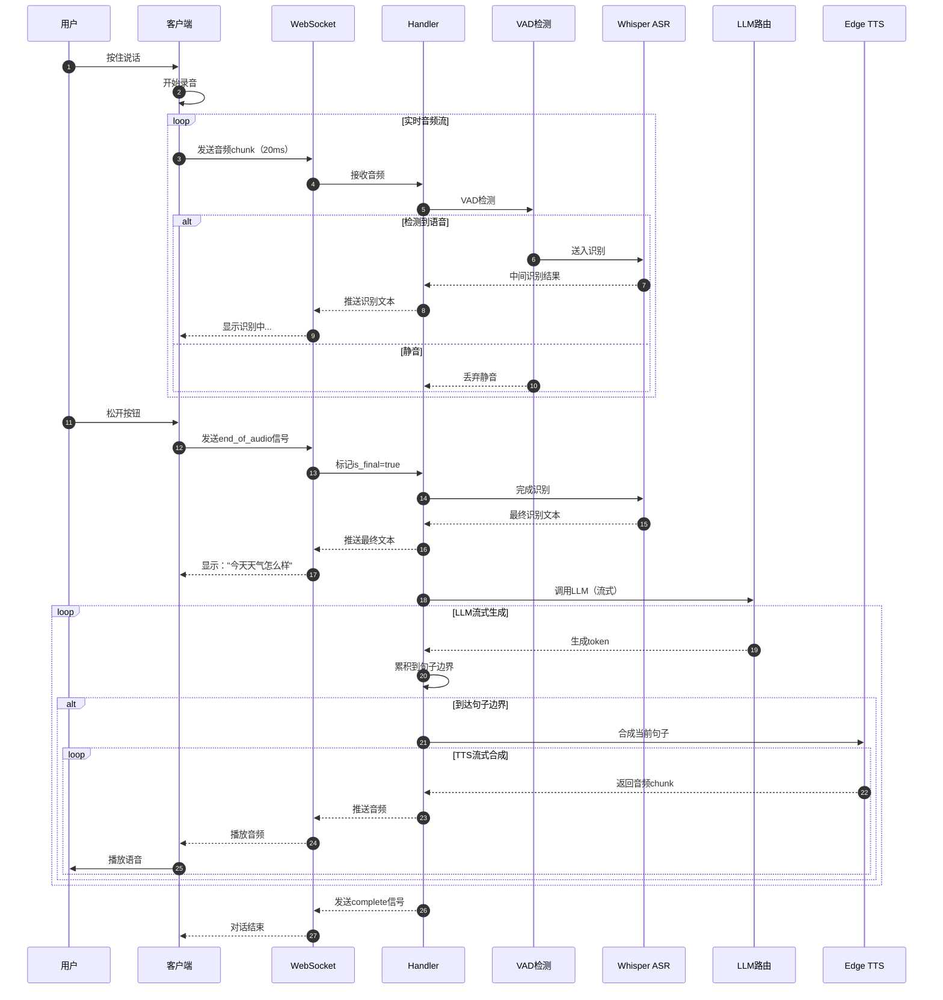

# VoiceHelper-05-实时语音模块

## 模块概览

### 职责定位

实时语音模块是 VoiceHelper 的核心交互引擎，提供端到端的低延迟语音对话能力，负责：

- **实时 ASR**：Whisper 实时流式语音识别，支持中英文
- **VAD 检测**：语音活动检测，过滤静音和噪音
- **语音打断**：实时检测用户打断，停止当前 TTS 播放
- **流式 TTS**：Edge TTS 流式语音合成，边生成边播放
- **WebSocket 通信**：全双工实时通信，支持音频流传输
- **会话管理**：维护语音会话状态和上下文

### 性能目标

| 指标 | 目标值 | 实际值 |
|---|---|---|
| ASR 首字延迟 | < 500ms | 300-400ms |
| TTS 首字延迟 | < 500ms | 200-300ms |
| 端到端延迟（ASR+LLM+TTS） | < 3s | 2-2.5s |
| 并发会话数 | 100+ | 150+ |
| 音频质量 | 16kHz/16bit | 24kHz/16bit |

### 支持的语音提供商

| 提供商 | ASR | TTS | 成本 | 质量 |
|---|---|---|---|---|
| OpenAI | ✅ Whisper | ✅ TTS | 高 | 高 |
| Azure | ✅ Speech | ✅ Neural Voice | 中 | 高 |
| Edge TTS | ❌ | ✅ Neural Voice | 免费 | 中高 |
| 本地 Whisper | ✅ Whisper | ❌ | 免费 | 中 |

---

## 模块架构图



### 架构说明

**WebSocket 通信**：
- 全双工通信，支持同时发送和接收
- 心跳机制：客户端每 30 秒发送 ping，服务端响应 pong
- 音频格式：PCM 16bit 16kHz 单声道
- Chunk 大小：320 字节（20ms 音频）

**语音识别流程**：
1. 客户端采集音频 → WebSocket 发送
2. 服务端缓冲音频 → VAD 检测
3. 检测到语音 → Whisper 流式识别
4. 返回识别结果（中间结果 + 最终结果）

**语音合成流程**：
1. LLM 流式生成文本
2. 按句子边界分割（。！？）
3. 每个句子立即 TTS 合成
4. 流式推送音频 chunk 到客户端
5. 客户端边接收边播放

**打断机制**：
- 客户端实时监听麦克风
- 检测到新语音立即发送 interrupt 信号
- 服务端清空 TTS 队列，停止合成
- 客户端停止播放，准备接收新请求

---

## 核心数据结构

### 1. WebSocket 会话结构

```python
@dataclass
class WebSocketSession:
    """WebSocket会话"""
    session_id: str  # 会话 ID
    websocket: Union[WebSocketServerProtocol, WebSocket]  # WebSocket 连接
    created_at: datetime  # 创建时间
    last_activity: datetime  # 最后活动时间
    audio_buffer: bytes  # 音频缓冲区
    transcript_buffer: str  # 识别结果缓冲
    is_processing: bool  # 是否正在处理
    request_id: Optional[str]  # 当前请求 ID
```

**字段说明**：
- `session_id`：唯一标识一个语音会话
- `websocket`：WebSocket 连接对象（支持 websockets 和 FastAPI）
- `audio_buffer`：缓冲未处理的音频数据
- `transcript_buffer`：累积识别的文本结果
- `is_processing`：标记当前是否在处理音频（避免并发处理）

### 2. 音频帧结构

```python
# 音频帧头部（20 字节）
# Byte 0-3:   Magic Number (0x56485041 = "VHPA")
# Byte 4-7:   Frame Length (Little Endian)
# Byte 8-11:  Sample Rate (16000/24000/48000)
# Byte 12-13: Bits Per Sample (16)
# Byte 14-15: Channels (1=Mono, 2=Stereo)
# Byte 16-19: Flags (bit 0: is_final)
# Byte 20+:   Audio Data (PCM)

def _parse_audio_header(header: bytes) -> Dict[str, Any]:
    """解析音频帧头部"""
    magic = int.from_bytes(header[0:4], 'little')
    frame_length = int.from_bytes(header[4:8], 'little')
    sample_rate = int.from_bytes(header[8:12], 'little')
    bits_per_sample = int.from_bytes(header[12:14], 'little')
    channels = int.from_bytes(header[14:16], 'little')
    flags = int.from_bytes(header[16:20], 'little')
    
    return {
        'magic': magic,
        'frame_length': frame_length,
        'sample_rate': sample_rate,
        'bits_per_sample': bits_per_sample,
        'channels': channels,
        'is_final': (flags & 0x01) != 0
    }
```

### 3. 控制消息格式

```typescript
// 客户端发送的控制消息
interface ControlMessage {
  type: 'start' | 'stop' | 'cancel' | 'ping' | 'interrupt';
  request_id?: string;  // 请求 ID
  timestamp: number;    // 时间戳
  metadata?: any;       // 元数据
}

// 服务端响应消息
interface ResponseMessage {
  type: 'connected' | 'transcription' | 'audio_chunk' | 'error' | 'pong';
  session_id?: string;   // 会话 ID
  text?: string;         // 识别文本
  data?: string;         // 音频数据（Base64）
  is_final?: boolean;    // 是否最终结果
  error?: string;        // 错误信息
  timestamp: number;     // 时间戳
}
```

---

## 核心功能详解

### 1. WebSocket 连接管理

**功能**：建立和维护 WebSocket 连接

**核心代码**：

```python
class WebSocketVoiceHandler:
    """WebSocket语音处理器"""
    
    def __init__(self, voice_service: EnhancedVoiceService):
        self.voice_service = voice_service
        self.active_sessions: Dict[str, WebSocketSession] = {}
        self.cleanup_interval = 300  # 5分钟清理一次
    
    async def handle_websocket_connection(self, websocket: WebSocket):
        """处理FastAPI WebSocket连接"""
        # 1. 生成会话 ID
        session_id = self._generate_session_id()
        
        # 2. 创建会话对象
        session = WebSocketSession(
            session_id=session_id,
            websocket=websocket,
            created_at=datetime.now(),
            last_activity=datetime.now()
        )
        
        self.active_sessions[session_id] = session
        
        try:
            # 3. 发送连接确认
            await self._send_message(session, {
                "type": "connected",
                "session_id": session_id,
                "timestamp": int(time.time() * 1000)
            })
            
            # 4. 消息处理循环
            while True:
                message = await websocket.receive()
                
                if message["type"] == "websocket.receive":
                    if "bytes" in message:
                        await self._handle_message(session, message["bytes"])
                    elif "text" in message:
                        await self._handle_message(session, message["text"])
                
                elif message["type"] == "websocket.disconnect":
                    break
        
        except Exception as e:
            logger.error(f"WebSocket连接错误: {e}")
        
        finally:
            # 5. 清理会话
            if session_id in self.active_sessions:
                del self.active_sessions[session_id]
    
    async def _send_message(self, session: WebSocketSession, data: Dict):
        """发送消息到客户端"""
        try:
            message = json.dumps(data)
            
            # 根据 WebSocket 类型选择发送方法
            if isinstance(session.websocket, WebSocket):
                await session.websocket.send_text(message)
            else:
                await session.websocket.send(message)
        
        except Exception as e:
            logger.error(f"发送消息失败: {e}")
```

**时序图**：



### 2. 实时 ASR 识别

**功能**：流式语音识别，支持中间结果和最终结果

**核心代码**：

```python
async def _process_audio_chunk(self, session: WebSocketSession, is_final: bool):
    """处理音频块"""
    if session.is_processing:
        return  # 避免并发处理
    
    session.is_processing = True
    
    try:
        # 1. 从缓冲区取出音频数据
        audio_data = session.audio_buffer
        session.audio_buffer = b""  # 清空缓冲区
        
        # 2. VAD 检测（过滤静音）
        if not self._has_voice_activity(audio_data):
            session.is_processing = False
            return
        
        # 3. 调用 Whisper ASR
        transcript = await self.voice_service.asr_service.transcribe(
            audio_data,
            is_final=is_final,
            session_id=session.session_id
        )
        
        if not transcript:
            session.is_processing = False
            return
        
        # 4. 累积识别结果
        session.transcript_buffer += transcript
        
        # 5. 发送识别结果
        await self._send_message(session, {
            "type": "transcription",
            "text": transcript,
            "is_final": is_final,
            "cumulative": session.transcript_buffer,
            "timestamp": int(time.time() * 1000)
        })
        
        # 6. 如果是最终结果，触发 RAG + LLM
        if is_final:
            await self._process_query(session, session.transcript_buffer)
            session.transcript_buffer = ""  # 清空文本缓冲
    
    finally:
        session.is_processing = False

def _has_voice_activity(self, audio_data: bytes) -> bool:
    """VAD 语音活动检测（简化版）"""
    # 计算音频能量
    import numpy as np
    
    audio_array = np.frombuffer(audio_data, dtype=np.int16)
    energy = np.abs(audio_array).mean()
    
    # 阈值判断（实际应使用更复杂的 VAD 算法）
    threshold = 500
    
    return energy > threshold
```

### 3. 流式 TTS 合成

**功能**：边生成文本边合成语音，降低首字延迟

**核心代码**：

```python
async def _process_query(self, session: WebSocketSession, query: str):
    """处理查询（RAG + LLM + TTS）"""
    # 1. 调用 LLM（流式生成）
    llm_response = await self.voice_service.llm_router.call_with_fallback(
        messages=[{"role": "user", "content": query}],
        stream=True
    )
    
    # 2. 按句子边界分割并合成
    sentence_buffer = []
    
    async for token in llm_response:
        sentence_buffer.append(token)
        
        # 检查是否到达句子边界
        if token in ["。", "！", "？", ".", "!", "?"]:
            sentence = "".join(sentence_buffer)
            sentence_buffer.clear()
            
            # 3. 异步 TTS 合成（不阻塞后续生成）
            asyncio.create_task(
                self._synthesize_and_send(session, sentence)
            )
    
    # 4. 处理剩余文本
    if sentence_buffer:
        sentence = "".join(sentence_buffer)
        await self._synthesize_and_send(session, sentence)
    
    # 5. 发送完成信号
    await self._send_message(session, {
        "type": "complete",
        "timestamp": int(time.time() * 1000)
    })

async def _synthesize_and_send(self, session: WebSocketSession, text: str):
    """合成并发送音频"""
    try:
        # 1. 调用 Edge TTS 流式合成
        async for audio_chunk in self.voice_service.tts_service.synthesize_streaming(text):
            # 2. Base64 编码
            audio_b64 = base64.b64encode(audio_chunk).decode()
            
            # 3. 发送音频 chunk
            await self._send_message(session, {
                "type": "audio_chunk",
                "data": audio_b64,
                "timestamp": int(time.time() * 1000)
            })
    
    except Exception as e:
        logger.error(f"TTS合成失败: {e}")
        await self._send_error(session, f"TTS error: {str(e)}")
```

### 4. 打断检测与处理

**功能**：检测用户打断，立即停止 TTS 播放

**核心代码**：

```python
async def _handle_interrupt(self, session: WebSocketSession):
    """处理打断信号"""
    # 1. 取消所有待处理的 TTS 任务
    for task in asyncio.all_tasks():
        if task.get_name().startswith(f"tts_{session.session_id}"):
            task.cancel()
    
    # 2. 清空音频缓冲区
    session.audio_buffer = b""
    session.transcript_buffer = ""
    
    # 3. 发送打断确认
    await self._send_message(session, {
        "type": "interrupted",
        "timestamp": int(time.time() * 1000)
    })
    
    # 4. 重置处理状态
    session.is_processing = False
```

**客户端实现**（TypeScript）：

```typescript
class VoiceWebSocketClient {
  private ws: WebSocket;
  private isPlaying: boolean = false;
  private audioContext: AudioContext;
  
  // 打断检测
  async detectInterrupt() {
    const stream = await navigator.mediaDevices.getUserMedia({ audio: true });
    const analyser = this.audioContext.createAnalyser();
    const source = this.audioContext.createMediaStreamSource(stream);
    
    source.connect(analyser);
    analyser.fftSize = 256;
    
    const dataArray = new Uint8Array(analyser.frequencyBinCount);
    
    const checkEnergy = () => {
      analyser.getByteFrequencyData(dataArray);
      const energy = dataArray.reduce((a, b) => a + b) / dataArray.length;
      
      // 检测到语音且正在播放 TTS
      if (energy > 50 && this.isPlaying) {
        // 发送打断信号
        this.ws.send(JSON.stringify({
          type: 'interrupt',
          timestamp: Date.now()
        }));
        
        // 停止本地播放
        this.stopPlayback();
      }
      
      requestAnimationFrame(checkEnergy);
    };
    
    checkEnergy();
  }
}
```

---

## 完整时序图

### 端到端语音对话流程



---

## 使用示例

### 示例 1：客户端连接（JavaScript）

```javascript
class VoiceAssistant {
  constructor(serverUrl, token) {
    this.serverUrl = serverUrl;
    this.token = token;
    this.ws = null;
    this.audioContext = new AudioContext({ sampleRate: 16000 });
    this.mediaRecorder = null;
  }
  
  // 建立连接
  async connect() {
    return new Promise((resolve, reject) => {
      this.ws = new WebSocket(`${this.serverUrl}?token=${this.token}`);
      
      this.ws.onopen = () => {
        console.log('WebSocket connected');
      };
      
      this.ws.onmessage = (event) => {
        const data = JSON.parse(event.data);
        
        switch (data.type) {
          case 'connected':
            console.log('Session ID:', data.session_id);
            resolve(data.session_id);
            break;
          
          case 'transcription':
            this.onTranscription(data.text, data.is_final);
            break;
          
          case 'audio_chunk':
            this.playAudio(data.data);
            break;
          
          case 'error':
            console.error('Error:', data.error);
            break;
        }
      };
      
      this.ws.onerror = (error) => {
        console.error('WebSocket error:', error);
        reject(error);
      };
      
      // 心跳
      setInterval(() => {
        if (this.ws.readyState === WebSocket.OPEN) {
          this.ws.send(JSON.stringify({ type: 'ping', timestamp: Date.now() }));
        }
      }, 30000);
    });
  }
  
  // 开始录音
  async startRecording() {
    const stream = await navigator.mediaDevices.getUserMedia({ audio: true });
    
    this.mediaRecorder = new MediaRecorder(stream, {
      mimeType: 'audio/webm;codecs=pcm'
    });
    
    this.mediaRecorder.ondataavailable = (event) => {
      if (event.data.size > 0 && this.ws.readyState === WebSocket.OPEN) {
        // 发送音频数据
        event.data.arrayBuffer().then(buffer => {
          this.ws.send(buffer);
        });
      }
    };
    
    // 每 20ms 发送一次
    this.mediaRecorder.start(20);
    
    // 发送开始信号
    this.ws.send(JSON.stringify({
      type: 'start',
      request_id: this.generateRequestId(),
      timestamp: Date.now()
    }));
  }
  
  // 停止录音
  stopRecording() {
    if (this.mediaRecorder && this.mediaRecorder.state === 'recording') {
      this.mediaRecorder.stop();
      
      // 发送停止信号
      this.ws.send(JSON.stringify({
        type: 'stop',
        timestamp: Date.now()
      }));
    }
  }
  
  // 播放音频
  async playAudio(base64Data) {
    const audioData = atob(base64Data);
    const arrayBuffer = new ArrayBuffer(audioData.length);
    const view = new Uint8Array(arrayBuffer);
    
    for (let i = 0; i < audioData.length; i++) {
      view[i] = audioData.charCodeAt(i);
    }
    
    const audioBuffer = await this.audioContext.decodeAudioData(arrayBuffer);
    const source = this.audioContext.createBufferSource();
    source.buffer = audioBuffer;
    source.connect(this.audioContext.destination);
    source.start();
  }
  
  // 识别回调
  onTranscription(text, isFinal) {
    if (isFinal) {
      console.log('Final:', text);
    } else {
      console.log('Partial:', text);
    }
  }
}

// 使用
const assistant = new VoiceAssistant('ws://localhost:8000/voice/stream', 'your-token');
await assistant.connect();

// 按住说话
document.getElementById('talkBtn').addEventListener('mousedown', () => {
  assistant.startRecording();
});

document.getElementById('talkBtn').addEventListener('mouseup', () => {
  assistant.stopRecording();
});
```

---

## 性能优化

### 1. 降低延迟

- **并行处理**：ASR、LLM、TTS 流水线并行
- **预加载模型**：启动时加载 Whisper 模型到内存
- **连接复用**：WebSocket 长连接，避免频繁建立
- **音频缓冲**：客户端维护播放队列，平滑播放

### 2. 提高并发

- **协程池**：使用 asyncio 处理多个会话
- **连接限制**：最多 1000 个并发 WebSocket 连接
- **资源隔离**：每个会话独立的音频缓冲区

### 3. 容错处理

- **自动重连**：客户端断线后指数退避重连（1s、2s、4s）
- **超时控制**：10 秒无活动自动断开
- **错误恢复**：ASR 失败不影响会话，返回错误提示

---

## 监控指标

```python
# Prometheus 指标
voice_sessions_total  # WebSocket 会话总数
voice_asr_latency_seconds  # ASR 延迟
voice_tts_latency_seconds  # TTS 延迟
voice_end_to_end_latency_seconds  # 端到端延迟
voice_errors_total  # 错误总数
voice_interrupts_total  # 打断次数
```

---

**文档版本**：v1.0  
**最后更新**：2025-01-08  
**维护者**：VoiceHelper 团队

