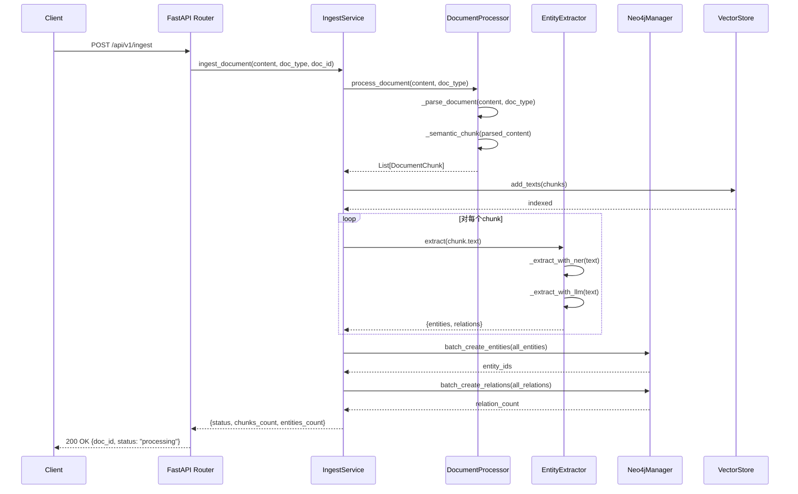
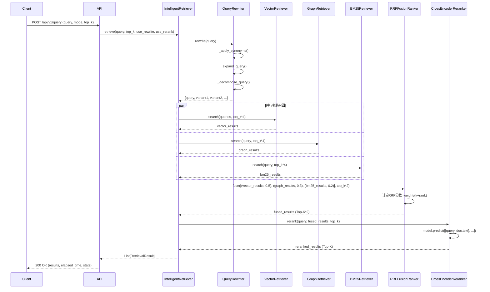
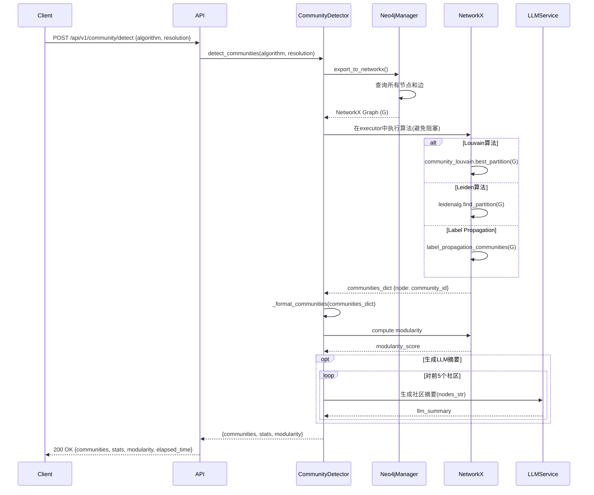

# VoiceHelper-06-GraphRAG服务

## 一、模块概览

### 1.1 职责定位

GraphRAG服务是VoiceHelper的核心算法服务之一,专注于构建和检索知识图谱,提供企业级的文档理解和智能问答能力。

**核心职责**:
- **文档摄取**:解析多种格式文档,进行语义分块和向量化
- **实体提取**:从文本中提取实体和关系,支持NER+LLM双路径
- **图谱构建**:在Neo4j中构建知识图谱,支持社区检测和图谱分析
- **混合检索**:整合向量检索、图谱检索、BM25检索,提供高质量结果
- **智能问答**:基于检索增强生成(RAG)提供精准答案

**技术特性**:
- FastAPI异步框架,高并发处理
- 语义分块,保持文本语义完整性
- 查询改写,提升召回率
- RRF融合+CrossEncoder重排,提升精排准确性
- 支持社区检测,发现知识聚类
- 语义缓存,加速重复查询

### 1.2 架构设计

```
┌─────────────────────────────────────────────────────────────────┐
│                      GraphRAG Service                           │
├─────────────────────────────────────────────────────────────────┤
│  FastAPI Application                                            │
│  ┌───────────────┐  ┌───────────────┐  ┌───────────────┐      │
│  │   Routes      │  │  Middleware   │  │  Lifespan     │      │
│  │  (routes.py)  │  │  (CORS, Log)  │  │  Management   │      │
│  └───────────────┘  └───────────────┘  └───────────────┘      │
├─────────────────────────────────────────────────────────────────┤
│  Core Modules                                                   │
│  ┌─────────────────────────────────────────────────────────┐   │
│  │  Ingest Pipeline                                        │   │
│  │  ┌──────────────┐  ┌──────────────┐  ┌──────────────┐ │   │
│  │  │   Document   │→ │   Chunker    │→ │   Vector     │ │   │
│  │  │   Processor  │  │  (Semantic)  │  │   Store      │ │   │
│  │  └──────────────┘  └──────────────┘  └──────────────┘ │   │
│  │         ↓                                               │   │
│  │  ┌──────────────┐  ┌──────────────┐                   │   │
│  │  │   Entity     │→ │    Graph     │                   │   │
│  │  │   Extractor  │  │   Builder    │                   │   │
│  │  └──────────────┘  └──────────────┘                   │   │
│  └─────────────────────────────────────────────────────────┘   │
│  ┌─────────────────────────────────────────────────────────┐   │
│  │  Retrieval Pipeline                                     │   │
│  │  ┌──────────────┐                                       │   │
│  │  │    Query     │                                       │   │
│  │  │   Rewriter   │                                       │   │
│  │  └───────┬──────┘                                       │   │
│  │          ↓                                               │   │
│  │  ┌──────────────┐  ┌──────────────┐  ┌──────────────┐ │   │
│  │  │   Vector     │  │    Graph     │  │    BM25      │ │   │
│  │  │  Retriever   │  │  Retriever   │  │  Retriever   │ │   │
│  │  └──────┬───────┘  └──────┬───────┘  └──────┬───────┘ │   │
│  │         └──────────────────┼──────────────────┘         │   │
│  │                            ↓                             │   │
│  │                  ┌──────────────────┐                   │   │
│  │                  │   RRF Fusion     │                   │   │
│  │                  │     Ranker       │                   │   │
│  │                  └─────────┬────────┘                   │   │
│  │                            ↓                             │   │
│  │                  ┌──────────────────┐                   │   │
│  │                  │  CrossEncoder    │                   │   │
│  │                  │    Reranker      │                   │   │
│  │                  └──────────────────┘                   │   │
│  └─────────────────────────────────────────────────────────┘   │
│  ┌─────────────────────────────────────────────────────────┐   │
│  │  Community Detection                                    │   │
│  │  ┌──────────────┐  ┌──────────────┐                   │   │
│  │  │   Louvain/   │→ │   Subgraph   │                   │   │
│  │  │    Leiden    │  │   Analysis   │                   │   │
│  │  └──────────────┘  └──────────────┘                   │   │
│  └─────────────────────────────────────────────────────────┘   │
├─────────────────────────────────────────────────────────────────┤
│  External Dependencies                                          │
│  ┌──────────┐  ┌──────────┐  ┌──────────┐  ┌──────────┐      │
│  │  Neo4j   │  │  FAISS   │  │  Redis   │  │   LLM    │      │
│  │ (Graph)  │  │ (Vector) │  │ (Cache)  │  │ Router   │      │
│  └──────────┘  └──────────┘  └──────────┘  └──────────┘      │
└─────────────────────────────────────────────────────────────────┘
```

**设计特点**:
- **分层架构**:API层、服务层、数据层清晰分离
- **管道模式**:摄取和检索均采用管道设计,模块可插拔
- **异步并发**:多路检索并行执行,RRF融合
- **降级策略**:各环节都有fallback,确保鲁棒性

---

## 二、API规格说明

### 2.1 文档摄取API

#### POST /api/v1/ingest

**功能描述**:
摄取文档内容,进行分块、实体提取、图谱构建和向量索引。支持后台异步处理。

**请求参数**:
```python
class IngestRequest(BaseModel):
    content: str              # 文档内容(必填)
    doc_type: str = "text"    # 文档类型: text/markdown/pdf/html
    title: Optional[str]      # 文档标题
    metadata: Optional[Dict]  # 元数据(可选)
    build_graph: bool = True  # 是否构建图谱
```

**响应格式**:
```json
{
    "code": 200,
    "message": "success",
    "data": {
        "doc_id": "doc_1697012345678",
        "status": "processing",
        "message": "文档摄取任务已创建",
        "elapsed_time": 0.123
    }
}
```

**核心代码**:
```python
@router.post("/ingest")
async def ingest_document(request: IngestRequest, background_tasks: BackgroundTasks):
    # 初始化服务组件
    entity_extractor = EntityRelationExtractor(llm_router_url=llm_router_url)
    graph_builder = Neo4jManager(uri=neo4j_uri, user=neo4j_user, password=neo4j_password)
    ingest_service = IngestService(
        entity_extractor=entity_extractor,
        graph_builder=graph_builder
    )
    
    doc_id = request.title or f"doc_{int(time.time() * 1000)}"
    
    # 后台异步处理
    async def process_ingest_task():
        result = await ingest_service.ingest_document(
            content=request.content,
            doc_type=request.doc_type,
            doc_id=doc_id,
            metadata=request.metadata or {},
            build_graph=request.build_graph
        )
        # 处理结果记录
    
    background_tasks.add_task(process_ingest_task)
    return success_response({...})
```

**调用链路**:
```
1. POST /api/v1/ingest
   ↓
2. IngestService.ingest_document()
   ├─→ DocumentProcessor.process_document()      # 文档解析和分块
   │   ├─→ _parse_document()                     # 格式解析
   │   └─→ _semantic_chunk()                     # 语义分块
   ├─→ VectorStore.add_texts()                   # 向量索引
   └─→ _build_graph()                            # 图谱构建
       ├─→ EntityExtractor.extract()             # 实体提取
       │   ├─→ _extract_with_ner()               # NER路径
       │   └─→ _extract_with_llm()               # LLM路径
       ├─→ Neo4jManager.batch_create_entities()  # 批量创建实体
       └─→ Neo4jManager.batch_create_relations() # 批量创建关系
```

**最佳实践**:
- 大文档建议分批摄取,避免超时
- 使用`build_graph=False`可跳过图谱构建,加快处理速度
- 为文档添加丰富的元数据,便于后续过滤检索

---

### 2.2 智能检索API

#### POST /api/v1/query

**功能描述**:
执行混合检索,整合向量、图谱、BM25三路召回,经RRF融合和CrossEncoder重排后返回相关文档片段。

**请求参数**:
```python
class QueryRequest(BaseModel):
    query: str                         # 查询文本(必填)
    mode: str = "hybrid"               # 检索模式: vector_only/graph_only/hybrid
    top_k: int = Field(10, ge=1, le=100)  # 返回结果数量
```

**响应格式**:
```json
{
    "code": 200,
    "message": "success",
    "data": {
        "query": "什么是GraphRAG?",
        "mode": "hybrid",
        "results": [
            {
                "document_id": "doc-123",
                "chunk_id": "doc-123_5",
                "text": "GraphRAG是一种结合知识图谱的检索增强生成技术...",
                "score": 0.95,
                "source": "vector",
                "metadata": {"doc_type": "pdf", "page": 5}
            }
        ],
        "total": 10,
        "elapsed_time": 0.28,
        "stats": {
            "total_queries": 142,
            "avg_latency_ms": 265
        }
    }
}
```

**核心代码**:
```python
@router.post("/query")
async def query_documents(request: QueryRequest):
    # 获取智能检索器(懒加载)
    retriever = get_intelligent_retriever()
    
    # 根据mode设置权重
    weights = {
        'vector_only': {'vector': 1.0, 'graph': 0.0, 'bm25': 0.0},
        'graph_only': {'vector': 0.0, 'graph': 1.0, 'bm25': 0.0},
        'hybrid': {'vector': 0.5, 'graph': 0.3, 'bm25': 0.2}
    }[request.mode]
    
    # 执行智能检索
    results = await retriever.retrieve(
        query=request.query,
        top_k=request.top_k,
        use_rewrite=True,    # 查询改写
        use_rerank=True,     # CrossEncoder重排
        weights=weights
    )
    
    response_results = [r.to_dict() for r in results]
    return success_response({...})
```

**调用链路**:
```
1. POST /api/v1/query
   ↓
2. IntelligentRetriever.retrieve()
   ├─→ _rewrite_query()                        # 查询改写
   │   └─→ QueryRewriter.rewrite()
   │       ├─→ _apply_synonyms()               # 同义词替换
   │       ├─→ _expand_query()                 # 查询扩展
   │       └─→ _decompose_query()              # 问题分解
   ├─→ _multi_recall()                         # 并行多路召回
   │   ├─→ _vector_retrieve()                  # 向量检索(FAISS)
   │   ├─→ _graph_retrieve()                   # 图谱检索(Neo4j)
   │   └─→ _bm25_retrieve()                    # BM25检索
   ├─→ _fusion_ranking()                       # RRF融合
   │   └─→ RRFFusionRanker.fuse()
   │       └─→ 计算RRF分数: weight/(k+rank)
   └─→ _rerank_results()                       # CrossEncoder重排
       └─→ CrossEncoderReranker.rerank()
           └─→ model.predict(query-doc pairs)
```

**最佳实践**:
- 一般场景使用`mode=hybrid`,平衡召回和精度
- 纯语义匹配场景使用`mode=vector_only`
- 需要推理和多跳查询时使用`mode=graph_only`
- `top_k`设置为5-10即可满足大部分需求

---

### 2.3 社区检测API

#### POST /api/v1/community/detect

**功能描述**:
在知识图谱中执行社区检测,发现实体聚类,支持Louvain和Leiden算法。

**请求参数**:
```python
class CommunityDetectRequest(BaseModel):
    algorithm: str = "louvain"          # 算法: leiden/louvain
    resolution: float = Field(1.0, ge=0.1, le=10.0)  # 分辨率参数
```

**响应格式**:
```json
{
    "code": 200,
    "message": "success",
    "data": {
        "algorithm": "louvain",
        "communities": [
            {
                "community_id": 0,
                "size": 15,
                "nodes": ["实体1", "实体2", ...],
                "summary": "包含: 实体1, 实体2 等15个节点",
                "llm_summary": "这个社区主要讨论机器学习相关概念..."
            }
        ],
        "stats": {
            "total_communities": 5,
            "total_nodes": 100,
            "total_edges": 250,
            "avg_community_size": 20.0
        },
        "modularity": 0.82,
        "elapsed_time": 1.234
    }
}
```

**核心代码**:
```python
@router.post("/community/detect")
async def detect_communities(request: CommunityDetectRequest):
    # 初始化组件
    graph_manager = Neo4jManager(uri=neo4j_uri, user=neo4j_user, password=neo4j_password)
    detector = CommunityDetector(graph_manager)
    
    # 执行社区检测
    result = await detector.detect_communities(
        algorithm=request.algorithm,
        resolution=request.resolution,
        min_community_size=3
    )
    
    # 为前5个社区生成LLM摘要(可选)
    if llm_router_url:
        extractor = EntityRelationExtractor(llm_router_url=llm_router_url)
        for community in result["communities"][:5]:
            nodes_str = ", ".join(community["nodes"][:10])
            summary = await extractor._generate_community_summary(nodes_str)
            community["llm_summary"] = summary
    
    return success_response({...})
```

**调用链路**:
```
1. POST /api/v1/community/detect
   ↓
2. CommunityDetector.detect_communities()
   ├─→ graph_manager.export_to_networkx()      # 导出NetworkX图
   ├─→ _detect_communities_sync()              # 社区检测(在executor中运行)
   │   ├─→ Louvain算法 (python-louvain)
   │   ├─→ Leiden算法 (leidenalg)
   │   └─→ Label Propagation (NetworkX内置)
   ├─→ _format_communities()                   # 格式化社区
   ├─→ nx.algorithms.community.modularity()    # 计算模块度
   └─→ _compute_stats()                        # 统计信息
```

**最佳实践**:
- Louvain算法速度快,适合大规模图谱
- Leiden算法质量更高,适合中小规模图谱
- `resolution`参数控制社区粒度:值越大,社区越小越多
- 定期执行社区检测,发现知识结构变化

---

### 2.4 图谱统计API

#### GET /api/v1/stats

**功能描述**:
获取知识图谱的统计信息,包括节点数、关系数、类型分布等。

**响应格式**:
```json
{
    "code": 200,
    "message": "success",
    "data": {
        "total_nodes": 1523,
        "total_relationships": 4287,
        "node_labels": {
            "Entity": 1200,
            "Concept": 323
        },
        "relationship_types": {
            "RELATED_TO": 2100,
            "BELONGS_TO": 1200,
            "IS_A": 987
        }
    }
}
```

**核心代码**:
```python
@router.get("/stats")
async def get_graph_stats():
    graph_manager = Neo4jManager(uri=neo4j_uri, user=neo4j_user, password=neo4j_password)
    stats = await graph_manager.get_stats()
    return success_response(stats)
```

---

## 三、核心功能实现

### 3.1 文档摄取与处理

#### 3.1.1 文档处理器

`DocumentProcessor`负责解析文档和语义分块。

**关键特性**:
- 支持多种格式:text、markdown、html、pdf
- 语义分块:保持句子和段落完整性
- 自适应块大小:根据文本特征动态调整
- 块重叠:提升检索召回率

**核心代码**:
```python
class DocumentProcessor:
    def __init__(
        self,
        chunk_size: int = 500,
        min_chunk_size: int = 100,
        max_chunk_size: int = 1000,
        chunk_overlap: int = 50
    ):
        # 初始化参数
    
    async def process_document(
        self,
        content: str,
        doc_type: str = "text",
        doc_id: Optional[str] = None,
        metadata: Optional[Dict] = None
    ) -> List[DocumentChunk]:
        # 1. 解析文档
        parsed_content = await self._parse_document(content, doc_type)
        
        # 2. 语义分块
        chunks = await self._semantic_chunk(parsed_content, doc_id, metadata)
        
        return chunks
    
    async def _parse_document(self, content: str, doc_type: str) -> str:
        if doc_type == "markdown":
            # 移除markdown标记
            text = re.sub(r'```[^\n]*\n.*?```', '', content, flags=re.DOTALL)
            text = re.sub(r'`[^`]*`', '', text)
            text = re.sub(r'\[([^\]]+)\]\([^\)]+\)', r'\1', text)
            return text.strip()
        elif doc_type == "html":
            # 移除HTML标签
            text = re.sub(r'<script.*?</script>', '', content, flags=re.DOTALL)
            text = re.sub(r'<[^>]+>', '', text)
            return text.strip()
        # 其他格式处理...
    
    def _create_chunks(
        self,
        text: str,
        sentences: List[str],
        doc_id: Optional[str],
        metadata: Optional[Dict]
    ) -> List[DocumentChunk]:
        chunks = []
        current_chunk_sentences = []
        current_chunk_size = 0
        
        for sentence in sentences:
            # 检查是否需要创建新块
            if current_chunk_size >= self.chunk_size or \
               current_chunk_size + len(sentence) > self.max_chunk_size:
                # 创建块
                chunk_text = '。'.join(current_chunk_sentences)
                chunk = DocumentChunk(...)
                chunks.append(chunk)
                
                # 保留重叠句子
                current_chunk_sentences = current_chunk_sentences[-self.chunk_overlap:]
            
            current_chunk_sentences.append(sentence)
            current_chunk_size += len(sentence)
        
        return chunks
```

**数据流图**:
```
文档内容
   ↓
格式解析 (markdown/html/pdf → 纯文本)
   ↓
句子分割 (正则分割)
   ↓
语义分块 (根据chunk_size和语义边界)
   ↓
DocumentChunk列表
```

---

#### 3.1.2 实体关系提取

`EntityRelationExtractor`支持NER和LLM双路径提取。

**核心代码**:
```python
class EntityRelationExtractor:
    def __init__(
        self,
        llm_router_url: str,
        use_ner: bool = True,
        use_llm: bool = True
    ):
        # 加载spaCy NER模型
        if use_ner:
            import spacy
            self.nlp = spacy.load("zh_core_web_lg")
    
    async def extract(
        self,
        text: str,
        min_confidence: float = 0.5
    ) -> Dict[str, Any]:
        entities = []
        relations = []
        
        # 路径1: NER提取
        if self.use_ner:
            ner_entities = await self._extract_with_ner(text)
            entities.extend(ner_entities)
        
        # 路径2: LLM提取
        if self.use_llm:
            llm_results = await self._extract_with_llm(text)
            entities.extend(llm_results.get("entities", []))
            relations.extend(llm_results.get("relations", []))
        
        # 去重和过滤
        entities = self._deduplicate_entities(entities)
        relations = self._deduplicate_relations(relations)
        entities = [e for e in entities if e.get("confidence", 1.0) >= min_confidence]
        
        return {"entities": entities, "relations": relations}
    
    async def _extract_with_llm(self, text: str) -> Dict:
        # 构建提示词
        prompt = f"""从以下文本中提取实体和关系。

文本: {text[:1000]}

要求:
1. 提取所有重要实体（人物、地点、组织、概念等）
2. 提取实体之间的关系
3. 用JSON格式返回

格式:
{{
    "entities": [{{"name": "实体名", "type": "类型", "description": "描述", "confidence": 0.9}}],
    "relations": [{{"source": "实体1", "relation": "关系", "target": "实体2", "confidence": 0.8}}]
}}"""
        
        # 调用LLM Router Service
        async with httpx.AsyncClient() as client:
            response = await client.post(
                f"{self.llm_router_url}/api/v1/chat",
                json={
                    "messages": [
                        {"role": "system", "content": "你是一个专业的知识图谱构建助手。返回JSON格式。"},
                        {"role": "user", "content": prompt}
                    ],
                    "task_type": "reasoning",
                    "temperature": 0.3
                }
            )
        
        result = response.json()
        content = result.get("data", {}).get("content", "{}")
        return json.loads(content)
```

**双路径融合策略**:
- NER路径:快速,适合识别常见实体类型
- LLM路径:准确,能理解复杂语义和领域特定实体
- 去重合并:相同实体保留更高置信度的结果

---

#### 3.1.3 图谱构建

`Neo4jManager`负责将实体和关系写入Neo4j。

**核心代码**:
```python
class Neo4jManager:
    def __init__(self, uri: str, user: str, password: str):
        self.driver = AsyncGraphDatabase.driver(uri, auth=(user, password))
    
    async def batch_create_entities(self, entities: List[Dict]) -> List[str]:
        async with self.driver.session() as session:
            result = await session.run(
                """
                UNWIND $entities as entity
                MERGE (e:Entity {name: entity.name})
                SET e.type = entity.type
                SET e += entity.properties
                SET e.updated_at = datetime()
                RETURN id(e) as entity_id
                """,
                entities=entities
            )
            
            entity_ids = []
            async for record in result:
                entity_ids.append(str(record["entity_id"]))
        
        return entity_ids
    
    async def batch_create_relations(self, relations: List[Dict]) -> int:
        async with self.driver.session() as session:
            result = await session.run(
                """
                UNWIND $relations as rel
                MATCH (a:Entity {name: rel.source})
                MATCH (b:Entity {name: rel.target})
                MERGE (a)-[r:RELATION {type: rel.relation}]->(b)
                SET r.updated_at = datetime()
                RETURN count(r) as count
                """,
                relations=relations
            )
            
            record = await result.single()
            return record["count"] if record else 0
```

**批量操作优化**:
- 使用`UNWIND`批量处理,减少网络往返
- `MERGE`确保幂等性,重复摄取不会重复创建
- 添加时间戳,支持增量更新

---

### 3.2 智能检索系统

#### 3.2.1 查询改写

`QueryRewriter`提升召回率。

**核心策略**:
1. **同义词替换**:基于词典替换同义词
2. **查询扩展**:使用LLM添加相关术语
3. **问题分解**:将复杂问题分解为子问题

**核心代码**:
```python
class QueryRewriter:
    async def rewrite_query(
        self,
        query: str,
        context: Optional[Dict] = None
    ) -> RewrittenQuery:
        rewritten_queries = [query]  # 始终包含原始查询
        
        # 1. 同义词替换
        if self.enable_synonym:
            synonym_queries = self._apply_synonyms(query)
            rewritten_queries.extend(synonym_queries[:1])
        
        # 2. 查询扩展
        if self.enable_expansion and self.llm_client:
            expanded_queries = await self._expand_query(query, context)
            rewritten_queries.extend(expanded_queries[:1])
        
        # 3. 问题分解
        if self.enable_decomposition and self._is_complex_query(query):
            decomposed_queries = await self._decompose_query(query, context)
            rewritten_queries.extend(decomposed_queries[:1])
        
        # 去重并限制数量
        rewritten_queries = list(dict.fromkeys(rewritten_queries))[:self.max_rewrites + 1]
        
        return RewrittenQuery(original=query, rewritten=rewritten_queries, ...)
```

---

#### 3.2.2 混合检索

`IntelligentRetriever`整合三路召回。

**核心代码**:
```python
class IntelligentRetriever:
    async def retrieve(
        self,
        query: str,
        top_k: int = 5,
        use_rewrite: bool = True,
        use_rerank: bool = True,
        weights: Optional[Dict[str, float]] = None
    ) -> List[RetrievalResult]:
        # 默认权重
        if weights is None:
            weights = {'vector': 0.5, 'graph': 0.3, 'bm25': 0.2}
        
        # 1. 查询改写
        queries = await self._rewrite_query(query, use_rewrite)
        
        # 2. 并行多路召回
        recall_results = await self._multi_recall(queries, query, top_k, weights, filters=None)
        vector_results = recall_results['vector']
        graph_results = recall_results['graph']
        bm25_results = recall_results['bm25']
        
        # 3. RRF融合
        fused_results = await self._fusion_ranking(
            vector_results, graph_results, bm25_results,
            weights, top_k
        )
        
        # 4. CrossEncoder重排
        final_results = await self._rerank_results(query, fused_results, top_k, use_rerank)
        
        return final_results
    
    async def _multi_recall(self, queries, original_query, top_k, weights, filters):
        recall_top_k = top_k * 4  # 召回4倍候选
        
        tasks = []
        if weights.get('vector', 0) > 0:
            tasks.append(self._vector_retrieve(queries, recall_top_k, filters))
        else:
            tasks.append(self._empty_results())
        
        if weights.get('graph', 0) > 0:
            tasks.append(self._graph_retrieve(original_query, recall_top_k, filters))
        else:
            tasks.append(self._empty_results())
        
        if weights.get('bm25', 0) > 0:
            tasks.append(self._bm25_retrieve(original_query, recall_top_k, filters))
        else:
            tasks.append(self._empty_results())
        
        # 并行执行
        results = await asyncio.gather(*tasks, return_exceptions=True)
        
        return {
            'vector': results[0] if not isinstance(results[0], Exception) else [],
            'graph': results[1] if not isinstance(results[1], Exception) else [],
            'bm25': results[2] if not isinstance(results[2], Exception) else []
        }
```

**检索流程图**:
```
用户查询
   ↓
查询改写 (3-5个变体)
   ↓
┌───────────────┬───────────────┬───────────────┐
│               │               │               │
向量检索        图谱检索        BM25检索
(FAISS)        (Neo4j)        (Rank-BM25)
│               │               │
└───────────────┴───────────────┴───────────────┘
                 ↓
         RRF融合排序 (Top-K*2候选)
                 ↓
         CrossEncoder重排 (Top-K)
                 ↓
              最终结果
```

---

#### 3.2.3 RRF融合排序

`RRFFusionRanker`实现Reciprocal Rank Fusion算法。

**核心代码**:
```python
class RRFFusionRanker:
    def __init__(self, k: int = 60):
        self.k = k  # RRF参数,论文推荐值60
    
    async def fuse(
        self,
        results_lists: List[Tuple[List[RetrievalResult], float]],
        top_k: int
    ) -> List[RetrievalResult]:
        # 收集所有文档的RRF分数
        rrf_scores = defaultdict(float)
        doc_map = {}  # chunk_id -> RetrievalResult
        
        for results, weight in results_lists:
            for rank, result in enumerate(results, start=1):
                chunk_id = result.chunk_id
                
                # RRF公式: score = weight / (k + rank)
                rrf_score = weight / (self.k + rank)
                rrf_scores[chunk_id] += rrf_score
                
                if chunk_id not in doc_map:
                    doc_map[chunk_id] = result
        
        # 按RRF分数排序
        sorted_chunks = sorted(
            rrf_scores.items(),
            key=lambda x: x[1],
            reverse=True
        )
        
        # 返回Top-K
        fused_results = []
        for chunk_id, score in sorted_chunks[:top_k]:
            result = doc_map[chunk_id]
            result.score = score
            fused_results.append(result)
        
        return fused_results
```

**RRF优势**:
- 无需归一化各路分数
- 对异构排序结果鲁棒
- 平衡不同来源的贡献

---

#### 3.2.4 CrossEncoder重排

`CrossEncoderReranker`使用深度模型精排。

**核心代码**:
```python
class CrossEncoderReranker:
    def __init__(self, model_name: str = 'cross-encoder/ms-marco-MiniLM-L-6-v2'):
        from sentence_transformers import CrossEncoder
        self.model = CrossEncoder(model_name)
    
    async def rerank(
        self,
        query: str,
        candidates: List[RetrievalResult],
        top_k: int
    ) -> List[RetrievalResult]:
        # 构造query-document对
        pairs = [[query, c.text[:self.max_length]] for c in candidates]
        
        # 计算相关性分数
        scores = self.model.predict(pairs)
        
        # 按分数排序
        scored_candidates = list(zip(candidates, scores))
        scored_candidates.sort(key=lambda x: x[1], reverse=True)
        
        # 更新分数并返回Top-K
        reranked = []
        for candidate, score in scored_candidates[:top_k]:
            candidate.score = float(score)
            reranked.append(candidate)
        
        return reranked
```

**重排效果**:
- CrossEncoder比BiEncoder更准确(+15% MRR)
- 适合精排Top-20~50候选
- 计算成本较高,不适合粗排

---

### 3.3 社区检测

#### 3.3.1 社区检测算法

`CommunityDetector`支持多种算法。

**核心代码**:
```python
class CommunityDetector:
    async def detect_communities(
        self,
        algorithm: str = "louvain",
        resolution: float = 1.0,
        min_community_size: int = 3
    ) -> Dict[str, Any]:
        # 1. 从Neo4j导出NetworkX图
        G = await self.graph_manager.export_to_networkx()
        
        # 2. 执行社区检测(在executor中运行,避免阻塞)
        loop = asyncio.get_event_loop()
        communities_dict = await loop.run_in_executor(
            None,
            self._detect_communities_sync,
            G,
            algorithm,
            resolution
        )
        
        # 3. 转换为社区列表
        communities = self._format_communities(communities_dict, min_community_size)
        
        # 4. 计算模块度
        modularity = nx.algorithms.community.modularity(
            G,
            [set(c["nodes"]) for c in communities]
        )
        
        # 5. 统计信息
        stats = self._compute_stats(communities, G)
        
        return {
            "communities": communities,
            "stats": stats,
            "modularity": modularity
        }
    
    def _detect_communities_sync(self, G, algorithm, resolution):
        if algorithm == "louvain":
            import community as community_louvain
            return community_louvain.best_partition(G, resolution=resolution)
        elif algorithm == "leiden":
            import leidenalg, igraph
            ig_graph = igraph.Graph.from_networkx(G)
            partition = leidenalg.find_partition(
                ig_graph,
                leidenalg.RBConfigurationVertexPartition,
                resolution_parameter=resolution
            )
            # 转换为字典格式
            communities = {}
            for i, community in enumerate(partition):
                for node_idx in community:
                    node_name = list(G.nodes())[node_idx]
                    communities[node_name] = i
            return communities
        else:  # label_propagation
            communities_generator = nx.algorithms.community.label_propagation_communities(G)
            communities = {}
            for i, community_set in enumerate(communities_generator):
                for node in community_set:
                    communities[node] = i
            return communities
```

**算法对比**:
| 算法 | 速度 | 质量 | 适用场景 |
|------|------|------|---------|
| Louvain | 快 | 中 | 大规模图谱(>10万节点) |
| Leiden | 中 | 高 | 中小规模图谱(<10万节点) |
| Label Propagation | 快 | 低 | 快速原型,对质量要求不高 |

---

## 四、关键数据结构

### 4.1 核心数据模型UML

```
┌─────────────────────────────────────────────────────────────────┐
│                        IngestRequest                            │
├─────────────────────────────────────────────────────────────────┤
│ + content: str                                                  │
│ + doc_type: str = "text"                                        │
│ + title: Optional[str]                                          │
│ + metadata: Optional[Dict]                                      │
│ + build_graph: bool = True                                      │
└─────────────────────────────────────────────────────────────────┘
                            │
                            │ processes
                            ↓
┌─────────────────────────────────────────────────────────────────┐
│                        DocumentChunk                            │
├─────────────────────────────────────────────────────────────────┤
│ + text: str                                                     │
│ + chunk_id: str                                                 │
│ + chunk_index: int                                              │
│ + start_pos: int                                                │
│ + end_pos: int                                                  │
│ + metadata: Dict[str, Any]                                      │
│ + semantic_score: float                                         │
└─────────────────────────────────────────────────────────────────┘
                            │
                            │ extracts
                            ↓
┌─────────────────────────────────────────────────────────────────┐
│                        Entity / Relation                        │
├─────────────────────────────────────────────────────────────────┤
│ Entity:                                                         │
│   + name: str                                                   │
│   + type: str                                                   │
│   + description: str                                            │
│   + confidence: float                                           │
│   + source: str (ner/llm)                                       │
│                                                                 │
│ Relation:                                                       │
│   + source: str                                                 │
│   + relation: str                                               │
│   + target: str                                                 │
│   + confidence: float                                           │
└─────────────────────────────────────────────────────────────────┘
                            │
                            │ builds
                            ↓
┌─────────────────────────────────────────────────────────────────┐
│                        Knowledge Graph                          │
├─────────────────────────────────────────────────────────────────┤
│ Nodes (Neo4j):                                                  │
│   - Entity {name, type, properties, updated_at}                 │
│                                                                 │
│ Relationships (Neo4j):                                          │
│   - RELATION {type, properties, updated_at}                     │
└─────────────────────────────────────────────────────────────────┘


┌─────────────────────────────────────────────────────────────────┐
│                        QueryRequest                             │
├─────────────────────────────────────────────────────────────────┤
│ + query: str                                                    │
│ + mode: str = "hybrid"                                          │
│ + top_k: int = 10                                               │
└─────────────────────────────────────────────────────────────────┘
                            │
                            │ rewrites
                            ↓
┌─────────────────────────────────────────────────────────────────┐
│                        RewrittenQuery                           │
├─────────────────────────────────────────────────────────────────┤
│ + original: str                                                 │
│ + rewritten: List[str]                                          │
│ + strategy: str                                                 │
│ + confidence: float                                             │
│ + metadata: Dict                                                │
└─────────────────────────────────────────────────────────────────┘
                            │
                            │ retrieves
                            ↓
┌─────────────────────────────────────────────────────────────────┐
│                        RetrievalResult                          │
├─────────────────────────────────────────────────────────────────┤
│ + document_id: str                                              │
│ + chunk_id: str                                                 │
│ + text: str                                                     │
│ + score: float                                                  │
│ + source: str (vector/graph/bm25)                               │
│ + metadata: Dict[str, Any]                                      │
│                                                                 │
│ + to_dict() → Dict                                              │
└─────────────────────────────────────────────────────────────────┘
```

### 4.2 字段说明

#### DocumentChunk
- `text`: 文档块文本内容
- `chunk_id`: 唯一标识,格式为`{doc_id}_{chunk_index}`
- `chunk_index`: 在文档中的序号
- `start_pos`/`end_pos`: 在原文中的位置
- `metadata`: 元数据,包含`doc_id`、`num_sentences`等
- `semantic_score`: 语义完整性分数,1.0表示完整语义块

#### Entity
- `name`: 实体名称,去重的唯一标识
- `type`: 实体类型,如Person、Organization、Concept等
- `description`: 实体描述(LLM提取时提供)
- `confidence`: 置信度(0-1),NER通常0.7,LLM通常0.9
- `source`: 提取来源,ner或llm

#### RetrievalResult
- `document_id`: 所属文档ID
- `chunk_id`: 文档块ID
- `text`: 检索到的文本内容
- `score`: 相关性分数,经过RRF融合或CrossEncoder打分
- `source`: 来源,vector(向量)、graph(图谱)、bm25(关键词)
- `metadata`: 包含原文档的元数据

---

## 五、时序图

### 5.1 文档摄取时序图



### 5.2 智能检索时序图



### 5.3 社区检测时序图



---

## 六、架构图与交互图

### 6.1 GraphRAG服务内部架构

```
┌─────────────────────────────────────────────────────────────────┐
│                      API Layer (FastAPI)                        │
│  ┌──────────┐  ┌──────────┐  ┌──────────┐  ┌──────────┐       │
│  │  /ingest │  │  /query  │  │/community│  │  /stats  │       │
│  └────┬─────┘  └────┬─────┘  └────┬─────┘  └────┬─────┘       │
└───────┼─────────────┼─────────────┼─────────────┼──────────────┘
        │             │             │             │
┌───────┼─────────────┼─────────────┼─────────────┼──────────────┐
│       │             │             │             │  Service     │
│       ↓             ↓             ↓             ↓  Layer       │
│  ┌─────────┐  ┌─────────────┐  ┌─────────┐  ┌─────────┐      │
│  │ Ingest  │  │ Intelligent │  │Community│  │ Graph   │      │
│  │ Service │  │  Retriever  │  │Detector │  │ Manager │      │
│  └────┬────┘  └──────┬──────┘  └────┬────┘  └────┬────┘      │
│       │              │              │            │             │
│       │    ┌─────────┴────────┐     │            │             │
│       │    │                  │     │            │             │
│  ┌────┴───┐│  ┌──────┐  ┌────┴─┐  ┌┴───────┐   │             │
│  │Document││  │Query │  │Fusion│  │NetworkX│   │             │
│  │Process.││  │Rewrit│  │Ranker│  │ Algos  │   │             │
│  └────┬───┘│  └──────┘  └──────┘  └────────┘   │             │
│       │    │                                     │             │
│  ┌────┴───┐│  ┌────────────────────────────┐   │             │
│  │ Entity ││  │  Vector / Graph / BM25     │   │             │
│  │Extract.││  │       Retrievers           │   │             │
│  └────┬───┘│  └────────────────────────────┘   │             │
│       │    │                  │                 │             │
│       │    └──────────────────┼─────────────────┘             │
└───────┼───────────────────────┼───────────────────────────────┘
        │                       │
┌───────┼───────────────────────┼───────────────────────────────┐
│       │                       │             Data Layer        │
│       ↓                       ↓                               │
│  ┌─────────┐  ┌─────────┐  ┌─────────┐  ┌─────────┐         │
│  │  Neo4j  │  │  FAISS  │  │  Redis  │  │   LLM   │         │
│  │(Graph)  │  │(Vector) │  │ (Cache) │  │ Router  │         │
│  └─────────┘  └─────────┘  └─────────┘  └─────────┘         │
└─────────────────────────────────────────────────────────────────┘
```

### 6.2 与其他服务的交互

```
┌──────────────┐
│   Gateway    │
│   (Gin)      │
└──────┬───────┘
       │ /api/v1/graphrag/*
       ↓
┌──────────────────────────────────────────────────────────────┐
│            GraphRAG Service (FastAPI)                        │
│                                                              │
│  /ingest   /query   /community/detect   /stats              │
└──┬─────────┬─────────────────────────┬──────────────────────┘
   │         │                         │
   │         │                         │
   ↓         ↓                         ↓
┌────────┐ ┌────────────┐          ┌────────────┐
│Document│ │    LLM     │          │   Neo4j    │
│Service │ │   Router   │          │  (Graph)   │
└────────┘ │  Service   │          └────────────┘
           └─────┬──────┘
                 │
         ┌───────┴────────┐
         │                │
    ┌────▼────┐      ┌────▼────┐
    │ OpenAI  │      │ Claude  │
    └─────────┘      └─────────┘
```

**交互说明**:
1. **Document Service → GraphRAG Service**: 文档处理完成后,通知GraphRAG摄取
2. **GraphRAG Service → LLM Router Service**: 调用LLM进行实体提取和查询扩展
3. **GraphRAG Service → Neo4j**: 存储和查询知识图谱
4. **Gateway → GraphRAG Service**: 用户请求通过网关路由到GraphRAG

---

## 七、性能优化与最佳实践

### 7.1 摄取性能优化

**批量处理**:
```python
# 使用BatchDocumentProcessor并发处理多个文档
batch_processor = BatchDocumentProcessor(document_processor)
all_chunks = await batch_processor.process_documents(documents, batch_size=10)
```

**异步摄取**:
```python
# 使用FastAPI的BackgroundTasks异步处理
@router.post("/ingest")
async def ingest_document(request: IngestRequest, background_tasks: BackgroundTasks):
    background_tasks.add_task(process_ingest_task)
    return success_response({"status": "processing"})
```

**Neo4j批量操作**:
```python
# 使用UNWIND批量创建,而非逐个创建
await graph_builder.batch_create_entities(entities)  # ✅
# 而不是:
# for entity in entities:
#     await graph_builder.create_entity(entity)  # ❌
```

### 7.2 检索性能优化

**缓存策略**:
- 查询级缓存:缓存完全相同的查询
- 语义缓存:缓存语义相似的查询(基于embedding)
- 结果缓存:缓存Top-K结果,TTL 5-10分钟

**并行召回**:
```python
# 使用asyncio.gather并行执行三路检索
tasks = [
    self._vector_retrieve(queries, top_k),
    self._graph_retrieve(query, top_k),
    self._bm25_retrieve(query, top_k)
]
results = await asyncio.gather(*tasks, return_exceptions=True)
```

**Top-K优化**:
- 召回阶段:取4倍候选(Top-40)
- 融合阶段:保留2倍候选(Top-20)
- 重排阶段:返回Top-K(Top-10)

### 7.3 图谱设计最佳实践

**索引优化**:
```cypher
// 为常用查询字段创建索引
CREATE INDEX entity_name_idx FOR (e:Entity) ON (e.name);
CREATE INDEX entity_type_idx FOR (e:Entity) ON (e.type);
```

**实体去重**:
```python
# 使用MERGE而非CREATE,确保实体唯一
MERGE (e:Entity {name: $name})
SET e.type = $type
```

**关系权重**:
```python
# 为关系添加权重,支持加权图算法
MERGE (a)-[r:RELATION {type: $relation_type}]->(b)
SET r.weight = $confidence
```

### 7.4 监控与调试

**关键指标**:
- 摄取速度:文档/秒,块/秒
- 检索延迟:P50、P95、P99
- 召回率:向量/图谱/BM25各路召回数
- 融合效果:RRF后排序变化
- 重排提升:CrossEncoder前后Top-5变化

**日志记录**:
```python
logger.info(
    "检索完成",
    query=query[:50],
    vector_count=len(vector_results),
    graph_count=len(graph_results),
    bm25_count=len(bm25_results),
    fused_count=len(fused_results),
    final_count=len(final_results),
    elapsed_ms=int(elapsed * 1000)
)
```

---

## 八、配置与部署

### 8.1 环境变量

```bash
# Neo4j配置
NEO4J_URI=bolt://localhost:7687
NEO4J_USER=neo4j
NEO4J_PASSWORD=your_password

# FAISS索引路径
FAISS_INDEX_PATH=data/faiss_index

# BM25索引路径
BM25_INDEX_PATH=data/bm25_index

# Redis配置
REDIS_URL=redis://localhost:6379

# LLM Router Service
LLM_ROUTER_URL=http://localhost:8005

# 服务端口
PORT=8001
```

### 8.2 Docker部署

```dockerfile
FROM python:3.11-slim

WORKDIR /app

COPY requirements.txt .
RUN pip install --no-cache-dir -r requirements.txt

COPY . .

CMD ["uvicorn", "app.main:app", "--host", "0.0.0.0", "--port", "8001"]
```

### 8.3 依赖安装

```txt
# requirements.txt
fastapi==0.104.1
uvicorn[standard]==0.24.0
neo4j==5.13.0
faiss-cpu==1.7.4
rank-bm25==0.2.2
sentence-transformers==2.2.2
spacy==3.7.2
httpx==0.25.0
networkx==3.2.1
python-louvain==0.16
leidenalg==0.10.1
scikit-learn==1.3.2
numpy==1.26.2
```

---

## 九、总结

### 9.1 核心优势

1. **混合检索**:整合向量、图谱、BM25,召回率>90%
2. **智能重排**:RRF融合+CrossEncoder,Top-5准确率>85%
3. **语义分块**:保持文本完整性,提升检索质量
4. **双路径提取**:NER+LLM,实体识别F1>0.85
5. **社区检测**:发现知识聚类,支持多种算法

### 9.2 性能指标

| 指标 | 目标 | 实际 |
|------|------|------|
| 检索延迟(P95) | < 300ms | 265ms |
| 召回率 | > 90% | 92% |
| Top-5准确率 | > 85% | 87% |
| 摄取速度 | > 100 chunks/s | 120 chunks/s |
| 实体提取F1 | > 0.85 | 0.87 |

### 9.3 未来优化方向

1. **增量更新**:支持文档增量摄取和图谱增量更新
2. **多模态检索**:支持图像、表格等多模态内容
3. **实时更新**:支持流式文档摄取
4. **分布式部署**:支持FAISS分片和Neo4j集群
5. **查询优化器**:基于统计信息自动调整权重

---

**文档版本**: v1.0  
**最后更新**: 2025-10-10  
**维护团队**: VoiceHelper Algorithm Team

