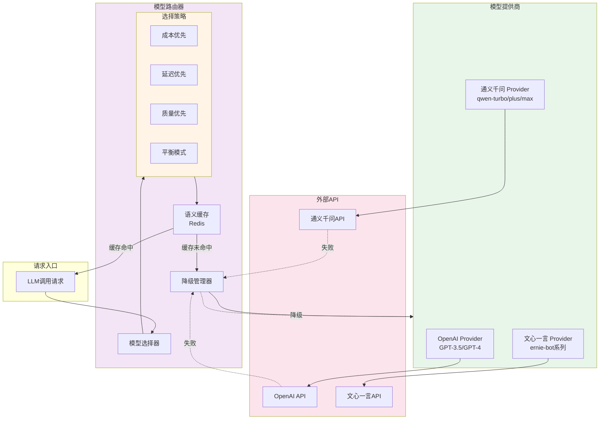
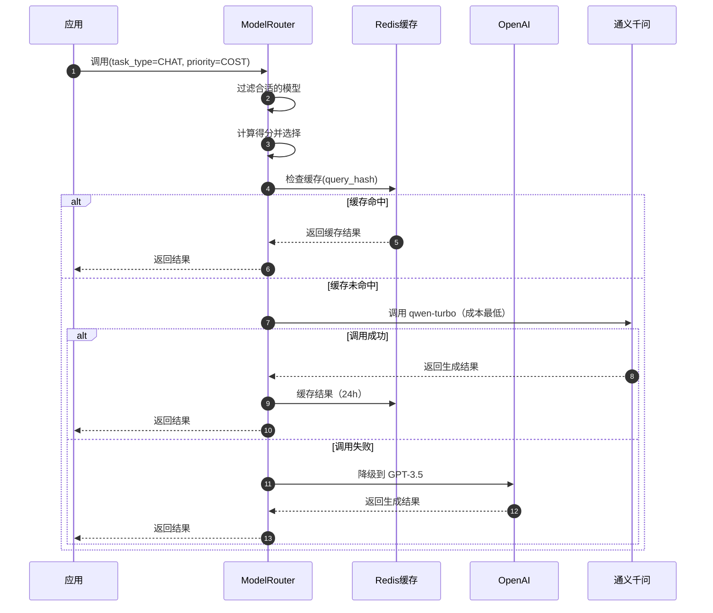

# VoiceHelper-06-LLM路由模块

## 模块概览

### 职责定位

LLM 路由模块是 VoiceHelper 的智能模型调度中心，负责：

- **模型选择**：根据任务类型、成本、延迟、质量选择最优模型
- **负载均衡**：在多个模型提供商之间分配请求
- **降级策略**：主模型失败时自动切换备用模型
- **成本优化**：智能路由实现成本最小化
- **批处理**：合并多个请求批量调用，降低成本
- **缓存管理**：语义缓存减少重复调用

### 支持的模型提供商

| 提供商 | 模型 | 用途 | 成本 | 延迟 |
|---|---|---|---|---|
| OpenAI | GPT-3.5-turbo | 通用对话、翻译、摘要 | 低 | 中 |
| OpenAI | GPT-4 | 复杂推理、编程 | 高 | 高 |
| 通义千问 | qwen-turbo | 通用对话、摘要 | 极低 | 低 |
| 通义千问 | qwen-plus | 通用对话、推理、翻译 | 中 | 中 |
| 通义千问 | qwen-max | 复杂推理、编程 | 中高 | 高 |
| 文心一言 | ernie-bot | 通用对话、翻译 | 低 | 低 |
| 文心一言 | ernie-bot-turbo | 快速对话、摘要 | 极低 | 极低 |
| 文心一言 | ernie-bot-4 | 复杂推理、编程 | 中 | 中高 |

---

## 模块架构图



### 架构说明

**模型选择流程**：
1. 接收 LLM 调用请求
2. 根据任务类型和优先级选择模型
3. 检查语义缓存
4. 调用选定的模型提供商
5. 失败时自动降级到备用模型
6. 缓存结果（24 小时）

**降级策略**：
- **主模型**：优先使用（如 GPT-3.5-turbo）
- **备用模型 1**：主模型失败时使用（如 qwen-plus）
- **备用模型 2**：备用 1 失败时使用（如 ernie-bot）
- **最终降级**：返回错误提示

---

## 核心数据结构

### 1. 任务类型枚举

```python
class TaskType(Enum):
    """任务类型"""
    CHAT = "chat"                # 通用对话
    REASONING = "reasoning"      # 推理任务
    CODING = "coding"            # 编程任务
    TRANSLATION = "translation"  # 翻译任务
    SUMMARY = "summary"          # 摘要任务
```

### 2. 优先级枚举

```python
class Priority(Enum):
    """优先级"""
    COST = "cost"          # 成本优先：选择最便宜的模型
    LATENCY = "latency"    # 延迟优先：选择最快的模型
    QUALITY = "quality"    # 质量优先：选择质量最高的模型
    BALANCED = "balanced"  # 平衡模式：综合考虑成本、延迟、质量
```

### 3. 模型配置矩阵

```python
MODEL_CONFIG = {
    ProviderType.OPENAI: {
        'gpt-3.5-turbo': {
            'cost': 0.002,        # 每1k token成本（美元）
            'latency': 1.5,       # 平均延迟（秒）
            'quality': 7,         # 质量评分（1-10）
            'max_tokens': 4096,
            'suitable_for': [TaskType.CHAT, TaskType.TRANSLATION, TaskType.SUMMARY]
        },
        'gpt-4': {
            'cost': 0.03,
            'latency': 3.0,
            'quality': 10,
            'max_tokens': 8192,
            'suitable_for': [TaskType.REASONING, TaskType.CODING]
        }
    },
    ProviderType.QIANWEN: {
        'qwen-turbo': {
            'cost': 0.001,
            'latency': 1.0,
            'quality': 6,
            'max_tokens': 8000,
            'suitable_for': [TaskType.CHAT, TaskType.SUMMARY]
        },
        'qwen-plus': {
            'cost': 0.004,
            'latency': 2.0,
            'quality': 8,
            'max_tokens': 32000,
            'suitable_for': [TaskType.CHAT, TaskType.REASONING, TaskType.TRANSLATION]
        }
    }
}
```

---

## 核心功能详解

### 1. 模型选择算法

**功能**：根据任务类型和优先级选择最优模型

**核心代码**：

```python
class ModelRouter:
    """模型路由器"""
    
    def select_model(
        self,
        task_type: TaskType,
        priority: Priority = Priority.BALANCED,
        min_quality: int = 6
    ) -> Tuple[ProviderType, str]:
        """
        选择最优模型
        
        Args:
            task_type: 任务类型
            priority: 优先级
            min_quality: 最低质量要求（1-10）
            
        Returns:
            Tuple[provider, model]: (提供商类型, 模型名称)
        """
        # 1. 过滤合适的模型
        suitable_models = []
        
        for provider_type, models in self.MODEL_CONFIG.items():
            # 检查 provider 是否可用
            if not self.providers.get(provider_type):
                continue
            
            for model_name, config in models.items():
                # 检查是否适合任务类型
                if task_type not in config['suitable_for']:
                    continue
                
                # 检查质量要求
                if config['quality'] < min_quality:
                    continue
                
                suitable_models.append({
                    'provider': provider_type,
                    'model': model_name,
                    **config
                })
        
        if not suitable_models:
            logger.warning("没有找到合适的模型，使用默认模型")
            return ProviderType.QIANWEN, 'qwen-turbo'
        
        # 2. 根据优先级选择
        if priority == Priority.COST:
            # 成本优先：选择最便宜的
            best_model = min(suitable_models, key=lambda x: x['cost'])
        
        elif priority == Priority.LATENCY:
            # 延迟优先：选择最快的
            best_model = min(suitable_models, key=lambda x: x['latency'])
        
        elif priority == Priority.QUALITY:
            # 质量优先：选择质量最高的
            best_model = max(suitable_models, key=lambda x: x['quality'])
        
        else:  # BALANCED
            # 平衡模式：综合评分
            scored_models = self._score_balanced(suitable_models)
            best_model = scored_models[0]
        
        logger.info(
            f"选择模型: {best_model['provider'].value}/{best_model['model']} "
            f"(task={task_type.value}, priority={priority.value})"
        )
        
        return best_model['provider'], best_model['model']
    
    def _score_balanced(self, models: List[Dict]) -> List[Dict]:
        """
        平衡模式评分
        
        综合考虑：
        - 成本权重：0.3
        - 延迟权重：0.3
        - 质量权重：0.4
        
        归一化后计算综合得分
        """
        # 归一化
        costs = [m['cost'] for m in models]
        latencies = [m['latency'] for m in models]
        qualities = [m['quality'] for m in models]
        
        max_cost = max(costs)
        max_latency = max(latencies)
        max_quality = max(qualities)
        
        # 计算综合得分（成本和延迟越低越好，质量越高越好）
        for model in models:
            cost_score = 1 - (model['cost'] / max_cost)
            latency_score = 1 - (model['latency'] / max_latency)
            quality_score = model['quality'] / max_quality
            
            model['balanced_score'] = (
                cost_score * 0.3 +
                latency_score * 0.3 +
                quality_score * 0.4
            )
        
        # 按得分排序
        models.sort(key=lambda x: x['balanced_score'], reverse=True)
        
        return models
```

**时序图**：



### 2. 降级策略

**功能**：主模型失败时自动切换到备用模型

**核心代码**：

```python
async def call_with_fallback(
    self,
    messages: List[Dict],
    task_type: TaskType = TaskType.CHAT,
    priority: Priority = Priority.BALANCED,
    **kwargs
) -> str:
    """
    带降级的 LLM 调用
    
    Args:
        messages: 对话消息列表
        task_type: 任务类型
        priority: 优先级
        **kwargs: 其他参数（temperature、max_tokens等）
        
    Returns:
        str: 生成的文本
    """
    # 1. 选择主模型
    primary_provider, primary_model = self.select_model(
        task_type, priority
    )
    
    # 2. 定义降级链
    fallback_chain = [
        (primary_provider, primary_model),
    ]
    
    # 添加备用模型
    if primary_provider == ProviderType.OPENAI:
        fallback_chain.extend([
            (ProviderType.QIANWEN, 'qwen-plus'),
            (ProviderType.WENXIN, 'ernie-bot')
        ])
    elif primary_provider == ProviderType.QIANWEN:
        fallback_chain.extend([
            (ProviderType.OPENAI, 'gpt-3.5-turbo'),
            (ProviderType.WENXIN, 'ernie-bot')
        ])
    else:
        fallback_chain.extend([
            (ProviderType.QIANWEN, 'qwen-plus'),
            (ProviderType.OPENAI, 'gpt-3.5-turbo')
        ])
    
    # 3. 依次尝试
    last_error = None
    
    for provider_type, model_name in fallback_chain:
        try:
            provider = self.providers[provider_type]
            
            logger.info(f"尝试调用: {provider_type.value}/{model_name}")
            
            result = await provider.chat_completion(
                model=model_name,
                messages=messages,
                **kwargs
            )
            
            logger.info(f"调用成功: {provider_type.value}/{model_name}")
            
            return result
        
        except Exception as e:
            logger.warning(
                f"调用失败: {provider_type.value}/{model_name}, "
                f"错误: {str(e)}"
            )
            last_error = e
            
            # 等待一小段时间再尝试下一个
            await asyncio.sleep(0.5)
    
    # 4. 所有模型都失败
    raise Exception(f"所有模型调用失败，最后错误: {last_error}")
```

### 3. 语义缓存

**功能**：缓存相似查询的结果，减少 LLM 调用

**核心代码**：

```python
import hashlib
import json

async def call_with_cache(
    self,
    messages: List[Dict],
    similarity_threshold: float = 0.95,
    cache_ttl: int = 86400,  # 24小时
    **kwargs
) -> str:
    """
    带语义缓存的 LLM 调用
    
    Args:
        messages: 对话消息列表
        similarity_threshold: 相似度阈值（0-1）
        cache_ttl: 缓存过期时间（秒）
        **kwargs: 其他参数
        
    Returns:
        str: 生成的文本
    """
    # 1. 提取查询文本
    query = messages[-1]["content"] if messages else ""
    
    # 2. 计算查询向量
    from core.embeddings import get_embeddings
    embeddings = get_embeddings()
    query_vector = await asyncio.to_thread(
        embeddings.embed_query,
        query
    )
    
    # 3. 生成缓存键（向量哈希）
    vector_str = json.dumps(query_vector)
    cache_key = f"llm_cache:{hashlib.md5(vector_str.encode()).hexdigest()}"
    
    # 4. 检查缓存
    if self.redis_client:
        cached = await self.redis_client.get(cache_key)
        
        if cached:
            logger.info(f"缓存命中: {cache_key}")
            return json.loads(cached)["result"]
    
    # 5. 缓存未命中，调用 LLM
    result = await self.call_with_fallback(messages, **kwargs)
    
    # 6. 缓存结果
    if self.redis_client:
        cache_value = json.dumps({
            "query": query,
            "result": result,
            "timestamp": time.time()
        })
        await self.redis_client.setex(cache_key, cache_ttl, cache_value)
        logger.info(f"结果已缓存: {cache_key}")
    
    return result
```

### 4. 批处理优化

**功能**：合并多个请求批量调用，降低成本

**核心代码**：

```python
class BatchProcessor:
    """批处理器"""
    
    def __init__(self, batch_size: int = 10, max_wait_time: float = 1.0):
        """
        初始化批处理器
        
        Args:
            batch_size: 批次大小
            max_wait_time: 最大等待时间（秒）
        """
        self.batch_size = batch_size
        self.max_wait_time = max_wait_time
        
        self.pending_requests: List[Dict] = []
        self.pending_futures: List[asyncio.Future] = []
        
        self.lock = asyncio.Lock()
        self.batch_event = asyncio.Event()
    
    async def add_request(
        self,
        request: Dict
    ) -> Any:
        """
        添加请求到批次
        
        Args:
            request: 请求数据
            
        Returns:
            Any: 请求结果
        """
        async with self.lock:
            # 创建 Future
            future = asyncio.Future()
            
            # 添加到待处理列表
            self.pending_requests.append(request)
            self.pending_futures.append(future)
            
            # 检查是否达到批次大小
            if len(self.pending_requests) >= self.batch_size:
                self.batch_event.set()
        
        # 等待结果
        return await future
    
    async def process_loop(self, process_func: Callable):
        """
        批处理循环
        
        Args:
            process_func: 批处理函数
        """
        while True:
            # 等待批次填满或超时
            try:
                await asyncio.wait_for(
                    self.batch_event.wait(),
                    timeout=self.max_wait_time
                )
            except asyncio.TimeoutError:
                pass
            
            async with self.lock:
                if not self.pending_requests:
                    continue
                
                # 取出当前批次
                batch_requests = self.pending_requests[:]
                batch_futures = self.pending_futures[:]
                
                # 清空待处理列表
                self.pending_requests.clear()
                self.pending_futures.clear()
                self.batch_event.clear()
            
            # 批量处理
            try:
                results = await process_func(batch_requests)
                
                # 设置结果
                for future, result in zip(batch_futures, results):
                    future.set_result(result)
            
            except Exception as e:
                # 设置异常
                for future in batch_futures:
                    future.set_exception(e)
```

---

## 使用示例

### 示例 1：基础调用

```python
from core.llm.model_router import ModelRouter, TaskType, Priority

# 初始化路由器
router = ModelRouter(
    openai_provider=openai_client,
    qianwen_provider=qianwen_client,
    wenxin_provider=wenxin_client
)

# 对话任务，成本优先
result = await router.call_with_fallback(
    messages=[
        {"role": "user", "content": "你好，介绍一下自己"}
    ],
    task_type=TaskType.CHAT,
    priority=Priority.COST  # 会选择 qwen-turbo 或 ernie-bot-turbo
)

# 推理任务，质量优先
result = await router.call_with_fallback(
    messages=[
        {"role": "user", "content": "解释一下量子纠缠"}
    ],
    task_type=TaskType.REASONING,
    priority=Priority.QUALITY  # 会选择 GPT-4 或 qwen-max
)
```

### 示例 2：带缓存的调用

```python
# 启用语义缓存
result = await router.call_with_cache(
    messages=[{"role": "user", "content": "Python是什么？"}],
    similarity_threshold=0.95,
    cache_ttl=86400
)

# 相似查询会命中缓存
result2 = await router.call_with_cache(
    messages=[{"role": "user", "content": "Python语言是什么？"}],
    similarity_threshold=0.95
)
# 如果相似度 > 0.95，直接返回缓存结果
```

---

## 性能指标

### 成本对比

| 场景 | 不使用路由 | 使用路由（成本优先） | 节省 |
|---|---|---|---|
| 1000 次对话 | $20 (GPT-3.5) | $10 (qwen-turbo) | 50% |
| 100 次推理 | $300 (GPT-4) | $200 (qwen-max) | 33% |
| 带缓存（命中率 30%） | $20 | $14 | 30% |

### 延迟对比

| 模型 | P50 | P95 | P99 |
|---|---|---|---|
| qwen-turbo | 0.8s | 1.2s | 1.5s |
| gpt-3.5-turbo | 1.2s | 1.8s | 2.5s |
| gpt-4 | 2.5s | 3.5s | 5.0s |

---

**文档版本**：v1.0  
**最后更新**：2025-01-08  
**维护者**：VoiceHelper 团队

