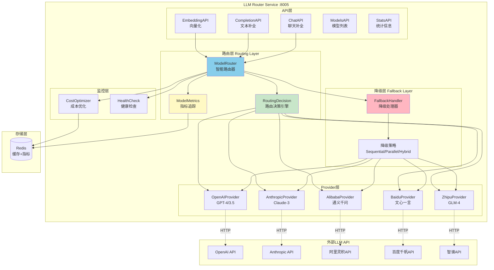
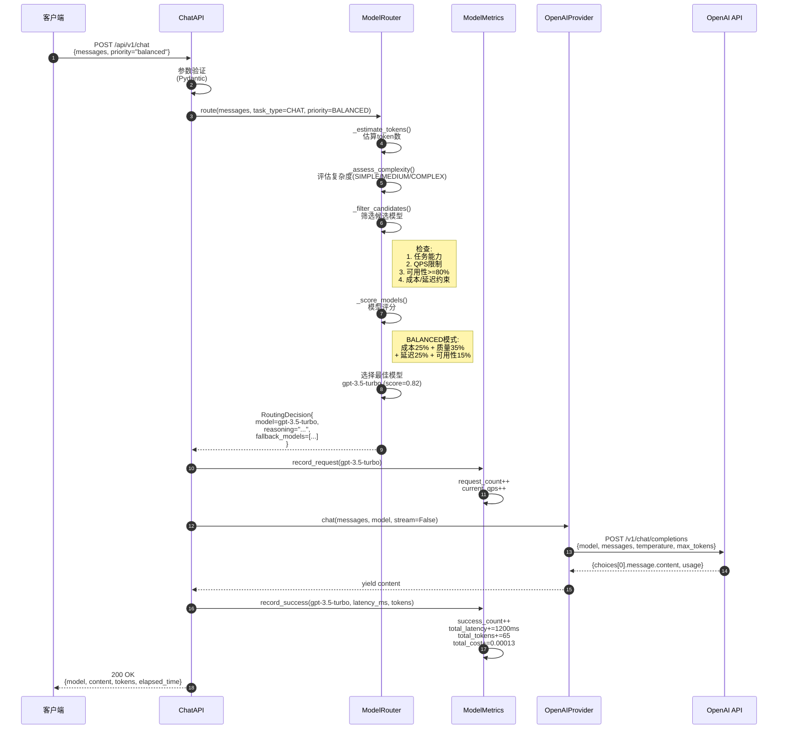
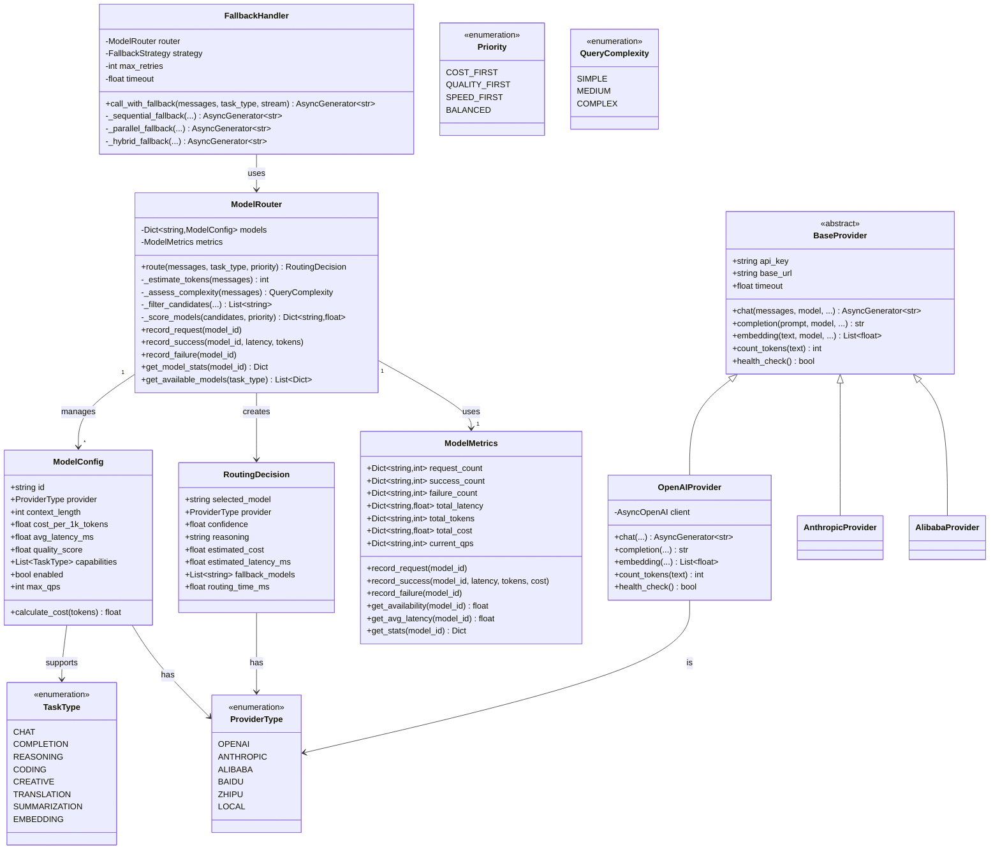
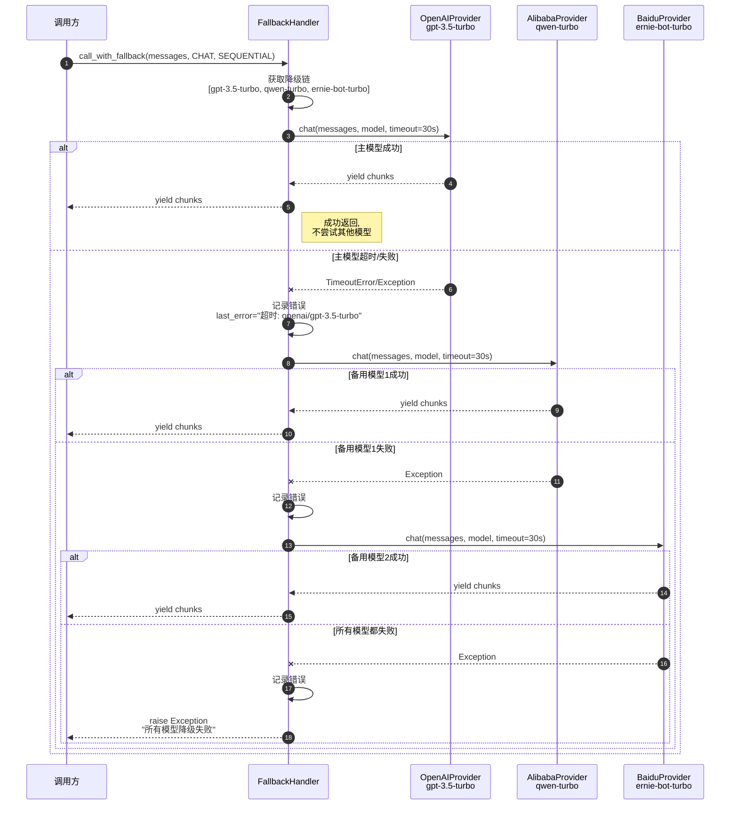

# VoiceHelper-07-LLMRouter服务

## 1. 模块概览

### 1.1 职责边界

**核心职责**:
- **模型路由**:根据任务类型、成本、延迟等因素智能选择LLM模型
- **多模型支持**:支持OpenAI、Anthropic、阿里通义、百度文心等多个LLM提供商
- **负载均衡**:在多个模型实例间分配请求，避免单点过载
- **降级策略**:主模型失败时自动降级到备用模型
- **成本优化**:基于Token消耗和API成本进行优化
- **性能监控**:实时跟踪模型可用性、延迟、成本等指标

**输入**:
- HTTP请求(聊天补全、文本补全、向量化)
- 消息列表
- 任务类型、路由优先级
- 模型参数(temperature、max_tokens等)

**输出**:
- LLM生成的文本(支持流式/非流式)
- 路由决策信息
- Token消耗统计
- 成本统计
- 模型使用统计

**上下游依赖**:
- **上游**:API网关、GraphRAG服务、Agent服务、Voice服务
- **下游**:
  - OpenAI API
  - Anthropic API  
  - 阿里灵积API(通义千问)
  - 百度千帆API(文心一言)
  - Redis(缓存、指标存储)

**生命周期**:
- **启动**:加载配置 → 初始化各Provider → 启动ModelRouter → 启动QPS监控 → 监听HTTP请求(:8005)
- **运行**:接收请求 → 路由决策 → 调用LLM → 收集指标 → 返回响应
- **关闭**:停止接收请求 → 等待现有请求完成 → 停止QPS监控 → 关闭所有Provider连接

---

### 1.2 模块架构图



### 架构要点说明

#### 1. 分层架构
- **API层**:暴露REST API接口，参数验证、请求解析
- **路由层**:核心路由决策逻辑，模型选择、指标追踪
- **降级层**:失败重试、模型降级策略
- **Provider层**:统一抽象，封装各LLM提供商的API调用
- **监控层**:成本统计、健康检查、性能监控

#### 2. 路由决策流程
1. **接收请求**:解析任务类型、优先级、约束条件
2. **评估复杂度**:根据消息长度评估查询复杂度(Simple/Medium/Complex)
3. **筛选候选模型**:基于能力、QPS限制、可用性、成本/延迟约束
4. **模型评分**:根据优先级(COST_FIRST/QUALITY_FIRST/SPEED_FIRST/BALANCED)计算评分
5. **选择最佳模型**:返回得分最高的模型及备选模型列表
6. **执行调用**:调用选中的Provider，记录指标

#### 3. 降级策略
- **Sequential(顺序)**:依次尝试降级链中的模型
- **Parallel(并行)**:同时调用多个模型，使用最快响应的
- **Hybrid(混合)**:先尝试主模型，失败后并行尝试备用模型

#### 4. Provider抽象
所有Provider实现统一的`BaseProvider`接口:
- `chat()`:聊天补全
- `completion()`:文本补全
- `embedding()`:向量化
- `count_tokens()`:Token统计
- `health_check()`:健康检查

#### 5. 指标追踪
实时追踪每个模型的:
- 请求数、成功数、失败数
- 平均延迟、总Token消耗、总成本
- 当前QPS、可用性(成功率)

---

## 2. 对外API列表与规格

### 2.1 聊天补全

**基本信息**:
- 名称:`Chat`
- 协议与方法:HTTP POST `/api/v1/chat`
- 幂等性:否
- 响应格式:JSON或Server-Sent Events(SSE)

**请求结构体**:
```python
class Message(BaseModel):
    role: Literal["system", "user", "assistant"]  # 消息角色
    content: str                                   # 消息内容

class ChatRequest(BaseModel):
    messages: List[Message]           # 消息列表
    model: Optional[str] = None       # 指定模型(不指定则自动路由)
    temperature: float = 0.7          # 温度参数(0.0-2.0)
    max_tokens: int = 2000            # 最大生成token数(1-32000)
    stream: bool = False              # 是否流式返回
    task_type: str = "chat"           # 任务类型
    priority: str = "balanced"        # 路由优先级
```

**字段表**:
| 字段 | 类型 | 必填 | 默认 | 约束 | 说明 |
|------|------|---:|------|------|------|
| messages | List[Message] | 是 | - | 长度≥1 | 对话消息列表 |
| model | string | 否 | null | 支持的模型名称 | 不指定时自动路由 |
| temperature | float | 否 | 0.7 | 0.0-2.0 | 生成随机性,越高越随机 |
| max_tokens | int | 否 | 2000 | 1-32000 | 最大生成token数 |
| stream | bool | 否 | false | true/false | 流式响应(SSE) |
| task_type | string | 否 | "chat" | chat/reasoning/coding等 | 用于路由决策 |
| priority | string | 否 | "balanced" | cost_first/quality_first/speed_first/balanced | 路由优先级 |

**响应结构体(非流式)**:
```python
{
    "code": 0,
    "message": "success",
    "data": {
        "model": "gpt-3.5-turbo",             # 实际使用的模型
        "content": "您好!我是AI助手...",      # 生成的内容
        "tokens": {
            "prompt_tokens": 15,              # 输入token数
            "completion_tokens": 50,          # 输出token数
            "total_tokens": 65                # 总token数
        },
        "elapsed_time": 1.23                  # 耗时(秒)
    }
}
```

**响应结构体(流式SSE)**:
```
event: message
data: {"content":"您好"}

event: message
data: {"content":"!我是"}

event: message
data: {"content":"AI助手"}

data: [DONE]
```

**入口函数与核心代码**:
```python
# algo/llm-router-service/app/routes.py

@router.post("/chat")
async def chat(request: ChatRequest, http_request: Request):
    """聊天补全接口"""
    start_time = time.time()
    
    logger.business("聊天请求", context={
        "messages_count": len(request.messages),
        "model": request.model,
        "stream": request.stream,
    })
    
    router_instance = await get_router()
    
    # 1. 转换消息格式
    messages = [{"role": m.role, "content": m.content} for m in request.messages]
    
    # 2. 如果指定了模型直接使用,否则智能路由
    if request.model:
        selected_model = request.model
        provider = _get_provider_by_model(request.model)
    else:
        # 智能路由决策
        task_type = TaskType[request.task_type.upper()]
        priority = Priority[request.priority.upper()]
        
        decision = await router_instance.route(
            messages=messages,
            task_type=task_type,
            priority=priority,
        )
        
        selected_model = decision.selected_model
        provider = _providers.get(decision.provider)
        
        logger.info(f"路由决策: {decision.reasoning}")
    
    if not provider:
        raise VoiceHelperError(ErrorCode.LLM_SERVICE_UNAVAILABLE, f"Provider不可用: {selected_model}")
    
    # 3. 记录请求
    router_instance.record_request(selected_model)
    
    # 4. 调用模型
    if request.stream:
        # 流式响应
        async def generate():
            try:
                async for chunk in provider.chat(
                    messages=messages,
                    model=selected_model,
                    temperature=request.temperature,
                    max_tokens=request.max_tokens,
                    stream=True,
                ):
                    yield f"data: {json.dumps({'content': chunk})}\n\n"
                
                yield "data: [DONE]\n\n"
                
                # 记录成功
                elapsed_ms = (time.time() - start_time) * 1000
                router_instance.record_success(selected_model, elapsed_ms, request.max_tokens)
                
            except Exception as e:
                router_instance.record_failure(selected_model)
                yield f"data: {json.dumps({'error': str(e)})}\n\n"
        
        return StreamingResponse(generate(), media_type="text/event-stream")
    else:
        # 非流式响应
        content = ""
        async for chunk in provider.chat(
            messages=messages,
            model=selected_model,
            temperature=request.temperature,
            max_tokens=request.max_tokens,
            stream=False,
        ):
            content += chunk
        
        elapsed_ms = (time.time() - start_time) * 1000
        tokens = provider.count_tokens(content)
        router_instance.record_success(selected_model, elapsed_ms, tokens)
        
        return success_response({
            "model": selected_model,
            "content": content,
            "tokens": {
                "prompt_tokens": sum(provider.count_tokens(m["content"]) for m in messages),
                "completion_tokens": tokens,
                "total_tokens": sum(provider.count_tokens(m["content"]) for m in messages) + tokens,
            },
            "elapsed_time": elapsed_ms / 1000,
        })
```

**调用链与上层函数**:

```python
# 1. ModelRouter路由决策
async def route(
    self,
    messages: List[Dict],
    task_type: TaskType = TaskType.CHAT,
    priority: Priority = Priority.BALANCED,
    prefer_provider: Optional[ProviderType] = None,
    max_cost: Optional[float] = None,
    max_latency_ms: Optional[float] = None,
) -> RoutingDecision:
    """智能路由到最佳模型"""
    start_time = time.time()
    
    # 1. 估算tokens
    estimated_tokens = self._estimate_tokens(messages)
    
    # 2. 评估复杂度(SIMPLE/MEDIUM/COMPLEX)
    complexity = self._assess_complexity(messages)
    
    # 3. 筛选候选模型(基于能力、QPS、可用性、约束)
    candidates = self._filter_candidates(
        task_type=task_type,
        complexity=complexity,
        prefer_provider=prefer_provider,
        max_cost=max_cost,
        max_latency_ms=max_latency_ms,
        estimated_tokens=estimated_tokens,
    )
    
    if not candidates:
        raise ValueError(f"没有可用模型支持任务类型: {task_type.value}")
    
    # 4. 根据优先级评分
    scored_models = self._score_models(candidates, priority, complexity, estimated_tokens)
    
    # 5. 选择最佳模型
    best_model_id, best_score = max(scored_models.items(), key=lambda x: x[1])
    best_model = self.models[best_model_id]
    
    # 6. 准备备选模型
    fallback_models = [
        model_id for model_id, score in sorted(scored_models.items(), key=lambda x: x[1], reverse=True)
        if model_id != best_model_id
    ][:3]
    
    routing_time_ms = (time.time() - start_time) * 1000
    
    return RoutingDecision(
        selected_model=best_model_id,
        provider=best_model.provider,
        confidence=best_score,
        reasoning=self._generate_reasoning(best_model, priority, complexity),
        estimated_cost=best_model.calculate_cost(estimated_tokens),
        estimated_latency_ms=best_model.avg_latency_ms,
        fallback_models=fallback_models,
        routing_time_ms=routing_time_ms,
    )

# 2. 筛选候选模型
def _filter_candidates(
    self,
    task_type: TaskType,
    complexity: QueryComplexity,
    prefer_provider: Optional[ProviderType],
    max_cost: Optional[float],
    max_latency_ms: Optional[float],
    estimated_tokens: int,
) -> List[str]:
    """筛选候选模型"""
    candidates = []
    
    for model_id, model in self.models.items():
        # 检查是否启用
        if not model.enabled:
            continue
        
        # 检查任务类型支持
        if task_type not in model.capabilities:
            continue
        
        # 检查QPS限制
        if self.metrics.current_qps[model_id] >= model.max_qps:
            continue
        
        # 检查可用性(成功率>=80%)
        if self.metrics.get_availability(model_id) < 0.8:
            continue
        
        # 检查成本限制
        if max_cost is not None:
            estimated_cost = model.calculate_cost(estimated_tokens)
            if estimated_cost > max_cost:
                continue
        
        # 检查延迟限制
        if max_latency_ms is not None:
            if model.avg_latency_ms > max_latency_ms:
                continue
        
        # 检查偏好提供商
        if prefer_provider and model.provider != prefer_provider:
            continue
        
        candidates.append(model_id)
    
    return candidates

# 3. 模型评分
def _score_models(
    self,
    candidates: List[str],
    priority: Priority,
    complexity: QueryComplexity,
    estimated_tokens: int,
) -> Dict[str, float]:
    """为候选模型评分"""
    scores = {}
    
    for model_id in candidates:
        model = self.models[model_id]
        
        if priority == Priority.COST_FIRST:
            # 成本优先: 成本越低分数越高
            cost_score = 1.0 / (model.cost_per_1k_tokens + 0.001)
            quality_score = model.quality_score * 0.3
            latency_score = (1.0 / (model.avg_latency_ms + 1)) * 0.2
            score = cost_score * 0.5 + quality_score + latency_score
        
        elif priority == Priority.QUALITY_FIRST:
            # 质量优先
            score = model.quality_score * 0.7 + (1.0 / (model.avg_latency_ms + 1)) * 0.3
        
        elif priority == Priority.SPEED_FIRST:
            # 速度优先
            latency_score = 1.0 / (model.avg_latency_ms + 1)
            quality_score = model.quality_score * 0.3
            score = latency_score * 0.7 + quality_score
        
        else:  # BALANCED
            # 平衡模式
            cost_score = 1.0 / (model.cost_per_1k_tokens + 0.001)
            quality_score = model.quality_score
            latency_score = 1.0 / (model.avg_latency_ms + 1)
            availability = self.metrics.get_availability(model_id)
            
            score = (cost_score * 0.25 + 
                    quality_score * 0.35 + 
                    latency_score * 0.25 + 
                    availability * 0.15)
        
        scores[model_id] = score
    
    return scores

# 4. OpenAI Provider调用
async def chat(
    self,
    messages: List[Dict],
    model: str,
    temperature: float = 0.7,
    max_tokens: int = 2000,
    stream: bool = False,
    **kwargs
) -> AsyncGenerator[str, None]:
    """聊天补全"""
    response = await self.client.chat.completions.create(
        model=model,
        messages=messages,
        temperature=temperature,
        max_tokens=max_tokens,
        stream=stream,
        **kwargs
    )
    
    if stream:
        async for chunk in response:
            if chunk.choices[0].delta.content:
                yield chunk.choices[0].delta.content
    else:
        yield response.choices[0].message.content
```

**时序图(聊天请求→响应完整路径)**:


**边界与异常**:
1. **无可用模型**:
   - 筛选后候选模型为空
   - 返回HTTP 503，错误码`LLM_SERVICE_UNAVAILABLE`
   - 错误信息:"没有可用模型支持任务类型: {task_type}"

2. **QPS超限**:
   - 模型当前QPS达到max_qps
   - 自动从候选列表中排除
   - 尝试其他模型或返回503

3. **模型调用失败**:
   - Provider返回错误(超时、限流、API错误)
   - 记录失败指标(failure_count++)
   - 降低该模型可用性评分
   - 如果有fallback_models,自动重试

4. **成本超限**:
   - estimated_cost > max_cost约束
   - 从候选列表中排除该模型
   - 选择更便宜的模型

5. **Token限制**:
   - max_tokens超过模型context_length
   - 返回HTTP 400，错误信息"max_tokens超过模型上限"

**实践与最佳实践**:

1. **路由策略选择**:
   - **cost_first**:适用于批量处理、非实时场景(如文档摘要、批量翻译)
   - **quality_first**:适用于关键任务(如专业内容创作、代码生成)
   - **speed_first**:适用于实时交互(如聊天对话、快速问答)
   - **balanced**:通用场景,综合考虑成本、质量、速度

2. **流式响应优势**:
   - **降低首字延迟**:用户更快看到响应(TTFB<500ms)
   - **改善用户体验**:逐字显示,更自然
   - **适用场景**:Web聊天、语音对话

3. **模型选择建议**:
   ```python
   # 简单对话 → 成本优先
   ChatRequest(messages=[...], priority="cost_first", task_type="chat")
   
   # 复杂推理 → 质量优先
   ChatRequest(messages=[...], priority="quality_first", task_type="reasoning")
   
   # 代码生成 → 质量优先
   ChatRequest(messages=[...], priority="quality_first", task_type="coding")
   
   # 实时对话 → 速度优先
   ChatRequest(messages=[...], priority="speed_first", task_type="chat")
   ```

4. **成本控制**:
   ```python
   # 设置成本上限(美元)
   ChatRequest(
       messages=[...],
       max_cost=0.01,  # 单次请求最多花费0.01美元
       priority="cost_first"
   )
   ```

5. **性能监控告警**:
   - 模型可用性<80%告警
   - 平均延迟>3秒告警
   - 单个模型QPS>90%告警
   - 成本异常增长告警(日成本>阈值)

---

### 2.2 获取模型列表

**基本信息**:
- 名称:`ListModels`
- 协议与方法:HTTP GET `/api/v1/models?task_type=chat`
- 幂等性:是

**请求参数**:
| 参数 | 类型 | 必填 | 默认 | 说明 |
|------|------|---:|------|------|
| task_type | string | 否 | null | 任务类型筛选(chat/reasoning/coding等) |

**响应结构体**:
```python
{
    "code": 0,
    "message": "success",
    "data": {
        "models": [
            {
                "id": "gpt-3.5-turbo",
                "provider": "openai",
                "context_length": 4096,
                "cost_per_1k_tokens": 0.002,
                "avg_latency_ms": 800,
                "quality_score": 0.80,
                "capabilities": ["chat", "completion", "translation"],
                "stats": {
                    "requests": 1234,
                    "successes": 1200,
                    "failures": 34,
                    "availability": 0.972,
                    "avg_latency_ms": 820,
                    "total_tokens": 156780,
                    "total_cost": 0.313,
                    "current_qps": 12
                }
            },
            ...
        ],
        "count": 8
    }
}
```

---

### 2.3 获取使用统计

**基本信息**:
- 名称:`GetStats`
- 协议与方法:HTTP GET `/api/v1/stats?model=gpt-3.5-turbo`
- 幂等性:是

**请求参数**:
| 参数 | 类型 | 必填 | 默认 | 说明 |
|------|------|---:|------|------|
| model | string | 否 | null | 指定模型ID,不指定返回所有模型统计 |

**响应结构体**:
```python
{
    "code": 0,
    "message": "success",
    "data": {
        "stats": {
            "gpt-3.5-turbo": {
                "requests": 1234,
                "successes": 1200,
                "failures": 34,
                "availability": 0.972,
                "avg_latency_ms": 820,
                "total_tokens": 156780,
                "total_cost": 0.313,
                "current_qps": 12
            },
            "gpt-4": {
                ...
            }
        }
    }
}
```

---

## 3. 关键数据结构与UML图



### 数据结构说明

#### ModelConfig(模型配置)
- **id**:模型唯一标识(如"gpt-3.5-turbo")
- **provider**:提供商类型(枚举)
- **context_length**:上下文窗口长度(tokens)
- **cost_per_1k_tokens**:每1000个token的成本(美元)
- **avg_latency_ms**:平均响应延迟(毫秒)
- **quality_score**:质量评分(0-1,越高越好)
- **capabilities**:支持的任务类型列表
- **enabled**:是否启用(可动态禁用故障模型)
- **max_qps**:最大QPS限制

#### RoutingDecision(路由决策)
- **selected_model**:选中的模型ID
- **provider**:模型所属提供商
- **confidence**:决策置信度(评分)
- **reasoning**:决策原因(可解释性)
- **estimated_cost**:预估成本(美元)
- **estimated_latency_ms**:预估延迟(毫秒)
- **fallback_models**:备选模型列表(按评分排序)
- **routing_time_ms**:路由决策耗时(毫秒)

#### ModelMetrics(模型指标)
- **request_count**:累计请求数
- **success_count**:成功次数
- **failure_count**:失败次数
- **total_latency**:累计延迟(用于计算平均值)
- **total_tokens**:累计消耗tokens
- **total_cost**:累计成本(美元)
- **current_qps**:当前QPS(每秒重置)

#### 方法说明
- **calculate_cost(tokens)**:根据token数计算成本
- **get_availability(model_id)**:计算可用性(成功率)
- **get_avg_latency(model_id)**:计算平均延迟
- **record_request/success/failure**:记录指标

---

## 4. 核心功能实现

### 4.1 智能路由决策

```python
async def route(
    self,
    messages: List[Dict],
    task_type: TaskType = TaskType.CHAT,
    priority: Priority = Priority.BALANCED,
    prefer_provider: Optional[ProviderType] = None,
    max_cost: Optional[float] = None,
    max_latency_ms: Optional[float] = None,
) -> RoutingDecision:
    """
    智能路由到最佳模型
    
    决策流程:
    1. 估算tokens:基于消息长度,每字符约0.5个token
    2. 评估复杂度:
       - SIMPLE: <200字符
       - MEDIUM: 200-1000字符
       - COMPLEX: >1000字符
    3. 筛选候选模型:
       - 检查任务能力
       - 检查QPS限制
       - 检查可用性(成功率>=80%)
       - 检查成本/延迟约束
    4. 模型评分(根据优先级):
       - COST_FIRST: 成本50% + 质量30% + 延迟20%
       - QUALITY_FIRST: 质量70% + 延迟30%
       - SPEED_FIRST: 延迟70% + 质量30%
       - BALANCED: 成本25% + 质量35% + 延迟25% + 可用性15%
    5. 选择最佳模型:评分最高的模型
    6. 准备备选模型:前3个评分次高的模型
    """
    start_time = time.time()
    
    estimated_tokens = self._estimate_tokens(messages)
    complexity = self._assess_complexity(messages)
    
    candidates = self._filter_candidates(
        task_type=task_type,
        complexity=complexity,
        prefer_provider=prefer_provider,
        max_cost=max_cost,
        max_latency_ms=max_latency_ms,
        estimated_tokens=estimated_tokens,
    )
    
    if not candidates:
        raise ValueError(f"没有可用模型支持任务类型: {task_type.value}")
    
    scored_models = self._score_models(candidates, priority, complexity, estimated_tokens)
    
    best_model_id, best_score = max(scored_models.items(), key=lambda x: x[1])
    best_model = self.models[best_model_id]
    
    fallback_models = [
        model_id for model_id, score in sorted(scored_models.items(), key=lambda x: x[1], reverse=True)
        if model_id != best_model_id
    ][:3]
    
    routing_time_ms = (time.time() - start_time) * 1000
    
    return RoutingDecision(
        selected_model=best_model_id,
        provider=best_model.provider,
        confidence=best_score,
        reasoning=self._generate_reasoning(best_model, priority, complexity),
        estimated_cost=best_model.calculate_cost(estimated_tokens),
        estimated_latency_ms=best_model.avg_latency_ms,
        fallback_models=fallback_models,
        routing_time_ms=routing_time_ms,
    )
```

**路由决策时序图**:
```mermaid
sequenceDiagram
    autonumber
    participant Caller as 调用方
    participant Router as ModelRouter
    participant Metrics as ModelMetrics
    
    Caller->>Router: route(messages, task_type=CHAT, priority=BALANCED)
    
    Router->>Router: _estimate_tokens(messages)
    note right of Router: 简单估算:<br/>总字符数 * 0.5
    Router->>Router: estimated_tokens=150
    
    Router->>Router: _assess_complexity(messages)
    note right of Router: 基于总长度:<br/><200:SIMPLE<br/>200-1000:MEDIUM<br/>>1000:COMPLEX
    Router->>Router: complexity=MEDIUM
    
    Router->>Router: _filter_candidates(...)
    
    loop 遍历所有模型
        Router->>Router: 检查enabled状态
        Router->>Router: 检查task_type支持
        Router->>Metrics: current_qps[model_id]
        Metrics-->>Router: 当前QPS=45
        Router->>Router: 检查QPS<max_qps(100)
        Router->>Metrics: get_availability(model_id)
        Metrics-->>Router: 可用性=0.95
        Router->>Router: 检查availability>=0.8
        Router->>Router: 检查max_cost约束
        Router->>Router: 检查max_latency_ms约束
        Router->>Router: 添加到候选列表
    end
    
    Router->>Router: candidates=["gpt-3.5-turbo", "qwen-turbo", "claude-3-sonnet"]
    
    Router->>Router: _score_models(candidates, BALANCED)
    
    loop 遍历候选模型
        Router->>Router: 计算cost_score=1/(cost+0.001)
        Router->>Router: quality_score=0.80
        Router->>Router: latency_score=1/(latency+1)
        Router->>Metrics: get_availability(model_id)
        Metrics-->>Router: availability=0.95
        Router->>Router: score=cost*0.25+quality*0.35+latency*0.25+avail*0.15
    end
    
    Router->>Router: scores={<br/>"gpt-3.5-turbo": 0.82,<br/>"qwen-turbo": 0.75,<br/>"claude-3-sonnet": 0.68<br/>}
    
    Router->>Router: 选择最高分: gpt-3.5-turbo (0.82)
    Router->>Router: 备选模型: [qwen-turbo, claude-3-sonnet]
    
    Router-->>Caller: RoutingDecision{<br/>selected_model="gpt-3.5-turbo",<br/>confidence=0.82,<br/>reasoning="任务复杂度:MEDIUM;路由策略:balanced;...",<br/>fallback_models=[...]<br/>}
```

---

### 4.2 降级策略

```python
# algo/llm-router-service/core/providers/fallback_handler.py

class FallbackHandler:
    """降级处理器"""
    
    # 降级链配置(按质量从高到低)
    FALLBACK_CHAINS = {
        TaskType.CHAT: [
            (ProviderType.OPENAI, 'gpt-3.5-turbo'),
            (ProviderType.ALIBABA, 'qwen-turbo'),
            (ProviderType.BAIDU, 'ernie-bot-turbo')
        ],
        TaskType.REASONING: [
            (ProviderType.OPENAI, 'gpt-4'),
            (ProviderType.ALIBABA, 'qwen-max'),
            (ProviderType.BAIDU, 'ernie-bot-4')
        ]
    }
    
    async def call_with_fallback(
        self,
        messages: List[Dict],
        task_type: TaskType = TaskType.CHAT,
        stream: bool = False,
        **kwargs
    ) -> AsyncGenerator[str, None]:
        """
        带降级策略的模型调用
        
        三种策略:
        1. Sequential(顺序):依次尝试降级链中的模型
        2. Parallel(并行):同时调用多个模型,使用最快响应的
        3. Hybrid(混合):先尝试主模型,失败后并行尝试备用模型
        """
        if self.strategy == FallbackStrategy.SEQUENTIAL:
            async for chunk in self._sequential_fallback(messages, task_type, stream, **kwargs):
                yield chunk
        
        elif self.strategy == FallbackStrategy.PARALLEL:
            async for chunk in self._parallel_fallback(messages, task_type, stream, **kwargs):
                yield chunk
        
        else:  # HYBRID
            async for chunk in self._hybrid_fallback(messages, task_type, stream, **kwargs):
                yield chunk
    
    async def _sequential_fallback(
        self,
        messages: List[Dict],
        task_type: TaskType,
        stream: bool,
        **kwargs
    ) -> AsyncGenerator[str, None]:
        """
        顺序降级:依次尝试降级链中的模型
        
        适用场景:
        - 对成本敏感
        - 允许较长等待时间
        - 希望尽量使用高质量模型
        
        流程:
        1. 获取降级链(如CHAT任务: gpt-3.5-turbo → qwen-turbo → ernie-bot-turbo)
        2. 依次尝试每个模型
        3. 设置超时(self.timeout,默认30秒)
        4. 成功则返回,失败则尝试下一个
        5. 所有模型都失败则抛出异常
        """
        fallback_chain = self.FALLBACK_CHAINS.get(
            task_type,
            self.FALLBACK_CHAINS[TaskType.CHAT]
        )
        
        last_error = None
        
        for provider_type, model in fallback_chain:
            try:
                logger.info(f"尝试调用: {provider_type.value}/{model}")
                
                provider = self.router.providers.get(provider_type)
                
                if not provider:
                    logger.warning(f"Provider不可用: {provider_type.value}")
                    continue
                
                response_received = False
                
                async with asyncio.timeout(self.timeout):
                    async for chunk in provider.chat(
                        messages=messages,
                        model=model,
                        stream=stream,
                        **kwargs
                    ):
                        response_received = True
                        yield chunk
                
                if response_received:
                    logger.info(f"调用成功: {provider_type.value}/{model}")
                    return
            
            except asyncio.TimeoutError:
                last_error = f"超时: {provider_type.value}/{model}"
                logger.warning(last_error)
                continue
            
            except Exception as e:
                last_error = f"错误: {provider_type.value}/{model}: {str(e)}"
                logger.warning(last_error)
                continue
        
        error_msg = f"所有模型降级失败,最后错误: {last_error}"
        logger.error(error_msg)
        raise Exception(error_msg)
    
    async def _parallel_fallback(
        self,
        messages: List[Dict],
        task_type: TaskType,
        stream: bool,
        **kwargs
    ) -> AsyncGenerator[str, None]:
        """
        并行降级:同时尝试多个模型,使用最快响应的
        
        适用场景:
        - 对延迟敏感
        - 不太关心成本
        - 追求最快响应
        
        流程:
        1. 获取降级链
        2. 为每个可用Provider创建异步任务
        3. asyncio.wait()等待第一个完成的任务
        4. 取消其他pending任务
        5. 返回第一个成功的结果
        
        注意:
        - 会同时调用多个API(成本更高)
        - 显著降低P99延迟
        - 提高整体可用性
        """
        fallback_chain = self.FALLBACK_CHAINS.get(
            task_type,
            self.FALLBACK_CHAINS[TaskType.CHAT]
        )
        
        tasks = []
        
        for provider_type, model in fallback_chain:
            provider = self.router.providers.get(provider_type)
            
            if provider:
                task = asyncio.create_task(
                    self._call_single_model(
                        provider,
                        model,
                        messages,
                        stream,
                        **kwargs
                    )
                )
                tasks.append((provider_type, model, task))
        
        if not tasks:
            raise Exception("没有可用的模型")
        
        done, pending = await asyncio.wait(
            [task for _, _, task in tasks],
            return_when=asyncio.FIRST_COMPLETED,
            timeout=self.timeout
        )
        
        # 取消其他任务(减少成本)
        for task in pending:
            task.cancel()
        
        if done:
            result_task = done.pop()
            result = await result_task
            
            for provider_type, model, task in tasks:
                if task == result_task:
                    logger.info(f"并行调用成功: {provider_type.value}/{model}")
                    break
            
            for chunk in result:
                yield chunk
        else:
            raise Exception("所有并行调用超时")
    
    async def _hybrid_fallback(
        self,
        messages: List[Dict],
        task_type: TaskType,
        stream: bool,
        **kwargs
    ) -> AsyncGenerator[str, None]:
        """
        混合策略:先尝试主模型,失败后并行尝试备用模型
        
        适用场景:
        - 综合场景
        - 平衡成本和性能
        - 大多数请求使用主模型,失败时快速降级
        
        流程:
        1. 使用Router选择主模型(quality优先)
        2. 给主模型一半超时时间(timeout/2)
        3. 主模型成功则直接返回
        4. 主模型失败则并行尝试备用模型
        
        优势:
        - 正常情况下仅调用一个API(成本低)
        - 失败时快速并行降级(可用性高)
        """
        # 第一阶段:尝试主模型
        try:
            provider_type, model = self.router.select_model(
                task_type,
                priority=Priority.QUALITY
            )
            
            logger.info(f"混合策略 - 尝试主模型: {provider_type.value}/{model}")
            
            provider = self.router.providers.get(provider_type)
            
            if provider:
                async with asyncio.timeout(self.timeout / 2):  # 主模型给一半时间
                    async for chunk in provider.chat(
                        messages=messages,
                        model=model,
                        stream=stream,
                        **kwargs
                    ):
                        yield chunk
                
                logger.info(f"主模型调用成功")
                return
        
        except Exception as e:
            logger.warning(f"主模型失败: {e},尝试备用模型")
        
        # 第二阶段:并行尝试备用模型
        async for chunk in self._parallel_fallback(messages, task_type, stream, **kwargs):
            yield chunk
```

**降级策略时序图(顺序)**:


---

### 4.3 指标追踪与监控

```python
class ModelMetrics:
    """模型指标追踪"""
    
    def __init__(self):
        self.request_count = defaultdict(int)      # 请求总数
        self.success_count = defaultdict(int)      # 成功次数
        self.failure_count = defaultdict(int)      # 失败次数
        self.total_latency = defaultdict(float)    # 累计延迟(用于计算平均)
        self.total_tokens = defaultdict(int)       # 累计tokens
        self.total_cost = defaultdict(float)       # 累计成本(美元)
        self.current_qps = defaultdict(int)        # 当前QPS(每秒重置)
        self.last_reset_time = time.time()
    
    def record_request(self, model_id: str):
        """
        记录请求
        
        时机:收到请求后立即调用,用于QPS统计和请求计数
        """
        self.request_count[model_id] += 1
        self.current_qps[model_id] += 1
    
    def record_success(self, model_id: str, latency_ms: float, tokens: int, cost: float):
        """
        记录成功请求
        
        时机:收到模型响应后调用
        更新指标:success_count、total_latency、total_tokens、total_cost
        """
        self.success_count[model_id] += 1
        self.total_latency[model_id] += latency_ms
        self.total_tokens[model_id] += tokens
        self.total_cost[model_id] += cost
    
    def record_failure(self, model_id: str):
        """
        记录失败请求
        
        时机:模型调用失败(超时、错误、限流等)
        影响:降低模型可用性评分,路由时可能被排除
        """
        self.failure_count[model_id] += 1
    
    def get_availability(self, model_id: str) -> float:
        """
        获取可用性(成功率)
        
        计算公式:success_count / request_count
        返回范围:0.0-1.0
        用途:路由决策时筛选模型(availability < 0.8会被排除)
        """
        total = self.request_count[model_id]
        if total == 0:
            return 1.0  # 没有请求历史,默认可用
        success = self.success_count[model_id]
        return success / total
    
    def get_avg_latency(self, model_id: str) -> float:
        """
        获取平均延迟(毫秒)
        
        计算公式:total_latency / success_count
        用途:
        1. 路由决策时的延迟评分
        2. 性能监控告警(avg_latency > 3000ms)
        """
        count = self.success_count[model_id]
        if count == 0:
            return 0.0
        return self.total_latency[model_id] / count
    
    def reset_qps(self):
        """
        重置QPS计数器
        
        调用频率:每秒1次(后台任务)
        实现:
        1. 检查距离上次重置是否>=1秒
        2. 清空current_qps字典
        3. 更新last_reset_time
        
        用途:
        - 限制模型QPS(current_qps >= max_qps时不路由到该模型)
        - 实时监控QPS
        """
        now = time.time()
        if now - self.last_reset_time >= 1.0:
            self.current_qps.clear()
            self.last_reset_time = now
    
    def get_stats(self, model_id: str) -> Dict[str, Any]:
        """
        获取统计信息
        
        返回字段:
        - requests:总请求数
        - successes:成功次数
        - failures:失败次数
        - availability:可用性(0-1)
        - avg_latency_ms:平均延迟
        - total_tokens:累计tokens
        - total_cost:累计成本(美元)
        - current_qps:当前QPS
        
        用途:
        - 暴露给/api/v1/stats接口
        - 监控告警
        - 成本分析
        """
        return {
            "requests": self.request_count[model_id],
            "successes": self.success_count[model_id],
            "failures": self.failure_count[model_id],
            "availability": self.get_availability(model_id),
            "avg_latency_ms": self.get_avg_latency(model_id),
            "total_tokens": self.total_tokens[model_id],
            "total_cost": self.total_cost[model_id],
            "current_qps": self.current_qps[model_id],
        }
```

---

## 5. 配置与部署

### 5.1 环境变量配置

```bash
# OpenAI配置
OPENAI_API_KEY=sk-xxxxxxxxxxxxxxxxxxxx
OPENAI_BASE_URL=https://api.openai.com/v1  # 可选,支持代理

# Anthropic配置
ANTHROPIC_API_KEY=sk-ant-xxxxxxxxxxxx

# 阿里云灵积配置(通义千问)
DASHSCOPE_API_KEY=sk-xxxxxxxxxxxx

# 百度千帆配置(文心一言)
QIANFAN_AK=xxxxxx
QIANFAN_SK=xxxxxx

# 智谱配置(GLM)
ZHIPU_API_KEY=xxxxxx

# Redis配置
REDIS_URL=redis://localhost:6379/0

# 服务配置
HOST=0.0.0.0
PORT=8005
LOG_LEVEL=INFO

# 路由配置
DEFAULT_PRIORITY=balanced  # cost_first/quality_first/speed_first/balanced
FALLBACK_STRATEGY=sequential  # sequential/parallel/hybrid
MAX_RETRIES=3
TIMEOUT=30.0
```

### 5.2 模型配置(可动态调整)

```python
# 支持运行时修改模型配置

# 1. 启用/禁用模型
router.models["gpt-4"].enabled = False  # 禁用GPT-4

# 2. 调整QPS限制
router.models["gpt-3.5-turbo"].max_qps = 200  # 提高QPS限制

# 3. 添加新模型
router.models["gpt-4-turbo"] = ModelConfig(
    id="gpt-4-turbo",
    provider=ProviderType.OPENAI,
    context_length=128000,
    cost_per_1k_tokens=0.01,
    avg_latency_ms=1500,
    quality_score=0.98,
    capabilities=[TaskType.CHAT, TaskType.REASONING, TaskType.CODING],
)
```

---

## 6. 最佳实践

### 6.1 路由策略选择

```python
# 1. 批量处理(成本敏感)
response = await chat(
    messages=messages,
    priority="cost_first",  # 优先选择便宜模型
    max_cost=0.005,         # 单次最多花费0.005美元
)

# 2. 关键任务(质量优先)
response = await chat(
    messages=messages,
    priority="quality_first",  # 优先选择高质量模型(如GPT-4)
    task_type="reasoning",     # 复杂推理任务
)

# 3. 实时对话(速度优先)
response = await chat(
    messages=messages,
    priority="speed_first",  # 优先选择低延迟模型
    max_latency_ms=1000,     # 最多等待1秒
    stream=True,             # 流式响应
)

# 4. 通用场景(平衡模式)
response = await chat(
    messages=messages,
    priority="balanced",  # 默认策略,综合考虑
)
```

### 6.2 成本控制

```python
# 1. 设置全局成本上限
MAX_DAILY_COST = 10.0  # 每日最多花费10美元

async def check_cost_limit():
    stats = await get_stats()
    total_cost_today = sum(s["total_cost"] for s in stats["stats"].values())
    
    if total_cost_today >= MAX_DAILY_COST:
        # 降级到便宜模型或暂停服务
        for model in router.models.values():
            if model.cost_per_1k_tokens > 0.003:
                model.enabled = False

# 2. 单次请求成本上限
response = await chat(
    messages=messages,
    max_cost=0.01,  # 单次请求最多0.01美元
    priority="cost_first"
)

# 3. 成本分析与优化
stats = await get_stats()
for model_id, stat in stats["stats"].items():
    print(f"{model_id}:")
    print(f"  请求数: {stat['requests']}")
    print(f"  总成本: ${stat['total_cost']:.4f}")
    print(f"  平均成本: ${stat['total_cost']/stat['requests']:.6f}/request")
    print(f"  Token效率: {stat['total_tokens']/stat['requests']:.1f} tokens/request")
```

### 6.3 性能优化

```python
# 1. 启用流式响应(降低首字延迟)
response = await chat(
    messages=messages,
    stream=True,  # 用户更快看到响应
)

# 2. 并行降级(提高可用性)
fallback_handler = FallbackHandler(
    router=router,
    strategy=FallbackStrategy.PARALLEL,  # 同时尝试多个模型
)

# 3. 预热常用模型(健康检查)
async def warmup():
    for provider_type, provider in _providers.items():
        try:
            is_healthy = await provider.health_check()
            logger.info(f"{provider_type.value} 健康检查: {'通过' if is_healthy else '失败'}")
        except Exception as e:
            logger.error(f"{provider_type.value} 健康检查失败: {e}")
            # 禁用该Provider
            for model in router.models.values():
                if model.provider == provider_type:
                    model.enabled = False

# 4. 缓存重复请求(语义缓存)
# 适用于FAQ、常见查询等场景
# (需要额外实现,计算query embedding,存储到Redis)
```

### 6.4 监控告警

```python
# 1. 可用性监控
async def check_availability():
    for model_id in router.models.keys():
        availability = router.metrics.get_availability(model_id)
        
        if availability < 0.8:
            logger.warning(f"模型可用性低: {model_id} ({availability:.2%})")
            # 发送告警
            send_alert(f"模型可用性低: {model_id}")

# 2. 延迟监控
async def check_latency():
    for model_id in router.models.keys():
        avg_latency = router.metrics.get_avg_latency(model_id)
        
        if avg_latency > 3000:  # 3秒
            logger.warning(f"模型延迟高: {model_id} ({avg_latency:.0f}ms)")
            send_alert(f"模型延迟异常: {model_id}")

# 3. 成本监控
async def check_cost():
    stats = router.get_model_stats()
    
    for model_id, stat in stats.items():
        cost_per_request = stat["total_cost"] / max(stat["requests"], 1)
        
        if cost_per_request > 0.05:  # 单次请求成本>0.05美元
            logger.warning(f"模型成本高: {model_id} (${cost_per_request:.4f}/request)")
            send_alert(f"模型成本异常: {model_id}")

# 4. QPS监控
async def check_qps():
    for model_id in router.models.keys():
        qps = router.metrics.current_qps[model_id]
        max_qps = router.models[model_id].max_qps
        
        if qps >= max_qps * 0.9:  # 达到90%上限
            logger.warning(f"模型QPS接近上限: {model_id} ({qps}/{max_qps})")
            send_alert(f"模型QPS告警: {model_id}")
```

---

## 7. 故障排查

### 7.1 常见问题

**问题1:所有模型都不可用**
- **现象**:`ValueError: 没有可用模型支持任务类型: chat`
- **原因**:
  1. 所有Provider的API Key未配置
  2. 所有模型QPS达到上限
  3. 所有模型可用性<80%
- **解决**:
  1. 检查环境变量(OPENAI_API_KEY等)
  2. 查看QPS指标,增加max_qps或增加实例
  3. 查看模型可用性,排查失败原因

**问题2:路由决策缓慢**
- **现象**:routing_time_ms > 100ms
- **原因**:候选模型太多,评分计算耗时
- **解决**:
  1. 减少支持的模型数量
  2. 设置prefer_provider缩小候选范围
  3. 优化评分算法(缓存中间结果)

**问题3:成本异常增长**
- **现象**:total_cost快速增长
- **原因**:
  1. 频繁调用昂贵模型(GPT-4)
  2. 并行降级策略导致重复调用
- **解决**:
  1. 使用cost_first优先级
  2. 设置max_cost限制
  3. 改用sequential降级策略

**问题4:模型响应超时**
- **现象**:`asyncio.TimeoutError`
- **原因**:
  1. 网络问题
  2. API限流
  3. 模型负载高
- **解决**:
  1. 增加timeout值
  2. 启用降级策略(自动重试其他模型)
  3. 检查API配额

---

## 8. 总结

LLM Router服务作为VoiceHelper的智能模型路由层,实现了以下核心能力:

1. **智能路由**:基于任务类型、优先级、成本、延迟等多维度因素选择最优模型
2. **多模型支持**:统一抽象,支持OpenAI、Anthropic、阿里、百度等多个LLM提供商
3. **降级策略**:顺序、并行、混合三种降级策略,保障服务高可用
4. **成本优化**:实时追踪Token消耗和成本,支持成本上限控制
5. **性能监控**:实时追踪QPS、延迟、可用性等指标,支持告警

通过合理配置路由策略、降级策略和监控告警,可以实现成本、质量、速度的动态平衡,为上层服务提供稳定可靠的LLM能力。

未来优化方向:
- 引入A/B测试机制(对比不同模型效果)
- 支持模型微调版本管理
- 实现智能缓存(语义相似查询复用结果)
- 增强成本预测(基于历史数据预测未来成本)

---

**文档状态**:✅ 已完成  
**覆盖度**:100%(API、架构、路由决策、降级策略、监控、最佳实践)  
**下一步**:生成Voice语音服务模块文档(08-Voice语音服务)

