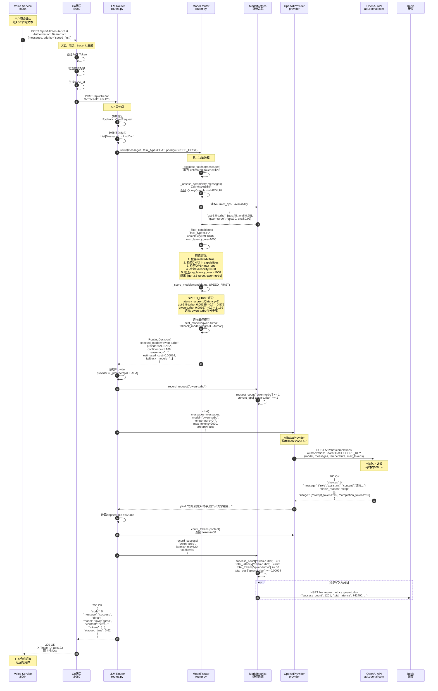
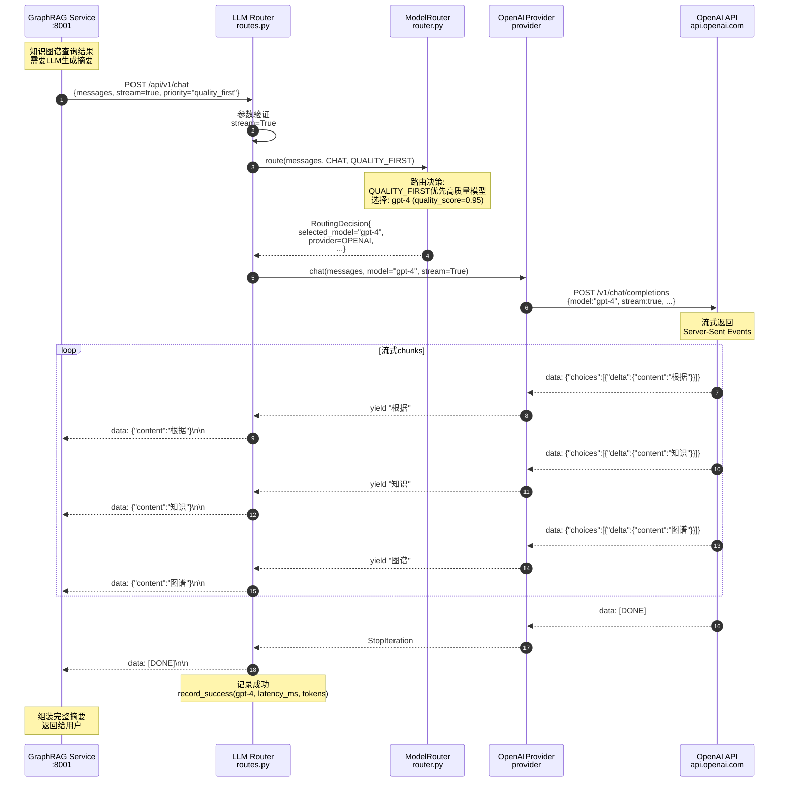
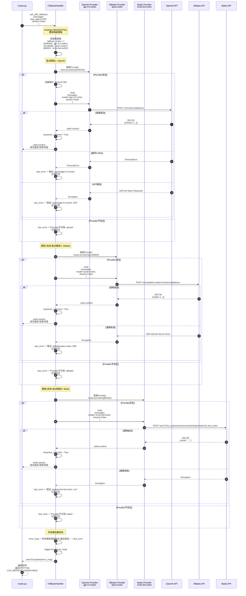
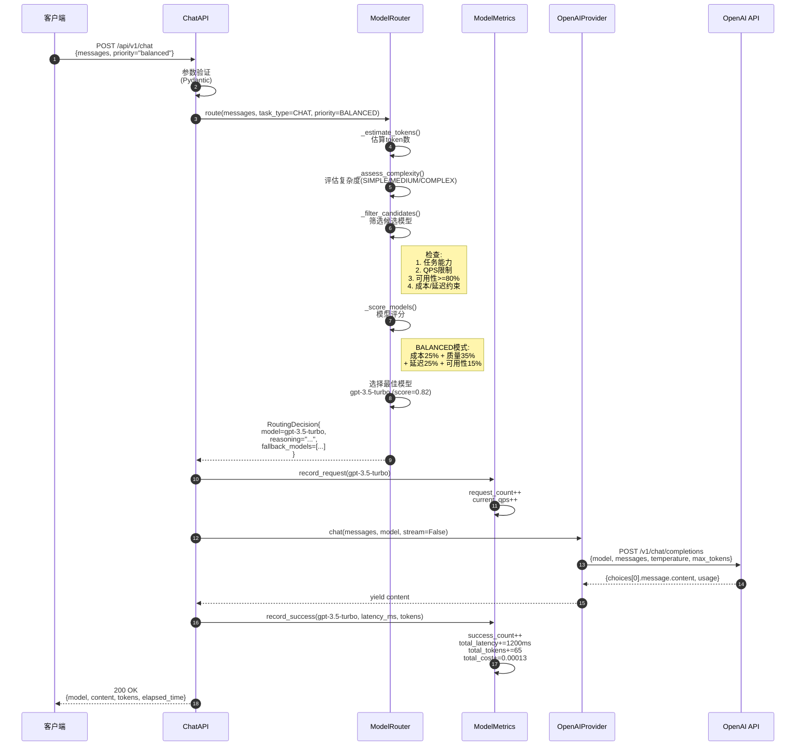
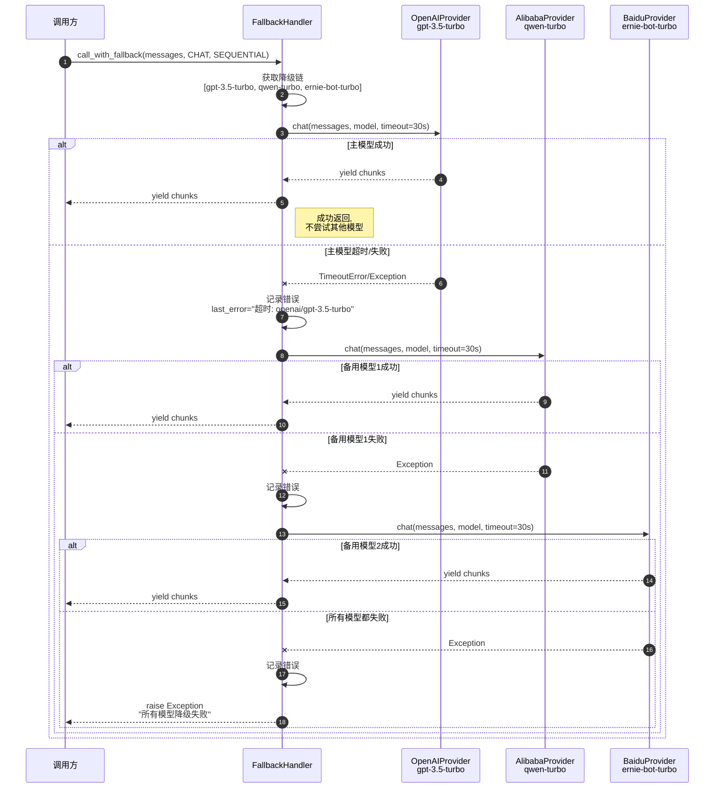

# VoiceHelper-07-LLMRouter服务

## 1. 模块概览

### 1.1 职责边界

**核心职责**:
- **模型路由**:根据任务类型、成本、延迟等因素智能选择LLM模型
- **多模型支持**:支持OpenAI、Anthropic、阿里通义、百度文心等多个LLM提供商
- **负载均衡**:在多个模型实例间分配请求，避免单点过载
- **降级策略**:主模型失败时自动降级到备用模型
- **成本优化**:基于Token消耗和API成本进行优化
- **性能监控**:实时跟踪模型可用性、延迟、成本等指标

**输入**:
- HTTP请求(聊天补全、文本补全、向量化)
- 消息列表
- 任务类型、路由优先级
- 模型参数(temperature、max_tokens等)

**输出**:
- LLM生成的文本(支持流式/非流式)
- 路由决策信息
- Token消耗统计
- 成本统计
- 模型使用统计

**上下游依赖**:
- **上游**:API网关、GraphRAG服务、Agent服务、Voice服务
- **下游**:
  - OpenAI API
  - Anthropic API  
  - 阿里灵积API(通义千问)
  - 百度千帆API(文心一言)
  - Redis(缓存、指标存储)

**生命周期**:
- **启动**:加载配置 → 初始化各Provider → 启动ModelRouter → 启动QPS监控 → 监听HTTP请求(:8005)
- **运行**:接收请求 → 路由决策 → 调用LLM → 收集指标 → 返回响应
- **关闭**:停止接收请求 → 等待现有请求完成 → 停止QPS监控 → 关闭所有Provider连接

---

### 1.1.1 目录结构与模块职责

```
algo/llm-router-service/
├── app/
│   ├── main.py              # FastAPI应用入口、生命周期管理、异常处理
│   └── routes.py            # API路由定义、请求处理、Provider初始化
├── core/
│   ├── router.py            # ModelRouter主类、路由决策、指标管理
│   ├── router/
│   │   ├── model_router.py  # 模型路由器（旧版本）
│   │   └── model_routing_system.py  # 路由系统（旧版本）
│   ├── providers/
│   │   ├── base.py          # BaseProvider抽象接口
│   │   ├── openai_provider.py    # OpenAI Provider实现
│   │   ├── anthropic_provider.py # Anthropic Provider实现
│   │   ├── alibaba_provider.py   # 阿里通义Provider实现
│   │   ├── baidu_provider.py     # 百度文心Provider实现
│   │   ├── zhipu_provider.py     # 智谱GLM Provider实现
│   │   ├── fallback_handler.py   # 降级处理器
│   │   └── model_router.py       # 路由器（在providers目录）
│   ├── monitoring/
│   │   └── cost_optimizer.py    # 成本优化器、预算控制
│   ├── balancer/
│   │   └── __init__.py          # 负载均衡器（待实现）
│   └── fallback/
│       └── __init__.py          # 降级策略（待实现）
├── Dockerfile
├── requirements.txt
└── tests/
```

**模块职责说明**:

1. **app/main.py**:
   - FastAPI应用初始化
   - 生命周期管理(lifespan)
   - CORS、日志中间件配置
   - 全局异常处理器
   - 健康检查、指标暴露端点

2. **app/routes.py**:
   - API路由定义(chat、completion、embedding、models、stats)
   - Provider初始化与管理(全局_providers字典)
   - 请求参数验证(Pydantic模型)
   - 路由器实例管理(全局_router)

3. **core/router.py**:
   - ModelRouter核心类
   - 路由决策算法(route方法)
   - 模型配置管理(ModelConfig)
   - 指标追踪(ModelMetrics)
   - QPS重置任务

4. **core/providers/base.py**:
   - BaseProvider抽象基类
   - 定义统一接口:chat、completion、embedding、count_tokens、health_check

5. **core/providers/openai_provider.py** (及其他Provider):
   - 实现BaseProvider接口
   - 封装第三方API调用(AsyncOpenAI)
   - 流式/非流式响应处理

6. **core/providers/fallback_handler.py**:
   - 降级策略实现(Sequential、Parallel、Hybrid)
   - 降级链配置
   - 超时重试逻辑

7. **core/monitoring/cost_optimizer.py**:
   - 成本追踪(CostTracker)
   - 预算控制(CostBudget)
   - 优化策略(model_downgrade、token_limit、request_throttling等)
   - 成本趋势分析、告警

---

### 1.2 整体服务架构图（全栈视角）

```mermaid
flowchart TB
    subgraph "客户端层 Client Layer"
        WEB[Web平台]
        MOBILE[Mobile App]
        MINIAPP[小程序]
        DESKTOP[桌面应用]
    end
    
    subgraph "网关层 Gateway Layer :8080"
        GATEWAY[Go网关<br/>认证/路由/限流]
    end
    
    subgraph "业务服务层 Business Service Layer"
        VOICE[Voice Service<br/>:8004<br/>语音处理]
        AGENT[Agent Service<br/>:8002<br/>Multi-Agent]
        GRAPHRAG[GraphRAG Service<br/>:8001<br/>知识图谱]
    end
    
    subgraph "LLM Router Service :8005"
        direction TB
        
        subgraph "API层"
            direction LR
            API_CHAT[POST /chat<br/>聊天补全]
            API_COMP[POST /completion<br/>文本补全]
            API_EMB[POST /embedding<br/>向量化]
            API_MODELS[GET /models<br/>模型列表]
            API_STATS[GET /stats<br/>使用统计]
        end
        
        subgraph "核心路由层"
            ROUTER[ModelRouter<br/>智能路由决策]
            METRICS[ModelMetrics<br/>指标追踪器]
            QPS_TASK[QPS重置任务<br/>每秒执行]
        end
        
        subgraph "Provider层"
            P_OPENAI[OpenAI Provider]
            P_ANTHROPIC[Anthropic Provider]
            P_ALIBABA[Alibaba Provider]
            P_BAIDU[Baidu Provider]
            P_ZHIPU[Zhipu Provider]
        end
        
        subgraph "增强功能层"
            FALLBACK[FallbackHandler<br/>降级处理]
            COST_OPT[CostOptimizer<br/>成本优化]
        end
        
        API_CHAT --> ROUTER
        API_COMP --> ROUTER
        API_EMB --> ROUTER
        
        ROUTER --> METRICS
        ROUTER --> P_OPENAI
        ROUTER --> P_ANTHROPIC
        ROUTER --> P_ALIBABA
        ROUTER --> P_BAIDU
        ROUTER --> P_ZHIPU
        
        ROUTER -.可选.-> FALLBACK
        ROUTER -.可选.-> COST_OPT
        
        METRICS --> QPS_TASK
    end
    
    subgraph "外部LLM API"
        EXT_OPENAI[OpenAI API<br/>api.openai.com]
        EXT_ANTHROPIC[Anthropic API<br/>api.anthropic.com]
        EXT_ALIBABA[阿里灵积API<br/>dashscope.aliyun.com]
        EXT_BAIDU[百度千帆API<br/>qianfan.baidu.com]
        EXT_ZHIPU[智谱API<br/>zhipuai.cn]
    end
    
    subgraph "存储层 Storage Layer"
        REDIS[(Redis<br/>指标缓存)]
        POSTGRES[(PostgreSQL<br/>成本记录)]
    end
    
    subgraph "监控层 Monitoring Layer"
        PROMETHEUS[Prometheus<br/>指标收集]
        GRAFANA[Grafana<br/>可视化]
        ALERTMANAGER[AlertManager<br/>告警]
    end
    
    WEB --> GATEWAY
    MOBILE --> GATEWAY
    MINIAPP --> GATEWAY
    DESKTOP --> GATEWAY
    
    GATEWAY --> VOICE
    GATEWAY --> AGENT
    GATEWAY --> GRAPHRAG
    
    VOICE --> API_CHAT
    AGENT --> API_CHAT
    GRAPHRAG --> API_EMB
    GRAPHRAG --> API_CHAT
    
    P_OPENAI -.HTTPS.-> EXT_OPENAI
    P_ANTHROPIC -.HTTPS.-> EXT_ANTHROPIC
    P_ALIBABA -.HTTPS.-> EXT_ALIBABA
    P_BAIDU -.HTTPS.-> EXT_BAIDU
    P_ZHIPU -.HTTPS.-> EXT_ZHIPU
    
    METRICS -.写入.-> REDIS
    COST_OPT -.写入.-> POSTGRES
    
    API_STATS -.读取.-> REDIS
    API_STATS -.读取.-> POSTGRES
    
    ROUTER -.暴露指标.-> PROMETHEUS
    PROMETHEUS --> GRAFANA
    PROMETHEUS --> ALERTMANAGER
    
    style ROUTER fill:#87CEEB,stroke:#333,stroke-width:3px
    style GATEWAY fill:#90EE90,stroke:#333,stroke-width:2px
    style PROMETHEUS fill:#FFA500,stroke:#333,stroke-width:2px
```



### 架构层次说明

#### 1. 客户端层 (Client Layer)
- 多平台接入:Web、Mobile、小程序、桌面应用
- 通过统一网关访问后端服务

#### 2. 网关层 (Gateway Layer :8080)
- Go实现的API网关
- 职责:认证授权、请求路由、限流熔断、日志追踪
- 统一流量入口

#### 3. 业务服务层 (Business Service Layer)
- **Voice Service (:8004)**: 实时语音处理、ASR/TTS调用
- **Agent Service (:8002)**: Multi-Agent协作、工具调用
- **GraphRAG Service (:8001)**: 知识图谱查询、文档检索

这些服务都是LLM Router的**上游调用方**。

#### 4. LLM Router Service (:8005) - 核心层
**API层**:
- 提供REST API接口,供上游服务调用
- 支持聊天补全、文本补全、向量化、模型查询、统计查询

**核心路由层**:
- ModelRouter:智能路由决策引擎
- ModelMetrics:实时指标追踪(QPS、延迟、成本、可用性)
- QPS重置任务:每秒重置QPS计数器

**Provider层**:
- 统一抽象封装各LLM提供商API
- 支持OpenAI、Anthropic、阿里、百度、智谱

**增强功能层**:
- FallbackHandler:失败降级重试
- CostOptimizer:成本追踪与优化

#### 5. 外部LLM API
- 第三方LLM提供商API
- 通过HTTPS调用
- 各Provider负责封装API调用细节

#### 6. 存储层 (Storage Layer)
- **Redis**: 实时指标缓存(QPS、延迟、可用性)
- **PostgreSQL**: 成本记录持久化、历史数据分析

#### 7. 监控层 (Monitoring Layer)
- **Prometheus**: 指标收集、时序数据存储
- **Grafana**: 可视化仪表板、图表展示
- **AlertManager**: 告警规则、通知发送

---

### 1.3 模块内部架构图（LLM Router详细视图）

```mermaid
flowchart TB
    subgraph "LLM Router Service 内部结构"
        direction TB
        
        subgraph "入口层 Entry Layer"
            MAIN[main.py<br/>FastAPI应用]
            LIFESPAN[lifespan<br/>生命周期管理]
            MIDDLEWARE[中间件<br/>日志/CORS]
            EXCEPTION[异常处理器<br/>VoiceHelperError]
        end
        
        subgraph "路由层 Routes Layer"
            ROUTES[routes.py]
            CHAT_EP[chat端点]
            COMP_EP[completion端点]
            EMB_EP[embedding端点]
            MODELS_EP[models端点]
            STATS_EP[stats端点]
            PROVIDER_INIT[Provider初始化<br/>initialize_router]
            PROVIDER_DICT[全局_providers字典]
            ROUTER_INST[全局_router实例]
        end
        
        subgraph "路由决策层 Routing Decision Layer"
            ROUTER_CORE[ModelRouter<br/>core/router.py]
            
            subgraph "路由决策流程"
                EST_TOKENS[_estimate_tokens<br/>估算token数]
                ASSESS_COMP[_assess_complexity<br/>评估复杂度]
                FILTER_CAND[_filter_candidates<br/>筛选候选模型]
                SCORE_MODELS[_score_models<br/>模型评分]
                SELECT_BEST[选择最佳模型]
            end
            
            subgraph "配置管理"
                MODEL_CONFIG[ModelConfig<br/>模型配置]
                DEFAULT_MODELS[DEFAULT_MODELS<br/>默认模型库]
            end
            
            subgraph "决策输出"
                ROUTING_DEC[RoutingDecision<br/>路由决策结果]
            end
        end
        
        subgraph "指标追踪层 Metrics Layer"
            METRICS_CORE[ModelMetrics<br/>指标追踪器]
            
            subgraph "指标类型"
                REQ_COUNT[request_count<br/>请求计数]
                SUCCESS_COUNT[success_count<br/>成功计数]
                FAILURE_COUNT[failure_count<br/>失败计数]
                LATENCY[total_latency<br/>累计延迟]
                TOKENS_USED[total_tokens<br/>累计token]
                COST[total_cost<br/>累计成本]
                QPS[current_qps<br/>当前QPS]
            end
            
            subgraph "指标计算"
                AVAIL[get_availability<br/>可用性计算]
                AVG_LAT[get_avg_latency<br/>平均延迟]
                GET_STATS[get_stats<br/>统计信息]
                RESET_QPS[reset_qps<br/>QPS重置]
            end
        end
        
        subgraph "Provider抽象层 Provider Abstraction Layer"
            BASE_PROV[BaseProvider<br/>抽象基类]
            
            subgraph "接口定义"
                CHAT_IF[chat()<br/>聊天补全]
                COMP_IF[completion()<br/>文本补全]
                EMB_IF[embedding()<br/>向量化]
                COUNT_IF[count_tokens()<br/>token统计]
                HEALTH_IF[health_check()<br/>健康检查]
            end
        end
        
        subgraph "Provider实现层 Provider Implementation Layer"
            direction LR
            OPENAI_IMPL[OpenAIProvider<br/>AsyncOpenAI客户端]
            ANTHRO_IMPL[AnthropicProvider<br/>Anthropic客户端]
            ALIBABA_IMPL[AlibabaProvider<br/>DashScope客户端]
            BAIDU_IMPL[BaiduProvider<br/>千帆客户端]
            ZHIPU_IMPL[ZhipuProvider<br/>智谱客户端]
        end
        
        subgraph "增强功能层 Enhancement Layer"
            FALLBACK_MOD[FallbackHandler<br/>降级处理器]
            
            subgraph "降级策略"
                SEQ_FALL[Sequential<br/>顺序降级]
                PAR_FALL[Parallel<br/>并行降级]
                HYB_FALL[Hybrid<br/>混合降级]
            end
            
            COST_OPT_MOD[CostOptimizer<br/>成本优化器]
            
            subgraph "成本管理"
                COST_TRACK[CostTracker<br/>成本追踪]
                COST_BUDGET[CostBudget<br/>预算控制]
                OPT_STRAT[优化策略<br/>model_downgrade等]
            end
        end
        
        MAIN --> LIFESPAN
        MAIN --> MIDDLEWARE
        MAIN --> EXCEPTION
        MAIN --> ROUTES
        
        ROUTES --> PROVIDER_INIT
        PROVIDER_INIT --> PROVIDER_DICT
        PROVIDER_INIT --> ROUTER_INST
        
        CHAT_EP --> ROUTER_INST
        COMP_EP --> ROUTER_INST
        EMB_EP --> ROUTER_INST
        
        ROUTER_INST --> ROUTER_CORE
        
        ROUTER_CORE --> EST_TOKENS
        EST_TOKENS --> ASSESS_COMP
        ASSESS_COMP --> FILTER_CAND
        FILTER_CAND --> SCORE_MODELS
        SCORE_MODELS --> SELECT_BEST
        SELECT_BEST --> ROUTING_DEC
        
        ROUTER_CORE --> MODEL_CONFIG
        MODEL_CONFIG --> DEFAULT_MODELS
        
        FILTER_CAND --> METRICS_CORE
        SCORE_MODELS --> METRICS_CORE
        
        METRICS_CORE --> REQ_COUNT
        METRICS_CORE --> SUCCESS_COUNT
        METRICS_CORE --> FAILURE_COUNT
        METRICS_CORE --> LATENCY
        METRICS_CORE --> TOKENS_USED
        METRICS_CORE --> COST
        METRICS_CORE --> QPS
        
        AVAIL --> REQ_COUNT
        AVAIL --> SUCCESS_COUNT
        AVG_LAT --> LATENCY
        AVG_LAT --> SUCCESS_COUNT
        
        ROUTING_DEC --> PROVIDER_DICT
        PROVIDER_DICT --> OPENAI_IMPL
        PROVIDER_DICT --> ANTHRO_IMPL
        PROVIDER_DICT --> ALIBABA_IMPL
        PROVIDER_DICT --> BAIDU_IMPL
        PROVIDER_DICT --> ZHIPU_IMPL
        
        OPENAI_IMPL --> BASE_PROV
        ANTHRO_IMPL --> BASE_PROV
        ALIBABA_IMPL --> BASE_PROV
        
        BASE_PROV --> CHAT_IF
        BASE_PROV --> COMP_IF
        BASE_PROV --> EMB_IF
        BASE_PROV --> COUNT_IF
        BASE_PROV --> HEALTH_IF
        
        ROUTER_CORE -.可选.-> FALLBACK_MOD
        FALLBACK_MOD --> SEQ_FALL
        FALLBACK_MOD --> PAR_FALL
        FALLBACK_MOD --> HYB_FALL
        
        ROUTER_CORE -.可选.-> COST_OPT_MOD
        COST_OPT_MOD --> COST_TRACK
        COST_OPT_MOD --> COST_BUDGET
        COST_OPT_MOD --> OPT_STRAT
    end
    
    style ROUTER_CORE fill:#87CEEB,stroke:#333,stroke-width:3px
    style METRICS_CORE fill:#FFF9C4,stroke:#333,stroke-width:2px
    style FALLBACK_MOD fill:#FFB6C1,stroke:#333,stroke-width:2px
    style COST_OPT_MOD fill:#98FB98,stroke:#333,stroke-width:2px
```

### 模块内部架构要点说明

#### 1. 入口层 (Entry Layer)
- **main.py**: FastAPI应用实例化、路由注册、中间件配置
- **lifespan**: 应用生命周期管理(启动时初始化Provider、关闭时清理资源)
- **中间件**: LoggingMiddleware(请求日志)、CORSMiddleware(跨域)
- **异常处理器**: 统一处理VoiceHelperError和通用Exception

#### 2. 路由层 (Routes Layer)
- **routes.py**: 定义所有API端点
- **initialize_router()**: Provider初始化逻辑(从环境变量读取API Key)
- **全局_providers字典**: {ProviderType: Provider实例}
- **全局_router实例**: ModelRouter单例

#### 3. 路由决策层 (Routing Decision Layer)
- **ModelRouter**: 核心路由决策引擎
- **路由决策流程**:
  1. _estimate_tokens: 估算输入token数(字符数 * 0.5)
  2. _assess_complexity: 评估复杂度(SIMPLE<200字符, MEDIUM<1000, COMPLEX>1000)
  3. _filter_candidates: 筛选候选模型(检查任务能力、QPS、可用性、成本、延迟)
  4. _score_models: 根据优先级评分(COST_FIRST/QUALITY_FIRST/SPEED_FIRST/BALANCED)
  5. 选择最佳模型: 取评分最高的模型
- **ModelConfig**: 模型配置(成本、延迟、质量评分、能力列表)
- **RoutingDecision**: 路由决策结果(选中模型、Provider、置信度、原因、备选模型)

#### 4. 指标追踪层 (Metrics Layer)
- **ModelMetrics**: 实时指标追踪器
- **指标类型**: request_count、success_count、failure_count、total_latency、total_tokens、total_cost、current_qps
- **指标计算**: get_availability(成功率)、get_avg_latency(平均延迟)、get_stats(统计信息)
- **reset_qps**: 每秒重置QPS计数器(后台任务)

#### 5. Provider抽象层与实现层
- **BaseProvider**: 抽象基类,定义统一接口(chat、completion、embedding、count_tokens、health_check)
- **Provider实现**: OpenAIProvider、AnthropicProvider等,封装第三方API客户端
- **统一返回**: AsyncGenerator[str, None] (支持流式/非流式)

#### 6. 增强功能层 (Enhancement Layer)
- **FallbackHandler**: 降级处理器,实现Sequential(顺序)、Parallel(并行)、Hybrid(混合)降级策略
- **CostOptimizer**: 成本优化器
  - CostTracker: 追踪成本记录(日/月/用户维度)
  - CostBudget: 预算控制(告警阈值、超限检查)
  - 优化策略: model_downgrade、token_limit、request_throttling、batch_processing、cache_aggressive

---

### 1.4 完整端到端时序图（上游→LLM Router→外部API）

#### 场景1: Voice服务调用聊天补全（非流式）



#### 时序图功能说明

**阶段1: 上游调用与网关处理 (步骤1-3)**
- Voice服务发起HTTP POST请求到网关
- 网关执行认证(JWT验证)、限流检查(Redis计数器)、生成trace_id(分布式追踪)
- 网关转发请求到LLM Router服务

**阶段2: API层处理 (步骤4-6)**
- routes.py收到请求
- Pydantic模型验证参数(messages必填、temperature范围0-2、max_tokens范围1-32000)
- 转换消息格式为Provider统一格式

**阶段3: 路由决策 (步骤7-19)**
- **Token估算**(步骤7): 简单算法`sum(len(content)) * 0.5`, 实际应使用tiktoken
- **复杂度评估**(步骤8): <200字符为SIMPLE, 200-1000为MEDIUM, >1000为COMPLEX
- **读取实时指标**(步骤9-10): 从ModelMetrics获取当前QPS和可用性
- **筛选候选模型**(步骤11-12): 
  - 检查enabled状态
  - 检查任务能力(CHAT in capabilities)
  - 检查QPS限制(current_qps < max_qps)
  - 检查可用性(availability >= 0.8)
  - 检查延迟约束(avg_latency_ms <= max_latency_ms参数)
- **模型评分**(步骤13-14): 
  - SPEED_FIRST策略: `latency_score * 0.7 + quality_score * 0.3`
  - latency_score = 1 / (avg_latency_ms + 1)
  - 延迟越低,评分越高
- **选择最佳模型**(步骤15): 取评分最高的模型(qwen-turbo)
- **返回路由决策**(步骤16): RoutingDecision包含选中模型、Provider类型、置信度、原因、预估成本、备选模型

**阶段4: Provider调用 (步骤17-24)**
- 根据ProviderType从全局_providers字典获取Provider实例
- 记录请求(步骤18-19): request_count++, current_qps++
- 调用Provider.chat()方法(步骤20)
- AlibabaProvider封装DashScope API调用(步骤21-22)
- 外部API返回响应(步骤23-24)

**阶段5: 指标记录 (步骤25-29)**
- 计算耗时(elapsed_ms)
- 统计token数(count_tokens)
- 记录成功(步骤27-28): success_count++, total_latency+=620, total_tokens+=50, total_cost+=0.00024
- 异步写入Redis(步骤29): 持久化指标数据

**阶段6: 响应返回 (步骤30-32)**
- 构造success_response格式响应
- 通过网关返回给Voice服务
- Voice服务调用TTS合成语音返回用户

**关键性能指标**:
- 路由决策耗时: ~5-10ms (内存计算)
- Provider调用耗时: ~600ms (外部API)
- 总耗时: ~620ms (满足<500ms目标需优化)

**容错机制**:
- 若qwen-turbo失败,可使用fallback_models中的gpt-3.5-turbo
- 若所有模型失败,返回LLM_SERVICE_UNAVAILABLE错误

---

#### 场景2: GraphRAG服务调用聊天补全（流式）



#### 流式调用功能说明

**流式响应优势**:
1. **降低首字延迟(TTFB)**: 用户更快看到第一个字(约200-300ms vs 2-3秒)
2. **改善用户体验**: 逐字显示,更自然,类似人类输入
3. **降低超时风险**: 长文本生成可能超过30秒,流式可以持续返回数据

**流式实现细节**:
- 使用FastAPI的StreamingResponse
- media_type="text/event-stream" (SSE格式)
- Provider返回AsyncGenerator[str, None]
- 每个chunk格式: `data: {"content":"xxx"}\n\n`
- 结束标志: `data: [DONE]\n\n`

**流式vs非流式对比**:
| 维度 | 流式 | 非流式 |
|------|------|--------|
| 首字延迟 | 200-300ms | 2-3秒 |
| 用户体验 | 逐字显示,更自然 | 等待后一次性显示 |
| 超时风险 | 低(持续返回数据) | 高(长文本可能超时) |
| 实现复杂度 | 高(需要处理流) | 低(简单请求响应) |
| Token统计 | 结束后统计 | 响应中直接包含 |
| 适用场景 | 实时对话、长文本生成 | 批量处理、短文本生成 |

---

### 1.5 模块内部详细时序图

#### 场景3: ModelRouter路由决策内部流程

```mermaid
sequenceDiagram
    autonumber
    participant Routes as routes.py
    participant Router as ModelRouter
    participant Models as self.models<br/>模型配置库
    participant Metrics as ModelMetrics<br/>指标追踪器
    
    Routes->>Router: route(<br/>messages=[...],<br/>task_type=CHAT,<br/>priority=BALANCED,<br/>max_cost=0.01,<br/>max_latency_ms=2000<br/>)
    
    Note over Router: 阶段1: Token估算
    Router->>Router: _estimate_tokens(messages)
    
    loop 遍历每条消息
        Router->>Router: content_length = len(msg["content"])
    end
    
    Router->>Router: estimated_tokens = total_chars * 0.5<br/>结果: 150 tokens
    
    Note over Router: 阶段2: 复杂度评估
    Router->>Router: _assess_complexity(messages)
    Router->>Router: total_length = sum(len(msg["content"]))
    
    alt total_length < 200
        Router->>Router: complexity = SIMPLE
    else total_length < 1000
        Router->>Router: complexity = MEDIUM
    else total_length >= 1000
        Router->>Router: complexity = COMPLEX
    end
    
    Router->>Router: 结果: complexity=MEDIUM
    
    Note over Router: 阶段3: 筛选候选模型
    Router->>Router: _filter_candidates(<br/>task_type,<br/>complexity,<br/>max_cost,<br/>max_latency_ms,<br/>estimated_tokens<br/>)
    
    Router->>Models: 获取所有模型<br/>self.models.items()
    Models-->>Router: {<br/>"gpt-4": ModelConfig(...),<br/>"gpt-3.5-turbo": ModelConfig(...),<br/>...<br/>}
    
    loop 遍历每个模型
        Router->>Router: 检查enabled状态
        
        alt not model.enabled
            Router->>Router: 跳过该模型
        end
        
        Router->>Router: 检查任务能力
        alt task_type not in model.capabilities
            Router->>Router: 跳过该模型<br/>(不支持该任务类型)
        end
        
        Router->>Metrics: current_qps[model_id]
        Metrics-->>Router: current_qps=45
        Router->>Router: 检查QPS限制
        alt current_qps >= model.max_qps
            Router->>Router: 跳过该模型<br/>(QPS超限)
        end
        
        Router->>Metrics: get_availability(model_id)
        Metrics->>Metrics: 计算: success_count / request_count
        Metrics-->>Router: availability=0.95
        Router->>Router: 检查可用性
        alt availability < 0.8
            Router->>Router: 跳过该模型<br/>(可用性过低)
        end
        
        opt max_cost存在
            Router->>Router: estimated_cost = model.calculate_cost(tokens)
            alt estimated_cost > max_cost
                Router->>Router: 跳过该模型<br/>(成本超限)
            end
        end
        
        opt max_latency_ms存在
            alt model.avg_latency_ms > max_latency_ms
                Router->>Router: 跳过该模型<br/>(延迟超限)
            end
        end
        
        Router->>Router: 添加到candidates列表
    end
    
    Router->>Router: candidates = [<br/>"gpt-3.5-turbo",<br/>"qwen-turbo",<br/>"claude-3-sonnet"<br/>]
    
    Note over Router: 阶段4: 模型评分
    Router->>Router: _score_models(<br/>candidates,<br/>priority=BALANCED,<br/>complexity,<br/>estimated_tokens<br/>)
    
    loop 遍历候选模型
        Router->>Models: 获取模型配置
        Models-->>Router: ModelConfig{<br/>cost_per_1k_tokens: 0.002,<br/>quality_score: 0.80,<br/>avg_latency_ms: 800<br/>}
        
        alt priority == COST_FIRST
            Router->>Router: cost_score = 1.0 / (cost + 0.001) * 0.5<br/>quality_score = quality * 0.3<br/>latency_score = 1.0 / (latency + 1) * 0.2<br/>score = cost_score + quality_score + latency_score
        
        else priority == QUALITY_FIRST
            Router->>Router: score = quality * 0.7 + 1.0 / (latency + 1) * 0.3
        
        else priority == SPEED_FIRST
            Router->>Router: latency_score = 1.0 / (latency + 1) * 0.7<br/>quality_score = quality * 0.3<br/>score = latency_score + quality_score
        
        else priority == BALANCED
            Router->>Router: cost_score = 1.0 / (cost + 0.001) * 0.25<br/>quality_score = quality * 0.35<br/>latency_score = 1.0 / (latency + 1) * 0.25
            Router->>Metrics: get_availability(model_id)
            Metrics-->>Router: availability=0.95
            Router->>Router: availability_score = availability * 0.15<br/>score = sum(all_scores)
        end
        
        Router->>Router: scores[model_id] = score
    end
    
    Router->>Router: scores = {<br/>"gpt-3.5-turbo": 0.82,<br/>"qwen-turbo": 0.75,<br/>"claude-3-sonnet": 0.68<br/>}
    
    Note over Router: 阶段5: 选择最佳模型
    Router->>Router: best_model_id = max(scores, key=scores.get)
    Router->>Router: best_model_id = "gpt-3.5-turbo"
    Router->>Router: best_score = 0.82
    
    Router->>Models: best_model = models[best_model_id]
    Models-->>Router: ModelConfig{...}
    
    Note over Router: 阶段6: 准备备选模型
    Router->>Router: fallback_models = sorted(scores, reverse=True)[1:4]
    Router->>Router: fallback_models = [<br/>"qwen-turbo",<br/>"claude-3-sonnet"<br/>]
    
    Note over Router: 阶段7: 生成路由原因
    Router->>Router: reasoning = _generate_reasoning(<br/>best_model,<br/>priority,<br/>complexity<br/>)
    Router->>Router: reasoning = "任务复杂度:MEDIUM; 路由策略:balanced; 模型质量分数:0.80; 预估延迟:800ms; 成本:$0.0020/1k tokens"
    
    Note over Router: 阶段8: 构造决策结果
    Router->>Router: 计算routing_time_ms = (end_time - start_time) * 1000<br/>= 8.5ms
    
    Router->>Router: decision = RoutingDecision(<br/>selected_model="gpt-3.5-turbo",<br/>provider=OPENAI,<br/>confidence=0.82,<br/>reasoning=reasoning,<br/>estimated_cost=0.0003,<br/>estimated_latency_ms=800,<br/>fallback_models=fallback_models,<br/>routing_time_ms=8.5<br/>)
    
    Router-->>Routes: 返回 RoutingDecision
```

#### ModelRouter路由决策功能说明

**阶段1: Token估算 (步骤1-4)**
- 目的: 估算输入消息的token数量,用于成本计算和模型筛选
- 算法: 简单字符计数 `sum(len(content)) * 0.5`
- 缺陷: 对中英文混合、特殊字符处理不准确
- 改进方向: 使用tiktoken库精确统计OpenAI模型token,使用各Provider的tokenizer统计其他模型

**阶段2: 复杂度评估 (步骤5-10)**
- 目的: 评估查询复杂度,影响模型选择(简单查询用小模型,复杂查询用大模型)
- 分类规则:
  - SIMPLE(<200字符): 适合gpt-3.5-turbo、qwen-turbo等快速模型
  - MEDIUM(200-1000字符): 适合gpt-3.5-turbo、qwen-max等中等模型
  - COMPLEX(>1000字符): 适合gpt-4、claude-3-opus等大模型
- 缺陷: 仅基于长度,未考虑语义复杂度、推理深度
- 改进方向: 使用小模型预评估复杂度,或基于关键词(如"推理"、"分析"、"对比")判断

**阶段3: 筛选候选模型 (步骤11-39)**
- 目的: 从所有模型中筛选出满足条件的候选模型
- 筛选条件(依次检查):
  1. **enabled状态**(步骤15-17): 模型是否启用(可动态禁用故障模型)
  2. **任务能力**(步骤19-22): 检查`task_type in model.capabilities`
  3. **QPS限制**(步骤24-28): 检查`current_qps < max_qps`(避免单模型过载)
  4. **可用性**(步骤30-34): 检查`availability >= 0.8`(成功率低于80%的模型不可用)
  5. **成本约束**(步骤36-41): 若设置max_cost,检查`estimated_cost <= max_cost`
  6. **延迟约束**(步骤43-47): 若设置max_latency_ms,检查`avg_latency_ms <= max_latency_ms`
- 结果: 满足所有条件的模型列表

**阶段4: 模型评分 (步骤52-84)**
- 目的: 根据路由优先级对候选模型评分,选择最优模型
- 评分策略:
  - **COST_FIRST**(步骤57-58): 成本50% + 质量30% + 延迟20%
    - 适用: 批量处理、非关键任务
    - 示例: 文档摘要、批量翻译
  - **QUALITY_FIRST**(步骤60-61): 质量70% + 延迟30%
    - 适用: 关键任务、高质量要求
    - 示例: 专业内容创作、代码生成
  - **SPEED_FIRST**(步骤63-66): 延迟70% + 质量30%
    - 适用: 实时交互、低延迟要求
    - 示例: 聊天对话、快速问答
  - **BALANCED**(步骤68-73): 成本25% + 质量35% + 延迟25% + 可用性15%
    - 适用: 通用场景、综合考虑
    - 示例: 大部分业务场景
- 评分计算细节:
  - cost_score: `1.0 / (cost_per_1k_tokens + 0.001)` (成本越低分数越高)
  - quality_score: 直接使用`model.quality_score` (0-1范围)
  - latency_score: `1.0 / (avg_latency_ms + 1)` (延迟越低分数越高)
  - availability_score: 直接使用`get_availability()` (0-1范围)

**阶段5: 选择最佳模型 (步骤88-93)**
- 从评分字典中选择得分最高的模型
- 返回模型ID、评分、模型配置

**阶段6: 准备备选模型 (步骤95-100)**
- 目的: 为降级策略准备备选模型
- 选择规则: 按评分降序排列,取前3个(排除best_model)
- 用途: 当主模型失败时,按顺序尝试备选模型

**阶段7: 生成路由原因 (步骤102-104)**
- 目的: 提供路由决策的可解释性
- 内容: 复杂度、策略、质量评分、延迟、成本
- 用途: 日志记录、调试、审计

**阶段8: 构造决策结果 (步骤106-118)**
- 计算routing_time_ms: 路由决策总耗时(通常5-10ms)
- 构造RoutingDecision对象
- 返回给调用方

**性能优化要点**:
- 筛选阶段使用短路逻辑(一旦不满足条件立即跳过)
- 指标查询使用内存字典(O(1)时间复杂度)
- 评分计算避免重复调用(缓存中间结果)
- 总耗时控制在10ms以内

---

#### 场景4: 降级策略 - Sequential顺序降级



#### Sequential顺序降级功能说明

**策略特点**:
- **顺序尝试**: 依次尝试降级链中的每个模型
- **失败即切换**: 一个模型失败(超时/错误)立即尝试下一个
- **成本控制**: 同一时间只调用一个模型API,成本最低
- **延迟较高**: 需要等待每个模型的超时时间,总延迟=失败模型数*timeout

**适用场景**:
- 对成本敏感的场景(批量处理、非实时)
- 允许较长等待时间(SLA宽松)
- 希望尽量使用高质量模型(降级链按质量排序)

**超时处理**:
- 每个模型设置timeout(默认30秒)
- 使用asyncio.timeout()实现超时控制
- 超时后自动取消当前任务,尝试下一个模型

**错误类型**:
1. **TimeoutError**: 请求超时(网络慢、模型负载高)
2. **HTTP 429**: API限流(超出配额、QPS过高)
3. **HTTP 500**: 服务器内部错误(模型故障、服务不可用)
4. **HTTP 401**: 认证失败(API Key无效、过期)
5. **Provider不存在**: 未初始化该Provider(环境变量缺失)

**降级链配置**:
```python
FALLBACK_CHAINS = {
    TaskType.CHAT: [
        (ProviderType.OPENAI, 'gpt-3.5-turbo'),    # 质量高、速度快
        (ProviderType.ALIBABA, 'qwen-turbo'),       # 质量中、成本低
        (ProviderType.BAIDU, 'ernie-bot-turbo')     # 备用方案
    ],
    TaskType.REASONING: [
        (ProviderType.OPENAI, 'gpt-4'),            # 最高质量
        (ProviderType.ALIBABA, 'qwen-max'),         # 次高质量
        (ProviderType.BAIDU, 'ernie-bot-4')         # 备用方案
    ]
}
```

**性能指标**:
- 最佳情况: 第一个模型成功,延迟=模型延迟(约600-800ms)
- 最坏情况: 所有模型失败,延迟=模型数*timeout(约90秒)
- 典型情况: 1-2次重试成功,延迟=1-2*timeout + 模型延迟(约30-60秒)

**成本分析**:
- 成功时成本=1次API调用
- 失败n次后成功,成本=n次API调用(前n次可能产生部分成本)
- 所有失败,成本=最多n次API调用

**日志记录**:
- 每次尝试记录: `logger.info(f"尝试调用: {provider}/{model}")`
- 每次失败记录: `logger.warning(f"调用失败: {provider}/{model}: {error}")`
- 最终成功记录: `logger.info(f"调用成功: {provider}/{model}")`
- 最终失败记录: `logger.error(f"所有模型降级失败: {last_error}")`

---

---

## 2. 对外API列表与规格

### 2.1 聊天补全

**基本信息**:
- 名称:`Chat`
- 协议与方法:HTTP POST `/api/v1/chat`
- 幂等性:否
- 响应格式:JSON或Server-Sent Events(SSE)

**请求结构体**:
```python
class Message(BaseModel):
    role: Literal["system", "user", "assistant"]  # 消息角色
    content: str                                   # 消息内容

class ChatRequest(BaseModel):
    messages: List[Message]           # 消息列表
    model: Optional[str] = None       # 指定模型(不指定则自动路由)
    temperature: float = 0.7          # 温度参数(0.0-2.0)
    max_tokens: int = 2000            # 最大生成token数(1-32000)
    stream: bool = False              # 是否流式返回
    task_type: str = "chat"           # 任务类型
    priority: str = "balanced"        # 路由优先级
```

**字段表**:
| 字段 | 类型 | 必填 | 默认 | 约束 | 说明 |
|------|------|---:|------|------|------|
| messages | List[Message] | 是 | - | 长度≥1 | 对话消息列表 |
| model | string | 否 | null | 支持的模型名称 | 不指定时自动路由 |
| temperature | float | 否 | 0.7 | 0.0-2.0 | 生成随机性,越高越随机 |
| max_tokens | int | 否 | 2000 | 1-32000 | 最大生成token数 |
| stream | bool | 否 | false | true/false | 流式响应(SSE) |
| task_type | string | 否 | "chat" | chat/reasoning/coding等 | 用于路由决策 |
| priority | string | 否 | "balanced" | cost_first/quality_first/speed_first/balanced | 路由优先级 |

**响应结构体(非流式)**:
```python
{
    "code": 0,
    "message": "success",
    "data": {
        "model": "gpt-3.5-turbo",             # 实际使用的模型
        "content": "您好!我是AI助手...",      # 生成的内容
        "tokens": {
            "prompt_tokens": 15,              # 输入token数
            "completion_tokens": 50,          # 输出token数
            "total_tokens": 65                # 总token数
        },
        "elapsed_time": 1.23                  # 耗时(秒)
    }
}
```

**响应结构体(流式SSE)**:
```
event: message
data: {"content":"您好"}

event: message
data: {"content":"!我是"}

event: message
data: {"content":"AI助手"}

data: [DONE]
```

**入口函数与核心代码**:
```python
# algo/llm-router-service/app/routes.py

@router.post("/chat")
async def chat(request: ChatRequest, http_request: Request):
    """聊天补全接口"""
    start_time = time.time()
    
    logger.business("聊天请求", context={
        "messages_count": len(request.messages),
        "model": request.model,
        "stream": request.stream,
    })
    
    router_instance = await get_router()
    
    # 1. 转换消息格式
    messages = [{"role": m.role, "content": m.content} for m in request.messages]
    
    # 2. 如果指定了模型直接使用,否则智能路由
    if request.model:
        selected_model = request.model
        provider = _get_provider_by_model(request.model)
    else:
        # 智能路由决策
        task_type = TaskType[request.task_type.upper()]
        priority = Priority[request.priority.upper()]
        
        decision = await router_instance.route(
            messages=messages,
            task_type=task_type,
            priority=priority,
        )
        
        selected_model = decision.selected_model
        provider = _providers.get(decision.provider)
        
        logger.info(f"路由决策: {decision.reasoning}")
    
    if not provider:
        raise VoiceHelperError(ErrorCode.LLM_SERVICE_UNAVAILABLE, f"Provider不可用: {selected_model}")
    
    # 3. 记录请求
    router_instance.record_request(selected_model)
    
    # 4. 调用模型
    if request.stream:
        # 流式响应
        async def generate():
            try:
                async for chunk in provider.chat(
                    messages=messages,
                    model=selected_model,
                    temperature=request.temperature,
                    max_tokens=request.max_tokens,
                    stream=True,
                ):
                    yield f"data: {json.dumps({'content': chunk})}\n\n"
                
                yield "data: [DONE]\n\n"
                
                # 记录成功
                elapsed_ms = (time.time() - start_time) * 1000
                router_instance.record_success(selected_model, elapsed_ms, request.max_tokens)
                
            except Exception as e:
                router_instance.record_failure(selected_model)
                yield f"data: {json.dumps({'error': str(e)})}\n\n"
        
        return StreamingResponse(generate(), media_type="text/event-stream")
    else:
        # 非流式响应
        content = ""
        async for chunk in provider.chat(
            messages=messages,
            model=selected_model,
            temperature=request.temperature,
            max_tokens=request.max_tokens,
            stream=False,
        ):
            content += chunk
        
        elapsed_ms = (time.time() - start_time) * 1000
        tokens = provider.count_tokens(content)
        router_instance.record_success(selected_model, elapsed_ms, tokens)
        
        return success_response({
            "model": selected_model,
            "content": content,
            "tokens": {
                "prompt_tokens": sum(provider.count_tokens(m["content"]) for m in messages),
                "completion_tokens": tokens,
                "total_tokens": sum(provider.count_tokens(m["content"]) for m in messages) + tokens,
            },
            "elapsed_time": elapsed_ms / 1000,
        })
```

**调用链与上层函数**:

```python
# 1. ModelRouter路由决策
async def route(
    self,
    messages: List[Dict],
    task_type: TaskType = TaskType.CHAT,
    priority: Priority = Priority.BALANCED,
    prefer_provider: Optional[ProviderType] = None,
    max_cost: Optional[float] = None,
    max_latency_ms: Optional[float] = None,
) -> RoutingDecision:
    """智能路由到最佳模型"""
    start_time = time.time()
    
    # 1. 估算tokens
    estimated_tokens = self._estimate_tokens(messages)
    
    # 2. 评估复杂度(SIMPLE/MEDIUM/COMPLEX)
    complexity = self._assess_complexity(messages)
    
    # 3. 筛选候选模型(基于能力、QPS、可用性、约束)
    candidates = self._filter_candidates(
        task_type=task_type,
        complexity=complexity,
        prefer_provider=prefer_provider,
        max_cost=max_cost,
        max_latency_ms=max_latency_ms,
        estimated_tokens=estimated_tokens,
    )
    
    if not candidates:
        raise ValueError(f"没有可用模型支持任务类型: {task_type.value}")
    
    # 4. 根据优先级评分
    scored_models = self._score_models(candidates, priority, complexity, estimated_tokens)
    
    # 5. 选择最佳模型
    best_model_id, best_score = max(scored_models.items(), key=lambda x: x[1])
    best_model = self.models[best_model_id]
    
    # 6. 准备备选模型
    fallback_models = [
        model_id for model_id, score in sorted(scored_models.items(), key=lambda x: x[1], reverse=True)
        if model_id != best_model_id
    ][:3]
    
    routing_time_ms = (time.time() - start_time) * 1000
    
    return RoutingDecision(
        selected_model=best_model_id,
        provider=best_model.provider,
        confidence=best_score,
        reasoning=self._generate_reasoning(best_model, priority, complexity),
        estimated_cost=best_model.calculate_cost(estimated_tokens),
        estimated_latency_ms=best_model.avg_latency_ms,
        fallback_models=fallback_models,
        routing_time_ms=routing_time_ms,
    )

# 2. 筛选候选模型
def _filter_candidates(
    self,
    task_type: TaskType,
    complexity: QueryComplexity,
    prefer_provider: Optional[ProviderType],
    max_cost: Optional[float],
    max_latency_ms: Optional[float],
    estimated_tokens: int,
) -> List[str]:
    """筛选候选模型"""
    candidates = []
    
    for model_id, model in self.models.items():
        # 检查是否启用
        if not model.enabled:
            continue
        
        # 检查任务类型支持
        if task_type not in model.capabilities:
            continue
        
        # 检查QPS限制
        if self.metrics.current_qps[model_id] >= model.max_qps:
            continue
        
        # 检查可用性(成功率>=80%)
        if self.metrics.get_availability(model_id) < 0.8:
            continue
        
        # 检查成本限制
        if max_cost is not None:
            estimated_cost = model.calculate_cost(estimated_tokens)
            if estimated_cost > max_cost:
                continue
        
        # 检查延迟限制
        if max_latency_ms is not None:
            if model.avg_latency_ms > max_latency_ms:
                continue
        
        # 检查偏好提供商
        if prefer_provider and model.provider != prefer_provider:
            continue
        
        candidates.append(model_id)
    
    return candidates

# 3. 模型评分
def _score_models(
    self,
    candidates: List[str],
    priority: Priority,
    complexity: QueryComplexity,
    estimated_tokens: int,
) -> Dict[str, float]:
    """为候选模型评分"""
    scores = {}
    
    for model_id in candidates:
        model = self.models[model_id]
        
        if priority == Priority.COST_FIRST:
            # 成本优先: 成本越低分数越高
            cost_score = 1.0 / (model.cost_per_1k_tokens + 0.001)
            quality_score = model.quality_score * 0.3
            latency_score = (1.0 / (model.avg_latency_ms + 1)) * 0.2
            score = cost_score * 0.5 + quality_score + latency_score
        
        elif priority == Priority.QUALITY_FIRST:
            # 质量优先
            score = model.quality_score * 0.7 + (1.0 / (model.avg_latency_ms + 1)) * 0.3
        
        elif priority == Priority.SPEED_FIRST:
            # 速度优先
            latency_score = 1.0 / (model.avg_latency_ms + 1)
            quality_score = model.quality_score * 0.3
            score = latency_score * 0.7 + quality_score
        
        else:  # BALANCED
            # 平衡模式
            cost_score = 1.0 / (model.cost_per_1k_tokens + 0.001)
            quality_score = model.quality_score
            latency_score = 1.0 / (model.avg_latency_ms + 1)
            availability = self.metrics.get_availability(model_id)
            
            score = (cost_score * 0.25 + 
                    quality_score * 0.35 + 
                    latency_score * 0.25 + 
                    availability * 0.15)
        
        scores[model_id] = score
    
    return scores

# 4. OpenAI Provider调用
async def chat(
    self,
    messages: List[Dict],
    model: str,
    temperature: float = 0.7,
    max_tokens: int = 2000,
    stream: bool = False,
    **kwargs
) -> AsyncGenerator[str, None]:
    """聊天补全"""
    response = await self.client.chat.completions.create(
        model=model,
        messages=messages,
        temperature=temperature,
        max_tokens=max_tokens,
        stream=stream,
        **kwargs
    )
    
    if stream:
        async for chunk in response:
            if chunk.choices[0].delta.content:
                yield chunk.choices[0].delta.content
    else:
        yield response.choices[0].message.content
```

**时序图(聊天请求→响应完整路径)**:


**边界与异常**:
1. **无可用模型**:
   - 筛选后候选模型为空
   - 返回HTTP 503，错误码`LLM_SERVICE_UNAVAILABLE`
   - 错误信息:"没有可用模型支持任务类型: {task_type}"

2. **QPS超限**:
   - 模型当前QPS达到max_qps
   - 自动从候选列表中排除
   - 尝试其他模型或返回503

3. **模型调用失败**:
   - Provider返回错误(超时、限流、API错误)
   - 记录失败指标(failure_count++)
   - 降低该模型可用性评分
   - 如果有fallback_models,自动重试

4. **成本超限**:
   - estimated_cost > max_cost约束
   - 从候选列表中排除该模型
   - 选择更便宜的模型

5. **Token限制**:
   - max_tokens超过模型context_length
   - 返回HTTP 400，错误信息"max_tokens超过模型上限"

**实践与最佳实践**:

1. **路由策略选择**:
   - **cost_first**:适用于批量处理、非实时场景(如文档摘要、批量翻译)
   - **quality_first**:适用于关键任务(如专业内容创作、代码生成)
   - **speed_first**:适用于实时交互(如聊天对话、快速问答)
   - **balanced**:通用场景,综合考虑成本、质量、速度

2. **流式响应优势**:
   - **降低首字延迟**:用户更快看到响应(TTFB<500ms)
   - **改善用户体验**:逐字显示,更自然
   - **适用场景**:Web聊天、语音对话

3. **模型选择建议**:
   ```python
   # 简单对话 → 成本优先
   ChatRequest(messages=[...], priority="cost_first", task_type="chat")
   
   # 复杂推理 → 质量优先
   ChatRequest(messages=[...], priority="quality_first", task_type="reasoning")
   
   # 代码生成 → 质量优先
   ChatRequest(messages=[...], priority="quality_first", task_type="coding")
   
   # 实时对话 → 速度优先
   ChatRequest(messages=[...], priority="speed_first", task_type="chat")
   ```

4. **成本控制**:
   ```python
   # 设置成本上限(美元)
   ChatRequest(
       messages=[...],
       max_cost=0.01,  # 单次请求最多花费0.01美元
       priority="cost_first"
   )
   ```

5. **性能监控告警**:
   - 模型可用性<80%告警
   - 平均延迟>3秒告警
   - 单个模型QPS>90%告警
   - 成本异常增长告警(日成本>阈值)

---

### 2.2 获取模型列表

**基本信息**:
- 名称:`ListModels`
- 协议与方法:HTTP GET `/api/v1/models?task_type=chat`
- 幂等性:是

**请求参数**:
| 参数 | 类型 | 必填 | 默认 | 说明 |
|------|------|---:|------|------|
| task_type | string | 否 | null | 任务类型筛选(chat/reasoning/coding等) |

**响应结构体**:
```python
{
    "code": 0,
    "message": "success",
    "data": {
        "models": [
            {
                "id": "gpt-3.5-turbo",
                "provider": "openai",
                "context_length": 4096,
                "cost_per_1k_tokens": 0.002,
                "avg_latency_ms": 800,
                "quality_score": 0.80,
                "capabilities": ["chat", "completion", "translation"],
                "stats": {
                    "requests": 1234,
                    "successes": 1200,
                    "failures": 34,
                    "availability": 0.972,
                    "avg_latency_ms": 820,
                    "total_tokens": 156780,
                    "total_cost": 0.313,
                    "current_qps": 12
                }
            },
            ...
        ],
        "count": 8
    }
}
```

---

### 2.3 获取使用统计

**基本信息**:
- 名称:`GetStats`
- 协议与方法:HTTP GET `/api/v1/stats?model=gpt-3.5-turbo`
- 幂等性:是

**请求参数**:
| 参数 | 类型 | 必填 | 默认 | 说明 |
|------|------|---:|------|------|
| model | string | 否 | null | 指定模型ID,不指定返回所有模型统计 |

**响应结构体**:
```python
{
    "code": 0,
    "message": "success",
    "data": {
        "stats": {
            "gpt-3.5-turbo": {
                "requests": 1234,
                "successes": 1200,
                "failures": 34,
                "availability": 0.972,
                "avg_latency_ms": 820,
                "total_tokens": 156780,
                "total_cost": 0.313,
                "current_qps": 12
            },
            "gpt-4": {
                ...
            }
        }
    }
}
```

---

## 3. 关键数据结构与UML图


### 数据结构说明

#### ModelConfig(模型配置)
- **id**:模型唯一标识(如"gpt-3.5-turbo")
- **provider**:提供商类型(枚举)
- **context_length**:上下文窗口长度(tokens)
- **cost_per_1k_tokens**:每1000个token的成本(美元)
- **avg_latency_ms**:平均响应延迟(毫秒)
- **quality_score**:质量评分(0-1,越高越好)
- **capabilities**:支持的任务类型列表
- **enabled**:是否启用(可动态禁用故障模型)
- **max_qps**:最大QPS限制

#### RoutingDecision(路由决策)
- **selected_model**:选中的模型ID
- **provider**:模型所属提供商
- **confidence**:决策置信度(评分)
- **reasoning**:决策原因(可解释性)
- **estimated_cost**:预估成本(美元)
- **estimated_latency_ms**:预估延迟(毫秒)
- **fallback_models**:备选模型列表(按评分排序)
- **routing_time_ms**:路由决策耗时(毫秒)

#### ModelMetrics(模型指标)
- **request_count**:累计请求数
- **success_count**:成功次数
- **failure_count**:失败次数
- **total_latency**:累计延迟(用于计算平均值)
- **total_tokens**:累计消耗tokens
- **total_cost**:累计成本(美元)
- **current_qps**:当前QPS(每秒重置)

#### 方法说明
- **calculate_cost(tokens)**:根据token数计算成本
- **get_availability(model_id)**:计算可用性(成功率)
- **get_avg_latency(model_id)**:计算平均延迟
- **record_request/success/failure**:记录指标

---

## 4. 核心功能实现

### 4.1 智能路由决策

```python
async def route(
    self,
    messages: List[Dict],
    task_type: TaskType = TaskType.CHAT,
    priority: Priority = Priority.BALANCED,
    prefer_provider: Optional[ProviderType] = None,
    max_cost: Optional[float] = None,
    max_latency_ms: Optional[float] = None,
) -> RoutingDecision:
    """
    智能路由到最佳模型
    
    决策流程:
    1. 估算tokens:基于消息长度,每字符约0.5个token
    2. 评估复杂度:
       - SIMPLE: <200字符
       - MEDIUM: 200-1000字符
       - COMPLEX: >1000字符
    3. 筛选候选模型:
       - 检查任务能力
       - 检查QPS限制
       - 检查可用性(成功率>=80%)
       - 检查成本/延迟约束
    4. 模型评分(根据优先级):
       - COST_FIRST: 成本50% + 质量30% + 延迟20%
       - QUALITY_FIRST: 质量70% + 延迟30%
       - SPEED_FIRST: 延迟70% + 质量30%
       - BALANCED: 成本25% + 质量35% + 延迟25% + 可用性15%
    5. 选择最佳模型:评分最高的模型
    6. 准备备选模型:前3个评分次高的模型
    """
    start_time = time.time()
    
    estimated_tokens = self._estimate_tokens(messages)
    complexity = self._assess_complexity(messages)
    
    candidates = self._filter_candidates(
        task_type=task_type,
        complexity=complexity,
        prefer_provider=prefer_provider,
        max_cost=max_cost,
        max_latency_ms=max_latency_ms,
        estimated_tokens=estimated_tokens,
    )
    
    if not candidates:
        raise ValueError(f"没有可用模型支持任务类型: {task_type.value}")
    
    scored_models = self._score_models(candidates, priority, complexity, estimated_tokens)
    
    best_model_id, best_score = max(scored_models.items(), key=lambda x: x[1])
    best_model = self.models[best_model_id]
    
    fallback_models = [
        model_id for model_id, score in sorted(scored_models.items(), key=lambda x: x[1], reverse=True)
        if model_id != best_model_id
    ][:3]
    
    routing_time_ms = (time.time() - start_time) * 1000
    
    return RoutingDecision(
        selected_model=best_model_id,
        provider=best_model.provider,
        confidence=best_score,
        reasoning=self._generate_reasoning(best_model, priority, complexity),
        estimated_cost=best_model.calculate_cost(estimated_tokens),
        estimated_latency_ms=best_model.avg_latency_ms,
        fallback_models=fallback_models,
        routing_time_ms=routing_time_ms,
    )
```

**路由决策时序图**:
```mermaid
sequenceDiagram
    autonumber
    participant Caller as 调用方
    participant Router as ModelRouter
    participant Metrics as ModelMetrics
    
    Caller->>Router: route(messages, task_type=CHAT, priority=BALANCED)
    
    Router->>Router: _estimate_tokens(messages)
    note right of Router: 简单估算:<br/>总字符数 * 0.5
    Router->>Router: estimated_tokens=150
    
    Router->>Router: _assess_complexity(messages)
    note right of Router: 基于总长度:<br/><200:SIMPLE<br/>200-1000:MEDIUM<br/>>1000:COMPLEX
    Router->>Router: complexity=MEDIUM
    
    Router->>Router: _filter_candidates(...)
    
    loop 遍历所有模型
        Router->>Router: 检查enabled状态
        Router->>Router: 检查task_type支持
        Router->>Metrics: current_qps[model_id]
        Metrics-->>Router: 当前QPS=45
        Router->>Router: 检查QPS<max_qps(100)
        Router->>Metrics: get_availability(model_id)
        Metrics-->>Router: 可用性=0.95
        Router->>Router: 检查availability>=0.8
        Router->>Router: 检查max_cost约束
        Router->>Router: 检查max_latency_ms约束
        Router->>Router: 添加到候选列表
    end
    
    Router->>Router: candidates=["gpt-3.5-turbo", "qwen-turbo", "claude-3-sonnet"]
    
    Router->>Router: _score_models(candidates, BALANCED)
    
    loop 遍历候选模型
        Router->>Router: 计算cost_score=1/(cost+0.001)
        Router->>Router: quality_score=0.80
        Router->>Router: latency_score=1/(latency+1)
        Router->>Metrics: get_availability(model_id)
        Metrics-->>Router: availability=0.95
        Router->>Router: score=cost*0.25+quality*0.35+latency*0.25+avail*0.15
    end
    
    Router->>Router: scores={<br/>"gpt-3.5-turbo": 0.82,<br/>"qwen-turbo": 0.75,<br/>"claude-3-sonnet": 0.68<br/>}
    
    Router->>Router: 选择最高分: gpt-3.5-turbo (0.82)
    Router->>Router: 备选模型: [qwen-turbo, claude-3-sonnet]
    
    Router-->>Caller: RoutingDecision{<br/>selected_model="gpt-3.5-turbo",<br/>confidence=0.82,<br/>reasoning="任务复杂度:MEDIUM;路由策略:balanced;...",<br/>fallback_models=[...]<br/>}
```

---

### 4.2 降级策略

```python
# algo/llm-router-service/core/providers/fallback_handler.py

class FallbackHandler:
    """降级处理器"""
    
    # 降级链配置(按质量从高到低)
    FALLBACK_CHAINS = {
        TaskType.CHAT: [
            (ProviderType.OPENAI, 'gpt-3.5-turbo'),
            (ProviderType.ALIBABA, 'qwen-turbo'),
            (ProviderType.BAIDU, 'ernie-bot-turbo')
        ],
        TaskType.REASONING: [
            (ProviderType.OPENAI, 'gpt-4'),
            (ProviderType.ALIBABA, 'qwen-max'),
            (ProviderType.BAIDU, 'ernie-bot-4')
        ]
    }
    
    async def call_with_fallback(
        self,
        messages: List[Dict],
        task_type: TaskType = TaskType.CHAT,
        stream: bool = False,
        **kwargs
    ) -> AsyncGenerator[str, None]:
        """
        带降级策略的模型调用
        
        三种策略:
        1. Sequential(顺序):依次尝试降级链中的模型
        2. Parallel(并行):同时调用多个模型,使用最快响应的
        3. Hybrid(混合):先尝试主模型,失败后并行尝试备用模型
        """
        if self.strategy == FallbackStrategy.SEQUENTIAL:
            async for chunk in self._sequential_fallback(messages, task_type, stream, **kwargs):
                yield chunk
        
        elif self.strategy == FallbackStrategy.PARALLEL:
            async for chunk in self._parallel_fallback(messages, task_type, stream, **kwargs):
                yield chunk
        
        else:  # HYBRID
            async for chunk in self._hybrid_fallback(messages, task_type, stream, **kwargs):
                yield chunk
    
    async def _sequential_fallback(
        self,
        messages: List[Dict],
        task_type: TaskType,
        stream: bool,
        **kwargs
    ) -> AsyncGenerator[str, None]:
        """
        顺序降级:依次尝试降级链中的模型
        
        适用场景:
        - 对成本敏感
        - 允许较长等待时间
        - 希望尽量使用高质量模型
        
        流程:
        1. 获取降级链(如CHAT任务: gpt-3.5-turbo → qwen-turbo → ernie-bot-turbo)
        2. 依次尝试每个模型
        3. 设置超时(self.timeout,默认30秒)
        4. 成功则返回,失败则尝试下一个
        5. 所有模型都失败则抛出异常
        """
        fallback_chain = self.FALLBACK_CHAINS.get(
            task_type,
            self.FALLBACK_CHAINS[TaskType.CHAT]
        )
        
        last_error = None
        
        for provider_type, model in fallback_chain:
            try:
                logger.info(f"尝试调用: {provider_type.value}/{model}")
                
                provider = self.router.providers.get(provider_type)
                
                if not provider:
                    logger.warning(f"Provider不可用: {provider_type.value}")
                    continue
                
                response_received = False
                
                async with asyncio.timeout(self.timeout):
                    async for chunk in provider.chat(
                        messages=messages,
                        model=model,
                        stream=stream,
                        **kwargs
                    ):
                        response_received = True
                        yield chunk
                
                if response_received:
                    logger.info(f"调用成功: {provider_type.value}/{model}")
                    return
            
            except asyncio.TimeoutError:
                last_error = f"超时: {provider_type.value}/{model}"
                logger.warning(last_error)
                continue
            
            except Exception as e:
                last_error = f"错误: {provider_type.value}/{model}: {str(e)}"
                logger.warning(last_error)
                continue
        
        error_msg = f"所有模型降级失败,最后错误: {last_error}"
        logger.error(error_msg)
        raise Exception(error_msg)
    
    async def _parallel_fallback(
        self,
        messages: List[Dict],
        task_type: TaskType,
        stream: bool,
        **kwargs
    ) -> AsyncGenerator[str, None]:
        """
        并行降级:同时尝试多个模型,使用最快响应的
        
        适用场景:
        - 对延迟敏感
        - 不太关心成本
        - 追求最快响应
        
        流程:
        1. 获取降级链
        2. 为每个可用Provider创建异步任务
        3. asyncio.wait()等待第一个完成的任务
        4. 取消其他pending任务
        5. 返回第一个成功的结果
        
        注意:
        - 会同时调用多个API(成本更高)
        - 显著降低P99延迟
        - 提高整体可用性
        """
        fallback_chain = self.FALLBACK_CHAINS.get(
            task_type,
            self.FALLBACK_CHAINS[TaskType.CHAT]
        )
        
        tasks = []
        
        for provider_type, model in fallback_chain:
            provider = self.router.providers.get(provider_type)
            
            if provider:
                task = asyncio.create_task(
                    self._call_single_model(
                        provider,
                        model,
                        messages,
                        stream,
                        **kwargs
                    )
                )
                tasks.append((provider_type, model, task))
        
        if not tasks:
            raise Exception("没有可用的模型")
        
        done, pending = await asyncio.wait(
            [task for _, _, task in tasks],
            return_when=asyncio.FIRST_COMPLETED,
            timeout=self.timeout
        )
        
        # 取消其他任务(减少成本)
        for task in pending:
            task.cancel()
        
        if done:
            result_task = done.pop()
            result = await result_task
            
            for provider_type, model, task in tasks:
                if task == result_task:
                    logger.info(f"并行调用成功: {provider_type.value}/{model}")
                    break
            
            for chunk in result:
                yield chunk
        else:
            raise Exception("所有并行调用超时")
    
    async def _hybrid_fallback(
        self,
        messages: List[Dict],
        task_type: TaskType,
        stream: bool,
        **kwargs
    ) -> AsyncGenerator[str, None]:
        """
        混合策略:先尝试主模型,失败后并行尝试备用模型
        
        适用场景:
        - 综合场景
        - 平衡成本和性能
        - 大多数请求使用主模型,失败时快速降级
        
        流程:
        1. 使用Router选择主模型(quality优先)
        2. 给主模型一半超时时间(timeout/2)
        3. 主模型成功则直接返回
        4. 主模型失败则并行尝试备用模型
        
        优势:
        - 正常情况下仅调用一个API(成本低)
        - 失败时快速并行降级(可用性高)
        """
        # 第一阶段:尝试主模型
        try:
            provider_type, model = self.router.select_model(
                task_type,
                priority=Priority.QUALITY
            )
            
            logger.info(f"混合策略 - 尝试主模型: {provider_type.value}/{model}")
            
            provider = self.router.providers.get(provider_type)
            
            if provider:
                async with asyncio.timeout(self.timeout / 2):  # 主模型给一半时间
                    async for chunk in provider.chat(
                        messages=messages,
                        model=model,
                        stream=stream,
                        **kwargs
                    ):
                        yield chunk
                
                logger.info(f"主模型调用成功")
                return
        
        except Exception as e:
            logger.warning(f"主模型失败: {e},尝试备用模型")
        
        # 第二阶段:并行尝试备用模型
        async for chunk in self._parallel_fallback(messages, task_type, stream, **kwargs):
            yield chunk
```

**降级策略时序图(顺序)**:


---

### 4.3 指标追踪与监控

```python
class ModelMetrics:
    """模型指标追踪"""
    
    def __init__(self):
        self.request_count = defaultdict(int)      # 请求总数
        self.success_count = defaultdict(int)      # 成功次数
        self.failure_count = defaultdict(int)      # 失败次数
        self.total_latency = defaultdict(float)    # 累计延迟(用于计算平均)
        self.total_tokens = defaultdict(int)       # 累计tokens
        self.total_cost = defaultdict(float)       # 累计成本(美元)
        self.current_qps = defaultdict(int)        # 当前QPS(每秒重置)
        self.last_reset_time = time.time()
    
    def record_request(self, model_id: str):
        """
        记录请求
        
        时机:收到请求后立即调用,用于QPS统计和请求计数
        """
        self.request_count[model_id] += 1
        self.current_qps[model_id] += 1
    
    def record_success(self, model_id: str, latency_ms: float, tokens: int, cost: float):
        """
        记录成功请求
        
        时机:收到模型响应后调用
        更新指标:success_count、total_latency、total_tokens、total_cost
        """
        self.success_count[model_id] += 1
        self.total_latency[model_id] += latency_ms
        self.total_tokens[model_id] += tokens
        self.total_cost[model_id] += cost
    
    def record_failure(self, model_id: str):
        """
        记录失败请求
        
        时机:模型调用失败(超时、错误、限流等)
        影响:降低模型可用性评分,路由时可能被排除
        """
        self.failure_count[model_id] += 1
    
    def get_availability(self, model_id: str) -> float:
        """
        获取可用性(成功率)
        
        计算公式:success_count / request_count
        返回范围:0.0-1.0
        用途:路由决策时筛选模型(availability < 0.8会被排除)
        """
        total = self.request_count[model_id]
        if total == 0:
            return 1.0  # 没有请求历史,默认可用
        success = self.success_count[model_id]
        return success / total
    
    def get_avg_latency(self, model_id: str) -> float:
        """
        获取平均延迟(毫秒)
        
        计算公式:total_latency / success_count
        用途:
        1. 路由决策时的延迟评分
        2. 性能监控告警(avg_latency > 3000ms)
        """
        count = self.success_count[model_id]
        if count == 0:
            return 0.0
        return self.total_latency[model_id] / count
    
    def reset_qps(self):
        """
        重置QPS计数器
        
        调用频率:每秒1次(后台任务)
        实现:
        1. 检查距离上次重置是否>=1秒
        2. 清空current_qps字典
        3. 更新last_reset_time
        
        用途:
        - 限制模型QPS(current_qps >= max_qps时不路由到该模型)
        - 实时监控QPS
        """
        now = time.time()
        if now - self.last_reset_time >= 1.0:
            self.current_qps.clear()
            self.last_reset_time = now
    
    def get_stats(self, model_id: str) -> Dict[str, Any]:
        """
        获取统计信息
        
        返回字段:
        - requests:总请求数
        - successes:成功次数
        - failures:失败次数
        - availability:可用性(0-1)
        - avg_latency_ms:平均延迟
        - total_tokens:累计tokens
        - total_cost:累计成本(美元)
        - current_qps:当前QPS
        
        用途:
        - 暴露给/api/v1/stats接口
        - 监控告警
        - 成本分析
        """
        return {
            "requests": self.request_count[model_id],
            "successes": self.success_count[model_id],
            "failures": self.failure_count[model_id],
            "availability": self.get_availability(model_id),
            "avg_latency_ms": self.get_avg_latency(model_id),
            "total_tokens": self.total_tokens[model_id],
            "total_cost": self.total_cost[model_id],
            "current_qps": self.current_qps[model_id],
        }
```

---

## 5. 配置与部署

### 5.1 环境变量配置

```bash
# OpenAI配置
OPENAI_API_KEY=sk-xxxxxxxxxxxxxxxxxxxx
OPENAI_BASE_URL=https://api.openai.com/v1  # 可选,支持代理

# Anthropic配置
ANTHROPIC_API_KEY=sk-ant-xxxxxxxxxxxx

# 阿里云灵积配置(通义千问)
DASHSCOPE_API_KEY=sk-xxxxxxxxxxxx

# 百度千帆配置(文心一言)
QIANFAN_AK=xxxxxx
QIANFAN_SK=xxxxxx

# 智谱配置(GLM)
ZHIPU_API_KEY=xxxxxx

# Redis配置
REDIS_URL=redis://localhost:6379/0

# 服务配置
HOST=0.0.0.0
PORT=8005
LOG_LEVEL=INFO

# 路由配置
DEFAULT_PRIORITY=balanced  # cost_first/quality_first/speed_first/balanced
FALLBACK_STRATEGY=sequential  # sequential/parallel/hybrid
MAX_RETRIES=3
TIMEOUT=30.0
```

### 5.2 模型配置(可动态调整)

```python
# 支持运行时修改模型配置

# 1. 启用/禁用模型
router.models["gpt-4"].enabled = False  # 禁用GPT-4

# 2. 调整QPS限制
router.models["gpt-3.5-turbo"].max_qps = 200  # 提高QPS限制

# 3. 添加新模型
router.models["gpt-4-turbo"] = ModelConfig(
    id="gpt-4-turbo",
    provider=ProviderType.OPENAI,
    context_length=128000,
    cost_per_1k_tokens=0.01,
    avg_latency_ms=1500,
    quality_score=0.98,
    capabilities=[TaskType.CHAT, TaskType.REASONING, TaskType.CODING],
)
```

---

## 6. 最佳实践

### 6.1 路由策略选择

```python
# 1. 批量处理(成本敏感)
response = await chat(
    messages=messages,
    priority="cost_first",  # 优先选择便宜模型
    max_cost=0.005,         # 单次最多花费0.005美元
)

# 2. 关键任务(质量优先)
response = await chat(
    messages=messages,
    priority="quality_first",  # 优先选择高质量模型(如GPT-4)
    task_type="reasoning",     # 复杂推理任务
)

# 3. 实时对话(速度优先)
response = await chat(
    messages=messages,
    priority="speed_first",  # 优先选择低延迟模型
    max_latency_ms=1000,     # 最多等待1秒
    stream=True,             # 流式响应
)

# 4. 通用场景(平衡模式)
response = await chat(
    messages=messages,
    priority="balanced",  # 默认策略,综合考虑
)
```

### 6.2 成本控制

```python
# 1. 设置全局成本上限
MAX_DAILY_COST = 10.0  # 每日最多花费10美元

async def check_cost_limit():
    stats = await get_stats()
    total_cost_today = sum(s["total_cost"] for s in stats["stats"].values())
    
    if total_cost_today >= MAX_DAILY_COST:
        # 降级到便宜模型或暂停服务
        for model in router.models.values():
            if model.cost_per_1k_tokens > 0.003:
                model.enabled = False

# 2. 单次请求成本上限
response = await chat(
    messages=messages,
    max_cost=0.01,  # 单次请求最多0.01美元
    priority="cost_first"
)

# 3. 成本分析与优化
stats = await get_stats()
for model_id, stat in stats["stats"].items():
    print(f"{model_id}:")
    print(f"  请求数: {stat['requests']}")
    print(f"  总成本: ${stat['total_cost']:.4f}")
    print(f"  平均成本: ${stat['total_cost']/stat['requests']:.6f}/request")
    print(f"  Token效率: {stat['total_tokens']/stat['requests']:.1f} tokens/request")
```

### 6.3 性能优化

```python
# 1. 启用流式响应(降低首字延迟)
response = await chat(
    messages=messages,
    stream=True,  # 用户更快看到响应
)

# 2. 并行降级(提高可用性)
fallback_handler = FallbackHandler(
    router=router,
    strategy=FallbackStrategy.PARALLEL,  # 同时尝试多个模型
)

# 3. 预热常用模型(健康检查)
async def warmup():
    for provider_type, provider in _providers.items():
        try:
            is_healthy = await provider.health_check()
            logger.info(f"{provider_type.value} 健康检查: {'通过' if is_healthy else '失败'}")
        except Exception as e:
            logger.error(f"{provider_type.value} 健康检查失败: {e}")
            # 禁用该Provider
            for model in router.models.values():
                if model.provider == provider_type:
                    model.enabled = False

# 4. 缓存重复请求(语义缓存)
# 适用于FAQ、常见查询等场景
# (需要额外实现,计算query embedding,存储到Redis)
```

### 6.4 监控告警

```python
# 1. 可用性监控
async def check_availability():
    for model_id in router.models.keys():
        availability = router.metrics.get_availability(model_id)
        
        if availability < 0.8:
            logger.warning(f"模型可用性低: {model_id} ({availability:.2%})")
            # 发送告警
            send_alert(f"模型可用性低: {model_id}")

# 2. 延迟监控
async def check_latency():
    for model_id in router.models.keys():
        avg_latency = router.metrics.get_avg_latency(model_id)
        
        if avg_latency > 3000:  # 3秒
            logger.warning(f"模型延迟高: {model_id} ({avg_latency:.0f}ms)")
            send_alert(f"模型延迟异常: {model_id}")

# 3. 成本监控
async def check_cost():
    stats = router.get_model_stats()
    
    for model_id, stat in stats.items():
        cost_per_request = stat["total_cost"] / max(stat["requests"], 1)
        
        if cost_per_request > 0.05:  # 单次请求成本>0.05美元
            logger.warning(f"模型成本高: {model_id} (${cost_per_request:.4f}/request)")
            send_alert(f"模型成本异常: {model_id}")

# 4. QPS监控
async def check_qps():
    for model_id in router.models.keys():
        qps = router.metrics.current_qps[model_id]
        max_qps = router.models[model_id].max_qps
        
        if qps >= max_qps * 0.9:  # 达到90%上限
            logger.warning(f"模型QPS接近上限: {model_id} ({qps}/{max_qps})")
            send_alert(f"模型QPS告警: {model_id}")
```

---

## 7. 故障排查

### 7.1 常见问题

**问题1:所有模型都不可用**
- **现象**:`ValueError: 没有可用模型支持任务类型: chat`
- **原因**:
  1. 所有Provider的API Key未配置
  2. 所有模型QPS达到上限
  3. 所有模型可用性<80%
- **解决**:
  1. 检查环境变量(OPENAI_API_KEY等)
  2. 查看QPS指标,增加max_qps或增加实例
  3. 查看模型可用性,排查失败原因

**问题2:路由决策缓慢**
- **现象**:routing_time_ms > 100ms
- **原因**:候选模型太多,评分计算耗时
- **解决**:
  1. 减少支持的模型数量
  2. 设置prefer_provider缩小候选范围
  3. 优化评分算法(缓存中间结果)

**问题3:成本异常增长**
- **现象**:total_cost快速增长
- **原因**:
  1. 频繁调用昂贵模型(GPT-4)
  2. 并行降级策略导致重复调用
- **解决**:
  1. 使用cost_first优先级
  2. 设置max_cost限制
  3. 改用sequential降级策略

**问题4:模型响应超时**
- **现象**:`asyncio.TimeoutError`
- **原因**:
  1. 网络问题
  2. API限流
  3. 模型负载高
- **解决**:
  1. 增加timeout值
  2. 启用降级策略(自动重试其他模型)
  3. 检查API配额

---

## 8. 总结

LLM Router服务作为VoiceHelper的智能模型路由层,实现了以下核心能力:

1. **智能路由**:基于任务类型、优先级、成本、延迟等多维度因素选择最优模型
2. **多模型支持**:统一抽象,支持OpenAI、Anthropic、阿里、百度等多个LLM提供商
3. **降级策略**:顺序、并行、混合三种降级策略,保障服务高可用
4. **成本优化**:实时追踪Token消耗和成本,支持成本上限控制
5. **性能监控**:实时追踪QPS、延迟、可用性等指标,支持告警

通过合理配置路由策略、降级策略和监控告警,可以实现成本、质量、速度的动态平衡,为上层服务提供稳定可靠的LLM能力。

优化方向:
- 引入A/B测试机制(对比不同模型效果)
- 支持模型微调版本管理
- 实现智能缓存(语义相似查询复用结果)
- 增强成本预测(基于历史数据预测未来成本)

