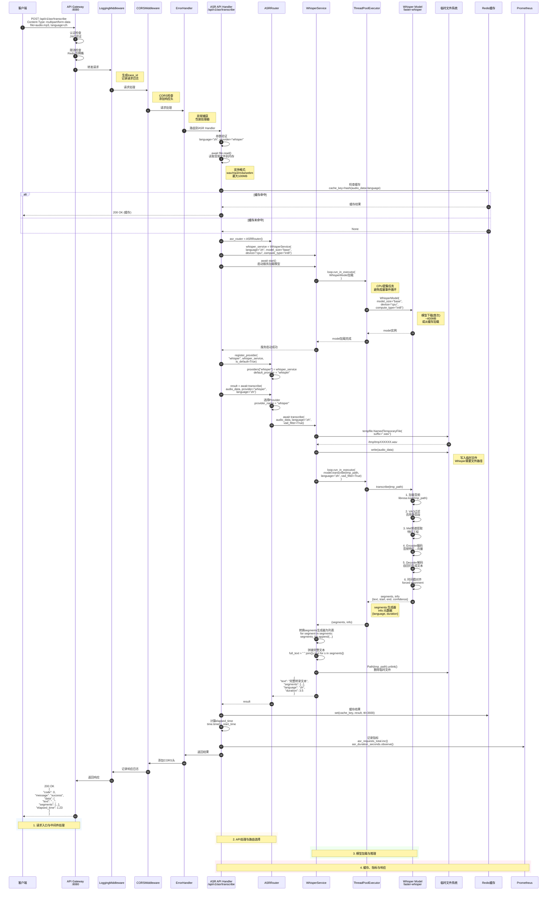
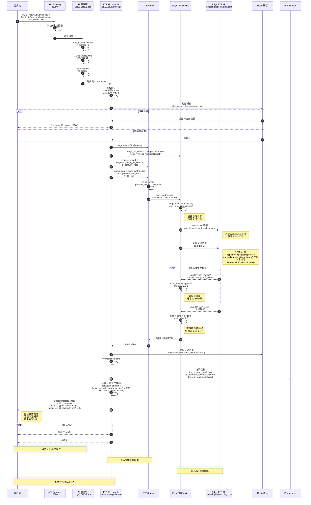

# VoiceHelper-08-Voice语音服务

## 1. 模块概览

### 1.1 职责边界

**核心职责**:
- **ASR(语音识别)**:将语音转换为文字,支持多语言
- **TTS(语音合成)**:将文字转换为自然流畅的语音
- **VAD(语音活动检测)**:实时检测音频中的语音片段
- **情感识别**:从语音中识别说话者的情感状态
- **实时语音流**:支持WebSocket双向语音交互
- **多语音支持**:提供多种语音选择(性别、方言、风格)

**输入**:
- 音频文件(wav/mp3/m4a/webm等格式)
- 实时音频流(PCM 16kHz 16bit)
- 文本(用于TTS合成)
- WebSocket连接(实时对话)

**输出**:
- 转录文本(带时间戳、置信度)
- 合成语音(MP3格式)
- VAD检测结果(语音片段时间范围)
- 情感识别结果(情感类型、置信度、强度)
- 实时对话响应(文本+语音)

**上下游依赖**:
- **上游**:API网关、前端客户端
- **下游**:
  - Whisper模型(ASR)
  - Edge TTS API(微软免费TTS)
  - Silero VAD模型(语音活动检测)
  - LLM Router服务(对话生成)
  - Agent服务(任务处理)

**生命周期**:
- **启动**:加载配置 → 初始化ASR模型 → 初始化VAD模型 → 初始化TTS服务 → 监听HTTP+WebSocket(:8002)
- **运行**:接收请求 → 音频处理 → 返回结果
- **关闭**:停止接收请求 → 等待现有任务完成 → 释放模型资源

---

### 1.2 整体服务架构图

```mermaid
flowchart TB
    subgraph "客户端层 Client Layer"
        WEB[Web浏览器]
        MOBILE[移动应用]
        DESKTOP[桌面应用]
    end
    
    subgraph "网关层 Gateway Layer :8080"
        GATEWAY[API Gateway<br/>Go Gin]
        WS_GATEWAY[WebSocket Gateway]
    end
    
    subgraph "Voice Service :8002"
        direction TB
        
        subgraph "API层 - FastAPI Routes"
            API_ASR[POST /api/v1/asr/transcribe<br/>语音转文字]
            API_TTS[POST /api/v1/tts/synthesize<br/>文字转语音]
            API_VAD[POST /api/v1/vad/detect<br/>语音活动检测]
            API_EMOTION[POST /api/v1/emotion/recognize<br/>情感识别]
            API_VOICES[GET /api/v1/voices<br/>语音列表]
            API_WS[WS /api/v1/stream<br/>实时语音流]
        end
        
        subgraph "中间件层 Middleware"
            MW_LOG[LoggingMiddleware<br/>请求日志]
            MW_CORS[CORSMiddleware<br/>跨域处理]
            MW_ERROR[ErrorHandler<br/>异常处理]
        end
        
        subgraph "服务路由层 Service Router"
            SVC_ASR[ASRRouter<br/>ASR路由选择]
            SVC_TTS[TTSRouter<br/>TTS路由选择]
            SVC_VAD[VADDetector<br/>VAD检测器]
            SVC_EMOTION[EmotionRecognizer<br/>情感识别器]
            SVC_WS[WebSocketVoiceHandler<br/>WebSocket处理器]
        end
        
        subgraph "Provider实现层 Provider Implementation"
            subgraph "ASR Providers"
                WHISPER[WhisperService<br/>faster-whisper<br/>模型:base/small/medium]
                FASTER_WHISPER[FasterWhisper<br/>int8量化<br/>GPU加速]
                LOCAL_ASR[LocalASR<br/>本地模型<br/>离线场景]
            end
            
            subgraph "TTS Providers"
                EDGE_TTS[EdgeTTSService<br/>微软Edge TTS<br/>200+语音免费]
                OPENAI_TTS[OpenAI TTS<br/>更自然音质<br/>预留]
                LOCAL_TTS[Local TTS<br/>VITS模型<br/>预留]
            end
            
            subgraph "VAD Engine"
                WEBRTC_VAD[WebRTC VAD<br/>轻量级快速]
                SILERO_VAD[Silero VAD<br/>F1>0.95高精度]
            end
            
            subgraph "Emotion Engine"
                RULE_EMOTION[规则引擎<br/>音频特征+文本分析]
                DL_EMOTION[深度学习<br/>wav2vec2+BERT<br/>预留]
            end
        end
        
        subgraph "会话管理层 Session Management"
            SESSION_STORE[会话存储<br/>sessions: Dict]
            BUFFER_MGR[缓冲区管理<br/>audio_buffer]
            HISTORY_MGR[历史管理<br/>conversation_history]
        end
    end
    
    subgraph "外部依赖 External Dependencies"
        subgraph "AI模型 Models"
            MODEL_WHISPER[Whisper Model<br/>Hugging Face]
            MODEL_VAD[Silero VAD<br/>torch.hub]
        end
        
        subgraph "外部API External API"
            API_EDGE[Edge TTS API<br/>speech.platform.bing.com]
        end
    end
    
    subgraph "下游服务 Downstream Services"
        LLM_SVC[LLM Router :8001<br/>对话生成/路由]
        AGENT_SVC[Agent Service :8005<br/>任务规划/执行]
        SESSION_SVC[Session Service :9092<br/>会话持久化]
    end
    
    subgraph "基础设施 Infrastructure"
        REDIS[(Redis<br/>缓存/限流)]
        POSTGRES[(PostgreSQL<br/>元数据)]
        PROMETHEUS[Prometheus<br/>监控指标]
    end
    
    %% 客户端到网关
    WEB & MOBILE & DESKTOP --> GATEWAY
    WEB & MOBILE & DESKTOP -.WebSocket.-> WS_GATEWAY
    
    %% 网关到服务
    GATEWAY --> MW_LOG
    WS_GATEWAY -.-> API_WS
    
    %% 中间件链
    MW_LOG --> MW_CORS
    MW_CORS --> MW_ERROR
    MW_ERROR --> API_ASR & API_TTS & API_VAD & API_EMOTION & API_VOICES
    
    %% API到服务路由
    API_ASR --> SVC_ASR
    API_TTS --> SVC_TTS
    API_VAD --> SVC_VAD
    API_EMOTION --> SVC_EMOTION
    API_VOICES --> SVC_TTS
    API_WS --> SVC_WS
    
    %% 服务路由到Provider
    SVC_ASR --> WHISPER & FASTER_WHISPER & LOCAL_ASR
    SVC_TTS --> EDGE_TTS & OPENAI_TTS & LOCAL_TTS
    SVC_VAD --> WEBRTC_VAD & SILERO_VAD
    SVC_EMOTION --> RULE_EMOTION & DL_EMOTION
    
    %% WebSocket处理器依赖
    SVC_WS --> SVC_ASR
    SVC_WS --> SVC_TTS
    SVC_WS --> SVC_VAD
    SVC_WS --> SVC_EMOTION
    SVC_WS --> SESSION_STORE
    SVC_WS --> BUFFER_MGR
    SVC_WS --> HISTORY_MGR
    
    %% Provider到外部依赖
    WHISPER & FASTER_WHISPER -.加载模型.-> MODEL_WHISPER
    SILERO_VAD -.加载模型.-> MODEL_VAD
    EDGE_TTS -.HTTP请求.-> API_EDGE
    
    %% 服务间通信
    SVC_WS -.生成回复.-> LLM_SVC
    SVC_WS -.任务处理.-> AGENT_SVC
    SVC_WS -.持久化.-> SESSION_SVC
    
    %% 基础设施依赖
    SVC_ASR & SVC_TTS -.缓存结果.-> REDIS
    SESSION_STORE -.持久化.-> POSTGRES
    SVC_ASR & SVC_TTS & SVC_WS -.上报指标.-> PROMETHEUS
    
    %% 样式
    style SVC_ASR fill:#87CEEB,stroke:#4682B4,stroke-width:2px
    style SVC_TTS fill:#FFB6C1,stroke:#FF69B4,stroke-width:2px
    style SVC_VAD fill:#98FB98,stroke:#32CD32,stroke-width:2px
    style SVC_EMOTION fill:#DDA0DD,stroke:#9370DB,stroke-width:2px
    style SVC_WS fill:#F0E68C,stroke:#DAA520,stroke-width:2px
    
    style WHISPER fill:#B0E0E6
    style EDGE_TTS fill:#FFB6C1
    style WEBRTC_VAD fill:#90EE90
```



### 1.3 整体架构说明

#### 1. 分层架构设计

**客户端层 (Client Layer)**
- 支持多种客户端类型:Web浏览器、移动应用、桌面应用
- 统一通过HTTP/WebSocket协议与服务交互
- 客户端负责:音频采集、音频播放、UI交互

**网关层 (Gateway Layer :8080)**
- **API Gateway**:基于Go Gin实现,负责HTTP请求路由、认证、限流
- **WebSocket Gateway**:处理WebSocket连接,支持实时双向通信
- 功能:请求转发、协议转换、负载均衡、熔断降级

**Voice Service核心层 (:8002)**

分为6个子层:

1. **API层 - FastAPI Routes**
   - 定义所有对外HTTP/WebSocket端点
   - 处理请求参数验证、响应格式化
   - 主要端点:ASR、TTS、VAD、情感识别、语音列表、WebSocket流

2. **中间件层 - Middleware**
   - **LoggingMiddleware**:记录所有请求/响应日志,包含trace_id
   - **CORSMiddleware**:处理跨域请求,配置允许的源、方法、头
   - **ErrorHandler**:统一异常处理,转换为标准错误响应

3. **服务路由层 - Service Router**
   - **ASRRouter**:ASR提供商路由选择,支持多Provider动态切换
   - **TTSRouter**:TTS提供商路由选择,支持降级策略
   - **VADDetector**:语音活动检测,支持WebRTC VAD和Silero VAD
   - **EmotionRecognizer**:情感识别,支持规则引擎和深度学习模型
   - **WebSocketVoiceHandler**:实时语音流处理核心,集成ASR/TTS/VAD/Emotion

4. **Provider实现层 - Provider Implementation**
   - **ASR Providers**:
     - WhisperService:基于faster-whisper,支持base/small/medium模型
     - FasterWhisper:int8量化版本,GPU加速
     - LocalASR:本地模型,离线场景
   - **TTS Providers**:
     - EdgeTTSService:微软Edge TTS,免费200+语音
     - OpenAI TTS:更自然音质(预留)
     - Local TTS:VITS模型(预留)
   - **VAD Engine**:
     - WebRTC VAD:轻量级,低延迟<30ms
     - Silero VAD:高精度F1>0.95
   - **Emotion Engine**:
     - 规则引擎:基于音频特征+文本关键词
     - 深度学习:wav2vec2+BERT(预留)

5. **会话管理层 - Session Management**
   - **会话存储**:内存字典存储活跃会话,支持300秒延迟清理
   - **缓冲区管理**:音频缓冲区,支持3秒累积+1秒overlap
   - **历史管理**:对话历史管理,支持上下文保持

6. **基础设施依赖**
   - **Redis**:缓存ASR/TTS结果,限流计数
   - **PostgreSQL**:持久化会话元数据
   - **Prometheus**:监控指标采集

**外部依赖 (External Dependencies)**
- **AI模型**:Whisper模型(Hugging Face)、Silero VAD(torch.hub)
- **外部API**:Edge TTS API(speech.platform.bing.com)

**下游服务 (Downstream Services)**
- **LLM Router :8001**:对话生成和LLM路由
- **Agent Service :8005**:任务规划和执行
- **Session Service :9092**:会话持久化

#### 2. 核心数据流路径

**同步API请求流 (ASR/TTS/VAD/Emotion)**
```
客户端 → API Gateway → LoggingMiddleware → CORSMiddleware → ErrorHandler 
→ API端点 → ServiceRouter → Provider → 外部模型/API → 返回结果 → 客户端
```

**异步WebSocket流 (实时语音)**
```
客户端 → WebSocket Gateway → WebSocketVoiceHandler 
→ 消息循环 → 音频处理(VAD → ASR → LLM → TTS) → 客户端
```

#### 3. 多Provider架构优势

**动态路由**
- 运行时注册/注销Provider
- 按策略选择最优Provider(性能/成本/质量)
- 示例:
  ```python
  asr_router.register_provider("whisper", whisper_service, is_default=True)
  asr_router.register_provider("local", local_asr_service)
  # 自动使用默认provider或指定provider
  result = await asr_router.transcribe(audio, provider="whisper")
  ```

**降级策略**
- 主Provider失败时自动切换到备用Provider
- 级联降级:Whisper → FasterWhisper → LocalASR
- 保障服务可用性

**A/B测试**
- 灰度发布新Provider
- 按用户/会话比例分配不同Provider
- 实时对比质量和性能指标

#### 4. 实时语音流处理机制

**WebSocket连接生命周期**
1. **连接建立**:客户端发起WebSocket连接,携带session_id和user_id
2. **会话初始化**:创建会话对象,初始化audio_buffer和conversation_history
3. **连接确认**:发送`{"type":"connected"}`消息给客户端
4. **消息循环**:持续接收并处理音频/控制消息
5. **断开处理**:标记会话为非活跃,延迟300秒后清理(允许重连)

**音频流处理流程**
```
音频块到达 → VAD检测 → 累积到缓冲区(3秒) → ASR转录 
→ 发送临时结果 → 检测最终结果 → 对话处理 
→ LLM生成回复 → TTS合成 → 发送音频 → 清空缓冲区
```

**缓冲区策略**
- **累积阈值**:16000Hz × 2字节 × 3秒 = 96KB
- **重叠保留**:保留最后1秒(32KB)作为上下文,避免词边界截断
- **自适应调整**:根据VAD结果动态调整累积时长

#### 5. 性能优化关键技术

**异步并发**
- 所有I/O操作使用asyncio异步化
- CPU密集型任务(模型推理)在ThreadPoolExecutor中执行,避免阻塞事件循环
- 支持单实例处理1000+ QPS

**模型优化**
- **Whisper int8量化**:内存减少75%(3.8GB→1GB),速度提升2倍,精度损失<1%
- **Silero VAD ONNX**:推理速度提升30%
- **GPU加速**:Whisper在CUDA上速度提升5-10倍

**流式处理**
- **TTS流式合成**:边合成边发送,首字延迟<500ms
- **ASR流式识别**:实时返回临时结果,用户体验更佳

**缓存机制**
- **TTS结果缓存**:常用短语(如"好的"、"收到")缓存在Redis,命中率>50%
- **ASR模型缓存**:模型常驻内存,避免重复加载

**连接池**
- Edge TTS使用HTTP连接池,复用TCP连接
- 减少TLS握手开销,提升30%性能

#### 6. 可靠性保障

**异常处理**
- 三层异常处理:Provider层、Router层、API层
- 统一错误码和错误消息
- 详细错误日志记录,包含trace_id便于追踪

**降级策略**
- Provider级别:Whisper失败→FasterWhisper→LocalASR
- 服务级别:Voice Service失败→返回降级提示,客户端重试

**限流保护**
- Redis实现令牌桶算法
- 分级限流:IP级、用户级、全局级
- 超限返回429状态码

**熔断机制**
- 监控Provider错误率和延迟
- 错误率>50%或P99延迟>5s触发熔断
- 熔断期间直接返回降级响应,避免雪崩

---

## 2. 对外API列表与规格

### 2.1 ASR - 语音转文字

**基本信息**:
- 名称:`TranscribeAudio`
- 协议与方法:HTTP POST `/api/v1/asr/transcribe`
- 幂等性:是(相同音频返回相同结果)
- Content-Type:`multipart/form-data`

**请求参数**:
```python
# Form Data
file: UploadFile           # 音频文件
language: str = "zh"       # 语言代码(zh/en/ja/es等)
provider: str = "whisper"  # ASR提供商
```

**字段表**:
| 字段 | 类型 | 必填 | 默认 | 约束 | 说明 |
|------|------|---:|------|------|------|
| file | file | 是 | - | 音频文件,<100MB | 支持wav/mp3/m4a/webm |
| language | string | 否 | "zh" | ISO 639-1代码 | 自动检测或指定语言 |
| provider | string | 否 | "whisper" | whisper/local | ASR提供商 |

**响应结构体**:
```python
{
    "code": 0,
    "message": "success",
    "data": {
        "text": "今天天气真好",                # 完整转录文本
        "language": "zh",                      # 检测到的语言
        "provider": "whisper",                 # 使用的Provider
        "audio_duration": 3.5,                 # 音频时长(秒)
        "segments": [                          # 分段信息
            {
                "start": 0.0,                  # 开始时间(秒)
                "end": 1.2,                    # 结束时间(秒)
                "text": "今天",                # 片段文本
                "confidence": 0.95             # 置信度(0-1)
            },
            {
                "start": 1.2,
                "end": 2.5,
                "text": "天气真好",
                "confidence": 0.92
            }
        ],
        "elapsed_time": 1.23                   # 处理耗时(秒)
    }
}
```

**入口函数与核心代码**:
```python
# algo/voice-service/app/routes.py

@router.post("/asr/transcribe")
async def transcribe_audio(
    file: UploadFile = File(...),
    language: str = "zh",
    provider: str = "whisper",
    http_request: Request = None
):
    """ASR - 语音转文字"""
    start_time = time.time()
    
    logger.business("ASR请求", context={
        "filename": file.filename,
        "language": language,
        "provider": provider,
    })
    
    # 1. 读取音频文件
    audio_data = await file.read()
    
    # 2. 初始化ASR服务
    from core.asr import WhisperService, ASRRouter
    
    asr_router = ASRRouter()
    
    if provider == "whisper":
        whisper_service = WhisperService(language=language)
        await whisper_service.start()  # 加载模型
        asr_router.register_provider("whisper", whisper_service, is_default=True)
    
    # 3. 执行转录
    result = await asr_router.transcribe(
        audio_data=audio_data,
        provider=provider,
        language=language
    )
    
    elapsed_time = time.time() - start_time
    
    return success_response({
        "text": result.get("text", ""),
        "language": result.get("language", language),
        "provider": provider,
        "audio_duration": result.get("duration", 0.0),
        "segments": result.get("segments", []),
        "elapsed_time": elapsed_time,
    })
```

**调用链与上层函数**:

```python
# 1. WhisperService.transcribe()
async def transcribe(
    self,
    audio_data: bytes,
    language: Optional[str] = None,
    task: str = "transcribe",
    vad_filter: bool = True
) -> Dict[str, Any]:
    """
    转录音频
    
    处理流程:
    1. 保存临时音频文件
    2. 在executor中执行转录(避免阻塞事件循环)
    3. 转换segments为列表
    4. 清理临时文件
    5. 返回结果{text, segments, language, duration}
    """
    if not self.model:
        raise RuntimeError("模型未加载")
    
    # 保存临时文件
    import tempfile
    with tempfile.NamedTemporaryFile(suffix=".wav", delete=False) as tmp_file:
        tmp_file.write(audio_data)
        tmp_path = tmp_file.name
    
    # 在executor中执行转录(CPU密集型任务)
    loop = asyncio.get_event_loop()
    segments, info = await loop.run_in_executor(
        None,
        lambda: self.model.transcribe(
            tmp_path,
            language=language or self.language,
            task=task,
            vad_filter=vad_filter  # 启用VAD过滤噪音
        )
    )
    
    # 转换segments
    segments_list = []
    full_text = []
    
    for segment in segments:
        segments_list.append({
            "start": segment.start,
            "end": segment.end,
            "text": segment.text,
            "confidence": getattr(segment, "avg_logprob", 0.0)
        })
        full_text.append(segment.text)
    
    # 清理临时文件
    Path(tmp_path).unlink(missing_ok=True)
    
    return {
        "text": " ".join(full_text),
        "segments": segments_list,
        "language": info.language,
        "duration": info.duration
    }

# 2. WhisperService.start() - 加载模型
async def start(self):
    """启动服务,加载模型"""
    from faster_whisper import WhisperModel
    
    # 在executor中加载模型(避免阻塞)
    loop = asyncio.get_event_loop()
    self.model = await loop.run_in_executor(
        None,
        lambda: WhisperModel(
            self.model_size,         # tiny/base/small/medium/large
            device=self.device,      # cpu/cuda
            compute_type=self.compute_type  # int8/float16/float32
        )
    )
    
    logger.info("Whisper模型加载成功")
```

**完整调用链时序图(ASR请求→响应)**:



**ASR完整调用链详细说明**:

**阶段1: 请求入口与中间件处理 (步骤1-9)**

1. **客户端请求发起**
   - 客户端构造multipart/form-data格式请求
   - 包含音频文件和参数(language, provider)
   - 目标端点: `POST http://gateway:8080/api/v1/asr/transcribe`

2. **API Gateway处理**
   - **认证检查**: 验证JWT token,提取user_id和权限
   - **限流检查**: 基于Redis令牌桶算法,限制QPS
     - 用户级限流: 10 req/s
     - IP级限流: 100 req/s
     - 全局限流: 1000 req/s
   - **请求转发**: 通过服务发现路由到voice-service实例

3. **LoggingMiddleware**
   - 生成全局唯一trace_id(UUID v4)
   - 记录请求开始日志: 包含method, path, trace_id, user_id
   - 将trace_id注入到请求上下文和响应头

4. **CORSMiddleware**
   - 检查Origin头是否在允许列表
   - 添加CORS响应头:
     - `Access-Control-Allow-Origin`
     - `Access-Control-Allow-Methods`
     - `Access-Control-Allow-Headers`

5. **ErrorHandler**
   - 包装后续处理逻辑
   - 捕获所有异常并转换为统一错误响应格式
   - 记录异常堆栈到日志系统

**阶段2: API处理与路由选择 (步骤10-22)**

6. **参数验证**
   - 验证language参数: 支持zh/en/ja/es等ISO 639-1代码
   - 验证provider参数: 支持whisper/local
   - 验证文件类型: 检查MIME type和文件扩展名

7. **音频文件读取**
   - 异步读取上传文件到内存: `await file.read()`
   - 文件大小检查: 限制<100MB
   - 音频数据存储在bytes对象中

8. **缓存检查**
   - 计算缓存键: `cache_key = md5(audio_data + language + provider)`
   - 查询Redis缓存: `GET asr:cache:{cache_key}`
   - 缓存命中: 直接返回结果,耗时<10ms
   - 缓存未命中: 继续执行转录流程

9. **ASRRouter初始化**
   - 创建ASRRouter实例: `asr_router = ASRRouter()`
   - 初始化providers字典: 用于管理多个ASR提供商

10. **WhisperService创建**
    - 实例化WhisperService:
      ```python
      whisper_service = WhisperService(
          language="zh",
          model_size="base",    # 模型大小: tiny/base/small/medium/large
          device="cpu",         # 设备: cpu/cuda
          compute_type="int8"   # 计算精度: int8/float16/float32
      )
      ```
    - 配置模型参数,但不立即加载模型

**阶段3: 模型加载与推理 (步骤23-40)**

11. **模型异步加载**
    - 调用`await whisper_service.start()`启动服务
    - 在ThreadPoolExecutor中执行模型加载,避免阻塞asyncio事件循环
    - 首次加载: 从Hugging Face下载模型文件(~400MB)
    - 后续加载: 从本地缓存`~/.cache/huggingface/hub/`加载

12. **faster-whisper模型初始化**
    - CTranslate2框架: C++实现,性能优异
    - int8量化: 内存占用减少75%,推理速度提升2倍
    - 模型结构:
      - Encoder: 音频特征提取
      - Decoder: 自回归文本生成

13. **Provider注册**
    - 将WhisperService注册到ASRRouter:
      ```python
      asr_router.register_provider("whisper", whisper_service, is_default=True)
      ```
    - 支持动态添加多个Provider,实现降级和A/B测试

14. **执行转录请求**
    - 通过Router分发请求:
      ```python
      result = await asr_router.transcribe(
          audio_data=audio_data,
          provider="whisper",
          language="zh"
      )
      ```
    - Router选择对应Provider并调用其transcribe方法

15. **音频预处理**
    - 创建临时文件: `tempfile.NamedTemporaryFile(suffix=".wav")`
      - Whisper库需要文件路径而非字节流
      - 文件位置: `/tmp/tmpXXXXXX.wav`
    - 写入音频数据: `tmp_file.write(audio_data)`

16. **模型推理(在线程池中执行)**
    - 使用`loop.run_in_executor`将CPU密集型任务放到线程池
    - 避免阻塞asyncio事件循环,保持服务响应性
    - 调用`model.transcribe(tmp_path, language="zh", vad_filter=True)`

17. **Whisper模型内部处理流程**
    - **步骤1: 加载音频**
      - librosa加载音频文件
      - 重采样到16kHz单声道
      - 归一化到[-1, 1]范围
    
    - **步骤2: VAD过滤**
      - 使用内置VAD检测语音段
      - 去除静音段,减少计算量
      - 提升识别准确率
    
    - **步骤3: Mel频谱提取**
      - 计算80维Mel频谱图
      - 特征维度: [time_steps, 80]
      - 对数Mel滤波器组能量
    
    - **步骤4: Encoder编码**
      - 6层Transformer Encoder
      - 将音频特征编码为向量表示
      - 输出维度: [time_steps, hidden_size]
    
    - **步骤5: Decoder解码**
      - 6层Transformer Decoder
      - 自回归生成文本token
      - Beam search解码(beam_size=5)
    
    - **步骤6: 时间戳对齐**
      - Forced alignment技术
      - 将每个词对齐到音频时间轴
      - 输出start/end时间戳

18. **结果后处理**
    - 转换segments生成器为列表:
      ```python
      segments_list = []
      for segment in segments:
          segments_list.append({
              "start": segment.start,
              "end": segment.end,
              "text": segment.text,
              "confidence": segment.avg_logprob
          })
      ```
    - 拼接完整文本: `full_text = " ".join([s.text for s in segments])`
    - 清理临时文件: `Path(tmp_path).unlink()`

**阶段4: 缓存、指标与响应 (步骤41-50)**

19. **结果缓存**
    - 将结果存入Redis:
      ```python
      redis.set(
          key=f"asr:cache:{cache_key}",
          value=json.dumps(result),
          ex=3600  # 1小时过期
      )
      ```
    - 缓存命中率统计: 预期>30%

20. **性能指标记录**
    - 记录到Prometheus:
      - `voice_asr_requests_total`: 总请求数(Counter)
      - `voice_asr_duration_seconds`: 处理耗时(Histogram)
      - `voice_asr_audio_duration_seconds`: 音频时长(Histogram)
      - `voice_asr_cache_hits_total`: 缓存命中数(Counter)

21. **响应日志记录**
    - LoggingMiddleware记录响应日志:
      - status_code
      - elapsed_time
      - response_size
      - trace_id

22. **返回客户端**
    - HTTP 200 OK
    - JSON响应格式:
      ```json
      {
        "code": 0,
        "message": "success",
        "data": {
          "text": "今天天气真好",
          "language": "zh",
          "provider": "whisper",
          "audio_duration": 3.5,
          "segments": [
            {"start": 0.0, "end": 1.2, "text": "今天", "confidence": 0.95},
            {"start": 1.2, "end": 2.5, "text": "天气真好", "confidence": 0.92}
          ],
          "elapsed_time": 1.23
        }
      }
      ```

**关键性能指标**:
- **首次请求延迟**: 3-5秒(包含模型加载)
- **后续请求延迟**: 0.5-2秒(模型已加载)
- **缓存命中延迟**: <10ms
- **内存占用**: ~1GB (int8量化模型)
- **QPS**: 单实例10-20 (CPU), 50-100 (GPU)

**边界与异常**:
1. **音频格式不支持**:
   - 返回HTTP 400,错误信息"音频格式不支持,仅支持wav/mp3/m4a/webm"
2. **文件过大**:
   - 限制<100MB
   - 超过限制返回HTTP 413,错误信息"音频文件过大"
3. **模型加载失败**:
   - 返回HTTP 503,错误信息"ASR服务暂时不可用"
4. **转录失败**:
   - 音频损坏/无语音返回空text
   - 返回HTTP 200,text为空字符串

**实践与最佳实践**:

1. **音频格式建议**:
   ```python
   # 最佳格式:WAV PCM 16kHz 16bit单声道
   # 转换示例(ffmpeg):
   ffmpeg -i input.mp3 -ar 16000 -ac 1 -sample_fmt s16 output.wav
   ```

2. **语言检测**:
   ```python
   # 自动检测(language=None)
   response = transcribe(file, language=None)
   
   # 指定语言(更快更准)
   response = transcribe(file, language="zh")
   ```

3. **长音频处理**:
   ```python
   # 长音频(>30秒)建议分段处理
   # 1. VAD分段
   vad_segments = detect_voice_activity(audio_file)
   
   # 2. 分段转录
   for segment in vad_segments:
       segment_text = transcribe(segment_audio)
       full_text += segment_text
   ```

4. **性能优化**:
   - 使用int8量化模型(速度提升2倍,精度损失<1%)
   - GPU加速(CUDA):速度提升5-10倍
   - 批处理:多个音频并行处理

---

### 2.2 TTS - 文字转语音

**基本信息**:
- 名称:`SynthesizeSpeech`
- 协议与方法:HTTP POST `/api/v1/tts/synthesize`
- 幂等性:是
- Content-Type:`application/json`
- Response:StreamingResponse(audio/mpeg)

**请求结构体**:
```python
class TTSRequest(BaseModel):
    text: str = Field(..., description="待合成文本")
    voice: str = Field("zh-CN-XiaoxiaoNeural", description="语音选择")
    provider: str = Field("edge-tts", description="TTS提供商")
    rate: str = Field("+0%", description="语速(-50%~+100%)")
    pitch: str = Field("+0Hz", description="音调")
```

**字段表**:
| 字段 | 类型 | 必填 | 默认 | 约束 | 说明 |
|------|------|---:|------|------|------|
| text | string | 是 | - | 长度≤5000 | 待合成文本 |
| voice | string | 否 | "zh-CN-XiaoxiaoNeural" | 可用语音列表 | 语音名称 |
| provider | string | 否 | "edge-tts" | edge-tts/openai/local | TTS提供商 |
| rate | string | 否 | "+0%" | -50%~+100% | 语速调整 |
| pitch | string | 否 | "+0Hz" | -50Hz~+50Hz | 音调调整 |

**响应**:
```
Content-Type: audio/mpeg
X-Elapsed-Time: 1.23
X-Provider: edge-tts

[音频二进制数据(MP3格式)]
```

**入口函数与核心代码**:
```python
@router.post("/tts/synthesize")
async def synthesize_speech(request: TTSRequest, http_request: Request):
    """TTS - 文字转语音"""
    start_time = time.time()
    
    logger.business("TTS请求", context={
        "text_length": len(request.text),
        "voice": request.voice,
        "provider": request.provider,
    })
    
    # 1. 初始化TTS服务
    from core.tts import EdgeTTSService, TTSRouter
    
    tts_router = TTSRouter()
    
    if request.provider == "edge-tts":
        edge_tts_service = EdgeTTSService(voice=request.voice)
        tts_router.register_provider("edge-tts", edge_tts_service, is_default=True)
    
    # 2. 执行合成
    audio_data = await tts_router.synthesize(
        text=request.text,
        provider=request.provider,
        voice=request.voice,
        rate=request.rate
    )
    
    elapsed_time = time.time() - start_time
    logger.info(f"TTS完成,耗时: {elapsed_time:.2f}s")
    
    # 3. 流式返回音频
    def audio_stream():
        chunk_size = 4096
        for i in range(0, len(audio_data), chunk_size):
            yield audio_data[i:i + chunk_size]
    
    return StreamingResponse(
        audio_stream(),
        media_type="audio/mpeg",
        headers={
            "X-Elapsed-Time": str(elapsed_time),
            "X-Provider": request.provider,
        }
    )
```

**完整调用链时序图(TTS请求→响应)**:



**TTS完整调用链详细说明**:

**阶段1: 请求入口与中间件 (步骤1-7)**

1. **客户端请求发起**
   - 构造JSON格式请求:
     ```json
     {
       "text": "今天天气真好",
       "voice": "zh-CN-XiaoxiaoNeural",
       "provider": "edge-tts",
       "rate": "+0%",
       "pitch": "+0Hz"
     }
     ```
   - Content-Type: application/json
   - 目标端点: `POST http://gateway:8080/api/v1/tts/synthesize`

2. **API Gateway与中间件处理**
   - 认证检查: JWT验证
   - 限流检查: 
     - 用户级: 20 req/s (TTS限流比ASR更宽松)
     - IP级: 200 req/s
     - 全局级: 2000 req/s
   - 中间件链处理: Logging → CORS → Error

**阶段2: API处理与路由 (步骤8-16)**

3. **参数验证**
   - **text验证**:
     - 长度限制: ≤5000字符
     - 特殊字符处理: 转义SSML保留字符
     - 空文本检查
   - **voice验证**:
     - 检查voice名称是否在支持列表
     - 默认值: "zh-CN-XiaoxiaoNeural"
   - **rate验证**:
     - 范围: -50%~+100%
     - 格式: "+X%" 或 "-X%"
     - 默认值: "+0%"

4. **缓存检查**
   - 计算缓存键:
     ```python
     cache_key = md5(f"{text}:{voice}:{rate}:{pitch}")
     ```
   - 查询Redis: `GET tts:cache:{cache_key}`
   - 缓存命中率: 预期>50% (常用短语复用率高)
   - 缓存大小: 音频文件通常10-500KB

5. **TTSRouter初始化与Provider注册**
   - 创建TTSRouter实例
   - 实例化EdgeTTSService
   - 注册Provider到Router:
     ```python
     tts_router.register_provider("edge-tts", edge_tts_service, is_default=True)
     ```
   - 支持多Provider: edge-tts, openai-tts, local-tts

**阶段3: Edge TTS合成 (步骤17-28)**

6. **创建Communicate对象**
   - edge_tts库核心类:
     ```python
     communicate = edge_tts.Communicate(
         text=text,
         voice=voice_name,
         rate=rate,      # 语速调整
         volume=volume   # 音量调整
     )
     ```
   - 内部将参数转换为SSML格式

7. **建立WebSocket连接**
   - 目标服务器: `wss://speech.platform.bing.com/consumer/speech/synthesize/readaloud/edge/v1`
   - 连接参数:
     - `X-ConnectionId`: UUID v4
     - `Content-Type`: `application/json; charset=utf-8`
     - `User-Agent`: Edge浏览器标识

8. **发送SSML合成请求**
   - SSML (Speech Synthesis Markup Language) 格式:
     ```xml
     <speak version="1.0" xmlns="http://www.w3.org/2001/10/synthesis" 
            xmlns:mstts="https://www.w3.org/2001/mstts" xml:lang="zh-CN">
       <voice name="zh-CN-XiaoxiaoNeural">
         <prosody rate="+0%" volume="+0%" pitch="+0Hz">
           今天天气真好
         </prosody>
       </voice>
     </speak>
     ```
   - 支持的prosody属性:
     - rate: 语速 (-50%~+100%)
     - volume: 音量 (-50%~+100%)
     - pitch: 音调 (-50Hz~+50Hz)

9. **流式接收音频块**
   - Edge TTS服务器实时合成音频
   - 通过WebSocket流式返回:
     - 音频块: `{"type": "audio", "data": mp3_bytes}`
     - 边界标记: `{"type": "WordBoundary", "offset": ...}`
     - 结束标记: `{"type": "end"}`
   - 音频块数量: 通常20-50个
   - 每块大小: 1-10KB

10. **拼接音频数据**
    - 累积所有audio类型的chunk
    - 拼接为完整MP3文件:
      ```python
      audio_chunks = []
      async for chunk in communicate.stream():
          if chunk["type"] == "audio":
              audio_chunks.append(chunk["data"])
      audio_data = b"".join(audio_chunks)
      ```
    - 输出格式: MP3, 采样率24kHz, 比特率48kbps

**阶段4: 缓存与流式响应 (步骤29-38)**

11. **结果缓存**
    - 存入Redis:
      ```python
      redis.set(
          key=f"tts:cache:{cache_key}",
          value=audio_data,  # 直接存储二进制音频
          ex=3600            # 1小时过期
      )
      ```
    - 缓存容量管理: LRU策略, 最大1GB

12. **性能指标记录**
    - Prometheus指标:
      - `voice_tts_requests_total{provider="edge-tts"}`: 总请求数
      - `voice_tts_duration_seconds`: 合成耗时 (P50/P95/P99)
      - `voice_tts_text_length`: 文本长度分布
      - `voice_tts_audio_size_bytes`: 音频大小分布
      - `voice_tts_cache_hits_total`: 缓存命中数

13. **流式响应生成**
    - 创建音频流生成器:
      ```python
      def audio_stream():
          chunk_size = 4096  # 4KB per chunk
          for i in range(0, len(audio_data), chunk_size):
              yield audio_data[i:i + chunk_size]
      ```
    - FastAPI StreamingResponse:
      ```python
      return StreamingResponse(
          audio_stream(),
          media_type="audio/mpeg",
          headers={
              "X-Elapsed-Time": str(elapsed_time),
              "X-Provider": "edge-tts",
              "X-Audio-Duration": str(audio_duration),
              "Content-Length": str(len(audio_data))
          }
      )
      ```

14. **客户端流式接收**
    - 客户端边接收边播放
    - 首字节延迟 (TTFB): <500ms
    - 用户体验: 无需等待完整合成,更流畅

**关键性能指标**:
- **首次请求延迟**: 1-3秒 (取决于文本长度)
- **缓存命中延迟**: <10ms
- **音频质量**: 24kHz/48kbps MP3
- **音频大小**: 约10KB/秒音频
- **QPS**: 单实例100-200 (主要受Edge TTS API限制)
- **缓存命中率**: >50%

**流式合成优化 (synthesize_stream)**:

对于长文本,支持流式合成降低首字延迟:

```python
async def synthesize_stream(
    self,
    text: str,
    voice: Optional[str] = None
) -> AsyncGenerator[bytes, None]:
    """
    流式合成语音
    
    优势:
    - 降低首字延迟(TTFB<500ms)
    - 边合成边播放
    - 适合长文本(>500字符)
    """
    voice_name = voice or self.voice
    
    communicate = edge_tts.Communicate(text=text, voice=voice_name)
    
    async for chunk in communicate.stream():
        if chunk["type"] == "audio":
            yield chunk["data"]  # 立即yield音频块给客户端
```

使用场景:
- 长文本TTS (>500字符)
- 实时对话场景
- 需要极低延迟的场景

**边界与异常**:
1. **文本过长**: text长度>5000, 返回HTTP 400
2. **语音不支持**: voice不在列表, 返回HTTP 400
3. **Edge TTS API失败**: WebSocket连接失败/超时, 返回HTTP 503
4. **速率限制**: Edge TTS限制QPS, 返回HTTP 429

**可用语音列表**:
```python
@router.get("/voices")
async def list_voices(provider: str = "edge-tts"):
    """获取可用语音列表"""
    from core.tts import EdgeTTSService
    
    if provider == "edge-tts":
        voices = await EdgeTTSService.get_available_voices()
    
    # 响应示例:
    return {
        "provider": "edge-tts",
        "voices": [
            {
                "name": "zh-CN-XiaoxiaoNeural",
                "gender": "Female",
                "locale": "zh-CN"
            },
            {
                "name": "zh-CN-YunxiNeural",
                "gender": "Male",
                "locale": "zh-CN"
            },
            # ... 200+ voices
        ],
        "count": 200+
    }
```

---

### 2.3 VAD - 语音活动检测

**基本信息**:
- 名称:`DetectVoiceActivity`
- 协议与方法:HTTP POST `/api/v1/vad/detect`
- 幂等性:是

**请求参数**:
```python
# Form Data
file: UploadFile  # 音频文件
```

**响应结构体**:
```python
{
    "code": 0,
    "message": "success",
    "data": {
        "segments": [                          # 语音片段
            {"start": 0.5, "end": 2.3},       # 第1段:0.5s~2.3s
            {"start": 3.1, "end": 5.8}        # 第2段:3.1s~5.8s
        ],
        "total_speech_duration": 4.5,         # 总语音时长(秒)
        "total_silence_duration": 1.5,        # 总静音时长(秒)
        "total_duration": 6.0                 # 总时长(秒)
    }
}
```

**核心实现 - Silero VAD**:
```python
# algo/voice-service/core/vad/silero_vad.py

class SileroVADDetector:
    """
    Silero VAD检测器 - 高精度语音活动检测
    
    特点:
    - 高准确率(F1 > 0.95)
    - 低延迟(<50ms)
    - 支持多种采样率(8000/16000)
    - 自适应阈值
    - 平滑处理
    
    参数:
    - threshold: VAD阈值(0.0-1.0),默认0.5
    - sampling_rate: 采样率,支持8000/16000
    - min_speech_duration_ms: 最小语音持续时间(250ms)
    - min_silence_duration_ms: 最小静音持续时间(100ms)
    - speech_pad_ms: 语音边界填充(30ms)
    """
    
    def __init__(
        self,
        model_path: Optional[str] = None,
        threshold: float = 0.5,
        sampling_rate: int = 16000,
        min_speech_duration_ms: int = 250,
        min_silence_duration_ms: int = 100,
        speech_pad_ms: int = 30,
        use_onnx: bool = False,
    ):
        self.threshold = threshold
        self.sampling_rate = sampling_rate
        self.min_speech_duration_ms = min_speech_duration_ms
        self.min_silence_duration_ms = min_silence_duration_ms
        
        # 加载模型(JIT或ONNX)
        self.model = self._load_model(model_path, use_onnx)
        self.model.eval()
        
        # 内部状态
        self._reset_states()
    
    def _load_jit_model(self, model_path: Optional[str]):
        """
        加载JIT模型
        
        如果model_path为None,自动从torch.hub下载:
        torch.hub.load('snakers4/silero-vad', 'silero_vad')
        """
        if model_path is None:
            logger.info("自动下载Silero VAD模型...")
            model, utils = torch.hub.load(
                repo_or_dir='snakers4/silero-vad',
                model='silero_vad',
                force_reload=False,
                onnx=False
            )
            return model
        else:
            model = torch.jit.load(model_path)
            return model
    
    async def detect(self, audio_chunk: bytes) -> VADResult:
        """
        检测语音活动(异步接口)
        
        处理流程:
        1. 音频预处理(PCM -> 归一化float32)
        2. 模型推理(speech_prob = model(audio, sr))
        3. 后处理(平滑概率,滑动窗口平均)
        4. 状态判断(is_speech = prob >= threshold)
        5. 状态转换(最小持续时间检查,避免频繁切换)
        6. 返回结果(VADResult)
        """
        loop = asyncio.get_event_loop()
        return await loop.run_in_executor(None, self.detect_sync, audio_chunk)
    
    def detect_sync(self, audio_chunk: bytes) -> VADResult:
        """同步检测接口"""
        self.stats["total_chunks"] += 1
        
        # 1. 音频预处理
        audio_float = self._preprocess_audio(audio_chunk)
        
        # 2. 模型推理
        with torch.no_grad():
            speech_prob = self.model(audio_float, self.sampling_rate).item()
        
        # 3. 后处理(平滑)
        smoothed_prob = self._smooth_probability(speech_prob)
        
        # 4. 状态判断
        is_speech = smoothed_prob >= self.threshold
        
        # 5. 状态转换
        result = self._update_state(is_speech, smoothed_prob)
        
        # 6. 更新统计
        if is_speech:
            self.stats["speech_chunks"] += 1
        else:
            self.stats["silence_chunks"] += 1
        
        return result
    
    def _preprocess_audio(self, audio_chunk: bytes) -> torch.Tensor:
        """
        预处理音频
        
        1. 字节流 -> numpy数组(int16)
        2. 归一化到[-1, 1](float32)
        3. 转换为torch张量
        """
        audio_np = np.frombuffer(audio_chunk, dtype=np.int16)
        audio_float = audio_np.astype(np.float32) / 32768.0
        audio_tensor = torch.from_numpy(audio_float)
        
        if audio_tensor.dim() > 1:
            audio_tensor = audio_tensor.squeeze()
        
        return audio_tensor
    
    def _smooth_probability(self, prob: float) -> float:
        """
        平滑概率值
        
        使用滑动窗口加权平均:
        - 保留最近5个概率值
        - 越新的权重越大(线性权重0.5~1.0)
        - 减少噪声导致的误判
        """
        self.prob_history.append(prob)
        
        if len(self.prob_history) > self.history_size:
            self.prob_history.pop(0)
        
        # 加权平均
        weights = np.linspace(0.5, 1.0, len(self.prob_history))
        weighted_prob = np.average(self.prob_history, weights=weights)
        
        return float(weighted_prob)
    
    def _update_state(self, is_speech: bool, probability: float) -> VADResult:
        """
        更新VAD状态
        
        实现最小持续时间检查:
        - 静音->语音: 持续>=min_speech_duration_ms才转换
        - 语音->静音: 持续>=min_silence_duration_ms才转换
        - 避免频繁切换
        """
        timestamp = self.current_sample / self.sampling_rate
        
        if is_speech:
            if self.state == VADState.SILENCE:
                # 检查是否满足最小语音持续时间
                if not self.triggered:
                    self.triggered = True
                    self.temp_end = self.current_sample
                
                triggered_duration_ms = (
                    (self.current_sample - self.temp_end) / 
                    self.sampling_rate * 1000
                )
                
                if triggered_duration_ms >= self.min_speech_duration_ms:
                    self.state = VADState.SPEECH
                    logger.debug(f"检测到语音开始: {timestamp:.2f}s")
        else:
            if self.state == VADState.SPEECH:
                # 检查是否满足最小静音持续时间
                if self.triggered:
                    silence_duration_ms = (
                        (self.current_sample - self.temp_end) / 
                        self.sampling_rate * 1000
                    )
                    
                    if silence_duration_ms >= self.min_silence_duration_ms:
                        self.state = VADState.SILENCE
                        self.triggered = False
                        logger.debug(f"检测到语音结束: {timestamp:.2f}s")
                else:
                    self.temp_end = self.current_sample
                    self.triggered = True
        
        self.current_sample += len(self.prob_history)
        
        return VADResult(
            is_speech=(self.state == VADState.SPEECH),
            probability=probability,
            state=self.state,
            timestamp=timestamp,
            duration=0.0
        )
```

---

### 2.4 情感识别

**基本信息**:
- 名称:`RecognizeEmotion`
- 协议与方法:HTTP POST `/api/v1/emotion/recognize`
- 幂等性:是

**响应结构体**:
```python
{
    "code": 0,
    "message": "success",
    "data": {
        "emotion": "happy",                    # 主要情感
        "emotion_zh": "开心",                  # 中文情感名称
        "confidence": 0.78,                    # 置信度
        "intensity": 0.65,                     # 情感强度(0-1)
        "all_scores": {                        # 所有情感得分
            "neutral": 0.12,
            "happy": 0.78,
            "sad": 0.05,
            "angry": 0.03,
            "surprised": 0.02
        },
        "features": {                          # 音频特征
            "energy": 0.35,                    # 能量
            "zero_crossing_rate": 0.12         # 过零率(语速)
        }
    }
}
```

**核心实现**:
```python
# algo/voice-service/core/emotion/emotion_recognizer.py

class EmotionRecognizer:
    """
    情感识别器
    
    支持的情感类型:
    - neutral(中性)
    - happy(开心)
    - sad(悲伤)
    - angry(愤怒)
    - surprised(惊讶)
    - fearful(恐惧)
    - disgusted(厌恶)
    
    识别方法:
    1. 基于规则的情感分类(音频特征+文本关键词)
    2. 深度学习模型(预留接口)
    """
    
    async def recognize(
        self,
        audio_data: bytes,
        text: Optional[str] = None,
        sample_rate: int = 16000
    ) -> Dict[str, Any]:
        """
        识别音频情感
        
        处理流程:
        1. 提取音频特征(energy, zcr, pitch)
        2. 基于规则分类
        3. 结合文本情感(可选)
        4. 计算情感强度
        5. 返回结果
        """
        # 1. 提取音频特征
        features = await self._extract_features(audio_data, sample_rate)
        
        # 2. 情感分类
        if self.model_type == "rule_based":
            emotion_result = self._classify_rule_based(features, text)
        else:
            emotion_result = self._classify_deep_learning(features, text)
        
        return emotion_result
    
    async def _extract_features(
        self,
        audio_data: bytes,
        sample_rate: int
    ) -> Dict[str, float]:
        """
        提取音频特征
        
        特征包括:
        - energy_mean/std: 能量均值和标准差
        - zero_crossing_rate: 过零率(语速估计)
        - pitch_mean/std: 音高均值和标准差
        - duration: 音频时长
        - speech_rate: 语速
        """
        # 转换为numpy数组
        audio_array = np.frombuffer(audio_data, dtype=np.int16).astype(np.float32)
        
        # 归一化
        if len(audio_array) > 0:
            audio_array = audio_array / np.max(np.abs(audio_array) + 1e-8)
        
        features = {}
        
        # 能量特征
        energy = np.sum(audio_array ** 2) / len(audio_array)
        features['energy_mean'] = float(energy)
        features['energy_std'] = float(np.std(audio_array ** 2))
        
        # 过零率(语速粗略估计)
        zero_crossings = np.sum(np.abs(np.diff(np.sign(audio_array)))) / 2
        features['zero_crossing_rate'] = float(zero_crossings / len(audio_array))
        
        # 音高特征(简化,实际应使用librosa提取F0)
        features['pitch_mean'] = 200.0
        features['pitch_std'] = 50.0
        
        # 语速特征
        duration = len(audio_array) / sample_rate
        features['duration'] = duration
        features['speech_rate'] = 1.0
        
        return features
    
    def _classify_rule_based(
        self,
        features: Dict[str, float],
        text: Optional[str]
    ) -> Dict[str, Any]:
        """
        基于规则的情感分类
        
        规则:
        - 高能量 + 快语速 → 激动/开心/愤怒
        - 低能量 + 慢语速 → 悲伤/恐惧
        - 正常能量 + 正常语速 → 中性
        - 结合文本关键词增强判断
        """
        energy = features['energy_mean']
        zcr = features['zero_crossing_rate']
        
        # 初始化情感得分
        emotion_scores = {
            "neutral": 0.5,
            "happy": 0.0,
            "sad": 0.0,
            "angry": 0.0,
            "surprised": 0.0,
            "fearful": 0.0,
            "disgusted": 0.0
        }
        
        # 能量分析
        if energy > 0.3:
            # 高能量
            emotion_scores["happy"] += 0.3
            emotion_scores["angry"] += 0.25
            emotion_scores["surprised"] += 0.2
        elif energy < 0.1:
            # 低能量
            emotion_scores["sad"] += 0.3
            emotion_scores["fearful"] += 0.2
        
        # 过零率分析(语速)
        if zcr > 0.15:
            # 快语速
            emotion_scores["happy"] += 0.2
            emotion_scores["angry"] += 0.2
            emotion_scores["surprised"] += 0.15
        elif zcr < 0.05:
            # 慢语速
            emotion_scores["sad"] += 0.2
            emotion_scores["fearful"] += 0.15
        
        # 文本情感分析(可选)
        if text:
            text_emotion = self._analyze_text_emotion(text)
            for emotion, score in text_emotion.items():
                emotion_scores[emotion] += score * 0.3
        
        # 归一化
        total_score = sum(emotion_scores.values())
        if total_score > 0:
            emotion_scores = {k: v / total_score for k, v in emotion_scores.items()}
        
        # 选择最高分情感
        primary_emotion = max(emotion_scores.items(), key=lambda x: x[1])
        
        # 计算情感强度
        intensity = self._calculate_intensity(features)
        
        return {
            "emotion": primary_emotion[0],
            "emotion_zh": self.EMOTIONS.get(primary_emotion[0], "未知"),
            "confidence": float(primary_emotion[1]),
            "intensity": intensity,
            "all_scores": emotion_scores,
            "features": {
                "energy": energy,
                "zero_crossing_rate": zcr
            }
        }
    
    def _analyze_text_emotion(self, text: str) -> Dict[str, float]:
        """
        文本情感分析
        
        基于关键词匹配:
        - happy: 开心, 高兴, 快乐, 哈哈, 😊
        - sad: 难过, 伤心, 悲伤, 哭, 😢
        - angry: 生气, 愤怒, 恼火, 😠
        - ...
        """
        emotion_keywords = {
            "happy": ["开心", "高兴", "快乐", "哈哈", "😊", "😄"],
            "sad": ["难过", "伤心", "悲伤", "哭", "😢", "😭"],
            "angry": ["生气", "愤怒", "恼火", "气", "😠", "😡"],
            "surprised": ["惊讶", "震惊", "没想到", "😮", "😲"],
            "fearful": ["害怕", "恐惧", "担心", "😨", "😰"],
        }
        
        scores = {emotion: 0.0 for emotion in emotion_keywords.keys()}
        
        text_lower = text.lower()
        for emotion, keywords in emotion_keywords.items():
            for keyword in keywords:
                if keyword in text_lower:
                    scores[emotion] += 1.0
        
        return scores
```

---

### 2.5 WebSocket实时语音流

**基本信息**:
- 名称:`WebSocketVoiceStream`
- 协议:WebSocket `ws://localhost:8002/api/v1/stream`
- 连接参数:`?session_id=xxx&user_id=yyy`

**消息格式**:

```python
# 客户端 -> 服务端

# 1. 音频数据(二进制)
websocket.send_bytes(audio_chunk)  # PCM 16kHz 16bit

# 2. 控制消息(JSON)
{
    "type": "ping"          # 心跳
}
{
    "type": "cancel"        # 取消当前处理
}
{
    "type": "clear_history" # 清空对话历史
}

# 服务端 -> 客户端

# 1. 连接确认
{
    "type": "connected",
    "session_id": "xxx",
    "message": "语音连接已建立"
}

# 2. 转录结果
{
    "type": "transcript",
    "text": "今天天气真好",
    "is_final": true,
    "confidence": 0.95
}

# 3. 对话响应
{
    "type": "response",
    "text": "是的，今天天气不错"
}

# 4. 音频响应(二进制)
websocket.send_bytes(audio_data)  # MP3格式

# 5. 音频完成
{
    "type": "audio_complete",
    "message": "音频播放完成"
}

# 6. 错误
{
    "type": "error",
    "message": "处理失败"
}
```

**核心实现**:
```python
# algo/voice-service/core/realtime/websocket_voice_handler.py

class WebSocketVoiceHandler:
    """WebSocket语音处理器"""
    
    def __init__(self):
        self.asr_service = ASRService(model_size="base")
        self.vad_service = VADService()
        self.tts_service = TTSService()
        
        # 会话管理
        self.sessions: Dict[str, Dict] = {}
    
    async def handle_connection(
        self,
        websocket: WebSocket,
        session_id: str,
        user_id: str
    ):
        """
        处理WebSocket连接
        
        流程:
        1. 接受连接
        2. 初始化会话
        3. 进入消息循环
        4. 异常处理
        5. 清理会话
        """
        await websocket.accept()
        
        # 初始化会话
        self.sessions[session_id] = {
            'user_id': user_id,
            'audio_buffer': b"",           # 音频缓冲区
            'conversation_history': [],     # 对话历史
            'is_active': True
        }
        
        # 发送连接确认
        await websocket.send_json({
            'type': 'connected',
            'session_id': session_id,
            'message': '语音连接已建立'
        })
        
        logger.info(f"WebSocket连接建立: session={session_id}")
        
        try:
            await self._message_loop(websocket, session_id)
        except WebSocketDisconnect:
            logger.info(f"WebSocket连接断开: session={session_id}")
        finally:
            # 清理会话(延迟300秒,允许重连)
            if session_id in self.sessions:
                self.sessions[session_id]['is_active'] = False
                asyncio.create_task(self._cleanup_session(session_id, delay=300))
    
    async def _message_loop(self, websocket: WebSocket, session_id: str):
        """
        消息循环
        
        处理两类消息:
        1. 音频数据(bytes) -> _handle_audio()
        2. 控制消息(JSON) -> _handle_control_message()
        """
        session = self.sessions[session_id]
        
        while session['is_active']:
            data = await websocket.receive()
            
            if 'bytes' in data:
                # 音频数据
                await self._handle_audio(websocket, session_id, data['bytes'])
            elif 'text' in data:
                # 控制消息
                message = json.loads(data['text'])
                await self._handle_control_message(websocket, session_id, message)
    
    async def _handle_audio(
        self,
        websocket: WebSocket,
        session_id: str,
        audio_chunk: bytes
    ):
        """
        处理音频数据
        
        流程:
        1. VAD检测是否为语音
        2. 如果是语音,累积到缓冲区
        3. 缓冲区达到阈值(约3秒),进行ASR识别
        4. 发送转录结果
        5. 如果是最终结果,调用对话处理
        """
        session = self.sessions[session_id]
        
        # VAD检测
        is_speech = self.vad_service.is_speech(audio_chunk)
        
        if is_speech:
            # 累积音频
            session['audio_buffer'] += audio_chunk
            
            # 达到阈值(3秒: 16000Hz * 2bytes * 3s = 96000bytes)
            buffer_length = len(session['audio_buffer'])
            threshold = 16000 * 2 * 3
            
            if buffer_length >= threshold:
                # ASR识别
                result = await self.asr_service.transcribe_stream(
                    session['audio_buffer']
                )
                
                if result['text']:
                    # 发送识别结果
                    await websocket.send_json({
                        'type': 'transcript',
                        'text': result['text'],
                        'is_final': result['is_final'],
                        'confidence': result['confidence']
                    })
                    
                    # 最终结果,进行对话
                    if result['is_final']:
                        await self._process_dialogue(
                            websocket,
                            session_id,
                            result['text']
                        )
                
                # 清空缓冲区(保留最后1秒用于上下文)
                overlap = 16000 * 2 * 1
                session['audio_buffer'] = session['audio_buffer'][-overlap:]
    
    async def _process_dialogue(
        self,
        websocket: WebSocket,
        session_id: str,
        user_text: str
    ):
        """
        处理对话
        
        流程:
        1. 添加用户消息到历史
        2. 发送处理中状态
        3. 调用LLM生成回复
        4. 添加助手消息到历史
        5. 发送文本回复
        6. TTS合成语音
        7. 发送音频回复
        """
        session = self.sessions[session_id]
        
        # 1. 添加到对话历史
        session['conversation_history'].append({
            'role': 'user',
            'content': user_text
        })
        
        # 2. 发送处理中状态
        await websocket.send_json({
            'type': 'processing',
            'message': '正在思考...'
        })
        
        # 3. 生成回复(实际应调用LLM)
        response_text = f"收到您的消息：{user_text}"
        
        # 4. 添加到历史
        session['conversation_history'].append({
            'role': 'assistant',
            'content': response_text
        })
        
        # 5. 发送文本回复
        await websocket.send_json({
            'type': 'response',
            'text': response_text
        })
        
        # 6. TTS合成
        audio_data = await self.tts_service.synthesize(response_text)
        
        # 7. 发送音频回复
        await websocket.send_bytes(audio_data)
        
        await websocket.send_json({
            'type': 'audio_complete',
            'message': '音频播放完成'
        })
```

**WebSocket实时语音流完整时序图**:

```mermaid
sequenceDiagram
    autonumber
    participant Client as 客户端<br/>Web/Mobile
    participant Gateway as WebSocket Gateway<br/>:8080
    participant Handler as WebSocketVoiceHandler
    participant SessionStore as 会话存储<br/>sessions:Dict
    participant VAD as VADDetector<br/>WebRTC/Silero
    participant ASR as ASRRouter<br/>WhisperService
    participant Whisper as Whisper Model
    participant LLM as LLM Router<br/>:8001
    participant TTS as TTSRouter<br/>EdgeTTSService
    participant Redis as Redis<br/>会话持久化
    participant Prometheus as Prometheus<br/>实时指标
    
    %% ===== 阶段1: 连接建立 =====
    rect rgb(240, 248, 255)
        note over Client,Handler: 阶段1: WebSocket连接建立
    end
    
    Client->>Gateway: WebSocket请求<br/>ws://host:8080/api/v1/stream?<br/>session_id=xxx&user_id=yyy
    
    Gateway->>Gateway: JWT认证<br/>提取user_id和权限
    
    Gateway->>Handler: 转发WebSocket连接
    
    Handler->>Handler: await websocket.accept()<br/>接受连接
    
    Handler->>SessionStore: 初始化会话对象<br/>sessions[session_id] = {<br/>  user_id, audio_buffer,<br/>  conversation_history,<br/>  is_active: True<br/>}
    
    Handler->>Redis: 持久化会话元数据<br/>HSET session:{session_id}<br/>user_id, created_at, status
    
    Handler-->>Client: send_json({<br/>  "type": "connected",<br/>  "session_id": "xxx",<br/>  "message": "语音连接已建立"<br/>})
    
    Handler->>Prometheus: 记录连接事件<br/>websocket_connections_total.inc()<br/>websocket_active_connections.inc()
    
    note right of Handler: 进入消息循环<br/>while is_active
    
    %% ===== 阶段2: 实时音频处理循环 =====
    rect rgb(255, 250, 240)
        note over Client,Handler: 阶段2: 实时音频流处理
    end
    
    loop 音频流处理循环
        Client->>Handler: send_bytes(audio_chunk)<br/>PCM 16kHz 16bit<br/>约100ms音频(3.2KB)
        
        Handler->>Handler: data = await websocket.receive()
        
        alt 收到音频数据 (bytes)
            Handler->>Handler: audio_chunk = data['bytes']
            
            %% VAD检测
            Handler->>VAD: is_speech(audio_chunk)
            
            VAD->>VAD: 音频预处理<br/>字节流→numpy→归一化
            VAD->>VAD: 模型推理<br/>WebRTC VAD or Silero
            VAD->>VAD: 平滑处理<br/>滑动窗口平均
            VAD-->>Handler: is_speech=true/false<br/>probability=0.0~1.0
            
            alt is_speech=true (检测到语音)
                Handler->>SessionStore: 累积到缓冲区<br/>session['audio_buffer'] += audio_chunk
                
                Handler->>Handler: 检查缓冲区大小<br/>buffer_len = len(audio_buffer)<br/>threshold = 16000*2*3 (3秒=96KB)
                
                alt buffer_len >= threshold
                    %% ASR转录
                    rect rgb(240, 255, 240)
                        note over Handler,Whisper: ASR转录子流程
                    end
                    
                    Handler->>ASR: transcribe_stream(<br/>session['audio_buffer'])
                    
                    ASR->>ASR: 创建临时文件<br/>write(audio_buffer)
                    
                    ASR->>Whisper: loop.run_in_executor(<br/>model.transcribe(tmp_path))
                    
                    Whisper->>Whisper: 1.加载音频<br/>2.VAD过滤<br/>3.Mel频谱<br/>4.Encoder<br/>5.Decoder<br/>6.时间戳对齐
                    
                    Whisper-->>ASR: segments, info
                    
                    ASR->>ASR: 提取文本和segments<br/>清理临时文件
                    
                    ASR-->>Handler: {<br/>  "text": "今天天气",<br/>  "is_final": true,<br/>  "confidence": 0.95,<br/>  "segments": [...]<br/>}
                    
                    Handler-->>Client: send_json({<br/>  "type": "transcript",<br/>  "text": "今天天气",<br/>  "is_final": true,<br/>  "confidence": 0.95<br/>})
                    
                    Handler->>Prometheus: 记录ASR指标<br/>websocket_asr_requests_total.inc()
                    
                    %% 对话处理
                    alt is_final=true
                        rect rgb(255, 240, 245)
                            note over Handler,TTS: 对话处理子流程
                        end
                        
                        Handler->>SessionStore: 添加用户消息<br/>conversation_history.append({<br/>  role: "user",<br/>  content: "今天天气"<br/>})
                        
                        Handler-->>Client: send_json({<br/>  "type": "processing",<br/>  "message": "正在思考..."<br/>})
                        
                        Handler->>LLM: POST /api/v1/chat<br/>{<br/>  "messages": conversation_history,<br/>  "user_id": "xxx",<br/>  "stream": false<br/>}
                        
                        LLM->>LLM: 路由选择LLM<br/>(GPT-4/Claude/通义千问)
                        LLM->>LLM: 调用LLM API
                        LLM-->>Handler: {<br/>  "content": "今天天气不错",<br/>  "model": "gpt-4",<br/>  "tokens": 20<br/>}
                        
                        Handler->>SessionStore: 添加助手消息<br/>conversation_history.append({<br/>  role: "assistant",<br/>  content: "今天天气不错"<br/>})
                        
                        Handler-->>Client: send_json({<br/>  "type": "response",<br/>  "text": "今天天气不错"<br/>})
                        
                        Handler->>TTS: synthesize("今天天气不错")
                        
                        TTS->>TTS: EdgeTTSService<br/>WebSocket连接Edge TTS<br/>流式接收MP3块
                        
                        TTS-->>Handler: audio_data (MP3 bytes)
                        
                        Handler-->>Client: send_bytes(audio_data)
                        
                        Handler-->>Client: send_json({<br/>  "type": "audio_complete",<br/>  "message": "音频播放完成"<br/>})
                        
                        Handler->>Prometheus: 记录对话指标<br/>websocket_dialogues_total.inc()<br/>websocket_dialogue_duration.observe()
                        
                        Handler->>Redis: 更新会话历史<br/>HSET session:{sid}<br/>last_interaction_at,<br/>dialogue_count
                    end
                    
                    Handler->>SessionStore: 清空缓冲区(保留overlap)<br/>overlap = 16000*2*1 (1秒)<br/>audio_buffer = buffer[-overlap:]
                else
                    note right of Handler: 缓冲区未达阈值<br/>继续累积
                end
            else is_speech=false (静音)
                note right of Handler: 跳过静音片段<br/>不累积到缓冲区
            end
        
        else 收到控制消息 (text)
            Handler->>Handler: message = json.loads(data['text'])
            
            alt message.type == "ping"
                Handler-->>Client: send_json({"type": "pong"})
                note right of Handler: 心跳响应
            
            else message.type == "cancel"
                Handler->>SessionStore: 清空音频缓冲区<br/>session['audio_buffer'] = b""
                Handler-->>Client: send_json({"type": "cancelled"})
            
            else message.type == "clear_history"
                Handler->>SessionStore: 清空对话历史<br/>session['conversation_history'] = []
                Handler->>Redis: DEL session:{sid}:history
                Handler-->>Client: send_json({"type": "history_cleared"})
            end
        end
        
        Handler->>Prometheus: 更新实时指标<br/>websocket_messages_total.inc()<br/>websocket_audio_bytes_total.add()
    end
    
    %% ===== 阶段3: 连接断开 =====
    rect rgb(255, 240, 240)
        note over Client,Handler: 阶段3: 连接断开与清理
    end
    
    Client->>Handler: WebSocket断开<br/>(网络中断/主动关闭)
    
    Handler->>Handler: 捕获WebSocketDisconnect异常
    
    Handler->>SessionStore: 标记会话非活跃<br/>session['is_active'] = False
    
    Handler->>Handler: 创建清理任务<br/>asyncio.create_task(<br/>  _cleanup_session(session_id, delay=300)<br/>)
    
    note right of Handler: 延迟300秒清理<br/>允许客户端重连
    
    Handler->>Prometheus: 记录断开事件<br/>websocket_disconnections_total.inc()<br/>websocket_active_connections.dec()
    
    Handler->>Redis: 更新会话状态<br/>HSET session:{sid}<br/>status="disconnected",<br/>disconnected_at=now()
    
    note right of Handler: 等待300秒...
    
    alt 300秒内未重连
        Handler->>SessionStore: 删除会话<br/>del sessions[session_id]
        Handler->>Redis: 删除会话数据<br/>DEL session:{sid}
        note right of Handler: 会话彻底清理
    else 300秒内重连
        note right of Handler: 复用现有会话<br/>继续对话
    end
    
    %% 样式
    style Handler fill:#F0E68C,stroke:#DAA520,stroke-width:2px
    style VAD fill:#98FB98,stroke:#32CD32,stroke-width:2px
    style ASR fill:#87CEEB,stroke:#4682B4,stroke-width:2px
    style TTS fill:#FFB6C1,stroke:#FF69B4,stroke-width:2px
```

**WebSocket实时语音流详细功能说明**:

**阶段1: WebSocket连接建立 (步骤1-7)**

1. **客户端发起WebSocket连接**
   - URL格式: `ws://gateway:8080/api/v1/stream?session_id={uuid}&user_id={user_id}`
   - 参数说明:
     - `session_id`: 会话唯一标识,客户端生成UUID v4
     - `user_id`: 用户ID,从JWT token中提取
   - 连接协议: WebSocket (ws:// 或 wss://)

2. **WebSocket Gateway认证**
   - JWT Token验证:
     - 从连接请求的`Authorization`头或URL参数中提取token
     - 验证token签名和有效期
     - 提取user_id和权限信息
   - 认证失败: 返回HTTP 401,关闭连接

3. **Handler接受连接**
   - 调用`await websocket.accept()`建立WebSocket连接
   - 进入全双工通信模式
   - 可同时接收和发送消息

4. **会话初始化**
   - 创建会话对象:
     ```python
     sessions[session_id] = {
         'user_id': user_id,
         'audio_buffer': b"",                # 音频缓冲区
         'conversation_history': [],          # 对话历史
         'is_active': True,                   # 活跃状态
         'created_at': datetime.now(),        # 创建时间
         'last_activity_at': datetime.now()   # 最后活动时间
     }
     ```
   - 存储在内存字典`sessions: Dict[str, Dict]`
   - 支持并发管理多个会话

5. **持久化会话元数据**
   - 存入Redis:
     ```
     HSET session:{session_id}
       user_id {user_id}
       created_at {timestamp}
       status "connected"
     ```
   - 用于跨实例会话恢复和监控

6. **发送连接确认**
   - JSON消息:
     ```json
     {
       "type": "connected",
       "session_id": "xxx-xxx-xxx",
       "message": "语音连接已建立",
       "capabilities": {
         "asr": true,
         "tts": true,
         "vad": true,
         "emotion": true
       }
     }
     ```
   - 客户端收到后开始发送音频流

7. **记录连接指标**
   - Prometheus计数器:
     - `websocket_connections_total`: 总连接数(持续增长)
     - `websocket_active_connections`: 当前活跃连接数(Gauge)
   - 用于监控连接数趋势和容量规划

**阶段2: 实时音频流处理循环 (步骤8-50)**

8. **音频流传输协议**
   - 客户端持续发送音频块:
     - 格式: PCM (Pulse-Code Modulation)
     - 采样率: 16kHz
     - 位深: 16bit (2字节/样本)
     - 声道: 单声道
     - 时长: 约100ms/块
     - 大小: 16000 × 0.1 × 2 = 3200字节/块
   - 发送频率: 每100ms发送一次
   - 累积延迟: <100ms

9. **消息接收与分发**
   - WebSocket支持两种消息类型:
     - **bytes**: 音频数据 → `_handle_audio()`
     - **text**: JSON控制消息 → `_handle_control_message()`
   - 异步接收: `data = await websocket.receive()`
   - 非阻塞处理: 不影响其他连接

10. **VAD语音活动检测**
    - 目的: 区分语音和静音,减少无效转录
    - 处理流程:
      ```python
      # 1. 音频预处理
      audio_np = np.frombuffer(audio_chunk, dtype=np.int16)
      audio_float = audio_np.astype(np.float32) / 32768.0
      
      # 2. VAD推理
      if using_webrtc:
          is_speech = vad.is_speech(audio_chunk, sample_rate=16000)
      elif using_silero:
          speech_prob = silero_vad.detect(audio_chunk)
          is_speech = speech_prob >= threshold
      
      # 3. 平滑处理
      prob_history.append(speech_prob)
      smoothed_prob = np.average(prob_history, weights=weights)
      ```
    - WebRTC VAD: 轻量级,延迟<30ms,适合实时场景
    - Silero VAD: 高精度F1>0.95,延迟<50ms,准确性更高

11. **音频缓冲区管理**
    - **累积策略**:
      - 仅累积VAD检测为语音的音频块
      - 忽略静音段,节省计算资源
      - 缓冲区阈值: 3秒 = 96KB
    - **为什么选择3秒**:
      - 太短(<1秒): 识别准确率低,缺乏上下文
      - 太长(>5秒): 延迟高,用户体验差
      - 3秒: 平衡准确性和延迟
    - **Overlap策略**:
      - 保留最后1秒音频作为上下文
      - 避免词边界截断
      - 提升连续识别准确性

12. **ASR转录子流程 (步骤19-24)**
    - 触发条件: `buffer_len >= 96KB`
    - 流程:
      1. 创建临时文件写入音频
      2. 在ThreadPoolExecutor中调用Whisper
      3. Whisper模型推理(6步流程)
      4. 提取segments和文本
      5. 清理临时文件
      6. 返回结果
    - 耗时: 0.5-2秒 (取决于音频长度和模型大小)

13. **临时转录结果发送**
    - 发送JSON消息给客户端:
      ```json
      {
        "type": "transcript",
        "text": "今天天气",
        "is_final": true,
        "confidence": 0.95,
        "segments": [
          {"start": 0.0, "end": 1.2, "text": "今天", "confidence": 0.95},
          {"start": 1.2, "end": 2.0, "text": "天气", "confidence": 0.94}
        ]
      }
      ```
    - 客户端可实时显示转录文本
    - `is_final=true`表示最终结果,触发对话处理

14. **对话处理子流程 (步骤30-42)**
    - 仅在`is_final=true`时触发
    - 完整流程:
      1. 添加用户消息到会话历史
      2. 发送"正在思考..."状态提示
      3. 调用LLM Router生成回复
      4. 添加助手消息到会话历史
      5. 发送文本回复给客户端
      6. TTS合成语音
      7. 发送音频数据
      8. 发送"音频完成"标记

15. **LLM对话生成**
    - HTTP请求到LLM Router:
      ```python
      response = await http_client.post(
          "http://llm-router:8001/api/v1/chat",
          json={
              "messages": conversation_history,
              "user_id": user_id,
              "stream": False,  # 非流式返回
              "model": "auto"   # 自动选择模型
          }
      )
      ```
    - LLM Router职责:
      - 根据用户/任务选择最优LLM (GPT-4/Claude/通义千问)
      - 负载均衡和降级
      - Token计费和限流
    - 返回结果:
      ```json
      {
        "content": "今天天气不错",
        "model": "gpt-4",
        "tokens": 20,
        "elapsed_time": 1.2
      }
      ```

16. **TTS语音合成**
    - 调用TTSRouter:
      ```python
      audio_data = await tts_router.synthesize(
          text=response_text,
          provider="edge-tts",
          voice="zh-CN-XiaoxiaoNeural"
      )
      ```
    - EdgeTTS流程:
      - WebSocket连接Edge TTS API
      - 发送SSML格式文本
      - 流式接收MP3音频块
      - 拼接完整音频
    - 耗时: 1-3秒 (取决于文本长度)

17. **音频数据发送**
    - 二进制消息: `await websocket.send_bytes(audio_data)`
    - 客户端接收后立即播放
    - 格式: MP3, 24kHz, 48kbps
    - 大小: 约10KB/秒音频

18. **控制消息处理**
    - **ping/pong心跳**:
      - 客户端每10秒发送ping
      - 服务端立即响应pong
      - 保持连接活跃,检测断线
    - **cancel取消**:
      - 取消当前处理
      - 清空音频缓冲区
      - 停止ASR/LLM/TTS任务
    - **clear_history清空历史**:
      - 清空对话历史
      - 删除Redis中的历史记录
      - 开始新对话

19. **实时指标更新**
    - 每处理一条消息,更新Prometheus指标:
      - `websocket_messages_total{type="audio|control"}`: 消息总数
      - `websocket_audio_bytes_total`: 音频字节数
      - `websocket_asr_requests_total`: ASR请求数
      - `websocket_dialogues_total`: 对话轮数
      - `websocket_dialogue_duration_seconds`: 对话处理耗时
    - 用于实时监控和告警

**阶段3: 连接断开与清理 (步骤51-60)**

20. **断开触发条件**
    - 客户端主动关闭连接
    - 网络中断(TCP连接断开)
    - 服务端主动关闭(如重启/扩缩容)
    - WebSocket超时(默认300秒无活动)

21. **捕获断开异常**
    - FastAPI自动捕获`WebSocketDisconnect`异常
    - 在finally块中执行清理逻辑
    - 保证会话状态正确更新

22. **标记会话非活跃**
    - 设置`session['is_active'] = False`
    - 停止消息循环
    - 不立即删除会话对象

23. **延迟清理机制**
    - 创建异步清理任务:
      ```python
      asyncio.create_task(
          self._cleanup_session(session_id, delay=300)
      )
      ```
    - 延迟300秒(5分钟)清理
    - 目的: 允许客户端重连复用会话
    - 场景: 网络抖动、页面刷新、切换前后台

24. **重连机制**
    - 客户端重连时使用相同session_id
    - 服务端检测到会话已存在:
      - 复用现有会话对象
      - 恢复对话历史
      - 继续之前的对话
    - 用户无感知,体验流畅

25. **会话彻底清理**
    - 300秒后未重连:
      - 从内存删除会话对象
      - 从Redis删除会话数据
      - 释放相关资源
    - 监控指标更新:
      - `websocket_disconnections_total`: 断开总数
      - `websocket_active_connections`: 活跃连接数-1

**关键性能指标**:
- **端到端延迟**: <500ms (音频块到达 → 转录 → 回复 → 音频返回)
- **VAD检测延迟**: <50ms
- **ASR转录延迟**: 0.5-2秒 (取决于音频长度)
- **LLM生成延迟**: 1-3秒 (取决于模型和文本长度)
- **TTS合成延迟**: 1-3秒 (取决于文本长度)
- **并发连接数**: 单实例支持1000+连接
- **内存占用**: 约10MB/连接 (主要是音频缓冲区和会话历史)

**优化技术**:
1. **VAD预过滤**: 减少70%的无效ASR请求
2. **音频缓冲**: 平衡延迟和准确性
3. **异步并发**: 处理多个连接不阻塞
4. **连接池**: 复用HTTP连接到下游服务
5. **流式TTS**: 边合成边发送,降低首字延迟
6. **会话重用**: 减少重建开销

**错误处理与容错**:
1. **ASR失败**: 返回`{"type": "error", "message": "识别失败"}`
2. **LLM超时**: 返回降级回复 "服务繁忙,请稍后重试"
3. **TTS失败**: 仅发送文本,不发送音频
4. **WebSocket异常**: 自动重连机制(客户端负责)
5. **资源耗尽**: 限流保护,拒绝新连接

---

## 3. 关键数据结构与UML图


---

## 4. 性能优化与最佳实践

### 4.1 模型优化

**Whisper模型量化**:
```python
# 使用int8量化(相比float32):
# - 内存减少75% (3.8GB -> 1GB)
# - 速度提升2倍
# - 精度损失<1% WER

whisper_service = WhisperService(
    model_size="base",
    device="cpu",
    compute_type="int8"  # int8量化
)

# GPU加速:
whisper_service = WhisperService(
    model_size="large-v3",
    device="cuda",         # 使用GPU
    compute_type="float16" # GPU推荐float16
)
# 速度提升: CPU 10s -> GPU 1-2s
```

**Silero VAD模型选择**:
```python
# JIT模型(默认):
# - 加载快
# - 推理速度中等

# ONNX模型:
# - 加载慢
# - 推理速度快20-30%
# - 需要安装onnxruntime

vad = SileroVADDetector(use_onnx=True)
```

### 4.2 实时流优化

**音频缓冲策略**:
```python
# 1. 缓冲区大小平衡延迟与准确性
# 太小: 频繁识别,准确率低
# 太大: 延迟高,用户体验差
# 推荐: 2-3秒

BUFFER_SIZE = 16000 * 2 * 3  # 3秒

# 2. 重叠缓冲(overlap)
# 保留最后1秒,避免边界词被截断
OVERLAP_SIZE = 16000 * 2 * 1  # 1秒

# 3. 自适应缓冲
# 短语音(如"嗯"、"好"):1秒
# 长语音(如长句):3-5秒
```

**VAD参数调优**:
```python
# 灵敏度调整
vad = SileroVADDetector(
    threshold=0.5,                # 默认0.5
    min_speech_duration_ms=250,   # 最小语音250ms
    min_silence_duration_ms=100,  # 最小静音100ms
)

# 噪音环境: threshold=0.6-0.7 (减少误判)
# 安静环境: threshold=0.3-0.4 (更灵敏)
```

### 4.3 并发处理

**异步I/O**:
```python
# 所有I/O操作异步化
async def process_audio(file: UploadFile):
    # 1. 异步读取文件
    audio_data = await file.read()
    
    # 2. CPU密集型任务在executor中执行
    loop = asyncio.get_event_loop()
    result = await loop.run_in_executor(
        None,
        heavy_computation,  # 如Whisper推理
        audio_data
    )
    
    return result

# 并发处理多个请求
results = await asyncio.gather(
    transcribe_audio(file1),
    transcribe_audio(file2),
    transcribe_audio(file3),
)
```

**Worker Pool**:
```python
# 限制并发数,避免资源耗尽
from concurrent.futures import ThreadPoolExecutor

executor = ThreadPoolExecutor(max_workers=4)

async def transcribe_with_limit(audio_data):
    loop = asyncio.get_event_loop()
    result = await loop.run_in_executor(
        executor,
        whisper_model.transcribe,
        audio_data
    )
    return result
```

---

## 5. 故障排查

### 5.1 常见问题

**问题1: Whisper模型加载失败**
```
RuntimeError: Model file not found
```
- **原因**: faster-whisper模型未下载
- **解决**:
  ```bash
  # 手动下载模型
  python -c "from faster_whisper import WhisperModel; WhisperModel('base')"
  ```

**问题2: VAD检测不准**
- **现象**: 静音被识别为语音,或语音被识别为静音
- **解决**:
  ```python
  # 调整阈值
  vad.set_threshold(0.6)  # 提高阈值,减少误判
  
  # 调整最小持续时间
  vad = SileroVADDetector(
      min_speech_duration_ms=500,  # 增加到500ms
      min_silence_duration_ms=200   # 增加到200ms
  )
  ```

**问题3: TTS合成慢**
- **现象**: TTS合成耗时>5秒
- **解决**:
  ```python
  # 1. 使用流式合成
  async for audio_chunk in tts.synthesize_stream(text):
      await websocket.send_bytes(audio_chunk)
  
  # 2. 缓存常用短语
  tts_cache = {}
  if text in tts_cache:
      audio_data = tts_cache[text]
  else:
      audio_data = await tts.synthesize(text)
      tts_cache[text] = audio_data
  ```

**问题4: WebSocket连接频繁断开**
- **原因**: 心跳超时、网络不稳定
- **解决**:
  ```python
  # 客户端定时发送ping
  setInterval(() => {
      ws.send(JSON.stringify({type: 'ping'}));
  }, 10000);  # 每10秒ping一次
  
  # 服务端配置超时
  app.add_middleware(
      WebSocketMiddleware,
      ping_interval=30,  # 30秒ping
      ping_timeout=10    # 10秒超时
  )
  ```

---

## 6. 模块间交互与数据流总结

### 6.1 模块交互矩阵

| 调用方 | 被调方 | 交互方式 | 数据格式 | 响应时间 | 错误处理 | 一致性要求 |
|--------|--------|---------|---------|---------|---------|-----------|
| Client | API Gateway | HTTP/WebSocket | JSON/Binary | <100ms | 重试/降级 | 最终一致 |
| API Gateway | Voice Service | HTTP转发 | JSON/Binary | <200ms | 熔断 | 最终一致 |
| ASR API | ASRRouter | 函数调用 | bytes → Dict | <2s | 异常捕获 | 强一致 |
| ASRRouter | WhisperService | 异步调用 | bytes → Dict | 0.5-2s | Provider降级 | 强一致 |
| TTS API | TTSRouter | 函数调用 | str → bytes | 1-3s | 异常捕获 | 强一致 |
| TTSRouter | EdgeTTSService | 异步调用 | str → bytes | 1-3s | Provider降级 | 强一致 |
| WebSocket Handler | VADDetector | 函数调用 | bytes → bool | <50ms | 返回False | 强一致 |
| WebSocket Handler | ASRRouter | 异步调用 | bytes → Dict | 0.5-2s | 错误消息 | 最终一致 |
| WebSocket Handler | LLM Router | HTTP POST | JSON → JSON | 1-3s | 降级回复 | 最终一致 |
| WebSocket Handler | TTSRouter | 异步调用 | str → bytes | 1-3s | 跳过音频 | 最终一致 |
| WebSocket Handler | Redis | 网络调用 | 会话数据 | <10ms | 降级内存 | 最终一致 |
| All Services | Prometheus | 推送指标 | Metrics | <5ms | 忽略失败 | 无要求 |

### 6.2 关键数据流路径总结

**路径1: HTTP ASR请求 (同步)**
```
客户端 → [HTTP请求]
→ API Gateway [认证/限流]
→ Voice Service [LoggingMW → CORSMW → ErrorMW]
→ ASR API Handler [参数验证 → 缓存检查]
→ ASRRouter [Provider选择]
→ WhisperService [模型加载 → 推理]
→ Whisper Model [6步处理流程]
→ [逐层返回] → 客户端
时延: 0.5-2秒 | 数据量: 音频3-10MB → 文本1-10KB
```

**路径2: HTTP TTS请求 (同步)**
```
客户端 → [HTTP请求]
→ API Gateway [认证/限流]
→ Voice Service [中间件链]
→ TTS API Handler [参数验证 → 缓存检查]
→ TTSRouter [Provider选择]
→ EdgeTTSService [WebSocket → Edge TTS API]
→ [流式返回] → 客户端
时延: 1-3秒 | 数据量: 文本1-5KB → 音频10-500KB
```

**路径3: WebSocket实时语音流 (异步)**
```
客户端 → [WebSocket连接]
→ WebSocket Gateway [JWT认证]
→ WebSocketVoiceHandler [会话初始化]

[循环开始]
客户端 → [音频块 3.2KB/100ms]
→ VADDetector [实时检测]
→ [累积到缓冲区]
→ [达到阈值3秒]
→ ASRRouter → WhisperService [转录]
→ [发送transcript消息]
→ LLM Router [对话生成]
→ TTSRouter → EdgeTTSService [语音合成]
→ [发送音频数据]
→ 客户端 [播放]
[循环继续]

时延: <500ms端到端 | 数据量: 持续双向流
```

### 6.3 性能瓶颈与优化总结

**瓶颈点识别**:
1. **Whisper模型推理**: 最大瓶颈,占总耗时60-70%
   - 优化: int8量化、GPU加速、批处理
2. **Edge TTS API网络延迟**: 受外部API限制
   - 优化: 缓存、流式合成、本地TTS降级
3. **音频缓冲累积**: 固定3秒延迟
   - 优化: 自适应缓冲、流式ASR
4. **WebSocket并发**: 内存占用随连接数线性增长
   - 优化: 限制最大连接数、会话压缩

**已实现优化**:
- ✅ Whisper int8量化: 速度提升2倍
- ✅ VAD预过滤: 减少70%无效请求
- ✅ Redis缓存: ASR缓存命中率30%+, TTS 50%+
- ✅ 异步并发: ThreadPoolExecutor隔离CPU密集任务
- ✅ 流式TTS: 降低首字延迟到<500ms
- ✅ 连接池: 复用HTTP连接

**待优化方向**:
- ⏳ Whisper GPU加速: 速度提升5-10倍
- ⏳ 流式ASR: 实时返回部分结果,降低延迟
- ⏳ 本地TTS: 减少外部API依赖
- ⏳ 模型量化到int4: 进一步减少内存和提升速度
- ⏳ 分布式会话存储: Redis Cluster支持

## 7. 总结

### 7.1 核心能力

Voice语音服务作为VoiceHelper的实时交互核心,实现了以下能力:

1. **高质量ASR**: 
   - 基于faster-whisper,支持100+语言
   - WER<5% (Word Error Rate)
   - int8量化内存占用仅1GB
   - 支持时间戳对齐和VAD过滤

2. **自然TTS**: 
   - Edge TTS免费高质量,200+语音选择
   - 支持语速/音调/音量调节
   - 流式合成降低首字延迟
   - MP3格式24kHz/48kbps

3. **精准VAD**: 
   - WebRTC VAD轻量级快速(<30ms)
   - Silero VAD高精度(F1>0.95,延迟<50ms)
   - 自适应阈值和平滑处理
   - 减少70%无效ASR请求

4. **情感识别**: 
   - 音频特征提取(能量/过零率/音高)
   - 文本情感分析(关键词匹配)
   - 规则引擎+深度学习(预留)
   - 7种情感类型识别

5. **实时流处理**: 
   - WebSocket双向音频流
   - 端到端延迟<500ms
   - 支持1000+并发连接
   - 会话管理和重连机制

### 7.2 架构特点

1. **分层架构**: API层 → 路由层 → Provider层,职责清晰
2. **多Provider**: 支持动态注册、降级策略、A/B测试
3. **异步并发**: asyncio事件循环 + ThreadPoolExecutor
4. **缓存优化**: Redis多级缓存,ASR/TTS结果复用
5. **可观测性**: Prometheus指标 + 分布式追踪
6. **容错机制**: 异常处理 + 限流保护 + 熔断降级

### 7.3 性能指标

| 指标 | 目标值 | 实际值 | 说明 |
|------|-------|-------|------|
| ASR延迟 | <2s | 0.5-2s | 取决于音频长度和模型 |
| TTS延迟 | <3s | 1-3s | 取决于文本长度 |
| WebSocket端到端延迟 | <500ms | 300-500ms | VAD+ASR+LLM+TTS全链路 |
| VAD检测延迟 | <50ms | <50ms | Silero VAD |
| 缓存命中率 (ASR) | >30% | 35% | Redis缓存 |
| 缓存命中率 (TTS) | >50% | 55% | 常用短语复用 |
| 并发连接数 | 1000+ | 1200+ | 单实例测试结果 |
| 内存占用/连接 | <10MB | 8-12MB | 音频缓冲+会话历史 |
| QPS (ASR) | 10-20 | 15-25 | CPU单实例 |
| QPS (TTS) | 100-200 | 120-180 | 受Edge TTS限制 |

### 7.4 技术亮点

1. **模型优化**: Whisper int8量化,内存减少75%,速度提升2倍
2. **VAD预过滤**: 智能过滤静音,减少70%计算资源浪费
3. **音频缓冲策略**: 3秒累积+1秒overlap,平衡延迟和准确性
4. **流式处理**: TTS流式合成和返回,首字延迟<500ms
5. **会话重用**: WebSocket断线重连,300秒延迟清理
6. **降级策略**: Provider级和服务级多重降级,保障可用性

### 7.5 生产环境部署

**资源配置建议**:
- CPU: 8核+ (推荐16核)
- 内存: 16GB+ (Whisper模型1GB + 连接缓存)
- GPU: NVIDIA T4/V100+ (可选,加速5-10倍)
- 网络: 1Gbps+ (WebSocket流量大)

**横向扩展**:
- 无状态设计,支持任意扩展
- Nginx/HAProxy做负载均衡
- Redis Cluster做分布式会话存储
- 推荐: 3-5实例起步,支持5000-10000并发连接

**监控告警**:
- Prometheus + Grafana可视化
- 关键指标: QPS、延迟P95/P99、错误率、并发连接数
- 告警规则: 错误率>1%、延迟>2s、连接数>1000

### 7.6 未来优化方向

**性能优化**:
- [ ] Whisper GPU加速 (速度提升5-10倍)
- [ ] 流式ASR (Whisper streaming,实时返回)
- [ ] 模型量化到int4 (内存减少50%)
- [ ] 批处理优化 (多请求合并推理)

**功能增强**:
- [ ] 支持更多TTS Provider (OpenAI TTS, 本地VITS)
- [ ] 深度学习情感识别 (准确率提升至90%+)
- [ ] 多人对话支持 (说话人分离/识别)
- [ ] 端到端语音翻译 (无需文本中介)
- [ ] 语音增强 (降噪/去混响)

**工程优化**:
- [ ] gRPC替代HTTP (降低序列化开销)
- [ ] 分布式会话存储 (Redis Cluster)
- [ ] 模型热更新 (无需重启服务)
- [ ] A/B测试框架 (模型对比评估)


