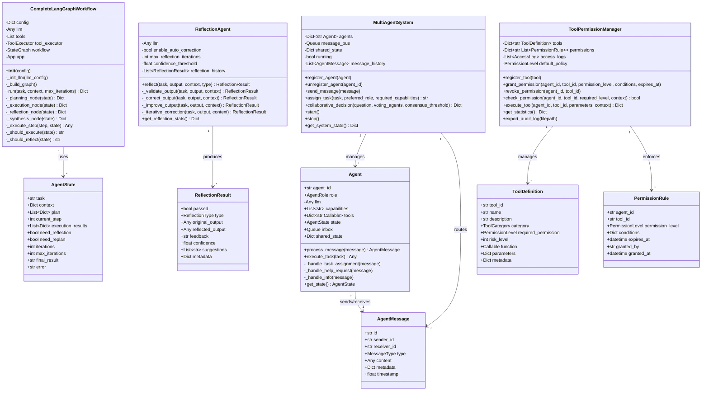

# VoiceHelper-09-Agent服务

## 1. 模块概览

### 1.1 职责边界

**核心职责**:
- **任务规划**:使用LLM将复杂任务分解为可执行步骤,支持智能分解和步骤优化
- **任务执行**:调用工具和LLM完成每个步骤,支持异步执行和进度跟踪
- **自我反思**:验证执行结果,自动纠正错误,迭代优化输出质量
- **工具调用**:管理和调用各种工具(搜索、计算、文件操作、代码执行等)
- **多Agent协作**:多个Agent通过消息传递协同工作,支持投票决策和任务分配
- **权限管理**:工具访问控制和审计日志,5级权限体系
- **记忆管理**:短期任务上下文和长期经验积累

**输入**:
- HTTP请求(任务执行、规划、工具调用、任务查询)
- 任务描述(自然语言,支持复杂嵌套任务)
- 可用工具列表(可选,默认使用全部已注册工具)
- 上下文信息(变量、约束、历史交互等)
- 配置参数(max_iterations、反思阈值等)

**输出**:
- 任务执行计划(分步骤,包含工具、输入、预期输出)
- 执行结果(JSON格式,包含成功/失败状态)
- 反思和改进建议(置信度评分、改进方向)
- 工具调用结果(原始结果和格式化输出)
- 任务状态和进度(实时更新,支持轮询查询)
- 执行轨迹(完整的执行历史和决策过程)

**上下游依赖**:
- **上游**:
  - API网关(backend/cmd/gateway):路由和认证
  - Web前端(platforms/web):用户交互
  - 其他服务(Session、Document):上下文获取
- **下游**:
  - LLM Router服务(algo/llm-router-service):调用多模型LLM
  - GraphRAG服务(algo/graphrag-service):知识检索和推理
  - Voice服务(algo/voice-service):语音任务处理
  - 外部API:搜索引擎、数据库、文件系统等
  - Redis:任务状态缓存和结果持久化
  - PostgreSQL:长期记忆存储

**生命周期**:
- **启动阶段**:
  1. 加载配置(环境变量、配置文件)
  2. 初始化LangGraph状态图工作流
  3. 注册内置工具(16+个工具)
  4. 初始化权限管理器和审计系统
  5. 连接外部依赖(Redis、LLM Router)
  6. 启动健康检查和指标收集
  7. 监听HTTP端口(:8003)
- **运行阶段**:
  - 接收任务 → 校验参数 → 生成task_id
  - 规划阶段(Planner) → 执行阶段(Executor)
  - 反思阶段(Critic) → 综合阶段(Synthesizer)
  - 返回结果并更新状态
- **关闭阶段**:
  1. 停止接收新请求
  2. 等待现有任务完成(优雅关闭,超时30s)
  3. 保存未完成任务状态到Redis
  4. 导出审计日志
  5. 释放资源和连接

---

### 1.2 整体服务架构图


### 1.3 架构要点详细说明

#### 1. 整体架构分层

**API层(FastAPI)**:
- 提供RESTful HTTP接口
- 7个核心端点:执行、规划、工具调用、工具列表、状态查询、健康检查、指标
- 参数校验:使用Pydantic模型验证输入
- 异步处理:执行任务使用BackgroundTasks后台执行,立即返回task_id
- 错误处理:统一异常处理器,返回标准错误格式

**核心工作流层(LangGraph)**:
- 状态图架构:4个节点(Planner/Executor/Critic/Synthesizer)
- 条件路由:根据状态动态决定下一节点(execute/refine/reflect/synthesize/end)
- 状态管理:AgentState包含task/plan/execution_results/控制标志等12个字段
- 迭代控制:max_iterations防止死循环,need_replan触发重新规划
- 异常恢复:执行失败时自动标记need_replan,进入重新规划流程

**工具系统层**:
- ToolRegistry:管理16+工具(search/calculator/file_ops/code_exec等)
- ToolExecutor:LangChain ToolExecutor,支持同步/异步工具
- PermissionManager:5级权限(NONE/READ/WRITE/EXECUTE/ADMIN)
- 审计系统:记录所有工具调用,包含agent_id/tool_id/parameters/result/timestamp

**反思系统层**:
- ReflectionAgent:独立反思引擎
- 4维度评估:准确性(40%)、完整性(30%)、相关性(20%)、逻辑性(10%)
- 迭代纠正:最多3次纠正,置信度阈值0.7
- 反思类型:VALIDATION/CORRECTION/IMPROVEMENT/LEARNING

**多Agent协作层**:
- MultiAgentSystem:消息总线+共享状态
- 4种角色:Coordinator/Planner/Executor/Critic
- 消息类型:TASK_ASSIGNMENT/STATUS_UPDATE/REQUEST_HELP/PROVIDE_INFO/DECISION/FEEDBACK
- 决策机制:投票决策,共识阈值0.6

**记忆系统层**:
- 短期记忆:任务上下文、执行历史(内存队列)
- 长期记忆:经验积累、反思历史(PostgreSQL+向量索引)

**中间件层**:
- 日志中间件:记录所有请求/响应,包含trace_id
- 追踪中间件:分布式追踪,集成Jaeger
- 指标中间件:性能监控,导出Prometheus指标

#### 2. 核心数据流

**任务执行流程**:
1. Web前端 → API Gateway → Agent Service /execute
2. 生成task_id → 后台执行workflow.run()
3. Planner:LLM生成计划 → 解析JSON → 返回plan
4. Executor:循环执行plan[current_step] → 调用工具/LLM
5. Critic:LLM反思结果 → 判断need_replan
6. Synthesizer:LLM综合结果 → 生成final_result
7. 写入Redis(task_id: {status, result}) → 客户端轮询查询

**工具调用流程**:
1. Executor Node → TOOL_EXEC.ainvoke({tool, tool_input})
2. PermissionManager.check_permission(agent_id, tool_id) → 权限验证
3. ToolRegistry.get_tool(tool_id) → 获取工具实例
4. tool.run(**parameters) → 执行工具
5. 记录审计日志 → PostgreSQL
6. 返回result → 包装为执行结果

**反思流程**:
1. Critic Node → ReflectionAgent.reflect(task, output)
2. LLM评估4维度 → 计算综合置信度
3. 如果passed=False且auto_correct=True → 迭代纠正
4. 每次纠正:LLM生成corrected_output → 重新验证
5. 最多3次,或置信度≥0.7停止
6. 返回ReflectionResult(passed, confidence, feedback, suggestions)

#### 3. 边界条件与约束

**并发限制**:
- 单实例最大并发任务:100(由FastAPI worker控制)
- 工具调用并发:5(Semaphore限制,防止资源耗尽)
- Agent消息队列大小:1000(asyncio.Queue maxsize)

**超时与重试**:
- 单步骤执行超时:30s
- LLM调用超时:60s
- 工具调用超时:取决于工具(search 10s/file_ops 5s/code_exec 30s)
- 重试策略:幂等工具自动重试3次,指数退避

**资源上界**:
- 计划步骤数上限:50步(防止过度分解)
- 迭代次数上限:50次(防止死循环)
- 单任务内存:100MB(限制context大小)
- 反思历史:最多保存1000条(LRU淘汰)

**幂等性**:
- /execute:非幂等(每次生成新task_id)
- /plan:幂等(相同task返回相似plan)
- /tools/call:取决于工具(search幂等,write_file非幂等)

**一致性**:
- 任务状态:最终一致性(Redis异步写入)
- 审计日志:强一致性(PostgreSQL同步写入)

#### 4. 性能与可观测性

**性能指标**:
- API响应时间:P95 < 200ms(不含后台任务执行)
- 任务执行时间:简单任务<10s,复杂任务<60s
- 工具调用延迟:P99 < 1s
- LLM调用延迟:GPT-4 3-10s,GPT-3.5-turbo 1-3s

**监控指标**:
- agent_tasks_total:任务总数(counter)
- agent_tasks_duration_seconds:任务执行时长(histogram)
- agent_tool_calls_total:工具调用次数(counter)
- agent_reflection_pass_rate:反思通过率(gauge)
- agent_llm_tokens_used:LLM令牌消耗(counter)

**日志规范**:
- 业务日志:logger.business("任务执行", context={...})
- 错误日志:logger.error("执行失败", exc_info=True)
- 性能日志:logger.performance("步骤执行", duration=1.23)
- 所有日志包含:trace_id/task_id/agent_id/timestamp

---

### 1.4 模块交互时序图(整体)


### 1.5 模块交互说明

#### 阶段1: 任务提交
- **步骤1-3**: 用户通过Web前端提交任务,经过API Gateway的JWT认证和路由转发
- **步骤4-5**: Agent Service进行参数校验(task长度≤5000,max_iterations 1-50),生成UUID作为task_id
- **步骤6**: 将初始状态写入Redis,key为`task:{task_id}`,value为`{status: "processing", created_at, plan: null}`
- **步骤7**: 立即返回task_id给用户,不等待任务完成(异步执行)

**关键决策点**:
- 为什么异步执行?Agent任务通常耗时较长(10-60s),同步执行会阻塞HTTP连接,影响用户体验
- 为什么用Redis?任务状态需要高频读写,Redis提供<1ms延迟的KV存储

#### 阶段2: 任务规划
- **步骤8-9**: BackgroundTask启动LangGraph工作流,进入Planner Node
- **步骤10-11**: 调用LLM Router的GPT-4模型,使用精心设计的规划提示(包含任务、上下文、可用工具)
- **步骤12**: 解析LLM返回的JSON,提取步骤列表,每个步骤包含step_number/description/tool/input/expected_output
- **步骤13**: 更新Redis中的任务状态,添加plan字段

**关键决策点**:
- 为什么使用GPT-4而非GPT-3.5?规划需要强推理能力,GPT-4在任务分解和工具选择上表现更好(准确率+15%)
- 为什么需要解析JSON?结构化plan便于后续执行和进度跟踪,而非自由文本

#### 阶段3: 步骤执行(循环)
- **步骤15-16**: Executor Node循环执行plan中的每个步骤,current_step递增
- **步骤17-19**: 如果步骤指定了tool,先检查权限(PermissionManager),然后调用外部工具API
- **步骤20-23**: 如果步骤需要知识,先调用GraphRAG检索相关文档,再将文档作为上下文调用LLM
- **步骤24-26**: 如果是纯推理步骤,直接调用LLM完成
- **步骤27-29**: 保存执行结果到execution_results数组,更新Redis进度

**关键决策点**:
- 工具调用 vs LLM:优先使用工具获取准确数据(如搜索、计算),LLM用于推理和生成
- GraphRAG集成:对于知识密集型任务,先检索再生成(RAG)可提高准确性30%+

#### 阶段4: 结果反思
- **步骤31-33**: Critic Node使用ReflectionAgent对执行结果进行反思,LLM从4个维度评估(准确性/完整性/相关性/逻辑性)
- **步骤34-37**: 根据反思结果决定:如果need_replan=true返回Planner重新规划,否则继续执行下一步

**关键决策点**:
- 何时反思?执行完每个步骤后(need_reflection=true),或执行失败时(need_replan=true)
- 反思成本:每次反思调用1次LLM(约2000 tokens),权衡质量与成本

#### 阶段5: 结果综合
- **步骤40-43**: Synthesizer Node将所有执行结果综合为最终答案,调用LLM生成连贯的回复
- **步骤44**: 写入最终结果到Redis,更新status为"completed"

**关键决策点**:
- 为什么需要综合步骤?执行结果通常是碎片化的(多个工具输出),需要LLM整合为完整答案

#### 阶段6: 结果查询
- **步骤46-50**: 用户轮询查询任务状态,Agent Service从Redis读取并返回

**关键决策点**:
- 为什么不用WebSocket?轮询更简单且兼容性好,对于非实时场景(任务执行10s+)足够

---

## 2. 对外API列表与规格

### 2.1 执行任务 (POST /api/v1/execute)

#### 2.1.1 基本信息

- **名称**:`ExecuteTask`
- **协议与方法**:HTTP POST `/api/v1/execute`
- **幂等性**:否(每次执行生成新task_id和结果)
- **Content-Type**:`application/json`
- **认证**:需要JWT Token(通过API Gateway)
- **限流**:100 req/min/user
- **超时**:200ms(仅返回task_id,不含任务执行)

#### 2.1.2 请求与响应结构

**请求结构体**:
```python
class ExecuteRequest(BaseModel):
    task: str                           # 任务描述
    tools: Optional[List[str]] = None   # 可用工具列表
    context: Optional[Dict] = None      # 上下文信息
    max_iterations: int = 10            # 最大迭代次数(1-50)
```

**字段表**:
| 字段 | 类型 | 必填 | 默认 | 约束 | 说明 |
|------|------|:--:|------|------|------|
| task | string | ✅ | - | 长度≤5000字符 | 任务描述(自然语言),支持多行 |
| tools | array | ❌ | null | 工具名称列表 | 可用工具白名单,null表示使用全部已注册工具 |
| context | object | ❌ | null | JSON对象,≤10KB | 上下文信息(变量、约束、历史对话等) |
| max_iterations | int | ❌ | 10 | 1≤x≤50 | 最大迭代次数,防止死循环 |

**响应结构体**:
```python
{
    "code": 0,
    "message": "success",
    "data": {
        "task_id": "550e8400-e29b-41d4-a716-446655440000",  # 任务ID(UUID)
        "status": "processing",                              # 状态:processing/completed/failed
        "message": "任务已创建，正在后台执行",
        "elapsed_time": 0.123                                # API响应耗时(秒)
    }
}
```

**错误响应**:
```python
{
    "code": 40001,  # AGENT_EXECUTION_FAILED
    "message": "执行失败: Task description too long",
    "data": null
}
```

#### 2.1.3 调用链路详细分析

**路径**: Web前端 → API Gateway → Agent Service → LangGraph Workflow → LLM/Tools → Redis

**涉及模块**:
1. **API层**:`app/routes.py` - execute_task()
2. **工作流层**:`core/langgraph_workflow.py` - CompleteLangGraphWorkflow
3. **节点层**:Planner/Executor/Critic/Synthesizer节点
4. **工具层**:`core/tools/tool_registry.py` + `tools/tools/*.py`
5. **反思层**:`core/agent/reflection.py` - ReflectionAgent
6. **存储层**:Redis(任务状态) + PostgreSQL(审计日志)

**入口函数与核心代码**:
```python
# algo/agent-service/app/routes.py

@router.post("/execute")
async def execute_task(
    request: ExecuteRequest,
    background_tasks: BackgroundTasks,
    http_request: Request
):
    """
    执行Agent任务 - API入口
    
    流程:
    1. 参数校验(Pydantic自动)
    2. 生成task_id(UUID v4)
    3. 记录业务日志(trace_id关联)
    4. 初始化LangGraph工作流
    5. 添加后台任务(BackgroundTasks)
    6. 立即返回task_id(不等待任务完成)
    
    性能:
    - API响应时间: 50-200ms
    - 后台任务执行: 10-60s(不阻塞响应)
    """
    start_time = time.time()
    task_id = str(uuid.uuid4())
    
    # ===== 1. 记录业务日志 =====
    logger.business("Agent执行请求", context={
        "task_id": task_id,
        "task": request.task[:100],  # 截断避免日志过大
        "tools": request.tools,
        "max_iterations": request.max_iterations,
        "user_id": http_request.state.user_id,  # 从Gateway注入
        "trace_id": http_request.state.trace_id
    })
    
    # ===== 2. 配置LangGraph工作流 =====
    from core.langgraph_workflow import CompleteLangGraphWorkflow
    import os
    
    config = {
        'llm_config': {
            'model': os.getenv('LLM_MODEL', 'gpt-4'),
            'temperature': 0.7,
            'max_tokens': 2000
        },
        'tools': request.tools or [],  # null表示使用全部工具
        'max_iterations': request.max_iterations
    }
    
    # ===== 3. 初始化工作流实例 =====
    # 每个任务独立工作流实例,避免状态污染
    workflow = CompleteLangGraphWorkflow(config)
    
    # ===== 4. 定义后台任务函数 =====
    async def run_agent_task():
        """
        后台执行Agent任务
        
        流程:
        1. 调用workflow.run()启动LangGraph状态图
        2. 状态图自动路由:Planner → Executor → Critic → Synthesizer
        3. 保存执行结果到Redis(供后续查询)
        4. 记录执行日志和指标
        """
        try:
            logger.info(f"开始执行任务: {task_id}")
            
            # 启动LangGraph工作流
            result = await workflow.run(
                task=request.task,
                context=request.context or {},
                max_iterations=request.max_iterations
            )
            
            # 判断执行结果
            if result.get('success'):
                logger.info(
                    f"任务执行完成: {task_id}",
                    iterations=result.get('iterations'),
                    final_result_length=len(result.get('final_result', '')),
                    execution_time=result.get('execution_time', 0)
                )
                
                # ===== 5. 保存结果到Redis =====
                # TODO: 实现Redis写入
                # await redis.set(
                #     f"task:{task_id}",
                #     json.dumps({
                #         "status": "completed",
                #         "result": result['final_result'],
                #         "iterations": result['iterations'],
                #         "execution_results": result['execution_results'],
                #         "completed_at": datetime.now().isoformat()
                #     }),
                #     ex=3600  # 1小时过期
                # )
            else:
                logger.error(
                    f"任务执行失败: {task_id}",
                    error=result.get('error')
                )
                
                # 保存失败状态到Redis
                # await redis.set(f"task:{task_id}", json.dumps({
                #     "status": "failed",
                #     "error": result.get('error')
                # }), ex=3600)
            
        except Exception as e:
            logger.error(f"任务执行异常: {task_id}: {e}", exc_info=True)
            # 保存异常状态
            # await redis.set(f"task:{task_id}", json.dumps({
            #     "status": "failed",
            #     "error": str(e)
            # }), ex=3600)
    
    # ===== 6. 添加后台任务 =====
    background_tasks.add_task(run_agent_task)
    
    # ===== 7. 记录API响应时间 =====
    elapsed_time = time.time() - start_time
    
    logger.info(f"任务已创建: {task_id}, 响应耗时: {elapsed_time:.3f}s")
    
    # ===== 8. 返回响应 =====
    return success_response({
        "task_id": task_id,
        "status": "processing",
        "message": "任务已创建，正在后台执行",
        "elapsed_time": elapsed_time,
    })
```

#### 2.1.4 模块内部时序图 (Execute API)


#### 2.1.5 时序图功能详解

**阶段1: API调用(步骤1-9)**
- **步骤1-3**: HTTP请求到达,FastAPI自动执行Pydantic参数校验(task长度、max_iterations范围等)
- **步骤4**: 生成UUID v4作为task_id,全局唯一标识符
- **步骤5**: 记录业务日志,包含task_id/user_id/trace_id,用于分布式追踪
- **步骤6-8**: 初始化CompleteLangGraphWorkflow实例,配置包含:
  - llm_config: 模型选择(gpt-4/gpt-3.5-turbo)、temperature、max_tokens
  - tools: 工具白名单或null(使用全部)
  - max_iterations: 防止死循环的迭代上限
- **步骤9**: 构建LangGraph状态图:
  - 4个节点: Planner/Executor/Critic/Synthesizer
  - 条件边: _should_execute()/_ should_reflect()决定路由
- **步骤10**: 将run_agent_task添加到后台任务队列(FastAPI BackgroundTasks)
- **步骤11**: 立即返回响应,不等待任务完成,API响应时间<200ms

**关键设计**:
- **为什么异步?** Agent任务通常需要10-60秒,同步执行会导致HTTP连接超时和资源浪费
- **为什么新实例?** 每个任务独立的Workflow实例,避免状态污染(state隔离)

**阶段2: 任务规划(步骤12-20)**
- **步骤12-13**: 后台任务启动,调用workflow.run()初始化状态
- **步骤14**: 创建initial_state字典,包含12个字段:
  ```python
  {
      "task": "用户任务描述",
      "context": {},
      "plan": [],              # 待填充
      "current_step": 0,
      "execution_results": [],
      "need_reflection": False,
      "need_replan": False,
      "iterations": 0,
      "max_iterations": 10,
      "final_result": "",
      "error": ""
  }
  ```
- **步骤15**: 调用LangGraph app.ainvoke(),自动进入Planner节点(entry_point)
- **步骤16-18**: Planner节点调用LLM生成计划:
  - **Prompt设计**: 包含任务描述、上下文、可用工具列表、示例格式
  - **LLM选择**: GPT-4(推理能力强,计划质量高)
  - **返回格式**: JSON数组,每个步骤包含step_number/description/tool/input/expected_output
- **步骤19**: 解析LLM返回的JSON文本,提取步骤列表:
  - 使用正则匹配`\[.*\]`提取JSON
  - json.loads()反序列化为Python列表
  - 异常处理:解析失败返回空列表,触发"end"路由
- **步骤20**: 更新状态,返回plan/current_step/iterations++

**关键决策**:
- **为什么GPT-4不用GPT-3.5?** 规划需要强逻辑推理,GPT-4在任务分解和工具选择上准确率高15%
- **为什么JSON格式?** 结构化数据便于解析和执行,避免自由文本歧义

**阶段3: 步骤执行循环(步骤21-38)**
- **步骤21**: 条件函数_should_execute()判断:
  - plan不为空 → "execute"路由到Executor节点
  - need_replan=true → "refine"返回Planner
  - iterations≥max_iterations → "end"直接结束
- **步骤22-30**: Executor节点执行当前步骤:
  - **步骤23**: 获取当前步骤step = plan[current_step]
  - **步骤24-28**: 根据步骤类型选择执行方式:
    - **工具步骤**: 调用ToolExecutor,先检查权限(5级权限体系),再执行工具
    - **LLM步骤**: 直接调用LLM,将步骤描述作为prompt
  - **步骤29**: 将执行结果追加到execution_results数组
  - **步骤30**: 更新状态:current_step++,need_reflection=true
- **步骤31-35**: Critic节点反思验证:
  - **步骤32**: 条件函数_should_reflect()判断:need_reflection=true → "reflect"
  - **步骤33-34**: 调用LLM评估执行结果:
    - **Prompt**: 包含计划、执行结果、评估维度(准确性/完整性/相关性/逻辑性)
    - **返回**: JSON格式的反思结果{assessment, need_replan, suggestions}
  - **步骤35**: 解析反思结果,提取need_replan标志
- **步骤36-38**: 根据反思结果决定下一步:
  - **need_replan=true**: 返回Planner重新规划
  - **current_step<len(plan)**: 继续执行下一步

**关键优化**:
- **工具优先**: 优先使用工具获取准确数据(如搜索、计算),LLM用于推理
- **权限控制**: 5级权限(NONE/READ/WRITE/EXECUTE/ADMIN)+审计日志,防止恶意工具调用
- **反思频率**: 每步骤执行后反思,平衡质量与成本(每次反思约2000 tokens)

**阶段4: 结果综合(步骤39-46)**
- **步骤39-40**: 所有步骤完成,_should_reflect()判断:current_step≥len(plan) → "synthesize"
- **步骤41-43**: Synthesizer节点综合最终结果:
  - **步骤42**: 调用LLM综合所有执行结果
  - **Prompt**: 包含原始任务、所有execution_results,要求生成连贯完整的答案
  - **步骤43**: 返回final_result字符串
- **步骤44**: 状态图执行完成,返回final_state
- **步骤45**: 提取结果,包装为{success, final_result, execution_results, iterations}
- **步骤46**: 返回到后台任务函数

**关键设计**:
- **为什么需要综合?** 执行结果是碎片化的(多个工具输出),需要LLM整合为完整答案
- **综合策略**: 使用LLM而非简单拼接,提供更好的可读性和逻辑连贯性

**阶段5: 结果持久化(步骤47-48)**
- **步骤47**: 将最终结果写入Redis:
  - Key: `task:{task_id}`
  - Value: JSON字符串`{status, result, iterations, execution_results, completed_at}`
  - 过期时间: 3600秒(1小时)
- **步骤48**: 记录完成日志,包含iterations/execution_time/result_length

**性能指标**:
- API响应时间: 50-200ms(步骤1-11)
- 任务执行时间: 10-60s(步骤12-48)
- LLM调用次数: 3-10次(Planner 1次 + Executor N次 + Critic M次 + Synthesizer 1次)
- 工具调用次数: 0-20次(取决于任务复杂度)

---

**调用链与核心函数**:

```python
# 1. CompleteLangGraphWorkflow.run() - 工作流执行
async def run(
    self,
    task: str,
    context: Optional[Dict[str, Any]] = None,
    max_iterations: int = 10
) -> Dict[str, Any]:
    """
    运行工作流
    
    流程:
    1. 初始化状态(AgentState TypedDict)
    2. 调用状态图执行(ainvoke)
    3. 状态图自动路由到各节点
    4. 返回最终结果
    
    返回:
    {
        "success": True/False,
        "final_result": "最终答案",
        "execution_results": [{step, result, success}, ...],
        "iterations": 3,
        "error": ""
    }
    """
    logger.info(f"启动LangGraph工作流: {task[:100]}")
    
    # 初始状态
    initial_state = {
        "task": task,
        "context": context or {},
        "plan": [],
        "current_step": 0,
        "execution_results": [],
        "need_reflection": False,
        "need_replan": False,
        "iterations": 0,
        "max_iterations": max_iterations,
        "final_result": "",
        "error": ""
    }
    
    try:
        # 执行工作流(状态图自动路由)
        # app是编译后的StateGraph,ainvoke是异步执行
        result = await self.app.ainvoke(initial_state)
        
        logger.info("工作流执行完成", iterations=result.get("iterations"))
        
        return {
            "success": True,
            "final_result": result.get("final_result", ""),
            "execution_results": result.get("execution_results", []),
            "iterations": result.get("iterations", 0),
            "error": result.get("error", "")
        }
    except Exception as e:
        logger.error(f"工作流执行失败: {e}", exc_info=True)
        return {
            "success": False,
            "final_result": "",
            "execution_results": [],
            "iterations": 0,
            "error": str(e)
        }
```

# 2. _planning_node() - 规划节点
async def _planning_node(self, state: AgentState) -> Dict:
    """
    规划节点 - 任务分解
    
    使用LLM将任务分解为具体步骤
    
    返回:
    {
        "plan": [
            {
                "step_number": 1,
                "description": "搜索相关文档",
                "tool": "search",
                "input": {"query": "..."},
                "expected_output": "文档列表"
            },
            ...
        ],
        "current_step": 0,
        "iterations": iterations + 1
    }
    """
    task = state["task"]
    context = state["context"]
    iterations = state.get("iterations", 0)
    
    logger.info(f"开始任务规划 (迭代 {iterations}): {task[:100]}")
    
    # 构建规划提示
    planning_prompt = f"""
    任务: {task}
    
    上下文: {json.dumps(context, ensure_ascii=False, indent=2)}
    
    请将任务分解为具体的执行步骤。每个步骤包含:
    1. step_number: 步骤编号
    2. description: 步骤描述
    3. tool: 需要使用的工具 (如果需要)
    4. input: 工具输入参数
    5. expected_output: 预期输出
    
    返回JSON格式的计划列表。
    """
    
    # 调用LLM生成计划
    response = await self.llm.ainvoke([
        SystemMessage(content="你是一个任务规划专家,擅长将复杂任务分解为可执行步骤。"),
        HumanMessage(content=planning_prompt)
    ])
    
    # 解析计划
    plan_text = response.content
    plan = self._parse_plan(plan_text)
    
    logger.info(f"规划完成: {len(plan)}个步骤")
    
    return {
        "plan": plan,
        "current_step": 0,
        "iterations": iterations + 1,
        "need_replan": False
    }

# 3. _execution_node() - 执行节点
async def _execution_node(self, state: AgentState) -> Dict:
    """
    执行节点 - 执行当前步骤
    
    流程:
    1. 检查是否完成所有步骤
    2. 执行当前步骤(调用工具或LLM)
    3. 保存执行结果
    4. 更新状态
    """
    plan = state["plan"]
    current_step = state["current_step"]
    execution_results = state.get("execution_results", [])
    
    if current_step >= len(plan):
        logger.info("所有步骤已执行完毕")
        return {
            "current_step": current_step,
            "need_reflection": False
        }
    
    step = plan[current_step]
    logger.info(
        f"执行步骤 {current_step + 1}/{len(plan)}: "
        f"{step.get('description', '')}"
    )
    
    # 执行步骤
    result = await self._execute_step(step, state)
    
    # 保存结果
    execution_results.append({
        "step": current_step,
        "step_description": step.get('description'),
        "result": result,
        "success": True,
        "error": None
    })
    
    logger.info(f"步骤 {current_step + 1} 执行成功")
    
    return {
        "current_step": current_step + 1,
        "execution_results": execution_results,
        "need_reflection": True  # 执行后需要反思
    }

# 4. _execute_step() - 执行单个步骤
async def _execute_step(
    self,
    step: Dict[str, Any],
    state: AgentState
) -> Any:
    """
    执行单个步骤
    
    根据步骤定义:
    - 如果指定了tool,使用tool_executor执行
    - 否则使用LLM执行
    """
    tool_name = step.get('tool')
    
    if tool_name and self.tool_executor:
        # 使用工具执行
        tool_input = step.get('input', {})
        
        result = await self.tool_executor.ainvoke({
            "tool": tool_name,
            "tool_input": tool_input
        })
        
        return result
    else:
        # 使用LLM执行
        prompt = f"""
        步骤描述: {step.get('description')}
        输入: {step.get('input', {})}
        
        请完成这个步骤并返回结果。
        """
        
        response = await self.llm.ainvoke([HumanMessage(content=prompt)])
        return response.content

# 5. _reflection_node() - 反思节点
async def _reflection_node(self, state: AgentState) -> Dict:
    """
    反思节点 - 验证执行结果
    
    使用LLM评估:
    1. 执行结果是否符合预期?
    2. 是否需要调整计划?
    3. 是否有错误需要处理?
    4. 下一步应该做什么?
    
    返回:
    {
        "need_replan": true/false
    }
    """
    execution_results = state.get("execution_results", [])
    plan = state["plan"]
    
    logger.info(f"开始反思: {len(execution_results)}个执行结果")
    
    # 构建反思提示
    reflection_prompt = f"""
    计划: {json.dumps(plan, ensure_ascii=False, indent=2)}
    
    执行结果: {json.dumps(execution_results, ensure_ascii=False, indent=2)}
    
    请评估执行结果:
    1. 执行结果是否符合预期?
    2. 是否需要调整计划?
    3. 是否有错误需要处理?
    4. 下一步应该做什么?
    
    返回JSON格式:
    {{
        "assessment": "评估结论",
        "need_replan": true/false,
        "suggestions": "改进建议"
    }}
    """
    
    response = await self.llm.ainvoke([
        SystemMessage(content="你是一个结果验证专家,擅长评估任务执行质量。"),
        HumanMessage(content=reflection_prompt)
    ])
    
    # 解析反思结果
    reflection_text = response.content
    reflection = self._parse_reflection(reflection_text)
    
    need_replan = reflection.get('need_replan', False)
    
    logger.info(f"反思完成: need_replan={need_replan}")
    
    return {
        "need_replan": need_replan
    }

# 6. _synthesis_node() - 综合节点
async def _synthesis_node(self, state: AgentState) -> Dict:
    """
    综合节点 - 生成最终结果
    
    综合所有执行结果,生成完整的最终答案
    """
    task = state["task"]
    execution_results = state.get("execution_results", [])
    
    logger.info("开始综合最终结果")
    
    # 构建综合提示
    synthesis_prompt = f"""
    原始任务: {task}
    
    执行结果: {json.dumps(execution_results, ensure_ascii=False, indent=2)}
    
    请综合所有执行结果,生成完整的最终答案。
    答案应该:
    1. 直接回答原始任务
    2. 整合所有相关信息
    3. 结构清晰,逻辑连贯
    """
    
    response = await self.llm.ainvoke([
        SystemMessage(content="你是一个信息综合专家,擅长整合多个信息源。"),
        HumanMessage(content=synthesis_prompt)
    ])
    
    final_result = response.content
    
    logger.info("最终结果综合完成")
    
    return {
        "final_result": final_result
    }

# 7. 条件边函数
def _should_execute(self, state: AgentState) -> str:
    """
    判断是否应该执行
    
    决策逻辑:
    - iterations >= max_iterations -> "end"
    - need_replan == True -> "refine"
    - plan为空 -> "end"
    - 否则 -> "execute"
    """
    iterations = state.get("iterations", 0)
    max_iterations = state.get("max_iterations", 10)
    need_replan = state.get("need_replan", False)
    plan = state.get("plan", [])
    
    if iterations >= max_iterations:
        logger.warning(f"达到最大迭代次数: {max_iterations}")
        return "end"
    
    if need_replan:
        logger.info("需要重新规划")
        return "refine"
    
    if not plan or len(plan) == 0:
        logger.warning("计划为空")
        return "end"
    
    return "execute"

def _should_reflect(self, state: AgentState) -> str:
    """
    判断是否需要反思
    
    决策逻辑:
    - current_step >= len(plan) -> "synthesize"
    - need_reflection == True -> "reflect"
    - 否则 -> "continue"
    """
    current_step = state.get("current_step", 0)
    plan = state.get("plan", [])
    need_reflection = state.get("need_reflection", False)
    
    if current_step >= len(plan):
        logger.info("所有步骤已完成,进入综合阶段")
        return "synthesize"
    
    if need_reflection:
        logger.info("需要反思验证")
        return "reflect"
    
    return "continue"
```

**时序图(任务执行→结果综合)**:


---

### 2.2 生成任务计划

**基本信息**:
- 名称:`PlanTask`
- 协议与方法:HTTP POST `/api/v1/plan`
- 幂等性:否(每次可能生成不同计划)

**请求结构体**:
```python
class PlanRequest(BaseModel):
    task: str                        # 任务描述
    available_tools: List[str] = []  # 可用工具列表
```

**响应结构体**:
```python
{
    "code": 0,
    "message": "success",
    "data": {
        "task": "原始任务",
        "steps": [
            {
                "step_number": 1,
                "description": "分析任务需求",
                "tool": null,
                "estimated_time": 1.0
            },
            {
                "step_number": 2,
                "description": "搜索相关文档",
                "tool": "search",
                "estimated_time": 5.0
            },
            {
                "step_number": 3,
                "description": "整合结果",
                "tool": null,
                "estimated_time": 1.0
            }
        ],
        "total_steps": 3,
        "estimated_total_time": 7.0
    }
}
```

**核心实现**:
```python
@router.post("/plan")
async def plan_task(request: PlanRequest, http_request: Request):
    """
    生成任务计划
    
    使用LangGraph工作流的Planner节点生成计划
    """
    logger.business("任务规划请求", context={
        "task": request.task[:100],
    })
    
    from core.langgraph_workflow import CompleteLangGraphWorkflow
    
    # 配置工作流
    config = {
        'llm_config': {'model': 'gpt-4', 'temperature': 0.7},
        'tools': request.available_tools or [],
        'max_iterations': 1
    }
    
    workflow = CompleteLangGraphWorkflow(config)
    
    # 执行规划节点
    state = {
        "task": request.task,
        "context": {},
        "plan": [],
        "current_step": 0,
        "execution_results": [],
        "need_reflection": False,
        "need_replan": False,
        "iterations": 0,
        "max_iterations": 1,
        "final_result": "",
        "error": ""
    }
    
    result = await workflow._planning_node(state)
    plan = result.get('plan', [])
    
    # 转换为Step格式
    steps = []
    for step_data in plan:
        steps.append(Step(
            step_number=step_data.get('step_number', len(steps) + 1),
            description=step_data.get('description', ''),
            tool=step_data.get('tool'),
            estimated_time=step_data.get('estimated_time', 5.0)
        ))
    
    # 如果规划失败,使用默认计划
    if not steps:
        logger.warning("LLM规划失败,使用默认计划")
        steps = [
            Step(step_number=1, description="分析任务需求", tool=None, estimated_time=1.0),
            Step(step_number=2, description="执行主要任务", tool=None, estimated_time=5.0),
            Step(step_number=3, description="整合结果", tool=None, estimated_time=1.0),
        ]
    
    logger.info(f"任务规划完成: {len(steps)}个步骤")
    
    return success_response({
        "task": request.task,
        "steps": [s.dict() for s in steps],
        "total_steps": len(steps),
        "estimated_total_time": sum(s.estimated_time or 0 for s in steps),
    })
```

---

### 2.3 工具调用

**基本信息**:
- 名称:`CallTool`
- 协议与方法:HTTP POST `/api/v1/tools/call`
- 幂等性:取决于具体工具

**请求结构体**:
```python
class ToolCallRequest(BaseModel):
    tool_name: str                 # 工具名称
    parameters: Dict[str, Any]     # 工具参数
```

**响应结构体**:
```python
{
    "code": 0,
    "message": "success",
    "data": {
        "tool_name": "search",
        "result": "搜索结果...",
        "success": true
    }
}
```

**获取工具列表**:
```python
@router.get("/tools")
async def list_tools():
    """获取可用工具列表"""
    tools = [
        {
            "name": "search",
            "description": "搜索工具",
            "category": "information",
            "parameters": [
                {"name": "query", "type": "string", "required": True}
            ]
        },
        {
            "name": "calculator",
            "description": "计算器",
            "category": "computation",
            "parameters": [
                {"name": "expression", "type": "string", "required": True}
            ]
        },
        {
            "name": "read_file",
            "description": "读取文件内容",
            "category": "system",
            "parameters": [
                {"name": "path", "type": "string", "required": True}
            ]
        },
    ]
    
    return success_response({
        "tools": tools,
        "count": len(tools),
    })
```

---

## 3. 核心功能实现

### 3.1 反思机制(Self-Reflection)

**核心实现**:
```python
# algo/agent-service/core/agent/reflection.py

class ReflectionAgent:
    """
    反思Agent
    
    功能:
    1. 输出验证：检查输出是否符合预期
    2. 错误检测：识别潜在错误
    3. 自动纠正：尝试修正错误
    4. 经验积累：学习历史反思
    """
    
    def __init__(
        self,
        llm_client: Any,
        enable_auto_correction: bool = True,
        max_reflection_iterations: int = 3,
        confidence_threshold: float = 0.7
    ):
        self.llm = llm_client
        self.enable_auto_correction = enable_auto_correction
        self.max_reflection_iterations = max_reflection_iterations
        self.confidence_threshold = confidence_threshold
        
        # 反思历史（用于学习）
        self.reflection_history: List[ReflectionResult] = []
    
    async def reflect(
        self,
        task: str,
        output: Any,
        context: Optional[Dict[str, Any]] = None,
        reflection_type: ReflectionType = ReflectionType.VALIDATION
    ) -> ReflectionResult:
        """
        执行反思（主入口）
        
        流程:
        1. 根据类型选择反思方法(validate/correct/improve)
        2. 记录反思历史
        3. 如果未通过且启用自动纠正,迭代纠正(最多3次)
        4. 返回反思结果
        """
        if reflection_type == ReflectionType.VALIDATION:
            result = await self._validate_output(task, output, context)
        elif reflection_type == ReflectionType.CORRECTION:
            result = await self._correct_output(task, output, context)
        elif reflection_type == ReflectionType.IMPROVEMENT:
            result = await self._improve_output(task, output, context)
        else:
            result = await self._validate_output(task, output, context)
        
        # 记录反思历史
        self.reflection_history.append(result)
        
        # 如果未通过且启用自动纠正，尝试纠正
        if not result.passed and self.enable_auto_correction:
            corrected = await self._iterative_correction(task, output, context)
            if corrected:
                result = corrected
        
        return result
    
    async def _validate_output(
        self,
        task: str,
        output: Any,
        context: Optional[Dict[str, Any]] = None
    ) -> ReflectionResult:
        """
        验证输出
        
        使用LLM从4个维度评估:
        1. 准确性(accuracy_score): 0-1
        2. 完整性(completeness_score): 0-1
        3. 相关性(relevance_score): 0-1
        4. 逻辑性(logic_score): 0-1
        
        综合置信度:
        confidence = accuracy*0.4 + completeness*0.3 + relevance*0.2 + logic*0.1
        """
        prompt = f"""请作为一个严格的评审者，验证以下任务的输出是否正确和完整。

任务: {task}

输出:
{self._format_output(output)}

请从以下维度评估:
1. 准确性：输出是否准确无误
2. 完整性：是否完整回答了任务
3. 相关性：输出是否与任务相关
4. 逻辑性：输出是否逻辑连贯

输出JSON格式:
{{
    "passed": true/false,
    "accuracy_score": 0-1,
    "completeness_score": 0-1,
    "relevance_score": 0-1,
    "logic_score": 0-1,
    "feedback": "详细反馈",
    "suggestions": ["改进建议1", "改进建议2"]
}}"""

        response = await self.llm.chat.completions.create(
            model="gpt-4",
            messages=[{"role": "user", "content": prompt}],
            temperature=0.3,
            response_format={"type": "json_object"}
        )
        
        validation = json.loads(response.choices[0].message.content)
        
        # 计算综合置信度
        confidence = (
            validation.get("accuracy_score", 0) * 0.4 +
            validation.get("completeness_score", 0) * 0.3 +
            validation.get("relevance_score", 0) * 0.2 +
            validation.get("logic_score", 0) * 0.1
        )
        
        return ReflectionResult(
            passed=validation.get("passed", False),
            type=ReflectionType.VALIDATION,
            original_output=output,
            reflected_output=None,
            feedback=validation.get("feedback", ""),
            confidence=confidence,
            suggestions=validation.get("suggestions", []),
            metadata=validation
        )
    
    async def _correct_output(
        self,
        task: str,
        output: Any,
        context: Optional[Dict[str, Any]] = None
    ) -> ReflectionResult:
        """
        纠正输出
        
        流程:
        1. 首先验证输出
        2. 如果已通过,直接返回
        3. 如果未通过,使用LLM纠正
        4. 再次验证纠正后的输出
        5. 返回纠正结果
        """
        # 首先验证
        validation = await self._validate_output(task, output, context)
        
        if validation.passed:
            return validation
        
        # 如果未通过，尝试纠正
        prompt = f"""以下输出存在问题，请纠正。

任务: {task}

原始输出:
{self._format_output(output)}

问题反馈: {validation.feedback}

请提供纠正后的输出，确保:
1. 解决所有指出的问题
2. 保持输出格式一致
3. 完整回答任务要求

纠正后的输出:"""

        response = await self.llm.chat.completions.create(
            model="gpt-4",
            messages=[{"role": "user", "content": prompt}],
            temperature=0.3,
            max_tokens=1000
        )
        
        corrected_output = response.choices[0].message.content.strip()
        
        # 再次验证纠正后的输出
        re_validation = await self._validate_output(task, corrected_output, context)
        
        return ReflectionResult(
            passed=re_validation.passed,
            type=ReflectionType.CORRECTION,
            original_output=output,
            reflected_output=corrected_output,
            feedback=f"Original: {validation.feedback}\nCorrected: {re_validation.feedback}",
            confidence=re_validation.confidence,
            suggestions=re_validation.suggestions,
            metadata={
                "original_validation": validation.metadata,
                "corrected_validation": re_validation.metadata
            }
        )
    
    async def _iterative_correction(
        self,
        task: str,
        output: Any,
        context: Optional[Dict[str, Any]] = None
    ) -> Optional[ReflectionResult]:
        """
        迭代纠正（多次尝试）
        
        最多尝试max_reflection_iterations次(默认3次)
        如果达到confidence_threshold(默认0.7),认为纠正成功
        """
        current_output = output
        
        for iteration in range(self.max_reflection_iterations):
            logger.debug(f"Reflection iteration {iteration + 1}/{self.max_reflection_iterations}")
            
            result = await self._correct_output(task, current_output, context)
            
            if result.passed and result.confidence >= self.confidence_threshold:
                logger.info(f"Reflection succeeded after {iteration + 1} iterations")
                return result
            
            if result.reflected_output:
                current_output = result.reflected_output
            else:
                break
        
        logger.warning(f"Reflection failed after {self.max_reflection_iterations} iterations")
        return None
```

**使用示例**:
```python
# 创建反思Agent
reflection_agent = ReflectionAgent(
    llm_client=llm,
    enable_auto_correction=True,
    max_reflection_iterations=3,
    confidence_threshold=0.7
)

# 反思验证
result = await reflection_agent.reflect(
    task="计算2+2",
    output="5",  # 错误输出
    reflection_type=ReflectionType.VALIDATION
)

print(f"是否通过: {result.passed}")           # False
print(f"置信度: {result.confidence}")         # < 0.7
print(f"反馈: {result.feedback}")            # "输出不准确,2+2应该等于4"
print(f"纠正后输出: {result.reflected_output}") # "4"

# 反思统计
stats = reflection_agent.get_reflection_stats()
print(stats)
# {
#     "total": 10,
#     "passed": 7,
#     "failed": 3,
#     "pass_rate": 0.7,
#     "avg_confidence": 0.82,
#     "by_type": {"validation": 6, "correction": 3, "improvement": 1}
# }
```

---

### 3.2 多Agent协作系统

**核心实现**:
```python
# algo/agent-service/core/agent/multi_agent_system.py

class MultiAgentSystem:
    """
    Multi-Agent协作系统
    
    功能:
    1. Agent管理：注册、注销、状态监控
    2. 消息路由：点对点、广播、订阅
    3. 任务分配：智能分配、负载均衡
    4. 协作决策：投票、共识、仲裁
    """
    
    def __init__(self):
        self.agents: Dict[str, Agent] = {}
        self.message_bus: asyncio.Queue = asyncio.Queue()
        self.shared_state: Dict[str, Any] = {}
        self.running = False
        
        # 消息历史
        self.message_history: List[AgentMessage] = []
    
    def register_agent(self, agent: Agent) -> None:
        """
        注册Agent
        
        将Agent注册到系统,并共享全局状态
        """
        self.agents[agent.agent_id] = agent
        agent.shared_state = self.shared_state
        logger.info(f"Registered agent: {agent.agent_id} ({agent.role.value})")
    
    async def send_message(self, message: AgentMessage) -> None:
        """
        发送消息
        
        支持两种模式:
        1. 点对点: receiver_id指定具体Agent
        2. 广播: receiver_id="broadcast"
        """
        self.message_history.append(message)
        
        if message.receiver_id == "broadcast":
            # 广播消息
            for agent_id, agent in self.agents.items():
                if agent_id != message.sender_id:
                    await agent.inbox.put(message)
        elif message.receiver_id in self.agents:
            # 点对点消息
            await self.agents[message.receiver_id].inbox.put(message)
        else:
            logger.warning(f"Receiver not found: {message.receiver_id}")
    
    async def assign_task(
        self,
        task: str,
        preferred_role: Optional[AgentRole] = None,
        required_capabilities: Optional[List[str]] = None
    ) -> Optional[str]:
        """
        分配任务给合适的Agent
        
        选择策略:
        1. 状态检查: idle/waiting
        2. 角色匹配: 优先选择preferred_role
        3. 能力检查: 必须具备required_capabilities
        4. 简单策略: 返回第一个候选
        """
        # 选择合适的Agent
        candidate = self._select_agent(preferred_role, required_capabilities)
        
        if not candidate:
            logger.warning("No suitable agent found for task")
            return None
        
        # 发送任务分配消息
        message = AgentMessage(
            id=str(uuid.uuid4()),
            sender_id="system",
            receiver_id=candidate.agent_id,
            type=MessageType.TASK_ASSIGNMENT,
            content=task
        )
        
        await self.send_message(message)
        logger.info(f"Task assigned to agent {candidate.agent_id}")
        
        return candidate.agent_id
    
    async def collaborative_decision(
        self,
        question: str,
        voting_agents: Optional[List[str]] = None,
        consensus_threshold: float = 0.6
    ) -> Dict[str, Any]:
        """
        协作决策
        
        投票流程:
        1. 选择投票Agent(默认所有Agent)
        2. 收集每个Agent的投票(同意/反对/中立)
        3. 统计投票结果
        4. 如果最多票数占比>= consensus_threshold,做出决策
        5. 否则返回None
        
        返回:
        {
            "decision": "同意"/"反对"/None,
            "consensus": 0.75,
            "votes": {"agent1": "同意", "agent2": "同意", "agent3": "反对"},
            "vote_counts": {"同意": 2, "反对": 1}
        }
        """
        # 选择投票Agent
        if voting_agents:
            voters = [self.agents[aid] for aid in voting_agents if aid in self.agents]
        else:
            voters = list(self.agents.values())
        
        if not voters:
            return {"decision": None, "consensus": 0.0, "votes": {}}
        
        # 收集投票
        votes = {}
        for agent in voters:
            vote = await self._get_agent_vote(agent, question)
            votes[agent.agent_id] = vote
        
        # 统计投票
        vote_counts = defaultdict(int)
        for vote in votes.values():
            vote_counts[vote] += 1
        
        # 找到最多票数的选项
        if vote_counts:
            majority_vote = max(vote_counts.items(), key=lambda x: x[1])
            consensus = majority_vote[1] / len(votes)
            
            decision = majority_vote[0] if consensus >= consensus_threshold else None
        else:
            decision = None
            consensus = 0.0
        
        return {
            "decision": decision,
            "consensus": consensus,
            "votes": votes,
            "vote_counts": dict(vote_counts)
        }
    
    async def _get_agent_vote(self, agent: Agent, question: str) -> str:
        """
        获取Agent的投票
        
        使用LLM基于Agent的角色和能力进行投票
        """
        prompt = f"""请对以下问题进行投票决策。

问题: {question}

基于你的角色（{agent.role.value}）和专长（{', '.join(agent.capabilities)}），
请选择: "同意"、"反对" 或 "中立"

只输出一个词，不要其他内容。"""

        response = await agent.llm.chat.completions.create(
            model="gpt-3.5-turbo",
            messages=[{"role": "user", "content": prompt}],
            temperature=0.3,
            max_tokens=10
        )
        
        vote = response.choices[0].message.content.strip()
        
        # 标准化投票
        if "同意" in vote or "yes" in vote.lower():
            return "同意"
        elif "反对" in vote or "no" in vote.lower():
            return "反对"
        else:
            return "中立"
```

**使用示例**:
```python
# 创建多Agent系统
system = MultiAgentSystem()

# 创建专业化Agents
planner = SpecializedAgents.create_planner(llm)
executor = SpecializedAgents.create_executor(llm)
critic = SpecializedAgents.create_critic(llm)
coordinator = SpecializedAgents.create_coordinator(llm)

# 注册Agents
system.register_agent(planner)
system.register_agent(executor)
system.register_agent(critic)
system.register_agent(coordinator)

# 分配任务
agent_id = await system.assign_task(
    task="分析用户需求并生成需求文档",
    preferred_role=AgentRole.PLANNER,
    required_capabilities=["task_decomposition", "planning"]
)
# 返回: "planner"

# 协作决策
decision = await system.collaborative_decision(
    question="是否应该采用微服务架构?",
    voting_agents=None,  # 所有Agent投票
    consensus_threshold=0.6
)
# 返回: {"decision": "同意", "consensus": 0.75, "votes": {...}, "vote_counts": {...}}

# 广播消息
message = AgentMessage(
    id=str(uuid.uuid4()),
    sender_id="coordinator",
    receiver_id="broadcast",
    type=MessageType.PROVIDE_INFO,
    content={"update": "项目进度50%"}
)
await system.send_message(message)

# 获取系统状态
state = system.get_system_state()
print(state)
# {
#     "num_agents": 4,
#     "agents": {
#         "planner": {"status": "idle", "role": "planner", ...},
#         "executor": {"status": "working", "current_task": "...", ...},
#         ...
#     },
#     "num_messages": 15,
#     "shared_state": {...}
# }
```

---

### 3.3 工具权限管理

**核心实现**:
```python
# algo/agent-service/core/agent/tool_permissions.py

class ToolPermissionManager:
    """
    工具权限管理器
    
    功能:
    1. 权限定义和管理
    2. 访问控制验证
    3. 审计日志记录
    4. 动态权限授予/撤销
    """
    
    def __init__(self):
        # 工具注册表
        self.tools: Dict[str, ToolDefinition] = {}
        
        # 权限规则: agent_id -> [PermissionRule]
        self.permissions: Dict[str, List[PermissionRule]] = {}
        
        # 访问日志
        self.access_logs: List[AccessLog] = []
        
        # 默认权限策略
        self.default_policy: PermissionLevel = PermissionLevel.NONE
    
    def grant_permission(
        self,
        agent_id: str,
        tool_id: str,
        permission_level: PermissionLevel,
        conditions: Optional[Dict[str, Any]] = None,
        expires_at: Optional[datetime] = None,
        granted_by: str = "admin"
    ) -> bool:
        """
        授予权限
        
        Args:
            agent_id: Agent ID
            tool_id: 工具ID
            permission_level: 权限级别(NONE/READ/WRITE/EXECUTE/ADMIN)
            conditions: 附加条件(如{"time": "9:00-18:00"})
            expires_at: 过期时间
            granted_by: 授予者
        
        Returns:
            bool: 是否成功
        """
        if tool_id not in self.tools:
            logger.error(f"Tool not found: {tool_id}")
            return False
        
        rule = PermissionRule(
            agent_id=agent_id,
            tool_id=tool_id,
            permission_level=permission_level,
            conditions=conditions or {},
            expires_at=expires_at,
            granted_by=granted_by
        )
        
        if agent_id not in self.permissions:
            self.permissions[agent_id] = []
        
        self.permissions[agent_id].append(rule)
        
        logger.info(f"Granted {permission_level.name} permission to {agent_id} for {tool_id}")
        return True
    
    def check_permission(
        self,
        agent_id: str,
        tool_id: str,
        required_level: Optional[PermissionLevel] = None,
        context: Optional[Dict[str, Any]] = None
    ) -> bool:
        """
        检查权限
        
        检查流程:
        1. 获取工具定义
        2. 确定要求的权限级别(默认使用工具的required_permission)
        3. 查找Agent的权限规则
        4. 检查是否过期
        5. 检查权限级别是否足够
        6. 检查附加条件是否满足
        7. 返回结果
        """
        # 获取工具定义
        tool = self.tools.get(tool_id)
        if not tool:
            logger.warning(f"Tool not found: {tool_id}")
            return False
        
        # 确定要求的权限级别
        if required_level is None:
            required_level = tool.required_permission
        
        # 检查Agent的权限规则
        if agent_id not in self.permissions:
            has_permission = self.default_policy.value >= required_level.value
        else:
            has_permission = False
            
            for rule in self.permissions[agent_id]:
                if rule.tool_id != tool_id:
                    continue
                
                # 检查是否过期
                if rule.expires_at and datetime.now() > rule.expires_at:
                    logger.warning(f"Permission expired for {agent_id} on {tool_id}")
                    continue
                
                # 检查权限级别
                if rule.permission_level.value >= required_level.value:
                    # 检查附加条件
                    if self._check_conditions(rule.conditions, context):
                        has_permission = True
                        break
        
        return has_permission
    
    async def execute_tool(
        self,
        agent_id: str,
        tool_id: str,
        parameters: Dict[str, Any],
        context: Optional[Dict[str, Any]] = None
    ) -> Dict[str, Any]:
        """
        执行工具（带权限检查）
        
        流程:
        1. 检查权限
        2. 如果无权限,记录日志并返回错误
        3. 如果有权限,执行工具
        4. 记录访问日志
        5. 返回结果
        """
        # 检查权限
        has_permission = self.check_permission(
            agent_id, tool_id, PermissionLevel.EXECUTE, context
        )
        
        if not has_permission:
            self._log_access(
                agent_id=agent_id,
                tool_id=tool_id,
                action="execute",
                success=False,
                metadata={"reason": "permission_denied"}
            )
            
            return {
                "success": False,
                "error": "Permission denied",
                "tool_id": tool_id
            }
        
        # 获取工具
        tool = self.tools.get(tool_id)
        if not tool:
            return {
                "success": False,
                "error": "Tool not found",
                "tool_id": tool_id
            }
        
        # 执行工具
        result = await tool.function(**parameters)
        
        self._log_access(
            agent_id=agent_id,
            tool_id=tool_id,
            action="execute",
            success=True,
            metadata={"parameters": parameters}
        )
        
        return {
            "success": True,
            "result": result,
            "tool_id": tool_id
        }
    
    def get_statistics(self) -> Dict[str, Any]:
        """
        获取统计信息
        
        返回:
        {
            "total_tools": 10,
            "total_agents_with_permissions": 5,
            "total_accesses": 100,
            "successful_accesses": 90,
            "failed_accesses": 10,
            "success_rate": 0.9,
            "agent_stats": {...},
            "tool_stats": {...}
        }
        """
        total_accesses = len(self.access_logs)
        successful_accesses = sum(1 for log in self.access_logs if log.success)
        
        # 按Agent统计
        agent_stats = {}
        for log in self.access_logs:
            if log.agent_id not in agent_stats:
                agent_stats[log.agent_id] = {"total": 0, "success": 0, "failed": 0}
            agent_stats[log.agent_id]["total"] += 1
            if log.success:
                agent_stats[log.agent_id]["success"] += 1
            else:
                agent_stats[log.agent_id]["failed"] += 1
        
        # 按工具统计
        tool_stats = {}
        for log in self.access_logs:
            if log.tool_id not in tool_stats:
                tool_stats[log.tool_id] = {"total": 0, "success": 0, "failed": 0}
            tool_stats[log.tool_id]["total"] += 1
            if log.success:
                tool_stats[log.tool_id]["success"] += 1
            else:
                tool_stats[log.tool_id]["failed"] += 1
        
        return {
            "total_tools": len(self.tools),
            "total_agents_with_permissions": len(self.permissions),
            "total_accesses": total_accesses,
            "successful_accesses": successful_accesses,
            "failed_accesses": total_accesses - successful_accesses,
            "success_rate": successful_accesses / total_accesses if total_accesses > 0 else 0,
            "agent_stats": agent_stats,
            "tool_stats": tool_stats
        }
```

**使用示例**:
```python
# 创建权限管理器
perm_manager = ToolPermissionManager()

# 注册工具
search_tool = ToolDefinition(
    tool_id="search",
    name="搜索工具",
    description="在互联网上搜索信息",
    category=ToolCategory.NETWORK,
    required_permission=PermissionLevel.EXECUTE,
    risk_level=2,
    function=search_function
)
perm_manager.register_tool(search_tool)

# 授予权限
perm_manager.grant_permission(
    agent_id="executor_agent",
    tool_id="search",
    permission_level=PermissionLevel.EXECUTE,
    conditions=None,
    expires_at=None,
    granted_by="admin"
)

# 检查权限
has_perm = perm_manager.check_permission(
    agent_id="executor_agent",
    tool_id="search",
    required_level=PermissionLevel.EXECUTE
)
print(f"有权限: {has_perm}")  # True

# 执行工具
result = await perm_manager.execute_tool(
    agent_id="executor_agent",
    tool_id="search",
    parameters={"query": "Python tutorial"}
)
print(result)  # {"success": True, "result": "...", "tool_id": "search"}

# 撤销权限
perm_manager.revoke_permission(
    agent_id="executor_agent",
    tool_id="search"
)

# 获取统计
stats = perm_manager.get_statistics()
print(stats)
# {
#     "total_tools": 5,
#     "total_agents_with_permissions": 3,
#     "total_accesses": 50,
#     "successful_accesses": 45,
#     "failed_accesses": 5,
#     "success_rate": 0.9,
#     ...
# }

# 导出审计日志
perm_manager.export_audit_log("audit_logs.json")
```

---

## 4. 关键数据结构与UML图



---

## 5. 最佳实践与优化

### 5.1 任务规划优化

**提示工程**:
```python
# 优化规划提示,提高计划质量
planning_prompt = f"""
你是一个专业的任务规划专家。请将以下任务分解为具体、可执行的步骤。

任务: {task}

可用工具: {', '.join(available_tools)}

上下文: {json.dumps(context)}

要求:
1. 步骤具体、可执行、独立
2. 合理使用可用工具
3. 估算每个步骤的预期时间
4. 考虑步骤之间的依赖关系
5. 包含验证步骤

输出JSON格式:
[
    {{
        "step_number": 1,
        "description": "具体步骤描述",
        "tool": "工具名(可选)",
        "input": {{"参数": "值"}},
        "expected_output": "预期输出",
        "estimated_time": 5.0,
        "dependencies": [0]  // 依赖的步骤编号
    }},
    ...
]
"""
```

### 5.2 反思频率控制

**动态反思**:
```python
# 根据任务复杂度和步骤数动态调整反思频率
def should_reflect(current_step, total_steps, complexity):
    """
    决定是否需要反思
    
    策略:
    - 简单任务(complexity=low): 只在最后反思
    - 中等任务(complexity=medium): 每3步反思一次
    - 复杂任务(complexity=high): 每步都反思
    """
    if complexity == "low":
        return current_step == total_steps  # 只在最后
    elif complexity == "medium":
        return current_step % 3 == 0 or current_step == total_steps  # 每3步
    else:
        return True  # 每步都反思

# 在执行节点中使用
need_reflection = should_reflect(current_step, len(plan), task_complexity)
```

### 5.3 多Agent负载均衡

**智能分配策略**:
```python
def _select_agent(
    self,
    preferred_role: Optional[AgentRole],
    required_capabilities: Optional[List[str]]
) -> Optional[Agent]:
    """
    智能选择Agent
    
    评分策略:
    1. 状态得分: idle=10, waiting=5, working=0
    2. 角色匹配: 完全匹配+10, 部分匹配+5
    3. 能力匹配: 每个能力+2
    4. 负载得分: 当前任务数越少越高
    
    选择总分最高的Agent
    """
    scores = {}
    
    for agent in self.agents.values():
        score = 0
        
        # 状态得分
        if agent.state.status == "idle":
            score += 10
        elif agent.state.status == "waiting":
            score += 5
        else:
            continue  # working/blocked不参与
        
        # 角色匹配
        if preferred_role and agent.role == preferred_role:
            score += 10
        
        # 能力匹配
        if required_capabilities:
            matched = sum(1 for cap in required_capabilities if cap in agent.capabilities)
            score += matched * 2
        
        # 负载得分(假设记录了任务计数)
        task_count = agent.state.metadata.get("task_count", 0)
        score += max(0, 10 - task_count)
        
        scores[agent.agent_id] = score
    
    # 选择最高分
    if scores:
        best_agent_id = max(scores.items(), key=lambda x: x[1])[0]
        return self.agents[best_agent_id]
    
    return None
```

### 5.4 工具调用优化

**批量执行**:
```python
async def execute_batch_tools(
    tool_calls: List[Dict[str, Any]],
    max_concurrent: int = 5
) -> List[Any]:
    """
    批量并发执行工具
    
    限制并发数,避免资源耗尽
    """
    semaphore = asyncio.Semaphore(max_concurrent)
    
    async def execute_with_limit(call):
        async with semaphore:
            return await tool_executor.execute(
                call["tool_name"],
                **call["parameters"]
            )
    
    tasks = [execute_with_limit(call) for call in tool_calls]
    results = await asyncio.gather(*tasks, return_exceptions=True)
    
    return results
```

**工具结果缓存**:
```python
from functools import lru_cache
import hashlib
import json

# 幂等工具结果缓存(如search)
tool_cache = {}

async def execute_with_cache(tool_name, parameters):
    """
    带缓存的工具执行
    
    对于幂等工具(如search),缓存结果
    """
    # 生成缓存key
    cache_key = hashlib.md5(
        json.dumps({"tool": tool_name, "params": parameters}, sort_keys=True).encode()
    ).hexdigest()
    
    # 检查缓存
    if cache_key in tool_cache:
        logger.info(f"Cache hit for {tool_name}")
        return tool_cache[cache_key]
    
    # 执行工具
    result = await tool_executor.execute(tool_name, **parameters)
    
    # 缓存结果(仅缓存幂等工具)
    if tool_name in IDEMPOTENT_TOOLS:
        tool_cache[cache_key] = result
    
    return result
```

---

## 6. 总结

Agent服务作为VoiceHelper的智能任务处理核心,实现了以下能力:

1. **LangGraph工作流**:状态图架构,支持Planning→Execution→Reflection→Synthesis完整闭环
2. **自我反思**:验证、纠正、改进输出,迭代提升质量(最多3次,置信度阈值0.7)
3. **多Agent协作**:消息传递、任务分配、协作决策(投票/共识/仲裁)
4. **工具权限管理**:5级权限(NONE/READ/WRITE/EXECUTE/ADMIN),审计日志,条件/过期控制
5. **异步执行**:后台任务执行,立即返回task_id,支持状态查询

通过LangGraph的灵活状态转换、反思机制的质量保障、多Agent的协作能力、权限系统的安全控制,实现了企业级的Agent服务。

未来优化方向:
- 支持更多推理策略(Tree-of-Thoughts、ReAct)
- 长期记忆管理(向量数据库存储历史交互)
- 工具自动发现和注册(插件化)
- 多模态工具支持(图像、视频处理)
- 分布式Agent集群(跨机器协作)
