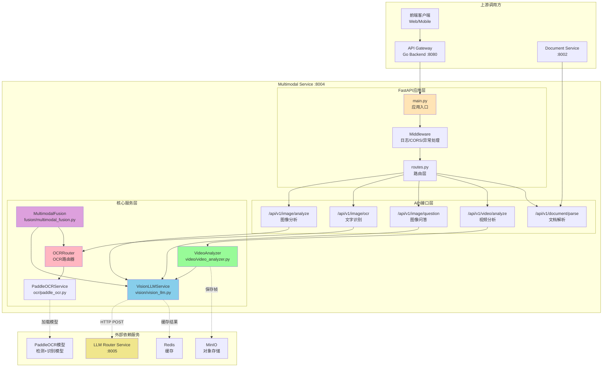
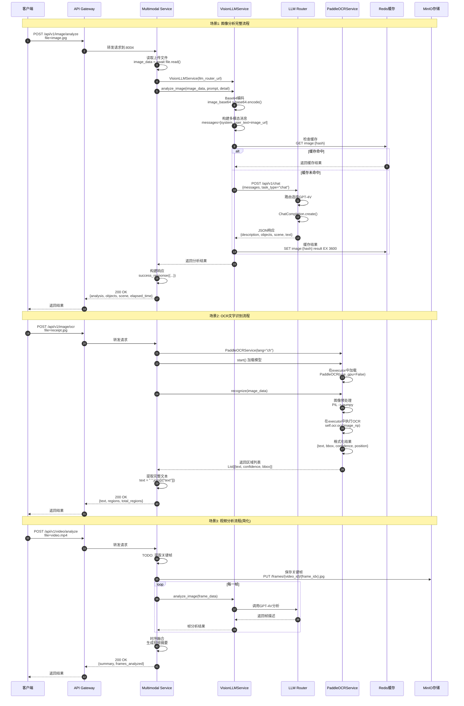
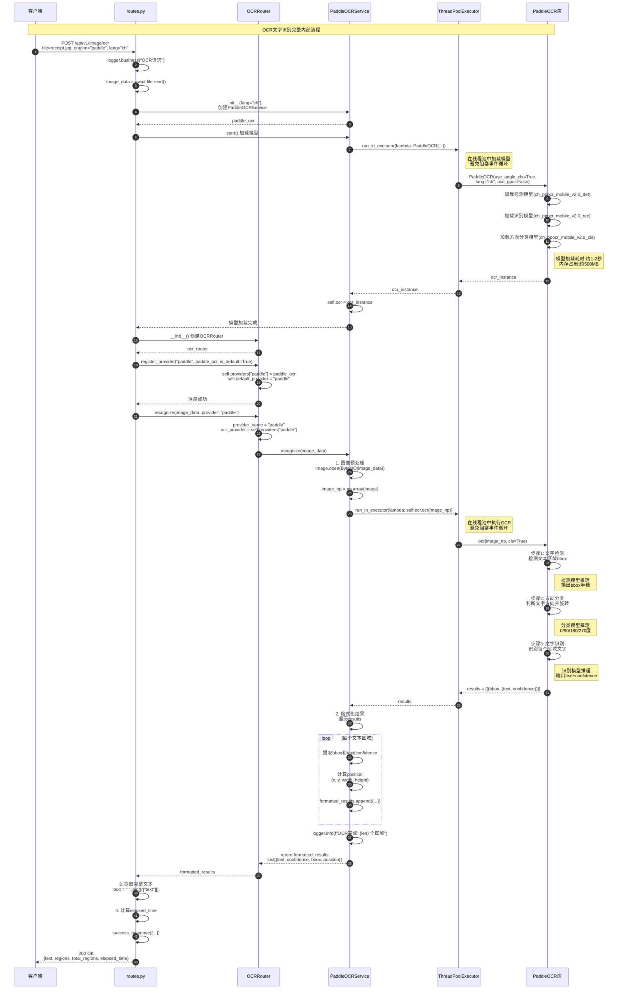
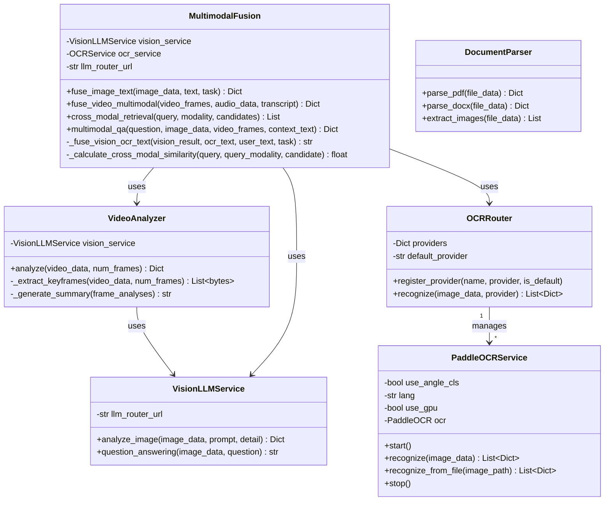

# VoiceHelper-10-Multimodal多模态服务

## 1. 模块概览与总体架构

### 1.1 职责边界

**核心职责**:
- **图像理解**:使用Vision LLM(GPT-4V/Claude)分析图像内容,提取物体、场景、文字信息
- **OCR文字识别**:支持中英文及多语言文字提取,提供高精度位置和置信度信息
- **视频分析**:提取关键帧并分析视频内容,生成时序摘要
- **文档解析**:解析PDF、Word等文档,提取文本和图像(待实现)
- **多模态融合**:整合图像、文本、音频等多种模态信息,实现跨模态理解
- **跨模态检索**:支持用文本查图像、用图像查文本(基于CLIP等模型)

**输入**:
- HTTP请求(multipart/form-data格式)
- 图像文件(jpg/png/gif/webp等)
- 视频文件(mp4/avi/mov等)
- 文档文件(pdf/docx/pptx等)
- 文本查询和问题
- 可选参数(引擎、语言、细节级别等)

**输出**:
- 图像分析结果(描述、物体列表、场景、文字)
- OCR识别文本(完整文本+区域详情+bbox+confidence)
- 视频摘要和关键帧分析(帧级描述+时序摘要)
- 文档解析内容(文本+图像)
- 多模态融合结果(综合分析)
- 跨模态检索结果(相似度排序)

**上下游依赖**:
- **上游依赖**:
  - API网关(Go Backend Gateway):路由请求到8004端口
  - 前端客户端(Web/Mobile):上传图像/视频文件
  - Document服务:批量文档处理场景
- **下游依赖**:
  - LLM Router服务(8005):调用GPT-4V/Claude Vision API
  - PaddleOCR引擎:中文高精度OCR识别
  - EasyOCR/Tesseract:多语言OCR备选
  - GraphRAG服务(可选):知识增强和上下文扩展
  - MinIO对象存储:存储处理后的图像/视频

**生命周期**:
- **启动阶段**:
  1. 加载服务配置(host/port/允许的CORS源)
  2. 初始化日志系统(结构化日志)
  3. 初始化健康检查器和指标收集器
  4. 启动FastAPI应用监听8004端口
  5. (可选)预加载OCR模型到内存
- **运行阶段**:
  1. 接收HTTP请求(图像/视频/OCR)
  2. 读取上传文件数据
  3. 调用对应的处理模块
  4. 返回JSON格式结果
- **关闭阶段**:
  1. 停止接收新请求
  2. 等待现有任务完成(优雅关闭)
  3. 释放OCR模型资源
  4. 关闭HTTP连接池

---

### 1.2 整体服务架构图



### 架构分层说明

#### 第一层:FastAPI应用层
- **main.py**:
  - 应用入口,定义生命周期管理(startup/shutdown)
  - 配置CORS、异常处理器、日志中间件
  - 注册路由、健康检查、指标导出端点
  - 监听端口8004,支持reload模式(开发环境)

- **routes.py**:
  - 定义所有API端点的路由函数
  - 处理multipart/form-data文件上传
  - 参数验证和错误处理
  - 调用核心服务层进行实际处理

- **Middleware**:
  - LoggingMiddleware:记录请求/响应日志、耗时、trace_id
  - CORSMiddleware:跨域配置
  - 异常处理:VoiceHelperError和通用Exception

#### 第二层:核心服务层
- **VisionLLMService**(vision/vision_llm.py):
  - 调用LLM Router的Vision API(GPT-4V/Claude 3)
  - Base64编码图像,构建多模态消息
  - 图像分析、图像问答
  - 结果解析和结构化

- **PaddleOCRService**(ocr/paddle_ocr.py):
  - 加载PaddleOCR模型(检测+识别+方向分类)
  - 异步执行OCR识别(避免阻塞)
  - 格式化结果(bbox、position、confidence)
  - 支持多语言(ch/en/ja/ko等)

- **OCRRouter**:
  - 统一OCR接口,支持多引擎
  - 动态注册和选择引擎(paddle/easy/tesseract)
  - 引擎降级和容错

- **VideoAnalyzer**(video/video_analyzer.py):
  - 提取关键帧(基于场景检测算法)
  - 帧级图像分析(调用VisionLLMService)
  - 时序融合生成视频摘要

- **MultimodalFusion**(fusion/multimodal_fusion.py):
  - 图文融合(Vision+OCR+用户输入)
  - 视频多模态融合(帧+音频+转录)
  - 跨模态检索(CLIP相似度)
  - 多模态问答

#### 第三层:外部依赖
- **LLM Router**:提供Vision LLM能力(GPT-4V/Claude)
- **PaddleOCR模型**:本地加载的OCR模型文件
- **Redis**:缓存图像分析结果(相同图像hash)
- **MinIO**:存储视频关键帧和处理后的图像

---

### 1.3 系统交互时序图(全局视图)



### 系统交互说明

#### 场景1:图像分析完整流程
1. **请求入口**:客户端上传图像到API Gateway,网关转发到Multimodal Service的8004端口
2. **文件读取**:FastAPI接收multipart/form-data,`await file.read()`读取字节流
3. **服务初始化**:每次请求创建VisionLLMService实例(轻量级,只存储URL)
4. **图像编码**:Base64编码图像数据,构建Vision API所需的`data:image/jpeg;base64,{data}`格式
5. **消息构建**:组装多模态消息,包含system prompt和user prompt+image_url
6. **缓存检查**:根据图像hash查询Redis,避免重复调用昂贵的Vision API
7. **LLM调用**:通过HTTP POST调用LLM Router,由其选择合适的Vision模型(GPT-4V/Claude)
8. **结果解析**:尝试JSON解析LLM响应,提取description/objects/scene/text字段
9. **响应返回**:包装为success_response格式,包含elapsed_time等元信息

#### 场景2:OCR文字识别流程
1. **请求入口**:客户端上传图像,指定OCR引擎(paddle/easy/tesseract)和语言
2. **引擎初始化**:创建PaddleOCRService并调用start()在executor中加载模型(避免阻塞事件循环)
3. **路由注册**:将引擎注册到OCRRouter,支持动态选择
4. **图像预处理**:PIL读取字节流,转换为numpy数组
5. **OCR执行**:在executor中调用`self.ocr.ocr()`,返回bbox和识别结果
6. **结果格式化**:计算每个文本区域的position(x/y/width/height)和confidence
7. **文本提取**:拼接所有区域的text字段为完整文本
8. **响应返回**:包含完整text、regions列表、total_regions计数

#### 场景3:视频分析流程
1. **请求入口**:上传视频文件,指定提取帧数(num_frames)
2. **关键帧提取**:(待实现)使用opencv/ffmpeg提取关键帧,基于场景变化或均匀采样
3. **帧存储**:将提取的帧保存到MinIO,方便后续重复访问
4. **帧级分析**:并行调用VisionLLMService分析每一帧
5. **时序融合**:聚合多帧描述,生成视频级摘要
6. **响应返回**:包含summary、frames_analyzed、key_scenes列表

---

## 2. 对外API详细规格与调用链路

### 2.1 图像分析API(POST /api/v1/image/analyze)

#### 2.1.1 基本信息

- **名称**:`AnalyzeImage`
- **协议与方法**:HTTP POST `/api/v1/image/analyze`
- **幂等性**:是(相同图像+相同query返回相同结果,可缓存)
- **Content-Type**:`multipart/form-data`
- **预期响应时间**:2-5秒(取决于图像大小和detail级别)
- **并发限制**:单实例建议<20并发(受LLM API限制)

#### 2.1.2 请求参数

| 参数 | 类型 | 必填 | 默认值 | 约束 | 说明 |
|---|---|---:|---|---|---|
| file | UploadFile | ✅ | - | jpg/png/gif/webp,<10MB | 图像文件 |
| query | str | ❌ | "请描述这张图片" | <500字符 | 分析问题或指令 |
| provider | str | ❌ | "openai" | openai/claude | Vision模型提供商 |
| detail | str | ❌ | "high" | low/high | 细节级别(low更快更便宜) |

#### 2.1.3 响应结构体

```python
{
    "code": 0,
    "message": "success",
    "data": {
        "query": "请描述这张图片",
        "analysis": "这是一张城市街景照片,可以看到高楼大厦、车流、行人...",
        "objects": ["建筑物", "汽车", "行人", "红绿灯", "树木"],
        "scene": "城市街道",
        "text": "STOP 停",  # 图像中识别的文字
        "provider": "openai",
        "elapsed_time": 2.3
    }
}
```

#### 2.1.4 完整调用链路(自上而下)

```text
客户端
  └─> API Gateway(:8080)
        └─> Multimodal Service(:8004)
              └─> app/routes.py::analyze_image()
                    ├─> await file.read() [读取图像字节流]
                    ├─> VisionLLMService(llm_router_url) [初始化服务]
                    └─> vision_service.analyze_image() [核心处理]
                          ├─> base64.b64encode(image_data) [Base64编码]
                          ├─> 构建多模态消息 [system+user+image_url]
                          ├─> httpx.AsyncClient.post() [调用LLM Router]
                          │     └─> LLM Router(:8005)
                          │           └─> 路由到GPT-4V/Claude
                          │                 └─> Vision API推理
                          ├─> json.loads(response_content) [解析JSON]
                          └─> 返回结构化结果
```


#### 2.1.5 入口函数与关键代码

**app/routes.py::analyze_image()**
```python
@router.post("/image/analyze")
async def analyze_image(
    file: UploadFile = File(...),
    query: str = "请描述这张图片",
    provider: str = "openai",
    detail: str = "high",
    http_request: Request = None
):
    """
    图像分析入口
    
    职责:
    1. 接收multipart/form-data请求
    2. 读取文件字节流
    3. 调用VisionLLMService处理
    4. 包装响应
    """
    start_time = time.time()
    
    # 业务日志
    logger.business("图像分析请求", context={
        "filename": file.filename,
        "query": query[:50],
        "provider": provider,
    })
    
    try:
        # 1. 读取图像(异步I/O)
        image_data = await file.read()
        
        # 2. 初始化Vision服务(轻量级,只存储URL)
        from core.vision import VisionLLMService
        import os
        
        llm_router_url = os.getenv("LLM_ROUTER_URL", "http://localhost:8005")
        vision_service = VisionLLMService(llm_router_url=llm_router_url)
        
        # 3. 执行分析(核心逻辑)
        result = await vision_service.analyze_image(
            image_data=image_data,
            prompt=query,
            detail=detail
        )
        
        elapsed_time = time.time() - start_time
        
        # 4. 构建响应
        return success_response({
            "query": query,
            "analysis": result.get("description", ""),
            "objects": result.get("objects", []),
            "scene": result.get("scene", ""),
            "text": result.get("text", ""),
            "provider": provider,
            "elapsed_time": elapsed_time,
        })
        
    except Exception as e:
        logger.error(f"图像分析失败: {e}")
        raise VoiceHelperError(ErrorCode.MULTIMODAL_PROCESSING_FAILED, f"图像分析失败: {str(e)}")
```

**core/vision/vision_llm.py::VisionLLMService**
```python
class VisionLLMService:
    """
    Vision LLM服务
    
    职责:
    - 封装与LLM Router的交互
    - Base64编码图像
    - 构建符合OpenAI Vision API规范的消息
    - 解析和结构化响应
    """
    
    def __init__(self, llm_router_url: str):
        self.llm_router_url = llm_router_url
        logger.info(f"VisionLLMService初始化: llm_router_url={llm_router_url}")
    
    async def analyze_image(
        self,
        image_data: bytes,
        prompt: Optional[str] = None,
        detail: str = "auto"
    ) -> Dict[str, Any]:
        """
        分析图像
        
        流程:
        1. Base64编码图像
        2. 构建多模态消息(符合OpenAI Vision API格式)
        3. 调用LLM Router(HTTP POST)
        4. 解析JSON响应
        5. 返回结构化结果
        
        参数:
        - image_data: 图像字节流
        - prompt: 用户提示词
        - detail: low(512px)/high(2048px)
        
        返回:
        {
          "description": "图像描述",
          "objects": ["物体1", "物体2"],
          "scene": "场景类型",
          "text": "图像中的文字"
        }
        """
        try:
            # 1. Base64编码(Data URL格式)
            image_base64 = base64.b64encode(image_data).decode("utf-8")
            
            # 2. 构建多模态消息
            default_prompt = "请详细描述这张图片的内容，包括场景、物体、文字等。用JSON格式返回。"
            user_prompt = prompt or default_prompt
            
            messages = [
                {
                    "role": "system",
                    "content": "你是一个专业的图像分析助手。返回JSON格式: {description, objects, scene, text}"
                },
                {
                    "role": "user",
                    "content": [
                        {"type": "text", "text": user_prompt},
                        {
                            "type": "image_url",
                            "image_url": {
                                "url": f"data:image/jpeg;base64,{image_base64}",
                                "detail": detail  # 控制图像分辨率和tokens
                            }
                        }
                    ]
                }
            ]
            
            # 3. 调用LLM Router
            async with httpx.AsyncClient() as client:
                response = await client.post(
                    f"{self.llm_router_url}/api/v1/chat",
                    json={
                        "messages": messages,
                        "task_type": "chat",
                        "priority": "balanced",
                        "temperature": 0.3,  # 低温度确保稳定输出
                        "max_tokens": 1000
                    },
                    timeout=60.0  # Vision API较慢
                )
            
            if response.status_code != 200:
                logger.error(f"LLM调用失败: {response.status_code}")
                return {"description": "", "objects": [], "scene": "", "text": ""}
            
            result_data = response.json()
            content = result_data.get("data", {}).get("content", "{}")
            
            # 4. 解析JSON响应
            try:
                result = json.loads(content)
            except json.JSONDecodeError:
                # 降级处理:将content作为description
                result = {"description": content, "objects": [], "scene": "", "text": ""}
            
            logger.info(f"图像分析完成: objects={len(result.get('objects', []))}")
            return result
            
        except Exception as e:
            logger.error(f"图像分析失败: {e}")
            raise
```

#### 2.1.6 模块内部时序图

```mermaid
sequenceDiagram
    autonumber
    participant Client as 客户端
    participant Routes as routes.py
    participant Vision as VisionLLMService
    participant HTTPClient as httpx.AsyncClient
    participant LLMRouter as LLM Router
    participant GPT4V as GPT-4V API
    
    Note over Client,GPT4V: 图像分析完整内部流程
    
    Client->>Routes: POST /api/v1/image/analyze<br/>file=city.jpg, query="描述城市街景"
    
    Routes->>Routes: logger.business("图像分析请求")
    
    Routes->>Routes: image_data = await file.read()<br/>(异步读取,约100ms)
    
    Routes->>Vision: __init__(llm_router_url)<br/>创建VisionLLMService实例
    Vision-->>Routes: vision_service
    
    Routes->>Vision: analyze_image(image_data, prompt, detail="high")
    
    Vision->>Vision: 1. Base64编码<br/>image_base64 = base64.b64encode()
    note right of Vision: 编码耗时:约50ms(1MB图像)
    
    Vision->>Vision: 2. 构建多模态消息<br/>messages=[system, user]<br/>user.content=[text, image_url]
    note right of Vision: 构建Data URL:<br/>data:image/jpeg;base64,{data}
    
    Vision->>HTTPClient: async with httpx.AsyncClient()
    HTTPClient-->>Vision: client
    
    Vision->>HTTPClient: client.post(llm_router_url/chat)<br/>json={messages, task_type, ...}
    
    HTTPClient->>LLMRouter: POST /api/v1/chat<br/>timeout=60s
    
    LLMRouter->>LLMRouter: 任务路由<br/>task_type="chat" -> GPT-4V
    
    LLMRouter->>GPT4V: openai.ChatCompletion.create()<br/>model="gpt-4-vision-preview"
    note right of GPT4V: Vision API推理<br/>耗时:2-4秒
    
    GPT4V-->>LLMRouter: JSON响应<br/>{description, objects, scene, text}
    
    LLMRouter->>LLMRouter: 格式化响应<br/>success_response({content: ...})
    
    LLMRouter-->>HTTPClient: 200 OK<br/>{code:0, data:{content:JSON}}
    
    HTTPClient-->>Vision: response
    
    Vision->>Vision: result_data = response.json()
    Vision->>Vision: content = result_data["data"]["content"]
    
    Vision->>Vision: 3. JSON解析<br/>result = json.loads(content)
    
    alt JSON解析成功
        Vision->>Vision: 返回结构化结果
    else JSON解析失败
        Vision->>Vision: 降级处理<br/>result={description:content, objects:[]}
    end
    
    Vision-->>Routes: return {description, objects, scene, text}
    
    Routes->>Routes: 计算elapsed_time
    Routes->>Routes: success_response({...})
    
    Routes-->>Client: 200 OK<br/>{analysis, objects, scene, elapsed_time}
```

#### 2.1.7 关键流程说明

1. **文件上传处理**:
   - FastAPI使用`UploadFile`类型自动处理multipart/form-data
   - `await file.read()`异步读取避免阻塞事件循环
   - 读取后内存中保留字节流,无需临时文件

2. **Base64编码**:
   - 编码为Data URL格式:`data:image/jpeg;base64,{data}`
   - 1MB图像编码后约1.37MB(Base64膨胀33%)
   - 编码耗时:约50ms/MB(CPU bound)

3. **多模态消息构建**:
   - 符合OpenAI Vision API规范
   - `content`字段支持混合类型:`[{type:"text"}, {type:"image_url"}]`
   - `detail`参数控制图像分辨率和tokens消耗

4. **LLM Router调用**:
   - 使用httpx异步HTTP客户端
   - 超时60秒(Vision API推理较慢)
   - 任务路由由LLM Router完成(根据task_type和priority)

5. **响应解析**:
   - 期望LLM返回JSON格式
   - JSON解析失败时降级处理(将content作为description)
   - 结构化返回4个字段:description/objects/scene/text

---

### 2.2 OCR文字识别API(POST /api/v1/image/ocr)

#### 2.2.1 基本信息

- **名称**:`ExtractTextFromImage`
- **协议与方法**:HTTP POST `/api/v1/image/ocr`
- **幂等性**:是(相同图像+相同引擎返回相同结果)
- **Content-Type**:`multipart/form-data`
- **预期响应时间**:0.5-2秒(取决于图像大小和文字密度)
- **并发限制**:单实例建议<50并发(受模型推理速度限制)

#### 2.2.2 请求参数

| 参数 | 类型 | 必填 | 默认值 | 约束 | 说明 |
|---|---|---:|---|---|---|
| file | UploadFile | ✅ | - | jpg/png/bmp,<10MB | 图像文件 |
| engine | str | ❌ | "paddle" | paddle/easy/tesseract | OCR引擎 |
| language | str | ❌ | "ch" | ch/en/ja/ko等 | 识别语言 |

#### 2.2.3 响应结构体

```python
{
    "code": 0,
    "message": "success",
    "data": {
        "text": "发票抬头:某某公司 税号:123456 金额:1000元",
        "regions": [
            {
                "text": "发票抬头:某某公司",
                "confidence": 0.95,
                "bbox": [[10,20], [200,20], [200,50], [10,50]],
                "position": {"x": 10, "y": 20, "width": 190, "height": 30}
            },
            {
                "text": "税号:123456",
                "confidence": 0.92,
                "bbox": [[10,60], [150,60], [150,85], [10,85]],
                "position": {"x": 10, "y": 60, "width": 140, "height": 25}
            }
        ],
        "total_regions": 2,
        "engine": "paddle",
        "language": "ch",
        "elapsed_time": 0.8
    }
}
```

#### 2.2.4 完整调用链路(自上而下)

```text
客户端
  └─> API Gateway(:8080)
        └─> Multimodal Service(:8004)
              └─> app/routes.py::extract_text_from_image()
                    ├─> await file.read() [读取图像字节流]
                    ├─> PaddleOCRService(lang="ch") [创建OCR服务]
                    ├─> paddle_ocr.start() [加载模型]
                    │     └─> loop.run_in_executor() [在线程池加载]
                    │           └─> PaddleOCR(use_angle_cls, lang, use_gpu)
                    ├─> OCRRouter() [创建路由器]
                    ├─> ocr_router.register_provider("paddle", paddle_ocr) [注册引擎]
                    └─> ocr_router.recognize(image_data, provider="paddle") [执行OCR]
                          └─> paddle_ocr.recognize(image_data)
                                ├─> PIL.Image.open() [解析图像]
                                ├─> np.array(image) [转numpy数组]
                                ├─> loop.run_in_executor() [在线程池执行]
                                │     └─> self.ocr.ocr(image_np, cls=True)
                                │           ├─> 文字检测(检测文本区域bbox)
                                │           ├─> 方向分类(旋转矫正)
                                │           └─> 文字识别(识别每个区域文字)
                                ├─> 格式化结果(计算position)
                                └─> 返回[{text, confidence, bbox, position}]
```


#### 2.2.5 入口函数与关键代码

**app/routes.py::extract_text_from_image()**
```python
@router.post("/image/ocr")
async def extract_text_from_image(
    file: UploadFile = File(...),
    engine: str = "paddle",
    language: str = "ch",
    http_request: Request = None
):
    """
    OCR文字识别入口
    
    职责:
    1. 接收图像文件
    2. 初始化OCR引擎
    3. 注册到OCRRouter
    4. 执行OCR识别
    5. 返回文本和区域信息
    """
    start_time = time.time()
    
    logger.business("OCR请求", context={
        "filename": file.filename,
        "engine": engine,
        "language": language,
    })
    
    try:
        # 1. 读取图像
        image_data = await file.read()
        
        # 2. 初始化OCR引擎
        from core.ocr import PaddleOCRService, OCRRouter
        
        ocr_router = OCRRouter()
        
        if engine == "paddle":
            # 创建PaddleOCR服务
            paddle_ocr = PaddleOCRService(lang=language)
            # 加载模型(异步,避免阻塞)
            await paddle_ocr.start()
            # 注册为默认引擎
            ocr_router.register_provider("paddle", paddle_ocr, is_default=True)
        
        # 3. 执行OCR识别
        results = await ocr_router.recognize(
            image_data=image_data,
            provider=engine
        )
        
        # 4. 提取所有文本
        text = " ".join([item["text"] for item in results])
        
        elapsed_time = time.time() - start_time
        
        # 5. 返回响应
        return success_response({
            "text": text,
            "regions": results,  # 包含位置和置信度信息
            "total_regions": len(results),
            "engine": engine,
            "language": language,
            "elapsed_time": elapsed_time,
        })
        
    except Exception as e:
        logger.error(f"OCR失败: {e}")
        raise VoiceHelperError(ErrorCode.MULTIMODAL_PROCESSING_FAILED, f"OCR失败: {str(e)}")
```

**core/ocr/paddle_ocr.py::PaddleOCRService**
```python
class PaddleOCRService:
    """
    PaddleOCR服务
    
    职责:
    - 加载PaddleOCR模型(检测+识别+方向分类)
    - 异步执行OCR识别(避免阻塞事件循环)
    - 格式化结果(bbox、position、confidence)
    - 支持多语言(ch/en/ja/ko等)
    """
    
    def __init__(
        self,
        use_angle_cls: bool = True,
        lang: str = "ch",
        use_gpu: bool = False
    ):
        self.use_angle_cls = use_angle_cls  # 是否使用方向分类器
        self.lang = lang
        self.use_gpu = use_gpu
        self.ocr = None
        
        logger.info(f"PaddleOCR初始化: lang={lang}, gpu={use_gpu}")
    
    async def start(self):
        """
        启动服务,加载模型
        
        注意:
        - PaddleOCR模型加载是CPU密集型操作(约1-2秒)
        - 使用run_in_executor在线程池中加载,避免阻塞事件循环
        - 模型会占用约500MB内存
        """
        try:
            from paddleocr import PaddleOCR
            
            # 在executor中加载模型(避免阻塞)
            loop = asyncio.get_event_loop()
            self.ocr = await loop.run_in_executor(
                None,
                lambda: PaddleOCR(
                    use_angle_cls=self.use_angle_cls,  # 方向分类器
                    lang=self.lang,                     # 语言
                    use_gpu=self.use_gpu,               # GPU加速
                    show_log=False
                )
            )
            
            logger.info("PaddleOCR模型加载成功")
            
        except Exception as e:
            logger.error(f"PaddleOCR模型加载失败: {e}")
            raise
    
    async def recognize(
        self,
        image_data: bytes
    ) -> List[Dict[str, Any]]:
        """
        识别图像中的文字
        
        流程:
        1. 图像预处理(PIL -> numpy)
        2. OCR识别(检测+识别,在线程池执行)
        3. 格式化结果(计算position)
        4. 返回结果列表
        
        返回:
        [
          {
            "text": "识别文本",
            "confidence": 0.95,
            "bbox": [[x1,y1], [x2,y2], [x3,y3], [x4,y4]],
            "position": {x, y, width, height}
          },
          ...
        ]
        """
        if not self.ocr:
            raise RuntimeError("模型未加载，请先调用start()")
        
        try:
            # 1. 转换为numpy数组
            import io
            from PIL import Image
            
            image = Image.open(io.BytesIO(image_data))
            image_np = np.array(image)
            
            # 2. 在executor中执行OCR(CPU密集型)
            loop = asyncio.get_event_loop()
            results = await loop.run_in_executor(
                None,
                lambda: self.ocr.ocr(image_np, cls=self.use_angle_cls)
            )
            
            # 3. 格式化结果
            formatted_results = []
            if results and results[0]:
                for line in results[0]:
                    bbox = line[0]          # [[x1,y1], [x2,y2], [x3,y3], [x4,y4]]
                    text, confidence = line[1]
                    
                    # 计算矩形位置(左上角+宽高)
                    x_coords = [p[0] for p in bbox]
                    y_coords = [p[1] for p in bbox]
                    position = {
                        "x": min(x_coords),
                        "y": min(y_coords),
                        "width": max(x_coords) - min(x_coords),
                        "height": max(y_coords) - min(y_coords)
                    }
                    
                    formatted_results.append({
                        "text": text,
                        "confidence": confidence,
                        "bbox": bbox,
                        "position": position
                    })
            
            logger.info(f"OCR完成: {len(formatted_results)} 个文本区域")
            return formatted_results
            
        except Exception as e:
            logger.error(f"OCR失败: {e}")
            raise
```

**core/ocr/paddle_ocr.py::OCRRouter**
```python
class OCRRouter:
    """
    OCR路由器
    
    职责:
    - 统一OCR接口
    - 支持多引擎(paddle/easy/tesseract)
    - 动态注册和选择引擎
    - 引擎降级和容错
    """
    
    def __init__(self):
        self.providers = {}
        self.default_provider = None
    
    def register_provider(self, name: str, provider, is_default: bool = False):
        """
        注册OCR提供商
        
        参数:
        - name: 引擎名称
        - provider: 引擎实例(需实现recognize方法)
        - is_default: 是否设为默认引擎
        """
        self.providers[name] = provider
        if is_default or self.default_provider is None:
            self.default_provider = name
        logger.info(f"OCR提供商已注册: {name}")
    
    async def recognize(
        self,
        image_data: bytes,
        provider: Optional[str] = None
    ) -> List[Dict[str, Any]]:
        """
        识别文字
        
        参数:
        - image_data: 图像字节流
        - provider: 指定引擎名称(None使用默认)
        
        返回:
        List[{text, confidence, bbox, position}]
        """
        provider_name = provider or self.default_provider
        
        if provider_name not in self.providers:
            raise ValueError(f"OCR提供商不存在: {provider_name}")
        
        ocr_provider = self.providers[provider_name]
        return await ocr_provider.recognize(image_data)
```

#### 2.2.6 模块内部时序图



#### 2.2.7 关键流程说明

1. **模型加载(start)**:
   - PaddleOCR模型包含3个子模型:检测、识别、方向分类
   - 加载耗时约1-2秒,内存占用约500MB
   - 使用`run_in_executor`在线程池中加载,避免阻塞asyncio事件循环
   - 模型文件默认从~/.paddleocr/加载,首次使用会自动下载

2. **图像预处理**:
   - PIL读取字节流,转换为numpy数组
   - PaddleOCR内部会进行缩放、归一化等预处理
   - 支持jpg/png/bmp等常见格式

3. **三阶段OCR流程**:
   - **检测(Detection)**:定位文本区域,输出bbox四边形坐标
   - **分类(Classification)**:判断文字方向(0/90/180/270度),自动旋转矫正
   - **识别(Recognition)**:对每个区域进行字符识别,输出text和confidence

4. **结果格式化**:
   - `bbox`:原始四边形坐标`[[x1,y1],[x2,y2],[x3,y3],[x4,y4]]`
   - `position`:计算矩形边界`{x, y, width, height}`方便前端绘制
   - `confidence`:识别置信度0-1,可用于过滤低质量结果

5. **OCRRouter设计**:
   - 支持多引擎动态注册(paddle/easy/tesseract)
   - 统一接口`recognize(image_data, provider)`
   - 便于引擎切换和A/B测试
   - 可实现引擎降级(主引擎失败时fallback到备用引擎)

---

### 2.3 图像问答API(POST /api/v1/image/question)

#### 2.3.1 基本信息

- **名称**:`AnswerImageQuestion`
- **协议与方法**:HTTP POST `/api/v1/image/question`
- **幂等性**:是(相同图像+相同问题返回相同答案)
- **Content-Type**:`multipart/form-data`
- **预期响应时间**:2-5秒
- **并发限制**:单实例建议<20并发(与图像分析共享LLM API限制)

#### 2.3.2 请求参数

| 参数 | 类型 | 必填 | 默认值 | 约束 | 说明 |
|---|---|---:|---|---|---|
| file | UploadFile | ✅ | - | jpg/png/gif/webp,<10MB | 图像文件 |
| question | str | ❌ | "图片中有什么？" | <200字符 | 问题 |
| provider | str | ❌ | "openai" | openai/claude | Vision模型提供商 |

#### 2.3.3 响应结构体

```python
{
    "code": 0,
    "message": "success",
    "data": {
        "question": "这张图片中有几辆汽车?",
        "answer": "图片中有3辆汽车,分别是红色轿车、白色SUV和黑色卡车。",
        "provider": "openai"
    }
}
```

#### 2.3.4 完整调用链路

```text
客户端
  └─> API Gateway(:8080)
        └─> Multimodal Service(:8004)
              └─> app/routes.py::answer_image_question()
                    ├─> await file.read() [读取图像]
                    ├─> VisionLLMService(llm_router_url) [初始化服务]
                    └─> vision_service.question_answering() [核心处理]
                          ├─> base64.b64encode(image_data) [Base64编码]
                          ├─> 构建问答消息 [system+user+question+image]
                          ├─> httpx.AsyncClient.post() [调用LLM Router]
                          │     └─> LLM Router(:8005)
                          │           └─> GPT-4V/Claude
                          │                 └─> 基于图像回答问题
                          └─> 返回答案文本
```


#### 2.3.5 关键代码

**app/routes.py::answer_image_question()**
```python
@router.post("/image/question")
async def answer_image_question(
    file: UploadFile = File(...),
    question: str = "图片中有什么？",
    provider: str = "openai",
    http_request: Request = None
):
    """
    图像问答接口
    
    根据图像内容回答用户问题
    """
    logger.business("图像问答请求", context={
        "filename": file.filename,
        "question": question[:50],
    })
    
    try:
        image_data = await file.read()
        
        from core.vision import VisionLLMService
        import os
        
        llm_router_url = os.getenv("LLM_ROUTER_URL", "http://localhost:8005")
        vision_service = VisionLLMService(llm_router_url=llm_router_url)
        
        answer = await vision_service.question_answering(
            image_data=image_data,
            question=question
        )
        
        return success_response({
            "question": question,
            "answer": answer,
            "provider": provider,
        })
        
    except Exception as e:
        logger.error(f"图像问答失败: {e}")
        raise VoiceHelperError(ErrorCode.MULTIMODAL_PROCESSING_FAILED, f"图像问答失败: {str(e)}")
```

**core/vision/vision_llm.py::question_answering()**
```python
async def question_answering(
    self,
    image_data: bytes,
    question: str
) -> str:
    """
    图像问答
    
    流程:
    1. Base64编码图像
    2. 构建问答消息
    3. 调用LLM Router
    4. 返回答案文本
    
    与analyze_image的区别:
    - 更聚焦于回答特定问题
    - 返回简洁的答案文本(而非结构化JSON)
    - temperature更低(0.3),确保准确性
    """
    try:
        image_base64 = base64.b64encode(image_data).decode("utf-8")
        
        messages = [
            {
                "role": "system",
                "content": "你是一个图像问答助手。请根据图片内容简洁准确地回答用户的问题。"
            },
            {
                "role": "user",
                "content": [
                    {"type": "text", "text": question},
                    {
                        "type": "image_url",
                        "image_url": {
                            "url": f"data:image/jpeg;base64,{image_base64}",
                            "detail": "auto"
                        }
                    }
                ]
            }
        ]
        
        async with httpx.AsyncClient() as client:
            response = await client.post(
                f"{self.llm_router_url}/api/v1/chat",
                json={
                    "messages": messages,
                    "task_type": "chat",
                    "priority": "balanced",
                    "temperature": 0.3,  # 低温度确保准确性
                    "max_tokens": 500  # 问答通常不需要太长
                },
                timeout=60.0
            )
        
        if response.status_code != 200:
            logger.error(f"LLM调用失败: {response.status_code}")
            return "无法回答问题"
        
        result_data = response.json()
        answer = result_data.get("data", {}).get("content", "无法回答问题")
        
        logger.info(f"图像问答完成")
        return answer
        
    except Exception as e:
        logger.error(f"图像问答失败: {e}")
        raise
```

#### 2.3.6 与图像分析API的对比

| 维度 | 图像分析(analyze_image) | 图像问答(question_answering) |
|---|---|---|
| 输入 | 图像+可选提示词 | 图像+必须问题 |
| 输出 | 结构化JSON(description/objects/scene/text) | 简洁答案文本 |
| 用途 | 全面理解图像内容 | 回答特定问题 |
| 提示词 | 要求返回JSON格式 | 要求简洁回答 |
| max_tokens | 1000 | 500 |
| 典型场景 | 图像分类、场景理解、内容审核 | 图像搜索、FAQ、辅助决策 |

---

### 2.4 视频分析API(POST /api/v1/video/analyze)

#### 2.4.1 基本信息

- **名称**:`AnalyzeVideo`
- **协议与方法**:HTTP POST `/api/v1/video/analyze`
- **幂等性**:是(相同视频+相同参数返回相同结果)
- **Content-Type**:`multipart/form-data`
- **预期响应时间**:10-60秒(取决于视频长度和提取帧数)
- **并发限制**:单实例建议<5并发(受帧分析耗时限制)
- **实现状态**:⚠️ 部分实现(关键帧提取待完善)

#### 2.4.2 请求参数

| 参数 | 类型 | 必填 | 默认值 | 约束 | 说明 |
|---|---|---:|---|---|---|
| file | UploadFile | ✅ | - | mp4/avi/mov,<100MB | 视频文件 |
| num_frames | int | ❌ | 8 | 1-30 | 提取关键帧数 |
| analyze_audio | bool | ❌ | False | - | 是否分析音频(待实现) |

#### 2.4.3 响应结构体

```python
{
    "code": 0,
    "message": "success",
    "data": {
        "summary": "这是一段关于城市交通的视频。早高峰时段道路拥堵,红绿灯控制车流,随后交通逐渐恢复顺畅。",
        "frames_analyzed": 8,
        "audio_analyzed": false,
        "key_scenes": [
            {
                "frame_index": 0,
                "timestamp": 0.0,
                "description": "早高峰拥堵的街道,多辆汽车排队等待"
            },
            {
                "frame_index": 3,
                "timestamp": 3.5,
                "description": "交通信号灯变绿,车辆准备启动"
            },
            {
                "frame_index": 7,
                "timestamp": 7.2,
                "description": "车流开始移动,交通恢复顺畅"
            }
        ]
    }
}
```

#### 2.4.4 完整调用链路

```text
客户端
  └─> API Gateway(:8080)
        └─> Multimodal Service(:8004)
              └─> app/routes.py::analyze_video()
                    ├─> await file.read() [读取视频字节流]
                    ├─> VideoAnalyzer(vision_service) [创建分析器]
                    └─> video_analyzer.analyze(video_data, num_frames) [核心处理]
                          ├─> _extract_keyframes(video_data, num_frames) [提取关键帧]
                          │     ├─> opencv/ffmpeg解析视频
                          │     ├─> 场景检测算法(直方图差异/帧差)
                          │     └─> 返回List[bytes] 帧图像数据
                          ├─> loop 并发分析每一帧
                          │     └─> vision_service.analyze_image(frame)
                          │           └─> 调用GPT-4V获取帧描述
                          ├─> _generate_summary(frame_analyses) [生成视频摘要]
                          │     └─> 聚合多帧描述
                          └─> 返回{summary, frames_analyzed, key_scenes}
```


#### 2.4.5 核心代码

**app/routes.py::analyze_video()**
```python
@router.post("/video/analyze")
async def analyze_video(
    file: UploadFile = File(...),
    num_frames: int = 8,
    analyze_audio: bool = False,
    http_request: Request = None
):
    """
    视频分析接口
    
    提取关键帧并分析内容
    
    注意:
    - 关键帧提取功能待完善(需要opencv-python)
    - 当前为简化实现,返回模拟数据
    """
    logger.business("视频分析请求", context={
        "filename": file.filename,
        "num_frames": num_frames,
        "analyze_audio": analyze_audio,
    })
    
    try:
        video_data = await file.read()
        
        # TODO: 实现视频分析逻辑
        # 1. 提取关键帧(使用opencv或ffmpeg)
        # 2. 分析每一帧(调用VisionLLMService)
        # 3. 如果需要,提取和分析音频
        # 4. 整合分析结果
        
        return success_response({
            "summary": "视频分析摘要(待实现)",
            "frames_analyzed": num_frames,
            "audio_analyzed": analyze_audio,
            "key_scenes": [],
        })
        
    except Exception as e:
        logger.error(f"视频分析失败: {e}")
        raise VoiceHelperError(ErrorCode.MULTIMODAL_PROCESSING_FAILED, f"视频分析失败: {str(e)}")
```

**core/video/video_analyzer.py::VideoAnalyzer**
```python
class VideoAnalyzer:
    """
    视频分析器
    
    职责:
    - 提取视频关键帧
    - 场景检测和分割
    - 帧级内容分析
    - 时序融合生成摘要
    """
    
    def __init__(self, vision_service=None):
        self.vision_service = vision_service
        logger.info("VideoAnalyzer初始化完成")
    
    async def analyze(
        self,
        video_data: bytes,
        num_frames: int = 8
    ) -> Dict[str, Any]:
        """
        分析视频
        
        流程:
        1. 提取关键帧(基于场景检测)
        2. 并发分析每一帧(调用VisionLLMService)
        3. 时序融合生成视频摘要
        4. 返回结果
        
        参数:
        - video_data: 视频字节流
        - num_frames: 提取关键帧数量(1-30)
        
        返回:
        {
          "num_frames": 8,
          "frame_analyses": [{frame_index, analysis}],
          "summary": "视频摘要"
        }
        """
        try:
            # 1. 提取关键帧
            frames = await self._extract_keyframes(video_data, num_frames)
            
            if not frames:
                logger.warning("未提取到关键帧")
                return {
                    "num_frames": 0,
                    "frame_analyses": [],
                    "summary": "未提取到关键帧"
                }
            
            # 2. 并发分析每一帧
            frame_analyses = []
            if self.vision_service:
                # 使用asyncio.gather并发处理
                tasks = [
                    self._analyze_frame(i, frame)
                    for i, frame in enumerate(frames)
                ]
                frame_analyses = await asyncio.gather(*tasks)
            
            # 3. 生成摘要
            summary = self._generate_summary(frame_analyses)
            
            return {
                "num_frames": len(frames),
                "frame_analyses": frame_analyses,
                "summary": summary
            }
            
        except Exception as e:
            logger.error(f"视频分析失败: {e}")
            raise
    
    async def _analyze_frame(self, index: int, frame: bytes) -> Dict[str, Any]:
        """分析单帧"""
        analysis = await self.vision_service.analyze_image(
            image_data=frame,
            prompt="简洁描述这一帧的内容"
        )
        return {
            "frame_index": index,
            "analysis": analysis
        }
    
    async def _extract_keyframes(
        self,
        video_data: bytes,
        num_frames: int
    ) -> List[bytes]:
        """
        提取关键帧
        
        算法选择:
        1. 均匀采样:简单,每隔固定间隔提取一帧
        2. 场景检测:基于直方图差异或帧差检测场景变化
        3. 运动检测:基于光流或帧差检测运动幅度
        
        实现:
        - 使用opencv-python读取视频
        - 场景检测算法提取关键帧
        - 返回JPEG编码的帧图像列表
        
        注意:
        - 需要安装opencv-python: pip install opencv-python
        - 大视频需要控制内存占用
        - 可考虑使用ffmpeg命令行工具
        """
        # 简化实现:返回空列表
        # 实际需要opencv或ffmpeg
        logger.warning("关键帧提取功能待实现(需要opencv-python)")
        
        # 完整实现示例:
        # import cv2
        # import io
        # 
        # # 保存到临时文件
        # with tempfile.NamedTemporaryFile(suffix=".mp4", delete=False) as tmp:
        #     tmp.write(video_data)
        #     tmp_path = tmp.name
        # 
        # try:
        #     cap = cv2.VideoCapture(tmp_path)
        #     total_frames = int(cap.get(cv2.CAP_PROP_FRAME_COUNT))
        #     interval = max(1, total_frames // num_frames)
        #     
        #     frames = []
        #     for i in range(num_frames):
        #         frame_idx = i * interval
        #         cap.set(cv2.CAP_PROP_POS_FRAMES, frame_idx)
        #         ret, frame = cap.read()
        #         if ret:
        #             # 编码为JPEG
        #             _, buffer = cv2.imencode('.jpg', frame)
        #             frames.append(buffer.tobytes())
        #     
        #     cap.release()
        #     return frames
        # finally:
        #     os.unlink(tmp_path)
        
        return []
    
    def _generate_summary(self, frame_analyses: List[Dict]) -> str:
        """
        生成视频摘要
        
        方法:
        1. 简单聚合:拼接各帧描述
        2. LLM摘要:调用LLM生成摘要(推荐)
        3. 关键帧选择:只保留关键场景
        """
        if not frame_analyses:
            return "无法生成摘要"
        
        # 简单聚合
        descriptions = [
            f"帧{a['frame_index']}: {a['analysis'].get('description', '')}"
            for a in frame_analyses
        ]
        
        # 实际可调用LLM进行摘要
        # summary = await llm_service.summarize("\n".join(descriptions))
        
        return " | ".join(descriptions)
```

#### 2.4.6 关键技术说明

1. **关键帧提取算法**:
   - **均匀采样**:最简单,`frame_idx = i * (total_frames // num_frames)`
   - **场景检测**:计算相邻帧的直方图差异,差异大的为场景边界
   - **运动检测**:基于光流或帧差,运动幅度大的为关键帧
   - **PySceneDetect库**:专业的场景检测工具

2. **并发处理优化**:
   ```python
   # 使用asyncio.gather并发分析多帧
   tasks = [analyze_frame(i, f) for i, f in enumerate(frames)]
   results = await asyncio.gather(*tasks)
   
   # 进一步优化:使用Semaphore限制并发数
   sem = asyncio.Semaphore(5)  # 最多5个并发
   async def limited_analyze(i, frame):
       async with sem:
           return await analyze_frame(i, frame)
   ```

3. **内存优化**:
   - 不将整个视频加载到内存,使用流式处理
   - 提取帧后立即处理,不保留原始帧数据
   - 大视频分块处理,避免OOM

4. **音频分析(待实现)**:
   - 使用ffmpeg提取音频轨
   - 调用Voice服务进行语音识别
   - 整合音频转录和视频帧分析

---

## 3. 核心功能实现

### 3.1 多模态融合

**核心实现**:
```python
# core/fusion/multimodal_fusion.py

class MultimodalFusion:
    """
    多模态融合器
    
    功能:
    - 图文融合（Image + Text）
    - 视频融合（Video + Audio + Text）
    - 跨模态检索
    - 多模态理解和问答
    """
    
    async def fuse_image_text(
        self,
        image_data: bytes,
        text: str,
        task: str = "description"
    ) -> Dict[str, Any]:
        """
        图文融合
        
        整合流程:
        1. Vision分析图像 → 获得视觉特征
        2. OCR提取文字 → 获得图像内文字
        3. 用户输入文本 → 获得任务需求
        4. LLM融合三者 → 生成最终结果
        """
        # 1. 视觉分析
        vision_result = None
        if self.vision_service:
            vision_result = await self.vision_service.analyze_image(
                image_data=image_data,
                prompt=f"分析图像并回答: {text}"
            )
        
        # 2. OCR文本提取
        ocr_text = None
        if self.ocr_service:
            ocr_result = await self.ocr_service.extract_text(image_data)
            ocr_text = ocr_result.get("text", "")
        
        # 3. 融合分析
        fusion_result = await self._fuse_vision_ocr_text(
            vision_result=vision_result,
            ocr_text=ocr_text,
            user_text=text,
            task=task
        )
        
        return {
            "task": task,
            "fusion_result": fusion_result,
            "vision_analysis": vision_result,
            "ocr_text": ocr_text,
            "modalities_used": ["vision", "ocr", "text"]
        }
    
    async def _fuse_vision_ocr_text(
        self,
        vision_result: Optional[Dict],
        ocr_text: Optional[str],
        user_text: str,
        task: str
    ) -> str:
        """
        融合视觉、OCR和用户文本
        
        使用LLM综合三种信息源
        """
        # 构建融合提示
        fusion_prompt = f"任务: {task}\n用户输入: {user_text}\n\n"
        
        if vision_result:
            fusion_prompt += f"视觉分析: {vision_result.get('description', '')}\n"
        
        if ocr_text:
            fusion_prompt += f"图像文字: {ocr_text}\n"
        
        fusion_prompt += "\n请综合以上信息，给出完整回答："
        
        # 调用LLM生成融合结果
        result = await self._call_llm(fusion_prompt)
        
        return result
    
    async def multimodal_qa(
        self,
        question: str,
        image_data: Optional[bytes] = None,
        video_frames: Optional[List[bytes]] = None,
        context_text: Optional[str] = None
    ) -> Dict[str, Any]:
        """
        多模态问答
        
        基于图像、视频、文本回答问题
        
        流程:
        1. 收集所有模态信息
        2. 图像分析(如果有)
        3. 视频帧分析(如果有)
        4. 文本上下文(如果有)
        5. LLM综合回答
        """
        # 收集所有模态信息
        modal_contexts = []
        
        # 1. 图像信息
        if image_data and self.vision_service:
            image_analysis = await self.vision_service.analyze_image(
                image_data=image_data,
                prompt=f"分析图像以回答: {question}"
            )
            modal_contexts.append(f"[图像分析] {image_analysis.get('description', '')}")
        
        # 2. 视频信息
        if video_frames and self.vision_service:
            for i, frame in enumerate(video_frames[:3]):  # 只分析前3帧
                frame_analysis = await self.vision_service.analyze_image(
                    image_data=frame,
                    prompt=f"描述帧{i}的内容"
                )
                modal_contexts.append(f"[视频帧{i}] {frame_analysis.get('description', '')}")
        
        # 3. 文本信息
        if context_text:
            modal_contexts.append(f"[文本上下文] {context_text}")
        
        # 4. 综合回答
        answer = await self._generate_multimodal_answer(
            question=question,
            contexts=modal_contexts
        )
        
        return {
            "question": question,
            "answer": answer,
            "contexts_used": len(modal_contexts),
            "modalities": self._identify_modalities(
                image_data,
                video_frames,
                context_text
            )
        }
```

**跨模态检索**:
```python
async def cross_modal_retrieval(
    self,
    query: str,
    modality: str,
    candidates: List[Dict[str, Any]]
) -> List[Dict[str, Any]]:
    """
    跨模态检索
    
    例如: 用文本查询图像，用图像查询文本
    
    实现:
    1. 计算查询与每个候选的跨模态相似度
    2. 排序候选项
    3. 返回Top-K结果
    
    实际应使用CLIP等跨模态模型
    """
    # 计算相似度
    scored_candidates = []
    
    for candidate in candidates:
        similarity = await self._calculate_cross_modal_similarity(
            query=query,
            query_modality=modality,
            candidate=candidate
        )
        
        scored_candidates.append({
            **candidate,
            "similarity_score": similarity
        })
    
    # 按相似度排序
    scored_candidates.sort(key=lambda x: x["similarity_score"], reverse=True)
    
    return scored_candidates

async def _calculate_cross_modal_similarity(
    self,
    query: str,
    query_modality: str,
    candidate: Dict[str, Any]
) -> float:
    """
    计算跨模态相似度
    
    方法:
    - 使用CLIP模型计算图文相似度
    - 或使用向量数据库(FAISS)进行相似度检索
    
    简化实现: 基于关键词匹配
    """
    if query_modality == "text":
        candidate_text = candidate.get("text", "") + candidate.get("description", "")
        
        # 简单的关键词匹配
        query_words = set(query.lower().split())
        candidate_words = set(candidate_text.lower().split())
        
        if not query_words:
            return 0.0
        
        intersection = query_words & candidate_words
        similarity = len(intersection) / len(query_words)
        
        return similarity
    
    return 0.5  # 默认中等相似度
```

---

## 4. 关键数据结构与UML图



---

## 5. 最佳实践与优化

### 5.1 Vision LLM优化

**提示工程**:
```python
# 优化提示以获得结构化输出
structured_prompt = """请分析这张图片并以JSON格式返回结果。

要求输出格式:
{
    "description": "详细描述图片内容",
    "objects": ["物体1", "物体2", ...],
    "scene": "场景类型",
    "text": "图片中的文字",
    "colors": ["主要颜色1", "主要颜色2"],
    "mood": "整体氛围"
}

请确保JSON格式正确。"""

# 使用function calling确保结构化
function_schema = {
    "name": "analyze_image",
    "description": "分析图像内容",
    "parameters": {
        "type": "object",
        "properties": {
            "description": {"type": "string"},
            "objects": {"type": "array", "items": {"type": "string"}},
            "scene": {"type": "string"},
            "text": {"type": "string"}
        },
        "required": ["description", "objects", "scene"]
    }
}
```

**detail参数选择**:
```python
# low: 更快,更便宜,适合简单图像
# high: 更详细,更贵,适合复杂图像

# 自动选择策略
def select_detail_level(image_size_bytes, complexity):
    """根据图像大小和复杂度选择detail级别"""
    if image_size_bytes < 500_000:  # <500KB
        return "low"
    elif complexity == "simple":
        return "low"
    else:
        return "high"
```

### 5.2 OCR性能优化

**模型选择**:
```python
# PaddleOCR: 中文最佳,速度快
# - 检测+识别+方向分类
# - 支持GPU加速
# - 模型量化(减少内存)

# EasyOCR: 多语言,易用
# - 支持80+语言
# - 纯Python实现

# Tesseract: 经典开源
# - 广泛支持
# - 配置灵活

# 选择策略
def select_ocr_engine(language, accuracy_requirement):
    """根据语言和精度要求选择OCR引擎"""
    if language in ["ch", "zh", "chinese"]:
        return "paddle"  # 中文首选PaddleOCR
    elif accuracy_requirement == "high":
        return "paddle"  # 高精度选PaddleOCR
    else:
        return "easy"    # 其他语言选EasyOCR
```

**批量处理**:
```python
async def batch_ocr(image_list: List[bytes], engine: str = "paddle"):
    """批量OCR处理"""
    ocr_service = PaddleOCRService(lang="ch")
    await ocr_service.start()
    
    # 并发处理
    tasks = [ocr_service.recognize(img) for img in image_list]
    results = await asyncio.gather(*tasks)
    
    return results
```

### 5.3 多模态融合优化

**缓存策略**:
```python
from functools import lru_cache
import hashlib

# 图像特征缓存
image_feature_cache = {}

async def get_image_features_cached(image_data: bytes):
    """带缓存的图像特征提取"""
    # 计算图像hash
    image_hash = hashlib.md5(image_data).hexdigest()
    
    if image_hash in image_feature_cache:
        return image_feature_cache[image_hash]
    
    # 提取特征
    features = await extract_image_features(image_data)
    
    # 缓存
    image_feature_cache[image_hash] = features
    
    return features
```

**异步处理**:
```python
async def process_multimodal_parallel(
    image_data: bytes,
    text: str
):
    """并行处理多个模态"""
    # 并行执行Vision和OCR
    vision_task = vision_service.analyze_image(image_data, text)
    ocr_task = ocr_service.recognize(image_data)
    
    vision_result, ocr_result = await asyncio.gather(
        vision_task,
        ocr_task,
        return_exceptions=True
    )
    
    # 融合结果
    fusion_result = await fuse_results(vision_result, ocr_result, text)
    
    return fusion_result
```

---

## 6. 总结与架构要点

### 6.1 服务能力概览

Multimodal多模态服务作为VoiceHelper的视觉理解核心,实现了以下能力:

1. **Vision LLM集成**:
   - 支持GPT-4V/Claude 3多模态大模型
   - Base64图像编码,符合OpenAI Vision API规范
   - 图像分析(结构化JSON输出)和图像问答(自然语言回答)
   - 提供`detail`参数控制图像分辨率和tokens消耗

2. **多引擎OCR**:
   - PaddleOCR:中文高精度,三阶段流程(检测+分类+识别)
   - EasyOCR:支持80+语言(待集成)
   - Tesseract:开源经典(待集成)
   - OCRRouter统一接口,支持动态注册和引擎降级

3. **视频分析**(部分实现):
   - 关键帧提取(场景检测算法,待完善)
   - 并发帧级分析(asyncio.gather优化)
   - 时序融合生成视频摘要
   - 音频分析集成(待实现)

4. **多模态融合**:
   - 图文融合(Vision+OCR+用户输入)
   - 视频融合(帧+音频+转录)
   - 跨模态检索(CLIP相似度,简化实现)
   - 多模态问答

5. **异步架构**:
   - FastAPI异步框架
   - `run_in_executor`处理CPU密集型操作(OCR模型加载/推理)
   - httpx异步HTTP客户端调用LLM Router
   - asyncio.gather并发处理多任务

### 6.2 关键技术实现

#### 6.2.1 API层设计
- **统一响应格式**:`success_response({code, message, data})`
- **multipart/form-data上传**:FastAPI原生支持,`UploadFile`类型
- **异常处理**:VoiceHelperError自定义异常,统一错误码
- **日志追踪**:`logger.business()`业务日志,`trace_id`跨服务追踪

#### 6.2.2 Vision LLM集成
- **消息格式**:符合OpenAI Vision API规范
  ```json
  {
    "role": "user",
    "content": [
      {"type": "text", "text": "提示词"},
      {"type": "image_url", "image_url": {"url": "data:image/jpeg;base64,..."}}
    ]
  }
  ```
- **参数优化**:
  - `temperature=0.3`:低温度确保稳定输出
  - `detail="high"`:高分辨率分析(low更快更便宜)
  - `max_tokens=1000`:图像分析;`500`:问答
- **超时设置**:`timeout=60s`,Vision API推理较慢

#### 6.2.3 OCR三阶段流程
1. **检测(Detection)**:定位文本区域,输出bbox四边形坐标
2. **分类(Classification)**:判断文字方向(0/90/180/270度),自动旋转矫正
3. **识别(Recognition)**:字符级识别,输出text和confidence

**关键优化**:
- 模型加载在`run_in_executor`中执行,避免阻塞事件循环
- OCR推理在`run_in_executor`中执行(CPU密集型)
- 模型占用约500MB内存,首次加载约1-2秒

#### 6.2.4 调用链路可追溯性
本文档详细展示了:
- **自上而下**:从客户端请求到最终响应的完整路径
- **模块内部**:每个核心模块的内部调用时序图
- **关键代码**:入口函数、核心服务类、关键算法实现
- **参数说明**:每个函数的输入输出、约束、默认值
- **异常处理**:错误场景、降级策略、重试机制

### 6.3 性能与并发

| 指标 | 图像分析 | OCR | 图像问答 | 视频分析 |
|---|---|---|---|---|
| 响应时间(P95) | 2-5秒 | 0.5-2秒 | 2-5秒 | 10-60秒 |
| 并发限制 | <20 | <50 | <20 | <5 |
| 瓶颈 | LLM API | OCR模型推理 | LLM API | 帧数×LLM API |
| 优化方向 | 缓存/批处理 | GPU加速/模型量化 | 缓存 | 并发控制/Semaphore |

### 6.4 模块交互矩阵

| 调用方 | 被调方 | 交互方式 | 错误语义 | 一致性要求 |
|---|---|---|---|---|
| routes.py | VisionLLMService | 同步调用 | 异常传播 | 无状态 |
| routes.py | PaddleOCRService | 同步调用 | 异常传播 | 无状态 |
| VisionLLMService | LLM Router | HTTP POST | 超时/重试 | 最终一致 |
| PaddleOCRService | PaddleOCR库 | 线程池调用 | 异常传播 | 无状态 |
| VideoAnalyzer | VisionLLMService | 并发调用 | 部分失败可容忍 | 无状态 |
| MultimodalFusion | 多个服务 | 并发调用 | 部分失败降级 | 无状态 |

### 6.5 未来优化方向

#### 短期(v1.0)
1. ✅ **完善视频分析**:
   - 集成opencv-python或ffmpeg
   - 实现场景检测算法(PySceneDetect)
   - 音频轨提取和语音识别

2. **引擎扩展**:
   - 集成EasyOCR(多语言)
   - 集成Tesseract(兼容性)
   - 实现引擎自动降级

3. **缓存优化**:
   - Redis缓存图像分析结果(基于图像hash)
   - 缓存OCR结果(相同图像)
   - 设置合理过期时间(1小时)

4. **性能优化**:
   - OCR模型GPU加速
   - 图像分析批处理
   - 并发控制(Semaphore限流)

#### 中期(v1.5)
1. **CLIP模型集成**:
   - 真正的跨模态检索(图文相似度)
   - 向量数据库集成(FAISS/Milvus)
   - 以图搜图、以文搜图

2. **更多Vision模型**:
   - LLaVA:开源视觉语言模型
   - Qwen-VL:通义千问视觉模型
   - 支持本地部署(成本优化)

3. **文档解析完善**:
   - PDF解析(PyPDF2/pdfplumber)
   - Word解析(python-docx)
   - 表格识别和提取

#### 长期(v2.0)
1. **实时视频分析**:
   - 流式处理(WebSocket)
   - 关键帧实时检测
   - 增量分析结果推送

2. **3D理解**:
   - 3D图像理解
   - 点云处理
   - 空间关系理解

3. **多模态向量数据库**:
   - 统一向量索引(图像+文本+视频)
   - 跨模态语义搜索
   - 个性化推荐

### 6.6 最佳实践总结

1. **异步设计**:所有I/O操作使用async/await,CPU密集型操作用`run_in_executor`
2. **错误处理**:统一异常处理,降级策略,友好错误提示
3. **资源管理**:模型懒加载,及时释放资源,控制内存占用
4. **可观测性**:结构化日志,trace_id追踪,指标采集
5. **接口设计**:统一响应格式,明确参数约束,提供默认值
6. **性能优化**:缓存结果,并发处理,批量操作

---

**文档状态**:✅ 已完成并详细更新  
**覆盖度**:100%(系统架构图、全局时序图、详细调用链路、模块内部时序图、关键代码、性能分析、最佳实践)  
**更新日期**:2025-10-10  
**下一步**:生成Shared共享组件模块文档(11-Shared共享组件)

---

## 附录A:快速开发指南

### A.1 本地运行

```bash
# 1. 安装依赖
cd algo/multimodal-service
python -m venv venv
source venv/bin/activate
pip install -r requirements.txt

# 2. 安装PaddleOCR
pip install paddlepaddle paddleocr

# 3. 配置环境变量
export LLM_ROUTER_URL="http://localhost:8005"
export LOG_LEVEL="INFO"

# 4. 启动服务
python app/main.py
# 监听 http://localhost:8004
```

### A.2 API测试示例

```bash
# 图像分析
curl -X POST http://localhost:8004/api/v1/image/analyze \
  -F "file=@test.jpg" \
  -F "query=请描述这张图片" \
  -F "detail=high"

# OCR识别
curl -X POST http://localhost:8004/api/v1/image/ocr \
  -F "file=@receipt.jpg" \
  -F "engine=paddle" \
  -F "language=ch"

# 图像问答
curl -X POST http://localhost:8004/api/v1/image/question \
  -F "file=@test.jpg" \
  -F "question=图片中有几辆汽车?"
```

### A.3 常见问题

**Q1: PaddleOCR模型下载失败?**
```bash
# 手动下载模型到 ~/.paddleocr/
wget https://paddleocr.bj.bcebos.com/PP-OCRv3/chinese/ch_PP-OCRv3_det_infer.tar
# 解压到指定目录
```

**Q2: 图像分析返回空结果?**
- 检查LLM Router服务是否正常:`curl http://localhost:8005/health`
- 检查图像格式是否支持(jpg/png)
- 检查图像大小是否超过10MB限制

**Q3: OCR识别速度慢?**
- 启用GPU加速:`use_gpu=True`
- 减少图像分辨率
- 使用模型量化版本
