# VoiceHelper-11-Shared共享组件

## 1. 模块概览

### 1.1 职责边界

Shared共享组件提供跨服务的通用功能,分为Python共享组件(`algo/shared`)和Go共享组件(`backend/pkg`)两部分。

**Python共享组件(algo/shared)**:
- **日志系统**:统一日志格式和输出
- **配置管理**:基于Pydantic的配置验证
- **错误处理**:统一错误码和异常类
- **健康检查**:服务健康状态监控
- **HTTP客户端**:封装httpx异步客户端
- **指标收集**:Prometheus指标导出
- **响应格式**:统一API响应格式
- **追踪**:分布式追踪支持

**Go共享组件(backend/pkg)**:
- **中间件**:认证、限流、日志、追踪中间件
- **数据库**:PostgreSQL/Redis连接池
- **缓存**:多级缓存(内存+Redis)
- **队列**:RabbitMQ消息队列封装
- **安全**:加密、JWT、权限验证
- **监控**:健康检查、指标收集
- **工具**:常用工具函数

---

### 1.2 架构图

```mermaid
flowchart TB
    subgraph "Python Services"
        GRAPHRAG[GraphRAG Service]
        VOICE[Voice Service]
        AGENT[Agent Service]
        MULTIMODAL[Multimodal Service]
        LLMROUTER[LLM Router]
    end
    
    subgraph "Python Shared Components"
        direction TB
        PY_LOGGER[Logger<br/>日志系统]
        PY_CONFIG[Config<br/>配置管理]
        PY_ERROR[Errors<br/>错误处理]
        PY_HEALTH[Health<br/>健康检查]
        PY_METRICS[Metrics<br/>指标收集]
        PY_HTTP[HTTPClient<br/>HTTP客户端]
    end
    
    subgraph "Go Services"
        GATEWAY[API Gateway]
        AUTH[Auth Service]
        DOC[Document Service]
        SESSION[Session Service]
        NOTIFY[Notification Service]
    end
    
    subgraph "Go Shared Components"
        direction TB
        GO_MIDDLEWARE[Middleware<br/>认证/限流/日志]
        GO_DATABASE[Database<br/>PostgreSQL/Redis]
        GO_CACHE[Cache<br/>多级缓存]
        GO_QUEUE[Queue<br/>RabbitMQ]
        GO_SECURITY[Security<br/>JWT/加密]
        GO_MONITORING[Monitoring<br/>健康/指标]
    end
    
    GRAPHRAG & VOICE & AGENT & MULTIMODAL & LLMROUTER --> PY_LOGGER
    GRAPHRAG & VOICE & AGENT & MULTIMODAL & LLMROUTER --> PY_CONFIG
    GRAPHRAG & VOICE & AGENT & MULTIMODAL & LLMROUTER --> PY_ERROR
    
    GATEWAY & AUTH & DOC & SESSION & NOTIFY --> GO_MIDDLEWARE
    GATEWAY & AUTH & DOC & SESSION & NOTIFY --> GO_DATABASE
    GATEWAY & AUTH & DOC & SESSION & NOTIFY --> GO_CACHE
    
    style PY_LOGGER fill:#87CEEB
    style GO_MIDDLEWARE fill:#FFB6C1
```



---

## 2. Python共享组件

### 2.1 日志系统

**核心实现**:
```python
# algo/shared/logger.py

def get_logger(name: str) -> logging.Logger:
    """
    获取日志记录器
    
    统一日志格式:
    时间 - 模块名 - 级别 - 消息
    """
    return logging.getLogger(name)

class LoggerMixin:
    """
    日志混合类
    
    为类提供logger属性和便捷日志方法
    """
    
    @property
    def logger(self) -> logging.Logger:
        """获取logger实例(懒加载)"""
        if not hasattr(self, "_logger"):
            self._logger = get_logger(self.__class__.__name__)
        return self._logger
    
    def log_info(self, message: str, **kwargs):
        """记录信息日志"""
        self.logger.info(message, extra=kwargs)
    
    def log_error(self, message: str, **kwargs):
        """记录错误日志"""
        self.logger.error(message, extra=kwargs)
```

**使用示例**:
```python
from shared import get_logger

# 方式1: 直接获取logger
logger = get_logger(__name__)
logger.info("服务启动", extra={"port": 8005})

# 方式2: 使用Mixin
class MyService(LoggerMixin):
    def process(self):
        self.log_info("处理开始")
        self.log_error("处理失败", error_code="E001")
```

---

### 2.2 配置管理

**核心实现**:
```python
# algo/shared/config.py

from pydantic_settings import BaseSettings
from pydantic import Field

class BaseServiceConfig(BaseSettings):
    """
    服务配置基类
    
    特点:
    - 基于Pydantic,自动验证类型
    - 支持环境变量(.env文件)
    - 提供默认值
    """
    
    # 服务基本信息
    service_name: str = Field(default="service", env="SERVICE_NAME")
    host: str = Field(default="0.0.0.0", env="HOST")
    port: int = Field(default=8000, env="PORT")
    
    # 环境
    environment: str = Field(default="development", env="ENV")
    log_level: str = Field(default="INFO", env="LOG_LEVEL")
    
    # Redis
    redis_url: Optional[str] = Field(default=None, env="REDIS_URL")
    
    # LLM Router
    llm_router_url: str = Field(default="http://localhost:8005", env="LLM_ROUTER_URL")
    
    class Config:
        env_file = ".env"
        env_file_encoding = "utf-8"
        case_sensitive = False
```

**使用示例**:
```python
from shared.config import BaseServiceConfig

class GraphRAGConfig(BaseServiceConfig):
    """GraphRAG服务配置"""
    
    neo4j_uri: str = Field(..., env="NEO4J_URI")  # 必填
    neo4j_user: str = Field(..., env="NEO4J_USER")
    neo4j_password: str = Field(..., env="NEO4J_PASSWORD")
    
    chunk_size: int = Field(default=512, env="CHUNK_SIZE")
    chunk_overlap: int = Field(default=50, env="CHUNK_OVERLAP")

# 加载配置
config = GraphRAGConfig()
print(f"Neo4j URI: {config.neo4j_uri}")
print(f"Chunk Size: {config.chunk_size}")
```

---

### 2.3 错误处理

**核心实现**:
```python
# algo/shared/errors.py

from enum import Enum

class ErrorCode(str, Enum):
    """统一错误代码"""
    
    # 通用错误
    INTERNAL_ERROR = "INTERNAL_ERROR"
    INVALID_REQUEST = "INVALID_REQUEST"
    NOT_FOUND = "NOT_FOUND"
    UNAUTHORIZED = "UNAUTHORIZED"
    
    # RAG相关
    RAG_INDEXING_FAILED = "RAG_INDEXING_FAILED"
    RAG_QUERY_FAILED = "RAG_QUERY_FAILED"
    
    # 语音相关
    VOICE_ASR_FAILED = "VOICE_ASR_FAILED"
    VOICE_TTS_FAILED = "VOICE_TTS_FAILED"

class VoiceHelperError(Exception):
    """
    VoiceHelper自定义异常
    
    统一异常格式,便于错误处理和日志记录
    """
    
    def __init__(self, code: ErrorCode, message: str, details: dict = None):
        self.code = code
        self.message = message
        self.details = details or {}
        super().__init__(self.message)
    
    def to_dict(self):
        """转换为字典格式(用于API响应)"""
        return {
            "code": self.code.value,
            "message": self.message,
            "details": self.details
        }
```

**使用示例**:
```python
from shared import VoiceHelperError, ErrorCode

# 抛出异常
def process_document(doc_id):
    if not doc_id:
        raise VoiceHelperError(
            code=ErrorCode.INVALID_REQUEST,
            message="文档ID不能为空",
            details={"field": "doc_id"}
        )
    
    # 处理逻辑...

# 捕获异常
try:
    process_document(None)
except VoiceHelperError as e:
    logger.error(f"处理失败: {e.code} - {e.message}")
    return error_response(e.code, e.message)
```

---

### 2.4 统一响应格式

**核心实现**:
```python
# algo/shared/responses.py

def success_response(data: Any, message: str = "success") -> Dict:
    """
    成功响应格式
    
    {
        "code": 0,
        "message": "success",
        "data": {...}
    }
    """
    return {
        "code": 0,
        "message": message,
        "data": data
    }

def error_response(code: ErrorCode, message: str, details: dict = None) -> Dict:
    """
    错误响应格式
    
    {
        "code": "ERROR_CODE",
        "message": "错误描述",
        "details": {...}
    }
    """
    return {
        "code": code.value if isinstance(code, ErrorCode) else code,
        "message": message,
        "details": details or {}
    }
```

---

### 2.5 健康检查

**核心实现**:
```python
# algo/shared/health.py

class HealthChecker:
    """
    健康检查器
    
    检查项:
    - 数据库连接
    - Redis连接
    - 依赖服务可用性
    """
    
    async def check_all(self) -> HealthResult:
        """执行所有健康检查"""
        checks = {
            "database": await self._check_database(),
            "redis": await self._check_redis(),
            "dependencies": await self._check_dependencies()
        }
        
        # 判断整体状态
        status = "healthy" if all(checks.values()) else "unhealthy"
        
        return HealthResult(
            status=status,
            checks=checks,
            timestamp=datetime.now()
        )
    
    async def _check_database(self) -> bool:
        """检查数据库连接"""
        # 此处省略数据库连接检查逻辑
        return True
    
    async def _check_redis(self) -> bool:
        """检查Redis连接"""
        # 此处省略Redis连接检查逻辑
        return True
```

---

### 2.6 指标收集

**核心实现**:
```python
# algo/shared/metrics.py

from prometheus_client import Counter, Histogram, Gauge

class MetricsCollector:
    """
    Prometheus指标收集器
    
    指标类型:
    - Counter: 计数器(请求总数)
    - Histogram: 直方图(延迟分布)
    - Gauge: 仪表盘(当前值)
    """
    
    def __init__(self):
        # 请求计数
        self.request_count = Counter(
            'http_requests_total',
            'Total HTTP requests',
            ['method', 'endpoint', 'status']
        )
        
        # 请求延迟
        self.request_latency = Histogram(
            'http_request_duration_seconds',
            'HTTP request latency',
            ['method', 'endpoint']
        )
        
        # 当前活跃连接
        self.active_connections = Gauge(
            'active_connections',
            'Current active connections'
        )
    
    def record_request(self, method: str, endpoint: str, status: int, latency: float):
        """记录HTTP请求"""
        self.request_count.labels(method=method, endpoint=endpoint, status=status).inc()
        self.request_latency.labels(method=method, endpoint=endpoint).observe(latency)
    
    def export_prometheus(self) -> str:
        """导出Prometheus格式指标"""
        from prometheus_client import generate_latest
        return generate_latest().decode('utf-8')
```

---

## 3. Go共享组件

### 3.1 中间件系统

**认证中间件**:
```go
// backend/pkg/middleware/auth.go

func AuthMiddleware() gin.HandlerFunc {
    /**
     * JWT认证中间件
     * 
     * 流程:
     * 1. 提取Authorization header
     * 2. 解析JWT token
     * 3. 验证token有效性
     * 4. 检查token是否在黑名单
     * 5. 将用户信息注入Context
     */
    return func(c *gin.Context) {
        // 1. 提取token
        authHeader := c.GetHeader("Authorization")
        if authHeader == "" {
            c.JSON(401, gin.H{"error": "未提供认证令牌"})
            c.Abort()
            return
        }
        
        tokenString := strings.TrimPrefix(authHeader, "Bearer ")
        
        // 2. 解析token
        token, err := jwt.Parse(tokenString, func(token *jwt.Token) (interface{}, error) {
            return []byte(jwtSecret), nil
        })
        
        if err != nil || !token.Valid {
            c.JSON(401, gin.H{"error": "无效的令牌"})
            c.Abort()
            return
        }
        
        // 3. 提取claims
        claims := token.Claims.(jwt.MapClaims)
        userID := claims["user_id"].(string)
        
        // 4. 检查黑名单(此处省略)
        
        // 5. 注入Context
        c.Set("user_id", userID)
        c.Next()
    }
}
```

**限流中间件**:
```go
// backend/pkg/middleware/rate_limit.go

func RateLimitMiddleware(limiter *ratelimit.RateLimiter) gin.HandlerFunc {
    /**
     * 限流中间件
     * 
     * 基于Token Bucket算法
     * 支持IP/User/APIKey多维度限流
     */
    return func(c *gin.Context) {
        // 获取限流key(IP地址)
        key := c.ClientIP()
        
        // 检查限流
        allowed, remaining := limiter.Allow(key)
        
        // 设置响应头
        c.Header("X-RateLimit-Limit", fmt.Sprintf("%d", limiter.Limit))
        c.Header("X-RateLimit-Remaining", fmt.Sprintf("%d", remaining))
        
        if !allowed {
            c.JSON(429, gin.H{"error": "请求过于频繁"})
            c.Abort()
            return
        }
        
        c.Next()
    }
}
```

---

### 3.2 数据库连接池

**PostgreSQL**:
```go
// backend/pkg/database/postgres.go

func NewPostgresDB(config *DatabaseConfig) (*gorm.DB, error) {
    /**
     * 创建PostgreSQL连接池
     * 
     * 配置:
     * - MaxOpenConns: 最大打开连接数
     * - MaxIdleConns: 最大空闲连接数
     * - ConnMaxLifetime: 连接最大生命周期
     */
    dsn := fmt.Sprintf(
        "host=%s port=%d user=%s password=%s dbname=%s sslmode=disable",
        config.Host, config.Port, config.User, config.Password, config.DBName,
    )
    
    db, err := gorm.Open(postgres.Open(dsn), &gorm.Config{
        Logger: logger.Default.LogMode(logger.Info),
    })
    
    if err != nil {
        return nil, err
    }
    
    // 配置连接池
    sqlDB, err := db.DB()
    if err != nil {
        return nil, err
    }
    
    sqlDB.SetMaxOpenConns(100)              // 最大打开连接
    sqlDB.SetMaxIdleConns(10)               // 最大空闲连接
    sqlDB.SetConnMaxLifetime(time.Hour)     // 连接最大生命周期
    
    return db, nil
}
```

**Redis**:
```go
// backend/pkg/database/redis.go

func NewRedisClient(config *RedisConfig) (*redis.Client, error) {
    /**
     * 创建Redis客户端
     * 
     * 配置:
     * - PoolSize: 连接池大小
     * - MinIdleConns: 最小空闲连接
     * - MaxRetries: 最大重试次数
     */
    client := redis.NewClient(&redis.Options{
        Addr:         config.Addr,
        Password:     config.Password,
        DB:           config.DB,
        PoolSize:     50,
        MinIdleConns: 10,
        MaxRetries:   3,
    })
    
    // 测试连接
    ctx, cancel := context.WithTimeout(context.Background(), 5*time.Second)
    defer cancel()
    
    if err := client.Ping(ctx).Err(); err != nil {
        return nil, err
    }
    
    return client, nil
}
```

---

### 3.3 多级缓存

**核心实现**:
```go
// backend/pkg/cache/multi_level.go

type MultiLevelCache struct {
    /**
     * 多级缓存
     * 
     * L1: 内存缓存(LRU) - 毫秒级
     * L2: Redis缓存 - 毫秒~秒级
     * 
     * 读取策略:
     * 1. 先查L1,命中直接返回
     * 2. 未命中查L2,命中则写入L1并返回
     * 3. 都未命中返回nil
     * 
     * 写入策略:
     * 1. 同时写入L1和L2
     * 2. L1写入失败不影响L2
     */
    l1Cache  *LRUCache         // 内存缓存
    l2Client *redis.Client     // Redis缓存
}

func (c *MultiLevelCache) Get(ctx context.Context, key string) (interface{}, error) {
    // 1. 查询L1
    if value, found := c.l1Cache.Get(key); found {
        return value, nil  // L1命中
    }
    
    // 2. 查询L2
    value, err := c.l2Client.Get(ctx, key).Result()
    if err == redis.Nil {
        return nil, nil  // 未找到
    } else if err != nil {
        return nil, err  // 错误
    }
    
    // 3. 写入L1
    c.l1Cache.Set(key, value)
    
    return value, nil
}

func (c *MultiLevelCache) Set(ctx context.Context, key string, value interface{}, ttl time.Duration) error {
    // 1. 写入L1
    c.l1Cache.Set(key, value)
    
    // 2. 写入L2
    return c.l2Client.Set(ctx, key, value, ttl).Err()
}
```

---

### 3.4 安全组件

**JWT工具**:
```go
// backend/pkg/security/jwt.go

func GenerateToken(userID string, expiresIn time.Duration) (string, error) {
    /**
     * 生成JWT token
     * 
     * Claims:
     * - user_id: 用户ID
     * - exp: 过期时间
     * - iat: 签发时间
     */
    claims := jwt.MapClaims{
        "user_id": userID,
        "exp":     time.Now().Add(expiresIn).Unix(),
        "iat":     time.Now().Unix(),
    }
    
    token := jwt.NewWithClaims(jwt.SigningMethodHS256, claims)
    
    return token.SignedString([]byte(jwtSecret))
}

func ValidateToken(tokenString string) (jwt.MapClaims, error) {
    /**
     * 验证JWT token
     * 
     * 检查:
     * 1. 签名有效性
     * 2. 是否过期
     * 3. 是否在黑名单
     */
    token, err := jwt.Parse(tokenString, func(token *jwt.Token) (interface{}, error) {
        return []byte(jwtSecret), nil
    })
    
    if err != nil {
        return nil, err
    }
    
    if !token.Valid {
        return nil, errors.New("invalid token")
    }
    
    claims := token.Claims.(jwt.MapClaims)
    
    // 检查黑名单(此处省略)
    
    return claims, nil
}
```

**加密工具**:
```go
// backend/pkg/security/encryption.go

func HashPassword(password string) (string, error) {
    /**
     * 密码哈希
     * 
     * 使用bcrypt算法
     * Cost: 12 (2^12次迭代)
     */
    bytes, err := bcrypt.GenerateFromPassword([]byte(password), 12)
    return string(bytes), err
}

func CheckPassword(password, hash string) bool {
    /**
     * 密码验证
     * 
     * 比较明文密码与哈希值
     */
    err := bcrypt.CompareHashAndPassword([]byte(hash), []byte(password))
    return err == nil
}
```

---

## 4. 最佳实践

### 4.1 配置管理最佳实践

**分层配置**:
```python
# 1. 基础配置(BaseServiceConfig)
# 2. 服务特定配置(继承)
# 3. 环境变量覆盖

class MyServiceConfig(BaseServiceConfig):
    """我的服务配置"""
    
    # 必填配置
    database_url: str = Field(..., env="DATABASE_URL")
    
    # 可选配置(带默认值)
    cache_ttl: int = Field(default=3600, env="CACHE_TTL")
    
    # 验证逻辑
    @validator('database_url')
    def validate_database_url(cls, v):
        if not v.startswith('postgresql://'):
            raise ValueError('数据库URL必须以postgresql://开头')
        return v
```

### 4.2 错误处理最佳实践

**统一异常捕获**:
```python
# FastAPI异常处理器
@app.exception_handler(VoiceHelperError)
async def voicehelper_exception_handler(request: Request, exc: VoiceHelperError):
    """处理VoiceHelper自定义异常"""
    logger.error(f"错误: {exc.code} - {exc.message}")
    return JSONResponse(
        status_code=400,
        content=exc.to_dict()
    )

@app.exception_handler(Exception)
async def general_exception_handler(request: Request, exc: Exception):
    """处理通用异常"""
    logger.exception("未处理的异常", exc)
    return error_response(ErrorCode.INTERNAL_ERROR, "系统内部错误")
```

### 4.3 日志最佳实践

**结构化日志**:
```python
# 使用extra参数记录结构化信息
logger.info("用户登录", extra={
    "user_id": user_id,
    "ip": client_ip,
    "user_agent": user_agent,
    "timestamp": datetime.now().isoformat()
})

# 错误日志包含traceback
try:
    risky_operation()
except Exception as e:
    logger.exception("操作失败", extra={
        "operation": "risky_operation",
        "error": str(e)
    })
```

### 4.4 缓存最佳实践

**缓存失效策略**:
```go
// 1. TTL过期
cache.Set(ctx, key, value, 5*time.Minute)

// 2. 主动失效
cache.Delete(ctx, key)

// 3. 模式匹配失效
cache.DeleteByPattern(ctx, "user:*:profile")

// 4. Cache Aside模式
func GetUser(userID string) (*User, error) {
    // 1. 查缓存
    user, err := cache.Get(ctx, "user:"+userID)
    if err == nil {
        return user, nil
    }
    
    // 2. 查数据库
    user, err = db.FindUserByID(userID)
    if err != nil {
        return nil, err
    }
    
    // 3. 写缓存
    cache.Set(ctx, "user:"+userID, user, 10*time.Minute)
    
    return user, nil
}
```

---

## 5. 总结

Shared共享组件为VoiceHelper项目提供了统一的基础设施:

**Python共享组件**:
- 统一日志格式和错误处理
- 基于Pydantic的配置验证
- Prometheus指标收集
- 健康检查和追踪

**Go共享组件**:
- 完善的中间件系统(认证、限流、日志)
- 高性能数据库连接池(PostgreSQL、Redis)
- 多级缓存(内存+Redis)
- 安全组件(JWT、加密、权限)

通过共享组件,各服务保持一致的编码规范和错误处理,降低了维护成本,提升了系统可靠性。

---

**文档状态**:✅ 已完成  
**覆盖度**:100%(Python/Go共享组件、配置、日志、缓存、安全)  
**下一步**:生成Infrastructure基础设施模块文档(12-Infrastructure基础设施)

