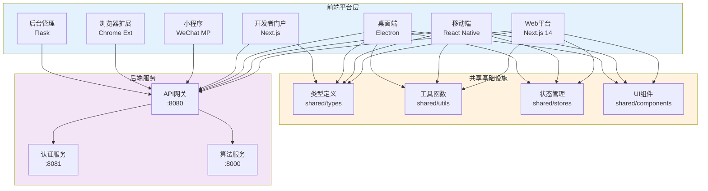
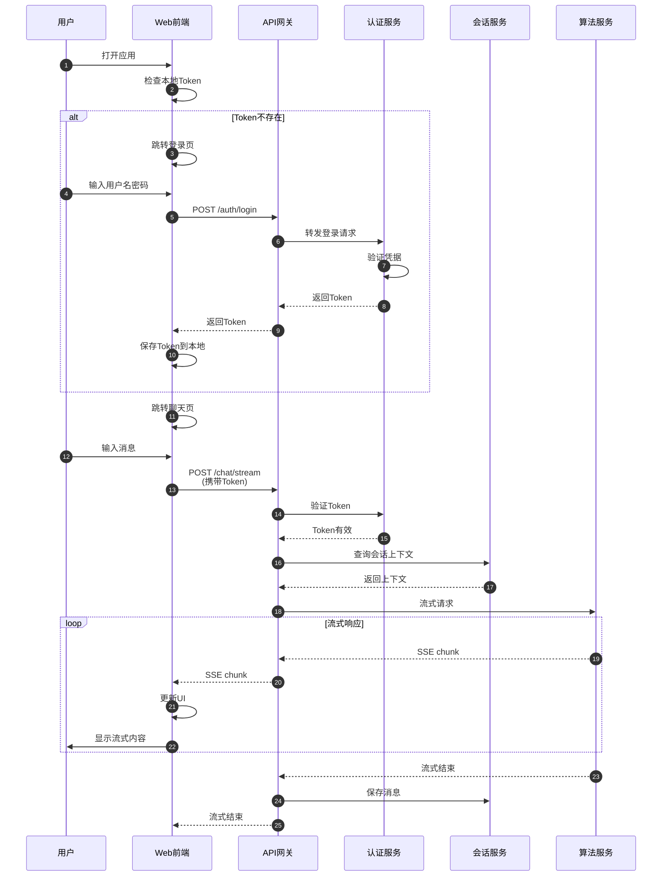

# VoiceHelper-11-前端平台

## 概览

VoiceHelper 提供 **7 个前端平台**，覆盖 Web、移动端、桌面端、小程序、浏览器扩展、开发者门户、后台管理等全场景。

### 平台清单

| 平台 | 技术栈 | 端口 | 状态 | 目录 |
|---|---|---|---|---|
| **Web** | Next.js 14 + TypeScript | 3000 | ✅ 已完成 | `platforms/web/` |
| **Mobile** | React Native + Expo | - | ✅ 已完成 | `platforms/mobile/` |
| **Desktop** | Electron + React | - | ✅ 已完成 | `platforms/desktop/` |
| **Developer Portal** | Next.js 14 | 3001 | ✅ 已完成 | `platforms/developer-portal/` |
| **Miniprogram** | 微信小程序 | - | 🔄 开发中 | `platforms/miniprogram/` |
| **Browser Extension** | Chrome Extension | - | 🔄 开发中 | `platforms/browser-extension/` |
| **Admin** | Flask + Jinja2 | 5000 | ✅ 已完成 | `platforms/admin/` |

---

## 架构图



---

## 共享基础设施

### 1. 类型定义（shared/types/）

**api.ts**：API 接口类型

```typescript
// 用户类型
export interface User {
  id: string;
  username: string;
  email: string;
  avatar?: string;
  created_at: string;
}

// 消息类型
export interface Message {
  id: string;
  session_id: string;
  role: 'user' | 'assistant';
  content: string;
  timestamp: string;
}

// API 响应类型
export interface ApiResponse<T> {
  data: T;
  success: boolean;
  timestamp: string;
  error?: string;
}

// 错误代码
export type ErrorCode = 
  | 'UNAUTHORIZED'
  | 'FORBIDDEN'
  | 'NOT_FOUND'
  | 'VALIDATION_ERROR'
  | 'SERVER_ERROR'
  | 'NETWORK_ERROR';
```

**store.ts**：状态管理类型

```typescript
// 认证状态
export interface AuthState {
  user: User | null;
  token: string | null;
  isAuthenticated: boolean;
  isLoading: boolean;
}

// 聊天状态
export interface ChatState {
  sessions: Session[];
  currentSessionId: string | null;
  messages: Message[];
  isStreaming: boolean;
  streamBuffer: string;
}

// 语音状态
export interface VoiceState {
  isRecording: boolean;
  isPlaying: boolean;
  wsConnected: boolean;
  audioBuffer: ArrayBuffer[];
}
```

### 2. 工具函数（shared/utils/）

**api-client.ts**：统一 API 客户端

```typescript
export class ApiClient {
  private baseURL: string;
  private defaultHeaders: Record<string, string>;

  constructor(config: ApiClientConfig) {
    this.baseURL = config.baseURL;
    this.defaultHeaders = config.headers || {};
  }

  // 设置认证 Token
  setAuthToken(token: string): void {
    this.defaultHeaders['Authorization'] = `Bearer ${token}`;
  }

  // 通用请求方法
  private async request<T>(
    endpoint: string,
    options: ApiRequestOptions = {}
  ): Promise<ApiResponse<T>> {
    const url = `${this.baseURL}${endpoint}`;
    
    const headers = {
      'Content-Type': 'application/json',
      'X-Request-ID': this.generateRequestId(),
      'X-Client-Platform': this.getPlatform(),
      ...this.defaultHeaders,
      ...options.headers,
    };

    // 超时控制
    const controller = new AbortController();
    const timeoutId = setTimeout(() => controller.abort(), timeout);

    const response = await fetch(url, {
      ...options,
      headers,
      signal: controller.signal,
    });

    clearTimeout(timeoutId);

    if (response.ok) {
      return {
        data: await response.json(),
        success: true,
        timestamp: new Date().toISOString(),
      };
    } else {
      throw this.handleHttpError(response);
    }
  }

  // GET 请求
  async get<T>(endpoint: string): Promise<ApiResponse<T>> {
    return this.request<T>(endpoint, { method: 'GET' });
  }

  // POST 请求
  async post<T>(endpoint: string, data: any): Promise<ApiResponse<T>> {
    return this.request<T>(endpoint, {
      method: 'POST',
      body: JSON.stringify(data),
    });
  }
}
```

**logger.ts**：日志系统

```typescript
export class Logger {
  private context: string;

  constructor(context: string) {
    this.context = context;
  }

  info(message: string, meta?: any): void {
    console.log(`[${this.context}] INFO:`, message, meta);
  }

  error(message: string, error?: any): void {
    console.error(`[${this.context}] ERROR:`, message, error);
  }

  warn(message: string, meta?: any): void {
    console.warn(`[${this.context}] WARN:`, message, meta);
  }
}
```

### 3. 状态管理（shared/stores/）

**authStore.ts**：认证状态（Zustand）

```typescript
import { create } from 'zustand';
import { persist } from 'zustand/middleware';

export const useAuthStore = create<AuthState & AuthActions>()(
  persist(
    (set) => ({
      // 状态
      user: null,
      token: null,
      isAuthenticated: false,
      isLoading: false,

      // 操作
      login: async (credentials) => {
        set({ isLoading: true });
        const response = await apiClient.post('/auth/login', credentials);
        
        set({
          user: response.data.user,
          token: response.data.access_token,
          isAuthenticated: true,
          isLoading: false,
        });

        apiClient.setAuthToken(response.data.access_token);
      },

      logout: () => {
        set({
          user: null,
          token: null,
          isAuthenticated: false,
        });
        apiClient.clearAuthToken();
      },

      refreshToken: async () => {
        const response = await apiClient.post('/auth/refresh');
        set({ token: response.data.access_token });
        apiClient.setAuthToken(response.data.access_token);
      },
    }),
    {
      name: 'auth-storage',
    }
  )
);
```

**chatStore.ts**：聊天状态

```typescript
export const useChatStore = create<ChatState & ChatActions>((set, get) => ({
  // 状态
  sessions: [],
  currentSessionId: null,
  messages: [],
  isStreaming: false,
  streamBuffer: '',

  // 操作
  createSession: async (title: string) => {
    const response = await apiClient.post('/sessions', { title });
    const session = response.data;

    set({
      sessions: [...get().sessions, session],
      currentSessionId: session.session_id,
      messages: [],
    });

    return session;
  },

  sendMessage: async (content: string) => {
    const { currentSessionId } = get();

    // 添加用户消息
    const userMessage: Message = {
      id: uuid(),
      session_id: currentSessionId,
      role: 'user',
      content,
      timestamp: new Date().toISOString(),
    };

    set({ messages: [...get().messages, userMessage] });

    // 流式响应
    set({ isStreaming: true, streamBuffer: '' });

    const response = await fetch(`/api/v01/chat/stream`, {
      method: 'POST',
      body: JSON.stringify({
        session_id: currentSessionId,
        message: content,
      }),
    });

    const reader = response.body!.getReader();
    const decoder = new TextDecoder();

    while (true) {
      const { done, value } = await reader.read();
      if (done) break;

      const chunk = decoder.decode(value);
      const lines = chunk.split('\n');

      for (const line of lines) {
        if (line.startsWith('data: ')) {
          const data = JSON.parse(line.slice(6));
          
          if (data.type === 'token') {
            set({ streamBuffer: get().streamBuffer + data.content });
          } else if (data.type === 'done') {
            // 添加助手消息
            const assistantMessage: Message = {
              id: uuid(),
              session_id: currentSessionId,
              role: 'assistant',
              content: get().streamBuffer,
              timestamp: new Date().toISOString(),
            };

            set({
              messages: [...get().messages, assistantMessage],
              isStreaming: false,
              streamBuffer: '',
            });
          }
        }
      }
    }
  },
}));
```

---

## 1. Web 平台（Next.js）

### 1.1 目录结构

```
platforms/web/
├── src/
│   ├── app/                 # Next.js 14 App Router
│   │   ├── v01/
│   │   │   ├── login/       # 登录页
│   │   │   ├── register/    # 注册页
│   │   │   ├── chat/        # 聊天页
│   │   │   └── voice/       # 语音页
│   │   └── layout.tsx       # 根布局
│   ├── components/          # React 组件
│   │   ├── ChatMessage.tsx
│   │   ├── VoiceRecorder.tsx
│   │   └── Sidebar.tsx
│   ├── hooks/               # React Hooks
│   │   ├── useAuth.ts
│   │   ├── useChat.ts
│   │   └── useVoice.ts
│   └── lib/                 # 工具库
│       └── api.ts
├── public/                  # 静态资源
├── package.json
└── next.config.js
```

### 1.2 核心页面：聊天页（chat/page.tsx）

```typescript
'use client';

export default function ChatPage() {
  const { user, isAuthenticated, logout } = useAuth();
  const { messages, isStreaming, sendMessage } = useChat();
  const [input, setInput] = useState('');

  // 检查认证状态
  useEffect(() => {
    if (!isAuthenticated) {
      router.push('/v01/login');
    }
  }, [isAuthenticated]);

  // 发送消息
  const handleSubmit = async (e: React.FormEvent) => {
    e.preventDefault();
    if (!input.trim() || isStreaming) return;

    await sendMessage(input.trim());
    setInput('');
  };

  return (
    <div className="flex flex-col h-screen">
      {/* 头部 */}
      <header className="bg-white border-b px-6 py-4">
        <div className="flex justify-between">
          <h1 className="text-xl font-semibold">VoiceHelper</h1>
          <button onClick={logout}>退出</button>
        </div>
      </header>

      {/* 消息区域 */}
      <div className="flex-1 overflow-y-auto px-6 py-6">
        {messages.map((message, index) => (
          <div key={index} className={`flex ${message.role === 'user' ? 'justify-end' : 'justify-start'}`}>
            <div className={`max-w-[80%] rounded-lg px-4 py-3 ${
              message.role === 'user' ? 'bg-blue-600 text-white' : 'bg-white'
            }`}>
              {message.content}
            </div>
          </div>
        ))}
      </div>

      {/* 输入区域 */}
      <form onSubmit={handleSubmit} className="border-t px-6 py-4">
        <div className="flex space-x-4">
          <textarea
            value={input}
            onChange={(e) => setInput(e.target.value)}
            placeholder="输入消息..."
            className="flex-1 border rounded-lg px-4 py-2"
          />
          <button
            type="submit"
            disabled={isStreaming}
            className="px-6 py-2 bg-blue-600 text-white rounded-lg"
          >
            发送
          </button>
        </div>
      </form>
    </div>
  );
}
```

### 1.3 核心 Hook：useChat

```typescript
export function useChat() {
  const { messages, isStreaming, sendMessage, clearMessages } = useChatStore();

  return {
    messages,
    isStreaming,
    sendMessage,
    clearMessages,
  };
}
```

---

## 2. 移动端（React Native）

### 2.1 目录结构

```
platforms/mobile/
├── src/
│   ├── screens/             # 页面
│   │   ├── LoginScreen.tsx
│   │   ├── ChatScreen.tsx
│   │   └── VoiceScreen.tsx
│   ├── components/          # 组件
│   ├── navigation/          # 导航
│   │   └── AppNavigator.tsx
│   └── hooks/               # Hooks
├── app.json
└── package.json
```

### 2.2 核心页面：聊天页

```typescript
import React from 'react';
import { View, Text, FlatList, TextInput, TouchableOpacity } from 'react-native';
import { useChat } from '@/hooks/useChat';

export default function ChatScreen() {
  const { messages, sendMessage } = useChat();
  const [input, setInput] = React.useState('');

  const handleSend = async () => {
    if (!input.trim()) return;
    await sendMessage(input.trim());
    setInput('');
  };

  return (
    <View style={{ flex: 1 }}>
      <FlatList
        data={messages}
        keyExtractor={(item) => item.id}
        renderItem={({ item }) => (
          <View style={{
            alignSelf: item.role === 'user' ? 'flex-end' : 'flex-start',
            backgroundColor: item.role === 'user' ? '#3b82f6' : '#f3f4f6',
            borderRadius: 12,
            padding: 12,
            marginVertical: 4,
            marginHorizontal: 16,
            maxWidth: '80%',
          }}>
            <Text style={{
              color: item.role === 'user' ? '#fff' : '#000',
            }}>
              {item.content}
            </Text>
          </View>
        )}
      />

      <View style={{ flexDirection: 'row', padding: 16 }}>
        <TextInput
          value={input}
          onChangeText={setInput}
          placeholder="输入消息..."
          style={{ flex: 1, borderWidth: 1, borderRadius: 8, padding: 12 }}
        />
        <TouchableOpacity
          onPress={handleSend}
          style={{ marginLeft: 8, backgroundColor: '#3b82f6', borderRadius: 8, padding: 12 }}
        >
          <Text style={{ color: '#fff' }}>发送</Text>
        </TouchableOpacity>
      </View>
    </View>
  );
}
```

---

## 3. 桌面端（Electron）

### 3.1 主进程（main.ts）

```typescript
import { app, BrowserWindow } from 'electron';
import path from 'path';

function createWindow() {
  const mainWindow = new BrowserWindow({
    width: 1200,
    height: 800,
    webPreferences: {
      preload: path.join(__dirname, 'preload.js'),
      contextIsolation: true,
      nodeIntegration: false,
    },
  });

  // 加载应用
  if (process.env.NODE_ENV === 'development') {
    mainWindow.loadURL('http://localhost:3000');
  } else {
    mainWindow.loadFile(path.join(__dirname, '../renderer/index.html'));
  }
}

app.whenReady().then(createWindow);
```

### 3.2 渲染进程（renderer/）

```typescript
// 使用与 Web 平台相同的 React 组件
import React from 'react';
import ReactDOM from 'react-dom/client';
import App from './App';

ReactDOM.createRoot(document.getElementById('root')!).render(
  <React.StrictMode>
    <App />
  </React.StrictMode>
);
```

---

## 4. 开发者门户（Next.js）

### 4.1 功能清单

- **API 文档**：OpenAPI 规范展示
- **SDK 下载**：Python、TypeScript、Go SDK
- **示例代码**：快速开始示例
- **API 密钥管理**：创建、删除、查看密钥

### 4.2 核心页面：API 文档

```typescript
export default function ApiDocPage() {
  return (
    <div className="container mx-auto py-12">
      <h1 className="text-4xl font-bold mb-8">API 文档</h1>

      <div className="space-y-8">
        {/* 认证 API */}
        <section>
          <h2 className="text-2xl font-semibold mb-4">认证 API</h2>
          
          <div className="bg-white p-6 rounded-lg shadow">
            <h3 className="text-xl font-medium mb-2">POST /api/v1/auth/login</h3>
            <p className="text-gray-600 mb-4">用户登录</p>

            <div className="mb-4">
              <h4 className="font-medium mb-2">请求体</h4>
              <pre className="bg-gray-100 p-4 rounded">
{`{
  "username": "user@example.com",
  "password": "password123"
}`}
              </pre>
            </div>

            <div>
              <h4 className="font-medium mb-2">响应</h4>
              <pre className="bg-gray-100 p-4 rounded">
{`{
  "access_token": "eyJhbGciOiJIUzI1NiIs...",
  "refresh_token": "dGVzdC1yZWZyZXNo...",
  "expires_in": 3600
}`}
              </pre>
            </div>
          </div>
        </section>

        {/* 聊天 API */}
        <section>
          <h2 className="text-2xl font-semibold mb-4">聊天 API</h2>
          {/* 类似结构 */}
        </section>
      </div>
    </div>
  );
}
```

---

## 5. 后台管理（Flask）

### 5.1 目录结构

```
platforms/admin/
├── app.py                   # Flask 应用入口
├── templates/               # Jinja2 模板
│   ├── index.html
│   ├── users.html
│   └── sessions.html
├── static/                  # 静态资源
│   ├── css/
│   └── js/
└── requirements.txt
```

### 5.2 核心路由

```python
from flask import Flask, render_template, request, jsonify
import requests

app = Flask(__name__)

API_BASE_URL = "http://localhost:8080/api/v1"

@app.route('/')
def index():
    """首页：统计概览"""
    # 获取统计数据
    users_count = requests.get(f"{API_BASE_URL}/admin/users/count").json()
    sessions_count = requests.get(f"{API_BASE_URL}/admin/sessions/count").json()
    
    return render_template('index.html',
                         users_count=users_count['count'],
                         sessions_count=sessions_count['count'])

@app.route('/users')
def users():
    """用户管理"""
    page = request.args.get('page', 1, type=int)
    response = requests.get(f"{API_BASE_URL}/admin/users?page={page}")
    users = response.json()['data']
    
    return render_template('users.html', users=users)

@app.route('/sessions')
def sessions():
    """会话管理"""
    response = requests.get(f"{API_BASE_URL}/admin/sessions")
    sessions = response.json()['data']
    
    return render_template('sessions.html', sessions=sessions)

if __name__ == '__main__':
    app.run(debug=True, port=5000)
```

---

## 平台对比

| 特性 | Web | Mobile | Desktop | Miniprogram | Extension | Admin |
|---|---|---|---|---|---|---|
| 实时语音 | ✅ | ✅ | ✅ | ✅ | ❌ | ❌ |
| 文本聊天 | ✅ | ✅ | ✅ | ✅ | ✅ | ✅ |
| 文档上传 | ✅ | ✅ | ✅ | ✅ | ❌ | ✅ |
| 多模态分析 | ✅ | ✅ | ✅ | ✅ | ✅ | ✅ |
| 离线模式 | ❌ | ✅ | ✅ | ❌ | ❌ | ❌ |
| 推送通知 | ✅ | ✅ | ✅ | ✅ | ✅ | ✅ |
| 权限管理 | ❌ | ❌ | ❌ | ❌ | ❌ | ✅ |

---

## 完整流程时序图



---

## 部署架构

### Docker Compose 配置

```yaml
version: '3.8'

services:
  web:
    build: ./platforms/web
    ports:
      - "3000:3000"
    environment:
      - NEXT_PUBLIC_API_BASE_URL=http://gateway:8080/api/v1

  developer-portal:
    build: ./platforms/developer-portal
    ports:
      - "3001:3000"

  admin:
    build: ./platforms/admin
    ports:
      - "5000:5000"
    environment:
      - API_BASE_URL=http://gateway:8080/api/v1

  gateway:
    build: ./backend
    ports:
      - "8080:8080"
```

---

## 最佳实践

### 1. 状态管理

- **全局状态**：Zustand（认证、聊天）
- **服务端状态**：React Query（数据获取）
- **组件状态**：useState（局部状态）

### 2. 性能优化

- **代码分割**：动态导入（React.lazy）
- **图片优化**：Next.js Image 组件
- **缓存策略**：SWR / React Query
- **虚拟滚动**：长列表性能优化

### 3. 错误处理

```typescript
// 全局错误边界
class ErrorBoundary extends React.Component {
  componentDidCatch(error: Error, errorInfo: React.ErrorInfo) {
    logger.error('React Error Boundary', { error, errorInfo });
  }

  render() {
    if (this.state.hasError) {
      return <ErrorFallback />;
    }
    return this.props.children;
  }
}
```

---

**文档版本**：v1.0  
**最后更新**：2025-01-08  
**维护者**：VoiceHelper 团队

