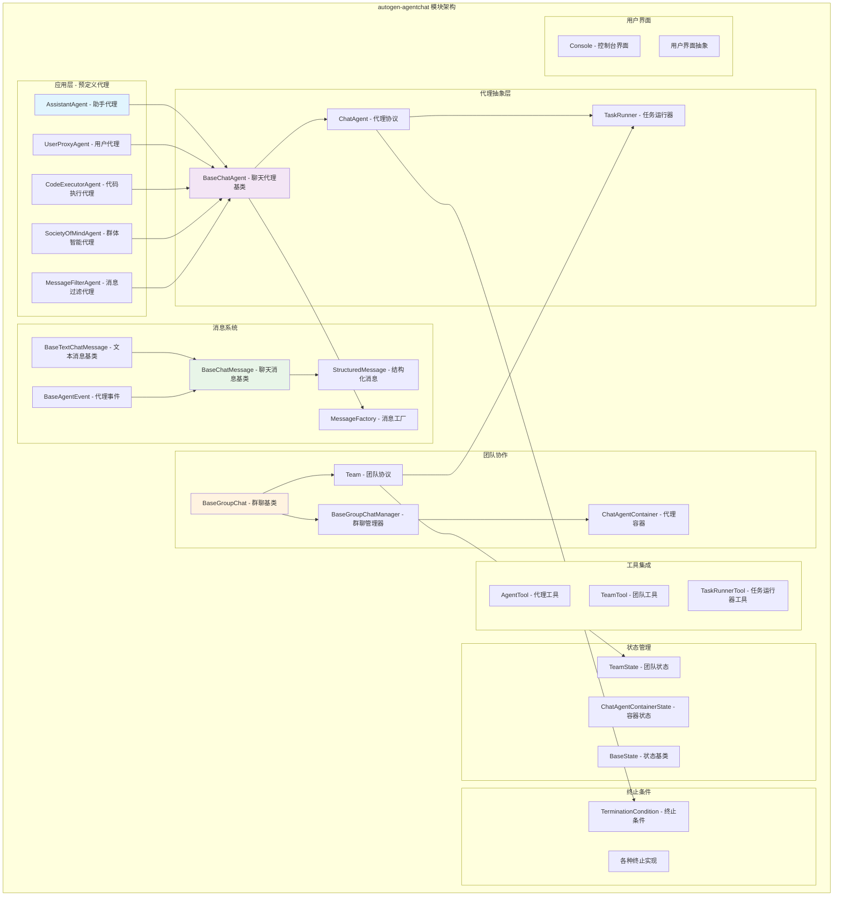
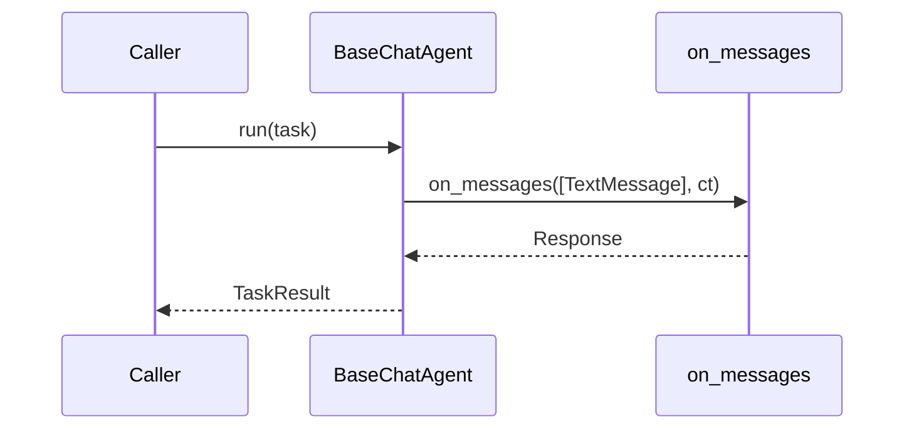
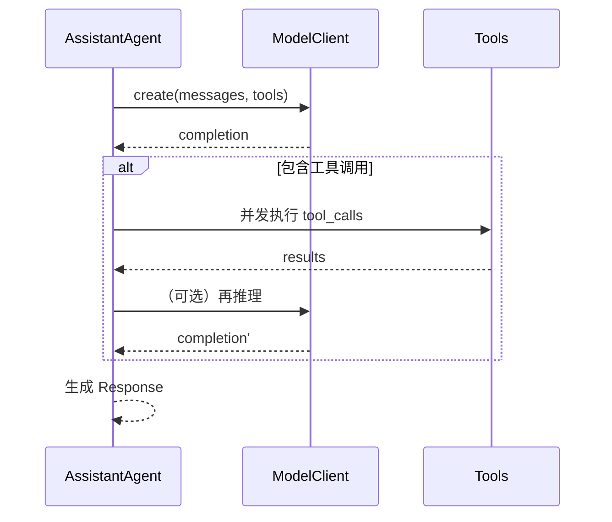
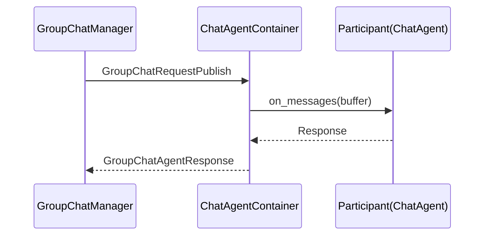
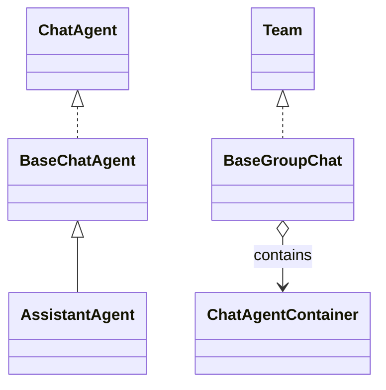

## 概述

`autogen-agentchat`是AutoGen Python实现的高级对话代理包，在`autogen-core`基础上构建了面向对话场景的代理抽象和团队协作机制。其核心组件设计、对话流程和团队管理实现。

## 1. 整体架构设计

### 1.1 模块层次结构



### 1.2 核心设计理念

#### 1. 对话优先设计 (Conversation-First Design)
- 所有代理围绕对话消息处理设计
- 支持多种消息类型和格式化输出
- 内置流式响应和事件处理

#### 2. 团队协作模型 (Team Collaboration Model)
- 支持多代理团队协作
- 灵活的角色分工和任务分配
- 内置群聊和路由机制

#### 3. 任务驱动架构 (Task-Driven Architecture)
- 基于任务的代理交互模式
- 支持复杂工作流编排
- 内置终止条件和状态管理

## 2. 消息系统详解

### 2.1 消息类型层次结构

#### 基础消息抽象

```python
class BaseMessage(BaseModel, ABC):
    """所有消息类型的抽象基类"""
    
    @abstractmethod
    def to_text(self) -> str:
        """转换为文本表示，用于控制台渲染和用户检查"""
        ...
    
    def dump(self) -> Mapping[str, Any]:
        """转换为JSON序列化字典"""
        return self.model_dump(mode="json")
    
    @classmethod  
    def load(cls, data: Mapping[str, Any]) -> Self:
        """从字典数据创建消息实例"""
        return cls.model_validate(data)
```

#### 聊天消息抽象

```python
class BaseChatMessage(BaseMessage, ABC):
    """聊天消息基类 - 代理间通信的核心消息类型"""
    
    id: str = Field(default_factory=lambda: str(uuid.uuid4()))
    """消息唯一标识符"""
    
    source: str
    """发送此消息的代理名称"""
    
    models_usage: RequestUsage | None = None
    """生成此消息时的模型使用情况"""
    
    metadata: Dict[str, str] = {}
    """消息的附加元数据"""
    
    created_at: datetime = Field(default_factory=lambda: datetime.now(timezone.utc))
    """消息创建时间"""
    
    @abstractmethod
    def to_model_text(self) -> str:
        """转换为模型文本表示，用于构造模型输入"""
        ...
    
    @abstractmethod
    def to_model_message(self) -> UserMessage:
        """转换为UserMessage，用于模型客户端"""
        ...
```

### 2.2 具体消息类型实现

#### 文本消息

```python
class TextMessage(BaseTextChatMessage):
    """纯文本聊天消息"""
    type: Literal["TextMessage"] = "TextMessage"
    
    def to_text(self) -> str:
        return self.content
    
    def to_model_text(self) -> str:
        return self.content
    
    def to_model_message(self) -> UserMessage:
        return UserMessage(content=self.content, source=self.source)

# 使用示例
text_msg = TextMessage(
    source="assistant",
    content="Hello, how can I help you today?"
)
```

#### 结构化消息

```python
StructuredContentType = TypeVar("StructuredContentType", bound=BaseModel, covariant=True)

class StructuredMessage(BaseChatMessage, Generic[StructuredContentType]):
    """结构化内容聊天消息"""
    type: Literal["StructuredMessage"] = "StructuredMessage"
    content: StructuredContentType
    content_type: str = Field(default="")
    
    def __init__(self, **data: Any) -> None:
        super().__init__(**data)
        # 自动设置content_type
        if hasattr(self.content, '__class__'):
            self.content_type = f"{self.content.__class__.__module__}.{self.content.__class__.__qualname__}"
    
    def to_text(self) -> str:
        if hasattr(self.content, 'model_dump_json'):
            return self.content.model_dump_json(indent=2)
        return str(self.content)
    
    def to_model_text(self) -> str:
        return self.to_text()
    
    def to_model_message(self) -> UserMessage:
        return UserMessage(content=self.to_model_text(), source=self.source)

# 使用示例
@dataclass
class WeatherInfo(BaseModel):
    city: str
    temperature: float
    description: str

weather_msg = StructuredMessage[WeatherInfo](
    source="weather_agent",
    content=WeatherInfo(
        city="Beijing",
        temperature=25.5,
        description="Sunny"
    )
)
```

#### 工具调用消息

```python
class ToolCallMessage(BaseChatMessage):
    """工具调用消息"""
    type: Literal["ToolCallMessage"] = "ToolCallMessage"
    tool_calls: List[FunctionCall]
    
    def to_text(self) -> str:
        return f"工具调用: {[call.name for call in self.tool_calls]}"
    
    def to_model_text(self) -> str:
        calls_text = []
        for call in self.tool_calls:
            calls_text.append(f"调用 {call.name}({call.arguments})")
        return "\n".join(calls_text)
    
    def to_model_message(self) -> UserMessage:
        return UserMessage(content=self.to_model_text(), source=self.source)

class ToolCallResultMessage(BaseChatMessage):
    """工具调用结果消息"""
    type: Literal["ToolCallResultMessage"] = "ToolCallResultMessage"  
    tool_call_results: List[FunctionExecutionResult]
    
    def to_text(self) -> str:
        results = []
        for result in self.tool_call_results:
            status = "成功" if not result.is_error else "失败"
            results.append(f"{result.call_id}: {status}")
        return f"工具调用结果: {', '.join(results)}"
```

#### 切换消息

```python
class HandoffMessage(BaseChatMessage):
    """代理切换消息 - 用于团队中的代理交接"""
    type: Literal["HandoffMessage"] = "HandoffMessage"
    target: str
    """目标代理名称"""
    
    context: Any = None
    """传递给目标代理的上下文信息"""
    
    def to_text(self) -> str:
        return f"切换到: {self.target}"
    
    def to_model_text(self) -> str:
        context_text = f" (上下文: {self.context})" if self.context else ""
        return f"切换到代理 {self.target}{context_text}"
    
    def to_model_message(self) -> UserMessage:
        return UserMessage(content=self.to_model_text(), source=self.source)
```

### 2.3 消息工厂

```python
class MessageFactory:
    """消息工厂 - 负责消息类型的注册和创建"""
    
    def __init__(self) -> None:
        self._message_types: Dict[str, type[BaseChatMessage | BaseAgentEvent]] = {}
        # 注册内置消息类型
        self._register_builtin_types()
    
    def _register_builtin_types(self) -> None:
        """注册内置消息类型"""
        builtin_types = [
            TextMessage,
            StructuredMessage,
            ToolCallMessage,
            ToolCallResultMessage,
            HandoffMessage,
            MultiModalMessage,
            StopMessage,
            ModelClientStreamingChunkEvent,
        ]
        for message_type in builtin_types:
            self._message_types[message_type.__name__] = message_type
    
    def register(self, message_type: type[BaseChatMessage | BaseAgentEvent]) -> None:
        """注册自定义消息类型"""
        if not hasattr(message_type, 'type'):
            raise ValueError(f"消息类型 {message_type.__name__} 必须有 'type' 字段")
        
        self._message_types[message_type.__name__] = message_type
    
    def is_registered(self, message_type: type[BaseChatMessage | BaseAgentEvent]) -> bool:
        """检查消息类型是否已注册"""
        return message_type.__name__ in self._message_types
    
    def create_from_data(self, data: Mapping[str, Any]) -> BaseChatMessage | BaseAgentEvent:
        """从数据字典创建消息实例"""
        message_type_name = data.get("type")
        if not message_type_name:
            raise ValueError("消息数据必须包含 'type' 字段")
        
        if message_type_name not in self._message_types:
            raise ValueError(f"未知消息类型: {message_type_name}")
        
        message_class = self._message_types[message_type_name]
        return message_class.load(data)

# 使用示例
factory = MessageFactory()

# 注册自定义消息类型
@dataclass
class CustomMessage(BaseChatMessage):
    type: Literal["CustomMessage"] = "CustomMessage"
    custom_field: str
    
    def to_text(self) -> str:
        return f"自定义: {self.custom_field}"

factory.register(CustomMessage)

# 从数据创建消息
data = {
    "type": "CustomMessage",
    "source": "agent1",
    "custom_field": "测试数据"
}
message = factory.create_from_data(data)
```

## 3. 代理系统详解

### 3.1 聊天代理协议

```python
class ChatAgent(ABC, TaskRunner, ComponentBase[BaseModel]):
    """聊天代理协议定义"""
    
    component_type = "agent"
    
    @property
    @abstractmethod
    def name(self) -> str:
        """代理名称 - 在团队中用于唯一标识"""
        ...
    
    @property
    @abstractmethod
    def description(self) -> str:
        """代理描述 - 用于团队决策和代理选择"""
        ...
    
    @property
    @abstractmethod
    def produced_message_types(self) -> Sequence[type[BaseChatMessage]]:
        """代理可产生的消息类型列表"""
        ...
    
    @abstractmethod
    async def on_messages(
        self,
        messages: Sequence[BaseChatMessage],
        cancellation_token: CancellationToken
    ) -> Response:
        """处理输入消息并返回响应"""
        ...
    
    @abstractmethod
    def on_messages_stream(
        self,
        messages: Sequence[BaseChatMessage],
        cancellation_token: CancellationToken
    ) -> AsyncGenerator[BaseAgentEvent | BaseChatMessage | Response, None]:
        """处理消息并返回流式响应"""
        ...
    
    @abstractmethod
    async def on_reset(self, cancellation_token: CancellationToken) -> None:
        """重置代理到初始状态"""
        ...
    
    @abstractmethod
    async def on_pause(self, cancellation_token: CancellationToken) -> None:
        """暂停代理运行"""
        ...
    
    @abstractmethod
    async def on_resume(self, cancellation_token: CancellationToken) -> None:
        """恢复代理运行"""
        ...
```

#### 响应数据结构

```python
@dataclass(kw_only=True)
class Response:
    """代理响应数据结构"""
    
    chat_message: BaseChatMessage
    """主要的聊天消息响应"""
    
    inner_messages: Sequence[BaseAgentEvent | BaseChatMessage] | None = None
    """代理产生的内部消息序列"""
```

### 3.2 基础聊天代理

```python
class BaseChatAgent(ChatAgent, ABC, ComponentBase[BaseModel]):
    """聊天代理基类实现"""
    
    component_type = "agent"
    
    def __init__(self, name: str, description: str) -> None:
        with trace_create_agent_span(
            agent_name=name,
            agent_description=description,
        ):
            self._name = name
            if not self._name.isidentifier():
                raise ValueError("代理名称必须是有效的Python标识符")
            self._description = description
    
    @property
    def name(self) -> str:
        return self._name
    
    @property
    def description(self) -> str:
        return self._description
    
    # 实现TaskRunner接口
    async def run(
        self,
        *,
        task: str,
        cancellation_token: CancellationToken | None = None,
    ) -> TaskResult:
        """执行任务并返回结果"""
        if cancellation_token is None:
            cancellation_token = CancellationToken()
        
        # 创建任务消息
        task_message = TextMessage(source="user", content=task)
        
        # 处理消息
        response = await self.on_messages([task_message], cancellation_token)
        
        # 构建任务结果
        messages = [task_message, response.chat_message]
        if response.inner_messages:
            messages.extend(response.inner_messages)
        
        return TaskResult(messages=messages, stop_reason=None)
    
    def run_stream(
        self,
        *,
        task: str,
        cancellation_token: CancellationToken | None = None,
    ) -> AsyncGenerator[BaseAgentEvent | BaseChatMessage | TaskResult, None]:
        """执行任务并返回流式结果"""
        if cancellation_token is None:
            cancellation_token = CancellationToken()
        
        return self._run_stream_impl(task, cancellation_token)
    
    async def _run_stream_impl(
        self,
        task: str,
        cancellation_token: CancellationToken,
    ) -> AsyncGenerator[BaseAgentEvent | BaseChatMessage | TaskResult, None]:
        """流式任务执行实现"""
        
        # 创建并发送任务消息
        task_message = TextMessage(source="user", content=task)
        yield task_message
        
        messages = [task_message]
        
        # 流式处理消息
        async for item in self.on_messages_stream([task_message], cancellation_token):
            if isinstance(item, Response):
                # 最终响应
                messages.append(item.chat_message)
                if item.inner_messages:
                    messages.extend(item.inner_messages)
                
                yield TaskResult(messages=messages, stop_reason=None)
                return
            else:
                # 中间消息或事件
                yield item
```

### 3.3 助手代理实现

#### 配置模型

```python
class AssistantAgentConfig(BaseModel):
    """助手代理配置"""
    name: str
    model_client: ComponentModel
    tools: list[ComponentModel] | None = None
    workbench: ComponentModel | list[ComponentModel] | None = None
    handoffs: list[str] | None = None
    description: str = "一个有用的助手代理"
    system_message: str | None = None
    model_context: ComponentModel | None = None
    model_client_stream: bool = False
    reflect_on_tool_use: bool | None = None
    output_content_type: str | None = None
    max_tool_iterations: int = 1
    tool_call_summary_format: str = "{result}"
```

#### 核心实现

```python
class AssistantAgent(BaseChatAgent, Component[AssistantAgentConfig]):
    """助手代理 - 支持工具使用的智能助手"""
    
    component_config_schema = AssistantAgentConfig
    
    def __init__(
        self,
        name: str,
        model_client: ChatCompletionClient,
        tools: List[BaseTool[Any, Any] | Callable[..., Any]] | None = None,
        workbench: Workbench | Sequence[Workbench] | None = None,
        handoffs: List[HandoffBase | str] | None = None,
        model_context: ChatCompletionContext | None = None,
        description: str = "一个有用的助手代理",
        system_message: str | None = None,
        model_client_stream: bool = False,
        reflect_on_tool_use: bool | None = None,
        output_content_type: type[BaseModel] | None = None,
        max_tool_iterations: int = 1,
        tool_call_summary_format: str = "{result}",
        tool_call_summary_formatter: Callable[[FunctionCall, FunctionExecutionResult], str] | None = None,
        **kwargs: Any,
    ) -> None:
        super().__init__(name, description)
        
        self._model_client = model_client
        self._tools = self._prepare_tools(tools or [])
        self._workbench = workbench
        self._handoffs = self._prepare_handoffs(handoffs or [])
        self._model_context = model_context or UnboundedChatCompletionContext()
        self._system_message = system_message
        self._model_client_stream = model_client_stream
        self._reflect_on_tool_use = reflect_on_tool_use
        self._output_content_type = output_content_type
        self._max_tool_iterations = max_tool_iterations
        self._tool_call_summary_format = tool_call_summary_format
        self._tool_call_summary_formatter = tool_call_summary_formatter
        
        # 验证配置
        if max_tool_iterations < 1:
            raise ValueError("max_tool_iterations 必须大于等于1")
        
        if tools and workbench:
            raise ValueError("不能同时设置 tools 和 workbench")
        
        # 设置默认的reflect_on_tool_use
        if self._reflect_on_tool_use is None:
            self._reflect_on_tool_use = output_content_type is not None
    
    @property
    def produced_message_types(self) -> Sequence[type[BaseChatMessage]]:
        """返回可产生的消息类型"""
        types = [TextMessage, ToolCallMessage, ToolCallResultMessage]
        if self._handoffs:
            types.append(HandoffMessage)
        if self._output_content_type:
            types.append(StructuredMessage)
        return types
    
    async def on_messages(
        self,
        messages: Sequence[BaseChatMessage],
        cancellation_token: CancellationToken,
    ) -> Response:
        """处理消息的核心实现"""
        
        with trace_invoke_agent_span(agent_name=self.name):
            # 将新消息添加到上下文
            for message in messages:
                self._model_context.add_message(message.to_model_message())
            
            # 执行推理循环
            inner_messages: List[BaseAgentEvent | BaseChatMessage] = []
            
            for iteration in range(self._max_tool_iterations):
                # 模型推理
                llm_messages = self._prepare_model_messages()
                
                if self._model_client_stream:
                    # 流式推理（在同步方法中收集所有chunks）
                    chunks = []
                    async for chunk in self._model_client.create_stream(
                        llm_messages,
                        tools=self._tools,
                        cancellation_token=cancellation_token
                    ):
                        chunks.append(chunk)
                    
                    completion = self._combine_streaming_chunks(chunks)
                else:
                    # 同步推理
                    completion = await self._model_client.create(
                        llm_messages,
                        tools=self._tools,
                        cancellation_token=cancellation_token
                    )
                
                # 处理完成结果
                response_message, should_continue = await self._process_completion(
                    completion, inner_messages, cancellation_token
                )
                
                if not should_continue:
                    # 添加响应到上下文
                    if response_message:
                        assistant_message = AssistantMessage(
                            content=response_message.content,
                            source=self.name
                        )
                        self._model_context.add_message(assistant_message)
                    
                    return Response(
                        chat_message=response_message,
                        inner_messages=inner_messages
                    )
            
            # 达到最大迭代次数
            raise RuntimeError(f"达到最大工具迭代次数 {self._max_tool_iterations}")
    
    def on_messages_stream(
        self,
        messages: Sequence[BaseChatMessage],
        cancellation_token: CancellationToken,
    ) -> AsyncGenerator[BaseAgentEvent | BaseChatMessage | Response, None]:
        """流式消息处理"""
        return self._on_messages_stream_impl(messages, cancellation_token)
    
    async def _on_messages_stream_impl(
        self,
        messages: Sequence[BaseChatMessage],
        cancellation_token: CancellationToken,
    ) -> AsyncGenerator[BaseAgentEvent | BaseChatMessage | Response, None]:
        """流式处理实现"""
        
        # 将新消息添加到上下文
        for message in messages:
            self._model_context.add_message(message.to_model_message())
        
        inner_messages: List[BaseAgentEvent | BaseChatMessage] = []
        
        for iteration in range(self._max_tool_iterations):
            # 准备模型消息
            llm_messages = self._prepare_model_messages()
            
            if self._model_client_stream:
                # 流式推理
                completion_chunks = []
                async for chunk in self._model_client.create_stream(
                    llm_messages,
                    tools=self._tools,
                    cancellation_token=cancellation_token
                ):
                    # 发送流式chunk事件
                    chunk_event = ModelClientStreamingChunkEvent(
                        source=self.name,
                        content=chunk.content or "",
                        models_usage=chunk.usage
                    )
                    yield chunk_event
                    completion_chunks.append(chunk)
                
                # 合并所有chunks
                completion = self._combine_streaming_chunks(completion_chunks)
            else:
                # 非流式推理
                completion = await self._model_client.create(
                    llm_messages,
                    tools=self._tools,
                    cancellation_token=cancellation_token
                )
            
            # 处理完成结果
            response_message, should_continue = await self._process_completion(
                completion, inner_messages, cancellation_token
            )
            
            # 发送内部消息
            for inner_msg in inner_messages[len(inner_messages) - (1 if response_message else 0):]:
                yield inner_msg
            
            if not should_continue:
                # 添加响应到上下文
                if response_message:
                    assistant_message = AssistantMessage(
                        content=response_message.content,
                        source=self.name
                    )
                    self._model_context.add_message(assistant_message)
                
                yield Response(
                    chat_message=response_message,
                    inner_messages=inner_messages
                )
                return
        
        raise RuntimeError(f"达到最大工具迭代次数 {self._max_tool_iterations}")
    
    async def _process_completion(
        self,
        completion: ChatCompletionResponse,
        inner_messages: List[BaseAgentEvent | BaseChatMessage],
        cancellation_token: CancellationToken,
    ) -> tuple[BaseChatMessage, bool]:
        """处理模型完成结果"""
        
        # 检查是否有工具调用
        if completion.content and hasattr(completion.content, 'tool_calls'):
            tool_calls = completion.content.tool_calls
            if tool_calls:
                return await self._handle_tool_calls(
                    tool_calls, inner_messages, cancellation_token
                )
        
        # 检查是否有切换请求
        handoff = self._detect_handoff(completion.content)
        if handoff:
            return await self._handle_handoff(handoff, inner_messages)
        
        # 普通文本响应
        content = completion.content if isinstance(completion.content, str) else str(completion.content)
        
        if self._output_content_type and self._reflect_on_tool_use:
            # 结构化输出
            try:
                structured_content = self._parse_structured_output(content)
                response_message = StructuredMessage(
                    source=self.name,
                    content=structured_content,
                    models_usage=completion.usage
                )
            except Exception as e:
                logger.warning(f"结构化输出解析失败: {e}")
                response_message = TextMessage(
                    source=self.name,
                    content=content,
                    models_usage=completion.usage
                )
        else:
            # 文本输出
            response_message = TextMessage(
                source=self.name,
                content=content,
                models_usage=completion.usage
            )
        
        return response_message, False  # 不继续迭代
    
    async def _handle_tool_calls(
        self,
        tool_calls: List[FunctionCall],
        inner_messages: List[BaseAgentEvent | BaseChatMessage],
        cancellation_token: CancellationToken,
    ) -> tuple[BaseChatMessage, bool]:
        """处理工具调用"""
        
        # 创建工具调用消息
        tool_call_message = ToolCallMessage(
            source=self.name,
            tool_calls=tool_calls
        )
        inner_messages.append(tool_call_message)
        
        # 并发执行工具调用
        results = await asyncio.gather(
            *[self._execute_tool_call(call, cancellation_token) for call in tool_calls],
            return_exceptions=True
        )
        
        # 处理结果
        tool_results = []
        for i, result in enumerate(results):
            if isinstance(result, Exception):
                tool_results.append(FunctionExecutionResult(
                    call_id=tool_calls[i].id,
                    content=f"工具调用失败: {str(result)}",
                    is_error=True
                ))
            else:
                tool_results.append(result)
        
        # 创建结果消息
        result_message = ToolCallResultMessage(
            source=self.name,
            tool_call_results=tool_results
        )
        inner_messages.append(result_message)
        
        # 添加结果到模型上下文
        for result in tool_results:
            self._model_context.add_message(ToolResultMessage(
                content=result.content,
                call_id=result.call_id
            ))
        
        if self._reflect_on_tool_use:
            # 继续迭代，让模型基于工具结果生成最终响应
            return result_message, True
        else:
            # 直接返回工具调用摘要
            summary_content = self._create_tool_call_summary(tool_calls, tool_results)
            summary_message = TextMessage(
                source=self.name,
                content=summary_content
            )
            return summary_message, False
    
    def _create_tool_call_summary(
        self,
        tool_calls: List[FunctionCall],
        results: List[FunctionExecutionResult],
    ) -> str:
        """创建工具调用摘要"""
        summaries = []
        
        for call, result in zip(tool_calls, results):
            if self._tool_call_summary_formatter:
                # 使用自定义格式化器
                summary = self._tool_call_summary_formatter(call, result)
            else:
                # 使用格式化模板
                summary = self._tool_call_summary_format.format(
                    tool_name=call.name,
                    arguments=call.arguments,
                    result=result.content,
                    is_error=result.is_error
                )
            summaries.append(summary)
        
        return "\n".join(summaries)
```

## 4. 团队协作机制

### 4.1 团队抽象

```python
class Team(ABC, TaskRunner, ComponentBase[BaseModel]):
    """团队抽象协议"""
    
    component_type = "team"
    
    @property
    @abstractmethod
    def name(self) -> str:
        """团队名称"""
        ...
    
    @property
    @abstractmethod
    def description(self) -> str:
        """团队描述"""
        ...
    
    @abstractmethod
    async def reset(self) -> None:
        """重置团队和所有参与者到初始状态"""
        ...
    
    @abstractmethod
    async def pause(self) -> None:
        """暂停团队和所有参与者"""
        ...
    
    @abstractmethod
    async def resume(self) -> None:
        """恢复团队和所有参与者"""
        ...
    
    @abstractmethod
    async def save_state(self) -> Mapping[str, Any]:
        """保存团队当前状态"""
        ...
    
    @abstractmethod
    async def load_state(self, state: Mapping[str, Any]) -> None:
        """加载团队状态"""
        ...
```

### 4.2 群聊团队基类

```python
class BaseGroupChat(Team, ABC, ComponentBase[BaseModel]):
    """群聊团队基类"""
    
    def __init__(
        self,
        name: str,
        description: str,
        participants: List[ChatAgent | Team],
        group_chat_manager_name: str,
        group_chat_manager_class: type[SequentialRoutedAgent],
        termination_condition: TerminationCondition | None = None,
        max_turns: int | None = None,
        runtime: AgentRuntime | None = None,
        custom_message_types: List[type[BaseAgentEvent | BaseChatMessage]] | None = None,
        emit_team_events: bool = False,
    ):
        self._name = name
        self._description = description
        
        if len(participants) == 0:
            raise ValueError("至少需要一个参与者")
        
        # 检查参与者名称唯一性
        names = [participant.name for participant in participants]
        if len(names) != len(set(names)):
            raise ValueError("参与者名称必须唯一")
        
        self._participants = participants
        self._base_group_chat_manager_class = group_chat_manager_class
        self._termination_condition = termination_condition
        self._max_turns = max_turns
        self._emit_team_events = emit_team_events
        
        # 创建消息工厂并注册消息类型
        self._message_factory = MessageFactory()
        if custom_message_types:
            for message_type in custom_message_types:
                self._message_factory.register(message_type)
        
        # 注册参与者产生的消息类型
        for participant in participants:
            if isinstance(participant, ChatAgent):
                for message_type in participant.produced_message_types:
                    if issubclass(message_type, StructuredMessage) and not self._message_factory.is_registered(message_type):
                        self._message_factory.register(message_type)
        
        # 创建运行时
        self._runtime = runtime or SingleThreadedAgentRuntime()
        self._runtime_manager = self._create_runtime_manager()
        
        # 注册代理和群聊管理器
        asyncio.create_task(self._setup_runtime())
    
    async def _setup_runtime(self) -> None:
        """设置运行时环境"""
        
        # 注册群聊管理器
        await self._register_group_chat_manager()
        
        # 注册参与者容器
        for i, participant in enumerate(self._participants):
            container = ChatAgentContainer(
                parent_topic_type=self._group_chat_manager_name,
                output_topic_type=f"{self._group_chat_manager_name}_participant_{i}",
                agent=participant,
                message_factory=self._message_factory
            )
            
            container_agent_type = f"{self._group_chat_manager_name}_participant_{i}"
            await container.register(
                self._runtime,
                container_agent_type,
                lambda: container
            )
    
    async def _register_group_chat_manager(self) -> None:
        """注册群聊管理器"""
        manager = self._base_group_chat_manager_class(
            description=self._description,
            participants=self._participants,
            message_factory=self._message_factory,
            termination_condition=self._termination_condition,
            max_turns=self._max_turns
        )
        
        await manager.register(
            self._runtime,
            self._group_chat_manager_name,
            lambda: manager
        )
```

### 4.3 代理容器

```python
class ChatAgentContainer(SequentialRoutedAgent):
    """聊天代理容器 - 将ChatAgent包装为Core代理"""
    
    def __init__(
        self,
        parent_topic_type: str,
        output_topic_type: str,
        agent: ChatAgent | Team,
        message_factory: MessageFactory,
    ) -> None:
        super().__init__(
            description=agent.description,
            sequential_message_types=[
                GroupChatStart,
                GroupChatRequestPublish,
                GroupChatReset,
                GroupChatAgentResponse,
                GroupChatTeamResponse,
            ]
        )
        self._parent_topic_type = parent_topic_type
        self._output_topic_type = output_topic_type
        self._agent = agent
        self._message_buffer: List[BaseChatMessage] = []
        self._message_factory = message_factory
    
    @event
    async def handle_start(self, message: GroupChatStart, ctx: MessageContext) -> None:
        """处理群聊开始事件"""
        # 清空消息缓冲区
        self._message_buffer.clear()
        
        # 如果有初始消息，添加到缓冲区
        if message.messages:
            for msg_data in message.messages:
                chat_message = self._message_factory.create_from_data(msg_data)
                if isinstance(chat_message, BaseChatMessage):
                    self._message_buffer.append(chat_message)
    
    @event
    async def handle_request_publish(self, message: GroupChatRequestPublish, ctx: MessageContext) -> None:
        """处理发布请求事件"""
        try:
            if isinstance(self._agent, ChatAgent):
                # 调用聊天代理
                response = await self._agent.on_messages(
                    self._message_buffer.copy(),
                    ctx.cancellation_token
                )
                
                # 发布代理响应
                await self.publish_message(
                    GroupChatAgentResponse(
                        agent_name=self._agent.name,
                        response=response.chat_message.dump(),
                        inner_messages=[msg.dump() for msg in (response.inner_messages or [])]
                    ),
                    DefaultTopicId(self._output_topic_type, self.id.key)
                )
            
            elif isinstance(self._agent, Team):
                # 调用团队
                # 构建任务内容
                if self._message_buffer:
                    task_content = "\n".join(msg.to_text() for msg in self._message_buffer)
                else:
                    task_content = ""
                
                result = await self._agent.run(task=task_content)
                
                # 发布团队响应
                await self.publish_message(
                    GroupChatTeamResponse(
                        team_name=self._agent.name,
                        messages=[msg.dump() for msg in result.messages],
                        stop_reason=result.stop_reason
                    ),
                    DefaultTopicId(self._output_topic_type, self.id.key)
                )
        
        except Exception as e:
            # 发布错误信息
            await self.publish_message(
                GroupChatError(
                    agent_name=self._agent.name,
                    error=SerializableException.from_exception(e)
                ),
                DefaultTopicId(self._output_topic_type, self.id.key)
            )
    
    @event  
    async def handle_agent_response(self, message: GroupChatAgentResponse, ctx: MessageContext) -> None:
        """处理其他代理的响应"""
        # 将响应消息添加到缓冲区
        if message.agent_name != self._agent.name:
            chat_message = self._message_factory.create_from_data(message.response)
            if isinstance(chat_message, BaseChatMessage):
                self._message_buffer.append(chat_message)
    
    @event
    async def handle_reset(self, message: GroupChatReset, ctx: MessageContext) -> None:
        """处理重置事件"""
        # 清空消息缓冲区
        self._message_buffer.clear()
        
        # 重置代理
        if isinstance(self._agent, ChatAgent):
            await self._agent.on_reset(ctx.cancellation_token)
        elif isinstance(self._agent, Team):
            await self._agent.reset()
```

## 5. 专业代理实现详解

### 5.1 Orchestrator协调器代理

Orchestrator是AutoGen的核心组件，负责整个任务的规划、进度跟踪及错误恢复。其主要职责包括：

- **任务分析**：深度分析任务需求，确定复杂度和所需资源
- **智能分工**：根据代理能力和任务特点进行最优分配
- **进度监控**：实时跟踪各子任务的执行状态
- **错误恢复**：在出现异常时进行智能恢复和重新分配

```python
async def analyze_task(self, task: Dict[str, Any]) -> Dict[str, Any]:
    """
    分析任务需求，确定任务的复杂度和所需资源
    
    该函数是Orchestrator的核心方法，通过LLM分析任务描述，
    识别所需的专业技能，估算执行时间，并评估潜在风险。
    
    Args:
        task: 包含任务详细信息的字典，包括description、expected_output等
        
    Returns:
        Dict: 详细的分析结果，包括任务分解、技能需求、时间估算等
    """
    # 实现任务分析的核心逻辑
    pass

async def assign_subtasks(self, task_analysis: Dict[str, Any]) -> List[Dict[str, Any]]:
    """
    将子任务分配给相应的专业代理
    
    该函数实现智能的任务分配算法，考虑代理负载、技能匹配度、
    任务依赖关系等因素，实现最优的任务分配。
    
    Args:
        task_analysis: 来自analyze_task的分析结果
        
    Returns:
        List[Dict]: 包含分配详情的子任务列表
    """
    # 实现智能任务分配逻辑
    pass
```

### 5.2 WebSurfer网页浏览代理

WebSurfer负责处理网页浏览相关的操作，通过异步事件驱动方式提高系统效率：

```python
async def fetch_web_content(self, url: str) -> str:
    """
    异步获取指定URL的网页内容
    
    采用高效的异步HTTP客户端，支持连接池复用和智能缓存，
    大幅提升网页内容获取的性能和稳定性。
    
    Args:
        url: 目标网页的URL
        
    Returns:
        str: 网页的HTML内容
    """
    # 实现高性能网页内容获取
    pass

async def extract_information(self, html_content: str) -> Dict[str, Any]:
    """
    从网页HTML内容中提取所需信息
    
    使用先进的HTML解析和信息提取算法，支持结构化数据提取、
    智能内容识别和多种提取规则配置。
    
    Args:
        html_content: 网页的HTML内容
        
    Returns:
        Dict: 提取的结构化信息
    """
    # 实现智能信息提取逻辑
    pass
```

### 5.3 高级特性

### 5.4 终止条件

```python
class TerminationCondition(ABC, ComponentBase[BaseModel]):
    """终止条件抽象基类"""
    
    component_type = "termination"
    
    @abstractmethod
    async def __call__(self, messages: Sequence[BaseChatMessage]) -> bool:
        """检查是否满足终止条件"""
        ...

class MaxMessageTermination(TerminationCondition):
    """最大消息数终止条件"""
    
    def __init__(self, max_messages: int):
        self._max_messages = max_messages
    
    async def __call__(self, messages: Sequence[BaseChatMessage]) -> bool:
        return len(messages) >= self._max_messages

class StopMessageTermination(TerminationCondition):
    """停止消息终止条件"""
    
    async def __call__(self, messages: Sequence[BaseChatMessage]) -> bool:
        if not messages:
            return False
        
        last_message = messages[-1]
        if isinstance(last_message, StopMessage):
            return True
        
        # 检查消息内容是否包含TERMINATE
        content = last_message.to_text().upper()
        return "TERMINATE" in content

class TextMentionTermination(TerminationCondition):
    """文本提及终止条件"""
    
    def __init__(self, text: str):
        self._text = text.upper()
    
    async def __call__(self, messages: Sequence[BaseChatMessage]) -> bool:
        if not messages:
            return False
        
        last_message = messages[-1]
        content = last_message.to_text().upper()
        return self._text in content
```

### 5.2 工具集成

```python
class AgentTool(TaskRunnerTool, Component[AgentToolConfig]):
    """代理工具 - 将代理包装为工具"""
    
    def __init__(
        self,
        agent: ChatAgent,
        return_value_as_last_message: bool = False,
        description: str | None = None,
    ):
        if description is None:
            description = f"使用 {agent.name} 代理: {agent.description}"
        
        super().__init__(description, return_value_as_last_message)
        self._agent = agent
    
    async def run(
        self,
        task: str,
        cancellation_token: CancellationToken | None = None,
    ) -> str:
        """执行代理任务"""
        if cancellation_token is None:
            cancellation_token = CancellationToken()
        
        result = await self._agent.run(task=task, cancellation_token=cancellation_token)
        
        if self._return_value_as_last_message and result.messages:
            return result.messages[-1].to_text()
        
        # 返回所有消息的文本表示
        return "\n".join(msg.to_text() for msg in result.messages)

class TeamTool(TaskRunnerTool, Component[TeamToolConfig]):
    """团队工具 - 将团队包装为工具"""
    
    def __init__(
        self,
        team: Team,
        return_value_as_last_message: bool = False,
        description: str | None = None,
    ):
        if description is None:
            description = f"使用 {team.name} 团队: {team.description}"
        
        super().__init__(description, return_value_as_last_message)
        self._team = team
    
    async def run(
        self,
        task: str,
        cancellation_token: CancellationToken | None = None,
    ) -> str:
        """执行团队任务"""
        if cancellation_token is None:
            cancellation_token = CancellationToken()
        
        result = await self._team.run(task=task, cancellation_token=cancellation_token)
        
        if self._return_value_as_last_message and result.messages:
            return result.messages[-1].to_text()
        
        return "\n".join(msg.to_text() for msg in result.messages)
```

### 5.3 用户界面

```python
class Console:
    """控制台用户界面"""
    
    def __init__(self, stream: AsyncGenerator[Any, None]):
        self._stream = stream
    
    async def __aenter__(self):
        """异步上下文管理器入口"""
        return self
    
    async def __aexit__(self, exc_type, exc_val, exc_tb):
        """异步上下文管理器出口"""
        pass
    
    def __await__(self):
        """使Console可等待"""
        return self._run().__await__()
    
    async def _run(self) -> None:
        """运行控制台显示"""
        async for item in self._stream:
            self._display_item(item)
    
    def _display_item(self, item: Any) -> None:
        """显示单个项目"""
        if isinstance(item, BaseChatMessage):
            self._display_chat_message(item)
        elif isinstance(item, BaseAgentEvent):
            self._display_agent_event(item)
        elif isinstance(item, TaskResult):
            self._display_task_result(item)
        elif isinstance(item, Response):
            self._display_response(item)
        else:
            print(f"未知项目类型: {type(item)}")
    
    def _display_chat_message(self, message: BaseChatMessage) -> None:
        """显示聊天消息"""
        timestamp = message.created_at.strftime("%H:%M:%S")
        print(f"[{timestamp}] {message.source}: {message.to_text()}")
        
        if message.models_usage:
            usage = message.models_usage
            print(f"    📊 模型使用: {usage.prompt_tokens} + {usage.completion_tokens} = {usage.total_tokens} tokens")
    
    def _display_agent_event(self, event: BaseAgentEvent) -> None:
        """显示代理事件"""
        timestamp = event.created_at.strftime("%H:%M:%S")
        print(f"[{timestamp}] 🔔 {event.source}: {event.to_text()}")
    
    def _display_task_result(self, result: TaskResult) -> None:
        """显示任务结果"""
        print("=" * 50)
        print("📋 任务完成")
        print(f"停止原因: {result.stop_reason or '正常完成'}")
        print(f"消息数量: {len(result.messages)}")
        print("=" * 50)
    
    def _display_response(self, response: Response) -> None:
        """显示响应"""
        print("💬 代理响应:")
        self._display_chat_message(response.chat_message)
        
        if response.inner_messages:
            print("🔍 内部消息:")
            for msg in response.inner_messages:
                if isinstance(msg, BaseChatMessage):
                    self._display_chat_message(msg)
                else:
                    self._display_agent_event(msg)

# 使用示例
async def demo_console():
    # 创建代理
    model_client = OpenAIChatCompletionClient(model="gpt-4")
    agent = AssistantAgent("assistant", model_client)
    
    # 运行并显示结果
    await Console(agent.run_stream(task="介绍一下Python编程语言"))
```

## 6. 使用示例和最佳实践

### 6.1 基础代理使用

```python
import asyncio
from autogen_ext.models.openai import OpenAIChatCompletionClient
from autogen_agentchat.agents import AssistantAgent
from autogen_agentchat.ui import Console

async def basic_agent_example():
    """基础代理使用示例"""
    
    # 创建模型客户端
    model_client = OpenAIChatCompletionClient(
        model="gpt-4o",
        api_key="your_openai_api_key"
    )
    
    # 创建助手代理
    agent = AssistantAgent(
        name="assistant",
        model_client=model_client,
        description="一个有用的AI助手"
    )
    
    # 运行任务
    result = await agent.run(task="解释什么是机器学习")
    
    # 打印结果
    for message in result.messages:
        print(f"{message.source}: {message.to_text()}")

asyncio.run(basic_agent_example())
```

### 6.2 带工具的代理

```python
async def agent_with_tools_example():
    """带工具的代理示例"""
    
    # 定义工具函数
    async def get_weather(city: str) -> str:
        """获取指定城市的天气信息"""
        # 模拟API调用
        await asyncio.sleep(0.1)
        return f"{city}今天天气晴朗，温度25°C"
    
    def calculate(expression: str) -> str:
        """计算数学表达式"""
        try:
            result = eval(expression)
            return f"计算结果: {result}"
        except Exception as e:
            return f"计算错误: {e}"
    
    # 创建代理
    model_client = OpenAIChatCompletionClient(model="gpt-4o")
    agent = AssistantAgent(
        name="assistant",
        model_client=model_client,
        tools=[get_weather, calculate],
        description="可以查询天气和计算数学表达式的助手"
    )
    
    # 运行并显示流式结果
    await Console(agent.run_stream(
        task="北京今天天气怎么样？另外帮我计算 123 * 456"
    ))

asyncio.run(agent_with_tools_example())
```

### 6.3 团队协作示例

```python
from autogen_agentchat.teams import RoundRobinGroupChat
from autogen_agentchat.conditions import MaxMessageTermination

async def team_collaboration_example():
    """团队协作示例"""
    
    model_client = OpenAIChatCompletionClient(model="gpt-4o")
    
    # 创建不同角色的代理
    writer = AssistantAgent(
        name="writer",
        model_client=model_client,
        description="专门负责创作和写作的代理",
        system_message="你是一个专业的作家，擅长创作各种类型的文本内容。"
    )
    
    reviewer = AssistantAgent(
        name="reviewer",
        model_client=model_client,
        description="专门负责审查和改进文本的代理",
        system_message="你是一个专业的编辑，负责审查文本并提出改进建议。"
    )
    
    finalizer = AssistantAgent(
        name="finalizer",
        model_client=model_client,
        description="负责最终确定和完善文本的代理",
        system_message="你负责根据反馈完善文本，并提供最终版本。请在完成后说'TERMINATE'。"
    )
    
    # 创建团队
    team = RoundRobinGroupChat(
        name="writing_team",
        description="一个协作写作团队",
        participants=[writer, reviewer, finalizer],
        termination_condition=MaxMessageTermination(10)
    )
    
    # 运行任务
    await Console(team.run_stream(
        task="写一篇关于人工智能未来发展的短文，要求观点明确，逻辑清晰，约200字。"
    ))

asyncio.run(team_collaboration_example())
```

### 6.4 最佳实践建议

#### 1. 代理设计原则
- **单一职责**：每个代理专注于特定的任务领域
- **明确描述**：提供清晰的代理描述，便于团队选择
- **合理工具配置**：根据任务需求配置合适的工具

#### 2. 性能优化
- **流式处理**：对于长时间运行的任务，使用流式接口
- **并发工具调用**：启用并行工具调用以提高效率
- **上下文管理**：合理控制模型上下文长度

#### 3. 错误处理
- **取消令牌**：正确处理任务取消
- **异常恢复**：实现优雅的异常处理和恢复
- **资源清理**：确保代理和团队的正确清理

#### 4. 监控和调试
- **结构化日志**：使用结构化日志记录关键事件
- **性能监控**：监控模型使用和响应时间
- **调试工具**：利用Console等工具进行调试

### 6.5 关键函数：核心代码要点、调用链与时序图

- BaseChatAgent.run / run_stream（任务执行入口）

```python
class BaseChatAgent(ChatAgent, ABC, ComponentBase[BaseModel]):
    async def run(self, *, task: str, cancellation_token: CancellationToken | None = None) -> TaskResult:
        if cancellation_token is None:
            cancellation_token = CancellationToken()
        task_message = TextMessage(source="user", content=task)
        response = await self.on_messages([task_message], cancellation_token)
        messages = [task_message, response.chat_message]
        if response.inner_messages:
            messages.extend(response.inner_messages)
        return TaskResult(messages=messages, stop_reason=None)

    def run_stream(self, *, task: str, cancellation_token: CancellationToken | None = None):
        if cancellation_token is None:
            cancellation_token = CancellationToken()
        return self._run_stream_impl(task, cancellation_token)
```

调用链（典型）：

- 调用方 → `BaseChatAgent.run` → `on_messages` → `Response` → `TaskResult`

时序图：



- AssistantAgent.on_messages/_process_completion/_handle_tool_calls（推理主循环）

```python
class AssistantAgent(BaseChatAgent, Component[AssistantAgentConfig]):
    async def on_messages(self, messages: Sequence[BaseChatMessage], cancellation_token: CancellationToken) -> Response:
        for m in messages:
            self._model_context.add_message(m.to_model_message())
        inner: list[BaseAgentEvent | BaseChatMessage] = []
        for _ in range(self._max_tool_iterations):
            completion = await self._model_client.create(
                self._prepare_model_messages(), tools=self._tools, cancellation_token=cancellation_token
            )
            rsp, cont = await self._process_completion(completion, inner, cancellation_token)
            if not cont:
                if rsp:
                    self._model_context.add_message(AssistantMessage(content=rsp.content, source=self.name))
                return Response(chat_message=rsp, inner_messages=inner)
        raise RuntimeError("达到最大工具迭代次数")
```

调用链（典型）：

- `BaseChatAgent.run`/Team → `AssistantAgent.on_messages` → `ModelClient.create` → `_process_completion` → [可选]`_handle_tool_calls`

时序图：



- ChatAgentContainer.handle_request_publish（团队容器转发）

```python
class ChatAgentContainer(SequentialRoutedAgent):
    @event
    async def handle_request_publish(self, message: GroupChatRequestPublish, ctx: MessageContext) -> None:
        if isinstance(self._agent, ChatAgent):
            response = await self._agent.on_messages(self._message_buffer.copy(), ctx.cancellation_token)
            await self.publish_message(
                GroupChatAgentResponse(
                    agent_name=self._agent.name,
                    response=response.chat_message.dump(),
                    inner_messages=[msg.dump() for msg in (response.inner_messages or [])]
                ),
                DefaultTopicId(self._output_topic_type, self.id.key)
            )
```

调用链（典型）：

- GroupChatManager → `ChatAgentContainer.handle_request_publish` → 参与者 `on_messages` → 回发 `GroupChatAgentResponse`

时序图：



- MessageFactory.create_from_data（消息构造）

```python
class MessageFactory:
    def create_from_data(self, data: Mapping[str, Any]) -> BaseChatMessage | BaseAgentEvent:
        message_type_name = data.get("type")
        if not message_type_name or message_type_name not in self._message_types:
            raise ValueError("未知或缺失的消息类型")
        message_class = self._message_types[message_type_name]
        return message_class.load(data)
```

调用链（典型）：

- 反序列化/容器 → `MessageFactory.create_from_data` → 具体 `Message.load`

### 6.6 关键结构体与类：结构图与继承关系



## 7. 总结

AutoGen Python AgentChat模块通过精心设计的抽象层次，为构建智能对话系统提供了强大而灵活的基础设施。其核心优势包括：

1. **丰富的消息类型系统**：支持文本、结构化、工具调用等多种消息格式
2. **灵活的代理抽象**：从基础协议到具体实现的完整层次
3. **强大的团队协作机制**：支持复杂的多代理协作场景
4. **完善的工具集成**：无缝集成外部工具和API
5. **优秀的用户体验**：提供流式响应和直观的控制台界面

通过深入理解这些设计原理和实现细节，开发者可以构建出功能强大、用户友好的AI对话应用。

---
