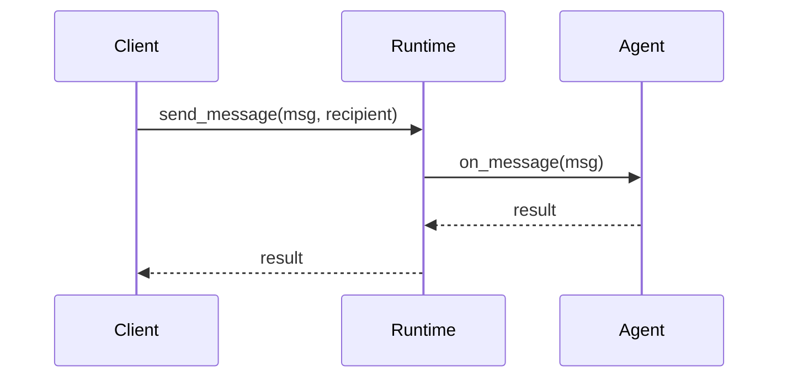
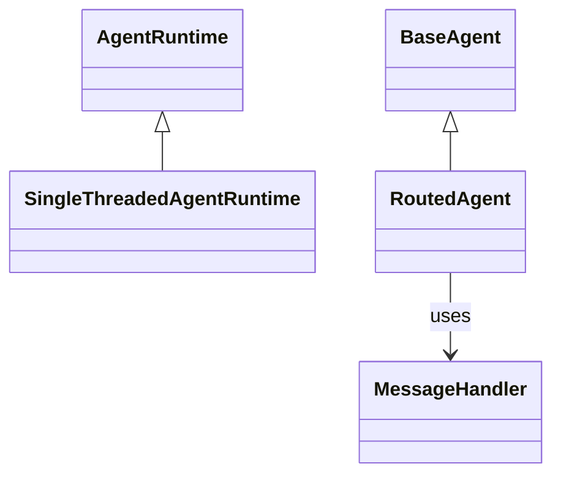

## 概述

本文档提供了AutoGen的完整API参考，涵盖Python和.NET两种实现的核心接口、参数说明、返回值和使用示例，为开发者提供详细的编程指南。

## 1. Python API参考

### 1.1 核心运行时API

#### SingleThreadedAgentRuntime

```python
class SingleThreadedAgentRuntime(AgentRuntime):
    """单线程代理运行时"""
    
    def __init__(
        self,
        intervention_handlers: List[InterventionHandler] | None = None,
        tracer_provider: TracerProvider | None = None,
        ignore_unhandled_exceptions: bool = True,
    ) -> None:
        """
        初始化单线程代理运行时
        
        Args:
            intervention_handlers: 干预处理器列表
            tracer_provider: 追踪提供者
            ignore_unhandled_exceptions: 是否忽略未处理异常
            
        Example:
            ```python
            # 基础用法
            runtime = SingleThreadedAgentRuntime()
            
            # 带干预处理器
            runtime = SingleThreadedAgentRuntime(
                intervention_handlers=[LoggingHandler(), SecurityHandler()]
            )
            ```
        """
    
    async def send_message(
        self,
        message: Any,
        recipient: AgentId,
        *,
        sender: AgentId | None = None,
        cancellation_token: CancellationToken | None = None,
        message_id: str | None = None,
    ) -> Any:
        """
        发送消息到指定代理
        
        Args:
            message: 要发送的消息对象
            recipient: 接收方代理ID
            sender: 发送方代理ID，如果为None表示来自外部
            cancellation_token: 取消令牌
            message_id: 消息唯一标识，如果为None会自动生成
            
        Returns:
            Any: 接收方代理的响应
            
        Raises:
            CantHandleException: 接收方无法处理该消息
            UndeliverableException: 消息无法投递
            
        Example:
            ```python
            # 基础消息发送
            response = await runtime.send_message(
                message="Hello, world!",
                recipient=AgentId("ChatAgent", "default")
            )
            
            # 带发送方的消息发送
            response = await runtime.send_message(
                message=ProcessingRequest(data="analyze"),
                recipient=AgentId("AnalystAgent", "default"),
                sender=AgentId("CoordinatorAgent", "main")
            )
            ```
        """
    
    async def publish_message(
        self,
        message: Any,
        topic_id: TopicId,
        *,
        sender: AgentId | None = None,
        cancellation_token: CancellationToken | None = None,
        message_id: str | None = None,
    ) -> None:
        """
        发布消息到主题
        
        Args:
            message: 要发布的消息对象
            topic_id: 目标主题ID
            sender: 发送方代理ID
            cancellation_token: 取消令牌
            message_id: 消息唯一标识
            
        Raises:
            UndeliverableException: 消息无法投递
            
        Example:
            ```python
            # 发布事件消息
            await runtime.publish_message(
                message=UserLoginEvent(user_id="user123"),
                topic_id=TopicId("user.login", "auth_service")
            )
            
            # 发布系统通知
            await runtime.publish_message(
                message=SystemNotification(message="系统维护完成"),
                topic_id=TopicId("system.notification", "admin")
            )
            ```
        """
    
    async def register_factory(
        self,
        type: str | AgentType,
        agent_factory: Callable[[], T | Awaitable[T]],
        *,
        expected_class: type[T] | None = None,
    ) -> AgentType:
        """
        注册代理工厂函数
        
        Args:
            type: 代理类型名称
            agent_factory: 代理工厂函数，返回代理实例
            expected_class: 期望的代理类，用于运行时验证
            
        Returns:
            AgentType: 注册的代理类型
            
        Example:
            ```python
            # 注册简单代理工厂
            await runtime.register_factory(
                type="ChatAgent",
                agent_factory=lambda: ChatAgent("聊天助手")
            )
            
            # 注册带验证的代理工厂
            await runtime.register_factory(
                type="AnalystAgent", 
                agent_factory=lambda: AnalystAgent("数据分析师"),
                expected_class=AnalystAgent
            )
            ```
        """
    
    def start(self) -> RunContext:
        """
        启动运行时
        
        Returns:
            RunContext: 运行上下文，用于控制运行时的生命周期
            
        Example:
            ```python
            # 启动运行时
            runtime = SingleThreadedAgentRuntime()
            run_context = runtime.start()
            
            # 发送消息
            await runtime.send_message(message, recipient)
            
            # 停止运行时
            await run_context.stop()
            ```
        """
```

#### BaseAgent和RoutedAgent

```python
class BaseAgent(ABC, Agent):
    """基础代理抽象类"""
    
    def __init__(self, description: str) -> None:
        """
        初始化基础代理
        
        Args:
            description: 代理描述信息
            
        Example:
            ```python
            class MyAgent(BaseAgent):
                def __init__(self):
                    super().__init__("我的自定义代理")
                
                async def on_message_impl(self, message, ctx):
                    return f"处理消息: {message}"
            ```
        """
    
    async def send_message(
        self,
        message: Any,
        recipient: AgentId,
        *,
        cancellation_token: CancellationToken | None = None,
        message_id: str | None = None,
    ) -> Any:
        """
        发送消息到其他代理
        
        Args:
            message: 消息内容
            recipient: 接收方代理ID
            cancellation_token: 取消令牌
            message_id: 消息ID
            
        Returns:
            Any: 接收方的响应
            
        Example:
            ```python
            class CoordinatorAgent(BaseAgent):
                async def coordinate_task(self, task):
                    # 发送任务到工作代理
                    result = await self.send_message(
                        message=WorkTask(task_data=task),
                        recipient=AgentId("WorkerAgent", "default")
                    )
                    return result
            ```
        """

class RoutedAgent(BaseAgent):
    """路由代理 - 支持装饰器方式的消息处理"""
    
    def __init__(self, description: str) -> None:
        """
        初始化路由代理
        
        Args:
            description: 代理描述
            
        Example:
            ```python
            class ChatAgent(RoutedAgent):
                def __init__(self):
                    super().__init__("智能聊天代理")
                
                @message_handler
                async def handle_text(self, message: str, ctx: MessageContext) -> str:
                    return f"回复: {message}"
                
                @event
                async def handle_notification(self, event: dict, ctx: MessageContext) -> None:
                    print(f"收到通知: {event}")
            ```
        """

# 装饰器API
def message_handler(
    func: None | Callable[[AgentT, ReceivesT, MessageContext], Coroutine[Any, Any, ProducesT]] = None,
    *,
    strict: bool = True,
    match: None | Callable[[ReceivesT, MessageContext], bool] = None,
) -> MessageHandler[AgentT, ReceivesT, ProducesT]:
    """
    消息处理器装饰器
    
    Args:
        func: 被装饰的处理函数
        strict: 是否启用严格类型检查
        match: 二次路由匹配函数
        
    Example:
        ```python
        class MyAgent(RoutedAgent):
            @message_handler
            async def handle_greeting(self, message: GreetingMessage, ctx: MessageContext) -> str:
                return f"你好, {message.name}!"
            
            @message_handler(match=lambda msg, ctx: msg.priority == "high")
            async def handle_urgent(self, message: UrgentMessage, ctx: MessageContext) -> str:
                return "正在紧急处理..."
        ```
    """

def event(
    func: Callable[[AgentT, ReceivesT, MessageContext], Coroutine[Any, Any, None]]
) -> MessageHandler[AgentT, ReceivesT, None]:
    """
    事件处理器装饰器 - 处理无需返回值的事件
    
    Example:
        ```python
        @event
        async def handle_system_event(self, event: SystemEvent, ctx: MessageContext) -> None:
            self.logger.info(f"系统事件: {event.type}")
        ```
    """

def rpc(
    func: None | Callable[[AgentT, ReceivesT, MessageContext], Coroutine[Any, Any, ProducesT]] = None,
    *,
    strict: bool = True,
    match: None | Callable[[ReceivesT, MessageContext], bool] = None,
) -> MessageHandler[AgentT, ReceivesT, ProducesT]:
    """
    RPC处理器装饰器 - 处理需要返回值的RPC调用
    
    Example:
        ```python
        @rpc
        async def calculate(self, request: CalculationRequest, ctx: MessageContext) -> CalculationResponse:
            result = request.a + request.b
            return CalculationResponse(result=result)
        ```
    """
```

### 1.2 AgentChat API

#### AssistantAgent

```python
class AssistantAgent(BaseChatAgent, Component[AssistantAgentConfig]):
    """助手代理 - 支持工具使用的智能助手"""
    
    def __init__(
        self,
        name: str,
        model_client: ChatCompletionClient,
        tools: List[BaseTool[Any, Any] | Callable[..., Any]] | None = None,
        workbench: Workbench | Sequence[Workbench] | None = None,
        handoffs: List[HandoffBase | str] | None = None,
        model_context: ChatCompletionContext | None = None,
        description: str = "一个有用的助手代理",
        system_message: str | None = None,
        model_client_stream: bool = False,
        reflect_on_tool_use: bool | None = None,
        output_content_type: type[BaseModel] | None = None,
        max_tool_iterations: int = 1,
        tool_call_summary_format: str = "{result}",
        **kwargs: Any,
    ) -> None:
        """
        初始化助手代理
        
        Args:
            name: 代理名称，必须是有效的Python标识符
            model_client: 模型客户端实例
            tools: 工具列表，可以是BaseTool对象或函数
            workbench: 工作台实例，与tools互斥
            handoffs: 切换配置列表
            model_context: 模型上下文，用于存储对话历史
            description: 代理描述
            system_message: 系统消息，会添加到每次模型推理的开头
            model_client_stream: 是否启用流式模式
            reflect_on_tool_use: 是否对工具使用结果进行反思
            output_content_type: 结构化输出的类型
            max_tool_iterations: 最大工具迭代次数
            tool_call_summary_format: 工具调用摘要格式
            
        Example:
            ```python
            from autogen_ext.models.openai import OpenAIChatCompletionClient
            from autogen_agentchat.agents import AssistantAgent
            
            # 基础助手代理
            model_client = OpenAIChatCompletionClient(model="gpt-4o")
            agent = AssistantAgent(
                name="assistant",
                model_client=model_client,
                description="通用助手代理"
            )
            
            # 带工具的助手代理
            def get_weather(city: str) -> str:
                return f"{city}的天气是晴天"
            
            agent_with_tools = AssistantAgent(
                name="weather_assistant",
                model_client=model_client,
                tools=[get_weather],
                description="天气查询助手"
            )
            
            # 带结构化输出的代理
            class WeatherResponse(BaseModel):
                city: str
                temperature: float
                description: str
            
            structured_agent = AssistantAgent(
                name="structured_assistant",
                model_client=model_client,
                output_content_type=WeatherResponse,
                description="结构化响应助手"
            )
            ```
        """
    
    async def run(
        self,
        *,
        task: str,
        cancellation_token: CancellationToken | None = None,
    ) -> TaskResult:
        """
        执行任务
        
        Args:
            task: 任务描述
            cancellation_token: 取消令牌
            
        Returns:
            TaskResult: 任务执行结果
            
        Example:
            ```python
            # 执行简单任务
            result = await agent.run(task="介绍一下Python编程语言")
            
            # 打印结果
            for message in result.messages:
                print(f"{message.source}: {message.to_text()}")
            ```
        """
    
    def run_stream(
        self,
        *,
        task: str,
        cancellation_token: CancellationToken | None = None,
    ) -> AsyncGenerator[BaseAgentEvent | BaseChatMessage | TaskResult, None]:
        """
        流式执行任务
        
        Args:
            task: 任务描述
            cancellation_token: 取消令牌
            
        Yields:
            BaseAgentEvent | BaseChatMessage | TaskResult: 流式事件或最终结果
            
        Example:
            ```python
            from autogen_agentchat.ui import Console
            
            # 流式执行并显示
            await Console(agent.run_stream(task="写一篇关于AI的文章"))
            
            # 手动处理流式结果
            async for item in agent.run_stream(task="分析数据"):
                if isinstance(item, TaskResult):
                    print("任务完成!")
                    break
                else:
                    print(f"进度: {item}")
            ```
        """
```

#### Team API

```python
class BaseGroupChat(Team, ABC, ComponentBase[BaseModel]):
    """群聊团队基类"""
    
    def __init__(
        self,
        name: str,
        description: str,
        participants: List[ChatAgent | Team],
        group_chat_manager_name: str,
        group_chat_manager_class: type[SequentialRoutedAgent],
        termination_condition: TerminationCondition | None = None,
        max_turns: int | None = None,
        runtime: AgentRuntime | None = None,
        custom_message_types: List[type[BaseAgentEvent | BaseChatMessage]] | None = None,
        emit_team_events: bool = False,
    ):
        """
        初始化群聊团队
        
        Args:
            name: 团队名称
            description: 团队描述
            participants: 参与者列表，可以是ChatAgent或Team
            group_chat_manager_name: 群聊管理器名称
            group_chat_manager_class: 群聊管理器类
            termination_condition: 终止条件
            max_turns: 最大轮次
            runtime: 运行时实例
            custom_message_types: 自定义消息类型
            emit_team_events: 是否发送团队事件
            
        Example:
            ```python
            from autogen_agentchat.teams import RoundRobinGroupChat
            from autogen_agentchat.conditions import MaxMessageTermination
            
            # 创建参与者
            writer = AssistantAgent("writer", model_client)
            reviewer = AssistantAgent("reviewer", model_client)
            
            # 创建团队
            team = RoundRobinGroupChat(
                name="writing_team",
                description="协作写作团队",
                participants=[writer, reviewer],
                termination_condition=MaxMessageTermination(10)
            )
            
            # 运行团队任务
            result = await team.run(task="写一篇技术文章")
            ```
        """
    
    async def run(
        self,
        *,
        task: str,
        cancellation_token: CancellationToken | None = None,
    ) -> TaskResult:
        """
        执行团队任务
        
        Args:
            task: 任务描述
            cancellation_token: 取消令牌
            
        Returns:
            TaskResult: 任务执行结果
        """
    
    def run_stream(
        self,
        *,
        task: str,
        cancellation_token: CancellationToken | None = None,
    ) -> AsyncGenerator[BaseAgentEvent | BaseChatMessage | TaskResult, None]:
        """
        流式执行团队任务
        
        Args:
            task: 任务描述
            cancellation_token: 取消令牌
            
        Yields:
            BaseAgentEvent | BaseChatMessage | TaskResult: 流式事件或最终结果
        """
```

### 1.3 工具API

```python
class FunctionTool(BaseTool[BaseModel, BaseModel], Component[FunctionToolConfig]):
    """函数工具 - 将Python函数包装为代理工具"""
    
    def __init__(
        self,
        func: Callable[..., Any],
        name: str | None = None,
        description: str | None = None,
        global_imports: List[ImportConfig] | None = None,
    ) -> None:
        """
        初始化函数工具
        
        Args:
            func: 要包装的函数
            name: 工具名称，默认使用函数名
            description: 工具描述，默认使用函数文档字符串
            global_imports: 全局导入配置
            
        Example:
            ```python
            # 简单函数工具
            def add_numbers(a: int, b: int) -> int:
                '''将两个数字相加'''
                return a + b
            
            add_tool = FunctionTool(add_numbers)
            
            # 异步函数工具
            async def fetch_data(url: str) -> dict:
                '''从URL获取数据'''
                async with aiohttp.ClientSession() as session:
                    async with session.get(url) as response:
                        return await response.json()
            
            fetch_tool = FunctionTool(fetch_data)
            
            # 带取消支持的工具
            async def long_running_task(
                data: str, 
                cancellation_token: CancellationToken
            ) -> str:
                '''长时间运行的任务'''
                for i in range(100):
                    if cancellation_token.is_cancelled():
                        raise OperationCanceledException()
                    await asyncio.sleep(0.1)
                return f"处理完成: {data}"
            
            cancellable_tool = FunctionTool(long_running_task)
            ```
        """
```

## 2. .NET API参考

### 2.1 核心接口

#### IAgentRuntime

```csharp
/// <summary>
/// 代理运行时接口
/// </summary>
public interface IAgentRuntime : ISaveState
{
    /// <summary>
    /// 发送消息到代理并获取响应
    /// </summary>
    /// <param name="message">要发送的消息</param>
    /// <param name="recepient">接收方代理ID</param>
    /// <param name="sender">发送方代理ID，为null表示来自外部</param>
    /// <param name="messageId">消息唯一标识，为null时自动生成</param>
    /// <param name="cancellationToken">取消令牌</param>
    /// <returns>接收方的响应</returns>
    /// <exception cref="CantHandleException">接收方无法处理消息</exception>
    /// <exception cref="UndeliverableException">消息无法投递</exception>
    /// 
    /// <example>
    /// <code>
    /// // 基础消息发送
    /// var response = await runtime.SendMessageAsync(
    ///     message: "Hello, world!",
    ///     recepient: new AgentId("ChatAgent", "default")
    /// );
    /// 
    /// // 带发送方的消息发送
    /// var response = await runtime.SendMessageAsync(
    ///     message: new ProcessingRequest { Data = "analyze" },
    ///     recepient: new AgentId("AnalystAgent", "default"),
    ///     sender: new AgentId("CoordinatorAgent", "main")
    /// );
    /// </code>
    /// </example>
    ValueTask<object?> SendMessageAsync(
        object message, 
        AgentId recepient, 
        AgentId? sender = null, 
        string? messageId = null, 
        CancellationToken cancellationToken = default);

    /// <summary>
    /// 发布消息到订阅给定主题的所有代理
    /// </summary>
    /// <param name="message">要发布的消息</param>
    /// <param name="topic">目标主题</param>
    /// <param name="sender">发送方代理ID</param>
    /// <param name="messageId">消息唯一标识</param>
    /// <param name="cancellationToken">取消令牌</param>
    /// <returns>发布操作的异步任务</returns>
    /// 
    /// <example>
    /// <code>
    /// // 发布事件消息
    /// await runtime.PublishMessageAsync(
    ///     message: new UserLoginEvent { UserId = "user123" },
    ///     topic: new TopicId("user.login", "auth_service")
    /// );
    /// </code>
    /// </example>
    ValueTask PublishMessageAsync(
        object message, 
        TopicId topic, 
        AgentId? sender = null, 
        string? messageId = null, 
        CancellationToken cancellationToken = default);

    /// <summary>
    /// 注册代理工厂函数
    /// </summary>
    /// <param name="type">代理类型</param>
    /// <param name="factoryFunc">代理工厂函数</param>
    /// <returns>注册的代理类型</returns>
    /// 
    /// <example>
    /// <code>
    /// // 注册代理工厂
    /// await runtime.RegisterAgentFactoryAsync(
    ///     type: new AgentType("ChatAgent"),
    ///     factoryFunc: (agentId, runtime) => 
    ///     {
    ///         var agent = new ChatAgent(agentId, runtime);
    ///         return ValueTask.FromResult&lt;IHostableAgent&gt;(agent);
    ///     }
    /// );
    /// </code>
    /// </example>
    ValueTask<AgentType> RegisterAgentFactoryAsync(
        AgentType type, 
        Func<AgentId, IAgentRuntime, ValueTask<IHostableAgent>> factoryFunc);

    /// <summary>
    /// 添加订阅
    /// </summary>
    /// <param name="subscription">订阅定义</param>
    /// <returns>添加操作的异步任务</returns>
    /// 
    /// <example>
    /// <code>
    /// // 添加类型订阅
    /// await runtime.AddSubscriptionAsync(
    ///     new TypeSubscription("chat.message", new AgentType("ChatAgent"))
    /// );
    /// 
    /// // 添加前缀订阅
    /// await runtime.AddSubscriptionAsync(
    ///     new TypePrefixSubscription("system.", new AgentType("SystemAgent"))
    /// );
    /// </code>
    /// </example>
    ValueTask AddSubscriptionAsync(ISubscriptionDefinition subscription);
}
```

#### BaseAgent

```csharp
/// <summary>
/// 基础代理抽象类
/// </summary>
public abstract class BaseAgent : IHostableAgent, ISaveState
{
    /// <summary>
    /// 获取代理的唯一标识符
    /// </summary>
    public AgentId Id { get; private set; }
    
    /// <summary>
    /// 获取代理元数据
    /// </summary>
    public AgentMetadata Metadata { get; }
    
    /// <summary>
    /// 构造函数
    /// </summary>
    /// <param name="id">代理ID</param>
    /// <param name="runtime">运行时实例</param>
    /// <param name="description">代理描述</param>
    /// <param name="logger">日志记录器</param>
    /// 
    /// <example>
    /// <code>
    /// public class GreetingAgent : BaseAgent, IHandle&lt;GreetingMessage, GreetingResponse&gt;
    /// {
    ///     public GreetingAgent(AgentId id, IAgentRuntime runtime) 
    ///         : base(id, runtime, "问候代理")
    ///     {
    ///     }
    ///     
    ///     public ValueTask&lt;GreetingResponse&gt; HandleAsync(
    ///         GreetingMessage message, 
    ///         MessageContext messageContext)
    ///     {
    ///         var response = new GreetingResponse 
    ///         { 
    ///             Message = $"你好, {message.Name}!" 
    ///         };
    ///         return ValueTask.FromResult(response);
    ///     }
    /// }
    /// </code>
    /// </example>
    protected BaseAgent(
        AgentId id,
        IAgentRuntime runtime,
        string description,
        ILogger<BaseAgent>? logger = null);

    /// <summary>
    /// 发送消息到其他代理
    /// </summary>
    /// <param name="message">消息内容</param>
    /// <param name="recepient">接收方代理ID</param>
    /// <param name="messageId">消息ID</param>
    /// <param name="cancellationToken">取消令牌</param>
    /// <returns>接收方的响应</returns>
    /// 
    /// <example>
    /// <code>
    /// // 在代理内部发送消息
    /// public async ValueTask&lt;ProcessingResponse&gt; ProcessDataAsync(ProcessingRequest request)
    /// {
    ///     var result = await SendMessageAsync(
    ///         message: request,
    ///         recepient: new AgentId("DataProcessor", "default")
    ///     );
    ///     
    ///     return (ProcessingResponse)result;
    /// }
    /// </code>
    /// </example>
    public ValueTask<object?> SendMessageAsync(
        object message, 
        AgentId recepient, 
        string? messageId = null, 
        CancellationToken cancellationToken = default);

    /// <summary>
    /// 发布消息到主题
    /// </summary>
    /// <param name="message">消息内容</param>
    /// <param name="topic">目标主题</param>
    /// <param name="messageId">消息ID</param>
    /// <param name="cancellationToken">取消令牌</param>
    /// <returns>发布操作的异步任务</returns>
    public ValueTask PublishMessageAsync(
        object message, 
        TopicId topic, 
        string? messageId = null, 
        CancellationToken cancellationToken = default);
}
```

### 2.2 消息处理接口

```csharp
/// <summary>
/// 消息处理接口 - 处理输入类型T，无返回值
/// </summary>
/// <typeparam name="T">输入消息类型</typeparam>
/// 
/// <example>
/// <code>
/// public class NotificationAgent : BaseAgent, IHandle&lt;NotificationMessage&gt;
/// {
///     public async ValueTask HandleAsync(NotificationMessage message, MessageContext messageContext)
///     {
///         // 处理通知消息
///         await SendNotificationAsync(message.Content);
///     }
/// }
/// </code>
/// </example>
public interface IHandle<in T>
{
    /// <summary>
    /// 异步处理指定类型的消息
    /// </summary>
    /// <param name="item">要处理的消息</param>
    /// <param name="messageContext">消息上下文</param>
    /// <returns>处理操作的异步任务</returns>
    ValueTask HandleAsync(T item, MessageContext messageContext);
}

/// <summary>
/// 消息处理接口 - 处理输入类型InT，返回类型OutT
/// </summary>
/// <typeparam name="InT">输入消息类型</typeparam>
/// <typeparam name="OutT">输出结果类型</typeparam>
/// 
/// <example>
/// <code>
/// public class CalculatorAgent : BaseAgent, IHandle&lt;CalculationRequest, CalculationResponse&gt;
/// {
///     public ValueTask&lt;CalculationResponse&gt; HandleAsync(
///         CalculationRequest request, 
///         MessageContext messageContext)
///     {
///         var result = request.A + request.B;
///         return ValueTask.FromResult(new CalculationResponse { Result = result });
///     }
/// }
/// </code>
/// </example>
public interface IHandle<in InT, OutT>
{
    /// <summary>
    /// 异步处理指定类型的消息并返回结果
    /// </summary>
    /// <param name="item">要处理的消息</param>
    /// <param name="messageContext">消息上下文</param>
    /// <returns>处理结果的异步任务</returns>
    ValueTask<OutT> HandleAsync(InT item, MessageContext messageContext);
}
```

### 2.3 订阅API

```csharp
/// <summary>
/// 类型订阅 - 基于精确类型匹配
/// </summary>
/// 
/// <example>
/// <code>
/// // 创建类型订阅
/// var subscription = new TypeSubscription(
///     topicType: "chat.message",
///     agentType: new AgentType("ChatAgent")
/// );
/// 
/// await runtime.AddSubscriptionAsync(subscription);
/// </code>
/// </example>
public class TypeSubscription : ISubscriptionDefinition
{
    /// <summary>
    /// 构造函数
    /// </summary>
    /// <param name="topicType">要匹配的精确主题类型</param>
    /// <param name="agentType">处理此订阅的代理类型</param>
    /// <param name="id">订阅唯一标识，为null时自动生成</param>
    public TypeSubscription(string topicType, AgentType agentType, string? id = null);
    
    /// <summary>
    /// 检查主题是否匹配
    /// </summary>
    /// <param name="topic">要检查的主题</param>
    /// <returns>是否匹配</returns>
    public bool Matches(TopicId topic);
    
    /// <summary>
    /// 将主题映射到代理ID
    /// </summary>
    /// <param name="topic">主题ID</param>
    /// <returns>目标代理ID</returns>
    public AgentId MapToAgent(TopicId topic);
}

/// <summary>
/// 前缀订阅 - 基于主题类型前缀匹配
/// </summary>
/// 
/// <example>
/// <code>
/// // 创建前缀订阅，匹配所有以"system."开头的主题
/// var prefixSubscription = new TypePrefixSubscription(
///     topicTypePrefix: "system.",
///     agentType: new AgentType("SystemAgent")
/// );
/// 
/// await runtime.AddSubscriptionAsync(prefixSubscription);
/// </code>
/// </example>
public class TypePrefixSubscription : ISubscriptionDefinition
{
    /// <summary>
    /// 构造函数
    /// </summary>
    /// <param name="topicTypePrefix">主题类型前缀</param>
    /// <param name="agentType">处理此订阅的代理类型</param>
    /// <param name="id">订阅唯一标识</param>
    public TypePrefixSubscription(string topicTypePrefix, AgentType agentType, string? id = null);
}
```

## 3. 配置API

### 3.1 组件配置

```python
# Python组件配置
class ComponentModel(BaseModel):
    """组件配置模型"""
    
    provider: str
    """组件提供者类路径，如 'my_module.MyClass'"""
    
    component_type: ComponentType | None = None
    """组件逻辑类型"""
    
    config: dict[str, Any]
    """组件配置参数"""
    
    # Example usage:
    """
    # 配置模型客户端
    model_config = ComponentModel(
        provider="autogen_ext.models.openai.OpenAIChatCompletionClient",
        component_type="model",
        config={
            "model": "gpt-4o",
            "api_key": "your_api_key",
            "temperature": 0.7
        }
    )
    
    # 配置工具
    tool_config = ComponentModel(
        provider="autogen_core.tools.FunctionTool",
        component_type="tool", 
        config={
            "function": "my_module.my_function",
            "description": "我的自定义工具"
        }
    )
    
    # 配置代理
    agent_config = ComponentModel(
        provider="autogen_agentchat.agents.AssistantAgent",
        component_type="agent",
        config={
            "name": "assistant",
            "model_client": model_config,
            "tools": [tool_config],
            "description": "配置化的助手代理"
        }
    )
    """
```

```csharp
// .NET配置API示例
public class AutoGenConfiguration
{
    /// <summary>
    /// 配置AutoGen服务
    /// </summary>
    /// <param name="services">服务集合</param>
    /// <param name="configuration">配置对象</param>
    /// <returns>配置后的服务集合</returns>
    /// 
    /// <example>
    /// <code>
    /// public void ConfigureServices(IServiceCollection services, IConfiguration configuration)
    /// {
    ///     // 基础AutoGen服务配置
    ///     services.ConfigureAutoGen(configuration)
    ///             .AddInProcessRuntime()
    ///             .AddGrpcRuntime()
    ///             .AddMonitoring()
    ///             .AddSecurity();
    ///     
    ///     // 注册自定义代理
    ///     services.AddTransient&lt;ChatAgent&gt;();
    ///     services.AddSingleton&lt;AgentFactory&gt;();
    /// }
    /// </code>
    /// </example>
    public static IServiceCollection ConfigureAutoGen(
        this IServiceCollection services,
        IConfiguration configuration)
    {
        // 配置核心服务
        services.Configure<AutoGenOptions>(configuration.GetSection("AutoGen"));
        
        // 注册核心服务
        services.AddSingleton<IAgentRuntime, InProcessRuntime>();
        services.AddSingleton<IServiceRegistry, ServiceRegistry>();
        services.AddSingleton<ILoadBalancer, LoadBalancer>();
        
        return services;
    }
}
```

## 4. 高级API用法

### 4.1 自定义组件开发

```python
# 自定义代理组件
class CustomAgent(Component[CustomAgentConfig]):
    """自定义代理示例"""
    
    component_config_schema = CustomAgentConfig
    component_type = "agent"
    
    def __init__(self, name: str, special_capability: str):
        self.name = name
        self.special_capability = special_capability
    
    @classmethod
    def _from_config(cls, config: CustomAgentConfig) -> Self:
        """从配置创建实例"""
        return cls(
            name=config.name,
            special_capability=config.special_capability
        )
    
    def _to_config(self) -> CustomAgentConfig:
        """转换为配置"""
        return CustomAgentConfig(
            name=self.name,
            special_capability=self.special_capability
        )

# 自定义工具组件
class CustomTool(BaseTool[CustomToolInput, CustomToolOutput], Component[CustomToolConfig]):
    """自定义工具示例"""
    
    def __init__(self, api_endpoint: str, api_key: str):
        self.api_endpoint = api_endpoint
        self.api_key = api_key
    
    async def run(
        self, 
        args: CustomToolInput, 
        cancellation_token: CancellationToken
    ) -> CustomToolOutput:
        """执行工具逻辑"""
        
        # 调用外部API
        async with aiohttp.ClientSession() as session:
            headers = {"Authorization": f"Bearer {self.api_key}"}
            async with session.post(
                self.api_endpoint,
                json=args.model_dump(),
                headers=headers
            ) as response:
                result_data = await response.json()
                return CustomToolOutput(**result_data)
```

### 4.2 中间件开发

```python
class CustomMiddleware:
    """自定义中间件示例"""
    
    def __init__(self, config: MiddlewareConfig):
        self.config = config
        self.request_count = 0
    
    async def __call__(
        self, 
        message: Any, 
        context: MessageContext, 
        next_handler: Callable
    ) -> Any:
        """中间件处理逻辑"""
        
        self.request_count += 1
        start_time = time.time()
        
        try:
            # 预处理
            processed_message = await self._preprocess_message(message, context)
            
            # 调用下一个处理器
            result = await next_handler(processed_message, context)
            
            # 后处理
            final_result = await self._postprocess_result(result, context)
            
            # 记录成功指标
            processing_time = time.time() - start_time
            await self._record_success_metrics(processing_time)
            
            return final_result
        
        except Exception as e:
            # 错误处理
            await self._handle_error(e, message, context)
            raise
    
    async def _preprocess_message(self, message: Any, context: MessageContext) -> Any:
        """消息预处理"""
        
        # 示例：添加时间戳
        if hasattr(message, '__dict__'):
            message.processed_at = datetime.utcnow()
        
        return message
    
    async def _postprocess_result(self, result: Any, context: MessageContext) -> Any:
        """结果后处理"""
        
        # 示例：添加处理统计
        if hasattr(result, '__dict__'):
            result.processing_stats = {
                'request_count': self.request_count,
                'processed_by': self.__class__.__name__
            }
        
        return result

# 中间件注册
async def register_middleware_example():
    runtime = SingleThreadedAgentRuntime()
    
    # 添加自定义中间件
    middleware = CustomMiddleware(MiddlewareConfig(enabled=True))
    runtime.add_middleware(middleware)
    
    return runtime
```

## 5. 错误处理API

### 5.1 异常类型

```python
# AutoGen异常层次结构
class AutoGenException(Exception):
    """AutoGen基础异常类"""
    pass

class CantHandleException(AutoGenException):
    """代理无法处理消息异常"""
    
    def __init__(self, message: str, agent_id: Optional[AgentId] = None):
        super().__init__(message)
        self.agent_id = agent_id

class UndeliverableException(AutoGenException):
    """消息无法投递异常"""
    
    def __init__(self, message: str, target_agent: Optional[AgentId] = None):
        super().__init__(message)
        self.target_agent = target_agent

class MessageDroppedException(AutoGenException):
    """消息被丢弃异常"""
    
    def __init__(self, reason: str):
        super().__init__(f"消息被丢弃: {reason}")
        self.reason = reason

# 使用示例
async def error_handling_example():
    """错误处理示例"""
    
    try:
        result = await runtime.send_message(message, recipient)
    except CantHandleException as e:
        logger.warning(f"代理 {e.agent_id} 无法处理消息: {e}")
        # 尝试其他代理或降级处理
        result = await fallback_processing(message)
    except UndeliverableException as e:
        logger.error(f"消息无法投递到 {e.target_agent}: {e}")
        # 重试或报告错误
        await retry_or_report_error(message, e.target_agent)
    except MessageDroppedException as e:
        logger.info(f"消息被干预处理器丢弃: {e.reason}")
        # 记录丢弃事件
        await record_message_drop_event(message, e.reason)
```

### 5.2 .NET异常处理

```csharp
// .NET异常类型
public class AutoGenException : Exception
{
    public AutoGenException(string message) : base(message) { }
    public AutoGenException(string message, Exception innerException) : base(message, innerException) { }
}

public class CantHandleException : AutoGenException
{
    public AgentId? AgentId { get; }
    
    /// <example>
    /// <code>
    /// try
    /// {
    ///     var result = await runtime.SendMessageAsync(message, recipient);
    /// }
    /// catch (CantHandleException ex)
    /// {
    ///     _logger.LogWarning("代理 {AgentId} 无法处理消息: {Message}", ex.AgentId, ex.Message);
    ///     // 实施降级处理
    ///     result = await FallbackProcessing(message);
    /// }
    /// </code>
    /// </example>
    public CantHandleException(string message, AgentId? agentId = null) : base(message)
    {
        AgentId = agentId;
    }
}

public class UndeliverableException : AutoGenException
{
    public AgentId? TargetAgent { get; }
    
    public UndeliverableException(string message, AgentId? targetAgent = null) : base(message)
    {
        TargetAgent = targetAgent;
    }
}
```

## 6. 扩展和集成API

### 6.1 模型客户端集成

```python
# 自定义模型客户端
class CustomModelClient(ChatCompletionClient):
    """自定义模型客户端示例"""
    
    def __init__(self, api_endpoint: str, api_key: str, model_name: str):
        self.api_endpoint = api_endpoint
        self.api_key = api_key
        self.model_name = model_name
    
    async def create(
        self,
        messages: Sequence[LLMMessage],
        tools: Sequence[Tool | Callable[..., Any]] | None = None,
        json_output_schema: BaseModel | None = None,
        extra_create_args: Mapping[str, Any] | None = None,
        cancellation_token: CancellationToken | None = None,
    ) -> CreateResult:
        """创建聊天完成"""
        
        # 构造API请求
        request_data = {
            "model": self.model_name,
            "messages": [self._convert_message(msg) for msg in messages],
            "tools": [self._convert_tool(tool) for tool in (tools or [])],
            "stream": False
        }
        
        # 调用自定义API
        async with aiohttp.ClientSession() as session:
            headers = {"Authorization": f"Bearer {self.api_key}"}
            
            async with session.post(
                f"{self.api_endpoint}/chat/completions",
                json=request_data,
                headers=headers
            ) as response:
                response_data = await response.json()
                
                # 转换响应格式
                return CreateResult(
                    content=response_data["choices"][0]["message"]["content"],
                    usage=RequestUsage(
                        prompt_tokens=response_data["usage"]["prompt_tokens"],
                        completion_tokens=response_data["usage"]["completion_tokens"]
                    )
                )

# 使用自定义模型客户端
async def custom_model_example():
    custom_client = CustomModelClient(
        api_endpoint="https://api.example.com/v1",
        api_key="your_api_key",
        model_name="custom-model-v1"
    )
    
    agent = AssistantAgent(
        name="custom_assistant",
        model_client=custom_client,
        description="使用自定义模型的助手"
    )
    
    result = await agent.run(task="使用自定义模型回答问题")
    return result
```

### 6.2 存储后端集成

```python
class CustomStateStorage(StateStorage):
    """自定义状态存储后端"""
    
    def __init__(self, connection_string: str):
        self.connection_string = connection_string
        self.connection_pool = None
    
    async def save_state_snapshot(self, snapshot: StateSnapshot) -> bool:
        """保存状态快照"""
        
        async with self._get_connection() as conn:
            try:
                await conn.execute("""
                    INSERT INTO agent_states (agent_id, state_data, version, timestamp, checksum)
                    VALUES ($1, $2, $3, $4, $5)
                    ON CONFLICT (agent_id) DO UPDATE SET
                    state_data = EXCLUDED.state_data,
                    version = EXCLUDED.version,
                    timestamp = EXCLUDED.timestamp,
                    checksum = EXCLUDED.checksum
                """, 
                str(snapshot.agent_id),
                json.dumps(snapshot.state_data),
                snapshot.version,
                snapshot.timestamp,
                snapshot.checksum
                )
                return True
            except Exception as e:
                logger.error(f"保存状态快照失败: {e}")
                return False
    
    async def load_state_snapshot(self, agent_id: AgentId, version: Optional[int] = None) -> Optional[StateSnapshot]:
        """加载状态快照"""
        
        async with self._get_connection() as conn:
            if version:
                row = await conn.fetchrow("""
                    SELECT * FROM agent_states 
                    WHERE agent_id = $1 AND version = $2
                """, str(agent_id), version)
            else:
                row = await conn.fetchrow("""
                    SELECT * FROM agent_states 
                    WHERE agent_id = $1 
                    ORDER BY version DESC LIMIT 1
                """, str(agent_id))
            
            if row:
                return StateSnapshot(
                    agent_id=AgentId.from_str(row['agent_id']),
                    state_data=json.loads(row['state_data']),
                    version=row['version'],
                    timestamp=row['timestamp'],
                    checksum=row['checksum']
                )
            
            return None
```

## 7. 使用模式和最佳实践

### 7.1 代理注册模式

```python
# 模式1: 类方法注册
class ChatAgent(RoutedAgent):
    @classmethod
    async def create_and_register(cls, runtime: AgentRuntime, name: str) -> AgentType:
        """创建并注册代理的便利方法"""
        
        agent_type = await cls.register(
            runtime=runtime,
            type=name,
            factory=lambda: cls(f"{name}代理")
        )
        
        return agent_type

# 模式2: 工厂类注册
class AgentFactory:
    """代理工厂类"""
    
    @staticmethod
    async def register_all_agents(runtime: AgentRuntime) -> Dict[str, AgentType]:
        """批量注册所有代理类型"""
        
        agents_config = {
            "ChatAgent": lambda: ChatAgent("聊天助手"),
            "AnalystAgent": lambda: AnalystAgent("数据分析师"),
            "CoderAgent": lambda: CoderAgent("代码助手")
        }
        
        registered_types = {}
        for agent_name, factory_func in agents_config.items():
            agent_type = await runtime.register_factory(agent_name, factory_func)
            registered_types[agent_name] = agent_type
        
        return registered_types

# 模式3: 装饰器注册
def auto_register(agent_type: str):
    """自动注册装饰器"""
    
    def decorator(cls):
        cls._auto_register_type = agent_type
        return cls
    
    return decorator

@auto_register("SmartAgent")
class SmartAgent(RoutedAgent):
    def __init__(self):
        super().__init__("智能代理")

# 自动发现和注册
async def auto_register_agents(runtime: AgentRuntime):
    """自动发现和注册带装饰器的代理"""
    
    import inspect
    import sys
    
    for name, obj in inspect.getmembers(sys.modules[__name__]):
        if (inspect.isclass(obj) and 
            issubclass(obj, RoutedAgent) and 
            hasattr(obj, '_auto_register_type')):
            
            await runtime.register_factory(
                obj._auto_register_type,
                lambda cls=obj: cls()
            )
```

### 7.2 消息模式

```python
# 请求-响应模式
@dataclass
class ProcessingRequest:
    data: str
    options: Dict[str, Any] = field(default_factory=dict)

@dataclass  
class ProcessingResponse:
    result: str
    metadata: Dict[str, Any] = field(default_factory=dict)

class ProcessorAgent(RoutedAgent):
    @rpc
    async def process(self, request: ProcessingRequest, ctx: MessageContext) -> ProcessingResponse:
        # 处理逻辑
        processed_data = await self._process_data(request.data, request.options)
        
        return ProcessingResponse(
            result=processed_data,
            metadata={"processing_time": time.time()}
        )

# 事件通知模式
@dataclass
class UserActionEvent:
    user_id: str
    action_type: str
    timestamp: datetime = field(default_factory=datetime.utcnow)

class UserActionListener(RoutedAgent):
    @event
    async def on_user_action(self, event: UserActionEvent, ctx: MessageContext) -> None:
        # 处理用户行为事件
        await self._log_user_action(event)
        await self._update_user_analytics(event)

# 发布事件
await runtime.publish_message(
    UserActionEvent(user_id="user123", action_type="login"),
    TopicId("user.action", "user_service")
)

# 流式处理模式
class StreamingAgent(RoutedAgent):
    @message_handler
    async def handle_streaming_request(
        self, 
        request: StreamingRequest, 
        ctx: MessageContext
    ) -> AsyncGenerator[StreamingChunk, None]:
        """流式处理示例"""
        
        for i in range(request.chunk_count):
            chunk = StreamingChunk(
                id=i,
                data=f"处理块 {i}",
                is_final=(i == request.chunk_count - 1)
            )
            
            yield chunk
            await asyncio.sleep(0.1)  # 模拟处理时间
```

## 8. 配置参考

### 8.1 环境配置

```yaml
# config/autogen.yaml - 完整配置示例
autogen:
  # 运行时配置
  runtime:
    type: "SingleThreadedAgentRuntime"
    max_concurrent_agents: 100
    message_queue_size: 10000
    ignore_unhandled_exceptions: true
    
  # 代理配置
  agents:
    chat_agent:
      provider: "autogen_agentchat.agents.AssistantAgent"
      config:
        name: "assistant"
        description: "通用助手代理"
        model_client:
          provider: "autogen_ext.models.openai.OpenAIChatCompletionClient"
          config:
            model: "gpt-4o"
            api_key: "${OPENAI_API_KEY}"
            temperature: 0.7
    
    analyst_agent:
      provider: "custom_agents.AnalystAgent"
      config:
        name: "analyst"
        database_url: "${DATABASE_URL}"
        
  # 工具配置
  tools:
    weather_tool:
      provider: "autogen_core.tools.FunctionTool"
      config:
        function: "weather_api.get_weather"
        description: "获取天气信息"
        
  # 监控配置
  monitoring:
    enabled: true
    metrics_interval: 30
    health_check_interval: 10
    
  # 日志配置
  logging:
    level: "INFO"
    format: "structured"
    output: 
      - "console"
      - "file:/var/log/autogen/autogen.log"
```

### 8.2 程序化配置

```python
# 程序化配置示例
from autogen_core import ComponentLoader

async def setup_autogen_from_config(config_path: str) -> AgentRuntime:
    """从配置文件设置AutoGen"""
    
    # 1. 加载配置
    loader = ComponentLoader()
    config = await loader.load_config(config_path)
    
    # 2. 创建运行时
    runtime_config = config['autogen']['runtime']
    runtime = await loader.create_component(runtime_config)
    
    # 3. 注册代理
    for agent_name, agent_config in config['autogen']['agents'].items():
        agent_factory = await loader.create_factory(agent_config)
        await runtime.register_factory(agent_name, agent_factory)
    
    # 4. 设置工具
    tools = {}
    for tool_name, tool_config in config['autogen']['tools'].items():
        tool = await loader.create_component(tool_config)
        tools[tool_name] = tool
    
    # 5. 配置监控
    if config['autogen']['monitoring']['enabled']:
        monitoring_service = await setup_monitoring(config['autogen']['monitoring'])
        runtime.add_service(monitoring_service)
    
    return runtime
```

## 9. 测试API

### 9.1 单元测试

```python
import pytest
from autogen_core import SingleThreadedAgentRuntime, AgentId
from autogen_core.testing import MockAgent, TestContext

@pytest.fixture
async def test_runtime():
    """测试运行时fixture"""
    runtime = SingleThreadedAgentRuntime()
    yield runtime
    await runtime.stop()

@pytest.fixture
async def test_agent():
    """测试代理fixture"""
    return MockAgent("test_agent", responses={"hello": "world"})

class TestAgentCommunication:
    """代理通信测试"""
    
    async def test_basic_message_sending(self, test_runtime, test_agent):
        """测试基础消息发送"""
        
        # 注册测试代理
        await test_agent.register(test_runtime, "TestAgent", lambda: test_agent)
        
        # 发送消息
        response = await test_runtime.send_message(
            message="hello",
            recipient=AgentId("TestAgent", "default")
        )
        
        # 验证响应
        assert response == "world"
    
    async def test_message_publishing(self, test_runtime):
        """测试消息发布"""
        
        # 创建订阅计数器
        subscription_counter = SubscriptionCounter()
        await subscription_counter.register(test_runtime, "Counter", lambda: subscription_counter)
        
        # 添加订阅
        await test_runtime.add_subscription(
            TypeSubscription("test.event", "Counter")
        )
        
        # 发布消息
        await test_runtime.publish_message(
            message={"event": "test"},
            topic_id=TopicId("test.event", "test_source")
        )
        
        # 验证收到消息
        assert subscription_counter.count == 1
    
    async def test_agent_lifecycle(self, test_runtime):
        """测试代理生命周期"""
        
        # 注册代理
        await test_runtime.register_factory(
            "LifecycleAgent",
            lambda: LifecycleTestAgent()
        )
        
        # 触发代理创建
        agent_id = await test_runtime.get(AgentType("LifecycleAgent"))
        
        # 验证代理已创建
        assert agent_id in test_runtime._active_agents
        
        # 测试状态保存
        await test_runtime.agent_save_state(agent_id)
        
        # 测试状态加载
        state = await test_runtime.agent_load_state(agent_id, {})
```

## 10. 总结

### 10.1 API设计原则

1. **一致性**: Python和.NET API保持一致的设计模式
2. **类型安全**: 大量使用类型注解和泛型
3. **异步优先**: 所有I/O操作都是异步的
4. **可扩展性**: 支持自定义组件和中间件
5. **错误处理**: 明确的异常层次和错误处理机制

### 10.2 使用建议

- **开发阶段**: 使用SingleThreadedAgentRuntime进行快速原型开发
- **测试阶段**: 利用测试工具和Mock对象进行全面测试
- **生产阶段**: 使用分布式运行时和完整的监控配置
- **调试阶段**: 启用详细日志和追踪功能

### 10.3 性能最佳实践

- **合理配置**: 根据实际负载配置适当的并发参数
- **资源管理**: 正确使用取消令牌和生命周期管理
- **缓存策略**: 合理使用缓存减少重复计算
- **批处理**: 在高吞吐场景下使用消息批处理

### 10.4 关键函数：核心代码要点、调用链与时序图


- Python | SingleThreadedAgentRuntime.send_message / publish_message

```python
class SingleThreadedAgentRuntime(AgentRuntime):
    async def send_message(self, message: Any, recipient: AgentId, *, sender: AgentId | None = None, cancellation_token: CancellationToken | None = None, message_id: str | None = None) -> Any:
        # 路由到目标代理 → 激活/获取 → on_message → 返回结果（异常：CantHandle/Undeliverable）
        ...

    async def publish_message(self, message: Any, topic_id: TopicId, *, sender: AgentId | None = None, cancellation_token: CancellationToken | None = None, message_id: str | None = None) -> None:
        # 查询订阅者 → 逐一投递（并发）
        ...
```

调用链（典型）：

- Client → `send_message` → 路由/投递 → 目标代理 `on_message` → 返回
- Client → `publish_message` → 匹配订阅者 → 分发

时序图：



- .NET | HandlerInvoker（统一 ValueTask 调用封装）

```csharp
public sealed class HandlerInvoker
{
    // 见前文：TypeEraseAwait<T> 与 ReturnType 分支，实现 ValueTask 与 ValueTask<T> 的统一封装
}
```

### 10.5 关键结构体与类：结构图与继承关系




