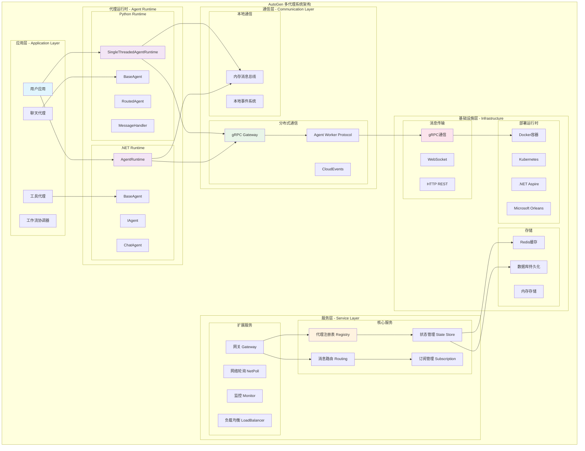
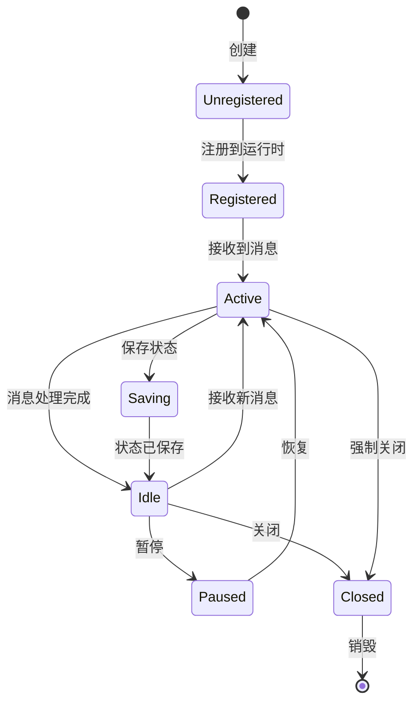
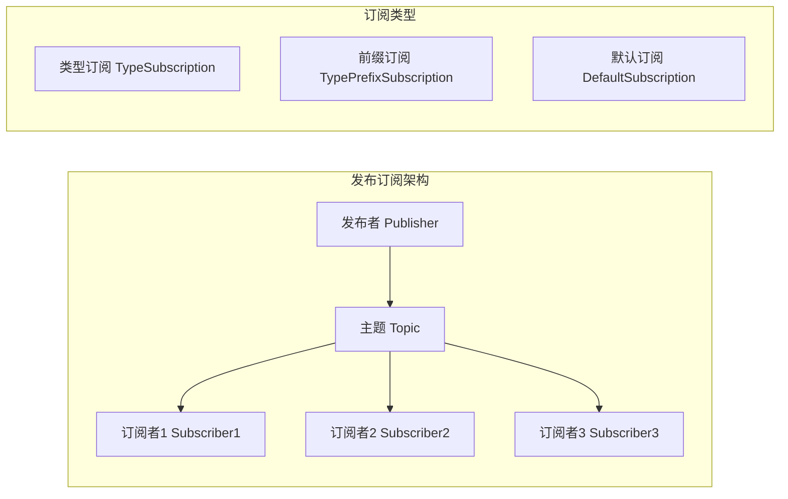
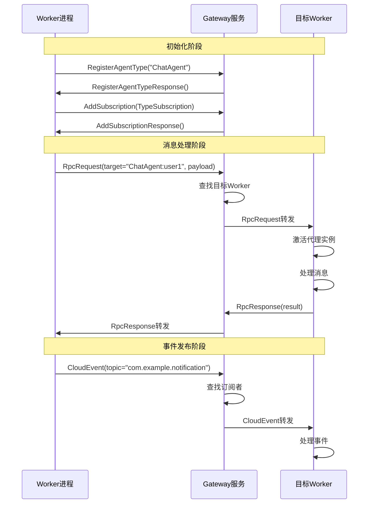
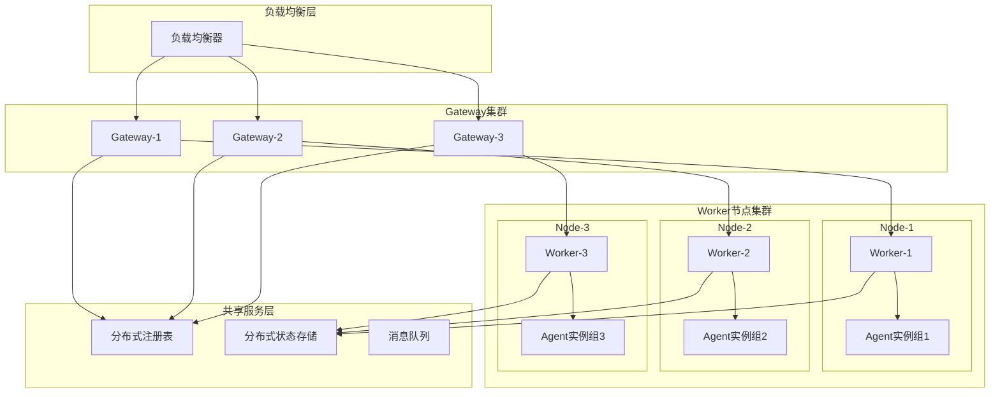
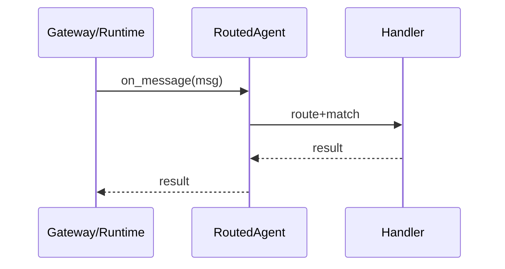
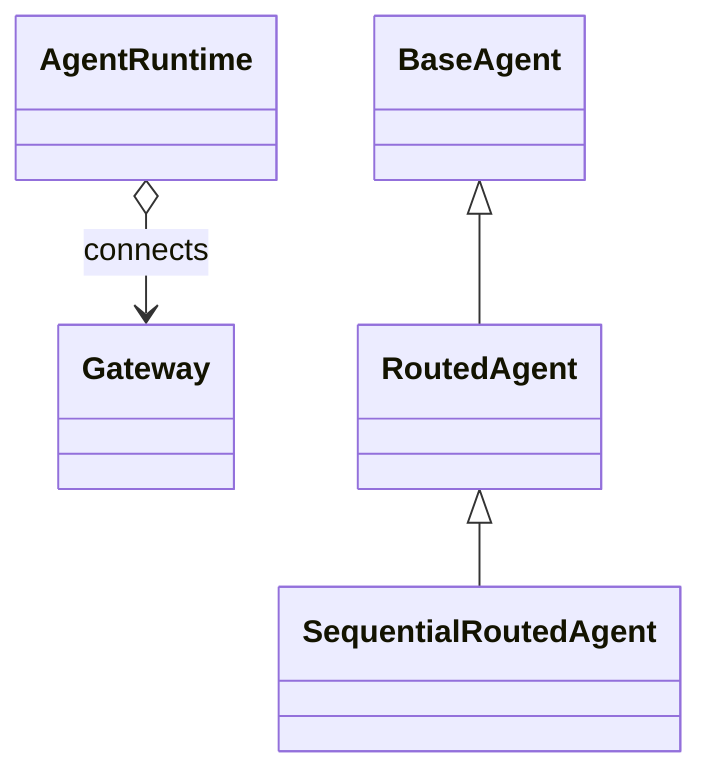

## 概述

AutoGen是Microsoft开发的先进多代理系统框架，采用事件驱动架构，支持分布式部署，提供Python和.NET两种语言实现。深入剖析AutoGen的核心架构、设计原理和关键实现细节。

## 1. 整体架构设计

### 1.1 架构设计理念

AutoGen遵循以下核心设计原则：

- **事件驱动**：基于发布-订阅模式的异步事件处理
- **分布式优先**：天然支持跨进程、跨机器的代理通信  
- **语言无关**：通过标准协议实现跨语言代理互操作
- **可扩展性**：支持动态代理注册和水平扩展
- **状态管理**：内置代理状态持久化和恢复机制

### 1.2 分层架构深度解析

AutoGen采用严格的四层架构设计，每一层都有明确的职责，并构建在下层之上：

#### 核心层 (Core API)
- **基础消息传递**：实现高效的异步消息传递机制
- **事件驱动框架**：基于Actor模型的事件驱动智能体框架
- **运行时管理**：支持本地和分布式运行时环境
- **并行响应式**：支持高度并行和响应式编程模式

```python
# 核心消息传递示例
async def core_message_passing_example():
    # 创建运行时
    runtime = SingleThreadedAgentRuntime()
    
    # 注册代理
    await runtime.register_factory(
        "CoreAgent", 
        lambda: CoreAgent("核心处理代理")
    )
    
    # 异步消息传递
    result = await runtime.send_message(
        message={"task": "process_data", "data": "sample"},
        recipient=AgentId("CoreAgent", "default")
    )
```

#### 扩展层 (Extensions API)  
- **LLM集成**：与OpenAI、Azure OpenAI等模型的无缝集成
- **工具扩展**：代码执行、文件操作、网络访问等工具
- **专业代理**：Web浏览、数据分析、内容生成等专业代理实现

```python
# LLM集成示例
from autogen_ext.models.openai import OpenAIChatCompletionClient

model_client = OpenAIChatCompletionClient(
    model="gpt-4o",
    api_key="your_api_key",
    # 支持模型热切换
    fallback_models=["gpt-3.5-turbo", "claude-3-sonnet"]
)
```

#### 高级API层 (AgentChat API)
- **简化接口**：提供更简单但功能完整的编程接口
- **常见模式**：实现常见的多智能体协作模式
- **配置化开发**：简化智能体配置和交互流程

#### 应用层 (Application Layer)
- **用户应用**：基于AutoGen构建的业务应用
- **AutoGen Studio**：无代码可视化界面
- **预构建应用**：如Magentic-One等开箱即用的应用

### 1.3 系统整体架构图



### 1.4 架构分层说明

#### 应用层 (Application Layer)
- **用户应用**：基于AutoGen构建的具体业务应用
- **聊天代理**：专门处理对话和交互的代理组件
- **工具代理**：集成外部API和工具的代理
- **工作流协调器**：管理复杂多代理协作流程

#### 代理运行时 (Agent Runtime)
- **Python Runtime**：Python语言实现的代理运行时环境
- **.NET Runtime**：.NET语言实现的代理运行时环境
- **跨语言互操作**：通过标准协议实现不同语言代理间通信

#### 通信层 (Communication Layer)
- **本地通信**：同进程内代理间的高效通信机制
- **分布式通信**：基于gRPC的跨进程、跨机器通信

#### 服务层 (Service Layer)  
- **核心服务**：代理注册、消息路由、订阅管理、状态存储
- **扩展服务**：网关、监控、负载均衡等增值服务

#### 基础设施层 (Infrastructure)
- **消息传输**：多种通信协议支持
- **存储**：多层次存储方案
- **部署运行时**：容器化和云原生部署支持

## 2. 核心组件详解

### 2.1 代理抽象模型

#### 代理标识 (AgentId)
```python
@dataclass
class AgentId:
    type: str    # 代理类型，如 "ChatAgent", "ToolAgent"
    key: str     # 代理实例键，如 "user_123", "default"
```

#### 代理生命周期状态


#### 智能体生命周期深度管理

AutoGen实现了完善的智能体生命周期管理机制：

**1. 初始化阶段 (Initialization Phase)**
```python
class AgentLifecycleManager:
    async def initialize_agent(self, agent_config: AgentConfig) -> Agent:
        """智能体初始化流程"""
        # 1. 加载配置和验证
        config = self._validate_config(agent_config)
        
        # 2. 注册能力和工具
        capabilities = await self._register_capabilities(config.capabilities)
        
        # 3. 建立连接池和资源
        connections = await self._establish_connections(config.endpoints)
        
        # 4. 初始化状态存储
        state_store = await self._init_state_store(config.persistence)
        
        # 5. 创建代理实例
        agent = await self._create_agent_instance(config, capabilities, connections, state_store)
        
        return agent
```

**2. 运行阶段 (Runtime Phase)**
```python
class AgentMonitor:
    async def monitor_agent_health(self, agent: Agent) -> HealthStatus:
        """智能体健康监控"""
        # 状态监测
        health_metrics = {
            'memory_usage': await self._check_memory_usage(agent),
            'response_time': await self._measure_response_time(agent),
            'error_rate': await self._calculate_error_rate(agent),
            'connection_status': await self._check_connections(agent)
        }
        
        # 资源调度优化
        if health_metrics['memory_usage'] > 0.8:
            await self._trigger_memory_cleanup(agent)
        
        # 异常处理和自愈
        if health_metrics['error_rate'] > 0.1:
            await self._initiate_error_recovery(agent)
        
        return HealthStatus(metrics=health_metrics)
```

**3. 终止阶段 (Termination Phase)**  
```python
class AgentShutdownManager:
    async def graceful_shutdown(self, agent: Agent) -> None:
        """优雅关闭智能体"""
        # 1. 停止接收新请求
        await agent.stop_accepting_requests()
        
        # 2. 完成正在处理的任务
        await agent.wait_for_pending_tasks(timeout=30.0)
        
        # 3. 保存状态到持久化存储
        await self._save_agent_state(agent)
        
        # 4. 释放资源和连接
        await self._release_resources(agent)
        
        # 5. 清理内存和缓存
        await self._cleanup_memory(agent)
```

### 2.2 事件驱动编程模型

#### CloudEvents事件格式
AutoGen采用[CloudEvents规范](https://cloudevents.io/)作为标准事件格式：

```json
{
  "specversion": "1.0",
  "id": "uuid-1234-5678",
  "source": "agent://ChatAgent/user_123", 
  "type": "com.microsoft.autogen.message.text",
  "datacontenttype": "application/json",
  "time": "2025-09-13T10:30:00Z",
  "data": {
    "content": "Hello, world!",
    "metadata": {}
  }
}
```

#### 订阅模式


### 2.3 通信协议栈

#### Agent Worker Protocol


#### gRPC服务定义
```protobuf
service AgentRpc {
    // 双向流式通信通道
    rpc OpenChannel (stream Message) returns (stream Message);
    
    // 控制通道，用于状态管理
    rpc OpenControlChannel (stream ControlMessage) returns (stream ControlMessage);
    
    // 代理类型注册
    rpc RegisterAgent(RegisterAgentTypeRequest) returns (RegisterAgentTypeResponse);
    
    // 订阅管理
    rpc AddSubscription(AddSubscriptionRequest) returns (AddSubscriptionResponse);
    rpc RemoveSubscription(RemoveSubscriptionRequest) returns (RemoveSubscriptionResponse);
}
```

## 3. 设计模式与最佳实践

### 3.1 核心设计模式

#### 1. 发布-订阅模式 (Pub-Sub Pattern)
- **优势**：解耦发送方和接收方，支持一对多通信
- **实现**：基于Topic的消息路由和订阅匹配
- **应用**：事件通知、广播消息、状态同步

#### 2. 工厂模式 (Factory Pattern)
- **优势**：延迟加载，动态创建代理实例
- **实现**：`AgentFactory`接口和代理注册机制
- **应用**：代理实例化、资源管理

#### 3. 代理模式 (Proxy Pattern)  
- **优势**：远程代理透明访问，生命周期管理
- **实现**：`AgentProxy`类封装远程调用
- **应用**：跨进程代理通信、缓存优化

#### 4. 策略模式 (Strategy Pattern)
- **优势**：可插拔的消息处理策略
- **实现**：`MessageHandler`装饰器和路由策略
- **应用**：消息处理逻辑、序列化策略

### 3.2 并发与性能优化

#### 异步编程模型
```python
# Python异步代理实现
class AsyncChatAgent(RoutedAgent):
    @message_handler
    async def handle_message(self, message: TextMessage, ctx: MessageContext) -> Response:
        # 异步处理消息
        result = await self.process_async(message.content)
        return Response(content=result)
        
    @event  
    async def handle_event(self, event: NotificationEvent, ctx: MessageContext) -> None:
        # 异步处理事件，无返回值
        await self.notify_async(event.data)
```

```csharp
// .NET异步代理实现  
public class AsyncChatAgent : BaseAgent
{
    [MessageHandler]
    public async ValueTask<Response> HandleMessageAsync(TextMessage message, MessageContext context)
    {
        // 异步处理消息
        var result = await ProcessAsync(message.Content);
        return new Response { Content = result };
    }
}
```

#### 性能优化策略

1. **连接池化**：复用gRPC连接，减少建连开销
2. **消息批处理**：批量发送消息，提高吞吐量
3. **序列化优化**：使用Protobuf等高效序列化格式
4. **本地缓存**：代理元数据和状态本地缓存
5. **负载均衡**：智能路由算法分散负载

## 4. 扩展性与可观测性

### 4.1 水平扩展架构



### 4.2 可观测性体系

#### 指标监控 (Metrics)
- **代理指标**：活跃代理数、消息处理量、错误率
- **性能指标**：响应时间、吞吐量、资源使用率  
- **业务指标**：任务完成率、用户满意度

#### 链路追踪 (Tracing)

```mermaid
gantt
    title 消息处理链路追踪
    dateFormat  X
    axisFormat %s
    
    section Gateway
    接收请求    :0, 10
    路由查找    :10, 15
    转发消息    :15, 20
    
    section Worker  
    消息反序列化 :20, 25
    代理激活    :25, 35
    消息处理    :35, 80
    响应序列化  :80, 85
    
    section Agent
    预处理      :35, 40
    核心逻辑    :40, 70
    后处理      :70, 80
```


#### 日志聚合 (Logging)
- **结构化日志**：JSON格式，便于查询分析
- **上下文传播**：TraceId和SpanId传播
- **多级别日志**：Debug/Info/Warn/Error分类

## 5. 部署架构与运维

### 5.1 部署模式

#### 单体部署 (Monolithic)
- **场景**：开发测试、小规模应用
- **特点**：所有组件运行在同一进程
- **优势**：部署简单、调试方便
- **劣势**：扩展性受限、容错能力弱

#### 分布式部署 (Distributed)  
- **场景**：生产环境、大规模应用
- **特点**：组件分离部署、独立扩展
- **优势**：高可用、水平扩展
- **劣势**：复杂性增加、网络延迟

#### 混合部署 (Hybrid)
- **场景**：渐进式迁移、性能优化
- **特点**：关键组件分离、其他组件聚合
- **平衡**：复杂性和性能的权衡

### 5.2 容器化与云原生

#### Docker容器化
```dockerfile
FROM mcr.microsoft.com/dotnet/aspnet:8.0
WORKDIR /app
COPY . .
EXPOSE 5000
ENTRYPOINT ["dotnet", "AutoGen.Host.dll"]
```

#### Kubernetes部署
```yaml
apiVersion: apps/v1
kind: Deployment
metadata:
  name: autogen-gateway
spec:
  replicas: 3
  selector:
    matchLabels:
      app: autogen-gateway
  template:
    metadata:
      labels:
        app: autogen-gateway
    spec:
      containers:
      - name: gateway
        image: autogen/gateway:latest
        ports:
        - containerPort: 5000
        env:
        - name: REDIS_URL
          value: "redis://redis-service:6379"
```

#### .NET Aspire集成
```csharp
var builder = DistributedApplication.CreateBuilder(args);

// 添加Redis缓存
var redis = builder.AddRedis("cache");

// 添加Gateway服务
builder.AddProject<Projects.AutoGen_Gateway>("gateway")
       .WithReference(redis);

// 添加Worker服务  
builder.AddProject<Projects.AutoGen_Worker>("worker")
       .WithReference(redis)
       .WithReplicas(3);

builder.Build().Run();
```

## 6. 安全性与可靠性

### 6.1 安全措施

#### 身份认证与授权
- **JWT Token**：基于Token的无状态认证
- **RBAC模型**：角色基础的访问控制
- **API密钥管理**：外部服务访问控制

#### 通信安全
- **TLS加密**：gRPC通信全程加密
- **证书管理**：自动证书轮换和续期
- **网络隔离**：服务间网络访问控制

#### 数据安全
- **敏感数据加密**：静态数据和传输数据加密
- **审计日志**：完整的操作审计记录
- **数据脱敏**：日志中敏感信息脱敏处理

### 6.2 可靠性保障

#### 错误处理机制
```python
try:
    result = await agent_runtime.send_message(message, recipient)
except CantHandleException:
    # 代理无法处理该消息
    logger.warning(f"Agent {recipient} cannot handle message type {type(message)}")
    return ErrorResponse("Message type not supported")
except UndeliverableException:
    # 消息无法投递
    logger.error(f"Failed to deliver message to {recipient}")
    return ErrorResponse("Message delivery failed")  
except TimeoutException:
    # 处理超时
    logger.error(f"Message processing timeout for {recipient}")
    return ErrorResponse("Processing timeout")
```

#### 容错与恢复
- **断路器模式**：防止级联故障
- **重试机制**：指数退避重试策略
- **故障转移**：自动故障检测和转移
- **状态恢复**：代理状态自动恢复

## 7. 总结

### 7.1 架构优势

AutoGen多代理系统架构具有以下核心优势：

1. **灵活的编程模型**：事件驱动 + 发布订阅，支持复杂的多代理协作
2. **强大的扩展能力**：水平扩展、动态代理注册、插件化架构
3. **跨语言互操作**：标准协议支持，Python/.NET无缝集成
4. **企业级可靠性**：完善的错误处理、状态管理、监控体系
5. **云原生支持**：容器化部署、Kubernetes编排、微服务架构

### 7.2 应用场景

- **智能客服系统**：多轮对话、知识库集成、工单处理
- **内容创作平台**：协作写作、多媒体生成、质量审核  
- **业务流程自动化**：工作流编排、异常处理、决策支持
- **教育培训系统**：个性化辅导、作业批改、学习分析
- **研发协作平台**：代码审核、测试自动化、项目管理

通过深入理解AutoGen的架构设计和实现原理，开发者可以更好地利用这个强大的多代理系统框架，构建智能、可靠、可扩展的AI应用系统。

### 7.3 关键函数：核心代码要点、调用链与时序图（概览）

说明：从架构视角汇总关键执行点，具体实现细节见对应文档。

- 路由与处理（Python）

```python
class RoutedAgent(BaseAgent):
    async def on_message_impl(self, message: Any, ctx: MessageContext) -> Any:
        # 类型路由 → 二次匹配 → 调用处理器 → 异常走降级/抛出
        ...
```

调用链（典型）：

- Gateway/Runtime → RoutedAgent → Handler → 返回

时序图：



### 7.5 关键结构体与类：结构图与继承关系（概览）


