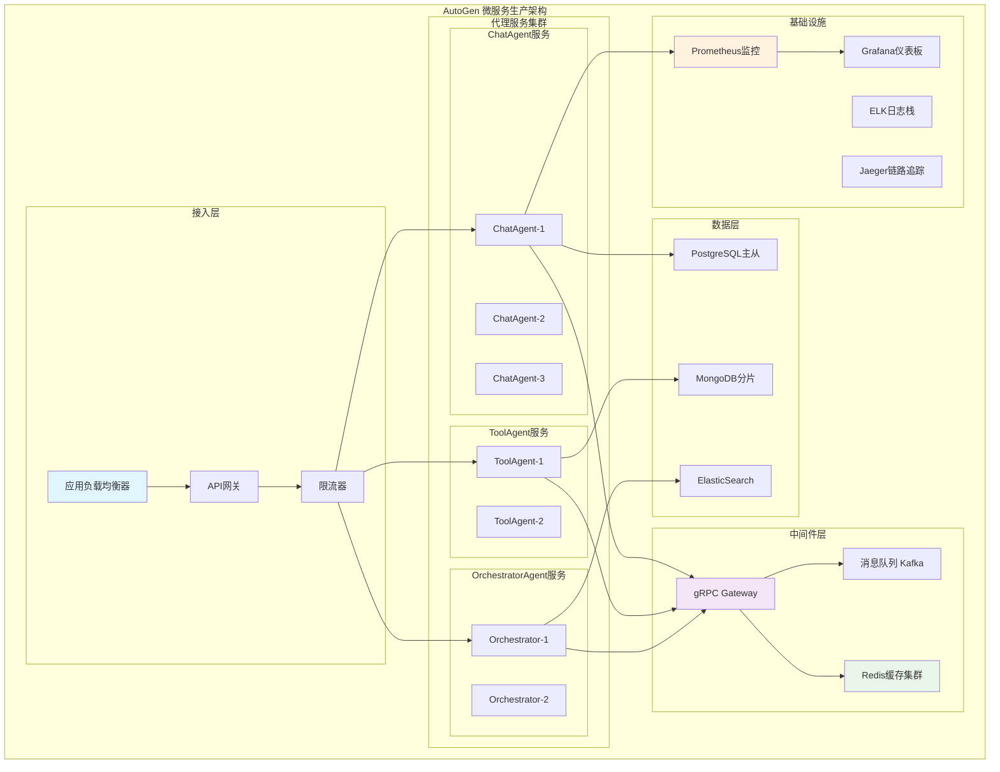
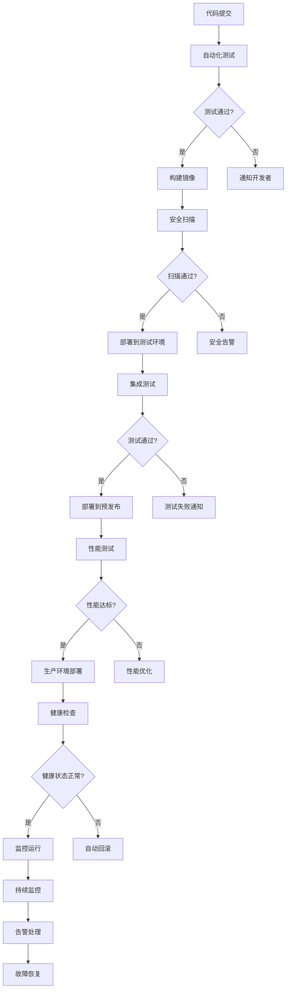
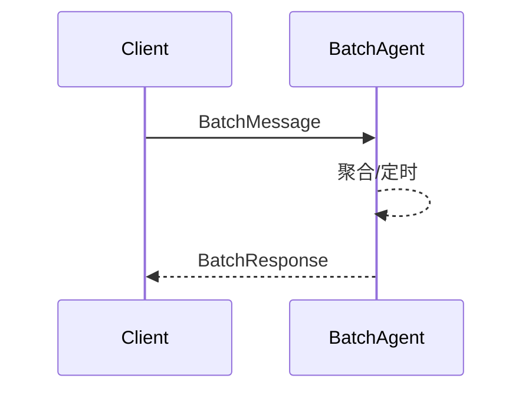
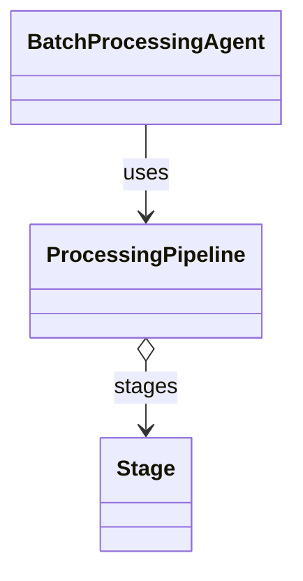

## 概述

析文章的研究和AutoGen源码的剖析，本文总结了AutoGen在生产环境中的最佳实践、性能优化策略和真实应用案例，为开发者提供从开发到部署的完整指导。

## 1. 生产环境架构模式

### 1.1 微服务架构模式



### 1.2 Kubernetes部署配置

```yaml
# autogen-deployment.yaml
apiVersion: apps/v1
kind: Deployment
metadata:
  name: autogen-chat-agent
  namespace: autogen-prod
spec:
  replicas: 5
  strategy:
    type: RollingUpdate
    rollingUpdate:
      maxSurge: 1
      maxUnavailable: 1
  selector:
    matchLabels:
      app: autogen-chat-agent
  template:
    metadata:
      labels:
        app: autogen-chat-agent
      annotations:
        prometheus.io/scrape: "true"
        prometheus.io/port: "8080"
    spec:
      containers:
      - name: chat-agent
        image: autogen/chat-agent:v1.2.0
        ports:
        - containerPort: 5000
          name: grpc
        - containerPort: 8080
          name: metrics
        env:
        - name: REDIS_CONNECTION
          valueFrom:
            secretKeyRef:
              name: autogen-secrets
              key: redis-connection
        - name: DATABASE_URL
          valueFrom:
            secretKeyRef:
              name: autogen-secrets
              key: database-url
        resources:
          requests:
            memory: "512Mi"
            cpu: "200m"
          limits:
            memory: "1Gi"
            cpu: "500m"
        livenessProbe:
          grpc:
            port: 5000
          initialDelaySeconds: 30
          periodSeconds: 10
        readinessProbe:
          grpc:
            port: 5000
          initialDelaySeconds: 5
          periodSeconds: 5
---
apiVersion: v1
kind: Service
metadata:
  name: autogen-chat-agent-service
  namespace: autogen-prod
spec:
  selector:
    app: autogen-chat-agent
  ports:
  - name: grpc
    port: 5000
    targetPort: 5000
  - name: metrics
    port: 8080
    targetPort: 8080
  type: ClusterIP
---
apiVersion: networking.k8s.io/v1
kind: Ingress
metadata:
  name: autogen-ingress
  namespace: autogen-prod
  annotations:
    kubernetes.io/ingress.class: nginx
    nginx.ingress.kubernetes.io/grpc-backend: "true"
spec:
  tls:
  - hosts:
    - autogen.example.com
    secretName: autogen-tls
  rules:
  - host: autogen.example.com
    http:
      paths:
      - path: /
        pathType: Prefix
        backend:
          service:
            name: autogen-chat-agent-service
            port:
              number: 5000
```

## 2. 性能优化实战

### 2.1 消息处理性能优化

#### 批处理优化策略

```python
class BatchProcessingAgent(RoutedAgent):
    """批处理优化代理 - 提高消息处理吞吐量"""
    
    def __init__(self, batch_size: int = 100, batch_timeout: float = 1.0):
        super().__init__("批处理优化代理")
        self.batch_size = batch_size
        self.batch_timeout = batch_timeout
        self.message_batch = []
        self.batch_lock = asyncio.Lock()
        self.batch_timer = None
    
    @message_handler
    async def handle_batch_message(self, message: BatchMessage, ctx: MessageContext) -> BatchResponse:
        """批量消息处理"""
        async with self.batch_lock:
            self.message_batch.append((message, ctx))
            
            # 达到批次大小或第一条消息时启动定时器
            if len(self.message_batch) == 1:
                self.batch_timer = asyncio.create_task(self._batch_timeout_handler())
            
            # 批次满了，立即处理
            if len(self.message_batch) >= self.batch_size:
                return await self._process_batch()
        
        # 等待批次处理完成
        return await self._wait_for_batch_result(message.id)
    
    async def _process_batch(self) -> BatchResponse:
        """处理批次消息"""
        if not self.message_batch:
            return BatchResponse(results=[])
        
        batch_to_process = self.message_batch.copy()
        self.message_batch.clear()
        
        # 取消定时器
        if self.batch_timer and not self.batch_timer.done():
            self.batch_timer.cancel()
        
        # 并行处理批次中的所有消息
        tasks = [
            self._process_single_message(msg, ctx) 
            for msg, ctx in batch_to_process
        ]
        
        results = await asyncio.gather(*tasks, return_exceptions=True)
        
        return BatchResponse(
            results=results,
            batch_size=len(batch_to_process),
            processing_time=time.time()
        )
    
    async def _batch_timeout_handler(self):
        """批次超时处理"""
        try:
            await asyncio.sleep(self.batch_timeout)
            async with self.batch_lock:
                if self.message_batch:
                    await self._process_batch()
        except asyncio.CancelledError:
            pass  # 定时器被取消，正常情况
```

#### 内存池优化

```python
class MemoryPoolManager:
    """内存池管理器 - 减少GC压力，提高性能"""
    
    def __init__(self, pool_size: int = 1000):
        self.message_pool = asyncio.Queue(maxsize=pool_size)
        self.context_pool = asyncio.Queue(maxsize=pool_size)
        self.response_pool = asyncio.Queue(maxsize=pool_size)
        
        # 预先填充对象池
        self._initialize_pools()
    
    def _initialize_pools(self):
        """初始化对象池"""
        for _ in range(100):  # 预创建100个对象
            self.message_pool.put_nowait(self._create_message_object())
            self.context_pool.put_nowait(self._create_context_object())
            self.response_pool.put_nowait(self._create_response_object())
    
    async def get_message_object(self) -> MessageObject:
        """从池中获取消息对象"""
        try:
            obj = self.message_pool.get_nowait()
            obj.reset()  # 重置对象状态
            return obj
        except asyncio.QueueEmpty:
            # 池为空，创建新对象
            return self._create_message_object()
    
    async def return_message_object(self, obj: MessageObject):
        """归还消息对象到池中"""
        try:
            self.message_pool.put_nowait(obj)
        except asyncio.QueueFull:
            # 池满了，让对象被GC回收
            pass

# 使用示例
memory_pool = MemoryPoolManager()

class OptimizedAgent(RoutedAgent):
    @message_handler  
    async def handle_optimized_message(self, message: Any, ctx: MessageContext) -> Any:
        # 从对象池获取工作对象
        work_obj = await memory_pool.get_message_object()
        
        try:
            # 使用对象处理消息
            result = await self.process_with_pooled_object(message, work_obj)
            return result
        finally:
            # 归还对象到池中
            await memory_pool.return_message_object(work_obj)
```

### 2.2 缓存策略优化

```python
class IntelligentCachingAgent(RoutedAgent):
    """智能缓存代理 - 实现多层缓存策略"""
    
    def __init__(self):
        super().__init__("智能缓存代理")
        # L1: 本地内存缓存 (最快)
        self.l1_cache = TTLCache(maxsize=1000, ttl=300)  # 5分钟TTL
        
        # L2: Redis分布式缓存 (快)  
        self.l2_cache = redis.Redis(host='redis-cluster')
        
        # L3: 数据库缓存 (慢)
        self.l3_cache = DatabaseCache()
        
        # 缓存命中率统计
        self.cache_stats = {
            'l1_hits': 0, 'l1_misses': 0,
            'l2_hits': 0, 'l2_misses': 0,
            'l3_hits': 0, 'l3_misses': 0
        }
    
    async def get_cached_data(self, cache_key: str) -> Optional[Any]:
        """多层缓存数据获取"""
        
        # L1 缓存检查
        if cache_key in self.l1_cache:
            self.cache_stats['l1_hits'] += 1
            return self.l1_cache[cache_key]
        self.cache_stats['l1_misses'] += 1
        
        # L2 缓存检查
        l2_data = await self.l2_cache.get(cache_key)
        if l2_data:
            self.cache_stats['l2_hits'] += 1
            # 回填L1缓存
            self.l1_cache[cache_key] = pickle.loads(l2_data)
            return self.l1_cache[cache_key]
        self.cache_stats['l2_misses'] += 1
        
        # L3 缓存检查
        l3_data = await self.l3_cache.get(cache_key)
        if l3_data:
            self.cache_stats['l3_hits'] += 1
            # 回填L2和L1缓存
            await self.l2_cache.setex(cache_key, 3600, pickle.dumps(l3_data))  # 1小时
            self.l1_cache[cache_key] = l3_data
            return l3_data
        self.cache_stats['l3_misses'] += 1
        
        return None
    
    async def set_cached_data(self, cache_key: str, data: Any, ttl: int = 3600):
        """多层缓存数据设置"""
        # 同时设置所有层级的缓存
        self.l1_cache[cache_key] = data
        await self.l2_cache.setex(cache_key, ttl, pickle.dumps(data))
        await self.l3_cache.set(cache_key, data, ttl)
    
    async def get_cache_statistics(self) -> Dict[str, Any]:
        """获取缓存统计信息"""
        total_requests = sum(self.cache_stats.values())
        if total_requests == 0:
            return {'overall_hit_rate': 0}
        
        l1_hit_rate = self.cache_stats['l1_hits'] / total_requests
        l2_hit_rate = self.cache_stats['l2_hits'] / total_requests  
        l3_hit_rate = self.cache_stats['l3_hits'] / total_requests
        
        return {
            'l1_hit_rate': l1_hit_rate,
            'l2_hit_rate': l2_hit_rate,
            'l3_hit_rate': l3_hit_rate,
            'overall_hit_rate': l1_hit_rate + l2_hit_rate + l3_hit_rate,
            'total_requests': total_requests,
            'cache_stats': self.cache_stats
        }
```

## 3. 真实案例研究

### 3.1 智能客服系统案例

#### 系统架构

```python
class IntelligentCustomerServiceSystem:
    """智能客服系统 - 通过...实现"""
    
    def __init__(self):
        self.runtime = SingleThreadedAgentRuntime()
        self.agents = {}
        self.conversation_manager = ConversationManager()
        self.knowledge_base = KnowledgeBaseAgent()
        
    async def setup_agents(self):
        """设置客服系统的各类代理"""
        
        # 1. 路由代理 - 负责客户请求分类和路由
        router_agent = CustomerServiceRouter(
            name="router",
            model_client=self._create_model_client(),
            classification_rules=self._load_classification_rules()
        )
        
        # 2. 知识库代理 - 负责FAQ和知识检索
        knowledge_agent = KnowledgeBaseAgent(
            name="knowledge",
            vector_store=self._create_vector_store(),
            search_engine=self._create_search_engine()
        )
        
        # 3. 人工客服代理 - 处理复杂问题
        human_agent = HumanEscalationAgent(
            name="human_support",
            escalation_queue=self._create_escalation_queue()
        )
        
        # 4. 质量监控代理 - 监控对话质量
        quality_agent = QualityMonitorAgent(
            name="quality_monitor",
            sentiment_analyzer=self._create_sentiment_analyzer()
        )
        
        # 注册所有代理
        agents = [router_agent, knowledge_agent, human_agent, quality_agent]
        for agent in agents:
            await agent.register(self.runtime, agent.name, lambda a=agent: a)
            self.agents[agent.name] = agent
    
    async def handle_customer_inquiry(self, customer_id: str, inquiry: str) -> CustomerServiceResponse:
        """处理客户咨询的完整流程"""
        
        conversation_id = f"conv_{customer_id}_{int(time.time())}"
        
        # 1. 路由分类
        routing_result = await self.agents['router'].classify_inquiry(inquiry)
        
        # 2. 根据分类结果选择处理策略
        if routing_result.category == "faq":
            # 知识库查询
            knowledge_result = await self.agents['knowledge'].search_knowledge(inquiry)
            if knowledge_result.confidence > 0.8:
                response = CustomerServiceResponse(
                    conversation_id=conversation_id,
                    response_type="knowledge_base",
                    content=knowledge_result.answer,
                    confidence=knowledge_result.confidence
                )
            else:
                # 转人工
                response = await self._escalate_to_human(customer_id, inquiry, conversation_id)
        
        elif routing_result.category == "technical":
            # 技术支持流程
            response = await self._handle_technical_support(customer_id, inquiry, conversation_id)
        
        elif routing_result.category == "complaint":
            # 投诉处理流程
            response = await self._handle_complaint(customer_id, inquiry, conversation_id)
        
        else:
            # 默认处理
            response = await self._handle_general_inquiry(customer_id, inquiry, conversation_id)
        
        # 3. 质量监控和反馈
        await self.agents['quality_monitor'].analyze_interaction(conversation_id, inquiry, response)
        
        return response

class CustomerServiceRouter(RoutedAgent):
    """客服路由代理 - 智能分类客户请求"""
    
    def __init__(self, name: str, model_client, classification_rules: Dict[str, Any]):
        super().__init__("客服请求路由和分类专家")
        self.model_client = model_client
        self.classification_rules = classification_rules
        self.classification_cache = TTLCache(maxsize=10000, ttl=3600)  # 1小时缓存
    
    async def classify_inquiry(self, inquiry: str) -> ClassificationResult:
        """
        智能分类客户咨询
        
        使用机器学习模型和规则引擎相结合的方式，
        准确识别客户咨询的类型和紧急程度
        """
        
        # 检查缓存
        cache_key = hashlib.md5(inquiry.encode()).hexdigest()
        if cache_key in self.classification_cache:
            return self.classification_cache[cache_key]
        
        # 预处理查询
        processed_inquiry = await self._preprocess_inquiry(inquiry)
        
        # 规则引擎快速分类
        rule_result = await self._apply_classification_rules(processed_inquiry)
        if rule_result.confidence > 0.9:
            self.classification_cache[cache_key] = rule_result
            return rule_result
        
        # 使用LLM进行智能分类
        llm_result = await self._llm_classify(processed_inquiry)
        
        # 结合规则和LLM结果
        final_result = await self._combine_classification_results(rule_result, llm_result)
        
        # 缓存结果
        self.classification_cache[cache_key] = final_result
        
        return final_result
    
    async def _preprocess_inquiry(self, inquiry: str) -> str:
        """预处理客户咨询"""
        # 1. 文本清理
        cleaned = re.sub(r'[^\w\s]', ' ', inquiry)
        cleaned = ' '.join(cleaned.split())
        
        # 2. 敏感信息脱敏
        cleaned = self._mask_sensitive_info(cleaned)
        
        # 3. 标准化处理
        cleaned = cleaned.lower().strip()
        
        return cleaned
    
    async def _apply_classification_rules(self, inquiry: str) -> ClassificationResult:
        """应用分类规则引擎"""
        
        # 关键词匹配规则
        for category, rules in self.classification_rules.items():
            for rule in rules['keywords']:
                if rule['pattern'] in inquiry:
                    return ClassificationResult(
                        category=category,
                        confidence=rule['confidence'],
                        matched_rule=rule['pattern'],
                        urgency=rules.get('default_urgency', 'normal')
                    )
        
        # 默认分类
        return ClassificationResult(
            category='general',
            confidence=0.3,
            matched_rule='default',
            urgency='normal'
        )
    
    async def _llm_classify(self, inquiry: str) -> ClassificationResult:
        """使用LLM进行智能分类"""
        
        classification_prompt = f"""
        请分析以下客户咨询，并分类到合适的类别：

        咨询内容: {inquiry}

        可选类别:
        - faq: 常见问题
        - technical: 技术支持
        - billing: 账单问题
        - complaint: 投诉建议
        - sales: 销售咨询
        - general: 一般咨询

        请以JSON格式返回分类结果，包含：
        - category: 分类类别
        - confidence: 置信度 (0-1)
        - reasoning: 分类理由
        - urgency: 紧急程度 (low/normal/high/critical)
        """
        
        response = await self.model_client.create([
            SystemMessage("你是专业的客服分类专家，能够准确识别客户需求类型"),
            UserMessage(classification_prompt)
        ])
        
        # 解析LLM响应
        try:
            result_data = json.loads(response.content)
            return ClassificationResult(
                category=result_data['category'],
                confidence=result_data['confidence'],
                reasoning=result_data['reasoning'],
                urgency=result_data['urgency']
            )
        except Exception as e:
            logger.warning(f"LLM分类结果解析失败: {e}")
            return ClassificationResult(category='general', confidence=0.5)
```

### 3.2 内容创作平台案例

```python
class ContentCreationPlatform:
    """内容创作平台 - 多代理协作的内容生成系统"""
    
    def __init__(self):
        self.writer_team = self._create_writer_team()
        self.review_team = self._create_review_team()
        self.publishing_agent = self._create_publishing_agent()
    
    async def create_content(self, content_request: ContentRequest) -> ContentCreationResult:
        """完整的内容创作流程"""
        
        # 阶段1: 内容规划
        planning_result = await self._plan_content(content_request)
        
        # 阶段2: 协作写作
        writing_result = await self._collaborative_writing(planning_result)
        
        # 阶段3: 多轮审核
        review_result = await self._multi_round_review(writing_result)
        
        # 阶段4: 发布准备
        publishing_result = await self._prepare_for_publishing(review_result)
        
        return ContentCreationResult(
            content_id=content_request.id,
            final_content=publishing_result.content,
            metadata=publishing_result.metadata,
            creation_pipeline=self._build_creation_pipeline_summary()
        )
    
    def _create_writer_team(self) -> WriterTeam:
        """创建写作团队"""
        return WriterTeam([
            SpecialistWriter("researcher", specialty="研究和事实核查"),
            SpecialistWriter("creative", specialty="创意和叙述"),
            SpecialistWriter("technical", specialty="技术写作"),
            SpecialistWriter("editor", specialty="编辑和润色")
        ])
    
    async def _collaborative_writing(self, planning_result: PlanningResult) -> WritingResult:
        """协作写作过程"""
        
        # 并行分配写作任务
        writing_tasks = []
        for section in planning_result.sections:
            # 根据章节类型选择最合适的写作专家
            specialist = self._select_writing_specialist(section.type)
            
            task = asyncio.create_task(
                specialist.write_section(
                    section_plan=section,
                    style_guide=planning_result.style_guide,
                    context=planning_result.context
                )
            )
            writing_tasks.append((section.id, task))
        
        # 等待所有写作任务完成
        section_results = {}
        for section_id, task in writing_tasks:
            try:
                result = await task
                section_results[section_id] = result
            except Exception as e:
                logger.error(f"章节 {section_id} 写作失败: {e}")
                # 分配给备用写作者
                section_results[section_id] = await self._fallback_writing(section_id, planning_result)
        
        # 整合所有章节
        integrated_content = await self._integrate_sections(section_results, planning_result)
        
        return WritingResult(
            content=integrated_content,
            sections=section_results,
            word_count=len(integrated_content.split()),
            estimated_reading_time=self._calculate_reading_time(integrated_content)
        )
```

## 4. 监控和运维实践

### 4.1 全链路监控体系

```python
class AutoGenObservabilityStack:
    """AutoGen可观测性技术栈"""
    
    def __init__(self):
        self.metrics_collector = PrometheusMetricsCollector()
        self.trace_collector = JaegerTraceCollector()
        self.log_aggregator = ElasticsearchLogAggregator()
        self.alert_manager = AlertManager()
    
    async def setup_comprehensive_monitoring(self, runtime: AgentRuntime):
        """设置全面的监控体系"""
        
        # 1. 设置性能指标收集
        await self._setup_performance_metrics(runtime)
        
        # 2. 设置分布式链路追踪
        await self._setup_distributed_tracing(runtime)
        
        # 3. 设置结构化日志收集
        await self._setup_structured_logging(runtime)
        
        # 4. 设置智能告警
        await self._setup_intelligent_alerting(runtime)
    
    async def _setup_performance_metrics(self, runtime: AgentRuntime):
        """设置性能指标收集"""
        
        # 代理级指标
        agent_metrics = [
            'agent_message_count',          # 消息处理数量
            'agent_response_time',          # 响应时间
            'agent_error_rate',             # 错误率
            'agent_cpu_usage',              # CPU使用率
            'agent_memory_usage'            # 内存使用率
        ]
        
        # 运行时指标
        runtime_metrics = [
            'runtime_active_agents',        # 活跃代理数
            'runtime_message_queue_size',   # 消息队列大小
            'runtime_throughput',           # 吞吐量
            'runtime_connection_count'      # 连接数
        ]
        
        # 业务指标
        business_metrics = [
            'customer_satisfaction_score',  # 客户满意度
            'issue_resolution_rate',        # 问题解决率
            'average_handling_time',        # 平均处理时间
            'escalation_rate'               # 升级率
        ]
        
        for metric in agent_metrics + runtime_metrics + business_metrics:
            await self.metrics_collector.register_metric(metric)
    
    async def _setup_distributed_tracing(self, runtime: AgentRuntime):
        """设置分布式链路追踪"""
        
        # 在代理运行时中注入追踪中间件
        tracing_middleware = TracingMiddleware(
            tracer=self.trace_collector.get_tracer("autogen"),
            service_name="autogen-customer-service"
        )
        
        runtime.add_middleware(tracing_middleware)
        
        # 设置追踪采样策略
        sampling_config = {
            'error_traces': 1.0,      # 100%采样错误链路
            'slow_traces': 1.0,       # 100%采样慢链路 (>2s)
            'normal_traces': 0.1      # 10%采样正常链路
        }
        
        await self.trace_collector.configure_sampling(sampling_config)

class TracingMiddleware:
    """链路追踪中间件"""
    
    def __init__(self, tracer, service_name: str):
        self.tracer = tracer
        self.service_name = service_name
    
    async def __call__(self, message: Any, context: MessageContext, next_handler):
        """中间件处理逻辑"""
        
        # 开始追踪span
        with self.tracer.start_as_current_span(
            name=f"{self.service_name}.message_processing",
            attributes={
                "agent.id": str(context.sender) if context.sender else "unknown",
                "message.type": type(message).__name__,
                "message.id": context.message_id
            }
        ) as span:
            try:
                # 执行下一个处理器
                result = await next_handler(message, context)
                
                # 记录成功指标
                span.set_attribute("processing.success", True)
                span.set_attribute("processing.duration", time.time() - span.start_time)
                
                return result
            
            except Exception as e:
                # 记录错误信息
                span.set_attribute("processing.success", False)
                span.set_attribute("error.type", type(e).__name__)
                span.set_attribute("error.message", str(e))
                span.record_exception(e)
                
                raise
```

### 4.2 自动化运维

```python
class AutoGenDevOpsManager:
    """AutoGen DevOps自动化管理器"""
    
    def __init__(self):
        self.deployment_manager = KubernetesDeploymentManager()
        self.monitoring_stack = ObservabilityStack()
        self.incident_manager = IncidentManager()
    
    async def automated_deployment_pipeline(self, version: str, config: DeploymentConfig):
        """自动化部署流水线"""
        
        try:
            # 1. 预部署验证
            validation_result = await self._pre_deployment_validation(version, config)
            if not validation_result.is_valid:
                raise DeploymentException(f"预部署验证失败: {validation_result.errors}")
            
            # 2. 蓝绿部署
            await self._blue_green_deployment(version, config)
            
            # 3. 健康检查
            health_check_result = await self._comprehensive_health_check()
            if not health_check_result.is_healthy:
                # 自动回滚
                await self._automated_rollback()
                raise DeploymentException("健康检查失败，已自动回滚")
            
            # 4. 流量切换
            await self._gradual_traffic_switch(config.traffic_switch_strategy)
            
            # 5. 后部署监控
            await self._post_deployment_monitoring(version)
            
        except Exception as e:
            # 记录部署失败事件
            await self.incident_manager.create_incident(
                title=f"部署失败: {version}",
                description=str(e),
                severity="critical"
            )
            raise
    
    async def _blue_green_deployment(self, version: str, config: DeploymentConfig):
        """蓝绿部署实现"""
        
        # 1. 部署绿色环境
        green_deployment = await self.deployment_manager.deploy_environment(
            version=version,
            environment="green",
            config=config
        )
        
        # 2. 等待绿色环境就绪
        await self.deployment_manager.wait_for_ready(green_deployment, timeout=300)
        
        # 3. 在绿色环境上运行集成测试
        test_result = await self._run_integration_tests(green_deployment)
        if not test_result.all_passed:
            await self.deployment_manager.cleanup_environment(green_deployment)
            raise DeploymentException("集成测试失败")
        
        # 4. 切换流量到绿色环境
        await self.deployment_manager.switch_traffic_to_green()
        
        # 5. 监控一段时间后清理蓝色环境
        await asyncio.sleep(600)  # 监控10分钟
        await self.deployment_manager.cleanup_blue_environment()
    
    async def _comprehensive_health_check(self) -> HealthCheckResult:
        """全面健康检查"""
        
        health_checks = [
            self._check_agent_runtime_health(),
            self._check_grpc_connections_health(), 
            self._check_database_health(),
            self._check_cache_health(),
            self._check_message_queue_health()
        ]
        
        results = await asyncio.gather(*health_checks, return_exceptions=True)
        
        overall_health = HealthCheckResult()
        for result in results:
            if isinstance(result, Exception):
                overall_health.add_failure(str(result))
            elif not result.is_healthy:
                overall_health.add_failure(result.error_message)
        
        return overall_health
```

## 5. 故障排查和调试

### 5.1 分布式调试工具

```python
class DistributedDebuggingToolkit:
    """分布式调试工具包"""
    
    def __init__(self):
        self.trace_analyzer = TraceAnalyzer()
        self.log_analyzer = LogAnalyzer()
        self.metric_analyzer = MetricAnalyzer()
    
    async def diagnose_performance_issue(self, issue_description: str) -> DiagnosisReport:
        """诊断性能问题"""
        
        # 1. 收集相关追踪数据
        traces = await self.trace_analyzer.get_traces_for_timeframe(
            start_time=datetime.utcnow() - timedelta(hours=1),
            filter_criteria={'error': True, 'duration': '>2s'}
        )
        
        # 2. 分析慢查询
        slow_traces = [t for t in traces if t.duration > 2.0]
        if slow_traces:
            slow_analysis = await self._analyze_slow_traces(slow_traces)
        
        # 3. 检查错误模式
        error_patterns = await self._analyze_error_patterns(traces)
        
        # 4. 分析资源使用情况
        resource_analysis = await self.metric_analyzer.analyze_resource_usage()
        
        # 5. 生成诊断报告
        diagnosis = DiagnosisReport(
            issue_description=issue_description,
            slow_trace_analysis=slow_analysis,
            error_patterns=error_patterns,
            resource_analysis=resource_analysis,
            recommendations=await self._generate_recommendations(slow_analysis, error_patterns)
        )
        
        return diagnosis
    
    async def _analyze_slow_traces(self, slow_traces: List[Trace]) -> SlowTraceAnalysis:
        """分析慢链路"""
        
        analysis = SlowTraceAnalysis()
        
        # 按操作类型分组
        operations = defaultdict(list)
        for trace in slow_traces:
            operations[trace.operation_name].append(trace)
        
        # 找出最慢的操作
        for operation, traces in operations.items():
            avg_duration = sum(t.duration for t in traces) / len(traces)
            analysis.slow_operations[operation] = {
                'average_duration': avg_duration,
                'count': len(traces),
                'slowest_trace': max(traces, key=lambda t: t.duration)
            }
        
        # 分析瓶颈点
        bottlenecks = await self._identify_bottlenecks(slow_traces)
        analysis.bottlenecks = bottlenecks
        
        return analysis
```

## 6. 总结与最佳实践

### 6.1 生产环境部署清单

#### 基础设施准备
- ✅ **容器化**：Docker镜像优化，多阶段构建
- ✅ **编排平台**：Kubernetes集群配置和资源限制
- ✅ **网络安全**：TLS证书、网络策略、防火墙规则
- ✅ **存储配置**：持久化卷、备份策略、数据加密

#### 监控告警体系
- ✅ **指标监控**：Prometheus + Grafana仪表板
- ✅ **链路追踪**：Jaeger分布式追踪
- ✅ **日志聚合**：ELK技术栈
- ✅ **告警规则**：多级告警和自动化响应

#### 性能优化配置
- ✅ **连接池**：gRPC连接池和HTTP客户端池
- ✅ **缓存策略**：多级缓存和智能失效
- ✅ **消息优化**：批处理和压缩传输
- ✅ **资源管理**：内存池和垃圾回收调优

### 6.2 开发运维一体化



### 6.3 关键性能指标 (KPI)

#### 技术指标
- **响应时间**: P95 < 2秒，P99 < 5秒
- **吞吐量**: 每秒处理1000+消息
- **错误率**: < 0.1%
- **可用性**: 99.9%+
- **资源利用率**: CPU < 70%, 内存 < 80%

#### 业务指标  
- **任务成功率**: > 95%
- **用户满意度**: > 4.5/5.0
- **平均解决时间**: < 30分钟
- **自动化处理率**: > 80%

### 6.4 附录：关键函数与调用链/时序图

- 批处理聚合（示意）

```python
class BatchProcessingAgent(RoutedAgent):
    @message_handler
    async def handle_batch_message(self, message: BatchMessage, ctx: MessageContext) -> BatchResponse:
        # 入队聚合 → 触发超时/满额 → 并行处理 → 汇总返回/错误通知
        ...
```

调用链（典型）：

- Client → 入队 → 触发处理 → 并行阶段 → 汇总返回

时序图：



### 6.5 附录：关键结构体与类图


