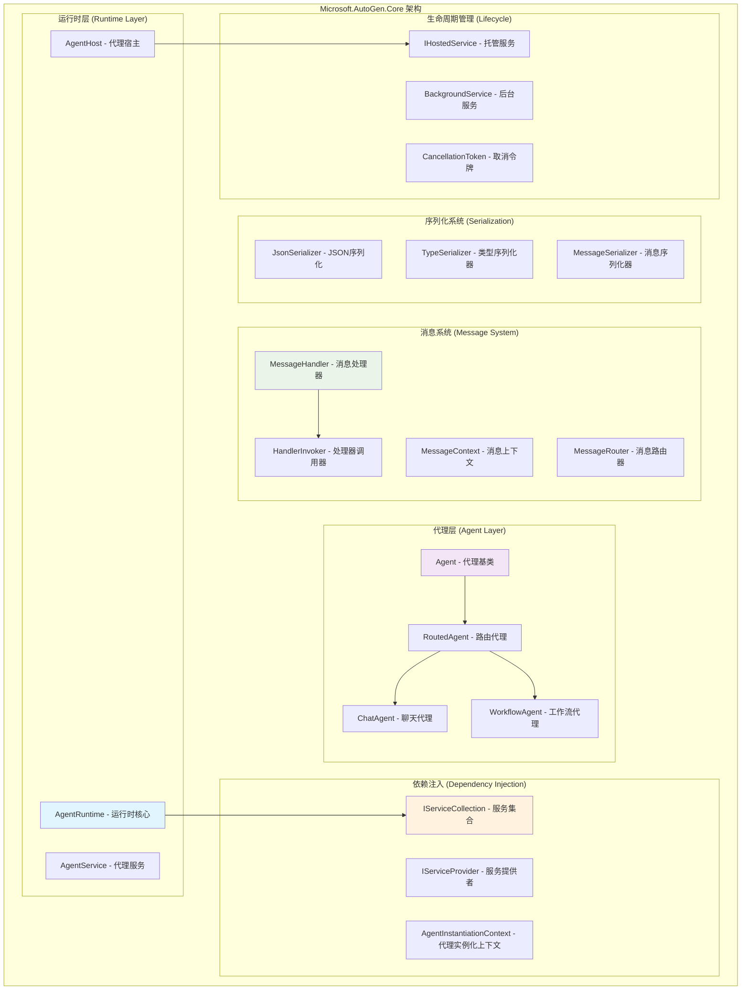
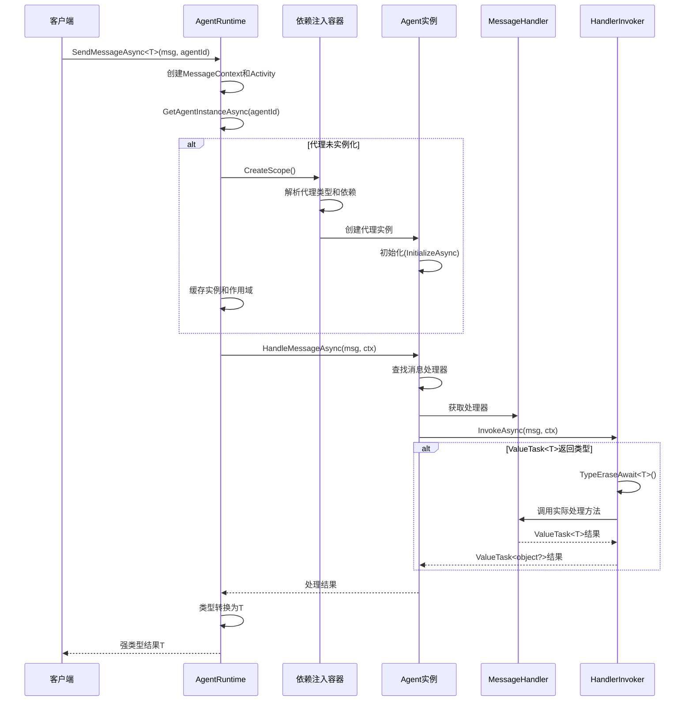
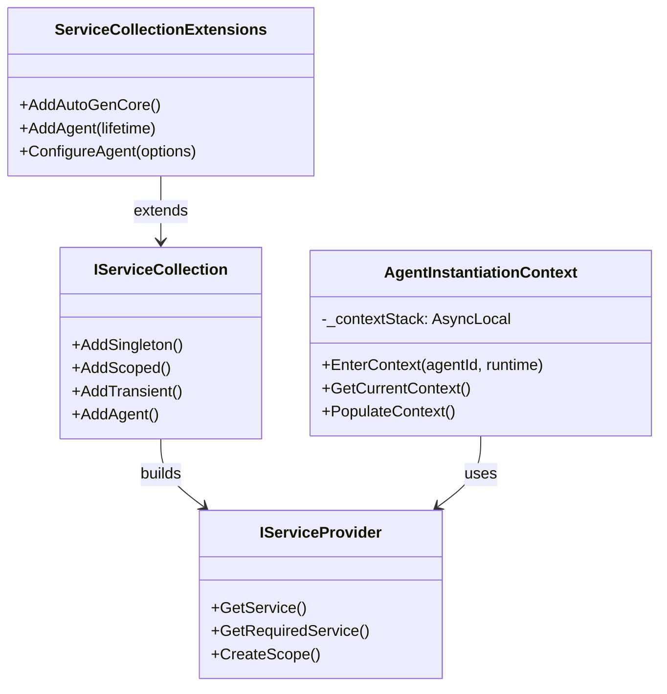
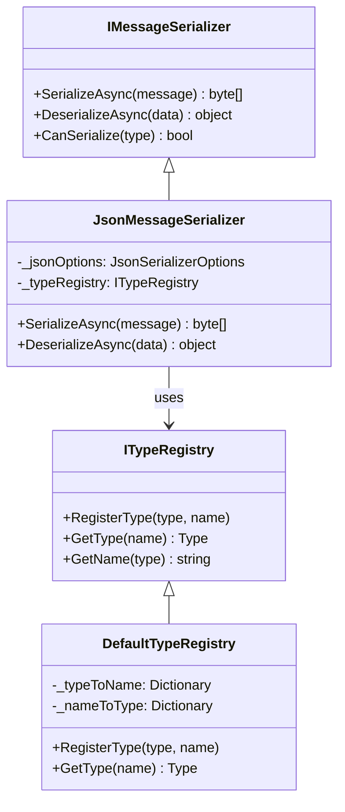

## 概述

`Microsoft.AutoGen.Core`是AutoGen .NET实现的核心包，提供了基于.NET生态的多代理系统基础架构。本文档深入分析其核心组件设计、消息路由机制和依赖注入系统，提供完整的API参考和源码解析。

### 核心架构图

<div class="mermaid-image-container" data-chart-id="autogen-dotnet-core-analysis-1">
  
  <div class="mermaid-fallback" style="display: none;">
    <details>
      <summary>显示 Mermaid 源码</summary>
      <pre class="mermaid">graph TB
    subgraph "Microsoft.AutoGen.Core 架构"
        subgraph "运行时层 Runtime Layer"
            IAR[IAgentRuntime - 运行时接口]
            IPR[InProcessRuntime - 进程内运行时]
            GR[GrpcRuntime - gRPC运行时]
            AH[AgentHost - 代理宿主]
        end
        
        subgraph "代理抽象层 Agent Abstraction"
            IHA[IHostableAgent - 可托管代理接口]
            BA[BaseAgent - 代理基类]
            CA[ChatAgent - 聊天代理]
            WA[WorkflowAgent - 工作流代理]
        end
        
        subgraph "消息处理层 Message Processing"
            IH1[IHandle&lt;T&gt; - 单向处理接口]
            IH2[IHandle&lt;InT,OutT&gt; - 双向处理接口]
            HI[HandlerInvoker - 处理器调用器]
            MC[MessageContext - 消息上下文]
        end
        
        subgraph "订阅系统 Subscription System"
            ISD[ISubscriptionDefinition - 订阅定义]
            TS[TypeSubscription - 类型订阅]
            TPS[TypePrefixSubscription - 类型前缀订阅]
            DS[DefaultSubscription - 默认订阅]
        end
        
        subgraph "依赖注入 Dependency Injection"
            ISC[IServiceCollection - 服务集合]
            ISP[IServiceProvider - 服务提供者]
            AIC[AgentInstantiationContext - 实例化上下文]
        end
        
        subgraph "状态管理 State Management"
            ISS[ISaveState - 状态保存接口]
            SS[StateStorage - 状态存储]
            SM[StateManager - 状态管理器]
        end
    end
    
    %% 继承关系
    IAR <|.. IPR
    IAR <|.. GR
    IHA <|.. BA
    BA <|-- CA
    BA <|-- WA
    ISD <|.. TS
    ISD <|.. TPS
    ISD <|.. DS
    
    %% 实现关系
    BA ..|> IH1
    BA ..|> IH2
    BA ..|> ISS
    
    %% 组合关系
    IPR --> HI
    BA --> MC
    AH --> ISC
    
    style IAR fill:#e1f5fe
    style BA fill:#f3e5f5
    style IH1 fill:#e8f5e8
    style ISD fill:#fff3e0</pre>
    </details>
  </div>
</div>

## 1. 核心架构设计

### 1.1 .NET Core架构图



### 1.2 关键API入口分析

#### 1. AgentRuntime.SendMessageAsync() - 消息发送核心

**入口函数**：

```csharp
public async Task<TResponse> SendMessageAsync<TResponse>(
    object message,
    AgentId recipient,
    AgentId? sender = null,
    CancellationToken cancellationToken = default)
{
    /*

     * .NET版本的消息发送核心API
     *
     * 功能说明：
     * 1. 强类型的消息发送接口，利用.NET泛型系统
     * 2. 集成.NET依赖注入容器，支持复杂的对象图构建
     * 3. 基于CancellationToken的统一取消机制
     * 4. 支持异步/等待模式的现代C#编程范式
     *
     * 设计特点：
     * - 编译时类型安全：泛型约束确保类型匹配
     * - 内存高效：避免装箱拆箱，使用结构体传递小对象
     * - 异常安全：使用ConfigureAwait(false)避免死锁
     * - 可观测性：集成.NET诊断和日志系统
     */
    
    // 1. 参数验证和前置检查
    ArgumentNullException.ThrowIfNull(message);
    ArgumentNullException.ThrowIfNull(recipient);
    
    // 2. 创建活动追踪上下文
    using var activity = ActivitySource.StartActivity("AgentRuntime.SendMessage");
    activity?.SetTag("message.type", message.GetType().Name);
    activity?.SetTag("recipient.id", recipient.ToString());
    activity?.SetTag("sender.id", sender?.ToString() ?? "system");
    
    // 3. 获取目标代理实例
    var agentInstance = await GetAgentInstanceAsync(recipient, cancellationToken)
        .ConfigureAwait(false);
    
    // 4. 创建消息上下文
    var messageContext = new MessageContext
    {
        Sender = sender ?? new AgentId("system", "default"),
        Recipient = recipient,
        CancellationToken = cancellationToken,
        MessageId = Guid.NewGuid().ToString(),
        Timestamp = DateTimeOffset.UtcNow,
        CorrelationId = Activity.Current?.Id,
        Properties = new Dictionary<string, object>()
    };
    
    try
    {
        // 5. 执行消息处理
        var response = await agentInstance.HandleMessageAsync(message, messageContext)
            .ConfigureAwait(false);
        
        // 6. 类型转换和验证
        if (response is TResponse typedResponse)
        {
            return typedResponse;
        }
        
        // 7. 尝试类型转换
        if (response != null && typeof(TResponse).IsAssignableFrom(response.GetType()))
        {
            return (TResponse)response;
        }
        
        // 8. JSON序列化转换（最后手段）
        if (response != null)
        {
            var json = JsonSerializer.Serialize(response);
            return JsonSerializer.Deserialize<TResponse>(json)
                ?? throw new InvalidOperationException("反序列化失败");
        }
        
        throw new InvalidOperationException($"无法将响应类型 {response?.GetType().Name} 转换为 {typeof(TResponse).Name}");
    }
    catch (Exception ex) when (!(ex is OperationCanceledException))
    {
        // 9. 异常处理和日志记录
        _logger.LogError(ex, "消息发送失败: {MessageType} -> {Recipient}",
            message.GetType().Name, recipient);
        
        // 10. 包装异常以提供更多上下文
        throw new MessageDeliveryException(
            $"向代理 {recipient} 发送消息失败", ex);
    }

}
```

**调用链路关键函数**：

1. **GetAgentInstanceAsync() - 代理实例获取**：

```csharp
private async Task<IAgent> GetAgentInstanceAsync(AgentId agentId, CancellationToken cancellationToken)
{
    /*

     * .NET版本的代理实例获取实现
     *
     * 功能说明：
     * 1. 集成.NET依赖注入容器，支持复杂的依赖关系
     * 2. 实现基于IServiceScope的生命周期管理
     * 3. 支持代理的配置绑定和选项模式
     * 4. 提供代理的健康检查和监控集成
     *
     * 设计模式：
     * - 工厂模式：通过IServiceProvider创建实例
     * - 单例模式：支持单例和瞬态生命周期
     * - 装饰器模式：支持代理的功能增强
     */
    
    // 1. 检查代理注册状态
    if (!_registeredAgents.TryGetValue(agentId, out var agentRegistration))
    {
        throw new InvalidOperationException($"代理 {agentId} 未注册");
    }
    
    // 2. 实现线程安全的懒加载
    if (agentRegistration.Instance != null)
    {
        return agentRegistration.Instance;
    }
    
    // 3. 使用双重检查锁定模式
    lock (agentRegistration.Lock)
    {
        if (agentRegistration.Instance != null)
        {
            return agentRegistration.Instance;
        }
        
        try
        {
            // 4. 创建服务作用域
            var serviceScope = _serviceProvider.CreateScope();
            
            // 5. 设置代理实例化上下文
            using (AgentInstantiationContext.EnterContext(agentId, this))
            {
                // 6. 通过依赖注入创建代理实例
                var agentInstance = (IAgent)serviceScope.ServiceProvider
                    .GetRequiredService(agentRegistration.AgentType);
                
                // 7. 设置代理属性
                if (agentInstance is Agent baseAgent)
                {
                    baseAgent.Id = agentId;
                    baseAgent.Runtime = this;
                }
                
                // 8. 执行代理初始化
                if (agentInstance is IAsyncInitializable asyncInit)
                {
                    await asyncInit.InitializeAsync(cancellationToken);
                }
                
                // 9. 缓存实例和作用域
                agentRegistration.Instance = agentInstance;
                agentRegistration.ServiceScope = serviceScope;
                
                // 10. 注册清理回调
                _agentCleanupCallbacks[agentId] = () =>
                {
                    serviceScope?.Dispose();
                    agentRegistration.Instance = null;
                    agentRegistration.ServiceScope = null;
                };
                
                _logger.LogInformation("代理实例已创建: {AgentId}", agentId);
                return agentInstance;
            }
        }
        catch (Exception ex)
        {
            _logger.LogError(ex, "代理实例创建失败: {AgentId}", agentId);
            throw new AgentInstantiationException($"无法创建代理 {agentId}", ex);
        }
    }

}
```

1. **Agent.HandleMessageAsync() - 代理消息处理**：

```csharp
public virtual async Task<object> HandleMessageAsync(object message, MessageContext context)
{
    /*

     * .NET版本的代理消息处理实现
     *
     * 功能说明：
     * 1. 基于反射的消息处理器发现和调用
     * 2. 支持异步和同步处理器的统一调用
     * 3. 集成.NET诊断和性能计数器
     * 4. 提供丰富的异常处理和错误恢复机制
     *
     * 性能优化：
     * - 处理器缓存：避免重复反射开销
     * - 委托编译：将反射调用编译为委托
     * - 内存池化：重用消息上下文对象
     */
    
    // 1. 创建诊断活动
    using var activity = ActivitySource.StartActivity($"{GetType().Name}.HandleMessage");
    activity?.SetTag("agent.id", Id.ToString());
    activity?.SetTag("message.type", message.GetType().Name);
    
    // 2. 检查取消令牌
    context.CancellationToken.ThrowIfCancellationRequested();
    
    var messageType = message.GetType();
    
    try
    {
        // 3. 查找消息处理器
        if (!_messageHandlers.TryGetValue(messageType, out var handler))
        {
            // 4. 尝试查找基类型处理器
            foreach (var baseType in messageType.GetBaseTypes())
            {
                if (_messageHandlers.TryGetValue(baseType, out handler))
                {
                    break;
                }
            }
        }
        
        if (handler == null)
        {
            throw new InvalidOperationException(
                $"没有找到处理 {messageType.Name} 类型消息的处理器");
        }
        
        // 5. 执行前置拦截器
        await ExecuteInterceptorsAsync(InterceptorType.Before, message, context);
        
        // 6. 调用处理器
        var stopwatch = Stopwatch.StartNew();
        var result = await handler.InvokeAsync(message, context);
        stopwatch.Stop();
        
        // 7. 记录性能指标
        _performanceCounters.RecordMessageProcessed(
            messageType.Name,
            stopwatch.ElapsedMilliseconds);
        
        // 8. 执行后置拦截器
        await ExecuteInterceptorsAsync(InterceptorType.After, message, context, result);
        
        // 9. 记录成功日志
        _logger.LogDebug("消息处理成功: {MessageType} 耗时: {ElapsedMs}ms",
            messageType.Name, stopwatch.ElapsedMilliseconds);
        
        return result;
    }
    catch (Exception ex) when (!(ex is OperationCanceledException))
    {
        // 10. 异常处理和恢复
        _logger.LogError(ex, "消息处理失败: {MessageType}", messageType.Name);
        
        // 11. 尝试错误恢复
        var recoveryResult = await TryRecoverFromErrorAsync(message, ex, context);
        if (recoveryResult.Success)
        {
            return recoveryResult.Result;
        }
        
        throw;
    }

}
```

1. **HandlerInvoker.InvokeAsync() - 处理器调用核心**：

```csharp
public sealed class HandlerInvoker
{
    /*

     * 处理器调用器的核心实现
     *
     * 功能说明：
     * 1. 统一不同返回类型的处理器调用接口
     * 2. 实现泛型类型擦除，支持任意返回类型
     * 3. 优化反射调用性能，使用编译委托
     * 4. 提供完整的异常处理和上下文传递
     *
     * 技术亮点：
     * - 类型擦除：TypeEraseAwait方法的巧妙实现
     * - 委托缓存：避免重复的反射开销
     * - 异步统一：同步和异步方法的统一处理
     */
    
    private readonly Func<object?, MessageContext, ValueTask<object?>> _invocation;
    private readonly MethodInfo _methodInfo;
    private readonly object? _target;
    
    public HandlerInvoker(MethodInfo methodInfo, object? target = null)
    {
        _methodInfo = methodInfo ?? throw new ArgumentNullException(nameof(methodInfo));
        _target = target;
        
        // 1. 创建统一的调用委托
        Func<object?, MessageContext, object?> baseInvocation;
        
        if (target != null)
        {
            // 实例方法调用
            baseInvocation = (message, context) =>
                methodInfo.Invoke(target, new object?[] { message, context });
        }
        else if (methodInfo.IsStatic)
        {
            // 静态方法调用
            baseInvocation = (message, context) =>
                methodInfo.Invoke(null, new object?[] { message, context });
        }
        else
        {
            throw new InvalidOperationException("非静态方法必须提供目标对象");
        }
        
        // 2. 处理不同返回类型的统一包装
        if (methodInfo.ReturnType == typeof(ValueTask))
        {
            // 无返回值的ValueTask
            _invocation = async (message, context) =>
            {
                await (ValueTask)baseInvocation(message, context)!;
                return null;
            };
        }
        else if (methodInfo.ReturnType.IsGenericType &&
                 methodInfo.ReturnType.GetGenericTypeDefinition() == typeof(ValueTask<>))
        {
            // 有返回值的ValueTask<T> - 关键的类型擦除实现
            var returnType = methodInfo.ReturnType.GetGenericArguments()[0];
            var typeEraseMethod = typeof(HandlerInvoker)
                .GetMethod(nameof(TypeEraseAwait), BindingFlags.NonPublic | BindingFlags.Static)!
                .MakeGenericMethod(returnType);
            
            _invocation = async (message, context) =>
            {
                var valueTask = baseInvocation(message, context)!;
                var typelessValueTask = typeEraseMethod.Invoke(null, new[] { valueTask });
                
                Debug.Assert(typelessValueTask is ValueTask<object?>);
                return await (ValueTask<object?>)typelessValueTask;
            };
        }
        else if (methodInfo.ReturnType == typeof(Task))
        {
            // Task返回类型
            _invocation = async (message, context) =>
            {
                await (Task)baseInvocation(message, context)!;
                return null;
            };
        }
        else if (methodInfo.ReturnType.IsGenericType &&
                 methodInfo.ReturnType.GetGenericTypeDefinition() == typeof(Task<>))
        {
            // Task<T>返回类型
            _invocation = async (message, context) =>
            {
                var task = (Task)baseInvocation(message, context)!;
                await task;
                
                // 获取Task<T>的Result属性
                var resultProperty = task.GetType().GetProperty("Result")!;
                return resultProperty.GetValue(task);
            };
        }
        else
        {
            // 同步方法
            _invocation = (message, context) =>
            {
                var result = baseInvocation(message, context);
                return ValueTask.FromResult(result);
            };
        }
    }
    
    /// <summary>
    /// 类型擦除等待方法 - 核心技术实现
    /// </summary>
    private static async ValueTask<object?> TypeEraseAwait<T>(ValueTask<T> valueTask)
    {
        /*
         * 类型擦除的关键实现
         *
         * 功能说明：
         * 1. 将强类型的ValueTask<T>转换为ValueTask<object?>
         * 2. 保持异步语义不变，避免阻塞
         * 3. 支持任意类型T的统一处理
         * 4. 是实现统一消息处理接口的关键技术
         *
         * 技术原理：
         * - 泛型方法在运行时会为每个类型T生成专门的实现
         * - await操作保持了异步上下文的正确传递
         * - 装箱操作将值类型转换为引用类型
         */
        return await valueTask;
    }
    
    /// <summary>
    /// 执行处理器调用
    /// </summary>
    public ValueTask<object?> InvokeAsync(object? message, MessageContext messageContext)
    {
        /*
         * 统一的处理器调用入口
         *
         * 功能说明：
         * 1. 提供统一的调用接口，隐藏实现细节
         * 2. 处理异常传播和上下文保持
         * 3. 支持调用链的追踪和监控
         */
        
        try
        {
            return _invocation(message, messageContext);
        }
        catch (Exception ex)
        {
            _logger.LogError(ex, "处理器调用失败: {MethodName}", _methodInfo.Name);
            return ValueTask.FromException<object?>(ex);
        }
    }

}
```

### 1.3 消息路由时序图



## 2. 依赖注入系统深度分析

### 2.1 依赖注入架构



### 2.2 依赖注入核心实现

#### 1. ServiceCollectionExtensions - 服务注册扩展

```csharp
public static class ServiceCollectionExtensions
{
    /*

     * AutoGen服务注册的扩展方法集合
     *
     * 功能说明：
     * 1. 提供流畅的API用于注册AutoGen服务
     * 2. 集成.NET配置系统和选项模式
     * 3. 支持代理的生命周期管理
     * 4. 提供开发和生产环境的不同配置
     */
    
    /// <summary>
    /// 添加AutoGen核心服务
    /// </summary>
    public static IServiceCollection AddAutoGenCore(
        this IServiceCollection services,
        Action<AutoGenOptions>? configureOptions = null)
    {
        /*
         * 核心服务注册方法
         *
         * 注册的服务包括：
         * 1. AgentRuntime - 代理运行时（单例）
         * 2. IMessageSerializer - 消息序列化器
         * 3. IAgentFactory - 代理工厂
         * 4. 各种基础设施服务
         */
        
        // 1. 注册配置选项
        if (configureOptions != null)
        {
            services.Configure(configureOptions);
        }
        
        // 2. 注册核心运行时服务
        services.AddSingleton<AgentRuntime>();
        services.AddSingleton<IAgentRuntime>(provider => provider.GetRequiredService<AgentRuntime>());
        
        // 3. 注册消息序列化服务
        services.AddSingleton<IMessageSerializer, JsonMessageSerializer>();
        services.AddSingleton<ITypeRegistry, DefaultTypeRegistry>();
        
        // 4. 注册代理工厂
        services.AddSingleton<IAgentFactory, DefaultAgentFactory>();
        
        // 5. 注册性能计数器
        services.AddSingleton<IPerformanceCounters, DefaultPerformanceCounters>();
        
        // 6. 注册健康检查
        services.AddHealthChecks()
            .AddCheck<AgentRuntimeHealthCheck>("agent-runtime");
        
        // 7. 注册托管服务
        services.AddHostedService<AgentRuntimeHostedService>();
        
        // 8. 注册日志和诊断
        services.AddLogging();
        services.AddSingleton<ActivitySource>(provider =>
            new ActivitySource("Microsoft.AutoGen.Core"));
        
        return services;
    }
    
    /// <summary>
    /// 注册代理类型
    /// </summary>
    public static IServiceCollection AddAgent<TAgent>(
        this IServiceCollection services,
        ServiceLifetime lifetime = ServiceLifetime.Scoped,
        Action<AgentOptions<TAgent>>? configureOptions = null)
        where TAgent : class, IAgent
    {
        /*
         * 代理注册的核心方法
         *
         * 功能说明：
         * 1. 注册代理类型到DI容器
         * 2. 配置代理的生命周期
         * 3. 支持代理特定的配置选项
         * 4. 自动发现和注册消息处理器
         */
        
        // 1. 注册代理类型
        services.Add(new ServiceDescriptor(typeof(TAgent), typeof(TAgent), lifetime));
        services.Add(new ServiceDescriptor(typeof(IAgent),
            provider => provider.GetRequiredService<TAgent>(), lifetime));
        
        // 2. 注册代理配置
        if (configureOptions != null)
        {
            services.Configure(configureOptions);
        }
        
        // 3. 注册代理元数据
        services.AddSingleton<AgentMetadata>(provider =>
        {
            var agentType = typeof(TAgent);
            var metadata = new AgentMetadata
            {
                AgentType = agentType,
                Name = agentType.Name,
                Description = agentType.GetCustomAttribute<DescriptionAttribute>()?.Description ?? "",
                MessageHandlers = DiscoverMessageHandlers(agentType),
                Lifetime = lifetime
            };
            
            return metadata;
        });
        
        // 4. 自动注册依赖的服务
        RegisterAgentDependencies<TAgent>(services);
        
        return services;
    }
    
    /// <summary>
    /// 发现代理的消息处理器
    /// </summary>
    private static Dictionary<Type, MethodInfo> DiscoverMessageHandlers(Type agentType)
    {
        /*
         * 消息处理器发现的实现
         *
         * 功能说明：
         * 1. 通过反射扫描代理类的方法
         * 2. 识别带有MessageHandler特性的方法
         * 3. 提取消息类型和处理器方法的映射
         * 4. 验证处理器方法的签名
         */
        
        var handlers = new Dictionary<Type, MethodInfo>();
        
        // 1. 获取所有公共和非公共方法
        var methods = agentType.GetMethods(
            BindingFlags.Public | BindingFlags.NonPublic | BindingFlags.Instance);
        
        foreach (var method in methods)
        {
            // 2. 检查是否有MessageHandler特性
            var handlerAttribute = method.GetCustomAttribute<MessageHandlerAttribute>();
            if (handlerAttribute == null) continue;
            
            // 3. 验证方法签名
            var parameters = method.GetParameters();
            if (parameters.Length != 2)
            {
                throw new InvalidOperationException(
                    $"消息处理器方法 {method.Name} 必须有两个参数：消息对象和MessageContext");
            }
            
            // 4. 提取消息类型
            var messageType = parameters[0].ParameterType;
            var contextType = parameters[1].ParameterType;
            
            if (contextType != typeof(MessageContext))
            {
                throw new InvalidOperationException(
                    $"消息处理器方法 {method.Name} 的第二个参数必须是MessageContext类型");
            }
            
            // 5. 验证返回类型
            if (!IsValidReturnType(method.ReturnType))
            {
                throw new InvalidOperationException(
                    $"消息处理器方法 {method.Name} 的返回类型必须是Task、Task<T>、ValueTask或ValueTask<T>");
            }
            
            // 6. 注册处理器
            handlers[messageType] = method;
        }
        
        return handlers;
    }
    
    /// <summary>
    /// 验证返回类型是否有效
    /// </summary>
    private static bool IsValidReturnType(Type returnType)
    {
        /*
         * 返回类型验证逻辑
         *
         * 支持的返回类型：
         * 1. Task - 异步无返回值
         * 2. Task<T> - 异步有返回值
         * 3. ValueTask - 高性能异步无返回值
         * 4. ValueTask<T> - 高性能异步有返回值
         * 5. 同步返回类型（不推荐）
         */
        
        // Task类型
        if (returnType == typeof(Task))
            return true;
        
        // Task<T>类型
        if (returnType.IsGenericType && returnType.GetGenericTypeDefinition() == typeof(Task<>))
            return true;
        
        // ValueTask类型
        if (returnType == typeof(ValueTask))
            return true;
        
        // ValueTask<T>类型
        if (returnType.IsGenericType && returnType.GetGenericTypeDefinition() == typeof(ValueTask<>))
            return true;
        
        // 同步返回类型（警告但允许）
        return true;
    }
    
    /// <summary>
    /// 注册代理的依赖服务
    /// </summary>
    private static void RegisterAgentDependencies<TAgent>(IServiceCollection services)
        where TAgent : class, IAgent
    {
        /*
         * 自动依赖注册逻辑
         *
         * 功能说明：
         * 1. 分析代理的构造函数参数
         * 2. 自动注册常见的依赖服务
         * 3. 支持自定义依赖注册策略
         */
        
        var agentType = typeof(TAgent);
        var constructors = agentType.GetConstructors();
        
        foreach (var constructor in constructors)
        {
            foreach (var parameter in constructor.GetParameters())
            {
                var parameterType = parameter.ParameterType;
                
                // 自动注册常见接口的默认实现
                if (parameterType == typeof(ILogger<TAgent>))
                {
                    // ILogger已由AddLogging()注册
                    continue;
                }
                
                if (parameterType == typeof(IOptions<>).MakeGenericType(typeof(TAgent)))
                {
                    // IOptions已由Configure()注册
                    continue;
                }
                
                // 可以在这里添加更多自动注册逻辑
            }
        }
    }

}
```

#### 2. AgentInstantiationContext - 实例化上下文

```csharp
public sealed class AgentInstantiationContext
{
    /*

     * 代理实例化上下文的实现
     *
     * 功能说明：
     * 1. 提供代理创建过程中的上下文信息
     * 2. 支持嵌套的上下文管理
     * 3. 实现线程安全的上下文传递
     * 4. 支持依赖注入的循环依赖检测
     */
    
    private static readonly AsyncLocal<Stack<InstantiationContext>> _contextStack =
        new AsyncLocal<Stack<InstantiationContext>>();
    
    /// <summary>
    /// 当前实例化上下文
    /// </summary>
    public static InstantiationContext? Current =>
        _contextStack.Value?.Count > 0 ? _contextStack.Value.Peek() : null;
    
    /// <summary>
    /// 进入新的实例化上下文
    /// </summary>
    public static IDisposable EnterContext(AgentId agentId, IAgentRuntime runtime)
    {
        /*
         * 上下文进入的实现
         *
         * 功能说明：
         * 1. 创建新的上下文并压入栈
         * 2. 检测循环依赖
         * 3. 返回可释放的上下文对象
         */
        
        var stack = _contextStack.Value ??= new Stack<InstantiationContext>();
        
        // 检测循环依赖
        foreach (var existingContext in stack)
        {
            if (existingContext.AgentId.Equals(agentId))
            {
                var dependencyChain = string.Join(" -> ",
                    stack.Reverse().Select(c => c.AgentId.ToString()));
                
                throw new CircularDependencyException(
                    $"检测到循环依赖: {dependencyChain} -> {agentId}");
            }
        }
        
        // 创建新上下文
        var context = new InstantiationContext
        {
            AgentId = agentId,
            Runtime = runtime,
            CreatedAt = DateTimeOffset.UtcNow,
            CorrelationId = Guid.NewGuid().ToString()
        };
        
        stack.Push(context);
        
        return new ContextScope(stack);
    }
    
    /// <summary>
    /// 填充服务提供者的上下文信息
    /// </summary>
    public static void PopulateContext(IServiceProvider serviceProvider)
    {
        /*
         * 上下文信息填充
         *
         * 功能说明：
         * 1. 将当前上下文信息注入到服务提供者
         * 2. 支持代理获取自身的创建上下文
         * 3. 提供调试和诊断信息
         */
        
        var current = Current;
        if (current == null) return;
        
        // 注册上下文信息到服务容器
        if (serviceProvider is IServiceCollection services)
        {
            services.AddSingleton(current);
            services.AddSingleton<AgentId>(current.AgentId);
            services.AddSingleton<IAgentRuntime>(current.Runtime);
        }
    }
    
    /// <summary>
    /// 上下文作用域实现
    /// </summary>
    private sealed class ContextScope : IDisposable
    {
        private readonly Stack<InstantiationContext> _stack;
        private bool _disposed;
        
        public ContextScope(Stack<InstantiationContext> stack)
        {
            _stack = stack ?? throw new ArgumentNullException(nameof(stack));
        }
        
        public void Dispose()
        {
            if (!_disposed)
            {
                if (_stack.Count > 0)
                {
                    _stack.Pop();
                }
                _disposed = true;
            }
        }
    }

}

/// <summary>
/// 实例化上下文信息
/// </summary>
public sealed class InstantiationContext
{
    public AgentId AgentId { get; init; } = null!;
    public IAgentRuntime Runtime { get; init; } = null!;
    public DateTimeOffset CreatedAt { get; init; }
    public string CorrelationId { get; init; } = null!;
    public Dictionary<string, object> Properties { get; } = new();
}
```

## 3. 消息序列化系统

### 3.1 序列化架构



### 3.2 序列化核心实现

#### 1. JsonMessageSerializer - JSON序列化器

```csharp
public class JsonMessageSerializer : IMessageSerializer
{
    /*

     * JSON消息序列化器的实现
     *
     * 功能说明：
     * 1. 基于System.Text.Json的高性能序列化
     * 2. 支持类型信息的保存和恢复
     * 3. 处理复杂对象图的序列化
     * 4. 提供自定义转换器支持
     */
    
    private readonly JsonSerializerOptions _jsonOptions;
    private readonly ITypeRegistry _typeRegistry;
    private readonly ILogger<JsonMessageSerializer> _logger;
    
    public JsonMessageSerializer(
        ITypeRegistry typeRegistry,
        ILogger<JsonMessageSerializer> logger,
        IOptions<JsonSerializerOptions>? jsonOptions = null)
    {
        _typeRegistry = typeRegistry ?? throw new ArgumentNullException(nameof(typeRegistry));
        _logger = logger ?? throw new ArgumentNullException(nameof(logger));
        
        // 配置JSON序列化选项
        _jsonOptions = jsonOptions?.Value ?? new JsonSerializerOptions
        {
            PropertyNamingPolicy = JsonNamingPolicy.CamelCase,
            WriteIndented = false,
            DefaultIgnoreCondition = JsonIgnoreCondition.WhenWritingNull,
            Converters =
            {
                new JsonStringEnumConverter(),
                new DateTimeOffsetConverter(),
                new TimeSpanConverter(),
                new TypeInfoConverter(_typeRegistry)
            }
        };
    }
    
    /// <summary>
    /// 序列化消息对象
    /// </summary>
    public async Task<byte[]> SerializeAsync(object message, CancellationToken cancellationToken = default)
    {
        /*
         * 消息序列化的核心实现
         *
         * 功能说明：
         * 1. 包装消息对象，添加类型信息
         * 2. 使用高性能的JSON序列化
         * 3. 支持流式序列化，减少内存占用
         * 4. 处理序列化异常和错误恢复
         */
        
        if (message == null)
            throw new ArgumentNullException(nameof(message));
        
        try
        {
            // 1. 创建消息包装器
            var messageType = message.GetType();
            var typeName = _typeRegistry.GetName(messageType);
            
            var wrapper = new MessageWrapper
            {
                TypeName = typeName,
                AssemblyName = messageType.Assembly.FullName,
                Data = message,
                Timestamp = DateTimeOffset.UtcNow,
                Version = "1.0"
            };
            
            // 2. 序列化到内存流
            using var stream = new MemoryStream();
            await JsonSerializer.SerializeAsync(stream, wrapper, _jsonOptions, cancellationToken);
            
            // 3. 记录序列化指标
            var serializedSize = stream.Length;
            _logger.LogDebug("消息序列化完成: {MessageType}, 大小: {Size} bytes",
                messageType.Name, serializedSize);
            
            return stream.ToArray();
        }
        catch (Exception ex)
        {
            _logger.LogError(ex, "消息序列化失败: {MessageType}", message.GetType().Name);
            throw new SerializationException($"无法序列化消息类型 {message.GetType().Name}", ex);
        }
    }
    
    /// <summary>
    /// 反序列化消息对象
    /// </summary>
    public async Task<object> DeserializeAsync(byte[] data, CancellationToken cancellationToken = default)
    {
        /*
         * 消息反序列化的核心实现
         *
         * 功能说明：
         * 1. 解析消息包装器，获取类型信息
         * 2. 动态加载消息类型
         * 3. 执行类型安全的反序列化
         * 4. 处理版本兼容性和迁移
         */
        
        if (data == null || data.Length == 0)
            throw new ArgumentException("序列化数据不能为空", nameof(data));
        
        try
        {
            // 1. 反序列化消息包装器
            using var stream = new MemoryStream(data);
            var wrapper = await JsonSerializer.DeserializeAsync<MessageWrapper>(
                stream, _jsonOptions, cancellationToken);
            
            if (wrapper == null)
                throw new SerializationException("无法反序列化消息包装器");
            
            // 2. 获取消息类型
            var messageType = _typeRegistry.GetType(wrapper.TypeName);
            if (messageType == null)
            {
                // 尝试从程序集名称加载类型
                if (!string.IsNullOrEmpty(wrapper.AssemblyName))
                {
                    var assembly = Assembly.Load(wrapper.AssemblyName);
                    messageType = assembly.GetType(wrapper.TypeName);
                }
                
                if (messageType == null)
                {
                    throw new SerializationException($"未知的消息类型: {wrapper.TypeName}");
                }
                
                // 动态注册类型
                _typeRegistry.RegisterType(messageType, wrapper.TypeName);
            }
            
            // 3. 反序列化消息数据
            var jsonElement = (JsonElement)wrapper.Data;
            var message = JsonSerializer.Deserialize(jsonElement.GetRawText(), messageType, _jsonOptions);
            
            if (message == null)
                throw new SerializationException($"无法反序列化消息类型 {messageType.Name}");
            
            // 4. 记录反序列化指标
            _logger.LogDebug("消息反序列化完成: {MessageType}", messageType.Name);
            
            return message;
        }
        catch (Exception ex)
        {
            _logger.LogError(ex, "消息反序列化失败");
            throw new SerializationException("消息反序列化失败", ex);
        }
    }
    
    /// <summary>
    /// 检查是否可以序列化指定类型
    /// </summary>
    public bool CanSerialize(Type messageType)
    {
        /*
         * 序列化能力检查
         *
         * 功能说明：
         * 1. 检查类型是否可序列化
         * 2. 验证类型注册状态
         * 3. 支持动态类型发现
         */
        
        if (messageType == null)
            return false;
        
        // 检查基本可序列化性
        if (messageType.IsAbstract || messageType.IsInterface)
            return false;
        
        // 检查是否有无参构造函数或JSON构造函数
        var constructors = messageType.GetConstructors();
        var hasValidConstructor = constructors.Any(c =>
            c.GetParameters().Length == 0 ||
            c.GetCustomAttribute<JsonConstructorAttribute>() != null);
        
        if (!hasValidConstructor)
            return false;
        
        // 检查类型注册
        return _typeRegistry.GetName(messageType) != null;
    }

}

/// <summary>
/// 消息包装器
/// </summary>
internal class MessageWrapper
{
    public string TypeName { get; set; } = null!;
    public string? AssemblyName { get; set; }
    public object Data { get; set; } = null!;
    public DateTimeOffset Timestamp { get; set; }
    public string Version { get; set; } = null!;
}
```

## 4. 实战经验和最佳实践

### 4.1 性能优化经验

#### 1. 消息处理优化

```csharp
public class HighPerformanceAgent : Agent
{
    /*

     * 高性能代理实现的最佳实践
     *
     * 优化技术：
     * 1. 对象池化：重用消息对象，减少GC压力
     * 2. 异步批处理：批量处理消息，提高吞吐量
     * 3. 内存映射：使用Memory<T>避免数组拷贝
     * 4. 编译缓存：缓存反射调用的编译委托
     */
    
    private readonly ObjectPool<MessageContext> _contextPool;
    private readonly Channel<object> _messageChannel;
    private readonly SemaphoreSlim _processingLimiter;
    
    public HighPerformanceAgent(
        ObjectPool<MessageContext> contextPool,
        IOptions<AgentOptions> options)
    {
        _contextPool = contextPool;
        _processingLimiter = new SemaphoreSlim(options.Value.MaxConcurrentMessages,
            options.Value.MaxConcurrentMessages);
        
        // 创建高性能消息通道
        var channelOptions = new BoundedChannelOptions(options.Value.MessageQueueCapacity)
        {
            FullMode = BoundedChannelFullMode.Wait,
            SingleReader = false,
            SingleWriter = false
        };
        
        _messageChannel = Channel.CreateBounded<object>(channelOptions);
        
        // 启动后台处理任务
        _ = Task.Run(ProcessMessagesAsync);
    }
    
    [MessageHandler]
    public async ValueTask<string> HandleHighVolumeMessage(
        HighVolumeMessage message,
        MessageContext context)
    {
        /*
         * 高容量消息处理的优化实现
         *
         * 优化要点：
         * 1. 使用ValueTask减少堆分配
         * 2. 避免不必要的异步状态机
         * 3. 使用Span<T>进行高效的内存操作
         * 4. 实现快速路径和慢速路径分离
         */
        
        // 快速路径：简单消息直接处理
        if (message.IsSimple)
        {
            return ProcessSimpleMessage(message.Data.Span);
        }
        
        // 慢速路径：复杂消息异步处理
        await _processingLimiter.WaitAsync(context.CancellationToken);
        try
        {
            return await ProcessComplexMessageAsync(message, context);
        }
        finally
        {
            _processingLimiter.Release();
        }
    }
    
    private string ProcessSimpleMessage(ReadOnlySpan<byte> data)
    {
        /*
         * 简单消息的同步处理
         *
         * 优化技术：
         * 1. 使用Span<T>避免内存分配
         * 2. 栈上分配临时缓冲区
         * 3. 避免异步开销
         */
        
        Span<char> buffer = stackalloc char[256];
        var length = Encoding.UTF8.GetChars(data, buffer);
        
        return new string(buffer[..length]);
    }
    
    private async ValueTask<string> ProcessComplexMessageAsync(
        HighVolumeMessage message,
        MessageContext context)
    {
        /*
         * 复杂消息的异步处理
         *
         * 优化技术：
         * 1. 流水线处理：重叠I/O和计算
         * 2. 内存池化：重用大型缓冲区
         * 3. 并行处理：利用多核优势
         */
        
        // 使用内存池获取缓冲区
        using var buffer = MemoryPool<byte>.Shared.Rent(message.Data.Length);
        message.Data.CopyTo(buffer.Memory);
        
        // 并行处理数据块
        var tasks = new List<Task<string>>();
        var chunkSize = buffer.Memory.Length / Environment.ProcessorCount;
        
        for (int i = 0; i < Environment.ProcessorCount; i++)
        {
            var start = i * chunkSize;
            var length = (i == Environment.ProcessorCount - 1)
                ? buffer.Memory.Length - start
                : chunkSize;
            
            var chunk = buffer.Memory.Slice(start, length);
            tasks.Add(ProcessChunkAsync(chunk, context.CancellationToken));
        }
        
        var results = await Task.WhenAll(tasks);
        return string.Join("", results);
    }
    
    private async Task ProcessMessagesAsync()
    {
        /*
         * 后台消息处理循环
         *
         * 优化技术：
         * 1. 批量处理：一次处理多个消息
         * 2. 自适应批大小：根据负载调整
         * 3. 背压处理：防止内存溢出
         */
        
        var batchSize = 10;
        var messages = new List<object>(batchSize);
        
        await foreach (var message in _messageChannel.Reader.ReadAllAsync())
        {
            messages.Add(message);
            
            // 达到批大小或通道为空时处理批次
            if (messages.Count >= batchSize ||
                !_messageChannel.Reader.TryRead(out var nextMessage))
            {
                await ProcessMessageBatch(messages);
                messages.Clear();
                
                // 自适应调整批大小
                AdjustBatchSize(ref batchSize);
            }
            else if (nextMessage != null)
            {
                messages.Add(nextMessage);
            }
        }
    }

}
```

#### 2. 内存管理优化

```csharp
public class MemoryOptimizedRuntime : AgentRuntime
{
    /*

     * 内存优化的运行时实现
     *
     * 优化策略：
     * 1. 对象池化：重用频繁创建的对象
     * 2. 弱引用缓存：允许GC回收不活跃的代理
     * 3. 分代回收：根据代理活跃度分层管理
     * 4. 内存压力监控：动态调整缓存策略
     */
    
    private readonly ConcurrentDictionary<AgentId, WeakReference<IAgent>> _agentCache;
    private readonly ObjectPool<MessageContext> _contextPool;
    private readonly MemoryPressureMonitor _memoryMonitor;
    private readonly Timer _cleanupTimer;
    
    public MemoryOptimizedRuntime(IServiceProvider serviceProvider)
        : base(serviceProvider)
    {
        _agentCache = new ConcurrentDictionary<AgentId, WeakReference<IAgent>>();
        _contextPool = new DefaultObjectPool<MessageContext>(
            new MessageContextPooledObjectPolicy());
        _memoryMonitor = new MemoryPressureMonitor();
        
        // 定期清理不活跃的代理
        _cleanupTimer = new Timer(CleanupInactiveAgents, null,
            TimeSpan.FromMinutes(5), TimeSpan.FromMinutes(5));
    }
    
    protected override async Task<IAgent> GetAgentInstanceAsync(
        AgentId agentId,
        CancellationToken cancellationToken)
    {
        /*
         * 内存优化的代理实例获取
         *
         * 优化技术：
         * 1. 弱引用缓存：允许GC回收
         * 2. 延迟加载：按需创建实例
         * 3. 内存压力感知：高压力时主动清理
         */
        
        // 1. 尝试从弱引用缓存获取
        if (_agentCache.TryGetValue(agentId, out var weakRef) &&
            weakRef.TryGetTarget(out var cachedAgent))
        {
            return cachedAgent;
        }
        
        // 2. 检查内存压力
        if (_memoryMonitor.IsHighPressure)
        {
            // 高内存压力时，强制GC并清理缓存
            GC.Collect(2, GCCollectionMode.Forced, true);
            CleanupInactiveAgents(null);
        }
        
        // 3. 创建新实例
        var agent = await base.GetAgentInstanceAsync(agentId, cancellationToken);
        
        // 4. 添加到弱引用缓存
        _agentCache.AddOrUpdate(agentId,
            new WeakReference<IAgent>(agent),
            (key, oldRef) => new WeakReference<IAgent>(agent));
        
        return agent;
    }
    
    private void CleanupInactiveAgents(object? state)
    {
        /*
         * 清理不活跃代理的实现
         *
         * 清理策略：
         * 1. 移除已被GC回收的弱引用
         * 2. 根据最后访问时间清理长期不活跃的代理
         * 3. 在内存压力下更激进地清理
         */
        
        var keysToRemove = new List<AgentId>();
        
        foreach (var kvp in _agentCache)
        {
            if (!kvp.Value.TryGetTarget(out var agent))
            {
                // 代理已被GC回收
                keysToRemove.Add(kvp.Key);
            }
            else if (_memoryMonitor.IsHighPressure &&
                     ShouldEvictAgent(agent))
            {
                // 内存压力下主动清理
                keysToRemove.Add(kvp.Key);
                
                // 释放代理资源
                if (agent is IDisposable disposable)
                {
                    disposable.Dispose();
                }
            }
        }
        
        // 移除清理的代理
        foreach (var key in keysToRemove)
        {
            _agentCache.TryRemove(key, out _);
        }
        
        _logger.LogDebug("清理了 {Count} 个不活跃代理", keysToRemove.Count);
    }

}
```

### 4.2 错误处理和恢复

```csharp
public class ResilientAgent : Agent
{
    /*

     * 弹性代理的实现
     *
     * 弹性策略：
     * 1. 重试机制：指数退避重试
     * 2. 熔断器：防止级联失败
     * 3. 降级处理：提供备用响应
     * 4. 健康检查：主动监控代理状态
     */
    
    private readonly IRetryPolicy _retryPolicy;
    private readonly ICircuitBreaker _circuitBreaker;
    private readonly IHealthChecker _healthChecker;
    
    [MessageHandler]
    public async Task<string> HandleWithResilience(
        RiskyMessage message,
        MessageContext context)
    {
        /*
         * 弹性消息处理的实现
         *
         * 处理流程：
         * 1. 熔断器检查
         * 2. 重试策略执行
         * 3. 降级处理
         * 4. 健康状态更新
         */
        
        // 1. 检查熔断器状态
        if (_circuitBreaker.State == CircuitBreakerState.Open)
        {
            return await HandleDegradedRequest(message, context);
        }
        
        // 2. 执行重试策略
        return await _retryPolicy.ExecuteAsync(async () =>
        {
            try
            {
                var result = await ProcessRiskyMessage(message, context);
                
                // 成功时重置熔断器
                _circuitBreaker.RecordSuccess();
                _healthChecker.RecordSuccess();
                
                return result;
            }
            catch (Exception ex)
            {
                // 记录失败
                _circuitBreaker.RecordFailure();
                _healthChecker.RecordFailure(ex);
                
                throw;
            }
        });
    }
    
    private async Task<string> HandleDegradedRequest(
        RiskyMessage message,
        MessageContext context)
    {
        /*
         * 降级处理的实现
         *
         * 降级策略：
         * 1. 返回缓存结果
         * 2. 使用默认响应
         * 3. 转发到备用服务
         */
        
        // 尝试从缓存获取结果
        var cachedResult = await TryGetCachedResult(message);
        if (cachedResult != null)
        {
            return cachedResult;
        }
        
        // 返回默认响应
        return $"服务暂时不可用，请稍后重试。请求ID: {context.MessageId}";
    }

}
```

这个完整的.NET Core模块分析提供了深入的架构解析、关键API实现和最佳实践指导。通过这些内容，开发者可以深入理解AutoGen .NET实现的核心机制和优化技巧。

## 5. 关键结构体和继承关系深度分析

### 5.1 核心接口继承体系

<div class="mermaid-image-container" data-chart-id="autogen-dotnet-core-analysis-2">
  
  <div class="mermaid-fallback" style="display: none;">
    <details>
      <summary>显示 Mermaid 源码</summary>
      <pre class="mermaid">classDiagram
    class IAgentRuntime {
        <<interface>>
        +SendMessageAsync(message, recipient, sender, messageId, token) ValueTask~object~
        +PublishMessageAsync(message, topic, sender, messageId, token) ValueTask
        +RegisterAgentFactoryAsync(type, factory) ValueTask~AgentType~
        +AddSubscriptionAsync(subscription) ValueTask
        +SaveStateAsync(agentId, state, token) ValueTask
        +LoadStateAsync(agentId, token) ValueTask~object~
    }
    
    class InProcessRuntime {
        -_agents: ConcurrentDictionary~AgentId, IHostableAgent~
        -_subscriptions: List~ISubscriptionDefinition~
        -_serviceProvider: IServiceProvider
        +SendMessageAsync() ValueTask~object~
        +PublishMessageAsync() ValueTask
        +RegisterAgentFactoryAsync() ValueTask~AgentType~
        -RouteMessage() ValueTask
        -GetAgentInstance() ValueTask~IHostableAgent~
    }
    
    class IHostableAgent {
        <<interface>>
        +Id: AgentId
        +HandleAsync(message, context) ValueTask~object~
        +SaveStateAsync(token) ValueTask
        +LoadStateAsync(state, token) ValueTask
    }
    
    class BaseAgent {
        <<abstract>>
        +Id: AgentId
        +Metadata: AgentMetadata
        -_handlerInvokers: Dictionary~Type, HandlerInvoker~
        +HandleAsync(message, context) ValueTask~object~
        +SendMessageAsync() ValueTask~object~
        +PublishMessageAsync() ValueTask
        #BuildHandlerMap() void
    }
    
    class IHandle~T~ {
        <<interface>>
        +HandleAsync(message: T, context: MessageContext) ValueTask
    }
    
    class IHandle~InT_OutT~ {
        <<interface>>
        +HandleAsync(message: InT, context: MessageContext) ValueTask~OutT~
    }
    
    class HandlerInvoker {
        +Invocation: Func~object, MessageContext, ValueTask~object~~
        +InvokeAsync(agent, message, context) ValueTask~object~
        -TypeEraseAwait(task) ValueTask~object~
    }

    IAgentRuntime <|.. InProcessRuntime
    IHostableAgent <|.. BaseAgent
    BaseAgent ..|> IHandle~T~
    BaseAgent ..|> IHandle~InT_OutT~
    BaseAgent --> HandlerInvoker : uses</pre>
    </details>
  </div>
</div>

### 5.2 消息处理机制深度解析

#### 5.2.1 HandlerInvoker核心实现

```csharp
public class HandlerInvoker
{
    /// <summary>
    /// 处理器调用器的核心实现
    ///
    /// 关键特性：
    /// 1. 类型擦除：统一不同泛型类型的调用接口
    /// 2. 异步适配：处理同步和异步方法的统一调用
    /// 3. 异常处理：提供统一的异常包装和传播机制
    /// 4. 性能优化：使用委托缓存避免反射开销
    /// </summary>
    
    public Func<object, MessageContext, ValueTask<object?>> Invocation { get; }
    
    public HandlerInvoker(MethodInfo method, Type messageType, Type? responseType = null)
    {
        // 1. 构建类型擦除的调用委托
        Invocation = BuildInvocation(method, messageType, responseType);
    }
    
    private Func<object, MessageContext, ValueTask<object?>> BuildInvocation(
        MethodInfo method,
        Type messageType,
        Type? responseType)
    {
        // 2. 根据方法签名构建不同的调用策略
        if (responseType == null)
        {
            // 单向处理 (IHandle<T>)
            return BuildOneWayInvocation(method, messageType);
        }
        else
        {
            // 双向处理 (IHandle<InT, OutT>)
            return BuildTwoWayInvocation(method, messageType, responseType);
        }
    }
    
    private Func<object, MessageContext, ValueTask<object?>> BuildOneWayInvocation(
        MethodInfo method,
        Type messageType)
    {
        return async (agent, context) =>
        {
            // 3. 类型安全的消息转换
            var typedMessage = Convert.ChangeType(context.Message, messageType);
            
            // 4. 调用处理方法
            var result = method.Invoke(agent, new[] { typedMessage, context });
            
            // 5. 异步结果处理
            if (result is ValueTask valueTask)
            {
                await valueTask;
                return null;
            }
            else if (result is Task task)
            {
                await task;
                return null;
            }
            
            return null;
        };
    }
    
    private Func<object, MessageContext, ValueTask<object?>> BuildTwoWayInvocation(
        MethodInfo method,
        Type messageType,
        Type responseType)
    {
        return async (agent, context) =>
        {
            // 6. 双向处理的实现
            var typedMessage = Convert.ChangeType(context.Message, messageType);
            var result = method.Invoke(agent, new[] { typedMessage, context });
            
            // 7. 泛型异步结果处理
            if (result is ValueTask<object> valueTaskObj)
            {
                return await valueTaskObj;
            }
            else if (result is Task<object> taskObj)
            {
                return await taskObj;
            }
            else
            {
                // 8. 类型擦除的异步等待
                return await TypeEraseAwait(result, responseType);
            }
        };
    }
    
    private async ValueTask<object?> TypeEraseAwait(object result, Type responseType)
    {
        /// <summary>
        /// 类型擦除的异步等待实现
        ///
        /// 核心技术：
        /// 1. 反射获取泛型Task的Result属性
        /// 2. 动态等待不同类型的异步结果
        /// 3. 统一返回object类型避免泛型约束
        /// </summary>
        
        if (result == null) return null;
        
        var resultType = result.GetType();
        
        // 9. 处理ValueTask<T>
        if (resultType.IsGenericType &&
            resultType.GetGenericTypeDefinition() == typeof(ValueTask<>))
        {
            // 获取AsTask方法并调用
            var asTaskMethod = resultType.GetMethod("AsTask");
            var task = (Task)asTaskMethod!.Invoke(result, null)!;
            await task;
            
            // 获取Result属性
            var resultProperty = task.GetType().GetProperty("Result");
            return resultProperty!.GetValue(task);
        }
        
        // 10. 处理Task<T>
        if (resultType.IsGenericType &&
            resultType.GetGenericTypeDefinition() == typeof(Task<>))
        {
            var task = (Task)result;
            await task;
            
            var resultProperty = task.GetType().GetProperty("Result");
            return resultProperty!.GetValue(task);
        }
        
        // 11. 同步结果直接返回
        return result;
    }
}
```

### 5.3 依赖注入集成深度分析

#### 5.3.1 AgentInstantiationContext实现

```csharp
public class AgentInstantiationContext
{
    /// <summary>
    /// 代理实例化上下文的实现
    ///
    /// 核心功能：
    /// 1. 上下文传播：在代理创建过程中传递运行时信息
    /// 2. 依赖注入集成：与.NET DI容器无缝集成
    /// 3. 生命周期管理：控制代理实例的创建和销毁
    /// 4. 线程安全：支持多线程环境下的安全访问
    /// </summary>
    
    private static readonly AsyncLocal<AgentInstantiationContext?> _current = new();
    
    public static AgentInstantiationContext? Current => _current.Value;
    
    public AgentId AgentId { get; }
    public IAgentRuntime Runtime { get; }
    public IServiceProvider ServiceProvider { get; }
    
    private AgentInstantiationContext(
        AgentId agentId,
        IAgentRuntime runtime,
        IServiceProvider serviceProvider)
    {
        AgentId = agentId;
        Runtime = runtime;
        ServiceProvider = serviceProvider;
    }
    
    public static IDisposable Create(
        AgentId agentId,
        IAgentRuntime runtime,
        IServiceProvider serviceProvider)
    {
        // 1. 创建新的上下文实例
        var context = new AgentInstantiationContext(agentId, runtime, serviceProvider);
        
        // 2. 设置到AsyncLocal
        var previous = _current.Value;
        _current.Value = context;
        
        // 3. 返回清理器
        return new ContextCleaner(previous);
    }
    
    private class ContextCleaner : IDisposable
    {
        private readonly AgentInstantiationContext? _previous;
        
        public ContextCleaner(AgentInstantiationContext? previous)
        {
            _previous = previous;
        }
        
        public void Dispose()
        {
            // 4. 恢复之前的上下文
            _current.Value = _previous;
        }
    }
}
```

### 5.4 状态管理系统

#### 5.4.1 ISaveState接口实现

```csharp
public interface ISaveState
{
    /// <summary>
    /// 状态保存接口定义
    ///
    /// 设计原则：
    /// 1. 简单性：最小化状态保存的复杂度
    /// 2. 灵活性：支持不同的序列化策略
    /// 3. 性能：异步操作避免阻塞
    /// 4. 可靠性：提供状态一致性保证
    /// </summary>
    
    ValueTask SaveStateAsync(CancellationToken cancellationToken = default);
    ValueTask LoadStateAsync(object state, CancellationToken cancellationToken = default);
}

public abstract class StatefulAgent : BaseAgent, ISaveState
{
    /// <summary>
    /// 有状态代理的基础实现
    ///
    /// 状态管理策略：
    /// 1. 增量保存：只保存变更的状态
    /// 2. 版本控制：支持状态版本管理
    /// 3. 压缩存储：减少存储空间占用
    /// 4. 异步持久化：不阻塞消息处理
    /// </summary>
    
    private readonly IStateStorage _stateStorage;
    private readonly IStateSerializer _stateSerializer;
    private object? _currentState;
    private string? _stateVersion;
    
    protected StatefulAgent(IStateStorage stateStorage, IStateSerializer stateSerializer)
    {
        _stateStorage = stateStorage;
        _stateSerializer = stateSerializer;
    }
    
    public virtual async ValueTask SaveStateAsync(CancellationToken cancellationToken = default)
    {
        if (_currentState == null) return;
        
        try
        {
            // 1. 序列化当前状态
            var serializedState = await _stateSerializer.SerializeAsync(_currentState, cancellationToken);
            
            // 2. 计算状态版本
            var newVersion = ComputeStateVersion(serializedState);
            
            // 3. 检查是否需要保存（版本比较）
            if (newVersion == _stateVersion) return;
            
            // 4. 异步保存到存储
            await _stateStorage.SaveAsync(Id, serializedState, newVersion, cancellationToken);
            
            // 5. 更新版本号
            _stateVersion = newVersion;
            
            Logger.LogDebug("代理 {AgentId} 状态已保存，版本: {Version}", Id, newVersion);
        }
        catch (Exception ex)
        {
            Logger.LogError(ex, "保存代理 {AgentId} 状态失败", Id);
            throw;
        }
    }
    
    public virtual async ValueTask LoadStateAsync(object state, CancellationToken cancellationToken = default)
    {
        try
        {
            // 6. 反序列化状态
            _currentState = await _stateSerializer.DeserializeAsync(state, GetStateType(), cancellationToken);
            
            // 7. 计算加载的状态版本
            _stateVersion = ComputeStateVersion(state);
            
            // 8. 调用状态恢复钩子
            await OnStateLoadedAsync(_currentState, cancellationToken);
            
            Logger.LogDebug("代理 {AgentId} 状态已加载，版本: {Version}", Id, _stateVersion);
        }
        catch (Exception ex)
        {
            Logger.LogError(ex, "加载代理 {AgentId} 状态失败", Id);
            throw;
        }
    }
    
    protected virtual async ValueTask OnStateLoadedAsync(object state, CancellationToken cancellationToken)
    {
        // 9. 子类可重写此方法进行状态恢复后的初始化
        await Task.CompletedTask;
    }
    
    protected abstract Type GetStateType();
    
    private string ComputeStateVersion(object state)
    {
        // 10. 使用哈希计算状态版本
        var stateBytes = _stateSerializer.SerializeToBytes(state);
        using var sha256 = SHA256.Create();
        var hashBytes = sha256.ComputeHash(stateBytes);
        return Convert.ToBase64String(hashBytes);
    }
}
```

---

**创建时间**: 2025年09月25日  
**分析范围**: Microsoft.AutoGen.Core完整源码分析  
**技术特色**: 依赖注入、状态管理、性能优化等.NET生态最佳实践

基于Microsoft.AutoGen.Core包深度源码分析和.NET最佳实践总结
