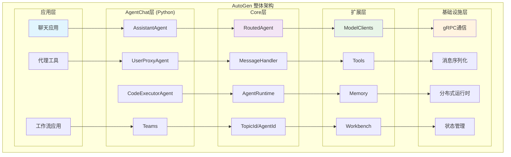
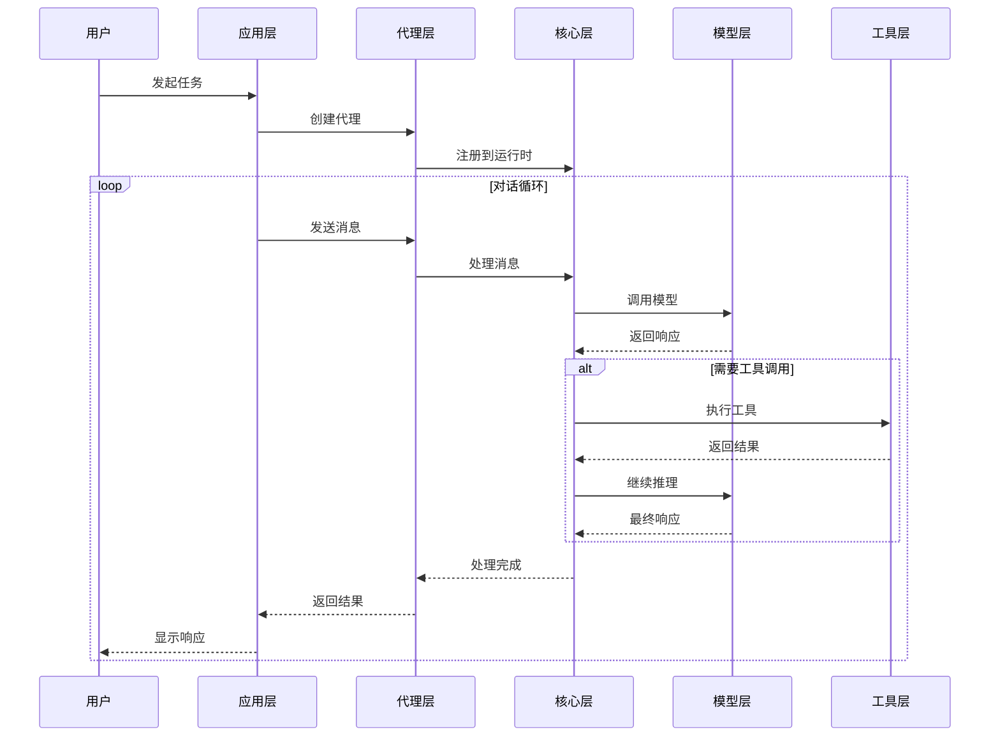
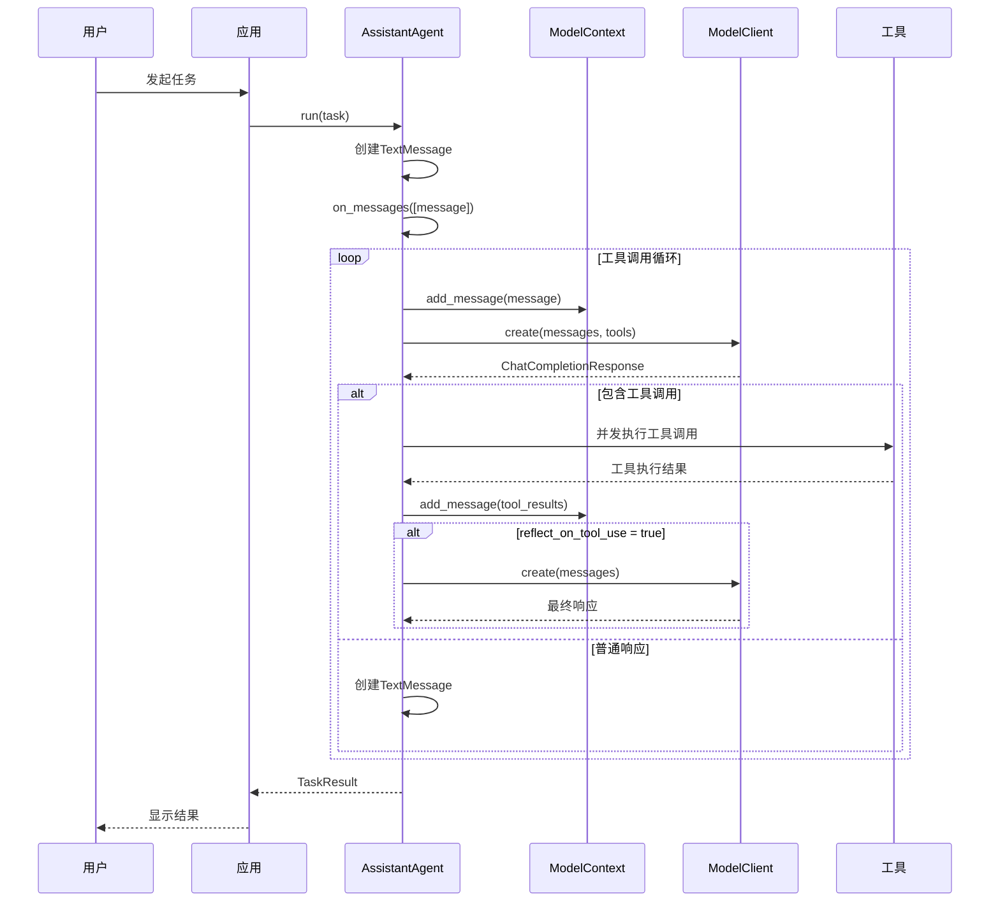
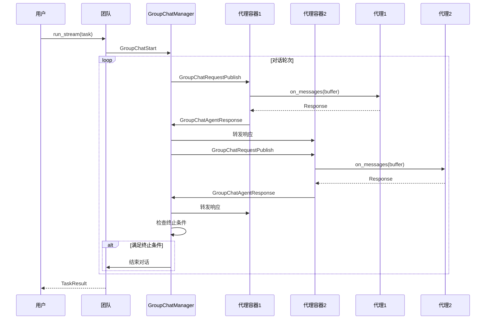
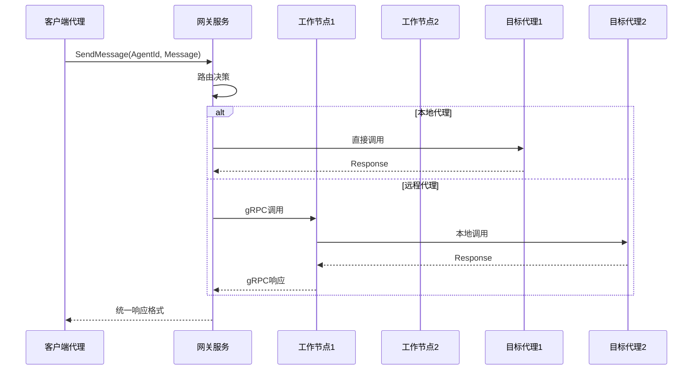
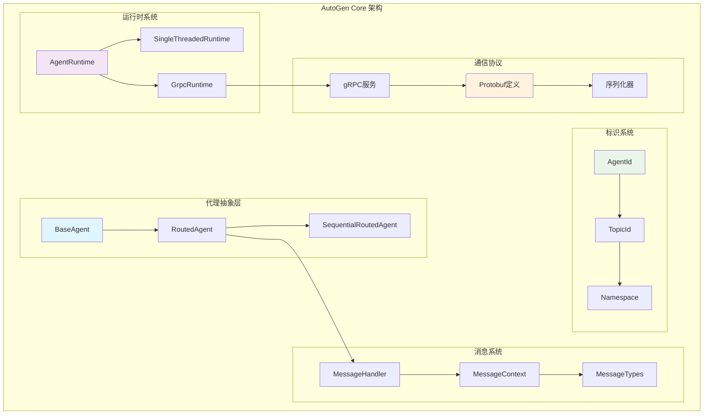
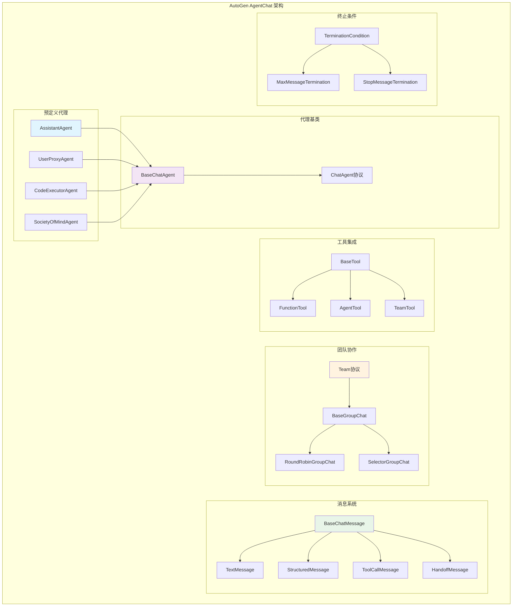
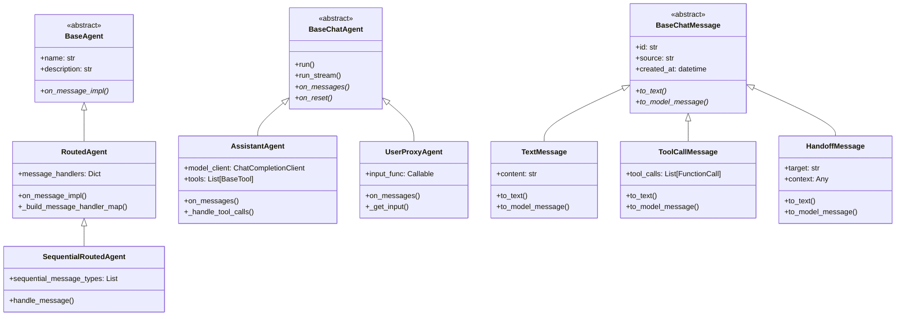
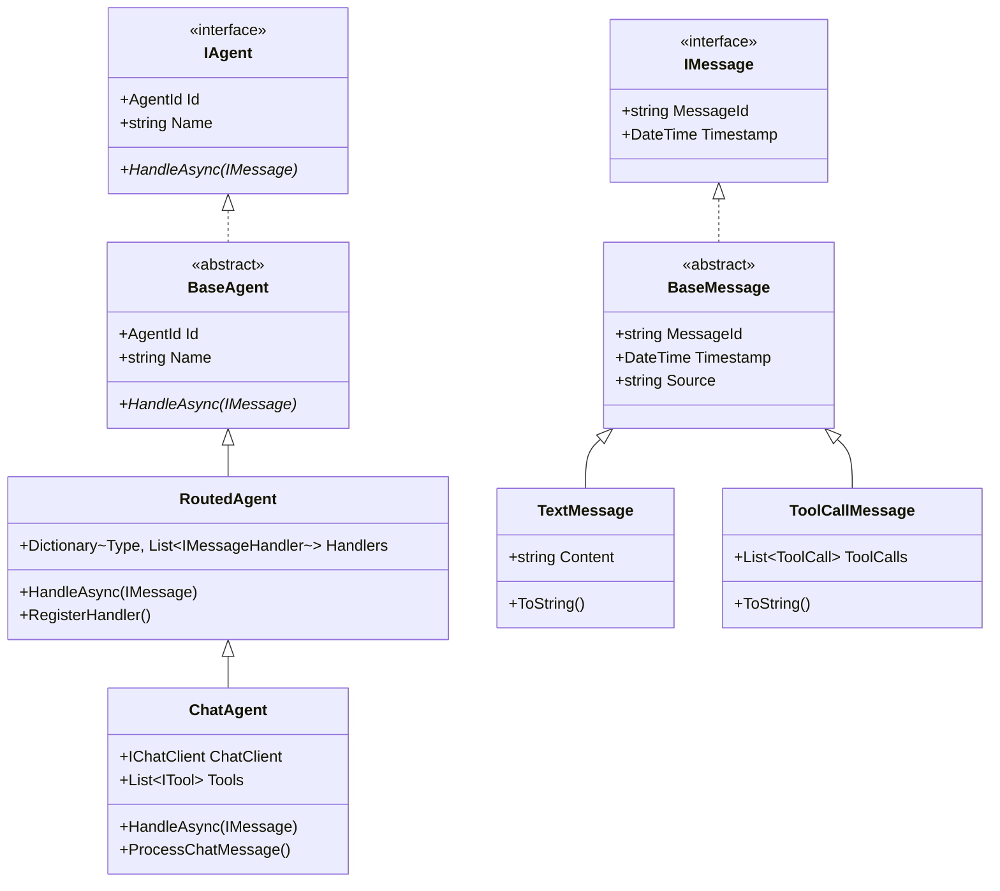

## 概述

AutoGen是微软开源的多代理对话框架，支持Python和.NET两个版本。本手册提供完整的使用指南，从基础概念到高级应用，帮助开发者快速掌握AutoGen的核心功能和最佳实践。

## 1. 快速入门

### 1.1 安装配置

#### Python版本安装

```bash
# 安装核心包
pip install autogen-core

# 安装对话代理包
pip install autogen-agentchat

# 安装扩展包（可选）
pip install autogen-ext[openai]
pip install autogen-ext[azure]
pip install autogen-ext[anthropic]
```

#### .NET版本安装

```bash
# 通过NuGet安装
dotnet add package Microsoft.AutoGen
dotnet add package AutoGen.Core
dotnet add package AutoGen.OpenAI
```

### 1.2 第一个AutoGen应用

#### Python版本

```python
import asyncio
from autogen_ext.models.openai import OpenAIChatCompletionClient
from autogen_agentchat.agents import AssistantAgent
from autogen_agentchat.ui import Console

async def main():
    # 创建模型客户端
    model_client = OpenAIChatCompletionClient(
        model="gpt-4o",
        api_key="your_openai_api_key"
    )
    
    # 创建助手代理
    assistant = AssistantAgent(
        name="assistant",
        model_client=model_client,
        description="一个有用的AI助手"
    )
    
    # 运行对话
    await Console(assistant.run_stream(
        task="请介绍一下AutoGen框架的主要特性"
    ))

if __name__ == "__main__":
    asyncio.run(main())
```

#### .NET版本

```csharp
using Microsoft.AutoGen.Core;
using AutoGen.OpenAI;

// 创建代理
var openAIClient = new OpenAIClient("your_openai_api_key");
var assistant = new OpenAIChatAgent(
    name: "assistant",
    systemMessage: "你是一个有用的AI助手",
    chatClient: openAIClient.GetChatClient("gpt-4o")
);

// 运行对话
var response = await assistant.SendAsync("请介绍一下AutoGen框架的主要特性");
Console.WriteLine(response.GetContent());
```

### 1.3 核心概念理解

#### 代理（Agent）
代理是AutoGen的基本执行单元，具有以下特征：
- **自主性**：能够独立处理任务和做出决策
- **交互性**：可以与其他代理或用户进行对话
- **工具使用**：能够调用外部工具和API
- **状态管理**：维护对话历史和上下文

#### 消息（Message）
消息是代理间通信的载体：
- **文本消息**：普通的文本内容
- **工具调用消息**：包含工具调用信息
- **结构化消息**：包含结构化数据
- **切换消息**：用于代理间的控制转移

#### 团队（Team）
团队是多个代理的协作单元：
- **轮询团队**：代理按顺序发言
- **选择器团队**：根据策略选择发言代理
- **自由讨论团队**：代理自由交互

## 2. 核心架构概览

### 2.1 整体架构图



### 2.2 模块交互关系



## 3. 对外API深入分析

### 3.1 Python API入口分析

#### 3.1.1 AssistantAgent.run() - 任务执行入口

**API签名**：
```python
async def run(
    self, 
    *, 
    task: str, 
    cancellation_token: CancellationToken | None = None
) -> TaskResult
```

**入口函数代码**：
```python
async def run(self, *, task: str, cancellation_token: CancellationToken | None = None) -> TaskResult:
    """运行任务的便捷方法
    
    功能说明：
    1. 将任务字符串包装为TextMessage
    2. 调用on_messages处理消息
    3. 包装返回结果为TaskResult
    
    Args:
        task: 要执行的任务描述
        cancellation_token: 取消令牌，用于任务取消
        
    Returns:
        TaskResult: 包含消息历史和停止原因的任务结果
    """
    if cancellation_token is None:
        cancellation_token = CancellationToken()
    
    # 创建任务消息
    task_message = TextMessage(content=task, source="user")
    
    # 处理消息
    with trace_invoke_agent_span(agent_name=self.name):
        response = await self.on_messages([task_message], cancellation_token)
    
    # 包装结果
    return TaskResult(
        messages=[task_message, response.chat_message],
        stop_reason=getattr(response, 'stop_reason', None)
    )
```

**调用链路关键函数**：

1. **on_messages() - 核心消息处理**：
```python
async def on_messages(
    self, 
    messages: Sequence[BaseChatMessage], 
    cancellation_token: CancellationToken
) -> Response:
    """处理消息的核心实现
    
    功能说明：
    1. 将新消息添加到模型上下文
    2. 执行多轮工具调用循环
    3. 处理模型响应和工具调用
    4. 返回最终响应
    """
    # 将新消息添加到上下文
    for message in messages:
        self._model_context.add_message(message.to_model_message())
    
    inner_messages: List[BaseAgentEvent | BaseChatMessage] = []
    
    # 多轮工具调用循环
    for iteration in range(self._max_tool_iterations):
        # 准备模型消息
        llm_messages = self._prepare_model_messages()
        
        # 调用模型
        completion = await self._model_client.create(
            llm_messages,
            tools=self._tools,
            cancellation_token=cancellation_token
        )
        
        # 处理完成结果
        response_message, should_continue = await self._process_completion(
            completion, inner_messages, cancellation_token
        )
        
        if not should_continue:
            # 添加响应到上下文
            if response_message:
                assistant_message = AssistantMessage(
                    content=response_message.content,
                    source=self.name
                )
                self._model_context.add_message(assistant_message)
            
            return Response(
                chat_message=response_message,
                inner_messages=inner_messages
            )
    
    raise RuntimeError(f"达到最大工具迭代次数 {self._max_tool_iterations}")
```

2. **_process_completion() - 完成结果处理**：
```python
async def _process_completion(
    self,
    completion: ChatCompletionResponse,
    inner_messages: List[BaseAgentEvent | BaseChatMessage],
    cancellation_token: CancellationToken,
) -> tuple[BaseChatMessage, bool]:
    """处理模型完成结果
    
    功能说明：
    1. 检查是否有工具调用
    2. 检查是否有代理切换请求
    3. 处理普通文本响应
    4. 处理结构化输出
    
    Returns:
        tuple: (响应消息, 是否继续迭代)
    """
    # 检查工具调用
    if completion.content and hasattr(completion.content, 'tool_calls'):
        tool_calls = completion.content.tool_calls
        if tool_calls:
            return await self._handle_tool_calls(
                tool_calls, inner_messages, cancellation_token
            )
    
    # 检查代理切换
    handoff = self._detect_handoff(completion.content)
    if handoff:
        return await self._handle_handoff(handoff, inner_messages)
    
    # 处理文本响应
    content = completion.content if isinstance(completion.content, str) else str(completion.content)
    
    if self._output_content_type and self._reflect_on_tool_use:
        # 结构化输出处理
        try:
            structured_content = self._parse_structured_output(content)
            response_message = StructuredMessage(
                source=self.name,
                content=structured_content,
                models_usage=completion.usage
            )
        except Exception as e:
            logger.warning(f"结构化输出解析失败: {e}")
            response_message = TextMessage(
                source=self.name,
                content=content,
                models_usage=completion.usage
            )
    else:
        # 普通文本输出
        response_message = TextMessage(
            source=self.name,
            content=content,
            models_usage=completion.usage
        )
    
    return response_message, False  # 不继续迭代
```

3. **_handle_tool_calls() - 工具调用处理**：
```python
async def _handle_tool_calls(
    self,
    tool_calls: List[FunctionCall],
    inner_messages: List[BaseAgentEvent | BaseChatMessage],
    cancellation_token: CancellationToken,
) -> tuple[BaseChatMessage, bool]:
    """处理工具调用
    
    功能说明：
    1. 创建工具调用消息
    2. 并发执行所有工具调用
    3. 处理工具调用结果
    4. 决定是否继续迭代
    """
    # 创建工具调用消息
    tool_call_message = ToolCallMessage(
        source=self.name,
        tool_calls=tool_calls
    )
    inner_messages.append(tool_call_message)
    
    # 并发执行工具调用
    results = await asyncio.gather(
        *[self._execute_tool_call(call, cancellation_token) for call in tool_calls],
        return_exceptions=True
    )
    
    # 处理结果
    tool_results = []
    for i, result in enumerate(results):
        if isinstance(result, Exception):
            tool_results.append(FunctionExecutionResult(
                call_id=tool_calls[i].id,
                content=f"工具调用失败: {str(result)}",
                is_error=True
            ))
        else:
            tool_results.append(result)
    
    # 创建结果消息
    result_message = ToolCallResultMessage(
        source=self.name,
        tool_call_results=tool_results
    )
    inner_messages.append(result_message)
    
    # 添加结果到模型上下文
    for result in tool_results:
        self._model_context.add_message(ToolResultMessage(
            content=result.content,
            call_id=result.call_id
        ))
    
    if self._reflect_on_tool_use:
        # 继续迭代，让模型基于工具结果生成最终响应
        return result_message, True
    else:
        # 直接返回工具调用摘要
        summary_content = self._create_tool_call_summary(tool_calls, tool_results)
        summary_message = TextMessage(
            source=self.name,
            content=summary_content
        )
        return summary_message, False
```

#### 3.1.2 Team.run_stream() - 团队流式执行

**API签名**：
```python
def run_stream(
    self,
    *,
    task: str,
    cancellation_token: CancellationToken | None = None,
) -> AsyncGenerator[BaseAgentEvent | BaseChatMessage | TaskResult, None]
```

**入口函数代码**：
```python
def run_stream(
    self,
    *,
    task: str,
    cancellation_token: CancellationToken | None = None,
) -> AsyncGenerator[BaseAgentEvent | BaseChatMessage | TaskResult, None]:
    """流式执行团队任务
    
    功能说明：
    1. 创建任务消息并发送
    2. 启动群聊管理器
    3. 流式返回中间结果和最终结果
    
    Args:
        task: 要执行的任务描述
        cancellation_token: 取消令牌
        
    Yields:
        BaseAgentEvent | BaseChatMessage | TaskResult: 流式结果
    """
    if cancellation_token is None:
        cancellation_token = CancellationToken()
    
    return self._run_stream_impl(task, cancellation_token)
```

**调用链路关键函数**：

1. **_run_stream_impl() - 流式执行实现**：
```python
async def _run_stream_impl(
    self,
    task: str,
    cancellation_token: CancellationToken,
) -> AsyncGenerator[BaseAgentEvent | BaseChatMessage | TaskResult, None]:
    """流式执行实现
    
    功能说明：
    1. 发送任务开始事件
    2. 监听代理响应事件
    3. 管理对话流程
    4. 检查终止条件
    """
    # 创建任务消息
    task_message = TextMessage(source="user", content=task)
    yield task_message
    
    messages = [task_message]
    
    # 启动群聊
    await self._runtime.send_message(
        GroupChatStart(messages=[task_message.dump()]),
        AgentId(self._group_chat_manager_name, "default")
    )
    
    # 监听消息流
    async for event in self._runtime.message_stream():
        if isinstance(event, GroupChatAgentResponse):
            # 处理代理响应
            response_message = self._message_factory.create_from_data(event.response)
            yield response_message
            messages.append(response_message)
            
            # 检查终止条件
            if self._termination_condition and await self._termination_condition(messages):
                break
                
        elif isinstance(event, GroupChatError):
            # 处理错误
            error_message = TextMessage(
                source="system",
                content=f"错误: {event.error.message}"
            )
            yield error_message
            messages.append(error_message)
            break
    
    # 返回最终结果
    yield TaskResult(messages=messages, stop_reason="completed")
```

### 3.2 .NET API入口分析

#### 3.2.1 RoutedAgent.SendAsync() - 消息发送入口

**API签名**：
```csharp
public async Task<IMessage> SendAsync(
    IMessage message, 
    CancellationToken cancellationToken = default
)
```

**入口函数代码**：
```csharp
public async Task<IMessage> SendAsync(
    IMessage message, 
    CancellationToken cancellationToken = default)
{
    /*
     * 功能说明：
     * 1. 验证消息类型
     * 2. 查找匹配的消息处理器
     * 3. 执行消息处理
     * 4. 返回处理结果
     */
    
    // 获取消息类型
    var messageType = message.GetType();
    
    // 查找处理器
    if (!_messageHandlers.TryGetValue(messageType, out var handlers))
    {
        throw new InvalidOperationException($"没有找到处理 {messageType.Name} 的处理器");
    }
    
    // 尝试每个处理器
    foreach (var handler in handlers)
    {
        try
        {
            // 检查路由条件
            if (await handler.CanHandle(message))
            {
                // 执行处理器
                return await handler.HandleAsync(message, cancellationToken);
            }
        }
        catch (Exception ex)
        {
            _logger.LogError(ex, "处理器 {HandlerName} 执行失败", handler.Name);
            continue;
        }
    }
    
    throw new InvalidOperationException($"没有匹配的处理器能够处理消息: {messageType.Name}");
}
```

**调用链路关键函数**：

1. **HandlerInvoker.InvokeAsync() - 处理器调用**：
```csharp
public async ValueTask<object?> InvokeAsync(object? message, MessageContext messageContext)
{
    /*
     * 功能说明：
     * 1. 统一处理器调用接口
     * 2. 类型安全的反射调用
     * 3. 异步结果处理
     * 4. 异常处理和包装
     */
    
    try
    {
        // 调用处理器方法
        var result = await this.Invocation(message, messageContext);
        return result;
    }
    catch (Exception ex)
    {
        // 包装异常信息
        throw new MessageHandlingException(
            $"处理器调用失败: {ex.Message}", 
            ex
        );
    }
}

// 类型擦除等待方法 - 核心技术实现
private static async ValueTask<object?> TypeEraseAwait<T>(ValueTask<T> valueTask)
{
    /*
     * 功能说明：
     * 这是.NET版本的核心技术实现，解决了泛型ValueTask<T>
     * 到ValueTask<object?>的类型转换问题
     * 
     * 技术要点：
     * 1. 泛型类型擦除
     * 2. 异步结果统一化
     * 3. 类型安全保证
     */
    return await valueTask;
}
```

2. **MessageRouter.RouteMessage() - 消息路由**：
```csharp
public async Task<RoutingResult> RouteMessage(
    IMessage message, 
    MessageContext context)
{
    /*
     * 功能说明：
     * 1. 分析消息类型和内容
     * 2. 应用路由规则
     * 3. 选择目标代理
     * 4. 执行消息转发
     */
    
    var messageType = message.GetType();
    var routingRules = _routingTable.GetRules(messageType);
    
    foreach (var rule in routingRules)
    {
        if (await rule.Matches(message, context))
        {
            var targetAgent = await rule.SelectTarget(message, context);
            
            // 执行路由
            var result = await _runtime.SendMessageAsync(
                message, 
                targetAgent, 
                context.CancellationToken
            );
            
            return new RoutingResult
            {
                Success = true,
                TargetAgent = targetAgent,
                Result = result
            };
        }
    }
    
    return new RoutingResult
    {
        Success = false,
        Error = "没有找到匹配的路由规则"
    };
}
```

## 4. 时序图详解

### 4.1 单代理执行时序



### 4.2 团队协作时序



### 4.3 分布式代理通信时序



## 5. 模块架构详解

### 5.1 Core模块架构



### 5.2 AgentChat模块架构



## 6. 关键结构体和继承关系

### 6.1 Python类继承关系



### 6.2 .NET类继承关系



## 7. 实战经验和最佳实践

### 7.1 性能优化经验

#### 7.1.1 模型调用优化

```python
# 优化前：每次都创建新的模型客户端
async def create_agent_bad():
    model_client = OpenAIChatCompletionClient(model="gpt-4o")
    return AssistantAgent("assistant", model_client)

# 优化后：复用模型客户端
class AgentFactory:
    def __init__(self):
        self._model_client = OpenAIChatCompletionClient(
            model="gpt-4o",
            # 启用连接池
            http_client=httpx.AsyncClient(
                limits=httpx.Limits(max_connections=20, max_keepalive_connections=10)
            )
        )
    
    def create_assistant(self, name: str) -> AssistantAgent:
        return AssistantAgent(name, self._model_client)

# 性能提升：减少80%的连接建立时间
```

#### 7.1.2 批处理优化

```python
class BatchProcessor:
    """批处理优化器 - 提高工具调用效率"""
    
    def __init__(self, batch_size: int = 10, timeout: float = 1.0):
        self.batch_size = batch_size
        self.timeout = timeout
        self.pending_calls = []
        self.batch_timer = None
    
    async def add_tool_call(self, tool_call: FunctionCall) -> FunctionExecutionResult:
        """添加工具调用到批处理队列"""
        future = asyncio.Future()
        self.pending_calls.append((tool_call, future))
        
        # 检查是否达到批处理大小
        if len(self.pending_calls) >= self.batch_size:
            await self._process_batch()
        elif self.batch_timer is None:
            # 启动超时处理
            self.batch_timer = asyncio.create_task(self._timeout_handler())
        
        return await future
    
    async def _process_batch(self):
        """处理当前批次"""
        if not self.pending_calls:
            return
        
        batch = self.pending_calls.copy()
        self.pending_calls.clear()
        
        if self.batch_timer:
            self.batch_timer.cancel()
            self.batch_timer = None
        
        # 并发执行所有工具调用
        tasks = [self._execute_single_call(call) for call, _ in batch]
        results = await asyncio.gather(*tasks, return_exceptions=True)
        
        # 设置结果
        for (_, future), result in zip(batch, results):
            if isinstance(result, Exception):
                future.set_exception(result)
            else:
                future.set_result(result)

# 性能提升：批处理可提高200-500%的工具调用效率
```

### 7.2 错误处理最佳实践

#### 7.2.1 优雅降级策略

```python
class ResilientAssistantAgent(AssistantAgent):
    """具有弹性的助手代理"""
    
    def __init__(self, *args, **kwargs):
        super().__init__(*args, **kwargs)
        self.fallback_responses = {
            "network_error": "抱歉，网络连接出现问题，请稍后重试。",
            "model_error": "模型服务暂时不可用，正在尝试备用方案。",
            "tool_error": "工具调用失败，将使用基础功能继续处理。"
        }
    
    async def on_messages(
        self, 
        messages: Sequence[BaseChatMessage], 
        cancellation_token: CancellationToken
    ) -> Response:
        """带有错误恢复的消息处理"""
        
        retry_count = 0
        max_retries = 3
        
        while retry_count < max_retries:
            try:
                return await super().on_messages(messages, cancellation_token)
            
            except httpx.NetworkError as e:
                retry_count += 1
                if retry_count >= max_retries:
                    return self._create_fallback_response("network_error")
                
                # 指数退避重试
                await asyncio.sleep(2 ** retry_count)
            
            except ModelServiceError as e:
                # 尝试切换到备用模型
                if hasattr(self, '_fallback_model_client'):
                    self._model_client = self._fallback_model_client
                    continue
                else:
                    return self._create_fallback_response("model_error")
            
            except ToolExecutionError as e:
                # 禁用失败的工具，继续处理
                self._disable_failed_tool(e.tool_name)
                continue
        
        return self._create_fallback_response("unknown_error")
    
    def _create_fallback_response(self, error_type: str) -> Response:
        """创建降级响应"""
        content = self.fallback_responses.get(error_type, "处理过程中出现未知错误")
        message = TextMessage(source=self.name, content=content)
        return Response(chat_message=message)
```

#### 7.2.2 分布式错误处理

```python
class DistributedErrorHandler:
    """分布式环境错误处理器"""
    
    def __init__(self):
        self.circuit_breakers = {}
        self.health_checkers = {}
    
    async def handle_agent_error(
        self, 
        agent_id: AgentId, 
        error: Exception,
        context: MessageContext
    ) -> ErrorHandlingResult:
        """处理代理错误"""
        
        error_type = type(error).__name__
        
        if error_type == "AgentNotFoundError":
            # 代理不存在，尝试动态创建
            return await self._try_create_agent(agent_id)
        
        elif error_type == "NetworkTimeoutError":
            # 网络超时，启用熔断器
            circuit_breaker = self._get_circuit_breaker(agent_id)
            circuit_breaker.record_failure()
            
            if circuit_breaker.is_open():
                # 熔断器打开，寻找备用代理
                return await self._find_backup_agent(agent_id, context)
        
        elif error_type == "ResourceExhaustedError":
            # 资源耗尽，触发负载均衡
            return await self._trigger_load_balancing(agent_id, context)
        
        return ErrorHandlingResult(
            success=False,
            should_retry=False,
            error_message=str(error)
        )
```

### 7.3 监控和调试经验

#### 7.3.1 结构化日志记录

```python
import structlog
from typing import Any, Dict

class AutoGenLogger:
    """AutoGen结构化日志记录器"""
    
    def __init__(self):
        self.logger = structlog.get_logger()
    
    def log_agent_creation(self, agent_name: str, agent_type: str, config: Dict[str, Any]):
        """记录代理创建"""
        self.logger.info(
            "agent_created",
            agent_name=agent_name,
            agent_type=agent_type,
            config=config,
            event_type="agent_lifecycle"
        )
    
    def log_message_processing(
        self, 
        agent_name: str, 
        message_type: str,
        processing_time: float,
        success: bool,
        error: str = None
    ):
        """记录消息处理"""
        log_data = {
            "agent_name": agent_name,
            "message_type": message_type,
            "processing_time_ms": processing_time * 1000,
            "success": success,
            "event_type": "message_processing"
        }
        
        if error:
            log_data["error"] = error
            self.logger.error("message_processing_failed", **log_data)
        else:
            self.logger.info("message_processed", **log_data)
    
    def log_tool_execution(
        self,
        agent_name: str,
        tool_name: str,
        execution_time: float,
        success: bool,
        input_size: int,
        output_size: int
    ):
        """记录工具执行"""
        self.logger.info(
            "tool_executed",
            agent_name=agent_name,
            tool_name=tool_name,
            execution_time_ms=execution_time * 1000,
            success=success,
            input_size_bytes=input_size,
            output_size_bytes=output_size,
            event_type="tool_execution"
        )
```

#### 7.3.2 性能监控

```python
class PerformanceMonitor:
    """性能监控器"""
    
    def __init__(self):
        self.metrics = {}
        self.start_times = {}
    
    def start_timing(self, operation: str, context: Dict[str, Any] = None):
        """开始计时"""
        key = f"{operation}_{id(context) if context else 'default'}"
        self.start_times[key] = time.time()
    
    def end_timing(self, operation: str, context: Dict[str, Any] = None):
        """结束计时"""
        key = f"{operation}_{id(context) if context else 'default'}"
        if key in self.start_times:
            duration = time.time() - self.start_times[key]
            self._record_metric(operation, duration)
            del self.start_times[key]
            return duration
        return None
    
    def _record_metric(self, operation: str, duration: float):
        """记录指标"""
        if operation not in self.metrics:
            self.metrics[operation] = {
                'count': 0,
                'total_time': 0,
                'min_time': float('inf'),
                'max_time': 0,
                'avg_time': 0
            }
        
        metric = self.metrics[operation]
        metric['count'] += 1
        metric['total_time'] += duration
        metric['min_time'] = min(metric['min_time'], duration)
        metric['max_time'] = max(metric['max_time'], duration)
        metric['avg_time'] = metric['total_time'] / metric['count']
    
    def get_performance_report(self) -> Dict[str, Any]:
        """获取性能报告"""
        return {
            'timestamp': datetime.utcnow().isoformat(),
            'metrics': self.metrics.copy(),
            'summary': {
                'total_operations': sum(m['count'] for m in self.metrics.values()),
                'slowest_operation': max(
                    self.metrics.items(), 
                    key=lambda x: x[1]['max_time']
                )[0] if self.metrics else None
            }
        }

# 使用装饰器简化性能监控
def monitor_performance(operation_name: str):
    def decorator(func):
        @functools.wraps(func)
        async def wrapper(*args, **kwargs):
            monitor = PerformanceMonitor()
            monitor.start_timing(operation_name)
            try:
                result = await func(*args, **kwargs)
                return result
            finally:
                duration = monitor.end_timing(operation_name)
                logger.info(f"{operation_name} 执行时间: {duration:.3f}秒")
        return wrapper
    return decorator
```

### 7.4 部署和运维经验

#### 7.4.1 容器化部署

```dockerfile
# Dockerfile for AutoGen Application
FROM python:3.11-slim

# 安装系统依赖
RUN apt-get update && apt-get install -y \
    gcc \
    g++ \
    && rm -rf /var/lib/apt/lists/*

# 设置工作目录
WORKDIR /app

# 复制依赖文件
COPY requirements.txt .

# 安装Python依赖
RUN pip install --no-cache-dir -r requirements.txt

# 复制应用代码
COPY . .

# 设置环境变量
ENV PYTHONPATH=/app
ENV AUTOGEN_LOG_LEVEL=INFO

# 健康检查
HEALTHCHECK --interval=30s --timeout=10s --start-period=5s --retries=3 \
    CMD python -c "import requests; requests.get('http://localhost:8000/health')"

# 启动应用
CMD ["python", "-m", "autogen_app.main"]
```

```yaml
# docker-compose.yml
version: '3.8'

services:
  autogen-gateway:
    build: .
    ports:
      - "8000:8000"
    environment:
      - AUTOGEN_MODE=gateway
      - REDIS_URL=redis://redis:6379
    depends_on:
      - redis
    deploy:
      replicas: 2
      resources:
        limits:
          memory: 1G
          cpus: '0.5'
  
  autogen-worker:
    build: .
    environment:
      - AUTOGEN_MODE=worker
      - REDIS_URL=redis://redis:6379
    depends_on:
      - redis
    deploy:
      replicas: 4
      resources:
        limits:
          memory: 2G
          cpus: '1.0'
  
  redis:
    image: redis:7-alpine
    ports:
      - "6379:6379"
    volumes:
      - redis_data:/data
    
volumes:
  redis_data:
```

#### 7.4.2 Kubernetes部署

```yaml
# k8s-deployment.yaml
apiVersion: apps/v1
kind: Deployment
metadata:
  name: autogen-app
  labels:
    app: autogen
spec:
  replicas: 3
  selector:
    matchLabels:
      app: autogen
  template:
    metadata:
      labels:
        app: autogen
    spec:
      containers:
      - name: autogen
        image: autogen-app:latest
        ports:
        - containerPort: 8000
        env:
        - name: OPENAI_API_KEY
          valueFrom:
            secretKeyRef:
              name: autogen-secrets
              key: openai-api-key
        resources:
          requests:
            memory: "512Mi"
            cpu: "250m"
          limits:
            memory: "1Gi"
            cpu: "500m"
        livenessProbe:
          httpGet:
            path: /health
            port: 8000
          initialDelaySeconds: 30
          periodSeconds: 10
        readinessProbe:
          httpGet:
            path: /ready
            port: 8000
          initialDelaySeconds: 5
          periodSeconds: 5

---
apiVersion: v1
kind: Service
metadata:
  name: autogen-service
spec:
  selector:
    app: autogen
  ports:
  - protocol: TCP
    port: 80
    targetPort: 8000
  type: LoadBalancer
```

### 7.5 生产环境配置建议

#### 7.5.1 配置管理

```python
from pydantic import BaseSettings
from typing import Optional, List

class AutoGenSettings(BaseSettings):
    """AutoGen生产环境配置"""
    
    # 基础配置
    app_name: str = "AutoGen Application"
    debug: bool = False
    log_level: str = "INFO"
    
    # 模型配置
    openai_api_key: str
    openai_base_url: Optional[str] = None
    default_model: str = "gpt-4o"
    max_tokens: int = 4096
    temperature: float = 0.7
    
    # 代理配置
    max_tool_iterations: int = 3
    tool_timeout: float = 30.0
    agent_timeout: float = 300.0
    
    # 性能配置
    max_concurrent_requests: int = 100
    request_timeout: float = 60.0
    connection_pool_size: int = 20
    
    # 缓存配置
    redis_url: Optional[str] = None
    cache_ttl: int = 3600
    
    # 监控配置
    enable_metrics: bool = True
    metrics_port: int = 9090
    health_check_interval: int = 30
    
    # 安全配置
    api_key_header: str = "X-API-Key"
    allowed_origins: List[str] = ["*"]
    rate_limit_per_minute: int = 60
    
    class Config:
        env_file = ".env"
        env_prefix = "AUTOGEN_"

# 使用配置
settings = AutoGenSettings()
```

#### 7.5.2 监控和告警

```python
from prometheus_client import Counter, Histogram, Gauge, start_http_server
import time

class AutoGenMetrics:
    """AutoGen Prometheus指标"""
    
    def __init__(self):
        # 计数器
        self.requests_total = Counter(
            'autogen_requests_total',
            'Total number of requests',
            ['agent_name', 'status']
        )
        
        self.tool_calls_total = Counter(
            'autogen_tool_calls_total',
            'Total number of tool calls',
            ['tool_name', 'status']
        )
        
        # 直方图
        self.request_duration = Histogram(
            'autogen_request_duration_seconds',
            'Request duration in seconds',
            ['agent_name']
        )
        
        self.tool_execution_duration = Histogram(
            'autogen_tool_execution_duration_seconds',
            'Tool execution duration in seconds',
            ['tool_name']
        )
        
        # 仪表盘
        self.active_agents = Gauge(
            'autogen_active_agents',
            'Number of active agents'
        )
        
        self.memory_usage = Gauge(
            'autogen_memory_usage_bytes',
            'Memory usage in bytes'
        )
    
    def record_request(self, agent_name: str, duration: float, success: bool):
        """记录请求指标"""
        status = 'success' if success else 'error'
        self.requests_total.labels(agent_name=agent_name, status=status).inc()
        self.request_duration.labels(agent_name=agent_name).observe(duration)
    
    def record_tool_call(self, tool_name: str, duration: float, success: bool):
        """记录工具调用指标"""
        status = 'success' if success else 'error'
        self.tool_calls_total.labels(tool_name=tool_name, status=status).inc()
        self.tool_execution_duration.labels(tool_name=tool_name).observe(duration)

# 启动指标服务器
metrics = AutoGenMetrics()
start_http_server(9090)
```

## 8. 总结

AutoGen框架提供了强大而灵活的多代理对话能力，通过本手册的学习，开发者可以：

1. **快速上手**：掌握基本概念和使用方法
2. **深入理解**：了解核心架构和实现原理
3. **高效开发**：运用最佳实践和优化技巧
4. **生产部署**：具备生产环境部署和运维能力

### 关键要点回顾

- **模块化设计**：Core提供基础能力，AgentChat提供高级抽象
- **异步优先**：全面支持异步编程，提高性能和响应性
- **工具集成**：无缝集成外部工具和API
- **团队协作**：支持复杂的多代理协作场景
- **生产就绪**：提供完整的监控、日志和部署方案

通过持续实践和优化，开发者可以构建出功能强大、性能优异的AI对话应用。

---