## 概述

本文档专门分析AutoGen系统中各组件间的交互流程，通过详细的时序图展示消息传递、代理生命周期、团队协作等关键流程的实现机制。

## 1. 代理生命周期管理时序

### 1.1 代理创建和注册流程 (基于实际代码实现)

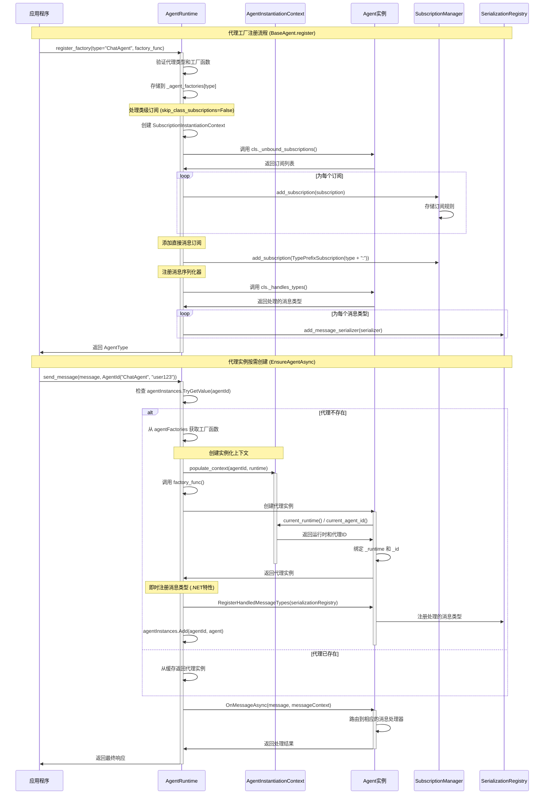
```mermaid
sequenceDiagram
    participant App as 应用程序
    participant RT as AgentRuntime
    participant AIC as AgentInstantiationContext
    participant A as Agent实例
    participant SM as SubscriptionManager
    participant SR as SerializationRegistry

    Note over App,SR: 代理工厂注册流程 (BaseAgent.register)
    
    App->>RT: register_factory(type="ChatAgent", factory_func)
    activate RT
    
    RT->>RT: 验证代理类型和工厂函数
    RT->>RT: 存储到 _agent_factories[type]
    
    Note over RT: 处理类级订阅 (skip_class_subscriptions=False)
    RT->>RT: 创建 SubscriptionInstantiationContext
    RT->>A: 调用 cls._unbound_subscriptions()
    A->>RT: 返回订阅列表
    
    loop 为每个订阅
        RT->>SM: add_subscription(subscription)
        SM->>SM: 存储订阅规则
    end
    
    Note over RT: 添加直接消息订阅
    RT->>SM: add_subscription(TypePrefixSubscription(type + ":"))
    
    Note over RT: 注册消息序列化器
    RT->>A: 调用 cls._handles_types()
    A->>RT: 返回处理的消息类型
    loop 为每个消息类型
        RT->>SR: add_message_serializer(serializer)
    end
    
    RT->>App: 返回 AgentType
    deactivate RT
    
    Note over App,SR: 代理实例按需创建 (EnsureAgentAsync)
    
    App->>RT: send_message(message, AgentId("ChatAgent", "user123"))
    activate RT
    
    RT->>RT: 检查 agentInstances.TryGetValue(agentId)
    
    alt 代理不存在
        RT->>RT: 从 agentFactories 获取工厂函数
        
        Note over RT,AIC: 创建实例化上下文
        RT->>AIC: populate_context(agentId, runtime)
        activate AIC
        
        RT->>RT: 调用 factory_func()
        RT->>A: 创建代理实例
        activate A
        
        A->>AIC: current_runtime() / current_agent_id()
        AIC->>A: 返回运行时和代理ID
        A->>A: 绑定 _runtime 和 _id
        
        deactivate AIC
        
        A->>RT: 返回代理实例
        
        Note over RT: 即时注册消息类型 (.NET特性)
        RT->>A: RegisterHandledMessageTypes(serializationRegistry)
        A->>SR: 注册处理的消息类型
        
        RT->>RT: agentInstances.Add(agentId, agent)
        deactivate A
    else 代理已存在
        RT->>RT: 从缓存返回代理实例
    end
    
    RT->>A: OnMessageAsync(message, messageContext)
    activate A
    A->>A: 路由到相应的消息处理器
    A->>RT: 返回处理结果
    deactivate A
    
    RT->>App: 返回最终响应
    deactivate RT
```

### 1.2 代理状态管理时序

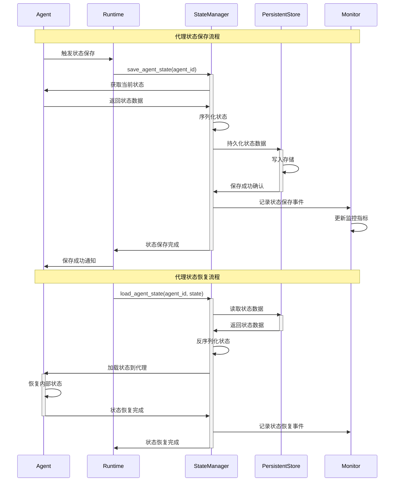
```mermaid
sequenceDiagram
    participant A as Agent
    participant RT as Runtime
    participant SM as StateManager
    participant PS as PersistentStore
    participant MON as Monitor

    Note over A,MON: 代理状态保存流程
    
    A->>RT: 触发状态保存
    RT->>SM: save_agent_state(agent_id)
    activate SM
    
    SM->>A: 获取当前状态
    A->>SM: 返回状态数据
    
    SM->>SM: 序列化状态
    SM->>PS: 持久化状态数据
    activate PS
    PS->>PS: 写入存储
    PS->>SM: 保存成功确认
    deactivate PS
    
    SM->>MON: 记录状态保存事件
    MON->>MON: 更新监控指标
    
    SM->>RT: 状态保存完成
    deactivate SM
    RT->>A: 保存成功通知
    
    Note over A,MON: 代理状态恢复流程
    
    RT->>SM: load_agent_state(agent_id, state)
    activate SM
    
    SM->>PS: 读取状态数据
    activate PS
    PS->>SM: 返回状态数据
    deactivate PS
    
    SM->>SM: 反序列化状态
    SM->>A: 加载状态到代理
    activate A
    A->>A: 恢复内部状态
    A->>SM: 状态恢复完成
    deactivate A
    
    SM->>MON: 记录状态恢复事件
    SM->>RT: 状态恢复完成
    deactivate SM
```

## 2. 消息传递与路由时序

### 2.1 点对点消息传递

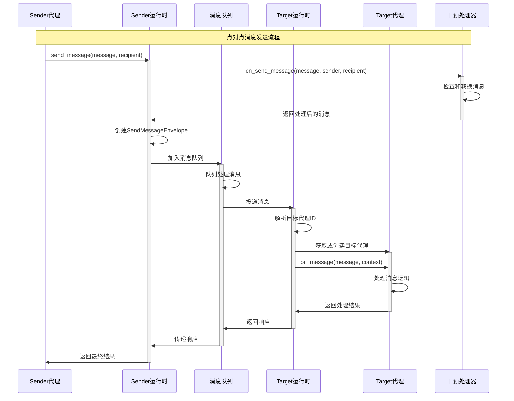
```mermaid
sequenceDiagram
    participant S as Sender代理
    participant SRT as Sender运行时
    participant MQ as 消息队列
    participant TRT as Target运行时
    participant T as Target代理
    participant IH as 干预处理器

    Note over S,IH: 点对点消息发送流程
    
    S->>SRT: send_message(message, recipient)
    activate SRT
    
    SRT->>IH: on_send_message(message, sender, recipient)
    activate IH
    IH->>IH: 检查和转换消息
    IH->>SRT: 返回处理后的消息
    deactivate IH
    
    SRT->>SRT: 创建SendMessageEnvelope
    SRT->>MQ: 加入消息队列
    activate MQ
    
    MQ->>MQ: 队列处理消息
    MQ->>TRT: 投递消息
    activate TRT
    
    TRT->>TRT: 解析目标代理ID
    TRT->>T: 获取或创建目标代理
    activate T
    
    TRT->>T: on_message(message, context)
    T->>T: 处理消息逻辑
    T->>TRT: 返回处理结果
    deactivate T
    
    TRT->>MQ: 返回响应
    deactivate TRT
    
    MQ->>SRT: 传递响应
    deactivate MQ
    
    SRT->>S: 返回最终结果
    deactivate SRT
```

### 2.2 发布订阅消息传递 (基于InProcessRuntime.PublishMessageServicer实现)

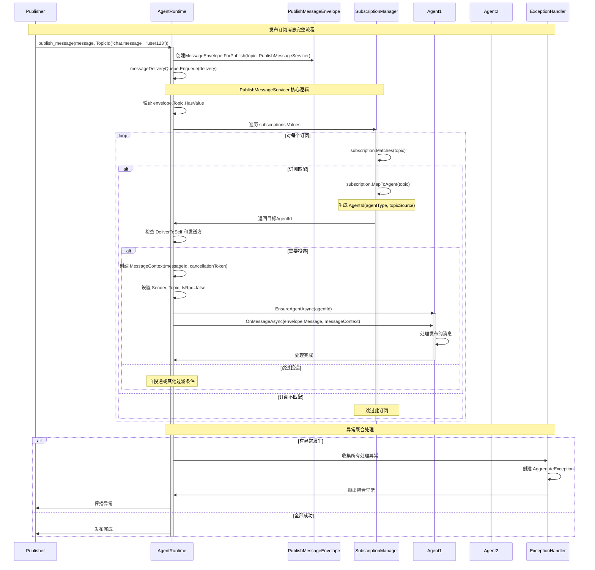
```mermaid
sequenceDiagram
    participant P as Publisher
    participant RT as AgentRuntime
    participant PE as PublishMessageEnvelope
    participant SM as SubscriptionManager
    participant A1 as Agent1
    participant A2 as Agent2
    participant EH as ExceptionHandler

    Note over P,EH: 发布订阅消息完整流程
    
    P->>RT: publish_message(message, TopicId("chat.message", "user123"))
    activate RT
    
    RT->>PE: 创建MessageEnvelope.ForPublish(topic, PublishMessageServicer)
    RT->>RT: messageDeliveryQueue.Enqueue(delivery)
    
    Note over RT,SM: PublishMessageServicer 核心逻辑
    RT->>RT: 验证 envelope.Topic.HasValue
    
    RT->>SM: 遍历 subscriptions.Values
    activate SM
    
    loop 对每个订阅
        SM->>SM: subscription.Matches(topic)
        
        alt 订阅匹配
            SM->>SM: subscription.MapToAgent(topic)
            Note over SM: 生成 AgentId(agentType, topicSource)
            
            SM->>RT: 返回目标AgentId
            
            RT->>RT: 检查 DeliverToSelf 和发送方
            
            alt 需要投递
                RT->>RT: 创建 MessageContext(messageId, cancellationToken)
                RT->>RT: 设置 Sender, Topic, IsRpc=false
                
                RT->>A1: EnsureAgentAsync(agentId)
                activate A1
                RT->>A1: OnMessageAsync(envelope.Message, messageContext)
                A1->>A1: 处理发布的消息
                A1->>RT: 处理完成
                deactivate A1
            else 跳过投递
                Note over RT: 自投递或其他过滤条件
            end
        else 订阅不匹配
            Note over SM: 跳过此订阅
        end
    end
    
    deactivate SM
    
    Note over RT,EH: 异常聚合处理
    
    alt 有异常发生
        RT->>EH: 收集所有处理异常
        EH->>EH: 创建 AggregateException
        EH->>RT: 抛出聚合异常
        RT->>P: 传播异常
    else 全部成功
        RT->>P: 发布完成
    end
    
    deactivate RT
```

#### 订阅匹配算法详解

基于实际的 `TypeSubscription.Matches` 和 `MapToAgent` 实现：

```mermaid
flowchart TD
    A[收到TopicId] --> B{TypeSubscription匹配}
    
    B -->|topic.Type == _topicType| C[精确匹配成功]
    B -->|不匹配| D[跳过此订阅]
    
    C --> E[调用MapToAgent]
    E --> F[创建AgentId]
    F --> G[return AgentId(_agentType, topic.Source)]
    
    H[TypePrefixSubscription匹配] --> I{topic.Type.StartsWith(_topicTypePrefix)}
    I -->|匹配| J[前缀匹配成功]
    I -->|不匹配| K[跳过此订阅]
    
    J --> L[调用MapToAgent]
    L --> M[return AgentId(_agentType, topic.Source)]
    
    style C fill:#e1f5fe
    style J fill:#f3e5f5
    style G fill:#e8f5e8
    style M fill:#e8f5e8
```

### 2.3 gRPC分布式消息传递

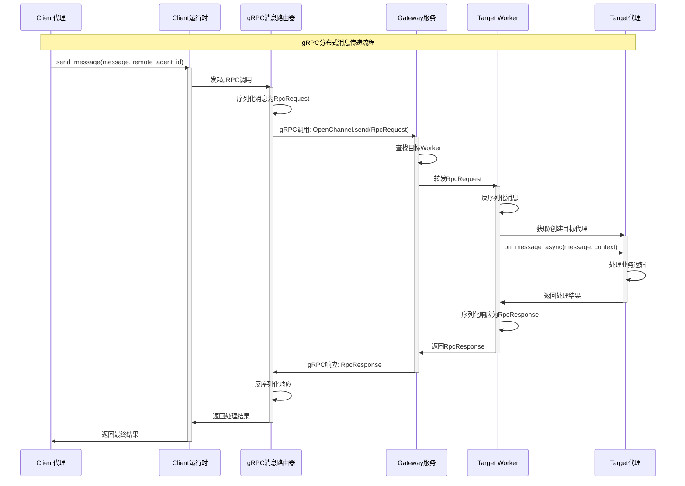
```mermaid
sequenceDiagram
    participant C as Client代理
    participant CR as Client运行时
    participant GMR as gRPC消息路由器
    participant GW as Gateway服务
    participant TW as Target Worker
    participant TA as Target代理

    Note over C,TA: gRPC分布式消息传递流程
    
    C->>CR: send_message(message, remote_agent_id)
    activate CR
    
    CR->>GMR: 发起gRPC调用
    activate GMR
    
    GMR->>GMR: 序列化消息为RpcRequest
    GMR->>GW: gRPC调用: OpenChannel.send(RpcRequest)
    activate GW
    
    GW->>GW: 查找目标Worker
    GW->>TW: 转发RpcRequest
    activate TW
    
    TW->>TW: 反序列化消息
    TW->>TA: 获取/创建目标代理
    activate TA
    
    TW->>TA: on_message_async(message, context)
    TA->>TA: 处理业务逻辑
    TA->>TW: 返回处理结果
    deactivate TA
    
    TW->>TW: 序列化响应为RpcResponse
    TW->>GW: 返回RpcResponse
    deactivate TW
    
    GW->>GMR: gRPC响应: RpcResponse
    deactivate GW
    
    GMR->>GMR: 反序列化响应
    GMR->>CR: 返回处理结果
    deactivate GMR
    
    CR->>C: 返回最终结果
    deactivate CR
```

## 3. 团队协作交互流程

### 3.1 GroupChat团队协作时序 (基于ChatAgentContainer实现)

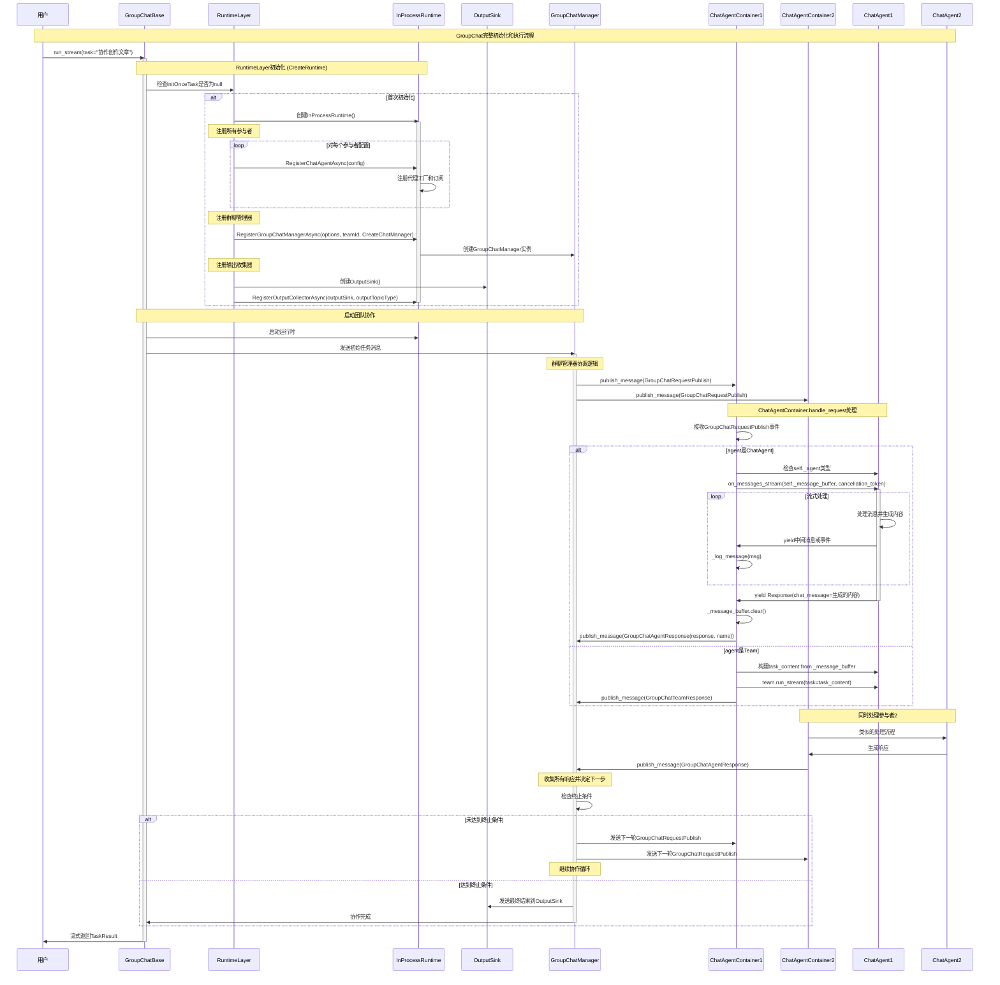
```mermaid
sequenceDiagram
    participant U as 用户
    participant GC as GroupChatBase
    participant RL as RuntimeLayer
    participant RT as InProcessRuntime
    participant OS as OutputSink
    participant MGR as GroupChatManager
    participant C1 as ChatAgentContainer1
    participant C2 as ChatAgentContainer2
    participant A1 as ChatAgent1
    participant A2 as ChatAgent2

    Note over U,A2: GroupChat完整初始化和执行流程
    
    U->>GC: run_stream(task="协作创作文章")
    activate GC
    
    Note over GC,RT: RuntimeLayer初始化 (CreateRuntime)
    GC->>RL: 检查InitOnceTask是否为null
    
    alt 首次初始化
        RL->>RT: 创建InProcessRuntime()
        activate RT
        
        Note over RL: 注册所有参与者
        loop 对每个参与者配置
            RL->>RT: RegisterChatAgentAsync(config)
            RT->>RT: 注册代理工厂和订阅
        end
        
        Note over RL: 注册群聊管理器
        RL->>RT: RegisterGroupChatManagerAsync(options, teamId, CreateChatManager)
        RT->>MGR: 创建GroupChatManager实例
        
        Note over RL: 注册输出收集器
        RL->>OS: 创建OutputSink()
        RL->>RT: RegisterOutputCollectorAsync(outputSink, outputTopicType)
        
        deactivate RT
    end
    
    Note over GC,MGR: 启动团队协作
    GC->>RT: 启动运行时
    GC->>MGR: 发送初始任务消息
    activate MGR
    
    Note over MGR: 群聊管理器协调逻辑
    MGR->>C1: publish_message(GroupChatRequestPublish)
    MGR->>C2: publish_message(GroupChatRequestPublish)
    
    Note over C1,A1: ChatAgentContainer.handle_request处理
    C1->>C1: 接收GroupChatRequestPublish事件
    
    alt agent是ChatAgent
        C1->>A1: 检查self._agent类型
        C1->>A1: on_messages_stream(self._message_buffer, cancellation_token)
        activate A1
        
        loop 流式处理
            A1->>A1: 处理消息并生成内容
            A1->>C1: yield中间消息或事件
            C1->>C1: _log_message(msg)
        end
        
        A1->>C1: yield Response(chat_message=生成的内容)
        deactivate A1
        
        C1->>C1: _message_buffer.clear()
        C1->>MGR: publish_message(GroupChatAgentResponse(response, name))
    else agent是Team
        C1->>A1: 构建task_content from _message_buffer
        C1->>A1: team.run_stream(task=task_content)
        C1->>MGR: publish_message(GroupChatTeamResponse)
    end
    
    Note over C2,A2: 同时处理参与者2
    C2->>A2: 类似的处理流程
    A2->>C2: 生成响应
    C2->>MGR: publish_message(GroupChatAgentResponse)
    
    Note over MGR: 收集所有响应并决定下一步
    MGR->>MGR: 检查终止条件
    
    alt 未达到终止条件
        MGR->>C1: 发送下一轮GroupChatRequestPublish
        MGR->>C2: 发送下一轮GroupChatRequestPublish
        Note over MGR: 继续协作循环
    else 达到终止条件
        MGR->>OS: 发送最终结果到OutputSink
        MGR->>GC: 协作完成
        deactivate MGR
    end
    
    GC->>U: 流式返回TaskResult
    deactivate GC
```

#### 代理容器消息缓冲机制

基于 `ChatAgentContainer._buffer_message` 实现：

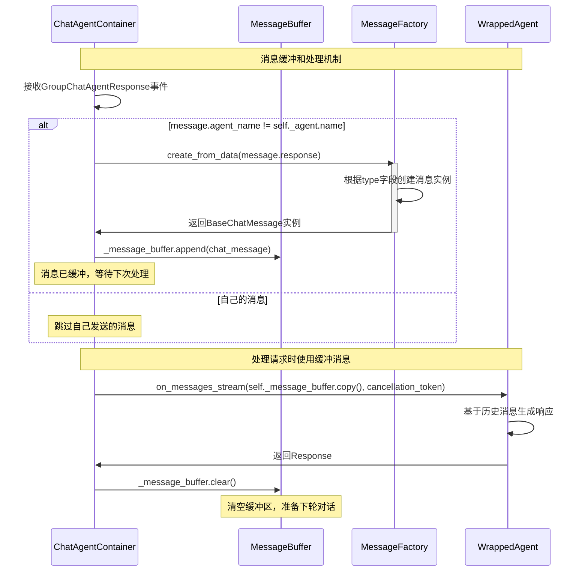
```mermaid
sequenceDiagram
    participant C as ChatAgentContainer
    participant MB as MessageBuffer
    participant MF as MessageFactory
    participant A as WrappedAgent

    Note over C,A: 消息缓冲和处理机制
    
    C->>C: 接收GroupChatAgentResponse事件
    
    alt message.agent_name != self._agent.name
        C->>MF: create_from_data(message.response)
        activate MF
        MF->>MF: 根据type字段创建消息实例
        MF->>C: 返回BaseChatMessage实例
        deactivate MF
        
        C->>MB: _message_buffer.append(chat_message)
        
        Note over C: 消息已缓冲，等待下次处理
    else 自己的消息
        Note over C: 跳过自己发送的消息
    end
    
    Note over C,A: 处理请求时使用缓冲消息
    C->>A: on_messages_stream(self._message_buffer.copy(), cancellation_token)
    A->>A: 基于历史消息生成响应
    A->>C: 返回Response
    
    C->>MB: _message_buffer.clear()
    Note over MB: 清空缓冲区，准备下轮对话
```

### 3.2 Swarm代理切换时序

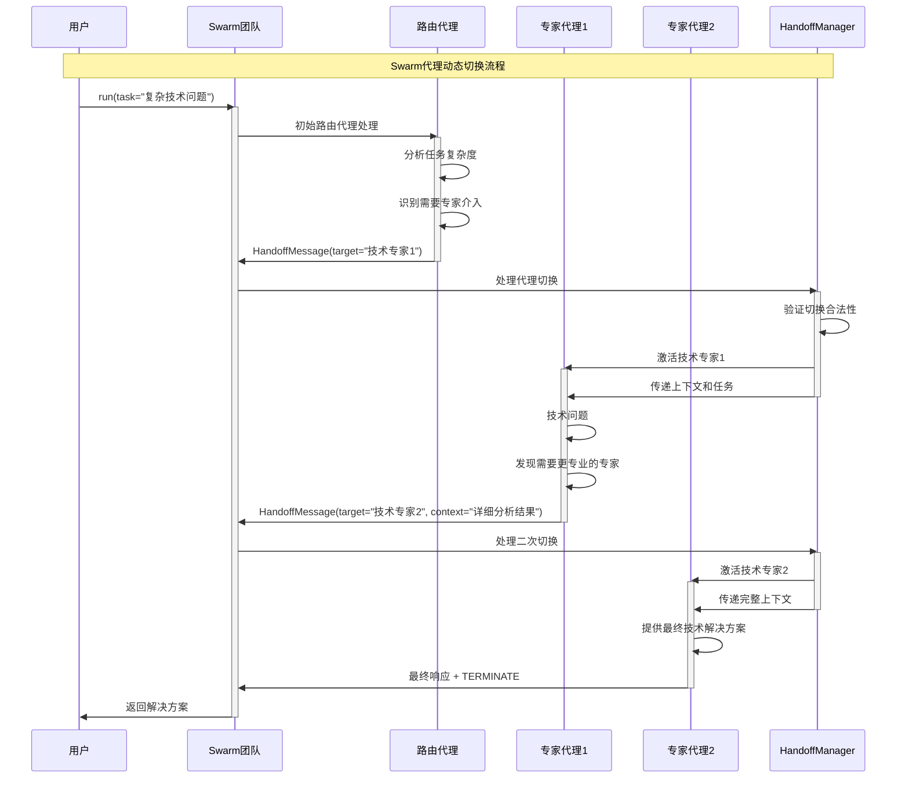
```mermaid
sequenceDiagram
    participant U as 用户
    participant SWARM as Swarm团队
    participant A1 as 路由代理
    participant A2 as 专家代理1
    participant A3 as 专家代理2
    participant HM as HandoffManager

    Note over U,HM: Swarm代理动态切换流程
    
    U->>SWARM: run(task="复杂技术问题")
    activate SWARM
    
    SWARM->>A1: 初始路由代理处理
    activate A1
    A1->>A1: 分析任务复杂度
    A1->>A1: 识别需要专家介入
    A1->>SWARM: HandoffMessage(target="技术专家1")
    deactivate A1
    
    SWARM->>HM: 处理代理切换
    activate HM
    HM->>HM: 验证切换合法性
    HM->>A2: 激活技术专家1
    activate A2
    HM->>A2: 传递上下文和任务
    deactivate HM
    
    A2->>A2: 技术问题
    A2->>A2: 发现需要更专业的专家
    A2->>SWARM: HandoffMessage(target="技术专家2", context="详细分析结果")
    deactivate A2
    
    SWARM->>HM: 处理二次切换
    activate HM
    HM->>A3: 激活技术专家2
    activate A3
    HM->>A3: 传递完整上下文
    deactivate HM
    
    A3->>A3: 提供最终技术解决方案
    A3->>SWARM: 最终响应 + TERMINATE
    deactivate A3
    
    SWARM->>U: 返回解决方案
    deactivate SWARM
```

## 4. 工具调用与执行时序

### 4.1 工具调用完整流程 (基于AssistantAgent._execute_tool_call实现)

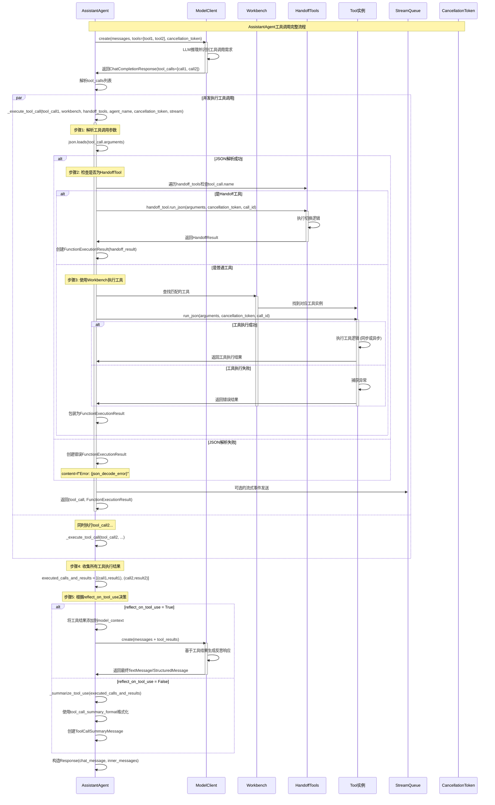
```mermaid
sequenceDiagram
    participant A as AssistantAgent
    participant MC as ModelClient
    participant WB as Workbench
    participant HT as HandoffTools
    participant T as Tool实例
    participant SQ as StreamQueue
    participant CT as CancellationToken

    Note over A,CT: AssistantAgent工具调用完整流程
    
    A->>MC: create(messages, tools=[tool1, tool2], cancellation_token)
    activate MC
    MC->>MC: LLM推理并识别工具调用需求
    MC->>A: 返回ChatCompletionResponse(tool_calls=[call1, call2])
    deactivate MC
    
    A->>A: 解析tool_calls列表
    
    par 并发执行工具调用
        A->>A: _execute_tool_call(tool_call1, workbench, handoff_tools, agent_name, cancellation_token, stream)
        activate A
        
        Note over A: 步骤1: 解析工具调用参数
        A->>A: json.loads(tool_call.arguments)
        
        alt JSON解析成功
            Note over A: 步骤2: 检查是否为HandoffTool
            A->>HT: 遍历handoff_tools检查tool_call.name
            
            alt 是Handoff工具
                A->>HT: handoff_tool.run_json(arguments, cancellation_token, call_id)
                activate HT
                HT->>HT: 执行切换逻辑
                HT->>A: 返回HandoffResult
                deactivate HT
                
                A->>A: 创建FunctionExecutionResult(handoff_result)
            else 是普通工具
                Note over A: 步骤3: 使用Workbench执行工具
                A->>WB: 查找匹配的工具
                activate WB
                WB->>T: 找到对应工具实例
                
                A->>T: run_json(arguments, cancellation_token, call_id)
                activate T
                
                alt 工具执行成功
                    T->>T: 执行工具逻辑 (同步或异步)
                    T->>A: 返回工具执行结果
                else 工具执行失败
                    T->>T: 捕获异常
                    T->>A: 返回错误结果
                end
                
                deactivate T
                deactivate WB
                
                A->>A: 包装为FunctionExecutionResult
            end
        else JSON解析失败
            A->>A: 创建错误FunctionExecutionResult
            Note over A: content=f"Error: {json_decode_error}"
        end
        
        A->>SQ: 可选的流式事件发送
        A->>A: 返回(tool_call, FunctionExecutionResult)
        deactivate A
    and
        Note over A: 同时执行tool_call2...
        A->>A: _execute_tool_call(tool_call2, ...)
    end
    
    Note over A: 步骤4: 收集所有工具执行结果
    A->>A: executed_calls_and_results = [(call1,result1), (call2,result2)]
    
    Note over A: 步骤5: 根据reflect_on_tool_use决策
    alt reflect_on_tool_use = True
        A->>A: 将工具结果添加到model_context
        A->>MC: create(messages + tool_results)
        activate MC
        MC->>MC: 基于工具结果生成反思响应
        MC->>A: 返回最终TextMessage/StructuredMessage
        deactivate MC
    else reflect_on_tool_use = False
        A->>A: _summarize_tool_use(executed_calls_and_results)
        A->>A: 使用tool_call_summary_format格式化
        A->>A: 创建ToolCallSummaryMessage
    end
    
    A->>A: 构造Response(chat_message, inner_messages)
```

#### 工具执行状态机

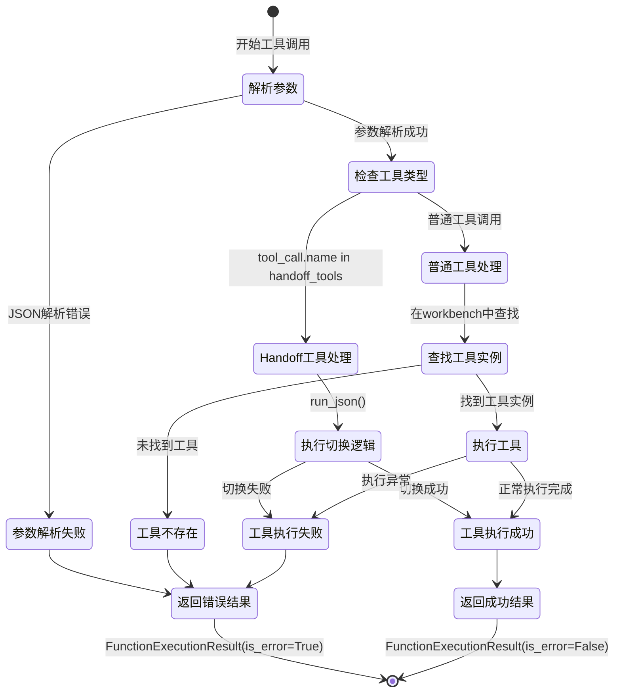
```mermaid
stateDiagram-v2
    [*] --> 解析参数 : 开始工具调用
    解析参数 --> 参数解析失败 : JSON解析错误
    解析参数 --> 检查工具类型 : 参数解析成功
    
    检查工具类型 --> Handoff工具处理 : tool_call.name in handoff_tools
    检查工具类型 --> 普通工具处理 : 普通工具调用
    
    Handoff工具处理 --> 执行切换逻辑 : run_json()
    执行切换逻辑 --> 工具执行成功 : 切换成功
    执行切换逻辑 --> 工具执行失败 : 切换失败
    
    普通工具处理 --> 查找工具实例 : 在workbench中查找
    查找工具实例 --> 工具不存在 : 未找到工具
    查找工具实例 --> 执行工具 : 找到工具实例
    
    执行工具 --> 工具执行成功 : 正常执行完成
    执行工具 --> 工具执行失败 : 执行异常
    
    参数解析失败 --> 返回错误结果
    工具不存在 --> 返回错误结果
    工具执行失败 --> 返回错误结果
    工具执行成功 --> 返回成功结果
    
    返回错误结果 --> [*] : FunctionExecutionResult(is_error=True)
    返回成功结果 --> [*] : FunctionExecutionResult(is_error=False)
```

### 4.2 工具执行错误处理

```mermaid
sequenceDiagram
    participant A as Agent
    participant EX as ExecutionEngine
    participant T as Tool
    participant EH as ErrorHandler
    participant MON as Monitor

    Note over A,MON: 工具执行错误处理流程
    
    A->>EX: execute_tool_with_retry(tool_call)
    activate EX
    
    loop 重试循环 (最多3次)
        EX->>T: 执行工具调用
        activate T
        
        alt 执行成功
            T->>EX: 返回执行结果
            EX->>A: 成功结果
            break
        else 执行失败
            T->>EX: 抛出异常
            deactivate T
            
            EX->>EH: handle_tool_error(exception)
            activate EH
            
            EH->>EH: 分析错误类型
            
            alt 可重试错误
                EH->>EX: 返回重试策略
                EH->>MON: 记录重试事件
                EX->>EX: 等待重试延迟
                Note over EX: 指数退避延迟
            else 不可重试错误
                EH->>EX: 返回终止信号
                EH->>MON: 记录严重错误
                EX->>A: 返回错误结果
                break
            end
            deactivate EH
        end
    end
    
    EX->>MON: 记录最终执行结果
    deactivate EX
```

## 5. 分布式系统交互时序

### 5.1 Worker注册和发现

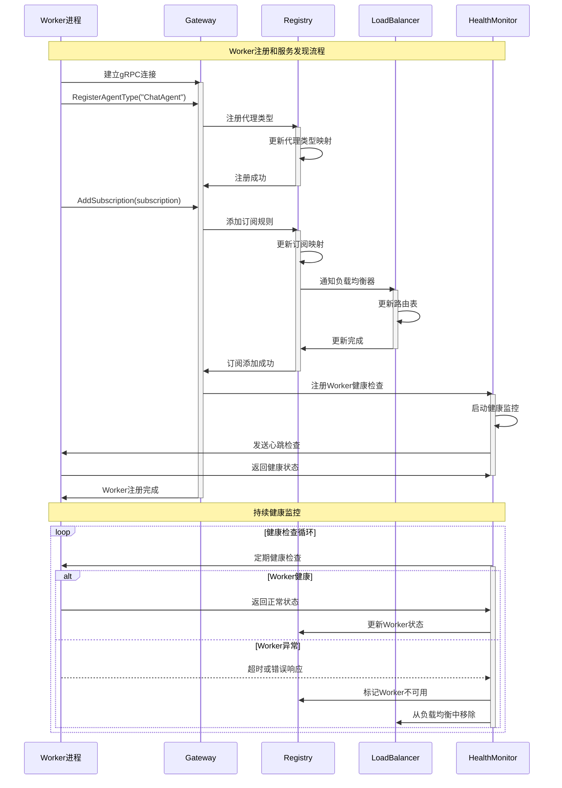
```mermaid
sequenceDiagram
    participant W as Worker进程
    participant GW as Gateway
    participant REG as Registry
    participant LB as LoadBalancer
    participant HM as HealthMonitor

    Note over W,HM: Worker注册和服务发现流程
    
    W->>GW: 建立gRPC连接
    activate GW
    
    W->>GW: RegisterAgentType("ChatAgent")
    GW->>REG: 注册代理类型
    activate REG
    REG->>REG: 更新代理类型映射
    REG->>GW: 注册成功
    deactivate REG
    
    W->>GW: AddSubscription(subscription)
    GW->>REG: 添加订阅规则
    activate REG
    REG->>REG: 更新订阅映射
    REG->>LB: 通知负载均衡器
    activate LB
    LB->>LB: 更新路由表
    LB->>REG: 更新完成
    deactivate LB
    REG->>GW: 订阅添加成功
    deactivate REG
    
    GW->>HM: 注册Worker健康检查
    activate HM
    HM->>HM: 启动健康监控
    HM->>W: 发送心跳检查
    W->>HM: 返回健康状态
    deactivate HM
    
    GW->>W: Worker注册完成
    deactivate GW
    
    Note over W,HM: 持续健康监控
    
    loop 健康检查循环
        HM->>W: 定期健康检查
        activate HM
        alt Worker健康
            W->>HM: 返回正常状态
            HM->>REG: 更新Worker状态
        else Worker异常
            W-->>HM: 超时或错误响应
            HM->>REG: 标记Worker不可用
            HM->>LB: 从负载均衡中移除
        end
        deactivate HM
    end
```

### 5.2 容错和故障恢复

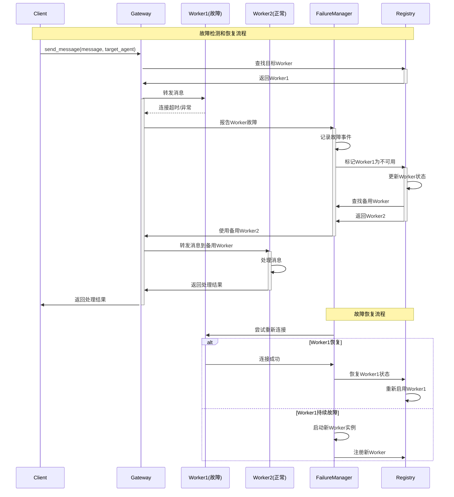
```mermaid
sequenceDiagram
    participant C as Client
    participant GW as Gateway
    participant W1 as Worker1(故障)
    participant W2 as Worker2(正常)
    participant FM as FailureManager
    participant REG as Registry

    Note over C,REG: 故障检测和恢复流程
    
    C->>GW: send_message(message, target_agent)
    activate GW
    
    GW->>REG: 查找目标Worker
    activate REG
    REG->>GW: 返回Worker1
    deactivate REG
    
    GW->>W1: 转发消息
    activate GW
    W1-->>GW: 连接超时/异常
    
    GW->>FM: 报告Worker故障
    activate FM
    FM->>FM: 记录故障事件
    FM->>REG: 标记Worker1为不可用
    activate REG
    REG->>REG: 更新Worker状态
    REG->>FM: 查找备用Worker
    REG->>FM: 返回Worker2
    deactivate REG
    
    FM->>GW: 使用备用Worker2
    deactivate FM
    
    GW->>W2: 转发消息到备用Worker
    activate W2
    W2->>W2: 处理消息
    W2->>GW: 返回处理结果
    deactivate W2
    
    GW->>C: 返回处理结果
    deactivate GW
    
    Note over FM,REG: 故障恢复流程
    
    FM->>W1: 尝试重新连接
    alt Worker1恢复
        W1->>FM: 连接成功
        FM->>REG: 恢复Worker1状态
        REG->>REG: 重新启用Worker1
    else Worker1持续故障
        FM->>FM: 启动新Worker实例
        FM->>REG: 注册新Worker
    end
```

## 6. 状态同步与一致性

### 6.1 分布式状态同步

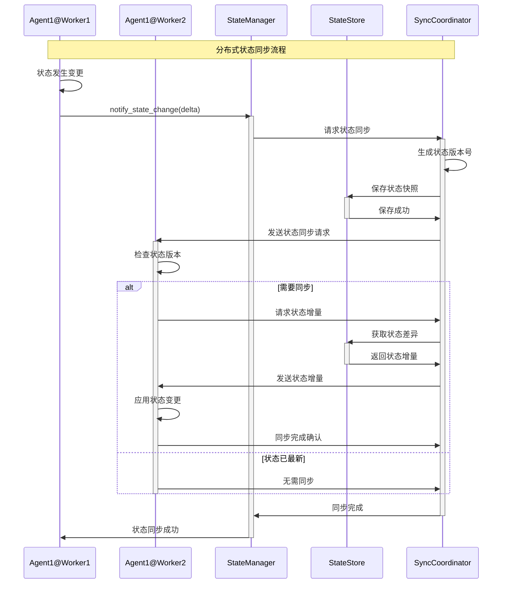
```mermaid
sequenceDiagram
    participant A1 as Agent1@Worker1
    participant A2 as Agent1@Worker2
    participant SM as StateManager
    participant SS as StateStore
    participant SC as SyncCoordinator

    Note over A1,SC: 分布式状态同步流程
    
    A1->>A1: 状态发生变更
    A1->>SM: notify_state_change(delta)
    activate SM
    
    SM->>SC: 请求状态同步
    activate SC
    SC->>SC: 生成状态版本号
    SC->>SS: 保存状态快照
    activate SS
    SS->>SC: 保存成功
    deactivate SS
    
    SC->>A2: 发送状态同步请求
    activate A2
    A2->>A2: 检查状态版本
    
    alt 需要同步
        A2->>SC: 请求状态增量
        SC->>SS: 获取状态差异
        activate SS
        SS->>SC: 返回状态增量
        deactivate SS
        SC->>A2: 发送状态增量
        A2->>A2: 应用状态变更
        A2->>SC: 同步完成确认
    else 状态已最新
        A2->>SC: 无需同步
    end
    
    deactivate A2
    SC->>SM: 同步完成
    deactivate SC
    SM->>A1: 状态同步成功
    deactivate SM
```

### 6.2 事务性消息处理

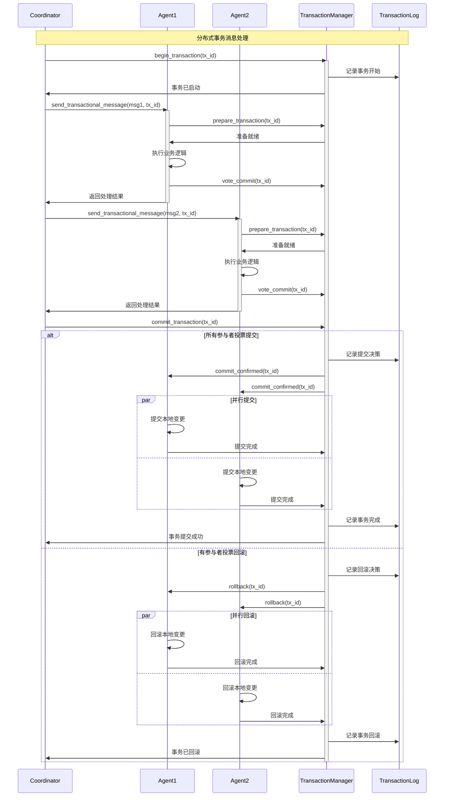
```mermaid
sequenceDiagram
    participant C as Coordinator
    participant A1 as Agent1
    participant A2 as Agent2
    participant TM as TransactionManager
    participant LOG as TransactionLog

    Note over C,LOG: 分布式事务消息处理
    
    C->>TM: begin_transaction(tx_id)
    activate TM
    TM->>LOG: 记录事务开始
    TM->>C: 事务已启动
    
    C->>A1: send_transactional_message(msg1, tx_id)
    activate A1
    A1->>TM: prepare_transaction(tx_id)
    TM->>A1: 准备就绪
    A1->>A1: 执行业务逻辑
    A1->>TM: vote_commit(tx_id)
    A1->>C: 返回处理结果
    deactivate A1
    
    C->>A2: send_transactional_message(msg2, tx_id)
    activate A2
    A2->>TM: prepare_transaction(tx_id)
    TM->>A2: 准备就绪
    A2->>A2: 执行业务逻辑
    A2->>TM: vote_commit(tx_id)
    A2->>C: 返回处理结果
    deactivate A2
    
    C->>TM: commit_transaction(tx_id)
    
    alt 所有参与者投票提交
        TM->>LOG: 记录提交决策
        TM->>A1: commit_confirmed(tx_id)
        TM->>A2: commit_confirmed(tx_id)
        
        par 并行提交
            A1->>A1: 提交本地变更
            A1->>TM: 提交完成
        and
            A2->>A2: 提交本地变更
            A2->>TM: 提交完成
        end
        
        TM->>LOG: 记录事务完成
        TM->>C: 事务提交成功
    else 有参与者投票回滚
        TM->>LOG: 记录回滚决策
        TM->>A1: rollback(tx_id)
        TM->>A2: rollback(tx_id)
        
        par 并行回滚
            A1->>A1: 回滚本地变更
            A1->>TM: 回滚完成
        and
            A2->>A2: 回滚本地变更
            A2->>TM: 回滚完成
        end
        
        TM->>LOG: 记录事务回滚
        TM->>C: 事务已回滚
    end
    
    deactivate TM
```

## 7. 代码执行代理时序

### 7.1 CodeExecutorAgent执行流程 (基于实际实现)

```mermaid
sequenceDiagram
    participant U as 用户
    participant CEA as CodeExecutorAgent
    participant MC as ModelClient
    participant MCT as ModelContext
    participant CB as CodeBlockExtractor
    participant CE as CodeExecutor
    participant AR as ApprovalRequest

    Note over U,AR: CodeExecutorAgent完整执行流程
    
    U->>CEA: run_stream(task="编写并执行Python代码计算斐波那契数列")
    activate CEA
    
    CEA->>MCT: 添加用户任务到model_context
    MCT->>MCT: add_message(UserMessage(task))
    
    Note over CEA: 重试循环 (max_retries_on_error)
    loop 最多重试次数
        CEA->>MCT: get_messages() 获取对话历史
        MCT->>CEA: 返回LLMMessage列表
        
        Note over CEA: 步骤1-2: 模型推理
        CEA->>MC: create(messages, cancellation_token)
        activate MC
        MC->>MC: LLM推理生成代码
        MC->>CEA: 返回ChatCompletionResponse
        deactivate MC
        
        CEA->>CEA: yield CodeGenerationEvent(content, retry_attempt)
        
        Note over CEA: 步骤3-4: 提取代码块
        CEA->>CB: _extract_markdown_code_blocks(model_result.content)
        activate CB
        CB->>CB: 正则表达式提取```...```代码块
        CB->>CEA: 返回code_blocks列表
        deactivate CB
        
        alt 无代码块
            CEA->>CEA: yield Response(TextMessage(model_result.content))
            Note over CEA: 直接返回文本响应，结束流程
            break
        end
        
        Note over CEA: 步骤5: 代码执行前审批 (如果启用)
        alt approval_func配置
            CEA->>AR: approval_func(ApprovalRequest(code_blocks))
            activate AR
            AR->>AR: 用户确认代码执行
            AR->>CEA: 返回ApprovalResponse(approved)
            deactivate AR
            
            alt 用户拒绝
                CEA->>CEA: yield Response("代码执行被用户拒绝")
                break
            end
        end
        
        Note over CEA: 步骤6-7: 执行代码块
        CEA->>CE: execute_code_block(code_blocks, cancellation_token)
        activate CE
        
        loop 对每个代码块
            CE->>CE: 根据语言选择执行器
            CE->>CE: 在隔离环境中执行代码
        end
        
        CE->>CEA: 返回CodeResult(output, exit_code)
        deactivate CE
        
        Note over CEA: 步骤8: 更新模型上下文
        CEA->>MCT: add_message(UserMessage(execution_result.output))
        
        CEA->>CEA: yield CodeExecutionEvent(result, retry_attempt)
        
        Note over CEA: 步骤9: 检查执行结果
        alt exit_code == 0 或 达到最大重试次数
            CEA->>CEA: 执行成功或重试耗尽，结束循环
            break
        else 执行失败且还有重试次数
            Note over CEA: 步骤10: 生成重试提示
            CEA->>CEA: 构造重试prompt询问是否继续
            CEA->>MC: create(messages + retry_prompt)
            MC->>CEA: 返回是否重试的决策
            
            alt 决定重试
                Note over CEA: 继续下一次循环
            else 决定停止
                CEA->>CEA: 结束重试循环
                break
            end
        end
    end
    
    CEA->>U: 最终返回TaskResult(所有messages)
    deactivate CEA
```

## 8. 流式处理时序

### 8.1 流式响应生成

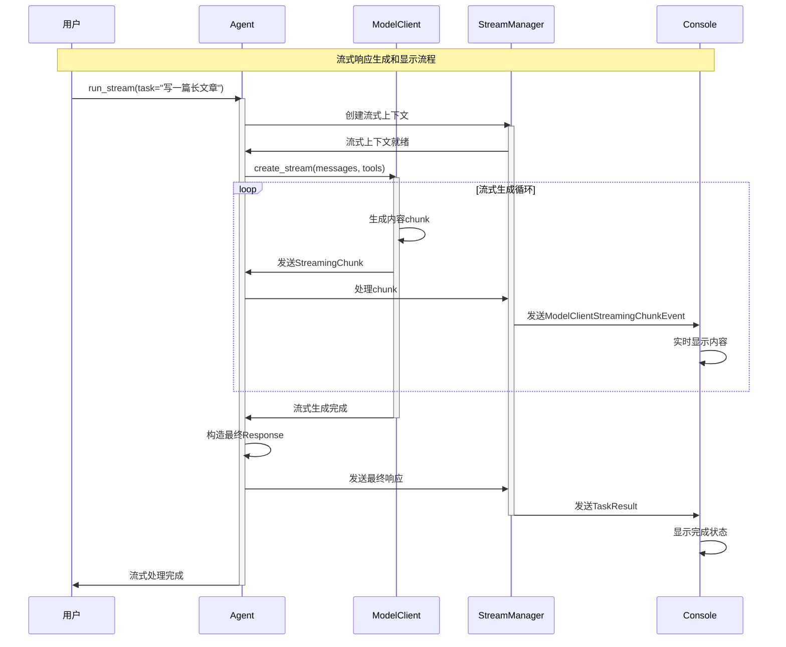
```mermaid
sequenceDiagram
    participant U as 用户
    participant A as Agent
    participant MC as ModelClient
    participant SM as StreamManager
    participant C as Console

    Note over U,C: 流式响应生成和显示流程
    
    U->>A: run_stream(task="写一篇长文章")
    activate A
    
    A->>SM: 创建流式上下文
    activate SM
    SM->>A: 流式上下文就绪
    
    A->>MC: create_stream(messages, tools)
    activate MC
    
    loop 流式生成循环
        MC->>MC: 生成内容chunk
        MC->>A: 发送StreamingChunk
        A->>SM: 处理chunk
        SM->>C: 发送ModelClientStreamingChunkEvent
        C->>C: 实时显示内容
    end
    
    MC->>A: 流式生成完成
    deactivate MC
    
    A->>A: 构造最终Response
    A->>SM: 发送最终响应
    SM->>C: 发送TaskResult
    deactivate SM
    
    C->>C: 显示完成状态
    A->>U: 流式处理完成
    deactivate A
```

### 7.2 团队流式协作

```mermaid
sequenceDiagram
    participant U as 用户
    participant T as Team
    participant A1 as Agent1
    participant A2 as Agent2
    participant A3 as Agent3
    participant SM as StreamManager

    Note over U,SM: 团队流式协作流程
    
    U->>T: run_stream(task="协作分析项目")
    activate T
    
    T->>SM: 初始化团队流式上下文
    activate SM
    
    loop 团队协作循环
        T->>A1: 分配子任务1
        activate A1
        
        A1->>A1: 处理子任务
        
        loop Agent1流式输出
            A1->>SM: 发送中间结果
            SM->>U: 流式显示Agent1进度
        end
        
        A1->>T: 子任务1完成
        deactivate A1
        
        T->>A2: 基于A1结果分配子任务2
        activate A2
        
        A2->>A2: 处理子任务2
        
        loop Agent2流式输出
            A2->>SM: 发送中间结果
            SM->>U: 流式显示Agent2进度
        end
        
        A2->>T: 子任务2完成
        deactivate A2
        
        T->>T: 检查终止条件
        
        break 当满足终止条件
    end
    
    T->>A3: 最终整合任务
    activate A3
    A3->>A3: 整合所有结果
    
    loop 最终输出流
        A3->>SM: 发送最终内容
        SM->>U: 流式显示最终结果
    end
    
    A3->>T: 整合完成
    deactivate A3
    
    T->>SM: 团队协作完成
    SM->>U: 发送TaskResult
    deactivate SM
    
    T->>U: 流式协作完成
    deactivate T
```

## 8. 监控和诊断时序

### 8.1 性能监控数据收集

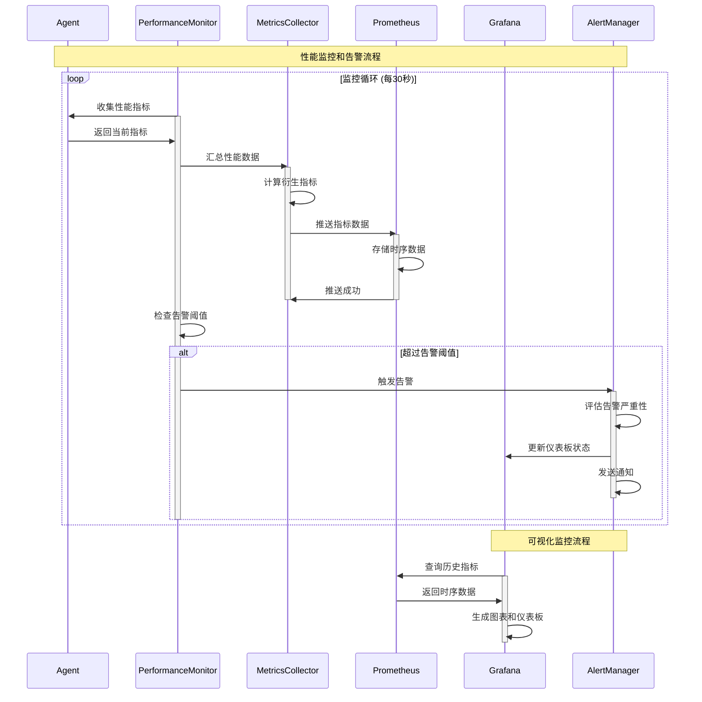
```mermaid
sequenceDiagram
    participant A as Agent
    participant PM as PerformanceMonitor
    participant MC as MetricsCollector
    participant PROM as Prometheus
    participant GRAF as Grafana
    participant AM as AlertManager

    Note over A,AM: 性能监控和告警流程
    
    loop 监控循环 (每30秒)
        PM->>A: 收集性能指标
        activate PM
        A->>PM: 返回当前指标
        
        PM->>MC: 汇总性能数据
        activate MC
        MC->>MC: 计算衍生指标
        MC->>PROM: 推送指标数据
        activate PROM
        PROM->>PROM: 存储时序数据
        PROM->>MC: 推送成功
        deactivate PROM
        deactivate MC
        
        PM->>PM: 检查告警阈值
        
        alt 超过告警阈值
            PM->>AM: 触发告警
            activate AM
            AM->>AM: 评估告警严重性
            AM->>GRAF: 更新仪表板状态
            AM->>AM: 发送通知
            deactivate AM
        end
        
        deactivate PM
    end
    
    Note over GRAF,AM: 可视化监控流程
    
    GRAF->>PROM: 查询历史指标
    activate GRAF
    PROM->>GRAF: 返回时序数据
    GRAF->>GRAF: 生成图表和仪表板
    deactivate GRAF
```

### 8.2 分布式链路追踪

```mermaid
sequenceDiagram
    participant C as Client
    participant G as Gateway
    participant W as Worker
    participant A as Agent
    participant JAEGER as Jaeger

    Note over C,JAEGER: 分布式链路追踪流程
    
    C->>G: 发送请求 (生成TraceID)
    activate G
    G->>JAEGER: 开始根Span
    activate JAEGER
    
    G->>W: 转发请求 (传播TraceID)
    activate W
    W->>JAEGER: 创建子Span
    
    W->>A: 调用代理 (传播TraceID) 
    activate A
    A->>JAEGER: 创建代理处理Span
    
    A->>A: 执行业务逻辑
    
    loop 代理内部操作追踪
        A->>JAEGER: 记录操作事件
        JAEGER->>JAEGER: 添加Span事件
    end
    
    A->>JAEGER: 完成代理Span
    A->>W: 返回处理结果
    deactivate A
    
    W->>JAEGER: 完成Worker Span
    W->>G: 返回结果
    deactivate W
    
    G->>JAEGER: 完成Gateway Span
    deactivate JAEGER
    
    G->>C: 返回最终结果
    deactivate G
    
    Note over JAEGER: 链路分析和可视化
    
    JAEGER->>JAEGER: 分析完整调用链
    JAEGER->>JAEGER: 识别性能瓶颈
    JAEGER->>JAEGER: 生成链路拓扑图
```

## 9. 总结

通过这些详细的时序图分析，我们可以清晰地看到AutoGen系统的核心交互模式：

### 9.1 关键设计模式

1. **异步事件驱动**：所有交互都基于异步事件，避免阻塞
2. **发布订阅解耦**：发布者和订阅者完全解耦，提高系统弹性
3. **工厂模式延迟加载**：代理按需创建，优化资源使用
4. **中间件模式**：可插拔的中间件支持横切关注点
5. **断路器模式**：故障隔离和快速恢复

### 9.2 性能优化要点

1. **并发处理**：消息处理、工具调用、状态同步都采用并发模式
2. **连接复用**：gRPC连接池和长连接复用
3. **批处理优化**：消息批处理和状态批量同步
4. **缓存策略**：多级缓存减少重复计算
5. **资源管理**：对象池和生命周期管理

### 9.3 可靠性保障

1. **故障检测**：主动健康检查和被动故障发现
2. **自动恢复**：Worker故障自动切换和重连
3. **状态一致性**：分布式状态同步和事务管理
4. **监控告警**：全链路监控和智能告警
5. **优雅降级**：服务降级和熔断保护

这些时序图为理解AutoGen的运行机制提供了清晰的视角，有助于开发者设计高效可靠的多代理应用系统。
