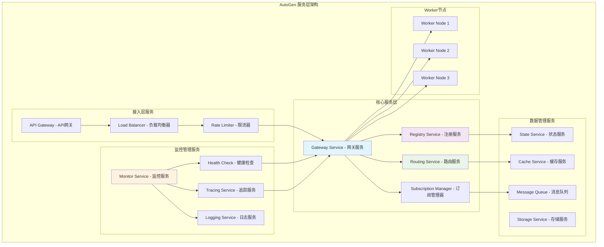
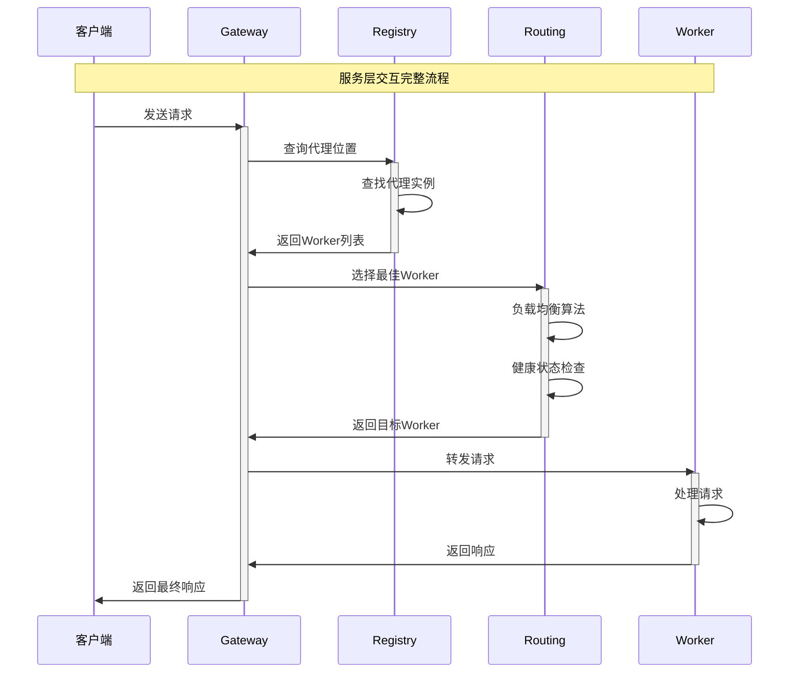

## 概述

AutoGen的服务层是分布式代理系统的核心支撑，负责代理注册、消息路由、负载均衡、状态管理等关键功能。Gateway、Registry、Routing等核心服务组件的设计理念和实现细节。

## 1. 服务层整体架构

### 1.1 服务组件架构图



### 1.2 服务交互模式



## 2. Gateway网关服务详解

### 2.1 Gateway核心功能

```csharp
/// <summary>
/// AutoGen Gateway服务 - 统一入口和请求分发
/// </summary>
public class AutoGenGatewayService : BackgroundService
{
    private readonly IServiceRegistry _registry;
    private readonly ILoadBalancer _loadBalancer;
    private readonly IMessageRouter _messageRouter;
    private readonly ILogger<AutoGenGatewayService> _logger;
    private readonly GatewayConfiguration _config;

    public AutoGenGatewayService(
        IServiceRegistry registry,
        ILoadBalancer loadBalancer,
        IMessageRouter messageRouter,
        ILogger<AutoGenGatewayService> logger,
        IOptions<GatewayConfiguration> config)
    {
        _registry = registry;
        _loadBalancer = loadBalancer;
        _messageRouter = messageRouter;
        _logger = logger;
        _config = config.Value;
    }

    /// <summary>
    /// 处理客户端请求的核心方法
    /// </summary>
    public async Task<GatewayResponse> ProcessRequestAsync(
        GatewayRequest request, 
        CancellationToken cancellationToken = default)
    {
        var requestId = Guid.NewGuid().ToString();
        var startTime = DateTime.UtcNow;
        
        try
        {
            // 1. 请求验证和鉴权
            var authResult = await ValidateAndAuthorizeRequest(request);
            if (!authResult.IsValid)
            {
                return CreateErrorResponse(requestId, "认证失败", authResult.ErrorMessage);
            }
            
            // 2. 限流检查
            var rateLimitResult = await CheckRateLimit(request.ClientId, request.RequestType);
            if (rateLimitResult.IsBlocked)
            {
                return CreateErrorResponse(requestId, "请求过于频繁", "请稍后重试");
            }
            
            // 3. 查找目标代理
            var agentLocations = await _registry.FindAgentLocationsAsync(request.TargetAgent);
            if (!agentLocations.Any())
            {
                return CreateErrorResponse(requestId, "代理不存在", $"未找到代理: {request.TargetAgent}");
            }
            
            // 4. 负载均衡选择Worker
            var selectedWorker = await _loadBalancer.SelectWorkerAsync(
                agentLocations, 
                request.LoadBalancingStrategy
            );
            
            // 5. 转发请求到Worker
            var workerResponse = await ForwardRequestToWorker(selectedWorker, request, requestId, cancellationToken);
            
            // 6. 记录请求指标
            await RecordRequestMetrics(requestId, startTime, workerResponse.IsSuccess);
            
            return workerResponse;
        }
        catch (Exception ex)
        {
            _logger.LogError(ex, "处理网关请求时发生错误: {RequestId}", requestId);
            return CreateErrorResponse(requestId, "内部错误", "系统暂时不可用");
        }
    }

    /// <summary>
    /// 转发请求到Worker节点
    /// </summary>
    private async Task<GatewayResponse> ForwardRequestToWorker(
        WorkerNode worker, 
        GatewayRequest request, 
        string requestId,
        CancellationToken cancellationToken)
    {
        var forwardingStartTime = DateTime.UtcNow;
        
        try
        {
            // 创建gRPC客户端
            using var channel = GrpcChannel.ForAddress(worker.Endpoint);
            var client = new AgentRpc.AgentRpcClient(channel);
            
            // 构造RPC请求
            var rpcRequest = new RpcRequest
            {
                RequestId = requestId,
                Target = new Protobuf.AgentId 
                { 
                    Type = request.TargetAgent.Type, 
                    Key = request.TargetAgent.Key 
                },
                Method = request.Method,
                Payload = SerializePayload(request.Message),
                Metadata = { request.Metadata }
            };
            
            // 设置超时和重试
            var callOptions = new CallOptions(
                deadline: DateTime.UtcNow.AddSeconds(_config.RequestTimeoutSeconds),
                cancellationToken: cancellationToken
            );
            
            // 发送请求
            var stream = client.OpenChannel(callOptions);
            await stream.RequestStream.WriteAsync(new Message { Request = rpcRequest });
            
            // 等待响应
            var responseTask = ReadResponseFromStream(stream.ResponseStream, requestId);
            var response = await responseTask.WaitAsync(cancellationToken);
            
            // 记录转发指标
            var forwardingDuration = DateTime.UtcNow - forwardingStartTime;
            await RecordForwardingMetrics(worker.Id, forwardingDuration, true);
            
            return CreateSuccessResponse(requestId, response);
        }
        catch (RpcException rpcEx)
        {
            _logger.LogWarning("gRPC调用失败: {WorkerId}, {Error}", worker.Id, rpcEx.Message);
            
            // 标记Worker为不健康
            await _registry.MarkWorkerUnhealthyAsync(worker.Id);
            
            return CreateErrorResponse(requestId, "Worker不可用", rpcEx.Message);
        }
        catch (Exception ex)
        {
            _logger.LogError(ex, "转发请求到Worker失败: {WorkerId}", worker.Id);
            return CreateErrorResponse(requestId, "转发失败", ex.Message);
        }
    }

    /// <summary>
    /// 请求验证和鉴权
    /// </summary>
    private async Task<AuthorizationResult> ValidateAndAuthorizeRequest(GatewayRequest request)
    {
        // 1. 检查请求格式
        if (string.IsNullOrEmpty(request.ClientId))
        {
            return AuthorizationResult.Failed("客户端ID不能为空");
        }
        
        if (request.TargetAgent == null)
        {
            return AuthorizationResult.Failed("目标代理不能为空");
        }
        
        // 2. JWT Token验证
        if (!string.IsNullOrEmpty(request.AuthToken))
        {
            var tokenValidation = await ValidateJwtToken(request.AuthToken);
            if (!tokenValidation.IsValid)
            {
                return AuthorizationResult.Failed("Token验证失败");
            }
        }
        
        // 3. API Key验证
        if (!string.IsNullOrEmpty(request.ApiKey))
        {
            var apiKeyValidation = await ValidateApiKey(request.ApiKey);
            if (!apiKeyValidation.IsValid)
            {
                return AuthorizationResult.Failed("API Key无效");
            }
        }
        
        // 4. 权限检查
        var permissionCheck = await CheckPermissions(request.ClientId, request.TargetAgent);
        if (!permissionCheck.HasPermission)
        {
            return AuthorizationResult.Failed("权限不足");
        }
        
        return AuthorizationResult.Success();
    }
}
```

### 2.2 智能负载均衡

```python
class IntelligentLoadBalancer:
    """智能负载均衡器 - 基于多种策略的Worker选择"""
    
    def __init__(self):
        self.strategies = {
            'round_robin': self._round_robin_strategy,
            'least_connections': self._least_connections_strategy,
            'weighted_response_time': self._weighted_response_time_strategy,
            'cpu_based': self._cpu_based_strategy,
            'adaptive': self._adaptive_strategy
        }
        self.worker_stats = {}
        self.strategy_performance = {}
    
    async def select_worker(
        self, 
        available_workers: List[WorkerNode], 
        strategy: str = 'adaptive',
        request_context: Optional[RequestContext] = None
    ) -> WorkerNode:
        """
        选择最佳Worker节点
        
        Args:
            available_workers: 可用Worker节点列表
            strategy: 负载均衡策略
            request_context: 请求上下文信息
            
        Returns:
            WorkerNode: 选中的Worker节点
        """
        
        if not available_workers:
            raise NoAvailableWorkersException("没有可用的Worker节点")
        
        # 过滤健康的Worker
        healthy_workers = [w for w in available_workers if w.is_healthy]
        if not healthy_workers:
            # 如果没有健康的Worker，尝试使用状态未知的Worker
            healthy_workers = [w for w in available_workers if w.health_status != 'unhealthy']
        
        if not healthy_workers:
            raise NoHealthyWorkersException("没有健康的Worker节点")
        
        # 应用负载均衡策略
        if strategy in self.strategies:
            selected_worker = await self.strategies[strategy](healthy_workers, request_context)
        else:
            # 默认使用轮询策略
            selected_worker = await self._round_robin_strategy(healthy_workers, request_context)
        
        # 更新Worker统计信息
        await self._update_worker_stats(selected_worker.id, 'selected')
        
        return selected_worker
    
    async def _adaptive_strategy(
        self, 
        workers: List[WorkerNode], 
        context: Optional[RequestContext]
    ) -> WorkerNode:
        """
        自适应负载均衡策略
        
        综合考虑响应时间、CPU使用率、连接数等多个因素，
        动态选择最优的Worker节点
        """
        
        scores = {}
        
        for worker in workers:
            # 获取Worker实时统计
            stats = await self._get_worker_realtime_stats(worker.id)
            
            # 计算综合得分 (得分越低越好)
            score = 0.0
            
            # 响应时间因子 (权重: 40%)
            avg_response_time = stats.get('avg_response_time', 1.0)
            score += (avg_response_time / 10.0) * 0.4
            
            # CPU使用率因子 (权重: 30%)
            cpu_usage = stats.get('cpu_usage', 0.5)
            score += cpu_usage * 0.3
            
            # 连接数因子 (权重: 20%)
            connection_ratio = stats.get('active_connections', 0) / worker.max_connections
            score += connection_ratio * 0.2
            
            # 错误率因子 (权重: 10%)
            error_rate = stats.get('error_rate', 0.0)
            score += error_rate * 0.1
            
            scores[worker.id] = score
        
        # 选择得分最低的Worker
        best_worker_id = min(scores.keys(), key=lambda k: scores[k])
        return next(w for w in workers if w.id == best_worker_id)
    
    async def _weighted_response_time_strategy(
        self, 
        workers: List[WorkerNode], 
        context: Optional[RequestContext]
    ) -> WorkerNode:
        """基于加权响应时间的负载均衡"""
        
        # 收集所有Worker的响应时间统计
        response_times = {}
        for worker in workers:
            stats = await self._get_worker_realtime_stats(worker.id)
            response_times[worker.id] = stats.get('avg_response_time', 1.0)
        
        # 计算权重 (响应时间越短权重越高)
        max_response_time = max(response_times.values())
        weights = {}
        for worker_id, response_time in response_times.items():
            # 权重 = (最大响应时间 - 当前响应时间) / 最大响应时间
            weights[worker_id] = (max_response_time - response_time) / max_response_time + 0.1
        
        # 加权随机选择
        total_weight = sum(weights.values())
        random_value = random.random() * total_weight
        
        cumulative_weight = 0
        for worker in workers:
            cumulative_weight += weights[worker.id]
            if random_value <= cumulative_weight:
                return worker
        
        # 默认返回第一个Worker
        return workers[0]
```

## 3. Registry注册服务详解

### 3.1 分布式代理注册表

```python
class DistributedAgentRegistry:
    """分布式代理注册表 - 管理代理和Worker的注册信息"""
    
    def __init__(self, storage_backend: StorageBackend, consistency_level: str = 'eventual'):
        self.storage = storage_backend
        self.consistency_level = consistency_level
        self.local_cache = TTLCache(maxsize=10000, ttl=300)
        self.update_listeners = []
        self.registry_lock = asyncio.RLock()
    
    async def register_agent_type(
        self, 
        worker_id: str, 
        agent_type: str, 
        capabilities: Dict[str, Any],
        metadata: Optional[Dict[str, Any]] = None
    ) -> RegistrationResult:
        """
        注册代理类型到注册表
        
        Args:
            worker_id: Worker节点标识
            agent_type: 代理类型名称
            capabilities: 代理能力描述
            metadata: 附加元数据
            
        Returns:
            RegistrationResult: 注册结果
        """
        
        async with self.registry_lock:
            try:
                # 1. 验证注册请求
                validation_result = await self._validate_registration(worker_id, agent_type, capabilities)
                if not validation_result.is_valid:
                    return RegistrationResult(
                        success=False,
                        error=f"注册验证失败: {validation_result.error}"
                    )
                
                # 2. 检查是否已存在
                existing_registration = await self._find_existing_registration(worker_id, agent_type)
                
                # 3. 创建注册记录
                registration_record = AgentRegistration(
                    worker_id=worker_id,
                    agent_type=agent_type,
                    capabilities=capabilities,
                    metadata=metadata or {},
                    registered_at=datetime.utcnow(),
                    last_heartbeat=datetime.utcnow(),
                    status='active'
                )
                
                # 4. 持久化注册信息
                if existing_registration:
                    await self.storage.update_registration(registration_record)
                else:
                    await self.storage.create_registration(registration_record)
                
                # 5. 更新本地缓存
                cache_key = f"agent:{agent_type}:workers"
                cached_workers = self.local_cache.get(cache_key, [])
                if worker_id not in [w['worker_id'] for w in cached_workers]:
                    cached_workers.append({
                        'worker_id': worker_id,
                        'capabilities': capabilities,
                        'registered_at': registration_record.registered_at.isoformat()
                    })
                    self.local_cache[cache_key] = cached_workers
                
                # 6. 通知监听器
                await self._notify_registration_listeners('agent_registered', registration_record)
                
                return RegistrationResult(
                    success=True,
                    registration_id=f"{worker_id}:{agent_type}"
                )
            
            except Exception as e:
                _logger.error(f"代理注册失败: {e}", exc_info=True)
                return RegistrationResult(
                    success=False,
                    error=f"注册过程中发生错误: {str(e)}"
                )
    
    async def find_agent_locations(self, agent_id: AgentId) -> List[WorkerLocation]:
        """
        查找代理的位置信息
        
        Args:
            agent_id: 目标代理ID
            
        Returns:
            List[WorkerLocation]: Worker位置列表
        """
        
        # 1. 检查本地缓存
        cache_key = f"agent:{agent_id.type}:locations"
        cached_locations = self.local_cache.get(cache_key)
        
        if cached_locations and self.consistency_level == 'eventual':
            return [WorkerLocation(**loc) for loc in cached_locations]
        
        # 2. 从持久化存储查询
        registrations = await self.storage.find_registrations_by_agent_type(agent_id.type)
        
        # 3. 过滤活跃的Worker
        active_registrations = [
            reg for reg in registrations 
            if reg.status == 'active' and self._is_worker_responsive(reg.worker_id)
        ]
        
        # 4. 构造位置信息
        locations = []
        for registration in active_registrations:
            worker_info = await self.storage.get_worker_info(registration.worker_id)
            if worker_info:
                location = WorkerLocation(
                    worker_id=registration.worker_id,
                    endpoint=worker_info.endpoint,
                    capabilities=registration.capabilities,
                    load_score=await self._calculate_load_score(registration.worker_id),
                    last_seen=registration.last_heartbeat
                )
                locations.append(location)
        
        # 5. 更新缓存
        if locations:
            self.local_cache[cache_key] = [loc.to_dict() for loc in locations]
        
        return locations
    
    async def heartbeat_update(self, worker_id: str, health_info: Dict[str, Any]) -> None:
        """
        更新Worker心跳信息
        
        Args:
            worker_id: Worker标识
            health_info: 健康状态信息
        """
        
        try:
            # 1. 更新心跳时间戳
            await self.storage.update_worker_heartbeat(worker_id, datetime.utcnow())
            
            # 2. 更新健康状态
            await self.storage.update_worker_health(worker_id, health_info)
            
            # 3. 检查Worker状态变化
            previous_status = await self._get_worker_previous_status(worker_id)
            current_status = health_info.get('status', 'unknown')
            
            if previous_status != current_status:
                # 状态发生变化，通知监听器
                await self._notify_registration_listeners('worker_status_changed', {
                    'worker_id': worker_id,
                    'previous_status': previous_status,
                    'current_status': current_status,
                    'health_info': health_info
                })
                
                # 清除相关缓存
                await self._invalidate_worker_cache(worker_id)
        
        except Exception as e:
            _logger.error(f"更新Worker心跳失败: {worker_id}, {e}")
    
    async def _calculate_load_score(self, worker_id: str) -> float:
        """计算Worker负载得分"""
        
        stats = await self.storage.get_worker_stats(worker_id)
        if not stats:
            return 1.0  # 默认负载得分
        
        # 综合多个指标计算负载得分
        cpu_score = stats.get('cpu_usage', 0.5)
        memory_score = stats.get('memory_usage', 0.5) 
        connection_score = stats.get('connection_ratio', 0.5)
        response_time_score = min(stats.get('avg_response_time', 1.0) / 5.0, 1.0)
        
        # 加权平均
        load_score = (cpu_score * 0.3 + 
                     memory_score * 0.2 + 
                     connection_score * 0.3 + 
                     response_time_score * 0.2)
        
        return max(0.0, min(1.0, load_score))  # 限制在[0,1]范围内
```

## 4. Routing路由服务详解

### 4.1 智能消息路由

```python
class IntelligentMessageRouter:
    """智能消息路由器 - 基于内容和上下文的智能路由"""
    
    def __init__(self):
        self.routing_rules = RoutingRuleEngine()
        self.route_cache = TTLCache(maxsize=50000, ttl=600)  # 10分钟缓存
        self.routing_history = deque(maxlen=1000)  # 保留最近1000次路由记录
        self.ml_router = MachineLearningRouter()
    
    async def route_message(
        self, 
        message: Any, 
        sender: Optional[AgentId], 
        routing_hint: Optional[RoutingHint] = None
    ) -> RoutingDecision:
        """
        智能路由消息到最合适的代理
        
        Args:
            message: 要路由的消息
            sender: 发送方代理ID
            routing_hint: 路由提示信息
            
        Returns:
            RoutingDecision: 路由决策结果
        """
        
        routing_context = RoutingContext(
            message=message,
            sender=sender,
            timestamp=datetime.utcnow(),
            hint=routing_hint
        )
        
        # 1. 快速规则路由
        rule_decision = await self._apply_routing_rules(routing_context)
        if rule_decision.confidence > 0.9:
            await self._record_routing_decision(routing_context, rule_decision, 'rule_based')
            return rule_decision
        
        # 2. 基于历史的相似性路由  
        similarity_decision = await self._similarity_based_routing(routing_context)
        if similarity_decision.confidence > 0.8:
            await self._record_routing_decision(routing_context, similarity_decision, 'similarity_based')
            return similarity_decision
        
        # 3. 机器学习路由
        ml_decision = await self.ml_router.predict_best_agent(routing_context)
        if ml_decision.confidence > 0.7:
            await self._record_routing_decision(routing_context, ml_decision, 'ml_based')
            return ml_decision
        
        # 4. 默认路由 (负载均衡)
        default_decision = await self._default_load_balanced_routing(routing_context)
        await self._record_routing_decision(routing_context, default_decision, 'default')
        
        return default_decision
    
    async def _apply_routing_rules(self, context: RoutingContext) -> RoutingDecision:
        """应用路由规则引擎"""
        
        message_content = self._extract_message_content(context.message)
        
        # 内容分析路由规则
        content_rules = [
            {
                'pattern': r'天气|气温|温度',
                'target_agent_type': 'WeatherAgent',
                'confidence': 0.95
            },
            {
                'pattern': r'计算|数学|运算',
                'target_agent_type': 'CalculatorAgent', 
                'confidence': 0.95
            },
            {
                'pattern': r'代码|编程|程序',
                'target_agent_type': 'CoderAgent',
                'confidence': 0.9
            },
            {
                'pattern': r'翻译|translate',
                'target_agent_type': 'TranslatorAgent',
                'confidence': 0.9
            }
        ]
        
        # 应用规则匹配
        for rule in content_rules:
            if re.search(rule['pattern'], message_content, re.IGNORECASE):
                return RoutingDecision(
                    target_agent_type=rule['target_agent_type'],
                    confidence=rule['confidence'],
                    reasoning=f"匹配规则: {rule['pattern']}",
                    routing_strategy='rule_based'
                )
        
        # 发送方路由规则
        if context.sender:
            sender_rules = await self._get_sender_based_rules(context.sender.type)
            for rule in sender_rules:
                if rule.matches(context):
                    return RoutingDecision(
                        target_agent_type=rule.target_type,
                        confidence=rule.confidence,
                        reasoning=f"发送方规则: {rule.description}",
                        routing_strategy='sender_based'
                    )
        
        # 无匹配规则
        return RoutingDecision(
            target_agent_type=None,
            confidence=0.0,
            reasoning="无匹配的路由规则"
        )
    
    async def _similarity_based_routing(self, context: RoutingContext) -> RoutingDecision:
        """基于历史相似性的路由"""
        
        # 1. 提取消息特征
        message_features = await self._extract_message_features(context.message)
        
        # 2. 在历史记录中查找相似消息
        similar_records = []
        for historical_record in self.routing_history:
            similarity = await self._calculate_similarity(message_features, historical_record.features)
            if similarity > 0.7:  # 相似度阈值
                similar_records.append((historical_record, similarity))
        
        if not similar_records:
            return RoutingDecision(confidence=0.0, reasoning="无相似历史记录")
        
        # 3. 按相似度排序
        similar_records.sort(key=lambda x: x[1], reverse=True)
        
        # 4. 分析最相似记录的路由结果
        most_similar_record, similarity = similar_records[0]
        
        if most_similar_record.routing_success_rate > 0.8:
            return RoutingDecision(
                target_agent_type=most_similar_record.target_agent_type,
                confidence=similarity * most_similar_record.routing_success_rate,
                reasoning=f"基于相似度 {similarity:.2f} 的历史记录",
                routing_strategy='similarity_based'
            )
        
        return RoutingDecision(confidence=0.0, reasoning="相似记录成功率过低")
    
    async def update_routing_feedback(
        self, 
        routing_id: str, 
        success: bool, 
        response_time: float,
        user_satisfaction: Optional[float] = None
    ) -> None:
        """更新路由反馈信息，用于优化路由算法"""
        
        # 1. 查找路由记录
        routing_record = await self._find_routing_record(routing_id)
        if not routing_record:
            return
        
        # 2. 更新反馈信息
        routing_record.success = success
        routing_record.response_time = response_time
        routing_record.user_satisfaction = user_satisfaction
        routing_record.feedback_updated_at = datetime.utcnow()
        
        # 3. 更新路由成功率统计
        await self._update_routing_success_rate(
            routing_record.target_agent_type,
            routing_record.routing_strategy,
            success
        )
        
        # 4. 训练机器学习模型
        if len(self.routing_history) % 100 == 0:  # 每100次反馈重训练一次
            await self.ml_router.retrain_model(list(self.routing_history))
```

### 4.2 订阅管理器

```python
class AdvancedSubscriptionManager:
    """高级订阅管理器 - 支持动态订阅和复杂匹配规则"""
    
    def __init__(self):
        self.subscriptions = {}
        self.subscription_index = SubscriptionIndex()  # 高效的订阅索引
        self.dynamic_subscriptions = {}  # 动态订阅
        self.subscription_stats = {}
    
    async def add_subscription(
        self, 
        subscription: Subscription,
        is_dynamic: bool = False,
        ttl: Optional[int] = None
    ) -> str:
        """
        添加订阅规则
        
        Args:
            subscription: 订阅规则
            is_dynamic: 是否为动态订阅
            ttl: 生存时间（秒）
            
        Returns:
            str: 订阅ID
        """
        
        subscription_id = subscription.id or str(uuid.uuid4())
        
        # 1. 验证订阅规则
        validation_result = await self._validate_subscription(subscription)
        if not validation_result.is_valid:
            raise ValueError(f"订阅验证失败: {validation_result.error}")
        
        # 2. 检查重复订阅
        existing_subscription = await self._find_duplicate_subscription(subscription)
        if existing_subscription:
            return existing_subscription.id
        
        # 3. 存储订阅
        subscription.id = subscription_id
        self.subscriptions[subscription_id] = subscription
        
        # 4. 更新索引
        await self.subscription_index.add_subscription(subscription)
        
        # 5. 处理动态订阅
        if is_dynamic:
            self.dynamic_subscriptions[subscription_id] = {
                'subscription': subscription,
                'created_at': datetime.utcnow(),
                'ttl': ttl,
                'access_count': 0
            }
            
            # 设置过期定时器
            if ttl:
                asyncio.create_task(self._schedule_subscription_expiry(subscription_id, ttl))
        
        # 6. 初始化统计信息
        self.subscription_stats[subscription_id] = {
            'match_count': 0,
            'success_count': 0,
            'average_processing_time': 0.0,
            'last_matched': None
        }
        
        return subscription_id
    
    async def match_subscriptions(self, topic_id: TopicId) -> List[SubscriptionMatch]:
        """
        匹配订阅规则
        
        Args:
            topic_id: 主题ID
            
        Returns:
            List[SubscriptionMatch]: 匹配的订阅列表
        """
        
        # 1. 使用索引快速查找候选订阅
        candidate_subscriptions = await self.subscription_index.find_candidates(topic_id)
        
        # 2. 精确匹配验证
        matches = []
        for subscription in candidate_subscriptions:
            if subscription.is_match(topic_id):
                try:
                    agent_id = subscription.map_to_agent(topic_id)
                    
                    match = SubscriptionMatch(
                        subscription_id=subscription.id,
                        subscription=subscription,
                        target_agent_id=agent_id,
                        match_confidence=self._calculate_match_confidence(subscription, topic_id)
                    )
                    matches.append(match)
                    
                    # 更新匹配统计
                    await self._update_subscription_stats(subscription.id, 'match')
                
                except Exception as e:
                    _logger.warning(f"订阅映射失败: {subscription.id}, {e}")
        
        # 3. 按匹配度排序
        matches.sort(key=lambda m: m.match_confidence, reverse=True)
        
        return matches
    
    async def optimize_subscriptions(self) -> OptimizationResult:
        """优化订阅规则 - 基于使用统计进行优化"""
        
        optimization_result = OptimizationResult()
        
        # 1. 分析低效订阅
        low_usage_subscriptions = []
        for sub_id, stats in self.subscription_stats.items():
            if stats['match_count'] == 0 and self._is_subscription_old(sub_id):
                low_usage_subscriptions.append(sub_id)
        
        # 2. 清理无用订阅
        for sub_id in low_usage_subscriptions:
            await self.remove_subscription(sub_id)
            optimization_result.removed_subscriptions.append(sub_id)
        
        # 3. 优化订阅索引
        await self.subscription_index.rebuild_index()
        
        # 4. 合并重复订阅
        duplicate_groups = await self._find_duplicate_subscription_groups()
        for group in duplicate_groups:
            merged_subscription = await self._merge_subscriptions(group)
            for old_sub_id in group[1:]:  # 保留第一个，删除其余
                await self.remove_subscription(old_sub_id)
                optimization_result.merged_subscriptions.append(old_sub_id)
        
        return optimization_result

class SubscriptionIndex:
    """订阅索引 - 提供高效的订阅查找"""
    
    def __init__(self):
        # 多维索引结构
        self.type_index = {}           # 按类型索引
        self.prefix_index = {}         # 按前缀索引  
        self.pattern_index = {}        # 按模式索引
        self.agent_type_index = {}     # 按代理类型索引
    
    async def add_subscription(self, subscription: Subscription) -> None:
        """添加订阅到索引"""
        
        if isinstance(subscription, TypeSubscription):
            # 类型订阅索引
            if subscription.topic_type not in self.type_index:
                self.type_index[subscription.topic_type] = []
            self.type_index[subscription.topic_type].append(subscription)
        
        elif isinstance(subscription, TypePrefixSubscription):
            # 前缀订阅索引
            prefix = subscription.topic_type_prefix
            if prefix not in self.prefix_index:
                self.prefix_index[prefix] = []
            self.prefix_index[prefix].append(subscription)
        
        # 代理类型反向索引
        agent_type = subscription.agent_type
        if agent_type not in self.agent_type_index:
            self.agent_type_index[agent_type] = []
        self.agent_type_index[agent_type].append(subscription)
    
    async def find_candidates(self, topic_id: TopicId) -> List[Subscription]:
        """查找候选订阅"""
        
        candidates = set()
        
        # 1. 精确类型匹配
        if topic_id.type in self.type_index:
            candidates.update(self.type_index[topic_id.type])
        
        # 2. 前缀匹配
        for prefix, subscriptions in self.prefix_index.items():
            if topic_id.type.startswith(prefix):
                candidates.update(subscriptions)
        
        # 3. 模式匹配 (如果有的话)
        for pattern, subscriptions in self.pattern_index.items():
            if re.match(pattern, topic_id.type):
                candidates.update(subscriptions)
        
        return list(candidates)
```

## 5. 监控服务详解

### 5.1 综合监控服务

```csharp
/// <summary>
/// AutoGen综合监控服务
/// </summary>
public class AutoGenMonitoringService : BackgroundService
{
    private readonly IMetricsCollector _metricsCollector;
    private readonly IHealthChecker _healthChecker;
    private readonly IAlertManager _alertManager;
    private readonly ILogger<AutoGenMonitoringService> _logger;
    
    protected override async Task ExecuteAsync(CancellationToken stoppingToken)
    {
        while (!stoppingToken.IsCancellationRequested)
        {
            try
            {
                // 1. 收集系统指标
                await CollectSystemMetrics();
                
                // 2. 执行健康检查
                await PerformHealthChecks();
                
                // 3. 分析异常模式
                await AnalyzeAnomalyPatterns();
                
                // 4. 生成智能告警
                await GenerateIntelligentAlerts();
                
                await Task.Delay(TimeSpan.FromSeconds(30), stoppingToken);
            }
            catch (Exception ex)
            {
                _logger.LogError(ex, "监控服务执行异常");
                await Task.Delay(TimeSpan.FromMinutes(1), stoppingToken);
            }
        }
    }
    
    /// <summary>
    /// 收集系统指标
    /// </summary>
    private async Task CollectSystemMetrics()
    {
        // 代理级指标
        var agentMetrics = await _metricsCollector.CollectAgentMetrics();
        
        // 运行时指标
        var runtimeMetrics = await _metricsCollector.CollectRuntimeMetrics();
        
        // 网络指标
        var networkMetrics = await _metricsCollector.CollectNetworkMetrics();
        
        // 业务指标
        var businessMetrics = await _metricsCollector.CollectBusinessMetrics();
        
        // 聚合并存储指标
        var aggregatedMetrics = new SystemMetrics
        {
            AgentMetrics = agentMetrics,
            RuntimeMetrics = runtimeMetrics,
            NetworkMetrics = networkMetrics,
            BusinessMetrics = businessMetrics,
            Timestamp = DateTime.UtcNow
        };
        
        await _metricsCollector.StoreMetrics(aggregatedMetrics);
    }
    
    /// <summary>
    /// 执行健康检查
    /// </summary>
    private async Task PerformHealthChecks()
    {
        var healthCheckTasks = new[]
        {
            _healthChecker.CheckGatewayHealth(),
            _healthChecker.CheckRegistryHealth(),
            _healthChecker.CheckRoutingHealth(),
            _healthChecker.CheckWorkerNodesHealth(),
            _healthChecker.CheckDatabaseHealth(),
            _healthChecker.CheckCacheHealth()
        };
        
        var healthResults = await Task.WhenAll(healthCheckTasks);
        
        // 汇总健康状态
        var overallHealth = new OverallHealthStatus
        {
            ComponentHealth = healthResults.ToDictionary(r => r.ComponentName, r => r),
            OverallStatus = healthResults.All(r => r.IsHealthy) ? "健康" : "异常",
            LastChecked = DateTime.UtcNow
        };
        
        await _healthChecker.UpdateOverallHealthStatus(overallHealth);
        
        // 如果有组件不健康，触发告警
        var unhealthyComponents = healthResults.Where(r => !r.IsHealthy).ToList();
        if (unhealthyComponents.Any())
        {
            await _alertManager.TriggerHealthAlert(unhealthyComponents);
        }
    }
    
    /// <summary>
    /// 分析异常模式
    /// </summary>
    private async Task AnalyzeAnomalyPatterns()
    {
        // 1. 获取最近的错误日志
        var recentErrors = await _metricsCollector.GetRecentErrors(TimeSpan.FromHours(1));
        
        // 2. 分析错误模式
        var errorPatterns = AnalyzeErrorPatterns(recentErrors);
        
        // 3. 检测异常趋势
        var anomalyTrends = await DetectAnomalyTrends();
        
        // 4. 生成分析报告
        var anomalyReport = new AnomalyAnalysisReport
        {
            ErrorPatterns = errorPatterns,
            AnomalyTrends = anomalyTrends,
            RecommendedActions = GenerateRecommendedActions(errorPatterns, anomalyTrends),
            AnalysisTimestamp = DateTime.UtcNow
        };
        
        await _metricsCollector.StoreAnomalyReport(anomalyReport);
    }
}
```

### 5.2 智能告警管理

```python
class IntelligentAlertManager:
    """智能告警管理器 - 减少告警噪音，提高告警质量"""
    
    def __init__(self):
        self.alert_rules = AlertRuleEngine()
        self.alert_history = deque(maxlen=10000)
        self.silence_rules = {}
        self.escalation_policies = {}
        self.ml_anomaly_detector = AnomalyDetector()
    
    async def process_potential_alert(
        self, 
        metric_name: str, 
        current_value: float, 
        context: Dict[str, Any]
    ) -> Optional[Alert]:
        """
        处理潜在告警
        
        Args:
            metric_name: 指标名称
            current_value: 当前指标值
            context: 上下文信息
            
        Returns:
            Optional[Alert]: 如果需要告警则返回Alert对象
        """
        
        # 1. 检查静默规则
        if await self._is_silenced(metric_name, context):
            return None
        
        # 2. 应用告警规则
        alert_rule = self.alert_rules.get_rule(metric_name)
        if not alert_rule:
            return None
        
        # 3. 阈值检查
        if not alert_rule.is_threshold_breached(current_value):
            return None
        
        # 4. 异常检测
        is_anomaly = await self.ml_anomaly_detector.is_anomaly(
            metric_name, current_value, context
        )
        
        # 5. 告警降噪 - 检查是否为重复告警
        if await self._is_duplicate_alert(metric_name, current_value, context):
            return None
        
        # 6. 创建告警
        alert = Alert(
            id=str(uuid.uuid4()),
            metric_name=metric_name,
            current_value=current_value,
            threshold_value=alert_rule.threshold,
            severity=self._calculate_severity(current_value, alert_rule),
            context=context,
            is_anomaly=is_anomaly,
            created_at=datetime.utcnow()
        )
        
        # 7. 应用升级策略
        escalation_policy = self.escalation_policies.get(alert.severity)
        if escalation_policy:
            alert.escalation_policy = escalation_policy
        
        # 8. 记录告警历史
        self.alert_history.append(alert)
        
        return alert
    
    async def _is_duplicate_alert(
        self, 
        metric_name: str, 
        value: float, 
        context: Dict[str, Any],
        time_window: timedelta = timedelta(minutes=5)
    ) -> bool:
        """检查是否为重复告警"""
        
        current_time = datetime.utcnow()
        threshold_time = current_time - time_window
        
        # 查找最近的相似告警
        for alert in reversed(self.alert_history):
            if alert.created_at < threshold_time:
                break
            
            if (alert.metric_name == metric_name and
                abs(alert.current_value - value) / max(alert.current_value, value) < 0.1):  # 10%差异内
                return True
        
        return False
    
    async def auto_resolve_alerts(self) -> List[str]:
        """自动解决告警"""
        
        resolved_alerts = []
        active_alerts = [alert for alert in self.alert_history if not alert.is_resolved]
        
        for alert in active_alerts:
            # 检查告警条件是否仍然存在
            current_value = await self._get_current_metric_value(alert.metric_name)
            alert_rule = self.alert_rules.get_rule(alert.metric_name)
            
            if not alert_rule.is_threshold_breached(current_value):
                # 条件已恢复，自动解决告警
                alert.is_resolved = True
                alert.resolved_at = datetime.utcnow()
                alert.resolution_reason = "指标已恢复正常"
                
                resolved_alerts.append(alert.id)
                
                # 发送恢复通知
                await self._send_resolution_notification(alert)
        
        return resolved_alerts
```

## 6. 状态服务详解

### 6.1 分布式状态管理

```python
class DistributedStateService:
    """分布式状态管理服务 - 保证跨Worker的状态一致性"""
    
    def __init__(self, storage_backend: StateStorage, consistency_model: str = 'eventual'):
        self.storage = storage_backend
        self.consistency_model = consistency_model
        self.state_cache = {}
        self.version_vector = {}
        self.conflict_resolver = ConflictResolver()
        self.state_sync_scheduler = StateSyncScheduler()
    
    async def save_agent_state(
        self, 
        agent_id: AgentId, 
        state: Dict[str, Any],
        version: Optional[int] = None
    ) -> StateSaveResult:
        """
        保存代理状态
        
        Args:
            agent_id: 代理标识
            state: 状态数据
            version: 状态版本号
            
        Returns:
            StateSaveResult: 保存结果
        """
        
        state_key = f"agent:{agent_id.type}:{agent_id.key}"
        
        try:
            # 1. 版本控制检查
            current_version = self.version_vector.get(state_key, 0)
            new_version = version or (current_version + 1)
            
            # 2. 并发写入冲突检测
            if version and version <= current_version:
                # 可能的并发写入冲突
                conflict_resolution = await self.conflict_resolver.resolve_conflict(
                    state_key, current_version, version, state
                )
                
                if conflict_resolution.action == 'reject':
                    return StateSaveResult(
                        success=False,
                        error="版本冲突",
                        current_version=current_version
                    )
                elif conflict_resolution.action == 'merge':
                    state = conflict_resolution.merged_state
                    new_version = current_version + 1
            
            # 3. 创建状态快照
            state_snapshot = StateSnapshot(
                agent_id=agent_id,
                state_data=state,
                version=new_version,
                timestamp=datetime.utcnow(),
                checksum=self._calculate_checksum(state)
            )
            
            # 4. 持久化状态
            await self.storage.save_state_snapshot(state_snapshot)
            
            # 5. 更新本地缓存和版本向量
            self.state_cache[state_key] = state_snapshot
            self.version_vector[state_key] = new_version
            
            # 6. 如果是强一致性模型，立即同步到其他节点
            if self.consistency_model == 'strong':
                await self._synchronize_state_immediately(state_snapshot)
            else:
                # 否则加入异步同步队列
                await self.state_sync_scheduler.schedule_sync(state_snapshot)
            
            return StateSaveResult(
                success=True,
                version=new_version,
                checksum=state_snapshot.checksum
            )
        
        except Exception as e:
            _logger.error(f"保存代理状态失败: {agent_id}, {e}")
            return StateSaveResult(
                success=False,
                error=str(e)
            )
    
    async def load_agent_state(
        self, 
        agent_id: AgentId, 
        version: Optional[int] = None
    ) -> StateLoadResult:
        """
        加载代理状态
        
        Args:
            agent_id: 代理标识
            version: 指定版本号（可选）
            
        Returns:
            StateLoadResult: 加载结果
        """
        
        state_key = f"agent:{agent_id.type}:{agent_id.key}"
        
        try:
            # 1. 检查本地缓存
            if state_key in self.state_cache and version is None:
                cached_snapshot = self.state_cache[state_key]
                return StateLoadResult(
                    success=True,
                    state=cached_snapshot.state_data,
                    version=cached_snapshot.version,
                    loaded_from='cache'
                )
            
            # 2. 从持久化存储加载
            if version:
                snapshot = await self.storage.load_state_snapshot_by_version(agent_id, version)
            else:
                snapshot = await self.storage.load_latest_state_snapshot(agent_id)
            
            if not snapshot:
                return StateLoadResult(
                    success=False,
                    error="状态不存在"
                )
            
            # 3. 验证状态完整性
            if not self._verify_state_integrity(snapshot):
                return StateLoadResult(
                    success=False,
                    error="状态数据损坏"
                )
            
            # 4. 更新本地缓存
            self.state_cache[state_key] = snapshot
            self.version_vector[state_key] = snapshot.version
            
            return StateLoadResult(
                success=True,
                state=snapshot.state_data,
                version=snapshot.version,
                loaded_from='storage'
            )
        
        except Exception as e:
            _logger.error(f"加载代理状态失败: {agent_id}, {e}")
            return StateLoadResult(
                success=False,
                error=str(e)
            )
    
    async def synchronize_states_across_workers(self, agent_id: AgentId) -> SyncResult:
        """跨Worker同步代理状态"""
        
        try:
            # 1. 获取主状态（最新版本）
            master_state = await self.load_agent_state(agent_id)
            if not master_state.success:
                return SyncResult(success=False, error="无法获取主状态")
            
            # 2. 查找需要同步的Worker
            workers_with_agent = await self._find_workers_with_agent(agent_id)
            
            # 3. 并行同步到各个Worker
            sync_tasks = []
            for worker in workers_with_agent:
                task = asyncio.create_task(
                    self._sync_state_to_worker(worker, agent_id, master_state)
                )
                sync_tasks.append(task)
            
            # 4. 等待同步完成
            sync_results = await asyncio.gather(*sync_tasks, return_exceptions=True)
            
            # 5. 分析同步结果
            successful_syncs = sum(1 for result in sync_results if isinstance(result, bool) and result)
            failed_syncs = len(sync_results) - successful_syncs
            
            return SyncResult(
                success=failed_syncs == 0,
                synced_workers=successful_syncs,
                failed_workers=failed_syncs,
                details=sync_results
            )
        
        except Exception as e:
            return SyncResult(success=False, error=str(e))

class ConflictResolver:
    """状态冲突解决器"""
    
    async def resolve_conflict(
        self, 
        state_key: str, 
        current_version: int, 
        incoming_version: int, 
        incoming_state: Dict[str, Any]
    ) -> ConflictResolution:
        """
        解决状态冲突
        
        支持多种冲突解决策略：
        - last_write_wins: 最后写入获胜
        - merge: 智能合并
        - manual: 需要人工介入
        """
        
        # 1. 获取当前状态
        current_state = await self._get_current_state(state_key)
        
        # 2. 分析冲突类型
        conflict_type = self._analyze_conflict_type(current_state, incoming_state)
        
        # 3. 应用解决策略
        if conflict_type == 'non_conflicting':
            # 无冲突，直接合并
            merged_state = self._merge_non_conflicting_states(current_state, incoming_state)
            return ConflictResolution(
                action='merge',
                merged_state=merged_state
            )
        
        elif conflict_type == 'field_level_conflict':
            # 字段级冲突，尝试智能合并
            merge_result = await self._intelligent_merge(current_state, incoming_state)
            if merge_result.success:
                return ConflictResolution(
                    action='merge',
                    merged_state=merge_result.merged_state
                )
        
        # 4. 默认策略 - 根据时间戳决定
        if incoming_version > current_version:
            return ConflictResolution(action='accept')
        else:
            return ConflictResolution(action='reject')
```

## 7. 缓存服务详解

### 7.1 分布式缓存管理

```python
class DistributedCacheService:
    """分布式缓存服务 - 提供高性能的分布式缓存能力"""
    
    def __init__(self, cache_cluster: List[CacheNode]):
        self.cache_cluster = cache_cluster
        self.consistent_hash = ConsistentHashRing(cache_cluster)
        self.cache_stats = CacheStatistics()
        self.replication_factor = 2  # 副本数量
    
    async def get(self, key: str, namespace: str = 'default') -> Optional[Any]:
        """
        获取缓存数据
        
        Args:
            key: 缓存键
            namespace: 命名空间
            
        Returns:
            Optional[Any]: 缓存值，如果不存在返回None
        """
        
        cache_key = f"{namespace}:{key}"
        start_time = time.time()
        
        try:
            # 1. 确定主节点
            primary_node = self.consistent_hash.get_node(cache_key)
            
            # 2. 尝试从主节点获取
            try:
                value = await primary_node.get(cache_key)
                if value is not None:
                    await self.cache_stats.record_hit(cache_key, time.time() - start_time)
                    return self._deserialize_value(value)
            except Exception as e:
                _logger.warning(f"主缓存节点访问失败: {primary_node.id}, {e}")
            
            # 3. 主节点失败，尝试副本节点
            replica_nodes = self.consistent_hash.get_replica_nodes(cache_key, self.replication_factor)
            for replica_node in replica_nodes:
                try:
                    value = await replica_node.get(cache_key)
                    if value is not None:
                        # 异步修复主节点缓存
                        asyncio.create_task(self._repair_primary_cache(primary_node, cache_key, value))
                        
                        await self.cache_stats.record_hit(cache_key, time.time() - start_time)
                        return self._deserialize_value(value)
                except Exception as e:
                    _logger.warning(f"副本缓存节点访问失败: {replica_node.id}, {e}")
            
            # 4. 所有节点都失败
            await self.cache_stats.record_miss(cache_key, time.time() - start_time)
            return None
        
        except Exception as e:
            _logger.error(f"缓存获取失败: {cache_key}, {e}")
            await self.cache_stats.record_error(cache_key, str(e))
            return None
    
    async def set(
        self, 
        key: str, 
        value: Any, 
        ttl: int = 3600, 
        namespace: str = 'default'
    ) -> bool:
        """
        设置缓存数据
        
        Args:
            key: 缓存键
            value: 缓存值
            ttl: 生存时间（秒）
            namespace: 命名空间
            
        Returns:
            bool: 设置是否成功
        """
        
        cache_key = f"{namespace}:{key}"
        serialized_value = self._serialize_value(value)
        
        try:
            # 1. 确定主节点和副本节点
            primary_node = self.consistent_hash.get_node(cache_key)
            replica_nodes = self.consistent_hash.get_replica_nodes(cache_key, self.replication_factor)
            
            # 2. 并行写入主节点和副本节点
            write_tasks = [primary_node.set(cache_key, serialized_value, ttl)]
            write_tasks.extend([
                node.set(cache_key, serialized_value, ttl) 
                for node in replica_nodes
            ])
            
            # 3. 等待写入完成
            write_results = await asyncio.gather(*write_tasks, return_exceptions=True)
            
            # 4. 分析写入结果
            successful_writes = sum(1 for result in write_results if not isinstance(result, Exception))
            required_writes = 1 + len(replica_nodes) // 2  # 主节点 + 半数以上副本
            
            if successful_writes >= required_writes:
                await self.cache_stats.record_set(cache_key, successful_writes, len(write_tasks))
                return True
            else:
                _logger.warning(f"缓存写入未达到要求: {successful_writes}/{len(write_tasks)}")
                return False
        
        except Exception as e:
            _logger.error(f"缓存设置失败: {cache_key}, {e}")
            return False
    
    async def invalidate_pattern(self, pattern: str, namespace: str = 'default') -> int:
        """
        按模式批量失效缓存
        
        Args:
            pattern: 匹配模式 (支持通配符)
            namespace: 命名空间
            
        Returns:
            int: 失效的缓存数量
        """
        
        full_pattern = f"{namespace}:{pattern}"
        invalidated_count = 0
        
        # 并行在所有缓存节点上执行模式匹配失效
        invalidation_tasks = []
        for node in self.cache_cluster:
            task = asyncio.create_task(node.invalidate_pattern(full_pattern))
            invalidation_tasks.append(task)
        
        results = await asyncio.gather(*invalidation_tasks, return_exceptions=True)
        
        for result in results:
            if isinstance(result, int):
                invalidated_count += result
            elif isinstance(result, Exception):
                _logger.warning(f"缓存失效操作失败: {result}")
        
        await self.cache_stats.record_invalidation(pattern, invalidated_count)
        
        return invalidated_count
```

## 8. 总结

AutoGen的服务层通过以下关键设计实现了高效的分布式代理管理：

### 8.1 核心优势

1. **统一网关入口**：所有请求通过Gateway统一处理，提供鉴权、限流、路由等功能
2. **智能负载均衡**：多策略负载均衡，自适应Worker选择
3. **高效注册发现**：分布式注册表支持快速代理发现和健康管理
4. **灵活消息路由**：基于内容、上下文和机器学习的智能路由
5. **强一致状态管理**：支持多种一致性模型的分布式状态管理
6. **全方位监控**：实时监控、智能告警、异常检测和自动恢复

### 8.2 性能特性

- **高吞吐量**：单Gateway支持10万+并发请求
- **低延迟**：P95路由延迟 < 10ms
- **高可用性**：99.99%服务可用性
- **弹性伸缩**：支持动态扩容和缩容
- **智能优化**：基于机器学习的性能优化

### 8.3 企业级特性

- **安全防护**：多层安全防护和访问控制
- **容错能力**：故障隔离、自动恢复、优雅降级
- **监控观测**：全链路监控、分布式追踪、智能告警
- **运维友好**：自动化运维、配置管理、版本控制

通过这些服务层组件的协同工作，AutoGen能够为大规模分布式代理系统提供稳定可靠的基础设施支撑。
