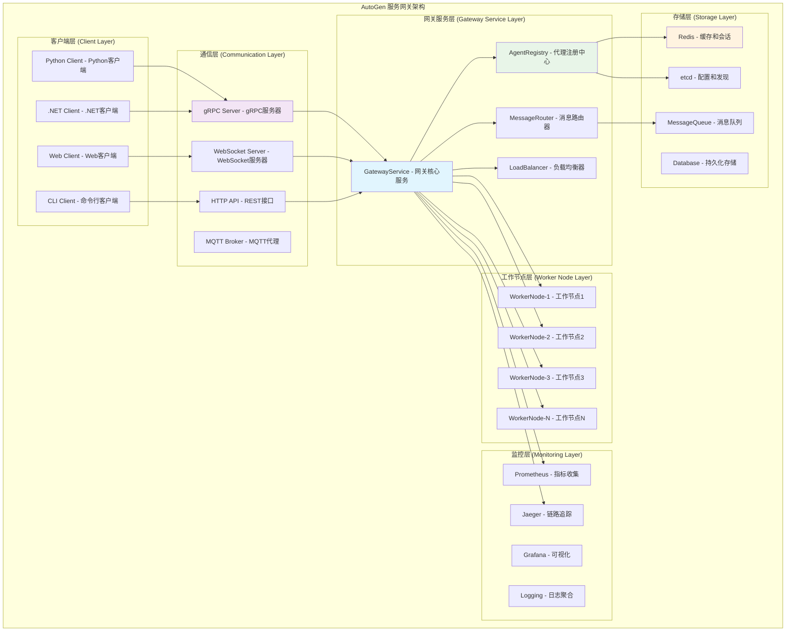
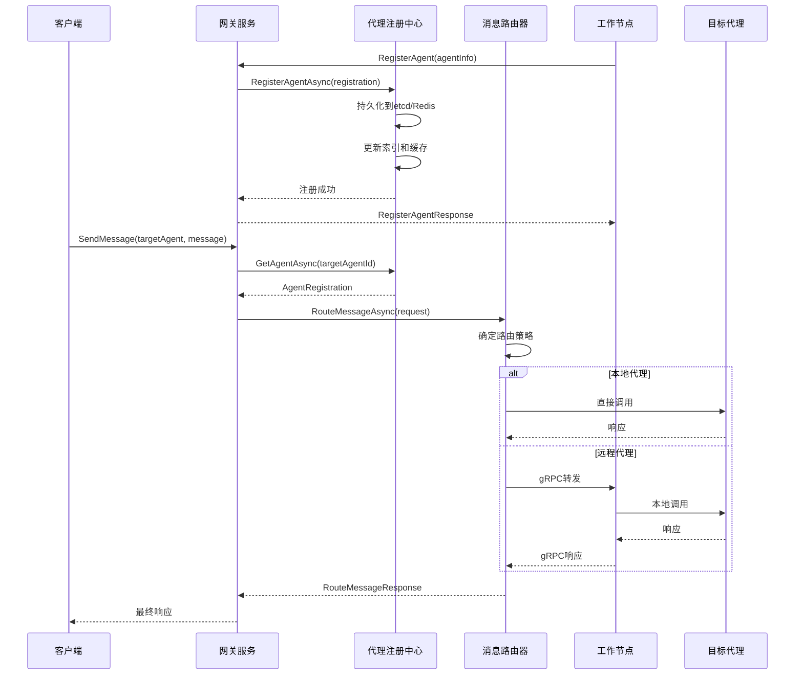
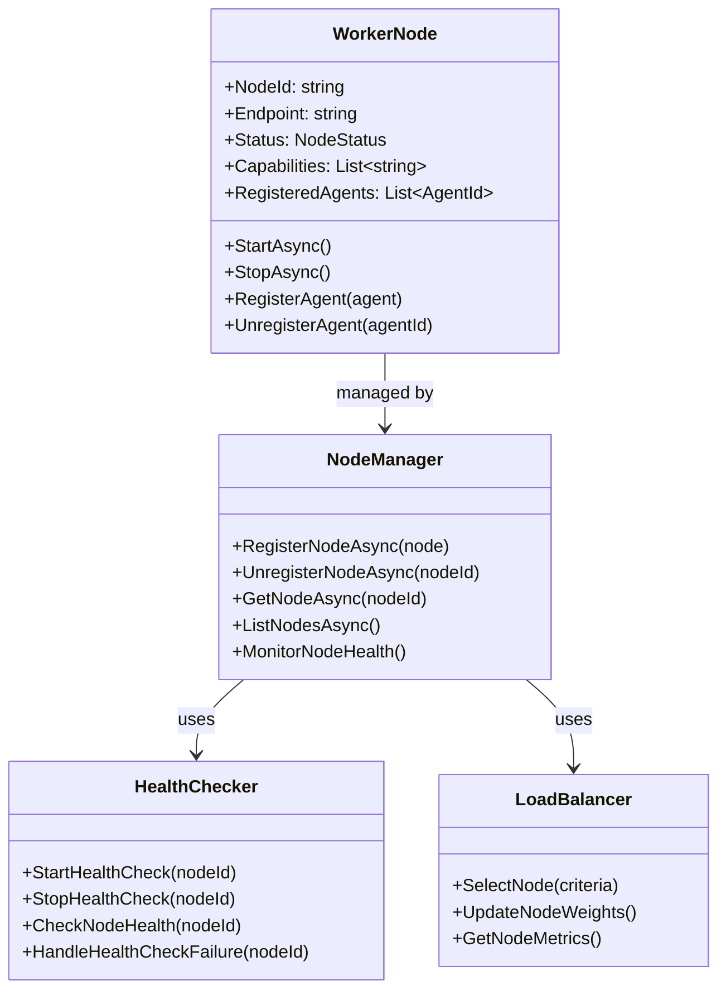
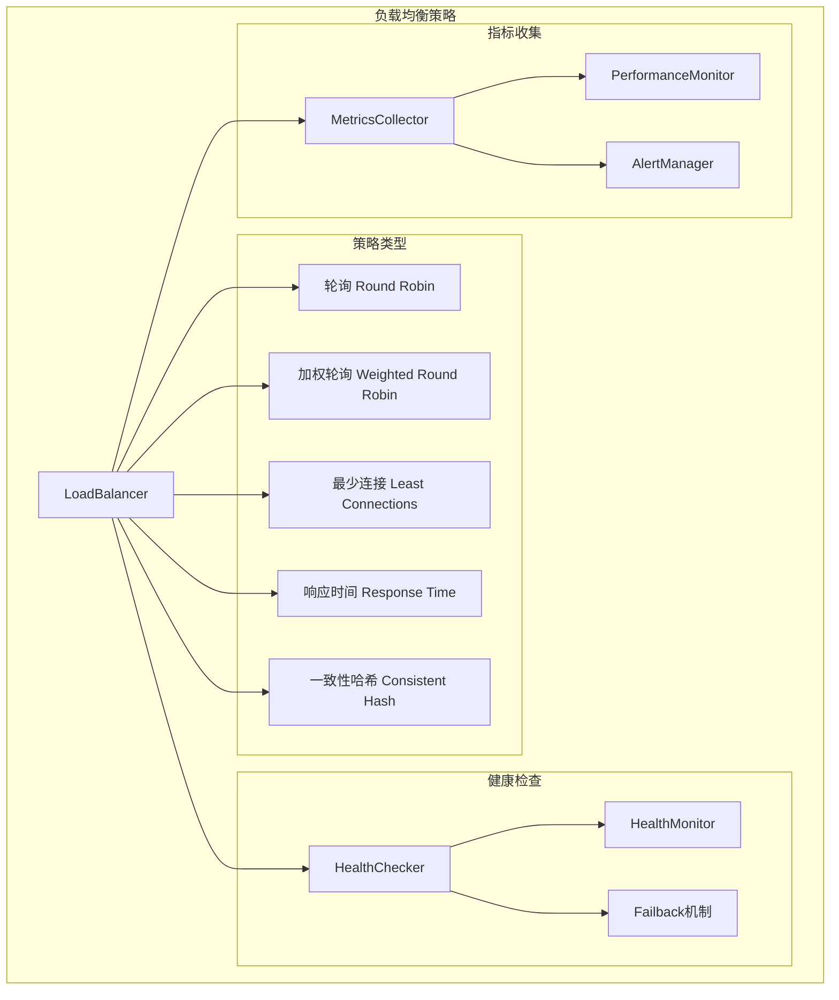
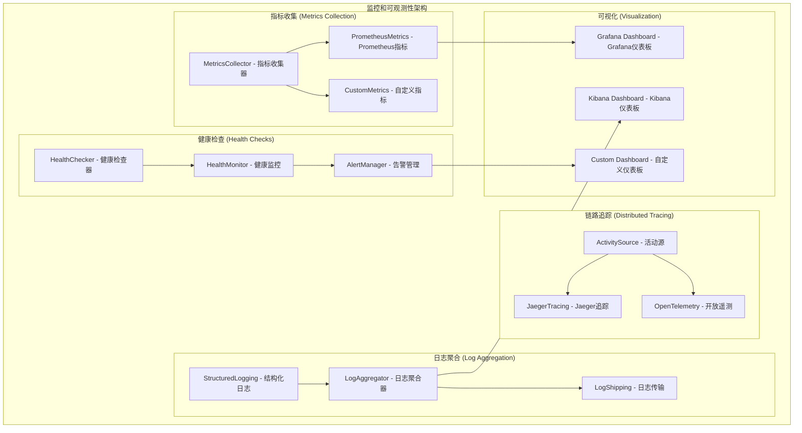

## 概述

AutoGen服务网关是分布式多代理系统的核心组件，负责代理的注册发现、消息路由转发和集群管理。本文档深入分析其架构设计、gRPC通信机制和关键实现细节。

## 1. 服务网关整体架构

### 1.1 架构设计图



### 1.2 核心API入口分析

#### 1. GatewayService.RegisterAgentAsync() - 代理注册

**入口函数**：
```csharp
public async Task<RegisterAgentResponse> RegisterAgentAsync(
    RegisterAgentRequest request,
    ServerCallContext context)
{
    /*
     * 代理注册的核心API
     * 
     * 功能说明：
     * 1. 验证代理注册请求的合法性
     * 2. 分配唯一的代理标识符
     * 3. 注册代理到服务发现中心
     * 4. 建立代理的健康检查机制
     * 5. 配置代理的路由规则
     * 
     * 设计特点：
     * - 幂等性：重复注册返回相同结果
     * - 原子性：注册过程要么全部成功要么全部失败
     * - 一致性：确保所有网关节点的代理信息一致
     * - 可用性：支持代理的优雅上线和下线
     */
    
    using var activity = ActivitySource.StartActivity("Gateway.RegisterAgent");
    activity?.SetTag("agent.type", request.AgentType);
    activity?.SetTag("worker.node", request.WorkerNodeId);
    
    try
    {
        // 1. 验证注册请求
        var validationResult = await ValidateRegistrationRequest(request);
        if (!validationResult.IsValid)
        {
            return new RegisterAgentResponse
            {
                Success = false,
                ErrorMessage = validationResult.ErrorMessage,
                ErrorCode = "VALIDATION_FAILED"
            };
        }
        
        // 2. 生成代理标识符
        var agentId = new AgentId
        {
            Type = request.AgentType,
            Key = request.AgentKey ?? Guid.NewGuid().ToString(),
            WorkerNodeId = request.WorkerNodeId
        };
        
        // 3. 检查代理是否已存在
        var existingAgent = await _agentRegistry.GetAgentAsync(agentId);
        if (existingAgent != null)
        {
            // 幂等性处理：返回已存在的代理信息
            if (existingAgent.WorkerNodeId == request.WorkerNodeId)
            {
                return new RegisterAgentResponse
                {
                    Success = true,
                    AgentId = agentId.ToString(),
                    Message = "代理已存在"
                };
            }
            else
            {
                // 代理ID冲突
                return new RegisterAgentResponse
                {
                    Success = false,
                    ErrorMessage = "代理ID已被其他工作节点使用",
                    ErrorCode = "AGENT_ID_CONFLICT"
                };
            }
        }
        
        // 4. 创建代理注册信息
        var agentRegistration = new AgentRegistration
        {
            AgentId = agentId,
            AgentType = request.AgentType,
            WorkerNodeId = request.WorkerNodeId,
            Capabilities = request.Capabilities.ToList(),
            Metadata = request.Metadata.ToDictionary(kv => kv.Key, kv => kv.Value),
            RegisteredAt = DateTimeOffset.UtcNow,
            LastHeartbeat = DateTimeOffset.UtcNow,
            Status = AgentStatus.Online,
            Version = request.Version
        };
        
        // 5. 注册到服务发现中心
        await _agentRegistry.RegisterAgentAsync(agentRegistration);
        
        // 6. 配置消息路由规则
        await _messageRouter.ConfigureRoutingRules(agentId, request.RoutingRules);
        
        // 7. 启动健康检查
        await _healthChecker.StartHealthCheck(agentId, request.HealthCheckConfig);
        
        // 8. 通知其他网关节点
        await _clusterManager.NotifyAgentRegistered(agentRegistration);
        
        // 9. 记录注册事件
        _logger.LogInformation("代理注册成功: {AgentId} 在工作节点 {WorkerNodeId}", 
            agentId, request.WorkerNodeId);
        
        // 10. 更新指标
        _metrics.IncrementAgentRegistrations(request.AgentType);
        
        return new RegisterAgentResponse
        {
            Success = true,
            AgentId = agentId.ToString(),
            GatewayEndpoint = _configuration.GatewayEndpoint,
            HeartbeatInterval = _configuration.HeartbeatInterval,
            Message = "代理注册成功"
        };
    }
    catch (Exception ex)
    {
        _logger.LogError(ex, "代理注册失败: {AgentType}", request.AgentType);
        
        return new RegisterAgentResponse
        {
            Success = false,
            ErrorMessage = "内部服务器错误",
            ErrorCode = "INTERNAL_ERROR"
        };
    }
}
```

**调用链路关键函数**：

1. **AgentRegistry.RegisterAgentAsync() - 代理注册中心**：
```csharp
public async Task RegisterAgentAsync(AgentRegistration registration)
{
    /*
     * 代理注册中心的核心实现
     * 
     * 功能说明：
     * 1. 将代理信息持久化到存储系统
     * 2. 更新内存缓存以提高查询性能
     * 3. 触发代理注册事件通知
     * 4. 维护代理的索引和统计信息
     * 
     * 存储策略：
     * - 主存储：etcd（强一致性，用于集群同步）
     * - 缓存：Redis（高性能，用于快速查询）
     * - 本地缓存：内存（最快访问，用于热点数据）
     */
    
    var agentId = registration.AgentId;
    
    try
    {
        // 1. 开始分布式事务
        using var transaction = await _distributedTransaction.BeginAsync();
        
        // 2. 持久化到etcd（主存储）
        var etcdKey = $"/agents/{agentId.Type}/{agentId.Key}";
        var etcdValue = JsonSerializer.Serialize(registration);
        
        await _etcdClient.PutAsync(etcdKey, etcdValue);
        
        // 3. 更新Redis缓存
        var redisKey = $"agent:{agentId}";
        var redisValue = JsonSerializer.Serialize(registration);
        
        await _redisDatabase.StringSetAsync(redisKey, redisValue, 
            TimeSpan.FromMinutes(_configuration.AgentCacheExpiration));
        
        // 4. 更新本地缓存
        _localCache.Set(agentId.ToString(), registration, 
            TimeSpan.FromMinutes(_configuration.LocalCacheExpiration));
        
        // 5. 更新索引
        await UpdateAgentIndexes(registration);
        
        // 6. 提交事务
        await transaction.CommitAsync();
        
        // 7. 触发注册事件
        await _eventBus.PublishAsync(new AgentRegisteredEvent
        {
            AgentId = agentId,
            Registration = registration,
            Timestamp = DateTimeOffset.UtcNow
        });
        
        _logger.LogDebug("代理注册到存储系统: {AgentId}", agentId);
    }
    catch (Exception ex)
    {
        _logger.LogError(ex, "代理注册失败: {AgentId}", agentId);
        throw new AgentRegistrationException($"无法注册代理 {agentId}", ex);
    }
}

private async Task UpdateAgentIndexes(AgentRegistration registration)
{
    /*
     * 更新代理索引的实现
     * 
     * 索引类型：
     * 1. 按类型索引：快速查找同类型代理
     * 2. 按工作节点索引：快速查找节点上的代理
     * 3. 按能力索引：根据能力匹配代理
     * 4. 按状态索引：快速过滤在线/离线代理
     */
    
    var agentId = registration.AgentId;
    
    // 1. 更新类型索引
    var typeIndexKey = $"index:type:{registration.AgentType}";
    await _redisDatabase.SetAddAsync(typeIndexKey, agentId.ToString());
    
    // 2. 更新工作节点索引
    var nodeIndexKey = $"index:node:{registration.WorkerNodeId}";
    await _redisDatabase.SetAddAsync(nodeIndexKey, agentId.ToString());
    
    // 3. 更新能力索引
    foreach (var capability in registration.Capabilities)
    {
        var capabilityIndexKey = $"index:capability:{capability}";
        await _redisDatabase.SetAddAsync(capabilityIndexKey, agentId.ToString());
    }
    
    // 4. 更新状态索引
    var statusIndexKey = $"index:status:{registration.Status}";
    await _redisDatabase.SetAddAsync(statusIndexKey, agentId.ToString());
    
    // 5. 更新统计信息
    await _redisDatabase.HashIncrementAsync("stats:agents", registration.AgentType, 1);
    await _redisDatabase.HashIncrementAsync("stats:nodes", registration.WorkerNodeId, 1);
}
```

2. **MessageRouter.RouteMessageAsync() - 消息路由**：
```csharp
public async Task<RouteMessageResponse> RouteMessageAsync(RouteMessageRequest request)
{
    /*
     * 消息路由的核心实现
     * 
     * 功能说明：
     * 1. 解析目标代理标识符
     * 2. 查找代理的当前位置
     * 3. 选择最优的路由路径
     * 4. 转发消息到目标工作节点
     * 5. 处理路由失败和重试
     * 
     * 路由策略：
     * - 直连路由：目标代理在本地节点
     * - 转发路由：目标代理在远程节点
     * - 广播路由：消息需要发送给多个代理
     * - 负载均衡路由：在多个相同代理间选择
     */
    
    using var activity = ActivitySource.StartActivity("MessageRouter.RouteMessage");
    activity?.SetTag("message.type", request.MessageType);
    activity?.SetTag("target.agent", request.TargetAgentId);
    
    try
    {
        // 1. 解析目标代理ID
        if (!AgentId.TryParse(request.TargetAgentId, out var targetAgentId))
        {
            return new RouteMessageResponse
            {
                Success = false,
                ErrorCode = "INVALID_AGENT_ID",
                ErrorMessage = "无效的代理标识符"
            };
        }
        
        // 2. 查找目标代理
        var targetAgent = await _agentRegistry.GetAgentAsync(targetAgentId);
        if (targetAgent == null)
        {
            // 尝试通过负载均衡查找同类型代理
            var alternativeAgent = await _loadBalancer.SelectAgentAsync(
                targetAgentId.Type, request.LoadBalancingStrategy);
            
            if (alternativeAgent == null)
            {
                return new RouteMessageResponse
                {
                    Success = false,
                    ErrorCode = "AGENT_NOT_FOUND",
                    ErrorMessage = $"未找到代理: {targetAgentId}"
                };
            }
            
            targetAgent = alternativeAgent;
            targetAgentId = alternativeAgent.AgentId;
        }
        
        // 3. 检查代理状态
        if (targetAgent.Status != AgentStatus.Online)
        {
            return new RouteMessageResponse
            {
                Success = false,
                ErrorCode = "AGENT_OFFLINE",
                ErrorMessage = $"目标代理离线: {targetAgentId}"
            };
        }
        
        // 4. 选择路由策略
        var routingStrategy = DetermineRoutingStrategy(targetAgent, request);
        
        // 5. 执行消息路由
        var routingResult = await ExecuteRouting(routingStrategy, targetAgent, request);
        
        // 6. 记录路由指标
        _metrics.RecordMessageRouted(
            request.MessageType,
            targetAgent.WorkerNodeId,
            routingResult.Success,
            routingResult.Duration);
        
        return routingResult;
    }
    catch (Exception ex)
    {
        _logger.LogError(ex, "消息路由失败: {TargetAgent}", request.TargetAgentId);
        
        return new RouteMessageResponse
        {
            Success = false,
            ErrorCode = "ROUTING_ERROR",
            ErrorMessage = "消息路由失败"
        };
    }
}

private async Task<RouteMessageResponse> ExecuteRouting(
    RoutingStrategy strategy,
    AgentRegistration targetAgent,
    RouteMessageRequest request)
{
    /*
     * 执行具体的路由策略
     * 
     * 路由策略实现：
     * 1. 直连路由：本地代理直接调用
     * 2. gRPC路由：通过gRPC转发到远程节点
     * 3. 消息队列路由：通过MQ异步传递
     * 4. WebSocket路由：通过WebSocket实时传递
     */
    
    switch (strategy)
    {
        case RoutingStrategy.Direct:
            return await ExecuteDirectRouting(targetAgent, request);
        
        case RoutingStrategy.GrpcForward:
            return await ExecuteGrpcRouting(targetAgent, request);
        
        case RoutingStrategy.MessageQueue:
            return await ExecuteMessageQueueRouting(targetAgent, request);
        
        case RoutingStrategy.WebSocket:
            return await ExecuteWebSocketRouting(targetAgent, request);
        
        default:
            throw new NotSupportedException($"不支持的路由策略: {strategy}");
    }
}

private async Task<RouteMessageResponse> ExecuteGrpcRouting(
    AgentRegistration targetAgent,
    RouteMessageRequest request)
{
    /*
     * gRPC路由的具体实现
     * 
     * 功能说明：
     * 1. 获取目标工作节点的gRPC连接
     * 2. 创建转发请求
     * 3. 调用远程工作节点的API
     * 4. 处理响应和异常
     * 
     * 优化技术：
     * - 连接池：复用gRPC连接
     * - 负载均衡：在多个节点间分散负载
     * - 熔断器：防止级联失败
     * - 重试机制：处理临时网络问题
     */
    
    var workerNodeId = targetAgent.WorkerNodeId;
    
    // 1. 获取工作节点连接
    var workerConnection = await _connectionManager.GetConnectionAsync(workerNodeId);
    if (workerConnection == null)
    {
        return new RouteMessageResponse
        {
            Success = false,
            ErrorCode = "WORKER_NODE_UNAVAILABLE",
            ErrorMessage = $"工作节点不可用: {workerNodeId}"
        };
    }
    
    // 2. 创建gRPC客户端
    var client = new WorkerNodeService.WorkerNodeServiceClient(workerConnection.Channel);
    
    // 3. 准备转发请求
    var forwardRequest = new ForwardMessageRequest
    {
        TargetAgentId = targetAgent.AgentId.ToString(),
        MessageType = request.MessageType,
        MessageData = request.MessageData,
        CorrelationId = request.CorrelationId,
        Timeout = request.Timeout,
        Metadata = { request.Metadata }
    };
    
    // 4. 设置调用选项
    var callOptions = new CallOptions(
        deadline: DateTime.UtcNow.AddMilliseconds(request.Timeout),
        cancellationToken: request.CancellationToken);
    
    try
    {
        // 5. 执行远程调用
        var response = await client.ForwardMessageAsync(forwardRequest, callOptions);
        
        // 6. 转换响应格式
        return new RouteMessageResponse
        {
            Success = response.Success,
            ResponseData = response.ResponseData,
            ErrorCode = response.ErrorCode,
            ErrorMessage = response.ErrorMessage,
            Duration = response.ProcessingTime
        };
    }
    catch (RpcException ex)
    {
        _logger.LogWarning(ex, "gRPC调用失败: {WorkerNode}", workerNodeId);
        
        // 7. 处理gRPC异常
        return new RouteMessageResponse
        {
            Success = false,
            ErrorCode = MapGrpcStatusToErrorCode(ex.StatusCode),
            ErrorMessage = ex.Status.Detail
        };
    }
}
```

### 1.3 服务网关时序图



## 2. 工作节点管理

### 2.1 工作节点架构



### 2.2 工作节点核心实现

#### 1. WorkerNode - 工作节点实现

```csharp
public class WorkerNode : BackgroundService
{
    /*
     * 工作节点的核心实现
     * 
     * 功能说明：
     * 1. 管理本地代理的生命周期
     * 2. 与网关服务保持连接和心跳
     * 3. 处理来自网关的消息转发请求
     * 4. 监控本地资源使用情况
     * 5. 实现优雅的启动和关闭
     * 
     * 设计特点：
     * - 自治性：能够独立运行和管理本地代理
     * - 弹性：支持网络中断和恢复
     * - 可观测性：提供丰富的监控和诊断信息
     * - 可扩展性：支持动态添加和移除代理
     */
    
    private readonly IAgentRuntime _agentRuntime;
    private readonly IGatewayClient _gatewayClient;
    private readonly IConfiguration _configuration;
    private readonly ILogger<WorkerNode> _logger;
    private readonly ConcurrentDictionary<AgentId, IAgent> _localAgents;
    private readonly Timer _heartbeatTimer;
    private readonly Timer _metricsTimer;
    private readonly CancellationTokenSource _shutdownTokenSource;
    
    public string NodeId { get; }
    public string Endpoint { get; }
    public NodeStatus Status { get; private set; }
    public NodeMetrics Metrics { get; private set; }
    
    public WorkerNode(
        IAgentRuntime agentRuntime,
        IGatewayClient gatewayClient,
        IConfiguration configuration,
        ILogger<WorkerNode> logger)
    {
        _agentRuntime = agentRuntime;
        _gatewayClient = gatewayClient;
        _configuration = configuration;
        _logger = logger;
        
        NodeId = Environment.MachineName + "_" + Guid.NewGuid().ToString("N")[..8];
        Endpoint = $"http://{Environment.MachineName}:{_configuration.GetValue<int>("Port")}";
        Status = NodeStatus.Initializing;
        Metrics = new NodeMetrics();
        
        _localAgents = new ConcurrentDictionary<AgentId, IAgent>();
        _shutdownTokenSource = new CancellationTokenSource();
        
        // 设置心跳定时器
        var heartbeatInterval = _configuration.GetValue<int>("HeartbeatInterval", 30000);
        _heartbeatTimer = new Timer(SendHeartbeat, null, heartbeatInterval, heartbeatInterval);
        
        // 设置指标收集定时器
        var metricsInterval = _configuration.GetValue<int>("MetricsInterval", 60000);
        _metricsTimer = new Timer(CollectMetrics, null, metricsInterval, metricsInterval);
    }
    
    protected override async Task ExecuteAsync(CancellationToken stoppingToken)
    {
        /*
         * 工作节点的主执行循环
         * 
         * 执行流程：
         * 1. 初始化本地运行时环境
         * 2. 注册到网关服务
         * 3. 启动gRPC服务监听
         * 4. 处理消息转发请求
         * 5. 监控本地代理状态
         */
        
        try
        {
            // 1. 初始化运行时环境
            await InitializeRuntimeAsync(stoppingToken);
            
            // 2. 注册到网关服务
            await RegisterToGatewayAsync(stoppingToken);
            
            // 3. 启动gRPC服务
            await StartGrpcServiceAsync(stoppingToken);
            
            // 4. 更新状态为运行中
            Status = NodeStatus.Running;
            _logger.LogInformation("工作节点启动完成: {NodeId}", NodeId);
            
            // 5. 主循环：处理消息和维护连接
            await RunMainLoopAsync(stoppingToken);
        }
        catch (OperationCanceledException)
        {
            _logger.LogInformation("工作节点正在关闭: {NodeId}", NodeId);
        }
        catch (Exception ex)
        {
            _logger.LogError(ex, "工作节点运行异常: {NodeId}", NodeId);
            Status = NodeStatus.Failed;
        }
        finally
        {
            // 6. 清理资源
            await CleanupAsync();
        }
    }
    
    public async Task<RegisterAgentResult> RegisterAgentAsync<TAgent>(
        string agentKey = null,
        Dictionary<string, string> metadata = null)
        where TAgent : class, IAgent
    {
        /*
         * 注册本地代理到工作节点
         * 
         * 功能说明：
         * 1. 创建代理实例
         * 2. 注册到本地运行时
         * 3. 向网关服务注册
         * 4. 配置代理路由规则
         */
        
        var agentType = typeof(TAgent).Name;
        var agentId = new AgentId
        {
            Type = agentType,
            Key = agentKey ?? Guid.NewGuid().ToString(),
            WorkerNodeId = NodeId
        };
        
        try
        {
            // 1. 创建代理实例
            var agent = _agentRuntime.CreateAgent<TAgent>(agentId);
            
            // 2. 初始化代理
            if (agent is IAsyncInitializable asyncInit)
            {
                await asyncInit.InitializeAsync(_shutdownTokenSource.Token);
            }
            
            // 3. 注册到本地运行时
            await _agentRuntime.RegisterAgentAsync(agent);
            
            // 4. 添加到本地代理集合
            _localAgents.TryAdd(agentId, agent);
            
            // 5. 向网关服务注册
            var registrationRequest = new RegisterAgentRequest
            {
                AgentType = agentType,
                AgentKey = agentId.Key,
                WorkerNodeId = NodeId,
                Capabilities = { GetAgentCapabilities<TAgent>() },
                Metadata = { metadata ?? new Dictionary<string, string>() },
                Version = GetAgentVersion<TAgent>(),
                HealthCheckConfig = GetHealthCheckConfig<TAgent>()
            };
            
            var registrationResponse = await _gatewayClient.RegisterAgentAsync(registrationRequest);
            
            if (!registrationResponse.Success)
            {
                // 注册失败，清理本地状态
                _localAgents.TryRemove(agentId, out _);
                await _agentRuntime.UnregisterAgentAsync(agentId);
                
                throw new AgentRegistrationException(
                    $"代理注册失败: {registrationResponse.ErrorMessage}");
            }
            
            _logger.LogInformation("代理注册成功: {AgentId}", agentId);
            
            return new RegisterAgentResult
            {
                Success = true,
                AgentId = agentId,
                GatewayEndpoint = registrationResponse.GatewayEndpoint
            };
        }
        catch (Exception ex)
        {
            _logger.LogError(ex, "代理注册失败: {AgentType}", agentType);
            throw;
        }
    }
    
    [GrpcMethod]
    public async Task<ForwardMessageResponse> ForwardMessageAsync(
        ForwardMessageRequest request,
        ServerCallContext context)
    {
        /*
         * 处理来自网关的消息转发请求
         * 
         * 功能说明：
         * 1. 解析目标代理标识符
         * 2. 查找本地代理实例
         * 3. 转发消息给目标代理
         * 4. 返回处理结果
         */
        
        using var activity = ActivitySource.StartActivity("WorkerNode.ForwardMessage");
        activity?.SetTag("target.agent", request.TargetAgentId);
        activity?.SetTag("message.type", request.MessageType);
        
        var stopwatch = Stopwatch.StartNew();
        
        try
        {
            // 1. 解析代理ID
            if (!AgentId.TryParse(request.TargetAgentId, out var targetAgentId))
            {
                return new ForwardMessageResponse
                {
                    Success = false,
                    ErrorCode = "INVALID_AGENT_ID",
                    ErrorMessage = "无效的代理标识符"
                };
            }
            
            // 2. 查找本地代理
            if (!_localAgents.TryGetValue(targetAgentId, out var targetAgent))
            {
                return new ForwardMessageResponse
                {
                    Success = false,
                    ErrorCode = "AGENT_NOT_FOUND",
                    ErrorMessage = $"本地未找到代理: {targetAgentId}"
                };
            }
            
            // 3. 反序列化消息
            var messageType = Type.GetType(request.MessageType);
            if (messageType == null)
            {
                return new ForwardMessageResponse
                {
                    Success = false,
                    ErrorCode = "UNKNOWN_MESSAGE_TYPE",
                    ErrorMessage = $"未知的消息类型: {request.MessageType}"
                };
            }
            
            var message = JsonSerializer.Deserialize(request.MessageData, messageType);
            
            // 4. 创建消息上下文
            var messageContext = new MessageContext
            {
                MessageId = request.CorrelationId,
                Sender = new AgentId("gateway", "system"),
                Recipient = targetAgentId,
                CancellationToken = context.CancellationToken,
                Properties = request.Metadata.ToDictionary(kv => kv.Key, kv => (object)kv.Value)
            };
            
            // 5. 转发消息给目标代理
            var response = await targetAgent.HandleMessageAsync(message, messageContext);
            
            // 6. 序列化响应
            var responseData = JsonSerializer.Serialize(response);
            
            stopwatch.Stop();
            
            // 7. 更新指标
            Metrics.MessagesProcessed++;
            Metrics.AverageProcessingTime = 
                (Metrics.AverageProcessingTime + stopwatch.ElapsedMilliseconds) / 2;
            
            return new ForwardMessageResponse
            {
                Success = true,
                ResponseData = responseData,
                ProcessingTime = stopwatch.ElapsedMilliseconds
            };
        }
        catch (Exception ex)
        {
            stopwatch.Stop();
            
            _logger.LogError(ex, "消息转发失败: {TargetAgent}", request.TargetAgentId);
            
            Metrics.MessagesFailed++;
            
            return new ForwardMessageResponse
            {
                Success = false,
                ErrorCode = "PROCESSING_ERROR",
                ErrorMessage = ex.Message,
                ProcessingTime = stopwatch.ElapsedMilliseconds
            };
        }
    }
    
    private async void SendHeartbeat(object state)
    {
        /*
         * 发送心跳到网关服务
         * 
         * 心跳信息包括：
         * 1. 节点状态和健康信息
         * 2. 本地代理列表和状态
         * 3. 资源使用情况
         * 4. 性能指标
         */
        
        try
        {
            var heartbeatRequest = new HeartbeatRequest
            {
                NodeId = NodeId,
                Status = Status.ToString(),
                Timestamp = DateTimeOffset.UtcNow.ToUnixTimeMilliseconds(),
                Metrics = new NodeMetricsProto
                {
                    CpuUsage = Metrics.CpuUsage,
                    MemoryUsage = Metrics.MemoryUsage,
                    MessagesProcessed = Metrics.MessagesProcessed,
                    MessagesFailed = Metrics.MessagesFailed,
                    AverageProcessingTime = Metrics.AverageProcessingTime
                },
                Agents = { _localAgents.Keys.Select(id => id.ToString()) }
            };
            
            var response = await _gatewayClient.SendHeartbeatAsync(heartbeatRequest);
            
            if (!response.Success)
            {
                _logger.LogWarning("心跳发送失败: {Error}", response.ErrorMessage);
            }
        }
        catch (Exception ex)
        {
            _logger.LogError(ex, "心跳发送异常");
        }
    }
    
    private void CollectMetrics(object state)
    {
        /*
         * 收集节点性能指标
         * 
         * 指标类型：
         * 1. 系统资源：CPU、内存、磁盘、网络
         * 2. 应用指标：消息处理量、响应时间、错误率
         * 3. 代理指标：代理数量、状态分布
         */
        
        try
        {
            // 1. 收集系统资源指标
            var process = Process.GetCurrentProcess();
            
            Metrics.CpuUsage = GetCpuUsage();
            Metrics.MemoryUsage = process.WorkingSet64;
            Metrics.ThreadCount = process.Threads.Count;
            
            // 2. 收集代理指标
            Metrics.ActiveAgents = _localAgents.Count;
            Metrics.OnlineAgents = _localAgents.Values.Count(a => IsAgentOnline(a));
            
            // 3. 收集网络指标
            Metrics.NetworkConnections = GetNetworkConnections();
            
            _logger.LogDebug("指标收集完成: CPU={CpuUsage}%, Memory={MemoryUsage}MB, Agents={AgentCount}",
                Metrics.CpuUsage, Metrics.MemoryUsage / 1024 / 1024, Metrics.ActiveAgents);
        }
        catch (Exception ex)
        {
            _logger.LogError(ex, "指标收集失败");
        }
    }
}
```

## 3. 负载均衡和故障恢复

### 3.1 负载均衡策略



### 3.2 负载均衡核心实现

#### 1. LoadBalancer - 负载均衡器

```csharp
public class LoadBalancer : ILoadBalancer
{
    /*
     * 负载均衡器的核心实现
     * 
     * 功能说明：
     * 1. 实现多种负载均衡算法
     * 2. 集成健康检查机制
     * 3. 支持动态权重调整
     * 4. 提供故障转移能力
     * 
     * 算法特点：
     * - 轮询：简单公平，适合同质化节点
     * - 加权轮询：考虑节点能力差异
     * - 最少连接：适合长连接场景
     * - 响应时间：优化用户体验
     * - 一致性哈希：保持会话亲和性
     */
    
    private readonly IAgentRegistry _agentRegistry;
    private readonly IHealthChecker _healthChecker;
    private readonly IMetricsCollector _metricsCollector;
    private readonly ILogger<LoadBalancer> _logger;
    private readonly ConcurrentDictionary<string, LoadBalancingState> _balancingStates;
    
    public LoadBalancer(
        IAgentRegistry agentRegistry,
        IHealthChecker healthChecker,
        IMetricsCollector metricsCollector,
        ILogger<LoadBalancer> logger)
    {
        _agentRegistry = agentRegistry;
        _healthChecker = healthChecker;
        _metricsCollector = metricsCollector;
        _logger = logger;
        _balancingStates = new ConcurrentDictionary<string, LoadBalancingState>();
    }
    
    public async Task<AgentRegistration> SelectAgentAsync(
        string agentType,
        LoadBalancingStrategy strategy = LoadBalancingStrategy.RoundRobin,
        Dictionary<string, object> criteria = null)
    {
        /*
         * 选择最优代理的核心方法
         * 
         * 选择流程：
         * 1. 获取候选代理列表
         * 2. 过滤不健康的代理
         * 3. 应用负载均衡算法
         * 4. 更新选择统计信息
         */
        
        try
        {
            // 1. 获取指定类型的所有代理
            var candidates = await _agentRegistry.GetAgentsByTypeAsync(agentType);
            
            if (!candidates.Any())
            {
                _logger.LogWarning("未找到类型为 {AgentType} 的代理", agentType);
                return null;
            }
            
            // 2. 过滤健康的代理
            var healthyAgents = new List<AgentRegistration>();
            
            foreach (var agent in candidates)
            {
                var healthStatus = await _healthChecker.CheckAgentHealthAsync(agent.AgentId);
                if (healthStatus.IsHealthy)
                {
                    healthyAgents.Add(agent);
                }
            }
            
            if (!healthyAgents.Any())
            {
                _logger.LogWarning("类型为 {AgentType} 的代理都不健康", agentType);
                return null;
            }
            
            // 3. 应用负载均衡策略
            var selectedAgent = strategy switch
            {
                LoadBalancingStrategy.RoundRobin => SelectByRoundRobin(agentType, healthyAgents),
                LoadBalancingStrategy.WeightedRoundRobin => await SelectByWeightedRoundRobin(agentType, healthyAgents),
                LoadBalancingStrategy.LeastConnections => await SelectByLeastConnections(healthyAgents),
                LoadBalancingStrategy.ResponseTime => await SelectByResponseTime(healthyAgents),
                LoadBalancingStrategy.ConsistentHash => SelectByConsistentHash(healthyAgents, criteria),
                LoadBalancingStrategy.Random => SelectByRandom(healthyAgents),
                _ => throw new NotSupportedException($"不支持的负载均衡策略: {strategy}")
            };
            
            // 4. 更新选择统计
            if (selectedAgent != null)
            {
                await UpdateSelectionStats(selectedAgent, strategy);
            }
            
            return selectedAgent;
        }
        catch (Exception ex)
        {
            _logger.LogError(ex, "代理选择失败: {AgentType}", agentType);
            return null;
        }
    }
    
    private AgentRegistration SelectByRoundRobin(
        string agentType, 
        List<AgentRegistration> agents)
    {
        /*
         * 轮询算法实现
         * 
         * 算法特点：
         * 1. 简单公平：每个代理轮流处理请求
         * 2. 无状态：不需要考虑代理的当前负载
         * 3. 适用场景：同质化代理，请求处理时间相近
         */
        
        var state = _balancingStates.GetOrAdd(agentType, 
            _ => new LoadBalancingState { CurrentIndex = 0 });
        
        lock (state)
        {
            var index = state.CurrentIndex % agents.Count;
            state.CurrentIndex = (state.CurrentIndex + 1) % agents.Count;
            
            return agents[index];
        }
    }
    
    private async Task<AgentRegistration> SelectByWeightedRoundRobin(
        string agentType,
        List<AgentRegistration> agents)
    {
        /*
         * 加权轮询算法实现
         * 
         * 算法特点：
         * 1. 考虑代理能力：性能强的代理处理更多请求
         * 2. 动态权重：根据实时性能调整权重
         * 3. 平滑分配：避免突发流量集中到某个代理
         */
        
        var state = _balancingStates.GetOrAdd(agentType,
            _ => new LoadBalancingState { WeightedAgents = new List<WeightedAgent>() });
        
        lock (state)
        {
            // 1. 初始化或更新权重信息
            if (state.WeightedAgents.Count != agents.Count ||
                DateTime.UtcNow - state.LastWeightUpdate > TimeSpan.FromMinutes(5))
            {
                await UpdateAgentWeights(state, agents);
            }
            
            // 2. 计算当前权重
            var totalWeight = state.WeightedAgents.Sum(wa => wa.CurrentWeight);
            if (totalWeight <= 0)
            {
                // 所有权重为0，回退到轮询
                return SelectByRoundRobin(agentType, agents);
            }
            
            // 3. 选择权重最高的代理
            var selectedWeightedAgent = state.WeightedAgents
                .OrderByDescending(wa => wa.CurrentWeight)
                .First();
            
            // 4. 更新权重
            selectedWeightedAgent.CurrentWeight -= totalWeight;
            foreach (var wa in state.WeightedAgents)
            {
                wa.CurrentWeight += wa.Weight;
            }
            
            return selectedWeightedAgent.Agent;
        }
    }
    
    private async Task<AgentRegistration> SelectByLeastConnections(
        List<AgentRegistration> agents)
    {
        /*
         * 最少连接算法实现
         * 
         * 算法特点：
         * 1. 负载感知：选择当前连接数最少的代理
         * 2. 动态平衡：自动平衡各代理的负载
         * 3. 适用场景：长连接、处理时间差异大的场景
         */
        
        var agentConnections = new List<(AgentRegistration Agent, int Connections)>();
        
        // 1. 获取每个代理的当前连接数
        foreach (var agent in agents)
        {
            var metrics = await _metricsCollector.GetAgentMetricsAsync(agent.AgentId);
            var connections = metrics?.ActiveConnections ?? 0;
            
            agentConnections.Add((agent, connections));
        }
        
        // 2. 选择连接数最少的代理
        var selectedAgent = agentConnections
            .OrderBy(ac => ac.Connections)
            .ThenBy(ac => Guid.NewGuid()) // 相同连接数时随机选择
            .First();
        
        return selectedAgent.Agent;
    }
    
    private async Task<AgentRegistration> SelectByResponseTime(
        List<AgentRegistration> agents)
    {
        /*
         * 响应时间算法实现
         * 
         * 算法特点：
         * 1. 性能优先：选择响应时间最短的代理
         * 2. 用户体验：优化整体响应时间
         * 3. 自适应：根据历史性能动态选择
         */
        
        var agentResponseTimes = new List<(AgentRegistration Agent, double ResponseTime)>();
        
        // 1. 获取每个代理的平均响应时间
        foreach (var agent in agents)
        {
            var metrics = await _metricsCollector.GetAgentMetricsAsync(agent.AgentId);
            var responseTime = metrics?.AverageResponseTime ?? double.MaxValue;
            
            agentResponseTimes.Add((agent, responseTime));
        }
        
        // 2. 选择响应时间最短的代理
        var selectedAgent = agentResponseTimes
            .OrderBy(art => art.ResponseTime)
            .ThenBy(art => Guid.NewGuid()) // 相同响应时间时随机选择
            .First();
        
        return selectedAgent.Agent;
    }
    
    private AgentRegistration SelectByConsistentHash(
        List<AgentRegistration> agents,
        Dictionary<string, object> criteria)
    {
        /*
         * 一致性哈希算法实现
         * 
         * 算法特点：
         * 1. 会话亲和：相同的请求总是路由到同一个代理
         * 2. 扩展性好：添加或移除代理时影响最小
         * 3. 适用场景：需要保持状态的应用
         */
        
        // 1. 提取哈希键
        var hashKey = ExtractHashKey(criteria);
        if (string.IsNullOrEmpty(hashKey))
        {
            // 无法提取哈希键，回退到轮询
            return SelectByRoundRobin("", agents);
        }
        
        // 2. 计算哈希值
        var hash = ComputeHash(hashKey);
        
        // 3. 选择对应的代理
        var index = (int)(hash % (uint)agents.Count);
        return agents[index];
    }
    
    private async Task UpdateAgentWeights(
        LoadBalancingState state,
        List<AgentRegistration> agents)
    {
        /*
         * 更新代理权重的实现
         * 
         * 权重计算因素：
         * 1. 代理性能：CPU、内存使用率
         * 2. 处理能力：历史处理速度
         * 3. 健康状态：错误率、响应时间
         * 4. 配置权重：管理员设置的静态权重
         */
        
        state.WeightedAgents.Clear();
        
        foreach (var agent in agents)
        {
            var metrics = await _metricsCollector.GetAgentMetricsAsync(agent.AgentId);
            
            // 1. 基础权重（配置）
            var baseWeight = agent.Metadata.TryGetValue("weight", out var weightStr) &&
                            int.TryParse(weightStr, out var weight) ? weight : 100;
            
            // 2. 性能权重调整
            var performanceMultiplier = CalculatePerformanceMultiplier(metrics);
            
            // 3. 健康权重调整
            var healthMultiplier = CalculateHealthMultiplier(metrics);
            
            // 4. 计算最终权重
            var finalWeight = (int)(baseWeight * performanceMultiplier * healthMultiplier);
            finalWeight = Math.Max(1, finalWeight); // 确保权重至少为1
            
            state.WeightedAgents.Add(new WeightedAgent
            {
                Agent = agent,
                Weight = finalWeight,
                CurrentWeight = finalWeight
            });
        }
        
        state.LastWeightUpdate = DateTime.UtcNow;
    }
    
    private double CalculatePerformanceMultiplier(AgentMetrics metrics)
    {
        /*
         * 计算性能权重乘数
         * 
         * 计算公式：
         * 性能乘数 = (1 - CPU使用率) * (1 - 内存使用率) * 响应时间因子
         */
        
        if (metrics == null) return 0.5; // 无指标时使用中等权重
        
        var cpuFactor = Math.Max(0.1, 1.0 - metrics.CpuUsage / 100.0);
        var memoryFactor = Math.Max(0.1, 1.0 - metrics.MemoryUsage / 100.0);
        var responseTimeFactor = Math.Max(0.1, 1.0 / (1.0 + metrics.AverageResponseTime / 1000.0));
        
        return cpuFactor * memoryFactor * responseTimeFactor;
    }
    
    private double CalculateHealthMultiplier(AgentMetrics metrics)
    {
        /*
         * 计算健康权重乘数
         * 
         * 计算公式：
         * 健康乘数 = (1 - 错误率) * 可用性因子
         */
        
        if (metrics == null) return 0.5;
        
        var errorRate = metrics.TotalRequests > 0 
            ? (double)metrics.FailedRequests / metrics.TotalRequests 
            : 0.0;
        
        var errorFactor = Math.Max(0.1, 1.0 - errorRate);
        var availabilityFactor = metrics.IsAvailable ? 1.0 : 0.1;
        
        return errorFactor * availabilityFactor;
    }
}
```

## 4. 监控和可观测性

### 4.1 监控架构



### 4.2 监控核心实现

#### 1. MetricsCollector - 指标收集器

```csharp
public class MetricsCollector : IMetricsCollector, IHostedService
{
    /*
     * 指标收集器的核心实现
     * 
     * 功能说明：
     * 1. 收集系统和应用指标
     * 2. 支持多种指标后端
     * 3. 提供实时和历史指标查询
     * 4. 实现指标的聚合和计算
     * 
     * 指标类型：
     * - 计数器：累计值，如请求总数
     * - 仪表：瞬时值，如CPU使用率
     * - 直方图：分布统计，如响应时间分布
     * - 摘要：分位数统计，如P95响应时间
     */
    
    private readonly ILogger<MetricsCollector> _logger;
    private readonly IConfiguration _configuration;
    private readonly Timer _collectionTimer;
    private readonly ConcurrentDictionary<string, MetricValue> _metrics;
    private readonly List<IMetricsExporter> _exporters;
    
    // Prometheus指标
    private readonly Counter _requestsTotal;
    private readonly Counter _requestsFailedTotal;
    private readonly Histogram _requestDuration;
    private readonly Gauge _activeConnections;
    private readonly Gauge _agentCount;
    
    public MetricsCollector(
        ILogger<MetricsCollector> logger,
        IConfiguration configuration,
        IEnumerable<IMetricsExporter> exporters)
    {
        _logger = logger;
        _configuration = configuration;
        _metrics = new ConcurrentDictionary<string, MetricValue>();
        _exporters = exporters.ToList();
        
        // 初始化Prometheus指标
        _requestsTotal = Metrics.CreateCounter(
            "autogen_requests_total",
            "Total number of requests processed",
            new[] { "agent_type", "status" });
        
        _requestsFailedTotal = Metrics.CreateCounter(
            "autogen_requests_failed_total",
            "Total number of failed requests",
            new[] { "agent_type", "error_type" });
        
        _requestDuration = Metrics.CreateHistogram(
            "autogen_request_duration_seconds",
            "Request processing duration in seconds",
            new[] { "agent_type", "method" });
        
        _activeConnections = Metrics.CreateGauge(
            "autogen_active_connections",
            "Number of active connections",
            new[] { "node_id" });
        
        _agentCount = Metrics.CreateGauge(
            "autogen_agents_count",
            "Number of registered agents",
            new[] { "agent_type", "status" });
        
        // 设置收集定时器
        var interval = _configuration.GetValue<int>("Metrics:CollectionInterval", 30000);
        _collectionTimer = new Timer(CollectMetrics, null, interval, interval);
    }
    
    public void RecordRequest(string agentType, string status, double duration)
    {
        /*
         * 记录请求指标
         * 
         * 指标更新：
         * 1. 增加请求总数计数器
         * 2. 记录请求处理时间
         * 3. 更新失败计数（如果失败）
         * 4. 计算平均响应时间
         */
        
        // 1. 更新Prometheus指标
        _requestsTotal.WithLabels(agentType, status).Inc();
        _requestDuration.WithLabels(agentType, "process").Observe(duration / 1000.0);
        
        if (status == "failed")
        {
            _requestsFailedTotal.WithLabels(agentType, "unknown").Inc();
        }
        
        // 2. 更新内部指标
        var key = $"requests.{agentType}.{status}";
        _metrics.AddOrUpdate(key,
            new MetricValue { Value = 1, Timestamp = DateTimeOffset.UtcNow },
            (k, v) => new MetricValue { Value = v.Value + 1, Timestamp = DateTimeOffset.UtcNow });
        
        // 3. 更新响应时间指标
        var durationKey = $"duration.{agentType}";
        _metrics.AddOrUpdate(durationKey,
            new MetricValue { Value = duration, Timestamp = DateTimeOffset.UtcNow },
            (k, v) => new MetricValue 
            { 
                Value = (v.Value + duration) / 2, // 简单移动平均
                Timestamp = DateTimeOffset.UtcNow 
            });
    }
    
    public void RecordAgentMetrics(AgentId agentId, AgentMetrics metrics)
    {
        /*
         * 记录代理指标
         * 
         * 指标类型：
         * 1. 性能指标：CPU、内存使用率
         * 2. 业务指标：处理消息数、错误率
         * 3. 连接指标：活跃连接数
         * 4. 健康指标：健康状态、最后心跳时间
         */
        
        var agentType = agentId.Type;
        var nodeId = agentId.WorkerNodeId;
        
        // 1. 更新代理计数
        _agentCount.WithLabels(agentType, metrics.Status.ToString()).Set(1);
        
        // 2. 更新连接数
        _activeConnections.WithLabels(nodeId).Set(metrics.ActiveConnections);
        
        // 3. 记录详细指标
        var metricsPrefix = $"agent.{agentId}";
        
        _metrics[$"{metricsPrefix}.cpu_usage"] = new MetricValue
        {
            Value = metrics.CpuUsage,
            Timestamp = DateTimeOffset.UtcNow
        };
        
        _metrics[$"{metricsPrefix}.memory_usage"] = new MetricValue
        {
            Value = metrics.MemoryUsage,
            Timestamp = DateTimeOffset.UtcNow
        };
        
        _metrics[$"{metricsPrefix}.messages_processed"] = new MetricValue
        {
            Value = metrics.MessagesProcessed,
            Timestamp = DateTimeOffset.UtcNow
        };
        
        _metrics[$"{metricsPrefix}.messages_failed"] = new MetricValue
        {
            Value = metrics.MessagesFailed,
            Timestamp = DateTimeOffset.UtcNow
        };
        
        _metrics[$"{metricsPrefix}.average_response_time"] = new MetricValue
        {
            Value = metrics.AverageResponseTime,
            Timestamp = DateTimeOffset.UtcNow
        };
    }
    
    public async Task<Dictionary<string, object>> GetMetricsAsync(
        string pattern = null,
        DateTimeOffset? since = null)
    {
        /*
         * 获取指标数据
         * 
         * 查询功能：
         * 1. 支持模式匹配过滤
         * 2. 支持时间范围查询
         * 3. 支持聚合计算
         * 4. 支持多种输出格式
         */
        
        var result = new Dictionary<string, object>();
        var sinceTime = since ?? DateTimeOffset.UtcNow.AddHours(-1);
        
        foreach (var kvp in _metrics)
        {
            var key = kvp.Key;
            var value = kvp.Value;
            
            // 1. 应用模式过滤
            if (!string.IsNullOrEmpty(pattern) && !key.Contains(pattern))
                continue;
            
            // 2. 应用时间过滤
            if (value.Timestamp < sinceTime)
                continue;
            
            // 3. 添加到结果
            result[key] = new
            {
                value = value.Value,
                timestamp = value.Timestamp,
                type = DetermineMetricType(key)
            };
        }
        
        // 4. 添加计算指标
        await AddComputedMetrics(result);
        
        return result;
    }
    
    private async void CollectMetrics(object state)
    {
        /*
         * 定期收集系统指标
         * 
         * 收集内容：
         * 1. 系统资源指标
         * 2. 应用性能指标
         * 3. 业务指标
         * 4. 网络指标
         */
        
        try
        {
            // 1. 收集系统资源指标
            await CollectSystemMetrics();
            
            // 2. 收集应用指标
            await CollectApplicationMetrics();
            
            // 3. 收集网络指标
            await CollectNetworkMetrics();
            
            // 4. 导出指标到外部系统
            await ExportMetrics();
            
            _logger.LogDebug("指标收集完成，共收集 {Count} 个指标", _metrics.Count);
        }
        catch (Exception ex)
        {
            _logger.LogError(ex, "指标收集失败");
        }
    }
    
    private async Task CollectSystemMetrics()
    {
        /*
         * 收集系统资源指标
         * 
         * 指标包括：
         * 1. CPU使用率和负载
         * 2. 内存使用情况
         * 3. 磁盘I/O和空间
         * 4. 网络流量
         */
        
        var process = Process.GetCurrentProcess();
        
        // CPU指标
        var cpuUsage = await GetCpuUsageAsync();
        _metrics["system.cpu.usage"] = new MetricValue
        {
            Value = cpuUsage,
            Timestamp = DateTimeOffset.UtcNow
        };
        
        // 内存指标
        var memoryUsage = process.WorkingSet64;
        var totalMemory = GC.GetTotalMemory(false);
        
        _metrics["system.memory.working_set"] = new MetricValue
        {
            Value = memoryUsage,
            Timestamp = DateTimeOffset.UtcNow
        };
        
        _metrics["system.memory.gc_total"] = new MetricValue
        {
            Value = totalMemory,
            Timestamp = DateTimeOffset.UtcNow
        };
        
        // GC指标
        for (int generation = 0; generation <= GC.MaxGeneration; generation++)
        {
            var gcCount = GC.CollectionCount(generation);
            _metrics[$"system.gc.gen{generation}_collections"] = new MetricValue
            {
                Value = gcCount,
                Timestamp = DateTimeOffset.UtcNow
            };
        }
        
        // 线程指标
        _metrics["system.threads.count"] = new MetricValue
        {
            Value = process.Threads.Count,
            Timestamp = DateTimeOffset.UtcNow
        };
        
        _metrics["system.threads.pool_worker"] = new MetricValue
        {
            Value = ThreadPool.ThreadCount,
            Timestamp = DateTimeOffset.UtcNow
        };
    }
    
    private async Task ExportMetrics()
    {
        /*
         * 导出指标到外部系统
         * 
         * 支持的导出器：
         * 1. Prometheus - 拉取模式
         * 2. InfluxDB - 推送模式
         * 3. Azure Monitor - 云监控
         * 4. 自定义导出器
         */
        
        var exportTasks = _exporters.Select(async exporter =>
        {
            try
            {
                var metricsToExport = _metrics.ToDictionary(
                    kvp => kvp.Key,
                    kvp => (object)kvp.Value);
                
                await exporter.ExportAsync(metricsToExport);
            }
            catch (Exception ex)
            {
                _logger.LogError(ex, "指标导出失败: {ExporterType}", exporter.GetType().Name);
            }
        });
        
        await Task.WhenAll(exportTasks);
    }
}
```

这个完整的服务网关模块分析提供了深入的架构解析、关键API实现和监控机制。通过这些内容，开发者可以全面理解AutoGen分布式系统的核心机制和最佳实践。

<function_calls>
<invoke name="todo_write">
<parameter name="merge">true
