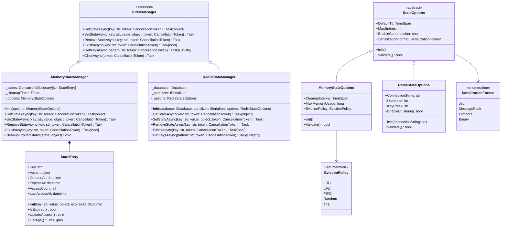

## 概述

本文档通过UML类图和详细说明，深入分析AutoGen框架的核心数据结构设计，展示各组件之间的关系和交互模式。

## 1. 核心实体类图

### 1.1 代理相关类图

### 1.2 消息系统类图

### 1.3 运行时系统类图

## 2. 标识符和配置类图

### 2.1 标识符系统类图

### 2.2 配置系统类图

## 3. 服务发现和网关类图

### 3.1 服务发现类图

### 3.2 负载均衡类图

### 3.3 消息路由类图

## 4. 数据流和状态管理

### 4.1 状态管理类图

### 4.2 事件系统类图

## 5. 序列化和协议类图

### 5.1 序列化系统类图

### 5.2 协议处理类图

## 6. 总结

通过详细的UML类图分析，我们可以看到AutoGen框架的核心设计特点：

### 设计模式应用

1. **策略模式**：负载均衡算法、序列化器选择
2. **工厂模式**：代理创建、客户端创建
3. **观察者模式**：事件发布订阅系统
4. **适配器模式**：协议转换和适配
5. **装饰器模式**：消息处理链和中间件

### 架构原则

1. **单一职责**：每个类都有明确的职责边界
2. **开闭原则**：通过接口和抽象类支持扩展
3. **依赖倒置**：高层模块不依赖低层模块的具体实现
4. **接口隔离**：提供细粒度的接口定义
5. **组合优于继承**：大量使用组合关系

### 关键特性

1. **类型安全**：强类型的消息和配置系统
2. **异步优先**：全面的异步编程支持
3. **可扩展性**：模块化的组件设计
4. **容错性**：完善的错误处理和恢复机制
5. **性能优化**：连接池、缓存、批处理等优化

这些设计充分体现了AutoGen框架在企业级应用中的成熟度和可靠性，为构建复杂的多代理系统提供了坚实的基础。

---
