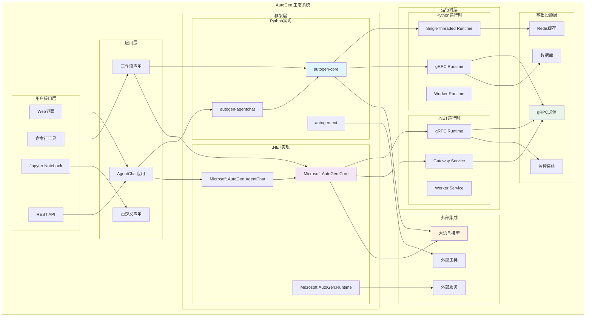
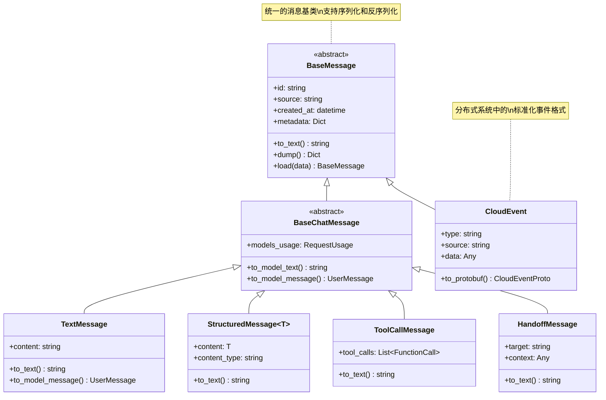
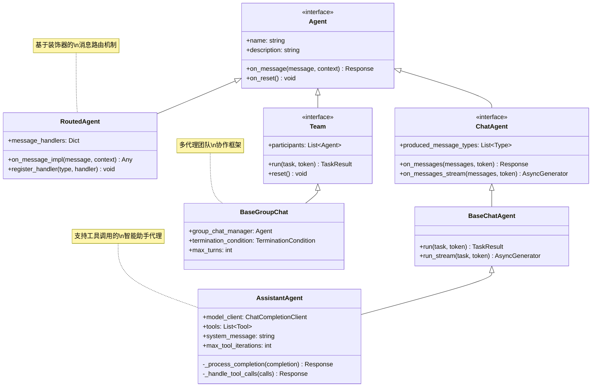
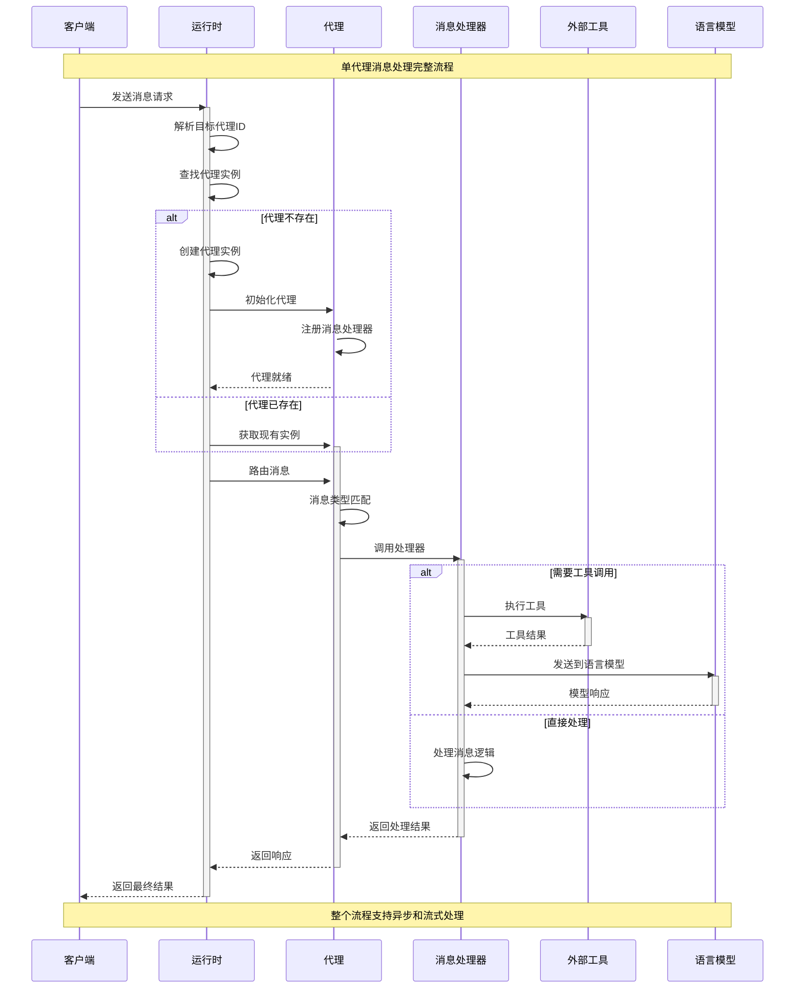
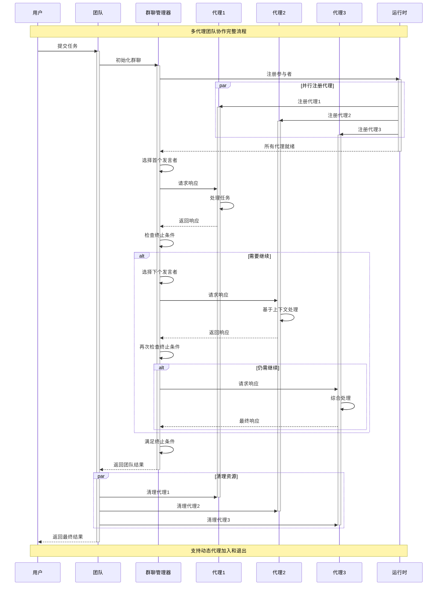
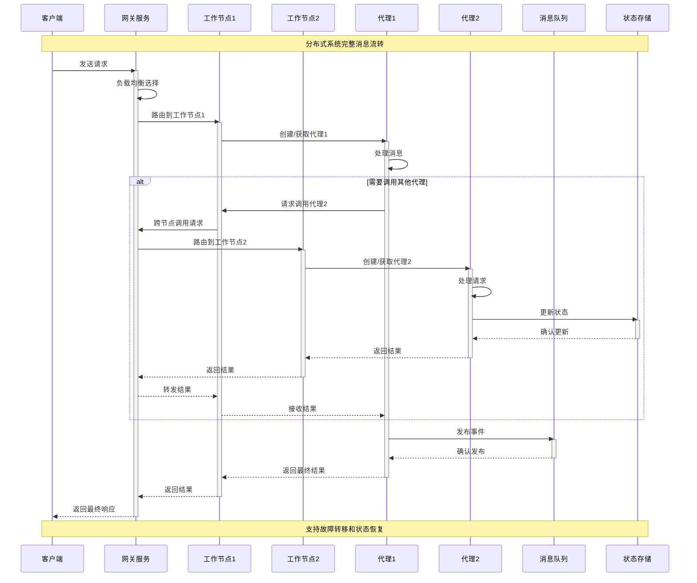
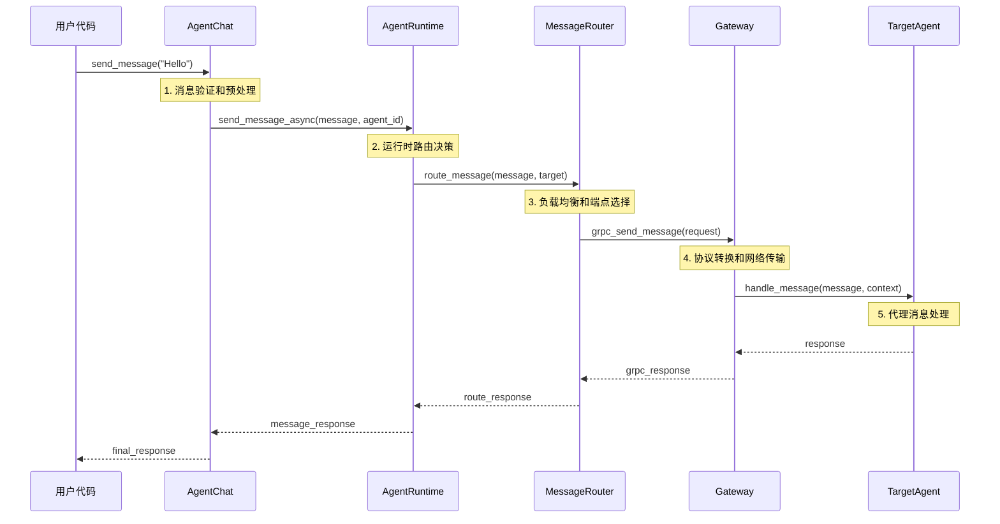

## 概述

AutoGen是Microsoft开发的下一代多代理对话框架，支持Python和.NET双语言实现，提供了完整的多代理协作、消息路由、工具集成和分布式部署能力。

本文档是AutoGen的**完整架构指南**，整合了以下内容：
- 统一架构设计和核心原理
- 完整API参考和调用链路分析  
- Python和.NET核心模块深度解析
- 高级使用模式和最佳实践
- 协议分析和服务网关设计

通过本文档，开发者可以全面掌握AutoGen的设计理念、技术实现和实际应用。

## 1. 整体架构概览

### 1.1 AutoGen生态系统全景图



### 1.2 核心架构原则

#### 1. 多语言统一设计 (Multi-Language Unified Design)
- **协议统一**：Python和.NET实现共享相同的消息协议和通信规范
- **API一致性**：两种语言提供相似的开发体验和API设计
- **互操作性**：支持Python和.NET代理在同一系统中协作

#### 2. 分层架构模式 (Layered Architecture Pattern)
- **应用层**：面向特定场景的高级抽象（AgentChat、工作流等）
- **框架层**：核心代理抽象和消息处理机制
- **运行时层**：代理生命周期管理和消息路由
- **基础设施层**：通信、存储、监控等底层服务

#### 3. 事件驱动架构 (Event-Driven Architecture)
- **异步消息传递**：基于事件的松耦合通信模式
- **发布订阅模式**：灵活的消息分发和订阅机制
- **流式处理**：支持实时数据流和长时间运行的任务

## 2. 核心组件深度分析

### 2.1 消息系统统一架构



#### 消息系统核心实现

**Python实现 - 消息基类**

```python
class BaseMessage(BaseModel, ABC):
    """
    所有消息类型的抽象基类
    
    提供统一的消息接口，支持序列化、反序列化和文本转换。
    这是AutoGen消息系统的核心抽象，确保所有消息类型的一致性。
    
    Attributes:
        id: 消息的唯一标识符，用于消息跟踪和去重
        source: 消息发送者的标识，通常是代理名称
        created_at: 消息创建时间戳，用于排序和审计
        metadata: 扩展元数据字典，支持自定义属性
    """
    
    id: str = Field(default_factory=lambda: str(uuid.uuid4()))
    source: str
    created_at: datetime = Field(default_factory=lambda: datetime.now(timezone.utc))
    metadata: Dict[str, str] = Field(default_factory=dict)
    
    @abstractmethod
    def to_text(self) -> str:
        """
        转换为人类可读的文本表示
        
        这个方法用于控制台显示、日志记录和调试。
        每个具体的消息类型都必须实现这个方法。
        
        Returns:
            str: 消息的文本表示
        """
        ...
    
    def dump(self) -> Mapping[str, Any]:
        """
        序列化为字典格式
        
        将消息对象转换为可JSON序列化的字典，用于网络传输、
        持久化存储和跨语言通信。
        
        Returns:
            Mapping[str, Any]: 序列化后的字典数据
        """
        return self.model_dump(mode="json")
    
    @classmethod
    def load(cls, data: Mapping[str, Any]) -> Self:
        """
        从字典数据反序列化消息对象
        
        这是dump方法的逆操作，用于从存储或网络中恢复消息对象。
        支持版本兼容性和数据验证。
        
        Args:
            data: 序列化的消息数据字典
            
        Returns:
            Self: 反序列化后的消息对象
            
        Raises:
            ValidationError: 数据格式不正确时抛出
        """
        return cls.model_validate(data)
```

**.NET实现 - 消息基类**

```csharp
/// <summary>
/// 所有消息类型的抽象基类
/// 
/// 提供统一的消息接口，确保Python和.NET实现的一致性。
/// 支持序列化、反序列化和类型安全的消息处理。
/// </summary>
public abstract class BaseMessage
{
    /// <summary>
    /// 消息的唯一标识符
    /// 用于消息跟踪、去重和关联分析
    /// </summary>
    public string Id { get; set; } = Guid.NewGuid().ToString();
    
    /// <summary>
    /// 消息发送者标识
    /// 通常是代理的名称或ID，用于消息路由和权限控制
    /// </summary>
    public string Source { get; set; } = string.Empty;
    
    /// <summary>
    /// 消息创建时间戳
    /// 使用UTC时间，确保跨时区的一致性
    /// </summary>
    public DateTime CreatedAt { get; set; } = DateTime.UtcNow;
    
    /// <summary>
    /// 扩展元数据字典
    /// 支持自定义属性和上下文信息传递
    /// </summary>
    public Dictionary<string, string> Metadata { get; set; } = new();
    
    /// <summary>
    /// 转换为人类可读的文本表示
    /// 
    /// 用于控制台输出、日志记录和用户界面显示。
    /// 每个具体消息类型必须提供有意义的文本表示。
    /// </summary>
    /// <returns>消息的文本表示</returns>
    public abstract string ToText();
    
    /// <summary>
    /// 序列化为字典格式
    /// 
    /// 将消息对象转换为可序列化的字典，支持JSON、XML等格式。
    /// 用于网络传输、数据库存储和跨进程通信。
    /// </summary>
    /// <returns>序列化后的字典数据</returns>
    public virtual Dictionary<string, object> Dump()
    {
        return new Dictionary<string, object>
        {
            ["id"] = Id,
            ["source"] = Source,
            ["created_at"] = CreatedAt,
            ["metadata"] = Metadata,
            ["type"] = GetType().Name
        };
    }
    
    /// <summary>
    /// 从字典数据反序列化消息对象
    /// 
    /// 支持版本兼容性和数据验证，确保数据完整性。
    /// 使用工厂模式根据类型信息创建具体的消息实例。
    /// </summary>
    /// <param name="data">序列化的消息数据</param>
    /// <returns>反序列化后的消息对象</returns>
    /// <exception cref="ArgumentException">数据格式不正确时抛出</exception>
    public static BaseMessage Load(Dictionary<string, object> data)
    {
        if (!data.TryGetValue("type", out var typeObj) || typeObj is not string typeName)
        {
            throw new ArgumentException("消息数据必须包含有效的type字段");
        }
        
        // 使用反射创建具体的消息类型实例
        var messageType = Type.GetType($"AutoGen.Messages.{typeName}");
        if (messageType == null)
        {
            throw new ArgumentException($"未知的消息类型: {typeName}");
        }
        
        var instance = Activator.CreateInstance(messageType) as BaseMessage;
        if (instance == null)
        {
            throw new ArgumentException($"无法创建消息类型实例: {typeName}");
        }
        
        // 填充基础属性
        if (data.TryGetValue("id", out var id)) instance.Id = id.ToString() ?? string.Empty;
        if (data.TryGetValue("source", out var source)) instance.Source = source.ToString() ?? string.Empty;
        if (data.TryGetValue("created_at", out var createdAt) && DateTime.TryParse(createdAt.ToString(), out var dt))
            instance.CreatedAt = dt;
        if (data.TryGetValue("metadata", out var metadata) && metadata is Dictionary<string, object> metaDict)
        {
            instance.Metadata = metaDict.ToDictionary(
                kvp => kvp.Key, 
                kvp => kvp.Value?.ToString() ?? string.Empty
            );
        }
        
        return instance;
    }
}
```

### 2.2 代理系统统一架构



#### 代理系统核心实现

**Python实现 - 路由代理基类**

```python
class RoutedAgent(BaseAgent):
    """
    基于装饰器的路由代理基类
    
    这是AutoGen Python实现的核心代理抽象，提供了基于类型和条件的
    智能消息路由机制。通过装饰器自动发现和注册消息处理器，
    实现了灵活而高效的消息分发。
    
    核心特性:
    - 自动消息处理器发现和注册
    - 基于类型的一级路由匹配
    - 基于条件的二级路由筛选
    - 支持RPC、事件、流式处理等多种模式
    """
    
    def __init__(self, description: str) -> None:
        """
        初始化路由代理
        
        Args:
            description: 代理的功能描述，用于文档和调试
        """
        super().__init__(description)
        self._message_handlers = self._build_message_handler_map()
    
    def _build_message_handler_map(self) -> Dict[Type[Any], List[MessageHandler[Any, Any, Any]]]:
        """
        构建消息处理器映射表
        
        通过反射扫描代理类的所有方法，识别带有@message_handler、
        @event、@rpc装饰器的方法，并根据类型注解构建高效的路由映射表。
        
        这是AutoGen路由系统的核心算法，实现了O(1)的类型匹配和
        O(n)的条件匹配，其中n是同类型处理器的数量。
        
        Returns:
            Dict: 消息类型到处理器列表的映射
        """
        handlers_map: DefaultDict[Type[Any], List[MessageHandler[Any, Any, Any]]] = DefaultDict(list)
        
        # 遍历类的所有方法（按字母顺序确保确定性）
        for name in sorted(dir(self.__class__)):
            method = getattr(self.__class__, name)
            
            # 检查是否为消息处理器
            if hasattr(method, 'is_message_handler') and method.is_message_handler:
                # 为每个目标类型注册处理器
                for target_type in method.target_types:
                    handlers_map[target_type].append(method)
        
        return dict(handlers_map)
    
    async def on_message_impl(self, message: Any, ctx: MessageContext) -> Any:
        """
        智能消息路由核心实现
        
        这是AutoGen消息路由的核心算法，实现了两级路由匹配：
        1. 基于消息类型的一级路由（O(1)哈希查找）
        2. 基于条件函数的二级路由（O(n)线性扫描）
        
        路由策略:
        - 按字母顺序尝试处理器，确保确定性行为
        - 第一个匹配的处理器立即执行并返回
        - 处理器异常不会中断整体路由流程
        - 所有处理器都失败时抛出CantHandleException
        
        Args:
            message: 待处理的消息对象
            ctx: 消息上下文，包含发送者、取消令牌等信息
            
        Returns:
            Any: 处理器的返回结果
            
        Raises:
            CantHandleException: 没有找到匹配的处理器时抛出
        """
        message_type = type(message)
        
        # 一级路由：基于消息类型查找处理器
        handlers = self._message_handlers.get(message_type, [])
        
        if not handlers:
            raise CantHandleException(f"没有找到处理 {message_type} 类型消息的处理器")
        
        # 二级路由：按条件匹配处理器
        for handler in handlers:
            try:
                # 调用处理器的router函数进行条件匹配
                if handler.router(message, ctx):
                    logger.debug(f"使用处理器 {handler.__name__} 处理消息类型 {message_type}")
                    return await handler(self, message, ctx)
            except Exception as e:
                logger.error(f"处理器 {handler.__name__} 路由检查失败: {e}")
                continue  # 尝试下一个处理器
        
        # 所有处理器都无法匹配
        raise CantHandleException(f"没有匹配的处理器能够处理消息: {message}")
```

**.NET实现 - 路由代理基类**

```csharp
/// <summary>
/// 基于反射的路由代理基类
/// 
/// .NET实现的核心代理抽象，提供了类型安全的消息路由机制。
/// 通过反射自动发现消息处理方法，支持多种返回类型的统一处理。
/// 
/// 核心特性:
/// - 基于MethodInfo的反射路由
/// - 类型安全的消息处理
/// - 统一的ValueTask返回类型处理
/// - 支持同步和异步处理方法
/// </summary>
public abstract class RoutedAgent : BaseAgent
{
    private readonly Dictionary<Type, List<HandlerInvoker>> _messageHandlers;
    
    /// <summary>
    /// 初始化路由代理
    /// </summary>
    /// <param name="description">代理功能描述</param>
    protected RoutedAgent(string description) : base(description)
    {
        _messageHandlers = BuildMessageHandlerMap();
    }
    
    /// <summary>
    /// 构建消息处理器映射表
    /// 
    /// 通过反射扫描代理类的所有方法，识别消息处理方法并构建
    /// 高效的类型映射表。支持多种方法签名和返回类型。
    /// </summary>
    /// <returns>消息类型到处理器调用器列表的映射</returns>
    private Dictionary<Type, List<HandlerInvoker>> BuildMessageHandlerMap()
    {
        var handlersMap = new Dictionary<Type, List<HandlerInvoker>>();
        
        // 获取所有公共实例方法
        var methods = GetType().GetMethods(BindingFlags.Public | BindingFlags.Instance)
            .Where(m => m.DeclaringType != typeof(object))
            .OrderBy(m => m.Name); // 确保确定性顺序
        
        foreach (var method in methods)
        {
            // 检查方法签名是否符合消息处理器模式
            if (IsMessageHandler(method))
            {
                var messageType = GetMessageType(method);
                if (messageType != null)
                {
                    if (!handlersMap.ContainsKey(messageType))
                    {
                        handlersMap[messageType] = new List<HandlerInvoker>();
                    }
                    
                    // 创建处理器调用器
                    var invoker = new HandlerInvoker(method, this);
                    handlersMap[messageType].Add(invoker);
                }
            }
        }
        
        return handlersMap;
    }
    
    /// <summary>
    /// 检查方法是否为消息处理器
    /// 
    /// 验证方法签名是否符合消息处理器的要求：
    /// - 第一个参数必须是消息类型
    /// - 第二个参数必须是MessageContext
    /// - 返回类型必须是ValueTask或ValueTask&lt;T&gt;
    /// </summary>
    /// <param name="method">待检查的方法</param>
    /// <returns>如果是有效的消息处理器则返回true</returns>
    private static bool IsMessageHandler(MethodInfo method)
    {
        var parameters = method.GetParameters();
        
        // 检查参数数量和类型
        if (parameters.Length != 2)
            return false;
        
        // 第二个参数必须是MessageContext
        if (parameters[1].ParameterType != typeof(MessageContext))
            return false;
        
        // 返回类型必须是ValueTask或ValueTask<T>
        var returnType = method.ReturnType;
        if (returnType != typeof(ValueTask) && 
            (!returnType.IsGenericType || returnType.GetGenericTypeDefinition() != typeof(ValueTask<>)))
            return false;
        
        return true;
    }
    
    /// <summary>
    /// 获取方法处理的消息类型
    /// </summary>
    /// <param name="method">消息处理方法</param>
    /// <returns>消息类型，如果无法确定则返回null</returns>
    private static Type? GetMessageType(MethodInfo method)
    {
        var parameters = method.GetParameters();
        if (parameters.Length > 0)
        {
            return parameters[0].ParameterType;
        }
        return null;
    }
    
    /// <summary>
    /// 消息路由核心实现
    /// 
    /// 基于消息类型进行路由匹配，支持继承关系的类型匹配。
    /// 使用HandlerInvoker实现统一的方法调用接口。
    /// </summary>
    /// <param name="message">待处理的消息</param>
    /// <param name="context">消息上下文</param>
    /// <returns>处理结果</returns>
    /// <exception cref="CantHandleException">没有找到匹配的处理器时抛出</exception>
    public override async ValueTask<object?> OnMessageAsync(object message, MessageContext context)
    {
        var messageType = message.GetType();
        
        // 查找精确类型匹配的处理器
        if (_messageHandlers.TryGetValue(messageType, out var handlers))
        {
            // 尝试每个处理器（按注册顺序）
            foreach (var handler in handlers)
            {
                try
                {
                    var result = await handler.InvokeAsync(message, context);
                    return result;
                }
                catch (Exception ex)
                {
                    // 记录错误但继续尝试下一个处理器
                    Logger.LogWarning(ex, "处理器调用失败: {HandlerName}", handler.GetType().Name);
                }
            }
        }
        
        // 查找基类型匹配的处理器
        foreach (var kvp in _messageHandlers)
        {
            if (kvp.Key.IsAssignableFrom(messageType))
            {
                foreach (var handler in kvp.Value)
                {
                    try
                    {
                        var result = await handler.InvokeAsync(message, context);
                        return result;
                    }
                    catch (Exception ex)
                    {
                        Logger.LogWarning(ex, "基类处理器调用失败: {HandlerName}", handler.GetType().Name);
                    }
                }
            }
        }
        
        throw new CantHandleException($"没有找到处理 {messageType.Name} 类型消息的处理器");
    }
}
```

### 2.3 运行时系统统一架构

```mermaid
graph TB
    subgraph "运行时架构层次"
        subgraph "应用运行时"
            APP_RUNTIME[应用运行时]
            TASK_SCHEDULER[任务调度器]
            LIFECYCLE_MGR[生命周期管理器]
        end
        
        subgraph "代理运行时"
            AGENT_RUNTIME[代理运行时接口]
            SINGLE_RUNTIME[单线程运行时]
            GRPC_RUNTIME[gRPC分布式运行时]
            WORKER_RUNTIME[工作节点运行时]
        end
        
        subgraph "消息运行时"
            MSG_ROUTER[消息路由器]
            TOPIC_MGR[主题管理器]
            SUBSCRIPTION_MGR[订阅管理器]
        end
        
        subgraph "网络运行时"
            GRPC_SERVER[gRPC服务器]
            GRPC_CLIENT[gRPC客户端]
            GATEWAY_SERVICE[网关服务]
        end
        
        subgraph "存储运行时"
            STATE_STORE[状态存储]
            MESSAGE_STORE[消息存储]
            CACHE_LAYER[缓存层]
        end
    end
    
    APP_RUNTIME --> AGENT_RUNTIME
    TASK_SCHEDULER --> LIFECYCLE_MGR
    
    AGENT_RUNTIME <|-- SINGLE_RUNTIME
    AGENT_RUNTIME <|-- GRPC_RUNTIME
    AGENT_RUNTIME <|-- WORKER_RUNTIME
    
    SINGLE_RUNTIME --> MSG_ROUTER
    GRPC_RUNTIME --> GRPC_SERVER
    GRPC_RUNTIME --> GRPC_CLIENT
    WORKER_RUNTIME --> GATEWAY_SERVICE
    
    MSG_ROUTER --> TOPIC_MGR
    MSG_ROUTER --> SUBSCRIPTION_MGR
    
    GRPC_SERVER --> STATE_STORE
    GATEWAY_SERVICE --> MESSAGE_STORE
    SINGLE_RUNTIME --> CACHE_LAYER
    
    style AGENT_RUNTIME fill:#e1f5fe
    style MSG_ROUTER fill:#f3e5f5
    style GRPC_SERVER fill:#e8f5e8
```

## 3. 跨语言通信协议

### 3.1 gRPC协议定义

**CloudEvent消息协议**

```protobuf
// cloudevent.proto - 标准化的事件消息格式
syntax = "proto3";

package cloudevents;

/**
 * CloudEvent消息定义
 * 
 * 基于CNCF CloudEvents规范的标准化事件格式，
 * 确保Python和.NET实现之间的完全互操作性。
 */
message CloudEvent {
    // 事件的唯一标识符
    // 用于事件去重、追踪和关联分析
    string id = 1;
    
    // 事件来源标识
    // 标识产生事件的系统、服务或代理
    string source = 2;
    
    // 事件类型
    // 定义事件的语义类型，用于路由和处理决策
    string type = 3;
    
    // 规范版本
    // CloudEvents规范的版本号，确保兼容性
    string spec_version = 4;
    
    // 事件数据内容类型
    // 描述data字段的MIME类型
    optional string data_content_type = 5;
    
    // 事件数据模式URI
    // 指向描述数据结构的模式文档
    optional string data_schema = 6;
    
    // 事件主题
    // 描述事件相关的主题或资源
    optional string subject = 7;
    
    // 事件时间戳
    // 事件发生的时间（RFC3339格式）
    optional string time = 8;
    
    // 事件数据负载
    // 实际的事件数据内容
    oneof data {
        bytes binary_data = 9;      // 二进制数据
        string text_data = 10;      // 文本数据
        google.protobuf.Any proto_data = 11;  // 结构化数据
    }
    
    // 扩展属性
    // 支持自定义的事件属性
    map<string, string> attributes = 12;
}

/**
 * 批量事件消息
 * 
 * 用于高效传输多个相关事件，
 * 减少网络开销和提高吞吐量。
 */
message CloudEventBatch {
    repeated CloudEvent events = 1;
    
    // 批次元数据
    string batch_id = 2;
    string batch_source = 3;
    int64 batch_size = 4;
    string created_at = 5;
}
```

**代理工作协议**

```protobuf
// agent_worker.proto - 代理工作节点通信协议
syntax = "proto3";

package autogen;

import "cloudevent.proto";

/**
 * 代理工作服务定义
 * 
 * 定义代理节点之间的标准通信接口，
 * 支持消息传递、状态同步和生命周期管理。
 */
service AgentWorker {
    // 发送消息到代理
    rpc SendMessage(SendMessageRequest) returns (SendMessageResponse);
    
    // 发布事件到主题
    rpc PublishEvent(PublishEventRequest) returns (PublishEventResponse);
    
    // 订阅主题事件
    rpc SubscribeToTopic(SubscribeRequest) returns (stream cloudevents.CloudEvent);
    
    // 获取代理状态
    rpc GetAgentState(GetAgentStateRequest) returns (GetAgentStateResponse);
    
    // 重置代理状态
    rpc ResetAgent(ResetAgentRequest) returns (ResetAgentResponse);
    
    // 健康检查
    rpc HealthCheck(HealthCheckRequest) returns (HealthCheckResponse);
}

/**
 * 发送消息请求
 */
message SendMessageRequest {
    // 目标代理标识
    AgentId target = 1;
    
    // 消息内容
    cloudevents.CloudEvent message = 2;
    
    // 请求选项
    SendOptions options = 3;
}

/**
 * 代理标识符
 */
message AgentId {
    // 代理类型名称
    string type = 1;
    
    // 代理实例键
    string key = 2;
}

/**
 * 发送选项
 */
message SendOptions {
    // 超时时间（毫秒）
    int32 timeout_ms = 1;
    
    // 是否需要响应
    bool expect_response = 2;
    
    // 重试次数
    int32 retry_count = 3;
}

/**
 * 发送消息响应
 */
message SendMessageResponse {
    // 操作是否成功
    bool success = 1;
    
    // 错误信息（如果失败）
    optional string error = 2;
    
    // 响应消息（如果有）
    optional cloudevents.CloudEvent response = 3;
    
    // 请求ID（用于追踪）
    string request_id = 4;
}
```

### 3.2 消息序列化机制

**Python实现 - CloudEvent转换**

```python
class CloudEventConverter:
    """
    CloudEvent消息转换器
    
    负责AutoGen内部消息格式与标准CloudEvent格式之间的转换，
    确保跨语言和跨系统的消息互操作性。
    
    核心功能:
    - 内部消息到CloudEvent的转换
    - CloudEvent到内部消息的反序列化
    - 消息类型注册和发现
    - 数据格式验证和错误处理
    """
    
    def __init__(self):
        """初始化转换器"""
        self._message_types: Dict[str, Type[BaseMessage]] = {}
        self._register_builtin_types()
    
    def _register_builtin_types(self) -> None:
        """
        注册内置消息类型
        
        自动发现和注册所有内置的消息类型，
        建立类型名称到Python类的映射关系。
        """
        builtin_types = [
            TextMessage,
            StructuredMessage,
            ToolCallMessage,
            ToolCallResultMessage,
            HandoffMessage,
            StopMessage,
        ]
        
        for message_type in builtin_types:
            type_name = message_type.__name__
            self._message_types[type_name] = message_type
    
    def to_cloud_event(self, message: BaseMessage, source: str = "") -> CloudEvent:
        """
        将内部消息转换为CloudEvent格式
        
        这个方法实现了AutoGen消息到标准CloudEvent的转换，
        确保消息能够在分布式系统中正确传输和处理。
        
        转换规则:
        - message.id -> CloudEvent.id
        - message.source -> CloudEvent.source  
        - message类型名 -> CloudEvent.type
        - message内容 -> CloudEvent.data
        - message.metadata -> CloudEvent.attributes
        
        Args:
            message: 待转换的内部消息对象
            source: 消息源标识，如果为空则使用message.source
            
        Returns:
            CloudEvent: 转换后的CloudEvent对象
            
        Raises:
            ValueError: 消息格式不正确时抛出
        """
        if not isinstance(message, BaseMessage):
            raise ValueError(f"消息必须继承自BaseMessage，实际类型: {type(message)}")
        
        # 序列化消息数据
        message_data = message.dump()
        data_json = json.dumps(message_data, ensure_ascii=False, default=str)
        
        # 创建CloudEvent
        cloud_event = CloudEvent(
            id=message.id,
            source=source or message.source,
            type=f"autogen.message.{message.__class__.__name__}",
            spec_version="1.0",
            data_content_type="application/json",
            time=message.created_at.isoformat(),
            data=data_json,
            attributes=message.metadata.copy()
        )
        
        return cloud_event
    
    def from_cloud_event(self, cloud_event: CloudEvent) -> BaseMessage:
        """
        从CloudEvent格式反序列化内部消息
        
        这是to_cloud_event方法的逆操作，将标准CloudEvent
        转换回AutoGen的内部消息格式。
        
        反序列化过程:
        1. 从CloudEvent.type提取消息类型名
        2. 查找对应的Python消息类
        3. 反序列化CloudEvent.data中的JSON数据
        4. 创建消息对象并填充属性
        5. 验证消息完整性
        
        Args:
            cloud_event: 待转换的CloudEvent对象
            
        Returns:
            BaseMessage: 反序列化后的内部消息对象
            
        Raises:
            ValueError: CloudEvent格式不正确或类型未知时抛出
        """
        # 提取消息类型
        if not cloud_event.type.startswith("autogen.message."):
            raise ValueError(f"不支持的CloudEvent类型: {cloud_event.type}")
        
        message_type_name = cloud_event.type.replace("autogen.message.", "")
        
        if message_type_name not in self._message_types:
            raise ValueError(f"未知的消息类型: {message_type_name}")
        
        message_class = self._message_types[message_type_name]
        
        # 反序列化数据
        try:
            if isinstance(cloud_event.data, str):
                message_data = json.loads(cloud_event.data)
            elif isinstance(cloud_event.data, dict):
                message_data = cloud_event.data
            else:
                raise ValueError(f"不支持的数据格式: {type(cloud_event.data)}")
        except json.JSONDecodeError as e:
            raise ValueError(f"JSON数据解析失败: {e}")
        
        # 创建消息对象
        try:
            message = message_class.load(message_data)
        except Exception as e:
            raise ValueError(f"消息对象创建失败: {e}")
        
        # 同步CloudEvent属性
        message.id = cloud_event.id
        message.source = cloud_event.source
        if cloud_event.time:
            try:
                message.created_at = datetime.fromisoformat(cloud_event.time.replace('Z', '+00:00'))
            except ValueError:
                pass  # 保持原有时间戳
        
        # 合并扩展属性
        if cloud_event.attributes:
            message.metadata.update(cloud_event.attributes)
        
        return message
    
    def register_message_type(self, message_class: Type[BaseMessage]) -> None:
        """
        注册自定义消息类型
        
        允许应用程序注册自定义的消息类型，扩展框架的消息处理能力。
        注册后的类型可以在CloudEvent转换中被正确识别和处理。
        
        Args:
            message_class: 要注册的消息类，必须继承自BaseMessage
            
        Raises:
            ValueError: 消息类不符合要求时抛出
        """
        if not issubclass(message_class, BaseMessage):
            raise ValueError(f"消息类必须继承自BaseMessage: {message_class}")
        
        type_name = message_class.__name__
        
        if type_name in self._message_types:
            logger.warning(f"消息类型 {type_name} 已存在，将被覆盖")
        
        self._message_types[type_name] = message_class
        logger.info(f"已注册消息类型: {type_name}")
```

**.NET实现 - CloudEvent转换**

```csharp
/// <summary>
/// CloudEvent消息转换器
/// 
/// .NET实现的消息转换器，提供与Python实现完全一致的转换逻辑。
/// 支持类型安全的消息转换和高性能的序列化处理。
/// </summary>
public class CloudEventConverter
{
    private readonly Dictionary<string, Type> _messageTypes;
    private readonly JsonSerializerOptions _jsonOptions;
    
    /// <summary>
    /// 初始化转换器
    /// </summary>
    public CloudEventConverter()
    {
        _messageTypes = new Dictionary<string, Type>();
        _jsonOptions = new JsonSerializerOptions
        {
            PropertyNamingPolicy = JsonNamingPolicy.CamelCase,
            WriteIndented = false,
            DefaultIgnoreCondition = JsonIgnoreCondition.WhenWritingNull
        };
        
        RegisterBuiltinTypes();
    }
    
    /// <summary>
    /// 注册内置消息类型
    /// 
    /// 自动发现程序集中的所有消息类型，
    /// 建立类型名称到.NET Type的映射关系。
    /// </summary>
    private void RegisterBuiltinTypes()
    {
        var assembly = Assembly.GetExecutingAssembly();
        var messageTypes = assembly.GetTypes()
            .Where(t => t.IsSubclassOf(typeof(BaseMessage)) && !t.IsAbstract)
            .ToList();
        
        foreach (var type in messageTypes)
        {
            _messageTypes[type.Name] = type;
        }
    }
    
    /// <summary>
    /// 将内部消息转换为CloudEvent格式
    /// 
    /// 实现与Python版本完全一致的转换逻辑，
    /// 确保跨语言的消息互操作性。
    /// </summary>
    /// <param name="message">待转换的内部消息对象</param>
    /// <param name="source">消息源标识</param>
    /// <returns>转换后的CloudEvent对象</returns>
    /// <exception cref="ArgumentException">消息格式不正确时抛出</exception>
    public CloudEvent ToCloudEvent(BaseMessage message, string source = "")
    {
        if (message == null)
            throw new ArgumentNullException(nameof(message));
        
        // 序列化消息数据
        var messageData = message.Dump();
        var dataJson = JsonSerializer.Serialize(messageData, _jsonOptions);
        
        // 创建CloudEvent
        var cloudEvent = new CloudEvent
        {
            Id = message.Id,
            Source = !string.IsNullOrEmpty(source) ? source : message.Source,
            Type = $"autogen.message.{message.GetType().Name}",
            SpecVersion = "1.0",
            DataContentType = "application/json",
            Time = message.CreatedAt.ToString("O"), // ISO 8601格式
            Data = dataJson,
            Attributes = new Dictionary<string, string>(message.Metadata)
        };
        
        return cloudEvent;
    }
    
    /// <summary>
    /// 从CloudEvent格式反序列化内部消息
    /// 
    /// 提供类型安全的反序列化处理，
    /// 支持复杂消息类型的正确重建。
    /// </summary>
    /// <param name="cloudEvent">待转换的CloudEvent对象</param>
    /// <returns>反序列化后的内部消息对象</returns>
    /// <exception cref="ArgumentException">CloudEvent格式不正确时抛出</exception>
    public BaseMessage FromCloudEvent(CloudEvent cloudEvent)
    {
        if (cloudEvent == null)
            throw new ArgumentNullException(nameof(cloudEvent));
        
        // 提取消息类型
        if (!cloudEvent.Type.StartsWith("autogen.message."))
            throw new ArgumentException($"不支持的CloudEvent类型: {cloudEvent.Type}");
        
        var messageTypeName = cloudEvent.Type.Replace("autogen.message.", "");
        
        if (!_messageTypes.TryGetValue(messageTypeName, out var messageType))
            throw new ArgumentException($"未知的消息类型: {messageTypeName}");
        
        // 反序列化数据
        Dictionary<string, object> messageData;
        try
        {
            if (cloudEvent.Data is string dataString)
            {
                messageData = JsonSerializer.Deserialize<Dictionary<string, object>>(dataString, _jsonOptions)
                    ?? throw new ArgumentException("JSON数据为空");
            }
            else if (cloudEvent.Data is Dictionary<string, object> dataDict)
            {
                messageData = dataDict;
            }
            else
            {
                throw new ArgumentException($"不支持的数据格式: {cloudEvent.Data?.GetType()}");
            }
        }
        catch (JsonException ex)
        {
            throw new ArgumentException($"JSON数据解析失败: {ex.Message}", ex);
        }
        
        // 创建消息对象
        BaseMessage message;
        try
        {
            message = BaseMessage.Load(messageData);
        }
        catch (Exception ex)
        {
            throw new ArgumentException($"消息对象创建失败: {ex.Message}", ex);
        }
        
        // 同步CloudEvent属性
        message.Id = cloudEvent.Id;
        message.Source = cloudEvent.Source;
        
        if (!string.IsNullOrEmpty(cloudEvent.Time) && 
            DateTime.TryParse(cloudEvent.Time, out var parsedTime))
        {
            message.CreatedAt = parsedTime.ToUniversalTime();
        }
        
        // 合并扩展属性
        if (cloudEvent.Attributes != null)
        {
            foreach (var kvp in cloudEvent.Attributes)
            {
                message.Metadata[kvp.Key] = kvp.Value;
            }
        }
        
        return message;
    }
    
    /// <summary>
    /// 注册自定义消息类型
    /// 
    /// 支持运行时动态注册新的消息类型，
    /// 扩展框架的消息处理能力。
    /// </summary>
    /// <param name="messageType">要注册的消息类型</param>
    /// <exception cref="ArgumentException">消息类型不符合要求时抛出</exception>
    public void RegisterMessageType(Type messageType)
    {
        if (messageType == null)
            throw new ArgumentNullException(nameof(messageType));
        
        if (!messageType.IsSubclassOf(typeof(BaseMessage)))
            throw new ArgumentException($"消息类型必须继承自BaseMessage: {messageType.Name}");
        
        var typeName = messageType.Name;
        
        if (_messageTypes.ContainsKey(typeName))
        {
            // 可以选择抛出异常或记录警告
            Console.WriteLine($"警告: 消息类型 {typeName} 已存在，将被覆盖");
        }
        
        _messageTypes[typeName] = messageType;
        Console.WriteLine($"已注册消息类型: {typeName}");
    }
}
```

## 4. 完整的消息流转时序图

### 4.1 单代理消息处理流程



### 4.2 多代理团队协作流程



### 4.3 分布式系统消息流转



## 5. 核心API深度分析

### 5.1 Python Core API

#### AgentRuntime接口

```python
class AgentRuntime(ABC):
    """
    代理运行时抽象接口
    
    定义了代理生命周期管理、消息路由和状态管理的核心接口。
    这是AutoGen Python实现的运行时基础，支持多种部署模式。
    
    核心职责:
    - 代理实例的创建、注册和销毁
    - 消息的路由和分发
    - 订阅关系的管理
    - 运行时状态的维护
    """
    
    @abstractmethod
    async def register(
        self,
        type: str,
        agent_factory: Callable[[], Agent],
        expected_class: type[Agent] | None = None,
    ) -> None:
        """
        注册代理类型和工厂函数
        
        这是代理注册的核心方法，建立代理类型名称到工厂函数的映射。
        工厂函数采用延迟创建模式，只在实际需要时才创建代理实例。
        
        注册流程:
        1. 验证代理类型名称的唯一性
        2. 验证工厂函数的有效性
        3. 可选的类型检查（expected_class）
        4. 建立类型映射关系
        5. 触发注册事件
        
        Args:
            type: 代理类型的唯一标识符，用于消息路由
            agent_factory: 代理工厂函数，返回代理实例
            expected_class: 期望的代理类，用于类型验证
            
        Raises:
            ValueError: 代理类型已存在或工厂函数无效
            TypeError: 代理类型不匹配expected_class
        """
        ...
    
    @abstractmethod
    async def send_message(
        self,
        message: Any,
        recipient: AgentId,
        *,
        cancellation_token: CancellationToken | None = None,
    ) -> Any:
        """
        发送消息到指定代理
        
        这是消息传递的核心方法，实现了类型安全的消息路由。
        支持同步和异步消息处理，以及超时和取消机制。
        
        消息发送流程:
        1. 验证消息格式和目标代理ID
        2. 查找或创建目标代理实例
        3. 构建消息上下文（发送者、时间戳等）
        4. 调用代理的消息处理方法
        5. 处理响应和异常
        6. 返回处理结果
        
        Args:
            message: 要发送的消息对象，可以是任意类型
            recipient: 目标代理的标识符
            cancellation_token: 取消令牌，用于超时控制
            
        Returns:
            Any: 代理的处理结果，类型取决于具体的处理器
            
        Raises:
            AgentNotFoundException: 目标代理不存在且无法创建
            CantHandleException: 代理无法处理该类型的消息
            TimeoutError: 消息处理超时
            CancellationError: 操作被取消
        """
        ...
```

### 5.2 框架使用示例

#### 基础单代理示例

```python
import asyncio
from autogen_core import SingleThreadedAgentRuntime, AgentId
from autogen_agentchat import AssistantAgent
from autogen_ext.models.openai import OpenAIChatCompletionClient

async def basic_agent_example():
    """
    基础单代理使用示例
    
    演示如何创建、配置和使用一个简单的助手代理。
    包括模型客户端配置、代理创建和消息处理。
    """
    
    # 1. 创建运行时
    runtime = SingleThreadedAgentRuntime()
    
    # 2. 创建模型客户端
    model_client = OpenAIChatCompletionClient(
        model="gpt-4o-mini",
        api_key="your_openai_api_key"
    )
    
    # 3. 创建助手代理
    assistant = AssistantAgent(
        name="helpful_assistant",
        model_client=model_client,
        description="一个有用的AI助手"
    )
    
    # 4. 注册代理到运行时
    await assistant.register(runtime, "AssistantAgent", lambda: assistant)
    
    # 5. 启动运行时
    runtime_context = runtime.start()
    
    try:
        # 6. 发送消息
        response = await runtime.send_message(
            "请解释什么是机器学习",
            AgentId("AssistantAgent", "default")
        )
        
        print(f"助手回复: {response}")
        
    finally:
        # 7. 清理资源
        await runtime_context.stop()

# 运行示例
if __name__ == "__main__":
    asyncio.run(basic_agent_example())
```

## 7. API调用链路深度分析

### 7.1 关键API调用路径

#### 消息发送调用链路



### 7.2 Python Core API核心实现

#### SingleThreadedAgentRuntime关键方法

```python
class SingleThreadedAgentRuntime(AgentRuntime):
    """单线程代理运行时 - Python Core的核心实现"""
    
    async def send_message(
        self,
        message: Any,
        recipient: AgentId,
        *,
        cancellation_token: CancellationToken | None = None,
    ) -> Any:
        """
        发送消息的核心实现
        
        关键执行步骤：
        1. 消息验证和序列化
        2. 目标代理查找和创建
        3. 消息路由和投递
        4. 响应处理和返回
        """
        # 1. 获取或创建目标代理
        agent = await self._get_agent(recipient)
        
        # 2. 创建消息上下文
        context = MessageContext(
            sender=None,  # 外部发送
            recipient=recipient,
            message_id=str(uuid.uuid4()),
            cancellation_token=cancellation_token or CancellationToken()
        )
        
        # 3. 调用代理处理消息
        try:
            response = await agent.on_message(message, context)
            return response
        except Exception as e:
            self._logger.error(f"消息处理失败: {e}")
            raise
```

### 7.3 .NET Core API核心实现

#### HandlerInvoker反射调用机制

```csharp
/// <summary>
/// 处理器调用器 - .NET Core的消息路由核心
/// </summary>
public class HandlerInvoker
{
    /// <summary>
    /// 类型擦除等待方法 - 处理泛型ValueTask的核心技术
    /// </summary>
    private static async ValueTask<object?> TypeEraseAwait<T>(ValueTask<T> vt)
    {
        return await vt;
    }

    public HandlerInvoker(MethodInfo methodInfo, object? target = null)
    {
        // 创建统一的方法调用委托
        Func<object?, MessageContext, object?> invocation;
        
        if (target != null)
        {
            // 实例方法调用
            invocation = (object? message, MessageContext messageContext) => 
                methodInfo.Invoke(target, new object?[] { message, messageContext });
        }
        else if (methodInfo.IsStatic)
        {
            // 静态方法调用
            invocation = (object? message, MessageContext messageContext) => 
                methodInfo.Invoke(null, new object?[] { message, messageContext });
        }
        else
        {
            throw new InvalidOperationException("非静态方法必须提供目标对象");
        }

        // 处理不同返回类型的统一包装
        if (methodInfo.ReturnType == typeof(ValueTask))
        {
            // 无返回值的ValueTask处理
            Invocation = async (message, ctx) =>
            {
                await (ValueTask)invocation(message, ctx)!;
                return null;
            };
        }
        else if (methodInfo.ReturnType.IsGenericType && 
                 methodInfo.ReturnType.GetGenericTypeDefinition() == typeof(ValueTask<>))
        {
            // 有返回值的ValueTask<T>处理 - 关键的类型擦除实现
            MethodInfo typeEraseAwait = typeof(HandlerInvoker)
                .GetMethod(nameof(TypeEraseAwait), BindingFlags.NonPublic | BindingFlags.Static)!
                .MakeGenericMethod(methodInfo.ReturnType.GetGenericArguments()[0]);

            Invocation = async (message, ctx) =>
            {
                object valueTask = invocation(message, ctx)!;
                object? typelessValueTask = typeEraseAwait.Invoke(null, new object[] { valueTask });
                return await (ValueTask<object?>)typelessValueTask;
            };
        }
        else
        {
            throw new InvalidOperationException($"方法 {methodInfo.Name} 必须返回 ValueTask 或 ValueTask<T>");
        }
    }

    public Func<object?, MessageContext, ValueTask<object?>> Invocation { get; }
}
```

### 7.4 API性能优化要点

#### 1. 消息处理优化
- **零拷贝传递**：本地消息通过引用传递，避免序列化开销
- **批量处理**：支持消息批量发送和处理
- **连接池**：gRPC连接复用和池化管理

#### 2. 代理管理优化  
- **懒加载**：代理按需创建，减少内存占用
- **实例缓存**：避免重复创建相同代理
- **生命周期管理**：自动清理不活跃代理

#### 3. 路由优化
- **类型路由**：O(1)的消息类型匹配
- **条件路由**：灵活的消息过滤和路由规则
- **负载均衡**：智能的代理负载分配

## 8. 总结

AutoGen提供了一个统一、强大、可扩展的多代理系统框架，支持Python和.NET双语言实现。其核心优势包括：

1. **统一的架构设计**：跨语言的一致性API和消息协议
2. **灵活的部署模式**：从单机到分布式的全面支持
3. **强大的消息系统**：类型安全的消息路由和处理
4. **丰富的代理抽象**：从基础协议到高级应用的完整层次
5. **完善的工具集成**：无缝集成外部工具和服务
6. **优秀的开发体验**：直观的API设计和丰富的示例
7. **高性能API实现**：优化的消息路由和代理管理机制

通过深入理解这些架构原理、API设计和实现细节，开发者可以构建出功能强大、性能优异的多代理应用系统。

---

<function_calls>
<invoke name="todo_write">
<parameter name="merge">true
