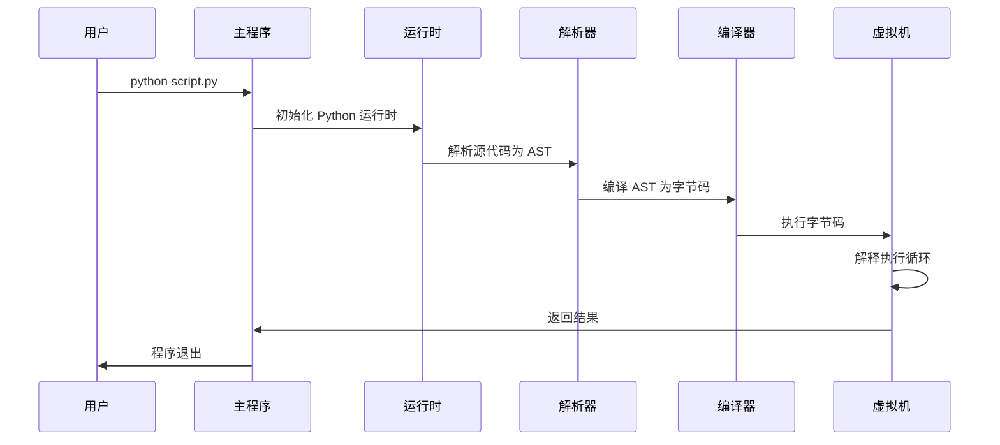
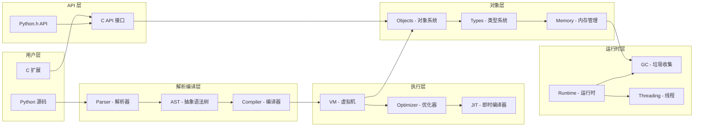

## 简介

CPython 是 Python 的官方参考实现，是用 C 语言编写的 Python 解释器。本文档提供了对 CPython 3.15.0 alpha 0 源码的全面深度分析，旨在帮助开发者从浅到深地精通整个项目的源代码逻辑。

## 项目整体结构

### 核心目录结构

```
cpython/
├── Programs/          # 主程序入口点
├── Python/           # Python 虚拟机核心实现
├── Objects/          # 内置对象类型实现
├── Modules/          # 标准库扩展模块
├── Include/          # 头文件和 API 定义
├── Parser/           # 语法分析器和解析器
├── Lib/             # Python 标准库
├── Doc/             # 文档
├── Grammar/         # 语法定义文件
├── Tools/           # 构建和开发工具
└── Misc/            # 其他资源文件
```

### 主要组件说明

1. **Programs/** - 程序启动入口，包含 `python.c` 主函数
2. **Python/** - 解释器核心，包含虚拟机、编译器、优化器等
3. **Objects/** - 所有 Python 对象类型的实现（int, str, list, dict 等）
4. **Modules/** - C 扩展模块，实现标准库的底层功能
5. **Include/** - 所有头文件，定义了 Python C API
6. **Parser/** - PEG 解析器，将源代码转换为 AST
7. **Lib/** - Python 标准库的 Python 实现

## CPython 启动流程架构图

```mermaid
graph TD
    A[用户执行 python 命令] --> B[Programs/python.c main()]
    B --> C[Py_BytesMain/Py_Main]
    C --> D[pymain_main]
    D --> E[pymain_init]
    E --> F[_PyRuntime_Initialize]
    F --> G[Py_InitializeFromConfig]
    G --> H[pyinit_core - 初始化运行时]
    H --> I[pyinit_main - 初始化主解释器]
    I --> J[Py_RunMain - 执行主程序]
    J --> K{执行模式}
    K -->|命令行| L[pymain_run_command]
    K -->|模块| M[pymain_run_module]
    K -->|文件| N[pymain_run_file]
    K -->|交互式| O[pymain_run_stdin]
    L --> P[Python 虚拟机执行]
    M --> P
    N --> P
    O --> P
    P --> Q[程序结束]
```

## 核心执行流程时序图



## 关键模块概览

### 1. 解释器启动模块 (Programs/)
- **入口函数**: `main()` -> `Py_BytesMain()` 或 `Py_Main()`
- **核心功能**: 处理命令行参数，初始化 Python 环境，启动解释器

### 2. 虚拟机核心 (Python/)
- **关键文件**:
  - `ceval.c` - 字节码解释器主循环
  - `compile.c` - Python 编译器
  - `pylifecycle.c` - 解释器生命周期管理
- **核心功能**: 字节码执行、编译、优化、内存管理

### 3. 对象系统 (Objects/)
- **关键文件**:
  - `object.c` - 基础对象系统
  - `typeobject.c` - 类型系统
  - `dictobject.c` - 字典实现
  - `listobject.c` - 列表实现
- **核心功能**: 所有 Python 对象类型的实现

### 4. 解析器 (Parser/)
- **关键文件**:
  - `pegen.c` - PEG 解析器
  - `Python.asdl` - AST 语法定义
- **核心功能**: 源代码解析为抽象语法树

### 5. API 接口 (Include/)
- **关键文件**:
  - `Python.h` - 主要 API 头文件
  - `object.h` - 对象 API
  - `pylifecycle.h` - 生命周期 API
- **核心功能**: 对外提供的 C API 接口定义

## 模块间交互图



## 文档结构

本源码分析文档按以下结构组织：

1. **总览文档** (本文档) - 整体架构和模块概览
2. **启动流程分析** - 详细分析解释器启动过程
3. **虚拟机核心分析** - 字节码执行引擎深度分析
4. **对象系统分析** - Python 对象模型详细分析
5. **解析器分析** - 语法分析和 AST 构建过程
6. **编译器分析** - 字节码生成和优化过程
7. **内存管理分析** - 内存分配和垃圾收集机制
8. **API 接口分析** - C API 接口详细说明
9. **最佳实践和案例** - 实际应用案例和开发建议

## 后续章节预览

在接下来的章节中，我们将深入分析每个模块的实现细节，包括：

- 详细的源码解读和注释
- 架构图和时序图
- 关键数据结构的 UML 图
- 实际使用案例和最佳实践
- 性能优化技巧

每个章节都将包含具体的代码示例和详细的实现说明，帮助读者全面掌握 CPython 的内部工作原理。
