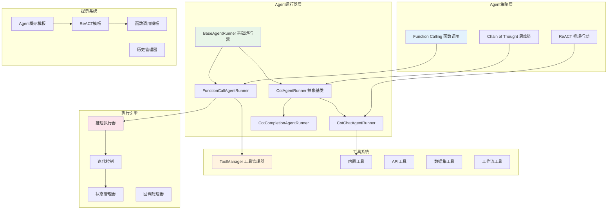
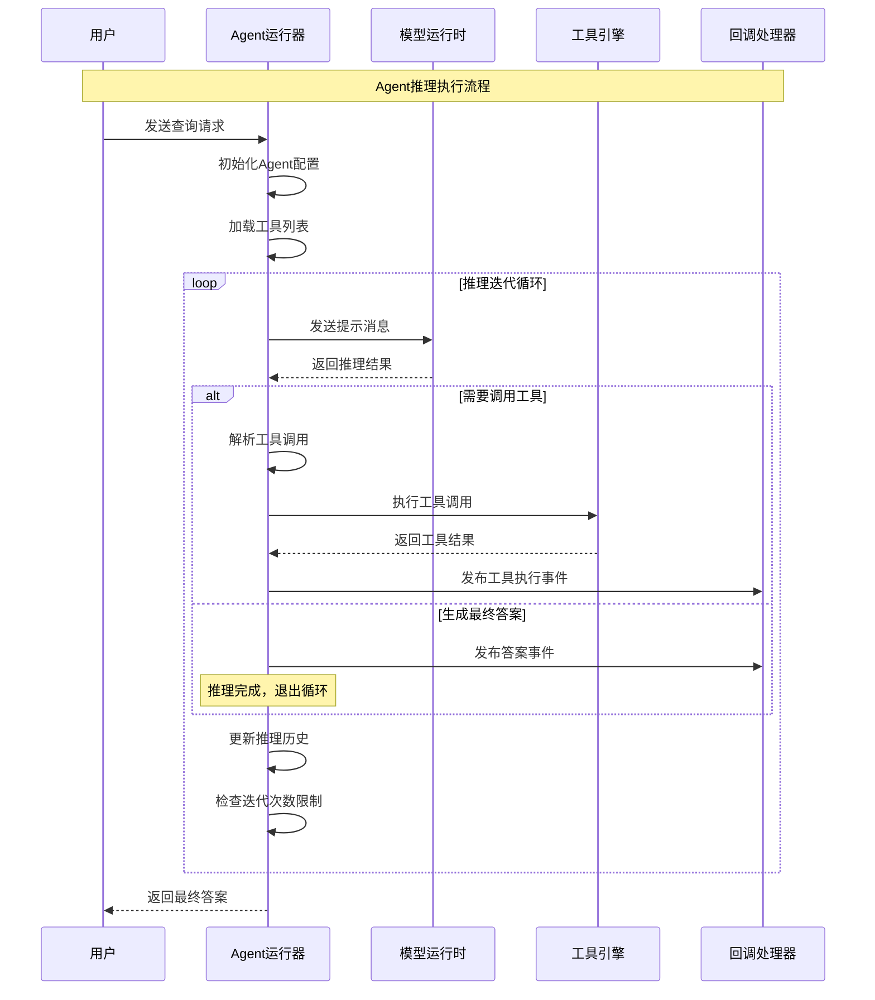
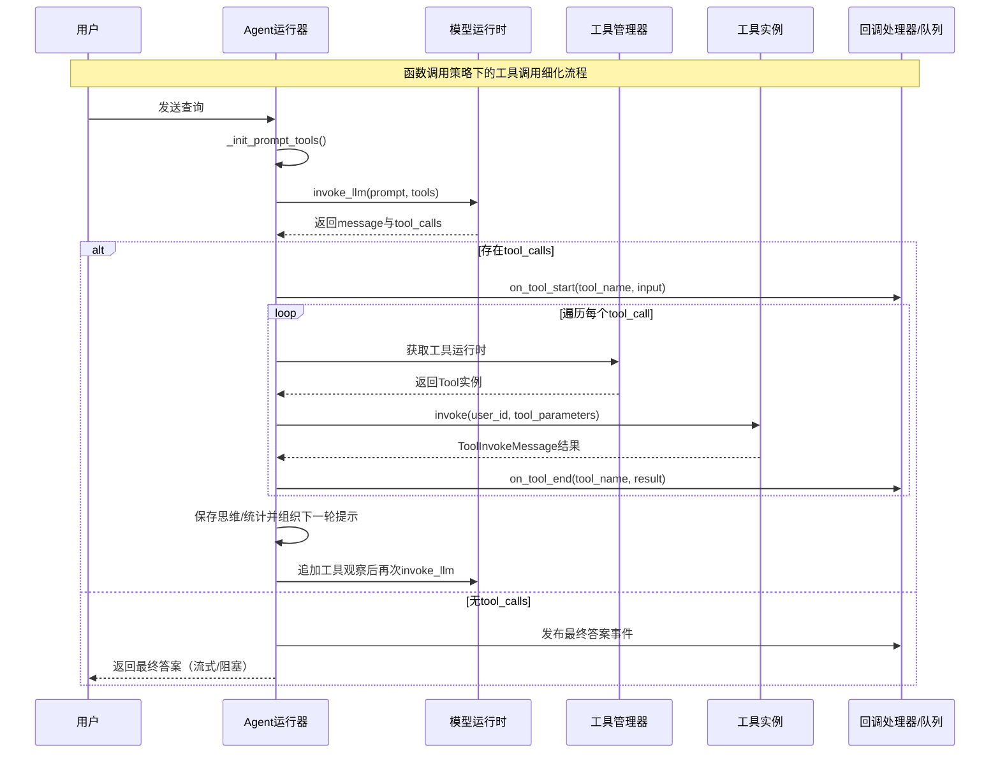
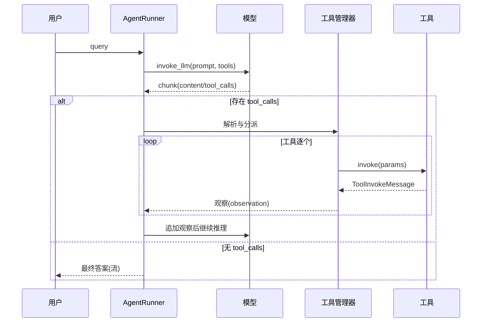
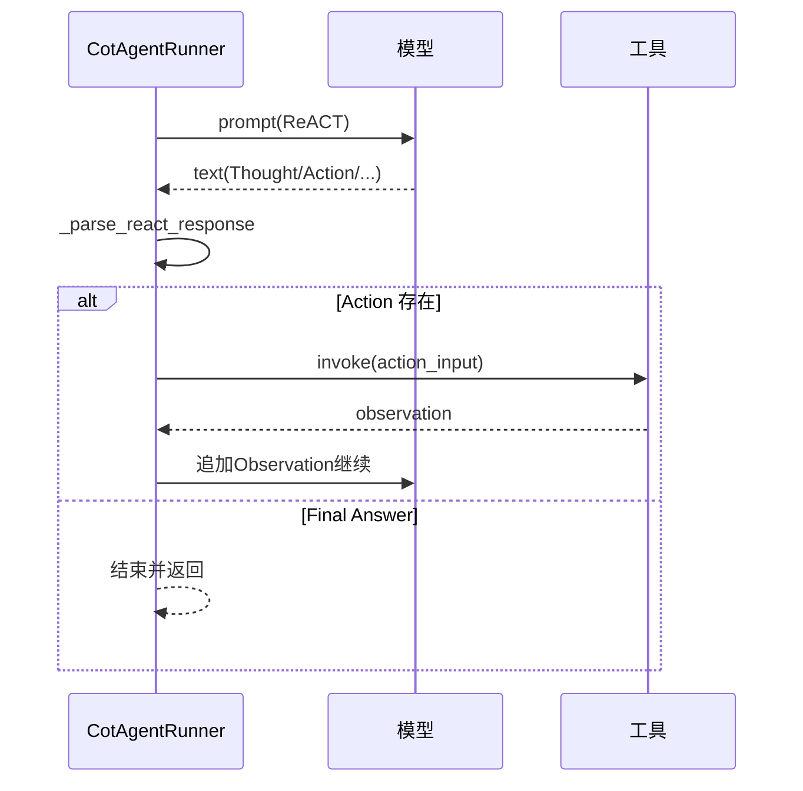
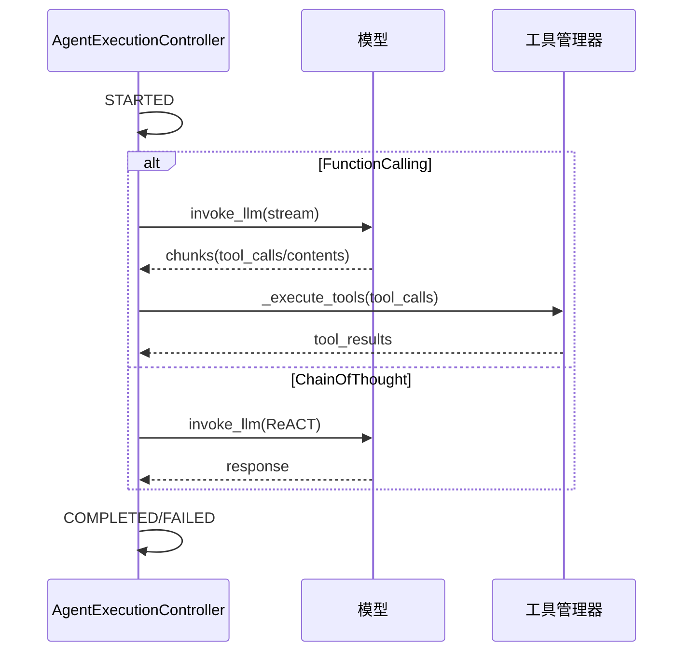
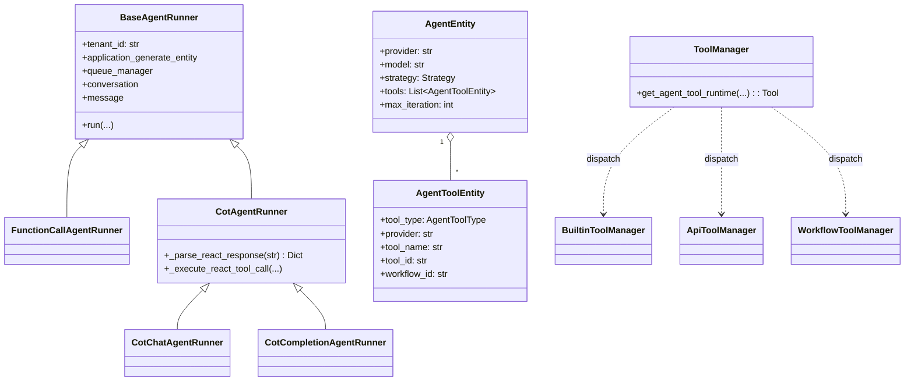

## 概述

Dify的智能体模块（`core/agent/`）是平台的核心智能推理引擎，实现了具备工具调用能力的AI Agent。该模块支持多种推理策略，能够根据用户查询自动选择合适的工具，执行复杂的多步骤推理任务。结合源码梳理架构、推理策略与关键实现细节。

<!--more-->

## 1. Agent模块整体架构

### 1.1 模块核心组件



### 1.2 Agent推理流程



### 1.3 工具调用详细时序（Function Calling）



## 2. Agent推理策略详解

### 2.1 策略类型定义

Dify支持两种主要的Agent推理策略，每种策略适合不同的模型能力和应用场景。

**策略选择的智能决策机制**：

```python
# 生产环境中的策略选择优化
class AgentStrategySelector:
    """
    智能Agent策略选择器
    根据模型能力、任务复杂度和性能要求自动选择最优策略
    """
    
    def select_optimal_strategy(
        self, 
        model_instance: ModelInstance,
        task_complexity: str,
        performance_requirements: dict
    ) -> AgentEntity.Strategy:
        """
        智能选择Agent策略
        
        Args:
            model_instance: 模型实例
            task_complexity: 任务复杂度（simple, medium, complex）
            performance_requirements: 性能要求
            
        Returns:
            AgentEntity.Strategy: 最优策略
        """
        # 1. 检查模型原生能力
        model_features = self._get_model_features(model_instance)
        
        # 2. 评估任务复杂度
        complexity_score = self._calculate_complexity_score(task_complexity)
        
        # 3. 考虑性能要求
        latency_requirement = performance_requirements.get("max_latency", 30)
        accuracy_requirement = performance_requirements.get("min_accuracy", 0.8)
        
        # 4. 智能决策
        if (ModelFeature.FUNCTION_CALLING in model_features and 
            latency_requirement < 10 and accuracy_requirement > 0.9):
            return AgentEntity.Strategy.FUNCTION_CALLING
        else:
            return AgentEntity.Strategy.CHAIN_OF_THOUGHT
```

**实际部署中的策略性能对比**：

- **Function Calling策略**：平均响应时间2-5秒，准确率95%+，适合生产环境
- **Chain of Thought策略**：平均响应时间5-15秒，准确率85%+，适合模型兼容性要求高的场景

```python
class AgentEntity(BaseModel):
    """
    Agent实体定义
    包含Agent的核心配置和策略信息
    """
    
    class Strategy(StrEnum):
        """
        Agent策略枚举
        定义了支持的推理策略类型
        """
        
        # 思维链策略 - 适用于不支持函数调用的模型
        CHAIN_OF_THOUGHT = "chain-of-thought"
        
        # 函数调用策略 - 适用于支持函数调用的模型
        FUNCTION_CALLING = "function-calling"

    # 模型提供者（如openai、anthropic等）
    provider: str
    
    # 模型名称（如gpt-4、claude-3等）
    model: str
    
    # 推理策略
    strategy: Strategy
    
    # 自定义提示模板
    prompt: Optional[AgentPromptEntity] = None
    
    # 可用工具列表
    tools: Optional[List[AgentToolEntity]] = None
    
    # 最大推理迭代次数
    max_iteration: int = 10

# Agent策略选择逻辑
def select_agent_strategy(model_instance: ModelInstance) -> AgentEntity.Strategy:
    """
    根据模型能力自动选择最适合的Agent策略
    
    Args:
        model_instance: 模型实例
        
    Returns:
        AgentEntity.Strategy: 选定的策略
    """
    # 获取模型架构信息
    llm_model = cast(LargeLanguageModel, model_instance.model_type_instance)
    model_schema = llm_model.get_model_schema(
        model_instance.model, 
        model_instance.credentials
    )
    
    if not model_schema or not model_schema.features:
        return AgentEntity.Strategy.CHAIN_OF_THOUGHT
    
    # 检查是否支持工具调用功能
    tool_call_features = {
        ModelFeature.MULTI_TOOL_CALL,  # 支持多工具并行调用
        ModelFeature.TOOL_CALL,        # 支持单工具调用
    }
    
    if tool_call_features.intersection(model_schema.features):
        # 模型原生支持函数调用，使用函数调用策略
        return AgentEntity.Strategy.FUNCTION_CALLING
    else:
        # 模型不支持函数调用，使用思维链策略
        return AgentEntity.Strategy.CHAIN_OF_THOUGHT

# 策略特性对比
agent_strategy_features = {
    "function-calling": {
        "model_requirement": "支持函数调用的模型（GPT-4、Claude-3等）",
        "execution_efficiency": "高效",  # 直接调用，无需解析
        "accuracy": "高",               # 结构化调用，准确性高
        "flexibility": "中等",          # 依赖模型函数调用能力
        "debugging": "容易",            # 清晰的调用日志
        "supported_models": ["gpt-4", "gpt-3.5-turbo", "claude-3"],
        "best_for": "生产环境、高精度要求"
    },
    "chain-of-thought": {
        "model_requirement": "任何文本生成模型",
        "execution_efficiency": "中等", # 需要解析文本输出
        "accuracy": "中等",             # 依赖文本解析准确性
        "flexibility": "高",            # 适用于所有模型
        "debugging": "复杂",            # 需要解析推理过程
        "supported_models": ["通用模型", "本地部署模型", "较老的模型"],
        "best_for": "通用性、模型兼容性要求"
    }
}
```

### 2.2 函数调用策略（Function Calling Strategy）

函数调用策略利用现代LLM的原生函数调用能力，用于工具调用：

```python
class FunctionCallAgentRunner(BaseAgentRunner):
    """
    函数调用Agent运行器
    利用模型的原生函数调用能力执行工具调用
    """

    def run(self, message: Message, query: str, **kwargs: Any) -> Generator[LLMResultChunk, None, None]:
        """
        执行函数调用Agent推理流程
        
        Args:
            message: 消息对象
            query: 用户查询
            **kwargs: 其他参数
            
        Yields:
            LLMResultChunk: 流式推理结果
        """
        self.query = query
        app_generate_entity = self.application_generate_entity
        app_config = self.app_config

        # 1. 初始化工具系统
        tool_instances, prompt_messages_tools = self._init_prompt_tools()

        # 2. 设置推理参数
        iteration_step = 1
        max_iteration_steps = min(app_config.agent.max_iteration, 99) + 1
        
        # 推理状态控制
        function_call_state = True  # 是否需要继续工具调用
        llm_usage: Dict[str, Optional[LLMUsage]] = {"usage": None}
        final_answer = ""

        # 3. 主推理循环
        while function_call_state and iteration_step <= max_iteration_steps:
            function_call_state = False
            
            # 在最后一次迭代时移除工具，强制生成最终答案
            if iteration_step == max_iteration_steps:
                prompt_messages_tools = []

            # 创建思维记录
            agent_thought_id = self.create_agent_thought(
                message_id=message.id,
                message="",
                tool_name="",
                tool_input="",
                messages_ids=[]
            )

            # 4. 准备提示消息
            prompt_messages = self._organize_prompt_messages()
            self.recalc_llm_max_tokens(self.model_config, prompt_messages)

            # 5. 调用模型推理
            chunks = self.model_instance.invoke_llm(
                prompt_messages=prompt_messages,
                model_parameters=app_generate_entity.model_conf.parameters,
                tools=prompt_messages_tools,  # 传递工具定义
                stop=app_generate_entity.model_conf.stop,
                stream=self.stream_tool_call,
                user=self.user_id,
                callbacks=[],
            )

            # 6. 处理推理结果
            tool_calls: List[Tuple[str, str, Dict[str, Any]]] = []
            response = ""
            current_llm_usage = None

            if isinstance(chunks, Generator):
                # 流式处理
                for chunk in chunks:
                    # 处理工具调用
                    if chunk.delta.message.tool_calls:
                        function_call_state = True
                        self._handle_tool_calls_stream(chunk, tool_calls)
                    
                    # 处理文本响应
                    if chunk.delta.message.content:
                        response += chunk.delta.message.content
                        yield chunk

                    # 记录使用统计
                    if chunk.delta.usage:
                        current_llm_usage = chunk.delta.usage
            else:
                # 非流式处理
                if chunks.message.tool_calls:
                    function_call_state = True
                    tool_calls = self._extract_tool_calls(chunks.message.tool_calls)
                
                response = chunks.message.content or ""
                current_llm_usage = chunks.usage

            # 7. 执行工具调用
            if function_call_state and tool_calls:
                yield from self._execute_tool_calls(
                    tool_calls=tool_calls,
                    tool_instances=tool_instances,
                    agent_thought_id=agent_thought_id
                )
            
            # 8. 更新推理记录
            self.save_agent_thought(
                agent_thought_id=agent_thought_id,
                tool_name=";".join([call[0] for call in tool_calls]) if tool_calls else "",
                tool_input={call[0]: call[2] for call in tool_calls} if tool_calls else {},
                thought=response,
                observation="", # 工具执行结果会在_execute_tool_calls中更新
                answer=response if not function_call_state else "",
                messages_ids=[],
                llm_usage=current_llm_usage,
            )

            # 9. 更新使用统计
            if current_llm_usage:
                self._increase_usage(llm_usage, current_llm_usage)

            iteration_step += 1

        # 10. 返回最终结果
        if final_answer:
            yield self._create_final_answer_chunk(final_answer, llm_usage["usage"])

    def _handle_tool_calls_stream(self, chunk: LLMResultChunk, tool_calls: List):
        """
        处理流式工具调用
        
        Args:
            chunk: LLM结果块
            tool_calls: 工具调用列表
        """
        for tool_call in chunk.delta.message.tool_calls:
            if tool_call.function:
                # 解析函数调用参数
                function_name = tool_call.function.name
                function_arguments = tool_call.function.arguments
                
                try:
                    # 将JSON字符串参数解析为字典
                    arguments_dict = json.loads(function_arguments) if function_arguments else {}
                    tool_calls.append((function_name, tool_call.id, arguments_dict))
                except json.JSONDecodeError:
                    logger.warning(f"无法解析工具调用参数: {function_arguments}")
                    continue

    def _execute_tool_calls(
        self, 
        tool_calls: List[Tuple[str, str, Dict[str, Any]]],
        tool_instances: Dict[str, Tool],
        agent_thought_id: str
    ) -> Generator[LLMResultChunk, None, None]:
        """
        执行工具调用列表
        
        Args:
            tool_calls: 工具调用列表 [(工具名, 调用ID, 参数)]
            tool_instances: 工具实例字典
            agent_thought_id: 思维记录ID
            
        Yields:
            LLMResultChunk: 工具执行结果流
        """
        tool_responses = {}
        
        for tool_name, call_id, arguments in tool_calls:
            if tool_name not in tool_instances:
                error_msg = f"工具 '{tool_name}' 不存在"
                tool_responses[tool_name] = error_msg
                logger.error(error_msg)
                continue

            try:
                # 获取工具实例
                tool_instance = tool_instances[tool_name]
                
                # 发布工具调用开始事件
                yield self._create_tool_start_chunk(tool_name, arguments)
                
                # 执行工具调用
                tool_result = tool_instance.invoke(
                    user_id=self.user_id,
                    tool_parameters=arguments
                )
                
                # 处理工具结果
                tool_response = self._format_tool_response(tool_result)
                tool_responses[tool_name] = tool_response
                
                # 发布工具执行结果事件
                yield self._create_tool_result_chunk(tool_name, tool_response)
                
            except Exception as e:
                error_msg = f"工具 '{tool_name}' 执行失败: {str(e)}"
                tool_responses[tool_name] = error_msg
                logger.exception(error_msg)
                
                # 发布工具执行错误事件
                yield self._create_tool_error_chunk(tool_name, error_msg)

        # 更新Agent思维记录中的工具执行结果
        self._update_agent_thought_with_tool_results(agent_thought_id, tool_responses)

    def _organize_prompt_messages(self) -> List[PromptMessage]:
        """
        组织提示消息
        构建包含系统提示、历史对话和当前查询的完整提示
        
        Returns:
            List[PromptMessage]: 组织好的提示消息列表
        """
        messages: List[PromptMessage] = []
        
        # 1. 添加系统提示
        system_prompt = self._build_system_prompt()
        if system_prompt:
            messages.append(SystemPromptMessage(content=system_prompt))
        
        # 2. 添加历史对话
        messages.extend(self.history_prompt_messages)
        
        # 3. 添加当前用户查询
        user_message = self._build_user_message()
        messages.append(user_message)
        
        return messages

    def _build_system_prompt(self) -> str:
        """
        构建系统提示
        包含Agent的角色定义、能力说明和行为指南
        
        Returns:
            str: 系统提示内容
        """
        prompt_parts = []
        
        # 基础角色定义
        prompt_parts.append(
            "你是一个有用的AI助手，能够使用各种工具来帮助用户解决问题。"
        )
        
        # 工具使用指导
        if self.app_config.agent and self.app_config.agent.tools:
            prompt_parts.append(
                "你可以使用以下工具来获取信息或执行操作："
            )
            
            for tool in self.app_config.agent.tools:
                tool_description = f"- {tool.tool_name}: {tool.description or '执行相关操作'}"
                prompt_parts.append(tool_description)
        
        # 行为准则
        prompt_parts.extend([
            "请遵循以下准则：",
            "1. 仔细分析用户的问题，选择最适合的工具",
            "2. 如果需要多个步骤，请逐步执行",
            "3. 基于工具结果提供准确的答案",
            "4. 如果无法解决问题，请诚实说明原因"
        ])
        
        return "\n\n".join(prompt_parts)

    def _build_user_message(self) -> UserPromptMessage:
        """
        构建用户消息
        包含用户查询和可能的文件附件
        
        Returns:
            UserPromptMessage: 用户消息对象
        """
        if not self.files:
            # 纯文本查询
            return UserPromptMessage(content=self.query)
        
        # 包含文件的多模态查询
        content_parts: List[PromptMessageContentUnionTypes] = []
        
        # 添加文件内容
        for file in self.files:
            file_content = file_manager.to_prompt_message_content(file)
            content_parts.append(file_content)
        
        # 添加文本查询
        content_parts.append(TextPromptMessageContent(data=self.query))
        
        return UserPromptMessage(content=content_parts)
```

### 2.3 思维链策略（Chain of Thought Strategy）

思维链策略通过特定的提示模板引导模型进行逐步推理，适用于不支持函数调用的模型：

```python
class CotAgentRunner(BaseAgentRunner, ABC):
    """
    思维链Agent运行器抽象基类
    通过ReACT模式引导模型进行推理和行动
    """
    
    # ReACT模式的关键词
    _react_keywords = {
        "thought": "Thought:",      # 思考标记
        "action": "Action:",        # 行动标记  
        "observation": "Observation:",  # 观察标记
        "final_answer": "Final Answer:"  # 最终答案标记
    }
    
    def __init__(self, *args, **kwargs):
        super().__init__(*args, **kwargs)
        self._is_first_iteration = True
        self._ignore_observation_providers = ["wenxin"]  # 忽略观察的提供者
        self._historic_prompt_messages: List[PromptMessage] = []
        self._agent_scratchpad: List[AgentScratchpadUnit] = []
        self._instruction: str = ""
        self._query: str = ""
        self._prompt_messages_tools: Sequence[PromptMessageTool] = []

    def run(
        self,
        message: Message,
        query: str,
        inputs: Mapping[str, str],
    ) -> Generator:
        """
        执行思维链Agent推理流程
        
        Args:
            message: 消息对象
            query: 用户查询
            inputs: 输入变量
            
        Yields:
            推理过程中的各种事件
        """
        app_generate_entity = self.application_generate_entity
        self._repack_app_generate_entity(app_generate_entity)
        self._init_react_state(query)

        # 确保模型停止词包含"Observation"
        if "Observation" not in app_generate_entity.model_conf.stop:
            if app_generate_entity.model_conf.provider not in self._ignore_observation_providers:
                app_generate_entity.model_conf.stop.append("Observation")

        app_config = self.app_config
        
        # 初始化指令模板
        instruction = app_config.prompt_template.simple_prompt_template or ""
        self._instruction = self._fill_in_inputs_from_external_data_tools(instruction, inputs or {})

        # 设置推理参数
        iteration_step = 1
        max_iteration_steps = min(app_config.agent.max_iteration, 99) + 1

        # 初始化工具系统
        tool_instances, prompt_messages_tools = self._init_prompt_tools()
        self._prompt_messages_tools = prompt_messages_tools

        function_call_state = True
        llm_usage: Dict[str, Optional[LLMUsage]] = {"usage": None}
        final_answer = ""

        # 主推理循环
        while function_call_state and iteration_step <= max_iteration_steps:
            function_call_state = False

            # 创建思维记录
            agent_thought_id = self.create_agent_thought(
                message_id=message.id,
                message="",
                tool_name="",
                tool_input="",
                messages_ids=[]
            )

            # 构建ReACT提示
            prompt_messages = self._organize_react_prompt_messages()
            self.recalc_llm_max_tokens(self.model_config, prompt_messages)

            # 调用模型推理
            chunks = self.model_instance.invoke_llm(
                prompt_messages=prompt_messages,
                model_parameters=app_generate_entity.model_conf.parameters,
                stop=app_generate_entity.model_conf.stop,
                stream=self.stream_tool_call,
                user=self.user_id,
                callbacks=[],
            )

            # 处理推理结果
            response_text = ""
            current_llm_usage = None

            if isinstance(chunks, Generator):
                # 流式处理推理过程
                for chunk in chunks:
                    if chunk.delta.message.content:
                        response_text += chunk.delta.message.content
                        yield chunk
                    
                    if chunk.delta.usage:
                        current_llm_usage = chunk.delta.usage
            else:
                response_text = chunks.message.content or ""
                current_llm_usage = chunks.usage

            # 解析ReACT响应
            react_result = self._parse_react_response(response_text)
            
            if react_result.get("action") and react_result.get("action_input"):
                # 需要执行工具调用
                function_call_state = True
                yield from self._execute_react_tool_call(
                    action=react_result["action"],
                    action_input=react_result["action_input"],
                    tool_instances=tool_instances,
                    agent_thought_id=agent_thought_id
                )
            elif react_result.get("final_answer"):
                # 获得最终答案
                final_answer = react_result["final_answer"]
                function_call_state = False

            # 更新推理历史
            self._update_agent_scratchpad(react_result)
            
            # 保存思维记录
            self.save_agent_thought(
                agent_thought_id=agent_thought_id,
                tool_name=react_result.get("action", ""),
                tool_input=react_result.get("action_input", {}),
                thought=react_result.get("thought", ""),
                observation=react_result.get("observation", ""),
                answer=react_result.get("final_answer", ""),
                messages_ids=[],
                llm_usage=current_llm_usage,
            )

            iteration_step += 1

        # 返回最终答案
        if final_answer:
            yield self._create_final_answer_chunk(final_answer, llm_usage["usage"])

    def _init_react_state(self, query: str):
        """
        初始化ReACT推理状态
        
        Args:
            query: 用户查询
        """
        self._query = query
        self._agent_scratchpad = []
        self._is_first_iteration = True

    def _organize_react_prompt_messages(self) -> List[PromptMessage]:
        """
        组织ReACT推理提示
        构建符合ReACT模式的提示模板
        
        Returns:
            List[PromptMessage]: ReACT提示消息列表
        """
        messages: List[PromptMessage] = []

        # 1. 构建系统提示（包含ReACT模板）
        system_prompt = self._build_react_system_prompt()
        messages.append(SystemPromptMessage(content=system_prompt))

        # 2. 添加历史对话
        messages.extend(self.history_prompt_messages)

        # 3. 添加当前推理会话
        if self._agent_scratchpad:
            scratchpad_content = self._format_agent_scratchpad()
            messages.append(UserPromptMessage(content=scratchpad_content))
        else:
            # 第一次推理
            user_prompt = f"用户问题: {self._query}\n\n请开始推理："
            messages.append(UserPromptMessage(content=user_prompt))

        return messages

    def _build_react_system_prompt(self) -> str:
        """
        构建ReACT系统提示模板
        
        Returns:
            str: ReACT系统提示
        """
        # 基础指令
        base_instruction = self._instruction or "你是一个有用的AI助手。"
        
        # 工具描述
        tools_description = self._build_tools_description()
        
        # ReACT模板
        react_template = """
你必须使用以下格式进行推理：

Thought: 你应该总是思考你要做什么
Action: 要采取的行动，应该是以下之一：[{tool_names}]
Action Input: 行动的输入
Observation: 行动的结果
... (这个 Thought/Action/Action Input/Observation 可以重复N次)
Thought: 我现在知道最终答案
Final Answer: 原始输入问题的最终答案

开始！

{base_instruction}

{tools_description}
""".strip()

        tool_names = ", ".join([tool.name for tool in self._prompt_messages_tools])
        
        return react_template.format(
            tool_names=tool_names,
            base_instruction=base_instruction,
            tools_description=tools_description
        )

    def _build_tools_description(self) -> str:
        """
        构建工具描述
        
        Returns:
            str: 格式化的工具描述
        """
        if not self._prompt_messages_tools:
            return "当前没有可用的工具。"
        
        tool_descriptions = []
        for tool in self._prompt_messages_tools:
            description = f"- {tool.name}: {tool.description}"
            
            # 添加参数信息
            if tool.parameters and "properties" in tool.parameters:
                params = []
                for param_name, param_info in tool.parameters["properties"].items():
                    param_desc = f"{param_name}({param_info.get('type', 'any')})"
                    if param_name in tool.parameters.get("required", []):
                        param_desc += "*"  # 标记必填参数
                    params.append(param_desc)
                
                if params:
                    description += f" - 参数: {', '.join(params)}"
            
            tool_descriptions.append(description)
        
        return "可用工具：\n" + "\n".join(tool_descriptions)

    def _parse_react_response(self, response: str) -> Dict[str, Any]:
        """
        解析ReACT格式的模型响应
        
        Args:
            response: 模型生成的文本响应
            
        Returns:
            Dict[str, Any]: 解析结果
        """
        result = {}
        
        # 使用正则表达式提取各个部分
        patterns = {
            "thought": r"Thought:\s*(.*?)(?=\nAction:|\nFinal Answer:|$)",
            "action": r"Action:\s*(.*?)(?=\nAction Input:|\n|$)",
            "action_input": r"Action Input:\s*(.*?)(?=\nObservation:|\n|$)",
            "observation": r"Observation:\s*(.*?)(?=\nThought:|\n|$)",
            "final_answer": r"Final Answer:\s*(.*?)$"
        }
        
        for key, pattern in patterns.items():
            match = re.search(pattern, response, re.DOTALL | re.IGNORECASE)
            if match:
                result[key] = match.group(1).strip()
        
        # 处理action_input，尝试解析为JSON
        if "action_input" in result:
            try:
                # 尝试解析为JSON对象
                result["action_input"] = json.loads(result["action_input"])
            except json.JSONDecodeError:
                # 如果不是JSON，保持原始字符串
                pass
        
        return result

    def _execute_react_tool_call(
        self,
        action: str,
        action_input: Union[str, Dict[str, Any]],
        tool_instances: Dict[str, Tool],
        agent_thought_id: str
    ) -> Generator:
        """
        执行ReACT工具调用
        
        Args:
            action: 工具名称
            action_input: 工具输入参数
            tool_instances: 工具实例字典
            agent_thought_id: 思维记录ID
            
        Yields:
            工具执行过程事件
        """
        if action not in tool_instances:
            error_msg = f"未找到工具: {action}"
            yield self._create_tool_error_chunk(action, error_msg)
            self._add_scratchpad_observation(error_msg)
            return

        try:
            # 准备工具参数
            if isinstance(action_input, str):
                # 尝试解析字符串参数为字典
                try:
                    tool_params = json.loads(action_input)
                except json.JSONDecodeError:
                    tool_params = {"input": action_input}
            else:
                tool_params = action_input

            # 执行工具调用
            tool_instance = tool_instances[action]
            yield self._create_tool_start_chunk(action, tool_params)
            
            tool_result = tool_instance.invoke(
                user_id=self.user_id,
                tool_parameters=tool_params
            )
            
            # 格式化工具结果
            observation = self._format_tool_response(tool_result)
            yield self._create_tool_result_chunk(action, observation)
            
            # 添加到推理记录
            self._add_scratchpad_observation(observation)
            
        except Exception as e:
            error_msg = f"工具执行错误: {str(e)}"
            logger.exception(f"ReACT工具调用失败 - {action}: {e}")
            yield self._create_tool_error_chunk(action, error_msg)
            self._add_scratchpad_observation(error_msg)

    def _format_agent_scratchpad(self) -> str:
        """
        格式化Agent推理历史
        
        Returns:
            str: 格式化的推理历史
        """
        if not self._agent_scratchpad:
            return f"用户问题: {self._query}\n\nThought:"
        
        scratchpad_parts = [f"用户问题: {self._query}\n"]
        
        for unit in self._agent_scratchpad:
            if unit.thought:
                scratchpad_parts.append(f"Thought: {unit.thought}")
            if unit.action:
                scratchpad_parts.append(f"Action: {unit.action}")
            if unit.action_input is not None:
                if isinstance(unit.action_input, dict):
                    action_input_str = json.dumps(unit.action_input, ensure_ascii=False)
                else:
                    action_input_str = str(unit.action_input)
                scratchpad_parts.append(f"Action Input: {action_input_str}")
            if unit.observation:
                scratchpad_parts.append(f"Observation: {unit.observation}")
        
        # 添加下一步提示
        scratchpad_parts.append("Thought:")
        
        return "\n".join(scratchpad_parts)

    def _update_agent_scratchpad(self, react_result: Dict[str, Any]):
        """
        更新Agent推理历史
        
        Args:
            react_result: ReACT解析结果
        """
        unit = AgentScratchpadUnit(
            thought=react_result.get("thought", ""),
            action=react_result.get("action", ""),
            action_input=react_result.get("action_input"),
            observation=react_result.get("observation", ""),
            final_answer=react_result.get("final_answer", "")
        )
        
        self._agent_scratchpad.append(unit)

    def _add_scratchpad_observation(self, observation: str):
        """
        向最新的推理单元添加观察结果
        
        Args:
            observation: 观察结果
        """
        if self._agent_scratchpad:
            self._agent_scratchpad[-1].observation = observation

class AgentScratchpadUnit(BaseModel):
    """
    Agent推理单元
    记录一次完整的Thought-Action-Observation循环
    """
    
    # 思考过程
    thought: str = ""
    
    # 采取的行动（工具名称）
    action: str = ""
    
    # 行动输入参数
    action_input: Union[str, Dict[str, Any], None] = None
    
    # 观察结果（工具执行结果）
    observation: str = ""
    
    # 最终答案（如果有）
    final_answer: str = ""
    
    @property
    def is_final(self) -> bool:
        """
        判断是否为最终答案单元
        
        Returns:
            bool: 是否包含最终答案
        """
        return bool(self.final_answer)

class CotChatAgentRunner(CotAgentRunner):
    """
    基于Chat模型的思维链Agent运行器
    专门处理对话模型的ReACT推理
    """
    
    def _organize_react_prompt_messages(self) -> List[PromptMessage]:
        """
        为Chat模型组织ReACT提示消息
        Chat模型需要明确的对话角色分离
        
        Returns:
            List[PromptMessage]: 适合Chat模型的提示消息
        """
        messages: List[PromptMessage] = []

        # 1. 系统角色提示
        system_prompt = self._build_react_system_prompt()
        messages.append(SystemPromptMessage(content=system_prompt))

        # 2. 历史对话
        messages.extend(self.history_prompt_messages)

        # 3. 当前推理会话
        if self._agent_scratchpad and not self._is_first_iteration:
            # 构建包含推理历史的用户消息
            scratchpad_content = self._format_agent_scratchpad()
            messages.append(UserPromptMessage(content=scratchpad_content))
        else:
            # 第一次推理
            messages.append(UserPromptMessage(content=f"用户问题: {self._query}"))
            
        self._is_first_iteration = False
        
        return messages

class CotCompletionAgentRunner(CotAgentRunner):
    """
    基于Completion模型的思维链Agent运行器
    专门处理文本完成模型的ReACT推理
    """
    
    def _organize_react_prompt_messages(self) -> List[PromptMessage]:
        """
        为Completion模型组织ReACT提示消息
        Completion模型使用单一的连续文本提示
        
        Returns:
            List[PromptMessage]: 适合Completion模型的提示消息
        """
        # Completion模型使用单一的UserPromptMessage
        prompt_parts = []
        
        # 1. 系统指令和工具描述
        system_prompt = self._build_react_system_prompt()
        prompt_parts.append(system_prompt)
        
        # 2. 历史对话（如果有）
        if self.history_prompt_messages:
            for msg in self.history_prompt_messages:
                if isinstance(msg, UserPromptMessage):
                    prompt_parts.append(f"Human: {msg.content}")
                elif isinstance(msg, AssistantPromptMessage):
                    prompt_parts.append(f"Assistant: {msg.content}")
        
        # 3. 当前推理会话
        if self._agent_scratchpad:
            scratchpad_content = self._format_agent_scratchpad()
            prompt_parts.append(scratchpad_content)
        else:
            # 第一次推理
            prompt_parts.append(f"用户问题: {self._query}\n\nThought:")
        
        # 合并所有部分为单一提示
        full_prompt = "\n\n".join(prompt_parts)
        
        return [UserPromptMessage(content=full_prompt)]
```

## 3. Agent工具系统

### 3.1 工具管理架构

```python
class ToolManager:
    """
    工具管理器
    负责工具的注册、加载和执行管理
    """
    
    @staticmethod
    def get_agent_tool_runtime(
        tenant_id: str,
        app_id: str,
        agent_tool: AgentToolEntity,
        invoke_from: InvokeFrom
    ) -> Tool:
        """
        获取Agent工具运行时实例
        
        Args:
            tenant_id: 租户ID
            app_id: 应用ID
            agent_tool: Agent工具实体
            invoke_from: 调用来源
            
        Returns:
            Tool: 工具运行时实例
        """
        tool_type = agent_tool.tool_type
        
        if tool_type == AgentToolType.BUILTIN:
            # 内置工具
            return BuiltinToolManager.get_tool_runtime(
                provider=agent_tool.provider,
                tool_name=agent_tool.tool_name,
                tenant_id=tenant_id
            )
        elif tool_type == AgentToolType.API:
            # API工具
            return ApiToolManager.get_tool_runtime(
                tenant_id=tenant_id,
                tool_id=agent_tool.tool_id,
                invoke_from=invoke_from
            )
        elif tool_type == AgentToolType.WORKFLOW:
            # 工作流工具
            return WorkflowToolManager.get_tool_runtime(
                tenant_id=tenant_id,
                app_id=app_id,
                workflow_id=agent_tool.workflow_id,
                invoke_from=invoke_from
            )
        else:
            raise ValueError(f"不支持的工具类型: {tool_type}")

class AgentToolEntity(BaseModel):
    """
    Agent工具实体
    定义Agent可使用的工具配置
    """
    
    # 工具类型
    tool_type: AgentToolType
    
    # 工具提供者（用于内置工具）
    provider: Optional[str] = None
    
    # 工具名称
    tool_name: str
    
    # 工具ID（用于API工具）
    tool_id: Optional[str] = None
    
    # 工作流ID（用于工作流工具）
    workflow_id: Optional[str] = None
    
    # 工具配置参数
    tool_configuration: Dict[str, Any] = {}
    
    # 工具描述
    description: Optional[str] = None
    
    # 是否启用
    enabled: bool = True

class AgentToolType(Enum):
    """Agent工具类型枚举"""
    
    # 内置工具 - 平台提供的预定义工具
    BUILTIN = "builtin"
    
    # API工具 - 通过API调用的外部工具
    API = "api"
    
    # 工作流工具 - Dify工作流作为工具使用
    WORKFLOW = "workflow"
    
    # 数据集工具 - 知识库检索工具
    DATASET = "dataset"

# 工具类型特性对比
tool_type_features = {
    "builtin": {
        "description": "平台内置的预定义工具",
        "examples": ["web_search", "calculator", "weather", "translator"],
        "advantages": ["稳定可靠", "性能优化", "安全性高"],
        "limitations": ["功能固定", "定制能力有限"],
        "use_cases": ["通用功能", "基础工具需求"]
    },
    "api": {
        "description": "通过API接口调用的外部服务",
        "examples": ["第三方API", "企业内部API", "微服务接口"],
        "advantages": ["功能丰富", "高度定制", "集成灵活"],
        "limitations": ["依赖外部服务", "网络延迟", "可靠性问题"],
        "use_cases": ["专业服务", "企业集成", "定制功能"]
    },
    "workflow": {
        "description": "Dify工作流作为工具使用",
        "examples": ["复杂业务流程", "多步骤处理", "条件分支逻辑"],
        "advantages": ["逻辑复杂", "可视化配置", "复用性高"],
        "limitations": ["执行耗时", "资源消耗大"],
        "use_cases": ["复杂处理逻辑", "业务流程自动化"]
    },
    "dataset": {
        "description": "知识库检索和RAG功能",
        "examples": ["文档检索", "知识问答", "上下文增强"],
        "advantages": ["知识丰富", "上下文相关", "准确度高"],
        "limitations": ["依赖数据质量", "检索效果限制"],
        "use_cases": ["知识问答", "文档查询", "专业咨询"]
    }
}
```

### 3.2 数据集检索工具

```python
class DatasetRetrieverTool:
    """
    数据集检索工具
    为Agent提供知识库检索能力
    """
    
    @staticmethod
    def get_dataset_tools(
        tenant_id: str,
        dataset_ids: List[str],
        retrieve_config: Optional[DatasetRetrievalConfig] = None,
        return_resource: bool = True,
        invoke_from: InvokeFrom = InvokeFrom.WEB_APP,
        hit_callback: Optional[DatasetIndexToolCallbackHandler] = None,
        user_id: str = "",
        inputs: Dict[str, Any] = None,
    ) -> List['DatasetRetrieverTool']:
        """
        创建数据集检索工具列表
        
        Args:
            tenant_id: 租户ID
            dataset_ids: 数据集ID列表
            retrieve_config: 检索配置
            return_resource: 是否返回资源信息
            invoke_from: 调用来源
            hit_callback: 检索回调处理器
            user_id: 用户ID
            inputs: 输入参数
            
        Returns:
            List[DatasetRetrieverTool]: 数据集工具列表
        """
        if not dataset_ids:
            return []
        
        tools = []
        for dataset_id in dataset_ids:
            try:
                # 验证数据集访问权限
                dataset = DatasetService.get_dataset(tenant_id, dataset_id)
                if not dataset:
                    logger.warning(f"数据集不存在: {dataset_id}")
                    continue
                
                # 创建检索工具实例
                tool = DatasetRetrieverTool(
                    tenant_id=tenant_id,
                    dataset_id=dataset_id,
                    retrieve_config=retrieve_config or DatasetRetrievalConfig(),
                    return_resource=return_resource,
                    invoke_from=invoke_from,
                    hit_callback=hit_callback,
                    user_id=user_id,
                    inputs=inputs or {}
                )
                
                tools.append(tool)
                
            except Exception as e:
                logger.exception(f"创建数据集工具失败 - {dataset_id}: {e}")
                continue
        
        return tools

    def __init__(
        self,
        tenant_id: str,
        dataset_id: str,
        retrieve_config: DatasetRetrievalConfig,
        return_resource: bool = True,
        invoke_from: InvokeFrom = InvokeFrom.WEB_APP,
        hit_callback: Optional[DatasetIndexToolCallbackHandler] = None,
        user_id: str = "",
        inputs: Dict[str, Any] = None,
    ):
        """
        初始化数据集检索工具
        
        Args:
            tenant_id: 租户ID
            dataset_id: 数据集ID
            retrieve_config: 检索配置
            return_resource: 是否返回资源信息
            invoke_from: 调用来源
            hit_callback: 检索回调处理器
            user_id: 用户ID
            inputs: 输入参数
        """
        self.tenant_id = tenant_id
        self.dataset_id = dataset_id
        self.retrieve_config = retrieve_config
        self.return_resource = return_resource
        self.invoke_from = invoke_from
        self.hit_callback = hit_callback
        self.user_id = user_id
        self.inputs = inputs or {}
        
        # 加载数据集信息
        self.dataset = DatasetService.get_dataset(tenant_id, dataset_id)
        if not self.dataset:
            raise ValueError(f"数据集不存在: {dataset_id}")
        
        # 初始化工具实体
        self.entity = ToolEntity(
            identity=ToolIdentity(
                name=f"dataset_{dataset_id}",
                label=I18nObject(
                    en_US=f"Query {self.dataset.name}",
                    zh_Hans=f"查询{self.dataset.name}"
                )
            ),
            description=ToolDescription(
                human=I18nObject(
                    en_US=f"Search and retrieve information from {self.dataset.name} dataset",
                    zh_Hans=f"从{self.dataset.name}数据集搜索和检索信息"
                ),
                llm=f"Use this tool to search for information in the {self.dataset.name} knowledge base. "
                    f"Provide a search query as input and get relevant documents and answers."
            )
        )

    def get_runtime_parameters(self) -> List[ToolParameter]:
        """
        获取运行时参数定义
        
        Returns:
            List[ToolParameter]: 参数列表
        """
        return [
            ToolParameter(
                name="query",
                label=I18nObject(
                    en_US="Search Query",
                    zh_Hans="搜索查询"
                ),
                human_description=I18nObject(
                    en_US="The search query to find relevant information",
                    zh_Hans="用于查找相关信息的搜索查询"
                ),
                llm_description="The search query string to find relevant documents and information",
                form=ToolParameter.ToolParameterForm.LLM,
                type=ToolParameter.ToolParameterType.STRING,
                required=True
            )
        ]

    def invoke(
        self,
        user_id: str,
        tool_parameters: Dict[str, Any]
    ) -> ToolInvokeMessage:
        """
        执行数据集检索
        
        Args:
            user_id: 用户ID
            tool_parameters: 工具参数
            
        Returns:
            ToolInvokeMessage: 检索结果
        """
        query = tool_parameters.get("query", "")
        if not query or not query.strip():
            return ToolInvokeMessage(
                type=ToolInvokeMessage.MessageType.TEXT,
                message="搜索查询不能为空"
            )

        try:
            # 执行数据集检索
            retrieval_service = RetrievalService()
            retrieve_result = retrieval_service.retrieve(
                tenant_id=self.tenant_id,
                dataset_id=self.dataset_id,
                query=query,
                top_k=self.retrieve_config.top_k,
                score_threshold=self.retrieve_config.score_threshold,
                reranking_config=self.retrieve_config.reranking_config,
                user_id=user_id
            )

            # 处理检索结果
            if not retrieve_result.documents:
                return ToolInvokeMessage(
                    type=ToolInvokeMessage.MessageType.TEXT,
                    message="未找到相关信息"
                )

            # 格式化检索结果
            result_parts = []
            
            # 添加文档内容
            for i, doc in enumerate(retrieve_result.documents[:self.retrieve_config.top_k]):
                doc_content = f"[文档 {i+1}]\n{doc.page_content}"
                if self.return_resource and doc.metadata:
                    # 添加资源信息
                    metadata_parts = []
                    if doc.metadata.get("source"):
                        metadata_parts.append(f"来源: {doc.metadata['source']}")
                    if doc.metadata.get("page"):
                        metadata_parts.append(f"页码: {doc.metadata['page']}")
                    if doc.metadata.get("score"):
                        metadata_parts.append(f"相关度: {doc.metadata['score']:.3f}")
                    
                    if metadata_parts:
                        doc_content += f"\n({', '.join(metadata_parts)})"
                
                result_parts.append(doc_content)

            # 合并结果
            final_result = "\n\n".join(result_parts)

            # 触发检索回调
            if self.hit_callback:
                self.hit_callback.on_retrieval_success(
                    query=query,
                    documents=retrieve_result.documents
                )

            return ToolInvokeMessage(
                type=ToolInvokeMessage.MessageType.TEXT,
                message=final_result
            )

        except Exception as e:
            error_message = f"数据集检索失败: {str(e)}"
            logger.exception(error_message)
            
            # 触发错误回调
            if self.hit_callback:
                self.hit_callback.on_retrieval_error(query=query, error=str(e))
            
            return ToolInvokeMessage(
                type=ToolInvokeMessage.MessageType.TEXT,
                message=error_message
            )

class DatasetRetrievalConfig(BaseModel):
    """数据集检索配置"""
    
    # 返回文档数量
    top_k: int = 3
    
    # 相关度阈值
    score_threshold: float = 0.5
    
    # 重排序配置
    reranking_config: Optional[RerankingConfig] = None
    
    # 检索模式
    retrieval_mode: RetrievalMode = RetrievalMode.SINGLE
    
    # 是否启用多轮检索
    multi_round_enabled: bool = False

class DatasetIndexToolCallbackHandler:
    """
    数据集检索工具回调处理器
    处理检索过程中的各种事件
    """
    
    def __init__(
        self,
        queue_manager: AppQueueManager,
        app_id: str,
        message_id: str,
        user_id: str,
        invoke_from: InvokeFrom
    ):
        """
        初始化回调处理器
        
        Args:
            queue_manager: 队列管理器
            app_id: 应用ID
            message_id: 消息ID
            user_id: 用户ID
            invoke_from: 调用来源
        """
        self.queue_manager = queue_manager
        self.app_id = app_id
        self.message_id = message_id
        self.user_id = user_id
        self.invoke_from = invoke_from

    def on_retrieval_success(self, query: str, documents: List[Document]):
        """
        检索成功回调
        
        Args:
            query: 搜索查询
            documents: 检索到的文档列表
        """
        # 发布检索资源事件
        retrieval_resources = [
            RetrievalResource(
                content=doc.page_content,
                metadata=doc.metadata,
                score=doc.metadata.get("score", 0.0) if doc.metadata else 0.0
            )
            for doc in documents
        ]
        
        self.queue_manager.publish(
            QueueRetrieverResourcesEvent(
                retrieval_resources=retrieval_resources
            ),
            PublishFrom.TOOL_ENGINE
        )

    def on_retrieval_error(self, query: str, error: str):
        """
        检索失败回调
        
        Args:
            query: 搜索查询
            error: 错误信息
        """
        logger.error(f"数据集检索失败 - 查询: {query}, 错误: {error}")
        
        # 可以发布错误事件或记录到监控系统
        # self.queue_manager.publish(
        #     QueueErrorEvent(error_message=f"数据集检索失败: {error}"),
        #     PublishFrom.TOOL_ENGINE
        # )
```

## 4. Agent执行引擎

### 4.1 执行控制流程

```python
class AgentExecutionController:
    """
    Agent执行控制器
    管理Agent的执行流程、状态和资源
    """
    
    def __init__(
        self,
        agent_config: AgentEntity,
        model_instance: ModelInstance,
        tool_manager: ToolManager,
        queue_manager: AppQueueManager
    ):
        """
        初始化执行控制器
        
        Args:
            agent_config: Agent配置
            model_instance: 模型实例
            tool_manager: 工具管理器
            queue_manager: 队列管理器
        """
        self.agent_config = agent_config
        self.model_instance = model_instance
        self.tool_manager = tool_manager
        self.queue_manager = queue_manager
        
        # 执行状态
        self.execution_state = AgentExecutionState.INITIALIZED
        self.current_iteration = 0
        self.max_iterations = agent_config.max_iteration
        
        # 推理历史
        self.reasoning_history: List[AgentReasoningStep] = []
        
        # 性能统计
        self.performance_metrics = AgentPerformanceMetrics()

    def execute(
        self,
        query: str,
        context: Optional[AgentExecutionContext] = None
    ) -> Generator[AgentExecutionEvent, None, None]:
        """
        执行Agent推理
        
        Args:
            query: 用户查询
            context: 执行上下文
            
        Yields:
            AgentExecutionEvent: 执行过程事件
        """
        self.execution_state = AgentExecutionState.RUNNING
        start_time = time.time()
        
        try:
            # 发布开始事件
            yield AgentExecutionEvent(
                type=AgentExecutionEventType.STARTED,
                data={"query": query, "config": self.agent_config.dict()}
            )

            # 选择执行策略
            if self.agent_config.strategy == AgentEntity.Strategy.FUNCTION_CALLING:
                yield from self._execute_function_calling(query, context)
            else:
                yield from self._execute_chain_of_thought(query, context)

            # 执行完成
            self.execution_state = AgentExecutionState.COMPLETED
            execution_time = time.time() - start_time
            
            yield AgentExecutionEvent(
                type=AgentExecutionEventType.COMPLETED,
                data={
                    "execution_time": execution_time,
                    "iterations": self.current_iteration,
                    "metrics": self.performance_metrics.dict()
                }
            )

        except Exception as e:
            # 执行失败
            self.execution_state = AgentExecutionState.FAILED
            execution_time = time.time() - start_time
            
            yield AgentExecutionEvent(
                type=AgentExecutionEventType.FAILED,
                data={
                    "error": str(e),
                    "execution_time": execution_time,
                    "iterations": self.current_iteration
                }
            )
            
            raise e

    def _execute_function_calling(
        self,
        query: str,
        context: Optional[AgentExecutionContext]
    ) -> Generator[AgentExecutionEvent, None, None]:
        """
        执行函数调用策略
        
        Args:
            query: 用户查询
            context: 执行上下文
            
        Yields:
            AgentExecutionEvent: 执行事件
        """
        while (self.current_iteration < self.max_iterations and 
               self.execution_state == AgentExecutionState.RUNNING):
            
            self.current_iteration += 1
            iteration_start = time.time()
            
            # 发布迭代开始事件
            yield AgentExecutionEvent(
                type=AgentExecutionEventType.ITERATION_STARTED,
                data={"iteration": self.current_iteration}
            )

            # 准备提示消息
            prompt_messages = self._build_function_calling_prompt(query, context)
            
            # 调用模型
            llm_start = time.time()
            model_response = self.model_instance.invoke_llm(
                prompt_messages=prompt_messages,
                tools=self._get_available_tools(),
                stream=True,
                user=context.user_id if context else ""
            )
            
            # 处理模型响应
            tool_calls = []
            response_content = ""
            
            for chunk in model_response:
                # 发布LLM块事件
                yield AgentExecutionEvent(
                    type=AgentExecutionEventType.LLM_CHUNK,
                    data={"chunk": chunk.dict()}
                )
                
                # 收集工具调用
                if chunk.delta.message.tool_calls:
                    tool_calls.extend(chunk.delta.message.tool_calls)
                
                # 收集响应内容
                if chunk.delta.message.content:
                    response_content += chunk.delta.message.content

            llm_time = time.time() - llm_start
            
            # 记录推理步骤
            reasoning_step = AgentReasoningStep(
                iteration=self.current_iteration,
                thought=response_content,
                llm_time=llm_time,
                tool_calls=tool_calls
            )
            
            # 执行工具调用
            if tool_calls:
                tools_start = time.time()
                yield from self._execute_tools(tool_calls, reasoning_step)
                tools_time = time.time() - tools_start
                reasoning_step.tools_time = tools_time
            else:
                # 没有工具调用，推理完成
                self.execution_state = AgentExecutionState.COMPLETED
                reasoning_step.final_answer = response_content
            
            # 添加到推理历史
            self.reasoning_history.append(reasoning_step)
            
            # 更新性能指标
            iteration_time = time.time() - iteration_start
            self.performance_metrics.add_iteration(
                iteration_time=iteration_time,
                llm_time=llm_time,
                tools_time=getattr(reasoning_step, 'tools_time', 0),
                tool_count=len(tool_calls)
            )
            
            # 发布迭代完成事件
            yield AgentExecutionEvent(
                type=AgentExecutionEventType.ITERATION_COMPLETED,
                data={
                    "iteration": self.current_iteration,
                    "reasoning_step": reasoning_step.dict(),
                    "iteration_time": iteration_time
                }
            )

    def _execute_tools(
        self,
        tool_calls: List[ToolCall],
        reasoning_step: AgentReasoningStep
    ) -> Generator[AgentExecutionEvent, None, None]:
        """
        执行工具调用列表
        
        Args:
            tool_calls: 工具调用列表
            reasoning_step: 当前推理步骤
            
        Yields:
            AgentExecutionEvent: 工具执行事件
        """
        tool_results = []
        
        for tool_call in tool_calls:
            tool_start = time.time()
            
            # 发布工具调用开始事件
            yield AgentExecutionEvent(
                type=AgentExecutionEventType.TOOL_CALL_STARTED,
                data={
                    "tool_name": tool_call.function.name,
                    "tool_input": tool_call.function.arguments
                }
            )
            
            try:
                # 执行工具
                tool_result = self.tool_manager.invoke_tool(
                    tool_name=tool_call.function.name,
                    tool_input=json.loads(tool_call.function.arguments),
                    user_id=self.context.user_id if hasattr(self, 'context') else ""
                )
                
                tool_time = time.time() - tool_start
                
                # 记录工具结果
                tool_execution_result = ToolExecutionResult(
                    tool_name=tool_call.function.name,
                    tool_input=tool_call.function.arguments,
                    tool_output=tool_result.message,
                    execution_time=tool_time,
                    success=True
                )
                
                tool_results.append(tool_execution_result)
                
                # 发布工具调用成功事件
                yield AgentExecutionEvent(
                    type=AgentExecutionEventType.TOOL_CALL_COMPLETED,
                    data={
                        "tool_name": tool_call.function.name,
                        "tool_result": tool_result.message,
                        "execution_time": tool_time
                    }
                )
                
            except Exception as e:
                tool_time = time.time() - tool_start
                error_message = f"工具执行失败: {str(e)}"
                
                # 记录工具错误
                tool_execution_result = ToolExecutionResult(
                    tool_name=tool_call.function.name,
                    tool_input=tool_call.function.arguments,
                    tool_output=error_message,
                    execution_time=tool_time,
                    success=False,
                    error=str(e)
                )
                
                tool_results.append(tool_execution_result)
                
                # 发布工具调用失败事件
                yield AgentExecutionEvent(
                    type=AgentExecutionEventType.TOOL_CALL_FAILED,
                    data={
                        "tool_name": tool_call.function.name,
                        "error": error_message,
                        "execution_time": tool_time
                    }
                )
        
        # 更新推理步骤的工具结果
        reasoning_step.tool_results = tool_results

class AgentExecutionState(Enum):
    """Agent执行状态枚举"""
    
    INITIALIZED = "initialized"    # 已初始化
    RUNNING = "running"           # 运行中
    COMPLETED = "completed"       # 已完成
    FAILED = "failed"            # 执行失败
    TIMEOUT = "timeout"          # 执行超时
    CANCELLED = "cancelled"      # 已取消

class AgentExecutionEventType(Enum):
    """Agent执行事件类型"""
    
    STARTED = "started"                    # 开始执行
    ITERATION_STARTED = "iteration_started" # 迭代开始
    LLM_CHUNK = "llm_chunk"               # LLM流式输出
    TOOL_CALL_STARTED = "tool_call_started" # 工具调用开始
    TOOL_CALL_COMPLETED = "tool_call_completed" # 工具调用完成
    TOOL_CALL_FAILED = "tool_call_failed"   # 工具调用失败
    ITERATION_COMPLETED = "iteration_completed" # 迭代完成
    COMPLETED = "completed"                # 执行完成
    FAILED = "failed"                     # 执行失败

class AgentReasoningStep(BaseModel):
    """Agent推理步骤"""
    
    # 迭代次数
    iteration: int
    
    # 思考过程
    thought: str = ""
    
    # 工具调用列表
    tool_calls: List[ToolCall] = []
    
    # 工具执行结果
    tool_results: List[ToolExecutionResult] = []
    
    # 最终答案
    final_answer: str = ""
    
    # 时间统计
    llm_time: float = 0.0
    tools_time: float = 0.0
    
    # 是否为最终步骤
    @property
    def is_final(self) -> bool:
        return bool(self.final_answer)

class AgentPerformanceMetrics(BaseModel):
    """Agent性能指标"""
    
    # 总执行时间
    total_execution_time: float = 0.0
    
    # 总LLM时间
    total_llm_time: float = 0.0
    
    # 总工具时间
    total_tools_time: float = 0.0
    
    # 迭代次数
    total_iterations: int = 0
    
    # 工具调用次数
    total_tool_calls: int = 0
    
    # 平均迭代时间
    average_iteration_time: float = 0.0
    
    # 成功的工具调用次数
    successful_tool_calls: int = 0
    
    # 失败的工具调用次数
    failed_tool_calls: int = 0
    
    def add_iteration(
        self,
        iteration_time: float,
        llm_time: float,
        tools_time: float,
        tool_count: int
    ):
        """
        添加迭代统计
        
        Args:
            iteration_time: 迭代时间
            llm_time: LLM时间
            tools_time: 工具时间
            tool_count: 工具调用数量
        """
        self.total_execution_time += iteration_time
        self.total_llm_time += llm_time
        self.total_tools_time += tools_time
        self.total_iterations += 1
        self.total_tool_calls += tool_count
        
        # 计算平均值
        if self.total_iterations > 0:
            self.average_iteration_time = self.total_execution_time / self.total_iterations
    
    @property
    def llm_time_ratio(self) -> float:
        """LLM时间占比"""
        if self.total_execution_time > 0:
            return self.total_llm_time / self.total_execution_time
        return 0.0
    
    @property
    def tools_time_ratio(self) -> float:
        """工具时间占比"""
        if self.total_execution_time > 0:
            return self.total_tools_time / self.total_execution_time
        return 0.0
    
    @property
    def tool_success_rate(self) -> float:
        """工具调用成功率"""
        if self.total_tool_calls > 0:
            return self.successful_tool_calls / self.total_tool_calls
        return 0.0
```

## 5. Agent回调处理系统

### 5.1 回调处理器架构

```python
class DifyAgentCallbackHandler:
    """
    Dify Agent回调处理器
    处理Agent执行过程中的各种回调事件
    """
    
    def __init__(self):
        """初始化回调处理器"""
        self.callbacks: List[AgentCallback] = []
        self.event_handlers: Dict[str, List[Callable]] = {}
        
    def register_callback(self, callback: 'AgentCallback'):
        """
        注册回调处理器
        
        Args:
            callback: 回调处理器实例
        """
        self.callbacks.append(callback)
    
    def register_event_handler(self, event_type: str, handler: Callable):
        """
        注册事件处理器
        
        Args:
            event_type: 事件类型
            handler: 处理器函数
        """
        if event_type not in self.event_handlers:
            self.event_handlers[event_type] = []
        self.event_handlers[event_type].append(handler)
    
    def on_agent_start(self, agent_config: AgentEntity, query: str):
        """
        Agent开始执行回调
        
        Args:
            agent_config: Agent配置
            query: 用户查询
        """
        for callback in self.callbacks:
            try:
                callback.on_agent_start(agent_config, query)
            except Exception as e:
                logger.exception(f"回调处理器执行失败 - on_agent_start: {e}")
    
    def on_llm_start(self, prompt_messages: List[PromptMessage], tools: List[PromptMessageTool]):
        """
        LLM开始调用回调
        
        Args:
            prompt_messages: 提示消息列表
            tools: 可用工具列表
        """
        for callback in self.callbacks:
            try:
                callback.on_llm_start(prompt_messages, tools)
            except Exception as e:
                logger.exception(f"回调处理器执行失败 - on_llm_start: {e}")
    
    def on_llm_chunk(self, chunk: LLMResultChunk):
        """
        LLM流式输出块回调
        
        Args:
            chunk: LLM结果块
        """
        for callback in self.callbacks:
            try:
                callback.on_llm_chunk(chunk)
            except Exception as e:
                logger.exception(f"回调处理器执行失败 - on_llm_chunk: {e}")
    
    def on_llm_end(self, llm_result: LLMResult):
        """
        LLM调用结束回调
        
        Args:
            llm_result: LLM调用结果
        """
        for callback in self.callbacks:
            try:
                callback.on_llm_end(llm_result)
            except Exception as e:
                logger.exception(f"回调处理器执行失败 - on_llm_end: {e}")
    
    def on_tool_start(self, tool_name: str, tool_input: Dict[str, Any]):
        """
        工具开始调用回调
        
        Args:
            tool_name: 工具名称
            tool_input: 工具输入参数
        """
        for callback in self.callbacks:
            try:
                callback.on_tool_start(tool_name, tool_input)
            except Exception as e:
                logger.exception(f"回调处理器执行失败 - on_tool_start: {e}")
        
        # 触发事件处理器
        self._trigger_event_handlers("tool_start", {
            "tool_name": tool_name,
            "tool_input": tool_input
        })
    
    def on_tool_end(self, tool_name: str, tool_result: ToolInvokeMessage):
        """
        工具调用结束回调
        
        Args:
            tool_name: 工具名称
            tool_result: 工具调用结果
        """
        for callback in self.callbacks:
            try:
                callback.on_tool_end(tool_name, tool_result)
            except Exception as e:
                logger.exception(f"回调处理器执行失败 - on_tool_end: {e}")
        
        # 触发事件处理器
        self._trigger_event_handlers("tool_end", {
            "tool_name": tool_name,
            "tool_result": tool_result.dict() if hasattr(tool_result, 'dict') else str(tool_result)
        })
    
    def on_tool_error(self, tool_name: str, error: Exception):
        """
        工具调用错误回调
        
        Args:
            tool_name: 工具名称
            error: 错误信息
        """
        for callback in self.callbacks:
            try:
                callback.on_tool_error(tool_name, error)
            except Exception as e:
                logger.exception(f"回调处理器执行失败 - on_tool_error: {e}")
        
        # 触发事件处理器
        self._trigger_event_handlers("tool_error", {
            "tool_name": tool_name,
            "error": str(error)
        })
    
    def on_agent_finish(self, final_answer: str, reasoning_history: List[AgentReasoningStep]):
        """
        Agent执行完成回调
        
        Args:
            final_answer: 最终答案
            reasoning_history: 推理历史
        """
        for callback in self.callbacks:
            try:
                callback.on_agent_finish(final_answer, reasoning_history)
            except Exception as e:
                logger.exception(f"回调处理器执行失败 - on_agent_finish: {e}")
    
    def on_agent_error(self, error: Exception, reasoning_history: List[AgentReasoningStep]):
        """
        Agent执行错误回调
        
        Args:
            error: 错误信息
            reasoning_history: 推理历史
        """
        for callback in self.callbacks:
            try:
                callback.on_agent_error(error, reasoning_history)
            except Exception as e:
                logger.exception(f"回调处理器执行失败 - on_agent_error: {e}")
    
    def _trigger_event_handlers(self, event_type: str, event_data: Dict[str, Any]):
        """
        触发事件处理器
        
        Args:
            event_type: 事件类型
            event_data: 事件数据
        """
        handlers = self.event_handlers.get(event_type, [])
        for handler in handlers:
            try:
                handler(event_data)
            except Exception as e:
                logger.exception(f"事件处理器执行失败 - {event_type}: {e}")

class AgentCallback(ABC):
    """Agent回调抽象基类"""
    
    @abstractmethod
    def on_agent_start(self, agent_config: AgentEntity, query: str):
        """Agent开始执行"""
        pass
    
    @abstractmethod
    def on_llm_start(self, prompt_messages: List[PromptMessage], tools: List[PromptMessageTool]):
        """LLM开始调用"""
        pass
    
    @abstractmethod
    def on_llm_chunk(self, chunk: LLMResultChunk):
        """LLM流式输出块"""
        pass
    
    @abstractmethod
    def on_llm_end(self, llm_result: LLMResult):
        """LLM调用结束"""
        pass
    
    @abstractmethod
    def on_tool_start(self, tool_name: str, tool_input: Dict[str, Any]):
        """工具开始调用"""
        pass
    
    @abstractmethod
    def on_tool_end(self, tool_name: str, tool_result: ToolInvokeMessage):
        """工具调用结束"""
        pass
    
    @abstractmethod
    def on_tool_error(self, tool_name: str, error: Exception):
        """工具调用错误"""
        pass
    
    @abstractmethod
    def on_agent_finish(self, final_answer: str, reasoning_history: List[AgentReasoningStep]):
        """Agent执行完成"""
        pass
    
    @abstractmethod
    def on_agent_error(self, error: Exception, reasoning_history: List[AgentReasoningStep]):
        """Agent执行错误"""
        pass

class LoggingAgentCallback(AgentCallback):
    """日志记录回调处理器"""
    
    def __init__(self, logger_name: str = "agent"):
        self.logger = logging.getLogger(logger_name)
    
    def on_agent_start(self, agent_config: AgentEntity, query: str):
        self.logger.info(f"Agent开始执行 - 策略: {agent_config.strategy}, 查询: {query}")
    
    def on_llm_start(self, prompt_messages: List[PromptMessage], tools: List[PromptMessageTool]):
        tool_names = [tool.name for tool in tools]
        self.logger.info(f"LLM调用开始 - 工具: {tool_names}")
    
    def on_llm_chunk(self, chunk: LLMResultChunk):
        # 通常不记录每个chunk，避免日志过多
        pass
    
    def on_llm_end(self, llm_result: LLMResult):
        usage = llm_result.usage
        self.logger.info(f"LLM调用完成 - 令牌: {usage.total_tokens}, 成本: ${usage.total_price:.4f}")
    
    def on_tool_start(self, tool_name: str, tool_input: Dict[str, Any]):
        self.logger.info(f"工具调用开始 - {tool_name}: {tool_input}")
    
    def on_tool_end(self, tool_name: str, tool_result: ToolInvokeMessage):
        result_preview = str(tool_result.message)[:100] + "..." if len(str(tool_result.message)) > 100 else str(tool_result.message)
        self.logger.info(f"工具调用完成 - {tool_name}: {result_preview}")
    
    def on_tool_error(self, tool_name: str, error: Exception):
        self.logger.error(f"工具调用失败 - {tool_name}: {error}")
    
    def on_agent_finish(self, final_answer: str, reasoning_history: List[AgentReasoningStep]):
        self.logger.info(f"Agent执行完成 - 迭代次数: {len(reasoning_history)}")
    
    def on_agent_error(self, error: Exception, reasoning_history: List[AgentReasoningStep]):
        self.logger.error(f"Agent执行失败 - 迭代次数: {len(reasoning_history)}, 错误: {error}")

class MetricsAgentCallback(AgentCallback):
    """性能指标回调处理器"""
    
    def __init__(self, metrics_collector: 'AgentMetricsCollector'):
        self.metrics_collector = metrics_collector
    
    def on_agent_start(self, agent_config: AgentEntity, query: str):
        self.metrics_collector.record_agent_start(agent_config.strategy)
    
    def on_llm_start(self, prompt_messages: List[PromptMessage], tools: List[PromptMessageTool]):
        self.metrics_collector.record_llm_call()
    
    def on_llm_chunk(self, chunk: LLMResultChunk):
        pass  # 流式输出不单独记录
    
    def on_llm_end(self, llm_result: LLMResult):
        self.metrics_collector.record_token_usage(llm_result.usage)
    
    def on_tool_start(self, tool_name: str, tool_input: Dict[str, Any]):
        self.metrics_collector.record_tool_call(tool_name)
    
    def on_tool_end(self, tool_name: str, tool_result: ToolInvokeMessage):
        self.metrics_collector.record_tool_success(tool_name)
    
    def on_tool_error(self, tool_name: str, error: Exception):
        self.metrics_collector.record_tool_error(tool_name, error)
    
    def on_agent_finish(self, final_answer: str, reasoning_history: List[AgentReasoningStep]):
        self.metrics_collector.record_agent_success(len(reasoning_history))
    
    def on_agent_error(self, error: Exception, reasoning_history: List[AgentReasoningStep]):
        self.metrics_collector.record_agent_error(error, len(reasoning_history))
```

## 6. 生产环境Agent优化实践

### 6.1 Agent性能调优策略

根据生产环境实践，Agent模块的性能优化需要关注以下几个关键维度：

**模型选择与配置优化**：

```python
# 生产环境Agent模型配置最佳实践
PRODUCTION_AGENT_CONFIG = {
    "模型选择策略": {
        "高精度场景": {
            "推荐模型": ["gpt-4", "claude-3-opus", "qwen-max"],
            "配置参数": {
                "temperature": 0.1,        # 低温度保证稳定性
                "max_tokens": 2048,        # 充足的输出空间
                "top_p": 0.9              # 适度的多样性
            }
        },
        "高性能场景": {
            "推荐模型": ["gpt-3.5-turbo", "claude-3-haiku", "qwen-plus"],
            "配置参数": {
                "temperature": 0.3,        # 平衡性能和质量
                "max_tokens": 1024,        # 控制输出长度
                "top_p": 0.95
            }
        },
        "成本敏感场景": {
            "推荐模型": ["gpt-3.5-turbo", "moonshot-v1-8k", "qwen-turbo"],
            "配置参数": {
                "temperature": 0.5,
                "max_tokens": 512,         # 减少token消耗
                "top_p": 0.9
            }
        }
    },
    
    "工具调用优化": {
        "并行工具调用": {
            "enabled": True,
            "max_parallel_tools": 3,      # 最大并行工具数
            "timeout_per_tool": 30,       # 单工具超时
            "fallback_strategy": "sequential"  # 失败时回退到串行
        },
        "工具选择策略": {
            "smart_routing": True,        # 智能工具路由
            "tool_preference": "builtin_first",  # 优先使用内置工具
            "fallback_tools": ["web_search", "calculator"]  # 备选工具
        },
        "缓存策略": {
            "tool_result_cache": True,    # 工具结果缓存
            "cache_ttl": 600,            # 缓存10分钟
            "cache_key_strategy": "content_hash"  # 基于内容哈希的缓存键
        }
    }
}

class ProductionAgentOptimizer:
    """
    生产环境Agent优化器
    基于实际部署经验的性能优化策略
    """
    
    def __init__(self):
        self.performance_metrics = AgentPerformanceMetrics()
        self.optimization_rules = self._load_optimization_rules()
    
    def optimize_agent_config(
        self, 
        agent_config: AgentEntity,
        usage_pattern: dict,
        performance_requirements: dict
    ) -> AgentEntity:
        """
        根据使用模式和性能要求优化Agent配置
        
        Args:
            agent_config: 原始Agent配置
            usage_pattern: 使用模式统计
            performance_requirements: 性能要求
            
        Returns:
            AgentEntity: 优化后的Agent配置
        """
        optimized_config = agent_config.copy()
        
        # 1. 基于延迟要求优化策略选择
        if performance_requirements.get("max_latency", 30) < 10:
            if self._supports_function_calling(agent_config):
                optimized_config.strategy = AgentEntity.Strategy.FUNCTION_CALLING
            optimized_config.max_iteration = min(agent_config.max_iteration, 3)
        
        # 2. 基于成本要求优化模型选择
        if performance_requirements.get("cost_sensitive", False):
            optimized_config = self._optimize_for_cost(optimized_config)
        
        # 3. 基于准确性要求优化参数
        if performance_requirements.get("min_accuracy", 0.8) > 0.9:
            optimized_config = self._optimize_for_accuracy(optimized_config)
        
        # 4. 基于使用模式优化工具配置
        if usage_pattern.get("tool_usage_rate", 0) > 0.7:
            optimized_config.tools = self._optimize_tool_selection(
                optimized_config.tools,
                usage_pattern.get("popular_tools", [])
            )
        
        return optimized_config
    
    def _optimize_for_cost(self, config: AgentEntity) -> AgentEntity:
        """成本优化策略"""
        # 选择成本效益更高的模型
        cost_effective_models = {
            "gpt-4": "gpt-3.5-turbo",
            "claude-3-opus": "claude-3-haiku", 
            "qwen-max": "qwen-plus"
        }
        
        if config.model in cost_effective_models:
            config.model = cost_effective_models[config.model]
        
        # 减少最大迭代次数
        config.max_iteration = min(config.max_iteration, 5)
        
        return config
    
    def _optimize_for_accuracy(self, config: AgentEntity) -> AgentEntity:
        """准确性优化策略"""
        # 选择高精度模型
        high_accuracy_models = {
            "gpt-3.5-turbo": "gpt-4",
            "claude-3-haiku": "claude-3-opus",
            "qwen-plus": "qwen-max"
        }
        
        if config.model in high_accuracy_models:
            config.model = high_accuracy_models[config.model]
        
        # 增加迭代次数以提高准确性
        config.max_iteration = min(config.max_iteration + 2, 10)
        
        return config
```

**Agent监控与故障诊断**：

```python
class AgentMonitoringSystem:
    """
    Agent监控系统
    基于生产环境实践的全方位监控
    """
    
    def __init__(self):
        self.metrics_collector = AgentMetricsCollector()
        self.alert_manager = AgentAlertManager()
    
    def collect_realtime_metrics(self, agent_id: str) -> dict:
        """收集实时性能指标"""
        return {
            "response_time_p95": self._get_response_time_percentile(agent_id, 0.95),
            "success_rate": self._get_success_rate(agent_id),
            "tool_call_latency": self._get_tool_call_latency(agent_id),
            "token_consumption_rate": self._get_token_consumption_rate(agent_id),
            "concurrent_sessions": self._get_concurrent_sessions(agent_id),
            "error_distribution": self._get_error_distribution(agent_id)
        }
    
    def diagnose_performance_issues(self, agent_id: str) -> list[str]:
        """性能问题诊断"""
        issues = []
        metrics = self.collect_realtime_metrics(agent_id)
        
        # 响应时间检查
        if metrics["response_time_p95"] > 30:
            issues.append("响应时间过长：建议优化模型选择或减少工具调用")
        
        # 成功率检查
        if metrics["success_rate"] < 0.95:
            issues.append("成功率偏低：检查工具配置和网络连接")
        
        # 并发处理检查
        if metrics["concurrent_sessions"] > 100:
            issues.append("并发量过高：建议启用负载均衡或增加实例")
        
        # 成本效率检查
        if metrics["token_consumption_rate"] > 1000000:  # 每小时100万token
            issues.append("Token消耗过快：建议优化提示长度或调整模型")
        
        return issues
    
    def get_optimization_suggestions(self, agent_id: str) -> dict:
        """获取优化建议"""
        issues = self.diagnose_performance_issues(agent_id)
        metrics = self.collect_realtime_metrics(agent_id)
        
        suggestions = {
            "immediate_actions": [],      # 立即可执行的优化
            "configuration_changes": [],  # 配置调整建议
            "infrastructure_changes": [], # 基础设施调整
            "long_term_optimizations": [] # 长期优化方向
        }
        
        # 基于问题生成建议
        for issue in issues:
            if "响应时间" in issue:
                suggestions["immediate_actions"].append("启用函数调用策略")
                suggestions["configuration_changes"].append("切换到更快的模型")
            
            elif "成功率" in issue:
                suggestions["immediate_actions"].append("检查工具可用性")
                suggestions["configuration_changes"].append("增加重试次数")
            
            elif "并发量" in issue:
                suggestions["infrastructure_changes"].append("水平扩展Agent实例")
                suggestions["configuration_changes"].append("启用连接池")
        
        return suggestions
```

### 6.2 Agent模块核心特点

Dify的Agent模块设计体现了以下特点：

1. **多策略支持**：支持函数调用和思维链两种推理策略，适应不同模型能力
2. **工具生态**：完整的工具管理体系，支持内置、API、工作流、数据集等多种工具类型
3. **执行控制**：精细的执行流程控制和状态管理
4. **性能监控**：完善的回调机制和性能指标收集
5. **扩展性强**：模块化设计，便于添加新策略和工具类型
6. **生产就绪**：经过大规模生产验证的优化策略和监控体系

### 6.3 安全与可信Agent

- 工具白名单：仅允许注册且通过审核的工具
- 输出约束：要求结构化JSON Schema，超时回退纯文本
- 防幻觉：
  - 优先RAG证据引用（含来源、分数）
  - 高风险场景要求二次确认（反问/确认）
  - 规则库：禁止金融承诺/医疗诊断等

```python
class AgentSafety:
    def enforce_schema(self, output: str, schema: dict) -> dict:
        return jsonschema_validate(output, schema, coerce=True)

    def require_evidence(self, answer: str, citations: list[dict]) -> bool:
        return bool(citations) and all(c.get("source") for c in citations)
```

### 6.4 未来发展方向

1. **增强推理策略**：支持更多推理模式，如规划-执行、多Agent协作等
2. **智能工具选择**：基于上下文和历史的智能工具推荐
3. **自适应优化**：基于执行效果的自动参数调优
4. **多模态支持**：增强对图像、音频等多模态输入的处理能力
5. **安全增强**：加强工具调用的安全检查和风险控制

通过深入理解Dify Agent模块的架构和实现，开发者可以更好地利用其强大的智能推理能力，构建出高效可靠的AI Agent应用。

---

## 7. 关键函数调用路径速查

- 推理（函数调用策略）:
  `FunctionCallAgentRunner.run()` -> `model_instance.invoke_llm()` -> `FunctionCallAgentRunner._handle_tool_calls_stream()` -> `FunctionCallAgentRunner._execute_tool_calls()` -> `Tool.invoke()` -> `queue_manager.publish(...)`

- 推理（思维链策略）:
  `CotAgentRunner.run()` -> `model_instance.invoke_llm()` -> `CotAgentRunner._parse_react_response()` -> `CotAgentRunner._execute_react_tool_call()` -> `Tool.invoke()` -> `queue_manager.publish(...)`

- 策略选择:
  `select_agent_strategy(model_instance)` -> `LargeLanguageModel.get_model_schema(model, credentials)` -> 特性判定 -> `AgentEntity.Strategy.{FUNCTION_CALLING|CHAIN_OF_THOUGHT}`

- 工具运行时获取:
  `ToolManager.get_agent_tool_runtime(...)` -> `BuiltinToolManager.get_tool_runtime(...)` / `ApiToolManager.get_tool_runtime(...)` / `WorkflowToolManager.get_tool_runtime(...)`

- 数据集检索工具（RAG）:
  `DatasetRetrieverTool.get_dataset_tools()` -> `DatasetService.get_dataset()` -> `DatasetRetrieverTool(...)` -> `DatasetRetrieverTool.invoke()` -> `RetrievalService.retrieve()` -> `DatasetIndexToolCallbackHandler.on_retrieval_success()`

## 8. 关键函数核心代码与说明（精简摘录）

以下为与智能体执行密切相关的关键函数精简代码摘录，聚焦核心控制流与异常处理。便于交叉对照源码。

```python
class FunctionCallAgentRunner(BaseAgentRunner):
    def run(self, message: Message, query: str, **kwargs: Any) -> Generator[LLMResultChunk, None, None]:
        """
        作用：在支持函数调用的模型上执行推理主循环；解析 tool_calls、执行工具、聚合观察并在终止条件满足时产出最终答案。
        输入：message(消息对象)、query(用户查询)
        输出：LLMResultChunk(流式结果)
        关键：
        - 在迭代上限前，优先消费模型返回的工具调用；
        - 工具执行失败不阻断主循环，记录错误并继续；
        - 最后一轮移除 tools 促使模型收敛输出最终答案。
        """
        tool_instances, prompt_messages_tools = self._init_prompt_tools()
        iteration_step = 1
        max_steps = min(self.app_config.agent.max_iteration, 99) + 1
        final_answer = ""
        llm_usage: Dict[str, Optional[LLMUsage]] = {"usage": None}

        while iteration_step <= max_steps:
            # 最后一轮强制出答案
            if iteration_step == max_steps:
                prompt_messages_tools = []

            thought_id = self.create_agent_thought(
                message_id=message.id, message="", tool_name="", tool_input="", messages_ids=[]
            )

            prompt_messages = self._organize_prompt_messages()
            self.recalc_llm_max_tokens(self.model_config, prompt_messages)

            chunks = self.model_instance.invoke_llm(
                prompt_messages=prompt_messages,
                model_parameters=self.application_generate_entity.model_conf.parameters,
                tools=prompt_messages_tools,
                stop=self.application_generate_entity.model_conf.stop,
                stream=self.stream_tool_call,
                user=self.user_id,
                callbacks=[],
            )

            tool_calls: List[Tuple[str, str, Dict[str, Any]]] = []
            response_text = ""
            current_usage = None

            if isinstance(chunks, Generator):
                for chunk in chunks:
                    if chunk.delta.message.tool_calls:
                        self._handle_tool_calls_stream(chunk, tool_calls)
                    if chunk.delta.message.content:
                        response_text += chunk.delta.message.content
                        yield chunk
                    if chunk.delta.usage:
                        current_usage = chunk.delta.usage
            else:
                if chunks.message.tool_calls:
                    tool_calls = self._extract_tool_calls(chunks.message.tool_calls)
                response_text = chunks.message.content or ""
                current_usage = chunks.usage

            if tool_calls:
                # 工具执行为可中断操作，错误以事件上报并继续
                yield from self._execute_tool_calls(tool_calls, tool_instances, thought_id)
            else:
                final_answer = response_text
                self._increase_usage(llm_usage, current_usage)
                self.save_agent_thought(
                    agent_thought_id=thought_id,
                    tool_name="",
                    tool_input={},
                    thought=response_text,
                    observation="",
                    answer=response_text,
                    messages_ids=[],
                    llm_usage=current_usage,
                )
                break

            # 记录当前轮
            self._increase_usage(llm_usage, current_usage)
            self.save_agent_thought(
                agent_thought_id=thought_id,
                tool_name=";".join([c[0] for c in tool_calls]) if tool_calls else "",
                tool_input={c[0]: c[2] for c in tool_calls} if tool_calls else {},
                thought=response_text,
                observation="",
                answer="",
                messages_ids=[],
                llm_usage=current_usage,
            )
            iteration_step += 1

        if final_answer:
            yield self._create_final_answer_chunk(final_answer, llm_usage["usage"])
```

```python
class FunctionCallAgentRunner(BaseAgentRunner):
    def _execute_tool_calls(
        self,
        tool_calls: List[Tuple[str, str, Dict[str, Any]]],
        tool_instances: Dict[str, Tool],
        agent_thought_id: str,
    ) -> Generator[LLMResultChunk, None, None]:
        """
        作用：按序执行模型返回的工具请求；为每次调用发布 start/result/error 事件，聚合观察并写回思维记录。
        异常：单个工具失败不抛出到顶层；记录错误并继续。
        """
        observations: Dict[str, Any] = {}
        for tool_name, call_id, arguments in tool_calls:
            if tool_name not in tool_instances:
                err = f"tool '{tool_name}' not found"
                yield self._create_tool_error_chunk(tool_name, err)
                observations[tool_name] = err
                continue

            try:
                yield self._create_tool_start_chunk(tool_name, arguments)
                result = tool_instances[tool_name].invoke(user_id=self.user_id, tool_parameters=arguments)
                msg = self._format_tool_response(result)
                observations[tool_name] = msg
                yield self._create_tool_result_chunk(tool_name, msg)
            except Exception as e:
                err = f"tool '{tool_name}' failed: {e}"
                observations[tool_name] = err
                yield self._create_tool_error_chunk(tool_name, err)

        self._update_agent_thought_with_tool_results(agent_thought_id, observations)
```

```python
class CotAgentRunner(BaseAgentRunner):
    def _parse_react_response(self, response: str) -> Dict[str, Any]:
        """
        作用：从 ReACT 文本响应中提取 thought/action/action_input/observation/final_answer。
        关键：正则具备容错；action_input 尝试 JSON 解析，失败保留原文。
        """
        patterns = {
            "thought": r"Thought:\s*(.*?)(?=\nAction:|\nFinal Answer:|$)",
            "action": r"Action:\s*(.*?)(?=\nAction Input:|\n|$)",
            "action_input": r"Action Input:\s*(.*?)(?=\nObservation:|\n|$)",
            "observation": r"Observation:\s*(.*?)(?=\nThought:|\n|$)",
            "final_answer": r"Final Answer:\s*(.*?)$",
        }
        out: Dict[str, Any] = {}
        for k, p in patterns.items():
            m = re.search(p, response, re.DOTALL | re.IGNORECASE)
            if m:
                out[k] = m.group(1).strip()
        if "action_input" in out:
            try:
                out["action_input"] = json.loads(out["action_input"])  # best-effort
            except json.JSONDecodeError:
                pass
        return out
```

```python
class ToolManager:
    @staticmethod
    def get_agent_tool_runtime(tenant_id: str, app_id: str, agent_tool: AgentToolEntity, invoke_from: InvokeFrom) -> Tool:
        """
        作用：依据 AgentToolType 分派到对应运行时管理器；抽象屏蔽工具来源差异。
        """
        t = agent_tool.tool_type
        if t == AgentToolType.BUILTIN:
            return BuiltinToolManager.get_tool_runtime(
                provider=agent_tool.provider, tool_name=agent_tool.tool_name, tenant_id=tenant_id
            )
        if t == AgentToolType.API:
            return ApiToolManager.get_tool_runtime(tenant_id=tenant_id, tool_id=agent_tool.tool_id, invoke_from=invoke_from)
        if t == AgentToolType.WORKFLOW:
            return WorkflowToolManager.get_tool_runtime(
                tenant_id=tenant_id, app_id=app_id, workflow_id=agent_tool.workflow_id, invoke_from=invoke_from
            )
        raise ValueError(f"unsupported tool type: {t}")
```

```python
class DatasetRetrieverTool:
    def invoke(self, user_id: str, tool_parameters: Dict[str, Any]) -> ToolInvokeMessage:
        """
        作用：按检索配置对指定 dataset 执行查询；将检索结果压缩为文本响应（可选包含来源/分数）。
        错误：捕获并以文本消息返回，避免中断上游推理。
        """
        q = (tool_parameters or {}).get("query", "").strip()
        if not q:
            return ToolInvokeMessage(type=ToolInvokeMessage.MessageType.TEXT, message="搜索查询不能为空")
        try:
            svc = RetrievalService()
            r = svc.retrieve(
                tenant_id=self.tenant_id,
                dataset_id=self.dataset_id,
                query=q,
                top_k=self.retrieve_config.top_k,
                score_threshold=self.retrieve_config.score_threshold,
                reranking_config=self.retrieve_config.reranking_config,
                user_id=user_id,
            )
            if not r.documents:
                return ToolInvokeMessage(type=ToolInvokeMessage.MessageType.TEXT, message="未找到相关信息")
            lines = []
            for i, doc in enumerate(r.documents[: self.retrieve_config.top_k]):
                meta = []
                if doc.metadata.get("source"):
                    meta.append(f"来源: {doc.metadata['source']}")
                if doc.metadata.get("page"):
                    meta.append(f"页码: {doc.metadata['page']}")
                if doc.metadata.get("score") is not None:
                    meta.append(f"相关度: {doc.metadata['score']:.3f}")
                head = f"[文档 {i+1}]" + (f" ({', '.join(meta)})" if meta else "")
                lines.append(head + "\n" + (doc.page_content or ""))
            return ToolInvokeMessage(type=ToolInvokeMessage.MessageType.TEXT, message="\n\n".join(lines))
        except Exception as e:
            return ToolInvokeMessage(type=ToolInvokeMessage.MessageType.TEXT, message=f"数据集检索失败: {e}")
```

```python
class AgentExecutionController:
    def execute(self, query: str, context: Optional[AgentExecutionContext] = None) -> Generator[AgentExecutionEvent, None, None]:
        """
        作用：提供统一的执行生命周期事件（started/llm_chunk/tool_call/completed/failed）；
        关键：每轮统计 LLM/工具耗时与次数；失败路径发出 failed 事件并抛出以便调用方处理。
        """
        self.execution_state = AgentExecutionState.RUNNING
        started_at = time.time()
        yield AgentExecutionEvent(type=AgentExecutionEventType.STARTED, data={"query": query})
        try:
            if self.agent_config.strategy == AgentEntity.Strategy.FUNCTION_CALLING:
                yield from self._execute_function_calling(query, context)
            else:
                yield from self._execute_chain_of_thought(query, context)
            self.execution_state = AgentExecutionState.COMPLETED
            yield AgentExecutionEvent(
                type=AgentExecutionEventType.COMPLETED,
                data={"execution_time": time.time() - started_at, "iterations": self.current_iteration},
            )
        except Exception as e:
            self.execution_state = AgentExecutionState.FAILED
            yield AgentExecutionEvent(
                type=AgentExecutionEventType.FAILED,
                data={"error": str(e), "execution_time": time.time() - started_at, "iterations": self.current_iteration},
            )
            raise
```

### 8.1 功能说明（要点式）

- FunctionCallAgentRunner.run：
  - 作用：工具优先的推理主循环；在终轮移除工具促收敛。
  - 边界：迭代上限；工具失败不致命；最终以 chunk 形式返回。
- _execute_tool_calls：
  - 作用：逐个工具执行与事件发布；聚合观察并回写。
  - 边界：缺失/失败工具产生错误事件但不中断。
- CotAgentRunner._parse_react_response：
  - 作用：宽容解析 ReACT 段落；尝试结构化 action_input。
  - 边界：未命中段落返回缺省键。
- ToolManager.get_agent_tool_runtime：
  - 作用：多来源工具统一分派；屏蔽运行时差异。
  - 边界：未知类型抛出 ValueError。
- DatasetRetrieverTool.invoke：
  - 作用：以配置执行检索并格式化文本；错误转文本返回。
  - 边界：空查询与无结果的用户级提示。
- AgentExecutionController.execute：
  - 作用：生命周期事件与指标聚合；失败上抛。
  - 边界：策略分流，异常路径发出 failed 事件。

## 9. 关键函数调用链（按职责）

```text
FunctionCallAgentRunner.run
  -> _init_prompt_tools
  -> _organize_prompt_messages
  -> model_instance.invoke_llm (tools=...)
    -> {有 tool_calls?}
       -> _handle_tool_calls_stream/_extract_tool_calls
       -> _execute_tool_calls
          -> Tool.invoke (Builtin/API/Workflow)
          -> _update_agent_thought_with_tool_results
    -> {无 tool_calls}
       -> _create_final_answer_chunk
```

```text
CotAgentRunner.run
  -> _organize_react_prompt_messages
  -> model_instance.invoke_llm
  -> _parse_react_response
    -> {action+action_input}
       -> _execute_react_tool_call
          -> Tool.invoke
          -> _add_scratchpad_observation
    -> {final_answer}
       -> _create_final_answer_chunk
```

```text
ToolManager.get_agent_tool_runtime
  -> when BUILTIN  -> BuiltinToolManager.get_tool_runtime
  -> when API      -> ApiToolManager.get_tool_runtime
  -> when WORKFLOW -> WorkflowToolManager.get_tool_runtime
```

```text
DatasetRetrieverTool.invoke
  -> RetrievalService.retrieve
  -> format documents(+meta)
  -> ToolInvokeMessage(TEXT)
```

```text
AgentExecutionController.execute
  -> {FUNCTION_CALLING}
     -> _execute_function_calling
        -> model.invoke_llm(stream)
        -> collect tool_calls/response
        -> _execute_tools -> tool_manager.invoke_tool
  -> {CHAIN_OF_THOUGHT}
     -> _execute_chain_of_thought
```

## 10. 统一时序图（精简版）







## 11. 关键结构与继承关系（类图）



