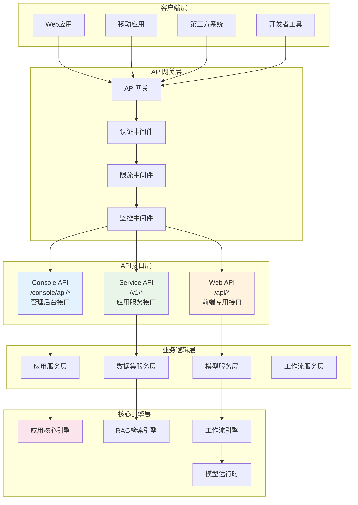
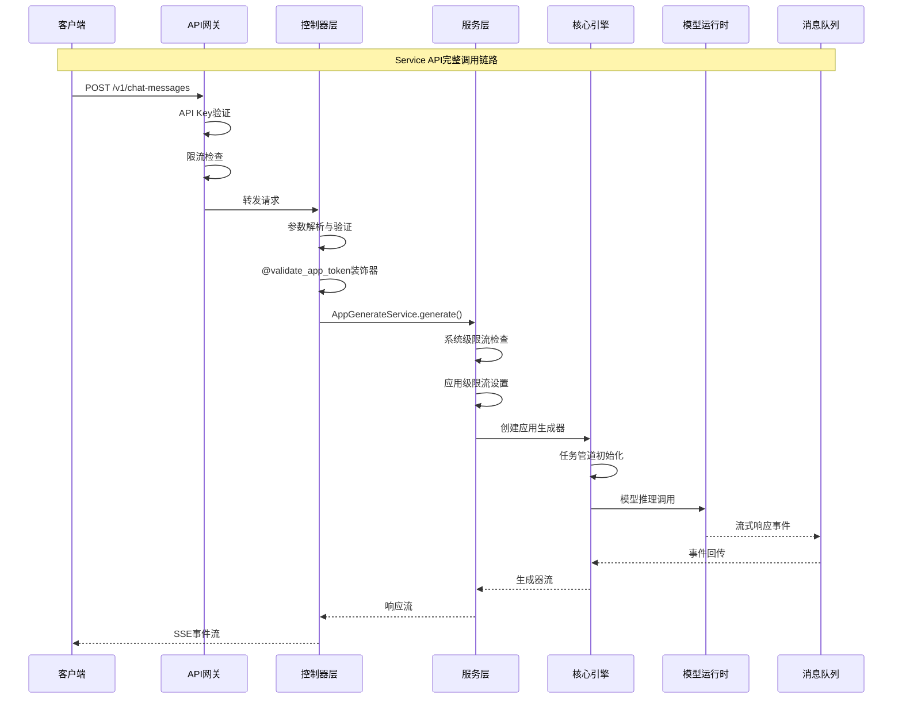
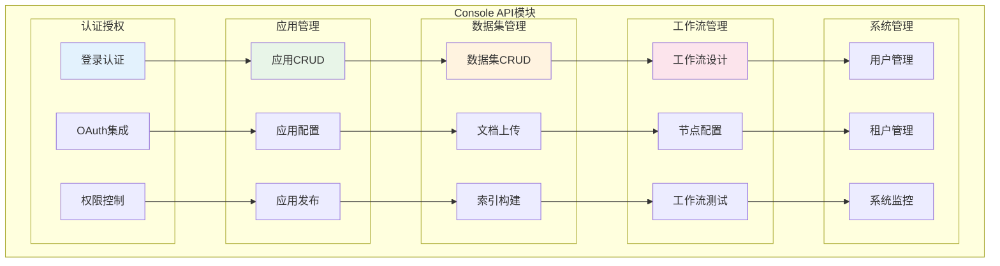
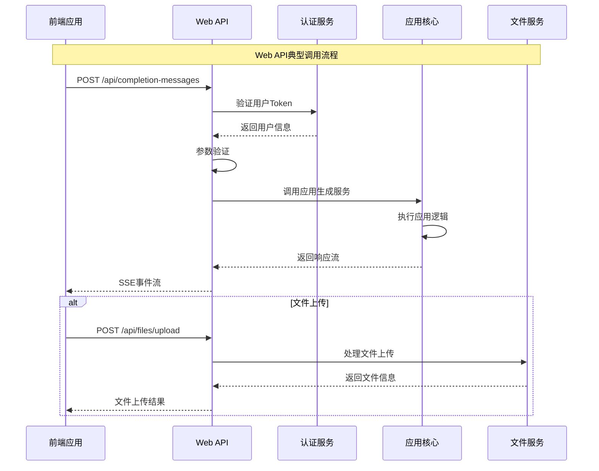

## 概述

本文档深入分析Dify平台的API接口设计，从HTTP入口到核心业务逻辑的完整调用链路，帮助开发者全面理解Dify的API架构和实现细节。

<!--more-->

## 1. API架构总览

### 1.1 三层API设计

Dify采用分层API架构，每层服务不同的用户群体和使用场景：



### 1.2 API特性对比

| API类型 | 目标用户 | 认证方式 | 主要功能 | 使用场景 |
|---------|----------|----------|----------|----------|
| Console API | 管理员、开发者 | Session认证 | 应用配置、用户管理、系统监控 | 管理后台、开发工具 |
| Service API | 外部开发者、企业系统 | API Key认证 | 应用调用、数据检索、文件处理 | 第三方集成、企业应用 |
| Web API | 最终用户、前端应用 | Token认证 | 用户交互、实时通信、界面数据 | Web应用、移动应用 |

## 2. Service API详细分析

### 2.1 核心接口架构

Service API是Dify对外提供的核心接口，采用RESTful设计风格：



### 2.2 Chat Messages接口深度解析

#### 2.2.1 接口入口函数

**文件位置**: `api/controllers/service_api/app/completion.py`

```python
@service_api_ns.route("/chat-messages")
class ChatApi(Resource):
    """
    聊天消息API接口
    
    功能说明：
    - 处理聊天、智能体聊天和高级聊天应用的消息
    - 支持流式和阻塞两种响应模式
    - 提供完整的对话管理功能
    
    技术特点：
    - 使用Flask-RESTX框架进行API定义
    - 通过装饰器实现认证和参数验证
    - 支持OpenAPI文档自动生成
    """
    
    @service_api_ns.expect(chat_parser)
    @service_api_ns.doc("create_chat_message")
    @service_api_ns.doc(description="Send a message in a chat conversation")
    @service_api_ns.doc(
        responses={
            200: "Message sent successfully",
            400: "Bad request - invalid parameters or workflow issues",
            401: "Unauthorized - invalid API token",
            404: "Conversation or workflow not found",
            429: "Rate limit exceeded",
            500: "Internal server error",
        }
    )
    @validate_app_token(fetch_user_arg=FetchUserArg(fetch_from=WhereisUserArg.JSON, required=True))
    def post(self, app_model: App, end_user: EndUser):
        """
        发送聊天消息的核心处理函数
        
        参数说明：
        - app_model (App): 应用模型实例，通过装饰器自动注入
        - end_user (EndUser): 终端用户实例，通过装饰器自动注入
        
        返回值：
        - Generator: 流式响应生成器或阻塞响应字典
        
        异常处理：
        - NotChatAppError: 应用类型不支持聊天功能
        - ConversationNotExistsError: 指定的对话不存在
        - AppUnavailableError: 应用配置损坏或不可用
        - ProviderNotInitializeError: 模型提供商未正确初始化
        - InvokeRateLimitError: 调用频率超出限制
        """
        
        # 1. 应用类型验证
        # 确保应用支持聊天功能，只有chat、agent-chat、advanced-chat类型支持
        app_mode = AppMode.value_of(app_model.mode)
        if app_mode not in {AppMode.CHAT, AppMode.AGENT_CHAT, AppMode.ADVANCED_CHAT}:
            raise NotChatAppError()

        # 2. 请求参数解析
        # 使用预定义的参数解析器解析JSON请求体
        args = chat_parser.parse_args()

        # 3. 外部追踪ID处理
        # 支持分布式追踪，便于问题定位和性能监控
        external_trace_id = get_external_trace_id(request)
        if external_trace_id:
            args["external_trace_id"] = external_trace_id

        # 4. 响应模式确定
        # 支持streaming（流式）和blocking（阻塞）两种模式
        streaming = args["response_mode"] == "streaming"

        try:
            # 5. 调用应用生成服务
            # 这是核心的业务逻辑入口，统一处理所有应用类型的生成请求
            response = AppGenerateService.generate(
                app_model=app_model,
                user=end_user,
                args=args,
                invoke_from=InvokeFrom.SERVICE_API,
                streaming=streaming
            )

            # 6. 响应格式化
            # 将内部响应格式转换为API标准响应格式
            return helper.compact_generate_response(response)
            
        except WorkflowNotFoundError as ex:
            # 工作流相关错误处理
            raise NotFound(str(ex))
        except IsDraftWorkflowError as ex:
            # 草稿工作流错误处理
            raise BadRequest(str(ex))
        except WorkflowIdFormatError as ex:
            # 工作流ID格式错误处理
            raise BadRequest(str(ex))
        except services.errors.conversation.ConversationNotExistsError:
            # 对话不存在错误处理
            raise NotFound("Conversation Not Exists.")
        except services.errors.conversation.ConversationCompletedError:
            # 对话已完成错误处理
            raise ConversationCompletedError()
        except services.errors.app_model_config.AppModelConfigBrokenError:
            # 应用配置损坏错误处理
            logger.exception("App model config broken.")
            raise AppUnavailableError()
        except ProviderTokenNotInitError as ex:
            # 模型提供商令牌未初始化错误处理
            raise ProviderNotInitializeError(ex.description)
        except QuotaExceededError:
            # 配额超出错误处理
            raise ProviderQuotaExceededError()
        except ModelCurrentlyNotSupportError:
            # 模型当前不支持错误处理
            raise ProviderModelCurrentlyNotSupportError()
        except InvokeRateLimitError as ex:
            # 调用频率限制错误处理
            raise InvokeRateLimitHttpError(ex.description)
        except InvokeError as e:
            # 通用调用错误处理
            raise CompletionRequestError(e.description)
        except ValueError as e:
            # 参数值错误直接抛出
            raise e
        except Exception:
            # 未预期的错误统一处理
            logger.exception("internal server error.")
            raise InternalServerError()
```

#### 2.2.2 参数解析器定义

```python
# 聊天消息请求参数解析器
# 文件位置: api/controllers/service_api/app/completion.py

chat_parser = reqparse.RequestParser()

# 输入变量字典，包含应用配置中定义的用户输入表单数据
chat_parser.add_argument(
    "inputs", 
    type=dict, 
    required=True, 
    location="json",
    help="输入变量字典，键值对应应用配置中的用户输入表单字段"
)

# 用户查询内容，这是用户实际发送的消息文本
chat_parser.add_argument(
    "query", 
    type=str, 
    required=True, 
    location="json",
    help="用户查询内容，支持纯文本和多模态内容"
)

# 响应模式，决定API返回方式
chat_parser.add_argument(
    "response_mode", 
    type=str, 
    choices=["blocking", "streaming"],
    default="streaming", 
    location="json",
    help="响应模式：streaming为流式输出，blocking为阻塞式返回完整结果"
)

# 对话ID，用于维护多轮对话上下文
chat_parser.add_argument(
    "conversation_id", 
    type=str, 
    location="json",
    help="对话ID，新对话时为空，续接对话时必须提供"
)

# 用户标识，用于用户隔离和统计
chat_parser.add_argument(
    "user", 
    type=str, 
    required=True, 
    location="json",
    help="用户唯一标识，用于会话管理和使用统计"
)

# 文件列表，支持多模态输入
chat_parser.add_argument(
    "files", 
    type=list, 
    default=[], 
    location="json",
    help="文件列表，支持图片、文档等多种格式"
)

# 工作流ID，用于高级聊天应用
chat_parser.add_argument(
    "workflow_id", 
    type=str, 
    required=False, 
    location="json",
    help="工作流ID，仅用于advanced-chat类型应用"
)
```

#### 2.2.3 认证装饰器实现

**文件位置**: `api/libs/login.py`

```python
def validate_app_token(fetch_user_arg: FetchUserArg = FetchUserArg()):
    """
    应用令牌验证装饰器
    
    功能说明：
    - 验证API Key的有效性和权限
    - 自动注入应用模型和用户实例
    - 处理不同来源的用户参数获取
    
    参数说明：
    - fetch_user_arg: 用户参数获取配置
    
    返回值：
    - 装饰器函数，自动注入app_model和end_user参数
    """
    def decorator(view):
        @wraps(view)
        def decorated_view(*args, **kwargs):
            # 1. 获取Authorization头部
            auth_header = request.headers.get('Authorization')
            if not auth_header or not auth_header.startswith('Bearer '):
                raise Unauthorized('Missing or invalid authorization header')
            
            # 2. 提取API Key
            api_key = auth_header[7:]  # 移除'Bearer '前缀
            if not api_key:
                raise Unauthorized('Missing API key')
            
            # 3. 验证API Key并获取应用信息
            try:
                # 查询API Key对应的应用
                api_token = db.session.query(ApiToken).filter(
                    ApiToken.token == api_key,
                    ApiToken.type == 'app'
                ).first()
                
                if not api_token:
                    raise Unauthorized('Invalid API key')
                
                # 检查API Key是否已禁用
                if not api_token.is_active:
                    raise Unauthorized('API key is disabled')
                
                # 获取应用模型
                app_model = db.session.query(App).filter(
                    App.id == api_token.app_id
                ).first()
                
                if not app_model:
                    raise NotFound('Application not found')
                
                # 检查应用状态
                if app_model.status != 'normal':
                    raise AppUnavailableError('Application is not available')
                
            except Exception as e:
                logger.exception(f"API key validation failed: {e}")
                raise Unauthorized('Authentication failed')
            
            # 4. 获取终端用户信息
            end_user = None
            if fetch_user_arg.required or fetch_user_arg.fetch_from != WhereisUserArg.NONE:
                try:
                    # 根据配置从不同位置获取用户标识
                    if fetch_user_arg.fetch_from == WhereisUserArg.JSON:
                        user_id = request.json.get('user') if request.json else None
                    elif fetch_user_arg.fetch_from == WhereisUserArg.QUERY:
                        user_id = request.args.get('user')
                    elif fetch_user_arg.fetch_from == WhereisUserArg.FORM:
                        user_id = request.form.get('user')
                    else:
                        user_id = None
                    
                    if fetch_user_arg.required and not user_id:
                        raise BadRequest('User parameter is required')
                    
                    if user_id:
                        # 获取或创建终端用户
                        end_user = EndUserService.get_or_create_end_user(
                            app_model=app_model,
                            user_id=user_id
                        )
                        
                except Exception as e:
                    logger.exception(f"End user creation failed: {e}")
                    if fetch_user_arg.required:
                        raise BadRequest('Invalid user parameter')
            
            # 5. 注入参数并调用原函数
            kwargs['app_model'] = app_model
            if end_user:
                kwargs['end_user'] = end_user
            
            return view(*args, **kwargs)
        
        return decorated_view
    return decorator
```

### 2.3 AppGenerateService核心实现

**文件位置**: `api/services/app_generate_service.py`

```python
class AppGenerateService:
    """
    应用生成服务
    
    功能说明：
    - 统一的应用内容生成入口点
    - 支持多种应用类型（Chat、Agent、Workflow等）
    - 提供系统级和应用级的限流控制
    - 集成计费和配额管理
    
    技术特点：
    - 工厂模式：根据应用类型选择对应的生成器
    - 装饰器模式：通过限流装饰器控制并发
    - 策略模式：不同应用类型使用不同的处理策略
    """
    
    # 系统级限流器，控制整个系统的请求频率
    system_rate_limiter = RateLimiter(
        prefix="system_generate_rate_limit",
        max_attempts=dify_config.APP_DAILY_RATE_LIMIT,  # 每日请求限制
        time_window=86400  # 24小时时间窗口
    )

    @classmethod
    def generate(
        cls,
        app_model: App,
        user: Union[Account, EndUser],
        args: Mapping[str, Any],
        invoke_from: InvokeFrom,
        streaming: bool = True,
    ):
        """
        应用内容生成主入口函数
        
        参数说明：
        - app_model (App): 应用模型实例，包含应用配置信息
        - user (Union[Account, EndUser]): 用户实例，可以是管理员账户或终端用户
        - args (Mapping[str, Any]): 生成参数，包含用户输入和配置选项
        - invoke_from (InvokeFrom): 调用来源，用于区分不同的调用场景
        - streaming (bool): 是否启用流式输出
        
        返回值：
        - Generator: 生成结果的迭代器，支持流式和阻塞两种模式
        
        异常处理：
        - InvokeRateLimitError: 当请求频率超出限制时抛出
        - WorkflowNotFoundError: 当工作流不存在时抛出
        - AppUnavailableError: 当应用不可用时抛出
        """
        
        # 1. 系统级限流检查
        # 在计费模式下，对免费用户进行系统级限流
        if dify_config.BILLING_ENABLED:
            # 获取租户的计费信息
            limit_info = BillingService.get_info(app_model.tenant_id)
            
            # 检查是否为免费计划
            if limit_info["subscription"]["plan"] == "sandbox":
                # 检查是否达到限流阈值
                if cls.system_rate_limiter.is_rate_limited(app_model.tenant_id):
                    raise InvokeRateLimitError(
                        f"Rate limit exceeded, please upgrade your plan "
                        f"or your RPD was {dify_config.APP_DAILY_RATE_LIMIT} requests/day"
                    )
                # 增加限流计数
                cls.system_rate_limiter.increment_rate_limit(app_model.tenant_id)

        # 2. 应用级限流设置
        # 获取应用的最大并发请求数配置
        max_active_request = cls._get_max_active_requests(app_model)
        
        # 创建应用级限流器
        rate_limit = RateLimit(
            tenant_id=app_model.tenant_id,
            app_id=app_model.id,
            max_active_requests=max_active_request
        )

        # 3. 生成请求ID并进入限流队列
        request_id = RateLimit.gen_request_key()
        try:
            # 进入限流队列，如果超出并发限制会阻塞或抛出异常
            request_id = rate_limit.enter(request_id)
            
            # 4. 根据应用模式选择对应的生成器
            if app_model.mode == AppMode.COMPLETION:
                # 文本完成应用
                return rate_limit.generate(
                    CompletionAppGenerator.convert_to_event_stream(
                        CompletionAppGenerator().generate(
                            app_model=app_model,
                            user=user,
                            args=args,
                            invoke_from=invoke_from,
                            streaming=streaming
                        ),
                    ),
                    request_id=request_id,
                )
                
            elif app_model.mode == AppMode.AGENT_CHAT or app_model.is_agent:
                # 智能体聊天应用
                return rate_limit.generate(
                    AgentChatAppGenerator.convert_to_event_stream(
                        AgentChatAppGenerator().generate(
                            app_model=app_model,
                            user=user,
                            args=args,
                            invoke_from=invoke_from,
                            streaming=streaming
                        ),
                    ),
                    request_id,
                )
                
            elif app_model.mode == AppMode.CHAT:
                # 基础聊天应用
                return rate_limit.generate(
                    ChatAppGenerator.convert_to_event_stream(
                        ChatAppGenerator().generate(
                            app_model=app_model,
                            user=user,
                            args=args,
                            invoke_from=invoke_from,
                            streaming=streaming
                        ),
                    ),
                    request_id=request_id,
                )
                
            elif app_model.mode == AppMode.ADVANCED_CHAT:
                # 高级聊天应用（基于工作流）
                workflow_id = args.get("workflow_id")
                if not workflow_id:
                    raise WorkflowNotFoundError("workflow_id is required for advanced chat")
                
                # 验证工作流ID格式
                try:
                    uuid.UUID(workflow_id)
                except ValueError:
                    raise WorkflowIdFormatError("Invalid workflow ID format")
                
                # 获取已发布的工作流
                workflow = WorkflowService.get_published_workflow(
                    app_model=app_model,
                    workflow_id=workflow_id
                )
                if not workflow:
                    raise WorkflowNotFoundError("Workflow not found or not published")
                
                return rate_limit.generate(
                    AdvancedChatAppGenerator.convert_to_event_stream(
                        AdvancedChatAppGenerator().generate(
                            app_model=app_model,
                            workflow=workflow,
                            user=user,
                            args=args,
                            invoke_from=invoke_from,
                            streaming=streaming,
                        ),
                    ),
                    request_id=request_id,
                )
                
            elif app_model.mode == AppMode.WORKFLOW:
                # 纯工作流应用
                workflow = WorkflowService.get_published_workflow(app_model=app_model)
                if not workflow:
                    raise WorkflowNotFoundError("Workflow not found")
                
                return rate_limit.generate(
                    WorkflowAppGenerator.convert_to_event_stream(
                        WorkflowAppGenerator().generate(
                            app_model=app_model,
                            workflow=workflow,
                            user=user,
                            args=args,
                            invoke_from=invoke_from,
                            streaming=streaming,
                        ),
                    ),
                    request_id=request_id,
                )
            else:
                raise ValueError(f"Invalid app mode: {app_model.mode}")
                
        except RateLimitError:
            # 限流异常处理
            raise InvokeRateLimitError("Rate limit exceeded")
        finally:
            # 5. 无论成功失败都要退出限流队列
            rate_limit.exit(request_id)

    @classmethod
    def _get_max_active_requests(cls, app_model: App) -> int:
        """
        获取应用的最大并发请求数
        
        参数说明：
        - app_model (App): 应用模型实例
        
        返回值：
        - int: 最大并发请求数
        
        逻辑说明：
        - 优先使用应用自定义的并发限制
        - 如果未设置则使用系统默认配置
        """
        max_active_requests = app_model.max_active_requests
        if max_active_requests is None:
            max_active_requests = int(dify_config.APP_MAX_ACTIVE_REQUESTS)
        return max_active_requests
```

### 2.4 应用生成器实现

#### 2.4.1 ChatAppGenerator核心实现

**文件位置**: `core/app/apps/chat/app_generator.py`

```python
class ChatAppGenerator(MessageBasedAppGenerator):
    """
    聊天应用生成器
    
    功能说明：
    - 处理基础聊天应用的消息生成
    - 管理对话历史和上下文
    - 支持多模态输入（文本、图片、文件）
    - 提供流式和阻塞两种输出模式
    
    继承关系：
    - MessageBasedAppGenerator: 基于消息的应用生成器基类
    - BaseAppGenerator: 应用生成器抽象基类
    """
    
    def generate(
        self,
        app_model: App,
        user: Union[Account, EndUser],
        args: Mapping[str, Any],
        invoke_from: InvokeFrom,
        streaming: bool = True,
    ) -> Generator[Mapping | str, None, None]:
        """
        生成聊天响应
        
        参数说明：
        - app_model (App): 应用模型，包含应用配置
        - user (Union[Account, EndUser]): 用户实例
        - args (Mapping[str, Any]): 生成参数
        - invoke_from (InvokeFrom): 调用来源
        - streaming (bool): 是否流式输出
        
        返回值：
        - Generator: 响应事件流
        
        处理流程：
        1. 创建任务管道
        2. 初始化队列管理器
        3. 处理对话和消息
        4. 执行任务管道
        """
        
        # 1. 创建任务管道
        # 任务管道是处理聊天请求的核心组件
        task_pipeline = self._create_task_pipeline(
            app_model=app_model,
            user=user,
            args=args,
            invoke_from=invoke_from,
            streaming=streaming,
        )
        
        # 2. 执行任务管道并返回结果流
        try:
            yield from task_pipeline.process()
        except Exception as e:
            logger.exception(f"Chat generation failed: {e}")
            yield self._create_error_event(str(e))
        finally:
            # 清理资源
            task_pipeline.cleanup()

    def _create_task_pipeline(
        self,
        app_model: App,
        user: Union[Account, EndUser],
        args: Mapping[str, Any],
        invoke_from: InvokeFrom,
        streaming: bool,
    ) -> "ChatTaskPipeline":
        """
        创建聊天任务管道
        
        参数说明：
        - app_model (App): 应用模型
        - user (Union[Account, EndUser]): 用户实例
        - args (Mapping[str, Any]): 生成参数
        - invoke_from (InvokeFrom): 调用来源
        - streaming (bool): 是否流式输出
        
        返回值：
        - ChatTaskPipeline: 聊天任务管道实例
        
        功能说明：
        - 加载应用配置
        - 创建或获取对话
        - 创建消息记录
        - 初始化队列管理器
        """
        
        # 1. 加载应用配置
        app_config = self._get_app_config(app_model, args)
        
        # 2. 处理对话管理
        conversation_id = args.get("conversation_id")
        if conversation_id:
            # 获取现有对话
            conversation = ConversationService.get_conversation(
                app_model=app_model,
                user=user,
                conversation_id=conversation_id
            )
            if not conversation:
                raise ConversationNotExistsError()
        else:
            # 创建新对话
            conversation = ConversationService.create_conversation(
                app_model=app_model,
                user=user,
                name="",  # 自动生成对话名称
                inputs=args.get("inputs", {}),
                invoke_from=invoke_from
            )
        
        # 3. 创建消息记录
        message = MessageService.create_message(
            conversation=conversation,
            inputs=args.get("inputs", {}),
            query=args.get("query", ""),
            files=args.get("files", []),
            user=user,
            invoke_from=invoke_from
        )
        
        # 4. 创建应用生成实体
        app_generate_entity = ChatAppGenerateEntity(
            app_config=app_config,
            model_conf=self._get_model_config(app_config),
            inputs=args.get("inputs", {}),
            query=args.get("query", ""),
            files=args.get("files", []),
            user_id=user.id,
            stream=streaming,
            invoke_from=invoke_from,
            conversation_id=conversation.id,
            message_id=message.id,
        )
        
        # 5. 创建队列管理器
        queue_manager = MessageBasedAppQueueManager(
            tenant_id=app_model.tenant_id,
            app_id=app_model.id,
            user_id=user.id,
            stream=streaming,
            conversation_id=conversation.id,
            message_id=message.id,
        )
        
        # 6. 创建任务管道
        return ChatTaskPipeline(
            app_generate_entity=app_generate_entity,
            queue_manager=queue_manager,
            conversation=conversation,
            message=message,
        )

    def _get_app_config(self, app_model: App, args: Mapping[str, Any]) -> ChatAppConfig:
        """
        获取应用配置
        
        参数说明：
        - app_model (App): 应用模型
        - args (Mapping[str, Any]): 请求参数
        
        返回值：
        - ChatAppConfig: 聊天应用配置实例
        
        功能说明：
        - 加载应用模型配置
        - 应用参数覆盖
        - 验证配置有效性
        """
        # 获取应用模型配置
        app_model_config = AppModelConfigService.get_app_model_config(
            app_model=app_model
        )
        
        # 创建配置管理器
        config_manager = ChatAppConfigManager()
        
        # 获取应用配置
        app_config = config_manager.get_app_config(
            app_model=app_model,
            app_model_config=app_model_config,
            override_config_dict=args.get("config_override")
        )
        
        return app_config

    def _get_model_config(self, app_config: ChatAppConfig) -> ModelConfigWithCredentialsEntity:
        """
        获取模型配置
        
        参数说明：
        - app_config (ChatAppConfig): 应用配置
        
        返回值：
        - ModelConfigWithCredentialsEntity: 包含凭据的模型配置
        
        功能说明：
        - 加载模型提供商配置
        - 获取模型凭据
        - 验证模型可用性
        """
        model_config = app_config.model_config
        
        # 获取模型提供商实例
        model_provider = ModelProviderService.get_model_provider(
            tenant_id=app_config.tenant_id,
            provider=model_config.provider
        )
        
        # 获取模型凭据
        credentials = ModelProviderService.get_model_credentials(
            tenant_id=app_config.tenant_id,
            provider=model_config.provider,
            model=model_config.model
        )
        
        # 创建模型配置实体
        return ModelConfigWithCredentialsEntity(
            provider=model_config.provider,
            model=model_config.model,
            mode=model_config.mode,
            parameters=model_config.parameters,
            stop=model_config.stop,
            credentials=credentials,
            provider_model_bundle=model_provider.get_model_bundle(model_config.model),
            model_schema=model_provider.get_model_schema(model_config.model, credentials)
        )
```

#### 2.4.2 任务管道实现

**文件位置**: `core/app/task_pipeline/message_based_task_pipeline.py`

```python
class ChatTaskPipeline(MessageBasedTaskPipeline):
    """
    聊天任务管道
    
    功能说明：
    - 处理聊天应用的完整执行流程
    - 管理三阶段处理（前置、主处理、后置）
    - 提供事件驱动的响应机制
    - 支持错误处理和资源清理
    
    继承关系：
    - MessageBasedTaskPipeline: 基于消息的任务管道基类
    - BasedGenerateTaskPipeline: 任务管道抽象基类
    """
    
    def __init__(
        self,
        app_generate_entity: ChatAppGenerateEntity,
        queue_manager: MessageBasedAppQueueManager,
        conversation: Conversation,
        message: Message,
    ):
        """
        初始化聊天任务管道
        
        参数说明：
        - app_generate_entity (ChatAppGenerateEntity): 应用生成实体
        - queue_manager (MessageBasedAppQueueManager): 队列管理器
        - conversation (Conversation): 对话实例
        - message (Message): 消息实例
        """
        super().__init__(
            app_generate_entity=app_generate_entity,
            queue_manager=queue_manager,
            conversation=conversation,
            message=message,
        )
        
        # 初始化执行状态
        self._execution_state = PipelineExecutionState.INITIALIZED
        self._start_time = time.time()

    def process(self) -> Generator[Mapping[str, Any], None, None]:
        """
        处理任务管道
        
        返回值：
        - Generator: 处理结果事件流
        
        处理流程：
        1. 前置处理：验证、配置加载、权限检查
        2. 主处理：创建应用运行器并执行
        3. 后置处理：结果处理、统计更新、资源清理
        
        异常处理：
        - TaskPipelineError: 管道特定错误
        - Exception: 通用异常统一处理
        """
        try:
            # 更新执行状态
            self._execution_state = PipelineExecutionState.RUNNING
            
            # 1. 前置处理阶段
            yield from self._pre_process()
            
            # 2. 主处理阶段
            yield from self._main_process()
            
            # 3. 后置处理阶段
            yield from self._post_process()
            
            # 更新执行状态
            self._execution_state = PipelineExecutionState.COMPLETED
            
        except TaskPipelineError as e:
            # 管道特定错误处理
            self._execution_state = PipelineExecutionState.FAILED
            logger.exception(f"Task pipeline error: {e}")
            yield self._create_error_event(str(e))
            
        except Exception as e:
            # 通用异常处理
            self._execution_state = PipelineExecutionState.FAILED
            logger.exception(f"Unexpected error in task pipeline: {e}")
            yield self._create_error_event("Internal server error")

    def _pre_process(self) -> Generator[Mapping[str, Any], None, None]:
        """
        前置处理阶段
        
        返回值：
        - Generator: 前置处理事件流
        
        处理内容：
        1. 输入参数验证
        2. 应用配置验证
        3. 用户权限检查
        4. 资源可用性检查
        """
        # 发布前置处理开始事件
        yield self._create_stage_event("pre_process_started")
        
        # 1. 输入参数验证
        self._validate_inputs()
        
        # 2. 应用配置验证
        self._validate_app_config()
        
        # 3. 用户权限检查
        self._check_user_permissions()
        
        # 4. 资源可用性检查
        self._check_resource_availability()
        
        # 发布前置处理完成事件
        yield self._create_stage_event("pre_process_completed")

    def _main_process(self) -> Generator[Mapping[str, Any], None, None]:
        """
        主处理阶段
        
        返回值：
        - Generator: 主处理事件流
        
        处理内容：
        1. 创建应用运行器
        2. 启动队列监听
        3. 执行应用逻辑
        4. 处理响应事件
        """
        # 发布主处理开始事件
        yield self._create_stage_event("main_process_started")
        
        # 1. 创建应用运行器
        app_runner = self._create_app_runner()
        
        # 2. 启动队列监听（异步）
        queue_listener = self._start_queue_listener()
        
        try:
            # 3. 执行应用逻辑
            app_runner.run(
                application_generate_entity=self._app_generate_entity,
                queue_manager=self._queue_manager,
                conversation=self._conversation,
                message=self._message,
            )
            
            # 4. 处理队列事件
            for event in queue_listener:
                # 转换内部事件为API事件格式
                api_event = self._convert_internal_event(event)
                if api_event:
                    yield api_event
                
                # 检查是否为结束事件
                if self._is_terminal_event(event):
                    break
                    
        finally:
            # 停止队列监听
            queue_listener.stop()
        
        # 发布主处理完成事件
        yield self._create_stage_event("main_process_completed")

    def _post_process(self) -> Generator[Mapping[str, Any], None, None]:
        """
        后置处理阶段
        
        返回值：
        - Generator: 后置处理事件流
        
        处理内容：
        1. 结果数据处理
        2. 使用统计更新
        3. 日志记录
        4. 资源清理
        """
        # 发布后置处理开始事件
        yield self._create_stage_event("post_process_started")
        
        # 1. 结果数据处理
        self._process_results()
        
        # 2. 使用统计更新
        self._update_usage_statistics()
        
        # 3. 日志记录
        self._log_execution_metrics()
        
        # 4. 资源清理
        self._cleanup_resources()
        
        # 发布后置处理完成事件
        yield self._create_stage_event("post_process_completed")
        
        # 发布最终完成事件
        yield self._create_completion_event()

    def _create_app_runner(self) -> ChatAppRunner:
        """
        创建聊天应用运行器
        
        返回值：
        - ChatAppRunner: 聊天应用运行器实例
        
        功能说明：
        - 根据应用配置创建对应的运行器
        - 注入必要的依赖和配置
        """
        return ChatAppRunner(
            tenant_id=self._app_generate_entity.app_config.tenant_id,
            application_generate_entity=self._app_generate_entity,
            queue_manager=self._queue_manager,
            conversation=self._conversation,
            message=self._message,
        )

    def _validate_inputs(self):
        """
        验证输入参数
        
        异常：
        - ValidationError: 参数验证失败
        
        验证内容：
        - 必填参数检查
        - 参数格式验证
        - 参数值范围检查
        """
        inputs = self._app_generate_entity.inputs
        query = self._app_generate_entity.query
        
        # 检查查询内容
        if not query or not query.strip():
            raise ValidationError("Query cannot be empty")
        
        # 检查输入变量
        app_config = self._app_generate_entity.app_config
        required_vars = [
            var for var in app_config.user_input_form
            if var.required
        ]
        
        for var in required_vars:
            if var.variable not in inputs:
                raise ValidationError(f"Required variable '{var.variable}' is missing")
            
            # 验证变量值
            value = inputs[var.variable]
            if var.type == VariableEntityType.TEXT_INPUT and var.max_length:
                if len(str(value)) > var.max_length:
                    raise ValidationError(
                        f"Variable '{var.variable}' exceeds maximum length {var.max_length}"
                    )

    def _convert_internal_event(self, internal_event) -> Optional[Mapping[str, Any]]:
        """
        转换内部事件为API事件格式
        
        参数说明：
        - internal_event: 内部事件对象
        
        返回值：
        - Optional[Mapping[str, Any]]: API事件字典或None
        
        转换规则：
        - QueueLLMChunkEvent -> message事件
        - QueueMessageEndEvent -> message_end事件
        - QueueErrorEvent -> error事件
        """
        if isinstance(internal_event, QueueLLMChunkEvent):
            return {
                "event": "message",
                "message_id": self._message.id,
                "conversation_id": self._conversation.id,
                "answer": internal_event.chunk.delta.message.content or "",
                "created_at": int(time.time())
            }
            
        elif isinstance(internal_event, QueueMessageEndEvent):
            return {
                "event": "message_end",
                "message_id": self._message.id,
                "conversation_id": self._conversation.id,
                "metadata": {
                    "usage": {
                        "prompt_tokens": internal_event.llm_result.usage.prompt_tokens,
                        "completion_tokens": internal_event.llm_result.usage.completion_tokens,
                        "total_tokens": internal_event.llm_result.usage.total_tokens,
                    }
                },
                "created_at": int(time.time())
            }
            
        elif isinstance(internal_event, QueueErrorEvent):
            return {
                "event": "error",
                "status": 500,
                "code": "internal_server_error",
                "message": internal_event.error_message,
                "created_at": int(time.time())
            }
        
        return None

    def cleanup(self):
        """
        清理资源
        
        功能说明：
        - 关闭数据库连接
        - 清理临时文件
        - 释放内存资源
        - 停止后台任务
        """
        try:
            # 停止队列管理器
            if hasattr(self, '_queue_manager'):
                self._queue_manager.stop()
            
            # 清理临时文件
            self._cleanup_temp_files()
            
            # 释放内存资源
            self._release_memory_resources()
            
        except Exception as e:
            logger.exception(f"Cleanup failed: {e}")
```

## 3. Console API分析

### 3.1 Console API架构

Console API主要服务于管理后台，提供应用配置、用户管理、系统监控等功能：



### 3.2 应用管理接口

**文件位置**: `api/controllers/console/app/app.py`

```python
@console_ns.route("/apps")
class AppListApi(Resource):
    """
    应用列表API
    
    功能说明：
    - 获取用户的应用列表
    - 支持分页和搜索
    - 提供应用状态统计
    """
    
    @setup_required
    @login_required
    @account_initialization_required
    def get(self):
        """
        获取应用列表
        
        返回值：
        - 应用列表数据，包含分页信息
        
        权限要求：
        - 需要登录
        - 需要完成账户初始化
        - 需要完成系统设置
        """
        # 获取查询参数
        page = request.args.get('page', default=1, type=int)
        limit = request.args.get('limit', default=20, type=int)
        search = request.args.get('search', default='', type=str)
        
        # 获取当前用户
        current_user = current_user_manager.get_current_user()
        
        # 查询应用列表
        apps = AppService.get_paginated_apps(
            tenant_id=current_user.current_tenant_id,
            user=current_user,
            page=page,
            limit=limit,
            search=search
        )
        
        return {
            'data': [app.to_dict() for app in apps.items],
            'has_more': apps.has_next,
            'limit': limit,
            'page': page,
            'total': apps.total
        }

    @setup_required
    @login_required
    @account_initialization_required
    def post(self):
        """
        创建新应用
        
        请求体：
        - name: 应用名称
        - mode: 应用模式
        - icon: 应用图标
        - description: 应用描述
        
        返回值：
        - 创建的应用信息
        """
        # 解析请求参数
        parser = reqparse.RequestParser()
        parser.add_argument('name', type=str, required=True, help='Application name is required')
        parser.add_argument('mode', type=str, required=True, choices=['chat', 'agent-chat', 'workflow', 'completion'])
        parser.add_argument('icon', type=str, default='🤖')
        parser.add_argument('description', type=str, default='')
        
        args = parser.parse_args()
        
        # 获取当前用户
        current_user = current_user_manager.get_current_user()
        
        # 创建应用
        app = AppService.create_app(
            tenant_id=current_user.current_tenant_id,
            args=args,
            account=current_user
        )
        
        return app.to_dict(), 201
```

## 4. Web API分析

### 4.1 Web API特点

Web API主要服务于前端应用，提供用户交互相关的接口：



### 4.2 文件上传接口

**文件位置**: `api/controllers/web/files.py`

```python
@web_ns.route("/files/upload")
class FileUploadApi(Resource):
    """
    文件上传API
    
    功能说明：
    - 支持多种文件格式上传
    - 提供文件类型验证
    - 自动生成文件预览
    - 集成病毒扫描
    """
    
    @validate_app_token(fetch_user_arg=FetchUserArg(fetch_from=WhereisUserArg.FORM, required=True))
    def post(self, app_model: App, end_user: EndUser):
        """
        上传文件
        
        参数说明：
        - app_model (App): 应用模型，通过装饰器注入
        - end_user (EndUser): 终端用户，通过装饰器注入
        
        返回值：
        - 文件信息字典，包含文件ID、URL等
        
        支持格式：
        - 图片：jpg, jpeg, png, gif, webp
        - 文档：pdf, docx, doc, txt, md
        - 音频：mp3, wav, m4a
        - 视频：mp4, mov, avi
        """
        
        # 1. 检查文件是否存在
        if 'file' not in request.files:
            raise BadRequest('No file provided')
        
        file = request.files['file']
        if file.filename == '':
            raise BadRequest('No file selected')
        
        # 2. 验证文件类型和大小
        try:
            # 获取应用配置中的文件上传设置
            app_config = AppConfigService.get_app_config(app_model)
            file_upload_config = app_config.additional_features.file_upload
            
            if not file_upload_config or not file_upload_config.enabled:
                raise BadRequest('File upload is disabled for this app')
            
            # 验证文件类型
            file_type = FileService.get_file_type(file.filename)
            if file_type not in file_upload_config.allowed_file_types:
                raise BadRequest(f'File type {file_type} is not allowed')
            
            # 验证文件大小
            file_size = FileService.get_file_size(file)
            if file_size > file_upload_config.max_file_size:
                raise BadRequest(f'File size exceeds limit of {file_upload_config.max_file_size} bytes')
            
        except Exception as e:
            logger.exception(f"File validation failed: {e}")
            raise BadRequest('File validation failed')
        
        # 3. 病毒扫描（如果启用）
        if dify_config.ENABLE_VIRUS_SCAN:
            try:
                scan_result = VirusScanService.scan_file(file)
                if not scan_result.is_safe:
                    raise BadRequest('File contains malicious content')
            except Exception as e:
                logger.exception(f"Virus scan failed: {e}")
                raise InternalServerError('File security check failed')
        
        # 4. 上传文件到存储
        try:
            # 生成唯一文件名
            file_id = str(uuid.uuid4())
            file_extension = FileService.get_file_extension(file.filename)
            storage_filename = f"{file_id}{file_extension}"
            
            # 上传到对象存储
            storage_service = StorageService()
            file_url = storage_service.upload_file(
                file=file,
                filename=storage_filename,
                content_type=file.content_type
            )
            
            # 5. 创建文件记录
            file_record = FileService.create_file_record(
                tenant_id=app_model.tenant_id,
                file_id=file_id,
                filename=file.filename,
                file_size=file_size,
                file_type=file_type,
                file_url=file_url,
                uploaded_by=end_user.id,
                app_id=app_model.id
            )
            
            # 6. 生成文件预览（异步）
            if file_type in ['image', 'document']:
                PreviewService.generate_preview_async(file_record)
            
            # 7. 返回文件信息
            return {
                'id': file_record.id,
                'name': file_record.filename,
                'size': file_record.file_size,
                'type': file_record.file_type,
                'url': file_record.file_url,
                'created_at': file_record.created_at.isoformat(),
                'extension': file_extension
            }
            
        except Exception as e:
            logger.exception(f"File upload failed: {e}")
            raise InternalServerError('File upload failed')
```

## 5. API性能优化

### 5.1 限流机制

Dify实现了多层限流机制来保护系统稳定性：

```python
class RateLimitManager:
    """
    限流管理器
    
    功能说明：
    - 系统级限流：防止系统过载
    - 应用级限流：控制单应用并发
    - 用户级限流：防止单用户滥用
    - IP级限流：防止恶意攻击
    """
    
    def __init__(self):
        """初始化限流管理器"""
        self.redis_client = redis.from_url(dify_config.REDIS_URL)
        self.system_limiter = SystemRateLimiter()
        self.app_limiters = {}
        self.user_limiters = {}
        self.ip_limiters = {}
    
    def check_system_rate_limit(self, tenant_id: str) -> bool:
        """
        检查系统级限流
        
        参数说明：
        - tenant_id (str): 租户ID
        
        返回值：
        - bool: True表示未超限，False表示超限
        
        限流策略：
        - 免费用户：每日1000次请求
        - 付费用户：根据套餐不同限制
        """
        # 获取租户计费信息
        billing_info = BillingService.get_info(tenant_id)
        plan = billing_info["subscription"]["plan"]
        
        # 根据计划设置限制
        if plan == "sandbox":
            daily_limit = 1000
        elif plan == "professional":
            daily_limit = 10000
        elif plan == "team":
            daily_limit = 50000
        else:
            daily_limit = 100000
        
        # 检查当日使用量
        today = datetime.now().strftime("%Y-%m-%d")
        key = f"system_rate_limit:{tenant_id}:{today}"
        
        current_count = self.redis_client.get(key)
        if current_count is None:
            current_count = 0
        else:
            current_count = int(current_count)
        
        if current_count >= daily_limit:
            return False
        
        # 增加计数
        pipe = self.redis_client.pipeline()
        pipe.incr(key)
        pipe.expire(key, 86400)  # 24小时过期
        pipe.execute()
        
        return True
    
    def check_app_rate_limit(self, app_id: str, max_concurrent: int) -> Optional[str]:
        """
        检查应用级限流
        
        参数说明：
        - app_id (str): 应用ID
        - max_concurrent (int): 最大并发数
        
        返回值：
        - Optional[str]: 请求ID，None表示超限
        
        限流策略：
        - 控制单应用的并发请求数
        - 使用令牌桶算法
        """
        key = f"app_concurrent:{app_id}"
        request_id = str(uuid.uuid4())
        
        # 使用Lua脚本保证原子性
        lua_script = """
        local key = KEYS[1]
        local max_concurrent = tonumber(ARGV[1])
        local request_id = ARGV[2]
        local ttl = tonumber(ARGV[3])
        
        local current_count = redis.call('SCARD', key)
        if current_count < max_concurrent then
            redis.call('SADD', key, request_id)
            redis.call('EXPIRE', key, ttl)
            return request_id
        else
            return nil
        end
        """
        
        result = self.redis_client.eval(
            lua_script, 
            1, 
            key, 
            max_concurrent, 
            request_id, 
            300  # 5分钟TTL
        )
        
        return result.decode('utf-8') if result else None
    
    def release_app_rate_limit(self, app_id: str, request_id: str):
        """
        释放应用级限流
        
        参数说明：
        - app_id (str): 应用ID
        - request_id (str): 请求ID
        """
        key = f"app_concurrent:{app_id}"
        self.redis_client.srem(key, request_id)
    
    def check_user_rate_limit(self, user_id: str, window_seconds: int = 60, max_requests: int = 10) -> bool:
        """
        检查用户级限流
        
        参数说明：
        - user_id (str): 用户ID
        - window_seconds (int): 时间窗口（秒）
        - max_requests (int): 最大请求数
        
        返回值：
        - bool: True表示未超限，False表示超限
        
        限流策略：
        - 滑动时间窗口算法
        - 防止单用户短时间内大量请求
        """
        now = time.time()
        key = f"user_rate_limit:{user_id}"
        
        # 使用Lua脚本实现滑动窗口
        lua_script = """
        local key = KEYS[1]
        local window = tonumber(ARGV[1])
        local limit = tonumber(ARGV[2])
        local now = tonumber(ARGV[3])
        
        -- 清理过期记录
        redis.call('ZREMRANGEBYSCORE', key, 0, now - window)
        
        -- 检查当前请求数
        local current = redis.call('ZCARD', key)
        if current < limit then
            -- 添加当前请求
            redis.call('ZADD', key, now, now)
            redis.call('EXPIRE', key, window)
            return 1
        else
            return 0
        end
        """
        
        result = self.redis_client.eval(
            lua_script,
            1,
            key,
            window_seconds,
            max_requests,
            now
        )
        
        return bool(result)
```

### 5.2 缓存策略

```python
class APICache:
    """
    API缓存管理器
    
    功能说明：
    - 多级缓存：内存缓存 + Redis缓存
    - 智能失效：基于TTL和事件的缓存失效
    - 缓存预热：预加载热点数据
    - 缓存穿透保护：防止恶意查询
    """
    
    def __init__(self):
        """初始化缓存管理器"""
        self.redis_client = redis.from_url(dify_config.REDIS_URL)
        self.local_cache = {}
        self.cache_stats = CacheStats()
    
    def get_app_config_cached(self, app_id: str) -> Optional[Dict[str, Any]]:
        """
        获取应用配置（带缓存）
        
        参数说明：
        - app_id (str): 应用ID
        
        返回值：
        - Optional[Dict[str, Any]]: 应用配置字典
        
        缓存策略：
        - TTL: 5分钟
        - 失效条件：应用配置更新
        """
        cache_key = f"app_config:{app_id}"
        
        # 1. 尝试从本地缓存获取
        if cache_key in self.local_cache:
            self.cache_stats.record_hit('local')
            return self.local_cache[cache_key]
        
        # 2. 尝试从Redis缓存获取
        try:
            cached_data = self.redis_client.get(cache_key)
            if cached_data:
                config_data = json.loads(cached_data)
                # 更新本地缓存
                self.local_cache[cache_key] = config_data
                self.cache_stats.record_hit('redis')
                return config_data
        except Exception as e:
            logger.warning(f"Redis cache get failed: {e}")
        
        # 3. 从数据库加载
        try:
            app_config = AppConfigService.get_app_config_from_db(app_id)
            if app_config:
                config_dict = app_config.to_dict()
                
                # 更新缓存
                self._set_cache(cache_key, config_dict, ttl=300)  # 5分钟TTL
                self.cache_stats.record_miss()
                
                return config_dict
        except Exception as e:
            logger.exception(f"Load app config from DB failed: {e}")
        
        return None
    
    def invalidate_app_config(self, app_id: str):
        """
        失效应用配置缓存
        
        参数说明：
        - app_id (str): 应用ID
        
        使用场景：
        - 应用配置更新时调用
        - 确保缓存一致性
        """
        cache_key = f"app_config:{app_id}"
        
        # 删除本地缓存
        if cache_key in self.local_cache:
            del self.local_cache[cache_key]
        
        # 删除Redis缓存
        try:
            self.redis_client.delete(cache_key)
        except Exception as e:
            logger.warning(f"Redis cache delete failed: {e}")
    
    def _set_cache(self, key: str, value: Any, ttl: int = 3600):
        """
        设置缓存值
        
        参数说明：
        - key (str): 缓存键
        - value (Any): 缓存值
        - ttl (int): 过期时间（秒）
        """
        # 更新本地缓存
        self.local_cache[key] = value
        
        # 更新Redis缓存
        try:
            self.redis_client.setex(
                key,
                ttl,
                json.dumps(value, ensure_ascii=False, cls=DateTimeEncoder)
            )
        except Exception as e:
            logger.warning(f"Redis cache set failed: {e}")

class CacheStats:
    """缓存统计"""
    
    def __init__(self):
        self.hits = {'local': 0, 'redis': 0}
        self.misses = 0
    
    def record_hit(self, cache_type: str):
        """记录缓存命中"""
        self.hits[cache_type] += 1
    
    def record_miss(self):
        """记录缓存未命中"""
        self.misses += 1
    
    def get_hit_rate(self) -> float:
        """获取缓存命中率"""
        total_hits = sum(self.hits.values())
        total_requests = total_hits + self.misses
        
        if total_requests == 0:
            return 0.0
        
        return total_hits / total_requests
```

## 6. API监控与日志

### 6.1 监控指标

```python
class APIMonitor:
    """
    API监控系统
    
    功能说明：
    - 实时性能监控
    - 错误率统计
    - 用户行为分析
    - 系统健康检查
    """
    
    def __init__(self):
        """初始化监控系统"""
        self.metrics_collector = MetricsCollector()
        self.alert_manager = AlertManager()
    
    def record_api_request(
        self,
        endpoint: str,
        method: str,
        status_code: int,
        response_time: float,
        user_id: str = None,
        app_id: str = None
    ):
        """
        记录API请求指标
        
        参数说明：
        - endpoint (str): API端点
        - method (str): HTTP方法
        - status_code (int): 响应状态码
        - response_time (float): 响应时间（毫秒）
        - user_id (str): 用户ID（可选）
        - app_id (str): 应用ID（可选）
        """
        # 记录基础指标
        self.metrics_collector.increment_counter(
            'api_requests_total',
            labels={
                'endpoint': endpoint,
                'method': method,
                'status_code': str(status_code)
            }
        )
        
        # 记录响应时间
        self.metrics_collector.record_histogram(
            'api_response_time_seconds',
            response_time / 1000,  # 转换为秒
            labels={
                'endpoint': endpoint,
                'method': method
            }
        )
        
        # 记录错误率
        if status_code >= 400:
            self.metrics_collector.increment_counter(
                'api_errors_total',
                labels={
                    'endpoint': endpoint,
                    'method': method,
                    'status_code': str(status_code)
                }
            )
        
        # 检查告警条件
        self._check_alerts(endpoint, status_code, response_time)
    
    def _check_alerts(self, endpoint: str, status_code: int, response_time: float):
        """
        检查告警条件
        
        参数说明：
        - endpoint (str): API端点
        - status_code (int): 响应状态码
        - response_time (float): 响应时间
        """
        # 响应时间告警
        if response_time > 5000:  # 5秒
            self.alert_manager.send_alert(
                level='warning',
                message=f'API {endpoint} response time is {response_time}ms',
                tags=['performance', 'api']
            )
        
        # 错误率告警
        if status_code >= 500:
            self.alert_manager.send_alert(
                level='error',
                message=f'API {endpoint} returned {status_code}',
                tags=['error', 'api']
            )

class MetricsCollector:
    """指标收集器"""
    
    def __init__(self):
        """初始化指标收集器"""
        self.counters = {}
        self.histograms = {}
        self.gauges = {}
    
    def increment_counter(self, name: str, value: float = 1, labels: Dict[str, str] = None):
        """增加计数器"""
        key = self._get_metric_key(name, labels)
        if key not in self.counters:
            self.counters[key] = 0
        self.counters[key] += value
    
    def record_histogram(self, name: str, value: float, labels: Dict[str, str] = None):
        """记录直方图"""
        key = self._get_metric_key(name, labels)
        if key not in self.histograms:
            self.histograms[key] = []
        self.histograms[key].append(value)
    
    def set_gauge(self, name: str, value: float, labels: Dict[str, str] = None):
        """设置仪表盘"""
        key = self._get_metric_key(name, labels)
        self.gauges[key] = value
    
    def _get_metric_key(self, name: str, labels: Dict[str, str] = None) -> str:
        """生成指标键"""
        if not labels:
            return name
        
        label_str = ','.join([f'{k}={v}' for k, v in sorted(labels.items())])
        return f'{name}{{{label_str}}}'
```

### 6.2 结构化日志

```python
class StructuredLogger:
    """
    结构化日志记录器
    
    功能说明：
    - 统一日志格式
    - 上下文信息记录
    - 日志级别管理
    - 敏感信息脱敏
    """
    
    def __init__(self, name: str):
        """
        初始化日志记录器
        
        参数说明：
        - name (str): 日志记录器名称
        """
        self.logger = logging.getLogger(name)
        self.context = {}
    
    def set_context(self, **kwargs):
        """
        设置日志上下文
        
        参数说明：
        - **kwargs: 上下文键值对
        """
        self.context.update(kwargs)
    
    def clear_context(self):
        """清除日志上下文"""
        self.context.clear()
    
    def info(self, message: str, **extra):
        """
        记录信息日志
        
        参数说明：
        - message (str): 日志消息
        - **extra: 额外信息
        """
        self._log('info', message, extra)
    
    def warning(self, message: str, **extra):
        """记录警告日志"""
        self._log('warning', message, extra)
    
    def error(self, message: str, **extra):
        """记录错误日志"""
        self._log('error', message, extra)
    
    def _log(self, level: str, message: str, extra: Dict[str, Any]):
        """
        内部日志记录方法
        
        参数说明：
        - level (str): 日志级别
        - message (str): 日志消息
        - extra (Dict[str, Any]): 额外信息
        """
        # 合并上下文和额外信息
        log_data = {
            'timestamp': datetime.utcnow().isoformat(),
            'level': level.upper(),
            'message': message,
            'context': self.context.copy(),
            **extra
        }
        
        # 脱敏处理
        log_data = self._sanitize_log_data(log_data)
        
        # 记录日志
        getattr(self.logger, level)(json.dumps(log_data, ensure_ascii=False))
    
    def _sanitize_log_data(self, data: Dict[str, Any]) -> Dict[str, Any]:
        """
        脱敏处理
        
        参数说明：
        - data (Dict[str, Any]): 原始日志数据
        
        返回值：
        - Dict[str, Any]: 脱敏后的日志数据
        """
        sensitive_keys = ['password', 'token', 'api_key', 'secret', 'credential']
        
        def sanitize_value(key: str, value: Any) -> Any:
            if isinstance(key, str) and any(sensitive in key.lower() for sensitive in sensitive_keys):
                return '***REDACTED***'
            elif isinstance(value, dict):
                return {k: sanitize_value(k, v) for k, v in value.items()}
            elif isinstance(value, list):
                return [sanitize_value('', item) for item in value]
            else:
                return value
        
        return {k: sanitize_value(k, v) for k, v in data.items()}

# 使用示例
api_logger = StructuredLogger('dify.api')

def log_api_request(request, response, execution_time):
    """记录API请求日志"""
    api_logger.set_context(
        request_id=request.headers.get('X-Request-ID'),
        user_id=getattr(request, 'user_id', None),
        app_id=getattr(request, 'app_id', None)
    )
    
    api_logger.info(
        'API request completed',
        method=request.method,
        endpoint=request.endpoint,
        status_code=response.status_code,
        execution_time=execution_time,
        user_agent=request.headers.get('User-Agent'),
        ip_address=request.remote_addr
    )
```

## 7. 总结

本文档深入分析了Dify平台的API接口设计，涵盖了：

1. **API架构总览**：三层API设计和特性对比
2. **Service API详解**：核心接口的完整调用链路
3. **Console API分析**：管理后台接口的设计特点
4. **Web API分析**：前端专用接口的实现方式
5. **性能优化**：限流机制和缓存策略
6. **监控日志**：API监控和结构化日志

通过这些分析，开发者可以：
- 全面理解Dify的API架构设计
- 掌握关键接口的实现细节
- 学习API性能优化的最佳实践
- 了解监控和日志的重要性

Dify的API设计体现了现代化的架构理念，通过分层设计、装饰器模式、事件驱动等技术，构建了一个高性能、可扩展、易维护的API系统。
