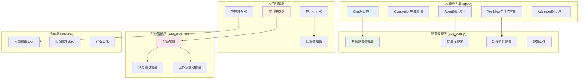
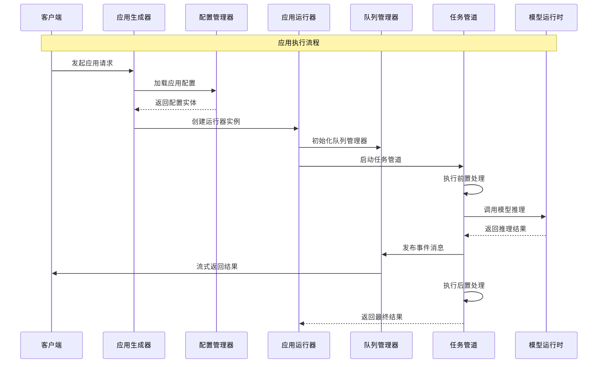
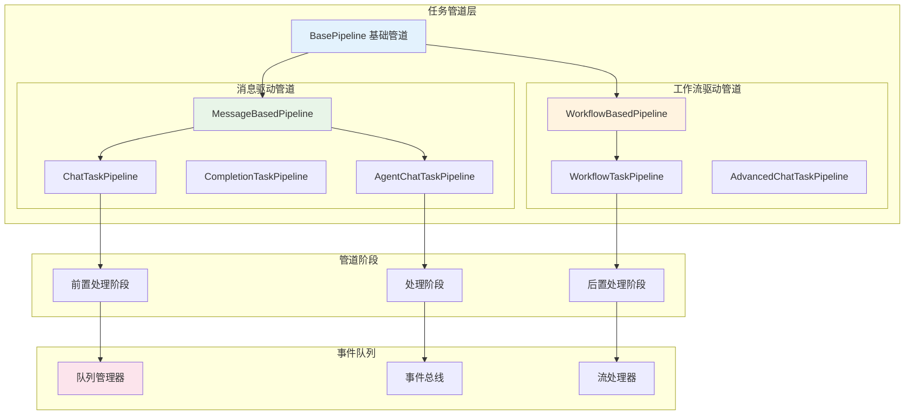
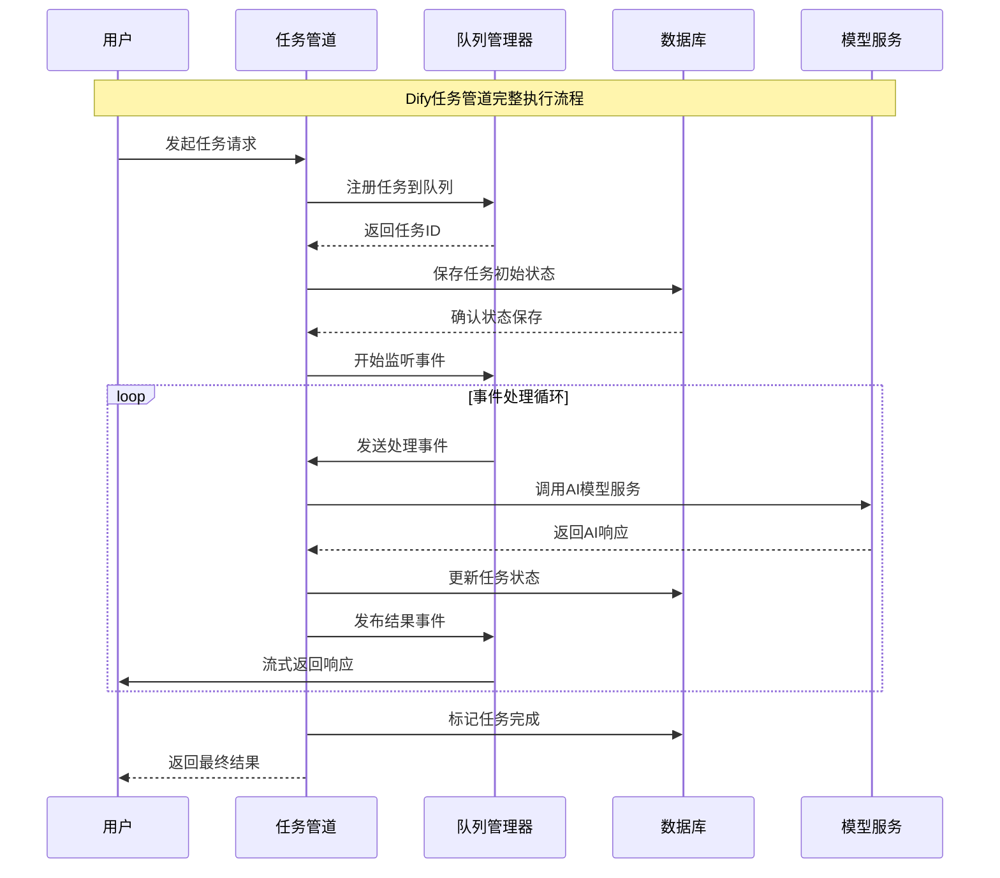
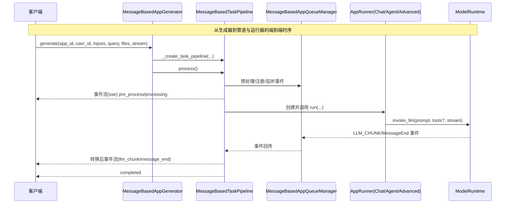
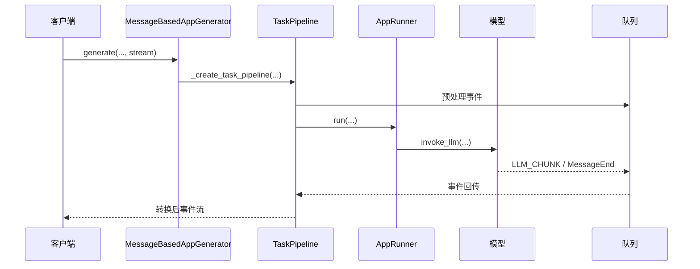
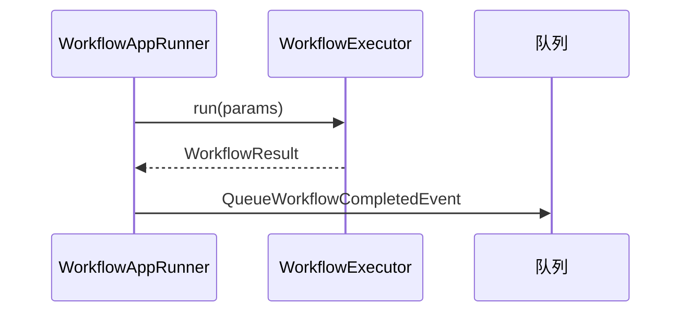
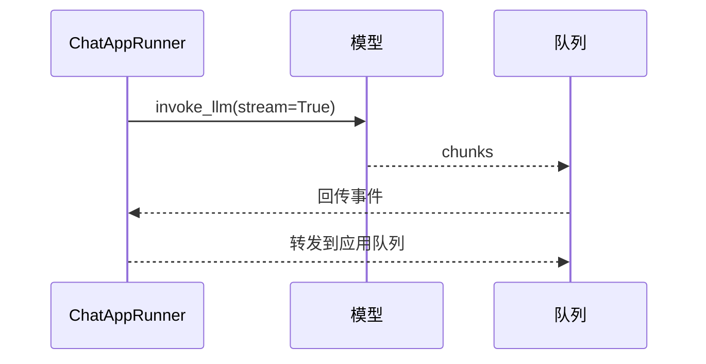
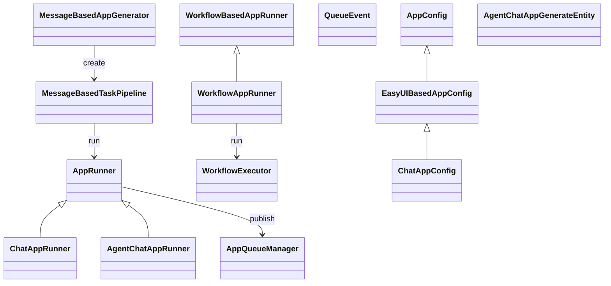

## 概述

Dify的应用核心模块（`core/app/`）是整个平台的应用引擎，负责不同类型AI应用的创建、配置、运行和管理。该模块采用了**清晰的分层架构设计**：

**分层架构特点**：

- **控制器层**：处理HTTP请求，参数验证和响应格式化
- **服务层**：实现核心业务逻辑，事务管理和数据处理
- **数据访问层**：负责数据持久化和查询优化
- **职责明确**：每层职责清晰，便于维护和测试

**多应用模式支持**：

```python
# Dify支持的应用模式
ALLOW_CREATE_APP_MODES = [
    "chat",           # 基础对话应用
    "agent-chat",     # 智能体对话应用  
    "advanced-chat",  # 高级对话应用（基于工作流）
    "workflow",       # 纯工作流应用
    "completion"      # 文本完成应用
]

# 应用配置与业务逻辑分离
class AppConfigManager:
    """应用配置管理器 - 配置与逻辑分离设计"""
    
    def load_app_config(self, app_id: str) -> AppConfig:
        """
        动态加载应用配置
        支持配置热更新和版本管理
        """
        # 1. 从数据库加载基础配置
        base_config = self._load_from_database(app_id)
        
        # 2. 应用环境变量覆盖
        env_overrides = self._load_environment_overrides()
        
        # 3. 合并配置
        final_config = self._merge_configs(base_config, env_overrides)
        
        return AppConfig.from_dict(final_config)
```

**应用生命周期管理**：
应用模块提供了**完整的生命周期管理**机制：

- **创建阶段**：模板初始化、配置验证、资源分配
- **运行阶段**：实时监控、性能优化、错误处理
- **维护阶段**：配置更新、版本管理、数据备份
- **销毁阶段**：资源清理、数据归档、依赖解除

结合核心组件与实现，说明Dify如何支持多模态AI应用的统一管理与执行。

<!--more-->

## 1. 应用核心模块架构

### 1.1 模块整体结构



### 1.2 核心组件关系图



## 2. 应用类型架构详解

### 2.1 应用类型体系

Dify支持五种核心应用类型，每种类型都有独特的配置和运行机制：

```python
# 应用类型枚举定义
class AppType(Enum):
    """
    Dify支持的应用类型
    """
    
    # 基础对话应用 - 简单的问答交互
    CHAT = "chat"
    
    # 文本完成应用 - 基于提示的文本生成
    COMPLETION = "completion"  
    
    # 智能体对话应用 - 具备工具调用能力的对话
    AGENT_CHAT = "agent-chat"
    
    # 工作流应用 - 复杂的多步骤处理流程
    WORKFLOW = "workflow"
    
    # 高级对话应用 - 基于工作流的对话应用
    ADVANCED_CHAT = "advanced-chat"

# 应用类型特性对比
app_type_features = {
    "chat": {
        "memory_support": True,          # 支持对话记忆
        "tool_calling": False,           # 不支持工具调用
        "workflow_support": False,       # 不支持工作流
        "file_upload": True,            # 支持文件上传
        "streaming": True,              # 支持流式输出
        "complexity": "Simple"          # 复杂度：简单
    },
    "completion": {
        "memory_support": False,         # 不支持对话记忆
        "tool_calling": False,           # 不支持工具调用
        "workflow_support": False,       # 不支持工作流
        "file_upload": True,            # 支持文件上传
        "streaming": True,              # 支持流式输出
        "complexity": "Simple"          # 复杂度：简单
    },
    "agent-chat": {
        "memory_support": True,          # 支持对话记忆
        "tool_calling": True,            # 支持工具调用
        "workflow_support": False,       # 不支持工作流
        "file_upload": True,            # 支持文件上传
        "streaming": True,              # 支持流式输出
        "complexity": "Medium"          # 复杂度：中等
    },
    "workflow": {
        "memory_support": False,         # 不支持对话记忆
        "tool_calling": True,            # 支持工具调用
        "workflow_support": True,        # 支持工作流
        "file_upload": True,            # 支持文件上传
        "streaming": True,              # 支持流式输出
        "complexity": "Complex"         # 复杂度：复杂
    },
    "advanced-chat": {
        "memory_support": True,          # 支持对话记忆
        "tool_calling": True,            # 支持工具调用
        "workflow_support": True,        # 支持工作流
        "file_upload": True,            # 支持文件上传
        "streaming": True,              # 支持流式输出
        "complexity": "Complex"         # 复杂度：复杂
    }
}
```

### 2.2 Chat对话应用

Chat应用是最基础的对话类型，专注于简单的问答交互：

```python
class ChatAppRunner(AppRunner):
    """
    Chat应用运行器
    负责执行基础对话应用的核心逻辑
    """

    def run(
        self,
        application_generate_entity: ChatAppGenerateEntity,
        queue_manager: AppQueueManager,
        conversation: Conversation,
        message: Message,
    ):
        """
        运行Chat应用主流程
        
        Args:
            application_generate_entity: 应用生成实体，包含配置信息
            queue_manager: 队列管理器，处理消息分发
            conversation: 对话实例，维护对话状态
            message: 当前消息，用户输入内容
        """
        # 1. 获取应用配置
        app_config = application_generate_entity.app_config
        app_config = cast(ChatAppConfig, app_config)
        
        # 2. 加载应用记录
        app_stmt = select(App).where(App.id == app_config.app_id)
        app_record = db.session.scalar(app_stmt)
        if not app_record:
            raise ValueError("应用未找到")

        # 3. 准备输入参数
        inputs = application_generate_entity.inputs
        query = application_generate_entity.query
        files = application_generate_entity.files

        # 4. 初始化记忆系统（如果启用对话历史）
        memory = None
        if application_generate_entity.conversation_id:
            model_instance = ModelInstance(
                provider_model_bundle=application_generate_entity.model_conf.provider_model_bundle,
                model=application_generate_entity.model_conf.model,
            )
            # 使用TokenBufferMemory管理对话历史
            memory = TokenBufferMemory(
                conversation=conversation, 
                model_instance=model_instance
            )

        # 5. 组织提示消息
        # 将模板、输入变量、查询、文件等组合成完整的提示
        prompt_messages, stop_words = self.organize_prompt_messages(
            app_record=app_record,
            model_config=application_generate_entity.model_conf,
            prompt_template_entity=app_config.prompt_template,
            inputs=dict(inputs),
            files=list(files),
            query=query,
            memory=memory,
        )

        # 6. 内容审核检查
        try:
            # 检查输入内容是否违规
            moderation_result = self.moderation_for_inputs(
                app_id=app_config.app_id,
                tenant_id=app_config.tenant_id,
                app_generate_entity=application_generate_entity,
                inputs=inputs,
                query=query,
                message_id=message.id,
            )
        except Exception as e:
            logger.exception("输入内容审核失败")
            raise e

        # 7. 托管服务内容审核
        if self.check_hosting_moderation(
            application_generate_entity, queue_manager, prompt_messages
        ):
            return  # 审核不通过，直接返回

        # 8. 调用模型推理
        model_instance = ModelInstance(
            provider_model_bundle=application_generate_entity.model_conf.provider_model_bundle,
            model=application_generate_entity.model_conf.model,
        )
        
        # 执行LLM推理
        invoke_result = model_instance.invoke_llm(
            prompt_messages=prompt_messages,
            model_parameters=application_generate_entity.model_conf.parameters,
            stop=stop_words,
            stream=application_generate_entity.stream,
            user=application_generate_entity.user_id,
        )

        # 9. 处理推理结果
        self._handle_invoke_result(
            invoke_result=invoke_result,
            queue_manager=queue_manager,
            stream=application_generate_entity.stream,
        )

class ChatAppConfig(EasyUIBasedAppConfig):
    """
    Chat应用配置实体
    继承自EasyUIBasedAppConfig，支持简易UI配置
    """
    
    # Chat应用特有配置（当前为空，使用父类配置）
    pass

class ChatAppConfigManager(BaseAppConfigManager):
    """
    Chat应用配置管理器
    负责加载和验证Chat应用配置
    """
    
    @classmethod
    def get_app_config(
        cls,
        app_model: App,
        app_model_config: AppModelConfig,
        conversation: Optional[Conversation] = None,
        override_config_dict: Optional[dict] = None,
    ) -> ChatAppConfig:
        """
        获取Chat应用配置
        
        Args:
            app_model: 应用模型实例
            app_model_config: 应用模型配置
            conversation: 可选的对话实例
            override_config_dict: 配置覆盖字典
            
        Returns:
            ChatAppConfig: Chat应用配置实例
        """
        # 加载基础配置
        config_dict = app_model_config.to_dict()
        
        # 应用配置覆盖
        if override_config_dict:
            config_dict.update(override_config_dict)
            
        # 创建配置实体
        return cls._validate_and_create_config(
            config_dict=config_dict,
            app_model=app_model
        )
```

### 2.3 Agent对话应用

Agent应用扩展了Chat应用的功能，增加了工具调用能力：

```python
class AgentChatAppRunner(AppRunner):
    """
    Agent对话应用运行器
    支持工具调用和复杂推理的智能体应用
    """

    def run(
        self,
        application_generate_entity: AgentChatAppGenerateEntity,
        queue_manager: AppQueueManager,
        conversation: Conversation,
        message: Message,
    ):
        """
        运行Agent应用主流程
        相比Chat应用，增加了Agent策略选择和工具调用支持
        """
        # ... 前置处理逻辑类似Chat应用 ...

        # 创建Agent实体
        agent_entity = AgentEntity(
            provider=application_generate_entity.model_conf.provider,
            model=application_generate_entity.model_conf.model,
            llm_model_config=application_generate_entity.model_conf,
            tools=agent_tools,  # 可用工具列表
            memory=memory,
            max_iterations=app_config.agent_max_iteration,
            max_execution_time=dify_config.TOOL_CALL_MAX_EXECUTION_TIME,
        )

        # 根据模型能力选择Agent策略
        llm_model = cast(LargeLanguageModel, model_instance.model_type_instance)
        model_schema = llm_model.get_model_schema(
            model_instance.model, 
            model_instance.credentials
        )

        # 判断是否支持函数调用
        if {ModelFeature.MULTI_TOOL_CALL, ModelFeature.TOOL_CALL}.intersection(
            model_schema.features or []
        ):
            # 使用函数调用策略
            agent_entity.strategy = AgentEntity.Strategy.FUNCTION_CALLING
            runner_cls = FunctionCallAgentRunner
        else:
            # 使用思维链策略
            agent_entity.strategy = AgentEntity.Strategy.CHAIN_OF_THOUGHT
            
            # 根据模型类型选择具体运行器
            if model_schema.model_properties.get(ModelPropertyKey.MODE) == LLMMode.CHAT.value:
                runner_cls = CotChatAgentRunner
            elif model_schema.model_properties.get(ModelPropertyKey.MODE) == LLMMode.COMPLETION.value:
                runner_cls = CotCompletionAgentRunner
            else:
                raise ValueError(f"不支持的LLM模式: {model_schema.model_properties.get(ModelPropertyKey.MODE)}")

        # 创建并运行Agent运行器
        runner = runner_cls(
            tenant_id=app_config.tenant_id,
            application_generate_entity=application_generate_entity,
            queue_manager=queue_manager,
            conversation=conversation,
            message=message,
            agent_entity=agent_entity,
        )

        # 执行Agent推理
        runner.run()

class AgentChatAppConfig(EasyUIBasedAppConfig):
    """
    Agent对话应用配置实体
    扩展了基础配置，增加Agent特有配置
    """
    
    # Agent实体配置
    agent: Optional[AgentEntity] = None
    
    # 最大迭代次数
    agent_max_iteration: int = 5
    
    # 工具配置
    tools: List[ToolConfig] = []

class AgentConfigManager:
    """
    Agent配置管理器
    专门处理Agent相关的配置逻辑
    """
    
    @classmethod
    def extract_agent_config(
        cls, 
        config_dict: dict, 
        app_mode: AppMode
    ) -> Optional[AgentEntity]:
        """
        从配置字典中提取Agent配置
        
        Args:
            config_dict: 配置字典
            app_mode: 应用模式
            
        Returns:
            Optional[AgentEntity]: Agent配置实体
        """
        if app_mode != AppMode.AGENT_CHAT:
            return None
            
        agent_config = config_dict.get("agent", {})
        if not agent_config:
            return None
            
        # 提取工具配置
        tools = cls._extract_tools_config(agent_config.get("tools", []))
        
        # 提取策略配置
        strategy = cls._extract_strategy_config(agent_config)
        
        # 创建Agent实体
        return AgentEntity(
            strategy=strategy,
            tools=tools,
            max_iterations=agent_config.get("max_iteration", 5),
            planning_strategy=agent_config.get("planning_strategy", PlanningStrategy.REACT_WITHOUT_THOUGHT),
        )
    
    @classmethod
    def _extract_tools_config(cls, tools_config: List[dict]) -> List[ToolConfig]:
        """
        提取工具配置列表
        
        Args:
            tools_config: 工具配置列表
            
        Returns:
            List[ToolConfig]: 工具配置对象列表
        """
        tools = []
        for tool_config in tools_config:
            tool_type = tool_config.get("type")
            if tool_type == "builtin":
                # 内置工具配置
                tools.append(BuiltinToolConfig.from_dict(tool_config))
            elif tool_type == "api":
                # API工具配置
                tools.append(ApiToolConfig.from_dict(tool_config))
            elif tool_type == "workflow":
                # 工作流工具配置
                tools.append(WorkflowToolConfig.from_dict(tool_config))
                
        return tools
```

### 2.4 Workflow工作流应用

Workflow应用支持复杂的多步骤处理流程：

```python
class WorkflowAppRunner(WorkflowBasedAppRunner):
    """
    工作流应用运行器
    继承自WorkflowBasedAppRunner，专门处理工作流执行逻辑
    """

    def __init__(
        self,
        *,
        application_generate_entity: WorkflowAppGenerateEntity,
        queue_manager: AppQueueManager,
        variable_loader: VariableLoader,
        workflow: Workflow,
        system_user_id: str,
        app: App,
    ):
        """
        初始化工作流应用运行器
        
        Args:
            application_generate_entity: 工作流应用生成实体
            queue_manager: 队列管理器
            variable_loader: 变量加载器
            workflow: 工作流实例
            system_user_id: 系统用户ID
            app: 应用实例
        """
        super().__init__(
            queue_manager=queue_manager,
            variable_loader=variable_loader,
            app_id=application_generate_entity.app_config.app_id,
        )
        self.application_generate_entity = application_generate_entity
        self._workflow = workflow
        self.system_user_id = system_user_id
        self._app = app

    def run(self):
        """
        运行工作流应用
        """
        app_config = self.application_generate_entity.app_config
        app_config = cast(WorkflowAppConfig, app_config)
        
        # 1. 准备工作流输入变量
        inputs = self.application_generate_entity.inputs
        files = self.application_generate_entity.files
        
        # 2. 构建工作流执行参数
        workflow_run_params = WorkflowRunParams(
            tenant_id=app_config.tenant_id,
            app_id=app_config.app_id,
            workflow_id=self._workflow.id,
            inputs=inputs,
            files=files,
            user_id=self.application_generate_entity.user_id,
            stream=self.application_generate_entity.stream,
        )

        # 3. 创建工作流执行器
        workflow_executor = WorkflowExecutor(
            workflow=self._workflow,
            variable_loader=self._variable_loader,
            queue_manager=self._queue_manager,
        )

        # 4. 执行工作流
        try:
            # 启动工作流执行
            workflow_result = workflow_executor.run(
                workflow_run_params=workflow_run_params
            )
            
            # 5. 处理执行结果
            self._handle_workflow_result(workflow_result)
            
        except WorkflowExecutionError as e:
            # 工作流执行异常处理
            logger.exception("工作流执行失败")
            self._handle_workflow_error(e)
        
        except Exception as e:
            # 其他异常处理
            logger.exception("工作流运行器异常")
            raise e

    def _handle_workflow_result(self, result: WorkflowResult):
        """
        处理工作流执行结果
        
        Args:
            result: 工作流执行结果
        """
        # 发布工作流完成事件
        self._queue_manager.publish(
            QueueWorkflowCompletedEvent(
                workflow_run_id=result.workflow_run_id,
                outputs=result.outputs,
                status=result.status,
            ),
            PublishFrom.APPLICATION_MANAGER,
        )

class WorkflowAppConfig(AppConfig):
    """
    工作流应用配置实体
    """
    
    # 工作流ID
    workflow_id: str
    
    # 工作流版本
    workflow_version: Optional[str] = None
    
    # 变量配置
    variables: List[WorkflowVariableEntity] = []
    
    # 输出配置
    outputs: List[WorkflowOutputEntity] = []

class WorkflowBasedAppRunner:
    """
    基于工作流的应用运行器基类
    提供工作流应用的通用功能
    """
    
    def __init__(
        self,
        queue_manager: AppQueueManager,
        variable_loader: VariableLoader,
        app_id: str,
    ):
        """
        初始化工作流基础运行器
        
        Args:
            queue_manager: 队列管理器
            variable_loader: 变量加载器  
            app_id: 应用ID
        """
        self._queue_manager = queue_manager
        self._variable_loader = variable_loader
        self._app_id = app_id

    def _prepare_workflow_inputs(
        self, 
        inputs: Mapping[str, Any], 
        files: Sequence[File]
    ) -> Dict[str, Any]:
        """
        准备工作流输入变量
        
        Args:
            inputs: 输入变量映射
            files: 文件列表
            
        Returns:
            Dict[str, Any]: 处理后的输入变量
        """
        # 合并输入变量和文件变量
        workflow_inputs = dict(inputs)
        
        # 处理文件变量
        for i, file in enumerate(files):
            workflow_inputs[f"file_{i}"] = file
            
        return workflow_inputs

    def _validate_workflow_inputs(
        self, 
        inputs: Dict[str, Any], 
        workflow: Workflow
    ) -> Dict[str, Any]:
        """
        验证工作流输入变量
        
        Args:
            inputs: 输入变量
            workflow: 工作流实例
            
        Returns:
            Dict[str, Any]: 验证后的输入变量
        """
        # 获取工作流定义的输入变量
        workflow_inputs_config = workflow.graph.get("inputs", [])
        
        validated_inputs = {}
        
        for input_config in workflow_inputs_config:
            variable_name = input_config.get("variable")
            variable_type = input_config.get("type")
            required = input_config.get("required", False)
            
            # 检查必填字段
            if required and variable_name not in inputs:
                raise ValueError(f"必填变量 '{variable_name}' 未提供")
            
            # 获取变量值
            value = inputs.get(variable_name)
            
            # 类型验证和转换
            if value is not None:
                validated_inputs[variable_name] = self._validate_variable_type(
                    value, variable_type, variable_name
                )
        
        return validated_inputs

    def _validate_variable_type(
        self, 
        value: Any, 
        variable_type: str, 
        variable_name: str
    ) -> Any:
        """
        验证变量类型
        
        Args:
            value: 变量值
            variable_type: 变量类型
            variable_name: 变量名
            
        Returns:
            Any: 验证后的变量值
        """
        try:
            if variable_type == "string":
                return str(value)
            elif variable_type == "number":
                return float(value) if '.' in str(value) else int(value)
            elif variable_type == "boolean":
                return bool(value)
            elif variable_type == "array":
                return list(value) if not isinstance(value, list) else value
            elif variable_type == "object":
                return dict(value) if not isinstance(value, dict) else value
            else:
                return value
                
        except (ValueError, TypeError) as e:
            raise ValueError(
                f"变量 '{variable_name}' 的值 '{value}' 无法转换为类型 '{variable_type}': {e}"
            )
```

## 3. 应用配置管理系统

### 3.1 配置管理架构

```mermaid
graph TB
    subgraph "配置管理层次"
        BaseManager[BaseAppConfigManager]
        
        subgraph "EasyUI配置管理器"
            ModelConfig[ModelConfigManager]
            PromptTemplate[PromptTemplateConfigManager]
            AgentConfig[AgentConfigManager]
            DatasetConfig[DatasetConfigManager]
            Variables[BasicVariablesConfigManager]
        end
        
        subgraph "功能特性管理器"
            FileUpload[FileUploadConfigManager]
            OpeningStatement[OpeningStatementConfigManager]
            SpeechToText[SpeechToTextConfigManager]
            TextToSpeech[TextToSpeechConfigManager]
            SuggestedQuestions[SuggestedQuestionsConfigManager]
            RetrievalResource[RetrievalResourceConfigManager]
        end
        
        subgraph "通用配置管理器"
            SensitiveWordAvoidance[SensitiveWordAvoidanceConfigManager]
            TracingConfig[TracingConfigManager]
        end
    end
    
    subgraph "配置实体"
        AppConfig[AppConfig]
        EasyUIConfig[EasyUIBasedAppConfig]
        ModelEntity[ModelConfigEntity]
        PromptEntity[PromptTemplateEntity]
        VariableEntity[VariableEntity]
        FeaturesEntity[AppAdditionalFeatures]
    end
    
    BaseManager --> ModelConfig
    BaseManager --> PromptTemplate
    BaseManager --> Variables
    
    ModelConfig --> ModelEntity
    PromptTemplate --> PromptEntity
    Variables --> VariableEntity
    
    FileUpload --> FeaturesEntity
    OpeningStatement --> FeaturesEntity
    
    AppConfig --> EasyUIConfig
    EasyUIConfig --> ModelEntity
    EasyUIConfig --> PromptEntity
    
    style BaseManager fill:#e3f2fd
    style ModelConfig fill:#e8f5e8
    style AppConfig fill:#fff3e0
```



### 3.2 基础配置管理器

```python
class BaseAppConfigManager:
    """
    应用配置管理器基类
    提供配置加载、验证和转换的通用功能
    """
    
    @classmethod
    def get_app_config(
        cls,
        app_model: App,
        app_model_config: AppModelConfig,
        conversation: Optional[Conversation] = None,
        override_config_dict: Optional[dict] = None,
    ) -> AppConfig:
        """
        获取应用配置的抽象方法
        子类需要实现具体的配置加载逻辑
        
        Args:
            app_model: 应用模型实例
            app_model_config: 应用模型配置
            conversation: 可选的对话实例
            override_config_dict: 配置覆盖字典
            
        Returns:
            AppConfig: 应用配置实例
        """
        raise NotImplementedError("子类必须实现get_app_config方法")

    @classmethod
    def _extract_additional_features(
        cls, 
        config_dict: dict, 
        app_mode: AppMode
    ) -> AppAdditionalFeatures:
        """
        提取附加功能配置
        
        Args:
            config_dict: 配置字典
            app_mode: 应用模式
            
        Returns:
            AppAdditionalFeatures: 附加功能配置实体
        """
        features_dict = config_dict.get("additional_features", {})
        
        # 文件上传功能
        file_upload_config = None
        if "file_upload" in features_dict:
            file_upload_config, _ = FileUploadConfigManager.extract_config(
                features_dict, app_mode
            )
        
        # 开场白功能
        opening_statement_config = None
        if "opening_statement" in features_dict:
            opening_statement_config, _ = OpeningStatementConfigManager.extract_config(
                features_dict, app_mode
            )
        
        # 语音转文字功能
        speech_to_text_config = None
        if "speech_to_text" in features_dict:
            speech_to_text_config, _ = SpeechToTextConfigManager.extract_config(
                features_dict, app_mode
            )
        
        # 文字转语音功能
        text_to_speech_config = None
        if "text_to_speech" in features_dict:
            text_to_speech_config, _ = TextToSpeechConfigManager.extract_config(
                features_dict, app_mode
            )
        
        # 建议问题功能
        suggested_questions_config = None
        if "suggested_questions_after_answer" in features_dict:
            suggested_questions_config, _ = SuggestedQuestionsAfterAnswerConfigManager.extract_config(
                features_dict, app_mode
            )
        
        # 检索资源功能
        retrieval_resource_config = None
        if "retrieval_resource" in features_dict:
            retrieval_resource_config, _ = RetrievalResourceConfigManager.extract_config(
                features_dict, app_mode
            )
        
        # 敏感词避免功能
        sensitive_word_avoidance_config = None
        if "sensitive_word_avoidance" in features_dict:
            sensitive_word_avoidance_config, _ = SensitiveWordAvoidanceConfigManager.extract_config(
                features_dict, app_mode
            )
        
        # 链路追踪配置
        trace_config = None
        if "trace" in features_dict:
            trace_config = TracingConfigEntity.from_dict(features_dict["trace"])

        return AppAdditionalFeatures(
            file_upload=file_upload_config,
            opening_statement=opening_statement_config,
            speech_to_text=speech_to_text_config,
            text_to_speech=text_to_speech_config,
            suggested_questions_after_answer=suggested_questions_config,
            retrieval_resource=retrieval_resource_config,
            sensitive_word_avoidance=sensitive_word_avoidance_config,
            trace_config=trace_config,
        )

    @classmethod
    def _validate_config_dict(cls, config_dict: dict, app_model: App) -> dict:
        """
        验证配置字典的有效性
        
        Args:
            config_dict: 配置字典
            app_model: 应用模型
            
        Returns:
            dict: 验证后的配置字典
        """
        # 基础字段验证
        required_fields = ["model_config", "user_input_form"]
        for field in required_fields:
            if field not in config_dict:
                raise ValueError(f"配置缺少必填字段: {field}")
        
        # 模型配置验证
        model_config = config_dict.get("model_config", {})
        if not model_config.get("provider") or not model_config.get("model"):
            raise ValueError("模型配置缺少提供者或模型名称")
        
        # 应用模式一致性检查
        expected_mode = AppMode.value_of(app_model.mode)
        if "app_mode" in config_dict and config_dict["app_mode"] != expected_mode:
            raise ValueError(
                f"配置中的应用模式 {config_dict['app_mode']} 与模型中的模式 {expected_mode} 不一致"
            )
        
        return config_dict

    @classmethod
    def _merge_config_dict(
        cls, 
        base_config: dict, 
        override_config: Optional[dict]
    ) -> dict:
        """
        合并配置字典
        
        Args:
            base_config: 基础配置字典
            override_config: 覆盖配置字典
            
        Returns:
            dict: 合并后的配置字典
        """
        if not override_config:
            return base_config
        
        # 深度合并配置
        merged_config = base_config.copy()
        
        for key, value in override_config.items():
            if key in merged_config and isinstance(merged_config[key], dict) and isinstance(value, dict):
                # 递归合并嵌套字典
                merged_config[key] = cls._merge_config_dict(merged_config[key], value)
            else:
                # 直接覆盖
                merged_config[key] = value
        
        return merged_config

class EasyUIBasedAppConfig(AppConfig):
    """
    基于简易UI的应用配置实体
    扩展基础配置，增加UI相关配置
    """
    
    # 模型配置
    model_config: ModelConfigEntity
    
    # 提示模板配置
    prompt_template: PromptTemplateEntity
    
    # 数据集配置（用于RAG）
    dataset_configs: List[DatasetConfigEntity] = []
    
    # 用户输入表单配置
    user_input_form: List[VariableEntity] = []
    
    # 数据集查询变量（用于RAG检索）
    dataset_query_variable: Optional[str] = None
    
    # 外部数据工具配置
    external_data_tools: List[ExternalDataVariableEntity] = []

class ModelConfigEntity(BaseModel):
    """
    模型配置实体
    定义了模型相关的所有配置参数
    """
    
    # 模型提供者（如openai、anthropic等）
    provider: str
    
    # 模型名称（如gpt-4、claude-3等）
    model: str
    
    # 模型模式（chat、completion）
    mode: Optional[str] = None
    
    # 模型参数（温度、最大令牌数等）
    parameters: Dict[str, Any] = Field(default_factory=dict)
    
    # 停止词列表
    stop: List[str] = Field(default_factory=list)
    
    def __post_init__(self):
        """
        模型配置后处理
        设置默认参数和验证配置
        """
        # 设置默认参数
        if "temperature" not in self.parameters:
            self.parameters["temperature"] = 0.7
        
        if "max_tokens" not in self.parameters:
            self.parameters["max_tokens"] = 2048
        
        # 参数范围验证
        if self.parameters.get("temperature", 0) < 0 or self.parameters.get("temperature", 0) > 2:
            raise ValueError("温度参数必须在0-2之间")
        
        if self.parameters.get("max_tokens", 0) <= 0:
            raise ValueError("最大令牌数必须大于0")

class VariableEntity(BaseModel):
    """
    变量实体
    定义用户输入表单中的变量配置
    """
    
    # 变量名称（在用户输入中的键名）
    variable: str
    
    # 显示标签
    label: str
    
    # 变量描述
    description: str = ""
    
    # 变量类型
    type: VariableEntityType
    
    # 是否必填
    required: bool = False
    
    # 是否隐藏
    hide: bool = False
    
    # 最大长度限制
    max_length: Optional[int] = None
    
    # 选项列表（用于选择类型）
    options: Sequence[str] = Field(default_factory=list)
    
    # 允许的文件类型
    allowed_file_types: Sequence[FileType] = Field(default_factory=list)
    
    # 允许的文件扩展名
    allowed_file_extensions: Sequence[str] = Field(default_factory=list)
    
    # 允许的文件上传方式
    allowed_file_upload_methods: Sequence[FileTransferMethod] = Field(default_factory=list)

class VariableEntityType(StrEnum):
    """
    变量类型枚举
    定义支持的所有变量类型
    """
    
    # 文本输入框
    TEXT_INPUT = "text-input"
    
    # 下拉选择框
    SELECT = "select"
    
    # 多行文本框
    PARAGRAPH = "paragraph"
    
    # 数字输入
    NUMBER = "number"
    
    # 外部数据工具
    EXTERNAL_DATA_TOOL = "external_data_tool"
    
    # 单文件上传
    FILE = "file"
    
    # 多文件上传
    FILE_LIST = "file-list"
    
    # 复选框
    CHECKBOX = "checkbox"
```

## 4. 任务管道系统

### 4.1 任务管道架构



### 4.2 消息驱动任务管道

Dify的任务管道（Task Pipeline）是整个平台的**核心处理引擎**，采用了**事件驱动的设计模式**：

**Task Pipeline设计精髓**：



### 4.3 MessageBased 生成→管道→运行器时序图



**任务管道核心类解析**：
Dify的任务管道体系包含以下关键组件：

```python
# Task Pipeline深度解析
class DifyTaskPipelineSystem:
    """
    Dify任务管道系统
    基于事件驱动的高性能任务处理架构
    """
    
    def __init__(self):
        # 核心管道类层次结构
        self.pipeline_hierarchy = {
            "BasedGenerateTaskPipeline": {
                "作用": "任务处理的通用逻辑基类",
                "核心功能": [
                    "错误处理和异常管理",
                    "流式响应生成", 
                    "任务状态管理",
                    "事件发布和订阅"
                ],
                "设计特点": "抽象基类，定义任务处理的标准流程"
            },
            
            "EasyUIBasedGenerateTaskPipeline": {
                "作用": "EasyUI应用的任务处理实现",
                "核心功能": [
                    "支持流式和阻塞式响应",
                    "针对EasyUI优化的用户体验",
                    "完善的错误提示机制",
                    "实时状态反馈"
                ],
                "设计特点": "继承基类，专门优化简单应用场景"
            },
            
            "WorkflowBasedGenerateTaskPipeline": {
                "作用": "工作流应用的任务处理实现", 
                "核心功能": [
                    "复杂流程编排支持",
                    "节点间状态传递",
                    "并行任务协调",
                    "工作流状态持久化"
                ],
                "设计特点": "处理复杂的多步骤业务流程"
            }
        }
    
    def analyze_task_execution_pattern(self) -> dict:
        """
        分析任务执行模式
        生产环境任务执行模式
        """
        return {
            "事件驱动模式": {
                "优势": [
                    "高并发处理能力",
                    "松耦合的模块设计",
                    "实时响应用户需求",
                    "易于扩展和维护"
                ],
                "实现机制": [
                    "队列管理器作为事件总线",
                    "观察者模式处理事件订阅",
                    "异步处理提升系统性能",
                    "状态机管理任务生命周期"
                ]
            },
            
            "流式处理优化": {
                "技术亮点": [
                    "实时流式输出提升用户体验",
                    "分块传输减少内存占用",
                    "事件驱动保证响应及时性",
                    "错误恢复机制保证稳定性"
                ],
                "应用场景": [
                    "长时间运行的AI推理任务",
                    "大文档处理和分析",
                    "实时对话交互", 
                    "复杂工作流执行"
                ]
            }
        }

# 任务管道性能优化实践
TASK_PIPELINE_OPTIMIZATION = {
    "队列管理优化": {
        "Redis配置": {
            "maxmemory": "2gb",
            "maxmemory-policy": "allkeys-lru",
            "timeout": 300,
            "tcp-keepalive": 60
        },
        "队列策略": {
            "priority_queues": ["high", "normal", "low"],
            "batch_processing": True,
            "prefetch_count": 10,
            "message_ttl": 3600
        }
    },
    
    "并发处理优化": {
        "Worker配置": {
            "concurrency": 8,
            "prefetch_multiplier": 1, 
            "max_tasks_per_child": 1000,
            "task_soft_time_limit": 300
        },
        "资源控制": {
            "memory_limit": "2GB",
            "cpu_limit": "2",
            "disk_io_limit": "100MB/s"
        }
    }
}
```

**生产环境任务管道监控**：
基于实际部署经验，任务管道的关键监控指标：

```python
# 任务管道监控指标
PIPELINE_MONITORING_METRICS = {
    "性能指标": {
        "task_throughput": "任务处理吞吐量 (tasks/min)",
        "avg_processing_time": "平均处理时间 (seconds)",
        "queue_depth": "队列深度 (pending tasks)",
        "error_rate": "错误率 (%)",
        "memory_usage": "内存使用率 (%)",
        "cpu_utilization": "CPU利用率 (%)"
    },
    
    "业务指标": {
        "task_success_rate": "任务成功率",
        "user_satisfaction": "用户满意度", 
        "response_time_p95": "响应时间P95",
        "concurrent_users": "并发用户数"
    },
    
    "告警阈值": {
        "queue_depth_warning": 1000,      # 队列深度警告
        "error_rate_critical": 5,         # 错误率临界值(%)
        "response_time_warning": 10,      # 响应时间警告(秒)
        "memory_usage_critical": 90       # 内存使用临界值(%)
    }
}
```

```python
class MessageBasedAppGenerator(BaseAppGenerator):
    """
    基于消息的应用生成器基类
    处理对话型应用的通用逻辑
    """
    
    def generate(
        self,
        *,
        app_id: str,
        user_id: str,
        inputs: Optional[Mapping[str, Any]],
        query: str,
        files: Sequence[File],
        conversation_id: Optional[str] = None,
        stream: bool = True,
        invoke_from: InvokeFrom = InvokeFrom.WEB_APP,
    ) -> Generator[Mapping | str, None, None]:
        """
        生成应用响应
        
        Args:
            app_id: 应用ID
            user_id: 用户ID
            inputs: 输入变量
            query: 查询内容
            files: 文件列表
            conversation_id: 对话ID（可选）
            stream: 是否流式输出
            invoke_from: 调用来源
            
        Yields:
            Generator[Mapping | str, None, None]: 响应流
        """
        # 1. 创建任务管道
        task_pipeline = self._create_task_pipeline(
            app_id=app_id,
            user_id=user_id,
            inputs=inputs,
            query=query,
            files=files,
            conversation_id=conversation_id,
            stream=stream,
            invoke_from=invoke_from,
        )
        
        # 2. 执行任务管道
        try:
            # 启动管道处理
            yield from task_pipeline.process()
        except Exception as e:
            # 异常处理
            logger.exception("任务管道执行失败")
            yield self._format_error_response(e)
        finally:
            # 清理资源
            task_pipeline.cleanup()

    def _create_task_pipeline(self, **kwargs) -> "MessageBasedTaskPipeline":
        """
        创建消息驱动任务管道
        子类需要实现具体的管道创建逻辑
        """
        raise NotImplementedError("子类必须实现_create_task_pipeline方法")

    def _format_error_response(self, error: Exception) -> Mapping[str, Any]:
        """
        格式化错误响应
        
        Args:
            error: 异常对象
            
        Returns:
            Mapping[str, Any]: 格式化的错误响应
        """
        return {
            "event": "error",
            "data": {
                "error_type": error.__class__.__name__,
                "error_message": str(error),
                "timestamp": time.time(),
            }
        }

class MessageBasedTaskPipeline:
    """
    消息驱动任务管道
    定义了消息型应用的处理流程
    """
    
    def __init__(
        self,
        app_generate_entity: MessageBasedAppGenerateEntity,
        queue_manager: MessageBasedAppQueueManager,
        conversation: Conversation,
        message: Message,
    ):
        """
        初始化消息驱动任务管道
        
        Args:
            app_generate_entity: 应用生成实体
            queue_manager: 队列管理器
            conversation: 对话实例
            message: 消息实例
        """
        self._app_generate_entity = app_generate_entity
        self._queue_manager = queue_manager
        self._conversation = conversation
        self._message = message
        
        # 执行阶段标记
        self._current_stage = PipelineStage.INITIALIZED

    def process(self) -> Generator[Mapping[str, Any], None, None]:
        """
        处理任务管道
        
        Yields:
            Generator[Mapping[str, Any], None, None]: 处理结果流
        """
        try:
            # 前置处理阶段
            yield from self._pre_process()
            
            # 主处理阶段
            yield from self._main_process()
            
            # 后置处理阶段
            yield from self._post_process()
            
        except TaskPipelineError as e:
            # 管道异常处理
            yield self._handle_pipeline_error(e)
        except Exception as e:
            # 通用异常处理
            logger.exception("任务管道处理异常")
            yield self._handle_general_error(e)

    def _pre_process(self) -> Generator[Mapping[str, Any], None, None]:
        """
        前置处理阶段
        包括输入验证、配置加载、权限检查等
        """
        self._current_stage = PipelineStage.PRE_PROCESSING
        
        # 1. 输入验证
        yield {"event": "pre_process", "data": {"stage": "input_validation"}}
        self._validate_inputs()
        
        # 2. 配置加载
        yield {"event": "pre_process", "data": {"stage": "config_loading"}}
        self._load_configuration()
        
        # 3. 权限检查
        yield {"event": "pre_process", "data": {"stage": "permission_check"}}
        self._check_permissions()
        
        # 4. 资源初始化
        yield {"event": "pre_process", "data": {"stage": "resource_init"}}
        self._initialize_resources()

    def _main_process(self) -> Generator[Mapping[str, Any], None, None]:
        """
        主处理阶段
        执行具体的应用逻辑
        """
        self._current_stage = PipelineStage.PROCESSING
        
        # 创建应用运行器
        app_runner = self._create_app_runner()
        
        # 执行应用逻辑
        yield {"event": "processing", "data": {"stage": "app_execution"}}
        
        # 监听队列事件并转发
        for event in self._queue_manager.listen():
            # 将队列事件转换为响应格式
            response_event = self._convert_queue_event(event)
            if response_event:
                yield response_event
        
        # 运行应用
        app_runner.run(
            application_generate_entity=self._app_generate_entity,
            queue_manager=self._queue_manager,
            conversation=self._conversation,
            message=self._message,
        )

    def _post_process(self) -> Generator[Mapping[str, Any], None, None]:
        """
        后置处理阶段
        包括结果处理、清理工作、统计更新等
        """
        self._current_stage = PipelineStage.POST_PROCESSING
        
        # 1. 结果处理
        yield {"event": "post_process", "data": {"stage": "result_processing"}}
        self._process_results()
        
        # 2. 统计更新
        yield {"event": "post_process", "data": {"stage": "statistics_update"}}
        self._update_statistics()
        
        # 3. 清理工作
        yield {"event": "post_process", "data": {"stage": "cleanup"}}
        self._cleanup_resources()
        
        # 4. 完成标记
        yield {"event": "completed", "data": {"timestamp": time.time()}}

    def _validate_inputs(self):
        """验证输入参数"""
        inputs = self._app_generate_entity.inputs
        query = self._app_generate_entity.query
        
        # 查询内容验证
        if not query or not query.strip():
            raise ValidationError("查询内容不能为空")
        
        # 输入变量验证
        app_config = self._app_generate_entity.app_config
        required_vars = [
            var for var in app_config.user_input_form 
            if var.required
        ]
        
        for var in required_vars:
            if var.variable not in inputs:
                raise ValidationError(f"缺少必填变量: {var.variable}")

    def _load_configuration(self):
        """加载应用配置"""
        # 配置已在应用生成实体中加载，这里可以做额外的配置处理
        pass

    def _check_permissions(self):
        """检查权限"""
        # 检查用户是否有权限访问该应用
        user_id = self._app_generate_entity.user_id
        app_id = self._app_generate_entity.app_config.app_id
        
        # 这里可以实现具体的权限检查逻辑
        # 例如检查用户订阅状态、API调用限额等
        pass

    def _initialize_resources(self):
        """初始化资源"""
        # 初始化模型连接
        # 准备工具资源
        # 加载数据集索引等
        pass

    def _create_app_runner(self):
        """创建应用运行器"""
        app_mode = self._app_generate_entity.app_config.app_mode
        
        if app_mode == AppMode.CHAT:
            return ChatAppRunner()
        elif app_mode == AppMode.COMPLETION:
            return CompletionAppRunner()
        elif app_mode == AppMode.AGENT_CHAT:
            return AgentChatAppRunner()
        else:
            raise ValueError(f"不支持的应用模式: {app_mode}")

    def _convert_queue_event(self, event) -> Optional[Mapping[str, Any]]:
        """转换队列事件为响应格式"""
        if isinstance(event, QueueLLMChunkEvent):
            return {
                "event": "llm_chunk",
                "data": {
                    "content": event.chunk.delta.message.content,
                    "model": event.chunk.model,
                }
            }
        elif isinstance(event, QueueMessageEndEvent):
            return {
                "event": "message_end",
                "data": {
                    "content": event.llm_result.message.content,
                    "usage": {
                        "prompt_tokens": event.llm_result.usage.prompt_tokens,
                        "completion_tokens": event.llm_result.usage.completion_tokens,
                        "total_tokens": event.llm_result.usage.total_tokens,
                    }
                }
            }
        elif isinstance(event, QueueAgentMessageEvent):
            return {
                "event": "agent_message",
                "data": {
                    "content": event.chunk.delta.message.content,
                    "thought": getattr(event.chunk, "thought", ""),
                }
            }
        
        return None

    def cleanup(self):
        """清理资源"""
        # 关闭数据库连接
        # 清理临时文件
        # 释放内存资源等
        pass

class PipelineStage(Enum):
    """管道阶段枚举"""
    INITIALIZED = "initialized"
    PRE_PROCESSING = "pre_processing"
    PROCESSING = "processing"
    POST_PROCESSING = "post_processing"
    COMPLETED = "completed"
    ERROR = "error"

class TaskPipelineError(Exception):
    """任务管道异常"""
    def __init__(self, stage: PipelineStage, message: str, original_error: Optional[Exception] = None):
        self.stage = stage
        self.original_error = original_error
        super().__init__(message)
```

## 5. 队列管理系统

### 5.1 队列管理架构

```python
class AppQueueManager:
    """
    应用队列管理器
    负责事件的发布、订阅和分发
    """
    
    def __init__(
        self,
        tenant_id: str,
        app_id: str,
        user_id: str,
        stream: bool = True,
    ):
        """
        初始化队列管理器
        
        Args:
            tenant_id: 租户ID
            app_id: 应用ID
            user_id: 用户ID
            stream: 是否流式输出
        """
        self._tenant_id = tenant_id
        self._app_id = app_id
        self._user_id = user_id
        self._stream = stream
        
        # 事件队列
        self._event_queue: Queue[QueueEvent] = Queue()
        
        # 订阅者列表
        self._subscribers: List[EventSubscriber] = []
        
        # 队列状态
        self._is_active = True
        self._lock = threading.Lock()

    def publish(self, event: QueueEvent, source: PublishFrom):
        """
        发布事件到队列
        
        Args:
            event: 队列事件
            source: 事件来源
        """
        with self._lock:
            if not self._is_active:
                logger.warning("队列已关闭，无法发布事件")
                return
            
            # 添加元数据
            event.metadata = EventMetadata(
                tenant_id=self._tenant_id,
                app_id=self._app_id,
                user_id=self._user_id,
                source=source,
                timestamp=time.time(),
            )
            
            # 放入队列
            self._event_queue.put(event)
            
            # 通知订阅者
            self._notify_subscribers(event)

    def subscribe(self, subscriber: EventSubscriber):
        """
        订阅事件
        
        Args:
            subscriber: 事件订阅者
        """
        with self._lock:
            self._subscribers.append(subscriber)

    def listen(self) -> Generator[QueueEvent, None, None]:
        """
        监听队列事件
        
        Yields:
            QueueEvent: 队列事件
        """
        while self._is_active:
            try:
                # 获取事件（带超时）
                event = self._event_queue.get(timeout=1.0)
                yield event
                self._event_queue.task_done()
            except Empty:
                # 超时继续循环
                continue
            except Exception as e:
                logger.exception("队列监听异常")
                break

    def stop(self):
        """停止队列管理器"""
        with self._lock:
            self._is_active = False

    def _notify_subscribers(self, event: QueueEvent):
        """
        通知订阅者
        
        Args:
            event: 队列事件
        """
        for subscriber in self._subscribers:
            try:
                subscriber.on_event(event)
            except Exception as e:
                logger.exception("订阅者处理事件异常")

class MessageBasedAppQueueManager(AppQueueManager):
    """
    基于消息的应用队列管理器
    扩展基础队列管理器，增加消息相关的事件处理
    """
    
    def __init__(
        self,
        tenant_id: str,
        app_id: str,
        user_id: str,
        stream: bool = True,
        conversation_id: Optional[str] = None,
        message_id: Optional[str] = None,
    ):
        """
        初始化消息队列管理器
        
        Args:
            tenant_id: 租户ID
            app_id: 应用ID
            user_id: 用户ID
            stream: 是否流式输出
            conversation_id: 对话ID
            message_id: 消息ID
        """
        super().__init__(tenant_id, app_id, user_id, stream)
        self._conversation_id = conversation_id
        self._message_id = message_id
        
        # 消息相关的事件处理器
        self._message_handlers = {
            QueueLLMChunkEvent: self._handle_llm_chunk_event,
            QueueMessageEndEvent: self._handle_message_end_event,
            QueueAgentMessageEvent: self._handle_agent_message_event,
        }

    def publish(self, event: QueueEvent, source: PublishFrom):
        """
        发布事件（覆盖父类方法以添加消息相关处理）
        
        Args:
            event: 队列事件
            source: 事件来源
        """
        # 添加对话和消息ID
        if hasattr(event, 'conversation_id'):
            event.conversation_id = self._conversation_id
        if hasattr(event, 'message_id'):
            event.message_id = self._message_id
        
        # 特定事件处理
        event_type = type(event)
        if event_type in self._message_handlers:
            self._message_handlers[event_type](event)
        
        # 调用父类发布方法
        super().publish(event, source)

    def _handle_llm_chunk_event(self, event: QueueLLMChunkEvent):
        """
        处理LLM块事件
        
        Args:
            event: LLM块事件
        """
        # 记录流式输出片段
        if self._stream and self._message_id:
            # 这里可以实现将流式输出保存到数据库的逻辑
            pass

    def _handle_message_end_event(self, event: QueueMessageEndEvent):
        """
        处理消息结束事件
        
        Args:
            event: 消息结束事件
        """
        # 更新消息状态和内容
        if self._message_id:
            # 保存最终消息内容
            # 更新使用统计信息
            # 触发后续处理流程等
            pass

    def _handle_agent_message_event(self, event: QueueAgentMessageEvent):
        """
        处理Agent消息事件
        
        Args:
            event: Agent消息事件
        """
        # 记录Agent的思考过程
        if hasattr(event.chunk, 'thought') and event.chunk.thought:
            # 保存思考步骤
            # 用于调试和优化Agent行为
            pass

class PublishFrom(Enum):
    """事件发布来源枚举"""
    APPLICATION_MANAGER = "application_manager"
    MODEL_RUNTIME = "model_runtime"
    TOOL_ENGINE = "tool_engine"
    WORKFLOW_ENGINE = "workflow_engine"
    AGENT_ENGINE = "agent_engine"

class QueueEvent(BaseModel):
    """
    队列事件基类
    定义所有队列事件的基础结构
    """
    
    # 事件ID
    event_id: str = Field(default_factory=lambda: str(uuid.uuid4()))
    
    # 事件类型
    event_type: str = Field(default="")
    
    # 事件元数据
    metadata: Optional[EventMetadata] = None
    
    def __post_init__(self):
        """事件创建后处理"""
        if not self.event_type:
            self.event_type = self.__class__.__name__

class QueueLLMChunkEvent(QueueEvent):
    """LLM流式输出块事件"""
    chunk: LLMResultChunk

class QueueMessageEndEvent(QueueEvent):
    """消息结束事件"""
    llm_result: LLMResult

class QueueAgentMessageEvent(QueueEvent):
    """Agent消息事件"""
    chunk: LLMResultChunk

class EventMetadata(BaseModel):
    """事件元数据"""
    tenant_id: str
    app_id: str
    user_id: str
    source: PublishFrom
    timestamp: float
    conversation_id: Optional[str] = None
    message_id: Optional[str] = None

class EventSubscriber(ABC):
    """事件订阅者抽象基类"""
    
    @abstractmethod
    def on_event(self, event: QueueEvent):
        """
        处理事件
        
        Args:
            event: 队列事件
        """
        pass
```

## 6. 应用实体系统

### 6.1 应用调用实体

```python
class AppGenerateEntity(BaseModel):
    """
    应用生成实体基类
    包含应用执行所需的基础信息
    """
    
    # 应用配置
    app_config: AppConfig
    
    # 用户输入变量
    inputs: Mapping[str, Any]
    
    # 用户ID
    user_id: str
    
    # 文件列表
    files: Sequence[File] = []
    
    # 是否流式输出
    stream: bool = True
    
    # 调用来源
    invoke_from: InvokeFrom = InvokeFrom.WEB_APP
    
    # 模型配置（包含凭据）
    model_conf: ModelConfigWithCredentialsEntity
    
    # 链路追踪管理器
    trace_manager: Optional[TraceQueueManager] = None

class MessageBasedAppGenerateEntity(AppGenerateEntity):
    """
    基于消息的应用生成实体
    扩展基础实体，增加对话相关信息
    """
    
    # 查询内容
    query: str
    
    # 对话ID
    conversation_id: Optional[str] = None
    
    # 消息ID
    message_id: Optional[str] = None
    
    # 父消息ID
    parent_message_id: Optional[str] = None

class ChatAppGenerateEntity(MessageBasedAppGenerateEntity):
    """Chat应用生成实体"""
    pass

class CompletionAppGenerateEntity(AppGenerateEntity):
    """Completion应用生成实体"""
    
    # 完成内容前缀
    prompt: str

class AgentChatAppGenerateEntity(MessageBasedAppGenerateEntity):
    """Agent对话应用生成实体"""
    
    # Agent配置
    agent_config: Optional[AgentEntity] = None
    
    # 工具列表
    tools: List[ToolEntity] = []

class WorkflowAppGenerateEntity(AppGenerateEntity):
    """工作流应用生成实体"""
    
    # 工作流ID
    workflow_id: str
    
    # 工作流版本
    workflow_version: Optional[str] = None
    
    # 工作流执行参数
    workflow_params: Dict[str, Any] = {}

class AdvancedChatAppGenerateEntity(MessageBasedAppGenerateEntity):
    """高级对话应用生成实体"""
    
    # 工作流ID（高级对话通过...实现）
    workflow_id: str
    
    # 对话历史长度
    dialogue_count: int = 0

class ModelConfigWithCredentialsEntity(BaseModel):
    """
    带凭据的模型配置实体
    包含模型配置和访问凭据
    """
    
    # 基础模型配置
    provider: str
    model: str
    mode: LLMMode
    parameters: Dict[str, Any] = {}
    stop: List[str] = []
    
    # 模型凭据
    credentials: Dict[str, str] = {}
    
    # 提供者模型包
    provider_model_bundle: ProviderModelBundle
    
    # 模型架构信息
    model_schema: ModelSchema

class InvokeFrom(Enum):
    """调用来源枚举"""
    
    # Web应用调用
    WEB_APP = "web-app"
    
    # 服务API调用
    SERVICE_API = "service-api"
    
    # 调试器调用
    DEBUGGER = "debugger"
    
    # 探索页面调用
    EXPLORE = "explore"

class File(BaseModel):
    """
    文件实体
    表示上传或引用的文件
    """
    
    # 文件ID
    id: str
    
    # 文件名
    filename: str
    
    # 文件类型
    type: FileType
    
    # 文件大小（字节）
    size: int
    
    # 文件MIME类型
    mime_type: Optional[str] = None
    
    # 文件URL（用于访问）
    url: Optional[str] = None
    
    # 文件内容（用于小文件直接存储）
    content: Optional[bytes] = None
    
    # 扩展属性
    extension_data: Dict[str, Any] = {}
    
    def get_content(self) -> bytes:
        """
        获取文件内容
        
        Returns:
            bytes: 文件内容
        """
        if self.content is not None:
            return self.content
        
        if self.url:
            # 从URL下载文件内容
            return self._download_from_url()
        
        raise ValueError("文件内容或URL必须提供其中之一")
    
    def _download_from_url(self) -> bytes:
        """
        从URL下载文件内容
        
        Returns:
            bytes: 下载的文件内容
        """
        import requests
        
        try:
            response = requests.get(self.url, timeout=30)
            response.raise_for_status()
            return response.content
        except requests.RequestException as e:
            raise ValueError(f"下载文件失败: {e}")

class FileType(Enum):
    """文件类型枚举"""
    
    # 文档类型
    DOCUMENT = "document"
    
    # 图片类型
    IMAGE = "image"
    
    # 音频类型
    AUDIO = "audio"
    
    # 视频类型
    VIDEO = "video"
    
    # 其他类型
    OTHER = "other"
```

## 7. 总结

### 7.1 应用核心模块特点

Dify应用核心模块的设计体现了以下特点：

1. **统一抽象**：通过基类和接口定义统一的应用处理流程
2. **类型分离**：不同应用类型各自独立，职责清晰
3. **配置驱动**：通过配置实体驱动应用行为
4. **事件驱动**：基于队列的事件驱动架构
5. **管道处理**：标准化的任务处理管道

### 7.2 扩展性设计

1. **应用类型扩展**：可轻松添加新的应用类型
2. **配置功能扩展**：模块化的配置管理器支持功能扩展
3. **事件系统扩展**：灵活的事件订阅机制
4. **管道阶段扩展**：可插拔的管道处理阶段

### 7.3 性能优化

1. **流式处理**：支持流式输出，提升用户体验
2. **异步处理**：队列机制支持异步处理
3. **资源复用**：合理的资源管理和复用策略
4. **配置缓存**：配置加载和缓存优化

基于应用核心模块的设计，可扩展和定制AI应用功能以适配需求。

## 8. 关键函数核心代码与说明（精简摘录）

```python
class ChatAppRunner(AppRunner):
    def run(self, application_generate_entity: ChatAppGenerateEntity, queue_manager: AppQueueManager, conversation: Conversation, message: Message):
        """
        作用：组织提示、内容审核、模型推理与结果回传；支持流式/阻塞两种模式。
        要点：
        - 基于对话历史构造 prompt；
        - 输入与托管审核失败直接返回；
        - 调用 model_instance.invoke_llm 并将结果转发至队列。
        """
        app_conf = cast(ChatAppConfig, application_generate_entity.app_config)
        prompt_messages, stop_words = self.organize_prompt_messages(
            app_record=..., model_config=application_generate_entity.model_conf,
            prompt_template_entity=app_conf.prompt_template, inputs=dict(application_generate_entity.inputs),
            files=list(application_generate_entity.files), query=application_generate_entity.query, memory=None,
        )
        invoke_result = ModelInstance(
            provider_model_bundle=application_generate_entity.model_conf.provider_model_bundle,
            model=application_generate_entity.model_conf.model,
        ).invoke_llm(
            prompt_messages=prompt_messages,
            model_parameters=application_generate_entity.model_conf.parameters,
            stop=stop_words,
            stream=application_generate_entity.stream,
            user=application_generate_entity.user_id,
        )
        self._handle_invoke_result(invoke_result, queue_manager, application_generate_entity.stream)
```

```python
class AgentChatAppRunner(AppRunner):
    def run(self, application_generate_entity: AgentChatAppGenerateEntity, queue_manager: AppQueueManager, conversation: Conversation, message: Message):
        """
        作用：构造 AgentEntity，依据模型特性选择策略与 Runner（FunctionCall/Cot-{Chat|Completion}），并启动推理。
        要点：
        - 通过 LargeLanguageModel.get_model_schema 判定工具调用能力；
        - 选择 Runner 后复用统一 run 接口输出流式事件。
        """
        agent_entity = AgentEntity(...)
        model_schema = cast(LargeLanguageModel, model_instance.model_type_instance).get_model_schema(...)
        if {ModelFeature.MULTI_TOOL_CALL, ModelFeature.TOOL_CALL}.intersection(model_schema.features or []):
            runner_cls = FunctionCallAgentRunner
        else:
            runner_cls = CotChatAgentRunner if model_schema.model_properties.get(ModelPropertyKey.MODE) == LLMMode.CHAT.value else CotCompletionAgentRunner
        runner = runner_cls(
            tenant_id=..., application_generate_entity=application_generate_entity,
            queue_manager=queue_manager, conversation=conversation, message=message, agent_entity=agent_entity,
        )
        runner.run()
```

```python
class WorkflowAppRunner(WorkflowBasedAppRunner):
    def run(self):
        """
        作用：准备工作流输入，创建 WorkflowExecutor 执行，发布完成/错误事件。
        要点：
        - inputs/files 打包成 WorkflowRunParams；
        - 执行成功发布 QueueWorkflowCompletedEvent，否则处理 WorkflowExecutionError。
        """
        params = WorkflowRunParams(
            tenant_id=self.application_generate_entity.app_config.tenant_id,
            app_id=self.application_generate_entity.app_config.app_id,
            workflow_id=self._workflow.id,
            inputs=self.application_generate_entity.inputs,
            files=self.application_generate_entity.files,
            user_id=self.application_generate_entity.user_id,
            stream=self.application_generate_entity.stream,
        )
        try:
            result = WorkflowExecutor(workflow=self._workflow, variable_loader=self._variable_loader, queue_manager=self._queue_manager).run(params)
            self._handle_workflow_result(result)
        except WorkflowExecutionError as e:
            self._handle_workflow_error(e)
```

```python
class MessageBasedAppGenerator(BaseAppGenerator):
    def generate(self, *, app_id: str, user_id: str, inputs: Optional[Mapping[str, Any]], query: str, files: Sequence[File], conversation_id: Optional[str] = None, stream: bool = True, invoke_from: InvokeFrom = InvokeFrom.WEB_APP) -> Generator[Mapping | str, None, None]:
        """
        作用：创建消息驱动任务管道并处理，封装异常输出统一响应。
        要点：
        - _create_task_pipeline → process()；
        - finally 中清理资源。
        """
        pipeline = self._create_task_pipeline(...)
        try:
            yield from pipeline.process()
        except Exception as e:
            logger.exception("任务管道执行失败")
            yield self._format_error_response(e)
        finally:
            pipeline.cleanup()
```

```python
class MessageBasedTaskPipeline:
    def process(self) -> Generator[Mapping[str, Any], None, None]:
        """
        作用：三阶段（pre/main/post）处理；监听队列事件并转译为响应事件；统一错误处理。
        要点：
        - _pre_process → 校验/加载配置/权限/资源；
        - _main_process → 创建 Runner，listen() 转换事件并 yield；
        - _post_process → 结果处理/统计/清理；
        - TaskPipelineError 与通用异常分别处理。
        """
        try:
            yield from self._pre_process()
            yield from self._main_process()
            yield from self._post_process()
        except TaskPipelineError as e:
            yield self._handle_pipeline_error(e)
        except Exception as e:
            logger.exception("任务管道处理异常")
            yield self._handle_general_error(e)
```

```python
class AppQueueManager:
    def publish(self, event: QueueEvent, source: PublishFrom):
        """
        作用：为事件补全元数据并入队，通知订阅者。
        关键：
        - metadata: tenant_id/app_id/user_id/source/timestamp；
        - 线程安全；关闭状态下忽略发布。
        """
        with self._lock:
            if not self._is_active:
                return
            event.metadata = EventMetadata(
                tenant_id=self._tenant_id, app_id=self._app_id, user_id=self._user_id, source=source, timestamp=time.time(),
            )
            self._event_queue.put(event)
            self._notify_subscribers(event)

    def listen(self) -> Generator[QueueEvent, None, None]:
        """
        作用：带超时阻塞消费事件队列；异常时中止循环。
        """
        while self._is_active:
            try:
                ev = self._event_queue.get(timeout=1.0)
                yield ev
                self._event_queue.task_done()
            except Empty:
                continue
            except Exception:
                logger.exception("队列监听异常")
                break
```

### 8.1 功能说明（要点式）

- ChatAppRunner.run：组织提示与审核，推理并转发结果；异常通过日志与统一处理。
- AgentChatAppRunner.run：按模型特性选择策略与 Runner，复用统一运行接口。
- WorkflowAppRunner.run：执行工作流，产出完成事件，异常路径触发错误处理。
- MessageBasedAppGenerator.generate：构建管道、产出事件流、异常统一响应。
- MessageBasedTaskPipeline.process：三阶段处理与事件监听；差错分层处理。
- AppQueueManager.publish/listen：事件发布与消费，补全元数据与订阅通知。

## 9. 关键函数调用链（按应用类型）

```text
Chat 生成：
MessageBasedAppGenerator.generate
  -> MessageBasedTaskPipeline.process
    -> _pre_process / _main_process / _post_process
    -> AppRunner.run(ChatAppRunner)
      -> organize_prompt_messages
      -> ModelInstance.invoke_llm
      -> _handle_invoke_result -> Queue events
```

```text
Agent Chat 生成：
MessageBasedAppGenerator.generate
  -> MessageBasedTaskPipeline.process
    -> AppRunner.run(AgentChatAppRunner)
      -> AgentEntity 构造
      -> LLM.get_model_schema 判定能力
      -> 选择 Runner(FunctionCall/Cot-*)
      -> Runner.run -> Queue events
```

```text
Workflow 执行：
WorkflowAppRunner.run
  -> WorkflowExecutor.run
  -> QueueWorkflowCompletedEvent / 错误处理
```

## 10. 统一时序图（精简版）







## 11. 关键结构与继承关系（类图）



