## 概述

本文档提供Dify平台的完整架构指南，从系统概览到深度设计，帮助读者全面理解Dify的架构理念、设计原则和技术实现。

<!--more-->

## 1. 平台架构概览

### 1.1 系统总体架构

Dify是一个开源的大模型应用开发平台，提供AI工作流、RAG管道、智能体功能与模型管理能力。平台采用现代化的分层架构设计，通过清晰的职责分离和模块化组织，实现了高度的可扩展性和可维护性。

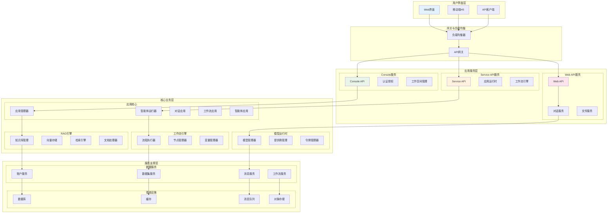

### 1.2 技术栈选择

#### 前端技术栈
- **Next.js 15**: React全栈框架，支持SSR/SSG
- **React 19**: 用户界面库，提供组件化开发
- **TypeScript**: 类型安全的JavaScript超集
- **Tailwind CSS**: 实用优先的CSS框架
- **Zustand**: 轻量级状态管理库

#### 后端技术栈
- **Python 3.11+**: 主要编程语言
- **Flask**: Web应用框架
- **SQLAlchemy**: ORM框架
- **Celery**: 分布式任务队列
- **Redis**: 缓存和消息代理
- **PostgreSQL**: 主数据库
- **Qdrant/Weaviate**: 向量数据库

#### 基础设施
- **Docker**: 容器化部署
- **Nginx**: 反向代理和负载均衡
- **S3兼容存储**: 文件存储
- **Prometheus**: 监控和告警
- **OpenTelemetry**: 分布式追踪

### 1.3 架构设计原则

#### 1.3.1 分层架构原则
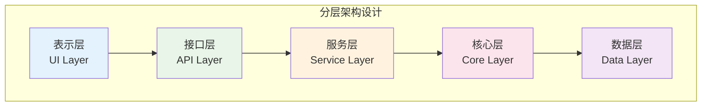

**设计原则**：
- **单向依赖**：上层依赖下层，下层不依赖上层
- **接口隔离**：层间通过明确的接口通信
- **职责分离**：每层专注于特定职责
- **可替换性**：同层组件可独立替换

#### 1.3.2 模块化设计
```python
# 模块化设计示例
class ModuleInterface:
    """模块标准接口"""
    
    def initialize(self) -> bool:
        """模块初始化"""
        pass
    
    def health_check(self) -> bool:
        """健康检查"""
        pass
    
    def shutdown(self) -> bool:
        """优雅关闭"""
        pass
    
    def get_metrics(self) -> dict:
        """获取性能指标"""
        pass

class WorkflowModule(ModuleInterface):
    """工作流模块实现"""
    
    def __init__(self):
        self.engine = WorkflowEngine()
        self.node_manager = NodeManager()
        self.variable_pool = VariablePool()
    
    def initialize(self) -> bool:
        """初始化工作流模块"""
        try:
            self.engine.start()
            self.node_manager.load_nodes()
            return True
        except Exception as e:
            logger.error(f"Workflow module initialization failed: {e}")
            return False
```

## 2. 蜂巢架构设计理念

### 2.1 架构设计哲学

Dify采用了独特的**蜂巢架构（Beehive Architecture）**设计理念：

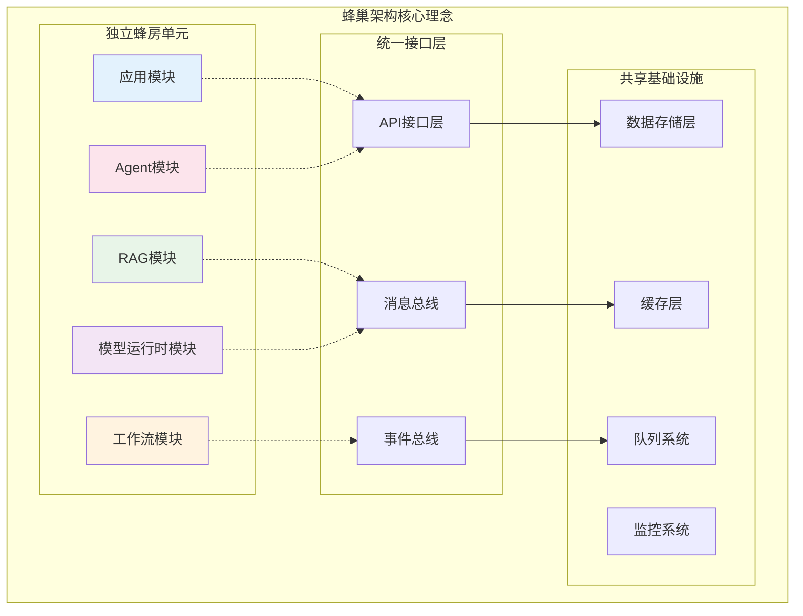

**蜂巢架构的核心优势**：

1. **模块独立性**：每个功能模块如蜂巢中的独立单元
2. **热插拔能力**：模块可单独升级或替换而不影响整体系统
3. **水平扩展**：新功能模块可无缝集成
4. **故障隔离**：单个模块故障不会导致系统崩溃

### 2.2 微服务架构演进

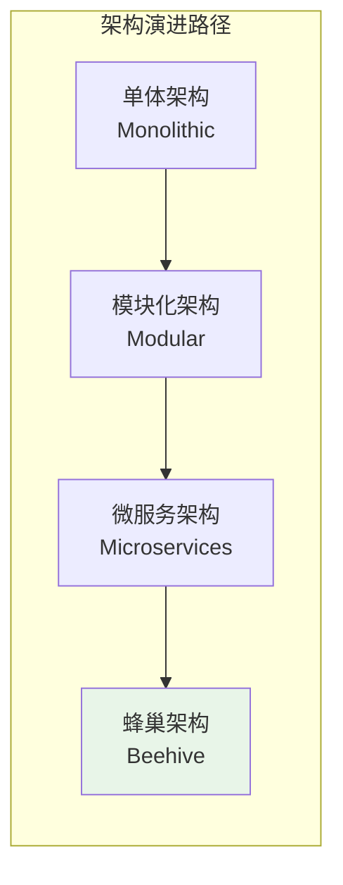

**演进特点**：
- **渐进式拆分**：从单体到模块化再到微服务
- **业务驱动**：按业务边界划分服务
- **技术独立**：每个服务可选择最适合的技术栈
- **数据隔离**：服务间数据独立，通过API通信

## 3. 核心架构组件

### 3.1 应用运行时架构

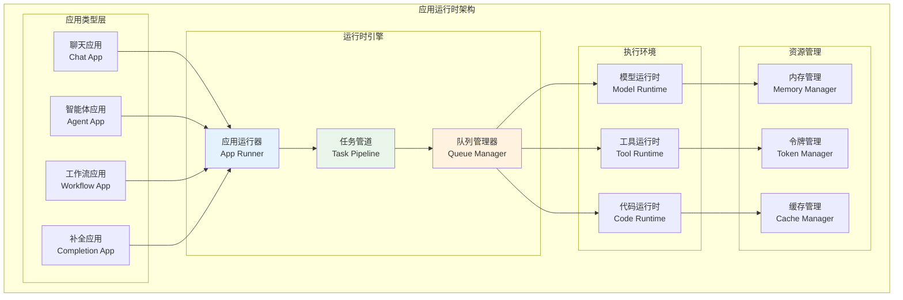

### 3.2 数据流架构

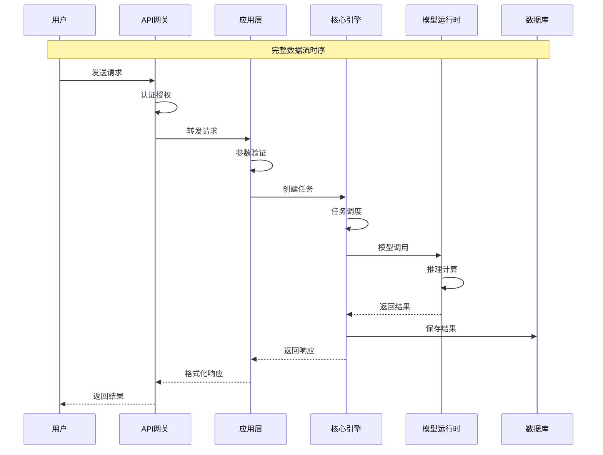

### 3.3 事件驱动架构

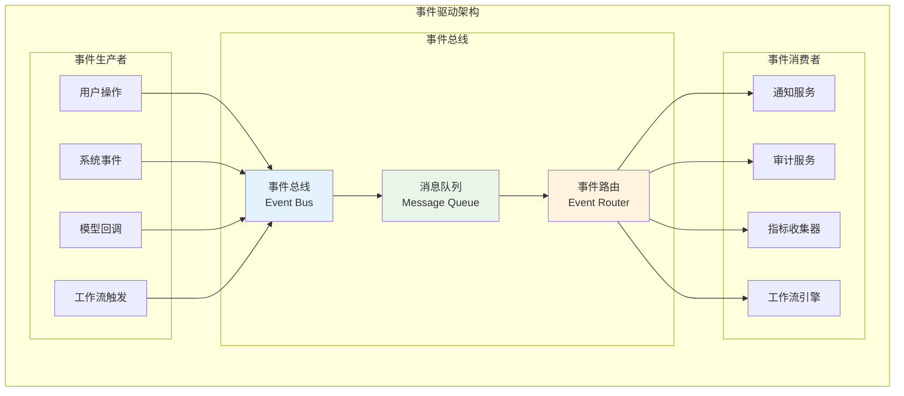

## 4. 安全架构设计

### 4.1 多层安全防护

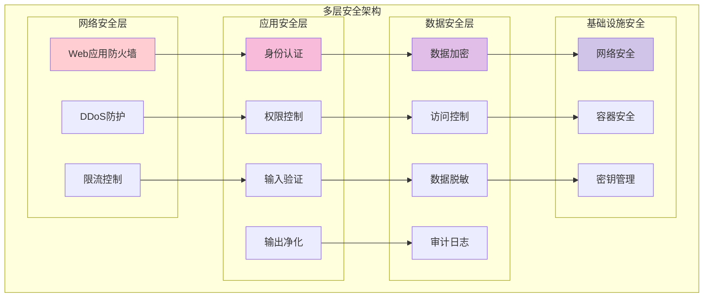

### 4.2 API安全机制

```python
# API安全实现示例
class APISecurityManager:
    """API安全管理器"""
    
    def __init__(self):
        self.rate_limiter = RateLimiter()
        self.auth_manager = AuthenticationManager()
        self.validator = InputValidator()
    
    def secure_endpoint(self, func):
        """安全端点装饰器"""
        @wraps(func)
        def wrapper(*args, **kwargs):
            # 1. 限流检查
            if not self.rate_limiter.allow_request():
                raise RateLimitExceeded()
            
            # 2. 身份认证
            user = self.auth_manager.authenticate_request()
            if not user:
                raise Unauthorized()
            
            # 3. 权限验证
            if not self.auth_manager.authorize_request(user, func.__name__):
                raise Forbidden()
            
            # 4. 输入验证
            validated_args = self.validator.validate_inputs(*args, **kwargs)
            
            # 5. 执行业务逻辑
            result = func(*validated_args, **kwargs)
            
            # 6. 输出净化
            sanitized_result = self.validator.sanitize_output(result)
            
            return sanitized_result
        
        return wrapper
```

## 5. 性能架构设计

### 5.1 缓存架构

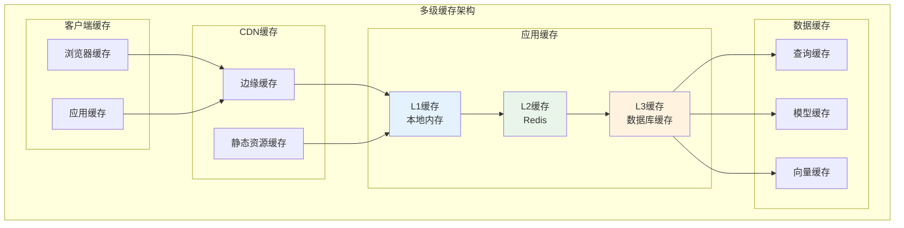

### 5.2 负载均衡架构

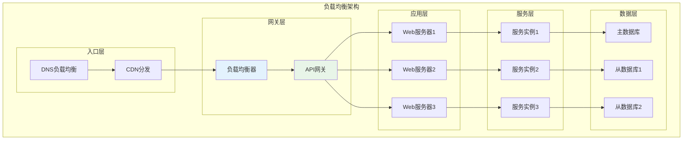

## 6. 部署架构

### 6.1 容器化部署架构

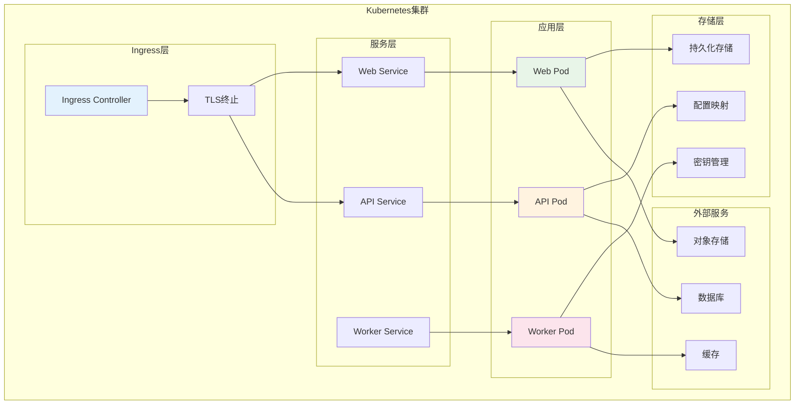

### 6.2 云原生架构

```yaml
# Kubernetes部署配置示例
apiVersion: apps/v1
kind: Deployment
metadata:
  name: dify-api
  labels:
    app: dify-api
spec:
  replicas: 3
  selector:
    matchLabels:
      app: dify-api
  template:
    metadata:
      labels:
        app: dify-api
    spec:
      containers:
      - name: api
        image: dify/api:latest
        ports:
        - containerPort: 5001
        env:
        - name: DATABASE_URL
          valueFrom:
            secretKeyRef:
              name: dify-secrets
              key: database-url
        - name: REDIS_URL
          valueFrom:
            secretKeyRef:
              name: dify-secrets
              key: redis-url
        resources:
          requests:
            memory: "512Mi"
            cpu: "250m"
          limits:
            memory: "1Gi"
            cpu: "500m"
        livenessProbe:
          httpGet:
            path: /health
            port: 5001
          initialDelaySeconds: 30
          periodSeconds: 10
        readinessProbe:
          httpGet:
            path: /ready
            port: 5001
          initialDelaySeconds: 5
          periodSeconds: 5
```

## 7. 监控与可观测性架构

### 7.1 监控架构

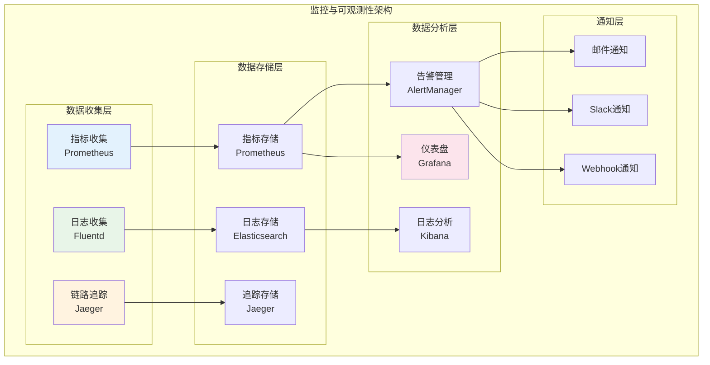

### 7.2 健康检查机制

```python
# 健康检查实现示例
class HealthChecker:
    """系统健康检查器"""
    
    def __init__(self):
        self.checks = {
            'database': self.check_database,
            'redis': self.check_redis,
            'model_service': self.check_model_service,
            'workflow_engine': self.check_workflow_engine
        }
    
    async def health_check(self) -> dict:
        """执行全面健康检查"""
        results = {}
        overall_status = 'healthy'
        
        for name, check_func in self.checks.items():
            try:
                start_time = time.time()
                status = await check_func()
                response_time = time.time() - start_time
                
                results[name] = {
                    'status': 'healthy' if status else 'unhealthy',
                    'response_time': response_time,
                    'timestamp': datetime.utcnow().isoformat()
                }
                
                if not status:
                    overall_status = 'unhealthy'
                    
            except Exception as e:
                results[name] = {
                    'status': 'error',
                    'error': str(e),
                    'timestamp': datetime.utcnow().isoformat()
                }
                overall_status = 'unhealthy'
        
        return {
            'status': overall_status,
            'checks': results,
            'timestamp': datetime.utcnow().isoformat()
        }
    
    async def check_database(self) -> bool:
        """检查数据库连接"""
        try:
            # 执行简单查询
            result = await db.execute("SELECT 1")
            return result is not None
        except Exception:
            return False
    
    async def check_redis(self) -> bool:
        """检查Redis连接"""
        try:
            await redis_client.ping()
            return True
        except Exception:
            return False
```

## 8. 架构演进与扩展

### 8.1 架构演进路线图

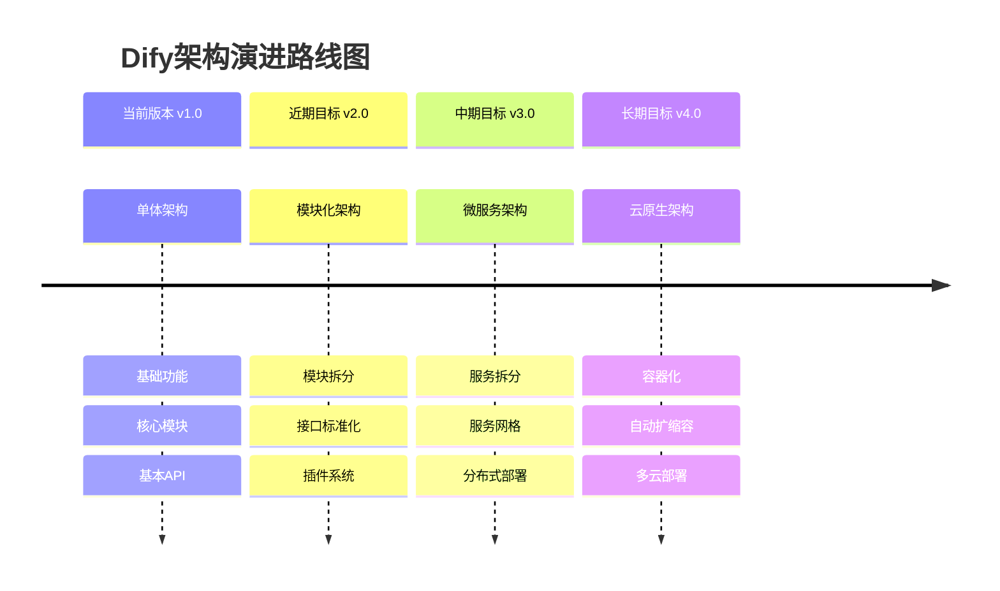

### 8.2 扩展性设计

```python
# 扩展性设计示例
class ExtensionManager:
    """扩展管理器"""
    
    def __init__(self):
        self.extensions = {}
        self.hooks = defaultdict(list)
    
    def register_extension(self, name: str, extension: Extension):
        """注册扩展"""
        self.extensions[name] = extension
        
        # 注册钩子
        for hook_name in extension.get_hooks():
            self.hooks[hook_name].append(extension)
    
    def execute_hook(self, hook_name: str, *args, **kwargs):
        """执行钩子"""
        results = []
        for extension in self.hooks.get(hook_name, []):
            try:
                result = extension.execute_hook(hook_name, *args, **kwargs)
                results.append(result)
            except Exception as e:
                logger.error(f"Extension {extension.name} hook {hook_name} failed: {e}")
        
        return results

class Extension:
    """扩展基类"""
    
    def __init__(self, name: str):
        self.name = name
    
    def get_hooks(self) -> List[str]:
        """获取支持的钩子列表"""
        return []
    
    def execute_hook(self, hook_name: str, *args, **kwargs):
        """执行钩子"""
        method_name = f"on_{hook_name}"
        if hasattr(self, method_name):
            return getattr(self, method_name)(*args, **kwargs)
```

## 9. 总结

Dify平台的架构设计体现了现代化软件架构的最佳实践：

### 9.1 架构优势

1. **高可扩展性**：蜂巢架构支持模块独立扩展
2. **高可用性**：多层冗余和故障隔离机制
3. **高性能**：多级缓存和负载均衡优化
4. **高安全性**：多层安全防护体系
5. **易维护性**：清晰的分层和模块化设计

### 9.2 技术创新

1. **蜂巢架构**：独特的模块化设计理念
2. **事件驱动**：异步处理和解耦设计
3. **云原生**：容器化和微服务架构
4. **AI优化**：针对AI应用的专门优化

### 9.3 未来发展

1. **智能化运维**：AIOps和自动化运维
2. **边缘计算**：边缘部署和分布式推理
3. **多云架构**：跨云部署和灾备
4. **生态扩展**：更丰富的插件和扩展机制

通过这套完整的架构设计，Dify平台为AI应用开发提供了坚实的技术基础，支持从小规模原型到大规模生产环境的各种需求。

---

*最后更新时间：2025-01-27*  
*文档版本：v1.0*  
*维护者：Dify架构团队*
