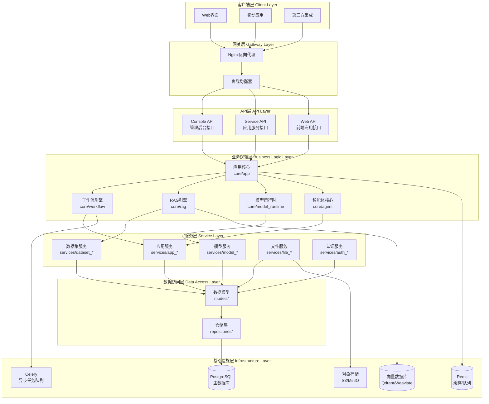
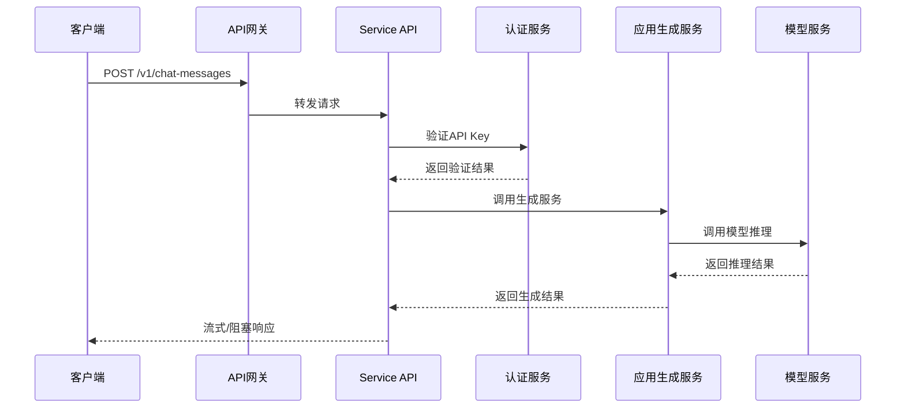
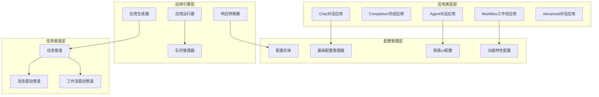
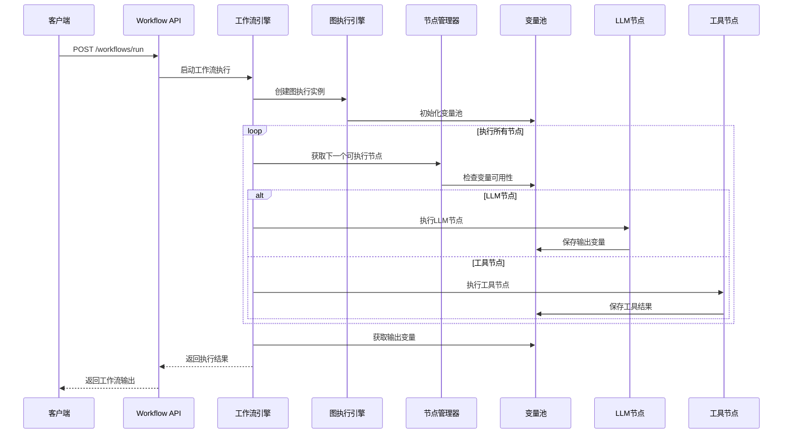
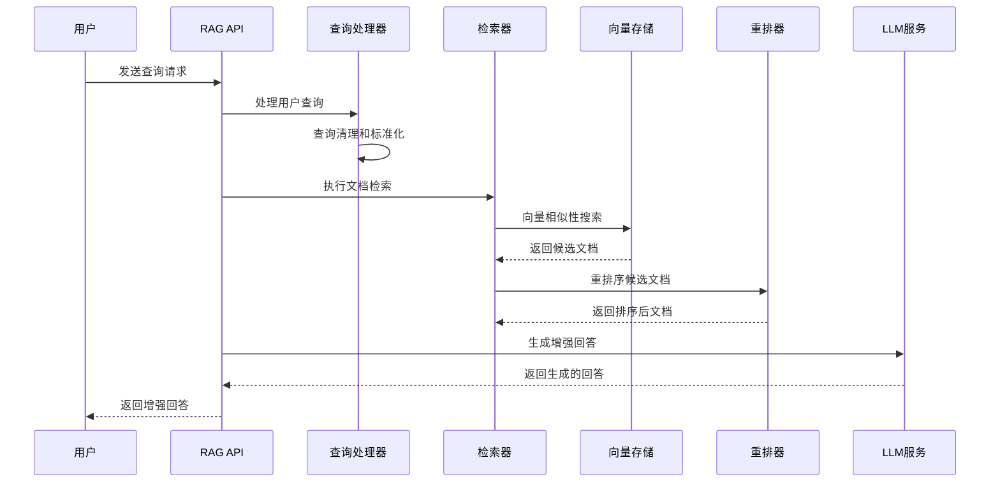
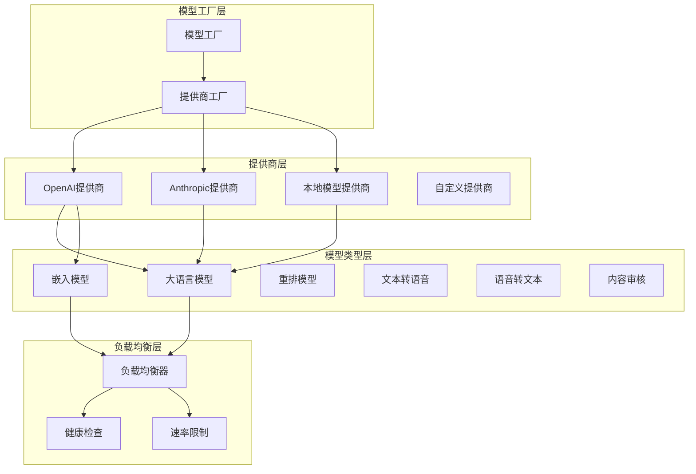
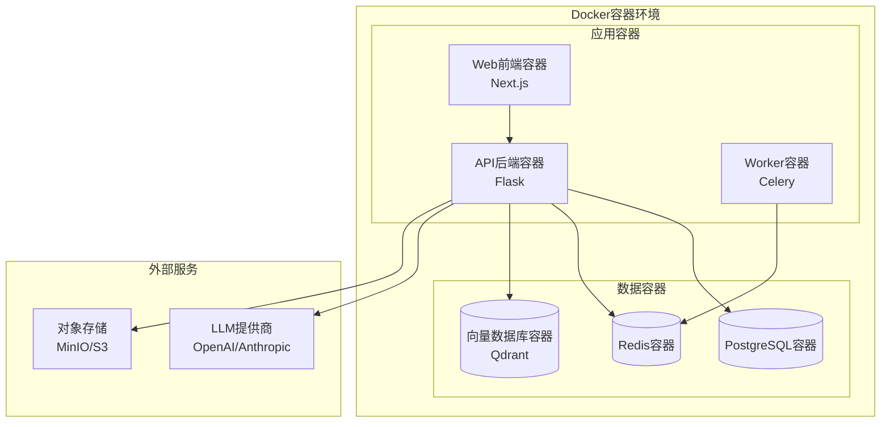
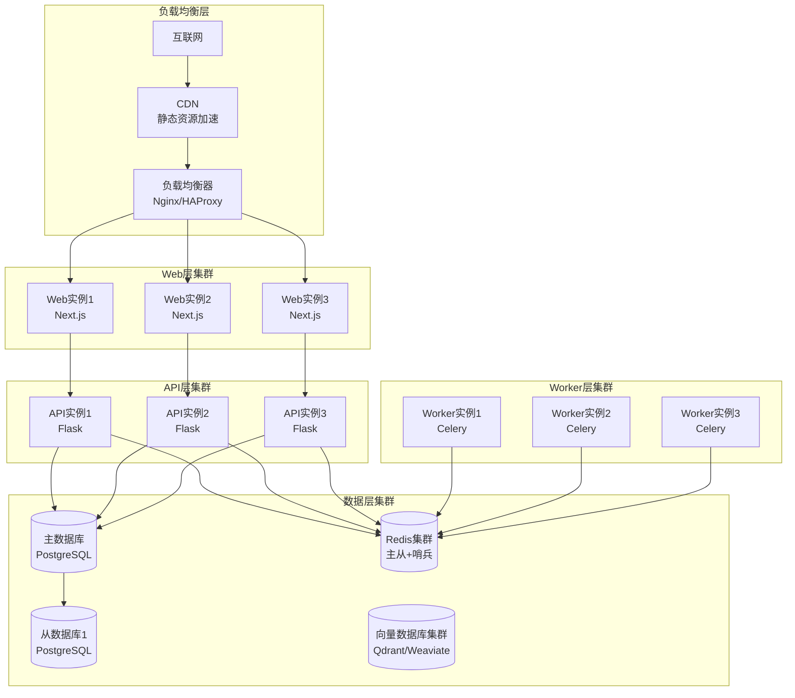

## 概述

Dify是一个开源的LLM应用开发平台，其直观的界面结合了智能体AI工作流、RAG管道、智能体功能、模型管理、可观测性功能等，让您能够快速从原型转向生产。

本文档提供Dify平台的全面架构分析，包括：
- 系统整体设计理念和架构特点
- 核心模块详细分析
- API接口层设计与实现
- 应用核心引擎架构
- 开发框架使用指南
- 可视化架构图表

## 1. 系统整体架构

### 1.1 设计理念

**核心设计原则**：
- **模块化和可扩展性**：采用分层架构设计，各层职责清晰，模块间松耦合，支持独立开发和部署
- **多租户和企业级**：原生支持多租户架构，完整的权限管理和数据隔离
- **开发者友好**：提供多套API接口满足不同需求，完整的SDK和文档支持
- **高性能和可靠性**：支持水平扩展和负载均衡，异步任务处理和队列管理

### 1.2 技术栈

**后端技术栈**：
- **Python Flask**: 轻量级Web框架，支持快速开发
- **Domain-Driven Design**: 领域驱动设计架构模式
- **SQLAlchemy**: ORM框架，支持多种数据库
- **Celery**: 分布式任务队列，处理异步任务
- **PostgreSQL**: 主数据库，存储应用和用户数据
- **Redis**: 缓存和消息队列
- **Vector Database**: 向量数据库（Qdrant/Weaviate/Pinecone）

**前端技术栈**：
- **Next.js 15**: React全栈框架，支持SSR/ISR
- **React 19**: 用户界面库
- **TypeScript**: 类型安全的JavaScript
- **Zustand**: 轻量级状态管理
- **Tailwind CSS**: 原子化CSS框架

### 1.3 分层架构



## 2. API接口层架构

### 2.1 三层API设计

Dify采用分层API架构，面向不同用户群体提供专门的接口：

**Console API (/console/api)**：
- 目标用户：系统管理员、应用开发者、租户管理员
- 认证方式：基于会话的用户认证
- 主要功能：应用配置和管理、数据集创建和维护、用户和权限管理、系统监控和统计

**Service API (/v1)**：
- 目标用户：外部开发者、第三方系统、企业集成
- 认证方式：API Key认证
- 主要功能：应用运行时调用、对话和文本生成、数据集检索服务、文件处理服务

**Web API (/api)**：
- 目标用户：最终用户、Web应用、移动应用
- 认证方式：Bearer Token或会话认证
- 主要功能：用户对话交互、应用界面数据、文件上传下载、实时通信

### 2.2 API请求处理流程



## 3. 应用核心模块

### 3.1 应用类型体系

Dify支持五种核心应用类型：

```python
# 应用类型枚举定义
class AppType(Enum):
    CHAT = "chat"                    # 基础对话应用
    COMPLETION = "completion"        # 文本完成应用
    AGENT_CHAT = "agent-chat"       # 智能体对话应用
    WORKFLOW = "workflow"           # 工作流应用
    ADVANCED_CHAT = "advanced-chat" # 高级对话应用
```

### 3.2 应用执行架构



### 3.3 任务管道系统

任务管道是Dify的核心处理引擎，采用事件驱动设计：

```python
class MessageBasedTaskPipeline:
    def process(self) -> Generator[Mapping[str, Any], None, None]:
        """
        三阶段处理：前置处理 -> 主处理 -> 后置处理
        """
        try:
            # 前置处理阶段
            yield from self._pre_process()
            
            # 主处理阶段
            yield from self._main_process()
            
            # 后置处理阶段
            yield from self._post_process()
            
        except TaskPipelineError as e:
            yield self._handle_pipeline_error(e)
```

## 4. 工作流引擎

### 4.1 工作流执行流程



### 4.2 节点类型支持

- **LLM节点**：调用大语言模型进行文本生成
- **工具节点**：执行外部工具和API调用
- **条件节点**：基于条件进行流程分支
- **代码节点**：执行自定义Python/JavaScript代码
- **模板节点**：文本模板处理和变量替换
- **HTTP请求节点**：发送HTTP请求获取外部数据

## 5. RAG检索增强生成

### 5.1 RAG处理流程



### 5.2 文档处理和索引

- **文档解析**：支持PDF、Word、Excel、Markdown等多种格式
- **文本分割**：智能语义分块，保持上下文连贯性
- **向量化**：使用嵌入模型生成文档向量表示
- **索引构建**：创建高效的向量索引和倒排索引
- **检索策略**：支持语义检索、关键词检索和混合检索

## 6. 模型运行时

### 6.1 模型管理架构



### 6.2 智能负载均衡

```python
class ModelInstance:
    def _round_robin_invoke(self, *args, **kwargs):
        """
        轮询调用多个模型配置，实现负载均衡和故障转移
        """
        for config in self.model_configs:
            try:
                if self._is_config_available(config):
                    return self._invoke_with_config(config, *args, **kwargs)
            except RateLimitError:
                self._mark_config_cooldown(config)
                continue
            except Exception as e:
                logger.warning(f"模型调用失败: {e}")
                continue
        
        raise NoAvailableModelError("所有模型配置都不可用")
```

## 7. 智能体系统

### 7.1 Agent策略

Dify支持两种主要的Agent策略：

**Function Calling策略**：
- 适用于支持函数调用的现代LLM
- 结构化的工具调用和参数传递
- 更高的准确性和可控性

**Chain of Thought (CoT)策略**：
- 适用于不支持函数调用的模型
- 基于ReACT模式的推理链
- 更好的兼容性

### 7.2 工具集成

```python
class ToolManager:
    def get_agent_tool_runtime(self, tool_type: AgentToolType):
        """
        根据工具类型获取对应的工具运行时
        """
        if tool_type == AgentToolType.BUILTIN:
            return BuiltinToolRuntime()
        elif tool_type == AgentToolType.API:
            return ApiToolRuntime()
        elif tool_type == AgentToolType.WORKFLOW:
            return WorkflowToolRuntime()
        else:
            raise ValueError(f"不支持的工具类型: {tool_type}")
```

## 8. 部署架构

### 8.1 单机部署



### 8.2 生产环境集群部署



## 9. 开发最佳实践

### 9.1 环境搭建

**后端开发环境**：
```bash
# 1. 克隆项目并安装依赖
git clone https://github.com/langgenius/dify.git
cd dify/api
uv sync

# 2. 配置环境变量
cp .env.example .env
# 编辑.env文件配置数据库和服务

# 3. 数据库初始化
uv run flask db upgrade
uv run flask seed

# 4. 启动服务
./dev/start-api
./dev/start-worker
```

**前端开发环境**：
```bash
cd web
pnpm install
pnpm dev
```

### 9.2 代码质量管理

**后端代码质量**：
```bash
# 运行所有格式化和检查工具
./dev/reformat

# 单独运行各种检查
uv run --project api ruff check --fix ./
uv run --project api ruff format ./
uv run --directory api basedpyright

# 运行测试
uv run --project api pytest
```

**前端代码质量**：
```bash
cd web
pnpm lint
pnpm eslint-fix
pnpm test
pnpm type-check
```

### 9.3 应用创建示例

**创建Chat应用**：
```python
def create_chat_app_example():
    app_args = {
        'name': '智能客服助手',
        'mode': 'chat',
        'icon': '🤖',
        'description': '基于GPT-4的智能客服助手'
    }
    
    model_config = {
        'provider': 'openai',
        'model': 'gpt-4',
        'parameters': {
            'temperature': 0.7,
            'max_tokens': 2048
        }
    }
    
    # 创建应用并配置
    app = AppService.create_app(tenant_id='tenant_123', args=app_args, account=account)
    AppConfigService.update_app_config(app, {'model_config': model_config})
    
    return app
```

**创建Agent应用**：
```python
def create_agent_app_example():
    agent_config = {
        'strategy': 'function-calling',
        'max_iteration': 10,
        'tools': [
            {
                'type': 'builtin',
                'provider': 'duckduckgo',
                'tool_name': 'duckduckgo_search'
            },
            {
                'type': 'builtin',
                'provider': 'calculator',
                'tool_name': 'calculator'
            }
        ]
    }
    
    # 创建具备工具调用能力的Agent应用
    app = AppService.create_app(tenant_id='tenant_123', args=app_args, account=account)
    AppConfigService.update_app_config(app, {'agent': agent_config})
    
    return app
```

### 9.4 API调用示例

```python
def call_dify_app_example():
    api_base_url = "http://localhost/v1"
    headers = {'Authorization': f'Bearer {api_key}'}
    
    request_data = {
        'inputs': {'topic': '人工智能应用'},
        'query': '请介绍AI在医疗领域的应用',
        'response_mode': 'streaming',
        'user': 'user_123'
    }
    
    # 流式响应处理
    response = requests.post(
        f"{api_base_url}/apps/{app_id}/completion-messages",
        headers=headers,
        json=request_data,
        stream=True
    )
    
    for line in response.iter_lines():
        if line and line.startswith(b'data: '):
            data = line[6:].decode('utf-8')
            if data != '[DONE]':
                event_data = json.loads(data)
                print(f"内容: {event_data.get('answer', '')}")
```

## 10. 性能优化和监控

### 10.1 性能优化策略

**数据库优化**：
- 合理使用索引
- 查询优化和分页
- 连接池配置
- 读写分离

**缓存策略**：
- Redis缓存热点数据
- 应用级缓存
- CDN静态资源缓存
- 数据库查询缓存

**异步处理**：
- Celery处理耗时任务
- 消息队列解耦
- 批量处理优化
- 任务监控和重试

### 10.2 监控和日志

**关键监控指标**：
- API响应时间和吞吐量
- 模型调用成功率和延迟
- 数据库连接池状态
- 缓存命中率
- 队列任务积压情况

**日志管理**：
- 结构化日志记录
- 分级日志输出
- 日志聚合和分析
- 错误追踪和告警

## 11. 安全和合规

### 11.1 安全架构

**认证和授权**：
- JWT令牌认证
- 基于角色的访问控制(RBAC)
- API密钥管理
- 多因子认证支持

**数据安全**：
- 数据加密存储
- 传输层安全(TLS)
- 敏感信息脱敏
- 数据访问审计

**系统安全**：
- 输入验证和SQL注入防护
- 跨站脚本攻击(XSS)防护
- 速率限制和DDoS防护
- 代码执行沙箱隔离

### 11.2 合规支持

**数据隐私**：
- GDPR合规支持
- 数据主权和本地化部署
- 用户数据删除和导出
- 隐私政策管理

**审计和监控**：
- 完整的操作日志记录
- 用户行为审计
- 系统性能监控
- 合规报告生成

## 12. 扩展性和未来发展

### 12.1 水平扩展能力

**API服务扩展**：
- 无状态设计，支持多实例部署
- 通过负载均衡器分发请求
- 支持自动扩缩容

**数据库扩展**：
- 支持读写分离
- 数据分片和分区策略
- 缓存层减少数据库压力

### 12.2 功能扩展能力

**模型提供商扩展**：
- 插件化的模型提供商架构
- 统一的模型接口规范
- 支持自定义模型集成

**工具扩展**：
- 标准化的工具接口
- 支持自定义工具开发
- 工具市场和生态系统

## 总结

Dify作为企业级AI应用开发平台，具有以下核心优势：

**技术优势**：
- 分层架构清晰，模块职责明确
- 微服务理念，支持独立开发和部署
- 插件化设计，具备良好的扩展性
- 多模型支持，统一的调用接口

**业务优势**：
- 支持多种AI应用类型（Chat、Agent、Workflow）
- 提供完整的开发工具链和API
- 企业级安全和合规支持
- 丰富的集成能力和生态系统

**运维优势**：
- 容器化部署，便于管理
- 水平扩展能力强
- 完善的监控和日志系统
- 高可用和容错设计

通过这种架构设计，Dify能够满足从个人开发者到大型企业的不同需求，为AI应用开发提供了一个稳定、可扩展、功能丰富的平台基础。

---

**文档版本**: v1.0  
**创建时间**: 2025年01月27日  
**最后更新**: 2025年01月27日
