## 概述

本文档提供Dify平台的完整架构可视化，通过多种图表类型展示系统的整体设计、模块关系、数据流向和关键数据结构。

<!--more-->

## 1. 系统整体架构

### 1.1 Dify平台全景架构图

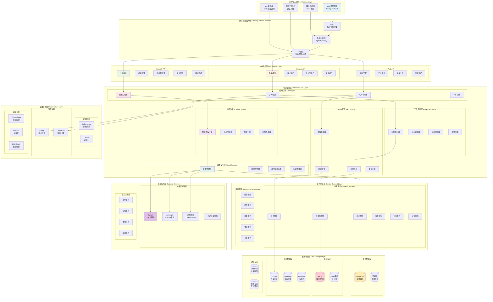

### 1.2 系统分层架构详图

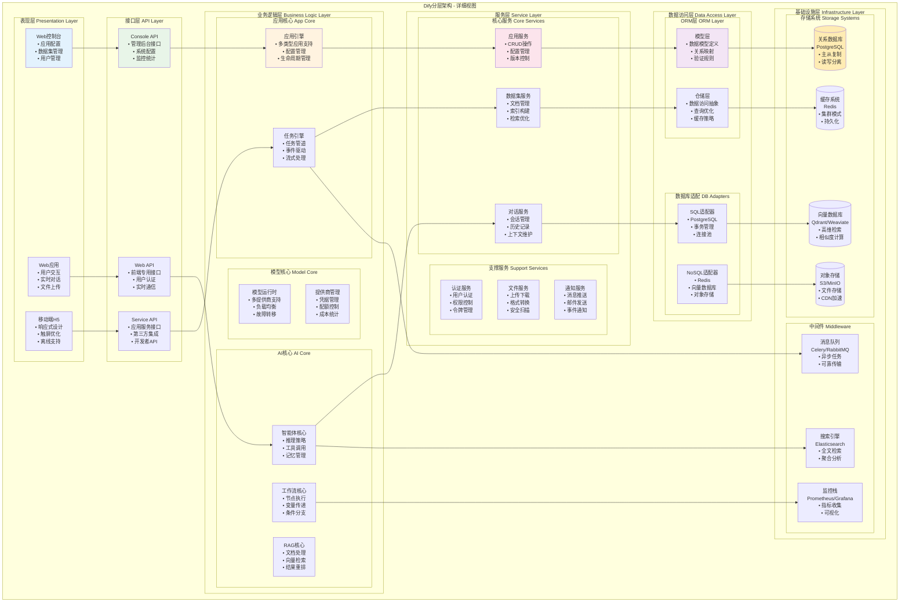

## 2. 核心模块交互图

### 2.1 应用执行流程图

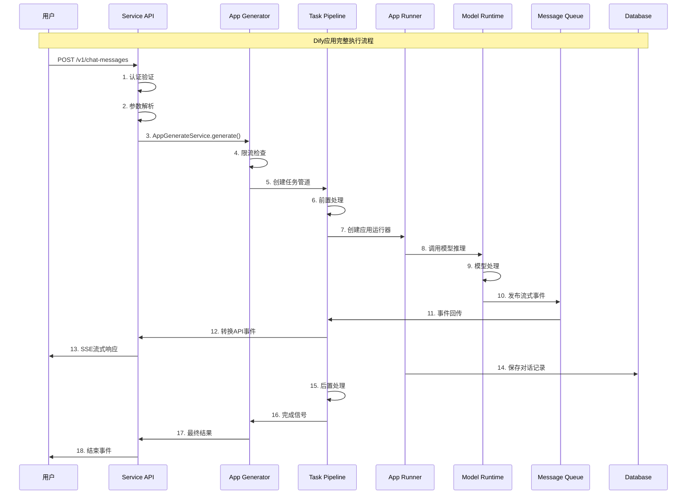

### 2.2 智能体推理流程图

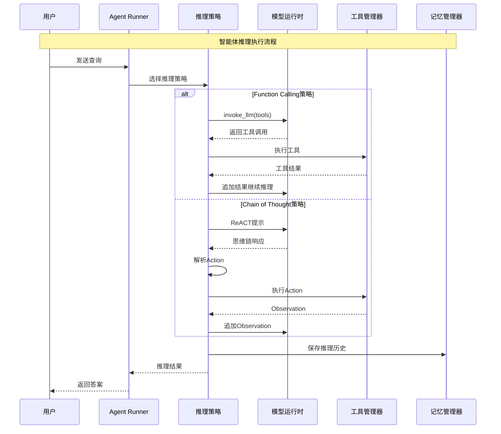

### 2.3 工作流执行流程图

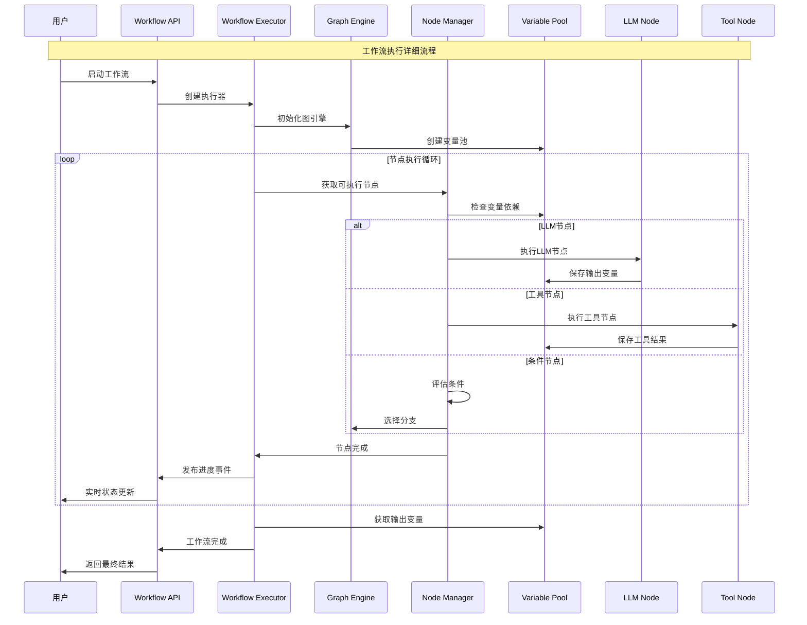

## 3. 数据流向图

### 3.1 RAG数据处理流程

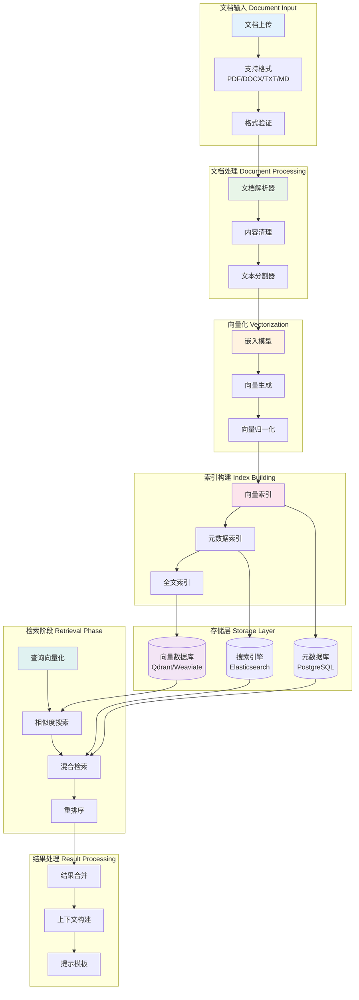

### 3.2 用户请求数据流

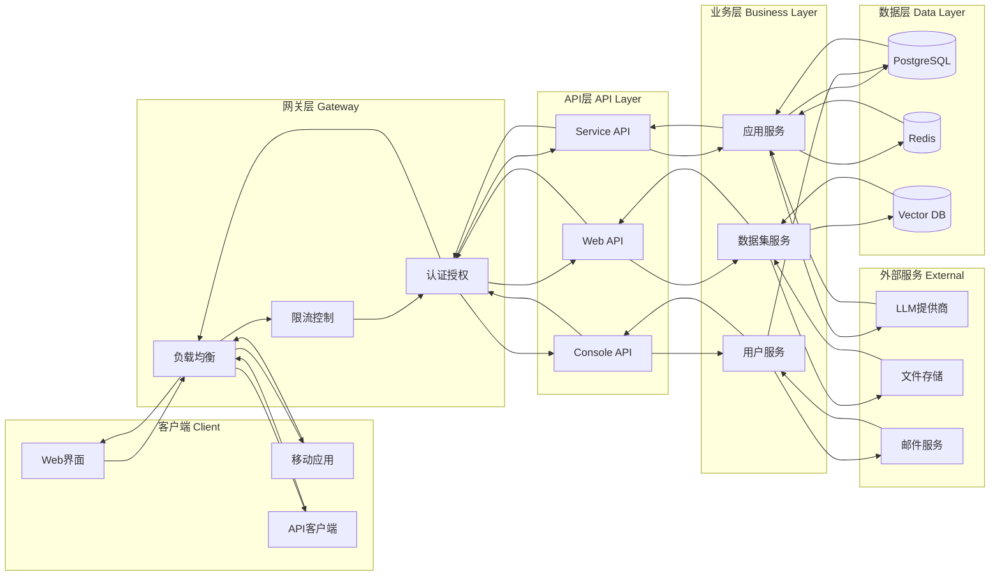

## 4. 核心数据结构UML图

### 4.1 应用核心实体类图

```mermaid
classDiagram
    class App {
        +String id
        +String tenant_id
        +String name
        +String mode
        +String icon
        +String description
        +String status
        +Boolean enable_site
        +Boolean enable_api
        +DateTime created_at
        +DateTime updated_at
        +to_dict() Dict
        +from_dict(dict) App
    }
    
    class AppModelConfig {
        +String id
        +String app_id
        +Dict provider_model_bundle
        +Dict model_config
        +Dict user_input_form
        +Dict dataset_configs
        +Dict retrieval_model
        +Dict agent_mode
        +Dict prompt_template
        +Dict opening_statement
        +Dict suggested_questions
        +Dict speech_to_text
        +Dict text_to_speech
        +Dict file_upload
        +DateTime created_at
        +DateTime updated_at
        +to_dict() Dict
    }
    
    class Conversation {
        +String id
        +String app_id
        +String app_model_config_id
        +Dict model_config
        +Dict override_model_configs
        +String mode
        +String name
        +Dict summary
        +Dict inputs
        +String status
        +String from_source
        +String from_end_user_id
        +String from_account_id
        +Int read_count
        +DateTime read_at
        +DateTime created_at
        +DateTime updated_at
        +get_messages() List[Message]
        +get_summary() String
    }
    
    class Message {
        +String id
        +String app_id
        +String model_config_id
        +String conversation_id
        +Dict inputs
        +String query
        +String message
        +String message_tokens
        +String message_unit_price
        +String answer
        +String answer_tokens
        +String answer_unit_price
        +String provider_response_latency
        +String total_price
        +String currency
        +String from_source
        +String from_end_user_id
        +String from_account_id
        +DateTime created_at
        +DateTime updated_at
        +to_dict() Dict
    }
    
    class Dataset {
        +String id
        +String tenant_id
        +String name
        +String description
        +String provider
        +String permission
        +String data_source_type
        +String indexing_technique
        +Dict index_struct
        +DateTime created_at
        +DateTime updated_at
        +get_documents() List[Document]
        +get_app_count() Int
    }
    
    class Document {
        +String id
        +String tenant_id
        +String dataset_id
        +Int position
        +String data_source_type
        +Dict data_source_info
        +String dataset_process_rule_id
        +String batch
        +String name
        +DateTime created_from
        +String created_by
        +DateTime created_at
        +DateTime updated_at
        +String indexing_status
        +String enabled
        +String disabled_at
        +String disabled_by
        +String archived
        +Int word_count
        +Int tokens
        +get_segments() List[DocumentSegment]
    }
    
    class Workflow {
        +String id
        +String tenant_id
        +String app_id
        +String type
        +String version
        +Dict graph
        +Dict features
        +String created_by
        +String environment
        +DateTime created_at
        +DateTime updated_at
        +get_nodes() List[Node]
        +execute(inputs) WorkflowResult
    }
    
    %% 关系定义
    App ||--o{ AppModelConfig : has
    App ||--o{ Conversation : contains
    Conversation ||--o{ Message : includes
    App ||--o{ Dataset : uses
    Dataset ||--o{ Document : contains
    App ||--o{ Workflow : implements
    
    %% 继承关系
    class BaseModel {
        <<abstract>>
        +String id
        +DateTime created_at
        +DateTime updated_at
        +to_dict() Dict
        +from_dict(dict) BaseModel
    }
    
    BaseModel <|-- App
    BaseModel <|-- AppModelConfig
    BaseModel <|-- Conversation
    BaseModel <|-- Message
    BaseModel <|-- Dataset
    BaseModel <|-- Document
    BaseModel <|-- Workflow
```

### 4.2 智能体系统类图

```mermaid
classDiagram
    class AgentEntity {
        +String provider
        +String model
        +Strategy strategy
        +List~AgentToolEntity~ tools
        +Int max_iteration
        +Optional~AgentPromptEntity~ prompt
        +validate() Boolean
    }
    
    class AgentToolEntity {
        +AgentToolType tool_type
        +String provider
        +String tool_name
        +String tool_id
        +String workflow_id
        +Dict tool_configuration
        +String description
        +Boolean enabled
    }
    
    class BaseAgentRunner {
        <<abstract>>
        +String tenant_id
        +ApplicationGenerateEntity application_generate_entity
        +AppQueueManager queue_manager
        +Conversation conversation
        +Message message
        +run(message, query, **kwargs) Generator
        +create_agent_thought() String
        +save_agent_thought() None
    }
    
    class FunctionCallAgentRunner {
        +run(message, query, **kwargs) Generator
        +_init_prompt_tools() Tuple
        +_organize_prompt_messages() List
        +_handle_tool_calls_stream() None
        +_execute_tool_calls() Generator
        +_format_tool_response() String
    }
    
    class CotAgentRunner {
        <<abstract>>
        +Dict _react_keywords
        +List _agent_scratchpad
        +run(message, query, inputs) Generator
        +_parse_react_response(response) Dict
        +_execute_react_tool_call() Generator
        +_build_react_system_prompt() String
    }
    
    class CotChatAgentRunner {
        +_organize_react_prompt_messages() List
    }
    
    class CotCompletionAgentRunner {
        +_organize_react_prompt_messages() List
    }
    
    class ToolManager {
        +get_agent_tool_runtime(tenant_id, app_id, agent_tool, invoke_from) Tool
        +get_builtin_tool_runtime() Tool
        +get_api_tool_runtime() Tool
        +get_workflow_tool_runtime() Tool
    }
    
    class Tool {
        <<interface>>
        +ToolEntity entity
        +invoke(user_id, tool_parameters) ToolInvokeMessage
        +get_runtime_parameters() List~ToolParameter~
        +validate_credentials() Boolean
    }
    
    class BuiltinTool {
        +invoke(user_id, tool_parameters) ToolInvokeMessage
        +get_tool_schema() Dict
    }
    
    class ApiTool {
        +invoke(user_id, tool_parameters) ToolInvokeMessage
        +make_http_request() Response
    }
    
    class WorkflowTool {
        +invoke(user_id, tool_parameters) ToolInvokeMessage
        +execute_workflow() WorkflowResult
    }
    
    %% 关系定义
    AgentEntity ||--o{ AgentToolEntity : contains
    BaseAgentRunner <|-- FunctionCallAgentRunner
    BaseAgentRunner <|-- CotAgentRunner
    CotAgentRunner <|-- CotChatAgentRunner
    CotAgentRunner <|-- CotCompletionAgentRunner
    
    FunctionCallAgentRunner --> ToolManager : uses
    CotAgentRunner --> ToolManager : uses
    ToolManager --> Tool : manages
    
    Tool <|.. BuiltinTool
    Tool <|.. ApiTool
    Tool <|.. WorkflowTool
    
    %% 枚举类
    class Strategy {
        <<enumeration>>
        FUNCTION_CALLING
        CHAIN_OF_THOUGHT
    }
    
    class AgentToolType {
        <<enumeration>>
        BUILTIN
        API
        WORKFLOW
        DATASET
    }
    
    AgentEntity --> Strategy : uses
    AgentToolEntity --> AgentToolType : uses
```

### 4.3 工作流系统类图

```mermaid
classDiagram
    class Workflow {
        +String id
        +String tenant_id
        +String app_id
        +String type
        +String version
        +Dict graph
        +Dict features
        +String environment
        +get_nodes() List~Node~
        +get_edges() List~Edge~
        +validate() Boolean
    }
    
    class WorkflowExecutor {
        +Workflow workflow
        +VariableLoader variable_loader
        +AppQueueManager queue_manager
        +run(workflow_run_params) WorkflowResult
        +_execute_node(node) NodeResult
        +_handle_node_error(node, error) None
    }
    
    class Node {
        <<abstract>>
        +String id
        +String type
        +String title
        +Dict data
        +List~String~ inputs
        +List~String~ outputs
        +execute(variable_pool) NodeResult
        +validate() Boolean
    }
    
    class LLMNode {
        +String model_provider
        +String model_name
        +Dict model_parameters
        +String prompt_template
        +execute(variable_pool) NodeResult
        +_build_prompt(variables) String
        +_call_llm(prompt) LLMResult
    }
    
    class ToolNode {
        +String tool_provider
        +String tool_name
        +Dict tool_parameters
        +execute(variable_pool) NodeResult
        +_prepare_tool_input(variables) Dict
        +_call_tool(input) ToolResult
    }
    
    class CodeNode {
        +String code_language
        +String code_content
        +List~String~ dependencies
        +execute(variable_pool) NodeResult
        +_execute_python_code(code, variables) Any
        +_execute_javascript_code(code, variables) Any
    }
    
    class ConditionNode {
        +List~Condition~ conditions
        +String default_branch
        +execute(variable_pool) NodeResult
        +_evaluate_conditions(variables) String
        +_parse_condition(condition, variables) Boolean
    }
    
    class StartNode {
        +List~Variable~ input_variables
        +execute(variable_pool) NodeResult
        +_validate_inputs(variables) Boolean
    }
    
    class EndNode {
        +List~Variable~ output_variables
        +execute(variable_pool) NodeResult
        +_prepare_outputs(variables) Dict
    }
    
    class VariablePool {
        +Dict variables
        +get_variable(name) Any
        +set_variable(name, value) None
        +has_variable(name) Boolean
        +get_all_variables() Dict
        +clear() None
    }
    
    class GraphEngine {
        +Workflow workflow
        +VariablePool variable_pool
        +get_executable_nodes() List~Node~
        +get_next_nodes(current_node) List~Node~
        +is_workflow_complete() Boolean
        +validate_graph() Boolean
    }
    
    class WorkflowResult {
        +String workflow_run_id
        +String status
        +Dict outputs
        +List~NodeResult~ node_results
        +Float total_time
        +Dict usage_statistics
        +Optional~String~ error_message
    }
    
    class NodeResult {
        +String node_id
        +String status
        +Dict outputs
        +Float execution_time
        +Optional~String~ error_message
        +Dict metadata
    }
    
    %% 关系定义
    Workflow ||--o{ Node : contains
    WorkflowExecutor --> Workflow : executes
    WorkflowExecutor --> VariablePool : manages
    WorkflowExecutor --> GraphEngine : uses
    
    Node <|-- LLMNode
    Node <|-- ToolNode
    Node <|-- CodeNode
    Node <|-- ConditionNode
    Node <|-- StartNode
    Node <|-- EndNode
    
    GraphEngine --> Node : manages
    GraphEngine --> VariablePool : accesses
    
    WorkflowExecutor --> WorkflowResult : produces
    Node --> NodeResult : produces
    
    %% 枚举和值对象
    class NodeStatus {
        <<enumeration>>
        PENDING
        RUNNING
        COMPLETED
        FAILED
        SKIPPED
    }
    
    class WorkflowStatus {
        <<enumeration>>
        RUNNING
        COMPLETED
        FAILED
        STOPPED
    }
    
    NodeResult --> NodeStatus : has
    WorkflowResult --> WorkflowStatus : has
```

## 5. 部署架构图

### 5.1 单机部署架构

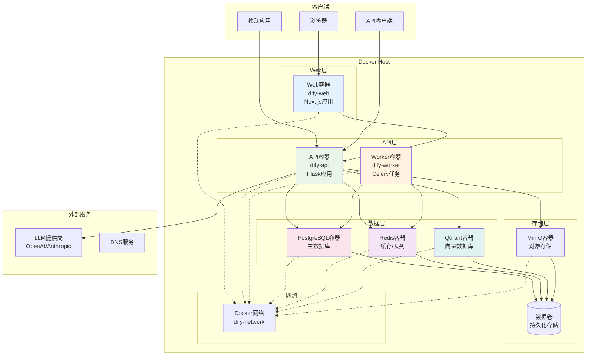

### 5.2 生产环境集群部署

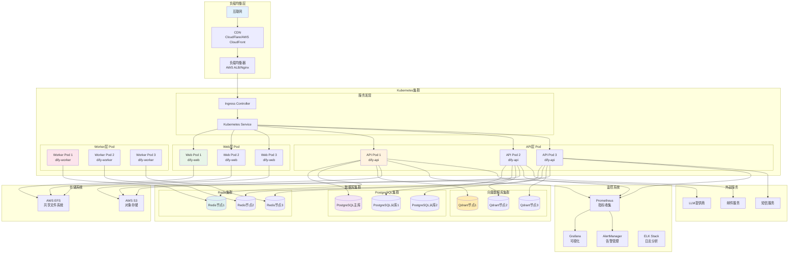

## 6. 性能监控架构图

### 6.1 监控系统架构

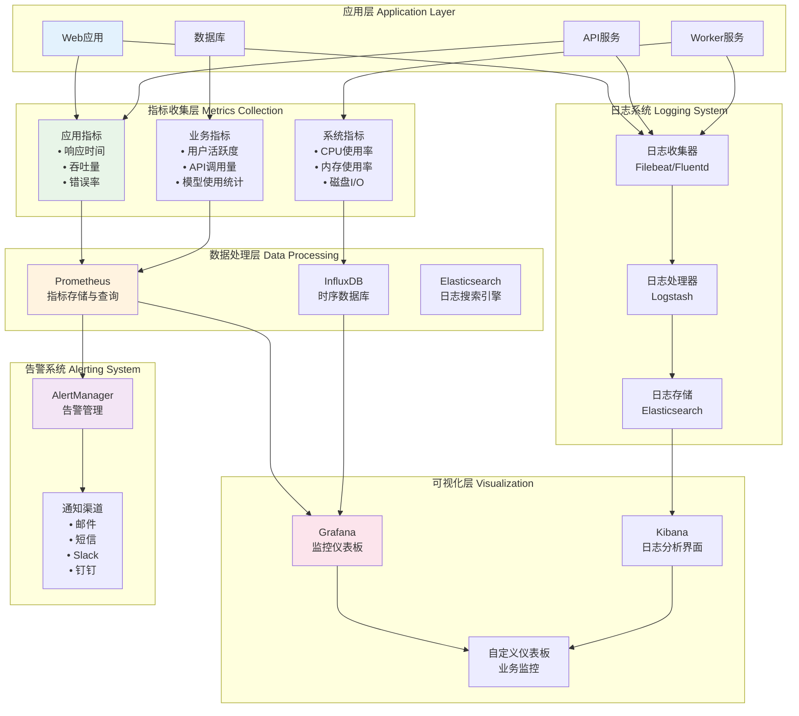

### 6.2 关键性能指标(KPI)监控

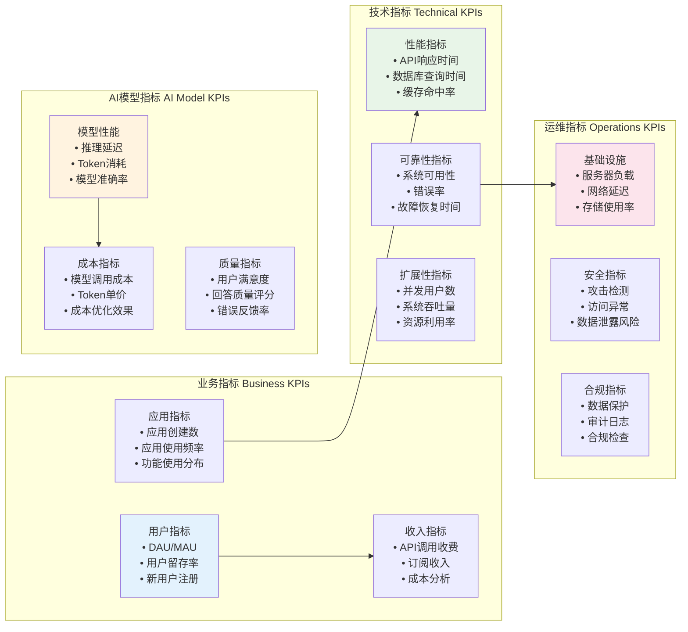

## 7. 总结

本文档通过多种架构图和UML图，全面展示了Dify平台的系统设计：

### 7.1 架构图谱价值

1. **系统全景**：通过整体架构图了解Dify的完整技术栈
2. **模块关系**：通过交互图理解各模块间的协作关系
3. **数据流向**：通过流程图掌握数据处理和传递过程
4. **结构设计**：通过UML图深入了解核心数据结构
5. **部署方案**：通过部署图指导实际环境搭建
6. **监控体系**：通过监控图建立完善的运维体系

### 7.2 设计理念体现

- **分层架构**：清晰的职责分离和模块化设计
- **事件驱动**：基于消息队列的异步处理机制
- **微服务化**：独立部署和扩展的服务组件
- **可观测性**：完善的监控、日志和追踪体系
- **高可用性**：集群部署和故障转移能力
- **扩展性**：支持水平扩展和插件化扩展

### 7.3 实践指导

这些架构图为开发者提供了：
- 系统理解的可视化指南
- 开发实现的参考模板
- 部署运维的架构蓝图
- 性能优化的监控基础
- 问题排查的结构依据

通过这些图表，开发者可以更好地理解Dify的设计思想，并在此基础上进行定制开发和系统优化。
