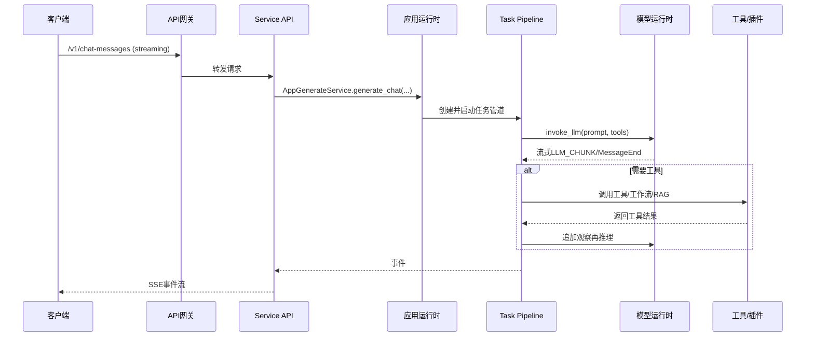

## 概述

Dify是一个开源的大模型应用开发平台，提供AI工作流、RAG管道、智能体功能与模型管理能力。本节描述平台的架构设计与技术实现。

<!--more-->

## 1. Dify平台架构概览

### 1.1 系统总体架构

Dify采用现代化的分层架构设计，通过清晰的职责分离和模块化组织，实现了高度的可扩展性和可维护性。

### 1.2 整体架构图

```mermaid
graph TB
    subgraph "用户界面层"
        Web[Web界面]
        Mobile[移动端H5]
        API_Client[API客户端]
    end
    
    subgraph "网关与负载均衡"
        LB[负载均衡器]
        Gateway[API网关]
    end
    
    subgraph "应用服务层"
        subgraph "Console服务"
            Console_API[Console API]
            Console_Auth[认证授权]
            Console_Workspace[工作空间管理]
        end
        
        subgraph "Service API服务"
            Service_API[Service API]
            App_Runtime[应用运行时]
            Workflow_Engine[工作流引擎]
        end
        
        subgraph "Web API服务"
            Web_API[Web API]
            Chat_Service[对话服务]
            File_Service[文件服务]
        end
    end
    
    subgraph "核心业务层"
        subgraph "应用核心"
            App_Manager[应用管理器]
            Agent_Runner[智能体运行器]
            Chat_App[对话应用]
            Workflow_App[工作流应用]
            Agent_App[智能体应用]
        end
        
        subgraph "RAG引擎"
            Knowledge_Base[知识库管理]
            Vector_Store[向量存储]
            Retrieval_Engine[检索引擎]
            Document_Processor[文档处理器]
        end
        
        subgraph "工作流引擎"
            Flow_Executor[流程执行器]
            Node_Manager[节点管理器]
            Variable_Manager[变量管理器]
        end
        
        subgraph "模型运行时"
            Model_Manager[模型管理器]
            Provider_Manager[提供商管理]
            Token_Manager[令牌管理器]
        end
    end
    
    subgraph "服务支撑层"
        subgraph "数据服务"
            Account_Service[账户服务]
            Dataset_Service[数据集服务]
            Message_Service[消息服务]
            Workflow_Service[工作流服务]
        end
        
        subgraph "工具服务"
            Tool_Manager[工具管理器]
            Plugin_Manager[插件管理器]
            Extension_Manager[扩展管理器]
        end
    end
    
    subgraph "基础设施层"
        subgraph "数据存储"
            PostgreSQL[(PostgreSQL)]
            Redis[(Redis)]
            Vector_DB[(向量数据库)]
            File_Storage[(文件存储)]
        end
        
        subgraph "外部服务"
            LLM_Providers[LLM提供商]
            Vector_Services[向量化服务]
            Search_Services[搜索服务]
        end
        
        subgraph "系统服务"
            Task_Queue[任务队列 Celery]
            Message_Queue[消息队列]
            Monitor[监控服务]
            Log[日志服务]
        end
    end
    
    %% 连接关系
    Web --> LB
    Mobile --> LB
    API_Client --> LB
    
    LB --> Gateway
    Gateway --> Console_API
    Gateway --> Service_API
    Gateway --> Web_API
    
    Console_API --> App_Manager
    Service_API --> App_Runtime
    Web_API --> Chat_Service
    
    App_Manager --> Knowledge_Base
    App_Runtime --> Workflow_Engine
    Chat_Service --> Agent_Runner
    
    Agent_Runner --> Model_Manager
    Workflow_Engine --> Flow_Executor
    Knowledge_Base --> Vector_Store
    
    App_Manager --> Account_Service
    Retrieval_Engine --> Dataset_Service
    Flow_Executor --> Message_Service
    
    Account_Service --> PostgreSQL
    Dataset_Service --> Vector_DB
    Message_Service --> Redis
    
    Model_Manager --> LLM_Providers
    Vector_Store --> Vector_Services
    Tool_Manager --> Search_Services
    
    Workflow_Engine --> Task_Queue
    Task_Queue --> Message_Queue
    
    style Web fill:#e1f5fe
    style Console_API fill:#f3e5f5
    style Service_API fill:#f3e5f5
    style Web_API fill:#f3e5f5
    style App_Manager fill:#e8f5e8
    style Agent_Runner fill:#fff3e0
    style PostgreSQL fill:#ffecb3
```



## 2. 技术栈架构与设计理念

### 2.1 Dify架构设计哲学

Dify的架构设计体现了以下核心理念：

**开箱即用与高度可定制的平衡**：

- **LLMOps全链路覆盖**：从提示工程、RAG管道到Agent编排的完整工具链
- **可视化与代码化并行**：支持拖拽式低代码开发，同时保留API编程能力
- **多租户SaaS架构**：原生支持企业级多租户隔离和资源管理

**技术栈选择的考虑**：

```python
# Dify技术栈选择的设计考量
TECH_STACK_RATIONALE = {
    "backend_python_flask": {
        "选择原因": ["快速开发", "丰富的AI生态", "易于扩展"],
        "适用场景": ["AI应用原型", "中小型部署", "快速迭代"],
        "优化方向": ["异步化改造", "微服务拆分", "性能调优"]
    },
    
    "frontend_nextjs_react": {
        "选择原因": ["SEO友好", "同构渲染", "现代化开发体验"],
        "适用场景": ["B端管理界面", "C端用户应用", "移动端适配"],
        "优化方向": ["代码分割", "懒加载", "缓存策略"]
    },
    
    "database_postgresql": {
        "选择原因": ["ACID事务", "JSON支持", "扩展性强"],
        "适用场景": ["结构化数据", "复杂查询", "事务场景"],
        "优化方向": ["连接池优化", "读写分离", "分库分表"]
    },
    
    "vector_db_multi_support": {
        "选择原因": ["避免技术锁定", "适应不同需求", "成本优化"],
        "支持策略": ["工厂模式抽象", "配置化切换", "性能基准测试"],
        "最佳实践": ["开发用Qdrant", "生产用Milvus", "云上用托管服务"]
    }
}
```

### 2.2 前端技术栈

```typescript
// 前端核心技术栈
const frontendStack = {
  framework: "Next.js 15",        // React全栈框架，支持SSR/ISR
  runtime: "React 19.1.1",       // 最新React版本，优化并发特性
  language: "TypeScript 5.8.3",   // 类型安全开发
  styling: "Tailwind CSS 3.4",   // 原子化CSS框架
  stateManagement: "Zustand 4.5", // 轻量级状态管理
  dataFetching: "SWR 2.3",       // 数据获取和缓存
  ui: "Headless UI 2.2",         // 无样式UI组件
  visualization: "ReactFlow 11.11", // 工作流可视化
  i18n: "i18next 23.16",         // 国际化支持
  bundler: "Next.js内置"
};
```

### 2.3 平台端到端调用链时序图



## 3. 关键调用路径速查（跨模块）

- Web 请求到模型推理（Service API）:
  `ServiceAPI.ChatApi.post()` -> `AppGenerateService.generate_chat()` -> `MessageBasedAppGenerator.generate()` -> `MessageBasedTaskPipeline.process()` -> `AppRunner.run()` -> `ModelInstance.invoke_llm()` -> SSE 返回

- 控制台配置读取（Console API）:
  `ConsoleAPIRouter` 路由 -> `AppService.get_app_detail()` -> `AppConfigManager.load_app_config()` -> 数据库/缓存 -> 返回配置

- Agent 工具执行:
  `AgentChatAppRunner.run()` -> `{FunctionCall|Cot}AgentRunner.run()` -> `ToolManager.get_agent_tool_runtime()` -> `Tool.invoke()` -> 事件发布（Queue）

- 工作流执行:
  `WorkflowAppRunner.run()` -> `WorkflowExecutor.run()` -> 节点执行 -> `QueueWorkflowCompletedEvent` 发布

