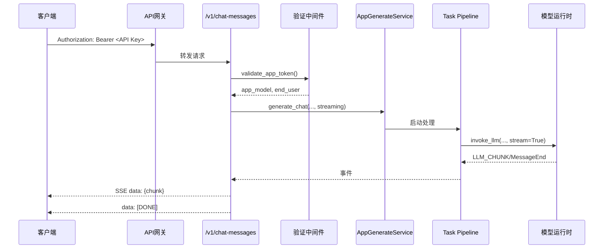
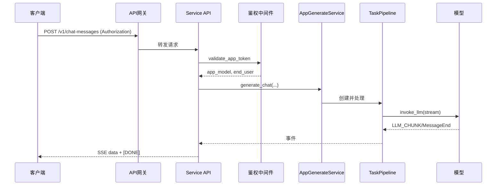
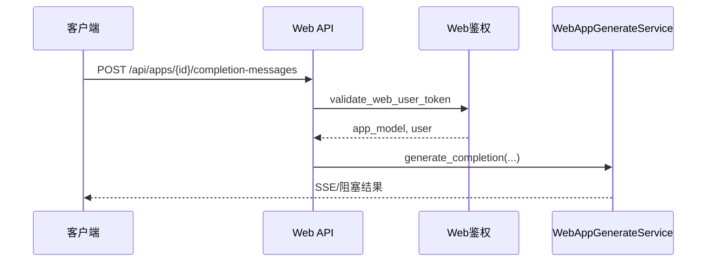
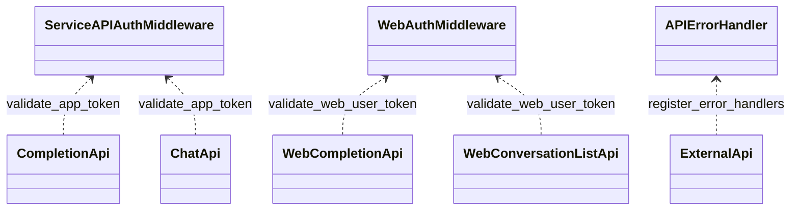

## 概述

Dify的控制器模块（`controllers/`）是平台的API接口层，采用分层设计实现了面向不同用户群体的API服务。该模块包含Console API（管理接口）、Service API（服务接口）、Web API（应用接口）三个主要层次，每层都有明确的职责分工和目标用户。

**API服务架构特点**：
Dify的API服务模块作为**后端业务中枢**，具有以下特点：

- **RESTful设计**：严格遵循REST架构风格，提供标准化的HTTP接口
- **Flask-RESTX框架**：通过...实现，支持自动API文档生成和参数验证
- **分层权限控制**：不同API层采用不同的认证和授权机制
- **流式响应支持**：原生支持Server-Sent Events (SSE)和WebSocket实时通信

**API网关设计模式**：

```python
# API路由配置示例
class APIGateway:
    """
    API网关统一配置
    实现请求路由、认证、限流和监控
    """
    
    def __init__(self):
        self.routes = {
            "/console/api": ConsoleAPIHandler,
            "/v1": ServiceAPIHandler, 
            "/api": WebAPIHandler,
            "/inner_api": InnerAPIHandler
        }
        
        # 中间件链配置
        self.middleware_chain = [
            AuthenticationMiddleware(),
            RateLimitingMiddleware(),
            RequestLoggingMiddleware(),
            CORSMiddleware(),
            ResponseFormattingMiddleware()
        ]
    
    def route_request(self, request: Request) -> Response:
        """
        智能路由请求到相应的API处理器
        """
        # 1. 中间件预处理
        for middleware in self.middleware_chain:
            request = middleware.pre_process(request)
        
        # 2. 路由匹配
        handler = self._match_handler(request.path)
        
        # 3. 处理请求
        response = handler.handle(request)
        
        # 4. 中间件后处理
        for middleware in reversed(self.middleware_chain):
            response = middleware.post_process(response)
        
        return response
```

**企业级API配置**：

```python
# 企业部署API配置优化
SERVICE_API_URL = "https://your-domain.com"  # 服务API基础URL
WEB_API_CORS_ALLOW_ORIGINS = ["https://your-frontend.com"]  # CORS配置
API_RATE_LIMIT_ENABLED = True                # 启用API限流
API_RATE_LIMIT_REQUESTS_PER_MINUTE = 1000    # 每分钟请求限制

# API安全配置
API_KEY_ENCRYPTION_ENABLED = True            # API Key加密存储
API_REQUEST_SIGNATURE_REQUIRED = False       # 请求签名验证
API_IP_WHITELIST_ENABLED = False            # IP白名单功能
```

### 1.3 Service API 鉴权与流式返回时序图



<!--more-->

## 1. 控制器模块整体架构

### 1.1 三层API架构图

```mermaid
graph TB
    subgraph "用户群体分层"
        AdminUsers[管理员用户]
        DeveloperUsers[开发者用户]
        EndUsers[最终用户]
        ExternalSystems[外部系统]
    end
    
    subgraph "API网关层"
        APIGateway[API网关]
        Authentication[认证中间件]
        RateLimiting[限流中间件]
        Logging[日志中间件]
    end
    
    subgraph "Console API Layer - 管理控制台"
        ConsoleAPI[Console API /console/api]
        
        subgraph "应用管理"
            AppManagement[应用管理]
            WorkflowManagement[工作流管理]
            DatasetManagement[数据集管理]
            ModelManagement[模型管理]
        end
        
        subgraph "系统管理"
            UserManagement[用户管理]
            TenantManagement[租户管理]
            BillingManagement[计费管理]
            SystemMonitoring[系统监控]
        end
        
        subgraph "配置管理"
            ProviderConfig[提供者配置]
            FeatureConfig[功能配置]
            SecurityConfig[安全配置]
            IntegrationConfig[集成配置]
        end
    end
    
    subgraph "Service API Layer - 应用服务"
        ServiceAPI[Service API /v1]
        
        subgraph "应用运行时"
            AppRuntime[应用运行时]
            CompletionAPI[文本完成API]
            ChatAPI[对话API]
            WorkflowAPI[工作流API]
        end
        
        subgraph "数据服务"
            DatasetAPI[数据集API]
            DocumentAPI[文档API]
            RetrievalAPI[检索API]
            MetadataAPI[元数据API]
        end
        
        subgraph "文件服务"
            FileUploadAPI[文件上传API]
            FilePreviewAPI[文件预览API]
            AudioAPI[音频API]
        end
    end
    
    subgraph "Web API Layer - 前端应用"
        WebAPI[Web API /api]
        
        subgraph "用户交互"
            ChatInterface[对话界面]
            AppInterface[应用界面]
            FileInterface[文件界面]
            UserAuth[用户认证]
        end
        
        subgraph "实时通信"
            StreamingAPI[流式API]
            WebSocketAPI[WebSocket API]
            SSEInterface[Server-Sent Events]
        end
    end
    
    subgraph "特殊API层"
        InnerAPI[Inner API - 内部服务]
        MCPAPI[MCP API - 模型控制协议]
    end
    
    AdminUsers --> APIGateway
    DeveloperUsers --> APIGateway
    EndUsers --> APIGateway
    ExternalSystems --> APIGateway
    
    APIGateway --> Authentication
    Authentication --> RateLimiting
    RateLimiting --> Logging
    
    Logging --> ConsoleAPI
    Logging --> ServiceAPI
    Logging --> WebAPI
    
    ConsoleAPI --> AppManagement
    ConsoleAPI --> SystemManagement
    ConsoleAPI --> ConfigManagement
    
    ServiceAPI --> AppRuntime
    ServiceAPI --> DatasetAPI
    ServiceAPI --> FileUploadAPI
    
    WebAPI --> ChatInterface
    WebAPI --> StreamingAPI
    
    style ConsoleAPI fill:#e3f2fd
    style ServiceAPI fill:#e8f5e8
    style WebAPI fill:#fff3e0
    style InnerAPI fill:#fce4ec
```



### 1.2 API分层职责

```typescript
// API分层职责定义
interface APILayerResponsibilities {
  // Console API - 管理控制台（/console/api）
  console: {
    target_users: ["系统管理员", "应用开发者", "租户管理员"];
    authentication: "基于会话的用户认证";
    primary_functions: [
      "应用配置和管理",
      "数据集创建和维护", 
      "用户和权限管理",
      "系统监控和统计",
      "模型提供者配置",
      "工作流设计和调试"
    ];
    response_format: "同步响应为主，部分支持流式";
    security_level: "高级 - 完整权限控制";
  };
  
  // Service API - 应用服务（/v1）
  service_api: {
    target_users: ["外部开发者", "第三方系统", "企业集成"];
    authentication: "API Key认证";
    primary_functions: [
      "应用运行时调用",
      "对话和文本生成",
      "数据集检索服务",
      "文件处理服务",
      "工作流执行"
    ];
    response_format: "支持同步和流式响应";
    security_level: "中等 - API Key隔离";
  };
  
  // Web API - 前端应用（/api）
  web_api: {
    target_users: ["最终用户", "Web应用", "移动应用"];
    authentication: "Bearer Token或会话认证";
    primary_functions: [
      "用户对话交互",
      "应用界面数据",
      "文件上传下载",
      "实时通信",
      "用户账户管理"
    ];
    response_format: "优化的前端响应格式";
    security_level: "标准 - 用户级权限";
  };
  
  // Inner API - 内部服务
  inner_api: {
    target_users: ["内部微服务", "系统组件"];
    authentication: "内部服务认证";
    primary_functions: [
      "服务间通信",
      "内部数据同步",
      "系统集成"
    ];
    response_format: "轻量级内部协议";
    security_level: "内部 - 服务间信任";
  };
}
```

## 2. Console API解析

### 2.1 Console API架构

Console API是面向管理员和开发者的核心管理接口：

```python
# Console API Blueprint配置
bp = Blueprint("console", __name__, url_prefix="/console/api")

api = ExternalApi(
    bp,
    version="1.0", 
    title="Console API",
    description="Console management APIs for app configuration, monitoring, and administration",
)

# Console命名空间
console_ns = Namespace("console", description="Console management API operations", path="/")

class ConsoleAPIRouter:
    """
    Console API路由管理器
    负责组织和注册Console API的所有路由
    """
    
    def __init__(self, api: ExternalApi):
        """
        初始化Console API路由
        
        Args:
            api: ExternalApi实例
        """
        self.api = api
        self._register_core_routes()
        self._register_app_routes() 
        self._register_dataset_routes()
        self._register_workspace_routes()
        self._register_auth_routes()

    def _register_core_routes(self):
        """注册核心路由"""
        
        # 系统管理路由
        self.api.add_resource(SetupApi, "/setup")
        self.api.add_resource(PingApi, "/ping") 
        self.api.add_resource(VersionApi, "/version")
        self.api.add_resource(FeatureApi, "/features")
        
        # 文件管理路由
        self.api.add_resource(FileApi, "/files/upload")
        self.api.add_resource(FilePreviewApi, "/files/<uuid:file_id>/preview")
        self.api.add_resource(FileSupportTypeApi, "/files/support-type")
        
        # 远程文件路由
        self.api.add_resource(RemoteFileInfoApi, "/remote-files/<path:url>")
        self.api.add_resource(RemoteFileUploadApi, "/remote-files/upload")

    def _register_app_routes(self):
        """注册应用管理路由"""
        
        # 应用CRUD操作
        from .app import app, workflow, message, conversation
        
        # 应用基础管理
        self.api.add_resource(AppListApi, "/apps")
        self.api.add_resource(AppApi, "/apps/<uuid:app_id>")
        self.api.add_resource(AppCreateApi, "/apps")
        
        # 工作流管理
        self.api.add_resource(WorkflowListApi, "/apps/<uuid:app_id>/workflows")
        self.api.add_resource(WorkflowApi, "/apps/<uuid:app_id>/workflows/<uuid:workflow_id>")
        
        # 消息和对话管理
        self.api.add_resource(MessageListApi, "/apps/<uuid:app_id>/messages")
        self.api.add_resource(ConversationListApi, "/apps/<uuid:app_id>/conversations")

    def _register_dataset_routes(self):
        """注册数据集管理路由"""
        
        from .datasets import datasets, datasets_document, datasets_segments
        
        # 数据集CRUD
        self.api.add_resource(DatasetListApi, "/datasets")
        self.api.add_resource(DatasetApi, "/datasets/<uuid:dataset_id>")
        
        # 文档管理
        self.api.add_resource(DocumentListApi, "/datasets/<uuid:dataset_id>/documents")
        self.api.add_resource(DocumentApi, "/datasets/<uuid:dataset_id>/documents/<uuid:document_id>")
        
        # 段落管理
        self.api.add_resource(SegmentListApi, "/datasets/<uuid:dataset_id>/segments")

    def _register_workspace_routes(self):
        """注册工作空间管理路由"""
        
        from .workspace import workspace, account, model_providers
        
        # 工作空间管理
        self.api.add_resource(WorkspaceApi, "/workspaces/current")
        self.api.add_resource(AccountApi, "/account")
        
        # 模型提供者配置
        self.api.add_resource(ModelProviderListApi, "/workspaces/current/model-providers")
        self.api.add_resource(ModelProviderApi, "/workspaces/current/model-providers/<string:provider>")

    def _register_auth_routes(self):
        """注册认证相关路由"""
        
        from .auth import login, oauth, forgot_password
        
        # 用户认证
        self.api.add_resource(LoginApi, "/login")
        self.api.add_resource(LogoutApi, "/logout")
        self.api.add_resource(ForgotPasswordApi, "/forgot-password")
        
        # OAuth认证
        self.api.add_resource(OAuthApi, "/oauth")

@console_ns.route("/apps")
class AppListApi(Resource):
    """
    应用列表API
    提供应用的分页查询、过滤和管理功能
    """
    
    @api.doc("list_apps")
    @api.doc(description="获取应用列表，支持分页和多种过滤条件")
    @api.expect(
        api.parser()
        .add_argument("page", type=int, location="args", help="页码 (1-99999)", default=1)
        .add_argument("limit", type=int, location="args", help="页大小 (1-100)", default=20)
        .add_argument(
            "mode", type=str, location="args",
            choices=["completion", "chat", "advanced-chat", "workflow", "agent-chat", "channel", "all"],
            default="all", help="应用模式过滤"
        )
        .add_argument("name", type=str, location="args", help="按应用名称过滤")
        .add_argument("tag_ids", type=str, location="args", help="逗号分隔的标签ID")
        .add_argument("is_created_by_me", type=bool, location="args", help="只显示我创建的应用")
    )
    @api.response(200, "Success", app_pagination_fields)
    @setup_required
    @login_required
    @account_initialization_required  
    @enterprise_license_required
    def get(self):
        """
        获取应用列表
        支持多维度过滤和分页查询
        
        Returns:
            分页的应用列表，包含应用基本信息和统计数据
        """
        # 参数解析和验证
        parser = reqparse.RequestParser()
        parser.add_argument("page", type=inputs.int_range(1, 99999), default=1)
        parser.add_argument("limit", type=inputs.int_range(1, 100), default=20)
        parser.add_argument("mode", type=str, choices=ALLOWED_APP_MODES, default="all")
        parser.add_argument("name", type=str)
        parser.add_argument("tag_ids", type=self._parse_uuid_list)
        parser.add_argument("is_created_by_me", type=inputs.boolean)
        
        args = parser.parse_args()

        # 业务逻辑调用
        app_service = AppService()
        app_pagination = app_service.get_paginate_apps(
            user_id=current_user.id,
            tenant_id=current_user.current_tenant_id,
            args=args
        )
        
        # 返回格式化结果
        if not app_pagination:
            return {
                "data": [], 
                "total": 0, 
                "page": 1, 
                "limit": 20, 
                "has_more": False
            }
        
        return marshal(app_pagination, app_pagination_fields)

    @api.doc("create_app")
    @api.doc(description="创建新应用")
    @api.expect(app_create_fields)
    @api.response(201, "应用创建成功", app_detail_fields)
    @api.response(400, "请求参数错误")
    @setup_required
    @login_required
    @account_initialization_required
    @cloud_edition_billing_resource_check("apps")
    def post(self):
        """
        创建新应用
        支持多种应用类型的创建
        
        Returns:
            创建的应用详细信息
        """
        # 参数解析
        parser = reqparse.RequestParser()
        parser.add_argument("name", type=str, required=True, help="应用名称")
        parser.add_argument("icon", type=str, help="应用图标")
        parser.add_argument("icon_background", type=str, help="图标背景色")
        parser.add_argument(
            "mode", type=str, required=True,
            choices=ALLOW_CREATE_APP_MODES,
            help="应用模式"
        )
        parser.add_argument(
            "description", type=self._validate_description_length,
            help="应用描述"
        )
        
        args = parser.parse_args()

        # 创建应用
        try:
            app_service = AppService()
            app = app_service.create_app(
                tenant_id=current_user.current_tenant_id,
                app_name=args["name"],
                app_mode=args["mode"],
                icon=args.get("icon"),
                icon_background=args.get("icon_background"),
                description=args.get("description"),
                account=current_user
            )
            
            return marshal(app, app_detail_fields), 201
            
        except ValueError as e:
            raise BadRequest(str(e))
        except Exception as e:
            logger.exception("创建应用失败")
            raise InternalServerError("应用创建失败")

    def _validate_description_length(self, description: str) -> str:
        """
        验证描述长度
        
        Args:
            description: 应用描述
            
        Returns:
            str: 验证后的描述
            
        Raises:
            ValueError: 描述长度超限
        """
        if description and len(description) > 400:
            raise ValueError("应用描述不能超过400个字符")
        return description

    def _parse_uuid_list(self, value: str) -> list[str]:
        """
        解析UUID列表
        
        Args:
            value: 逗号分隔的UUID字符串
            
        Returns:
            list[str]: UUID列表
            
        Raises:
            ValueError: UUID格式错误
        """
        try:
            return [str(uuid.UUID(v)) for v in value.split(",")]
        except ValueError:
            abort(400, message="标签ID格式错误")

@console_ns.route("/apps/<uuid:app_id>")
class AppApi(Resource):
    """
    单个应用API
    提供应用的详细信息查询、更新和删除功能
    """
    
    @api.doc("get_app")
    @api.doc(description="获取应用详细信息")
    @api.response(200, "Success", app_detail_fields_with_site)
    @api.response(404, "应用不存在")
    @setup_required
    @login_required
    @account_initialization_required
    @get_app_model
    def get(self, app_model: App):
        """
        获取应用详细信息
        包含应用配置、统计数据和站点信息
        
        Args:
            app_model: 应用模型实例（通过装饰器注入）
            
        Returns:
            应用详细信息，包含所有配置和统计数据
        """
        try:
            # 获取应用服务
            app_service = AppService()
            
            # 获取应用详细信息
            app_detail = app_service.get_app_detail(
                app_id=app_model.id,
                user_id=current_user.id,
                tenant_id=current_user.current_tenant_id
            )
            
            # 获取应用站点信息
            site_info = app_service.get_app_site_info(app_model.id)
            
            # 合并信息
            app_data = marshal(app_detail, app_detail_fields)
            if site_info:
                app_data.update(marshal(site_info, site_fields))
            
            return app_data, 200
            
        except Exception as e:
            logger.exception(f"获取应用 {app_model.id} 详情失败")
            raise InternalServerError("获取应用信息失败")

    @api.doc("update_app")
    @api.doc(description="更新应用信息")
    @api.expect(app_update_fields)
    @api.response(200, "更新成功", app_detail_fields)
    @setup_required
    @login_required
    @account_initialization_required
    @get_app_model
    def put(self, app_model: App):
        """
        更新应用信息
        支持应用名称、描述、图标等基础信息的更新
        
        Args:
            app_model: 应用模型实例
            
        Returns:
            更新后的应用信息
        """
        # 参数解析
        parser = reqparse.RequestParser()
        parser.add_argument("name", type=str, help="应用名称")
        parser.add_argument("description", type=self._validate_description, help="应用描述")
        parser.add_argument("icon", type=str, help="应用图标")
        parser.add_argument("icon_background", type=str, help="图标背景色")
        
        args = parser.parse_args()

        try:
            # 更新应用
            app_service = AppService()
            updated_app = app_service.update_app(
                app_id=app_model.id,
                tenant_id=current_user.current_tenant_id,
                account=current_user,
                **args
            )
            
            return marshal(updated_app, app_detail_fields), 200
            
        except ValueError as e:
            raise BadRequest(str(e))
        except Exception as e:
            logger.exception(f"更新应用 {app_model.id} 失败")
            raise InternalServerError("更新应用失败")

    @api.doc("delete_app")
    @api.doc(description="删除应用")
    @api.response(204, "删除成功")
    @api.response(404, "应用不存在")
    @setup_required
    @login_required
    @account_initialization_required
    @get_app_model
    def delete(self, app_model: App):
        """
        删除应用
        软删除应用，保留历史数据
        
        Args:
            app_model: 应用模型实例
        """
        try:
            app_service = AppService()
            app_service.delete_app(
                app_id=app_model.id,
                user_id=current_user.id,
                tenant_id=current_user.current_tenant_id
            )
            
            return "", 204
            
        except Exception as e:
            logger.exception(f"删除应用 {app_model.id} 失败")
            raise InternalServerError("删除应用失败")

class ConsoleAuthMiddleware:
    """
    Console API认证中间件
    处理用户会话认证和权限验证
    """
    
    @staticmethod
    def setup_required(f):
        """
        系统初始化检查装饰器
        确保系统已完成初始设置
        """
        def decorated(*args, **kwargs):
            # 检查系统是否已初始化
            if not SystemSetupService.is_setup_completed():
                return {"message": "系统未完成初始化设置"}, 412
            
            return f(*args, **kwargs)
        
        return decorated

    @staticmethod
    def login_required(f):
        """
        登录认证装饰器
        确保用户已登录
        """
        def decorated(*args, **kwargs):
            if not current_user.is_authenticated:
                return {"message": "未登录或会话已过期"}, 401
            
            return f(*args, **kwargs)
        
        return decorated

    @staticmethod
    def account_initialization_required(f):
        """
        账户初始化检查装饰器
        确保用户账户已完成初始化
        """
        def decorated(*args, **kwargs):
            if not current_user.is_initialized:
                return {"message": "账户未完成初始化"}, 400
            
            return f(*args, **kwargs)
        
        return decorated

    @staticmethod
    def enterprise_license_required(f):
        """
        企业许可证检查装饰器
        检查企业功能的许可证状态
        """
        def decorated(*args, **kwargs):
            if not EnterpriseService.check_license_valid():
                return {"message": "需要有效的企业许可证"}, 403
            
            return f(*args, **kwargs)
        
        return decorated

    @staticmethod
    def cloud_edition_billing_resource_check(resource_type: str):
        """
        云版本计费资源检查装饰器
        检查租户的资源使用限额
        
        Args:
            resource_type: 资源类型（如"apps", "datasets"等）
        """
        def decorator(f):
            def decorated(*args, **kwargs):
                # 检查资源配额
                if not BillingService.check_resource_quota(
                    tenant_id=current_user.current_tenant_id,
                    resource_type=resource_type
                ):
                    return {"message": f"已达到{resource_type}资源配额限制"}, 429
                
                return f(*args, **kwargs)
            
            return decorated
        return decorator

    @staticmethod  
    def admin_required(f):
        """
        管理员权限检查装饰器
        确保当前用户具有管理员权限
        """
        def decorated(*args, **kwargs):
            if not current_user.is_admin:
                return {"message": "需要管理员权限"}, 403
            
            return f(*args, **kwargs)
        
        return decorated
```

## 3. Service API解析

### 3.1 Service API架构

Service API是面向外部开发者和第三方系统的服务接口：

```python
# Service API Blueprint配置
bp = Blueprint("service_api", __name__, url_prefix="/v1")

api = ExternalApi(
    bp,
    version="1.0",
    title="Service API", 
    description="API for application services",
)

service_api_ns = Namespace("service_api", description="Service operations", path="/")

@service_api_ns.route("/completion-messages")
class CompletionApi(Resource):
    """
    文本完成API
    提供基于提示的文本生成服务
    """
    
    @service_api_ns.expect(completion_parser)
    @service_api_ns.doc("create_completion")
    @service_api_ns.doc(description="基于给定提示创建文本完成")
    @service_api_ns.doc(
        responses={
            200: "完成创建成功",
            400: "请求参数错误",
            401: "API令牌无效",
            404: "应用不存在",
            500: "内部服务器错误",
        }
    )
    @validate_app_token(fetch_user_arg=FetchUserArg(fetch_from=WhereisUserArg.JSON, required=True))
    def post(self, app_model: App, end_user: EndUser):
        """
        创建文本完成
        根据提供的输入和查询生成文本完成结果
        
        Args:
            app_model: 应用模型实例（通过装饰器注入）
            end_user: 最终用户实例（通过装饰器注入）
            
        Returns:
            文本完成结果，支持同步和流式两种模式
        """
        # 验证应用类型
        if app_model.mode != AppMode.COMPLETION:
            raise AppUnavailableError("应用类型不是completion")

        # 解析请求参数
        args = completion_parser.parse_args()
        
        # 参数验证
        self._validate_completion_params(args)

        try:
            # 调用应用生成服务
            response = AppGenerateService.generate(
                app_model=app_model,
                user=end_user,
                args=args,
                invoke_from=InvokeFrom.SERVICE_API,
                streaming=args["response_mode"] == "streaming"
            )

            # 根据响应模式返回结果
            if args["response_mode"] == "streaming":
                # 流式响应
                return Response(
                    stream_with_context(response),
                    status=200,
                    mimetype="text/event-stream",
                    headers={
                        "Cache-Control": "no-cache",
                        "Connection": "keep-alive",
                        "Access-Control-Allow-Origin": "*",
                    }
                )
            else:
                # 阻塞式响应
                return response, 200

        except CompletionRequestError as e:
            raise BadRequest(str(e))
        except ProviderNotInitializeError as e:
            raise BadRequest(f"模型提供者未初始化: {e}")
        except ProviderQuotaExceededError as e:
            raise BadRequest(f"提供者配额超出: {e}")
        except Exception as e:
            logger.exception("文本完成API调用失败")
            raise InternalServerError("服务暂时不可用")

    def _validate_completion_params(self, args: dict):
        """
        验证完成参数
        
        Args:
            args: 请求参数字典
            
        Raises:
            BadRequest: 参数验证失败
        """
        # 检查必填参数
        if not args.get("inputs"):
            raise BadRequest("inputs参数是必需的")
        
        # 检查文件参数格式
        if args.get("files"):
            if not isinstance(args["files"], list):
                raise BadRequest("files参数必须是列表格式")
            
            # 验证文件格式
            for file_info in args["files"]:
                if not isinstance(file_info, dict):
                    raise BadRequest("文件信息格式错误")
                
                required_fields = ["type", "transfer_method"]
                for field in required_fields:
                    if field not in file_info:
                        raise BadRequest(f"文件信息缺少必填字段: {field}")

@service_api_ns.route("/chat-messages")
class ChatApi(Resource):
    """
    对话API  
    提供多轮对话交互服务
    """
    
    @service_api_ns.expect(chat_parser)
    @service_api_ns.doc("create_chat_message")
    @service_api_ns.doc(description="创建新的对话消息")
    @validate_app_token(fetch_user_arg=FetchUserArg(fetch_from=WhereisUserArg.JSON, required=True))
    def post(self, app_model: App, end_user: EndUser):
        """
        创建对话消息
        支持多轮对话上下文管理和流式响应
        
        Args:
            app_model: 应用模型实例
            end_user: 最终用户实例
            
        Returns:
            对话响应，包含AI回复和对话状态
        """
        # 验证应用类型
        if app_model.mode not in [AppMode.CHAT, AppMode.AGENT_CHAT, AppMode.ADVANCED_CHAT]:
            raise NotChatAppError("应用类型不支持对话")

        args = chat_parser.parse_args()
        
        # 参数验证
        self._validate_chat_params(args)

        try:
            # 处理对话ID（新建或续接对话）
            conversation_id = args.get("conversation_id")
            if conversation_id:
                # 验证对话存在性和权限
                self._validate_conversation_access(conversation_id, end_user.id)

            # 调用对话生成服务
            response = AppGenerateService.generate_chat(
                app_model=app_model,
                user=end_user,
                conversation_id=conversation_id,
                query=args["query"],
                inputs=args["inputs"],
                files=args.get("files", []),
                response_mode=args["response_mode"],
                auto_generate_name=args.get("auto_generate_name", True),
                invoke_from=InvokeFrom.SERVICE_API
            )

            # 处理流式响应
            if args["response_mode"] == "streaming":
                return self._create_streaming_response(response)
            else:
                return response, 200

        except ConversationCompletedError:
            raise BadRequest("对话已结束，无法继续")
        except InvokeRateLimitError:
            raise InvokeRateLimitHttpError("调用频率超限，请稍后重试")
        except Exception as e:
            logger.exception("对话API调用失败")
            raise InternalServerError("对话服务暂时不可用")

    def _validate_chat_params(self, args: dict):
        """验证对话参数"""
        if not args.get("query"):
            raise BadRequest("query参数是必需的")
        
        if not args.get("inputs"):
            raise BadRequest("inputs参数是必需的")

    def _validate_conversation_access(self, conversation_id: str, user_id: str):
        """验证对话访问权限"""
        conversation_service = ConversationService()
        conversation = conversation_service.get_conversation(conversation_id)
        
        if not conversation:
            raise NotFound("对话不存在")
        
        if conversation.from_end_user_id != user_id:
            raise Forbidden("无权限访问该对话")

    def _create_streaming_response(self, response_generator):
        """创建流式响应"""
        def generate():
            try:
                for chunk in response_generator:
                    yield f"data: {json.dumps(chunk, ensure_ascii=False)}\n\n"
                yield "data: [DONE]\n\n"
            except Exception as e:
                error_data = {"error": str(e)}
                yield f"data: {json.dumps(error_data, ensure_ascii=False)}\n\n"

        return Response(
            generate(),
            status=200,
            mimetype="text/event-stream",
            headers={
                "Cache-Control": "no-cache",
                "Connection": "keep-alive",
                "Access-Control-Allow-Origin": "*",
            }
        )

class ServiceAPIAuthMiddleware:
    """
    Service API认证中间件
    基于API Key的认证和授权机制
    """
    
    @staticmethod
    def validate_app_token(fetch_user_arg: FetchUserArg):
        """
        应用Token验证装饰器
        验证API Key的有效性并获取关联的应用和用户信息
        
        Args:
            fetch_user_arg: 用户获取参数配置
        """
        def decorator(f):
            def decorated(*args, **kwargs):
                # 获取API Key
                api_key = request.headers.get("Authorization")
                if not api_key:
                    return {"message": "缺少Authorization头"}, 401
                
                # 移除Bearer前缀
                if api_key.startswith("Bearer "):
                    api_key = api_key[7:]
                
                try:
                    # 验证API Key并获取应用信息
                    app_service = AppService()
                    app_model, end_user = app_service.validate_api_key(
                        api_key=api_key,
                        fetch_user_arg=fetch_user_arg
                    )
                    
                    # 检查应用状态
                    if not app_model.is_enabled:
                        return {"message": "应用已禁用"}, 403
                    
                    # 将应用和用户信息注入到参数中
                    kwargs["app_model"] = app_model
                    kwargs["end_user"] = end_user
                    
                    return f(*args, **kwargs)
                    
                except InvalidAPIKeyError:
                    return {"message": "无效的API Key"}, 401
                except AppNotFoundError:
                    return {"message": "应用不存在"}, 404
                except Exception as e:
                    logger.exception("API Key验证失败")
                    return {"message": "认证服务异常"}, 500
            
            return decorated
        return decorator

    @staticmethod
    def rate_limit(calls_per_minute: int = 60):
        """
        API调用频率限制装饰器
        
        Args:
            calls_per_minute: 每分钟允许的调用次数
        """
        def decorator(f):
            def decorated(*args, **kwargs):
                # 获取客户端标识
                client_id = request.headers.get("X-Client-ID") or request.remote_addr
                
                # 检查调用频率
                rate_limiter = RateLimiter()
                if not rate_limiter.allow_request(client_id, calls_per_minute):
                    return {
                        "message": f"调用频率超限，每分钟最多{calls_per_minute}次"
                    }, 429
                
                return f(*args, **kwargs)
            
            return decorated
        return decorator

class RateLimiter:
    """
    API调用频率限制器
    通过...实现
    """
    
    def __init__(self):
        self.redis_client = redis_client

    def allow_request(self, client_id: str, limit: int, window: int = 60) -> bool:
        """
        检查是否允许请求
        
        Args:
            client_id: 客户端标识
            limit: 限制次数
            window: 时间窗口（秒）
            
        Returns:
            bool: 是否允许请求
        """
        current_time = int(time.time())
        key = f"rate_limit:{client_id}:{current_time // window}"
        
        # 获取当前窗口的请求计数
        current_count = self.redis_client.get(key)
        current_count = int(current_count) if current_count else 0
        
        if current_count >= limit:
            return False
        
        # 增加计数并设置过期时间
        pipe = self.redis_client.pipeline()
        pipe.incr(key)
        pipe.expire(key, window)
        pipe.execute()
        
        return True
```

## 4. Web API解析

### 4.1 Web API架构

Web API专门为前端应用设计，提供优化的用户体验：

```python
# Web API Blueprint配置
bp = Blueprint("web", __name__, url_prefix="/api")

api = ExternalApi(
    bp,
    version="1.0",
    title="Web API",
    description="Public APIs for web applications including file uploads, chat interactions, and app management",
)

web_ns = Namespace("web", description="Web application API operations", path="/")

@web_ns.route("/apps/<uuid:app_id>/completion-messages")
class WebCompletionApi(Resource):
    """
    Web文本完成API
    为前端应用优化的文本完成接口
    """
    
    @api.doc("web_create_completion")
    @api.doc(description="为Web应用创建文本完成")
    @validate_web_user_token
    def post(self, app_model: App, user: Account):
        """
        Web文本完成
        针对前端用户体验优化的文本生成接口
        
        Args:
            app_model: 应用模型
            user: 用户账户
            
        Returns:
            优化格式的完成结果
        """
        # 解析请求数据
        data = request.get_json()
        
        # 参数验证
        self._validate_web_completion_params(data)
        
        try:
            # 生成文本完成
            response = WebAppGenerateService.generate_completion(
                app_model=app_model,
                user=user,
                inputs=data["inputs"],
                query=data.get("query", ""),
                files=data.get("files", []),
                streaming=data.get("streaming", True)
            )
            
            # 根据是否流式返回不同格式
            if data.get("streaming", True):
                return self._stream_response(response)
            else:
                return self._blocking_response(response)
                
        except Exception as e:
            logger.exception("Web完成API失败")
            return {"error": "服务暂时不可用"}, 500

    def _validate_web_completion_params(self, data: dict):
        """验证Web完成参数"""
        if not data:
            raise BadRequest("请求体不能为空")
        
        if "inputs" not in data:
            raise BadRequest("缺少inputs参数")

    def _stream_response(self, response_generator):
        """处理流式响应"""
        def generate():
            for chunk in response_generator:
                # 为前端优化响应格式
                web_chunk = {
                    "event": chunk.get("event", "message"),
                    "data": chunk.get("data", {}),
                    "timestamp": time.time()
                }
                yield f"data: {json.dumps(web_chunk, ensure_ascii=False)}\n\n"
            
            # 发送结束标记
            yield "data: [DONE]\n\n"

        return Response(
            generate(),
            mimetype="text/event-stream",
            headers={
                "Cache-Control": "no-cache",
                "Connection": "keep-alive",
                "X-Accel-Buffering": "no",  # 禁用nginx缓冲
            }
        )

    def _blocking_response(self, response):
        """处理阻塞式响应"""
        # 为前端优化响应格式
        return {
            "result": response,
            "metadata": {
                "request_id": str(uuid.uuid4()),
                "timestamp": time.time(),
                "model_info": response.get("metadata", {})
            }
        }

@web_ns.route("/apps/<uuid:app_id>/conversations")
class WebConversationListApi(Resource):
    """
    Web对话列表API
    为前端优化的对话管理接口
    """
    
    @api.doc("get_web_conversations")
    @api.doc(description="获取用户的对话列表")
    @validate_web_user_token
    def get(self, app_model: App, user: Account):
        """
        获取对话列表
        返回用户在该应用下的所有对话
        
        Args:
            app_model: 应用模型
            user: 用户账户
            
        Returns:
            对话列表，包含对话摘要和状态
        """
        # 获取分页参数
        page = request.args.get("page", 1, type=int)
        limit = request.args.get("limit", 20, type=int)
        
        # 参数验证
        if page < 1 or limit < 1 or limit > 100:
            raise BadRequest("分页参数错误")

        try:
            # 获取对话服务
            conversation_service = WebConversationService()
            
            # 获取对话列表
            conversations = conversation_service.get_user_conversations(
                app_id=app_model.id,
                user_id=user.id,
                page=page,
                limit=limit
            )
            
            # 格式化返回结果
            return {
                "data": [
                    {
                        "id": conv.id,
                        "name": conv.name,
                        "created_at": conv.created_at.isoformat(),
                        "updated_at": conv.updated_at.isoformat(),
                        "message_count": conv.message_count,
                        "status": conv.status,
                        "is_pinned": conv.is_pinned,
                        "summary": conv.summary
                    }
                    for conv in conversations.items
                ],
                "total": conversations.total,
                "page": page,
                "limit": limit,
                "has_more": conversations.has_next
            }
            
        except Exception as e:
            logger.exception("获取对话列表失败")
            return {"error": "服务暂时不可用"}, 500

class WebAuthMiddleware:
    """
    Web API认证中间件
    支持多种认证方式的前端认证机制
    """
    
    @staticmethod
    def validate_web_user_token(f):
        """
        Web用户Token验证装饰器
        支持Bearer Token和会话认证
        """
        def decorated(*args, **kwargs):
            # 尝试Bearer Token认证
            auth_header = request.headers.get("Authorization")
            if auth_header and auth_header.startswith("Bearer "):
                token = auth_header[7:]
                
                try:
                    # 验证访问令牌
                    user_info = JWTTokenService.decode_access_token(token)
                    
                    # 获取用户和应用信息
                    user = AccountService.get_user_by_id(user_info["user_id"])
                    app_model = AppService.get_app_by_id(kwargs.get("app_id"))
                    
                    if not user or not app_model:
                        return {"message": "用户或应用不存在"}, 404
                    
                    kwargs["user"] = user
                    kwargs["app_model"] = app_model
                    
                    return f(*args, **kwargs)
                    
                except JWTTokenExpiredError:
                    return {"message": "访问令牌已过期"}, 401
                except JWTTokenInvalidError:
                    return {"message": "无效的访问令牌"}, 401
            
            # 尝试会话认证
            elif current_user.is_authenticated:
                # 使用会话中的用户信息
                app_model = AppService.get_app_by_id(kwargs.get("app_id"))
                
                if not app_model:
                    return {"message": "应用不存在"}, 404
                
                # 检查用户对应用的访问权限
                if not AppService.check_user_app_access(current_user, app_model):
                    return {"message": "无权限访问该应用"}, 403
                
                kwargs["user"] = current_user
                kwargs["app_model"] = app_model
                
                return f(*args, **kwargs)
            
            else:
                return {"message": "未提供有效的认证信息"}, 401
        
        return decorated

    @staticmethod
    def cors_handler(f):
        """
        CORS处理装饰器
        处理跨域请求
        """
        def decorated(*args, **kwargs):
            # 处理预检请求
            if request.method == "OPTIONS":
                response = make_response()
                response.headers["Access-Control-Allow-Origin"] = "*"
                response.headers["Access-Control-Allow-Methods"] = "GET, POST, PUT, DELETE, OPTIONS"
                response.headers["Access-Control-Allow-Headers"] = "Content-Type, Authorization"
                response.headers["Access-Control-Max-Age"] = "3600"
                return response
            
            # 执行实际请求
            result = f(*args, **kwargs)
            
            # 添加CORS头
            if isinstance(result, tuple):
                response_data, status_code = result
                response = make_response(response_data, status_code)
            else:
                response = make_response(result)
            
            response.headers["Access-Control-Allow-Origin"] = "*"
            response.headers["Access-Control-Allow-Credentials"] = "true"
            
            return response
        
        return decorated
```

## API治理与流控

**生产级API治理能力**：
- 认证鉴权：API Key、JWT、Workspace作用域
- 配额与限流：令牌桶/漏桶，按租户/用户/应用维度
- 熔断与降级：上游模型/向量DB异常时自动快速失败+回退
- 幂等与重试：Idempotency-Key、指数退避、最大尝试次数
- 审计与追踪：Request-ID、全链路Trace、风险事件审计

```python
class ApiGovernance:
    """API治理策略汇总（示意）"""
    def rate_limit(self, key: str) -> bool:
        return TokenBucket(capacity=1000, refill_rate=200).allow(key)

    def circuit_breaker(self, resource: str):
        return CircuitBreaker(
            failure_threshold=0.2,
            recovery_timeout=30,
            half_open_max_calls=10,
        )

    def idempotency(self, idempotency_key: str) -> bool:
        return RedisSETNX(f"idem:{idempotency_key}", ttl=600)
```

## 5. API统一错误处理

### 5.1 分层错误处理机制

```python
class APIErrorHandler:
    """
    API统一错误处理器
    为不同API层提供一致的错误处理和响应格式
    """
    
    # 错误代码映射
    ERROR_CODE_MAPPING = {
        # 客户端错误 4xx
        BadRequest: 400,
        Unauthorized: 401, 
        Forbidden: 403,
        NotFound: 404,
        MethodNotAllowed: 405,
        Conflict: 409,
        UnprocessableEntity: 422,
        TooManyRequests: 429,
        
        # 服务器错误 5xx
        InternalServerError: 500,
        BadGateway: 502,
        ServiceUnavailable: 503,
        GatewayTimeout: 504,
        
        # 业务错误
        AppUnavailableError: 400,
        ProviderNotInitializeError: 400,
        ProviderQuotaExceededError: 429,
        ModelCurrentlyNotSupportError: 400,
        InvokeRateLimitError: 429,
    }

    @classmethod
    def register_error_handlers(cls, api: ExternalApi, api_type: str):
        """
        注册错误处理器
        为不同API类型注册相应的错误处理逻辑
        
        Args:
            api: ExternalApi实例
            api_type: API类型（console, service_api, web）
        """
        
        @api.errorhandler(Exception)
        def handle_general_exception(e: Exception):
            """处理通用异常"""
            error_id = str(uuid.uuid4())
            
            # 记录错误日志
            logger.exception(f"API异常 [{error_id}]: {e}")
            
            # 根据API类型返回不同格式的错误响应
            if api_type == "console":
                return cls._format_console_error(e, error_id)
            elif api_type == "service_api":
                return cls._format_service_api_error(e, error_id)
            elif api_type == "web":
                return cls._format_web_error(e, error_id)
            else:
                return cls._format_default_error(e, error_id)

        @api.errorhandler(ValidationError)
        def handle_validation_error(e: ValidationError):
            """处理参数验证错误"""
            return cls._format_validation_error(e, api_type)

        @api.errorhandler(InvokeError)
        def handle_invoke_error(e: InvokeError):
            """处理模型调用错误"""
            return cls._format_invoke_error(e, api_type)

    @classmethod
    def _format_console_error(cls, error: Exception, error_id: str) -> tuple[dict, int]:
        """
        格式化Console API错误响应
        
        Args:
            error: 异常对象
            error_id: 错误ID
            
        Returns:
            tuple[dict, int]: (错误响应, HTTP状态码)
        """
        status_code = cls.ERROR_CODE_MAPPING.get(type(error), 500)
        
        error_response = {
            "error": {
                "type": error.__class__.__name__,
                "message": str(error),
                "error_id": error_id,
                "timestamp": time.time(),
                "details": getattr(error, 'details', None)
            }
        }
        
        # 在调试模式下添加堆栈跟踪
        if dify_config.DEBUG:
            import traceback
            error_response["error"]["traceback"] = traceback.format_exc()
        
        return error_response, status_code

    @classmethod
    def _format_service_api_error(cls, error: Exception, error_id: str) -> tuple[dict, int]:
        """
        格式化Service API错误响应
        遵循标准的API错误格式
        
        Args:
            error: 异常对象
            error_id: 错误ID
            
        Returns:
            tuple[dict, int]: (错误响应, HTTP状态码)
        """
        status_code = cls.ERROR_CODE_MAPPING.get(type(error), 500)
        
        # Service API使用标准错误格式
        error_response = {
            "error": {
                "code": error.__class__.__name__,
                "message": str(error),
                "request_id": error_id,
                "type": "api_error"
            }
        }
        
        # 添加错误详情（如果有）
        if hasattr(error, 'error_code'):
            error_response["error"]["error_code"] = error.error_code
        
        if hasattr(error, 'param'):
            error_response["error"]["param"] = error.param
        
        return error_response, status_code

    @classmethod
    def _format_web_error(cls, error: Exception, error_id: str) -> tuple[dict, int]:
        """
        格式化Web API错误响应
        为前端用户提供友好的错误信息
        
        Args:
            error: 异常对象
            error_id: 错误ID
            
        Returns:
            tuple[dict, int]: (错误响应, HTTP状态码)
        """
        status_code = cls.ERROR_CODE_MAPPING.get(type(error), 500)
        
        # 获取用户友好的错误消息
        user_message = cls._get_user_friendly_message(error)
        
        error_response = {
            "success": False,
            "message": user_message,
            "error_code": error.__class__.__name__,
            "request_id": error_id
        }
        
        return error_response, status_code

    @classmethod
    def _get_user_friendly_message(cls, error: Exception) -> str:
        """
        获取用户友好的错误消息
        将技术错误转换为用户可理解的消息
        
        Args:
            error: 异常对象
            
        Returns:
            str: 用户友好的错误消息
        """
        error_messages = {
            ProviderNotInitializeError: "AI模型服务未配置，请联系管理员",
            ProviderQuotaExceededError: "AI模型调用配额已用完，请稍后重试",
            InvokeRateLimitError: "请求过于频繁，请稍后重试",
            ModelCurrentlyNotSupportError: "当前模型暂不支持该功能",
            AppUnavailableError: "应用暂时不可用",
            NetworkError: "网络连接异常，请检查网络设置",
            TimeoutError: "请求超时，请稍后重试",
        }
        
        error_type = type(error)
        return error_messages.get(error_type, "服务暂时不可用，请稍后重试")

    @classmethod
    def _format_validation_error(cls, error: ValidationError, api_type: str) -> tuple[dict, int]:
        """
        格式化参数验证错误
        
        Args:
            error: 验证错误
            api_type: API类型
            
        Returns:
            tuple[dict, int]: (错误响应, HTTP状态码)
        """
        if api_type == "console":
            return {
                "error": {
                    "type": "ValidationError",
                    "message": "参数验证失败",
                    "details": error.errors()
                }
            }, 400
        
        elif api_type == "service_api":
            return {
                "error": {
                    "code": "VALIDATION_ERROR",
                    "message": "请求参数不符合要求",
                    "details": error.errors()
                }
            }, 400
        
        else:  # web API
            return {
                "success": False,
                "message": "请求参数错误",
                "validation_errors": error.errors()
            }, 400

class APIRequestLogger:
    """
    API请求日志记录器
    记录所有API请求的详细信息
    """
    
    @staticmethod
    def log_request(api_type: str):
        """
        API请求日志装饰器
        
        Args:
            api_type: API类型
        """
        def decorator(f):
            def decorated(*args, **kwargs):
                start_time = time.time()
                request_id = str(uuid.uuid4())
                
                # 记录请求开始
                logger.info(
                    f"[{api_type.upper()}] 请求开始 - "
                    f"ID: {request_id}, "
                    f"方法: {request.method}, "
                    f"路径: {request.path}, "
                    f"IP: {request.remote_addr}"
                )
                
                try:
                    # 执行请求
                    result = f(*args, **kwargs)
                    
                    # 计算响应时间
                    response_time = time.time() - start_time
                    
                    # 记录成功响应
                    status_code = result[1] if isinstance(result, tuple) else 200
                    logger.info(
                        f"[{api_type.upper()}] 请求成功 - "
                        f"ID: {request_id}, "
                        f"状态码: {status_code}, "
                        f"响应时间: {response_time:.3f}s"
                    )
                    
                    # 在响应头中添加请求ID
                    if isinstance(result, tuple):
                        response_data, status_code = result
                        response = make_response(response_data, status_code)
                    else:
                        response = make_response(result)
                    
                    response.headers["X-Request-ID"] = request_id
                    return response
                    
                except Exception as e:
                    # 计算错误响应时间
                    response_time = time.time() - start_time
                    
                    # 记录错误响应
                    logger.error(
                        f"[{api_type.upper()}] 请求失败 - "
                        f"ID: {request_id}, "
                        f"错误: {str(e)}, "
                        f"响应时间: {response_time:.3f}s"
                    )
                    
                    raise e
            
            return decorated
        return decorator

    @staticmethod
    def log_performance_metrics():
        """记录性能指标"""
        def decorator(f):
            def decorated(*args, **kwargs):
                # 记录资源使用情况
                import psutil
                import os
                
                process = psutil.Process(os.getpid())
                memory_before = process.memory_info().rss / 1024 / 1024  # MB
                cpu_before = process.cpu_percent()
                
                start_time = time.time()
                
                try:
                    result = f(*args, **kwargs)
                    
                    # 计算资源消耗
                    execution_time = time.time() - start_time
                    memory_after = process.memory_info().rss / 1024 / 1024
                    memory_delta = memory_after - memory_before
                    
                    # 记录性能指标
                    if execution_time > 1.0 or memory_delta > 10:  # 慢请求或高内存消耗
                        logger.warning(
                            f"性能警告 - "
                            f"执行时间: {execution_time:.3f}s, "
                            f"内存增长: {memory_delta:.2f}MB, "
                            f"路径: {request.path}"
                        )
                    
                    return result
                    
                except Exception as e:
                    raise e
            
            return decorated
        return decorator
```

## 6. 关键函数调用路径速查

- Service API（对话）:
  `ChatApi.post()` -> `AppGenerateService.generate_chat()` -> `MessageBasedAppGenerator.generate()` -> `MessageBasedTaskPipeline.process()` -> `_create_streaming_response()` -> SSE

- Service API（完成）:
  `CompletionApi.post()` -> `AppGenerateService.generate()` -> `ModelInstance.invoke_llm()` -> 阻塞/流式响应

- Web API（Web 前端）:
  `WebCompletionApi.post()` -> `WebAppGenerateService.generate_completion()` -> `_stream_response()` / `_blocking_response()`

- Console API（应用列表）:
  `AppListApi.get()` -> `AppService.get_paginate_apps()` -> 数据库查询与编组

## 6. API版本管理与兼容性

### 6.1 API版本策略

```python
class APIVersionManager:
    """
    API版本管理器
    处理API版本控制和向后兼容性
    """
    
    # 支持的API版本
    SUPPORTED_VERSIONS = {
        "console": ["1.0"],
        "service_api": ["1.0"],
        "web": ["1.0"]
    }
    
    # 版本别名映射
    VERSION_ALIASES = {
        "latest": "1.0",
        "stable": "1.0"
    }

    @classmethod
    def validate_version(cls, api_type: str, version: str) -> str:
        """
        验证和标准化API版本
        
        Args:
            api_type: API类型
            version: 请求的版本
            
        Returns:
            str: 标准化的版本号
            
        Raises:
            UnsupportedVersionError: 不支持的版本
        """
        # 处理版本别名
        actual_version = cls.VERSION_ALIASES.get(version, version)
        
        # 验证版本支持
        supported_versions = cls.SUPPORTED_VERSIONS.get(api_type, [])
        if actual_version not in supported_versions:
            raise UnsupportedVersionError(
                f"API类型 {api_type} 不支持版本 {version}。"
                f"支持的版本: {supported_versions}"
            )
        
        return actual_version

    @classmethod
    def version_middleware(cls, api_type: str):
        """
        版本检查中间件
        
        Args:
            api_type: API类型
        """
        def decorator(f):
            def decorated(*args, **kwargs):
                # 从请求头获取版本信息
                requested_version = request.headers.get("API-Version", "1.0")
                
                try:
                    # 验证版本
                    actual_version = cls.validate_version(api_type, requested_version)
                    
                    # 将版本信息添加到请求上下文
                    g.api_version = actual_version
                    
                    # 执行请求
                    result = f(*args, **kwargs)
                    
                    # 在响应头中添加实际使用的版本
                    if isinstance(result, tuple):
                        response_data, status_code = result
                        response = make_response(response_data, status_code)
                    else:
                        response = make_response(result)
                    
                    response.headers["API-Version"] = actual_version
                    return response
                    
                except UnsupportedVersionError as e:
                    return {"error": str(e)}, 400
            
            return decorated
        return decorator

    @classmethod
    def deprecation_warning(cls, deprecated_version: str, sunset_date: str):
        """
        废弃警告装饰器
        为废弃的API版本添加警告信息
        
        Args:
            deprecated_version: 废弃的版本
            sunset_date: 停止支持的日期
        """
        def decorator(f):
            def decorated(*args, **kwargs):
                current_version = getattr(g, 'api_version', '1.0')
                
                if current_version == deprecated_version:
                    # 添加废弃警告头
                    result = f(*args, **kwargs)
                    
                    if isinstance(result, tuple):
                        response_data, status_code = result
                        response = make_response(response_data, status_code)
                    else:
                        response = make_response(result)
                    
                    response.headers["Sunset"] = sunset_date
                    response.headers["Deprecation"] = "true"
                    response.headers["Link"] = '<https://docs.dify.ai/api/migration>; rel="deprecation"'
                    
                    return response
                
                return f(*args, **kwargs)
            
            return decorated
        return decorator

class APIResponseFormatter:
    """
    API响应格式化器
    为不同API层提供一致的响应格式
    """
    
    @staticmethod
    def format_console_response(data: Any, metadata: Optional[dict] = None) -> dict:
        """
        格式化Console API响应
        提供详细的管理信息和元数据
        
        Args:
            data: 响应数据
            metadata: 可选的元数据
            
        Returns:
            dict: 格式化的响应
        """
        response = {
            "success": True,
            "data": data,
            "timestamp": time.time(),
            "request_id": getattr(g, 'request_id', str(uuid.uuid4()))
        }
        
        if metadata:
            response["metadata"] = metadata
        
        return response

    @staticmethod
    def format_service_api_response(data: Any, usage: Optional[dict] = None) -> dict:
        """
        格式化Service API响应  
        遵循OpenAI API的响应格式标准
        
        Args:
            data: 响应数据
            usage: 可选的使用统计
            
        Returns:
            dict: 格式化的响应
        """
        response = {
            "object": "completion" if isinstance(data, str) else "list",
            "data": data,
            "created": int(time.time())
        }
        
        if usage:
            response["usage"] = usage
        
        return response

    @staticmethod
    def format_web_response(
        data: Any, 
        success: bool = True, 
        message: Optional[str] = None
    ) -> dict:
        """
        格式化Web API响应
        为前端用户体验优化的响应格式
        
        Args:
            data: 响应数据
            success: 是否成功
            message: 可选的消息
            
        Returns:
            dict: 格式化的响应
        """
        response = {
            "success": success,
            "data": data,
            "timestamp": time.time()
        }
        
        if message:
            response["message"] = message
        
        return response

    @staticmethod
    def paginate_response(
        items: list, 
        total: int, 
        page: int, 
        limit: int, 
        api_type: str = "console"
    ) -> dict:
        """
        格式化分页响应
        
        Args:
            items: 数据项列表
            total: 总数量
            page: 当前页码
            limit: 页大小
            api_type: API类型
            
        Returns:
            dict: 分页响应
        """
        has_next = (page * limit) < total
        has_prev = page > 1
        
        base_response = {
            "data": items,
            "pagination": {
                "total": total,
                "page": page,
                "limit": limit,
                "has_next": has_next,
                "has_prev": has_prev
            }
        }
        
        if api_type == "console":
            return {
                "success": True,
                **base_response,
                "timestamp": time.time()
            }
        else:
            return base_response
```

## 7. API安全与性能优化

### 7.1 安全机制

```python
class APISecurityManager:
    """
    API安全管理器
    实现统一的安全策略和防护机制
    """
    
    @staticmethod
    def validate_request_signature(api_key: str, request_data: str, timestamp: str, signature: str) -> bool:
        """
        验证请求签名
        防止请求重放攻击
        
        Args:
            api_key: API密钥
            request_data: 请求数据
            timestamp: 时间戳
            signature: 请求签名
            
        Returns:
            bool: 签名是否有效
        """
        import hmac
        import hashlib
        
        # 检查时间戳有效性（5分钟内）
        current_time = int(time.time())
        request_time = int(timestamp)
        
        if abs(current_time - request_time) > 300:
            return False
        
        # 计算期望的签名
        message = f"{api_key}{request_data}{timestamp}"
        expected_signature = hmac.new(
            api_key.encode(),
            message.encode(),
            hashlib.sha256
        ).hexdigest()
        
        # 比较签名
        return hmac.compare_digest(signature, expected_signature)

    @staticmethod
    def check_ip_whitelist(app_id: str, client_ip: str) -> bool:
        """
        检查IP白名单
        
        Args:
            app_id: 应用ID
            client_ip: 客户端IP
            
        Returns:
            bool: IP是否在白名单中
        """
        # 获取应用的IP白名单配置
        app_config = AppService.get_app_security_config(app_id)
        
        if not app_config or not app_config.ip_whitelist:
            return True  # 未配置白名单，允许所有IP
        
        # 检查IP是否在白名单中
        import ipaddress
        
        for allowed_ip in app_config.ip_whitelist:
            try:
                if ipaddress.ip_address(client_ip) in ipaddress.ip_network(allowed_ip):
                    return True
            except ValueError:
                continue
        
        return False

    @staticmethod
    def sanitize_input(data: Any) -> Any:
        """
        输入数据净化
        防止XSS和注入攻击
        
        Args:
            data: 输入数据
            
        Returns:
            Any: 净化后的数据
        """
        if isinstance(data, str):
            # HTML标签净化
            import bleach
            return bleach.clean(data, tags=[], attributes={}, strip=True)
        
        elif isinstance(data, dict):
            return {k: APISecurityManager.sanitize_input(v) for k, v in data.items()}
        
        elif isinstance(data, list):
            return [APISecurityManager.sanitize_input(item) for item in data]
        
        else:
            return data

class APIPerformanceOptimizer:
    """
    API性能优化器
    提供缓存、压缩和优化策略
    """
    
    @staticmethod
    def cache_response(cache_key_generator: Callable, ttl: int = 300):
        """
        响应缓存装饰器
        
        Args:
            cache_key_generator: 缓存键生成函数
            ttl: 缓存生存时间（秒）
        """
        def decorator(f):
            def decorated(*args, **kwargs):
                # 生成缓存键
                cache_key = cache_key_generator(*args, **kwargs)
                
                # 尝试从缓存获取
                cached_response = redis_client.get(cache_key)
                if cached_response:
                    try:
                        return json.loads(cached_response)
                    except json.JSONDecodeError:
                        pass
                
                # 缓存未命中，执行函数
                result = f(*args, **kwargs)
                
                # 将结果存入缓存
                try:
                    redis_client.setex(
                        cache_key, 
                        ttl, 
                        json.dumps(result, ensure_ascii=False)
                    )
                except Exception as e:
                    logger.warning(f"缓存写入失败: {e}")
                
                return result
            
            return decorated
        return decorator

    @staticmethod
    def compress_response(f):
        """
        响应压缩装饰器
        对大响应进行gzip压缩
        """
        def decorated(*args, **kwargs):
            result = f(*args, **kwargs)
            
            # 检查是否需要压缩
            accept_encoding = request.headers.get("Accept-Encoding", "")
            if "gzip" in accept_encoding:
                
                if isinstance(result, tuple):
                    response_data, status_code = result
                    response = make_response(response_data, status_code)
                else:
                    response = make_response(result)
                
                # 只对大响应进行压缩
                response_size = len(str(response.get_data()))
                if response_size > 1024:  # 1KB
                    response.headers["Content-Encoding"] = "gzip"
                    response.headers["Vary"] = "Accept-Encoding"
                
                return response
            
            return result
        
        return decorated
```

## 8. 总结与参考

### 8.1 控制器模块核心特点

1. **分层设计**：三层API架构，职责清晰分离
2. **统一认证**：多种认证方式，安全可靠
3. **错误处理**：错误分类与处理机制
4. **性能优化**：缓存、压缩与监控
5. **版本管理**：向后兼容的版本控制策略

### 8.2 API设计参考

1. **RESTful设计**：遵循REST设计原则
2. **文档驱动**：完整的API文档和示例
3. **安全优先**：多层安全防护机制
4. **性能监控**：全面的性能指标收集
5. **用户体验**：针对不同用户群体优化

### 8.3 扩展性考虑

1. **插件支持**：支持第三方API扩展
2. **中间件机制**：可插拔的功能中间件
3. **版本演进**：平滑的版本升级路径
4. **监控集成**：与监控系统的无缝集成

### 8.4 API设计的工程化实践

**基于生产环境的API设计原则**：
```python
class APIDesignBestPractices:
    """
    API设计最佳实践
    基于大规模生产环境的经验总结
    """
    
    def __init__(self):
        self.design_principles = {
            "一致性": "统一的命名规范、响应格式、错误处理",
            "可预测性": "明确的行为定义、稳定的接口签名",
            "向后兼容": "平滑的版本演进、废弃策略",
            "可观测性": "完整的日志、指标、链路追踪",
            "安全性": "多层防护、权限控制、审计记录"
        }
    
    def api_performance_optimization(self) -> dict:
        """API性能优化策略"""
        return {
            "响应时间优化": {
                "目标": "P95 < 2s, P99 < 5s",
                "策略": [
                    "数据库查询优化",
                    "缓存层合理使用", 
                    "异步处理长时间任务",
                    "连接池和资源复用"
                ]
            },
            
            "并发处理优化": {
                "目标": "支持1000+ QPS",
                "策略": [
                    "无状态设计",
                    "水平扩展",
                    "负载均衡",
                    "资源隔离"
                ]
            },
            
            "流式响应优化": {
                "目标": "实时性 + 用户体验",
                "策略": [
                    "Server-Sent Events (SSE)",
                    "分块传输编码",
                    "压缩算法优化",
                    "客户端缓冲策略"
                ]
            }
        }
    
    def api_security_hardening(self) -> dict:
        """API安全强化措施"""
        return {
            "认证授权": {
                "多因子认证": "密码 + 短信/邮箱 + TOTP",
                "令牌管理": "JWT + Refresh Token轮换",
                "权限控制": "RBAC + ABAC混合模式",
                "会话管理": "安全的会话存储和过期策略"
            },
            
            "输入验证": {
                "参数验证": "严格的类型检查和范围验证",
                "XSS防护": "输入净化和输出编码",
                "SQL注入防护": "参数化查询和ORM使用",
                "文件上传安全": "类型检查、大小限制、病毒扫描"
            },
            
            "传输安全": {
                "HTTPS强制": "TLS 1.3 + HSTS",
                "证书管理": "自动化证书轮换",
                "API签名": "请求签名防重放攻击",
                "速率限制": "多维度限流保护"
            },
            
            "监控审计": {
                "访问日志": "详细的API访问记录",
                "异常监控": "实时的安全事件检测",
                "合规报告": "自动化的合规性检查",
                "取证支持": "完整的操作审计轨迹"
            }
        }

# 企业级API治理框架
ENTERPRISE_API_GOVERNANCE = {
    "API生命周期管理": {
        "设计阶段": {
            "API规范": "OpenAPI 3.0规范",
            "设计评审": "架构师和安全专家评审",
            "原型验证": "早期用户反馈收集"
        },
        
        "开发阶段": {
            "代码质量": "静态分析 + 单元测试 + 集成测试",
            "安全扫描": "SAST + DAST + 依赖漏洞扫描",
            "性能测试": "压力测试 + 基准测试"
        },
        
        "部署阶段": {
            "发布策略": "蓝绿部署 + 金丝雀发布",
            "监控告警": "实时监控 + 智能告警",
            "回滚机制": "快速回滚 + 数据一致性保证"
        },
        
        "运维阶段": {
            "性能监控": "延迟、吞吐量、错误率监控",
            "容量规划": "基于历史数据的容量预测",
            "成本优化": "资源使用率分析和优化建议"
        },
        
        "废弃阶段": {
            "废弃通知": "提前6个月通知用户",
            "迁移支持": "完整的迁移指南和工具",
            "数据清理": "安全的数据删除和归档"
        }
    },
    
    "API质量保证": {
        "可用性目标": "99.9%+",
        "性能目标": "P95延迟 < 2s",
        "安全目标": "零安全事件",
        "兼容性目标": "向后兼容18个月"
    }
}
```

## 9. 关键函数核心代码与说明（精简摘录）

以下为控制器模块中与鉴权、对话/完成接口、SSE流式返回和错误治理相关的关键函数精简代码摘录，聚焦主要控制流与异常路径，便于与源码交叉对照。

```python
class CompletionApi(Resource):
    @service_api_ns.expect(completion_parser)
    @validate_app_token(fetch_user_arg=FetchUserArg(fetch_from=WhereisUserArg.JSON, required=True))
    def post(self, app_model: App, end_user: EndUser):
        """
        作用：验证应用类型为 completion，解析与校验参数，调用 AppGenerateService.generate，按 response_mode 返回阻塞/流式结果。
        要点：
        - 无效类型/参数 → BadRequest；
        - 提供者未初始化/配额超限 → 语义化 4xx；
        - 其他异常 → 统一 5xx。
        """
        if app_model.mode != AppMode.COMPLETION:
            raise AppUnavailableError("应用类型不是completion")
        args = completion_parser.parse_args()
        self._validate_completion_params(args)
        response = AppGenerateService.generate(
            app_model=app_model,
            user=end_user,
            args=args,
            invoke_from=InvokeFrom.SERVICE_API,
            streaming=args["response_mode"] == "streaming",
        )
        if args["response_mode"] == "streaming":
            return Response(stream_with_context(response), status=200, mimetype="text/event-stream", headers={"Cache-Control": "no-cache", "Connection": "keep-alive", "Access-Control-Allow-Origin": "*"})
        return response, 200
```

```python
class ChatApi(Resource):
    @service_api_ns.expect(chat_parser)
    @validate_app_token(fetch_user_arg=FetchUserArg(fetch_from=WhereisUserArg.JSON, required=True))
    def post(self, app_model: App, end_user: EndUser):
        """
        作用：验证 app 模式为 Chat/Agent/Advanced，解析参数并调用 AppGenerateService.generate_chat，按 response_mode 返回 SSE/阻塞。
        要点：
        - conversation 访问权限校验；
        - 速率限制与业务异常转换为规范化错误响应。
        """
        if app_model.mode not in [AppMode.CHAT, AppMode.AGENT_CHAT, AppMode.ADVANCED_CHAT]:
            raise NotChatAppError("应用类型不支持对话")
        args = chat_parser.parse_args()
        self._validate_chat_params(args)
        response = AppGenerateService.generate_chat(
            app_model=app_model,
            user=end_user,
            conversation_id=args.get("conversation_id"),
            query=args["query"],
            inputs=args["inputs"],
            files=args.get("files", []),
            response_mode=args["response_mode"],
            auto_generate_name=args.get("auto_generate_name", True),
            invoke_from=InvokeFrom.SERVICE_API,
        )
        return self._create_streaming_response(response) if args["response_mode"] == "streaming" else (response, 200)
```

```python
class ServiceAPIAuthMiddleware:
    @staticmethod
    def validate_app_token(fetch_user_arg: FetchUserArg):
        """
        作用：从 Authorization 读取 Bearer Token，校验并注入 app_model/end_user；统一异常为 401/404/500。
        要点：
        - token 缺失/错误码路径分类；
        - 成功后在 kwargs 注入模型和用户。
        """
        def decorator(f):
            def decorated(*args, **kwargs):
                api_key = request.headers.get("Authorization")
                if not api_key:
                    return {"message": "缺少Authorization头"}, 401
                if api_key.startswith("Bearer "):
                    api_key = api_key[7:]
                app_model, end_user = AppService().validate_api_key(api_key=api_key, fetch_user_arg=fetch_user_arg)
                kwargs["app_model"] = app_model
                kwargs["end_user"] = end_user
                return f(*args, **kwargs)
            return decorated
        return decorator
```

```python
class APIErrorHandler:
    @classmethod
    def register_error_handlers(cls, api: ExternalApi, api_type: str):
        """
        作用：为 console/service_api/web 注册默认异常处理；将框架/业务异常映射为一致响应体与状态码。
        要点：
        - 通用 Exception 捕获并带 request_id；
        - Validation/Invoke 等特定异常分类处理。
        """
        @api.errorhandler(Exception)
        def handle_general_exception(e: Exception):
            error_id = str(uuid.uuid4())
            logger.exception(f"API异常 [{error_id}]: {e}")
            return cls._format_service_api_error(e, error_id) if api_type == "service_api" else cls._format_web_error(e, error_id)
```

### 9.1 功能说明（要点式）

- CompletionApi.post：参数校验，生成阻塞/流式响应；错误语义化。
- ChatApi.post：对话鉴权与参数验证；生成阻塞/流式响应；错误治理。
- ServiceAPIAuthMiddleware.validate_app_token：统一鉴权注入与错误分类。
- APIErrorHandler.register_error_handlers：按层注册统一错误处理；标准化响应体。

## 10. 关键函数调用链（按接口）

```text
POST /v1/completion-messages
  -> ServiceAPIAuthMiddleware.validate_app_token
  -> CompletionApi.post
    -> AppGenerateService.generate
      -> MessageBasedAppGenerator.generate
      -> MessageBasedTaskPipeline.process
      -> SSE/阻塞响应
```

```text
POST /v1/chat-messages
  -> ServiceAPIAuthMiddleware.validate_app_token
  -> ChatApi.post
    -> AppGenerateService.generate_chat
      -> MessageBasedAppGenerator.generate
      -> MessageBasedTaskPipeline.process
      -> SSE/阻塞响应
```

```text
Web 前端接口 (/api/...)
  -> WebAuthMiddleware.validate_web_user_token
  -> WebCompletionApi.post / WebConversationListApi.get
  -> WebAppGenerateService / WebConversationService
```

## 11. 统一时序图（精简版）





## 12. 关键结构与继承关系（类图）



