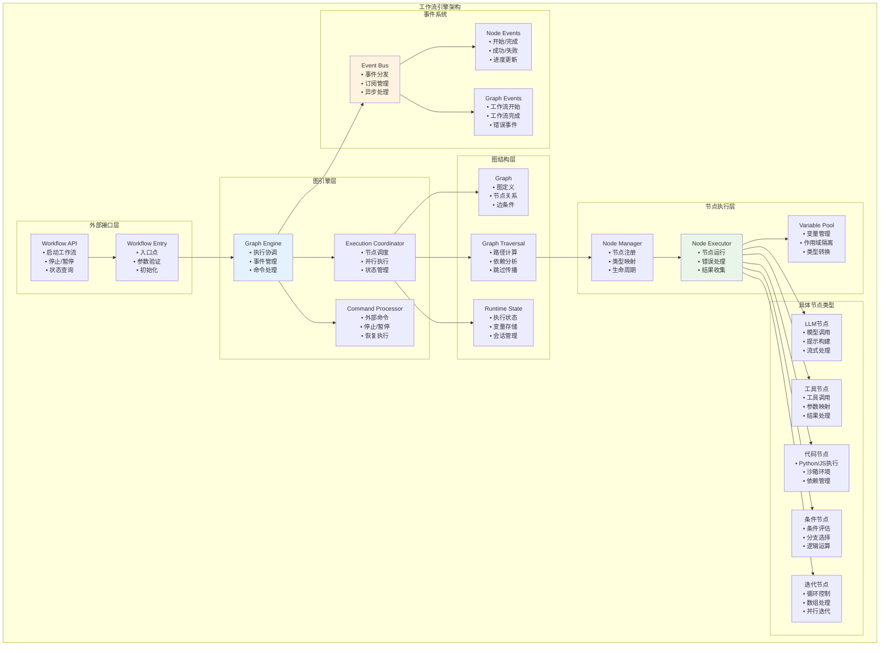
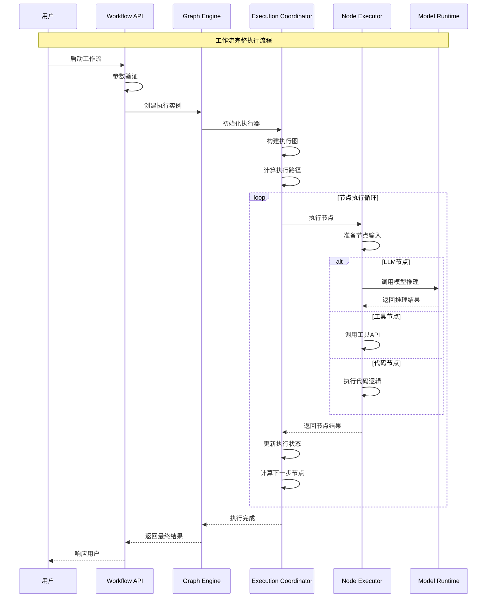
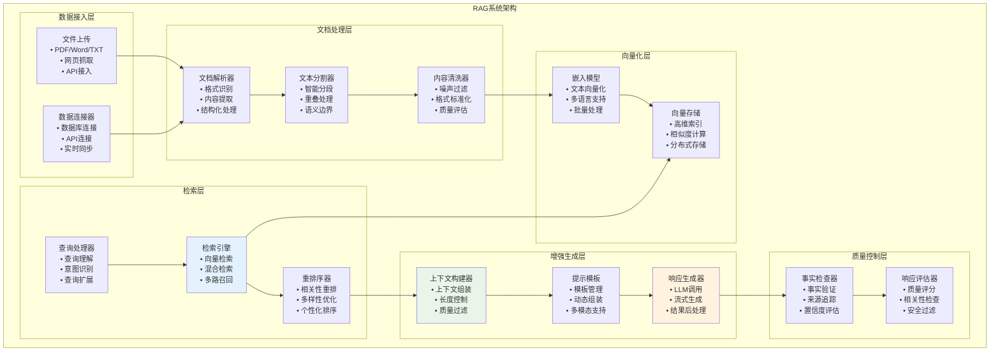
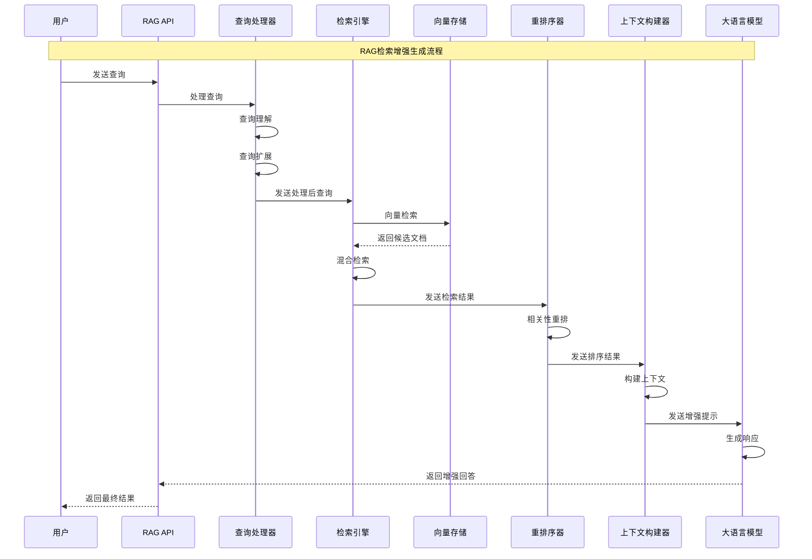
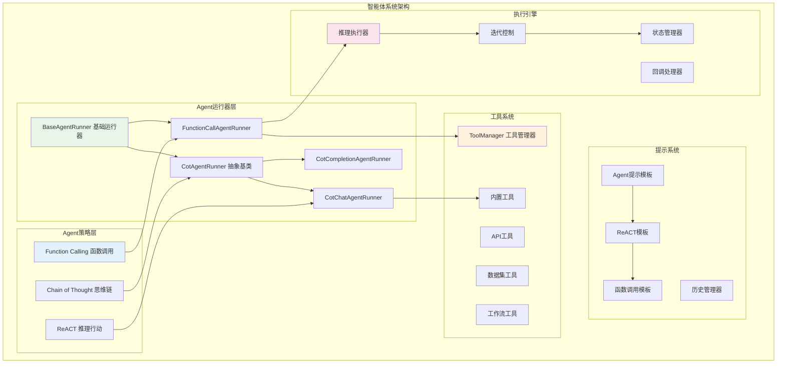
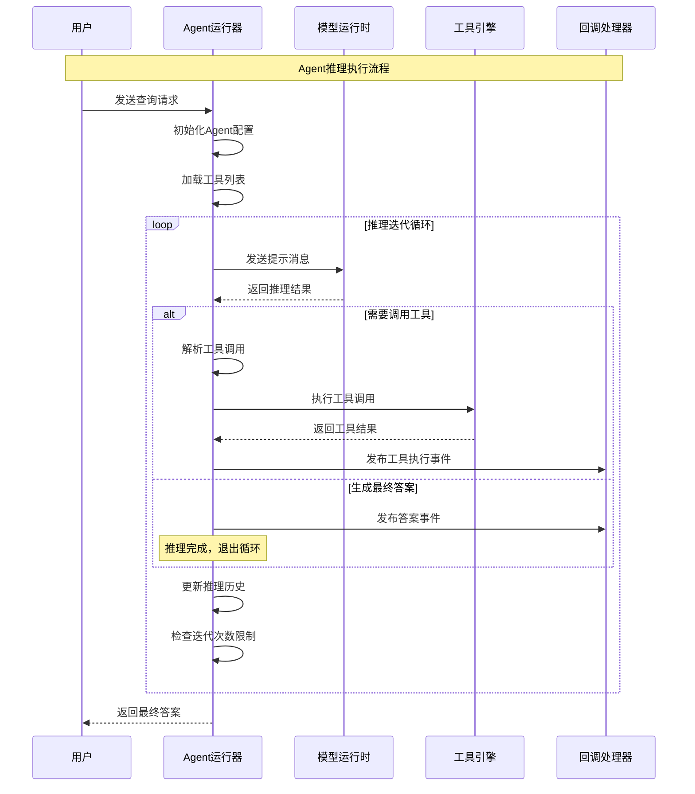
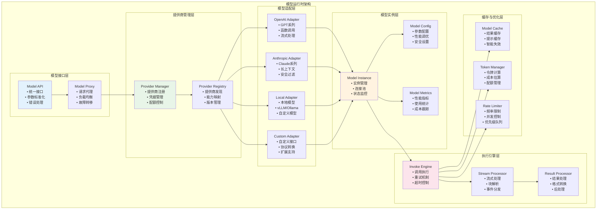
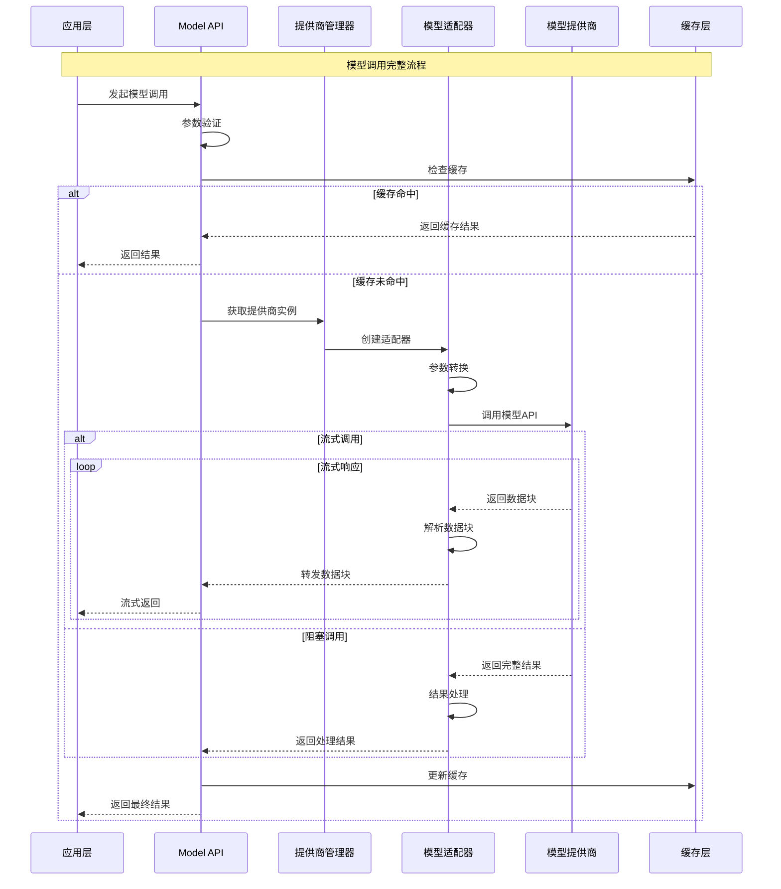
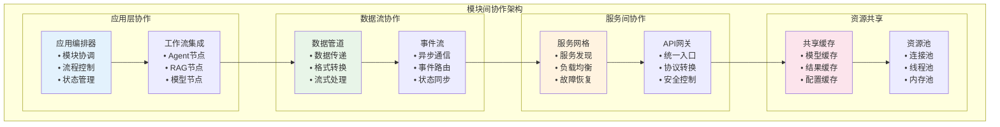

## 概述

本文档深入分析Dify平台的四大核心模块：工作流引擎、RAG系统、智能体系统和模型运行时。通过架构图、时序图和关键代码分析，全面解析各模块的设计理念、实现细节和交互机制。

<!--more-->

## 1. 工作流引擎模块 (Workflow Engine)

### 1.1 模块架构图



### 1.2 工作流执行时序



### 1.3 核心实现代码

```python
class GraphEngine:
    """工作流图引擎核心实现"""
    
    def __init__(self):
        self.execution_coordinator = ExecutionCoordinator()
        self.command_processor = CommandProcessor()
        self.event_bus = EventBus()
        
    def run(self, graph: Graph, inputs: dict) -> Generator:
        """
        执行工作流图
        
        Args:
            graph: 工作流图定义
            inputs: 输入参数
            
        Yields:
            执行过程中的事件流
        """
        try:
            # 1. 初始化执行状态
            execution_state = RuntimeState(
                graph=graph,
                inputs=inputs,
                variables=VariablePool()
            )
            
            # 2. 发布开始事件
            self.event_bus.publish(GraphStartEvent(
                graph_id=graph.id,
                inputs=inputs
            ))
            
            # 3. 执行工作流
            yield from self.execution_coordinator.execute(
                graph=graph,
                state=execution_state,
                event_bus=self.event_bus
            )
            
            # 4. 发布完成事件
            self.event_bus.publish(GraphCompleteEvent(
                graph_id=graph.id,
                outputs=execution_state.outputs
            ))
            
        except Exception as e:
            # 发布错误事件
            self.event_bus.publish(GraphErrorEvent(
                graph_id=graph.id,
                error=str(e)
            ))
            raise

class ExecutionCoordinator:
    """执行协调器"""
    
    def __init__(self):
        self.node_manager = NodeManager()
        self.graph_traversal = GraphTraversal()
        
    def execute(self, graph: Graph, state: RuntimeState, event_bus: EventBus):
        """协调执行工作流"""
        
        # 1. 计算执行路径
        execution_path = self.graph_traversal.calculate_path(graph)
        
        # 2. 按路径执行节点
        for node_batch in execution_path:
            # 并行执行同一批次的节点
            futures = []
            for node in node_batch:
                if self._should_execute_node(node, state):
                    future = self._execute_node_async(node, state, event_bus)
                    futures.append(future)
            
            # 等待批次完成
            for future in futures:
                yield from future
                
    def _execute_node_async(self, node: Node, state: RuntimeState, event_bus: EventBus):
        """异步执行单个节点"""
        
        # 发布节点开始事件
        event_bus.publish(NodeStartEvent(node_id=node.id))
        
        try:
            # 获取节点执行器
            executor = self.node_manager.get_executor(node.type)
            
            # 准备节点输入
            node_inputs = self._prepare_node_inputs(node, state)
            
            # 执行节点
            result = executor.execute(node, node_inputs)
            
            # 更新状态
            state.update_node_result(node.id, result)
            
            # 发布节点完成事件
            event_bus.publish(NodeCompleteEvent(
                node_id=node.id,
                result=result
            ))
            
            yield result
            
        except Exception as e:
            # 发布节点错误事件
            event_bus.publish(NodeErrorEvent(
                node_id=node.id,
                error=str(e)
            ))
            raise

class LLMNodeExecutor(NodeExecutor):
    """LLM节点执行器"""
    
    def execute(self, node: LLMNode, inputs: dict) -> dict:
        """执行LLM节点"""
        
        # 1. 构建提示
        prompt = self._build_prompt(node, inputs)
        
        # 2. 获取模型配置
        model_config = self._get_model_config(node)
        
        # 3. 调用模型
        model_runtime = ModelRuntimeManager.get_runtime(
            provider=model_config.provider,
            model=model_config.model
        )
        
        # 4. 执行推理
        if node.stream:
            # 流式处理
            result_chunks = []
            for chunk in model_runtime.invoke_stream(
                prompt=prompt,
                parameters=model_config.parameters
            ):
                result_chunks.append(chunk)
                yield chunk
            
            # 合并结果
            final_result = self._merge_chunks(result_chunks)
        else:
            # 阻塞处理
            final_result = model_runtime.invoke(
                prompt=prompt,
                parameters=model_config.parameters
            )
        
        return {
            'output': final_result.content,
            'usage': final_result.usage,
            'model': model_config.model
        }
```

## 2. RAG系统模块

### 2.1 RAG架构图



### 2.2 RAG检索时序



### 2.3 RAG核心实现

```python
class RAGEngine:
    """RAG检索增强生成引擎"""
    
    def __init__(self):
        self.query_processor = QueryProcessor()
        self.retrieval_engine = RetrievalEngine()
        self.reranker = Reranker()
        self.context_builder = ContextBuilder()
        self.response_generator = ResponseGenerator()
        
    def query(self, query: str, dataset_ids: List[str], config: RAGConfig) -> RAGResult:
        """
        执行RAG查询
        
        Args:
            query: 用户查询
            dataset_ids: 数据集ID列表
            config: RAG配置
            
        Returns:
            RAG查询结果
        """
        
        # 1. 查询处理
        processed_query = self.query_processor.process(query, config)
        
        # 2. 文档检索
        retrieved_docs = self.retrieval_engine.retrieve(
            query=processed_query,
            dataset_ids=dataset_ids,
            top_k=config.retrieval_config.top_k,
            score_threshold=config.retrieval_config.score_threshold
        )
        
        # 3. 重排序
        if config.reranking_config.enabled:
            reranked_docs = self.reranker.rerank(
                query=processed_query,
                documents=retrieved_docs,
                config=config.reranking_config
            )
        else:
            reranked_docs = retrieved_docs
        
        # 4. 构建上下文
        context = self.context_builder.build(
            query=query,
            documents=reranked_docs,
            config=config.context_config
        )
        
        # 5. 生成响应
        response = self.response_generator.generate(
            context=context,
            config=config.generation_config
        )
        
        return RAGResult(
            query=query,
            documents=reranked_docs,
            context=context,
            response=response,
            metadata={
                'retrieval_count': len(retrieved_docs),
                'reranked_count': len(reranked_docs),
                'context_length': len(context)
            }
        )

class RetrievalEngine:
    """检索引擎实现"""
    
    def __init__(self):
        self.vector_store = VectorStoreManager()
        self.keyword_search = KeywordSearchEngine()
        
    def retrieve(self, query: str, dataset_ids: List[str], top_k: int, score_threshold: float) -> List[Document]:
        """
        混合检索实现
        
        Args:
            query: 查询文本
            dataset_ids: 数据集ID列表
            top_k: 返回文档数量
            score_threshold: 相关度阈值
            
        Returns:
            检索到的文档列表
        """
        
        # 1. 向量检索
        vector_results = self._vector_retrieve(query, dataset_ids, top_k * 2)
        
        # 2. 关键词检索
        keyword_results = self._keyword_retrieve(query, dataset_ids, top_k)
        
        # 3. 混合融合
        merged_results = self._merge_results(vector_results, keyword_results)
        
        # 4. 过滤和排序
        filtered_results = [
            doc for doc in merged_results 
            if doc.score >= score_threshold
        ]
        
        return filtered_results[:top_k]
    
    def _vector_retrieve(self, query: str, dataset_ids: List[str], top_k: int) -> List[Document]:
        """向量检索"""
        
        # 查询向量化
        query_vector = self.vector_store.embed_query(query)
        
        # 向量相似度搜索
        results = []
        for dataset_id in dataset_ids:
            dataset_results = self.vector_store.similarity_search(
                vector=query_vector,
                dataset_id=dataset_id,
                top_k=top_k // len(dataset_ids) + 1
            )
            results.extend(dataset_results)
        
        # 按相似度排序
        results.sort(key=lambda x: x.score, reverse=True)
        
        return results[:top_k]
    
    def _keyword_retrieve(self, query: str, dataset_ids: List[str], top_k: int) -> List[Document]:
        """关键词检索"""
        
        results = []
        for dataset_id in dataset_ids:
            dataset_results = self.keyword_search.search(
                query=query,
                dataset_id=dataset_id,
                top_k=top_k // len(dataset_ids) + 1
            )
            results.extend(dataset_results)
        
        # 按BM25分数排序
        results.sort(key=lambda x: x.bm25_score, reverse=True)
        
        return results[:top_k]
    
    def _merge_results(self, vector_results: List[Document], keyword_results: List[Document]) -> List[Document]:
        """融合检索结果"""
        
        # 使用RRF (Reciprocal Rank Fusion) 算法
        doc_scores = {}
        
        # 向量检索结果权重
        for rank, doc in enumerate(vector_results):
            doc_id = doc.id
            if doc_id not in doc_scores:
                doc_scores[doc_id] = {'doc': doc, 'score': 0}
            doc_scores[doc_id]['score'] += 1 / (rank + 1) * 0.7  # 向量检索权重0.7
        
        # 关键词检索结果权重
        for rank, doc in enumerate(keyword_results):
            doc_id = doc.id
            if doc_id not in doc_scores:
                doc_scores[doc_id] = {'doc': doc, 'score': 0}
            doc_scores[doc_id]['score'] += 1 / (rank + 1) * 0.3  # 关键词检索权重0.3
        
        # 按融合分数排序
        merged_docs = [
            item['doc'] for item in 
            sorted(doc_scores.values(), key=lambda x: x['score'], reverse=True)
        ]
        
        return merged_docs

class ContextBuilder:
    """上下文构建器"""
    
    def build(self, query: str, documents: List[Document], config: ContextConfig) -> str:
        """
        构建RAG上下文
        
        Args:
            query: 用户查询
            documents: 检索文档
            config: 上下文配置
            
        Returns:
            构建的上下文字符串
        """
        
        context_parts = []
        total_length = 0
        max_length = config.max_length
        
        # 添加查询信息
        if config.include_query:
            query_part = f"用户查询：{query}\n\n"
            context_parts.append(query_part)
            total_length += len(query_part)
        
        # 添加检索文档
        context_parts.append("相关文档：\n")
        total_length += len("相关文档：\n")
        
        for i, doc in enumerate(documents):
            # 构建文档片段
            doc_part = self._format_document(doc, i + 1, config)
            
            # 检查长度限制
            if total_length + len(doc_part) > max_length:
                if config.truncate_strategy == "cut":
                    # 截断当前文档
                    remaining_length = max_length - total_length
                    if remaining_length > 100:  # 至少保留100字符
                        truncated_doc = doc_part[:remaining_length] + "..."
                        context_parts.append(truncated_doc)
                break
            
            context_parts.append(doc_part)
            total_length += len(doc_part)
        
        return "".join(context_parts)
    
    def _format_document(self, doc: Document, index: int, config: ContextConfig) -> str:
        """格式化文档片段"""
        
        parts = [f"[文档{index}]"]
        
        # 添加元数据
        if config.include_metadata and doc.metadata:
            if doc.metadata.get('title'):
                parts.append(f"标题：{doc.metadata['title']}")
            if doc.metadata.get('source'):
                parts.append(f"来源：{doc.metadata['source']}")
            if config.include_score:
                parts.append(f"相关度：{doc.score:.3f}")
        
        # 添加内容
        parts.append(f"内容：{doc.content}")
        parts.append("")  # 空行分隔
        
        return "\n".join(parts)
```

## 3. 智能体系统模块 (Agent System)

### 3.1 Agent架构图



### 3.2 Agent推理时序



### 3.3 Agent核心实现

```python
class FunctionCallAgentRunner(BaseAgentRunner):
    """
    函数调用Agent运行器
    利用模型的原生函数调用能力执行工具调用
    """

    def run(self, message: Message, query: str, **kwargs: Any) -> Generator[LLMResultChunk, None, None]:
        """
        执行函数调用Agent推理流程
        
        Args:
            message: 消息对象
            query: 用户查询
            **kwargs: 其他参数
            
        Yields:
            LLMResultChunk: 流式推理结果
        """
        self.query = query
        app_generate_entity = self.application_generate_entity
        app_config = self.app_config

        # 1. 初始化工具系统
        tool_instances, prompt_messages_tools = self._init_prompt_tools()

        # 2. 设置推理参数
        iteration_step = 1
        max_iteration_steps = min(app_config.agent.max_iteration, 99) + 1
        
        # 推理状态控制
        function_call_state = True  # 是否需要继续工具调用
        llm_usage: Dict[str, Optional[LLMUsage]] = {"usage": None}
        final_answer = ""

        # 3. 主推理循环
        while function_call_state and iteration_step <= max_iteration_steps:
            function_call_state = False
            
            # 在最后一次迭代时移除工具，强制生成最终答案
            if iteration_step == max_iteration_steps:
                prompt_messages_tools = []

            # 创建思维记录
            agent_thought_id = self.create_agent_thought(
                message_id=message.id,
                message="",
                tool_name="",
                tool_input="",
                messages_ids=[]
            )

            # 4. 准备提示消息
            prompt_messages = self._organize_prompt_messages()
            self.recalc_llm_max_tokens(self.model_config, prompt_messages)

            # 5. 调用模型推理
            chunks = self.model_instance.invoke_llm(
                prompt_messages=prompt_messages,
                model_parameters=app_generate_entity.model_conf.parameters,
                tools=prompt_messages_tools,  # 传递工具定义
                stop=app_generate_entity.model_conf.stop,
                stream=self.stream_tool_call,
                user=self.user_id,
                callbacks=[],
            )

            # 6. 处理推理结果
            tool_calls: List[Tuple[str, str, Dict[str, Any]]] = []
            response = ""
            current_llm_usage = None

            if isinstance(chunks, Generator):
                # 流式处理
                for chunk in chunks:
                    # 处理工具调用
                    if chunk.delta.message.tool_calls:
                        function_call_state = True
                        self._handle_tool_calls_stream(chunk, tool_calls)
                    
                    # 处理文本响应
                    if chunk.delta.message.content:
                        response += chunk.delta.message.content
                        yield chunk

                    # 记录使用统计
                    if chunk.delta.usage:
                        current_llm_usage = chunk.delta.usage
            else:
                # 非流式处理
                if chunks.message.tool_calls:
                    function_call_state = True
                    tool_calls = self._extract_tool_calls(chunks.message.tool_calls)
                
                response = chunks.message.content or ""
                current_llm_usage = chunks.usage

            # 7. 执行工具调用
            if function_call_state and tool_calls:
                yield from self._execute_tool_calls(
                    tool_calls=tool_calls,
                    tool_instances=tool_instances,
                    agent_thought_id=agent_thought_id
                )
            
            # 8. 更新推理记录
            self.save_agent_thought(
                agent_thought_id=agent_thought_id,
                tool_name=";".join([call[0] for call in tool_calls]) if tool_calls else "",
                tool_input={call[0]: call[2] for call in tool_calls} if tool_calls else {},
                thought=response,
                observation="", # 工具执行结果会在_execute_tool_calls中更新
                answer=response if not function_call_state else "",
                messages_ids=[],
                llm_usage=current_llm_usage,
            )

            # 9. 更新使用统计
            if current_llm_usage:
                self._increase_usage(llm_usage, current_llm_usage)

            iteration_step += 1

        # 10. 返回最终结果
        if final_answer:
            yield self._create_final_answer_chunk(final_answer, llm_usage["usage"])

    def _execute_tool_calls(
        self, 
        tool_calls: List[Tuple[str, str, Dict[str, Any]]],
        tool_instances: Dict[str, Tool],
        agent_thought_id: str
    ) -> Generator[LLMResultChunk, None, None]:
        """
        执行工具调用列表
        
        Args:
            tool_calls: 工具调用列表 [(工具名, 调用ID, 参数)]
            tool_instances: 工具实例字典
            agent_thought_id: 思维记录ID
            
        Yields:
            LLMResultChunk: 工具执行结果流
        """
        tool_responses = {}
        
        for tool_name, call_id, arguments in tool_calls:
            if tool_name not in tool_instances:
                error_msg = f"工具 '{tool_name}' 不存在"
                tool_responses[tool_name] = error_msg
                logger.error(error_msg)
                continue

            try:
                # 获取工具实例
                tool_instance = tool_instances[tool_name]
                
                # 发布工具调用开始事件
                yield self._create_tool_start_chunk(tool_name, arguments)
                
                # 执行工具调用
                tool_result = tool_instance.invoke(
                    user_id=self.user_id,
                    tool_parameters=arguments
                )
                
                # 处理工具结果
                tool_response = self._format_tool_response(tool_result)
                tool_responses[tool_name] = tool_response
                
                # 发布工具执行结果事件
                yield self._create_tool_result_chunk(tool_name, tool_response)
                
            except Exception as e:
                error_msg = f"工具 '{tool_name}' 执行失败: {str(e)}"
                tool_responses[tool_name] = error_msg
                logger.exception(error_msg)
                
                # 发布工具执行错误事件
                yield self._create_tool_error_chunk(tool_name, error_msg)

        # 更新Agent思维记录中的工具执行结果
        self._update_agent_thought_with_tool_results(agent_thought_id, tool_responses)

class ToolManager:
    """工具管理器"""
    
    @staticmethod
    def get_agent_tool_runtime(
        tenant_id: str,
        app_id: str,
        agent_tool: AgentToolEntity,
        invoke_from: InvokeFrom
    ) -> Tool:
        """
        获取Agent工具运行时实例
        
        Args:
            tenant_id: 租户ID
            app_id: 应用ID
            agent_tool: Agent工具实体
            invoke_from: 调用来源
            
        Returns:
            Tool: 工具运行时实例
        """
        tool_type = agent_tool.tool_type
        
        if tool_type == AgentToolType.BUILTIN:
            # 内置工具
            return BuiltinToolManager.get_tool_runtime(
                provider=agent_tool.provider,
                tool_name=agent_tool.tool_name,
                tenant_id=tenant_id
            )
        elif tool_type == AgentToolType.API:
            # API工具
            return ApiToolManager.get_tool_runtime(
                tenant_id=tenant_id,
                tool_id=agent_tool.tool_id,
                invoke_from=invoke_from
            )
        elif tool_type == AgentToolType.WORKFLOW:
            # 工作流工具
            return WorkflowToolManager.get_tool_runtime(
                tenant_id=tenant_id,
                app_id=app_id,
                workflow_id=agent_tool.workflow_id,
                invoke_from=invoke_from
            )
        else:
            raise ValueError(f"不支持的工具类型: {tool_type}")
```

## 4. 模型运行时模块 (Model Runtime)

### 4.1 模型运行时架构



### 4.2 模型调用时序



### 4.3 模型运行时核心实现

```python
class ModelRuntimeManager:
    """模型运行时管理器"""
    
    def __init__(self):
        self.provider_manager = ProviderManager()
        self.model_cache = ModelCache()
        self.token_manager = TokenManager()
        self.rate_limiter = RateLimiter()
        
    def invoke_model(
        self,
        provider: str,
        model: str,
        credentials: dict,
        prompt_messages: List[PromptMessage],
        model_parameters: dict,
        tools: Optional[List[PromptMessageTool]] = None,
        stop: Optional[List[str]] = None,
        stream: bool = True,
        user: Optional[str] = None
    ) -> Union[LLMResult, Generator[LLMResultChunk, None, None]]:
        """
        调用模型进行推理
        
        Args:
            provider: 模型提供商
            model: 模型名称
            credentials: 认证凭据
            prompt_messages: 提示消息列表
            model_parameters: 模型参数
            tools: 工具定义列表
            stop: 停止词列表
            stream: 是否流式输出
            user: 用户标识
            
        Returns:
            模型推理结果或结果流
        """
        
        # 1. 参数验证
        self._validate_parameters(provider, model, prompt_messages, model_parameters)
        
        # 2. 获取模型实例
        model_instance = self.provider_manager.get_model_instance(
            provider=provider,
            model=model,
            credentials=credentials
        )
        
        # 3. 检查缓存
        cache_key = self._generate_cache_key(
            provider, model, prompt_messages, model_parameters, tools
        )
        
        if not stream:
            cached_result = self.model_cache.get(cache_key)
            if cached_result:
                return cached_result
        
        # 4. 频率限制检查
        if not self.rate_limiter.allow_request(provider, model, user):
            raise RateLimitExceededError(f"Rate limit exceeded for {provider}/{model}")
        
        # 5. 令牌计算和验证
        estimated_tokens = self.token_manager.estimate_tokens(
            prompt_messages, model_parameters
        )
        
        if not self.token_manager.check_quota(user, estimated_tokens):
            raise QuotaExceededError("Token quota exceeded")
        
        # 6. 执行模型调用
        try:
            if stream:
                # 流式调用
                result_stream = model_instance.invoke_stream(
                    prompt_messages=prompt_messages,
                    model_parameters=model_parameters,
                    tools=tools,
                    stop=stop,
                    user=user
                )
                
                # 包装流式结果以进行后处理
                return self._wrap_stream_result(
                    result_stream, cache_key, user, estimated_tokens
                )
            else:
                # 阻塞调用
                result = model_instance.invoke(
                    prompt_messages=prompt_messages,
                    model_parameters=model_parameters,
                    tools=tools,
                    stop=stop,
                    user=user
                )
                
                # 更新缓存和统计
                self.model_cache.set(cache_key, result)
                self.token_manager.record_usage(user, result.usage)
                
                return result
                
        except Exception as e:
            # 记录调用失败
            self.rate_limiter.record_failure(provider, model, user)
            raise ModelInvokeError(f"Model invocation failed: {str(e)}")
    
    def _wrap_stream_result(
        self, 
        result_stream: Generator[LLMResultChunk, None, None],
        cache_key: str,
        user: str,
        estimated_tokens: int
    ) -> Generator[LLMResultChunk, None, None]:
        """包装流式结果进行后处理"""
        
        accumulated_result = None
        total_usage = None
        
        try:
            for chunk in result_stream:
                # 累积结果用于缓存
                if accumulated_result is None:
                    accumulated_result = LLMResult(
                        model=chunk.model,
                        prompt_messages=[],
                        message=AssistantPromptMessage(content=""),
                        usage=LLMUsage.empty_usage()
                    )
                
                # 累积内容
                if chunk.delta.message.content:
                    accumulated_result.message.content += chunk.delta.message.content
                
                # 累积使用统计
                if chunk.delta.usage:
                    total_usage = chunk.delta.usage
                
                yield chunk
            
            # 流式结束后的处理
            if accumulated_result and total_usage:
                accumulated_result.usage = total_usage
                
                # 更新缓存（可选，根据策略决定）
                if self.model_cache.should_cache_stream_result(cache_key):
                    self.model_cache.set(cache_key, accumulated_result)
                
                # 记录使用统计
                self.token_manager.record_usage(user, total_usage)
                
        except Exception as e:
            logger.exception(f"Stream processing error: {e}")
            raise

class ModelAdapter:
    """模型适配器基类"""
    
    def __init__(self, provider_config: dict):
        self.provider_config = provider_config
        self.client = self._create_client()
        
    def invoke(
        self,
        prompt_messages: List[PromptMessage],
        model_parameters: dict,
        tools: Optional[List[PromptMessageTool]] = None,
        stop: Optional[List[str]] = None,
        user: Optional[str] = None
    ) -> LLMResult:
        """执行模型调用"""
        raise NotImplementedError
    
    def invoke_stream(
        self,
        prompt_messages: List[PromptMessage],
        model_parameters: dict,
        tools: Optional[List[PromptMessageTool]] = None,
        stop: Optional[List[str]] = None,
        user: Optional[str] = None
    ) -> Generator[LLMResultChunk, None, None]:
        """执行流式模型调用"""
        raise NotImplementedError
    
    def _create_client(self):
        """创建模型客户端"""
        raise NotImplementedError

class OpenAIAdapter(ModelAdapter):
    """OpenAI模型适配器"""
    
    def _create_client(self):
        """创建OpenAI客户端"""
        import openai
        return openai.OpenAI(
            api_key=self.provider_config['api_key'],
            base_url=self.provider_config.get('base_url'),
            timeout=self.provider_config.get('timeout', 60)
        )
    
    def invoke_stream(
        self,
        prompt_messages: List[PromptMessage],
        model_parameters: dict,
        tools: Optional[List[PromptMessageTool]] = None,
        stop: Optional[List[str]] = None,
        user: Optional[str] = None
    ) -> Generator[LLMResultChunk, None, None]:
        """OpenAI流式调用实现"""
        
        # 转换消息格式
        openai_messages = self._convert_prompt_messages(prompt_messages)
        
        # 转换工具格式
        openai_tools = self._convert_tools(tools) if tools else None
        
        # 构建请求参数
        request_params = {
            'model': model_parameters.get('model'),
            'messages': openai_messages,
            'stream': True,
            'user': user,
            **self._convert_model_parameters(model_parameters)
        }
        
        if openai_tools:
            request_params['tools'] = openai_tools
        
        if stop:
            request_params['stop'] = stop
        
        # 执行流式调用
        try:
            response = self.client.chat.completions.create(**request_params)
            
            for chunk in response:
                # 转换OpenAI响应格式为内部格式
                llm_chunk = self._convert_openai_chunk(chunk)
                if llm_chunk:
                    yield llm_chunk
                    
        except Exception as e:
            raise ModelInvokeError(f"OpenAI API call failed: {str(e)}")
    
    def _convert_prompt_messages(self, prompt_messages: List[PromptMessage]) -> List[dict]:
        """转换提示消息格式"""
        openai_messages = []
        
        for message in prompt_messages:
            if isinstance(message, SystemPromptMessage):
                openai_messages.append({
                    'role': 'system',
                    'content': message.content
                })
            elif isinstance(message, UserPromptMessage):
                openai_messages.append({
                    'role': 'user',
                    'content': message.content
                })
            elif isinstance(message, AssistantPromptMessage):
                openai_messages.append({
                    'role': 'assistant',
                    'content': message.content
                })
        
        return openai_messages
    
    def _convert_tools(self, tools: List[PromptMessageTool]) -> List[dict]:
        """转换工具定义格式"""
        openai_tools = []
        
        for tool in tools:
            openai_tool = {
                'type': 'function',
                'function': {
                    'name': tool.name,
                    'description': tool.description,
                    'parameters': tool.parameters
                }
            }
            openai_tools.append(openai_tool)
        
        return openai_tools
    
    def _convert_openai_chunk(self, chunk) -> Optional[LLMResultChunk]:
        """转换OpenAI响应块为内部格式"""
        if not chunk.choices:
            return None
        
        choice = chunk.choices[0]
        delta = choice.delta
        
        # 构建内部消息格式
        message_delta = AssistantPromptMessage(content="")
        
        if hasattr(delta, 'content') and delta.content:
            message_delta.content = delta.content
        
        # 处理工具调用
        tool_calls = []
        if hasattr(delta, 'tool_calls') and delta.tool_calls:
            for tool_call in delta.tool_calls:
                if tool_call.function:
                    tool_calls.append(ToolCall(
                        id=tool_call.id,
                        function=ToolCallFunction(
                            name=tool_call.function.name,
                            arguments=tool_call.function.arguments
                        )
                    ))
        
        if tool_calls:
            message_delta.tool_calls = tool_calls
        
        # 构建使用统计
        usage = None
        if hasattr(chunk, 'usage') and chunk.usage:
            usage = LLMUsage(
                prompt_tokens=chunk.usage.prompt_tokens,
                completion_tokens=chunk.usage.completion_tokens,
                total_tokens=chunk.usage.total_tokens
            )
        
        return LLMResultChunk(
            model=chunk.model,
            delta=LLMResultChunkDelta(
                index=choice.index,
                message=message_delta,
                usage=usage,
                finish_reason=choice.finish_reason
            )
        )
```

## 5. 模块间协作机制

### 5.1 模块协作架构



### 5.2 典型协作场景

```python
class ModuleCollaborationExample:
    """模块协作示例：智能客服系统"""
    
    def __init__(self):
        self.workflow_engine = WorkflowEngine()
        self.rag_engine = RAGEngine()
        self.agent_system = AgentSystem()
        self.model_runtime = ModelRuntimeManager()
    
    async def handle_customer_query(self, query: str, user_id: str) -> dict:
        """
        处理客户查询的完整流程
        展示四大模块的协作
        """
        
        # 1. 工作流引擎：启动客服工作流
        workflow_result = await self.workflow_engine.execute(
            workflow_id="customer_service_flow",
            inputs={
                "user_query": query,
                "user_id": user_id
            }
        )
        
        # 工作流中的各个节点会调用其他模块：
        
        # 2. RAG系统：检索相关知识
        rag_context = await self.rag_engine.retrieve(
            query=query,
            dataset_ids=["customer_faq", "product_manual"],
            config=RAGConfig(
                top_k=5,
                score_threshold=0.7,
                reranking_enabled=True
            )
        )
        
        # 3. Agent系统：智能决策和工具调用
        agent_response = await self.agent_system.process(
            query=query,
            context=rag_context,
            available_tools=[
                "order_lookup",
                "refund_process", 
                "technical_support"
            ]
        )
        
        # 4. 模型运行时：生成最终回复
        final_response = await self.model_runtime.invoke_model(
            provider="openai",
            model="gpt-4",
            prompt_messages=[
                SystemPromptMessage(content="你是专业的客服助手"),
                UserPromptMessage(content=f"""
                用户问题：{query}
                
                知识库信息：
                {rag_context}
                
                Agent分析：
                {agent_response}
                
                请生成专业、友好的客服回复。
                """)
            ],
            model_parameters={
                "temperature": 0.1,
                "max_tokens": 1000
            }
        )
        
        return {
            "response": final_response.message.content,
            "workflow_id": workflow_result.id,
            "rag_sources": rag_context.sources,
            "agent_actions": agent_response.actions,
            "model_usage": final_response.usage
        }
```

## 6. 性能优化与监控

### 6.1 性能优化策略

```python
class ModulePerformanceOptimizer:
    """模块性能优化器"""
    
    def __init__(self):
        self.cache_manager = CacheManager()
        self.connection_pool = ConnectionPoolManager()
        self.resource_monitor = ResourceMonitor()
    
    def optimize_workflow_performance(self):
        """工作流性能优化"""
        return {
            "并行执行": "同一层级节点并行处理",
            "智能缓存": "节点结果缓存和复用",
            "资源预热": "提前加载常用模型和工具",
            "流式处理": "支持流式输入输出",
            "懒加载": "按需加载节点和资源"
        }
    
    def optimize_rag_performance(self):
        """RAG性能优化"""
        return {
            "向量缓存": "查询向量和文档向量缓存",
            "索引优化": "分层索引和增量更新",
            "批量处理": "批量向量化和检索",
            "预计算": "热门查询结果预计算",
            "压缩存储": "向量压缩和稀疏存储"
        }
    
    def optimize_agent_performance(self):
        """Agent性能优化"""
        return {
            "工具预加载": "常用工具提前初始化",
            "推理缓存": "相似推理路径缓存",
            "并行工具调用": "支持多工具并行执行",
            "智能路由": "根据查询类型选择策略",
            "状态复用": "推理状态跨会话复用"
        }
    
    def optimize_model_performance(self):
        """模型性能优化"""
        return {
            "连接池": "模型API连接池管理",
            "请求批处理": "多请求批量处理",
            "结果缓存": "模型输出智能缓存",
            "负载均衡": "多提供商负载均衡",
            "预测性扩容": "基于负载预测扩容"
        }
```

### 6.2 监控指标体系

```python
class ModuleMonitoringSystem:
    """模块监控系统"""
    
    def collect_workflow_metrics(self) -> dict:
        """收集工作流指标"""
        return {
            "execution_time": "工作流执行时间分布",
            "node_performance": "各节点执行性能",
            "error_rate": "工作流错误率",
            "concurrency": "并发执行数量",
            "resource_usage": "资源使用情况"
        }
    
    def collect_rag_metrics(self) -> dict:
        """收集RAG指标"""
        return {
            "retrieval_latency": "检索延迟",
            "hit_rate": "缓存命中率",
            "relevance_score": "检索相关性分数",
            "index_size": "索引大小和增长",
            "query_throughput": "查询吞吐量"
        }
    
    def collect_agent_metrics(self) -> dict:
        """收集Agent指标"""
        return {
            "reasoning_steps": "推理步骤数量",
            "tool_usage": "工具使用统计",
            "success_rate": "任务成功率",
            "iteration_count": "平均迭代次数",
            "response_quality": "响应质量评分"
        }
    
    def collect_model_metrics(self) -> dict:
        """收集模型指标"""
        return {
            "api_latency": "API调用延迟",
            "token_usage": "令牌使用统计",
            "cost_tracking": "成本跟踪",
            "error_distribution": "错误分布",
            "provider_performance": "提供商性能对比"
        }
```

## 7. 总结

Dify的四大核心模块通过精心设计的架构实现了高效协作：

### 7.1 模块特点总结

1. **工作流引擎**：图执行、事件驱动、可视化编排
2. **RAG系统**：混合检索、智能重排、上下文优化
3. **智能体系统**：多策略推理、工具集成、自主决策
4. **模型运行时**：统一接口、多提供商、性能优化

### 7.2 协作优势

1. **松耦合设计**：模块间通过标准接口通信
2. **事件驱动**：异步处理提升系统响应性
3. **资源共享**：缓存、连接池等资源统一管理
4. **可扩展性**：支持模块独立扩展和升级

### 7.3 技术创新

1. **蜂巢架构**：模块化设计理念
2. **混合检索**：向量+关键词检索融合
3. **多策略Agent**：函数调用+思维链策略
4. **统一运行时**：多模型提供商统一接口

通过这套核心模块架构，Dify平台为AI应用开发提供了强大而灵活的技术基础。

---

*最后更新时间：2025-01-27*  
*文档版本：v1.0*  
*维护者：Dify核心模块团队*
