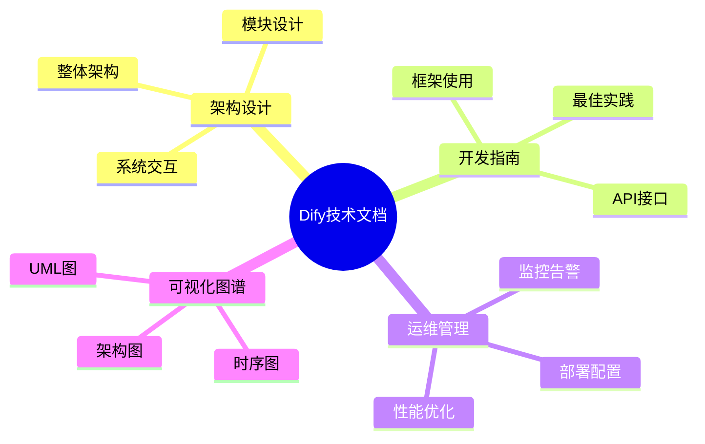
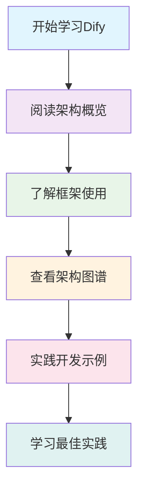
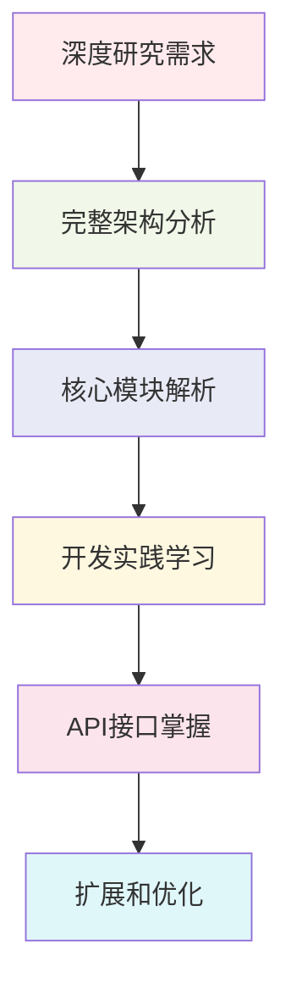
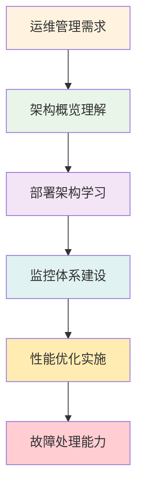

## 概述

本文档索引提供了Dify平台完整技术文档的导航和概览，帮助开发者、架构师和运维人员快速找到所需的技术资料。

<!--more-->

## 📚 文档结构总览

Dify技术文档体系按照从宏观到微观、从理论到实践的原则组织，涵盖架构设计、开发实践、运维管理等各个方面。

## 📖 文档清单

### 1. 架构设计文档

#### 📄 [dify-architecture-complete.md](/posts/dify-architecture-complete/)
**完整架构指南**
- **内容**：系统概览、深度设计、蜂巢架构、安全架构、性能架构、部署架构
- **适用人群**：架构师、技术负责人、系统设计师
- **核心价值**：
  - 全面理解Dify架构设计理念
  - 掌握蜂巢架构的创新思路
  - 学习大型AI平台的设计模式
  - 为类似系统设计提供参考

### 2. 核心模块文档

#### 📄 [dify-core-modules.md](/posts/dify-core-modules/)
**核心模块深度解析**
- **内容**：工作流引擎、RAG系统、智能体系统、模型运行时的详细分析
- **适用人群**：模块开发者、系统架构师、AI工程师
- **核心价值**：
  - 深入理解四大核心模块设计
  - 掌握模块间的协作机制
  - 为模块扩展和优化提供指导
  - 学习AI系统的工程化实践

### 3. 开发实践文档

#### 📄 [dify-development-guide.md](/posts/dify-development-guide/)
**开发实践指南**
- **内容**：环境搭建、框架使用、应用开发、性能优化、安全实践、监控运维
- **适用人群**：前后端开发者、全栈工程师、运维工程师
- **核心价值**：
  - 快速上手Dify开发
  - 掌握标准的开发流程
  - 学习最佳实践和优化技巧
  - 建立完善的运维体系

### 4. API参考文档

#### 📄 [dify-api-reference.md](/posts/dify-api-reference/)
**API参考手册**
- **内容**：Service API、Console API、Web API的完整接口文档
- **适用人群**：API集成开发者、第三方开发者、前端开发者
- **核心价值**：
  - 理解API设计思路
  - 掌握接口调用方法
  - 学习API安全和性能优化
  - 快速集成Dify功能

### 5. 文档导航索引

#### 📄 [dify-documentation-index.md](/posts/dify-documentation-index/) *(当前文档)*
**文档索引导航**
- **内容**：完整的文档导航、学习路径、使用建议
- **适用人群**：所有用户
- **核心价值**：
  - 快速找到所需文档
  - 规划学习路径
  - 提升文档使用效率

## 🎯 学习路径建议

### 新手入门路径

**推荐阅读顺序**：
1. **dify-architecture-complete.md** - 建立整体认知
2. **dify-development-guide.md** - 学习开发方法
3. **dify-core-modules.md** - 理解核心模块
4. **dify-api-reference.md** - 掌握接口使用

### 深度研究路径

**推荐阅读顺序**：
1. **dify-architecture-complete.md** - 深入架构设计
2. **dify-core-modules.md** - 理解核心模块
3. **dify-development-guide.md** - 掌握开发技能
4. **dify-api-reference.md** - 学习接口集成

### 运维管理路径

**推荐阅读顺序**：
1. **dify-architecture-complete.md** - 理解系统架构
2. **dify-development-guide.md** - 学习运维实践
3. **dify-core-modules.md** - 了解模块特性
4. **dify-api-reference.md** - 掌握接口监控

## 🔍 文档内容矩阵

| 文档 | 架构设计 | 开发实践 | 运维管理 | 可视化 | 难度等级 |
|------|----------|----------|----------|--------|----------|
| dify-architecture-complete.md | ⭐⭐⭐⭐⭐ | ⭐⭐⭐ | ⭐⭐⭐⭐ | ⭐⭐⭐⭐⭐ | 高级 |
| dify-core-modules.md | ⭐⭐⭐⭐ | ⭐⭐⭐⭐⭐ | ⭐⭐⭐ | ⭐⭐⭐ | 高级 |
| dify-development-guide.md | ⭐⭐⭐ | ⭐⭐⭐⭐⭐ | ⭐⭐⭐⭐ | ⭐⭐⭐ | 中级 |
| dify-api-reference.md | ⭐⭐ | ⭐⭐⭐⭐⭐ | ⭐⭐ | ⭐⭐ | 中级 |
| dify-documentation-index.md | ⭐ | ⭐ | ⭐ | ⭐⭐⭐⭐⭐ | 入门 |

## 📋 快速查找指南

### 按角色查找

#### 🏗️ 架构师
- **主要关注**：系统设计、技术选型、扩展性
- **推荐文档**：
  - `dify-architecture-complete.md` - 完整架构分析
  - `dify-core-modules.md` - 核心模块设计
  - `dify-development-guide.md` - 架构实践指南

#### 👨‍💻 开发工程师
- **主要关注**：开发实践、API使用、代码规范
- **推荐文档**：
  - `dify-development-guide.md` - 开发实践指南
  - `dify-api-reference.md` - API接口详解
  - `dify-core-modules.md` - 模块开发指南

#### 🔧 运维工程师
- **主要关注**：部署配置、监控告警、性能优化
- **推荐文档**：
  - `dify-architecture-complete.md` - 系统架构概览
  - `dify-development-guide.md` - 运维最佳实践
  - `dify-api-reference.md` - 接口监控指南

#### 🎯 产品经理
- **主要关注**：功能理解、技术可行性、系统能力
- **推荐文档**：
  - `dify-architecture-complete.md` - 系统功能概览
  - `dify-core-modules.md` - 功能模块分析
  - `dify-development-guide.md` - 应用开发指南

### 按主题查找

#### 🏛️ 架构设计
- **系统架构**：`dify-architecture-complete.md`
- **模块设计**：`dify-core-modules.md`
- **可视化**：`dify-architecture-complete.md` → 架构图表章节

#### 💻 开发实践
- **框架使用**：`dify-development-guide.md`
- **API开发**：`dify-api-reference.md`
- **最佳实践**：`dify-development-guide.md`

#### ⚡ 性能优化
- **数据库优化**：`dify-development-guide.md` → 性能优化章节
- **缓存策略**：`dify-development-guide.md` → 缓存优化章节
- **架构优化**：`dify-architecture-complete.md` → 性能设计章节

#### 🔒 安全防护
- **API安全**：`dify-development-guide.md` → 安全最佳实践
- **数据安全**：`dify-development-guide.md` → 数据安全章节
- **架构安全**：`dify-architecture-complete.md` → 安全设计章节

#### 📊 监控运维
- **监控体系**：`dify-development-guide.md` → 监控与运维章节
- **部署架构**：`dify-architecture-complete.md` → 部署架构图
- **运维实践**：`dify-development-guide.md` → 运维最佳实践

## 🚀 使用建议

### 文档阅读技巧

1. **循序渐进**：按照推荐的学习路径阅读，避免跳跃式学习
2. **结合实践**：理论学习与实际操作相结合
3. **重点标记**：标记重要概念和实践要点
4. **定期回顾**：定期回顾已学内容，加深理解

### 文档更新机制

1. **版本控制**：所有文档都有版本标识和更新时间
2. **持续更新**：随着Dify平台的发展持续更新文档内容
3. **反馈机制**：欢迎提供文档改进建议和错误反馈
4. **社区贡献**：鼓励社区贡献优质内容和最佳实践

### 扩展学习资源

1. **官方文档**：结合Dify官方文档学习
2. **源码阅读**：深入阅读Dify源码理解实现细节
3. **社区交流**：参与技术社区讨论和经验分享
4. **实践项目**：通过实际项目加深理解和应用

## 📈 文档价值总结

### 对个人的价值

1. **技能提升**：全面提升AI平台开发和架构设计能力
2. **职业发展**：为技术进阶和职业发展提供知识基础
3. **问题解决**：快速定位和解决开发运维中的问题
4. **最佳实践**：学习业界领先的技术实践和设计模式

### 对团队的价值

1. **知识共享**：建立团队统一的技术认知和标准
2. **开发效率**：提高开发效率和代码质量
3. **架构一致性**：保持系统架构的一致性和可维护性
4. **人才培养**：为新成员提供系统的学习资料

### 对组织的价值

1. **技术积累**：沉淀组织的技术知识和经验
2. **标准化**：建立技术标准和开发规范
3. **风险控制**：降低技术风险和维护成本
4. **创新能力**：为技术创新提供坚实基础

## 🎉 结语

这套Dify技术文档体系旨在为所有使用和开发Dify平台的技术人员提供全面、深入、实用的技术指南。通过系统化的学习和实践，相信每位读者都能在AI平台开发的道路上取得更大的成就。

**持续改进**：我们将根据技术发展和用户反馈持续完善这套文档，让它成为Dify技术生态中最有价值的知识资产。

**社区贡献**：欢迎所有开发者贡献自己的经验和见解，共同建设更加完善的技术文档体系。

---

*最后更新时间：2025-01-27*  
*文档版本：v1.0*  
*维护者：Dify技术文档团队*
